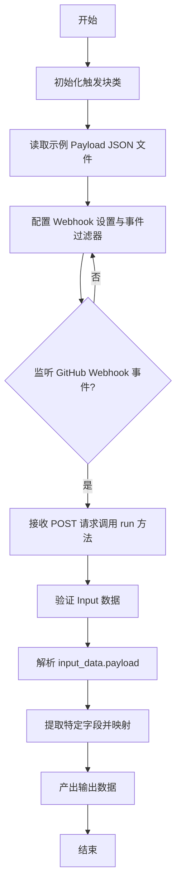
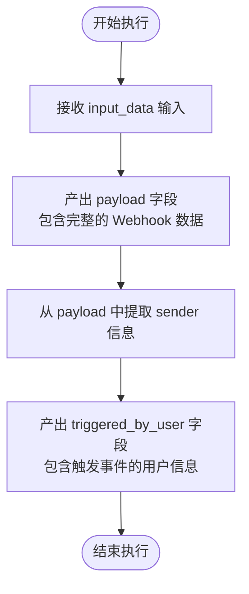
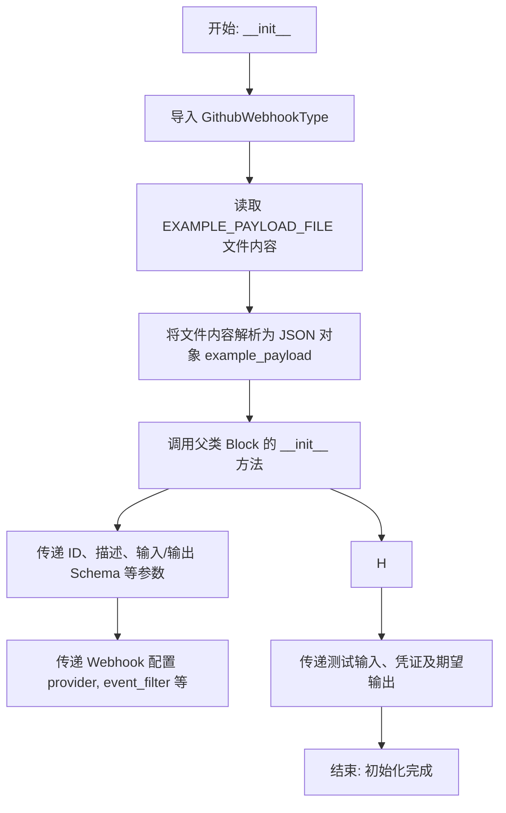
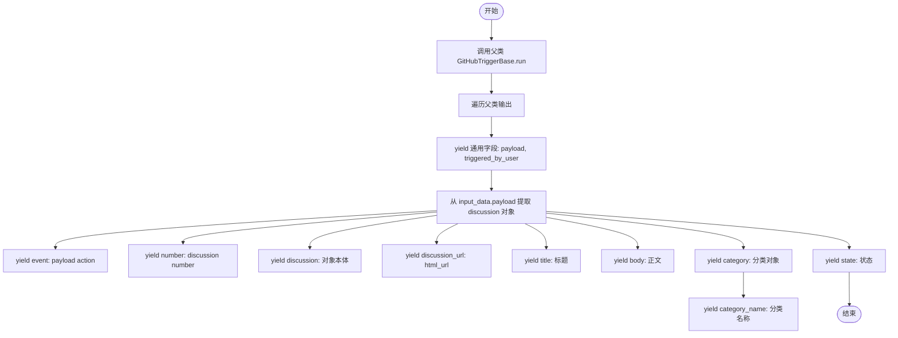

# `AutoGPT\autogpt_platform\backend\backend\blocks\github\triggers.py` 详细设计文档

该代码实现了一套基于 GitHub Webhook 的触发器模块，通过定义 `GitHubTriggerBase` 基类处理通用的认证和 Payload 解析逻辑，并派生出针对 Pull Requests、Stars、Releases、Issues 和 Discussions 的具体触发器类。每个触发器类配置了特定的输入输出模式、事件过滤器及示例数据，用于接收 GitHub 事件并将结构化数据传递给后续工作流。

## 整体流程



## 类结构

```
GitHubTriggerBase (基础逻辑类)
├── GithubPullRequestTriggerBlock (PR 事件触发)
├── GithubStarTriggerBlock (Star 事件触发)
├── GithubReleaseTriggerBlock (Release 事件触发)
├── GithubIssuesTriggerBlock (Issue 事件触发)
└── GithubDiscussionTriggerBlock (Discussion 事件触发)
```

## 全局变量及字段


### `logger`
    
The logger instance for the current module.

类型：`logging.Logger`
    


### `GitHubTriggerBase.Input`
    
Input schema defining credentials, repository, and payload fields for GitHub triggers.

类型：`type[BlockSchemaInput]`
    


### `GitHubTriggerBase.Output`
    
Output schema defining the payload, triggered user, and error message for GitHub triggers.

类型：`type[BlockSchemaOutput]`
    


### `GithubPullRequestTriggerBlock.EXAMPLE_PAYLOAD_FILE`
    
Path to the JSON file containing an example pull request event payload.

类型：`Path`
    


### `GithubPullRequestTriggerBlock.Input`
    
Input schema extending the base with filters for specific pull request events.

类型：`type[BlockSchemaInput]`
    


### `GithubPullRequestTriggerBlock.Output`
    
Output schema providing details about the triggered pull request event.

类型：`type[BlockSchemaOutput]`
    


### `GithubStarTriggerBlock.EXAMPLE_PAYLOAD_FILE`
    
Path to the JSON file containing an example star event payload.

类型：`Path`
    


### `GithubStarTriggerBlock.Input`
    
Input schema extending the base with filters for star creation or deletion events.

类型：`type[BlockSchemaInput]`
    


### `GithubStarTriggerBlock.Output`
    
Output schema providing details such as star count and timestamp for star events.

类型：`type[BlockSchemaOutput]`
    


### `GithubReleaseTriggerBlock.EXAMPLE_PAYLOAD_FILE`
    
Path to the JSON file containing an example release event payload.

类型：`Path`
    


### `GithubReleaseTriggerBlock.Input`
    
Input schema extending the base with filters for specific release events like published or created.

类型：`type[BlockSchemaInput]`
    


### `GithubReleaseTriggerBlock.Output`
    
Output schema providing detailed release information including assets and tag names.

类型：`type[BlockSchemaOutput]`
    


### `GithubIssuesTriggerBlock.EXAMPLE_PAYLOAD_FILE`
    
Path to the JSON file containing an example issue event payload.

类型：`Path`
    


### `GithubIssuesTriggerBlock.Input`
    
Input schema extending the base with filters for specific issue events like opened or closed.

类型：`type[BlockSchemaInput]`
    


### `GithubIssuesTriggerBlock.Output`
    
Output schema providing detailed issue information including labels, assignees, and state.

类型：`type[BlockSchemaOutput]`
    


### `GithubDiscussionTriggerBlock.EXAMPLE_PAYLOAD_FILE`
    
Path to the JSON file containing an example discussion event payload.

类型：`Path`
    


### `GithubDiscussionTriggerBlock.Input`
    
Input schema extending the base with filters for specific discussion events like created or answered.

类型：`type[BlockSchemaInput]`
    


### `GithubDiscussionTriggerBlock.Output`
    
Output schema providing detailed discussion information including category and content.

类型：`type[BlockSchemaOutput]`
    
    

## 全局函数及方法


### `GitHubTriggerBase.run`

处理 GitHub Webhook 基础触发逻辑的核心方法，负责提取并输出通用的 Webhook 负载数据及触发用户信息。

参数：

- `input_data`：`Input`，包含 GitHub 凭证、仓库名称以及完整的 Webhook 负载数据（`payload`）的输入对象。
- `**kwargs`：`Any`，传递给运行时方法的额外关键字参数。

返回值：`BlockOutput`，一个异步生成器，逐个产出包含数据名称和对应值的元组。

#### 流程图



#### 带注释源码

```python
    async def run(self, input_data: Input, **kwargs) -> BlockOutput:
        # 将接收到的完整 Webhook 负载作为 "payload" 输出
        # input_data.payload 包含了 GitHub 发送的所有事件数据
        yield "payload", input_data.payload
        
        # 从负载中提取 "sender" 字段，作为 "triggered_by_user" 输出
        # 该字段代表触发此次 GitHub 事件的用户信息
        yield "triggered_by_user", input_data.payload["sender"]
```


### `GithubPullRequestTriggerBlock.__init__`

`GithubPullRequestTriggerBlock` 的构造函数，负责初始化该块的各种配置，包括唯一标识符、描述、输入输出模式、Webhook 配置以及用于测试的模拟数据和凭证。该方法还会从文件系统中加载示例 Payload 以供测试使用。

参数：

- `self`：`GithubPullRequestTriggerBlock`，表示类的实例本身。

返回值：`None`，该方法没有返回值，主要用于初始化对象状态。

#### 流程图



#### 带注释源码

```python
def __init__(self):
    # 延迟导入，避免循环依赖或减少启动时的导入开销
    from backend.integrations.webhooks.github import GithubWebhookType

    # 从类变量定义的路径读取示例 Payload 文件，并解析为字典
    # 这个 example_payload 将用于配置测试输入和期望输出
    example_payload = json.loads(
        self.EXAMPLE_PAYLOAD_FILE.read_text(encoding="utf-8")
    )

    # 调用父类 Block 的初始化方法，配置该触发块的核心元数据和行为
    super().__init__(
        # 块的唯一标识符
        id="6c60ec01-8128-419e-988f-96a063ee2fea",
        # 块的功能描述
        description="This block triggers on pull request events and outputs the event type and payload.",
        # 块的分类标签
        categories={BlockCategory.DEVELOPER_TOOLS, BlockCategory.INPUT},
        # 定义输入数据的 Schema 结构
        input_schema=GithubPullRequestTriggerBlock.Input,
        # 定义输出数据的 Schema 结构
        output_schema=GithubPullRequestTriggerBlock.Output,
        # 配置 Webhook 相关设置
        webhook_config=BlockWebhookConfig(
            provider=ProviderName.GITHUB,          # 指定提供方为 GitHub
            webhook_type=GithubWebhookType.REPO,   # 指定 Webhook 类型为仓库级别
            resource_format="{repo}",              # 资源格式字符串
            event_filter_input="events",           # 用于过滤事件的输入字段名
            event_format="pull_request.{event}",   # 事件名称格式
        ),
        # 定义测试用的输入数据，包含凭证、Repo 信息和加载的 Payload
        test_input={
            "repo": "Significant-Gravitas/AutoGPT",
            "events": {"opened": True, "synchronize": True},
            "credentials": TEST_CREDENTIALS_INPUT,
            "payload": example_payload,
        },
        # 定义测试用的凭证
        test_credentials=TEST_CREDENTIALS,
        # 定义预期的测试输出列表，用于验证逻辑正确性
        test_output=[
            ("payload", example_payload),
            ("triggered_by_user", example_payload["sender"]),
            ("event", example_payload["action"]),
            ("number", example_payload["number"]),
            ("pull_request", example_payload["pull_request"]),
            ("pull_request_url", example_payload["pull_request"]["html_url"]),
        ],
    )
```


### `GithubPullRequestTriggerBlock.run`

该方法负责处理 GitHub Pull Request 事件的触发逻辑。它首先调用父类方法以输出通用的载荷和触发者信息，随后解析特定于 Pull Request 的载荷数据，输出事件类型、PR 编号、PR 详细对象以及 PR 的 URL。

参数：

- `input_data`: `Input`, 包含 GitHub 仓库凭证、订阅事件配置以及接收到的完整 Webhook 载荷数据的输入对象。
- `**kwargs`: `Any`, 执行上下文传递的额外关键字参数（通常由执行引擎注入）。

返回值：`BlockOutput`, 异步生成器，逐步产出包含事件详情、PR 编号、PR 对象及 URL 等信息的键值对。

#### 流程图

```mermaid
flowchart TD
    Start([开始执行]) --> CallSuper[调用 super().run]
    
    CallSuper --> LoopBase[遍历父类生成器产出]
    LoopBase --> YieldBase[产出 payload 和 triggered_by_user]
    YieldBase --> ExtractAction[从载荷中提取 action 字段]
    
    ExtractAction --> YieldEvent[产出 event]
    YieldEvent --> ExtractNumber[从载荷中提取 number 字段]
    
    ExtractNumber --> YieldNumber[产出 number]
    YieldNumber --> ExtractPR[从载荷中提取 pull_request 对象]
    
    ExtractPR --> YieldPR[产出 pull_request]
    YieldPR --> ExtractURL[从 pull_request 对象中提取 html_url]
    
    ExtractURL --> YieldURL[产出 pull_request_url]
    YieldURL --> End([结束执行])
```

#### 带注释源码

```python
async def run(self, input_data: Input, **kwargs) -> BlockOutput:  # type: ignore
    # 调用父类 GitHubTriggerBase 的 run 方法
    # 该方法会产出 "payload" (完整载荷) 和 "triggered_by_user" (触发用户)
    async for name, value in super().run(input_data, **kwargs):
        yield name, value
    
    # 从载荷中提取 Pull Request 的具体动作类型（如 opened, closed, synchronize）
    yield "event", input_data.payload["action"]
    
    # 从载荷中提取 Pull Request 的编号
    yield "number", input_data.payload["number"]
    
    # 从载荷中提取完整的 Pull Request 对象
    yield "pull_request", input_data.payload["pull_request"]
    
    # 从 Pull Request 对象中提取并产出其 HTML URL
    yield "pull_request_url", input_data.payload["pull_request"]["html_url"]
```


### `GithubStarTriggerBlock.__init__`

该构造函数用于初始化 `GithubStarTriggerBlock` 实例，负责加载示例 Webhook Payload 数据，并配置块的元数据（如 ID、描述、类别）、输入输出 Schema、Webhook 配置以及测试数据，最终调用父类完成初始化。

参数：

- `self`：`GithubStarTriggerBlock`，类的实例本身

返回值：`None`，构造函数不返回任何值

#### 流程图

```mermaid
graph TD
    A[开始: __init__] --> B[导入 GithubWebhookType]
    B --> C[读取 self.EXAMPLE_PAYLOAD_FILE 指向的 JSON 文件]
    C --> D[解析 JSON 文本内容为 example_payload 字典]
    D --> E[调用 super().__init__ 初始化父类 Block]
    E --> E1[设置 id: 551e0a35...]
    E --> E2[设置 description 和 categories]
    E --> E3[设置 input_schema 和 output_schema]
    E --> E4[配置 webhook_config: provider=GITHUB, event_format=star.{event}]
    E --> E5[设置 test_input 和 test_output]
    E1 --> F[结束]
    E2 --> F
    E3 --> F
    E4 --> F
    E5 --> F
```

#### 带注释源码

```python
def __init__(self):
    # 导入必要的类型，用于配置 Webhook
    from backend.integrations.webhooks.github import GithubWebhookType

    # 读取预定义的 JSON 示例 Payload 文件（模拟 GitHub star 事件）
    example_payload = json.loads(
        self.EXAMPLE_PAYLOAD_FILE.read_text(encoding="utf-8")
    )

    # 调用父类 Block 的构造函数，传递详细的配置参数
    super().__init__(
        id="551e0a35-100b-49b7-89b8-3031322239b6",  # 块的唯一标识符
        description="This block triggers on GitHub star events. "
        "Useful for celebrating milestones (e.g., 1k, 10k stars) or tracking engagement.",
        categories={BlockCategory.DEVELOPER_TOOLS, BlockCategory.INPUT},  # 块的分类
        input_schema=GithubStarTriggerBlock.Input,  # 输入数据结构定义
        output_schema=GithubStarTriggerBlock.Output,  # 输出数据结构定义
        # 配置 Webhook 相关参数
        webhook_config=BlockWebhookConfig(
            provider=ProviderName.GITHUB,  # 提供商为 GitHub
            webhook_type=GithubWebhookType.REPO,  # Webhook 作用域为仓库级别
            resource_format="{repo}",  # 资源格式字符串
            event_filter_input="events",  # 用于过滤事件的输入字段名
            event_format="star.{event}",  # 事件格式字符串
        ),
        # 定义用于测试的输入数据
        test_input={
            "repo": "Significant-Gravitas/AutoGPT",
            "events": {"created": True},
            "credentials": TEST_CREDENTIALS_INPUT,
            "payload": example_payload,
        },
        # 定义用于测试的凭证
        test_credentials=TEST_CREDENTIALS,
        # 定义预期的测试输出结果，用于验证逻辑
        test_output=[
            ("payload", example_payload),
            ("triggered_by_user", example_payload["sender"]),
            ("event", example_payload["action"]),
            ("starred_at", example_payload.get("starred_at", "")),
            ("stargazers_count", example_payload["repository"]["stargazers_count"]),
            ("repository_name", example_payload["repository"]["full_name"]),
            ("repository_url", example_payload["repository"]["html_url"]),
        ],
    )
```


### `GithubStarTriggerBlock.run`

该方法是 `GithubStarTriggerBlock` 的核心执行逻辑，负责处理 GitHub star 事件的 webhook 输入数据，提取关键信息并将其转换为标准化的输出流，包括基础 payload、触发用户信息以及 star 事件的具体细节。

参数：

- `input_data`：`GithubStarTriggerBlock.Input`，包含 GitHub 凭据、仓库信息、事件过滤器以及完整的 webhook payload 数据。
- `kwargs`：`dict`，额外的关键字参数，通常由框架传递用于扩展上下文，当前方法中未直接使用。

返回值：`BlockOutput`，一个异步生成器，按顺序产出包含处理后的数据块，如 payload、触发用户、事件类型、star 时间戳及仓库统计信息等。

#### 流程图

```mermaid
graph TD
    A[开始执行 run 方法] --> B[调用父类 super().run]
    B --> C[异步遍历父类输出]
    C --> D[产出基础数据: payload, triggered_by_user]
    D --> E[提取 payload 中的 action 字段]
    E --> F[产出 'event']
    F --> G[提取 payload 中的 starred_at 字段]
    G --> H[产出 'starred_at']
    H --> I[提取 repository 中的 stargazers_count]
    I --> J[产出 'stargazers_count']
    J --> K[提取 repository 中的 full_name]
    K --> L[产出 'repository_name']
    L --> M[提取 repository 中的 html_url]
    M --> N[产出 'repository_url']
    N --> O[结束]
```

#### 带注释源码

```python
    async def run(self, input_data: Input, **kwargs) -> BlockOutput:  # type: ignore
        # 调用父类 GitHubTriggerBase 的 run 方法，产出通用的 payload 和触发用户信息
        async for name, value in super().run(input_data, **kwargs):
            yield name, value
        
        # 从 payload 中提取事件动作（例如 'created' 或 'deleted'）
        yield "event", input_data.payload["action"]
        
        # 提取 star 的时间戳，如果不存在则返回空字符串
        yield "starred_at", input_data.payload.get("starred_at", "")
        
        # 从 payload 的 repository 部分提取当前的 star 数量
        yield "stargazers_count", input_data.payload["repository"]["stargazers_count"]
        
        # 提取仓库的完整名称（格式通常为 owner/repo）
        yield "repository_name", input_data.payload["repository"]["full_name"]
        
        # 提取仓库的 HTML URL
        yield "repository_url", input_data.payload["repository"]["html_url"]
```


### `GithubReleaseTriggerBlock.__init__`

该方法是 `GithubReleaseTriggerBlock` 类的构造函数，负责初始化 GitHub Release 事件触发器块。它加载示例载荷数据，并调用父类构造函数配置块的元数据、输入输出模式、Webhook 配置以及用于测试的模拟数据和预期结果。

参数：

-   `self`：`GithubReleaseTriggerBlock`，类的实例本身。

返回值：`None`，构造函数无返回值。

#### 流程图

```mermaid
flowchart TD
    A[开始: __init__] --> B[导入 GithubWebhookType]
    B --> C[读取 EXAMPLE_PAYLOAD_FILE 文件]
    C --> D[将文件内容解析为 JSON example_payload]
    D --> E[调用 super().__init__]
    E --> F[设置块 ID 和描述信息]
    F --> G[配置 input_schema 和 output_schema]
    G --> H[配置 BlockWebhookConfig<br>provider, type, resource_format, etc.]
    H --> I[设置 test_input 和 test_credentials]
    I --> J[设置 test_output 预期数据列表]
    J --> K[结束: 初始化完成]
```

#### 带注释源码

```python
def __init__(self):
    # 延迟导入 GithubWebhookType，避免循环依赖
    from backend.integrations.webhooks.github import GithubWebhookType

    # 读取预定义的示例 Payload JSON 文件，用于测试和展示
    # 文件路径在类属性 EXAMPLE_PAYLOAD_FILE 中定义
    example_payload = json.loads(
        self.EXAMPLE_PAYLOAD_FILE.read_text(encoding="utf-8")
    )

    # 调用父类 Block 的初始化方法，配置该触发块的各种属性
    super().__init__(
        # 块的唯一标识符
        id="2052dd1b-74e1-46ac-9c87-c7a0e057b60b",
        # 块的描述文本
        description="This block triggers on GitHub release events. "
        "Perfect for automating announcements to Discord, Twitter, or other platforms.",
        # 块所属的分类，这里是开发者工具和输入类
        categories={BlockCategory.DEVELOPER_TOOLS, BlockCategory.INPUT},
        # 定义输入数据的 Schema，继承自 GitHubTriggerBase.Input 并扩展了事件过滤
        input_schema=GithubReleaseTriggerBlock.Input,
        # 定义输出数据的 Schema，包含 release 相关的具体字段
        output_schema=GithubReleaseTriggerBlock.Output,
        # 配置 Webhook 相关设置
        webhook_config=BlockWebhookConfig(
            provider=ProviderName.GITHUB,          # 指定提供商为 GitHub
            webhook_type=GithubWebhookType.REPO,  # Webhook 类型为仓库级别
            resource_format="{repo}",              # 资源格式字符串，用于动态替换仓库名
            event_filter_input="events",           # 指定输入中用于过滤事件的字段名
            event_format="release.{event}",        # 指定 GitHub 事件名称的格式
        ),
        # 定义用于测试的输入数据模拟
        test_input={
            "repo": "Significant-Gravitas/AutoGPT",
            "events": {"published": True},
            "credentials": TEST_CREDENTIALS_INPUT,
            "payload": example_payload,
        },
        # 测试用的凭证
        test_credentials=TEST_CREDENTIALS,
        # 定义预期的测试输出结果，验证逻辑正确性
        test_output=[
            ("payload", example_payload),
            ("triggered_by_user", example_payload["sender"]),
            ("event", example_payload["action"]),
            ("release", example_payload["release"]),
            ("release_url", example_payload["release"]["html_url"]),
            ("tag_name", example_payload["release"]["tag_name"]),
            ("release_name", example_payload["release"]["name"]),
            ("body", example_payload["release"]["body"]),
            ("prerelease", example_payload["release"]["prerelease"]),
            ("draft", example_payload["release"]["draft"]),
            ("assets", example_payload["release"]["assets"]),
        ],
    )
```


### `GithubReleaseTriggerBlock.run`

该方法负责处理 GitHub Release 相关的 Webhook 事件。它首先调用父类方法输出基础负载和触发者信息，随后解析 Release 特定的数据（如标签、名称、资产等），并将其作为结构化数据产出。

参数：

- `self`：`GithubReleaseTriggerBlock`，类的实例。
- `input_data`：`Input`，包含 GitHub Webhook 负载、认证信息及仓库配置的输入数据模型。
- `**kwargs`：`dict`，额外的关键字参数，通常由框架传递。

返回值：`BlockOutput`，一个异步生成器，产出包含处理结果的键值对（如 "release", "tag_name" 等）。

#### 流程图

```mermaid
flowchart TD
    A([开始执行]) --> B[调用 super().run 获取基础数据]
    B --> C{遍历父类产出流}
    C --> D[产出 payload 和 triggered_by_user]
    D --> E[从 input_data.payload 提取 release 对象]
    E --> F[产出 event]
    F --> G[产出 release 对象]
    G --> H[产出 release_url]
    H --> I[产出 tag_name]
    I --> J[产出 release_name]
    J --> K[产出 body]
    K --> L[产出 prerelease]
    L --> M[产出 draft]
    M --> N[产出 assets]
    N --> O([结束])
```

#### 带注释源码

```python
async def run(self, input_data: Input, **kwargs) -> BlockOutput:  # type: ignore
    # 调用父类 GitHubTriggerBase 的 run 方法
    # 父类方法会产出 "payload" (完整的 Webhook 负载) 和 "triggered_by_user" (触发事件的用户信息)
    async for name, value in super().run(input_data, **kwargs):
        yield name, value

    # 从输入数据的 payload 字段中获取具体的 release 对象
    release = input_data.payload["release"]

    # 产出触发的事件动作 (例如: published, created, deleted)
    yield "event", input_data.payload["action"]
    # 产出完整的 release 对象字典
    yield "release", release
    # 产出 release 的 URL 链接 (HTML URL)
    yield "release_url", release["html_url"]
    # 产出 release 的 Git 标签名 (例如: v1.0.0)
    yield "tag_name", release["tag_name"]
    # 产出 release 的显示名称，如果为空则默认为空字符串
    yield "release_name", release.get("name", "")
    # 产出 release 的详细描述/Release Notes，如果为空则默认为空字符串
    yield "body", release.get("body", "")
    # 产出布尔值，标识该 release 是否为预发布版本
    yield "prerelease", release["prerelease"]
    # 产出布尔值，标识该 release 是否为草稿状态
    yield "draft", release["draft"]
    # 产出该 release 关联的附件/资源列表
    yield "assets", release["assets"]
```


### `GithubIssuesTriggerBlock.__init__`

该方法用于初始化 `GithubIssuesTriggerBlock` 类的实例。它负责加载示例 Payload，并通过调用父类 `__init__` 方法配置块的 ID、描述、输入输出 Schema、Webhook 配置以及用于测试的输入输出数据。

参数：

- `self`：`GithubIssuesTriggerBlock`，类的实例本身。

返回值：`None`，初始化方法通常不返回值。

#### 流程图

```mermaid
graph TD
    A[开始 __init__] --> B[导入 GithubWebhookType]
    B --> C[读取并解析 EXAMPLE_PAYLOAD_FILE]
    C --> D[调用 super().__init__ 初始化父类 Block]
    D --> E[配置基础信息 ID, 描述, 类别]
    E --> F[配置 input_schema 与 output_schema]
    F --> G[配置 webhook_config 监听 Issue 事件]
    G --> H[设置 test_input 与 test_credentials]
    H --> I[设置 test_output 预期结果]
    I --> J[结束]
```

#### 带注释源码

```python
def __init__(self):
    # 导入 GitHub Webhook 类型定义，用于配置 webhook
    from backend.integrations.webhooks.github import GithubWebhookType

    # 从本地文件读取并解析示例 Issue 事件的 JSON Payload，
    # 用于初始化测试输入和预期输出
    example_payload = json.loads(
        self.EXAMPLE_PAYLOAD_FILE.read_text(encoding="utf-8")
    )

    # 调用父类 Block 的初始化方法，配置该触发器块的各种元数据和运行时行为
    super().__init__(
        # 块的唯一标识符
        id="b2605464-e486-4bf4-aad3-d8a213c8a48a",
        # 块的用户可见描述
        description="This block triggers on GitHub issues events. "
        "Useful for automated triage, notifications, and welcoming first-time contributors.",
        # 块所属的分类，这里归为开发者工具和输入类
        categories={BlockCategory.DEVELOPER_TOOLS, BlockCategory.INPUT},
        # 定义块的输入 Schema（继承自 GitHubTriggerBase.Input，包含凭证、仓库、事件过滤器等）
        input_schema=GithubIssuesTriggerBlock.Input,
        # 定义块的输出 Schema（包含 issue 详情、URL、标签、状态等）
        output_schema=GithubIssuesTriggerBlock.Output,
        # 配置 Webhook 相关设置
        webhook_config=BlockWebhookConfig(
            provider=ProviderName.GITHUB,           # 指定提供商为 GitHub
            webhook_type=GithubWebhookType.REPO,    # 指定 Webhook 类型为仓库级别
            resource_format="{repo}",                # 资源格式字符串，用于动态替换仓库名
            event_filter_input="events",             # 指定输入字段中用于过滤事件的字段名
            event_format="issues.{event}",           # 事件格式字符串，对应 GitHub 事件类型
        ),
        # 定义用于测试的输入数据
        test_input={
            "repo": "Significant-Gravitas/AutoGPT",
            "events": {"opened": True},
            "credentials": TEST_CREDENTIALS_INPUT,
            "payload": example_payload,
        },
        # 定义用于测试的凭证
        test_credentials=TEST_CREDENTIALS,
        # 定义基于示例 Payload 的预期测试输出结果
        test_output=[
            ("payload", example_payload),
            ("triggered_by_user", example_payload["sender"]),
            ("event", example_payload["action"]),
            ("number", example_payload["issue"]["number"]),
            ("issue", example_payload["issue"]),
            ("issue_url", example_payload["issue"]["html_url"]),
            ("issue_title", example_payload["issue"]["title"]),
            ("issue_body", example_payload["issue"]["body"]),
            ("labels", example_payload["issue"]["labels"]),
            ("assignees", example_payload["issue"]["assignees"]),
            ("state", example_payload["issue"]["state"]),
        ],
    )
```


### `GithubIssuesTriggerBlock.run`

该方法是 `GithubIssuesTriggerBlock` 类的核心执行逻辑，用于处理 GitHub Issues 事件。它接收包含 webhook 负载的输入数据，调用父类方法处理通用输出，并从负载中提取特定的 Issue 相关信息（如标题、内容、标签、状态等）并通过生成器返回。

参数：

-  `input_data`：`GithubIssuesTriggerBlock.Input`，包含 GitHub 凭据、仓库名称以及完整的 webhook 事件负载数据。
-  `kwargs`：`dict`，扩展的关键字参数，用于传递额外的上下文信息。

返回值：`BlockOutput`，一个异步生成器，逐步产生键值对，包含事件类型、Issue 对象详情及其元数据字段。

#### 流程图

```mermaid
flowchart TD
    Start([开始]) --> SuperRun[调用 super().run<br/>输出 payload 和 triggered_by_user]
    SuperRun --> ExtractIssue[从 input_data.payload 提取 issue 对象]
    ExtractIssue --> YieldAction[输出 payload 中的 action 字段]
    YieldAction --> YieldNumber[输出 issue 中的 number 字段]
    YieldNumber --> YieldIssue[输出完整 issue 对象]
    YieldIssue --> YieldUrl[输出 issue 中的 html_url]
    YieldUrl --> YieldTitle[输出 issue 中的 title]
    YieldTitle --> YieldBody[输出 issue 中的 body<br/>若为空则返回空字符串]
    YieldBody --> YieldLabels[输出 issue 中的 labels 列表]
    YieldLabels --> YieldAssignees[输出 issue 中的 assignees 列表]
    YieldAssignees --> YieldState[输出 issue 中的 state]
    YieldState --> End([结束])
```

#### 带注释源码

```python
    async def run(self, input_data: Input, **kwargs) -> BlockOutput:  # type: ignore
        # 1. 调用父类 GitHubTriggerBase 的 run 方法，输出通用字段 payload 和 triggered_by_user
        async for name, value in super().run(input_data, **kwargs):
            yield name, value
        
        # 2. 从 payload 中提取 issue 对象，便于后续访问
        issue = input_data.payload["issue"]
        
        # 3. 输出具体的事件动作（例如：opened, closed）
        yield "event", input_data.payload["action"]
        
        # 4. 输出 Issue 的编号
        yield "number", issue["number"]
        
        # 5. 输出完整的 Issue 对象（字典结构）
        yield "issue", issue
        
        # 6. 输出 Issue 的 URL 链接
        yield "issue_url", issue["html_url"]
        
        # 7. 输出 Issue 的标题
        yield "issue_title", issue["title"]
        
        # 8. 输出 Issue 的正文描述，如果 body 不存在则返回空字符串
        yield "issue_body", issue.get("body") or ""
        
        # 9. 输出 Issue 关联的标签列表
        yield "labels", issue["labels"]
        
        # 10. 输出 Issue 的受理人列表
        yield "assignees", issue["assignees"]
        
        # 11. 输出 Issue 的当前状态（open 或 closed）
        yield "state", issue["state"]
```


### `GithubDiscussionTriggerBlock.__init__`

该方法用于初始化 `GithubDiscussionTriggerBlock` 类实例。它主要负责加载用于测试的 GitHub Discussion 事件的 JSON 示例数据，并调用父类的初始化方法，配置该 Block 的唯一标识、描述、输入输出模式、Webhook 配置以及测试用例数据。

参数：

-  `self`：`GithubDiscussionTriggerBlock`，类的实例本身。

返回值：`None`，无返回值。

#### 流程图

```mermaid
graph TD
    A[开始 __init__] --> B[导入 GithubWebhookType]
    B --> C[读取 EXAMPLE_PAYLOAD_FILE 指向的文件内容]
    C --> D[使用 json.loads 将文件内容解析为 example_payload 字典]
    D --> E[调用 super().__init__ 初始化父类 Block]
    E --> E1[设置 ID: 87f847b3-d81a-424e-8e89-acadb5c9d52b]
    E --> E2[设置描述和分类: 开发者工具/输入]
    E --> E3[配置输入输出 Schema]
    E --> E4[配置 Webhook: provider=GITHUB, event_format=discussion.{event}]
    E --> E5[设置测试输入: 包含 repo, events, payload 等]
    E --> E6[设置测试输出: 包含 payload, discussion, title 等字段映射]
    F[结束初始化]
```

#### 带注释源码

```python
def __init__(self):
    # 导入必要的枚举类型，用于指定 Webhook 类型
    from backend.integrations.webhooks.github import GithubWebhookType

    # 从类变量指定的路径读取示例 Payload 文件内容
    example_payload = json.loads(
        self.EXAMPLE_PAYLOAD_FILE.read_text(encoding="utf-8")
    )

    # 调用父类 Block 的初始化方法，配置块的基本属性和行为
    super().__init__(
        id="87f847b3-d81a-424e-8e89-acadb5c9d52b",
        description="This block triggers on GitHub Discussions events. "
        "Great for syncing Q&A to Discord or auto-responding to common questions. "
        "Note: Discussions must be enabled on the repository.",
        categories={BlockCategory.DEVELOPER_TOOLS, BlockCategory.INPUT},
        input_schema=GithubDiscussionTriggerBlock.Input,
        output_schema=GithubDiscussionTriggerBlock.Output,
        # 配置 Webhook 相关参数，指定提供者、资源格式和事件过滤
        webhook_config=BlockWebhookConfig(
            provider=ProviderName.GITHUB,
            webhook_type=GithubWebhookType.REPO,
            resource_format="{repo}",
            event_filter_input="events",
            event_format="discussion.{event}",
        ),
        # 定义测试输入数据，模拟真实的触发数据
        test_input={
            "repo": "Significant-Gravitas/AutoGPT",
            "events": {"created": True},
            "credentials": TEST_CREDENTIALS_INPUT,
            "payload": example_payload,
        },
        test_credentials=TEST_CREDENTIALS,
        # 定义期望的测试输出数据，用于验证 Block 的处理逻辑
        test_output=[
            ("payload", example_payload),
            ("triggered_by_user", example_payload["sender"]),
            ("event", example_payload["action"]),
            ("number", example_payload["discussion"]["number"]),
            ("discussion", example_payload["discussion"]),
            ("discussion_url", example_payload["discussion"]["html_url"]),
            ("title", example_payload["discussion"]["title"]),
            ("body", example_payload["discussion"]["body"]),
            ("category", example_payload["discussion"]["category"]),
            ("category_name", example_payload["discussion"]["category"]["name"]),
            ("state", example_payload["discussion"]["state"]),
        ],
    )
```


### `GithubDiscussionTriggerBlock.run`

处理 GitHub Discussion 事件的 Webhook 数据，调用父类方法获取基础信息后，提取并输出具体的讨论详情（如标题、正文、分类等）。

参数：

-  `input_data`：`Input`，包含 GitHub 凭据、仓库信息、事件过滤配置以及完整的 Webhook 载荷（payload）。
-  `**kwargs`：`Any`，传递给执行上下文的额外关键字参数。

返回值：`BlockOutput`，异步生成器，逐步产出处理后的数据字段，包括基础载荷信息及讨论的具体属性。

#### 流程图



#### 带注释源码

```python
    async def run(self, input_data: Input, **kwargs) -> BlockOutput:  # type: ignore
        # 调用父类的 run 方法，获取并产出通用的 payload 和 triggered_by_user 数据
        async for name, value in super().run(input_data, **kwargs):
            yield name, value
        
        # 从 payload 中获取具体的 discussion 对象
        discussion = input_data.payload["discussion"]
        
        # 产出触发的事件动作（如 created, edited）
        yield "event", input_data.payload["action"]
        # 产出讨论的编号
        yield "number", discussion["number"]
        # 产出完整的讨论对象
        yield "discussion", discussion
        # 产出讨论的 URL
        yield "discussion_url", discussion["html_url"]
        # 产出讨论的标题
        yield "title", discussion["title"]
        # 产出讨论的正文内容，如果不存在则返回空字符串
        yield "body", discussion.get("body") or ""
        # 产出讨论的分类对象
        yield "category", discussion["category"]
        # 产出讨论的分类名称
        yield "category_name", discussion["category"]["name"]
        # 产出讨论的状态
        yield "state", discussion["state"]
```


## 关键组件


### GitHub 触发器基类

负责处理 GitHub Webhook 通用逻辑的基类，定义了通用的输入输出模式，用于提取原始 payload 和触发用户信息。

### 拉取请求触发器

用于监听并处理 GitHub 仓库中拉取请求相关事件（如打开、同步、关闭）的触发器组件。

### Star 事件触发器

用于监听并处理 GitHub 仓库被收藏或取消收藏事件的触发器组件，常用于追踪仓库关注度。

### 发布触发器

用于监听并处理 GitHub 发布相关事件（如发布、预发布）的触发器组件，适用于自动化版本公告。

### Issue 触发器

用于监听并处理 GitHub Issue 相关事件（如打开、编辑、打标签）的触发器组件，适用于自动化分类和通知。

### 讨论触发器

用于监听并处理 GitHub Discussion 相关事件（如创建、回答）的触发器组件，适用于社区问答同步。

### 事件过滤器

定义在各个触发器输入模式中的嵌套配置结构，用于通过布尔值精确控制订阅的具体 Webhook 事件子类型。


## 问题及建议


### 已知问题

-   缺乏健壮的错误处理机制：`run` 方法直接通过字典键（如 `input_data.payload["sender"]`）访问嵌套数据。如果 GitHub 发送的 Webhook Payload 结构不完整或缺少特定字段，代码将抛出 `KeyError`，导致执行流程中断。
-   错误输出字段未使用：基类 `GitHubTriggerBase.Output` 中定义了 `error` 字段用于描述错误信息，但在所有子类的实现中，该字段从未被赋值。当 Payload 解析失败时，用户无法通过该字段获取具体的错误原因。
-   数据访问方式原始且脆弱：代码依赖原始字典操作来提取 `pull_request`、`issue` 等深层数据。这种弱类型方式没有利用 Pydantic 的验证能力，不仅容易导致拼写错误，还难以在 IDE 中获得自动补全支持。
-   循环导入隐患：在各个 Block 的 `__init__` 方法中延迟导入了 `backend.integrations.webhooks.github`。这虽然解决了当前的循环引用问题，但暗示了模块结构可能存在耦合，不够清晰。

### 优化建议

-   引入 Pydantic 模型映射 Webhook Payload：定义对应 GitHub API 的 Pydantic 模型（如 `GitHubPRPayload`, `GitHubIssuePayload`）来替代原始 `dict`。利用模型解析和验证输入数据，自动处理缺失字段或类型错误，提高代码的健壮性和可维护性。
-   提取重复的初始化逻辑：各子类中读取示例 Payload 文件（`Path(__file__).parent / "example_payloads" / ...`）并解析 JSON 的逻辑高度重复。建议将其封装为基类的一个类方法或辅助函数，减少样板代码。
-   统一管理事件过滤器定义：`EventsFilter` 内部的事件列表（如 `opened`, `closed`）在多个类中重复定义。建议定义一个中心化的事件枚举或配置列表，动态生成 `EventsFilter` 模型，以便于维护和统一更新。
-   实现异常捕获与友好降级：在 `run` 方法中使用 `try-except` 块捕获 `KeyError`、`TypeError` 或 Pydantic 验证错误。在捕获异常后，生成包含错误信息的 `error` 输出，而不是直接抛出异常，使工作流能够根据错误信息进行分支处理。
-   增强类型提示：将全局变量、类属性以及 `run` 方法中的局部变量显式标注类型，配合 `type: ignore` 的清理，提升代码的可读性和静态分析能力。


## 其它


### 设计目标与约束

本模块旨在构建一个可扩展、模块化的系统，用于通过 Webhook 接收并处理 GitHub 事件。

*   **设计目标**：
    *   **模块化与复用性**：通过定义 `GitHubTriggerBase` 基类，封装了通用的认证、仓库定义和基础 payload 处理逻辑，使得具体的 Trigger Block（如 PR、Star、Release）仅需关注特定事件的数据提取和过滤。
    *   **类型安全**：利用 Pydantic (`BaseModel`, `SchemaField`) 对输入输出进行严格的类型定义和校验，确保数据结构的一致性。
    *   **事件过滤**：支持细粒度的事件订阅控制（如仅监听 PR 的 `opened` 或 `closed` 事件），减少不必要的处理。

*   **约束条件**：
    *   **Payload 结构依赖**：代码强依赖于 GitHub Webhook API 的特定 JSON 结构。如果 GitHub 更改了 API 返回的字段名称（例如 `sender` 或 `repository`），`run` 方法中的硬编码字典访问可能导致运行时错误。
    *   **异步执行**：所有 `run` 方法均为协程 (`async def`)，必须由支持异步调用的上层框架或执行器驱动。
    *   **文件系统依赖**：单元测试依赖于本地文件系统中的 `example_payloads` JSON 文件，这意味着运行测试的环境必须包含这些特定路径的资源文件。

### 错误处理与异常设计

当前代码利用 Pydantic 进行输入验证，但在业务逻辑处理中对异常的处理较为被动。

*   **输入验证**：
    *   依赖 `Input` 类的 Pydantic 模型自动验证 `credentials` 和 `repo` 格式。如果输入数据不符合 Schema，框架层会在调用 `run` 之前抛出 `ValidationError`。

*   **Payload 处理异常**：
    *   **KeyError 风险**：在 `run` 方法中，大量使用了直接的字典键访问（例如 `input_data.payload["sender"]`）。如果接收到的 GitHub Payload 缺少预期字段，代码将抛出 `KeyError` 导致流程中断。
    *   **防御性编程**：部分字段使用了 `.get()` 方法并提供了默认值（如 `GithubStarTriggerBlock` 中的 `starred_at`），这是一种较好的容错设计。但对于核心字段（如 `number`, `action`）并未做防御性检查。

*   **异常传播**：
    *   代码中未显式捕获 `try...except` 块。这意味着一旦 Payload 解析失败，异常将向上传播至调用该 Block 的执行器。设计上假设传入的 Payload 始终是完整的、合法的 GitHub 对象。

### 数据流与状态机

该模块的核心是基于事件的流式处理，本身不维护长期状态，而是处理单次事件的流转。

*   **数据流向**：
    1.  **触发源**：GitHub 服务器发送 HTTP POST Webhook 请求至后端集成服务。
    2.  **分发与路由**：后端集成服务根据 `webhook_config` 中的配置（`provider`, `webhook_type`, `resource_format`, `event_format`）匹配具体的 Block。
    3.  **输入构造**：框架将 Webhook Payload 填充到 `Input` schema 的 `payload` 字段中，结合用户配置的 `credentials` 和 `repo` 构造 `input_data`。
    4.  **处理与转换**：调用 `run(input_data)` 方法，从嵌套的 JSON Payload 中提取业务关注的字段（如 PR URL, Release Tag）。
    5.  **输出**：`run` 方法作为生成器 (`yield`) 逐步输出键值对，供下游 Block 使用。

*   **状态逻辑**：
    *   **无状态设计**：Trigger Block 是无状态的，每次 `run` 调用都是独立的。
    *   **过滤器状态**：用户配置的 `EventsFilter`（如 `opened: True`）属于静态配置状态，决定了 Block 是否响应特定类型的 Webhook 事件，这通常在路由层进行判断，而非在 `run` 方法内部判断。

### 外部依赖与接口契约

本代码作为一个中间件模块，依赖于特定的内部框架接口和外部 API 契约。

*   **内部框架依赖 (`backend.data.block`)**：
    *   **`Block` 基类**：所有 Trigger Block 必须继承此类，并实现 `__init__` 和 `run` 方法。`__init__` 必须传递符合要求的参数（如 `id`, `input_schema`, `webhook_config`）。
    *   **`BlockWebhookConfig`**：契约要求必须提供正确的 `event_filter_input`（指向 Input 中的过滤字段）和 `event_format`（用于匹配 GitHub 事件标识符，如 `pull_request.{event}`）。
    *   **`BlockOutput`**：`run` 方法必须返回一个生成器，产生 `(str, Any)` 元组。

*   **外部 API 契约**：
    *   **GitHub Webhooks API**：
        *   **Payload 结构**：隐式契约要求 GitHub 发送的 JSON 必须包含特定的顶级键（如 `sender`, `action`, `repository`, `release`, `issue` 等）。
        *   **事件标识符**：`EventsFilter` 中的字段名（如 `opened`, `closed`）必须与 GitHub API 文档中定义的 `action` 字段值严格对应。
    *   **认证提供者 (`_auth`)**：
        *   依赖 `GithubCredentialsField` 和 `TEST_CREDENTIALS` 提供有效的 GitHub Token，且该 Token 必须具备目标仓库的 Webhook 读/写权限（虽然主要用于触发，但在初始化或验证阶段可能涉及）。

*   **数据契约**：
    *   测试用例（`test_input`, `test_output`）不仅是测试数据，也充当了组件接口的文档，明确定义了输入输出的预期结构。

    