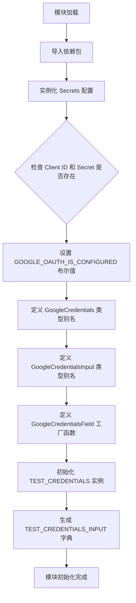
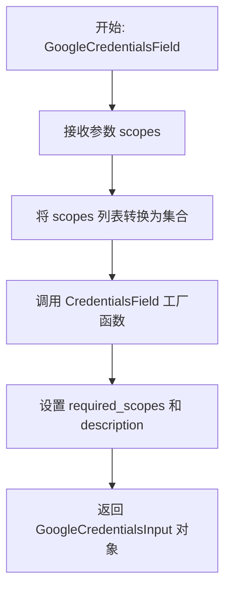

# `AutoGPT\autogpt_platform\backend\backend\blocks\google\_auth.py` 详细设计文档

该文件主要负责配置和管理Google集成的OAuth2认证凭证，包括凭证类型定义、配置状态检查、凭证字段生成工厂函数以及测试模拟数据的初始化。

## 整体流程



## 类结构

```
Module: google_credentials
├── Global Variables
│   ├── secrets
│   ├── GOOGLE_OAUTH_IS_CONFIGURED
│   ├── GoogleCredentials (TypeAlias)
│   ├── GoogleCredentialsInput (TypeAlias)
│   ├── TEST_CREDENTIALS
│   └── TEST_CREDENTIALS_INPUT
└── Global Functions
    └── GoogleCredentialsField
```

## 全局变量及字段


### `secrets`
    
应用程序设置和机密管理的单例实例，用于访问配置信息。

类型：`Secrets`
    


### `GOOGLE_OAUTH_IS_CONFIGURED`
    
标记系统是否已配置必要的 Google OAuth 客户端 ID 和密钥。

类型：`bool`
    


### `GoogleCredentials`
    
Google 提供商的 OAuth2 凭证数据模型的类型别名。

类型：`OAuth2Credentials`
    


### `GoogleCredentialsInput`
    
用于定义 Google OAuth2 凭证的输入架构的类型别名，限定提供商为 Google 且认证类型为 oauth2。

类型：`CredentialsMetaInput`
    


### `TEST_CREDENTIALS`
    
用于测试环境的模拟 Google OAuth2 凭证对象，包含伪造的令牌和过期时间。

类型：`OAuth2Credentials`
    


### `TEST_CREDENTIALS_INPUT`
    
基于模拟凭证对象生成的字典，用于表示凭证的输入数据结构。

类型：`dict`
    


    

## 全局函数及方法


### `GoogleCredentialsField`

创建一个用于块的 Google 凭证输入字段，配置所需的 OAuth2 授权范围。

参数：

-   `scopes`：`list[str]`，块运行所需的授权范围列表。

返回值：`GoogleCredentialsInput`，一个表示 Google OAuth2 凭证输入配置的对象，包含必需的权限范围和描述信息。

#### 流程图



#### 带注释源码

```python
def GoogleCredentialsField(scopes: list[str]) -> GoogleCredentialsInput:
    """
    Creates a Google credentials input on a block.
    为块创建一个 Google 凭证输入。

    Params:
        scopes: The authorization scopes needed for the block to work.
               块工作所需的授权范围。
    """
    return CredentialsField(
        # 将传入的 scopes 列表转换为集合，以满足 CredentialsField 的参数要求
        required_scopes=set(scopes),
        # 设置凭证字段的描述文本，说明需要 OAuth2 认证
        description="The Google integration requires OAuth2 authentication.",
    )
```


## 关键组件


### GoogleCredentialsField
一个工厂函数，用于在数据块上创建标准的 Google 凭证输入字段，它封装了 OAuth2 认证所需的作用域和描述信息。

### GoogleCredentialsInput
针对 Google 提供商和 OAuth2 认证类型的特定类型别名，继承自 `CredentialsMetaInput`，用于定义凭证元数据的输入结构。

### GoogleCredentials
Google 提供商的凭证类型别名，直接复用标准的 `OAuth2Credentials` 数据结构，表示 Google OAuth2 的凭证模型。

### Google OAuth 配置检查
基于应用程序设置（Secrets）的配置验证逻辑，通过检查 Google 客户端 ID 和密钥是否存在，来确定 Google OAuth 集成是否已正确配置。

### 测试模拟凭证
一组预定义的常量（包括 `TEST_CREDENTIALS` 和 `TEST_CREDENTIALS_INPUT`），用于在开发和测试环境中模拟 Google OAuth2 凭证对象及其输入格式，避免调用真实 API。


## 问题及建议


### 已知问题

-   **测试数据时间戳已过期**：`TEST_CREDENTIALS` 中的 `access_token_expires_at` 和 `refresh_token_expires_at` 字段硬编码为 `1234567890`（对应 2009 年的时间戳）。如果依赖此数据进行有效性验证的逻辑严格比对当前时间，会导致测试失败或逻辑判断错误。
-   **测试数据维护存在冗余**：`TEST_CREDENTIALS_INPUT` 是手动构建的字典，与 `TEST_CREDENTIALS` 对象的字段值重复。若修改了 `TEST_CREDENTIALS` 的定义，很容易忘记同步更新 `TEST_CREDENTIALS_INPUT`，导致测试数据不一致。
-   **描述信息静态化**：`GoogleCredentialsField` 函数中的 `description` 是硬编码的通用描述，无法根据传入的具体 `scopes` 参数动态告知用户需要申请的具体权限范围，降低了用户体验。

### 优化建议

-   **自动生成测试输入字典**：利用 Pydantic 模型提供的方法（如 `TEST_CREDENTIALS.model_dump()` 或 `.dict()`）来生成 `TEST_CREDENTIALS_INPUT`，消除数据冗余并确保两者始终同步。
-   **使用动态时间戳**：在构建 `TEST_CREDENTIALS` 时，使用相对时间动态生成时间戳（例如 `int(time.time()) + 3600`），确保模拟数据在测试运行期间始终处于有效期内。
-   **增加 Scope 格式校验**：在 `GoogleCredentialsField` 函数中增加对 `scopes` 参数的校验逻辑，检查其是否符合 Google OAuth2 scope 的标准格式（例如是否以 `https://www.googleapis.com/auth/` 开头），以便在开发阶段及早发现配置错误。
-   **延迟或优化配置加载**：考虑将 `secrets = Secrets()` 的初始化延迟到实际使用时，或者确保 `Secrets` 类在初始化时是轻量级的。如果 `Secrets` 涉及文件 I/O 或网络请求，在模块顶层实例化会增加导入开销。


## 其它


### 设计目标与约束

本模块旨在为系统中 Google 提供商的 OAuth2 认证提供统一的类型定义、配置检查和辅助构造函数。

**设计目标**：
1.  **类型安全**：利用 Type Hints 和 Pydantic 模型确保凭证数据在系统内部传递时的结构一致性和正确性。
2.  **简化集成**：通过 `GoogleCredentialsField` 辅助函数封装复杂的凭证字段定义，方便其他 Block 快速集成 Google 认证。
3.  **环境感知**：提供自动化的环境变量检测机制（`GOOGLE_OAUTH_IS_CONFIGURED`），以便在系统启动时判断集成是否可用。

**约束条件**：
1.  必须依赖 `backend.util.settings.Secrets` 来读取 Google OAuth 的 `client_id` 和 `client_secret`。
2.  凭证结构必须严格遵循 `backend.data.model` 中定义的基础 `OAuth2Credentials` 模型。
3.  测试常量（`TEST_CREDENTIALS`）仅限于单元测试或开发环境使用，严禁在生产环境中通过任何途径激活。

### 外部依赖与接口契约

**外部库依赖**：
- `pydantic`: 用于数据验证和敏感字符串的封装 (`SecretStr`)。
- `typing`: 用于支持运行时的类型检查和泛型 (`Literal`)。

**内部模块依赖**：
- `backend.data.model`: 依赖核心凭证模型 `CredentialsField` (用于字段定义), `CredentialsMetaInput` (用于输入元数据), 和 `OAuth2Credentials` (用于凭证实例)。
- `backend.integrations.providers`: 依赖 `ProviderName` 枚举来固定提供商名称为 "google"。
- `backend.util.settings`: 依赖 `Secrets` 类作为环境配置的单一数据源。

**接口契约**：
1.  **Secrets 契约**: `Secrets` 类必须暴露 `google_client_id` 和 `google_client_secret` 属性，且这两个属性不能同时为空，否则认证被视为未配置。
2.  **GoogleCredentialsField 契约**: 调用者必须传入一个 `list[str]` 类型的 `scopes` 参数，该列表包含有效的 Google OAuth2 权限范围（如 `gmail.readonly`）。

### 数据流与关键路径

1.  **配置检查流**：
    - 系统初始化时加载模块。
    - 实例化 `Secrets()` 读取环境变量。
    - 逻辑判断 `client_id` 和 `client_secret` 是否存在。
    - 将结果布尔值赋给全局变量 `GOOGLE_OAUTH_IS_CONFIGURED`，供全局路由或功能开关使用。

2.  **凭证字段定义流**：
    - 开发者在 Block 定义中调用 `GoogleCredentialsField(scopes)`。
    - 函数内部调用 `CredentialsField`，将 scopes 转换为 `set` 并设置描述信息。
    - 返回符合 `CredentialsMetaInput` 协议的对象，该对象随后被 Pydantic 解析并嵌入到 Block 的输入 Schema 中。

3.  **测试数据流**：
    - 单元测试引入 `TEST_CREDENTIALS`。
    - 该常量作为预填充的 `OAuth2Credentials` 实例，模拟从数据库或前端获取的已认证状态。
    - `TEST_CREDENTIALS_INPUT` 模拟前端传回的简化凭证数据结构，用于测试序列化和反序列化逻辑。

### 安全性与合规性

1.  **敏感信息掩码**：所有涉及 Token (`access_token`, `refresh_token`) 的字段均使用 `pydantic.SecretStr` 类型。这确保了当凭证对象被打印、记录日志或转换为 JSON（未显式导出时）时，敏感信息会被自动掩码处理（显示为 `**********`）。
2.  **作用域隔离**：强制要求通过 `scopes` 参数明确声明所需权限。这遵循了最小权限原则，防止 Block 申请过度的 Google API 权限。
3.  **Mock 数据隔离**：测试凭证使用了显式的 `mock-` 前缀和 UUID，便于在日志或审计中识别非生产数据。

### 错误处理与异常机制

1.  **配置静默失败**：当 Google OAuth 所需的环境变量缺失时，模块**不会抛出异常**，而是将 `GOOGLE_OAUTH_IS_CONFIGURED` 设为 `False`。这遵循了"优雅降级"的设计原则，避免因缺少非核心集成的配置而导致整个系统启动失败。上游业务逻辑负责检查此标志并禁用相关功能。
2.  **数据校验异常**：模块依赖 Pydantic 模型进行数据校验。如果外部传入的数据（如 `TEST_CREDENTIALS` 初始化或前端输入）不符合 `OAuth2Credentials` 的结构要求（例如 `id` 不是 UUID 格式，或缺少 `provider` 字段），Pydantic 将抛出 `ValidationError`。
3.  **类型约束**：利用 `Literal` 类型限制 `ProviderName` 必须为 "google" 且类型必须为 "oauth2"，任何偏离这两个值的赋值在静态类型检查（如 mypy）阶段或运行时验证阶段均会被拦截。

    