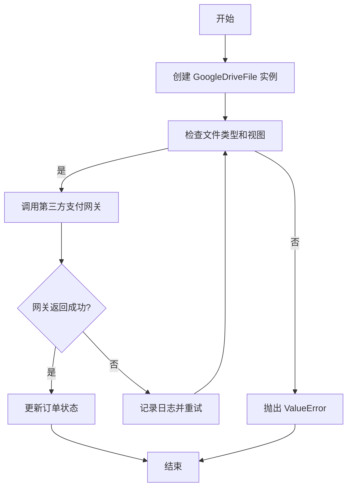
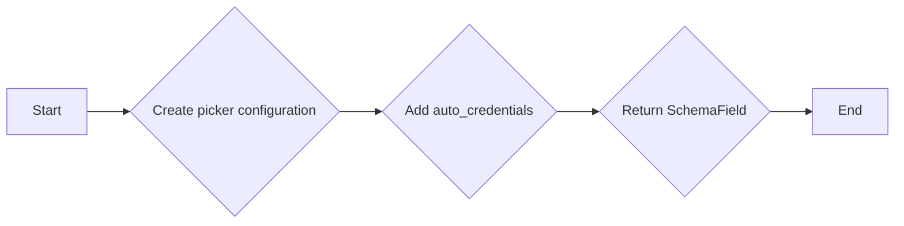

# `.\AutoGPT\autogpt_platform\backend\backend\blocks\google\_drive.py` 详细设计文档

This code defines a base class for representing Google Drive files and a function to create a Google Drive file input field with auto-generated credentials for use in a UI.

## 整体流程



## 类结构

```
GoogleDriveFile (类)
├── _GoogleDriveFileBase (基类)
```

## 全局变量及字段


### `ATTACHMENT_VIEWS`
    
A tuple containing valid attachment views for Google Drive files.

类型：`tuple[AttachmentView, ...]`
    


### `SchemaField`
    
A class representing a field in a schema definition.

类型：`class`
    


### `_GoogleDriveFileBase.id`
    
The ID of the Google Drive file/folder.

类型：`str`
    


### `_GoogleDriveFileBase.name`
    
The name of the file/folder, if available.

类型：`Optional[str]`
    


### `_GoogleDriveFileBase.mime_type`
    
The MIME type of the file, if available.

类型：`Optional[str]`
    


### `_GoogleDriveFileBase.url`
    
The URL to open the file, if available.

类型：`Optional[str]`
    


### `_GoogleDriveFileBase.icon_url`
    
The URL to the icon of the file, if available.

类型：`Optional[str]`
    


### `_GoogleDriveFileBase.is_folder`
    
Whether the file is a folder.

类型：`Optional[bool]`
    


### `GoogleDriveFile.credentials_id`
    
The internal credential ID for authentication, populated by the frontend.

类型：`Optional[str]`
    
    

## 全局函数及方法


### GoogleDriveFileField

This function creates a Google Drive file input field with auto-generated credentials. It handles both Google OAuth authentication and file selection via Google Drive Picker.

参数：

- `title`：`str`，Field title shown in UI
- `description`：`str | None`，Field description/help text
- `credentials_kwarg`：`str`，Name of the kwarg that will receive GoogleCredentials in the run() method (default: "credentials")
- `credentials_scopes`：`list[str] | None`，OAuth scopes required (default: drive.file)
- `allowed_views`：`list[AttachmentView] | None`，List of view types to show in picker (default: ["DOCS"])
- `allowed_mime_types`：`list[str] | None`，Filter by MIME types
- `placeholder`：`str | None`，Placeholder text for the button
- `**kwargs`：Additional SchemaField arguments

返回值：`Any`，Field definition that produces GoogleDriveFile

#### 流程图



#### 带注释源码

```python
def GoogleDriveFileField(  # GoogleDriveFileField function definition
    *,
    title: str,  # Field title shown in UI
    description: str | None = None,  # Field description/help text
    credentials_kwarg: str = "credentials",  # Name of the kwarg that will receive GoogleCredentials
    credentials_scopes: list[str] | None = None,  # OAuth scopes required
    allowed_views: list[AttachmentView] | None = None,  # List of view types to show in picker
    allowed_mime_types: list[str] | None = None,  # Filter by MIME types
    placeholder: str | None = None,  # Placeholder text for the button
    **kwargs: Any,  # Additional SchemaField arguments
) -> Any:  # Return type is Any
    # Determine scopes - drive.file is sufficient for picker-selected files
    scopes = credentials_scopes or ["https://www.googleapis.com/auth/drive.file"]

    # Build picker configuration with auto_credentials embedded
    picker_config = {
        "multiselect": False,
        "allow_folder_selection": False,
        "allowed_views": list(allowed_views) if allowed_views else ["DOCS"],
        "scopes": scopes,
        # Auto-credentials config tells frontend to include _credentials_id in output
        "auto_credentials": {
            "provider": "google",
            "type": "oauth2",
            "scopes": scopes,
            "kwarg_name": credentials_kwarg,
        },
    }

    if allowed_mime_types:
        picker_config["allowed_mime_types"] = list(allowed_mime_types)

    return SchemaField(  # Return a SchemaField object
        default=None,
        title=title,
        description=description,
        placeholder=placeholder or "Select from Google Drive",
        # Use google-drive-picker format so frontend renders existing component
        format="google-drive-picker",
        advanced=False,
        json_schema_extra={  # Additional JSON schema extra fields
            "google_drive_picker_config": picker_config,
            # Also keep auto_credentials at top level for backend detection
            "auto_credentials": {
                "provider": "google",
                "type": "oauth2",
                "scopes": scopes,
                "kwarg_name": credentials_kwarg,
            },
            **kwargs,
        },
    )
```


## 关键组件


### 张量索引与惰性加载

张量索引与惰性加载是用于高效处理大型数据集的关键组件，它允许在数据被实际使用之前不进行加载，从而节省内存和提高性能。

### 反量化支持

反量化支持是针对量化策略的组件，它允许在量化过程中对模型进行反向量化，以保持模型性能。

### 量化策略

量化策略是用于优化模型性能和减少模型大小的组件，它通过减少模型中使用的数值精度来实现。


## 问题及建议


### 已知问题

-   **全局变量和类字段未进行封装**：`ATTACHMENT_VIEWS` 作为全局变量直接定义在模块级别，这可能导致命名冲突和难以维护。建议将其封装在类或模块中。
-   **类方法参数过多**：`GoogleDriveFileField` 方法接受大量参数，这可能导致使用时难以记忆和理解。建议对参数进行分组或提供默认值，以简化使用。
-   **代码注释不足**：代码中缺少详细的注释，这不利于其他开发者理解代码逻辑和功能。

### 优化建议

-   **封装全局变量**：将 `ATTACHMENT_VIEWS` 封装在类或模块中，例如在 `GoogleDriveFile` 类中添加一个类变量或作为类方法返回。
-   **简化类方法参数**：对 `GoogleDriveFileField` 的参数进行分组，例如将 OAuth 相关参数和文件选择相关参数分开，并提供默认值。
-   **增加代码注释**：在关键代码段和复杂逻辑处添加注释，解释代码的目的和实现方式。
-   **代码复用**：考虑将 OAuth 认证和文件选择逻辑抽象为独立的函数或类，以提高代码复用性和可维护性。
-   **错误处理**：增加错误处理机制，例如在文件选择或认证过程中捕获异常，并提供相应的错误信息。
-   **文档化**：编写详细的文档，包括类和方法的功能、参数和返回值，以便其他开发者能够更好地理解和使用代码。


## 其它


### 设计目标与约束

- 设计目标：
  - 提供一个通用的Google Drive文件/文件夹表示，支持链式操作。
  - 实现一个自动生成OAuth认证的文件选择字段，简化用户操作。
  - 支持多种文件类型和视图选择。
- 约束：
  - 必须使用Google Drive API进行操作。
  - 需要处理OAuth认证流程。
  - 确保数据安全和隐私。

### 错误处理与异常设计

- 错误处理：
  - 捕获并处理Google Drive API调用中的异常。
  - 捕获并处理OAuth认证过程中的异常。
  - 提供清晰的错误信息，方便用户定位问题。
- 异常设计：
  - 定义自定义异常类，如`GoogleDriveAPIError`和`OAuthAuthenticationError`。
  - 异常类应包含错误代码、错误信息和可能的解决方案。

### 数据流与状态机

- 数据流：
  - 用户通过UI选择文件或文件夹。
  - 前端将选择结果发送到后端。
  - 后端使用Google Drive API获取文件信息。
  - 后端将文件信息返回给前端。
- 状态机：
  - OAuth认证状态机，包括未认证、认证中、已认证状态。

### 外部依赖与接口契约

- 外部依赖：
  - Google Drive API。
  - OAuth 2.0认证流程。
- 接口契约：
  - 定义Google Drive API的调用规范。
  - 定义OAuth 2.0认证流程的参数和返回值规范。
  - 定义前后端交互的JSON格式规范。

### 安全性与隐私

- 安全性：
  - 使用HTTPS协议保护数据传输安全。
  - 对敏感数据进行加密存储。
  - 实施访问控制，确保只有授权用户可以访问数据。
- 隐私：
  - 遵守相关法律法规，保护用户隐私。
  - 明确告知用户数据的使用目的和范围。
  - 提供用户数据删除功能。

### 性能优化

- 性能优化：
  - 优化API调用，减少不必要的网络请求。
  - 缓存常用数据，减少数据库访问。
  - 使用异步编程提高响应速度。

### 可维护性与可扩展性

- 可维护性：
  - 代码结构清晰，易于理解和维护。
  - 使用文档和注释说明代码功能。
- 可扩展性：
  - 设计模块化代码，方便添加新功能。
  - 提供接口供第三方扩展功能。

### 测试与质量保证

- 测试：
  - 编写单元测试和集成测试，确保代码质量。
  - 使用代码覆盖率工具检测代码覆盖率。
- 质量保证：
  - 定期进行代码审查，确保代码质量。
  - 使用静态代码分析工具检测潜在问题。

### 用户文档与帮助

- 用户文档：
  - 提供详细的用户手册，指导用户如何使用该功能。
  - 提供示例代码和教程。
- 帮助：
  - 提供在线帮助和FAQ。
  - 提供客服支持。


    