# `.\AutoGPT\autogpt_platform\backend\backend\blocks\google\calendar.py` 详细设计文档

This file contains two classes for interacting with Google Calendar: one for reading events and another for creating events.

## 整体流程

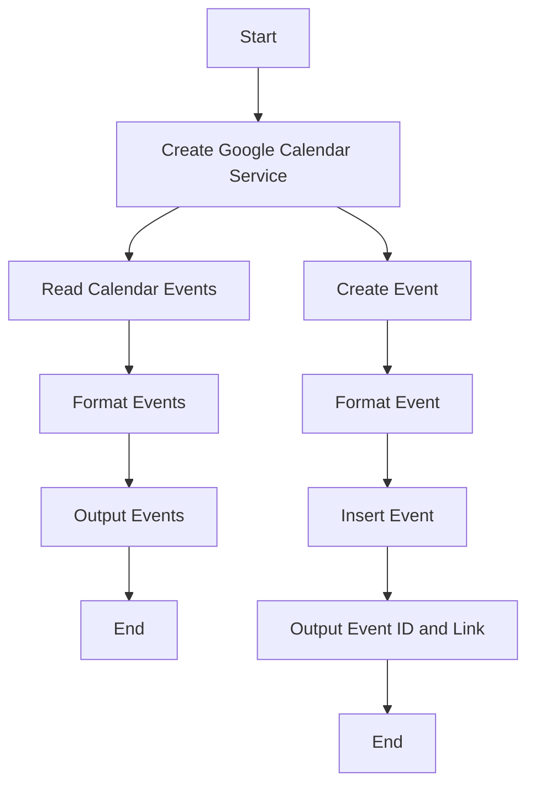

## 类结构

```
GoogleCalendarReadEventsBlock (Class)
├── Input (Class)
│   ├── credentials (GoogleCredentialsInput)
│   ├── calendar_id (str)
│   ├── max_events (int)
│   ├── start_time (datetime)
│   ├── time_range_days (int)
│   ├── search_term (str | None)
│   ├── page_token (str | None)
│   └── include_declined_events (bool)
│   └── page_token (str | None)
│   └── include_declined_events (bool)
└── Output (Class)
    ├── events (list[CalendarEvent])
    ├── event (CalendarEvent)
    ├── next_page_token (str | None)
    └── error (str)
GoogleCalendarCreateEventBlock (Class)
├── Input (Class)
│   ├── credentials (GoogleCredentialsInput)
│   ├── event_title (str)
│   ├── location (str | None)
│   ├── description (str | None)
│   ├── timing (ExactTiming | DurationTiming)
│   ├── calendar_id (str)
│   ├── guest_emails (list[str])
│   ├── send_notifications (bool)
│   ├── add_google_meet (bool)
│   ├── recurrence (OneTimeEvent | RecurringEvent)
│   └── reminder_minutes (list[ReminderPreset])
└── Output (Class)
    ├── event_id (str)
    └── event_link (str)
```

## 全局变量及字段


### `settings`
    
Settings object containing configuration for the application.

类型：`Settings`
    


### `GOOGLE_OAUTH_IS_CONFIGURED`
    
Flag indicating whether OAuth is configured.

类型：`bool`
    


### `TEST_CREDENTIALS`
    
Test credentials for Google API authentication.

类型：`GoogleCredentials`
    


### `TEST_CREDENTIALS_INPUT`
    
Input schema for test credentials.

类型：`GoogleCredentialsInput`
    


### `GoogleCalendarReadEventsBlock.id`
    
Unique identifier for the GoogleCalendarReadEventsBlock class.

类型：`str`
    


### `GoogleCalendarReadEventsBlock.description`
    
Description of the GoogleCalendarReadEventsBlock class.

类型：`str`
    


### `GoogleCalendarReadEventsBlock.categories`
    
Categories to which the GoogleCalendarReadEventsBlock class belongs.

类型：`set[BlockCategory]`
    


### `GoogleCalendarReadEventsBlock.input_schema`
    
Input schema for the GoogleCalendarReadEventsBlock class.

类型：`BlockSchemaInput`
    


### `GoogleCalendarReadEventsBlock.output_schema`
    
Output schema for the GoogleCalendarReadEventsBlock class.

类型：`BlockSchemaOutput`
    


### `GoogleCalendarReadEventsBlock.disabled`
    
Flag indicating whether the GoogleCalendarReadEventsBlock class is disabled.

类型：`bool`
    


### `GoogleCalendarReadEventsBlock.test_input`
    
Test input data for the GoogleCalendarReadEventsBlock class.

类型：`dict`
    


### `GoogleCalendarReadEventsBlock.test_credentials`
    
Test credentials for the GoogleCalendarReadEventsBlock class.

类型：`GoogleCredentials`
    


### `GoogleCalendarReadEventsBlock.test_output`
    
Test output data for the GoogleCalendarReadEventsBlock class.

类型：`list`
    


### `GoogleCalendarReadEventsBlock.test_mock`
    
Mock data for testing the GoogleCalendarReadEventsBlock class.

类型：`dict`
    


### `GoogleCalendarCreateEventBlock.id`
    
Unique identifier for the GoogleCalendarCreateEventBlock class.

类型：`str`
    


### `GoogleCalendarCreateEventBlock.description`
    
Description of the GoogleCalendarCreateEventBlock class.

类型：`str`
    


### `GoogleCalendarCreateEventBlock.categories`
    
Categories to which the GoogleCalendarCreateEventBlock class belongs.

类型：`set[BlockCategory]`
    


### `GoogleCalendarCreateEventBlock.input_schema`
    
Input schema for the GoogleCalendarCreateEventBlock class.

类型：`BlockSchemaInput`
    


### `GoogleCalendarCreateEventBlock.output_schema`
    
Output schema for the GoogleCalendarCreateEventBlock class.

类型：`BlockSchemaOutput`
    


### `GoogleCalendarCreateEventBlock.disabled`
    
Flag indicating whether the GoogleCalendarCreateEventBlock class is disabled.

类型：`bool`
    


### `GoogleCalendarCreateEventBlock.test_input`
    
Test input data for the GoogleCalendarCreateEventBlock class.

类型：`dict`
    


### `GoogleCalendarCreateEventBlock.test_credentials`
    
Test credentials for the GoogleCalendarCreateEventBlock class.

类型：`GoogleCredentials`
    


### `GoogleCalendarCreateEventBlock.test_output`
    
Test output data for the GoogleCalendarCreateEventBlock class.

类型：`list`
    


### `GoogleCalendarCreateEventBlock.test_mock`
    
Mock data for testing the GoogleCalendarCreateEventBlock class.

类型：`dict`
    


### `GoogleCalendarReadEventsBlock.id`
    
Unique identifier for the GoogleCalendarReadEventsBlock instance.

类型：`str`
    


### `GoogleCalendarReadEventsBlock.description`
    
Description of the GoogleCalendarReadEventsBlock instance.

类型：`str`
    


### `GoogleCalendarReadEventsBlock.categories`
    
Categories to which the GoogleCalendarReadEventsBlock instance belongs.

类型：`set[BlockCategory]`
    


### `GoogleCalendarReadEventsBlock.input_schema`
    
Input schema for the GoogleCalendarReadEventsBlock instance.

类型：`BlockSchemaInput`
    


### `GoogleCalendarReadEventsBlock.output_schema`
    
Output schema for the GoogleCalendarReadEventsBlock instance.

类型：`BlockSchemaOutput`
    


### `GoogleCalendarReadEventsBlock.disabled`
    
Flag indicating whether the GoogleCalendarReadEventsBlock instance is disabled.

类型：`bool`
    


### `GoogleCalendarReadEventsBlock.test_input`
    
Test input data for the GoogleCalendarReadEventsBlock instance.

类型：`dict`
    


### `GoogleCalendarReadEventsBlock.test_credentials`
    
Test credentials for the GoogleCalendarReadEventsBlock instance.

类型：`GoogleCredentials`
    


### `GoogleCalendarReadEventsBlock.test_output`
    
Test output data for the GoogleCalendarReadEventsBlock instance.

类型：`list`
    


### `GoogleCalendarReadEventsBlock.test_mock`
    
Mock data for testing the GoogleCalendarReadEventsBlock instance.

类型：`dict`
    


### `GoogleCalendarCreateEventBlock.id`
    
Unique identifier for the GoogleCalendarCreateEventBlock instance.

类型：`str`
    


### `GoogleCalendarCreateEventBlock.description`
    
Description of the GoogleCalendarCreateEventBlock instance.

类型：`str`
    


### `GoogleCalendarCreateEventBlock.categories`
    
Categories to which the GoogleCalendarCreateEventBlock instance belongs.

类型：`set[BlockCategory]`
    


### `GoogleCalendarCreateEventBlock.input_schema`
    
Input schema for the GoogleCalendarCreateEventBlock instance.

类型：`BlockSchemaInput`
    


### `GoogleCalendarCreateEventBlock.output_schema`
    
Output schema for the GoogleCalendarCreateEventBlock instance.

类型：`BlockSchemaOutput`
    


### `GoogleCalendarCreateEventBlock.disabled`
    
Flag indicating whether the GoogleCalendarCreateEventBlock instance is disabled.

类型：`bool`
    


### `GoogleCalendarCreateEventBlock.test_input`
    
Test input data for the GoogleCalendarCreateEventBlock instance.

类型：`dict`
    


### `GoogleCalendarCreateEventBlock.test_credentials`
    
Test credentials for the GoogleCalendarCreateEventBlock instance.

类型：`GoogleCredentials`
    


### `GoogleCalendarCreateEventBlock.test_output`
    
Test output data for the GoogleCalendarCreateEventBlock instance.

类型：`list`
    


### `GoogleCalendarCreateEventBlock.test_mock`
    
Mock data for testing the GoogleCalendarCreateEventBlock instance.

类型：`dict`
    
    

## 全局函数及方法


### `_build_service`

Builds a Google Calendar API service using credentials.

参数：

- `credentials`：`GoogleCredentials`，The credentials object containing the necessary information to authenticate with the Google Calendar API.

返回值：`googleapiclient.discovery.build`，A built Google Calendar API service object.

#### 流程图

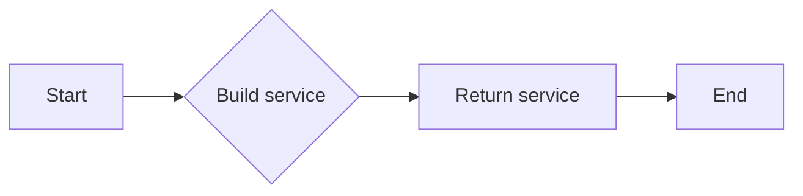

#### 带注释源码

```python
@staticmethod
def _build_service(credentials: GoogleCredentials, **kwargs):
    creds = Credentials(
        token=(
            credentials.access_token.get_secret_value()
            if credentials.access_token
            else None
        ),
        refresh_token=(
            credentials.refresh_token.get_secret_value()
            if credentials.refresh_token
            else None
        ),
        token_uri="https://oauth2.googleapis.com/token",
        client_id=settings.secrets.google_client_id,
        client_secret=settings.secrets.google_client_secret,
        scopes=credentials.scopes,
    )
    return build("calendar", "v3", credentials=creds)
```


### _read_calendar

Read calendar events with optional filtering.

参数：

- `service`：`GoogleCalendarService`，The Google Calendar API service object.
- `calendarId`：`str`，The ID of the calendar to read events from.
- `time_min`：`str`，The start time for the events to retrieve.
- `time_max`：`str`，The end time for the events to retrieve.
- `max_results`：`int`，The maximum number of events to retrieve.
- `single_events`：`bool`，Whether to return only single events.
- `search_term`：`str | None`，An optional search term to filter events by.
- `show_deleted`：`bool`，Whether to show deleted events.
- `show_hidden`：`bool`，Whether to show hidden invitations.
- `page_token`：`str | None`，An optional page token to retrieve the next batch of events.

返回值：`dict`，The response from the Google Calendar API.

#### 流程图

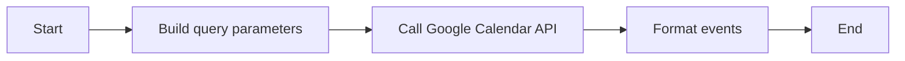

#### 带注释源码

```python
def _read_calendar(
    self,
    service,
    calendarId: str,
    time_min: str,
    time_max: str,
    max_results: int,
    single_events: bool,
    search_term: str | None = None,
    show_deleted: bool = False,
    show_hidden: bool = False,
    page_token: str | None = None,
) -> dict:
    """Read calendar events with optional filtering."""
    calendar = service.events()

    # Build query parameters
    params = {
        "calendarId": calendarId,
        "timeMin": time_min,
        "timeMax": time_max,
        "maxResults": max_results,
        "singleEvents": single_events,
        "orderBy": "startTime",
        "showDeleted": show_deleted,
        "showHiddenInvitations": show_hidden,
        **({"pageToken": page_token} if page_token else {}),
    }

    # Add search term if provided
    if search_term:
        params["q"] = search_term

    result = calendar.list(**params).execute()
    return result
```

### _format_events

#### 描述

该函数将Google Calendar API返回的事件列表转换为用户友好的结构。

#### 参数

- `events`：`list[dict]`，Google Calendar API返回的事件列表。

#### 返回值

- `list[CalendarEvent]`，格式化后的CalendarEvent对象列表。

#### 流程图

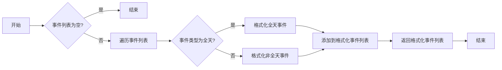

#### 带注释源码

```python
def _format_events(self, events: list[dict]) -> list[CalendarEvent]:
    """Format Google Calendar API events into user-friendly structure."""
    formatted_events = []

    for event in events:
        # Determine if all-day event
        is_all_day = "date" in event.get("start", {})

        # Format start and end times
        if is_all_day:
            start_time = event.get("start", {}).get("date", "")
            end_time = event.get("end", {}).get("date", "")
        else:
            # Convert ISO format to more readable format
            start_datetime = datetime.fromisoformat(
                event.get("start", {}).get("dateTime", "").replace("Z", "+00:00")
            )
            end_datetime = datetime.fromisoformat(
                event.get("end", {}).get("dateTime", "").replace("Z", "+00:00")
            )
            start_time = start_datetime.strftime("%Y-%m-%d %H:%M")
            end_time = end_datetime.strftime("%Y-%m-%d %H:%M")

        # Extract attendees
        attendees = []
        for attendee in event.get("attendees", []):
            if email := attendee.get("email"):
                attendees.append(email)

        # Check for video call link
        has_video_call = False
        video_link = None
        if conf_data := event.get("conferenceData"):
            if conf_url := conf_data.get("conferenceUrl"):
                has_video_call = True
                video_link = conf_url
            elif entry_points := conf_data.get("entryPoints", []):
                for entry in entry_points:
                    if entry.get("entryPointType") == "video":
                        has_video_call = True
                        video_link = entry.get("uri")
                        break

        # Create formatted event
        formatted_event = CalendarEvent(
            id=event.get("id", ""),
            title=event.get("summary", "Untitled Event"),
            start_time=start_time,
            end_time=end_time,
            is_all_day=is_all_day,
            location=event.get("location"),
            description=event.get("description"),
            organizer=event.get("organizer", {}).get("email"),
            attendees=attendees,
            has_video_call=has_video_call,
            video_link=video_link,
            calendar_link=event.get("htmlLink", ""),
            is_recurring=bool(event.get("recurrence")),
        )

        formatted_events.append(formatted_event)

    return formatted_events
```


### `_create_event`

Create a new event in Google Calendar.

参数：

- `service`：`GoogleCalendarService`，The Google Calendar API service object.
- `calendar_id`：`str`，The ID of the calendar where the event will be created.
- `event_body`：`dict`，The body of the event to be created.
- `send_notifications`：`bool`，Whether to send email notifications to guests.
- `conference_data_version`：`int`，The version of conference data to use.

返回值：`dict`，The details of the created event.

#### 流程图

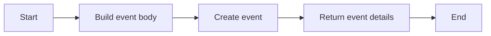

#### 带注释源码

```python
def _create_event(
    self,
    service,
    calendar_id: str,
    event_body: dict,
    send_notifications: bool = False,
    conference_data_version: int = 0,
) -> dict:
    """Create a new event in Google Calendar."""
    calendar = service.events()

    # Make the API call
    result = calendar.insert(
        calendarId=calendar_id,
        body=event_body,
        sendNotifications=send_notifications,
        conferenceDataVersion=conference_data_version,
    ).execute()

    return result
```


### GoogleCalendarReadEventsBlock.__init__

This method initializes the GoogleCalendarReadEventsBlock class, setting up the block with necessary configurations and test data.

参数：

- 无

返回值：无

#### 流程图

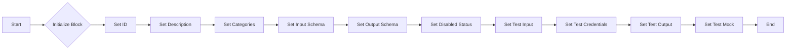

#### 带注释源码

```python
def __init__(self):
    # Create realistic test data for events
    test_now = datetime.now(tz=timezone.utc)
    test_tomorrow = test_now + timedelta(days=1)

    test_event_dict = {
        "id": "event1id",
        "title": "Team Meeting",
        "start_time": test_tomorrow.strftime("%Y-%m-%d %H:%M"),
        "end_time": (test_tomorrow + timedelta(hours=1)).strftime("%Y-%m-%d %H:%M"),
        "is_all_day": False,
        "location": "Conference Room A",
        "description": "Weekly team sync",
        "organizer": "manager@example.com",
        "attendees": ["colleague1@example.com", "colleague2@example.com"],
        "has_video_call": True,
        "video_link": "https://meet.google.com/abc-defg-hij",
        "calendar_link": "https://calendar.google.com/calendar/event?eid=event1id",
        "is_recurring": True,
    }

    super().__init__(
        id="80bc3ed1-e9a4-449e-8163-a8fc86f74f6a",
        description="Retrieves upcoming events from a Google Calendar with filtering options",
        categories={BlockCategory.PRODUCTIVITY, BlockCategory.DATA},
        input_schema=GoogleCalendarReadEventsBlock.Input,
        output_schema=GoogleCalendarReadEventsBlock.Output,
        disabled=not GOOGLE_OAUTH_IS_CONFIGURED,
        test_input={
            "credentials": TEST_CREDENTIALS_INPUT,
            "calendar_id": "primary",
            "max_events": 5,
            "start_time": test_now.isoformat(),
            "time_range_days": 7,
            "search_term": None,
            "include_declined_events": False,
            "page_token": None,
        },
        test_credentials=TEST_CREDENTIALS,
        test_output=[
            ("event", test_event_dict),
            ("events", [test_event_dict]),
        ],
        test_mock={
            "_read_calendar": lambda *args, **kwargs: {
                "items": [
                    {
                        "id": "event1id",
                        "summary": "Team Meeting",
                        "start": {
                            "dateTime": test_tomorrow.isoformat(),
                            "timeZone": "UTC",
                        },
                        "end": {
                            "dateTime": (
                                test_tomorrow + timedelta(hours=1)
                            ).isoformat(),
                            "timeZone": "UTC",
                        },
                        "location": "Conference Room A",
                        "description": "Weekly team sync",
                        "organizer": {"email": "manager@example.com"},
                        "attendees": [
                            {"email": "colleague1@example.com"},
                            {"email": "colleague2@example.com"},
                        ],
                        "conferenceData": {
                            "conferenceUrl": "https://meet.google.com/abc-defg-hij"
                        },
                        "htmlLink": "https://calendar.google.com/calendar/event?eid=event1id",
                        "recurrence": ["RRULE:FREQ=WEEKLY;COUNT=10"],
                    }
                ],
                "nextPageToken": None,
            },
            "_format_events": lambda *args, **kwargs: [test_event_dict],
        },
    )
```


### GoogleCalendarReadEventsBlock.run

Retrieves upcoming events from a Google Calendar with filtering options.

参数：

- `input_data`：`Input`，The input data for the block.
- `credentials`：`GoogleCredentials`，The credentials to authenticate with Google Calendar API.
- `**kwargs`：`Any`，Additional keyword arguments.

返回值：`BlockOutput`，The output of the block containing events, next page token, and error message if any.

#### 流程图

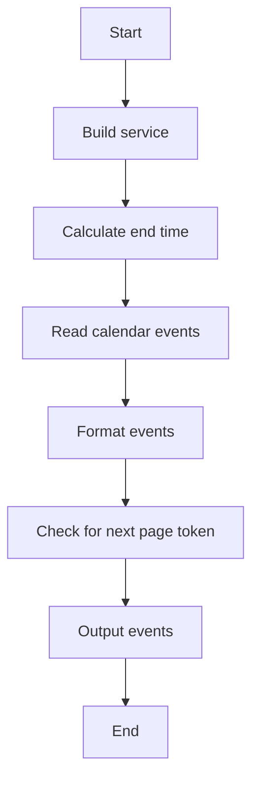

#### 带注释源码

```python
async def run(self, input_data: Input, *, credentials: GoogleCredentials, **kwargs) -> BlockOutput:
    try:
        service = self._build_service(credentials, **kwargs)

        # Calculate end time based on start time and time range
        end_time = input_data.start_time + timedelta(days=input_data.time_range_days)

        # Call Google Calendar API
        result = await asyncio.to_thread(
            self._read_calendar,
            service=service,
            calendarId=input_data.calendar_id,
            time_min=input_data.start_time.isoformat(),
            time_max=end_time.isoformat(),
            max_results=input_data.max_events,
            single_events=True,
            search_term=input_data.search_term,
            show_deleted=False,
            show_hidden=input_data.include_declined_events,
            page_token=input_data.page_token,
        )

        # Format events into a user-friendly structure
        formatted_events = self._format_events(result.get("items", []))

        # Include next page token if available
        if next_page_token := result.get("nextPageToken"):
            yield "next_page_token", next_page_token

        for event in formatted_events:
            yield "event", event

        yield "events", formatted_events

    except Exception as e:
        yield "error", str(e)
``` 


### `_build_service`

Builds a Google Calendar API service using credentials.

参数：

- `credentials`：`GoogleCredentials`，The credentials object containing the necessary information to authenticate with the Google Calendar API.

返回值：`googleapiclient.discovery.build`，A built Google Calendar API service object.

#### 流程图

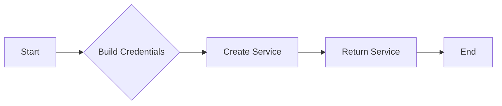

#### 带注释源码

```python
@staticmethod
def _build_service(credentials: GoogleCredentials, **kwargs):
    creds = Credentials(
        token=(
            credentials.access_token.get_secret_value()
            if credentials.access_token
            else None
        ),
        refresh_token=(
            credentials.refresh_token.get_secret_value()
            if credentials.refresh_token
            else None
        ),
        token_uri="https://oauth2.googleapis.com/token",
        client_id=settings.secrets.google_client_id,
        client_secret=settings.secrets.google_client_secret,
        scopes=credentials.scopes,
    )
    return build("calendar", "v3", credentials=creds)
```


### `_read_calendar`

Read calendar events with optional filtering.

参数：

- `service`：`GoogleCalendarService`，The Google Calendar API service object.
- `calendarId`：`str`，The ID of the calendar to read events from.
- `time_min`：`str`，The start time for the events to retrieve.
- `time_max`：`str`，The end time for the events to retrieve.
- `max_results`：`int`，The maximum number of events to retrieve.
- `single_events`：`bool`，Whether to return only single events.
- `search_term`：`str | None`，An optional search term to filter events by.
- `show_deleted`：`bool`，Whether to show deleted events.
- `show_hidden`：`bool`，Whether to show hidden invitations.
- `page_token`：`str | None`，An optional page token to retrieve the next batch of events.

返回值：`dict`，The response from the Google Calendar API.

#### 流程图

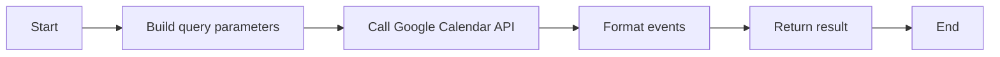

#### 带注释源码

```python
def _read_calendar(
    self,
    service,
    calendarId: str,
    time_min: str,
    time_max: str,
    max_results: int,
    single_events: bool,
    search_term: str | None = None,
    show_deleted: bool = False,
    show_hidden: bool = False,
    page_token: str | None = None,
) -> dict:
    """Read calendar events with optional filtering."""
    calendar = service.events()

    # Build query parameters
    params = {
        "calendarId": calendarId,
        "timeMin": time_min,
        "timeMax": time_max,
        "maxResults": max_results,
        "singleEvents": single_events,
        "orderBy": "startTime",
        "showDeleted": show_deleted,
        "showHiddenInvitations": show_hidden,
        **({"pageToken": page_token} if page_token else {}),
    }

    # Add search term if provided
    if search_term:
        params["q"] = search_term

    result = calendar.list(**params).execute()
    return result
```


### `_format_events`

This method formats Google Calendar API events into a user-friendly structure.

参数：

- `events`：`list[dict]`，A list of dictionaries representing Google Calendar API events.

返回值：`list[CalendarEvent]`，A list of `CalendarEvent` objects formatted for user-friendly use.

#### 流程图

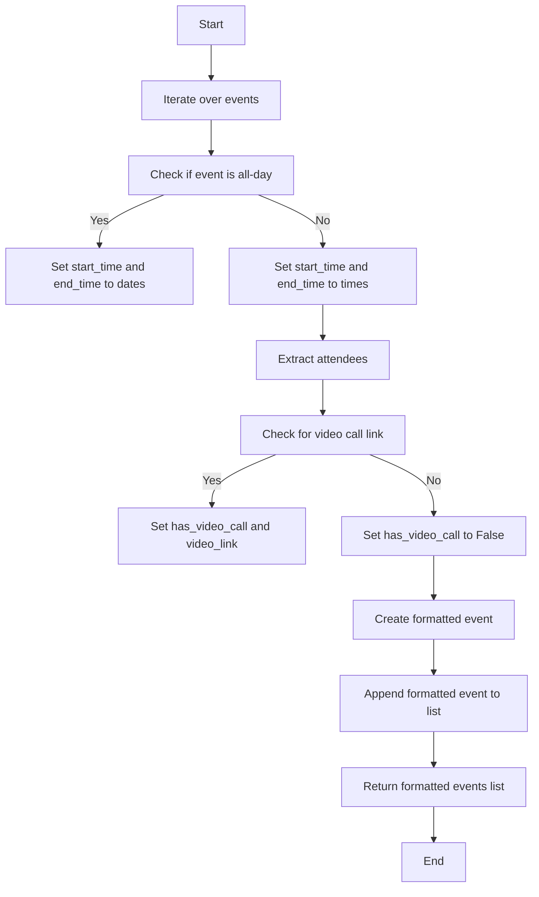

#### 带注释源码

```python
def _format_events(self, events: list[dict]) -> list[CalendarEvent]:
    """Format Google Calendar API events into user-friendly structure."""
    formatted_events = []

    for event in events:
        # Determine if all-day event
        is_all_day = "date" in event.get("start", {})

        # Format start and end times
        if is_all_day:
            start_time = event.get("start", {}).get("date", "")
            end_time = event.get("end", {}).get("date", "")
        else:
            # Convert ISO format to more readable format
            start_datetime = datetime.fromisoformat(
                event.get("start", {}).get("dateTime", "").replace("Z", "+00:00")
            )
            end_datetime = datetime.fromisoformat(
                event.get("end", {}).get("dateTime", "").replace("Z", "+00:00")
            )
            start_time = start_datetime.strftime("%Y-%m-%d %H:%M")
            end_time = end_datetime.strftime("%Y-%m-%d %H:%M")

        # Extract attendees
        attendees = []
        for attendee in event.get("attendees", []):
            if email := attendee.get("email"):
                attendees.append(email)

        # Check for video call link
        has_video_call = False
        video_link = None
        if conf_data := event.get("conferenceData"):
            if conf_url := conf_data.get("conferenceUrl"):
                has_video_call = True
                video_link = conf_url
            elif entry_points := conf_data.get("entryPoints", []):
                for entry in entry_points:
                    if entry.get("entryPointType") == "video":
                        has_video_call = True
                        video_link = entry.get("uri")
                        break

        # Create formatted event
        formatted_event = CalendarEvent(
            id=event.get("id", ""),
            title=event.get("summary", "Untitled Event"),
            start_time=start_time,
            end_time=end_time,
            is_all_day=is_all_day,
            location=event.get("location"),
            description=event.get("description"),
            organizer=event.get("organizer", {}).get("email"),
            attendees=attendees,
            has_video_call=has_video_call,
            video_link=video_link,
            calendar_link=event.get("htmlLink", ""),
            is_recurring=bool(event.get("recurrence")),
        )

        formatted_events.append(formatted_event)

    return formatted_events
``` 


### GoogleCalendarCreateEventBlock.__init__

This method initializes the GoogleCalendarCreateEventBlock class, setting up the block's configuration and test data.

参数：

- `self`：`None`，The instance of the class being initialized.
- ...

返回值：`None`，No return value.

#### 流程图

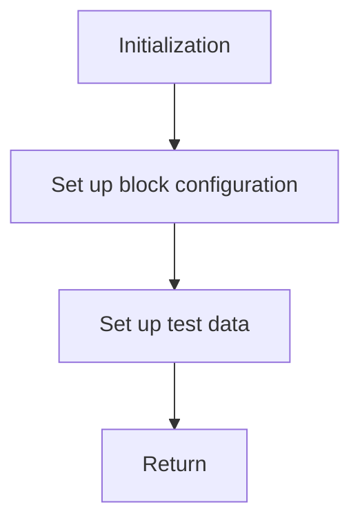

#### 带注释源码

```python
def __init__(self):
    super().__init__(
        id="ed2ec950-fbff-4204-94c0-023fb1d625e0",
        description="This block creates a new event in Google Calendar with customizable parameters.",
        categories={BlockCategory.PRODUCTIVITY},
        input_schema=GoogleCalendarCreateEventBlock.Input,
        output_schema=GoogleCalendarCreateEventBlock.Output,
        disabled=not GOOGLE_OAUTH_IS_CONFIGURED,
        test_input={
            "credentials": TEST_CREDENTIALS_INPUT,
            "event_title": "Team Meeting",
            "location": "Conference Room A",
            "description": "Weekly team sync-up",
            "calendar_id": "primary",
            "guest_emails": ["colleague1@example.com", "colleague2@example.com"],
            "add_google_meet": True,
            "send_notifications": True,
            "reminder_minutes": [
                ReminderPreset.TEN_MINUTES.value,
                ReminderPreset.ONE_HOUR.value,
            ],
        },
        test_credentials=TEST_CREDENTIALS,
        test_output=[
            ("event_id", "abc123event_id"),
            ("event_link", "https://calendar.google.com/calendar/event?eid=abc123"),
        ],
        test_mock={
            "_create_event": lambda *args, **kwargs: {
                "id": "abc123event_id",
                "htmlLink": "https://calendar.google.com/calendar/event?eid=abc123",
            }
        },
    )
```


### GoogleCalendarCreateEventBlock.run

This method creates a new event in Google Calendar using the provided input data.

参数：

- `input_data`：`Input`，The input data containing event details, timing, calendar selection, guests, and extras.
- `credentials`：`GoogleCredentials`，The credentials used to authenticate with Google Calendar API.

返回值：`BlockOutput`，The output containing the ID and link of the created event.

#### 流程图

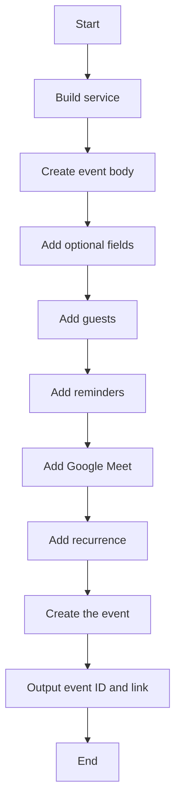

#### 带注释源码

```python
async def run(self, input_data: Input, *, credentials: GoogleCredentials, **kwargs) -> BlockOutput:
    try:
        service = self._build_service(credentials, **kwargs)

        # Create event body
        # Get start and end times based on the timing option
        if input_data.timing.discriminator == "exact_timing":
            start_datetime = input_data.timing.start_datetime
            end_datetime = input_data.timing.end_datetime
        else:  # duration_timing
            start_datetime = input_data.timing.start_datetime
            end_datetime = start_datetime + timedelta(
                minutes=input_data.timing.duration_minutes
            )

        # Format datetimes for Google Calendar API
        start_time_str = start_datetime.isoformat()
        end_time_str = end_datetime.isoformat()

        # Build the event body
        event_body = {
            "summary": input_data.event_title,
            "start": {"dateTime": start_time_str},
            "end": {"dateTime": end_time_str},
        }

        # Add optional fields
        if input_data.location:
            event_body["location"] = input_data.location

        if input_data.description:
            event_body["description"] = input_data.description

        # Add guests
        if input_data.guest_emails:
            event_body["attendees"] = [
                {"email": email} for email in input_data.guest_emails
            ]

        # Add reminders
        if input_data.reminder_minutes:
            event_body["reminders"] = {
                "useDefault": False,
                "overrides": [
                    {"method": "popup", "minutes": reminder.value}
                    for reminder in input_data.reminder_minutes
                ],
            }

        # Add Google Meet
        if input_data.add_google_meet:
            event_body["conferenceData"] = {
                "createRequest": {
                    "requestId": f"meet-{uuid.uuid4()}",
                    "conferenceSolutionKey": {"type": "hangoutsMeet"},
                }
            }

        # Add recurrence
        if input_data.recurrence.discriminator == "recurring":
            rule = f"RRULE:FREQ={input_data.recurrence.frequency.value}"
            rule += f";COUNT={input_data.recurrence.count}"
            event_body["recurrence"] = [rule]

        # Create the event
        result = await asyncio.to_thread(
            self._create_event,
            service=service,
            calendar_id=input_data.calendar_id,
            event_body=event_body,
            send_notifications=input_data.send_notifications,
            conference_data_version=1 if input_data.add_google_meet else 0,
        )

        yield "event_id", result["id"]
        yield "event_link", result["htmlLink"]

    except Exception as e:
        yield "error", str(e)
``` 


### `_build_service`

This method builds a Google Calendar API service using the provided credentials.

参数：

- `credentials`：`GoogleCredentials`，The credentials object containing the necessary information to authenticate with the Google Calendar API.

返回值：`googleapiclient.discovery.build`，A built Google Calendar API service object.

#### 流程图


#### 带注释源码

```python
@staticmethod
def _build_service(credentials: GoogleCredentials, **kwargs):
    creds = Credentials(
        token=(
            credentials.access_token.get_secret_value()
            if credentials.access_token
            else None
        ),
        refresh_token=(
            credentials.refresh_token.get_secret_value()
            if credentials.refresh_token
            else None
        ),
        token_uri="https://oauth2.googleapis.com/token",
        client_id=settings.secrets.google_client_id,
        client_secret=settings.secrets.google_client_secret,
        scopes=credentials.scopes,
    )
    return build("calendar", "v3", credentials=creds)
```


### `_create_event`

Create a new event in Google Calendar.

参数：

- `service`：`service`，The Google Calendar API service object.
- `calendar_id`：`str`，The ID of the calendar where the event will be created.
- `event_body`：`dict`，The body of the event to be created.
- `send_notifications`：`bool`，Whether to send email notifications to attendees.
- `conference_data_version`：`int`，The version of conference data to use.

返回值：`dict`，The details of the created event.

#### 流程图

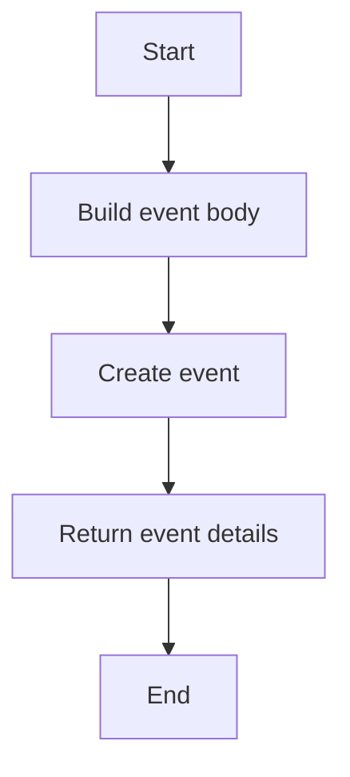

#### 带注释源码

```python
def _create_event(
    self,
    service,
    calendar_id: str,
    event_body: dict,
    send_notifications: bool = False,
    conference_data_version: int = 0,
) -> dict:
    """Create a new event in Google Calendar."""
    calendar = service.events()

    # Make the API call
    result = calendar.insert(
        calendarId=calendar_id,
        body=event_body,
        sendNotifications=send_notifications,
        conferenceDataVersion=conference_data_version,
    ).execute()

    return result
```


## 关键组件


### 张量索引与惰性加载

张量索引与惰性加载是代码中用于高效处理大型数据集的关键组件。通过延迟计算和索引，可以减少内存消耗并提高处理速度。

### 反量化支持

反量化支持是代码中用于处理量化数据的关键组件。它允许对量化数据进行反量化处理，以便进行进一步的分析和操作。

### 量化策略

量化策略是代码中用于优化数据存储和计算效率的关键组件。它通过减少数据精度来降低内存和计算需求，同时保持足够的准确性。

## 问题及建议


### 已知问题

-   **全局变量和函数的配置管理**：代码中使用了全局变量 `settings` 来存储配置信息，这可能导致配置信息难以管理和维护。建议使用配置文件或环境变量来管理配置信息，以提高灵活性和可维护性。
-   **异常处理**：代码中的异常处理较为简单，仅捕获了所有异常并返回错误信息。建议根据不同的异常类型进行更细致的异常处理，以便更好地诊断和解决问题。
-   **代码重复**：在 `GoogleCalendarReadEventsBlock` 和 `GoogleCalendarCreateEventBlock` 类中，存在一些相似的代码，如服务构建和事件格式化。建议将这些重复的代码提取到单独的函数或类中，以减少代码重复并提高可维护性。
-   **测试覆盖率**：代码中包含了一些测试用例，但可能没有覆盖所有可能的场景。建议增加测试用例，以确保代码在各种情况下都能正常工作。

### 优化建议

-   **使用配置文件或环境变量**：将配置信息存储在配置文件或环境变量中，以便于管理和修改。
-   **细化异常处理**：根据不同的异常类型进行更细致的异常处理，例如，对于网络异常、API限制异常等进行不同的处理。
-   **提取重复代码**：将重复的代码提取到单独的函数或类中，以减少代码重复并提高可维护性。
-   **增加测试覆盖率**：增加测试用例，以确保代码在各种情况下都能正常工作，并使用代码覆盖率工具来检查测试覆盖率。
-   **使用日志记录**：在关键操作和异常处理中使用日志记录，以便于问题追踪和调试。
-   **代码格式化**：使用代码格式化工具来统一代码风格，提高代码可读性。
-   **代码审查**：定期进行代码审查，以确保代码质量。


## 其它


### 设计目标与约束

- **设计目标**:
  - 提供一个模块化的方式来与Google Calendar API交互。
  - 确保代码的可扩展性和可维护性。
  - 提供测试数据以支持单元测试和集成测试。

- **约束**:
  - 必须使用Google OAuth 2.0进行身份验证。
  - 必须遵守Google Calendar API的使用条款和限制。
  - 代码必须处理异步操作，以支持非阻塞I/O。

### 错误处理与异常设计

- **错误处理**:
  - 使用try-except块捕获可能发生的异常。
  - 将异常转换为用户友好的错误消息。
  - 在输出中返回错误消息，以便调用者可以处理。

- **异常设计**:
  - 定义自定义异常类，以提供更具体的错误信息。
  - 使用Python内置的异常类，如`ValueError`和`TypeError`，以处理数据验证错误。

### 数据流与状态机

- **数据流**:
  - 输入数据通过输入模型进行验证和解析。
  - 处理后的数据通过输出模型返回给调用者。
  - 数据在类方法之间传递，以执行特定的操作。

- **状态机**:
  - 没有显式的状态机，但代码逻辑遵循一系列步骤，以执行特定的任务。

### 外部依赖与接口契约

- **外部依赖**:
  - `google-auth`, `google-auth-oauthlib`, `google-auth-httplib2`, `google-auth-oauthlib` - 用于Google OAuth 2.0身份验证。
  - `google-auth-httplib2` - 用于HTTP客户端。
  - `google-auth-oauthlib` - 用于OAuth 2.0客户端。
  - `google-api-python-client` - 用于Google API客户端库。
  - `pydantic` - 用于数据验证和模型定义。

- **接口契约**:
  - `Block`类定义了与块框架交互的接口。
  - `BaseModel`类定义了输入和输出数据的结构。
  - `GoogleCredentials`类定义了Google OAuth 2.0凭证的结构。
  - `CalendarEvent`类定义了Google Calendar事件的格式。


    