# `AutoGPT\autogpt_platform\backend\backend\blocks\google\docs.py` 详细设计文档

This file implements a comprehensive suite of asynchronous blocks for interacting with the Google Docs API, enabling functionalities such as creating, reading, editing (including plain text and Markdown), formatting, exporting, sharing, and managing permissions of Google Documents within a larger automation framework.

## 整体流程

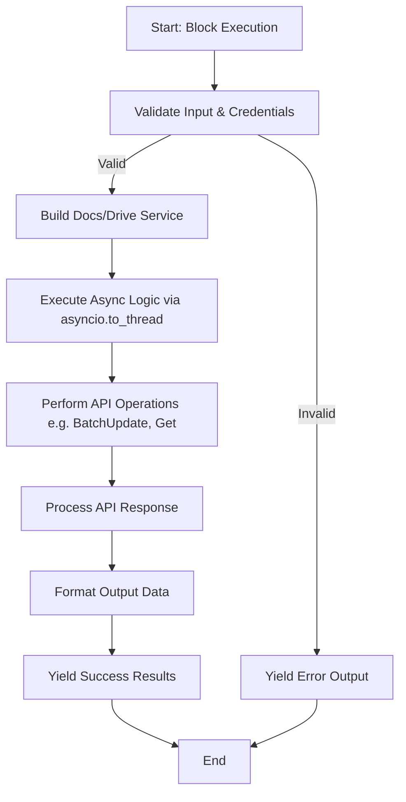

## 类结构

```
google_docs.py
├── Enums
│   ├── PublicAccessRole
│   ├── ShareRole
│   └── ExportFormat
├── Helper Functions
│   ├── _build_docs_service
│   ├── _build_drive_service
│   ├── _validate_document_file
│   ├── _parse_hex_color_to_rgb_floats
│   ├── _get_document_end_index
│   ├── _extract_text_from_content
│   └── _make_document_output
└── Blocks
   ├── Read & Create
   │   ├── GoogleDocsReadBlock
   │   └── GoogleDocsCreateBlock
   ├── Text Operations
   │   ├── GoogleDocsAppendPlainTextBlock
   │   ├── GoogleDocsInsertPlainTextBlock
   │   ├── GoogleDocsFindReplacePlainTextBlock
   │   ├── GoogleDocsDeleteContentBlock
   │   └── GoogleDocsFormatTextBlock
   ├── Structure & Tables
   │   ├── GoogleDocsInsertTableBlock
   │   ├── GoogleDocsInsertPageBreakBlock
   │   └── GoogleDocsGetStructureBlock
   ├── Markdown Operations
   │   ├── GoogleDocsAppendMarkdownBlock
   │   ├── GoogleDocsReplaceAllWithMarkdownBlock
   │   ├── GoogleDocsInsertMarkdownAtBlock
   │   ├── GoogleDocsReplaceRangeWithMarkdownBlock
   │   └── GoogleDocsReplaceContentWithMarkdownBlock
   ├── Metadata & Export
   │   ├── GoogleDocsGetMetadataBlock
   │   └── GoogleDocsExportBlock
   └── Sharing & Permissions
       ├── GoogleDocsShareBlock
       └── GoogleDocsSetPublicAccessBlock
```

## 全局变量及字段


### `GOOGLE_DOCS_DISABLED`
    
A flag indicating whether the Google Docs integration is disabled due to missing OAuth configuration.

类型：`bool`
    


### `GoogleDocsReadBlock.Input`
    
Nested class defining the input schema for the block, specifying the required document parameter.

类型：`type`
    


### `GoogleDocsReadBlock.Output`
    
Nested class defining the output schema for the block, specifying text, title, document, and error fields.

类型：`type`
    


### `GoogleDocsReadBlock.id`
    
The unique identifier for the block.

类型：`str`
    


### `GoogleDocsReadBlock.description`
    
A human-readable description of the block's functionality.

类型：`str`
    


### `GoogleDocsReadBlock.disabled`
    
A flag indicating whether the block is currently disabled.

类型：`bool`
    


### `GoogleDocsReadBlock.test_input`
    
Sample input data used for testing the block.

类型：`dict`
    


### `GoogleDocsReadBlock.test_credentials`
    
Mock credentials object used during testing.

类型：`GoogleCredentials`
    


### `GoogleDocsReadBlock.test_output`
    
Expected output data list corresponding to the test input.

类型：`list`
    


### `GoogleDocsReadBlock.test_mock`
    
Mapping of method names to mock functions used to override execution during tests.

类型：`dict`
    


### `GoogleDocsCreateBlock.Input`
    
Nested class defining the input schema for the block, specifying title and initial content.

类型：`type`
    


### `GoogleDocsCreateBlock.Output`
    
Nested class defining the output schema for the block, specifying the created document and its metadata.

类型：`type`
    


### `GoogleDocsCreateBlock.id`
    
The unique identifier for the block.

类型：`str`
    


### `GoogleDocsCreateBlock.description`
    
A human-readable description of the block's functionality.

类型：`str`
    


### `GoogleDocsCreateBlock.disabled`
    
A flag indicating whether the block is currently disabled.

类型：`bool`
    


### `GoogleDocsCreateBlock.test_input`
    
Sample input data used for testing the block.

类型：`dict`
    


### `GoogleDocsCreateBlock.test_credentials`
    
Mock credentials object used during testing.

类型：`GoogleCredentials`
    


### `GoogleDocsCreateBlock.test_output`
    
Expected output data list corresponding to the test input.

类型：`list`
    


### `GoogleDocsCreateBlock.test_mock`
    
Mapping of method names to mock functions used to override execution during tests.

类型：`dict`
    


### `GoogleDocsAppendPlainTextBlock.Input`
    
Nested class defining the input schema for the block, specifying document, text, and newline option.

类型：`type`
    


### `GoogleDocsAppendPlainTextBlock.Output`
    
Nested class defining the output schema for the block, providing operation result and the document.

类型：`type`
    


### `GoogleDocsAppendPlainTextBlock.id`
    
The unique identifier for the block.

类型：`str`
    


### `GoogleDocsAppendPlainTextBlock.description`
    
A human-readable description of the block's functionality.

类型：`str`
    


### `GoogleDocsAppendPlainTextBlock.disabled`
    
A flag indicating whether the block is currently disabled.

类型：`bool`
    


### `GoogleDocsAppendPlainTextBlock.test_input`
    
Sample input data used for testing the block.

类型：`dict`
    


### `GoogleDocsAppendPlainTextBlock.test_credentials`
    
Mock credentials object used during testing.

类型：`GoogleCredentials`
    


### `GoogleDocsAppendPlainTextBlock.test_output`
    
Expected output data list corresponding to the test input.

类型：`list`
    


### `GoogleDocsAppendPlainTextBlock.test_mock`
    
Mapping of method names to mock functions used to override execution during tests.

类型：`dict`
    


### `GoogleDocsInsertPlainTextBlock.Input`
    
Nested class defining the input schema for the block, specifying document, text, and index.

类型：`type`
    


### `GoogleDocsInsertPlainTextBlock.Output`
    
Nested class defining the output schema for the block, providing operation result and the document.

类型：`type`
    


### `GoogleDocsInsertPlainTextBlock.id`
    
The unique identifier for the block.

类型：`str`
    


### `GoogleDocsInsertPlainTextBlock.description`
    
A human-readable description of the block's functionality.

类型：`str`
    


### `GoogleDocsInsertPlainTextBlock.disabled`
    
A flag indicating whether the block is currently disabled.

类型：`bool`
    


### `GoogleDocsInsertPlainTextBlock.test_input`
    
Sample input data used for testing the block.

类型：`dict`
    


### `GoogleDocsInsertPlainTextBlock.test_credentials`
    
Mock credentials object used during testing.

类型：`GoogleCredentials`
    


### `GoogleDocsInsertPlainTextBlock.test_output`
    
Expected output data list corresponding to the test input.

类型：`list`
    


### `GoogleDocsInsertPlainTextBlock.test_mock`
    
Mapping of method names to mock functions used to override execution during tests.

类型：`dict`
    


### `GoogleDocsFindReplacePlainTextBlock.Input`
    
Nested class defining the input schema for the block, specifying document, find text, and replace text.

类型：`type`
    


### `GoogleDocsFindReplacePlainTextBlock.Output`
    
Nested class defining the output schema for the block, providing operation result and the document.

类型：`type`
    


### `GoogleDocsFindReplacePlainTextBlock.id`
    
The unique identifier for the block.

类型：`str`
    


### `GoogleDocsFindReplacePlainTextBlock.description`
    
A human-readable description of the block's functionality.

类型：`str`
    


### `GoogleDocsFindReplacePlainTextBlock.disabled`
    
A flag indicating whether the block is currently disabled.

类型：`bool`
    


### `GoogleDocsFindReplacePlainTextBlock.test_input`
    
Sample input data used for testing the block.

类型：`dict`
    


### `GoogleDocsFindReplacePlainTextBlock.test_credentials`
    
Mock credentials object used during testing.

类型：`GoogleCredentials`
    


### `GoogleDocsFindReplacePlainTextBlock.test_output`
    
Expected output data list corresponding to the test input.

类型：`list`
    


### `GoogleDocsFindReplacePlainTextBlock.test_mock`
    
Mapping of method names to mock functions used to override execution during tests.

类型：`dict`
    


### `GoogleDocsGetMetadataBlock.Input`
    
Nested class defining the input schema for the block, specifying the target document.

类型：`type`
    


### `GoogleDocsGetMetadataBlock.Output`
    
Nested class defining the output schema for the block, providing title, ID, revision, and URL.

类型：`type`
    


### `GoogleDocsGetMetadataBlock.id`
    
The unique identifier for the block.

类型：`str`
    


### `GoogleDocsGetMetadataBlock.description`
    
A human-readable description of the block's functionality.

类型：`str`
    


### `GoogleDocsGetMetadataBlock.disabled`
    
A flag indicating whether the block is currently disabled.

类型：`bool`
    


### `GoogleDocsGetMetadataBlock.test_input`
    
Sample input data used for testing the block.

类型：`dict`
    


### `GoogleDocsGetMetadataBlock.test_credentials`
    
Mock credentials object used during testing.

类型：`GoogleCredentials`
    


### `GoogleDocsGetMetadataBlock.test_output`
    
Expected output data list corresponding to the test input.

类型：`list`
    


### `GoogleDocsGetMetadataBlock.test_mock`
    
Mapping of method names to mock functions used to override execution during tests.

类型：`dict`
    


### `GoogleDocsInsertTableBlock.Input`
    
Nested class defining the input schema for the block, specifying document, dimensions, and content.

类型：`type`
    


### `GoogleDocsInsertTableBlock.Output`
    
Nested class defining the output schema for the block, providing operation result and the document.

类型：`type`
    


### `GoogleDocsInsertTableBlock.id`
    
The unique identifier for the block.

类型：`str`
    


### `GoogleDocsInsertTableBlock.description`
    
A human-readable description of the block's functionality.

类型：`str`
    


### `GoogleDocsInsertTableBlock.disabled`
    
A flag indicating whether the block is currently disabled.

类型：`bool`
    


### `GoogleDocsInsertTableBlock.test_input`
    
Sample input data used for testing the block.

类型：`dict`
    


### `GoogleDocsInsertTableBlock.test_credentials`
    
Mock credentials object used during testing.

类型：`GoogleCredentials`
    


### `GoogleDocsInsertTableBlock.test_output`
    
Expected output data list corresponding to the test input.

类型：`list`
    


### `GoogleDocsInsertTableBlock.test_mock`
    
Mapping of method names to mock functions used to override execution during tests.

类型：`dict`
    


### `GoogleDocsInsertPageBreakBlock.Input`
    
Nested class defining the input schema for the block, specifying document and index.

类型：`type`
    


### `GoogleDocsInsertPageBreakBlock.Output`
    
Nested class defining the output schema for the block, providing operation result and the document.

类型：`type`
    


### `GoogleDocsInsertPageBreakBlock.id`
    
The unique identifier for the block.

类型：`str`
    


### `GoogleDocsInsertPageBreakBlock.description`
    
A human-readable description of the block's functionality.

类型：`str`
    


### `GoogleDocsInsertPageBreakBlock.disabled`
    
A flag indicating whether the block is currently disabled.

类型：`bool`
    


### `GoogleDocsInsertPageBreakBlock.test_input`
    
Sample input data used for testing the block.

类型：`dict`
    


### `GoogleDocsInsertPageBreakBlock.test_credentials`
    
Mock credentials object used during testing.

类型：`GoogleCredentials`
    


### `GoogleDocsInsertPageBreakBlock.test_output`
    
Expected output data list corresponding to the test input.

类型：`list`
    


### `GoogleDocsInsertPageBreakBlock.test_mock`
    
Mapping of method names to mock functions used to override execution during tests.

类型：`dict`
    


### `GoogleDocsDeleteContentBlock.Input`
    
Nested class defining the input schema for the block, specifying document and range indices.

类型：`type`
    


### `GoogleDocsDeleteContentBlock.Output`
    
Nested class defining the output schema for the block, providing operation result and the document.

类型：`type`
    


### `GoogleDocsDeleteContentBlock.id`
    
The unique identifier for the block.

类型：`str`
    


### `GoogleDocsDeleteContentBlock.description`
    
A human-readable description of the block's functionality.

类型：`str`
    


### `GoogleDocsDeleteContentBlock.disabled`
    
A flag indicating whether the block is currently disabled.

类型：`bool`
    


### `GoogleDocsDeleteContentBlock.test_input`
    
Sample input data used for testing the block.

类型：`dict`
    


### `GoogleDocsDeleteContentBlock.test_credentials`
    
Mock credentials object used during testing.

类型：`GoogleCredentials`
    


### `GoogleDocsDeleteContentBlock.test_output`
    
Expected output data list corresponding to the test input.

类型：`list`
    


### `GoogleDocsDeleteContentBlock.test_mock`
    
Mapping of method names to mock functions used to override execution during tests.

类型：`dict`
    


### `GoogleDocsExportBlock.Input`
    
Nested class defining the input schema for the block, specifying document and export format.

类型：`type`
    


### `GoogleDocsExportBlock.Output`
    
Nested class defining the output schema for the block, providing content and mime type.

类型：`type`
    


### `GoogleDocsExportBlock.id`
    
The unique identifier for the block.

类型：`str`
    


### `GoogleDocsExportBlock.description`
    
A human-readable description of the block's functionality.

类型：`str`
    


### `GoogleDocsExportBlock.disabled`
    
A flag indicating whether the block is currently disabled.

类型：`bool`
    


### `GoogleDocsExportBlock.test_input`
    
Sample input data used for testing the block.

类型：`dict`
    


### `GoogleDocsExportBlock.test_credentials`
    
Mock credentials object used during testing.

类型：`GoogleCredentials`
    


### `GoogleDocsExportBlock.test_output`
    
Expected output data list corresponding to the test input.

类型：`list`
    


### `GoogleDocsExportBlock.test_mock`
    
Mapping of method names to mock functions used to override execution during tests.

类型：`dict`
    


### `GoogleDocsFormatTextBlock.Input`
    
Nested class defining the input schema for the block, specifying document, range, and styles.

类型：`type`
    


### `GoogleDocsFormatTextBlock.Output`
    
Nested class defining the output schema for the block, providing operation result and the document.

类型：`type`
    


### `GoogleDocsFormatTextBlock.id`
    
The unique identifier for the block.

类型：`str`
    


### `GoogleDocsFormatTextBlock.description`
    
A human-readable description of the block's functionality.

类型：`str`
    


### `GoogleDocsFormatTextBlock.disabled`
    
A flag indicating whether the block is currently disabled.

类型：`bool`
    


### `GoogleDocsFormatTextBlock.test_input`
    
Sample input data used for testing the block.

类型：`dict`
    


### `GoogleDocsFormatTextBlock.test_credentials`
    
Mock credentials object used during testing.

类型：`GoogleCredentials`
    


### `GoogleDocsFormatTextBlock.test_output`
    
Expected output data list corresponding to the test input.

类型：`list`
    


### `GoogleDocsFormatTextBlock.test_mock`
    
Mapping of method names to mock functions used to override execution during tests.

类型：`dict`
    


### `GoogleDocsShareBlock.Input`
    
Nested class defining the input schema for the block, specifying document, email, and role.

类型：`type`
    


### `GoogleDocsShareBlock.Output`
    
Nested class defining the output schema for the block, providing operation result and share link.

类型：`type`
    


### `GoogleDocsShareBlock.id`
    
The unique identifier for the block.

类型：`str`
    


### `GoogleDocsShareBlock.description`
    
A human-readable description of the block's functionality.

类型：`str`
    


### `GoogleDocsShareBlock.disabled`
    
A flag indicating whether the block is currently disabled.

类型：`bool`
    


### `GoogleDocsShareBlock.test_input`
    
Sample input data used for testing the block.

类型：`dict`
    


### `GoogleDocsShareBlock.test_credentials`
    
Mock credentials object used during testing.

类型：`GoogleCredentials`
    


### `GoogleDocsShareBlock.test_output`
    
Expected output data list corresponding to the test input.

类型：`list`
    


### `GoogleDocsShareBlock.test_mock`
    
Mapping of method names to mock functions used to override execution during tests.

类型：`dict`
    


### `GoogleDocsSetPublicAccessBlock.Input`
    
Nested class defining the input schema for the block, specifying document and public status.

类型：`type`
    


### `GoogleDocsSetPublicAccessBlock.Output`
    
Nested class defining the output schema for the block, providing operation result and share link.

类型：`type`
    


### `GoogleDocsSetPublicAccessBlock.id`
    
The unique identifier for the block.

类型：`str`
    


### `GoogleDocsSetPublicAccessBlock.description`
    
A human-readable description of the block's functionality.

类型：`str`
    


### `GoogleDocsSetPublicAccessBlock.disabled`
    
A flag indicating whether the block is currently disabled.

类型：`bool`
    


### `GoogleDocsSetPublicAccessBlock.test_input`
    
Sample input data used for testing the block.

类型：`dict`
    


### `GoogleDocsSetPublicAccessBlock.test_credentials`
    
Mock credentials object used during testing.

类型：`GoogleCredentials`
    


### `GoogleDocsSetPublicAccessBlock.test_output`
    
Expected output data list corresponding to the test input.

类型：`list`
    


### `GoogleDocsSetPublicAccessBlock.test_mock`
    
Mapping of method names to mock functions used to override execution during tests.

类型：`dict`
    


### `GoogleDocsAppendMarkdownBlock.Input`
    
Nested class defining the input schema for the block, specifying document and markdown content.

类型：`type`
    


### `GoogleDocsAppendMarkdownBlock.Output`
    
Nested class defining the output schema for the block, providing operation result and the document.

类型：`type`
    


### `GoogleDocsAppendMarkdownBlock.id`
    
The unique identifier for the block.

类型：`str`
    


### `GoogleDocsAppendMarkdownBlock.description`
    
A human-readable description of the block's functionality.

类型：`str`
    


### `GoogleDocsAppendMarkdownBlock.disabled`
    
A flag indicating whether the block is currently disabled.

类型：`bool`
    


### `GoogleDocsAppendMarkdownBlock.test_input`
    
Sample input data used for testing the block.

类型：`dict`
    


### `GoogleDocsAppendMarkdownBlock.test_credentials`
    
Mock credentials object used during testing.

类型：`GoogleCredentials`
    


### `GoogleDocsAppendMarkdownBlock.test_output`
    
Expected output data list corresponding to the test input.

类型：`list`
    


### `GoogleDocsAppendMarkdownBlock.test_mock`
    
Mapping of method names to mock functions used to override execution during tests.

类型：`dict`
    


### `GoogleDocsReplaceAllWithMarkdownBlock.Input`
    
Nested class defining the input schema for the block, specifying document and markdown content.

类型：`type`
    


### `GoogleDocsReplaceAllWithMarkdownBlock.Output`
    
Nested class defining the output schema for the block, providing operation result and the document.

类型：`type`
    


### `GoogleDocsReplaceAllWithMarkdownBlock.id`
    
The unique identifier for the block.

类型：`str`
    


### `GoogleDocsReplaceAllWithMarkdownBlock.description`
    
A human-readable description of the block's functionality.

类型：`str`
    


### `GoogleDocsReplaceAllWithMarkdownBlock.disabled`
    
A flag indicating whether the block is currently disabled.

类型：`bool`
    


### `GoogleDocsReplaceAllWithMarkdownBlock.test_input`
    
Sample input data used for testing the block.

类型：`dict`
    


### `GoogleDocsReplaceAllWithMarkdownBlock.test_credentials`
    
Mock credentials object used during testing.

类型：`GoogleCredentials`
    


### `GoogleDocsReplaceAllWithMarkdownBlock.test_output`
    
Expected output data list corresponding to the test input.

类型：`list`
    


### `GoogleDocsReplaceAllWithMarkdownBlock.test_mock`
    
Mapping of method names to mock functions used to override execution during tests.

类型：`dict`
    


### `GoogleDocsInsertMarkdownAtBlock.Input`
    
Nested class defining the input schema for the block, specifying document, markdown, and index.

类型：`type`
    


### `GoogleDocsInsertMarkdownAtBlock.Output`
    
Nested class defining the output schema for the block, providing operation result and the document.

类型：`type`
    


### `GoogleDocsInsertMarkdownAtBlock.id`
    
The unique identifier for the block.

类型：`str`
    


### `GoogleDocsInsertMarkdownAtBlock.description`
    
A human-readable description of the block's functionality.

类型：`str`
    


### `GoogleDocsInsertMarkdownAtBlock.disabled`
    
A flag indicating whether the block is currently disabled.

类型：`bool`
    


### `GoogleDocsInsertMarkdownAtBlock.test_input`
    
Sample input data used for testing the block.

类型：`dict`
    


### `GoogleDocsInsertMarkdownAtBlock.test_credentials`
    
Mock credentials object used during testing.

类型：`GoogleCredentials`
    


### `GoogleDocsInsertMarkdownAtBlock.test_output`
    
Expected output data list corresponding to the test input.

类型：`list`
    


### `GoogleDocsInsertMarkdownAtBlock.test_mock`
    
Mapping of method names to mock functions used to override execution during tests.

类型：`dict`
    


### `GoogleDocsReplaceRangeWithMarkdownBlock.Input`
    
Nested class defining the input schema for the block, specifying document, range, and markdown.

类型：`type`
    


### `GoogleDocsReplaceRangeWithMarkdownBlock.Output`
    
Nested class defining the output schema for the block, providing operation result and the document.

类型：`type`
    


### `GoogleDocsReplaceRangeWithMarkdownBlock.id`
    
The unique identifier for the block.

类型：`str`
    


### `GoogleDocsReplaceRangeWithMarkdownBlock.description`
    
A human-readable description of the block's functionality.

类型：`str`
    


### `GoogleDocsReplaceRangeWithMarkdownBlock.disabled`
    
A flag indicating whether the block is currently disabled.

类型：`bool`
    


### `GoogleDocsReplaceRangeWithMarkdownBlock.test_input`
    
Sample input data used for testing the block.

类型：`dict`
    


### `GoogleDocsReplaceRangeWithMarkdownBlock.test_credentials`
    
Mock credentials object used during testing.

类型：`GoogleCredentials`
    


### `GoogleDocsReplaceRangeWithMarkdownBlock.test_output`
    
Expected output data list corresponding to the test input.

类型：`list`
    


### `GoogleDocsReplaceRangeWithMarkdownBlock.test_mock`
    
Mapping of method names to mock functions used to override execution during tests.

类型：`dict`
    


### `GoogleDocsReplaceContentWithMarkdownBlock.Input`
    
Nested class defining the input schema for the block, specifying document, find text, and markdown.

类型：`type`
    


### `GoogleDocsReplaceContentWithMarkdownBlock.Output`
    
Nested class defining the output schema for the block, providing operation result and the document.

类型：`type`
    


### `GoogleDocsReplaceContentWithMarkdownBlock.id`
    
The unique identifier for the block.

类型：`str`
    


### `GoogleDocsReplaceContentWithMarkdownBlock.description`
    
A human-readable description of the block's functionality.

类型：`str`
    


### `GoogleDocsReplaceContentWithMarkdownBlock.disabled`
    
A flag indicating whether the block is currently disabled.

类型：`bool`
    


### `GoogleDocsReplaceContentWithMarkdownBlock.test_input`
    
Sample input data used for testing the block.

类型：`dict`
    


### `GoogleDocsReplaceContentWithMarkdownBlock.test_credentials`
    
Mock credentials object used during testing.

类型：`GoogleCredentials`
    


### `GoogleDocsReplaceContentWithMarkdownBlock.test_output`
    
Expected output data list corresponding to the test input.

类型：`list`
    


### `GoogleDocsReplaceContentWithMarkdownBlock.test_mock`
    
Mapping of method names to mock functions used to override execution during tests.

类型：`dict`
    


### `GoogleDocsGetStructureBlock.Input`
    
Nested class defining the input schema for the block, specifying document and detail level.

类型：`type`
    


### `GoogleDocsGetStructureBlock.Output`
    
Nested class defining the output schema for the block, providing segments and structure data.

类型：`type`
    


### `GoogleDocsGetStructureBlock.id`
    
The unique identifier for the block.

类型：`str`
    


### `GoogleDocsGetStructureBlock.description`
    
A human-readable description of the block's functionality.

类型：`str`
    


### `GoogleDocsGetStructureBlock.disabled`
    
A flag indicating whether the block is currently disabled.

类型：`bool`
    


### `GoogleDocsGetStructureBlock.test_input`
    
Sample input data used for testing the block.

类型：`dict`
    


### `GoogleDocsGetStructureBlock.test_credentials`
    
Mock credentials object used during testing.

类型：`GoogleCredentials`
    


### `GoogleDocsGetStructureBlock.test_output`
    
Expected output data list corresponding to the test input.

类型：`list`
    


### `GoogleDocsGetStructureBlock.test_mock`
    
Mapping of method names to mock functions used to override execution during tests.

类型：`dict`
    
    

## 全局函数及方法


### `_build_docs_service`

构造并返回一个已通过身份验证的 Google Docs API 服务对象。

参数：

- `credentials`：`GoogleCredentials`，包含访问令牌、刷新令牌及权限范围的 Google OAuth 凭证对象。

返回值：`googleapiclient.discovery.Resource`，已初始化的 Google Docs API 服务资源对象，可用于调用文档操作接口。

#### 流程图

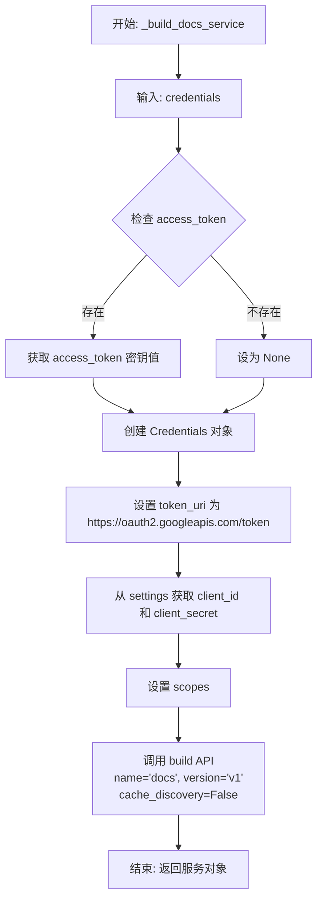

#### 带注释源码

```python
def _build_docs_service(credentials: GoogleCredentials):
    """Build Google Docs API service."""
    # 实例化 Google OAuth2 Credentials 对象
    # 从传入的 GoogleCredentials 对象中提取敏感信息（access_token 和 refresh_token）
    # 如果 token 不存在，则设为 None
    creds = Credentials(
        token=(
            credentials.access_token.get_secret_value()
            if credentials.access_token
            else None
        ),
        refresh_token=(
            credentials.refresh_token.get_secret_value()
            if credentials.refresh_token
            else None
        ),
        # 固定的 Google OAuth 2.0 令牌端点
        token_uri="https://oauth2.googleapis.com/token",
        # 从全局设置中获取 Google 应用的客户端 ID 和密钥
        client_id=settings.secrets.google_client_id,
        client_secret=settings.secrets.google_client_secret,
        # 设置 API 访问权限范围
        scopes=credentials.scopes,
    )
    # 使用 googleapiclient 构建 Docs 服务
    # 指定服务名称为 'docs'，版本为 'v1'
    # 传入构建的凭证对象，并禁用缓存发现以避免额外的文件 I/O 或缓存问题
    return build("docs", "v1", credentials=creds, cache_discovery=False)
```


### `_build_drive_service`

Build Google Drive API service for file operations. (构建用于文件操作的 Google Drive API 服务。)

参数：

-  `credentials`：`GoogleCredentials`，Google credentials object containing access token, refresh token, and scopes. (包含访问令牌、刷新令牌和作用域的 Google 凭据对象。)

返回值：`googleapiclient.discovery.Resource`，Authorized Google Drive API service object. (已授权的 Google Drive API 服务对象。)

#### 流程图

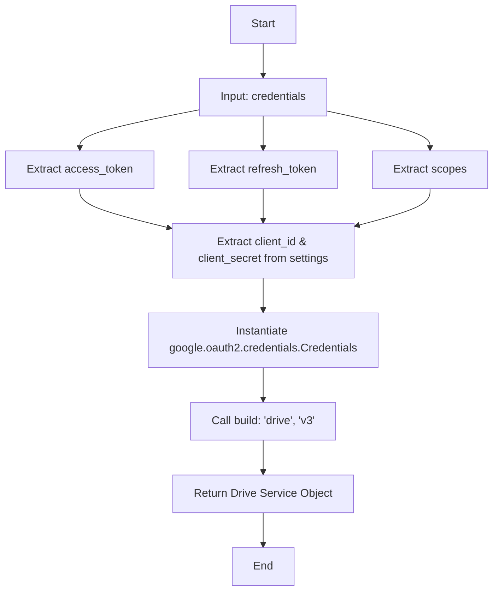

#### 带注释源码

```python
def _build_drive_service(credentials: GoogleCredentials):
    """Build Google Drive API service for file operations."""
    # Instantiate the Google OAuth2 Credentials object using the provided tokens
    # and the application's client ID/secret from settings.
    creds = Credentials(
        token=(
            # Safely extract the access token value if it exists
            credentials.access_token.get_secret_value()
            if credentials.access_token
            else None
        ),
        refresh_token=(
            # Safely extract the refresh token value if it exists
            credentials.refresh_token.get_secret_value()
            if credentials.refresh_token
            else None
        ),
        # Google's OAuth2 token endpoint
        token_uri="https://oauth2.googleapis.com/token",
        # OAuth2 Client ID from application settings
        client_id=settings.secrets.google_client_id,
        # OAuth2 Client Secret from application settings
        client_secret=settings.secrets.google_client_secret,
        # Scopes defining the level of access requested
        scopes=credentials.scopes,
    )
    # Build and return the Drive API v3 service object using the credentials
    return build("drive", "v3", credentials=creds, cache_discovery=False)
```


### `_validate_document_file`

验证给定的文件对象是否为有效的 Google 文档，确保文件具有 ID 且 MIME 类型正确。

参数：

-   `file`：`GoogleDriveFile`，待验证的文件对象，包含文件 ID 和 MIME 类型等信息。

返回值：`str | None`，如果验证通过（即文件是 Google Doc 且有 ID）返回 `None`；如果验证失败，返回包含具体错误描述的字符串。

#### 流程图

```mermaid
flowchart TD
    A[开始: 验证文件] --> B{file.id 是否存在?}
    B -- 否 --> C[返回: "No document ID provided"]
    B -- 是 --> D{file.mime_type 存在且<br/>!= "application/vnd.google-apps.document"?}
    D -- 是 --> E[返回: "File is not a Google Doc..."]
    D -- 否 --> F[返回: None]
    C --> G[结束]
    E --> G
    F --> G
```

#### 带注释源码

```python
def _validate_document_file(file: GoogleDriveFile) -> str | None:
    """Validate that a file is a Google Doc."""
    # 检查文件是否包含 ID，无 ID 则无法进行操作
    if not file.id:
        return "No document ID provided"
    
    # 检查文件的 MIME 类型
    # 如果类型存在且不等于 Google Docs 的标准类型，则视为无效
    if file.mime_type and file.mime_type != "application/vnd.google-apps.document":
        return f"File is not a Google Doc (type: {file.mime_type})"
    
    # 验证通过，无错误信息
    return None
```


### `_parse_hex_color_to_rgb_floats`

将CSS样式的十六进制颜色字符串解析为标准化的RGB浮点数元组。

参数：

-   `value`：`str`，待解析的十六进制颜色字符串（例如 "#FF0000", "0F0", "#abc"）。

返回值：`tuple[float, float, float] | None`，包含三个0.0到1.0之间浮点数（红、绿、蓝）的元组，如果输入格式无效则返回None。

#### 流程图

```mermaid
graph TD
    A[开始: _parse_hex_color_to_rgb_floats] --> B{value 是否为空?}
    B -- 是 --> C[返回 None]
    B -- 否 --> D[去除空白字符并移除前导 #]
    D --> E{匹配正则 [0-9a-fA-F]{3,6}?}
    E -- 否 --> C
    E -- 是 --> F{长度是否为 3?}
    F -- 是 --> G[展开简写形式: 每个字符重复一次]
    F -- 否 --> H[保持原始 6 位字符串]
    G --> I[解析 R, G, B 为十六进制整数]
    H --> I
    I --> J[归一化: 将 R, G, B 除以 255.0]
    J --> K[返回元组 R, G, B]
```

#### 带注释源码

```python
def _parse_hex_color_to_rgb_floats(value: str) -> tuple[float, float, float] | None:
    """
    Parse a CSS-like hex color string into normalized RGB floats.

    Supports:
    - #RGB / RGB (shorthand)
    - #RRGGBB / RRGGBB

    Returns None for malformed inputs.
    """
    # 检查输入是否为空，如果为空直接返回 None
    if not value:
        return None

    # 去除字符串两端的空白字符
    raw = value.strip()
    # 如果字符串以 '#' 开头，则移除它
    if raw.startswith("#"):
        raw = raw[1:]

    # 使用正则表达式验证格式：必须是3位或6位的十六进制字符
    # 如果不符合格式，返回 None
    if not re.fullmatch(r"[0-9a-fA-F]{3}([0-9a-fA-F]{3})?", raw):
        return None

    # 如果是3位简写形式（例如 "F00"），则展开为6位形式（例如 "FF0000"）
    if len(raw) == 3:
        raw = "".join(ch * 2 for ch in raw)

    # 将前两位、中间两位、后两位分别解析为红、绿、蓝的十六进制整数
    # 然后除以 255.0 进行归一化处理，范围从 0-255 变为 0.0-1.0
    r = int(raw[0:2], 16) / 255.0
    g = int(raw[2:4], 16) / 255.0
    b = int(raw[4:6], 16) / 255.0
    
    # 返回包含 RGB 三个浮点数的元组
    return (r, g, b)
```


### `_get_document_end_index`

获取 Google Docs 文档正文的结束索引位置，用于确定追加内容时的插入点。

参数：

-   `service`：`googleapiclient.discovery.Resource`，已认证的 Google Docs API 服务对象，用于执行文档操作。
-   `document_id`：`str`，目标 Google Docs 文档的唯一标识符。

返回值：`int`，文档正文的结束索引（具体为文档最后一个结构元素的 `endIndex` 减 1）。

#### 流程图

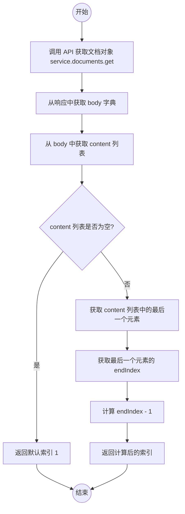

#### 带注释源码

```python
def _get_document_end_index(service, document_id: str) -> int:
    """Get the index at the end of the document body."""
    # 调用 Google Docs API 获取文档的完整结构数据
    doc = service.documents().get(documentId=document_id).execute()
    
    # 提取文档主体结构
    body = doc.get("body", {})
    
    # 获取主体内容列表（包含段落、表格等结构元素）
    content = body.get("content", [])
    
    if content:
        # 如果文档有内容，取最后一个结构元素
        last_element = content[-1]
        # 返回该元素的 endIndex 减 1
        # 注意：Google Docs API 中元素通常包含末尾的换行符，
        # 减 1 通常是为了定位到最后一个实际字符之后或换行符之前的位置，
        # 视具体的插入逻辑需求而定（此处代码逻辑为 endIndex - 1）
        return last_element.get("endIndex", 1) - 1
    
    # 如果文档为空，返回起始索引 1
    return 1
```


### `_extract_text_from_content`

从 Google Docs API 返回的文档内容结构列表中提取纯文本。该函数处理段落和表格，并对表格单元格内容进行递归提取以获取所有文本。

参数：

-   `content`：`list[dict]`，Google Docs 文档主体内容结构列表，包含段落、表格等结构元素。

返回值：`str`，从文档结构中提取并拼接后的完整纯文本字符串。

#### 流程图

```mermaid
flowchart TD
    A[开始: _extract_text_from_content] --> B[初始化 text_parts = []]
    B --> C[遍历 content 列表中的 element]
    C --> D{element 中是否包含 'paragraph'?}
    D -- 是 --> E[遍历 element['paragraph'] 中的 elem]
    E --> F{elem 中是否包含 'textRun'?}
    F -- 是 --> G[提取 elem['textRun']['content'] 并追加到 text_parts]
    F -- 否 --> H[继续下一个 elem]
    G --> H
    H --> C
    D -- 否 --> I{element 中是否包含 'table'?}
    I -- 是 --> J[遍历 element['table'] 中的行 row]
    J --> K[遍历 row 中的单元格 cell]
    K --> L[获取 cell['content']]
    L --> M[递归调用 _extract_text_from_content 处理 cell_content]
    M --> N[将递归返回的文本追加到 text_parts]
    N --> K
    K --> O[行遍历结束]
    O --> C
    I -- 否 --> C
    C -- 循环结束 --> P[将 text_parts 列表合并为字符串并返回]
    P --> Q[结束]
```

#### 带注释源码

```python
def _extract_text_from_content(content: list[dict]) -> str:
    """Extract plain text from document content structure."""
    # 初始化列表用于存储提取的文本片段
    text_parts = []
    
    # 遍历文档内容结构中的每一个元素（可能是段落、表格等）
    for element in content:
        # 如果元素是段落
        if "paragraph" in element:
            # 遍历段落中的子元素
            for elem in element["paragraph"].get("elements", []):
                # 如果子元素包含文本运行
                if "textRun" in elem:
                    # 提取纯文本内容并添加到列表中
                    text_parts.append(elem["textRun"].get("content", ""))
        
        # 如果元素是表格
        elif "table" in element:
            # 遍历表格中的每一行
            for row in element["table"].get("tableRows", []):
                # 遍历行中的每一个单元格
                for cell in row.get("tableCells", []):
                    # 获取单元格的内容
                    cell_content = cell.get("content", [])
                    # 递归调用自身以提取单元格内部的文本（处理嵌套结构）
                    # 并将提取的文本添加到列表中
                    text_parts.append(_extract_text_from_content(cell_content))
    
    # 将所有提取的文本片段拼接成一个完整的字符串并返回
    return "".join(text_parts)
```


### `_make_document_output`

创建标准化的 Google 文档输出对象，用于在代码块之间传递数据。该函数接收一个基础的 Google Drive 文件对象，并将其转换为包含特定 Google Docs 属性（如标准 URL、图标和 MIME 类型）的标准对象，确保下游操作的一致性。

参数：

-   `file`：`GoogleDriveFile`，输入的 Google Drive 文件对象，包含文档 ID、名称和凭证信息。

返回值：`GoogleDriveFile`，标准化的 Google Drive 文件对象，包含预填充的 URL、图标、MIME 类型等属性，适合作为输出进行链式调用。

#### 流程图

```mermaid
graph TD
    A[开始: _make_document_output] --> B[接收输入参数: file]
    B --> C[提取 file.id 和 file.name]
    C --> D[构建标准 Docs URL: https://docs.google.com/document/d/{id}/edit]
    D --> E[实例化 GoogleDriveFile 对象]
    E --> F[设置 mimeType 为 'application/vnd.google-apps.document']
    F --> G[设置标准 iconUrl]
    G --> H[设置 isFolder 为 False]
    H --> I[保留 file._credentials_id]
    I --> J[返回: 标准化的 GoogleDriveFile 对象]
    J --> K[结束]
```

#### 带注释源码

```python
def _make_document_output(file: GoogleDriveFile) -> GoogleDriveFile:
    """Create standardized document output for chaining."""
    return GoogleDriveFile(
        # 保留传入文件的 ID，用于定位特定文档
        id=file.id,
        # 保留传入文件的名称
        name=file.name,
        # 强制指定 MIME 类型为 Google Docs 文档类型，确保类型正确
        mimeType="application/vnd.google-apps.document",
        # 根据文件 ID 生成标准的 Google Docs 在线编辑链接
        url=f"https://docs.google.com/document/d/{file.id}/edit",
        # 使用 Google 官方提供的标准文档图标 URL
        iconUrl="https://www.gstatic.com/images/branding/product/1x/docs_48dp.png",
        # 标记该文件不是文件夹
        isFolder=False,
        # 保留凭证 ID，以便后续操作可以使用相同的身份验证
        _credentials_id=file.credentials_id,
    )
```


### `GoogleDocsReadBlock.run`

该方法是 `GoogleDocsReadBlock` 的核心执行逻辑，负责从 Google Docs 读取文档内容。它首先验证输入的文档对象是否存在及其类型是否合法，然后构建 Google Docs API 服务对象，通过异步线程调度执行同步的 API 请求以获取文档内容，最终生成包含纯文本、标题和文档元数据的输出结果，或者在出现错误时生成错误信息。

参数：

- `input_data`：`Input`，包含需要读取的 Google Drive 文档对象的输入数据结构。
- `credentials`：`GoogleCredentials`，用于进行 Google API 身份验证的凭证对象。
- `**kwargs`：`Any`，其他可选的关键字参数。

返回值：`BlockOutput`，一个异步生成器，按顺序产生 `text` (文档文本)、`title` (文档标题)、`document` (标准化文档对象) 或 `error` (错误信息)。

#### 流程图

```mermaid
graph TD
    A[开始执行] --> B{检查 input_data.document 是否存在}
    B -- 否 --> C[产生 error: No document selected]
    C --> D[返回结束]
    B -- 是 --> E[调用 _validate_document_file 验证文件]
    E -- 验证失败 --> F[产生 error: 验证错误信息]
    F --> D
    E -- 验证通过 --> G[调用 _build_docs_service 构建 API 服务]
    G --> H[使用 asyncio.to_thread 异步执行 _read_document]
    H --> I[获取 result {text, title}]
    I --> J[产生 text: 文档纯文本内容]
    J --> K[产生 title: 文档标题]
    K --> L[产生 document: 标准化的文档对象]
    L --> M[正常结束]
    H -- 发生异常 --> N[捕获异常 Exception]
    N --> O[产生 error: Failed to read document: 异常信息]
    O --> M
```

#### 带注释源码

```python
async def run(
    self, input_data: Input, *, credentials: GoogleCredentials, **kwargs
) -> BlockOutput:
    # 检查输入数据中是否包含文档对象
    if not input_data.document:
        yield "error", "No document selected"
        return

    # 验证文件是否为有效的 Google Doc (检查 ID 和 MIME 类型)
    validation_error = _validate_document_file(input_data.document)
    if validation_error:
        yield "error", validation_error
        return

    try:
        # 使用提供的凭证构建 Google Docs API 服务客户端
        service = _build_docs_service(credentials)
        
        # 在单独的线程中运行同步的文档读取操作，避免阻塞事件循环
        # self._read_document 负责实际调用 API 获取文档结构和提取文本
        result = await asyncio.to_thread(
            self._read_document,
            service,
            input_data.document.id,
        )
        
        # 依次产生输出结果
        yield "text", result["text"]
        yield "title", result["title"]
        yield "document", _make_document_output(input_data.document)
    except Exception as e:
        # 捕获并处理读取过程中可能发生的任何异常
        yield "error", f"Failed to read document: {str(e)}"
```


### `GoogleDocsReadBlock._read_document`

从 Google Docs API 获取文档内容，提取标题和纯文本内容。

参数：

- `service`：`googleapiclient.discovery.Resource`，已授权的 Google Docs API 服务对象。
- `document_id`：`str`，要读取的 Google 文档的唯一标识符。

返回值：`dict`，包含文档提取的文本 (`text`) 和文档标题 (`title`) 的字典。

#### 流程图

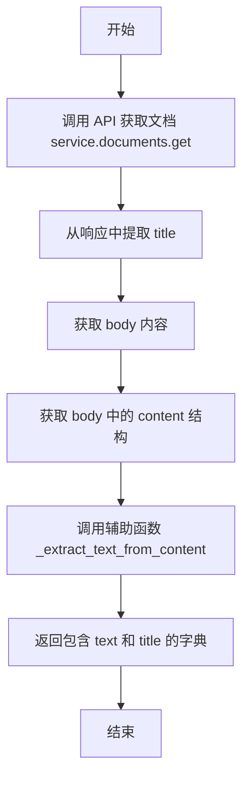

#### 带注释源码

```python
    def _read_document(self, service, document_id: str) -> dict:
        # 调用 Google Docs API 的 get 方法获取指定文档的完整元数据和结构
        doc = service.documents().get(documentId=document_id).execute()
        
        # 从文档对象中提取标题，如果不存在则默认为空字符串
        title = doc.get("title", "")
        
        # 获取文档的主体内容部分
        body = doc.get("body", {})
        
        # 获取主体内容中的结构化元素列表（如段落、表格等）
        content = body.get("content", [])
        
        # 调用辅助函数解析结构化内容，提取纯文本
        text = _extract_text_from_content(content)
        
        # 返回包含提取的文本和标题的字典
        return {"text": text, "title": title}
```


### `GoogleDocsCreateBlock.run`

该方法负责创建一个新的 Google 文档。它接收包含标题和初始内容的输入数据，利用提供的凭证初始化 Google Drive 和 Docs 服务，异步执行创建操作，并返回包含文档元数据、ID 和 URL 的结果。

参数：

-  `input_data`：`Input`，包含新文档的标题 (`title`) 和可选的初始内容 (`initial_content`) 以及凭证引用的数据模型。
-  `credentials`：`GoogleCredentials`，用于认证和授权访问 Google API 的 OAuth2 凭证对象。
-  `**kwargs`：`Any`，其他可选的关键字参数。

返回值：`BlockOutput`，一个生成器，逐步产生文档对象 (`document`)、文档 ID (`document_id`)、文档 URL (`document_url`) 或错误信息 (`error`)。

#### 流程图

```mermaid
graph TD
    A[开始: run 方法调用] --> B{检查 input_data.title 是否存在?}
    B -- 否 --> C[生成 error: 'Document title is required']
    C --> D[结束返回]
    B -- 是 --> E[进入 Try 异常处理块]
    E --> F[调用 _build_drive_service 构建 Drive 服务]
    F --> G[调用 _build_docs_service 构建 Docs 服务]
    G --> H[通过 asyncio.to_thread 异步执行 _create_document]
    H --> I{执行是否抛出异常?}
    I -- 是 --> J[捕获 Exception e]
    J --> K[生成 error: 'Failed to create document: {str(e)}']
    K --> D
    I -- 否 --> L[获取 document_id 和 document_url]
    L --> M[生成 document: GoogleDriveFile 对象]
    M --> N[生成 document_id]
    N --> O[生成 document_url]
    O --> D
```

#### 带注释源码

```python
    async def run(
        self, input_data: Input, *, credentials: GoogleCredentials, **kwargs
    ) -> BlockOutput:
        # 验证输入：如果未提供文档标题，则立即返回错误
        if not input_data.title:
            yield "error", "Document title is required"
            return

        try:
            # 使用提供的凭证构建 Google Drive API 服务对象
            # 用于处理文件的创建元数据
            drive_service = _build_drive_service(credentials)
            # 使用提供的凭证构建 Google Docs API 服务对象
            # 用于处理文档内容的编辑
            docs_service = _build_docs_service(credentials)
            
            # 在单独的线程中运行同步的 API 调用，以避免阻塞异步事件循环
            # 传入服务对象、标题和初始内容
            result = await asyncio.to_thread(
                self._create_document,
                drive_service,
                docs_service,
                input_data.title,
                input_data.initial_content,
            )
            
            # 从创建结果中提取文档 ID 和 URL
            doc_id = result["document_id"]
            doc_url = result["document_url"]
            
            # 生成并返回标准化的文档文件对象，包含 ID、名称、MIME 类型、URL 等
            yield "document", GoogleDriveFile(
                id=doc_id,
                name=input_data.title,
                mimeType="application/vnd.google-apps.document",
                url=doc_url,
                iconUrl="https://www.gstatic.com/images/branding/product/1x/docs_48dp.png",
                isFolder=False,
                _credentials_id=input_data.credentials.id,
            )
            # 单独生成文档 ID
            yield "document_id", doc_id
            # 单独生成文档 URL
            yield "document_url", doc_url
        except Exception as e:
            # 捕获任何在 API 交互过程中发生的异常，并生成错误信息
            yield "error", f"Failed to create document: {str(e)}"
```


### `GoogleDocsCreateBlock._create_document`

该方法负责创建一个新的 Google 文档。它首先通过 Google Drive API 创建一个指定标题的空文件，然后如果提供了初始内容，再通过 Google Docs API 将文本插入到文档中。

参数：

- `drive_service`：`Any`，用于文件创建操作的 Google Drive API 服务对象。
- `docs_service`：`Any`，用于内容更新操作的 Google Docs API 服务对象。
- `title`：`str`，新建文档的标题。
- `initial_content`：`str`，可选参数，新文档的初始文本内容。

返回值：`dict`，包含新建文档的 `document_id`、`document_url` 和 `title` 的字典。

#### 流程图

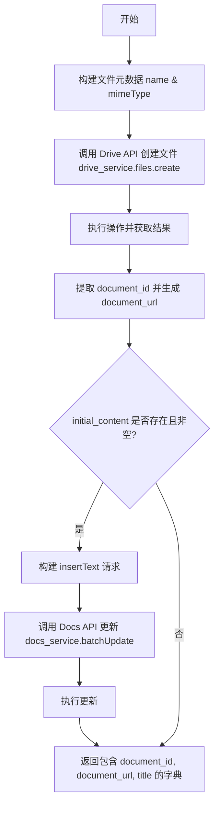

#### 带注释源码

```python
def _create_document(
    self, drive_service, docs_service, title: str, initial_content: str
) -> dict:
    # 定义创建文档所需的元数据，包括名称和 MIME 类型
    file_metadata = {
        "name": title,
        "mimeType": "application/vnd.google-apps.document",
    }
    # 使用 Drive Service 创建文件，获取包含 ID 的响应
    result = drive_service.files().create(body=file_metadata).execute()
    document_id = result.get("id")
    document_url = f"https://docs.google.com/document/d/{document_id}/edit"

    # 如果提供了初始内容，构造插入文本的请求
    if initial_content:
        requests = [
            {
                "insertText": {
                    "location": {"index": 1},
                    "text": initial_content,
                }
            }
        ]
        # 使用 Docs Service 执行批量更新，写入初始内容
        docs_service.documents().batchUpdate(
            documentId=document_id, body={"requests": requests}
        ).execute()

    # 返回文档的 ID、URL 和 标题
    return {
        "document_id": document_id,
        "document_url": document_url,
        "title": title,
    }
```


### `GoogleDocsAppendPlainTextBlock.run`

将纯文本追加到 Google 文档末尾。该方法首先验证输入的文档对象及其类型，然后构建 Google Docs API 服务。通过异步线程执行实际的文本追加操作，以避免阻塞事件循环。成功后返回操作结果和文档对象，失败则返回错误信息。

参数：

- `input_data`：`GoogleDocsAppendPlainTextBlock.Input`，包含目标文档、待追加文本及是否在追加前添加换行符的配置。
- `credentials`：`GoogleCredentials`，用于访问 Google Docs API 的 OAuth2 凭证。
- `**kwargs`：`typing.Any`，额外的关键字参数。

返回值：`BlockOutput`，异步生成器，产生包含操作结果、更新后的文档对象或错误信息的键值对。

#### 流程图

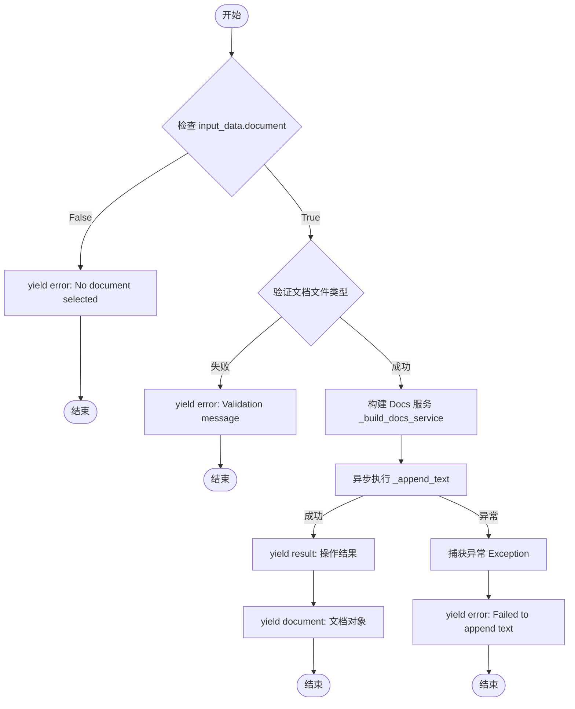

#### 带注释源码

```python
    async def run(
        self, input_data: Input, *, credentials: GoogleCredentials, **kwargs
    ) -> BlockOutput:
        # 检查输入数据中是否包含文档对象，如果没有则返回错误
        if not input_data.document:
            yield "error", "No document selected"
            return

        # 调用辅助函数验证文件是否为有效的 Google Doc
        validation_error = _validate_document_file(input_data.document)
        if validation_error:
            yield "error", validation_error
            return

        try:
            # 使用凭证构建 Google Docs API 服务对象
            service = _build_docs_service(credentials)
            # 在单独的线程中运行同步的 _append_text 方法，防止阻塞事件循环
            # 传入服务对象、文档ID、文本内容和换行符标志
            result = await asyncio.to_thread(
                self._append_text,
                service,
                input_data.document.id,
                input_data.text,
                input_data.add_newline,
            )
            # 输出操作结果字典（例如包含 success 状态和字符数）
            yield "result", result
            # 输出标准化后的文档对象，用于后续操作链式调用
            yield "document", _make_document_output(input_data.document)
        except Exception as e:
            # 捕获运行过程中的异常并输出错误信息
            yield "error", f"Failed to append text: {str(e)}"
```


### `GoogleDocsAppendPlainTextBlock._append_text`

将纯文本内容追加到指定 Google 文档的末尾。该方法根据文档当前的结束位置计算插入点，可选择在文本前添加换行符，并通过 Google Docs API 的批量更新接口执行插入操作。

参数：

- `service`：`googleapiclient.discovery.Resource`，已认证的 Google Docs API 服务对象，用于执行文档操作。
- `document_id`：`str`，目标 Google 文档的唯一标识符。
- `text`：`str`，需要追加到文档末尾的纯文本内容。
- `add_newline`：`bool`，标志位，如果为 True，则在插入文本前先添加一个换行符。

返回值：`dict`，包含操作结果的字典，包含 `success`（布尔值，表示是否成功）和 `characters_added`（整数，表示实际添加的字符数量）。

#### 流程图

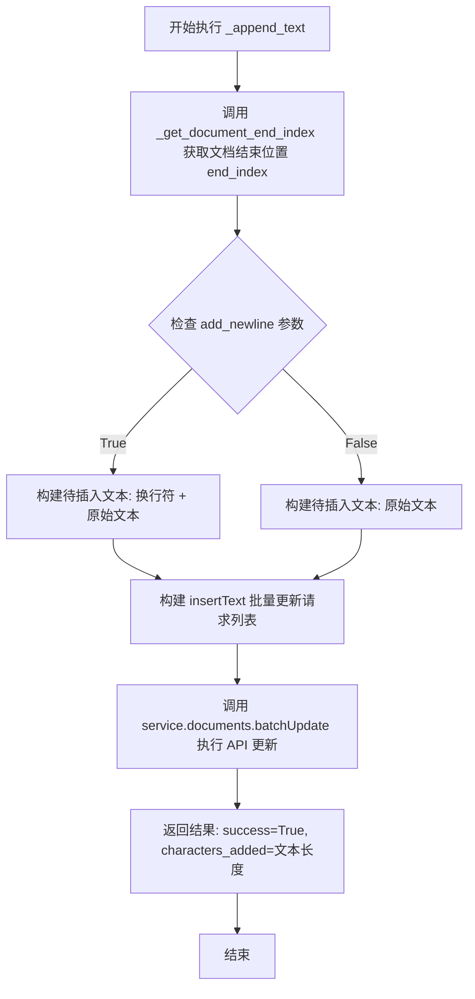

#### 带注释源码

```python
def _append_text(
    self, service, document_id: str, text: str, add_newline: bool
) -> dict:
    # 获取文档当前的结束索引，作为新文本的插入位置
    end_index = _get_document_end_index(service, document_id)
    
    # 根据参数决定是否在待追加的文本前添加换行符，以保证格式排版
    text_to_insert = ("\n" if add_newline else "") + text

    # 构建 Google Docs API 的批量更新请求
    # insertText 请求包含位置索引和具体的文本内容
    requests = [
        {
            "insertText": {
                "location": {"index": end_index},
                "text": text_to_insert,
            }
        }
    ]

    # 通过服务对象执行批量更新操作，将写入请求发送到 Google Docs
    service.documents().batchUpdate(
        documentId=document_id, body={"requests": requests}
    ).execute()

    # 返回包含操作状态和添加字符数的字典
    return {"success": True, "characters_added": len(text_to_insert)}
```


### `GoogleDocsInsertPlainTextBlock.run`

该方法是 `GoogleDocsInsertPlainTextBlock` 的核心执行逻辑，用于在 Google 文档的指定索引位置插入纯文本内容，且不应用任何格式。

参数：

-  `input_data`：`GoogleDocsInsertPlainTextBlock.Input`，包含目标文档对象（`document`）、待插入的纯文本（`text`）以及插入位置索引（`index`）。
-  `credentials`：`GoogleCredentials`，用于身份验证和授权访问 Google Docs API 的凭证。
-  `**kwargs`：`Any`，额外的关键字参数，通常由框架上下文传递。

返回值：`BlockOutput`，异步生成器，生成包含操作结果字典或更新后的文档对象的元组，若失败则生成错误信息。

#### 流程图

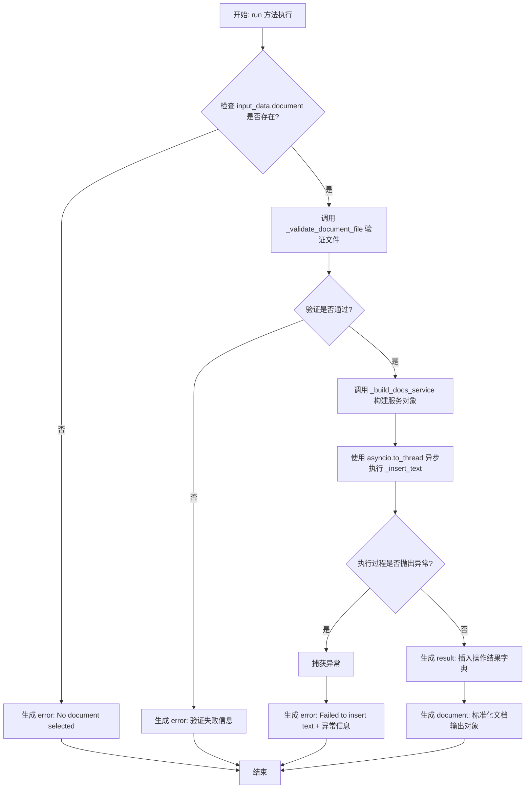

#### 带注释源码

```python
    async def run(
        self, input_data: Input, *, credentials: GoogleCredentials, **kwargs
    ) -> BlockOutput:
        # 1. 检查是否选择了目标文档
        if not input_data.document:
            yield "error", "No document selected"
            return

        # 2. 验证文件对象是否为有效的 Google Doc（检查 ID 和 MIME 类型）
        validation_error = _validate_document_file(input_data.document)
        if validation_error:
            yield "error", validation_error
            return

        try:
            # 3. 构建 Google Docs API 服务实例
            service = _build_docs_service(credentials)
            
            # 4. 在单独的线程中同步执行插入文本操作，避免阻塞事件循环
            result = await asyncio.to_thread(
                self._insert_text,
                service,
                input_data.document.id,
                input_data.text,
                input_data.index,
            )
            
            # 5. 输出操作结果
            yield "result", result
            
            # 6. 输出标准化的文档对象以便于后续链式操作
            yield "document", _make_document_output(input_data.document)
        except Exception as e:
            # 7. 捕获并处理任何异常，输出错误信息
            yield "error", f"Failed to insert text: {str(e)}"
```


### `GoogleDocsInsertPlainTextBlock._insert_text`

该方法负责将纯文本内容插入到 Google Docs 文档的指定索引位置。它构造一个 Google Docs API 的批量更新请求，确保索引至少为 1（文档开头），执行插入操作后返回操作结果。

参数：

- `service`：`googleapiclient.discovery.Resource`，已认证的 Google Docs API 服务对象，用于与 Google 交互。
- `document_id`：`str`，目标 Google 文档的唯一标识符。
- `text`：`str`，需要插入到文档中的纯文本内容。
- `index`：`int`，插入位置的位置索引（1 表示文档开头）。

返回值：`dict`，包含操作状态的字典，键包括 `success`（布尔值）和 `characters_inserted`（插入的字符数）。

#### 流程图

```mermaid
flowchart TD
    A[开始] --> B[构建插入请求<br/>InsertText]
    B --> C[校验并设置插入位置索引<br/>location.index = max(1, index)]
    C --> D[调用 API 批量更新<br/>service.documents.batchUpdate]
    D --> E[执行请求<br/>.execute]
    E --> F[构造返回结果<br/>{success: True, characters_inserted: len(text)}]
    F --> G[结束]
```

#### 带注释源码

```python
    def _insert_text(self, service, document_id: str, text: str, index: int) -> dict:
        # 构造 Google Docs API 的请求列表
        requests = [
            {
                "insertText": {
                    # 设置插入位置，确保索引至少为 1，防止非法位置
                    "location": {"index": max(1, index)},
                    " 设置要插入的文本内容
                    "text": text,
                }
            }
        ]

        # 调用 Google Docs API 的 batchUpdate 方法执行批量更新
        service.documents().batchUpdate(
            documentId=document_id, body={"requests": requests}
        ).execute()

        # 返回包含成功状态和插入字符数的字典
        return {"success": True, "characters_inserted": len(text)}
```


### `GoogleDocsFindReplacePlainTextBlock.run`

执行在 Google 文档中查找并替换纯文本的核心异步逻辑，处理输入验证、服务构建、API 调用及结果返回。

参数：

-   `input_data`：`GoogleDocsFindReplacePlainTextBlock.Input`，包含目标文档对象、查找的文本、替换的文本以及是否区分大小写的配置信息。
-   `credentials`：`GoogleCredentials`，用于授权访问 Google Docs API 的 OAuth2 凭证。

返回值：`BlockOutput`，一个异步生成器，产出包含操作结果（替换次数）、文档对象（用于链式调用）或错误信息的键值对。

#### 流程图

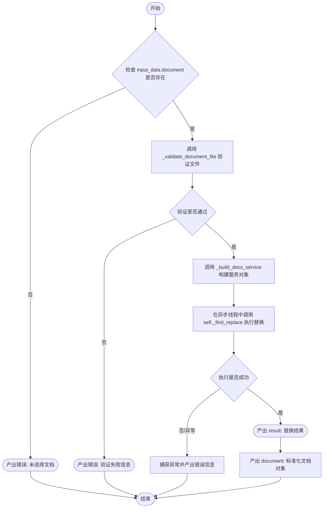

#### 带注释源码

```python
    async def run(
        self, input_data: Input, *, credentials: GoogleCredentials, **kwargs
    ) -> BlockOutput:
        # 检查是否选择了文档
        if not input_data.document:
            yield "error", "No document selected"
            return

        # 验证文件是否为有效的 Google Docs 文档
        validation_error = _validate_document_file(input_data.document)
        if validation_error:
            yield "error", validation_error
            return

        try:
            # 使用凭证构建 Google Docs API 服务对象
            service = _build_docs_service(credentials)
            
            # 在单独的线程中运行同步的 _find_replace 方法，避免阻塞事件循环
            result = await asyncio.to_thread(
                self._find_replace,
                service,
                input_data.document.id,
                input_data.find_text,
                input_data.replace_text,
                input_data.match_case,
            )
            # 返回操作结果（包含替换次数）
            yield "result", result
            # 返回标准化的文档对象以便后续操作链式调用
            yield "document", _make_document_output(input_data.document)
        except Exception as e:
            # 捕获并返回任何执行过程中的异常
            yield "error", f"Failed to find/replace: {str(e)}"
```


### `GoogleDocsFindReplacePlainTextBlock._find_replace`

执行 Google Docs 的批量更新操作，在文档中查找指定的纯文本并将其替换为新的文本内容，返回替换发生的次数统计。

参数：

- `self`：`GoogleDocsFindReplacePlainTextBlock`，类的实例自身
- `service`：`googleapiclient.discovery.Resource`，已认证的 Google Docs API 服务对象
- `document_id`：`str`，目标 Google 文档的唯一标识符
- `find_text`：`str`，需要在文档中查找的纯文本内容
- `replace_text`：`str`，用于替换查找到的文本的新内容（纯文本，无格式）
- `match_case`：`bool`，是否在查找时区分大小写

返回值：`dict`，包含操作结果和替换计数的字典，例如 `{"success": True, "replacements_made": 3}`

#### 流程图

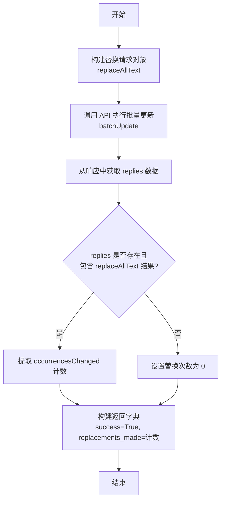

#### 带注释源码

```python
    def _find_replace(
        self,
        service,
        document_id: str,
        find_text: str,
        replace_text: str,
        match_case: bool,
    ) -> dict:
        # 构建 Google Docs API 的批量更新请求列表
        # 使用 replaceAllText 功能来查找并替换所有匹配项
        requests = [
            {
                "replaceAllText": {
                    "containsText": {
                        "text": find_text,          # 要查找的文本
                        "matchCase": match_case,    # 是否区分大小写
                    },
                    "replaceText": replace_text,   # 替换后的文本
                }
            }
        ]

        # 调用 Google Docs API 的 batchUpdate 方法执行请求
        response = (
            service.documents()
            .batchUpdate(documentId=document_id, body={"requests": requests})
            .execute()
        )

        # 从 API 响应中获取操作结果（replies）
        replies = response.get("replies", [])
        replacements = 0
        
        # 检查响应中是否包含具体的替换结果数据
        if replies and "replaceAllText" in replies[0]:
            # 提取实际发生替换的次数
            replacements = replies[0]["replaceAllText"].get("occurrencesChanged", 0)

        # 返回包含成功状态和替换计数的字典
        return {"success": True, "replacements_made": replacements}
```


### `GoogleDocsGetMetadataBlock.run`

获取指定 Google 文档的元数据信息，包括标题、文档 ID、修订 ID 和 URL，并进行错误处理和输入验证。

参数：

-   `input_data`：`GoogleDocsGetMetadataBlock.Input`，包含目标 Google 文档对象的输入数据。
-   `credentials`：`GoogleCredentials`，用于访问 Google Docs API 的 OAuth2 凭证。
-   `kwargs`：`typing.Any`，额外的关键字参数。

返回值：`BlockOutput`，生成器，逐步产出文档标题、文档 ID、修订 ID、文档 URL、文档对象本身，或在出错时产出错误信息。

#### 流程图

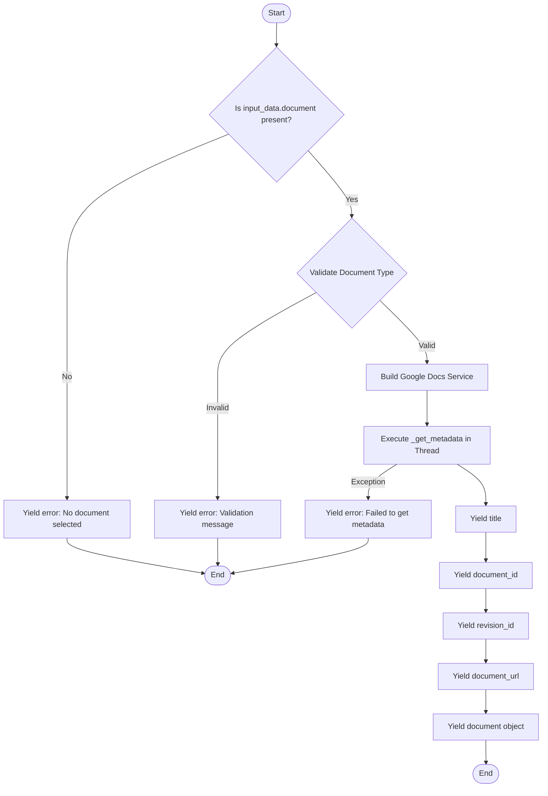

#### 带注释源码

```python
    async def run(
        self, input_data: Input, *, credentials: GoogleCredentials, **kwargs
    ) -> BlockOutput:
        # 检查是否提供了文档对象
        if not input_data.document:
            yield "error", "No document selected"
            return

        # 验证文件是否为有效的 Google Doc (检查 ID 和 MIME 类型)
        validation_error = _validate_document_file(input_data.document)
        if validation_error:
            yield "error", validation_error
            return

        try:
            # 使用提供的凭证构建 Google Docs API 服务对象
            service = _build_docs_service(credentials)
            
            # 在单独的线程中执行同步的 _get_metadata 操作，避免阻塞事件循环
            result = await asyncio.to_thread(
                self._get_metadata,
                service,
                input_data.document.id,
            )
            
            # 产出提取的元数据字段
            yield "title", result["title"]
            yield "document_id", input_data.document.id
            yield "revision_id", result["revision_id"]
            yield "document_url", f"https://docs.google.com/document/d/{input_data.document.id}/edit"
            
            # 产出标准化的文档对象，以便在后续工作流中链接使用
            yield "document", _make_document_output(input_data.document)
        except Exception as e:
            # 捕获运行时异常并产出错误信息
            yield "error", f"Failed to get metadata: {str(e)}"
```


### `GoogleDocsGetMetadataBlock._get_metadata`

通过调用 Google Docs API 服务，检索指定 Google 文档的元数据（主要是标题和修订 ID）。

参数：

- `service`：`Any`，已认证的 Google Docs API 服务对象，用于执行 API 请求。
- `document_id`：`str`，要获取元数据的 Google 文档的唯一标识符。

返回值：`dict`，包含文档标题 (`title`) 和修订 ID (`revision_id`) 的字典。

#### 流程图

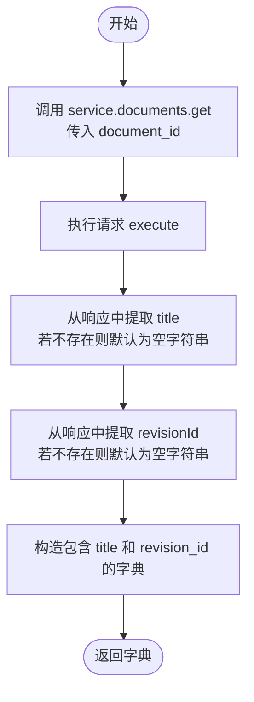

#### 带注释源码

```python
def _get_metadata(self, service, document_id: str) -> dict:
    # 使用 Google Docs API 服务获取文档对象
    doc = service.documents().get(documentId=document_id).execute()
    
    # 返回包含文档标题和修订 ID 的字典
    return {
        "title": doc.get("title", ""),         # 获取标题，若无则为空字符串
        "revision_id": doc.get("revisionId", ""), # 获取修订 ID，若无则为空字符串
    }
```


### `GoogleDocsInsertTableBlock.run`

该方法负责在 Google 文档中插入表格。它首先验证输入的文档和内容，确定表格的行数和列数（根据提供的内容或默认值），然后调用 Google Docs API 异步执行插入操作。

参数：

- `input_data`：`Input`，包含目标文档、表格行/列数（或内容矩阵）、插入位置索引以及是否启用 Markdown 格式化的配置。
- `credentials`：`GoogleCredentials`，用于认证和访问 Google Docs API 的 OAuth2 凭证。
- `**kwargs`：`Any`，框架传递的额外关键字参数。

返回值：`BlockOutput`，一个异步生成器，逐步产生 `result`（插入结果）、`document`（用于链接的文档对象）或 `error`（错误信息）。

#### 流程图

```mermaid
flowchart TD
    Start([开始]) --> CheckDoc{检查 input_data.document 是否存在}
    CheckDoc -- 否 --> YieldError1[yield "error", "No document selected"]
    YieldError1 --> End1([结束])
    CheckDoc -- 是 --> ValidateDoc[调用 _validate_document_file 验证文档]

    ValidateDoc --> CheckValid{验证是否通过?}
    CheckValid -- 否 --> YieldError2[yield "error", validation_error]
    YieldError2 --> End2([结束])
    CheckValid -- 是 --> ProcessContent[检查 content 结构与内容]

    ProcessContent --> HasContent{content 是否有效且有内容?}
    HasContent -- 是 --> SetDimensions[设置 rows = len content<br>设置 columns = max row length]
    HasContent -- 否 --> UseDefaults[使用 input_data.rows 和 input_data.columns<br>清空 content 变量]

    SetDimensions --> BuildService[调用 _build_docs_service 构建 API 服务]
    UseDefaults --> BuildService

    BuildService --> AsyncThread[通过 asyncio.to_thread 调用 _insert_table]
    
    AsyncThread --> YieldResult[yield "result", result]
    YieldResult --> YieldDoc[yield "document", document_output]
    
    YieldDoc --> End3([正常结束])

    subgraph ExceptionHandler [异常处理]
        Start -.-> |发生异常| CatchError[捕获 Exception e]
        CatchError --> YieldError3[yield "error", "Failed to insert table: {e}"]
        YieldError3 --> End4([异常结束])
    end
```

#### 带注释源码

```python
    async def run(
        self, input_data: Input, *, credentials: GoogleCredentials, **kwargs
    ) -> BlockOutput:
        # 1. 检查是否选择了文档
        if not input_data.document:
            yield "error", "No document selected"
            return

        # 2. 验证文件类型是否为 Google Doc
        validation_error = _validate_document_file(input_data.document)
        if validation_error:
            yield "error", validation_error
            return

        # 3. 处理内容和表格尺寸逻辑
        # 获取输入的内容矩阵
        content = input_data.content

        # 检查内容有效性：是否有行，行内是否有单元格，且至少有一个非空单元格
        has_valid_structure = bool(content and any(len(row) > 0 for row in content))
        has_content = has_valid_structure and any(
            cell for row in content for cell in row
        )

        if has_content:
            # 如果提供了有效内容，根据内容推导行数和列数
            rows = len(content)
            columns = max(len(row) for row in content)
        else:
            # 如果没有有效内容，使用显式指定的行数和列数，并清空 content 以跳过填充步骤
            rows = input_data.rows
            columns = input_data.columns
            content = []  # Clear so we skip population step

        try:
            # 4. 构建 Google Docs API 服务对象
            service = _build_docs_service(credentials)
            
            # 5. 在单独的线程中执行同步的 _insert_table 操作，避免阻塞事件循环
            result = await asyncio.to_thread(
                self._insert_table,
                service,
                input_data.document.id,
                rows,
                columns,
                input_data.index,
                content,
                input_data.format_as_markdown,
            )
            
            # 6. 返回操作结果
            yield "result", result
            # 7. 返回标准化的文档对象用于后续流程链接
            yield "document", _make_document_output(input_data.document)
        except Exception as e:
            # 8. 捕获并处理异常，返回错误信息
            yield "error", f"Failed to insert table: {str(e)}"
```


### `GoogleDocsInsertTableBlock._insert_table`

 Inserts a table structure into a Google Document at a specific location and populates its cells with provided content, supporting either plain text or Markdown formatting. The method handles index resolution (inserting at the end if index is 0), locates the newly created table within the document structure, and efficiently updates cells either in a single batch for plain text or individually for Markdown to preserve formatting integrity.

参数：

-   `self`：`GoogleDocsInsertTableBlock`，类的实例
-   `service`：`googleapiclient.discovery.Resource`，Google Docs API 服务对象，用于执行请求
-   `document_id`：`str`，目标 Google 文档的 ID
-   `rows`：`int`，要创建的表格行数
-   `columns`：`int`，要创建的表格列数
-   `index`：`int`，插入表格的位置索引（0 表示文档末尾）
-   `content`：`list[list[str]]`，二维字符串数组，用于填充表格单元格的内容
-   `format_as_markdown`：`bool`，是否将单元格内容解析为 Markdown 格式

返回值：`dict`，包含操作结果的字典，包含成功状态、行列数以及填充单元格的统计数据

#### 流程图

```mermaid
flowchart TD
    A[开始] --> B{index 是否为 0?}
    B -- 是 --> C[获取文档末尾索引并赋值给 index]
    B -- 否 --> D[保持原 index]
    C --> E[构建插入空表格的请求]
    D --> E
    E --> F[执行 batchUpdate 创建表格]
    F --> G{content 是否为空?}
    G -- 是 --> H[返回成功结果及行列信息]
    G -- 否 --> I[获取文档完整结构]
    I --> J[遍历内容查找所有表格元素]
    J --> K{是否在文档末尾插入?}
    K -- 是 (判断启发式逻辑) --> L[选择最后一个表格作为目标]
    K -- 否 --> M[选择 index 之后找到的第一个表格]
    L --> N[提取所有单元格的 row, col, startIndex]
    M --> N
    N --> O[按 startIndex 降序排序]
    O --> P{format_as_markdown 是否为 True?}
    P -- 是 --> Q[循环处理每个单元格]
    Q --> R[调用 to_requests 解析 Markdown]
    R --> S[逐个执行 batchUpdate]
    S --> U[返回成功及统计信息]
    P -- 否 --> T[循环构建 insertText 请求列表]
    T --> V[一次性执行 batchUpdate]
    V --> U
```

#### 带注释源码

```python
    def _insert_table(
        self,
        service,
        document_id: str,
        rows: int,
        columns: int,
        index: int,
        content: list[list[str]],
        format_as_markdown: bool,
    ) -> dict:
        # 如果 index 为 0，则定位到文档的末尾
        if index == 0:
            index = _get_document_end_index(service, document_id)

        # 构建并执行插入空表格结构的请求
        requests = [
            {
                "insertTable": {
                    "rows": rows,
                    "columns": columns,
                    "location": {"index": index},
                }
            }
        ]

        service.documents().batchUpdate(
            documentId=document_id, body={"requests": requests}
        ).execute()

        # 如果没有提供内容，直接返回成功
        if not content:
            return {"success": True, "rows": rows, "columns": columns}

        # 获取文档以查找新插入的表格及其单元格索引
        doc = service.documents().get(documentId=document_id).execute()
        body_content = doc.get("body", {}).get("content", [])

        # 查找所有表格并筛选出刚刚插入的那个
        tables_found = []
        for element in body_content:
            if "table" in element:
                tables_found.append(element)

        if not tables_found:
            return {
                "success": True,
                "rows": rows,
                "columns": columns,
                "warning": "Table created but could not find it to populate",
            }

        # 确定目标表格元素
        table_element = None
        # 启发式估算：表格占据的索引空间大约为 行数 * 列数 * 2
        # 用于判断插入点是否非常接近文档末尾
        estimated_table_size = rows * columns * 2
        if (
            index
            >= _get_document_end_index(service, document_id) - estimated_table_size
        ):
            # 如果在末尾插入，取最后一个表格
            table_element = tables_found[-1]
        else:
            # 否则，取插入点之后（或等于插入点）的第一个表格
            for tbl in tables_found:
                if tbl.get("startIndex", 0) >= index:
                    table_element = tbl
                    break
            if not table_element:
                table_element = tables_found[-1]

        # 从表格结构中提取单元格的起始索引
        # 结构路径: table -> tableRows -> tableCells -> content[0] -> startIndex
        cell_positions: list[tuple[int, int, int]] = []  # (row, col, start_index)
        table_data = table_element.get("table", {})
        table_rows_list = table_data.get("tableRows", [])

        for row_idx, table_row in enumerate(table_rows_list):
            cells = table_row.get("tableCells", [])
            for col_idx, cell in enumerate(cells):
                cell_content = cell.get("content", [])
                if cell_content:
                    # 获取单元格中第一个元素的起始索引
                    first_element = cell_content[0]
                    cell_start = first_element.get("startIndex")
                    if cell_start is not None:
                        cell_positions.append((row_idx, col_idx, cell_start))

        if not cell_positions:
            return {
                "success": True,
                "rows": rows,
                "columns": columns,
                "warning": f"Table created but could not extract cell positions. Table has {len(table_rows_list)} rows.",
            }

        # 按索引降序排序，以便在插入时保持之前的索引有效性（从后往前插）
        cell_positions.sort(key=lambda x: x[2], reverse=True)

        cells_populated = 0

        if format_as_markdown:
            # Markdown 模式：逐个单元格处理，因为 Markdown 请求可能包含复杂的依赖关系
            for row_idx, col_idx, cell_start in cell_positions:
                if row_idx < len(content) and col_idx < len(content[row_idx]):
                    cell_text = content[row_idx][col_idx]
                    if not cell_text:
                        continue
                    # 使用外部库将 Markdown 转换为 API 请求
                    md_requests = to_requests(cell_text, start_index=cell_start)
                    if md_requests:
                        service.documents().batchUpdate(
                            documentId=document_id, body={"requests": md_requests}
                        ).execute()
                        cells_populated += 1
        else:
            # 纯文本模式：将所有插入操作聚合到一个 API 调用中
            # 单元格已按索引降序排列，所以前面的请求不会影响后面的请求索引
            all_text_requests = []
            for row_idx, col_idx, cell_start in cell_positions:
                if row_idx < len(content) and col_idx < len(content[row_idx]):
                    cell_text = content[row_idx][col_idx]
                    if not cell_text:
                        continue
                    all_text_requests.append(
                        {
                            "insertText": {
                                "location": {"index": cell_start},
                                "text": cell_text,
                            }
                        }
                    )
                    cells_populated += 1

            if all_text_requests:
                service.documents().batchUpdate(
                    documentId=document_id, body={"requests": all_text_requests}
                ).execute()

        return {
            "success": True,
            "rows": rows,
            "columns": columns,
            "cells_populated": cells_populated,
            "cells_found": len(cell_positions),
        }
```


### `GoogleDocsInsertPageBreakBlock.run`

执行插入分页符逻辑的主要异步方法，负责验证输入、构建 API 服务实例、调用底层插入操作并返回结果。

参数：

-  `input_data`：`Input`，包含目标 Google Doc 文件对象和插入位置索引的输入数据结构。
-  `credentials`：`GoogleCredentials`，用于授权访问 Google API 的 OAuth2 凭证对象。
-  `**kwargs`：`Any`，额外的关键字参数，通常由框架传递但在此方法中未直接使用。

返回值：`BlockOutput`，一个生成器，逐步产生操作结果（如 result, document）或错误信息。

#### 流程图

```mermaid
flowchart TD
    A[开始: run] --> B{检查 input_data.document 是否存在?}
    B -- 否 --> C[yield error: No document selected]
    C --> D[结束]
    B -- 是 --> E[调用 _validate_document_file 验证文件]
    E --> F{验证通过?}
    F -- 否 --> G[yield error: Validation Error]
    G --> D
    F -- 是 --> H[构建 Docs Service]
    H --> I[在线程池中执行 _insert_page_break]
    I --> J{执行成功?}
    J -- 是 --> K[yield result: 插入结果字典]
    K --> L[yield document: 更新后的文档对象]
    L --> D
    J -- 否/异常 --> M[捕获 Exception]
    M --> N[yield error: 失败信息]
    N --> D
```

#### 带注释源码

```python
    async def run(
        self, input_data: Input, *, credentials: GoogleCredentials, **kwargs
    ) -> BlockOutput:
        # 1. 检查是否提供了文档对象
        if not input_data.document:
            yield "error", "No document selected"
            return

        # 2. 验证文件是否为有效的 Google Doc
        validation_error = _validate_document_file(input_data.document)
        if validation_error:
            yield "error", validation_error
            return

        try:
            # 3. 构建 Google Docs API 服务实例
            service = _build_docs_service(credentials)
            
            # 4. 在单独的线程中执行同步的 API 调用，避免阻塞事件循环
            result = await asyncio.to_thread(
                self._insert_page_break,
                service,
                input_data.document.id,
                input_data.index,
            )
            
            # 5. 输出操作结果
            yield "result", result
            
            # 6. 输出文档对象以便后续操作链式调用
            yield "document", _make_document_output(input_data.document)
        except Exception as e:
            # 7. 捕获并处理执行过程中的异常
            yield "error", f"Failed to insert page break: {str(e)}"
```


### `GoogleDocsInsertPageBreakBlock._insert_page_break`

在指定的 Google 文档索引位置插入分页符。如果提供的索引为0，则自动定位到文档末尾。

参数：

- `service`：`Any`，Google Docs API 服务对象，用于执行 API 请求。
- `document_id`：`str`，目标 Google 文档的唯一标识符。
- `index`：`int`，插入分页符的位置索引。如果为 0，则插入到文档末尾。

返回值：`dict`，包含操作状态的字典（例如 `{"success": True}`）。

#### 流程图

```mermaid
graph TD
    A[开始] --> B{index 是否为 0?}
    B -- 是 --> C[调用 _get_document_end_index 获取文档末尾索引]
    C --> D[更新 index 变量]
    B -- 否 --> D
    D --> E[构建 insertPageBreak 请求体]
    E --> F[调用 service.documents.batchUpdate 执行 API 请求]
    F --> G[返回 {'success': True}]
    G --> H[结束]
```

#### 带注释源码

```python
def _insert_page_break(self, service, document_id: str, index: int) -> dict:
    # 检查索引是否为0，0通常作为“追加到末尾”的快捷方式
    if index == 0:
        # 获取文档内容的实际结束索引
        index = _get_document_end_index(service, document_id)

    # 构建插入分页符的 API 请求体
    requests = [
        {
            "insertPageBreak": {
                "location": {"index": index},
            }
        }
    ]

    # 调用 Google Docs API 的 batchUpdate 方法执行批量更新
    service.documents().batchUpdate(
        documentId=document_id, body={"requests": requests}
    ).execute()

    # 返回操作成功的状态
    return {"success": True}
```


### `GoogleDocsDeleteContentBlock.run`

执行从 Google Doc 文档中删除指定范围内容的核心逻辑，包括输入验证、服务构建、异步执行删除操作及结果处理。

参数：

-   `input_data`：`GoogleDocsDeleteContentBlock.Input`，包含要操作的文档对象、起始索引和结束索引的输入数据结构。
-   `credentials`：`GoogleCredentials`，用于授权访问 Google Docs API 的 OAuth2 凭证对象。
-   `kwargs`：`dict`，执行引擎传递的额外关键字参数。

返回值：`BlockOutput`，异步生成器，逐步产生操作结果（成功时的数据或失败时的错误信息）。

#### 流程图

```mermaid
flowchart TD
    Start([开始]) --> CheckDoc{检查 input_data.document 是否存在}
    CheckDoc -- 否 --> YieldDocError[yield error: 未选择文档]
    CheckDoc -- 是 --> ValidateDoc[调用 _validate_document_file 验证文档]
    ValidateDoc --> ValidateResult{验证是否通过}
    ValidateResult -- 否 --> YieldValError[yield error: 验证失败]
    ValidateResult -- 是 --> CheckIndex{检查 start_index >= end_index}
    CheckIndex -- 是 --> YieldIndexError[yield error: 起始索引必须小于结束索引]
    CheckIndex -- 否 --> BuildService[调用 _build_docs_service 构建 API 服务]
    BuildService --> ExecAsync[调用 asyncio.to_thread 执行删除]
    ExecAsync --> TryBlock{尝试执行操作}
    TryBlock -- 捕获到异常 --> YieldApiError[yield error: 删除内容失败]
    TryBlock -- 执行成功 --> YieldResult[yield result: 删除结果]
    YieldResult --> YieldDoc[yield document: 标准化文档对象]
    YieldDocError --> End([结束])
    YieldValError --> End
    YieldIndexError --> End
    YieldApiError --> End
    YieldDoc --> End
```

#### 带注释源码

```python
    async def run(
        self, input_data: Input, *, credentials: GoogleCredentials, **kwargs
    ) -> BlockOutput:
        # 1. 检查是否提供了文档对象
        if not input_data.document:
            yield "error", "No document selected"
            return

        # 2. 验证文件是否为有效的 Google Doc
        validation_error = _validate_document_file(input_data.document)
        if validation_error:
            yield "error", validation_error
            return

        # 3. 验证索引范围的逻辑有效性
        if input_data.start_index >= input_data.end_index:
            yield "error", "Start index must be less than end index"
            return

        try:
            # 4. 构建 Google Docs API 服务实例
            service = _build_docs_service(credentials)
            
            # 5. 在单独的线程中同步执行删除操作，避免阻塞事件循环
            result = await asyncio.to_thread(
                self._delete_content,
                service,
                input_data.document.id,
                input_data.start_index,
                input_data.end_index,
            )
            
            # 6. 返回操作结果和更新后的文档对象
            yield "result", result
            yield "document", _make_document_output(input_data.document)
        except Exception as e:
            # 7. 捕获并处理 API 调用中的异常
            yield "error", f"Failed to delete content: {str(e)}"
```


### `GoogleDocsDeleteContentBlock._delete_content`

该方法用于通过 Google Docs API 删除文档中指定索引范围的内容。

参数：

- `self`：`GoogleDocsDeleteContentBlock`，类的实例本身
- `service`：`Resource`，Google Docs API 服务对象，用于执行请求
- `document_id`：`str`，目标 Google 文档的 ID
- `start_index`：`int`，要删除的内容的起始索引（基于 1）
- `end_index`：`int`，要删除的内容的结束索引

返回值：`dict`，包含操作状态和已删除字符数的字典（例如 `{"success": True, "characters_deleted": 40}`）

#### 流程图

```mermaid
graph TD
    A[开始执行删除内容] --> B[构建删除请求体<br/>deleteContentRange]
    B --> C[调用 Google Docs API<br/>batchUpdate]
    C --> D[执行 API 更新请求]
    D --> E[计算删除的字符数<br/>end_index - start_index]
    E --> F[返回结果字典<br/>success & characters_deleted]
    F --> G[结束]
```

#### 带注释源码

```python
    def _delete_content(
        self, service, document_id: str, start_index: int, end_index: int
    ) -> dict:
        # 构造 Google Docs API 的请求列表
        # 这里使用 deleteContentRange 来指定要删除的文本段落范围
        requests = [
            {
                "deleteContentRange": {
                    "range": {
                        "startIndex": start_index,
                        "endIndex": end_index,
                    }
                }
            }
        ]

        # 调用 API 的 batchUpdate 方法执行批量更新
        # 将构造好的请求体发送给指定 ID 的文档
        service.documents().batchUpdate(
            documentId=document_id, body={"requests": requests}
        ).execute()

        # 返回操作结果，包含成功状态和计算得出的已删除字符数量
        return {"success": True, "characters_deleted": end_index - start_index}
```


### `GoogleDocsExportBlock.run`

该方法是 `GoogleDocsExportBlock` 的核心执行入口，负责异步导出 Google 文档。它首先验证输入的文档对象是否有效，接着构建 Google Drive API 服务，通过异步线程执行实际的文件导出操作，并将导出的内容（Base64编码或纯文本）、MIME类型及文档信息作为生成器的结果返回。如果过程中发生任何错误，会捕获异常并输出错误信息。

参数：

- `input_data`：`Input`，包含待导出的 Google 文档对象及目标格式的输入数据结构。
- `credentials`：`GoogleCredentials`，经过授权的 Google OAuth2 凭证对象，用于 API 访问认证。
- `kwargs`：`**kwargs`，额外的关键字参数（在此方法中未显式使用，保留用于扩展）。

返回值：`BlockOutput`，一个异步生成器，逐步产生结果元组，包含键值对如 `content`（导出内容）、`mime_type`（MIME类型）、`document`（文档对象）或 `error`（错误信息）。

#### 流程图

```mermaid
flowchart TD
    Start([开始]) --> CheckDoc{检查文档是否存在?}
    CheckDoc -- 否 --> YieldNoDoc[yield "error": 未选择文档]
    YieldNoDoc --> EndReturn([结束返回])
    
    CheckDoc -- 是 --> ValidateDoc{验证文档类型<br/>是否为 Google Docs?}
    ValidateDoc -- 验证失败 --> YieldValidateError[yield "error": 验证错误信息]
    YieldValidateError --> EndReturn
    
    ValidateDoc -- 验证通过 --> BuildService[构建 Google Drive 服务对象]
    BuildService --> AsyncExport[在线程池中执行导出<br/>_export_document]
    
    AsyncExport -- 正常 --> YieldContent[yield "content": 导出的内容]
    YieldContent --> YieldMime[yield "mime_type": MIME 类型]
    YieldMime --> YieldFile[yield "document": 文档元数据]
    YieldFile --> EndReturn
    
    AsyncExport -- 异常 --> CatchEx[捕获异常 Exception]
    CatchEx --> YieldExError[yield "error": 导出失败详情]
    YieldExError --> EndReturn
```

#### 带注释源码

```python
async def run(
    self, input_data: Input, *, credentials: GoogleCredentials, **kwargs
) -> BlockOutput:
    # 1. 检查输入数据中是否包含文档对象
    if not input_data.document:
        yield "error", "No document selected"
        return

    # 2. 验证文件是否为有效的 Google Doc 文档
    validation_error = _validate_document_file(input_data.document)
    if validation_error:
        yield "error", validation_error
        return

    try:
        # 3. 构建用于导出操作的 Google Drive API 服务
        drive_service = _build_drive_service(credentials)
        
        # 4. 在单独的线程中运行同步的导出操作，避免阻塞事件循环
        # 调用 self._export_document 执行实际的文件下载和格式转换
        result = await asyncio.to_thread(
            self._export_document,
            drive_service,
            input_data.document.id,
            input_data.format.value, # 获取枚举类型的值，如 "application/pdf"
        )
        
        # 5. 按顺序产出导出结果的内容、MIME类型以及标准化后的文档对象
        yield "content", result["content"]
        yield "mime_type", result["mime_type"]
        yield "document", _make_document_output(input_data.document)
    except Exception as e:
        # 6. 捕获任何异常并产出错误信息
        yield "error", f"Failed to export document: {str(e)}"
```


### `GoogleDocsExportBlock._export_document`

使用 Google Drive API 将 Google 文档导出为指定格式（如 PDF、Word 或纯文本），并根据格式类型对内容进行适当的编码（文本使用 UTF-8，二进制文件使用 Base64）。

参数：

- `service`：`googleapiclient.discovery.Resource`，已认证的 Google Drive API 服务实例，用于执行文件导出操作。
- `document_id`：`str`，要导出的 Google 文档的唯一标识符。
- `mime_type`：`str`，目标导出格式的 MIME 类型（例如 "application/pdf", "text/plain"）。

返回值：`dict`，包含导出结果的字典，包含 `content`（Base64 编码的字符串或纯文本字符串）和 `mime_type`（导出内容的 MIME 类型）。

#### 流程图

```mermaid
flowchart TD
    Start([开始]) --> CallAPI[调用 service.files.export 执行导出]
    CallAPI --> GetResponse[获取 API 响应内容]
    GetResponse --> CheckType{检查 MIME 类型}
    
    CheckType -- 是文本类型<br>text/plain 或 text/html --> DecodeText[解码为 UTF-8 字符串]
    CheckType -- 否（二进制类型） --> EncodeBase64[进行 Base64 编码<br>并转为 UTF-8 字符串]
    
    DecodeText --> ConstructDict[构建返回字典]
    EncodeBase64 --> ConstructDict
    
    ConstructDict --> ReturnResult[返回 content 和 mime_type]
    ReturnResult --> End([结束])
```

#### 带注释源码

```python
    def _export_document(self, service, document_id: str, mime_type: str) -> dict:
        import base64

        # 调用 Google Drive API 的 files().export 方法执行导出操作
        # 该方法会返回指定 MIME 类型的文件内容（通常是字节流）
        response = (
            service.files().export(fileId=document_id, mimeType=mime_type).execute()
        )

        # 根据目标 MIME 类型处理响应内容
        # 对于文本格式（如 txt, html），直接解码为字符串以便阅读和处理
        if mime_type in ["text/plain", "text/html"]:
            content = (
                response.decode("utf-8") if isinstance(response, bytes) else response
            )
        else:
            # 对于二进制格式（如 pdf, docx），为了便于传输和存储，进行 Base64 编码
            # b64encode 返回 bytes，因此需要再 decode("utf-8") 转换为字符串
            content = base64.b64encode(response).decode("utf-8")

        # 返回包含内容及其 MIME 类型的字典
        return {"content": content, "mime_type": mime_type}
```


### `GoogleDocsFormatTextBlock.run`

该方法是 `GoogleDocsFormatTextBlock` 的核心执行入口，负责异步应用文本格式（如加粗、斜体、下划线、字体大小和颜色）到 Google Docs 文档的指定索引范围。

参数：

-   `input_data`：`GoogleDocsFormatTextBlock.Input`，包含目标文档对象、需要格式化的文本起始/结束索引以及具体的格式化选项（如 bold, italic, color 等）。
-   `credentials`：`GoogleCredentials`，Google OAuth2 认证凭证，用于授权访问和修改 Google Docs 服务。
-   `**kwargs`：`Any`，额外的关键字参数，通常由框架传递。

返回值：`BlockOutput`，一个异步生成器，逐步产生格式化操作的结果（result）、更新后的文档对象（document）或错误信息（error）。

#### 流程图

```mermaid
graph TD
    A[Start: GoogleDocsFormatTextBlock.run] --> B{Has Document?}
    B -- No --> C[Yield Error: No document selected]
    B -- Yes --> D{Valid Document Type?}
    D -- No --> E[Yield Error: Validation Message]
    D -- Yes --> F{Start Index < End Index?}
    F -- No --> G[Yield Error: Invalid indices]
    F -- Yes --> H[Try Block]
    H --> I[Build Google Docs Service]
    I --> J[Await asyncio.to_thread]
    J --> K[Execute: _format_text]
    K -- Exception --> L[Catch Exception]
    L --> M[Yield Error: Failed to format text]
    K -- Success --> N[Yield Result]
    N --> O[Yield Document: _make_document_output]
    C --> Z[End]
    E --> Z
    G --> Z
    M --> Z
    O --> Z
```

#### 带注释源码

```python
    async def run(
        self, input_data: Input, *, credentials: GoogleCredentials, **kwargs
    ) -> BlockOutput:
        # 1. 检查输入数据中是否包含文档对象
        if not input_data.document:
            yield "error", "No document selected"
            return

        # 2. 验证文件是否为有效的 Google Docs 文档
        validation_error = _validate_document_file(input_data.document)
        if validation_error:
            yield "error", validation_error
            return

        # 3. 验证索引范围的有效性（起始索引必须小于结束索引）
        if input_data.start_index >= input_data.end_index:
            yield "error", "Start index must be less than end index"
            return

        try:
            # 4. 构建Google Docs API 服务对象
            service = _build_docs_service(credentials)
            
            # 5. 在单独的线程中执行同步的 API 调用和格式化逻辑，避免阻塞事件循环
            #    调用内部方法 _format_text 并传入所有必要的参数
            result = await asyncio.to_thread(
                self._format_text,
                service,
                input_data.document.id,
                input_data.start_index,
                input_data.end_index,
                input_data.bold,
                input_data.italic,
                input_data.underline,
                input_data.font_size,
                input_data.foreground_color,
            )
            
            # 6. 返回操作成功的详细结果
            yield "result", result
            
            # 7. 返回标准化的文档对象，用于后续流程的链式调用
            yield "document", _make_document_output(input_data.document)
        except Exception as e:
            # 8. 捕获并处理任何异常，返回错误信息
            yield "error", f"Failed to format text: {str(e)}"
```


### `GoogleDocsFormatTextBlock._format_text`

该方法负责构建并执行Google Docs API请求，以对文档中指定范围内的文本应用特定的格式样式，包括加粗、斜体、下划线、字号调整和前景色设置。

参数：

- `service`：`googleapiclient.discovery.Resource`，已认证的Google Docs API服务对象，用于执行文档操作。
- `document_id`：`str`，目标Google文档的唯一标识符。
- `start_index`：`int`，文本范围的起始索引（包含）。
- `end_index`：`int`，文本范围的结束索引（不包含）。
- `bold`：`bool`，为True时应用加粗样式。
- `italic`：`bool`，为True时应用斜体样式。
- `underline`：`bool`，为True时应用下划线样式。
- `font_size`：`int`，字体大小（单位：点），如果为0则不更改字号。
- `foreground_color`：`str`，文本颜色的十六进制代码（例如 #FF0000），如果为空则不更改颜色。

返回值：`dict`，包含操作结果的字典，键包括 `success`（布尔值），以及可选的 `message` 或 `warning`。

#### 流程图

```mermaid
flowchart TD
    A[开始: _format_text] --> B[初始化 text_style 和 fields 列表]
    B --> C{检查 bold 参数}
    C -- True --> D[设置 bold: True, 添加 'bold' 到 fields]
    C -- False --> E{检查 italic 参数}
    D --> E
    E -- True --> F[设置 italic: True, 添加 'italic' 到 fields]
    E -- False --> G{检查 underline 参数}
    F --> G
    G -- True --> H[设置 underline: True, 添加 'underline' 到 fields]
    G -- False --> I{检查 font_size > 0}
    H --> I
    I -- True --> J[设置 fontSize magnitude, 添加 'fontSize' 到 fields]
    I -- False --> K{检查 foreground_color 是否非空}
    J --> K
    K -- True --> L[调用 _parse_hex_color_to_rgb_floats 解析颜色]
    L --> M{颜色解析是否成功?}
    M -- True --> N[设置 foregroundColor RGB, 添加 'foregroundColor' 到 fields, warning = None]
    M -- False --> O{fields 列表是否为空?}
    O -- True --> P[返回 success: False, message: 颜色无效且无其他选项]
    O -- False --> Q[设置 warning: 忽略无效颜色]
    N --> R{fields 列表是否为空?}
    Q --> R
    K -- False --> R
    R -- True --> S[返回 success: True, message: 未指定格式选项]
    R -- False --> T[构建 updateTextStyle 请求体]
    T --> U[调用 service.documents.batchUpdate 执行]
    U --> V{warning 是否存在?}
    V -- True --> W[返回 success: True, warning]
    V -- False --> X[返回 success: True]
```

#### 带注释源码

```python
def _format_text(
    self,
    service,
    document_id: str,
    start_index: int,
    end_index: int,
    bold: bool,
    italic: bool,
    underline: bool,
    font_size: int,
    foreground_color: str,
) -> dict:
    # 初始化样式字典和字段掩码列表
    text_style: dict[str, Any] = {}
    fields = []

    # 处理加粗
    if bold:
        text_style["bold"] = True
        fields.append("bold")

    # 处理斜体
    if italic:
        text_style["italic"] = True
        fields.append("italic")

    # 处理下划线
    if underline:
        text_style["underline"] = True
        fields.append("underline")

    # 处理字号
    if font_size > 0:
        text_style["fontSize"] = {"magnitude": font_size, "unit": "PT"}
        fields.append("fontSize")

    # 处理前景色
    if foreground_color:
        # 将十六进制颜色解析为RGB浮点数
        rgb = _parse_hex_color_to_rgb_floats(foreground_color)
        if rgb is None:
            # 如果颜色无效，检查是否还有其他格式选项
            if not fields:
                # 如果只有颜色且无效，返回失败
                return {
                    "success": False,
                    "message": (
                        f"Invalid foreground_color: {foreground_color!r}. "
                        "Expected hex like #RGB or #RRGGBB."
                    ),
                }
            # 如果有其他有效格式，忽略颜色错误但记录警告
            warning = (
                f"Ignored invalid foreground_color: {foreground_color!r}. "
                "Expected hex like #RGB or #RRGGBB."
            )
        else:
            # 颜色有效，构建颜色对象
            r, g, b = rgb
            text_style["foregroundColor"] = {
                "color": {"rgbColor": {"red": r, "green": g, "blue": b}}
            }
            fields.append("foregroundColor")
            warning = None
    else:
        warning = None

    # 如果没有指定任何格式字段，直接返回
    if not fields:
        return {"success": True, "message": "No formatting options specified"}

    # 构建更新文本样式的API请求
    requests = [
        {
            "updateTextStyle": {
                "range": {"startIndex": start_index, "endIndex": end_index},
                "textStyle": text_style,
                "fields": ",".join(fields),
            }
        }
    ]

    # 执行批量更新请求
    service.documents().batchUpdate(
        documentId=document_id, body={"requests": requests}
    ).execute()

    # 根据是否存在警告返回结果
    if warning:
        return {"success": True, "warning": warning}
    return {"success": True}
```


### `GoogleDocsShareBlock.run`

该方法是 `GoogleDocsShareBlock` 类的核心执行入口，负责处理 Google Docs 文档的共享逻辑。它首先验证输入的文档对象是否存在且类型正确，接着利用提供的 OAuth2 凭证构建 Google Drive API 服务对象。为了避免阻塞主线程，它通过 `asyncio.to_thread` 在单独的线程中调用同步的 `_share_document` 方法来执行实际的 API 请求（无论是通过电子邮件共享还是通过链接共享）。最后，该方法异步生成操作结果、文档共享链接以及更新后的文档对象，若过程中发生异常则生成错误信息。

参数：

-  `input_data`：`GoogleDocsShareBlock.Input`，包含待共享的文档信息、目标邮箱、角色权限、是否发送通知的通知标志以及通知消息的输入数据对象。
-  `credentials`：`GoogleCredentials`，用于身份验证和授权访问 Google Drive API 的 OAuth2 凭证对象。
-  `**kwargs`：`Any`，其他可能传递的关键字参数。

返回值：`BlockOutput`，一个异步生成器，产生共享操作的结果字典、文档的共享链接以及更新后的文档对象；如果发生错误，则产生错误信息字符串。

#### 流程图

```mermaid
flowchart TD
    A([开始执行]) --> B{检查 input_data.document 是否存在}
    B -- 否 --> C[生成 error: No document selected]
    C --> Z([结束])
    B -- 是 --> D[调用 _validate_document_file 验证文件]
    D -- 验证失败 --> E[生成 error: 验证错误信息]
    E --> Z
    D -- 验证通过 --> F[调用 _build_drive_service 构建服务]
    F --> G[调用 asyncio.to_thread 在线程池执行 _share_document]
    G --> H{执行是否成功}
    H -- 异常 --> I[捕获 Exception]
    I --> J[生成 error: Failed to share document]
    J --> Z
    H -- 成功 --> K[生成 result: {success: True}]
    K --> L[生成 share_link]
    L --> M[生成 document: GoogleDriveFile]
    M --> Z
```

#### 带注释源码

```python
    async def run(
        self, input_data: Input, *, credentials: GoogleCredentials, **kwargs
    ) -> BlockOutput:
        # 检查是否选择了文档
        if not input_data.document:
            yield "error", "No document selected"
            return

        # 验证文件是否为有效的 Google Doc
        validation_error = _validate_document_file(input_data.document)
        if validation_error:
            yield "error", validation_error
            return

        try:
            # 使用凭证构建 Google Drive API 服务对象
            service = _build_drive_service(credentials)
            
            # 在单独的线程中执行同步的共享操作，避免阻塞事件循环
            result = await asyncio.to_thread(
                self._share_document,
                service,
                input_data.document.id,
                input_data.email,
                input_data.role,
                input_data.send_notification,
                input_data.message,
            )
            
            # 生成操作结果
            yield "result", {"success": True}
            # 生成共享链接
            yield "share_link", result["share_link"]
            # 生成标准化的文档对象用于后续操作链接
            yield "document", _make_document_output(input_data.document)
        except Exception as e:
            # 捕获并处理异常，生成错误信息
            yield "error", f"Failed to share document: {str(e)}"
```


### `GoogleDocsShareBlock._share_document`

通过 Google Drive API 将 Google 文档共享给特定用户，或者设置为“任何拥有链接的人”可见。该方法处理权限创建的逻辑，包括发送通知邮件和附带的留言。

参数：

-   `service`：`Resource`，Google Drive API 服务实例，用于执行权限相关的远程操作。
-   `document_id`：`str`，要共享的 Google 文档的唯一标识符。
-   `email`：`str`，接收共享的用户邮箱地址。如果为空字符串，则执行“链接共享”（即任何人可见）。
-   `role`：`ShareRole`，授予用户的权限角色枚举值（如 reader, writer, commenter）。
-   `send_notification`：`bool`，是否向接收方发送通知邮件的标志。
-   `message`：`str`，包含在通知邮件中的可选留言信息。

返回值：`dict`，包含操作成功状态（`success`）和文档共享链接（`share_link`）的字典。

#### 流程图

```mermaid
flowchart TD
    A[开始: _share_document] --> B[构建文档共享链接 share_link]
    B --> C{是否提供了邮箱?}
    C -- 是 --> D[构建用户权限对象<br/>type='user', role, email]
    D --> E[初始化 API 参数 kwargs<br/>fileId, body, sendNotificationEmail]
    E --> F{是否提供了留言 message?}
    F -- 是 --> G[将 emailMessage 添加到 kwargs]
    F -- 否 --> H[保持 kwargs 不变]
    G --> I[调用 service.permissions.create 执行创建]
    H --> I
    C -- 否 --> J[构建公共权限对象<br/>type='anyone', role]
    J --> K[调用 service.permissions.create 执行创建]
    I --> L[返回结果字典: success=True, share_link]
    K --> L
```

#### 带注释源码

```python
def _share_document(
    self,
    service,
    document_id: str,
    email: str,
    role: ShareRole,
    send_notification: bool,
    message: str,
) -> dict:
    # 构建标准的文档编辑链接
    share_link = f"https://docs.google.com/document/d/{document_id}/edit"

    if email:
        # 分支 1: 如果提供了邮箱，则与特定用户共享
        # 定义权限主体：类型为用户，包含角色和邮箱地址
        permission = {"type": "user", "role": role.value, "emailAddress": email}

        # 准备 API 调用的关键字参数
        kwargs: dict[str, Any] = {
            "fileId": document_id,
            "body": permission,
            "sendNotificationEmail": send_notification,
        }
        
        # 如果提供了自定义消息，则将其添加到参数中
        if message:
            kwargs["emailMessage"] = message

        # 执行 Google Drive API 的权限创建请求
        service.permissions().create(**kwargs).execute()
    else:
        # 分支 2: 如果未提供邮箱，则创建“任何拥有链接的人”的公共链接共享
        # 定义权限主体：类型为 anyone (任何人)，并指定角色
        permission = {"type": "anyone", "role": role.value}
        
        # 执行 Google Drive API 的权限创建请求
        service.permissions().create(
            fileId=document_id,
            body=permission,
        ).execute()

    # 返回包含成功状态和共享链接的字典
    return {"success": True, "share_link": share_link}
```


### `GoogleDocsSetPublicAccessBlock.run`

该方法是 `GoogleDocsSetPublicAccessBlock` 类的核心执行逻辑，用于异步处理将 Google 文档设置为公开访问或私有的请求。它负责验证输入、构建 Google Drive 服务、执行权限变更，并返回操作结果。

参数：

- `input_data`：`GoogleDocsSetPublicAccessBlock.Input`，包含目标文档对象、是否公开的标志以及公开访问时的角色类型。
- `credentials`：`GoogleCredentials`，用于授权访问 Google API 的凭据对象。
- `**kwargs`：`Any`，额外的关键字参数，用于扩展或传递上下文信息。

返回值：`BlockOutput`，一个异步生成器，逐个产生执行结果。如果成功，产生结果字典、分享链接和文档对象；如果失败，产生错误信息字符串。

#### 流程图

```mermaid
flowchart TD
    Start([开始]) --> CheckInput{检查 input_data.document 是否存在}
    CheckInput -- 否 --> YieldError1[产生 'error': 'No document selected']
    CheckInput -- 是 --> ValidateDoc[调用 _validate_document_file 验证文件]
    ValidateDoc --> CheckValid{验证是否通过?}
    CheckValid -- 否 --> YieldError2[产生 'error': 验证错误信息]
    CheckValid -- 是 --> TryBlock[进入 Try 块]
    TryBlock --> BuildService[调用 _build_drive_service 构建 Drive 服务]
    BuildService --> ExecThread[在独立线程中执行 _set_public_access]
    ExecThread --> YieldResults[产生 'result', 'share_link', 'document']
    YieldResults --> End([结束])
    TryBlock -.-> CatchException[捕获 Exception]
    CatchException --> YieldError3[产生 'error': 异常信息]
    YieldError1 --> End
    YieldError2 --> End
    YieldError3 --> End
```

#### 带注释源码

```python
    async def run(
        self, input_data: Input, *, credentials: GoogleCredentials, **kwargs
    ) -> BlockOutput:
        # 1. 检查是否选择了文档
        if not input_data.document:
            yield "error", "No document selected"
            return

        # 2. 验证文件类型是否为 Google Docs
        validation_error = _validate_document_file(input_data.document)
        if validation_error:
            yield "error", validation_error
            return

        try:
            # 3. 构建 Google Drive API 服务对象
            service = _build_drive_service(credentials)
            
            # 4. 在异步线程中执行具体的权限设置操作，避免阻塞事件循环
            result = await asyncio.to_thread(
                self._set_public_access,
                service,
                input_data.document.id,
                input_data.public,
                input_data.role,
            )
            
            # 5. 输出操作结果、分享链接和文档对象
            yield "result", {"success": True, "is_public": result["is_public"]}
            yield "share_link", result["share_link"]
            yield "document", _make_document_output(input_data.document)
        except Exception as e:
            # 6. 捕获并返回异常信息
            yield "error", f"Failed to set public access: {str(e)}"
```


### `GoogleDocsSetPublicAccessBlock._set_public_access`

设置 Google 文档的公开访问权限。该方法通过调用 Google Drive API 权限接口，根据 `public` 参数决定是将文档开放给“任何拥有链接的人”访问，还是移除所有公开访问权限将其设为私有。

参数：

- `service`：`googleapiclient.discovery.Resource`，已初始化并认证的 Google Drive API 服务对象，用于执行权限操作。
- `document_id`：`str`，目标 Google 文档的唯一标识符。
- `public`：`bool`，标志位。为 `True` 时设置文档为公开，为 `False` 时撤销所有公开权限。
- `role`：`PublicAccessRole`，当设置公开权限时指定的角色类型（如 `reader` 读者或 `commenter` 评阅者）。

返回值：`dict`，包含操作结果的字典，键值包括 `success` (是否成功), `is_public` (当前的公开状态), 和 `share_link` (文档链接)。

#### 流程图

```mermaid
flowchart TD
    A[开始: _set_public_access] --> B[初始化基础分享链接 share_link]
    B --> C{public 是否为 True?}
    
    C -- 是 --> D[构造权限字典: type=anyone, role=指定角色]
    D --> E[调用 Drive API: permissions.create]
    E --> F[在 share_link 末尾追加 ?usp=sharing]
    F --> H[返回结果: success=True, is_public=True, share_link]
    
    C -- 否 --> G[调用 Drive API: permissions.list 获取现有权限]
    G --> I[遍历权限列表 permissions]
    I --> J{权限类型 type 是否为 anyone?}
    J -- 是 --> K[调用 Drive API: permissions.delete 删除该权限]
    J -- 否 --> I
    K --> I
    I --> L[遍历结束]
    L --> M[返回结果: success=True, is_public=False, share_link]
```

#### 带注释源码

```python
    def _set_public_access(
        self, service, document_id: str, public: bool, role: PublicAccessRole
    ) -> dict:
        # 初始化文档的基础分享链接
        share_link = f"https://docs.google.com/document/d/{document_id}/edit"

        if public:
            # 如果设置为公开，创建一个类型为 "anyone" 的权限
            # 这允许任何拥有链接的人根据指定的角色访问文档
            permission = {"type": "anyone", "role": role.value}
            service.permissions().create(fileId=document_id, body=permission).execute()
            # 添加共享后缀参数
            share_link += "?usp=sharing"
        else:
            # 如果设置为私有，需要先列出文档的所有现有权限
            permissions = service.permissions().list(fileId=document_id).execute()
            # 遍历权限列表，查找并删除类型为 "anyone" 的权限
            for perm in permissions.get("permissions", []):
                if perm.get("type") == "anyone":
                    service.permissions().delete(
                        fileId=document_id, permissionId=perm["id"]
                    ).execute()

        # 返回操作结果及最终的分享链接
        return {"success": True, "is_public": public, "share_link": share_link}
```


### `GoogleDocsAppendMarkdownBlock.run`

该方法是 `GoogleDocsAppendMarkdownBlock` 的核心执行入口，负责处理将 Markdown 内容追加到 Google Docs 文档末尾的异步流程。它执行输入验证、构建 Google Docs 服务实例、调用底层 Markdown 解析与追加逻辑，并处理潜在的异常以生成最终的执行结果。

参数：

-   `input_data`：`GoogleDocsAppendMarkdownBlock.Input`，包含目标文档对象 (`document`)、待追加的 Markdown 字符串 (`markdown`) 以及是否在内容前添加换行符的标志 (`add_newline`)。
-   `credentials`：`GoogleCredentials`，用于授权访问 Google API 的凭据对象。
-   `**kwargs`：`dict`，扩展参数，通常用于传递上下文信息。

返回值：`BlockOutput`，一个异步生成器，用于逐步产生输出数据，包括操作结果 (`result`)、更新后的文档对象 (`document`) 或错误信息 (`error`)。

#### 流程图

```mermaid
flowchart TD
    A([开始]) --> B{检查 input_data.document 是否存在}
    B -- 否 --> C[返回错误: No document selected]
    B -- 是 --> D{验证文档文件}
    D -- 验证失败 --> E[返回错误: 验证失败信息]
    D -- 通过 --> F{检查 input_data.markdown 是否为空}
    F -- 是 --> G[返回错误: No markdown content provided]
    F -- 否 --> H[构建 Google Docs Service]
    H --> I[在线程池中运行 _append_markdown]
    I --> J{执行是否成功}
    J -- 抛出异常 --> K[捕获异常]
    K --> L[返回错误: Failed to append markdown]
    J -- 成功 --> M[输出 result 和 document]
    M --> N([结束])
    C --> N
    E --> N
    G --> N
    L --> N
```

#### 带注释源码

```python
    async def run(
        self, input_data: Input, *, credentials: GoogleCredentials, **kwargs
    ) -> BlockOutput:
        # 1. 检查是否选择了文档
        if not input_data.document:
            yield "error", "No document selected"
            return

        # 2. 验证文件是否为有效的 Google Doc
        validation_error = _validate_document_file(input_data.document)
        if validation_error:
            yield "error", validation_error
            return

        # 3. 检查是否提供了 Markdown 内容
        if not input_data.markdown:
            yield "error", "No markdown content provided"
            return

        try:
            # 4. 使用提供的凭据构建 Google Docs API 服务对象
            service = _build_docs_service(credentials)
            
            # 5. 在单独的线程中运行同步的文档追加操作，避免阻塞事件循环
            result = await asyncio.to_thread(
                self._append_markdown,
                service,
                input_data.document.id,
                input_data.markdown,
                input_data.add_newline,
            )
            
            # 6. 成功后返回操作结果和文档对象
            yield "result", result
            yield "document", _make_document_output(input_data.document)
        except Exception as e:
            # 7. 捕获并处理任何异常，返回错误信息
            yield "error", f"Failed to append markdown: {str(e)}"
```


### `GoogleDocsAppendMarkdownBlock._append_markdown`

该方法负责将 Markdown 格式的文本内容追加到 Google Docs 文档的末尾。它会先获取文档的结束位置，根据需要添加换行符，然后利用转换库将 Markdown 文本转换为 Google Docs API 的批量更新请求并执行。

参数：

-   `service`：`googleapiclient.discovery.Resource`，已构建并认证的 Google Docs API 服务对象。
-   `document_id`：`str`，目标 Google Docs 文档的 ID。
-   `markdown`：`str`，需要追加到文档中的 Markdown 格式文本内容。
-   `add_newline`：`bool`，是否在追加内容前插入一个换行符，用于与原有内容分隔。

返回值：`dict`，包含操作结果信息的字典，如 `success` 状态和生成的 API 请求数量 `requests_count`。

#### 流程图

```mermaid
flowchart TD
    A[开始] --> B[获取文档结束索引 end_index]
    B --> C{add_newline 是否为 True 且 end_index > 1?}
    C -- 是 --> D[构建插入换行符的请求]
    D --> E[执行 batchUpdate 插入换行符]
    E --> F[end_index 自增 1]
    F --> G[调用 to_requests 转换 Markdown 为请求列表]
    C -- 否 --> G
    G --> H{转换后的请求列表是否为空?}
    H -- 否 --> I[执行 batchUpdate 批量插入内容]
    I --> J[返回结果: success=True, requests_count]
    H -- 是 --> K[返回结果: success=True, requests_count=0]
    J --> L[结束]
    K --> L
```

#### 带注释源码

```python
def _append_markdown(
    self,
    service,
    document_id: str,
    markdown: str,
    add_newline: bool,
) -> dict:
    # 获取当前文档内容的结束索引，以此确定新内容的插入位置
    end_index = _get_document_end_index(service, document_id)

    # 如果要求添加换行符，且文档非空（end_index > 1），则在文档末尾插入一个换行符
    if add_newline and end_index > 1:
        newline_requests = [
            {"insertText": {"location": {"index": end_index}, "text": "\n"}}
        ]
        # 执行插入换行符的 API 请求
        service.documents().batchUpdate(
            documentId=document_id, body={"requests": newline_requests}
        ).execute()
        # 更新 end_index，因为插入字符导致后续内容位置后移
        end_index += 1

    # 调用外部库 to_requests 将 Markdown 字符串转换为 Google Docs API 请求对象列表
    # start_index 指定了转换请求的起始插入位置
    requests = to_requests(markdown, start_index=end_index)

    # 如果生成了有效的更新请求，则批量执行
    if requests:
        service.documents().batchUpdate(
            documentId=document_id, body={"requests": requests}
        ).execute()

    # 返回成功状态及生成的请求总数
    return {"success": True, "requests_count": len(requests)}
```


### `GoogleDocsReplaceAllWithMarkdownBlock.run`

该方法是`GoogleDocsReplaceAllWithMarkdownBlock`的核心执行函数，负责将Google Docs文档的全部内容替换为指定的Markdown格式文本。它执行输入验证、构建API服务对象，并通过异步线程处理调用实际的文档替换逻辑，最终返回操作结果或错误信息。

参数：

- `input_data`：`GoogleDocsReplaceAllWithMarkdownBlock.Input`，包含目标文档对象（GoogleDriveFile）和用于替换的Markdown字符串的输入数据结构。
- `credentials`：`GoogleCredentials`，用于通过OAuth2认证访问Google API的凭据对象。
- `**kwargs`：`typing.Any`，扩展用的额外关键字参数，当前逻辑中未直接使用。

返回值：`BlockOutput`，一个生成器类型，逐步产出操作结果（包含成功状态和请求数量）、更新后的文档对象或错误信息字符串。

#### 流程图

```mermaid
graph TD
    A[开始: run方法] --> B{检查 input_data.document 是否存在}
    B -- 否 --> C[产出 error: 'No document selected']
    C --> D[返回结束]
    B -- 是 --> E[调用 _validate_document_file 验证文档类型]
    E --> F{验证结果}
    F -- 有错误 --> G[产出 error: 验证错误信息]
    G --> D
    F -- 无错误 --> H{检查 input_data.markdown 是否存在}
    H -- 否 --> I[产出 error: 'No markdown content provided']
    I --> D
    H -- 是 --> J[调用 _build_docs_service 构建服务对象]
    J --> K[在异步线程中执行 _replace_all_with_markdown]
    K --> L{执行是否抛出异常}
    L -- 是 --> M[产出 error: 异常信息]
    M --> D
    L -- 否 --> N[产出 result: 替换结果字典]
    N --> O[产出 document: 文档元数据对象]
    O --> P[结束]
```

#### 带注释源码

```python
    async def run(
        self, input_data: Input, *, credentials: GoogleCredentials, **kwargs
    ) -> BlockOutput:
        # 1. 检查输入中是否包含文档对象
        if not input_data.document:
            yield "error", "No document selected"
            return

        # 2. 验证文件是否为有效的 Google Doc (通过 MIME 类型等)
        validation_error = _validate_document_file(input_data.document)
        if validation_error:
            yield "error", validation_error
            return

        # 3. 检查是否提供了需要写入的 Markdown 内容
        if not input_data.markdown:
            yield "error", "No markdown content provided"
            return

        try:
            # 4. 使用提供的凭据构建 Google Docs API 服务实例
            service = _build_docs_service(credentials)
            
            # 5. 在单独的线程中运行耗时的同步 API 操作，避免阻塞事件循环
            result = await asyncio.to_thread(
                self._replace_all_with_markdown,
                service,
                input_data.document.id,
                input_data.markdown,
            )
            # 6. 返回操作成功的统计结果
            yield "result", result
            # 7. 返回更新后的文档对象，用于后续工作流链式调用
            yield "document", _make_document_output(input_data.document)
        except Exception as e:
            # 8. 捕获并返回任何发生的异常
            yield "error", f"Failed to replace document with markdown: {str(e)}"
```


### `GoogleDocsReplaceAllWithMarkdownBlock._replace_all_with_markdown`

清空 Google 文档的全部现有内容，并将提供的 Markdown 字符串转换并插入为新的文档内容。

参数：

- `service`：`googleapiclient.discovery.Resource`，已认证的 Google Docs API 服务对象，用于执行文档操作。
- `document_id`：`str`，目标 Google 文档的唯一标识符。
- `markdown`：`str`，包含待插入内容的 Markdown 格式文本。

返回值：`dict`，包含操作状态 (`success`) 和生成的请求数量 (`requests_count`) 的字典。

#### 流程图

```mermaid
flowchart TD
    A[开始: _replace_all_with_markdown] --> B[调用 _get_document_end_index 获取文档末尾索引]
    B --> C{文档末尾索引 > 1 ?}
    C -- 是 --> D[构建 deleteContentRange 请求<br>删除从索引 1 到末尾的内容]
    D --> E[执行批量更新以清空文档]
    C -- 否 --> F[调用 to_requests 将 Markdown 转换为 API 请求列表]
    E --> F
    F --> G{请求列表不为空 ?}
    G -- 是 --> H[执行批量更新以插入新内容<br>从索引 1 开始]
    G -- 否 --> I[返回包含请求计数的结果]
    H --> I
```

#### 带注释源码

```python
def _replace_all_with_markdown(
    self,
    service,
    document_id: str,
    markdown: str,
) -> dict:
    # 1. 获取当前文档内容的结束索引，以确定需要删除的范围
    doc_end = _get_document_end_index(service, document_id)
    
    # 2. 如果文档中存在内容（索引大于 1），则执行删除操作
    if doc_end > 1:
        delete_requests = [
            {
                "deleteContentRange": {
                    # 定义删除范围：从文档开头 (1) 到当前末尾
                    "range": {"startIndex": 1, "endIndex": doc_end}
                }
            }
        ]
        # 执行批量更新，清空文档内容
        service.documents().batchUpdate(
            documentId=document_id, body={"requests": delete_requests}
        ).execute()

    # 3. 使用外部库 (gravitas_md2gdocs) 将 Markdown 字符串转换为 Google Docs API 请求列表
    #    设置起始索引为 1，即从文档开头开始插入
    requests = to_requests(markdown, start_index=1)

    # 4. 如果生成了有效的请求，则执行插入操作
    if requests:
        service.documents().batchUpdate(
            documentId=document_id, body={"requests": requests}
        ).execute()

    # 5. 返回操作结果，包含成功状态和处理的请求数量
    return {"success": True, "requests_count": len(requests)}
```


### `GoogleDocsInsertMarkdownAtBlock.run`

该方法是 `GoogleDocsInsertMarkdownAtBlock` 的核心执行入口，负责验证输入、构建 Google Docs API 服务，并在文档的指定位置插入经过格式转换的 Markdown 内容。

参数：

-   `input_data`：`GoogleDocsInsertMarkdownAtBlock.Input`，包含目标文档对象、要插入的 Markdown 字符串以及插入位置的索引。
-   `credentials`：`GoogleCredentials`，经过认证的 Google OAuth 凭证，用于构建 API 服务对象。
-   `**kwargs`：`typing.Any`，额外的关键字参数，用于框架级别的扩展。

返回值：`BlockOutput`，一个生成器，逐步产出操作结果、文档对象或错误信息。

#### 流程图

```mermaid
flowchart TD
    Start([开始]) --> CheckDoc{检查 input_data.document}
    CheckDoc -- 否 --> YieldErr1[输出 error: No document selected]
    YieldErr1 --> End1([结束])
    CheckDoc -- 是 --> ValidateDoc[调用 _validate_document_file]
    ValidateDoc --> ValidateRes{验证结果}
    ValidateRes -- 有错误 --> YieldErr2[输出 error: 验证错误信息]
    YieldErr2 --> End2([结束])
    ValidateRes -- 无错误 --> CheckMD{检查 input_data.markdown}
    CheckMD -- 为空 --> YieldErr3[输出 error: No markdown content provided]
    YieldErr3 --> End3([结束])
    CheckMD -- 非空 --> BuildService[调用 _build_docs_service]
    BuildService --> RunThread[执行 asyncio.to_thread 调用 _insert_markdown_at]
    RunThread --> CatchEx{捕获异常}
    CatchEx -- 是 --> YieldErr4[输出 error: Failed to insert markdown]
    YieldErr4 --> End4([结束])
    CatchEx -- 否 --> YieldResult[输出 result: 操作结果]
    YieldResult --> YieldDoc[输出 document: 文档对象]
    YieldDoc --> End5([结束])
```

#### 带注释源码

```python
    async def run(
        self, input_data: Input, *, credentials: GoogleCredentials, **kwargs
    ) -> BlockOutput:
        # 检查是否选择了文档
        if not input_data.document:
            yield "error", "No document selected"
            return

        # 验证文件是否为有效的 Google Doc
        validation_error = _validate_document_file(input_data.document)
        if validation_error:
            yield "error", validation_error
            return

        # 检查是否提供了 Markdown 内容
        if not input_data.markdown:
            yield "error", "No markdown content provided"
            return

        try:
            # 构建 Google Docs API 服务对象
            service = _build_docs_service(credentials)
            # 在单独的线程中运行同步的插入逻辑，以避免阻塞事件循环
            result = await asyncio.to_thread(
                self._insert_markdown_at,
                service,
                input_data.document.id,
                input_data.markdown,
                input_data.index,
            )
            # 返回操作成功的结果
            yield "result", result
            # 返回标准化的文档对象以供后续步骤使用
            yield "document", _make_document_output(input_data.document)
        except Exception as e:
            # 捕获并返回操作过程中的异常
            yield "error", f"Failed to insert markdown: {str(e)}"
```


### `GoogleDocsInsertMarkdownAtBlock._insert_markdown_at`

该方法负责将 Markdown 格式的文本转换为 Google Docs API 的批量更新请求，并在指定文档的特定位置（索引）执行插入操作。

参数：

-   `service`：`Any`，Google Docs API 服务对象，用于执行文档更新操作。
-   `document_id`：`str`，目标 Google 文档的唯一标识符。
-   `markdown`：`str`，需要插入的 Markdown 格式文本内容。
-   `index`：`int`，插入内容的目标起始索引位置。

返回值：`dict`，包含操作结果和生成的请求数量的字典，格式为 `{"success": True, "requests_count": int}`。

#### 流程图

```mermaid
flowchart TD
    Start([开始]) --> Convert[调用 to_requests 将 Markdown 转换为 API 请求列表]
    Convert --> Check{请求列表是否为空?}
    Check -- 是 --> ReturnEmpty[返回空请求结果]
    Check -- 否 --> Update[调用 service.documents.batchUpdate 执行批量更新]
    Update --> ReturnSuccess[返回成功状态和请求数量]
    ReturnEmpty --> End([结束])
    ReturnSuccess --> End
```

#### 带注释源码

```python
    def _insert_markdown_at(
        self,
        service,
        document_id: str,
        markdown: str,
        index: int,
    ) -> dict:
        # 使用辅助库将 Markdown 字符串转换为 Google Docs API 的批量更新请求列表
        # start_index 指定了插入的起始位置
        requests = to_requests(markdown, start_index=index)

        # 如果生成了有效的更新请求，则执行 API 调用
        if requests:
            service.documents().batchUpdate(
                documentId=document_id, body={"requests": requests}
            ).execute()

        # 返回包含成功状态和生成的请求数量的字典
        return {"success": True, "requests_count": len(requests)}
```


### `GoogleDocsReplaceRangeWithMarkdownBlock.run`

异步执行替换 Google 文档特定索引范围内容为 Markdown 格式文本的核心逻辑。该方法负责输入验证、构建 API 服务对象，并协调同步的文档操作与异步的执行流程。

参数：

- `input_data`：`GoogleDocsReplaceRangeWithMarkdownBlock.Input`，包含目标文档对象、待插入的 Markdown 文本、替换范围的起始索引和结束索引。
- `credentials`：`GoogleCredentials`，用于授权访问 Google Docs API 的 OAuth2 凭证对象。
- `**kwargs`：`Any`，额外的上下文参数。

返回值：`BlockOutput`，异步生成器，按顺序生成执行结果。成功时返回包含操作详情和文档对象的元组，失败时返回错误信息。

#### 流程图

```mermaid
flowchart TD
    Start([开始]) --> CheckDoc{文档是否存在?}
    CheckDoc -- 否 --> YieldDocError[生成 error: No document selected]
    CheckDoc -- 是 --> ValidateDoc{验证文档有效性}
    ValidateDoc -- 失败 --> YieldValError[生成 error: Validation Error]
    ValidateDoc -- 成功 --> CheckMD{Markdown 是否为空?}
    CheckMD -- 是 --> YieldMDError[生成 error: No markdown content provided]
    CheckMD -- 否 --> CheckIndex{start_index < end_index?}
    CheckIndex -- 否 --> YieldIdxError[生成 error: Start index must be less than end index]
    CheckIndex -- 是 --> BuildService[构建 Google Docs Service]
    BuildService --> ExecAsync[通过 asyncio.to_thread 执行替换逻辑]
    ExecAsync --> CatchExcept{捕获异常?}
    CatchExcept -- 是 --> YieldGenError[生成 error: Failed to replace...]
    CatchExcept -- 否 --> YieldResult[生成 result: 操作结果]
    YieldResult --> YieldDoc[生成 document: 文档对象]
    YieldDoc --> End([结束])
    YieldDocError --> End
    YieldValError --> End
    YieldMDError --> End
    YieldIdxError --> End
    YieldGenError --> End
```

#### 带注释源码

```python
    async def run(
        self, input_data: Input, *, credentials: GoogleCredentials, **kwargs
    ) -> BlockOutput:
        # 检查输入数据中是否包含文档对象
        if not input_data.document:
            yield "error", "No document selected"
            return

        # 验证文件是否为有效的 Google Doc (检查 ID 和 MIME 类型)
        validation_error = _validate_document_file(input_data.document)
        if validation_error:
            yield "error", validation_error
            return

        # 检查是否提供了待插入的 Markdown 内容
        if not input_data.markdown:
            yield "error", "No markdown content provided"
            return

        # 校验索引范围的合法性，确保起始索引小于结束索引
        if input_data.start_index >= input_data.end_index:
            yield "error", "Start index must be less than end index"
            return

        try:
            # 使用凭证构建 Google Docs API 服务对象
            service = _build_docs_service(credentials)
            # 在独立的线程中运行耗时的同步 IO 操作 (_replace_range_with_markdown)
            result = await asyncio.to_thread(
                self._replace_range_with_markdown,
                service,
                input_data.document.id,
                input_data.markdown,
                input_data.start_index,
                input_data.end_index,
            )
            # 输出操作成功的结果数据
            yield "result", result
            # 输出标准化的文档对象以便后续流程链式调用
            yield "document", _make_document_output(input_data.document)
        except Exception as e:
            # 捕获并处理任何执行过程中的异常
            yield "error", f"Failed to replace range with markdown: {str(e)}"
```


### `GoogleDocsReplaceRangeWithMarkdownBlock._replace_range_with_markdown`

该方法用于删除 Google 文档中的特定索引范围的内容，并将 Markdown 格式的文本转换并插入到该位置。

参数：

- `service`：`googleapiclient.discovery.Resource`，已认证的 Google Docs API 服务对象，用于执行文档操作。
- `document_id`：`str`，要修改的目标 Google 文档的 ID。
- `markdown`：`str`，要插入的 Markdown 格式内容，将被转换为 Google Docs 的格式请求。
- `start_index`：`int`，要替换的内容范围的起始索引（基于文档的字符索引）。
- `end_index`：`int`，要替换的内容范围的结束索引。

返回值：`dict`，包含操作结果的字典，键包括 `success` (是否成功), `requests_count` (生成的请求数量), `characters_deleted` (删除的字符数)。

#### 流程图

```mermaid
graph TD
    A[开始] --> B[构建删除范围请求<br/>deleteContentRange]
    B --> C[执行批量更新<br/>删除指定范围内容]
    C --> D[调用 to_requests<br/>将 Markdown 转换为 API 请求列表]
    D --> E{生成的请求列表是否为空?}
    E -- 是 --> F[跳过插入步骤]
    E -- 否 --> G[执行批量更新<br/>插入转换后的内容]
    G --> H[计算并返回结果字典<br/>包含成功状态、请求数、删除字符数]
    F --> H
```

#### 带注释源码

```python
def _replace_range_with_markdown(
    self,
    service,
    document_id: str,
    markdown: str,
    start_index: int,
    end_index: int,
) -> dict:
    # 步骤 1: 构建删除请求，首先移除指定范围内的现有内容
    delete_requests = [
        {
            "deleteContentRange": {
                "range": {"startIndex": start_index, "endIndex": end_index}
            }
        }
    ]
    # 执行删除操作
    service.documents().batchUpdate(
        documentId=document_id, body={"requests": delete_requests}
    ).execute()

    # 步骤 2: 使用外部库将 Markdown 文本转换为 Google Docs 的更新请求
    # 插入位置为删除范围的起始索引 (start_index)
    requests = to_requests(markdown, start_index=start_index)

    # 步骤 3: 如果生成了有效的请求，则执行插入操作
    if requests:
        service.documents().batchUpdate(
            documentId=document_id, body={"requests": requests}
        ).execute()

    # 步骤 4: 返回操作结果统计
    return {
        "success": True,
        "requests_count": len(requests),
        "characters_deleted": end_index - start_index,
    }
```


### `GoogleDocsReplaceContentWithMarkdownBlock.run`

该方法是 `GoogleDocsReplaceContentWithMarkdownBlock` 类的核心异步执行方法。它负责验证输入参数，构建 Google Docs API 服务，调用底层逻辑在文档中查找特定文本并将其替换为格式化的 Markdown 内容，并处理执行过程中的错误和结果返回。

参数：

- `input_data`：`GoogleDocsReplaceContentWithMarkdownBlock.Input`，包含目标文档对象 (`document`)、需要查找的文本 (`find_text`)、用于替换的 Markdown 内容 (`markdown`) 以及是否区分大小写的标志 (`match_case`)。
- `credentials`：`GoogleCredentials`，用于授权访问 Google Docs API 的 OAuth2 凭证对象。
- `**kwargs`：`Any`，传递给方法的其他关键字参数。

返回值：`BlockOutput`，异步生成器，按顺序产生操作结果字典 (`result`)、更新后的文档对象 (`document`) 或错误信息字符串 (`error`)。

#### 流程图

```mermaid
flowchart TD
    Start([开始]) --> CheckDoc{检查文档是否存在}
    CheckDoc -- 否 --> YieldDocError[输出: No document selected]
    YieldDocError --> End([结束])
    CheckDoc -- 是 --> ValidateDoc{验证文档类型}
    ValidateDoc -- 失败 --> YieldValidateError[输出: Validation Error]
    YieldValidateError --> End
    ValidateDoc -- 成功 --> CheckFindText{检查 find_text 是否为空}
    CheckFindText -- 是 --> YieldFindError[输出: No find text provided]
    YieldFindError --> End
    CheckFindText -- 否 --> CheckMarkdown{检查 markdown 是否为空}
    CheckMarkdown -- 是 --> YieldMdError[输出: No markdown content provided]
    YieldMdError --> End
    CheckMarkdown -- 否 --> BuildService[构建 Docs Service]
    BuildService --> ExecuteThread[异步执行: _replace_content_with_markdown]
    ExecuteThread --> CatchExceptions{捕获异常}
    CatchExceptions -- 发生异常 --> YieldExceptionError[输出: Failed to replace content...]
    YieldExceptionError --> End
    CatchExceptions -- 无异常 --> YieldResult[输出: result 结果]
    YieldResult --> YieldDocument[输出: document 对象]
    YieldDocument --> End
```

#### 带注释源码

```python
    async def run(
        self, input_data: Input, *, credentials: GoogleCredentials, **kwargs
    ) -> BlockOutput:
        # 1. 检查是否选择了文档
        if not input_data.document:
            yield "error", "No document selected"
            return

        # 2. 验证文件是否为有效的 Google Docs 文档
        validation_error = _validate_document_file(input_data.document)
        if validation_error:
            yield "error", validation_error
            return

        # 3. 检查是否提供了需要查找的文本
        if not input_data.find_text:
            yield "error", "No find text provided"
            return

        # 4. 检查是否提供了用于替换的 Markdown 内容
        if not input_data.markdown:
            yield "error", "No markdown content provided"
            return

        try:
            # 5. 使用凭证构建 Google Docs API 服务对象
            service = _build_docs_service(credentials)

            # 6. 在单独的线程中执行同步的替换逻辑，避免阻塞事件循环
            # 调用内部方法 _replace_content_with_markdown 完成实际操作
            result = await asyncio.to_thread(
                self._replace_content_with_markdown,
                service,
                input_data.document.id,
                input_data.find_text,
                input_data.markdown,
                input_data.match_case,
            )

            # 7. 返回操作结果（包含替换次数、请求数等）
            yield "result", result

            # 8. 返回更新后的文档对象用于后续链式调用
            yield "document", _make_document_output(input_data.document)
        except Exception as e:
            # 9. 捕获并返回任何执行过程中的异常
            yield "error", f"Failed to replace content with markdown: {str(e)}"
```


### `GoogleDocsReplaceContentWithMarkdownBlock._find_text_positions`

在 Google 文档中查找指定文本的所有位置，通过遍历文档结构并检查 text runs 来返回实际的文档索引（起始和结束位置）。

参数：

- `service`：`Resource`，Google Docs API 服务对象，用于执行文档读取操作
- `document_id`：`str`，要搜索的 Google 文档 ID
- `find_text`：`str`，需要查找的文本字符串
- `match_case`：`bool`，是否区分大小写进行匹配

返回值：`list[tuple[int, int]]`，包含找到的所有匹配文本的起始索引和结束索引的元组列表。

#### 流程图

```mermaid
flowchart TD
    A[开始] --> B[获取文档对象 service.documents.get]
    B --> C[提取文档正文内容 content]
    C --> D[初始化位置列表 positions]
    D --> E[根据 match_case 处理搜索文本 search_text]
    E --> F[调用 search_in_content 遍历内容]
    
    subgraph search_in_content [递归搜索流程]
        direction TB
        F --> G{遍历元素 elements}
        G --> H{元素类型?}
        H -->|Paragraph| I[遍历段落元素 elements]
        I --> J{存在 TextRun?}
        J -->|是| K[获取文本内容 text_content 与起始索引 start_index]
        K --> L[根据 match_case 处理待搜索文本 text_to_search]
        L --> M[在 text_to_search 中循环查找 search_text]
        M --> N{找到匹配?}
        N -->|是| O[计算文档绝对位置 doc_start 与 doc_end]
        O --> P[添加到 positions]
        P --> Q[更新偏移量 offset 继续查找]
        Q --> M
        N -->|否| G
        J -->|否| G
        H -->|Table| R[遍历表格行与列]
        R --> S[递归调用 search_in_content 处理单元格内容]
        S --> G
        H -->|其他| G
    end
    
    G --> T[遍历结束]
    T --> U[返回 positions]
    U --> V[结束]
```

#### 带注释源码

```python
def _find_text_positions(
    self, service, document_id: str, find_text: str, match_case: bool
) -> list[tuple[int, int]]:
    """Find all positions of the search text using actual document indices.

    Iterates through document content and uses the real startIndex/endIndex
    from text runs, rather than trying to map plain text offsets to indices.
    """
    # 1. 获取文档结构
    doc = service.documents().get(documentId=document_id).execute()
    body = doc.get("body", {})
    content = body.get("content", [])

    positions = []
    # 2. 预处理搜索文本：如果不区分大小写，转为小写
    search_text = find_text if match_case else find_text.lower()

    def search_in_content(elements: list[dict]) -> None:
        """Recursively search through content elements."""
        for element in elements:
            if "paragraph" in element:
                # 处理段落类型元素
                for text_elem in element["paragraph"].get("elements", []):
                    if "textRun" in text_elem:
                        text_run = text_elem["textRun"]
                        # 获取实际文本内容和该文本段的起始索引
                        text_content = text_run.get("content", "")
                        start_index = text_elem.get("startIndex", 0)

                        # 根据配置决定是否对当前文本段进行大小写转换
                        text_to_search = (
                            text_content if match_case else text_content.lower()
                        )
                        
                        # 在当前文本段中循环查找所有出现的位置
                        offset = 0
                        while True:
                            pos = text_to_search.find(search_text, offset)
                            if pos == -1:
                                break
                            # 计算相对于整个文档的绝对索引位置
                            doc_start = start_index + pos
                            doc_end = doc_start + len(find_text)
                            positions.append((doc_start, doc_end))
                            # 更新偏移量以查找下一个匹配项
                            offset = pos + 1

            elif "table" in element:
                # 处理表格类型元素，递归搜索每个单元格
                for row in element["table"].get("tableRows", []):
                    for cell in row.get("tableCells", []):
                        search_in_content(cell.get("content", []))

    # 3. 开始遍历文档内容
    search_in_content(content)
    return positions
```


### `GoogleDocsReplaceContentWithMarkdownBlock._replace_content_with_markdown`

该方法负责在 Google 文档中查找指定的文本内容，并将其替换为格式化的 Markdown 内容。它通过逆向处理匹配位置来确保文档索引在多次插入和删除操作后依然保持正确，并将删除和插入操作合并为一次 API 调用以提高效率。

参数：

-   `service`：`googleapiclient.discovery.Resource`，已授权的 Google Docs API 服务实例，用于执行文档操作。
-   `document_id`：`str`，目标 Google 文档的唯一标识符。
-   `find_text`：`str`，需要在文档中查找并替换的纯文本字符串。
-   `markdown`：`str`，用于替换找到的文本的 Markdown 格式化字符串。
-   `match_case`：`bool`，查找文本时是否区分大小写。

返回值：`dict`，包含操作结果的字典，包含操作成功状态、替换次数以及执行的 API 请求数量。

#### 流程图

```mermaid
graph TD
    A[开始: _replace_content_with_markdown] --> B[调用 _find_text_positions 获取所有匹配文本的位置索引列表]
    B --> C{是否存在匹配位置?}
    C -- 否 --> D[返回结果: 替换次数为 0]
    C -- 是 --> E[对位置列表进行逆向排序]
    E --> F[初始化计数器: total_requests, replacements_made]
    F --> G[遍历逆向排序后的位置]
    G --> H[构建删除内容范围的请求 deleteContentRange]
    H --> I[调用 to_requests 将 Markdown 转换为插入请求列表]
    I --> J[合并删除请求和插入请求]
    J --> K[执行 batchUpdate 批量更新 API]
    K --> L[累加请求计数和替换计数]
    L --> M{是否还有更多位置?}
    M -- 是 --> G
    M -- 否 --> N[返回结果: 包含成功状态和统计信息]
```

#### 带注释源码

```python
    def _replace_content_with_markdown(
        self,
        service,
        document_id: str,
        find_text: str,
        markdown: str,
        match_case: bool,
    ) -> dict:
        # 1. 查找文档中所有目标文本的起始和结束索引
        # 这是一个辅助方法调用，用于获取精确的字符位置范围
        positions = self._find_text_positions(
            service, document_id, find_text, match_case
        )

        # 2. 如果没有找到任何匹配项，直接返回成功但无操作的结果
        if not positions:
            return {"success": True, "replacements_made": 0, "requests_count": 0}

        total_requests = 0
        replacements_made = 0

        # 3. 按照位置从后向前（逆向）处理匹配项
        # 关键逻辑：由于文档是连续的索引流，先修改前面的内容会导致后面的内容索引发生偏移。
        # 从末尾开始处理可以确保前面的索引在后续操作中保持有效。
        for start_index, end_index in reversed(positions):
            # 构建组合请求：首先删除目标文本，然后插入新的 Markdown 内容
            combined_requests = [
                {
                    "deleteContentRange": {
                        "range": {"startIndex": start_index, "endIndex": end_index}
                    }
                }
            ]

            # 4. 将 Markdown 字符串转换为 Google Docs API 的请求对象列表
            # 传入 start_index 确保 Markdown 插入到原文本被删除后的正确位置
            md_requests = to_requests(markdown, start_index=start_index)
            if md_requests:
                combined_requests.extend(md_requests)

            # 5. 执行批量更新
            # 将删除和插入合并到一次 batchUpdate 调用中，减少 API 开销并保持原子性
            service.documents().batchUpdate(
                documentId=document_id, body={"requests": combined_requests}
            ).execute()

            # 统计执行的操作数量
            total_requests += len(combined_requests)
            replacements_made += 1

        # 6. 返回操作统计信息
        return {
            "success": True,
            "replacements_made": replacements_made,
            "requests_count": total_requests,
        }
```


### `GoogleDocsGetStructureBlock.run`

This method asynchronously retrieves the structural content of a Google Doc, returning either a flat list of segments with indices or a detailed hierarchical structure, depending on the input configuration.

参数：

- `input_data`：`GoogleDocsGetStructureBlock.Input`，包含目标Google文档和详细度标志的输入数据容器。
- `credentials`：`GoogleCredentials`，用于授权访问Google Docs API的OAuth2凭据。

返回值：`BlockOutput`，一个异步生成器，产出文档分段信息、结构化数据、标准化的文档对象或错误信息。

#### 流程图

```mermaid
flowchart TD
    A([开始]) --> B{是否存在 input_data.document?}
    B -- 否 --> C[产出 error: No document selected]
    C --> D([结束])
    B -- 是 --> E[调用 _validate_document_file 校验文档]
    E -- 校验失败 --> F[产出 error: Validation Error]
    F --> D
    E -- 校验通过 --> G[调用 _build_docs_service 构建服务对象]
    G --> H[在异步线程中执行 _get_structure]
    H --> I[产出 segments: 文档分段列表]
    I --> J[产出 structure: 文档层级结构]
    J --> K[产出 document: 标准化的文档对象]
    K --> L([结束])
    H --> M{是否发生异常?}
    M -- 是 --> N[产出 error: Exception Message]
    N --> D
```

#### 带注释源码

```python
    async def run(
        self, input_data: Input, *, credentials: GoogleCredentials, **kwargs
    ) -> BlockOutput:
        # 检查输入数据中是否包含文档对象
        if not input_data.document:
            yield "error", "No document selected"
            return

        # 验证文件是否为有效的 Google Docs 文档
        validation_error = _validate_document_file(input_data.document)
        if validation_error:
            yield "error", validation_error
            return

        try:
            # 使用凭据构建 Google Docs API 服务实例
            service = _build_docs_service(credentials)
            
            # 在单独的线程中运行同步的文档结构获取逻辑，避免阻塞事件循环
            result = await asyncio.to_thread(
                self._get_structure,
                service,
                input_data.document.id,
                input_data.detailed,
            )
            
            # 产出获取到的分段列表
            yield "segments", result["segments"]
            # 产出获取到的详细结构（如果 detailed 为 True）
            yield "structure", result["structure"]
            # 产出标准化的文档对象，便于后续操作链式调用
            yield "document", _make_document_output(input_data.document)
        except Exception as e:
            # 捕获并处理执行过程中可能出现的异常
            yield "error", f"Failed to get document structure: {str(e)}"
```


### `GoogleDocsGetStructureBlock._extract_paragraph_text`

提取 Google Docs 段落元素中的纯文本内容，通过遍历文本运行来聚合文本。

参数：

-   `paragraph`：`dict`，来自 Google Docs API 响应的段落元素字典，包含文本元素列表。

返回值：`str`，提取的纯文本字符串，已移除末尾的换行符。

#### 流程图

```mermaid
flowchart TD
    A[开始] --> B[初始化 text_parts 列表]
    B --> C{遍历 paragraph 中的 elements}
    C -->|存在元素| D{元素包含 textRun 键?}
    D -->|是| E[提取 content 并追加至 text_parts]
    D -->|否| C
    E --> C
    C -->|遍历结束| F[将 text_parts 拼接为字符串]
    F --> G[移除字符串末尾的换行符 rstrip]
    G --> H[返回处理后的文本]
    H --> I[结束]
```

#### 带注释源码

```python
    def _extract_paragraph_text(self, paragraph: dict) -> str:
        """Extract plain text from a paragraph element."""
        # 初始化一个列表用于存储文本片段
        text_parts = []
        # 遍历段落中的所有元素
        for elem in paragraph.get("elements", []):
            # 检查元素是否包含文本运行
            if "textRun" in elem:
                # 提取文本内容并添加到列表中
                text_parts.append(elem["textRun"].get("content", ""))
        # 将所有文本片段合并为一个字符串
        # 移除末尾的换行符（Google Docs API 通常在段落末尾包含换行符）
        return "".join(text_parts).rstrip("\n")
```


### `GoogleDocsGetStructureBlock._get_paragraph_style`

Extracts style details from a Google Docs paragraph element, specifically determining if the paragraph is a heading and mapping its level based on the named style type.

参数：

-   `paragraph`：`dict`，The paragraph element from the Google Docs API structure to analyze.

返回值：`dict`，A dictionary containing the heading level if the paragraph is a header (e.g., `{'heading_level': 1}`), otherwise an empty dictionary.

#### 流程图

```mermaid
flowchart TD
    A[开始: _get_paragraph_style] --> B[从 paragraph 字典中获取 paragraphStyle]
    B --> C[从 paragraphStyle 中获取 namedStyleType]
    C --> D{namedStyleType 是否在 heading_map 中?}
    D -->|是| E[返回 {'heading_level': 对应的级别}]
    D -->|否| F[返回空字典 {}]
    E --> G[结束]
    F --> G
```

#### 带注释源码

```python
def _get_paragraph_style(self, paragraph: dict) -> dict:
    """Get paragraph style information."""
    style = paragraph.get("paragraphStyle", {})
    named_style = style.get("namedStyleType", "NORMAL_TEXT")

    # Map named styles to heading levels
    heading_map = {
        "HEADING_1": 1,
        "HEADING_2": 2,
        "HEADING_3": 3,
        "HEADING_4": 4,
        "HEADING_5": 5,
        "HEADING_6": 6,
    }

    if named_style in heading_map:
        return {"heading_level": heading_map[named_style]}
    return {}
```


### `GoogleDocsGetStructureBlock._process_table_detailed`

Process table for detailed hierarchical output.

参数：

- `self`：`GoogleDocsGetStructureBlock`，类实例
- `table_element`：`dict`，Google Docs API 响应中的表格元素结构

返回值：`dict`，包含表格详细信息（行、单元格文本、索引位置等）的字典

#### 流程图

```mermaid
graph TD
    A[开始: 接收 table_element] --> B[提取 table 和 tableRows 数据]
    B --> C[初始化 rows_data 列表]
    C --> D{遍历 table_rows}
    D -->|下一行| E[初始化 cells_data 列表]
    E --> F{遍历当前行的 tableCells}
    F -->|下一单元格| G[获取单元格 content]
    G --> H[初始化 cell_text, cell_start, cell_end]
    H --> I{遍历单元格 content 元素}
    I -->|元素包含 paragraph| J[提取文本并更新索引]
    J --> I
    I -->|元素遍历结束| K[追加单元格字典到 cells_data]
    K --> F
    F -->|单元格遍历结束| L[追加行字典到 rows_data]
    L --> D
    D -->|行遍历结束| M[构建结果字典]
    M --> N[返回结果字典]
```

#### 带注释源码

```python
def _process_table_detailed(self, table_element: dict) -> dict:
    """Process table for detailed hierarchical output."""
    # 从元素中提取嵌套的表格结构数据
    table = table_element.get("table", {})
    table_rows = table.get("tableRows", [])

    rows_data = []
    # 遍历表格中的每一行
    for table_row in table_rows:
        cells_data = []
        # 遍历行中的每一个单元格
        for cell in table_row.get("tableCells", []):
            cell_content = cell.get("content", [])
            cell_text = ""
            cell_start = None
            cell_end = None

            # 遍历单元格内的内容元素（通常是段落）
            for content_elem in cell_content:
                if "paragraph" in content_elem:
                    # 提取段落中的纯文本内容
                    cell_text += self._extract_paragraph_text(
                        content_elem["paragraph"]
                    )
                    # 记录单元格的起始索引（如果是该单元格的第一个元素）
                    if cell_start is None:
                        cell_start = content_elem.get("startIndex")
                    # 记录单元格的结束索引
                    cell_end = content_elem.get("endIndex")

            # 将提取的单元格信息添加到行数据中
            cells_data.append(
                {
                    "text": cell_text,
                    "start_index": cell_start,
                    "end_index": cell_end,
                }
            )
        # 将该行的所有单元格数据添加到总行数据中
        rows_data.append({"cells": cells_data})

    # 返回包含表格详细结构的字典
    return {
        "type": "table",
        "start_index": table_element.get("startIndex"),
        "end_index": table_element.get("endIndex"),
        "rows": rows_data,
        "row_count": len(table_rows),
        "column_count": table.get("columns", 0),
    }
```


### `GoogleDocsGetStructureBlock._get_structure`

该方法负责从 Google Docs API 获取文档内容，并将其解析为结构化的数据段。它能够识别段落、标题、表格、分节符和目录等元素，提取它们的文本内容、类型以及在文档中的起始和结束索引（用于后续的精准编辑）。根据 `detailed` 参数，它可以返回一个扁平化的内容段列表，或者一个包含详细层级结构和样式的完整字典。

参数：

-   `service`：`googleapiclient.discovery.Resource`，Google Docs API 的服务对象，用于执行获取文档的请求。
-   `document_id`：`str`，要分析结构的 Google 文档 ID。
-   `detailed`：`bool`，标志位，如果为 True，则返回包含嵌套内容（如表格单元格详情、段落样式）的完整层级结构；如果为 False，则仅返回扁平化的内容段列表。

返回值：`dict`，包含解析后的文档结构数据。键 `segments` 为扁平化内容列表（包含 type, text, start_index, end_index 等），键 `structure` 为详细的层级结构（仅当 detailed 为 True 时包含内容）。

#### 流程图

```mermaid
flowchart TD
    A[开始: _get_structure] --> B[调用 API 获取文档内容]
    B --> C[提取 body.content 列表]
    C --> D[初始化 segments 和 structure_body 列表]
    D --> E[遍历 content 中的元素 element]
    
    E --> F{判断元素类型}
    
    F -- 段落 --> G[调用 _extract_paragraph_text 提取文本]
    G --> H[调用 _get_paragraph_style 获取样式]
    H --> I{是标题吗?}
    I -- 是 --> J[创建 Heading 类型 segment]
    I -- 否 --> K[创建 Paragraph 类型 segment]
    J --> L[追加到 segments 列表]
    K --> L
    L --> M{detailed 为真?}
    M -- 是 --> N[添加详细信息到 structure_body]
    M -- 否 --> O[继续循环]
    N --> O
    
    F -- 表格 --> P[提取行数和列数]
    P --> Q[创建 Table 类型 segment]
    Q --> R[追加到 segments 列表]
    R --> S{detailed 为真?}
    S -- 是 --> T[调用 _process_table_detailed 处理详情]
    T --> U[添加结果到 structure_body]
    S -- 否 --> O
    U --> O
    
    F -- 分节符 --> V{detailed 为真?}
    V -- 是 --> W[添加 SectionBreak 信息到 structure_body]
    V -- 否 --> O
    W --> O
    
    F -- 目录 --> X[创建 TableOfContents 类型 segment]
    X --> Y[追加到 segments 列表]
    Y --> Z{detailed 为真?}
    Z -- 是 --> AA[添加信息到 structure_body]
    Z -- 否 --> O
    AA --> O
    
    O --> E
    E --> |遍历结束| AB[构建结果字典]
    AB --> AC[返回包含 segments 和 structure 的字典]
```

#### 带注释源码

```python
    def _get_structure(self, service, document_id: str, detailed: bool) -> dict:
        # 通过 API 获取完整的文档对象
        doc = service.documents().get(documentId=document_id).execute()
        # 提取文档主体内容
        body = doc.get("body", {})
        # 获取内容元素列表（段落、表格等）
        content = body.get("content", [])

        # 用于存储扁平化的内容段
        segments: list[dict] = []
        # 用于存储详细的层级结构
        structure_body: list[dict] = []

        # 遍历文档中的每一个结构元素
        for element in content:
            # 获取当前元素的起始和结束索引
            start_index = element.get("startIndex")
            end_index = element.get("endIndex")

            # 处理段落类型（Paragraph）
            if "paragraph" in element:
                paragraph = element["paragraph"]
                # 提取段落中的纯文本
                text = self._extract_paragraph_text(paragraph)
                # 获取段落样式信息（如标题级别）
                style_info = self._get_paragraph_style(paragraph)

                # 判断是否为标题
                if style_info.get("heading_level"):
                    seg_type = "heading"
                    segment = {
                        "type": seg_type,
                        "level": style_info["heading_level"],
                        "text": text,
                        "start_index": start_index,
                        "end_index": end_index,
                    }
                else:
                    seg_type = "paragraph"
                    segment = {
                        "type": seg_type,
                        "text": text,
                        "start_index": start_index,
                        "end_index": end_index,
                    }

                # 过滤掉仅包含换行符的空段落
                if text.strip():
                    segments.append(segment)

                # 如果需要详细结构，则添加包含样式信息的副本
                if detailed:
                    detailed_seg = segment.copy()
                    detailed_seg["style"] = paragraph.get("paragraphStyle", {})
                    structure_body.append(detailed_seg)

            # 处理表格类型（Table）
            elif "table" in element:
                table = element.get("table", {})
                table_rows = table.get("tableRows", [])

                # 创建表格的基本段信息
                segment = {
                    "type": "table",
                    "rows": len(table_rows),
                    "columns": table.get("columns", 0),
                    "start_index": start_index,
                    "end_index": end_index,
                }
                segments.append(segment)

                # 如果需要详细结构，处理表格内的单元格内容
                if detailed:
                    structure_body.append(self._process_table_detailed(element))

            # 处理分节符（Section Break）
            elif "sectionBreak" in element:
                # 分节符仅在详细模式下包含在结构输出中
                if detailed:
                    structure_body.append(
                        {
                            "type": "section_break",
                            "start_index": start_index,
                            "end_index": end_index,
                        }
                    )

            # 处理目录（Table of Contents）
            elif "tableOfContents" in element:
                segment = {
                    "type": "table_of_contents",
                    "start_index": start_index,
                    "end_index": end_index,
                }
                segments.append(segment)

                if detailed:
                    structure_body.append(segment)

        # 构建返回结果
        result = {
            "segments": segments,
            # 仅在 detailed 为 True 时填充 structure 内容
            "structure": {"body": structure_body} if detailed else {},
        }

        return result
```


## 关键组件


### Google API 服务管理与认证

处理 Google Docs 和 Drive API 的初始化，利用 OAuth2 凭证构建服务客户端，并与后端配置的密钥进行集成以授权 API 调用。

### 纯文本文档操作

提供基础文档交互功能，包括创建新文档、读取纯文本内容、在特定索引处插入或追加文本，以及查找/替换或删除特定范围的内容。

### Markdown 处理与渲染流水线

集成外部 Markdown 解析库 (`gravitas_md2gdocs`)，将 Markdown 字符串转换为 Google Docs API 的批量更新请求，支持对 AI 生成内容进行富文本格式化（如标题、加粗、列表）的动态插入和文档更新。

### 文档索引管理与结构解析

实现用于在 Google Docs 结构中导航的实用函数，能够计算精确的文档结束索引，解析内容层次结构（段落、表格），并提取特定文档元素的基于索引的位置以实现精确编辑。

### 文档导出与格式转换

利用 Google Drive API 的导出功能将 Google Docs 转换为各种格式（如 PDF、DOCX、TXT、HTML），并对文本格式直接返回字符串，对二进制格式进行 Base64 编码处理。

### 访问控制与权限管理

管理文档共享设置，包括授予特定用户权限（读取者/写入者/评论者）、配置公共访问级别（通过链接共享或设为私有），以及处理通知邮件的发送。


## 问题及建议


### 已知问题

-   **表格插入时的性能瓶颈 (N+1 问题)**：在 `GoogleDocsInsertTableBlock` 的 `_insert_table` 方法中，当 `format_as_markdown` 为 `True` 时，代码遍历每个单元格并对每个单元格单独执行一次 `batchUpdate` API 调用。对于大型表格，这会导致大量的网络开销和操作延迟。
-   **依赖脆弱的启发式算法**：在 `GoogleDocsInsertTableBlock` 的 `_insert_table` 方法中，用于定位刚刚插入的表格的逻辑依赖于估算索引 (`estimated_table_size = rows * columns * 2`)。如果文档结构复杂（包含图片、复杂格式等），这种估算可能会失效，导致选中错误的表格进行填充。
-   **笼统的异常处理**：所有的 `Block.run` 方法都使用了 `except Exception as e` 的通用捕获机制。虽然这防止了程序崩溃，但也吞没了具体的 Google API 错误类型（如 `HttpError` 中的 403 权限不足、429 配额超限等），使得难以针对特定错误进行重试或用户提示。
-   **频繁的文档全量获取**：`_get_document_end_index` 函数每次调用都会执行 `documents().get().execute()` 来获取整个文档结构，仅为了获取最后的索引。如果在同一个文档上连续执行多次插入操作，这会产生不必要的重复网络请求和带宽消耗。
-   **代码重复**：在每个 Block 类的 `__init__` 方法中，`test_output` 里构造 `GoogleDriveFile` 对象的代码（包含 URL、Icon URL 等）存在大量重复。

### 优化建议

-   **优化 Markdown 表格插入的批处理**：在 `GoogleDocsInsertTableBlock` 中，如果 `gravitas_md2gdocs` 库支持，应尝试将所有单元格的 Markdown 转换请求合并为一个大的 `batchUpdate` 请求，或者至少按行/列进行分批处理，而不是逐单元格调用 API。
-   **引入更细粒度的错误处理**：建议捕获 `googleapiclient.errors.HttpError`，根据 `resp.status` 区分错误类型。例如，对于 401/403 错误提示用户检查权限，对于 429 错误实现指数退避重试，对于 400 错误提供更具体的参数错误提示。
-   **优化凭据与服务的生命周期管理**：目前的 `_build_docs_service` 和 `_build_drive_service` 在每次执行时都重建 `Credentials` 对象和 Service。如果底层库支持线程安全，可以考虑在 Block 实例生命周期或特定上下文中缓存 Service 对象（注意 Token 的刷新机制），以减少初始化开销。
-   **提取公共测试数据构造逻辑**：创建一个辅助函数专门用于生成标准的 `GoogleDriveFile` 测试对象，消减各 Block `__init__` 方法中的重复代码，提高可维护性。
-   **增强索引计算的鲁棒性**：在查找文档位置或表格时，增加更详细的日志记录（Debug 级别），记录计算出的 StartIndex、EndIndex 以及匹配到的元素类型，以便在出现操作位置错误时更容易排查问题。


## 其它


### 设计目标与约束

**设计目标：**
1.  **模块化与复用性：** 提供一系列细粒度的、可组合的 Block，用于处理 Google Docs 的常见操作（读取、创建、编辑、导出、分享），以便在自动化工作流中灵活调用。
2.  **非阻塞 I/O：** 利用 Python 的 `asyncio` 和 `asyncio.to_thread` 将同步的 Google API 调用转移至后台线程执行，防止阻塞主事件循环，确保高并发环境下的响应性能。
3.  **Markdown 深度集成：** 针对现代 AI/LLM 的输出特性，专门设计 Markdown 处理模块（如 `GoogleDocsAppendMarkdownBlock`），利用 `gravitas_md2gdocs` 库将 Markdown 文本无缝转换为富文本文档。
4.  **健壮性：** 统一的错误处理机制和详细的输入验证，确保在 API 调用失败或输入非法时能够优雅降级。

**约束：**
1.  **API 配额限制：** 受限于 Google Docs 和 Drive API 的每用户速率限制和每日配额，高频操作可能触发 `429 Too Many Requests` 错误。
2.  **外部依赖配置：** 模块强制要求配置 Google OAuth 客户端 ID 和密钥。如果 `GOOGLE_OAUTH_IS_CONFIGURED` 为 False，所有 Block 将自动禁用。
3.  **索引机制：** Google Docs API 使用基于 1 的整数索引（Segment Index）来定位内容。开发人员需理解文档结构模型，避免因索引错误导致内容插入位置错乱。
4.  **第三方库依赖：** Markdown 转换功能强依赖于 `gravitas_md2gdocs` 库的稳定性和正确性，该库的更新或 Bug 可能直接影响文档渲染效果。

### 错误处理与异常设计

**整体策略：**
代码采用 Python Generator (`yield`) 模式作为错误输出的主要渠道，符合 `Block` 的执行规范。错误处理分为“输入验证阶段”和“执行阶段”。

**具体设计：**
1.  **输入验证：** 在调用 Google API 之前，`run` 方法首先执行本地逻辑检查：
    *   **空值检查：** 检查 `input_data.document` 或 `input_data.title` 是否存在。
    *   **格式校验：** 调用 `_validate_document_file` 校验文件是否为 Google Docs MIME 类型。
    *   **逻辑校验：** 检查 `start_index` 是否小于 `end_index`，颜色格式是否合法等。
    *   **处理方式：** 一旦验证失败，立即 `yield "error", "具体错误信息"` 并 `return`，终止后续操作。

2.  **异常捕获：**
    *   所有 Google API 调用及辅助逻辑均包裹在 `try...except Exception as e` 块中。
    *   **处理方式：** 捕获到异常后，将其转换为字符串描述，格式为 `"Failed to [操作名]: [异常信息]"`，然后 `yield "error", ...`。

3.  **错误传播：**
    *   错误信息通过 `error` 键传递，消费方可以通过检查输出中是否存在 `error` 字段来判断执行是否成功。
    *   辅助函数（如 `_parse_hex_color_to_rgb_floats`）在遇到无法解析的输入时返回 `None`，由调用方决定是否报错或忽略，增强了灵活性。

### 数据流与状态机

**数据流：**
1.  **输入：** 外部调用方传入 `BlockSchemaInput` 数据对象和经过身份验证的 `GoogleCredentials` 对象。
2.  **预处理：** `run` 方法接收数据，提取必要参数，并进行本地验证。
3.  **服务构建：** 使用凭据对象构建 `googleapiclient` 的 Service 对象（`docs` 或 `drive`）。
4.  **异步执行：** 核心业务逻辑（如 `_read_document`, `_create_document`）通过 `asyncio.to_thread` 在线程池中执行，以阻塞方式调用 Google API，但不阻塞事件循环。
5.  **数据转换：**
    *   **读取时：** 将 API 返回的复杂 JSON 结构（包含段落、表格、 runs）转换为纯文本或结构化对象。
    *   **写入时：** 将 Markdown 字符串通过 `to_requests` 转换为 Google Docs API 的批量更新请求列表；将颜色 Hex 值转换为 RGB 浮点数。
6.  **输出：** 将处理结果封装为 `BlockSchemaOutput` 格式，通过 `yield` 逐个字段返回。成功时返回操作结果和文档对象，失败时返回错误信息。

**状态机：**
本系统中的 Block 设计为无状态组件。每次 `run` 方法的调用都是独立的，不依赖于前一次调用的内存状态。
*   **文档状态：** 文档的真实状态完全存储在 Google云端。
*   **一致性：** 并发修改同一个文档时，遵循 Google Docs 的“最后写入生效”或基于 `revisionId` 的乐观并发控制机制（当前代码未显式实现 revision check，属于潜在冲突点）。
*   **生命周期：** Block 的生命周期仅限于单次 `run` 调用期间，执行完毕后不保留任何上下文。

### 外部依赖与接口契约

**外部依赖库：**
1.  **`googleapiclient.discovery` & `google.oauth2.credentials`:**
    *   **契约：** 用于构建 Google API 客户端。需提供有效的 OAuth Token、Refresh Token、Client ID、Secret 及 Scopes。
    *   **交互：** 调用 `service.documents().get()`, `service.documents().batchUpdate()`, `service.files().create()` 等标准 REST 风格方法。
2.  **`gravitas_md2gdocs`:**
    *   **契约：** 函数 `to_requests(markdown: str, start_index: int) -> list[dict]`。
    *   **职责：** 将 Markdown 文本解析为 Google Docs API 的 `UpdateDocumentRequest` 列表。输入必须是合法的 Markdown 字符串，输出必须符合 Google Docs BatchUpdate API 的 JSON Schema。
3.  **`backend.data.block.Block`:**
    *   **契约：** 基类接口。
    *   **职责：** 要求子类实现 `run(self, input_data: Input, *, credentials: GoogleCredentials, **kwargs) -> BlockOutput`。

**接口契约：**
1.  **输入契约 (`BlockSchemaInput`):**
    *   **GoogleDriveFile:** 必须包含 `id` (str) 和可选的 `mimeType`。`_credentials_id` 用于关联具体的凭证上下文。
    *   **枚举类型：** 如 `ExportFormat`, `ShareRole` 等，必须是预定义的枚举值之一。
    *   **索引参数：** 整数类型，通常 `>= 1`，代表文档内部的字符位置。
2.  **输出契约 (`BlockSchemaOutput`):**
    *   **标准字段：** 总是包含 `document` (GoogleDriveFile) 字段以便于链式调用。
    *   **结果字段：** 操作成功的元数据，如 `characters_added`, `replacements_made`, `content` (Base64 或纯文本)。
    *   **错误字段：** 命名为 `error`，类型为 `str`。若存在该键，表示操作失败，其他结果字段可能无效。
3.  **认证契约 (`GoogleCredentials`):**
    *   必须包含有效的 `access_token`（或 `refresh_token`）和授权范围 `scopes`。Token 必须具有访问 Drive 和 Docs 的权限。

    