# `AutoGPT\autogpt_platform\backend\backend\blocks\google\gmail.py` 详细设计文档

该代码实现了一套完整的 Gmail API 集成模块，提供了一系列异步 Block（块），用于在自动化工作流中执行读取邮件、发送邮件（支持 HTML 自动检测和附件）、创建草稿、管理标签、获取邮件会话、回复邮件、转发邮件以及获取用户资料等操作。它利用 OAuth2 进行身份验证，并处理复杂的 MIME 消息构建和解析逻辑。

## 整体流程

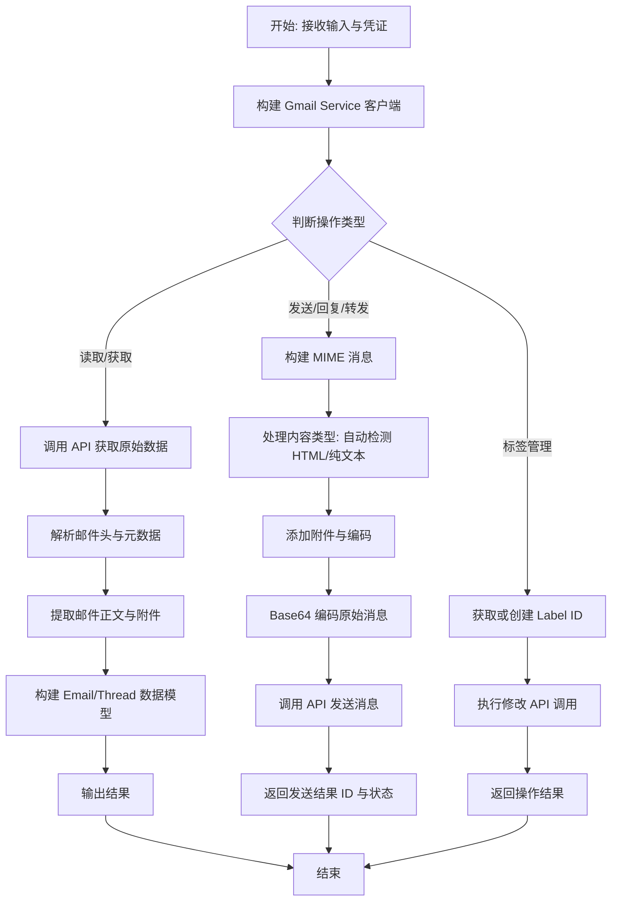

## 类结构

```
GmailBase (抽象基类)
├── GmailReadBlock (读取邮件)
├── GmailSendBlock (发送邮件)
├── GmailCreateDraftBlock (创建草稿)
├── GmailListLabelsBlock (列出标签)
├── GmailAddLabelBlock (添加标签)
├── GmailRemoveLabelBlock (移除标签)
├── GmailGetThreadBlock (获取会话)
├── GmailReplyBlock (回复邮件)
├── GmailDraftReplyBlock (创建回复草稿)
├── GmailGetProfileBlock (获取用户资料)
└── GmailForwardBlock (转发邮件)
数据模型
├── Attachment (附件信息)
├── Email (邮件完整信息)
├── Thread (邮件会话)
├── GmailSendResult (发送结果)
├── GmailDraftResult (草稿结果)
├── GmailLabelResult (标签操作结果)
└── Profile (用户资料)
```

## 全局变量及字段


### `settings`
    
Global application settings configuration instance loaded from environment variables.

类型：`Settings`
    


### `NO_WRAP_POLICY`
    
SMTP policy instance configured to prevent automatic line wrapping in email bodies.

类型：`email.policy.SMTP`
    


### `GmailReadBlock.Input`
    
Input schema defining credentials, search query, and maximum results for reading emails.

类型：`BlockSchemaInput`
    


### `GmailReadBlock.Output`
    
Output schema providing the retrieved email objects, list of emails, or error messages.

类型：`BlockSchemaOutput`
    


### `GmailSendBlock.Input`
    
Input schema defining recipients, subject, body, content type, and attachments for sending emails.

类型：`BlockSchemaInput`
    


### `GmailSendBlock.Output`
    
Output schema providing the send result including message ID and status.

类型：`BlockSchemaOutput`
    


### `GmailCreateDraftBlock.Input`
    
Input schema defining recipients, subject, body, content type, and attachments for creating drafts.

类型：`BlockSchemaInput`
    


### `GmailCreateDraftBlock.Output`
    
Output schema providing the draft creation result including draft ID and message ID.

类型：`BlockSchemaOutput`
    


### `GmailListLabelsBlock.Input`
    
Input schema defining credentials required to list Gmail labels.

类型：`BlockSchemaInput`
    


### `GmailListLabelsBlock.Output`
    
Output schema providing the list of Gmail labels or error messages.

类型：`BlockSchemaOutput`
    


### `GmailAddLabelBlock.Input`
    
Input schema defining message ID and label name for adding a label to an email.

类型：`BlockSchemaInput`
    


### `GmailAddLabelBlock.Output`
    
Output schema providing the result of adding a label, including status and label ID.

类型：`BlockSchemaOutput`
    


### `GmailRemoveLabelBlock.Input`
    
Input schema defining message ID and label name for removing a label from an email.

类型：`BlockSchemaInput`
    


### `GmailRemoveLabelBlock.Output`
    
Output schema providing the result of removing a label, including status and label ID.

类型：`BlockSchemaOutput`
    


### `GmailGetThreadBlock.Input`
    
Input schema defining credentials and thread ID for retrieving a Gmail thread.

类型：`BlockSchemaInput`
    


### `GmailGetThreadBlock.Output`
    
Output schema providing the retrieved thread object containing messages and metadata.

类型：`BlockSchemaOutput`
    


### `GmailReplyBlock.Input`
    
Input schema defining thread ID, message ID, recipients, body, and attachments for replying.

类型：`BlockSchemaInput`
    


### `GmailReplyBlock.Output`
    
Output schema providing the sent message ID, thread ID, raw message object, and parsed email.

类型：`BlockSchemaOutput`
    


### `GmailDraftReplyBlock.Input`
    
Input schema defining thread ID, message ID, recipients, body, and attachments for drafting a reply.

类型：`BlockSchemaInput`
    


### `GmailDraftReplyBlock.Output`
    
Output schema providing the draft ID, message ID, thread ID, and creation status.

类型：`BlockSchemaOutput`
    


### `GmailGetProfileBlock.Input`
    
Input schema defining credentials required to retrieve the user profile.

类型：`BlockSchemaInput`
    


### `GmailGetProfileBlock.Output`
    
Output schema providing the user's profile information including email address and statistics.

类型：`BlockSchemaOutput`
    


### `GmailForwardBlock.Input`
    
Input schema defining message ID to forward, new recipients, and attachment options.

类型：`BlockSchemaInput`
    


### `GmailForwardBlock.Output`
    
Output schema providing the forwarded message ID, thread ID, and status.

类型：`BlockSchemaOutput`
    


### `Attachment.filename`
    
The name of the attached file.

类型：`str`
    


### `Attachment.content_type`
    
The MIME content type of the attachment (e.g., 'image/jpeg').

类型：`str`
    


### `Attachment.size`
    
The size of the attachment in bytes.

类型：`int`
    


### `Attachment.attachment_id`
    
The unique identifier for the attachment within Gmail.

类型：`str`
    


### `Email.threadId`
    
The unique identifier of the thread the email belongs to.

类型：`str`
    


### `Email.labelIds`
    
List of label IDs applied to the email (e.g., 'INBOX', 'SENT').

类型：`list[str]`
    


### `Email.id`
    
The unique immutable ID of the email message.

类型：`str`
    


### `Email.subject`
    
The subject line of the email.

类型：`str`
    


### `Email.snippet`
    
A short preview text snippet of the email body.

类型：`str`
    


### `Email.from_`
    
The email address of the sender.

类型：`str`
    


### `Email.to`
    
List of recipient email addresses.

类型：`list[str]`
    


### `Email.cc`
    
List of CC (carbon copy) recipient email addresses.

类型：`list[str]`
    


### `Email.bcc`
    
List of BCC (blind carbon copy) recipient email addresses.

类型：`list[str]`
    


### `Email.date`
    
The date and time the email was sent (RFC 2822 format).

类型：`str`
    


### `Email.body`
    
The decoded plain text or HTML body content of the email.

类型：`str`
    


### `Email.sizeEstimate`
    
The estimated size of the email in bytes.

类型：`int`
    


### `Email.attachments`
    
A list of Attachment objects representing files attached to the email.

类型：`List[Attachment]`
    


### `Thread.id`
    
The unique ID of the thread.

类型：`str`
    


### `Thread.messages`
    
A list of Email objects representing the messages in the conversation thread.

类型：`list[Email]`
    


### `Thread.historyId`
    
The ID of the last history record that modified this thread.

类型：`str`
    


### `GmailSendResult.id`
    
The ID of the sent message.

类型：`str`
    


### `GmailSendResult.status`
    
The status of the send operation (e.g., 'sent').

类型：`str`
    


### `GmailDraftResult.id`
    
The ID of the created draft.

类型：`str`
    


### `GmailDraftResult.message_id`
    
The ID of the message associated with the draft.

类型：`str`
    


### `GmailDraftResult.status`
    
The status of the draft creation operation (e.g., 'draft_created').

类型：`str`
    


### `GmailLabelResult.label_id`
    
The ID of the label that was added or removed.

类型：`str`
    


### `GmailLabelResult.status`
    
The status of the label modification operation.

类型：`str`
    


### `Profile.emailAddress`
    
The user's primary email address.

类型：`str`
    


### `Profile.messagesTotal`
    
The total number of messages in the mailbox.

类型：`int`
    


### `Profile.threadsTotal`
    
The total number of threads in the mailbox.

类型：`int`
    


### `Profile.historyId`
    
The current mailbox history ID.

类型：`str`
    
    

## 全局函数及方法


### `serialize_email_recipients`

Serialize recipients list to comma-separated string. This utility function takes a list of email address strings and formats them into a single string delimited by commas and spaces, which is the standard format for email headers like 'To', 'Cc', and 'Bcc'.

参数：

- `recipients`：`list[str]`，A list of email address strings to be serialized.

返回值：`str`，A comma-separated string containing all the email addresses.

#### 流程图

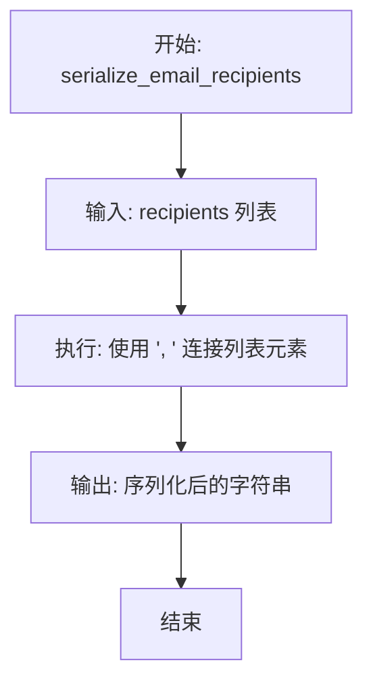

#### 带注释源码

```python
def serialize_email_recipients(recipients: list[str]) -> str:
    """Serialize recipients list to comma-separated string."""
    # 使用 join 方法将列表中的字符串元素合并
    # 使用 ", " 作为分隔符，以符合电子邮件头的标准格式
    return ", ".join(recipients)
```


### `_make_mime_text`

创建一个具有正确内容类型且纯文本无硬换行的 MIMEText 对象。

参数：

-   `body`：`str`，邮件正文内容（纯文本或 HTML）
-   `content_type`：`Optional[Literal["auto", "plain", "html"]]`，内容类型 - "auto"（默认）、"plain" 或 "html"

返回值：`MIMEText`，配置了适当的 MIME 对象，包含内容子类型（纯文本或 html）、UTF-8 字符集，以及针对纯文本的无换行策略（max_line_length=0）或针对 HTML 内容的标准换行策略。

#### 流程图

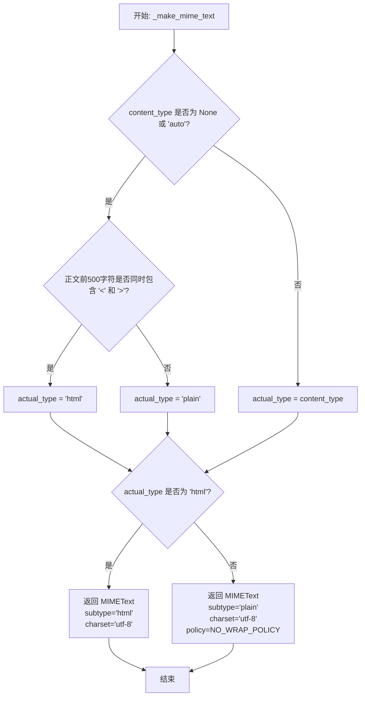

#### 带注释源码

```python
def _make_mime_text(
    body: str,
    content_type: Optional[Literal["auto", "plain", "html"]] = None,
) -> MIMEText:
    """Create a MIMEText object with proper content type and no hard-wrap for plain text.

    This function addresses the common Gmail issue where plain text emails are
    hard-wrapped at 78 characters, creating awkward narrow columns in modern
    email clients. It also ensures HTML emails are properly identified and sent
    with the correct MIME type.

    Args:
        body: The email body content (plain text or HTML)
        content_type: The content type - "auto" (default), "plain", or "html"
                     - "auto" or None: Auto-detects based on presence of HTML tags
                     - "plain": Forces plain text format without line wrapping
                     - "html": Forces HTML format with standard wrapping

    Returns:
        MIMEText object configured with:
        - Appropriate content subtype (plain or html)
        - UTF-8 charset for proper Unicode support
        - No-wrap policy for plain text (max_line_length=0)
        - Standard wrapping for HTML content

    Examples:
        >>> # Plain text email without wrapping
        >>> mime = _make_mime_text("Long paragraph...", "plain")
        >>> # HTML email with auto-detection
        >>> mime = _make_mime_text("<p>Hello</p>", "auto")
    """
    # 如果未指定或要求 "auto"，则自动检测内容类型
    if content_type is None or content_type == "auto":
        # 简单的启发式方法：检查前 500 个字符中是否存在 HTML 标签
        looks_html = "<" in body[:500] and ">" in body[:500]
        actual_type = "html" if looks_html else "plain"
    else:
        actual_type = content_type

    # 使用适当的设置创建 MIMEText
    if actual_type == "html":
        # HTML 内容 - 正常换行是可以的
        return MIMEText(body, _subtype="html", _charset="utf-8")
    else:
        # 纯文本 - 使用无换行策略以防止 78 字符硬换行
        return MIMEText(body, _subtype="plain", _charset="utf-8", policy=NO_WRAP_POLICY)
```


### `create_mime_message`

Create a MIME message with attachments and return base64-encoded raw message.

参数：

- `input_data`：`BlockSchemaInput` (Implicit), 包含邮件详细信息的输入对象，包括收件人、主题、正文、抄送、密送、内容类型及附件列表。
- `execution_context`：`ExecutionContext`, 执行上下文，提供用于存储附件所需的图执行ID等元数据。

返回值：`str`，经过 base64 URL 安全编码的原始 MIME 消息字符串，用于 Gmail API 发送。

#### 流程图

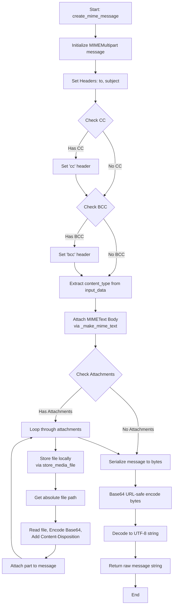

#### 带注释源码

```python
async def create_mime_message(
    input_data,
    execution_context: ExecutionContext,
) -> str:
    """Create a MIME message with attachments and return base64-encoded raw message."""

    # 初始化一个多部分邮件容器
    message = MIMEMultipart()
    
    # 设置基本的邮件头信息
    message["to"] = serialize_email_recipients(input_data.to)
    message["subject"] = input_data.subject

    # 设置抄送（CC）和密送（BCC）（如果存在）
    if input_data.cc:
        message["cc"] = ", ".join(input_data.cc)
    if input_data.bcc:
        message["bcc"] = ", ".join(input_data.bcc)

    # 获取内容类型（可选），并使用辅助函数创建并附加邮件正文
    # 这会处理自动检测 HTML 或纯文本，以及防止纯文本自动换行的问题
    content_type = getattr(input_data, "content_type", None)
    message.attach(_make_mime_text(input_data.body, content_type))

    # 处理附件逻辑
    if input_data.attachments:
        for attach in input_data.attachments:
            # 将文件存储到本地执行环境目录，并返回本地路径
            local_path = await store_media_file(
                file=attach,
                execution_context=execution_context,
                return_format="for_local_processing",
            )
            # 确保存在图执行ID以构建绝对路径
            assert execution_context.graph_exec_id  # Validated by store_media_file
            abs_path = get_exec_file_path(execution_context.graph_exec_id, local_path)
            
            # 创建 MIMEBase 对象用于附件，类型为 application/octet-stream
            part = MIMEBase("application", "octet-stream")
            
            # 读取文件二进制内容并设置负载
            with open(abs_path, "rb") as f:
                part.set_payload(f.read())
            
            # 对附件内容进行 Base64 编码
            encoders.encode_base64(part)
            
            # 添加 Content-Disposition 头，指定文件名
            part.add_header(
                "Content-Disposition",
                f"attachment; filename={Path(abs_path).name}",
            )
            
            # 将附件部分添加到邮件容器中
            message.attach(part)

    # 将整个邮件对象序列化为字节流，然后进行 Base64 URL 安全编码，并解码为 UTF-8 字符串返回
    return base64.urlsafe_b64encode(message.as_bytes()).decode("utf-8")
```


### `_build_reply_message`

构建用于Gmail线程的回复MIME消息，处理收件人解析、主题行（添加"Re:"）、邮件线程头（"References"、"In-Reply-To"）以及附件和内容类型的自动检测。

参数：

-   `service`：`googleapiclient.discovery.Resource`，Gmail API服务对象，用于获取原始邮件信息。
-   `input_data`：`BlockSchemaInput`，包含回复详情的输入数据对象，如收件人、正文、附件和父消息ID。
-   `execution_context`：`ExecutionContext`，执行上下文，用于处理附件文件的存储和路径获取。

返回值：`tuple[str, str]`，包含Base64编码的原始消息字符串和线程ID的元组。

#### 流程图

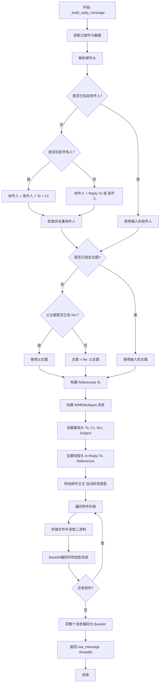

#### 带注释源码

```python
async def _build_reply_message(
    service, input_data, execution_context: ExecutionContext
) -> tuple[str, str]:
    """
    Builds a reply MIME message for Gmail threads.

    Returns:
        tuple: (base64-encoded raw message, threadId)
    """
    # 获取父邮件的元数据，用于提取上下文信息（主题、收件人、Message-ID等）
    parent = await asyncio.to_thread(
        lambda: service.users()
        .messages()
        .get(
            userId="me",
            id=input_data.parentMessageId,
            format="metadata",
            metadataHeaders=[
                "Subject",
                "References",
                "Message-ID",
                "From",
                "To",
                "Cc",
                "Reply-To",
            ],
        )
        .execute()
    )

    # 构建邮件头字典，处理可能存在的重复头（保留第一个）
    headers = {}
    for h in parent.get("payload", {}).get("headers", []):
        name = h["name"].lower()
        value = h["value"]
        if name in headers:
            # 对于重复的头，保留第一次出现（这对于回复上下文最相关）
            continue
        headers[name] = value

    # 如果输入数据中未指定收件人，则自动确定收件人
    if not (input_data.to or input_data.cc or input_data.bcc):
        if input_data.replyAll:
            # 回复所有人：合并 From, To, Cc
            recipients = [parseaddr(headers.get("from", ""))[1]]
            recipients += [addr for _, addr in getaddresses([headers.get("to", "")])]
            recipients += [addr for _, addr in getaddresses([headers.get("cc", "")])]
            # 使用 dict.fromkeys() 进行 O(n) 去重并保持顺序
            input_data.to = list(dict.fromkeys(filter(None, recipients)))
        else:
            # 仅回复发送者：优先检查 Reply-To 头，否则回退到 From 头
            reply_to = headers.get("reply-to", "")
            from_addr = headers.get("from", "")
            sender = parseaddr(reply_to if reply_to else from_addr)[1]
            input_data.to = [sender] if sender else []

    # 设置主题，如果没有指定则添加 Re: 前缀
    if input_data.subject:
        subject = input_data.subject
    else:
        parent_subject = headers.get("subject", "").strip()
        # 如果尚未包含 Re:（不区分大小写检查），则添加
        if parent_subject.lower().startswith("re:"):
            subject = parent_subject
        else:
            subject = f"Re: {parent_subject}" if parent_subject else "Re:"

    # 构建用于正确邮件线索的 References 头
    references = headers.get("references", "").split()
    if headers.get("message-id"):
        references.append(headers["message-id"])

    # 创建 MIME 多部分消息对象
    msg = MIMEMultipart()
    if input_data.to:
        msg["To"] = ", ".join(input_data.to)
    if input_data.cc:
        msg["Cc"] = ", ".join(input_data.cc)
    if input_data.bcc:
        msg["Bcc"] = ", ".join(input_data.bcc)
    msg["Subject"] = subject
    # 设置线程关联头，确保邮件客户端能正确归档到同一对话下
    if headers.get("message-id"):
        msg["In-Reply-To"] = headers["message-id"]
    if references:
        msg["References"] = " ".join(references)

    # 使用辅助函数处理正文，确保内容类型（HTML/纯文本）的一致性和正确格式
    msg.attach(_make_mime_text(input_data.body, input_data.content_type))

    # 处理附件
    for attach in input_data.attachments:
        # 将临时文件存储到执行环境中
        local_path = await store_media_file(
            file=attach,
            execution_context=execution_context,
            return_format="for_local_processing",
        )
        assert execution_context.graph_exec_id  # 由 store_media_file 验证
        abs_path = get_exec_file_path(execution_context.graph_exec_id, local_path)
        
        # 创建附件部分
        part = MIMEBase("application", "octet-stream")
        with open(abs_path, "rb") as f:
            part.set_payload(f.read())
        # 对附件内容进行 Base64 编码
        encoders.encode_base64(part)
        part.add_header(
            "Content-Disposition", f"attachment; filename={Path(abs_path).name}"
        )
        msg.attach(part)

    # 将整个消息对象编码为 Base64 URL 安全字符串
    raw = base64.urlsafe_b64encode(msg.as_bytes()).decode("utf-8")
    return raw, input_data.threadId
```


### `GmailBase._build_service`

构造并返回一个已授权的 Gmail API 服务对象。该方法将内部的 Google 凭证对象转换为 Google API 客户端库所需的格式，并初始化用于与 Gmail 交互的服务连接。

参数：

-   `credentials`：`GoogleCredentials`，包含访问令牌、刷新令牌和作用域的 OAuth2 凭证对象，用于授权 API 请求。
-   `**kwargs`：`dict`，传递给服务构建器的额外关键字参数（尽管当前实现中未显式使用，但保留在签名中以供扩展）。

返回值：`googleapiclient.discovery.Resource`，已授权的 Gmail 服务资源实例，可用于调用 Gmail 的各项功能（如发送、读取邮件等）。

#### 流程图

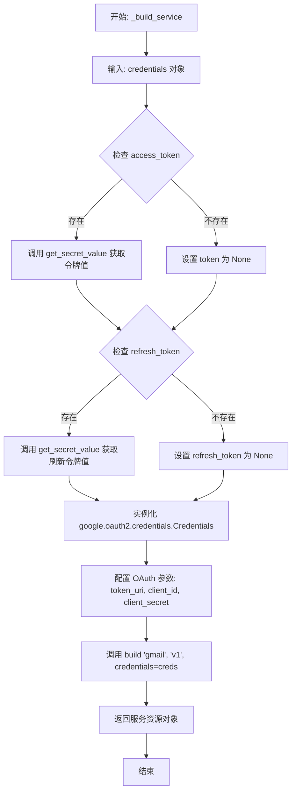

#### 带注释源码

```python
    def _build_service(self, credentials: GoogleCredentials, **kwargs):
        # 从传入的 credentials 对象中提取 access_token
        # 如果 access_token 存在，则使用 get_secret_value() 解码 Pydantic 的 SecretStr 类型
        creds = Credentials(
            token=(
                credentials.access_token.get_secret_value()
                if credentials.access_token
                else None
            ),
            # 从传入的 credentials 对象中提取 refresh_token
            # 同样需要处理 SecretStr 类型
            refresh_token=(
                credentials.refresh_token.get_secret_value()
                if credentials.refresh_token
                else None
            ),
            # Google OAuth 2.0 的令牌端点固定地址
            token_uri="https://oauth2.googleapis.com/token",
            # 从全局设置中获取 Google 应用的客户端 ID
            client_id=settings.secrets.google_client_id,
            # 从全局设置中获取 Google 应用的客户端密钥
            client_secret=settings.secrets.google_client_secret,
            # 从 credentials 中继承所需的权限范围
            scopes=credentials.scopes,
        )
        # 使用构建好的凭证对象，初始化并返回 Gmail API v1 版本的服务资源
        return build("gmail", "v1", credentials=creds)
```


### `GmailBase._get_email_body`

从邮件消息对象中提取并处理正文内容，支持多部分邮件结构和HTML到文本的转换。

参数：

- `msg`：`dict`，代表从 Gmail API 获取的原始邮件消息对象，通常包含 payload 和 id 等字段。
- `service`：`googleapiclient.discovery.Resource`，已通过认证的 Gmail API 服务对象，用于辅助获取邮件详情（如附件内容）。

返回值：`str`，提取并解码后的邮件正文文本，如果无法提取到可读内容，则返回默认提示字符串。

#### 流程图

```mermaid
flowchart TD
    A[开始] --> B[调用 self._walk_for_body<br>传入 msg['payload'], msg['id'], service]
    B --> C{提取到的 text 是否存在且不为空?}
    C -- 是 --> D[返回 text]
    C -- 否 --> E[返回默认文本: <br>'This email does not contain a readable body.']
    D --> F[结束]
    E --> F
```

#### 带注释源码

```python
async def _get_email_body(self, msg, service):
    """Extract email body content with support for multipart messages and HTML conversion."""
    # 调用内部递归方法 _walk_for_body 遍历邮件的 payload 部分
    # msg["payload"] 包含邮件的 MIME 结构树
    # msg["id"] 用于在需要下载附件时标识邮件
    text = await self._walk_for_body(msg["payload"], msg["id"], service)
    
    # 如果提取到了文本则返回，否则返回一个默认的提示信息
    return text or "This email does not contain a readable body."
```


### `GmailBase._walk_for_body`

递归遍历电子邮件的 MIME 多部分结构，以提取主要可读的正文内容。该函数支持处理纯文本、HTML（转换为纯文本）以及正文内容作为附件存储的情况。

参数：

-   `part`：`dict`，代表电子邮件负载的一个部分（MIME 部分），包含 MIME 类型、正文数据和可能的子部分。
-   `msg_id`：`str`，电子邮件的消息 ID，用于在正文内容存储为附件时获取数据。
-   `service`：`googleapiclient.discovery.Resource`，Gmail API 服务对象，用于执行网络请求（如下载附件）。
-   `depth`：`int`，当前递归深度，用于防止无限递归（默认为 0）。

返回值：`str | None`，提取并解码后的邮件正文文本字符串；如果未找到可读正文或超过递归深度限制，则返回 None。

#### 流程图

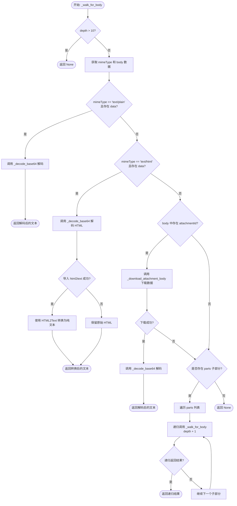

#### 带注释源码

```python
    async def _walk_for_body(self, part, msg_id, service, depth=0):
        """Recursively walk through email parts to find readable body content."""
        # 防止无限递归，限制最大深度为 10
        if depth > 10:
            return None

        # 获取当前部分的 MIME 类型和正文数据
        mime_type = part.get("mimeType", "")
        body = part.get("body", {})

        # 情况 1: 处理纯文本内容 (text/plain)
        # 如果是纯文本且包含数据，直接解码并返回
        if mime_type == "text/plain" and body.get("data"):
            return self._decode_base64(body["data"])

        # 情况 2: 处理 HTML 内容 (text/html)
        # 如果是 HTML 且包含数据，尝试转换为纯文本
        if mime_type == "text/html" and body.get("data"):
            # 先解码 Base64 编码的 HTML 内容
            html_content = self._decode_base64(body["data"])
            if html_content:
                try:
                    # 尝试导入 html2text 库进行转换
                    import html2text

                    h = html2text.HTML2Text()
                    h.ignore_links = False
                    h.ignore_images = True
                    # 将 HTML 转换为 Markdown/纯文本
                    return h.handle(html_content)
                except ImportError:
                    # 如果未安装 html2text，则回退返回原始 HTML
                    return html_content

        # 情况 3: 处理存储为附件的正文内容
        # Gmail 有时将大块文本内容作为附件存储在 payload body 中
        if body.get("attachmentId"):
            # 使用 attachmentId 下载实际数据
            attachment_data = await self._download_attachment_body(
                body["attachmentId"], msg_id, service
            )
            if attachment_data:
                # 解码下载数据并返回
                return self._decode_base64(attachment_data)

        # 情况 4: 递归处理子部分
        # 遍历当前部分的所有子部分
        for sub_part in part.get("parts", []):
            # 递归调用自身，深度加 1
            text = await self._walk_for_body(sub_part, msg_id, service, depth + 1)
            # 如果找到了文本，立即返回（返回第一个找到的有效正文）
            if text:
                return text

        # 如果遍历完所有情况仍未找到文本，返回 None
        return None
```


### `GmailBase._decode_base64`

该方法用于安全地对 Base64 URL 安全编码的数据进行解码，特别处理了可能缺失填充字符的情况，常用于处理 API 返回的邮件正文数据。

参数：

-   `data`：`str`，需要进行 Base64 解码的 URL 安全编码字符串。

返回值：`Optional[str]`，解码后的 UTF-8 字符串。如果输入为空或解码过程中发生错误，则返回 None。

#### 流程图

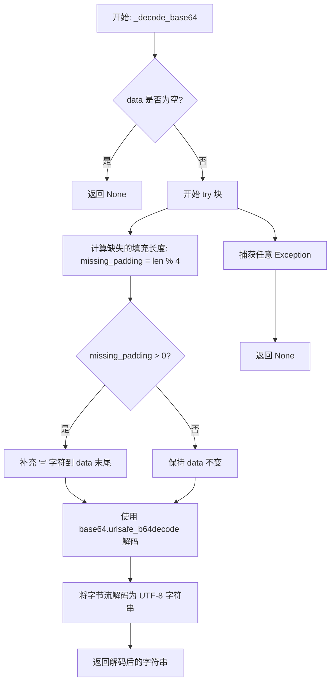

#### 带注释源码

```python
    def _decode_base64(self, data):
        """Safely decode base64 URL-safe data with proper padding."""
        # 检查输入数据是否为空，如果是则直接返回 None
        if not data:
            return None
        try:
            # Base64 编码要求长度是 4 的倍数。
            # URL 安全的 Base64 字符串在通过 API 传输时常会丢失末尾的填充符 '='，
            # 因此需要计算缺失的填充符数量并手动补全。
            missing_padding = len(data) % 4
            if missing_padding:
                data += "=" * (4 - missing_padding)
            
            # 使用 URL 安全的 Base64 解码器将字符串转换为字节对象
            # urlsafe_b64decode 会将 '-' 替换为 '+'，将 '_' 替换为 '/'
            decoded_bytes = base64.urlsafe_b64decode(data)
            
            # 将字节对象解码为 UTF-8 字符串并返回
            return decoded_bytes.decode("utf-8")
        except Exception:
            # 捕获任何异常（如非法字符、解码错误等）并返回 None，
            # 防止因单封邮件解析失败导致整个流程中断
            return None
```


### `GmailBase._download_attachment_body`

该方法用于从 Gmail API 下载附件内容。主要在邮件正文以附件形式存储时调用，通过 `asyncio.to_thread` 在单独的线程中执行同步的 API 调用以避免阻塞事件循环。

参数：

- `attachment_id`：`str`，要下载的附件的唯一标识符。
- `msg_id`：`str`，包含该附件的邮件的唯一标识符。
- `service`：`Resource`，已授权的 Gmail API 服务对象（通过 `googleapiclient.discovery.build` 构建）。

返回值：`Optional[str]`，成功时返回附件的 base64 编码数据字符串，失败或异常时返回 `None`。

#### 流程图

```mermaid
flowchart TD
    A([开始]) --> B[尝试执行下载操作]
    B --> C[在单独线程中调用 API<br/>users().messages().attachments().get]
    C --> D{API 调用是否成功?}
    D -- 是 --> E[提取 attachment 字典中的 data]
    E --> F([返回 attachment data])
    D -- 否/抛出异常 --> G[捕获异常]
    G --> H([返回 None])
    F --> I([结束])
    H --> I
```

#### 带注释源码

```python
    async def _download_attachment_body(self, attachment_id, msg_id, service):
        """Download attachment content when email body is stored as attachment."""
        try:
            # 使用 asyncio.to_thread 在独立线程中执行同步的 Google API 调用
            # 这可以防止阻塞主异步事件循环
            attachment = await asyncio.to_thread(
                # 构建并执行获取附件的请求
                lambda: service.users()
                .messages()
                .attachments()
                .get(userId="me", messageId=msg_id, id=attachment_id)
                .execute()
            )
            # 返回 API 响应中包含的 base64 编码数据
            return attachment.get("data")
        except Exception:
            # 如果在下载过程中发生任何错误（如网络问题、权限不足或 ID 不存在），返回 None
            return None
```


### `GmailBase._get_attachments`

从 Gmail API 消息对象中提取附件元数据，遍历消息负载的各个部分以识别并构建附件信息列表。

参数：

-  `service`：`googleapiclient.discovery.Resource`，Gmail API 服务对象（当前逻辑中未直接使用，保留用于接口一致性）。
-  `message`：`dict`，包含负载结构的 Gmail API 消息对象。

返回值：`List[Attachment]`，包含附件详细信息的 `Attachment` 对象列表。

#### 流程图

```mermaid
flowchart TD
    Start([开始]) --> InitList[初始化 attachments 列表]
    InitList --> CheckPayload{message['payload'] 中是否存在 'parts' ?}
    CheckPayload -- 否 --> ReturnList[返回 attachments 列表]
    CheckPayload -- 是 --> LoopParts[遍历 message['payload']['parts']]
    LoopParts --> CheckFilename{part 是否存在 'filename' ?}
    CheckFilename -- 否 --> NextPart[继续下一个 part]
    CheckFilename -- 是 --> CreateAttachment[创建 Attachment 对象<br/>包含 filename, content_type, size, attachment_id]
    CreateAttachment --> AppendList[将对象添加到 attachments 列表]
    AppendList --> NextPart
    NextPart --> LoopParts
    LoopParts -- 循环结束 --> ReturnList
```

#### 带注释源码

```python
async def _get_attachments(self, service, message):
    """从 Gmail 消息中提取附件信息。"""
    # 初始化一个空列表用于存储附件对象
    attachments = []

    # 检查消息的 payload 中是否包含 'parts' 字段
    # 'parts' 通常存在于多部分消息（MIME multipart）中
    if "parts" in message["payload"]:
        # 遍历 payload 中的每一个部分
        for part in message["payload"]["parts"]:
            # 检查当前部分是否有文件名
            # 有文件名通常表示这是一个附件
            if part.get("filename"):
                # 实例化 Attachment 模型，提取相关信息
                attachment = Attachment(
                    filename=part["filename"],              # 文件名
                    content_type=part["mimeType"],         # MIME 类型 (如 image/jpeg)
                    size=int(part["body"].get("size", 0)), # 文件大小
                    attachment_id=part["body"]["attachmentId"], # 附件 ID，用于后续下载
                )
                # 将构建好的附件对象添加到列表中
                attachments.append(attachment)
    
    # 返回提取到的附件列表
    return attachments
```


### `GmailBase.download_attachment`

从 Gmail API 下载指定邮件附件的原始二进制数据。该方法通过消息 ID 和附件 ID 获取附件，并将返回的 Base64 编码数据解码为字节流。

参数：

- `service`：`googleapiclient.discovery.Resource`，已授权的 Gmail API 服务实例，用于执行网络请求。
- `message_id`：`str`，包含目标附件的 Gmail 邮件的唯一标识符。
- `attachment_id`：`str`，需要下载的附件的唯一标识符。

返回值：`bytes`，解码后的附件原始二进制内容。

#### 流程图

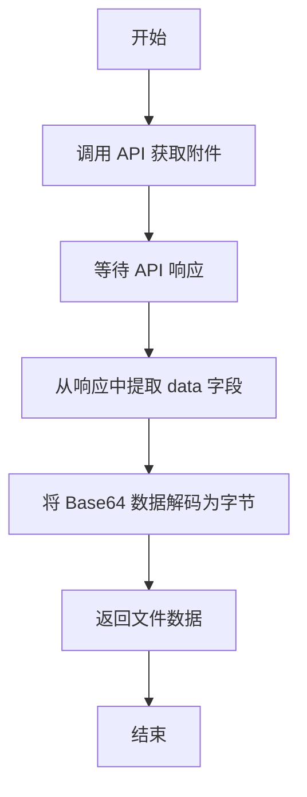

#### 带注释源码

```python
    async def download_attachment(self, service, message_id: str, attachment_id: str):
        # 使用 asyncio.to_thread 在单独的线程中执行同步的 Google API 请求，
        # 以防止阻塞主事件循环。
        # 构建 API 请求：users().messages().attachments().get()，指定用户 ID 为 'me'。
        attachment = await asyncio.to_thread(
            lambda: service.users()
            .messages()
            .attachments()
            .get(userId="me", messageId=message_id, id=attachment_id)
            .execute()
        )
        
        # API 返回的数据是 Base64 URL 安全编码的字符串。
        # 首先 .encode("UTF-8") 将字符串转换为字节，然后进行 base64 解码。
        file_data = base64.urlsafe_b64decode(attachment["data"].encode("UTF-8"))
        
        # 返回解码后的文件原始字节数据。
        return file_data
```


### `GmailBase._get_label_id`

根据名称从 Gmail 获取标签 ID。

参数：

- `service`：`googleapiclient.discovery.Resource`，已授权的 Gmail API 服务对象，用于执行请求。
- `label_name`：`str`，需要查找的标签名称（例如 "INBOX", "IMPORTANT", "Work"）。

返回值：`str | None`，如果找到匹配的标签则返回其 ID，否则返回 None。

#### 流程图

```mermaid
graph TD
    A[开始: _get_label_id] --> B[异步调用 API 列出所有标签]
    B --> C[从结果中获取 labels 列表]
    C --> D{列表是否为空?}
    D -- 否 --> E[遍历 labels 列表]
    D -- 是 --> G[返回 None]
    E --> F{label['name'] == label_name?}
    F -- 是 --> H[返回 label['id']]
    F -- 否 --> E
```

#### 带注释源码

```python
    async def _get_label_id(self, service, label_name: str) -> str | None:
        """Get label ID by name from Gmail."""
        # 在单独的线程中调用 Gmail API 的 list 方法，以避免阻塞事件循环
        results = await asyncio.to_thread(
            lambda: service.users().labels().list(userId="me").execute()
        )
        # 从 API 响应结果中提取标签列表，如果没有标签则默认为空列表
        labels = results.get("labels", [])
        
        # 遍历所有标签，查找与输入名称匹配的标签
        for label in labels:
            if label["name"] == label_name:
                # 找到匹配项，返回对应的标签 ID
                return label["id"]
        
        # 遍历结束未找到匹配项，返回 None
        return None
```


### `GmailReadBlock.run`

该方法是 `GmailReadBlock` 的核心执行入口，负责使用提供的 Google 凭据构建 Gmail API 服务对象，根据输入的查询条件和最大结果数检索邮件，并将结果作为异步生成器逐个输出以及以列表形式输出。

参数：

-   `self`：`GmailReadBlock`，类实例本身。
-   `input_data`：`Input`，包含查询参数（`query`）、最大结果数（`max_results`）和凭据信息的输入数据对象。
-   `credentials`：`GoogleCredentials`，包含访问令牌和刷新令牌的 Google OAuth2 凭据对象。
-   `**kwargs`：`Any`，传递给服务构建器的其他关键字参数。

返回值：`BlockOutput`，异步生成器，产生键值对。首先为每封邮件产生 `"email"` 键和对应的邮件对象，最后产生 `"emails"` 键和包含所有邮件的列表。

#### 流程图

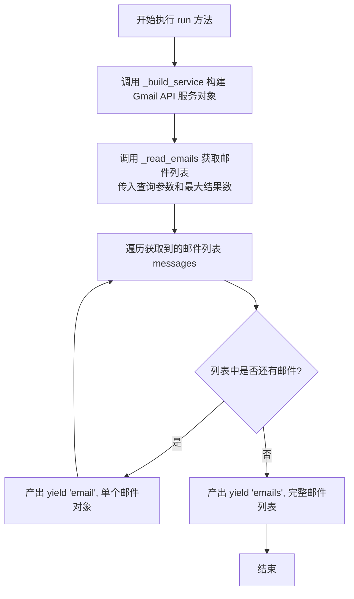

#### 带注释源码

```python
    async def run(
        self, input_data: Input, *, credentials: GoogleCredentials, **kwargs
    ) -> BlockOutput:
        # 使用传入的凭据构建 Gmail API 服务实例
        service = self._build_service(credentials, **kwargs)

        # 调用内部方法 _read_emails 读取邮件
        # 传入服务对象、查询字符串、最大结果数以及权限范围(scopes)
        messages = await self._read_emails(
            service,
            input_data.query,
            input_data.max_results,
            credentials.scopes,
        )

        # 遍历邮件列表，逐个产出键为 "email" 的结果
        # 这允许下游处理流程逐个处理邮件，而不必等待所有邮件加载完毕
        for email in messages:
            yield "email", email

        # 产出键为 "emails" 的完整邮件列表结果
        yield "emails", messages
```


### `GmailReadBlock._read_emails`

根据查询条件检索邮件，调用 Gmail API 获取邮件详情，解析邮件头、正文及附件信息，并返回结构化的邮件对象列表。

参数：

- `service`：`object`，已授权的 Gmail API 服务资源对象，用于执行 API 调用。
- `query`：`str | None`，用于过滤邮件的搜索查询字符串（例如 "is:unread"）。
- `max_results`：`int | None`，要检索的最大邮件数量。
- `scopes`：`list[str] | None`，OAuth 授权范围列表，用于判断数据获取权限和格式。

返回值：`list[Email]`，包含解析后的邮件数据（如主题、发件人、正文、附件等）的 Email 对象列表。

#### 流程图

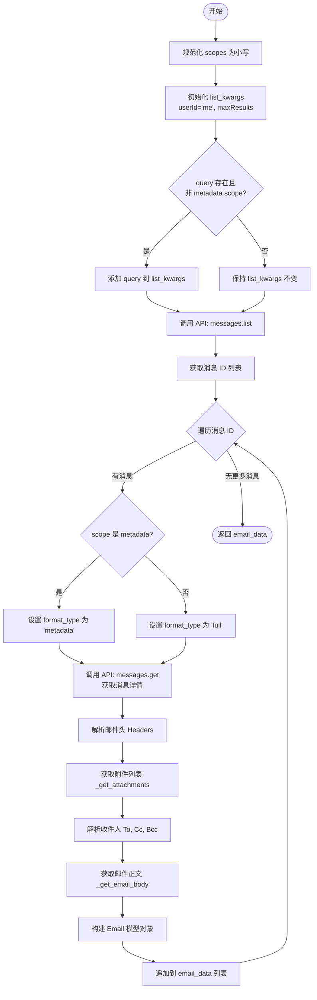

#### 带注释源码

```python
    async def _read_emails(
        self,
        service,
        query: str | None,
        max_results: int | None,
        scopes: list[str] | None,
    ) -> list[Email]:
        # 将权限范围转换为小写，便于比较
        scopes = [s.lower() for s in (scopes or [])]
        
        # 准备列表查询的参数，默认获取前10条（如果未指定）
        list_kwargs = {"userId": "me", "maxResults": max_results or 10}
        
        # 只有当提供了查询字符串且权限不是 metadata 时才添加查询参数
        # (metadata scope 不支持搜索查询 q 参数)
        if query and "https://www.googleapis.com/auth/gmail.metadata" not in scopes:
            list_kwargs["q"] = query

        # 在线程池中执行同步的 Gmail API list 调用，获取消息 ID 列表
        results = await asyncio.to_thread(
            lambda: service.users().messages().list(**list_kwargs).execute()
        )

        # 提取消息 ID 列表
        messages = results.get("messages", [])

        email_data = []
        # 遍历每个消息 ID 以获取详细信息
        for message in messages:
            # 根据权限范围决定请求格式：metadata 仅返回元数据，full 返回完整内容
            format_type = (
                "metadata"
                if "https://www.googleapis.com/auth/gmail.metadata" in scopes
                else "full"
            )
            
            # 获取单条消息的详细数据
            msg = await asyncio.to_thread(
                lambda: service.users()
                .messages()
                .get(userId="me", id=message["id"], format=format_type)
                .execute()
            )

            # 将邮件头转换为小写字典，方便查找
            headers = {
                header["name"].lower(): header["value"]
                for header in msg["payload"]["headers"]
            }

            # 获取附件元数据列表
            attachments = await self._get_attachments(service, msg)

            # 解析收件人 (To)
            to_recipients = [
                addr.strip() for _, addr in getaddresses([headers.get("to", "")])
            ]
            # 解析抄送人
            cc_recipients = [
                addr.strip() for _, addr in getaddresses([headers.get("cc", "")])
            ]
            # 解析密送人
            bcc_recipients = [
                addr.strip() for _, addr in getaddresses([headers.get("bcc", "")])
            ]

            # 构建结构化的 Email 对象
            email = Email(
                threadId=msg.get("threadId", None),
                labelIds=msg.get("labelIds", []),
                id=msg["id"],
                subject=headers.get("subject", "No Subject"),
                snippet=msg.get("snippet", ""),
                from_=parseaddr(headers.get("from", ""))[1], # 解析发件人地址
                to=to_recipients if to_recipients else [],
                cc=cc_recipients,
                bcc=bcc_recipients,
                date=headers.get("date", ""),
                body=await self._get_email_body(msg, service), # 异步获取并解码邮件正文
                sizeEstimate=msg.get("sizeEstimate", 0),
                attachments=attachments,
            )
            email_data.append(email)

        return email_data
```


### `GmailSendBlock.run`

这是GmailSendBlock的核心运行方法，负责构建Gmail服务实例，调用发送邮件的逻辑，并返回发送结果。

参数：

- `input_data`：`GmailSendBlock.Input`，包含邮件发送所需的详细信息，如收件人、主题、正文、附件及内容类型等。
- `credentials`：`GoogleCredentials`，用于认证并访问Gmail API的OAuth2凭据对象。
- `execution_context`：`ExecutionContext`，执行上下文对象，用于处理文件存储时的执行ID等环境信息。
- `**kwargs`：`dict`，其他额外的关键字参数。

返回值：`BlockOutput`，一个异步生成器，产出包含发送状态和ID的结果字典。

#### 流程图

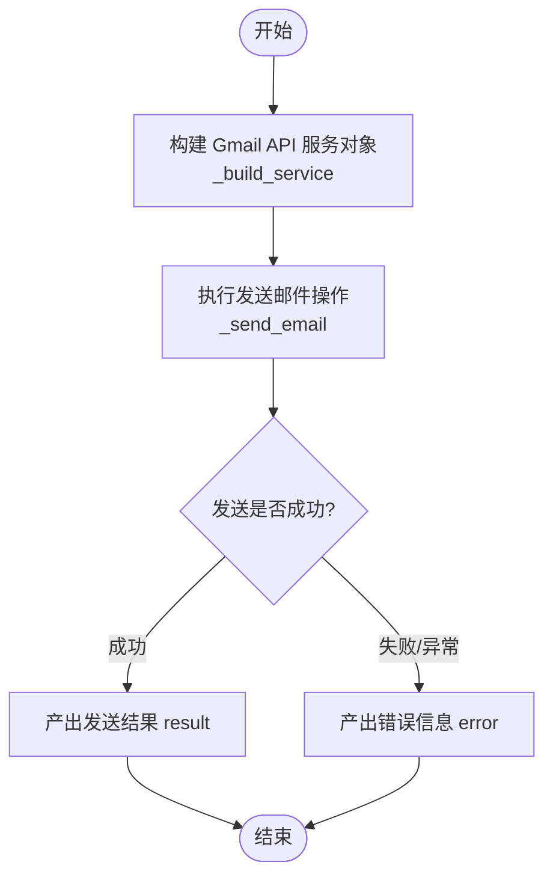

#### 带注释源码

```python
async def run(
    self,
    input_data: Input,
    *,
    credentials: GoogleCredentials,
    execution_context: ExecutionContext,
    **kwargs,
) -> BlockOutput:
    # 使用提供的凭据构建Gmail服务实例
    service = self._build_service(credentials, **kwargs)

    # 调用内部方法发送邮件，传入服务对象、输入数据和执行上下文
    # 此方法会处理MIME消息构建、附件处理及API调用
    result = await self._send_email(
        service,
        input_data,
        execution_context,
    )

    # 将发送结果作为 "result" 键的值产出
    yield "result", result
```


### `GmailSendBlock._send_email`

该方法是 `GmailSendBlock` 类的核心私有方法，负责通过 Gmail API 异步发送电子邮件。它首先验证必要的输入字段（收件人、主题、正文），然后调用辅助函数构造符合 MIME 标准的邮件消息（包括处理附件和内容类型），最后通过非阻塞的方式调用 Gmail API 发送邮件，并返回包含消息 ID 和状态的字典。

参数：

-   `service`：`googleapiclient.discovery.Resource`，已授权的 Gmail API 服务对象，用于执行实际的发送操作。
-   `input_data`：`GmailSendBlock.Input`，包含邮件详细信息的输入数据模型，包括收件人 (`to`)、主题 (`subject`)、正文 (`body`)、抄送/密送 (`cc`/`bcc`)、内容类型 (`content_type`) 及附件列表 (`attachments`)。
-   `execution_context`：`ExecutionContext`，执行上下文对象，用于在处理附件时确定文件存储路径和运行环境信息。

返回值：`dict`，包含发送结果的字典，键值包括 `id`（发送后 Gmail 返回的消息 ID）和 `status`（发送状态，通常为 "sent"）。

#### 流程图

```mermaid
flowchart TD
    A([开始: _send_email]) --> B{验证输入数据<br/>检查 to, subject, body}
    B -- 缺失必填项 --> C([抛出 ValueError 异常])
    B -- 验证通过 --> D[调用 create_mime_message<br/>生成 MIME 格式邮件]
    D --> E[调用 asyncio.to_thread<br/>在独立线程执行 Gmail API 请求]
    E --> F[执行 service.users.messages.send]
    F --> G([返回结果字典<br/>{id, status}])
```

#### 带注释源码

```python
    async def _send_email(
        self, service, input_data: Input, execution_context: ExecutionContext
    ) -> dict:
        # 步骤 1: 参数校验
        # 确保至少有一个收件人、主题以及邮件正文，否则抛出 ValueError
        if not input_data.to or not input_data.subject or not input_data.body:
            raise ValueError(
                "At least one recipient, subject, and body are required for sending an email"
            )
        
        # 步骤 2: 构建邮件内容
        # 调用全局辅助函数 create_mime_message，将输入数据转换为 MIME 格式字符串
        # 该过程包括处理 HTML/纯文本检测、添加附件以及 Base64 编码
        raw_message = await create_mime_message(input_data, execution_context)
        
        # 步骤 3: 发送邮件
        # 使用 asyncio.to_thread 将同步的 Google API 调用放入线程池执行，避免阻塞事件循环
        # service.users().messages().send 是 Gmail API 的标准发送接口
        sent_message = await asyncio.to_thread(
            lambda: service.users()
            .messages()
            .send(userId="me", body={"raw": raw_message})
            .execute()
        )
        
        # 步骤 4: 返回结果
        # 提取发送成功的消息 ID 并封装状态信息返回
        return {"id": sent_message["id"], "status": "sent"}
```


### `GmailCreateDraftBlock.run`

在 Gmail 中创建草稿邮件，处理邮件内容构建、附件上传并返回草稿创建状态。

参数：

- `self`：`GmailCreateDraftBlock`，类的实例。
- `input_data`：`Input`，包含收件人、主题、正文、附件等邮件详情的输入数据。
- `credentials`：`GoogleCredentials`，用于 Gmail API 认证的用户 OAuth2 凭证。
- `execution_context`：`ExecutionContext`，用于处理附件文件存储的执行上下文。
- `**kwargs`：`dict`，传递给服务构建器的额外关键字参数。

返回值：`BlockOutput`，生成包含 `GmailDraftResult`（id、message_id、status）的字典。

#### 流程图

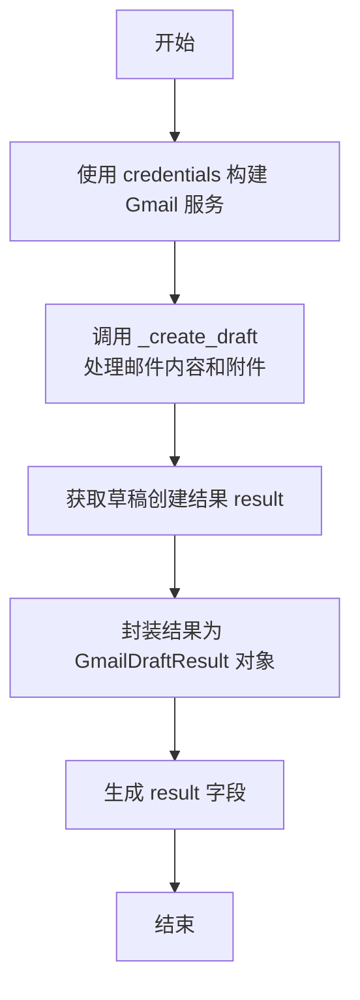

#### 带注释源码

```python
async def run(
    self,
    input_data: Input,
    *,
    credentials: GoogleCredentials,
    execution_context: ExecutionContext,
    **kwargs,
) -> BlockOutput:
    # 使用提供的凭证构建 Gmail API 服务对象
    service = self._build_service(credentials, **kwargs)
    
    # 调用内部方法 _create_draft 执行实际的草稿创建逻辑
    # 传入服务对象、输入数据和执行上下文（用于处理附件）
    result = await self._create_draft(
        service,
        input_data,
        execution_context,
    )
    
    # 返回结果，将 API 返回的字典解析为 GmailDraftResult 模型
    # 包含草稿 ID、消息 ID 和状态
    yield "result", GmailDraftResult(
        id=result["id"], message_id=result["message"]["id"], status="draft_created"
    )
```


### `GmailCreateDraftBlock._create_draft`

在 Gmail 中异步创建草稿邮件，处理 MIME 消息构建并通过 API 将其保存为草稿。

参数：

- `service`：`googleapiclient.discovery.Resource`，已授权的 Gmail API 服务实例，用于与 Google 交互。
- `input_data`：`GmailCreateDraftBlock.Input`，包含邮件收件人、主题、正文、附件等信息的输入数据对象。
- `execution_context`：`ExecutionContext`，执行上下文，提供处理附件文件所需的环境信息（如 graph 执行 ID）。

返回值：`dict`，Gmail API 返回的字典，包含创建的草稿 ID 及关联的消息详细信息。

#### 流程图

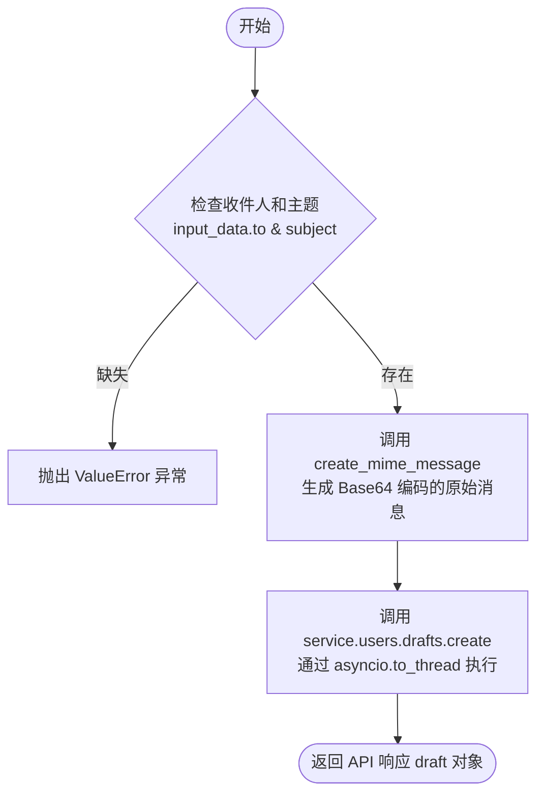

#### 带注释源码

```python
async def _create_draft(
    self, service, input_data: Input, execution_context: ExecutionContext
) -> dict:
    # 验证必填字段：收件人和主题
    if not input_data.to or not input_data.subject:
        raise ValueError(
            "At least one recipient and subject are required for creating a draft"
        )

    # 调用辅助函数构建 MIME 消息并返回 Base64 编码的字符串
    # 该函数处理正文格式化、附件处理等
    raw_message = await create_mime_message(input_data, execution_context)
    
    # 调用 Gmail API 创建草稿
    # 由于 Google API 客户端库是同步的，使用 asyncio.to_thread 在单独的线程中运行以避免阻塞事件循环
    draft = await asyncio.to_thread(
        lambda: service.users()
        .drafts()
        .create(userId="me", body={"message": {"raw": raw_message}})
        .execute()
    )

    # 返回包含草稿 ID 和消息信息的字典
    return draft
```


### `GmailListLabelsBlock.run`

该方法负责执行从 Gmail 账户检索所有标签（类别）的核心逻辑。它利用提供的 Google 凭据构建 API 服务对象，异步获取用户账户中的所有标签，并将结果作为生成器输出。

参数：

-  `input_data`：`GmailListLabelsBlock.Input`，包含执行该操作所需的输入数据模型，主要包含认证凭据信息。
-  `credentials`：`GoogleCredentials`，Google OAuth2 凭据对象，用于授权访问 Gmail API 服务。
-  `**kwargs`：`Any`，传递给底层服务构建器的额外关键字参数。

返回值：`BlockOutput`，一个异步生成器，产生包含标签列表的键值对。

#### 流程图

```mermaid
graph TD
    A[开始: run 方法调用] --> B[构建 Gmail API 服务<br/>_build_service]
    B --> C[调用内部方法获取标签列表<br/>_list_labels]
    C --> D[生成结果数据<br/>yield "result", result]
    D --> E[结束]
```

#### 带注释源码

```python
    async def run(
        self, input_data: Input, *, credentials: GoogleCredentials, **kwargs
    ) -> BlockOutput:
        # 使用传入的凭据和额外的关键字参数构建 Gmail API 服务对象
        service = self._build_service(credentials, **kwargs)
        
        # 调用内部辅助方法 _list_labels 异步获取标签列表
        result = await self._list_labels(service)
        
        # 生成输出，键为 "result"，值为获取到的标签列表
        yield "result", result
```


### `GmailListLabelsBlock._list_labels`

该方法通过已认证的 Gmail API 服务对象异步获取当前用户账户的所有标签（Labels），并将结果整理为包含标签 ID 和名称的字典列表返回。

参数：

- `service`：`googleapiclient.discovery.Resource`，已认证的 Gmail API 服务对象，用于发起 API 请求。

返回值：`list[dict]`，包含标签信息的字典列表，每个字典包含 `id` 和 `name` 两个字段。

#### 流程图

```mermaid
graph TD
    A[开始: _list_labels] --> B[执行异步线程调用: service.users.labels.list]
    B --> C[获取 API 执行结果 results]
    C --> D[从 results 中提取 'labels' 列表<br>若不存在则为空列表]
    D --> E[遍历 labels 列表]
    E --> F[构造字典: {id: ..., name: ...}]
    F --> G[返回处理后的标签列表]
    G --> H[结束]
```

#### 带注释源码

```python
async def _list_labels(self, service) -> list[dict]:
    # 在单独的线程中执行同步的 Gmail API 调用，避免阻塞事件循环
    # 调用 users().labels().list() 方法获取 'me' (当前用户) 的所有标签
    results = await asyncio.to_thread(
        lambda: service.users().labels().list(userId="me").execute()
    )
    
    # 从 API 响应结果中获取 'labels' 字段，如果不存在则返回空列表
    labels = results.get("labels", [])
    
    # 使用列表推导式将原始标签对象转换为只包含 id 和 name 的简化字典列表
    return [{"id": label["id"], "name": label["name"]} for label in labels]
```


### `GmailAddLabelBlock.run`

该方法是 `GmailAddLabelBlock` 的核心执行入口，负责构建 Gmail API 服务对象，并根据输入的邮件 ID 和标签名称，将指定标签添加到对应的邮件中。如果标签不存在，它会通过辅助方法自动创建标签。

参数：

-  `input_data`：`Input`，包含执行操作所需的输入数据模型，具体包含 `message_id`（要添加标签的邮件 ID）和 `label_name`（要添加的标签名称）。
-  `credentials`：`GoogleCredentials`，经过验证的 Google OAuth 2.0 凭据对象，用于构建授权的 API 服务。
-  `**kwargs`：`dict`，传递给父类或 API 构建器的其他关键字参数。

返回值：`BlockOutput`，一个异步生成器，产生包含操作结果的元组，格式为 `("result", result_dict)`，其中 `result_dict` 包含操作状态（`status`）和标签 ID（`label_id`）。

#### 流程图

```mermaid
graph TD
    A[开始执行 run 方法] --> B[使用 credentials 构建 Gmail API 服务对象]
    B --> C[调用 _add_label 方法]
    
    subgraph _add_label 内部逻辑
    C --> D[调用 _get_or_create_label 获取标签 ID]
    D --> E{标签是否存在?}
    E -- 是 --> F[获取已有标签 ID]
    E -- 否 --> G[通过 API 创建新标签并获取 ID]
    F --> H[调用 Gmail API 修改邮件标签]
    G --> H
    H --> I[检查 API 返回结果]
    I --> J{添加成功?}
    J -- 是 --> K[返回成功状态和 label_id]
    J -- 否/失败 --> L[返回未应用或未找到状态]
    end

    K --> M[Yield 输出结果 result]
    L --> M
    M --> N[方法执行结束]
```

#### 带注释源码

```python
    async def run(
        self, input_data: Input, *, credentials: GoogleCredentials, **kwargs
    ) -> BlockOutput:
        # 使用提供的凭据构建 Gmail API 服务对象
        # 该服务对象用于后续与 Google API 的所有交互
        service = self._build_service(credentials, **kwargs)
        
        # 调用内部方法 _add_label 执行实际的标签添加逻辑
        # 传入服务对象、邮件ID和标签名称
        result = await self._add_label(
            service, input_data.message_id, input_data.label_name
        )
        
        # 产出执行结果，键名为 "result"，值为包含状态和标签ID的字典
        yield "result", result
```


### `GmailAddLabelBlock._add_label`

该方法是用于向指定的Gmail邮件添加标签的内部方法。它会首先获取或创建对应的标签ID，然后调用Gmail API修改邮件的标签属性，最后返回操作状态。

参数：

-  `service`：`googleapiclient.discovery.Resource`，已授权的Gmail API服务对象，用于执行API请求。
-  `message_id`：`str`，需要添加标签的目标Gmail邮件ID。
-  `label_name`：`str`，需要添加的标签名称。如果标签不存在，方法会尝试创建该标签。

返回值：`dict`，包含操作状态（`status`）和标签ID（`label_id`）的字典。

#### 流程图

```mermaid
graph TD
    A[开始: _add_label] --> B[调用 _get_or_create_label 获取 label_id]
    B --> C[执行 API 调用: messages.modify 添加标签]
    C --> D{检查结果 result.labelIds}
    D -- 不存在或为空 --> E[返回: Label already applied or not found]
    D -- 存在 --> F[返回: Label added successfully]
```

#### 带注释源码

```python
async def _add_label(self, service, message_id: str, label_name: str) -> dict:
    # 获取标签ID，如果标签不存在则自动创建
    label_id = await self._get_or_create_label(service, label_name)

    # 调用 Gmail API 修改邮件，将标签ID添加到 addLabelIds 列表中
    # 使用 asyncio.to_thread 在单独的线程中执行同步的 API 调用，避免阻塞事件循环
    result = await asyncio.to_thread(
        lambda: service.users()
        .messages()
        .modify(userId="me", id=message_id, body={"addLabelIds": [label_id]})
        .execute()
    )

    # 检查 API 返回结果中的 labelIds 字段
    # 如果标签已经存在或未成功应用，返回特定状态
    if not result.get("labelIds"):
        return {
            "status": "Label already applied or not found",
            "label_id": label_id,
        }

    # 成功添加标签，返回成功状态
    return {"status": "Label added successfully", "label_id": label_id}
```


### `GmailAddLabelBlock._get_or_create_label`

该方法用于获取指定名称的Gmail标签ID，如果该标签不存在则创建它。它通过封装“获取或创建”的逻辑，确保后续操作能使用有效的标签ID。

参数：

-  `service`：`googleapiclient.discovery.Resource`，已认证的Gmail API服务对象，用于执行与Gmail的交互操作。
-  `label_name`：`str`，需要获取或创建的标签名称。

返回值：`str`，对应的Gmail标签ID。

#### 流程图

```mermaid
flowchart TD
    A[开始] --> B[调用 _get_label_id 检查标签是否存在]
    B --> C{是否找到标签ID?}
    C -- 是 --> D[返回已存在的 label_id]
    C -- 否 --> E[调用 Gmail API 创建新标签]
    E --> F[从响应中获取新标签的 ID]
    F --> D
```

#### 带注释源码

```python
async def _get_or_create_label(self, service, label_name: str) -> str:
    # 首先尝试通过名称获取现有的标签ID
    label_id = await self._get_label_id(service, label_name)

    # 如果标签不存在（即 label_id 为 None 或空），则执行创建逻辑
    if not label_id:
        # 在单独的线程中运行同步的 API 调用，避免阻塞事件循环
        label = await asyncio.to_thread(
            lambda: service.users()
            .labels()
            .create(userId="me", body={"name": label_name})
            .execute()
        )
        # 从创建操作的响应结果中提取新分配的标签 ID
        label_id = label["id"]

    # 返回获取到的 ID 或新创建的 ID
    return label_id
```


### `GmailRemoveLabelBlock.run`

该方法协调整个从特定 Gmail 邮件中移除标签的过程。它利用提供的凭据初始化 Gmail 服务，调用内部辅助方法执行实际的移除操作，并将处理结果作为生成器产出。

参数：

- `input_data`：`Input`，包含操作所需的输入数据，具体包括 `message_id`（要移除标签的邮件ID）和 `label_name`（要移除的标签名称）。
- `credentials`：`GoogleCredentials`，用于 Gmail API 身份验证的 Google OAuth2 凭据对象。
- `**kwargs`：`Any`，传递给 `_build_service` 方法的额外关键字参数。

返回值：`BlockOutput`，一个异步生成器，产出包含操作状态的字典结果。

#### 流程图

```mermaid
graph TD
    A[开始 run] --> B[调用 _build_service 构建服务]
    B --> C[调用 _remove_label 执行移除操作]
    C --> D[等待移除操作结果]
    D --> E[产出 result 和状态数据]
    E --> F[结束]
```

#### 带注释源码

```python
    async def run(
        self, input_data: Input, *, credentials: GoogleCredentials, **kwargs
    ) -> BlockOutput:
        # 使用提供的凭据和配置参数构建 Gmail API 服务对象
        service = self._build_service(credentials, **kwargs)
        
        # 调用内部辅助方法 _remove_label 执行实际的标签移除逻辑
        # 传入服务对象、邮件ID和标签名称
        result = await self._remove_label(
            service, input_data.message_id, input_data.label_name
        )
        
        # 将操作结果通过生成器产出，键名为 "result"
        yield "result", result
```


### `GmailRemoveLabelBlock._remove_label`

该方法负责从指定的 Gmail 邮件中移除特定的标签。它会先将标签名称转换为对应的标签 ID，然后调用 Gmail API 的 modify 接口将该标签从邮件的标签列表中移除，最后返回操作结果的状态。

参数：

-   `service`：`googleapiclient.discovery.Resource`，用于与 Gmail API 进行交互的已认证服务对象。
-   `message_id`：`str`，需要移除标签的邮件的唯一标识符。
-   `label_name`：`str`，需要从邮件中移除的标签名称。

返回值：`dict`，包含操作状态（`status`）以及相关的标签 ID（`label_id`）或标签名称（`label_name`）的字典。

#### 流程图

```mermaid
graph TD
    A[开始] --> B[调用 _get_label_id 获取 label_id]
    B --> C{label_id 是否存在?}
    C -- 否 (标签未找到) --> D[返回: Label not found]
    C -- 是 --> E[调用 API: users.messages.modify]
    E --> F[获取 API 返回结果]
    F --> G{结果中 labelIds 是否为空?}
    G -- 是 (表示已无标签或移除成功) --> H[返回: Label already removed or not applied]
    G -- 否 (仍有标签) --> I[返回: Label removed successfully]
```

#### 带注释源码

```python
    async def _remove_label(self, service, message_id: str, label_name: str) -> dict:
        # 根据标签名称获取对应的 Gmail 系统标签 ID
        label_id = await self._get_label_id(service, label_name)
        
        # 如果找到了对应的标签 ID
        if label_id:
            # 调用 Gmail API 异步修改邮件，在 removeLabelIds 列表中传入该标签 ID
            result = await asyncio.to_thread(
                lambda: service.users()
                .messages()
                .modify(userId="me", id=message_id, body={"removeLabelIds": [label_id]})
                .execute()
            )
            
            # 检查 API 返回结果中的 labelIds 字段
            # 如果为空，说明该标签已经被移除，或者原本就不在邮件上（取决于 API 行为，通常意味着移除操作后该标签不存在了）
            if not result.get("labelIds"):
                return {
                    "status": "Label already removed or not applied",
                    "label_id": label_id,
                }
            
            # 如果 labelIds 不为空，说明操作成功，标签已从列表中移除
            return {"status": "Label removed successfully", "label_id": label_id}
        else:
            # 如果没有找到对应的标签 ID，返回未找到状态
            return {"status": "Label not found", "label_name": label_name}
```


### `GmailGetThreadBlock.run`

该方法是 `GmailGetThreadBlock` 的核心执行入口，负责根据提供的线程 ID 和凭证从 Gmail 获取完整的邮件对话线程，解析邮件内容、附件和元数据，并通过生成器返回结构化的线程数据。

参数：

-  `input_data`：`Input`，包含需要获取的 Gmail 线程 ID (`threadId`) 的输入数据对象。
-  `credentials`：`GoogleCredentials`，用于通过 OAuth2 认证访问 Gmail API 的凭证对象。
-  `**kwargs`：`dict`，传递给底层服务构建器的额外关键字参数。

返回值：`BlockOutput`，一个异步生成器，产生包含解析后的线程数据的键值对。

#### 流程图

```mermaid
flowchart TD
    Start([开始]) --> BuildService[构建 Gmail API 服务]
    BuildService --> GetThread[调用 _get_thread 获取线程]
    
    subgraph GetThreadSub [_get_thread 内部逻辑]
        GetThread --> CheckScopes{检查权限范围 scopes}
        CheckScopes -->|包含 metadata| SetMeta[设置 format 为 metadata]
        CheckScopes -->|否则| SetFull[设置 format 为 full]
        SetMeta --> FetchThread[调用 API 获取线程]
        SetFull --> FetchThread
        FetchThread --> LoopMsgs[遍历线程中的消息]
        LoopMsgs --> ParseHeaders[解析邮件头 To/Cc/From]
        ParseHeaders --> GetBody[获取并解码邮件正文]
        GetBody --> GetAttachments[获取附件元数据]
        GetAttachments --> BuildEmail[构建 Email 对象]
        BuildEmail --> LoopMsgs
    end
    
    GetThread --> YieldResult[生成 thread 结果]
    YieldResult --> End([结束])
```

#### 带注释源码

```python
async def run(
    self, input_data: Input, *, credentials: GoogleCredentials, **kwargs
) -> BlockOutput:
    # 使用提供的凭证和参数构建 Gmail API 服务对象
    service = self._build_service(credentials, **kwargs)

    # 调用内部辅助方法 _get_thread 获取并解析线程数据
    # 传入服务对象、线程ID和权限范围
    thread = await self._get_thread(
        service, input_data.threadId, credentials.scopes
    )

    # 将解析后的线程数据作为 "thread" 键生成，完成输出
    yield "thread", thread

async def _get_thread(
    self, service, thread_id: str, scopes: list[str] | None
) -> Thread:
    # 将权限范围转换为小写以便进行不区分大小写的比较
    scopes = [s.lower() for s in (scopes or [])]
    
    # 根据权限范围决定请求的格式类型
    # 如果只有 metadata 权限，则请求 metadata 格式（更快，数据较少）
    # 否则请求 full 格式（包含完整正文内容）
    format_type = (
        "metadata"
        if "https://www.googleapis.com/auth/gmail.metadata" in scopes
        else "full"
    )
    
    # 在单独的线程中执行阻塞式的 API 调用以获取线程
    thread = await asyncio.to_thread(
        lambda: service.users()
        .threads()
        .get(userId="me", id=thread_id, format=format_type)
        .execute()
    )

    # 用于存储解析后的邮件消息列表
    parsed_messages = []
    
    # 遍历线程中的每一条消息
    for msg in thread.get("messages", []):
        # 将邮件头转换为字典，键名统一转换为小写方便处理
        headers = {
            h["name"].lower(): h["value"]
            for h in msg.get("payload", {}).get("headers", [])
        }
        
        # 获取并解码邮件正文（处理 multipart、HTML 转换等）
        body = await self._get_email_body(msg, service)
        
        # 获取邮件附件的元数据列表
        attachments = await self._get_attachments(service, msg)

        # 解析收件人列表
        to_recipients = [
            addr.strip() for _, addr in getaddresses([headers.get("to", "")])
        ]
        cc_recipients = [
            addr.strip() for _, addr in getaddresses([headers.get("cc", "")])
        ]
        bcc_recipients = [
            addr.strip() for _, addr in getaddresses([headers.get("bcc", "")])
        ]

        # 使用解析后的数据构建 Email Pydantic 模型
        email = Email(
            threadId=msg.get("threadId", thread_id),
            labelIds=msg.get("labelIds", []),
            id=msg.get("id"),
            subject=headers.get("subject", "No Subject"),
            snippet=msg.get("snippet", ""),
            from_=parseaddr(headers.get("from", ""))[1],
            to=to_recipients if to_recipients else [],
            cc=cc_recipients,
            bcc=bcc_recipients,
            date=headers.get("date", ""),
            body=body,
            sizeEstimate=msg.get("sizeEstimate", 0),
            attachments=attachments,
        )
        
        # 将模型转换为字典并添加到结果列表
        parsed_messages.append(email.model_dump())

    # 用解析后的消息列表替换原始线程数据中的消息部分
    thread["messages"] = parsed_messages
    return thread
```


### `GmailGetThreadBlock._get_thread`

该方法负责根据提供的线程 ID 从 Gmail 获取完整的邮件会话线程。它会处理 API 权限范围以确定请求格式，遍历线程中的每一条消息，解析邮件头、解码邮件正文（支持 HTML 转换）、提取附件元数据，并构建标准化的邮件对象列表，最终返回包含所有处理过的消息的线程数据。

参数：

- `service`：`googleapiclient.discovery.Resource`，已授权的 Gmail API 服务对象，用于执行具体的查询操作。
- `thread_id`：`str`，目标 Gmail 线程的唯一标识符。
- `scopes`：`list[str] | None`，OAuth 授权范围列表，用于决定是获取元数据还是完整内容。

返回值：`Thread`，包含线程 ID、历史记录 ID 以及已解析的详细邮件消息列表的数据对象。

#### 流程图

```mermaid
flowchart TD
    A([开始]) --> B[将 scopes 转为小写并处理 None]
    B --> C{检查权限范围<br/>是否包含 gmail.metadata?}
    C -- 是 --> D[设置 format_type = 'metadata']
    C -- 否 --> E[设置 format_type = 'full']
    D --> F[调用 API 获取线程数据<br/>Users.threads.get]
    E --> F
    F --> G[初始化 parsed_messages 列表]
    G --> H[遍历线程中的 messages]
    H --> I[提取并规范化邮件头 Headers]
    I --> J[调用 _get_email_body<br/>解码邮件正文]
    J --> K[调用 _get_attachments<br/>获取附件元数据]
    K --> L[解析 To, Cc, Bcc 收件人地址]
    L --> M[实例化 Email 模型并转字典]
    M --> N[追加至 parsed_messages 列表]
    N --> H
    H -- 遍历结束 --> O[用 parsed_messages 覆盖原 messages]
    O --> P([返回 Thread 数据])
```

#### 带注释源码

```python
    async def _get_thread(
        self, service, thread_id: str, scopes: list[str] | None
    ) -> Thread:
        # 将 scopes 列表转换为小写，并处理 None 值，确保后续字符串比较准确
        scopes = [s.lower() for s in (scopes or [])]
        # 根据权限范围决定请求格式。
        # 如果仅有 metadata 权限，则请求 "metadata" 格式（不包含正文）；
        # 否则请求 "full" 格式（包含完整正文和附件数据）。
        format_type = (
            "metadata"
            if "https://www.googleapis.com/auth/gmail.metadata" in scopes
            else "full"
        )
        # 在单独的线程中执行同步的 Gmail API 调用，避免阻塞事件循环
        thread = await asyncio.to_thread(
            lambda: service.users()
            .threads()
            .get(userId="me", id=thread_id, format=format_type)
            .execute()
        )

        parsed_messages = []
        # 遍历线程中的每一条消息
        for msg in thread.get("messages", []):
            # 提取邮件头并转换为字典，键名转为小写以便统一处理
            headers = {
                h["name"].lower(): h["value"]
                for h in msg.get("payload", {}).get("headers", [])
            }
            # 异步获取并解码邮件正文（处理多部分 MIME、HTML 转文本等）
            body = await self._get_email_body(msg, service)
            # 异步获取邮件附件的元数据列表（文件名、类型、大小等）
            attachments = await self._get_attachments(service, msg)

            # 解析收件人、抄送和密送地址，使用 getaddresses 处理复杂的姓名-邮箱格式
            to_recipients = [
                addr.strip() for _, addr in getaddresses([headers.get("to", "")])
            ]
            cc_recipients = [
                addr.strip() for _, addr in getaddresses([headers.get("cc", "")])
            ]
            bcc_recipients = [
                addr.strip() for _, addr in getaddresses([headers.get("bcc", "")])
            ]

            # 构造标准的 Email 数据模型对象
            email = Email(
                threadId=msg.get("threadId", thread_id),
                labelIds=msg.get("labelIds", []),
                id=msg.get("id"),
                subject=headers.get("subject", "No Subject"),
                snippet=msg.get("snippet", ""),
                from_=parseaddr(headers.get("from", ""))[1],
                to=to_recipients if to_recipients else [],
                cc=cc_recipients,
                bcc=bcc_recipients,
                date=headers.get("date", ""),
                body=body,
                sizeEstimate=msg.get("sizeEstimate", 0),
                attachments=attachments,
            )
            # 将 Pydantic 模型对象序列化为字典，并添加到结果列表中
            parsed_messages.append(email.model_dump())

        # 将解析后的消息列表替换原 API 返回数据中的 messages 字段
        thread["messages"] = parsed_messages
        return thread
```


### `GmailReplyBlock.run`

该方法是 `GmailReplyBlock` 的主执行入口，负责构建 Gmail 服务实例，调用内部逻辑发送回复邮件，并按顺序生成包含消息ID、线程ID、原始消息对象及解析后的邮件对象的输出结果。

参数：

-   `input_data`：`GmailReplyBlock.Input`，包含回复所需的所有输入数据，如线程ID、父消息ID、邮件正文、收件人及附件等。
-   `credentials`：`GoogleCredentials`，用于身份验证的 Google OAuth 凭证对象。
-   `execution_context`：`ExecutionContext`，当前执行上下文，用于处理文件存储等操作。
-   `**kwargs`：`dict`，传递给服务构建器的其他关键字参数。

返回值：`BlockOutput`，异步生成器，依次产生 `messageId`、`threadId`、`message` 和 `email` 四组键值对。

#### 流程图

```mermaid
flowchart TD
    A[开始: run 方法执行] --> B[构建 Gmail API 服务<br/>_build_service]
    B --> C[执行回复逻辑并发送<br/>_reply]
    C --> D[获取发送后的 message 响应]
    D --> E[生成 messageId 输出]
    E --> F[生成 threadId 输出]
    F --> G[生成原始 message 输出]
    G --> H[基于 input_data 和 message<br/>构造 Email 对象]
    H --> I[生成解析后的 email 输出]
    I --> J[结束]
```

#### 带注释源码

```python
    async def run(
        self,
        input_data: Input,
        *,
        credentials: GoogleCredentials,
        execution_context: ExecutionContext,
        **kwargs,
    ) -> BlockOutput:
        # 使用提供的凭证构建 Gmail API 服务对象
        service = self._build_service(credentials, **kwargs)

        # 调用内部 _reply 方法执行实际的回复逻辑（包括构建 MIME 消息和发送）
        message = await self._reply(
            service,
            input_data,
            execution_context,
        )

        # 生成并返回发送成功的消息 ID
        yield "messageId", message["id"]

        # 生成并返回线程 ID，优先使用返回消息中的 ID，否则回退到输入数据的 threadId
        yield "threadId", message.get("threadId", input_data.threadId)

        # 生成并返回完整的消息响应对象（字典格式）
        yield "message", message

        # 构造一个 Email 模型对象用于结构化输出
        # 注意：部分字段（如 from_, date, attachments）在发送响应中不可用，使用默认值或输入填充
        email = Email(
            threadId=message.get("threadId", input_data.threadId),
            labelIds=message.get("labelIds", []),
            id=message["id"],
            subject=input_data.subject or "",
            snippet=message.get("snippet", ""),
            from_="",  # 发件人地址在发送响应中通常不可用
            to=input_data.to if input_data.to else [],
            cc=input_data.cc if input_data.cc else [],
            bcc=input_data.bcc if input_data.bcc else [],
            date="",  # 日期在发送响应中通常不可用
            body=input_data.body,
            sizeEstimate=message.get("sizeEstimate", 0),
            attachments=[],  # 附件信息在发送响应中通常不可用
        )

        # 生成并返回解析后的 Email 对象
        yield "email", email
```


### `GmailReplyBlock._reply`

该方法是 `GmailReplyBlock` 类的核心实现，用于异步构建并通过 Gmail API 发送回复邮件。它利用辅助函数生成 MIME 格式的原始消息，并在单独的线程中执行同步的 Gmail API 发送请求，以确保异步上下文的非阻塞运行。

参数：

-  `service`：`googleapiclient.discovery.Resource`，已授权的 Gmail API 服务对象，用于执行与 Gmail 交互的底层请求。
-  `input_data`：`GmailReplyBlock.Input`，包含回复所需的输入数据模型，如父消息 ID、会话 ID、收件人、邮件正文、附件等。
-  `execution_context`：`ExecutionContext`，执行上下文对象，用于处理文件存储等执行期间的操作。

返回值：`dict`，包含已发送邮件详细信息的字典，通常由 Gmail API 返回，包含 `id`、`threadId` 等字段。

#### 流程图

```mermaid
graph TD
    A[开始: GmailReplyBlock._reply] --> B[调用 _build_reply_message]
    B -- 传入 service, input_data, execution_context --> C[获取 base64 编码的 raw 消息和 thread_id]
    C --> D[执行 asyncio.to_thread 进行异步发送]
    D -- 参数: userId='me', body={threadId, raw} --> E[调用 Gmail API messages.send]
    E --> F[获取 API 响应结果]
    F --> G[返回结果字典]
    G --> H[结束]
```

#### 带注释源码

```python
    async def _reply(
        self, service, input_data: Input, execution_context: ExecutionContext
    ) -> dict:
        # 使用共享的辅助函数构建回复消息
        # 该函数会处理 MIME 构建、收件人逻辑、引用头（References/In-Reply-To）以及附件处理
        raw, thread_id = await _build_reply_message(
            service, input_data, execution_context
        )

        # 发送消息
        # 使用 asyncio.to_thread 将同步的 google-api-python-client 调用放到单独的线程中运行
        # 避免阻塞主事件循环
        # 请求体包含 threadId 以确保回复到正确的邮件会话中
        return await asyncio.to_thread(
            lambda: service.users()
            .messages()
            .send(userId="me", body={"threadId": thread_id, "raw": raw})
            .execute()
        )
```


### `GmailDraftReplyBlock.run`

执行创建 Gmail 邮件草稿回复的逻辑。该方法利用提供的凭证构建 Gmail 服务对象，调用内部方法生成符合 MIME 标准的回复邮件（包含附件处理和线程上下文维护），并通过 Gmail API 创建草稿，最后分步产出草稿的 ID、关联消息 ID、会话 ID 和状态信息。

参数：

-   `input_data`：`Input`，包含创建草稿回复所需的输入数据，如会话 ID (threadId)、父消息 ID (parentMessageId)、邮件正文、收件人、附件等。
-   `credentials`：`GoogleCredentials`，用于 Gmail 身份验证和授权的 Google OAuth 凭证对象。
-   `execution_context`：`ExecutionContext`，当前的执行上下文对象，主要用于处理文件附件的存储和路径获取。

返回值：`BlockOutput`，异步生成器，逐步产出包含草稿创建结果的元组，包括 draftId (草稿ID), messageId (消息ID), threadId (会话ID), 和 status (状态)。

#### 流程图

```mermaid
flowchart TD
    Start([开始]) --> BuildService[构建 Gmail API 服务对象<br>self._build_service]
    BuildService --> CreateDraft[调用内部方法创建草稿<br>self._create_draft_reply]
    CreateDraft --> YieldDraftId[产出 draftId]
    YieldDraftId --> YieldMessageId[产出 messageId]
    YieldMessageId --> YieldThreadId[产出 threadId]
    YieldThreadId --> YieldStatus[产出 status: 'draft_created']
    YieldStatus --> End([结束])
```

#### 带注释源码

```python
    async def run(
        self,
        input_data: Input,
        *,
        credentials: GoogleCredentials,
        execution_context: ExecutionContext,
        **kwargs,
    ) -> BlockOutput:
        # 使用提供的 OAuth 凭证构建 Gmail API 服务实例
        service = self._build_service(credentials, **kwargs)
        
        # 调用内部辅助方法执行实际的草稿创建逻辑
        # 该方法负责构建 MIME 消息（处理引用、附件、正文格式）并与 Gmail API 交互
        draft = await self._create_draft_reply(
            service,
            input_data,
            execution_context,
        )
        
        # 产出草稿的 ID (Gmail API 返回的 'id' 字段)
        yield "draftId", draft["id"]
        
        # 产出草稿中消息的 ID (Gmail API 返回的 message 对象中的 'id' 字段)
        yield "messageId", draft["message"]["id"]
        
        # 产出会话 ID，优先使用 API 返回的 threadId，否则回退到输入数据中的 threadId
        yield "threadId", draft["message"].get("threadId", input_data.threadId)
        
        # 产出固定的状态字符串，表示草稿已成功创建
        yield "status", "draft_created"
```


### `GmailDraftReplyBlock._create_draft_reply`

该方法负责构建一个 Gmail 线程的回复草稿。它利用辅助函数 `_build_reply_message` 生成包含正确邮件头（如 References 和 In-Reply-To）和正文的 MIME 消息，然后通过 Gmail API 创建与此线程关联的草稿，确保邮件客户端能正确显示回复关系。

参数：

-  `service`：`googleapiclient.discovery.Resource`，已授权的 Gmail API 服务对象，用于与 Google 交互。
-  `input_data`：`GmailDraftReplyBlock.Input`，包含创建草稿所需的所有输入数据，如线程 ID、父消息 ID、收件人、邮件正文及附件等。
-  `execution_context`：`ExecutionContext`，执行上下文对象，用于处理附件存储等依赖执行环境资源的操作。

返回值：`dict`，Gmail API 返回的已创建草稿对象字典，包含草稿 ID (`id`) 和消息详情 (`message`，包含 `id` 和 `threadId`)。

#### 流程图

```mermaid
graph TD
    A[开始: _create_draft_reply] --> B[调用 _build_reply_message 辅助函数]
    B --> C[获取 raw 消息 (base64编码) 和 thread_id]
    C --> D[构建 API 请求参数: userId='me' 和 body]
    D --> E[调用 service.users.drafts.create 创建草稿]
    E --> F[执行 API 请求并获取 draft 响应]
    F --> G[返回 draft 字典]
    G --> H[结束]
```

#### 带注释源码

```python
    async def _create_draft_reply(
        self, service, input_data: Input, execution_context: ExecutionContext
    ) -> dict:
        # 使用共享辅助函数构建回复消息
        # 该函数处理收件人逻辑、引用头（References）、回复头（In-Reply-To）以及附件处理
        raw, thread_id = await _build_reply_message(
            service, input_data, execution_context
        )

        # 通过 Gmail API 创建草稿
        # 将构建好的 raw MIME 消息与 thread_id 关联，确保草稿出现在正确的邮件线程中
        draft = await asyncio.to_thread(
            lambda: service.users()
            .drafts()
            .create(
                userId="me",
                body={
                    "message": {
                        "threadId": thread_id,
                        "raw": raw,
                    }
                },
            )
            .execute()
        )

        # 返回包含草稿信息的字典
        return draft
```


### `GmailGetProfileBlock.run`

获取经过身份验证的用户的 Gmail 个人资料详细信息，包括电子邮件地址、历史 ID 以及消息和会话的总数。该方法通过构建 Gmail API 服务实例，请求用户的个人资料信息，并将其封装为标准的 `Profile` 对象输出。

参数：

-   `input_data`：`GmailGetProfileBlock.Input`，该块的输入数据结构（在本方法的逻辑中主要通过关键字参数获取凭证）。
-   `credentials`：`GoogleCredentials`，用于 OAuth2 认证的凭证对象，包含访问令牌等信息。
-   `**kwargs`：`typing.Any`，传递给 Gmail API 服务构建器的其他可选关键字参数。

返回值：`BlockOutput`，一个异步生成器，产出包含键 "profile" 和对应的 `Profile` 数据模型的字典。

#### 流程图

```mermaid
graph TD
    A[开始: run方法] --> B[调用 _build_service 构建服务]
    B --> C[使用凭证初始化 Gmail API 客户端]
    C --> D[调用 _get_profile 获取个人资料]
    D --> E[执行 API 请求: users.getProfile userId=me]
    E --> F[解析返回的 JSON 数据]
    F --> G[实例化 Profile Pydantic 模型]
    G --> H[Yield 产出 profile 数据]
    H --> I[结束]
```

#### 带注释源码

```python
    async def run(
        self, input_data: Input, *, credentials: GoogleCredentials, **kwargs
    ) -> BlockOutput:
        # 1. 使用提供的凭证构建 Gmail API 服务对象
        # 该方法继承自 GmailBase，负责处理 OAuth2 令牌和 API 客户端初始化
        service = self._build_service(credentials, **kwargs)
        
        # 2. 调用内部方法 _get_profile 获取并解析用户个人资料
        # 该方法执行实际的 API 调用，并将原始字典转换为 Profile 对象
        profile = await self._get_profile(service)
        
        # 3. 产出结果，键名为 "profile"，值为 Profile 对象
        yield "profile", profile
```


### `GmailGetProfileBlock._get_profile`

获取经过身份验证的用户的Gmail个人资料详细信息，包括电子邮件地址和历史记录ID。

参数：

-   `service`：`googleapiclient.discovery.Resource`，已初始化并经过身份验证的 Gmail API 服务对象，用于执行请求。

返回值：`Profile`，包含用户电子邮件地址、消息总数、线程总数和历史记录 ID 的 Pydantic 模型对象。

#### 流程图

```mermaid
flowchart TD
    Start([开始]) --> CallAPI[调用 service.users.getProfile]
    CallAPI --> AwaitThread[通过 asyncio.to_thread 等待 API 响应]
    AwaitThread --> GetResult[获取 API 执行结果]
    GetResult --> ExtractData[提取 emailAddress, messagesTotal, threadsTotal, historyId]
    ExtractData --> ConstructProfile[构造 Profile 对象]
    ConstructProfile --> End([返回 Profile])
```

#### 带注释源码

```python
async def _get_profile(self, service) -> Profile:
    # 使用 asyncio.to_thread 在单独的线程中执行同步的 Google API 调用
    # 这是为了避免阻塞主事件循环
    # 调用 Gmail API 的 getProfile 方法，userId="me" 表示当前认证用户
    result = await asyncio.to_thread(
        lambda: service.users().getProfile(userId="me").execute()
    )

    # 将 API 返回的字典数据映射并实例化为 Pydantic 的 Profile 模型
    # 使用 .get 方法提供默认值以确保数据完整性
    return Profile(
        emailAddress=result.get("emailAddress", ""),
        messagesTotal=result.get("messagesTotal", 0),
        threadsTotal=result.get("threadsTotal", 0),
        historyId=result.get("historyId", ""),
    )
```


### GmailForwardBlock.run

这是GmailForwardBlock类的主执行方法，负责协调转发邮件的整个流程。它构建Gmail服务实例，调用内部方法处理邮件转发逻辑（包括获取原邮件、构建转发内容和处理附件），并最终返回转发后的消息ID、线程ID和状态。

参数：

- `input_data`：`Input`，包含转发所需的输入数据，如原消息ID、收件人列表、自定义主题、转发留言内容以及附件处理选项。
- `credentials`：`GoogleCredentials`，用于验证和授权访问Gmail API的OAuth凭据对象。
- `execution_context`：`ExecutionContext`，执行上下文对象，用于在处理附件时管理文件存储路径和操作。
- `**kwargs`：`Any`，其他可选的关键字参数。

返回值：`BlockOutput`，一个异步生成器，依次产出转发结果的三个键值对：消息ID（messageId）、线程ID（threadId）和状态（status）。

#### 流程图

```mermaid
flowchart TD
    A([开始执行 run]) --> B[构建 Gmail API 服务]
    B --> C[调用 _forward_message 执行转发逻辑]
    C --> D[获取转发结果 message_id, thread_id]
    D --> E[产出 messageId]
    E --> F[产出 threadId]
    F --> G[产出 status: forwarded]
    G --> H([结束])

    subgraph "_forward_message 内部细节"
        C1[获取原始邮件] --> C2[构建转发 MIME 消息] --> C3[发送邮件]
    end
```

#### 带注释源码

```python
    async def run(
        self,
        input_data: Input,
        *,
        credentials: GoogleCredentials,
        execution_context: ExecutionContext,
        **kwargs,
    ) -> BlockOutput:
        # 使用提供的凭据构建 Gmail API 服务对象
        service = self._build_service(credentials, **kwargs)
        
        # 调用内部辅助方法 _forward_message 大行实际的转发操作
        # 该方法负责获取原邮件、构建转发内容（包括附件）并发送
        result = await self._forward_message(
            service,
            input_data,
            execution_context,
        )
        
        # 产出转发后的消息 ID
        yield "messageId", result["id"]
        
        # 产出转发后的线程 ID，如果返回结果中没有则使用空字符串
        yield "threadId", result.get("threadId", "")
        
        # 产出转发操作的状态标识
        yield "status", "forwarded"
```


### `GmailForwardBlock._forward_message`

该方法负责处理转发Gmail邮件的核心逻辑。它获取原始邮件内容，构建包含转发头信息、可选自定义消息和附件的新邮件，并通过Gmail API将其发送给指定的收件人。

参数：

- `service`: `googleapiclient.discovery.Resource`，已授权的Gmail API服务实例，用于与Google服务器交互。
- `input_data`: `GmailForwardBlock.Input`，包含待转发邮件ID、目标收件人、抄送/密送、自定义主题、附言内容、是否包含原始附件以及新增附件等输入信息的对象。
- `execution_context`: `ExecutionContext`，执行上下文对象，用于处理文件存储时的环境信息（如图谱执行ID）。

返回值：`dict`，包含已发送邮件的详细信息，主要是 `id`（邮件ID）和 `threadId`（会话ID）。

#### 流程图

```mermaid
flowchart TD
    A([开始]) --> B{检查收件人列表}
    B -- 为空 --> C[抛出 ValueError 异常]
    B -- 不为空 --> D[调用 API 获取原始邮件详情]
    D --> E[提取原始邮件头部信息]
    E --> F{处理邮件主题}
    F -- input_data.subject 存在 --> G[使用自定义主题]
    F -- 不存在且无 Fwd: 前缀 --> H[添加 Fwd: 前缀]
    F -- 不存在但有 Fwd: 前缀 --> I[使用原始主题]
    G --> J[获取原始邮件正文内容]
    H --> J
    I --> J
    J --> K[构建转发头部信息]
    K --> L[组合附言、转发头与原始正文]
    L --> M[创建 MIMEMultipart 消息对象]
    M --> N[设置收件人、抄送、密送及主题]
    N --> O[添加文本内容]
    O --> P{是否包含原始附件?}
    P -- 是 --> Q[获取原始附件列表]
    Q --> R[循环处理原始附件]
    R --> S[下载附件数据]
    S --> T[编码并添加到 MIME 消息]
    T --> R
    R -- 遍历结束 --> U{是否有新增附件?}
    P -- 否 --> U
    U -- 是 --> V[循环处理新增附件]
    V --> W[存储文件并获取本地路径]
    W --> X[读取文件、编码并添加到 MIME 消息]
    X --> V
    V -- 遍历结束 --> Y[对消息进行 Base64 编码]
    U -- 否 --> Y
    Y --> Z[调用 API 发送邮件]
    Z --> AA([返回发送结果 Dict])
```

#### 带注释源码

```python
async def _forward_message(
    self, service, input_data: Input, execution_context: ExecutionContext
) -> dict:
    # 1. 校验输入：必须有收件人
    if not input_data.to:
        raise ValueError("At least one recipient is required for forwarding")

    # 2. 获取原始邮件完整信息
    original = await asyncio.to_thread(
        lambda: service.users()
        .messages()
        .get(userId="me", id=input_data.messageId, format="full")
        .execute()
    )

    # 3. 提取并规范化原始邮件头部信息（转换为小写键名）
    headers = {
        h["name"].lower(): h["value"]
        for h in original.get("payload", {}).get("headers", [])
    }

    # 4. 处理邮件主题
    original_subject = headers.get("subject", "No Subject")
    if input_data.subject:
        # 优先使用用户自定义主题
        subject = input_data.subject
    elif not original_subject.lower().startswith("fwd:"):
        # 如果原始主题没有 "Fwd:" 前缀，则添加
        subject = f"Fwd: {original_subject}"
    else:
        # 否则保留原始主题
        subject = original_subject

    # 5. 构建转发邮件正文
    # 获取发件人、日期、收件人信息用于生成 "Forwarded message" 头
    original_from = headers.get("from", "Unknown")
    original_date = headers.get("date", "Unknown")
    original_to = headers.get("to", "Unknown")

    # 提取原始邮件正文内容（纯文本或转换后的HTML）
    original_body = await self._get_email_body(original, service)

    # 拼接标准的转发头部格式
    forward_header = f"""
---------- Forwarded message ---------
From: {original_from}
Date: {original_date}
Subject: {original_subject}
To: {original_to}
"""

    # 组合最终正文：自定义附言 + 转发头 + 原始正文
    if input_data.forwardMessage:
        body = f"{input_data.forwardMessage}\n\n{forward_header}\n\n{original_body}"
    else:
        body = f"{forward_header}\n\n{original_body}"

    # 6. 构建 MIME 消息对象
    msg = MIMEMultipart()
    msg["To"] = ", ".join(input_data.to)
    if input_data.cc:
        msg["Cc"] = ", ".join(input_data.cc)
    if input_data.bcc:
        msg["Bcc"] = ", ".join(input_data.bcc)
    msg["Subject"] = subject

    # 添加处理好的正文（自动检测HTML或纯文本）
    msg.attach(_make_mime_text(body, input_data.content_type))

    # 7. 处理原始邮件的附件
    if input_data.includeAttachments:
        # 获取原始邮件的附件元数据列表
        attachments = await self._get_attachments(service, original)
        for attachment in attachments:
            # 下载附件数据
            attachment_data = await self.download_attachment(
                service, input_data.messageId, attachment.attachment_id
            )
            # 创建 MIME 部分
            part = MIMEBase("application", "octet-stream")
            part.set_payload(attachment_data)
            encoders.encode_base64(part)
            # 设置附件头信息，保持文件名一致
            part.add_header(
                "Content-Disposition",
                f"attachment; filename={attachment.filename}",
            )
            msg.attach(part)

    # 8. 处理用户额外上传的新附件
    for attach in input_data.additionalAttachments:
        # 将文件存储到本地执行环境
        local_path = await store_media_file(
            file=attach,
            execution_context=execution_context,
            return_format="for_local_processing",
        )
        assert execution_context.graph_exec_id  # 确保 graph_exec_id 存在
        abs_path = get_exec_file_path(execution_context.graph_exec_id, local_path)
        
        # 读取本地文件并创建 MIME 部分
        part = MIMEBase("application", "octet-stream")
        with open(abs_path, "rb") as f:
            part.set_payload(f.read())
        encoders.encode_base64(part)
        part.add_header(
            "Content-Disposition", f"attachment; filename={Path(abs_path).name}"
        )
        msg.attach(part)

    # 9. 将构建好的 MIME 消息进行 Base64 URL 安全编码
    raw = base64.urlsafe_b64encode(msg.as_bytes()).decode("utf-8")
    
    # 10. 发送邮件并返回结果
    return await asyncio.to_thread(
        lambda: service.users()
        .messages()
        .send(userId="me", body={"raw": raw})
        .execute()
    )
```


## 关键组件


### Gmail API 服务构建器
负责通过 Google OAuth2 凭证初始化并构建 `gmail` API 服务实例，为所有与 Gmail 服务器的交互提供认证后的客户端对象。

### MIME 消息构造器
负责创建符合标准的 MIME 邮件对象，包含智能内容类型检测（自动识别 HTML 或纯文本）、应用无硬换行策略（NO_WRAP_POLICY）以保持文本格式、处理 Base64 编码以及整合附件。

### 邮件内容提取器
递归遍历邮件的多部分（multipart）载荷结构，解码 Base64 编码的数据，处理将 HTML 转换为纯文本的逻辑，并能提取存储为附件形式的邮件正文内容。

### 附件管理器
处理邮件附件的完整生命周期，包括从 Gmail 下载附件数据、将附件信息解析为结构化对象、处理本地文件存储以及在发送新邮件时将文件编码为 MIME 附件部分。

### 邮件会话与回复引擎
管理邮件回复、转发和草稿创建的逻辑，包括维护邮件线程引用头（References, In-Reply-To）、构建正确的上下文（如 "Fwd:" 或 "Re:" 前缀）、处理回复全部时的收件人合并以及线程 ID 的关联。


## 问题及建议


### 已知问题

-   **N+1 查询性能瓶颈**：在 `GmailReadBlock._read_emails` 方法中，获取邮件列表后，对每一封邮件都串行调用 `service.users().messages().get`。当 `max_results` 较大时（如 50 或 100），这会导致大量的 HTTP 请求，显著增加执行时间和延迟，阻塞事件循环。
-   **代码重复（附件处理）**：在 `create_mime_message`、`_build_reply_message` 和 `GmailForwardBlock._forward_message` 中，存在完全相同的附件处理逻辑（下载文件、读取二进制、创建 MIMEPart、编码并添加到消息）。这违反了 DRY（Don't Repeat Yourself）原则，增加了维护成本和出错概率。
-   **静默失败与错误吞噬**：在 `_decode_base64` 和 `_download_attachment_body` 方法中，使用了宽泛的 `except Exception` 捕获异常并返回 `None`。这种做法会掩盖潜在的数据损坏、网络问题或权限错误，使得系统在出现问题时难以诊断和调试。
-   **HTML 内容检测的脆弱性**：`_make_mime_text` 函数中使用 `"<" in body[:500] and ">" in body[:500]` 作为检测 HTML 的启发式规则。这是一个弱启发式，普通的文本内容（如 "x < y" 或数学公式）可能被误判为 HTML，导致错误的 MIME 类型设置和显示问题。
-   **回复块的数据不一致**：`GmailReplyBlock.run` 方法在发送邮件后，手动构建返回的 `Email` 对象，其中 `from_`、`date` 等字段被硬编码为空字符串。这与 `GmailReadBlock` 中通过解析 API 返回头获取这些字段的逻辑不一致，导致下游处理回复结果时信息缺失。
-   **大文件内存溢出风险**：在处理附件时（如 `create_mime_message`），代码通过 `f.read()` 将整个文件读入内存。对于大附件，这会导致内存消耗激增，可能引发 OOM（Out of Memory）错误，尤其是在高并发或资源受限的环境中。

### 优化建议

-   **引入批量请求（Batch Requests）**：利用 `googleapiclient.http.BatchHttpRequest` 重构 `GmailReadBlock._read_emails` 和 `GmailGetThreadBlock`。将串行的 `get` 请求合并为一个批量请求，减少网络往返次数，显著提升读取速度。
-   **提取附件处理公共方法**：将重复的附件处理逻辑抽取为 `GmailBase` 类的辅助方法（如 `_add_attachments_to_mime`），统一处理文件下载（通过 `store_media_file`）、MIME 部分创建和编码逻辑，确保所有发送、回复、转发操作复用同一套代码。
-   **细化异常处理与日志记录**：移除宽泛的 `except Exception` 块，针对具体的异常（如 `base64.binascii.Error`, `googleapiclient.errors.HttpError`）进行捕获，并使用结构化日志（如 `logging` 模块）记录错误详情（如消息 ID、错误码），而不是简单地返回 `None`。
-   **改进 HTML 检测机制**：增强 HTML 检测逻辑，可以使用正则表达式匹配常见 HTML 标签（如 `<div`, `<p`, `<br>`）或者引入 `beautifulsoup4` 等轻量级库进行判断。同时，应明确在文档中说明当检测失败时的回退策略。
-   **统一邮件解析逻辑**：在 `GmailReplyBlock` 和 `GmailSendBlock` 发送成功后，应当通过 API 获取已发送消息的详情（`get` 方法），复用 `_parse_email_data` 或类似逻辑来构建返回的 `Email` 对象，以确保 `from`、`date` 等元数据的准确性。
-   **实现文件流式上传**：对于附件处理，应避免一次性读取大文件。可以结合 `googleapiclient` 的 `MediaFileUpload` 或 `MediaIoBaseUpload`，实现文件流式上传，以优化内存使用，支持大文件传输。
-   **增加重试机制**：考虑到网络的不稳定性，在调用 Google API 的关键路径（如发送、读取）上引入指数退避重试机制（例如使用 `tenacity` 库），提高系统的容错能力和鲁棒性。


## 其它


### 设计目标与约束

1.  **模块化与可扩展性**：代码设计旨在将Gmail的不同功能（发送、读取、草稿、标签、线程等）封装为独立的Block类，每个类继承自基类`GmailBase`并复用通用的服务构建和认证逻辑。这种结构便于后续添加新的Gmail功能而不影响现有代码。
2.  **异步非阻塞I/O**：所有与Gmail API的交互以及本地文件操作（如读取附件）均通过`asyncio.to_thread`在线程池中执行，以避免阻塞主事件循环，确保在高并发场景下的系统响应性能。
3.  **智能内容处理**：设计目标是自动检测邮件正文是HTML还是纯文本，并针对纯文本邮件强制采用“无换行”策略（`NO_WRAP_POLICY`），解决Gmail默认将纯文本硬换行至78字符导致的排版问题，同时提供手动覆盖选项。
4.  **强类型约束**：利用Pydantic模型（`BaseModel`）对所有输入输出数据进行严格的结构定义和验证，确保数据在进入核心逻辑前已符合格式要求，减少运行时错误。
5.  **依赖与配置约束**：组件依赖于有效的Google OAuth2配置（`GOOGLE_OAUTH_IS_CONFIGURED`）。如果未配置环境密钥，这些Block将被自动禁用。此外，代码运行环境必须支持Python 3.7+的异步特性。

### 错误处理与异常设计

1.  **输入验证异常**：在`GmailSendBlock`和`GmailCreateDraftBlock`中，如果缺少必要字段（如收件人`to`、主题`subject`或正文`body`），代码会显式抛出`ValueError`，中断执行并向用户反馈具体缺失信息。
2.  **安全的Base64解码**：`_decode_base64`方法实现了安全的解码逻辑。在填充补位符后尝试解码，如果解码失败（数据损坏），捕获异常并返回`None`，防止程序因格式错误的邮件内容而崩溃。
3.  **API调用与网络异常**：虽然代码主要依赖`googleapiclient`库抛出的原生异常（如`HttpError`），但通过`asyncio.to_thread`包装同步调用，确保网络超时或API错误不会直接冻结事件循环。上层调用者需捕获`googleapiclient.errors.HttpError`来处理权限不足或配额限制等问题。
4.  **文件操作异常**：在`create_mime_message`和`_forward_message`中，处理附件时使用`assert execution_context.graph_exec_id`来确保上下文有效性。虽然文件读取操作在同步线程中执行，但其异常通常会向上传播至API层或被视作任务失败。
5.  **降级处理**：在`_walk_for_body`方法中，如果未安装`html2text`库，系统捕获`ImportError`并降级返回原始HTML内容，而不是中断邮件解析流程。

### 数据流与状态机

1.  **数据流向**：
    *   **输入阶段**：外部输入数据通过`Input` Pydantic模型进行校验和序列化。
    *   **处理阶段**：
        *   认证数据（`GoogleCredentials`）用于构建`google.oauth2.credentials.Credentials`对象。
        *   邮件内容经过`_make_mime_text`进行MIME封装，附件经过`store_media_file`下载并编码为Base64。
        *   `service`对象作为代理，将请求数据发送至Gmail API。
    *   **输出阶段**：API返回的JSON原始数据经过解析（如解析Headers、解码Body），转换为结构化的`Email`、`Thread`或`Result`模型，通过生成器`yield`输出。
2.  **状态机**：
    *   本代码主要表现为无状态函数式设计，不维护复杂的内部状态机。
    *   **认证状态**：每次请求都会基于传入的`credentials`重新构建Service对象，不持有持久的会话状态，确保线程安全和独立性。
    *   **草稿与发送状态**：Draft操作状态转换为`draft_created`，Send操作状态转换为`sent`，这属于结果状态而非过程状态机。

### 外部依赖与接口契约

1.  **Google Gmail API v1**：
    *   **契约**：严格遵循Gmail REST API规范。发送和创建草稿时，必须提供符合RFC 2822标准的Base64编码字符串（`raw`参数）。读取和获取线程时，API返回包含`payload`、`headers`和`body`的嵌套JSON结构。
    *   **认证机制**：使用OAuth 2.0协议。客户端需提供`access_token`和`refresh_token`，系统负责在Token过期前利用`client_secret`进行刷新（通过`Credentials`对象管理）。
2.  **`googleapiclient` 库**：
    *   用于构建服务对象（`build("gmail", "v1", ...)`）并执行远程调用。该库负责处理HTTP请求的底层细节及错误反序列化。
3.  **`html2text` 库（可选依赖）**：
    *   如果存在，该库用于将HTML邮件正文转换为Markdown格式的纯文本，以便于阅读。代码中通过动态导入（`import html2text`）处理该依赖，若无该库则跳过转换。
4.  **文件系统与存储服务**：
    *   依赖`backend.util.file`中的`store_media_file`和`get_exec_file_path`。契约要求`store_media_file`能根据`execution_context`处理文件流并返回路径，代码假定文件系统可读且路径有效。
5.  **MIME标准库 (`email.mime`)**：
    *   依赖Python标准库构建符合邮件标准的MIME树结构。契约要求输出对象需支持`as_bytes()`方法以供Base64编码。

    