# `.\AutoGPT\autogpt_platform\backend\backend\blocks\google\sheets.py` 详细设计文档

这是一个用于集成 Google Sheets 功能的 Python 模块，定义了大量基于 Block 架构的数据处理节点（Blocks），实现了对 Google Sheets 电子表格的全面操作，包括读写数据、行列管理、查找替换、过滤排序、格式化样式、导入导出 CSV、工作表管理、权限控制等功能，并包含完善的错误处理和类型定义。

## 整体流程

```mermaid
graph TD
    Start[用户调用 Block.run 方法] --> Input[接收 Input 数据 (spreadsheet, params)]
    Input --> Validate[校验输入文件类型]
    Validate --> Check{是否为 Google Sheets?}
    Check -- 否 --> Error[yield error]
    Check -- 是 --> Build[构建 Google API Service]
    Build --> Exec[调用内部方法 (_read_sheet, _write_sheet 等)]
    Exec --> API[调用 Google Sheets/Drive API]
    API --> Result[获取 API 返回结果]
    Result --> Format[格式化输出 (yield result, spreadsheet)]
    Format --> End
```

## 类结构

```
Block (基类)
├── 数据读写类 (Data Operations)
│   ├── GoogleSheetsReadBlock
│   ├── GoogleSheetsWriteBlock
│   ├── GoogleSheetsAppendRowBlock
│   ├── GoogleSheetsUpdateCellBlock
│   ├── GoogleSheetsClearBlock
│   ├── GoogleSheetsGetRowBlock
│   ├── GoogleSheetsGetColumnBlock
│   └── GoogleSheetsBatchOperationsBlock
├── 数据处理类 (Data Processing)
│   ├── GoogleSheetsFilterRowsBlock
│   ├── GoogleSheetsSortBlock
│   ├── GoogleSheetsLookupRowBlock
│   ├── GoogleSheetsRemoveDuplicatesBlock
│   ├── GoogleSheetsGetUniqueValuesBlock
│   ├── GoogleSheetsFindBlock
│   └── GoogleSheetsFindReplaceBlock
├── 行列管理类 (Row/Column Management)
│   ├── GoogleSheetsDeleteRowsBlock
│   ├── GoogleSheetsInsertRowBlock
│   ├── GoogleSheetsUpdateRowBlock
│   ├── GoogleSheetsAddColumnBlock
│   └── GoogleSheetsDeleteColumnBlock
├── 表格管理类 (Spreadsheet/Sheet Management)
│   ├── GoogleSheetsCreateSpreadsheetBlock
│   ├── GoogleSheetsManageSheetBlock
│   ├── GoogleSheetsMetadataBlock
│   ├── GoogleSheetsGetRowCountBlock
│   ├── GoogleSheetsCreateNamedRangeBlock
│   ├── GoogleSheetsListNamedRangesBlock
│   ├── GoogleSheetsCopyToSpreadsheetBlock
│   └── GoogleSheetsProtectRangeBlock
├── 格式与样式类 (Formatting)
│   ├── GoogleSheetsFormatBlock
│   └── GoogleSheetsAddDropdownBlock
├── 导入导出类 (Import/Export)
│   ├── GoogleSheetsExportCsvBlock
│   └── GoogleSheetsImportCsvBlock
├── 备注与评论类 (Notes)
│   ├── GoogleSheetsAddNoteBlock
│   └── GoogleSheetsGetNotesBlock
├── 权限管理类 (Sharing/Permissions)
│   ├── GoogleSheetsShareSpreadsheetBlock
│   └── GoogleSheetsSetPublicAccessBlock
└── 辅助类 (Helpers)
    ├── BatchOperation
    ├── SheetOperation (Enum)
    ├── ValueInputOption (Enum)
    ├── InsertDataOption (Enum)
    ├── BatchOperationType (Enum)
    ├── PublicAccessRole (Enum)
    ├── ShareRole (Enum)
    ├── FilterOperator (Enum)
    └── SortOrder (Enum)
```

## 全局变量及字段


### `settings`
    
应用配置对象，包含Google API密钥等配置信息

类型：`Settings`
    


### `GOOGLE_SHEETS_DISABLED`
    
指示Google Sheets功能是否被禁用的布尔值，当OAuth未配置时为True

类型：`bool`
    


### `GoogleSheetsReadBlock.Input`
    
读取块输入参数，包含spreadsheet和range字段

类型：`BlockSchemaInput`
    


### `GoogleSheetsReadBlock.Output`
    
读取块输出，包含result、spreadsheet和error字段

类型：`BlockSchemaOutput`
    


### `GoogleSheetsReadBlock.id`
    
块的唯一标识符UUID

类型：`str`
    


### `GoogleSheetsReadBlock.description`
    
块的描述信息

类型：`str`
    


### `GoogleSheetsReadBlock.categories`
    
块所属的分类集合

类型：`set[BlockCategory]`
    


### `GoogleSheetsWriteBlock.Input`
    
写入块输入参数，包含spreadsheet、range和values字段

类型：`BlockSchemaInput`
    


### `GoogleSheetsWriteBlock.Output`
    
写入块输出，包含result、spreadsheet和error字段

类型：`BlockSchemaOutput`
    


### `GoogleSheetsWriteBlock.id`
    
块的唯一标识符UUID

类型：`str`
    


### `GoogleSheetsWriteBlock.description`
    
块的描述信息

类型：`str`
    


### `GoogleSheetsWriteBlock.categories`
    
块所属的分类集合

类型：`set[BlockCategory]`
    


### `GoogleSheetsAppendRowBlock.Input`
    
追加行块输入，包含spreadsheet、row、sheet_name和value_input_option字段

类型：`BlockSchemaInput`
    


### `GoogleSheetsAppendRowBlock.Output`
    
追加行块输出，包含result、spreadsheet和error字段

类型：`BlockSchemaOutput`
    


### `GoogleSheetsAppendRowBlock.id`
    
块的唯一标识符UUID

类型：`str`
    


### `GoogleSheetsAppendRowBlock.description`
    
块的描述信息

类型：`str`
    


### `GoogleSheetsAppendRowBlock.categories`
    
块所属的分类集合

类型：`set[BlockCategory]`
    


### `GoogleSheetsClearBlock.Input`
    
清除块输入，包含spreadsheet和range字段

类型：`BlockSchemaInput`
    


### `GoogleSheetsClearBlock.Output`
    
清除块输出，包含result、spreadsheet和error字段

类型：`BlockSchemaOutput`
    


### `GoogleSheetsClearBlock.id`
    
块的唯一标识符UUID

类型：`str`
    


### `GoogleSheetsClearBlock.description`
    
块的描述信息

类型：`str`
    


### `GoogleSheetsClearBlock.categories`
    
块所属的分类集合

类型：`set[BlockCategory]`
    


### `GoogleSheetsMetadataBlock.Input`
    
元数据块输入，仅包含spreadsheet字段

类型：`BlockSchemaInput`
    


### `GoogleSheetsMetadataBlock.Output`
    
元数据块输出，包含result、spreadsheet和error字段

类型：`BlockSchemaOutput`
    


### `GoogleSheetsMetadataBlock.id`
    
块的唯一标识符UUID

类型：`str`
    


### `GoogleSheetsMetadataBlock.description`
    
块的描述信息

类型：`str`
    


### `GoogleSheetsMetadataBlock.categories`
    
块所属的分类集合

类型：`set[BlockCategory]`
    


### `GoogleSheetsManageSheetBlock.Input`
    
管理工作表块输入，包含spreadsheet、operation、sheet_name、source_sheet_id和destination_sheet_name字段

类型：`BlockSchemaInput`
    


### `GoogleSheetsManageSheetBlock.Output`
    
管理工作表块输出，包含result、spreadsheet和error字段

类型：`BlockSchemaOutput`
    


### `GoogleSheetsManageSheetBlock.id`
    
块的唯一标识符UUID

类型：`str`
    


### `GoogleSheetsManageSheetBlock.description`
    
块的描述信息

类型：`str`
    


### `GoogleSheetsManageSheetBlock.categories`
    
块所属的分类集合

类型：`set[BlockCategory]`
    


### `GoogleSheetsBatchOperationsBlock.Input`
    
批量操作块输入，包含spreadsheet和operations字段

类型：`BlockSchemaInput`
    


### `GoogleSheetsBatchOperationsBlock.Output`
    
批量操作块输出，包含result、spreadsheet和error字段

类型：`BlockSchemaOutput`
    


### `GoogleSheetsBatchOperationsBlock.id`
    
块的唯一标识符UUID

类型：`str`
    


### `GoogleSheetsBatchOperationsBlock.description`
    
块的描述信息

类型：`str`
    


### `GoogleSheetsBatchOperationsBlock.categories`
    
块所属的分类集合

类型：`set[BlockCategory]`
    


### `GoogleSheetsFindReplaceBlock.Input`
    
查找替换块输入，包含spreadsheet、find_text、replace_text、sheet_id、match_case和match_entire_cell字段

类型：`BlockSchemaInput`
    


### `GoogleSheetsFindReplaceBlock.Output`
    
查找替换块输出，包含result、spreadsheet和error字段

类型：`BlockSchemaOutput`
    


### `GoogleSheetsFindReplaceBlock.id`
    
块的唯一标识符UUID

类型：`str`
    


### `GoogleSheetsFindReplaceBlock.description`
    
块的描述信息

类型：`str`
    


### `GoogleSheetsFindReplaceBlock.categories`
    
块所属的分类集合

类型：`set[BlockCategory]`
    


### `GoogleSheetsFindBlock.Input`
    
查找块输入，包含spreadsheet、find_text、sheet_id、match_case、match_entire_cell、find_all和range字段

类型：`BlockSchemaInput`
    


### `GoogleSheetsFindBlock.Output`
    
查找块输出，包含result、locations、count、spreadsheet和error字段

类型：`BlockSchemaOutput`
    


### `GoogleSheetsFindBlock.id`
    
块的唯一标识符UUID

类型：`str`
    


### `GoogleSheetsFindBlock.description`
    
块的描述信息

类型：`str`
    


### `GoogleSheetsFindBlock.categories`
    
块所属的分类集合

类型：`set[BlockCategory]`
    


### `GoogleSheetsFormatBlock.Input`
    
格式块输入，包含spreadsheet、range、background_color、text_color、bold、italic和font_size字段

类型：`BlockSchemaInput`
    


### `GoogleSheetsFormatBlock.Output`
    
格式块输出，包含result、spreadsheet和error字段

类型：`BlockSchemaOutput`
    


### `GoogleSheetsFormatBlock.id`
    
块的唯一标识符UUID

类型：`str`
    


### `GoogleSheetsFormatBlock.description`
    
块的描述信息

类型：`str`
    


### `GoogleSheetsFormatBlock.categories`
    
块所属的分类集合

类型：`set[BlockCategory]`
    


### `GoogleSheetsCreateSpreadsheetBlock.Input`
    
创建表格块输入，包含credentials、title和sheet_names字段

类型：`BlockSchemaInput`
    


### `GoogleSheetsCreateSpreadsheetBlock.Output`
    
创建表格块输出，包含result、spreadsheet、spreadsheet_id、spreadsheet_url和error字段

类型：`BlockSchemaOutput`
    


### `GoogleSheetsCreateSpreadsheetBlock.id`
    
块的唯一标识符UUID

类型：`str`
    


### `GoogleSheetsCreateSpreadsheetBlock.description`
    
块的描述信息

类型：`str`
    


### `GoogleSheetsCreateSpreadsheetBlock.categories`
    
块所属的分类集合

类型：`set[BlockCategory]`
    


### `GoogleSheetsUpdateCellBlock.Input`
    
更新单元格块输入，包含spreadsheet、cell、value和value_input_option字段

类型：`BlockSchemaInput`
    


### `GoogleSheetsUpdateCellBlock.Output`
    
更新单元格块输出，包含result、spreadsheet和error字段

类型：`BlockSchemaOutput`
    


### `GoogleSheetsUpdateCellBlock.id`
    
块的唯一标识符UUID

类型：`str`
    


### `GoogleSheetsUpdateCellBlock.description`
    
块的描述信息

类型：`str`
    


### `GoogleSheetsUpdateCellBlock.categories`
    
块所属的分类集合

类型：`set[BlockCategory]`
    


### `GoogleSheetsFilterRowsBlock.Input`
    
筛选行块输入，包含spreadsheet、sheet_name、filter_column、filter_value、operator、match_case和include_header字段

类型：`BlockSchemaInput`
    


### `GoogleSheetsFilterRowsBlock.Output`
    
筛选行块输出，包含rows、row_indices、count、spreadsheet和error字段

类型：`BlockSchemaOutput`
    


### `GoogleSheetsFilterRowsBlock.id`
    
块的唯一标识符UUID

类型：`str`
    


### `GoogleSheetsFilterRowsBlock.description`
    
块的描述信息

类型：`str`
    


### `GoogleSheetsFilterRowsBlock.categories`
    
块所属的分类集合

类型：`set[BlockCategory]`
    


### `GoogleSheetsLookupRowBlock.Input`
    
查找行块输入，包含spreadsheet、sheet_name、lookup_column、lookup_value、return_columns和match_case字段

类型：`BlockSchemaInput`
    


### `GoogleSheetsLookupRowBlock.Output`
    
查找行块输出，包含row、row_dict、row_index、found、spreadsheet和error字段

类型：`BlockSchemaOutput`
    


### `GoogleSheetsLookupRowBlock.id`
    
块的唯一标识符UUID

类型：`str`
    


### `GoogleSheetsLookupRowBlock.description`
    
块的描述信息

类型：`str`
    


### `GoogleSheetsLookupRowBlock.categories`
    
块所属的分类集合

类型：`set[BlockCategory]`
    


### `GoogleSheetsDeleteRowsBlock.Input`
    
删除行块输入，包含spreadsheet、sheet_name和row_indices字段

类型：`BlockSchemaInput`
    


### `GoogleSheetsDeleteRowsBlock.Output`
    
删除行块输出，包含result、deleted_count、spreadsheet和error字段

类型：`BlockSchemaOutput`
    


### `GoogleSheetsDeleteRowsBlock.id`
    
块的唯一标识符UUID

类型：`str`
    


### `GoogleSheetsDeleteRowsBlock.description`
    
块的描述信息

类型：`str`
    


### `GoogleSheetsDeleteRowsBlock.categories`
    
块所属的分类集合

类型：`set[BlockCategory]`
    


### `GoogleSheetsGetColumnBlock.Input`
    
获取列块输入，包含spreadsheet、sheet_name、column、include_header和skip_empty字段

类型：`BlockSchemaInput`
    


### `GoogleSheetsGetColumnBlock.Output`
    
获取列块输出，包含values、count、column_index、spreadsheet和error字段

类型：`BlockSchemaOutput`
    


### `GoogleSheetsGetColumnBlock.id`
    
块的唯一标识符UUID

类型：`str`
    


### `GoogleSheetsGetColumnBlock.description`
    
块的描述信息

类型：`str`
    


### `GoogleSheetsGetColumnBlock.categories`
    
块所属的分类集合

类型：`set[BlockCategory]`
    


### `GoogleSheetsSortBlock.Input`
    
排序块输入，包含spreadsheet、sheet_name、sort_column、sort_order、secondary_column、secondary_order和has_header字段

类型：`BlockSchemaInput`
    


### `GoogleSheetsSortBlock.Output`
    
排序块输出，包含result、spreadsheet和error字段

类型：`BlockSchemaOutput`
    


### `GoogleSheetsSortBlock.id`
    
块的唯一标识符UUID

类型：`str`
    


### `GoogleSheetsSortBlock.description`
    
块的描述信息

类型：`str`
    


### `GoogleSheetsSortBlock.categories`
    
块所属的分类集合

类型：`set[BlockCategory]`
    


### `GoogleSheetsGetUniqueValuesBlock.Input`
    
获取唯一值块输入，包含spreadsheet、sheet_name、column、include_count和sort_by_count字段

类型：`BlockSchemaInput`
    


### `GoogleSheetsGetUniqueValuesBlock.Output`
    
获取唯一值块输出，包含values、counts、total_unique、spreadsheet和error字段

类型：`BlockSchemaOutput`
    


### `GoogleSheetsGetUniqueValuesBlock.id`
    
块的唯一标识符UUID

类型：`str`
    


### `GoogleSheetsGetUniqueValuesBlock.description`
    
块的描述信息

类型：`str`
    


### `GoogleSheetsGetUniqueValuesBlock.categories`
    
块所属的分类集合

类型：`set[BlockCategory]`
    


### `GoogleSheetsInsertRowBlock.Input`
    
插入行块输入，包含spreadsheet、row、row_index、sheet_name和value_input_option字段

类型：`BlockSchemaInput`
    


### `GoogleSheetsInsertRowBlock.Output`
    
插入行块输出，包含result、spreadsheet和error字段

类型：`BlockSchemaOutput`
    


### `GoogleSheetsInsertRowBlock.id`
    
块的唯一标识符UUID

类型：`str`
    


### `GoogleSheetsInsertRowBlock.description`
    
块的描述信息

类型：`str`
    


### `GoogleSheetsInsertRowBlock.categories`
    
块所属的分类集合

类型：`set[BlockCategory]`
    


### `GoogleSheetsAddColumnBlock.Input`
    
添加列块输入，包含spreadsheet、sheet_name、header、position和default_value字段

类型：`BlockSchemaInput`
    


### `GoogleSheetsAddColumnBlock.Output`
    
添加列块输出，包含result、column_letter、column_index、spreadsheet和error字段

类型：`BlockSchemaOutput`
    


### `GoogleSheetsAddColumnBlock.id`
    
块的唯一标识符UUID

类型：`str`
    


### `GoogleSheetsAddColumnBlock.description`
    
块的描述信息

类型：`str`
    


### `GoogleSheetsAddColumnBlock.categories`
    
块所属的分类集合

类型：`set[BlockCategory]`
    


### `GoogleSheetsGetRowCountBlock.Input`
    
获取行数块输入，包含spreadsheet、sheet_name、include_header和count_empty字段

类型：`BlockSchemaInput`
    


### `GoogleSheetsGetRowCountBlock.Output`
    
获取行数块输出，包含total_rows、data_rows、last_row、column_count、spreadsheet和error字段

类型：`BlockSchemaOutput`
    


### `GoogleSheetsGetRowCountBlock.id`
    
块的唯一标识符UUID

类型：`str`
    


### `GoogleSheetsGetRowCountBlock.description`
    
块的描述信息

类型：`str`
    


### `GoogleSheetsGetRowCountBlock.categories`
    
块所属的分类集合

类型：`set[BlockCategory]`
    


### `GoogleSheetsRemoveDuplicatesBlock.Input`
    
删除重复块输入，包含spreadsheet、sheet_name、columns、keep和match_case字段

类型：`BlockSchemaInput`
    


### `GoogleSheetsRemoveDuplicatesBlock.Output`
    
删除重复块输出，包含result、removed_count、remaining_rows、spreadsheet和error字段

类型：`BlockSchemaOutput`
    


### `GoogleSheetsRemoveDuplicatesBlock.id`
    
块的唯一标识符UUID

类型：`str`
    


### `GoogleSheetsRemoveDuplicatesBlock.description`
    
块的描述信息

类型：`str`
    


### `GoogleSheetsRemoveDuplicatesBlock.categories`
    
块所属的分类集合

类型：`set[BlockCategory]`
    


### `GoogleSheetsUpdateRowBlock.Input`
    
更新行块输入，包含spreadsheet、sheet_name、row_index、values和dict_values字段

类型：`BlockSchemaInput`
    


### `GoogleSheetsUpdateRowBlock.Output`
    
更新行块输出，包含result、spreadsheet和error字段

类型：`BlockSchemaOutput`
    


### `GoogleSheetsUpdateRowBlock.id`
    
块的唯一标识符UUID

类型：`str`
    


### `GoogleSheetsUpdateRowBlock.description`
    
块的描述信息

类型：`str`
    


### `GoogleSheetsUpdateRowBlock.categories`
    
块所属的分类集合

类型：`set[BlockCategory]`
    


### `GoogleSheetsGetRowBlock.Input`
    
获取行块输入，包含spreadsheet、sheet_name和row_index字段

类型：`BlockSchemaInput`
    


### `GoogleSheetsGetRowBlock.Output`
    
获取行块输出，包含row、row_dict、spreadsheet和error字段

类型：`BlockSchemaOutput`
    


### `GoogleSheetsGetRowBlock.id`
    
块的唯一标识符UUID

类型：`str`
    


### `GoogleSheetsGetRowBlock.description`
    
块的描述信息

类型：`str`
    


### `GoogleSheetsGetRowBlock.categories`
    
块所属的分类集合

类型：`set[BlockCategory]`
    


### `GoogleSheetsDeleteColumnBlock.Input`
    
删除列块输入，包含spreadsheet、sheet_name和column字段

类型：`BlockSchemaInput`
    


### `GoogleSheetsDeleteColumnBlock.Output`
    
删除列块输出，包含result、spreadsheet和error字段

类型：`BlockSchemaOutput`
    


### `GoogleSheetsDeleteColumnBlock.id`
    
块的唯一标识符UUID

类型：`str`
    


### `GoogleSheetsDeleteColumnBlock.description`
    
块的描述信息

类型：`str`
    


### `GoogleSheetsDeleteColumnBlock.categories`
    
块所属的分类集合

类型：`set[BlockCategory]`
    


### `GoogleSheetsCreateNamedRangeBlock.Input`
    
创建命名范围块输入，包含spreadsheet、sheet_name、name和range字段

类型：`BlockSchemaInput`
    


### `GoogleSheetsCreateNamedRangeBlock.Output`
    
创建命名范围块输出，包含result、named_range_id、spreadsheet和error字段

类型：`BlockSchemaOutput`
    


### `GoogleSheetsCreateNamedRangeBlock.id`
    
块的唯一标识符UUID

类型：`str`
    


### `GoogleSheetsCreateNamedRangeBlock.description`
    
块的描述信息

类型：`str`
    


### `GoogleSheetsCreateNamedRangeBlock.categories`
    
块所属的分类集合

类型：`set[BlockCategory]`
    


### `GoogleSheetsListNamedRangesBlock.Input`
    
列出命名范围块输入，仅包含spreadsheet字段

类型：`BlockSchemaInput`
    


### `GoogleSheetsListNamedRangesBlock.Output`
    
列出命名范围块输出，包含named_ranges、count、spreadsheet和error字段

类型：`BlockSchemaOutput`
    


### `GoogleSheetsListNamedRangesBlock.id`
    
块的唯一标识符UUID

类型：`str`
    


### `GoogleSheetsListNamedRangesBlock.description`
    
块的描述信息

类型：`str`
    


### `GoogleSheetsListNamedRangesBlock.categories`
    
块所属的分类集合

类型：`set[BlockCategory]`
    


### `GoogleSheetsAddDropdownBlock.Input`
    
添加下拉菜单块输入，包含spreadsheet、sheet_name、range、options、strict和show_dropdown字段

类型：`BlockSchemaInput`
    


### `GoogleSheetsAddDropdownBlock.Output`
    
添加下拉菜单块输出，包含result、spreadsheet和error字段

类型：`BlockSchemaOutput`
    


### `GoogleSheetsAddDropdownBlock.id`
    
块的唯一标识符UUID

类型：`str`
    


### `GoogleSheetsAddDropdownBlock.description`
    
块的描述信息

类型：`str`
    


### `GoogleSheetsAddDropdownBlock.categories`
    
块所属的分类集合

类型：`set[BlockCategory]`
    


### `GoogleSheetsCopyToSpreadsheetBlock.Input`
    
复制到表格块输入，包含source_spreadsheet、source_sheet_name和destination_spreadsheet_id字段

类型：`BlockSchemaInput`
    


### `GoogleSheetsCopyToSpreadsheetBlock.Output`
    
复制到表格块输出，包含result、new_sheet_id、new_sheet_name、spreadsheet和error字段

类型：`BlockSchemaOutput`
    


### `GoogleSheetsCopyToSpreadsheetBlock.id`
    
块的唯一标识符UUID

类型：`str`
    


### `GoogleSheetsCopyToSpreadsheetBlock.description`
    
块的描述信息

类型：`str`
    


### `GoogleSheetsCopyToSpreadsheetBlock.categories`
    
块所属的分类集合

类型：`set[BlockCategory]`
    


### `GoogleSheetsProtectRangeBlock.Input`
    
保护范围块输入，包含spreadsheet、sheet_name、range、description和warning_only字段

类型：`BlockSchemaInput`
    


### `GoogleSheetsProtectRangeBlock.Output`
    
保护范围块输出，包含result、protection_id、spreadsheet和error字段

类型：`BlockSchemaOutput`
    


### `GoogleSheetsProtectRangeBlock.id`
    
块的唯一标识符UUID

类型：`str`
    


### `GoogleSheetsProtectRangeBlock.description`
    
块的描述信息

类型：`str`
    


### `GoogleSheetsProtectRangeBlock.categories`
    
块所属的分类集合

类型：`set[BlockCategory]`
    


### `GoogleSheetsExportCsvBlock.Input`
    
导出CSV块输入，包含spreadsheet、sheet_name和include_headers字段

类型：`BlockSchemaInput`
    


### `GoogleSheetsExportCsvBlock.Output`
    
导出CSV块输出，包含csv_data、row_count、spreadsheet和error字段

类型：`BlockSchemaOutput`
    


### `GoogleSheetsExportCsvBlock.id`
    
块的唯一标识符UUID

类型：`str`
    


### `GoogleSheetsExportCsvBlock.description`
    
块的描述信息

类型：`str`
    


### `GoogleSheetsExportCsvBlock.categories`
    
块所属的分类集合

类型：`set[BlockCategory]`
    


### `GoogleSheetsImportCsvBlock.Input`
    
导入CSV块输入，包含spreadsheet、csv_data、sheet_name、start_cell和clear_existing字段

类型：`BlockSchemaInput`
    


### `GoogleSheetsImportCsvBlock.Output`
    
导入CSV块输出，包含result、rows_imported、spreadsheet和error字段

类型：`BlockSchemaOutput`
    


### `GoogleSheetsImportCsvBlock.id`
    
块的唯一标识符UUID

类型：`str`
    


### `GoogleSheetsImportCsvBlock.description`
    
块的描述信息

类型：`str`
    


### `GoogleSheetsImportCsvBlock.categories`
    
块所属的分类集合

类型：`set[BlockCategory]`
    


### `GoogleSheetsAddNoteBlock.Input`
    
添加备注块输入，包含spreadsheet、cell、note和sheet_name字段

类型：`BlockSchemaInput`
    


### `GoogleSheetsAddNoteBlock.Output`
    
添加备注块输出，包含result、spreadsheet和error字段

类型：`BlockSchemaOutput`
    


### `GoogleSheetsAddNoteBlock.id`
    
块的唯一标识符UUID

类型：`str`
    


### `GoogleSheetsAddNoteBlock.description`
    
块的描述信息

类型：`str`
    


### `GoogleSheetsAddNoteBlock.categories`
    
块所属的分类集合

类型：`set[BlockCategory]`
    


### `GoogleSheetsGetNotesBlock.Input`
    
获取备注块输入，包含spreadsheet、range和sheet_name字段

类型：`BlockSchemaInput`
    


### `GoogleSheetsGetNotesBlock.Output`
    
获取备注块输出，包含notes、count、spreadsheet和error字段

类型：`BlockSchemaOutput`
    


### `GoogleSheetsGetNotesBlock.id`
    
块的唯一标识符UUID

类型：`str`
    


### `GoogleSheetsGetNotesBlock.description`
    
块的描述信息

类型：`str`
    


### `GoogleSheetsGetNotesBlock.categories`
    
块所属的分类集合

类型：`set[BlockCategory]`
    


### `GoogleSheetsShareSpreadsheetBlock.Input`
    
共享表格块输入，包含spreadsheet、email、role、send_notification和message字段

类型：`BlockSchemaInput`
    


### `GoogleSheetsShareSpreadsheetBlock.Output`
    
共享表格块输出，包含result、share_link、spreadsheet和error字段

类型：`BlockSchemaOutput`
    


### `GoogleSheetsShareSpreadsheetBlock.id`
    
块的唯一标识符UUID

类型：`str`
    


### `GoogleSheetsShareSpreadsheetBlock.description`
    
块的描述信息

类型：`str`
    


### `GoogleSheetsShareSpreadsheetBlock.categories`
    
块所属的分类集合

类型：`set[BlockCategory]`
    


### `GoogleSheetsSetPublicAccessBlock.Input`
    
设置公共访问块输入，包含spreadsheet、public和role字段

类型：`BlockSchemaInput`
    


### `GoogleSheetsSetPublicAccessBlock.Output`
    
设置公共访问块输出，包含result、share_link、spreadsheet和error字段

类型：`BlockSchemaOutput`
    


### `GoogleSheetsSetPublicAccessBlock.id`
    
块的唯一标识符UUID

类型：`str`
    


### `GoogleSheetsSetPublicAccessBlock.description`
    
块的描述信息

类型：`str`
    


### `GoogleSheetsSetPublicAccessBlock.categories`
    
块所属的分类集合

类型：`set[BlockCategory]`
    


### `BatchOperation.type`
    
批量操作的类型（更新或清除）

类型：`BatchOperationType`
    


### `BatchOperation.range`
    
操作的A1notation范围

类型：`str`
    


### `BatchOperation.values`
    
更新的值（二维列表，仅用于UPDATE操作）

类型：`list[list[str]]`
    
    

## 全局函数及方法


### `parse_a1_notation`

解析 A1 标注字符串，提取工作表名称和单元格范围。

参数：

- `a1`：`str`，A1 标注字符串，例如 "Sheet1!A1:B2" 或 "A1:B2"

返回值：`tuple[str | None, str]`，返回元组 (sheet_name, cell_range)。如果包含 "!"，则 sheet_name 为工作表名称，否则为 None；cell_range 为单元格范围。

#### 流程图

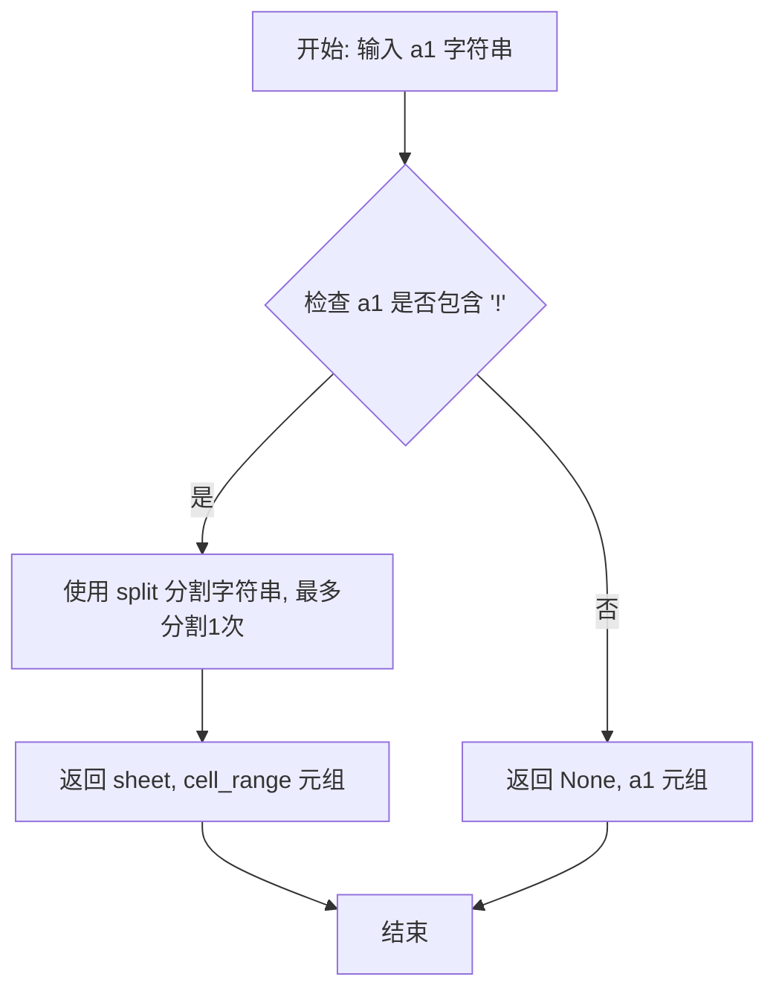

#### 带注释源码

```python
def parse_a1_notation(a1: str) -> tuple[str | None, str]:
    """Split an A1‑notation string into *(sheet_name, cell_range)*.

    Examples
    --------
    >>> parse_a1_notation("Sheet1!A1:B2")
    ("Sheet1", "A1:B2")
    >>> parse_a1_notation("A1:B2")
    (None, "A1:B2")
    """

    # 如果字符串包含 "!"，说明指定了工作表名称
    if "!" in a1:
        # 使用 split 分割字符串，最多分割1次
        # 例如 "Sheet1!A1:B2" -> ["Sheet1", "A1:B2"]
        sheet, cell_range = a1.split("!", 1)
        return sheet, cell_range
    
    # 如果没有 "!"，说明没有指定工作表名称
    # 例如 "A1:B2" -> (None, "A1:B2")
    return None, a1
```


### `extract_spreadsheet_id`

该函数用于从 Google Sheets URL 或直接 ID 中提取电子表格 ID。它支持两种输入格式：完整的 Google Sheets URL（如 `https://docs.google.com/spreadsheets/d/1BxiMVs0XRA5nFMdKvBdBZjgmUUqptlbs74OgvE2upms/edit`）或直接的电子表格 ID（如 `1BxiMVs0XRA5nFMdKvBdBZjgmUUqptlbs74OgvE2upms`）。如果是 URL 格式，则解析并提取 ID 部分；如果是直接 ID，则直接返回。

参数：
- `spreadsheet_id_or_url`：`str`，传入的电子表格 ID 或 Google Sheets URL

返回值：`str`，提取出的电子表格 ID

#### 流程图

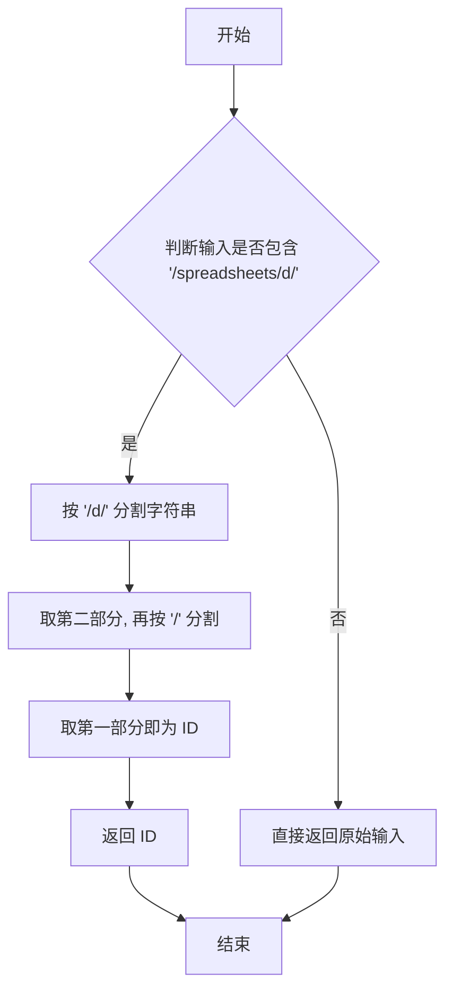

#### 带注释源码

```python
def extract_spreadsheet_id(spreadsheet_id_or_url: str) -> str:
    """Extract spreadsheet ID from either a direct ID or a Google Sheets URL.

    Examples
    --------
    >>> extract_spreadsheet_id("1BxiMVs0XRA5nFMdKvBdBZjgmUUqptlbs74OgvE2upms")
    "1BxiMVs0XRA5nFMdKvBdBZjgmUUqptlbs74OgvE2upms"
    >>> extract_spreadsheet_id("https://docs.google.com/spreadsheets/d/1BxiMVs0XRA5nFMdKvBdBZjgmUUqptlbs74OgvE2upms/edit")
    "1BxiMVs0XRA5nFMdKvBdBZjgmUUqptlbs74OgvE2upms"
    """
    # 检查输入是否为 Google Sheets URL 格式
    if "/spreadsheets/d/" in spreadsheet_id_or_url:
        # 从 URL 中提取 ID: https://docs.google.com/spreadsheets/d/{ID}/edit...
        # 按 '/d/' 分割, 取第二部分 (即包含 ID 和后续部分)
        parts = spreadsheet_id_or_url.split("/d/")[1].split("/")[0]
        return parts
    # 如果不是 URL 格式, 说明已经是直接 ID, 直接返回
    return spreadsheet_id_or_url
```


### `format_sheet_name`

该函数用于格式化 Google Sheets 工作表名称，根据 Google Sheets API 的要求对包含特殊字符的工作表名称进行引号包装，确保 API 调用的安全性。

参数：

- `sheet_name`：`str`，需要格式化的工作表名称

返回值：`str`，格式化后符合 Google Sheets API 要求的工作表名称（如果包含空格、特殊字符或以数字开头，则会用单引号包装）

#### 流程图

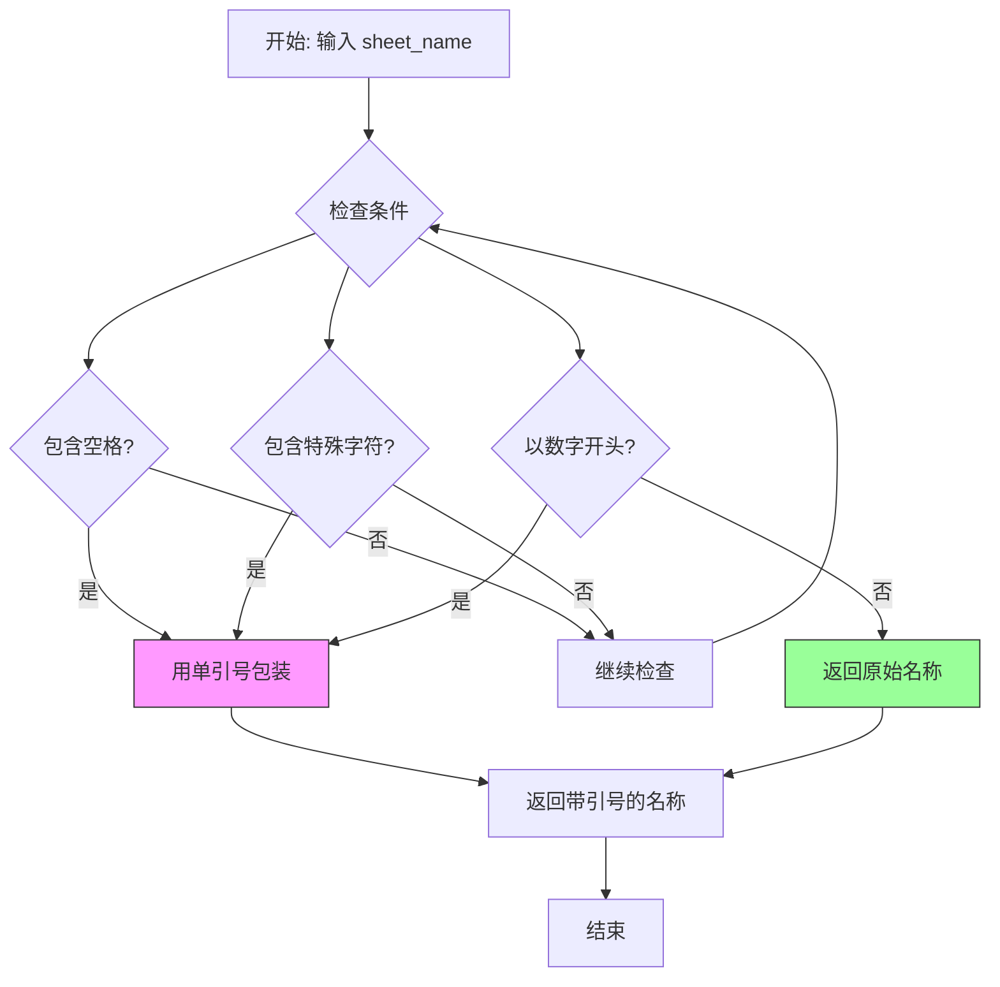

#### 带注释源码

```python
def format_sheet_name(sheet_name: str) -> str:
    """Format sheet name for Google Sheets API, adding quotes if needed.
    
    当工作表名称包含空格、特殊字符或以数字开头时，需要用单引号包装，
    以确保在 Google Sheets API 调用中正确解析。

    Examples
    --------
    >>> format_sheet_name("Sheet1")
    "Sheet1"
    >>> format_sheet_name("Non-matching Leads")
    "'Non-matching Leads'"
    """
    # 如果工作表名称包含空格、特殊字符，或以数字开头，则用单引号包装
    if (
        " " in sheet_name  # 检查是否包含空格
        or any(char in sheet_name for char in "!@#$%^&*()+-=[]{}|;:,.<>?")  # 检查是否包含特殊字符
        or (sheet_name and sheet_name[0].isdigit())  # 检查是否以数字开头
    ):
        return f"'{sheet_name}'"  # 返回用单引号包装的名称
    return sheet_name  # 直接返回原始名称
```


### `_first_sheet_meta`

获取指定电子表格中第一个工作表的标题和ID信息。

参数：

- `service`：`_build_sheets_service` 返回的 Google Sheets API 服务对象，用于执行 API 请求
- `spreadsheet_id`：`str`，电子表格的唯一标识符（可以是直接 ID 或 Google Sheets URL）

返回值：`tuple[str, int]`，返回包含两个元素的元组：
- 第一个元素（`str`）：第一个工作表的标题（title）
- 第二个元素（`int`）：第一个工作表的唯一标识符（sheetId）

#### 流程图

```mermaid
flowchart TD
    A[开始] --> B[调用 Google Sheets API: spreadsheets().get]
    B --> C[传入 spreadsheet_id 和 includeGridData=False]
    C --> D[执行 API 请求获取元数据]
    E[从响应中提取 sheets[0].properties]
    D --> E
    E --> F[提取 title 和 sheetId]
    F --> G[返回 tuple[title, sheetId]]
    G --> H[结束]
```

#### 带注释源码

```python
def _first_sheet_meta(service, spreadsheet_id: str) -> tuple[str, int]:
    """Return *(title, sheetId)* for the first sheet in *spreadsheet_id*.

    Parameters
    ----------
    service : googleapiclient.discovery.Resource
        Google Sheets API service object.
    spreadsheet_id : str
        The ID of the spreadsheet to retrieve the first sheet from.

    Returns
    -------
    tuple[str, int]
        A tuple containing:
        - title (str): The title of the first sheet
        - sheetId (int): The unique identifier for the sheet
    """
    # 调用 Google Sheets API 获取电子表格元数据
    # includeGridData=False 避免获取单元格数据，提高性能
    meta = (
        service.spreadsheets()
        .get(spreadsheetId=spreadsheet_id, includeGridData=False)
        .execute()
    )
    
    # 从响应中获取第一个工作表的属性
    first = meta["sheets"][0]["properties"]
    
    # 返回工作表的标题和 ID
    return first["title"], first["sheetId"]
```


### `get_all_sheet_names`

获取Google Sheets电子表格中所有工作表的名称列表。

参数：

- `service`：`Any`，Google Sheets API服务对象，用于与Google Sheets API交互
- `spreadsheet_id`：`str`，电子表格的ID（可以是直接ID或Google Sheets URL）

返回值：`list[str]`，电子表格中所有工作表名称的列表

#### 流程图

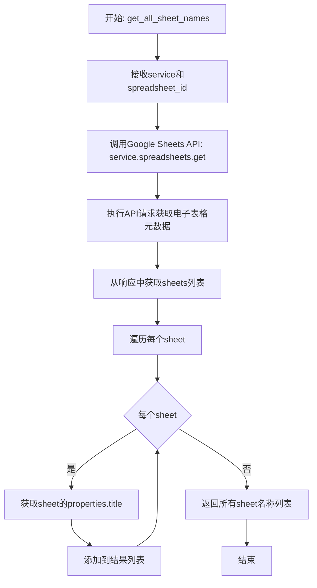

#### 带注释源码

```python
def get_all_sheet_names(service, spreadsheet_id: str) -> list[str]:
    """Get all sheet names in the spreadsheet.
    
    参数:
        service: Google Sheets API服务对象
        spreadsheet_id: 电子表格ID或URL
    
    返回:
        包含所有工作表名称的列表
    """
    # 调用Google Sheets API获取电子表格的元数据
    # 包括所有工作表的属性信息
    meta = service.spreadsheets().get(spreadsheetId=spreadsheet_id).execute()
    
    # 从元数据中提取所有工作表的名称
    # 遍历sheets列表，每个sheet包含properties子对象
    # 使用get方法安全获取title字段，如果不存在则返回空字符串
    return [
        sheet.get("properties", {}).get("title", "") 
        for sheet in meta.get("sheets", [])
    ]
```


### `resolve_sheet_name`

解析给定的工作表名称，如果为空则回退到工作簿的第一个工作表。验证工作表是否存在于电子表格中，并提供有用的错误信息。

参数：

- `service`：Google Sheets API service 对象，用于与 Google Sheets API 交互
- `spreadsheet_id`：`str`，电子表格的唯一标识符
- `sheet_name`：`str | None`，要解析的工作表名称；如果为 `None` 或空，将使用第一个工作表

返回值：`str`，解析后的有效工作表名称

#### 流程图

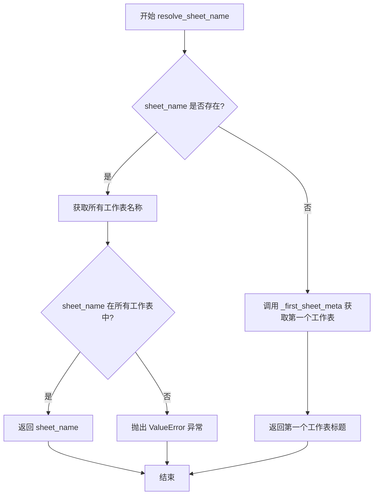

#### 带注释源码

```python
def resolve_sheet_name(service, spreadsheet_id: str, sheet_name: str | None) -> str:
    """Resolve *sheet_name*, falling back to the workbook's first sheet if empty.

    Validates that the sheet exists in the spreadsheet and provides helpful error info.
    
    Parameters
    ----------
    service : googleapiclient.discovery.Resource
        Google Sheets API service object for making API calls.
    spreadsheet_id : str
        The unique identifier of the spreadsheet.
    sheet_name : str or None
        The sheet name to resolve. If None or empty, defaults to the first sheet.
    
    Returns
    -------
    str
        The resolved valid sheet name.
    
    Raises
    ------
    ValueError
        If the specified sheet_name does not exist in the spreadsheet.
    """
    # 如果提供了 sheet_name，则验证它是否存在
    if sheet_name:
        # 调用 get_all_sheet_names 获取电子表格中所有工作表的名称列表
        all_sheets = get_all_sheet_names(service, spreadsheet_id)
        
        # 检查指定的工作表名称是否在列表中
        if sheet_name not in all_sheets:
            # 工作表不存在，抛出详细的错误信息，包含可用工作表列表
            raise ValueError(
                f'Sheet "{sheet_name}" not found in spreadsheet. '
                f"Available sheets: {all_sheets}"
            )
        # 验证通过，返回给定的工作表名称
        return sheet_name
    
    # 如果未提供 sheet_name（为 None 或空），则获取第一个工作表的信息
    # 调用内部函数 _first_sheet_meta 获取第一个工作表的标题和 sheetId
    title, _ = _first_sheet_meta(service, spreadsheet_id)
    
    # 返回第一个工作表的标题
    return title
```


### `sheet_id_by_name`

根据工作表名称获取对应的 sheetId。如果找到指定名称的工作表，则返回其 sheetId；否则返回 `None`。

参数：

- `service`：Google Sheets API 服务对象，用于调用 API
- `spreadsheet_id`：`str`，电子表格的唯一标识符
- `sheet_name`：`str`，要查找的工作表名称

返回值：`int | None`，找到时返回工作表的 sheetId（整数），未找到时返回 `None`

#### 流程图

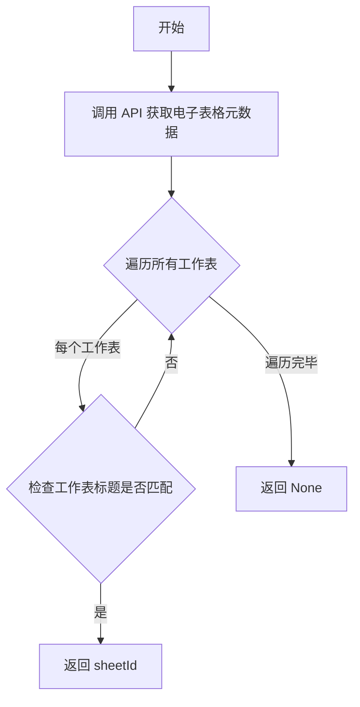

#### 带注释源码

```python
def sheet_id_by_name(service, spreadsheet_id: str, sheet_name: str) -> int | None:
    """Return the *sheetId* for *sheet_name* (or `None* if not found)."""
    
    # 通过 Google Sheets API 获取指定电子表格的元数据
    # 包含所有工作表的属性信息（标题、sheetId 等）
    meta = service.spreadsheets().get(spreadsheetId=spreadsheet_id).execute()
    
    # 遍历电子表格中的所有工作表
    for sh in meta.get("sheets", []):
        # 获取当前工作表的属性，提取标题
        sheet_title = sh.get("properties", {}).get("title")
        
        # 检查标题是否与目标名称匹配
        if sheet_title == sheet_name:
            # 匹配成功，返回该工作表的 sheetId
            return sh["properties"]["sheetId"]
    
    # 遍历完毕未找到匹配的工作表，返回 None
    return None
```


### `_build_sheets_service`

用平台凭证（含刷新令牌）构建 Google Sheets API 服务对象。

参数：

- `credentials`：`GoogleCredentials`，平台凭证对象，包含 `access_token`、`refresh_token` 和 `scopes` 属性

返回值：`googleapiclient.discovery.Resource`，Google Sheets API v4 服务对象，可用于调用 Sheets API

#### 流程图

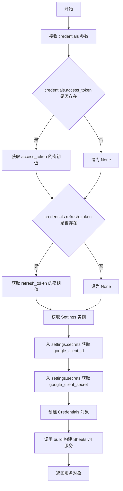

#### 带注释源码

```python
def _build_sheets_service(credentials: GoogleCredentials):
    """Build Sheets service from platform credentials (with refresh token)."""
    # 获取应用设置实例
    settings = Settings()
    
    # 从凭证对象中提取访问令牌（如果存在）
    # 使用 get_secret_value() 方法获取密钥的实际值
    creds = Credentials(
        token=(
            credentials.access_token.get_secret_value()
            if credentials.access_token
            else None
        ),
        # 从凭证对象中提取刷新令牌（如果存在）
        # 刷新令牌用于在访问令牌过期时自动刷新
        refresh_token=(
            credentials.refresh_token.get_secret_value()
            if credentials.refresh_token
            else None
        ),
        # Google OAuth2 令牌端点
        token_uri="https://oauth2.googleapis.com/token",
        # 从应用设置中获取 OAuth 客户端 ID
        client_id=settings.secrets.google_client_id,
        # 从应用设置中获取 OAuth 客户端密钥
        client_secret=settings.secrets.google_client_secret,
        # 使用凭证对象中定义的权限范围
        scopes=credentials.scopes,
    )
    # 使用 googleapiclient 构建 Sheets API v4 服务
    return build("sheets", "v4", credentials=creds)
```


### `_build_drive_service`

构建 Google Drive 服务对象，使用平台凭据（包括刷新令牌）进行身份验证。

参数：

-  `credentials`：`GoogleCredentials`，包含访问令牌、刷新令牌和 OAuth 范围的平台凭据对象

返回值：`googleapiclient.discovery.Resource`，Google Drive API v3 服务对象，用于与 Google Drive API 交互

#### 流程图

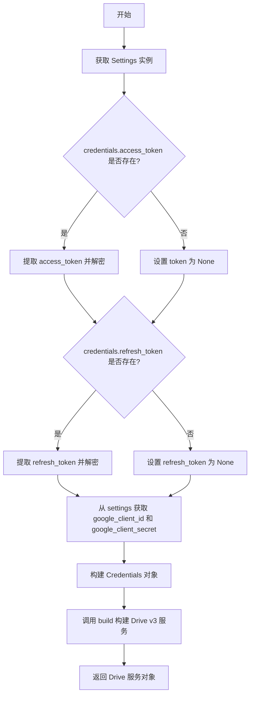

#### 带注释源码

```python
def _build_drive_service(credentials: GoogleCredentials):
    """Build Drive service from platform credentials (with refresh token).
    
    使用平台提供的凭据（包括刷新令牌）构建 Google Drive API 服务对象。
    刷新令牌用于在访问令牌过期时自动获取新的访问令牌。
    
    Args:
        credentials: GoogleCredentials 对象，包含 OAuth 令牌信息
        
    Returns:
        Google Drive API v3 服务对象，用于执行 Drive API 操作
    """
    # 获取应用设置实例，用于获取 OAuth 客户端凭据
    settings = Settings()
    
    # 构建 OAuth2 Credentials 对象
    # 处理可能为 None 的令牌字段
    creds = Credentials(
        # 从 SecretStr 中提取实际访问令牌值，如果不存在则设为 None
        token=(
            credentials.access_token.get_secret_value()
            if credentials.access_token
            else None
        ),
        # 从 SecretStr 中提取实际刷新令牌值，如果不存在则设为 None
        # 刷新令牌用于在访问令牌过期时自动刷新
        refresh_token=(
            credentials.refresh_token.get_secret_value()
            if credentials.refresh_token
            else None
        ),
        # Google OAuth2 令牌 endpoint
        token_uri="https://oauth2.googleapis.com/token",
        # 应用客户端凭据，用于 OAuth 流程
        client_id=settings.secrets.google_client_id,
        client_secret=settings.secrets.google_client_secret,
        # OAuth 权限范围，决定 API 访问权限
        scopes=credentials.scopes,
    )
    
    # 使用 googleapiclient 构建 Drive API v3 服务
    # 传入凭据对象以进行身份验证
    return build("drive", "v3", credentials=creds)
```


### `_validate_spreadsheet_file`

验证指定的 Google Drive 文件是否为 Google Sheets 电子表格。如果文件有效则返回 None，如果无效则返回描述性的错误消息字符串。

参数：

- `spreadsheet_file`：`GoogleDriveFile`，需要验证的 Google Drive 文件对象

返回值：`str | None`，验证成功返回 None，验证失败返回错误消息字符串

#### 流程图

```mermaid
flowchart TD
    A[开始] --> B{检查 mime_type == 'application/vnd.google-apps.spreadsheet'}
    B -- 是 --> C[返回 None]
    B -- 否 --> D{mime_type == 'text/csv'}
    D -- 是 --> E[返回 CSV 错误消息]
    D -- 否 --> F{mime_type in ['application/vnd.ms-excel', 'application/vnd.openxmlformats-officedocument.spreadsheetml.sheet']}
    F -- 是 --> G[返回 Excel 错误消息]
    F -- 否 --> H[返回通用错误消息]
```

#### 带注释源码

```python
def _validate_spreadsheet_file(spreadsheet_file: "GoogleDriveFile") -> str | None:
    """Validate that the selected file is a Google Sheets spreadsheet.

    Returns None if valid, error message string if invalid.
    """
    # 检查文件的 MIME 类型是否为 Google Sheets 专用类型
    if spreadsheet_file.mime_type != "application/vnd.google-apps.spreadsheet":
        # 提取文件类型和名称用于错误消息
        file_type = spreadsheet_file.mime_type
        file_name = spreadsheet_file.name
        
        # 针对不同文件类型提供特定的错误消息和解决方案建议
        if file_type == "text/csv":
            return f"Cannot use CSV file '{file_name}' with Google Sheets block. Please use a CSV reader block instead, or convert the CSV to a Google Sheets spreadsheet first."
        elif file_type in [
            "application/vnd.ms-excel",
            "application/vnd.openxmlformats-officedocument.spreadsheetml.sheet",
        ]:
            return f"Cannot use Excel file '{file_name}' with Google Sheets block. Please use an Excel reader block instead, or convert to Google Sheets first."
        else:
            # 其他不支持的文件类型
            return f"Cannot use file '{file_name}' (type: {file_type}) with Google Sheets block. This block only works with Google Sheets spreadsheets."
    
    # 文件有效，返回 None 表示验证通过
    return None
```


### `_handle_sheets_api_error`

将 Google Sheets API 错误消息转换为用户友好的提示信息，根据错误类型和操作类型返回不同的解释。

参数：

-  `error_msg`：`str`，原始的 Google Sheets API 错误消息
-  `operation`：`str`，执行的操作类型（默认为 "access"），用于生成更精确的错误提示

返回值：`str`，转换后的用户友好错误消息

#### 流程图

```mermaid
flowchart TD
    A[开始: 接收 error_msg 和 operation] --> B{检查错误消息类型}
    B --> C1["Request contains an invalid argument"]
    B --> C2["The caller does not have permission" 或 "Forbidden"]
    B --> C3["not found" 或 "does not exist"]
    B --> C4[其他错误]
    
    C1 --> D1[返回: 无效请求错误提示<br/>包含操作类型说明]
    
    C2 --> D2{operation 是否为<br/>write/modify/update/append/clear}
    D2 -->|是| D2a[返回: 权限被拒绝<br/>需要编辑权限]
    D2 -->|否| D2b[返回: 权限被拒绝<br/>需要访问权限]
    
    C3 --> D3[返回: 电子表格未找到<br/>文件可能已删除或链接无效]
    
    C4 --> D4[返回: 通用失败消息<br/>包含原始错误和操作类型]
    
    D1 --> E[结束]
    D2a --> E
    D2b --> E
    D3 --> E
    D4 --> E
```

#### 带注释源码

```python
def _handle_sheets_api_error(error_msg: str, operation: str = "access") -> str:
    """Convert common Google Sheets API errors to user-friendly messages.
    
    Args:
        error_msg: The raw error message from Google Sheets API
        operation: The operation being performed (e.g., "read", "write", "update")
                   Used to generate more specific error messages
    
    Returns:
        A user-friendly error message string
    """
    # 检查是否为无效参数错误
    # 常见于：文件不是Google Sheets表格、范围无效、无权限操作
    if "Request contains an invalid argument" in error_msg:
        return f"Invalid request to Google Sheets API. This usually means the file is not a Google Sheets spreadsheet, the range is invalid, or you don't have permission to {operation} this file."
    
    # 检查权限错误（403 Forbidden）
    # 根据操作类型提供不同的错误提示
    elif "The caller does not have permission" in error_msg or "Forbidden" in error_msg:
        if operation in ["write", "modify", "update", "append", "clear"]:
            # 写入操作需要编辑权限
            return "Permission denied. You don't have edit access to this spreadsheet. Make sure it's shared with edit permissions."
        else:
            # 读取等操作需要访问权限
            return "Permission denied. You don't have access to this spreadsheet. Make sure it's shared with you and try re-selecting the file."
    
    # 检查文件未找到错误
    # 常见于：文件已删除、链接无效
    elif "not found" in error_msg.lower() or "does not exist" in error_msg.lower():
        return "Spreadsheet not found. The file may have been deleted or the link is invalid."
    
    # 其他未知错误，返回通用错误消息并保留原始错误信息
    else:
        return f"Failed to {operation} Google Sheet: {error_msg}"
```


### `_column_letter_to_index`

将列字母（如 A、B、...、Z、AA、AB 等）转换为 0 开始的索引值的工具函数。

参数：

-  `letter`：`str`，需要转换的列字母（例如 "A"、"B"、"AA" 等）

返回值：`int`，返回 0 开始的列索引值（例如 A=0, B=1, Z=25, AA=26）

#### 流程图

```mermaid
flowchart TD
    A[开始: 输入 letter] --> B{letter 是否为空}
    B -->|是| C[返回 -1]
    B -->|否| D[将 letter 转换为大写]
    D --> E[初始化 result = 0]
    E --> F{遍历 letter 中的每个字符}
    F -->|每个字符 char| G[计算 char 的值: ord&#40;char&#41; - ord&#40;'A'&#41; + 1]
    G --> H[result = result * 26 + char_value]
    H --> F
    F -->|遍历完成| I[返回 result - 1]
```

#### 带注释源码

```python
def _column_letter_to_index(letter: str) -> int:
    """Convert column letter (A, B, ..., Z, AA, AB, ...) to 0-based index.
    
    Examples
    --------
    >>> _column_letter_to_index("A")
    0
    >>> _column_letter_to_index("B")
    1
    >>> _column_letter_to_index("Z")
    25
    >>> _column_letter_to_index("AA")
    26
    >>> _column_letter_to_index("AB")
    27
    """
    # 初始化结果为 0
    result = 0
    # 遍历输入字母的每个字符
    for char in letter.upper():
        # 将字符转换为对应的数值 (A=1, B=2, ..., Z=26)
        # ord('A') = 65, ord('B') = 66, ...
        # 例如 'A' -> 65 - 65 + 1 = 1
        #       'B' -> 66 - 65 + 1 = 2
        char_value = ord(char) - ord("A") + 1
        # 使用 26 进制的方式累加结果
        # 例如 "AB" -> (0 * 26 + 1) * 26 + 2 = 28
        result = result * 26 + char_value
    # 返回 0 开始的索引，因此需要减 1
    # 例如 "A" 的结果是 1，减去 1 后变成 0
    return result - 1
```


### `_index_to_column_letter`

将 0 基底的列索引转换为 Excel 风格的列字母标识（如 0 → A，1 → B，26 → AA，27 → AB 等）。

参数：

-  `index`：`int`，从 0 开始的列索引

返回值：`str`，对应的 Excel 列字母标识（例如 A, B, ..., Z, AA, AB, ...）

#### 流程图

```mermaid
flowchart TD
    A[开始: index] --> B[将 index 转换为 1 基底: index += 1]
    B --> C{index > 0?}
    C -->|是| D[计算除法和余数: index, remainder = divmod(index - 1, 26)]
    D --> E[计算字母: chr(ord('A') + remainder)]
    E --> F[将字母添加到结果字符串开头]
    F --> B
    C -->|否| G[返回结果字符串]
```

#### 带注释源码

```python
def _index_to_column_letter(index: int) -> str:
    """Convert 0-based column index to column letter (A, B, ..., Z, AA, AB, ...)."""
    result = ""
    # 将 0 基底的索引转换为 1 基底，以便处理 A=1 的情况
    index += 1  # Convert to 1-based
    # 循环处理直到 index 变为 0
    # 每次迭代处理一个字符：26 进制转换（但 A=1 而非 A=0）
    while index > 0:
        # 使用 divmod 获取商和余数
        # (index - 1) 确保 A=1, B=2, ..., Z=26, AA=27
        index, remainder = divmod(index - 1, 26)
        # 将余数转换为对应的大写字母 (0->A, 1->B, ..., 25->Z)
        result = chr(ord("A") + remainder) + result
    return result
```


### `_apply_filter`

该函数是 Google Sheets 筛选行的核心过滤逻辑，根据指定的过滤操作符对单元格值进行比较判断，返回布尔值表示是否匹配。

参数：

- `cell_value`：`str`，单元格的实际值
- `filter_value`：`str`，用于过滤比较的值
- `operator`：`FilterOperator`，过滤操作枚举（如等于、包含、大于等）
- `match_case`：`bool`，是否区分大小写

返回值：`bool`，表示单元格值是否符合过滤条件

#### 流程图

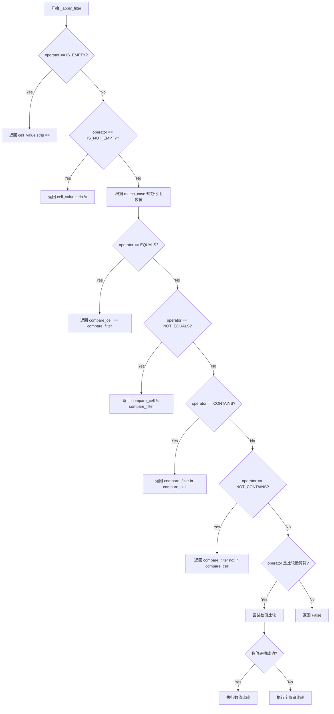

#### 带注释源码

```python
def _apply_filter(
    cell_value: str,
    filter_value: str,
    operator: FilterOperator,
    match_case: bool,
) -> bool:
    """Apply a filter condition to a cell value.
    
    根据给定的操作符对单元格值进行过滤判断，支持空值检查、
    相等性比较、包含检查以及数值/字符串的大小比较。
    
    Parameters
    ----------
    cell_value : str
        单元格的实际值
    filter_value : str
        用于过滤比较的值
    operator : FilterOperator
        过滤操作枚举类型
    match_case : bool
        是否区分大小写
    
    Returns
    -------
    bool
        单元格值是否符合过滤条件
    """
    
    # 处理空值检查操作符
    if operator == FilterOperator.IS_EMPTY:
        # 检查单元格是否为空（仅含空白字符）
        return cell_value.strip() == ""
    if operator == FilterOperator.IS_NOT_EMPTY:
        # 检查单元格是否非空
        return cell_value.strip() != ""

    # 对于其他比较操作符，根据 match_case 决定是否转换大小写
    # 以便进行不区分大小写的比较
    compare_cell = cell_value if match_case else cell_value.lower()
    compare_filter = filter_value if match_case else filter_value.lower()

    # 处理相等性操作符
    if operator == FilterOperator.EQUALS:
        return compare_cell == compare_filter
    elif operator == FilterOperator.NOT_EQUALS:
        return compare_cell != compare_filter
    
    # 处理包含操作符
    elif operator == FilterOperator.CONTAINS:
        return compare_filter in compare_cell
    elif operator == FilterOperator.NOT_CONTAINS:
        return compare_filter not in compare_cell
    
    # 处理数值比较操作符（大于、小于、大于等于、小于等于）
    elif operator in (
        FilterOperator.GREATER_THAN,
        FilterOperator.LESS_THAN,
        FilterOperator.GREATER_THAN_OR_EQUAL,
        FilterOperator.LESS_THAN_OR_EQUAL,
    ):
        # 优先尝试数值类型比较
        try:
            # 将单元格值和过滤值转换为浮点数进行数值比较
            num_cell = float(cell_value)
            num_filter = float(filter_value)
            
            # 根据操作符类型执行相应的数值比较
            if operator == FilterOperator.GREATER_THAN:
                return num_cell > num_filter
            elif operator == FilterOperator.LESS_THAN:
                return num_cell < num_filter
            elif operator == FilterOperator.GREATER_THAN_OR_EQUAL:
                return num_cell >= num_filter
            elif operator == FilterOperator.LESS_THAN_OR_EQUAL:
                return num_cell <= num_filter
        except ValueError:
            # 数值转换失败时，回退到字符串比较
            # （适用于日期、版本号等字符串形式的数值）
            if operator == FilterOperator.GREATER_THAN:
                return compare_cell > compare_filter
            elif operator == FilterOperator.LESS_THAN:
                return compare_cell < compare_filter
            elif operator == FilterOperator.GREATER_THAN_OR_EQUAL:
                return compare_cell >= compare_filter
            elif operator == FilterOperator.LESS_THAN_OR_EQUAL:
                return compare_cell <= compare_filter

    # 默认返回 False（不支持的操作符或未匹配情况）
    return False
```


### `GoogleSheetsReadBlock.run`

该方法是 `GoogleSheetsReadBlock` 类的异步运行方法，负责读取 Google Sheets 表格中指定范围的数据。它首先验证输入的电子表格文件是否为有效的 Google Sheets 格式，然后构建 Google Sheets API 服务，调用内部方法 `_read_sheet` 执行实际的数据读取操作，最后将读取结果和电子表格对象（用于后续块连接）通过生成器输出，若发生错误则输出错误信息。

参数：

-  `input_data`：`GoogleSheetsReadBlock.Input`，包含用户输入的电子表格文件和 A1 notation 范围
-  `credentials`：`GoogleCredentials`，Google OAuth 凭据，用于认证 Google Sheets API
-  `**kwargs`：任意关键字参数

返回值：`BlockOutput`，生成器类型，输出包含 result（读取的数据列表）、spreadsheet（GoogleDriveFile 对象用于链式调用）或 error（错误信息）

#### 流程图

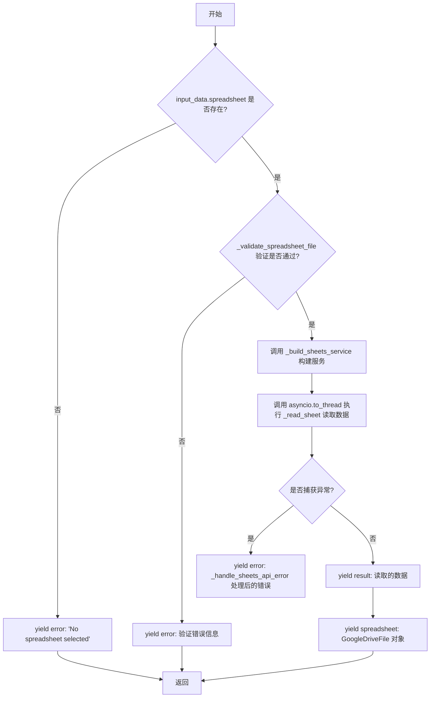

#### 带注释源码

```python
async def run(
    self, input_data: Input, *, credentials: GoogleCredentials, **kwargs
) -> BlockOutput:
    """读取 Google Sheets 表格中指定范围的数据。
    
    参数:
        input_data: 包含 spreadsheet 和 range 的输入数据
        credentials: Google OAuth 凭据
        **kwargs: 其他关键字参数
    
    生成:
        result: 从表格读取的二维数据列表
        spreadsheet: 用于链式调用的 GoogleDriveFile 对象
        error: 错误信息（如果发生）
    """
    # 检查是否选择了电子表格
    if not input_data.spreadsheet:
        yield "error", "No spreadsheet selected"
        return

    # 检查选择的文件是否实际上是 Google Sheets 电子表格
    validation_error = _validate_spreadsheet_file(input_data.spreadsheet)
    if validation_error:
        yield "error", validation_error
        return
    
    try:
        # 使用凭据构建 Sheets API 服务
        service = _build_sheets_service(credentials)
        # 获取电子表格 ID
        spreadsheet_id = input_data.spreadsheet.id
        # 使用 asyncio.to_thread 在线程中执行同步的 API 调用
        data = await asyncio.to_thread(
            self._read_sheet, service, spreadsheet_id, input_data.range
        )
        # 输出读取到的数据
        yield "result", data
        # 输出 GoogleDriveFile 用于链式调用（保留 credentials_id）
        yield "spreadsheet", GoogleDriveFile(
            id=spreadsheet_id,
            name=input_data.spreadsheet.name,
            mimeType="application/vnd.google-apps.spreadsheet",
            url=f"https://docs.google.com/spreadsheets/d/{spreadsheet_id}/edit",
            iconUrl="https://www.gstatic.com/images/branding/product/1x/sheets_48dp.png",
            isFolder=False,
            _credentials_id=input_data.spreadsheet.credentials_id,
        )
    except Exception as e:
        # 处理 API 错误并输出用户友好的错误信息
        yield "error", _handle_sheets_api_error(str(e), "read")
```


### GoogleSheetsReadBlock._read_sheet

该方法用于从 Google Sheets 电子表格中读取指定范围的数据。它接收 Google Sheets API 服务对象、电子表格 ID 和 A1 表示法范围，通过解析范围格式、构建最终的 API 请求来获取单元格数据，并返回二维字符串列表。

参数：

- `service`：`_googleapiclient.discovery.Resource`，Google Sheets API 服务对象，用于执行 API 调用
- `spreadsheet_id`：`str`，目标电子表格的唯一标识符
- `range`：`str`，要读取的单元格范围，使用 A1 表示法（如 "Sheet1!A1:B2" 或 "A1:Z"）

返回值：`list[list[str]]`，从电子表格读取的单元格数据，以二维列表形式返回，每行是一个内部列表

#### 流程图

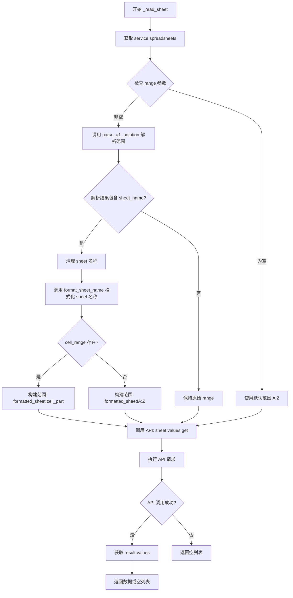

#### 带注释源码

```python
def _read_sheet(
    self,
    service,
    spreadsheet_id: str,
    range: str
) -> list[list[str]]:
    """从 Google Sheets 电子表格读取指定范围的数据。
    
    Args:
        service: Google Sheets API 服务对象
        spreadsheet_id: 电子表格的唯一标识符
        range: A1 表示法范围 (如 "Sheet1!A1:B2")
    
    Returns:
        从电子表格读取的二维字符串列表数据
    """
    # 获取 spreadsheets 服务端点
    sheet = service.spreadsheets()
    
    # 如果未指定范围，默认读取 A:Z (所有列)
    range_to_use = range or "A:Z"
    
    # 解析 A1 表示法，分离 sheet 名称和单元格范围
    # 例如 "Sheet1!A1:B2" -> ("Sheet1", "A1:B2")
    #      "A1:B2" -> (None, "A1:B2")
    sheet_name, cell_range = parse_a1_notation(range_to_use)
    
    # 如果解析出 sheet 名称，需要格式化处理
    if sheet_name:
        # 去除首尾空白和引号
        cleaned_sheet = sheet_name.strip().strip("'\"")
        
        # 格式化 sheet 名称（如果包含特殊字符需要加引号）
        formatted_sheet = format_sheet_name(cleaned_sheet)
        
        # 获取单元格范围部分
        cell_part = cell_range.strip() if cell_range else ""
        
        if cell_part:
            # 组合为完整范围: 'SheetName'!A1:B2
            range_to_use = f"{formatted_sheet}!{cell_part}"
        else:
            # 无单元格范围时读取整个 sheet
            range_to_use = f"{formatted_sheet}!A:Z"
    
    # 如果没有 sheet 名称，保持原始范围不变
    # (如 "A1:B2" 或 "B:B" 等)
    
    # 调用 Google Sheets API 读取数据
    result = (
        sheet.values()
        .get(spreadsheetId=spreadsheet_id, range=range_to_use)
        .execute()
    )
    
    # 返回 values 字段，若无数据则返回空列表
    return result.get("values", [])
```


### `GoogleSheetsWriteBlock.run`

将数据写入到指定 A1 表示法范围的 Google Sheets 电子表格的异步方法。

参数：

- `self`：GoogleSheetsWriteBlock，块实例本身
- `input_data`：`GoogleSheetsWriteBlock.Input`，包含要写入的电子表格、范围和值的输入数据
- `credentials`：`GoogleCredentials`，Google OAuth 凭据
- `**kwargs`：任意关键字参数

返回值：`BlockOutput`，生成器，输出写入结果、GoogleDriveFile（用于链接）或错误信息

#### 流程图

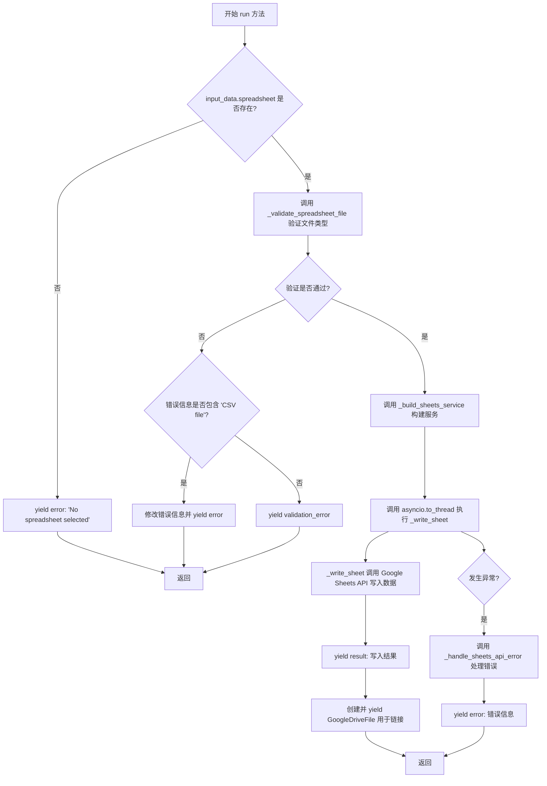

#### 带注释源码

```python
async def run(
    self, input_data: Input, *, credentials: GoogleCredentials, **kwargs
) -> BlockOutput:
    """将数据写入到 Google Sheets 电子表格的指定范围"""
    
    # 检查是否选择了电子表格
    if not input_data.spreadsheet:
        yield "error", "No spreadsheet selected"
        return

    # 验证所选文件是否为 Google Sheets 电子表格
    validation_error = _validate_spreadsheet_file(input_data.spreadsheet)
    if validation_error:
        # 针对 CSV 文件的写入操作进行自定义错误信息处理
        if "CSV file" in validation_error:
            yield "error", validation_error.replace(
                "Please use a CSV reader block instead, or",
                "CSV files are read-only through Google Drive. Please",
            )
        else:
            yield "error", validation_error
        return

    try:
        # 使用凭据构建 Google Sheets 服务
        service = _build_sheets_service(credentials)
        
        # 异步调用 _write_sheet 方法写入数据
        result = await asyncio.to_thread(
            self._write_sheet,
            service,
            input_data.spreadsheet.id,
            input_data.range,
            input_data.values,
        )
        
        # 输出写入结果（包含更新的单元格数等）
        yield "result", result
        
        # 输出 GoogleDriveFile 以便链接到其他块（保留 credentials_id）
        yield "spreadsheet", GoogleDriveFile(
            id=input_data.spreadsheet.id,
            name=input_data.spreadsheet.name,
            mimeType="application/vnd.google-apps.spreadsheet",
            url=f"https://docs.google.com/spreadsheets/d/{input_data.spreadsheet.id}/edit",
            iconUrl="https://www.gstatic.com/images/branding/product/1x/sheets_48dp.png",
            isFolder=False,
            _credentials_id=input_data.spreadsheet.credentials_id,
        )
    except Exception as e:
        # 处理 Google Sheets API 错误并输出友好的错误信息
        yield "error", _handle_sheets_api_error(str(e), "write")
```


### `GoogleSheetsWriteBlock._write_sheet`

该方法用于将数据写入 Google Sheets 电子表格的指定范围。它接收 Google Sheets API 服务对象、电子表格 ID、A1 notation 范围以及要写入的二维字符串数组，然后调用 Google Sheets Values API 的 update 方法将数据写入电子表格，并返回 API 响应结果。

参数：

- `self`：`GoogleSheetsWriteBlock` 实例，方法所属的块实例
- `service`：`Any`（Google Sheets API 服务对象），用于与 Google Sheets API 交互
- `spreadsheet_id`：`str`，目标电子表格的唯一标识符
- `range`：`str`，A1 表示法范围（如 "Sheet1!A1:B2"），指定写入数据的单元格区域
- `values`：`list[list[str]]`，要写入电子表格的二维字符串数组，每行对应一行数据

返回值：`dict`，Google Sheets API 的响应结果，通常包含更新的单元格数量、行数和列数等信息，例如：`{"updatedCells": 4, "updatedColumns": 2, "updatedRows": 2}`

#### 流程图

```mermaid
flowchart TD
    A[开始写入数据] --> B[构建请求体<br/>body = {values: values}]
    B --> C[调用 service.spreadsheets<br/>.values.update API]
    C --> D[传入参数: spreadsheetId, range,<br/>valueInputOption='USER_ENTERED', body]
    D --> E[执行 API 调用并获取结果]
    E --> F[返回 API 响应结果 dict]
```

#### 带注释源码

```python
def _write_sheet(
    self, service, spreadsheet_id: str, range: str, values: list[list[str]]
) -> dict:
    """将数据写入 Google Sheets 电子表格的指定范围。
    
    参数:
        service: Google Sheets API 服务对象
        spreadsheet_id: 电子表格的唯一标识符
        range: A1 表示法范围，如 "Sheet1!A1:B2"
        values: 要写入的二维字符串数组
    
    返回:
        dict: API 响应结果，包含 updatedCells, updatedColumns, updatedRows 等信息
    """
    # 构建请求体，Google Sheets API 需要 'values' 键包含数据
    body = {"values": values}
    
    # 调用 Google Sheets Values API 的 update 方法
    # valueInputOption="USER_ENTERED" 表示按用户输入方式解析值
    # （例如：公式会被解析为公式，日期字符串会被解析为日期）
    result = (
        service.spreadsheets()
        .values()
        .update(
            spreadsheetId=spreadsheet_id,
            range=range,
            valueInputOption="USER_ENTERED",
            body=body,
        )
        .execute()
    )
    
    # 返回 API 执行结果，包含更新的单元格数量等信息
    return result
```


### `GoogleSheetsAppendRowBlock.run`

该方法是一个异步方法，用于将单行数据追加到 Google Sheets 表格的末尾。它首先验证输入的电子表格文件是否为有效的 Google Sheets 格式，检查是否提供了行数据，然后调用 Google Sheets API 的 append 方法将数据追加到指定工作表的最后一行。如果操作成功，它会返回 API 响应和用于链接到其他块的电子表格对象；如果发生错误，则生成相应的错误信息。

参数：

-  `self`：GoogleSheetsAppendRowBlock 实例，方法的调用者
-  `input_data`：Input 类型，包含以下字段：
  - `spreadsheet`：GoogleDriveFile，要追加行的目标 Google Sheets 电子表格
  - `row`：list[str]，要追加的行数据值列表（例如 ['Alice', 'alice@example.com', '25']）
  -  `sheet_name`：str，目标工作表名称，默认为空字符串，空值时使用第一个工作表
  -  `value_input_option`：ValueInputOption，值的输入方式，USER_ENTERED 会解析输入内容（如公式、日期），RAW 会原样存储
-  `credentials`：GoogleCredentials，用于认证的 Google 凭证
-  `**kwargs`：任意关键字参数

返回值：BlockOutput，一个生成器，依次 yield 以下输出：
-  `result`：dict，追加 API 的响应，包含 updatedCells、updatedRows、updatedColumns 等信息
-  `spreadsheet`：GoogleDriveFile，用于链接到其他块的电子表格对象
-  `error`：str，如果发生错误则返回错误消息

#### 流程图

```mermaid
flowchart TD
    A[开始 run 方法] --> B{input_data.spreadsheet 是否存在?}
    B -->|否| C[yield error: 'No spreadsheet selected']
    B -->|是| D[_validate_spreadsheet_file 验证文件类型]
    D --> E{验证是否通过?}
    E -->|否| F[yield validation_error]
    E -->|是| G{input_data.row 是否为空?}
    G -->|是| H[yield error: 'Row data is required']
    G -->|否| I[_build_sheets_service 构建服务]
    I --> J[调用 _append_row 同步方法]
    J --> K{是否抛出异常?}
    K -->|是| L[yield error: f'Failed to append row: {str(e)}']
    K -->|否| M[yield result: API 响应]
    M --> N[yield spreadsheet: GoogleDriveFile 对象]
    C --> O[结束]
    F --> O
    H --> O
    L --> O
    N --> O
```

#### 带注释源码

```python
async def run(
    self, input_data: Input, *, credentials: GoogleCredentials, **kwargs
) -> BlockOutput:
    """执行追加行操作的主方法"""
    # 检查是否选择了电子表格
    if not input_data.spreadsheet:
        yield "error", "No spreadsheet selected"
        return

    # 验证选中的文件是否为 Google Sheets 电子表格
    validation_error = _validate_spreadsheet_file(input_data.spreadsheet)
    if validation_error:
        yield "error", validation_error
        return

    # 验证是否提供了行数据
    if not input_data.row:
        yield "error", "Row data is required"
        return

    try:
        # 使用凭证构建 Google Sheets 服务
        service = _build_sheets_service(credentials)
        
        # 在线程中执行同步的追加行操作
        result = await asyncio.to_thread(
            self._append_row,
            service,
            input_data.spreadsheet.id,
            input_data.sheet_name,
            input_data.row,
            input_data.value_input_option,
        )
        
        # 返回成功结果
        yield "result", result
        
        # 返回电子表格对象以便链接到其他块
        yield "spreadsheet", GoogleDriveFile(
            id=input_data.spreadsheet.id,
            name=input_data.spreadsheet.name,
            mimeType="application/vnd.google-apps.spreadsheet",
            url=f"https://docs.google.com/spreadsheets/d/{input_data.spreadsheet.id}/edit",
            iconUrl="https://www.gstatic.com/images/branding/product/1x/sheets_48dp.png",
            isFolder=False,
            _credentials_id=input_data.spreadsheet.credentials_id,
        )
    except Exception as e:
        yield "error", f"Failed to append row: {str(e)}"

def _append_row(
    self,
    service,
    spreadsheet_id: str,
    sheet_name: str,
    row: list[str],
    value_input_option: ValueInputOption,
) -> dict:
    """同步执行追加行到 Google Sheet 的底层方法"""
    # 解析工作表名称，如果未提供则使用第一个工作表
    target_sheet = resolve_sheet_name(service, spreadsheet_id, sheet_name or None)
    
    # 格式化工作表名称（如果需要引号则添加）
    formatted_sheet = format_sheet_name(target_sheet)
    
    # 构建追加范围的 A1 表示法
    append_range = f"{formatted_sheet}!A1"
    
    # 构建请求体，将单行包装为列表
    body = {"values": [row]}
    
    # 调用 Google Sheets API 的 append 方法
    result = (
        service.spreadsheets()
        .values()
        .append(
            spreadsheetId=spreadsheet_id,
            range=append_range,
            valueInputOption=value_input_option.value,
            insertDataOption="INSERT_ROWS",
            body=body,
        )
        .execute()
    )
    
    # 从 API 响应中提取并返回关键指标
    return {
        "updatedCells": result.get("updates", {}).get("updatedCells", 0),
        "updatedRows": result.get("updates", {}).get("updatedRows", 0),
        "updatedColumns": result.get("updates", {}).get("updatedColumns", 0),
    }
```


### `GoogleSheetsAppendRowBlock._append_row`

向 Google Sheet 的指定工作表追加单行数据。该方法是同步阻塞调用，通过 Google Sheets API 的 `values.append` 接口将数据插入到工作表的末尾（在最后有数据的行之后）。

参数：

- `service`：`Any`，Google Sheets API 服务对象，由 `_build_sheets_service` 构建
- `spreadsheet_id`：`str`，目标电子表格的唯一标识符
- `sheet_name`：`str`，要追加行的目标工作表名称（可选，为空时使用第一个工作表）
- `row`：`list[str]`，要追加的行数据，以字符串列表形式表示
- `value_input_option`：`ValueInputOption`，值输入选项枚举（`RAW` 或 `USER_ENTERED`），决定 API 如何解析输入数据

返回值：`dict`，包含追加操作结果的字典，键包括 `updatedCells`（更新的单元格数）、`updatedRows`（更新的行数）、`updatedColumns`（更新的列数）

#### 流程图

```mermaid
flowchart TD
    A[开始 _append_row] --> B{检查 sheet_name 是否为空}
    B -->|是| C[resolve_sheet_name 获取第一个工作表]
    B -->|否| D[使用传入的 sheet_name]
    C --> E[format_sheet_name 格式化工作表名称]
    D --> E
    E --> F[构建追加范围: formatted_sheet!A1]
    F --> G[构建请求体: {values: [row]}]
    G --> H[调用 service.spreadsheets.values.append]
    H --> I[执行 API 请求]
    I --> J{API 调用是否成功}
    J -->|失败| K[抛出异常]
    J -->|成功| L[提取更新统计信息]
    L --> M[返回结果字典]
```

#### 带注释源码

```python
def _append_row(
    self,
    service,
    spreadsheet_id: str,
    sheet_name: str,
    row: list[str],
    value_input_option: ValueInputOption,
) -> dict:
    """Append a single row to the end of a Google Sheet.
    
    Parameters
    ----------
    service : googleapiclient.discovery.Resource
        Google Sheets API service object.
    spreadsheet_id : str
        The ID of the target spreadsheet.
    sheet_name : str
        Name of the sheet to append to (empty = use first sheet).
    row : list[str]
        Row values to append (e.g., ['Alice', 'alice@example.com']).
    value_input_option : ValueInputOption
        How values are interpreted (RAW or USER_ENTERED).
    
    Returns
    -------
    dict
        Dictionary with updatedCells, updatedRows, updatedColumns counts.
    """
    
    # 解析工作表名称，若未指定则使用电子表格的第一个工作表
    # 调用 resolve_sheet_name 函数验证工作表存在并返回正确的名称
    target_sheet = resolve_sheet_name(service, spreadsheet_id, sheet_name or None)
    
    # 格式化工作表名称以符合 Google Sheets API 要求
    # 如果名称包含空格或特殊字符，需要用单引号包裹
    formatted_sheet = format_sheet_name(target_sheet)
    
    # 构建追加范围字符串，使用 A1 作为起始点
    # API 会自动将数据追加到有数据的最后一行之后
    append_range = f"{formatted_sheet}!A1"
    
    # 构建请求体，API 要求将单行包装在列表中
    # 例如: row=['Alice','25'] -> body={values: [['Alice','25']]}
    body = {"values": [row]}  # Wrap single row in list for API
    
    # 调用 Google Sheets API v4 的追加接口
    # spreadsheetId: 电子表格 ID
    # range: 追加范围（API 从这里开始查找空位）
    # valueInputOption: RAW（原始存储）或 USER_ENTERED（像用户输入一样解析）
    # insertDataOption: INSERT_ROWS（插入新行）或 OVERWRITE（覆盖现有数据）
    result = (
        service.spreadsheets()
        .values()
        .append(
            spreadsheetId=spreadsheet_id,
            range=append_range,
            valueInputOption=value_input_option.value,
            insertDataOption="INSERT_ROWS",
            body=body,
        )
        .execute()
    )
    
    # 从 API 响应中提取更新统计信息
    # 响应结构: {updates: {spreadsheetId, updatedRange, updatedRows, updatedColumns, updatedCells}}
    return {
        "updatedCells": result.get("updates", {}).get("updatedCells", 0),
        "updatedRows": result.get("updates", {}).get("updatedRows", 0),
        "updatedColumns": result.get("updates", {}).get("updatedColumns", 0),
    }
```


### `GoogleSheetsClearBlock.run`

清除 Google Sheets 电子表格中指定范围的数据。

参数：

- `input_data`：`GoogleSheetsClearBlock.Input`，包含用户选择的电子表格和要清除的范围
- `credentials`：`GoogleCredentials`，Google OAuth 凭证
- `**kwargs`：其他关键字参数

返回值：`BlockOutput`，生成以下输出：
- `result`：`dict`，清除操作的结果（包含 `clearedRange`）
- `spreadsheet`：`GoogleDriveFile`，电子表格对象（用于链式调用）
- `error`：`str`，错误信息（如有）

#### 流程图

```mermaid
flowchart TD
    A[开始] --> B{input_data.spreadsheet 存在?}
    B -->|否| C[yield error: No spreadsheet selected]
    B -->|是| D[_validate_spreadsheet_file]
    D -->{验证通过?}
    D -->|否| E[yield error: validation_error]
    D -->|是| F[_build_sheets_service]
    F --> G[asyncio.to_thread<br/>_clear_range]
    G --> H[调用 Google Sheets API<br/>values().clear()]
    H --> I[yield result]
    I --> J[yield spreadsheet<br/>for chaining]
    J --> K[异常处理: yield error]
    C --> L[结束]
    E --> L
    K --> L
```

#### 带注释源码

```python
async def run(
    self, input_data: Input, *, credentials: GoogleCredentials, **kwargs
) -> BlockOutput:
    # 1. 检查是否选择了电子表格
    if not input_data.spreadsheet:
        yield "error", "No spreadsheet selected"
        return

    # 2. 验证选中的文件是否为 Google Sheets 电子表格
    #    检查 MIME 类型是否为 application/vnd.google-apps.spreadsheet
    validation_error = _validate_spreadsheet_file(input_data.spreadsheet)
    if validation_error:
        yield "error", validation_error
        return

    try:
        # 3. 使用凭证构建 Google Sheets 服务
        service = _build_sheets_service(credentials)
        
        # 4. 在后台线程中调用 _clear_range 方法
        #    避免阻塞事件循环
        result = await asyncio.to_thread(
            self._clear_range,
            service,
            input_data.spreadsheet.id,
            input_data.range,
        )
        
        # 5. 输出清除结果
        yield "result", result
        
        # 6. 输出 GoogleDriveFile 以支持链式调用（保留 credentials_id）
        yield "spreadsheet", GoogleDriveFile(
            id=input_data.spreadsheet.id,
            name=input_data.spreadsheet.name,
            mimeType="application/vnd.google-apps.spreadsheet",
            url=f"https://docs.google.com/spreadsheets/d/{input_data.spreadsheet.id}/edit",
            iconUrl="https://www.gstatic.com/images/branding/product/1x/sheets_48dp.png",
            isFolder=False,
            _credentials_id=input_data.spreadsheet.credentials_id,
        )
    except Exception as e:
        # 7. 捕获并处理异常
        yield "error", f"Failed to clear Google Sheet range: {str(e)}"


def _clear_range(self, service, spreadsheet_id: str, range: str) -> dict:
    """清除指定范围的单元格数据"""
    # 调用 Google Sheets API v4 的 values().clear() 方法
    result = (
        service.spreadsheets()
        .values()
        .clear(spreadsheetId=spreadsheet_id, range=range)
        .execute()
    )
    return result
```


### `GoogleSheetsClearBlock._clear_range`

清除 Google Sheets 电子表格中指定范围的数据。该方法调用 Google Sheets API 的 values().clear() 方法来清除电子表格中的特定单元格区域。

参数：

-  `self`：`GoogleSheetsClearBlock`，类的实例（隐式参数）
-  `service`：`Any`，Google Sheets API 服务对象，用于执行 API 调用
-  `spreadsheet_id`：`str`，电子表格的唯一标识符
-  `range`：`str`，使用 A1 表示法的单元格区域（如 "Sheet1!A1:B2"）

返回值：`dict`，Google Sheets API 的响应结果，包含已清除的范围信息（如 `{"clearedRange": "Sheet1!A1:B2"}`）

#### 流程图

```mermaid
flowchart TD
    A[_clear_range 被调用] --> B[构建 clear API 请求]
    B --> C[调用 service.spreadsheets<br/>.values.clear 方法]
    C --> D[执行 API 请求]
    D --> E[返回结果字典]
    E --> F[返回给调用者]
```

#### 带注释源码

```python
def _clear_range(self, service, spreadsheet_id: str, range: str) -> dict:
    """
    清除 Google Sheets 电子表格中指定范围的数据。
    
    参数:
        service: Google Sheets API 服务对象
        spreadsheet_id: 电子表格的唯一标识符
        range: 使用 A1 表示法的范围 (如 "Sheet1!A1:B2")
    
    返回:
        包含 clearedRange 的字典，如 {"clearedRange": "Sheet1!A1:B2"}
    """
    # 使用 Google Sheets API 的 values().clear() 方法清除指定范围
    result = (
        service.spreadsheets()
        .values()
        .clear(spreadsheetId=spreadsheet_id, range=range)
        .execute()
    )
    # 返回 API 执行结果
    return result
```


### `GoogleSheetsMetadataBlock.run`

获取 Google Sheets 电子表格的元数据，包括工作表名称和属性。

参数：

- `input_data`: `GoogleSheetsMetadataBlock.Input`，包含用户输入的电子表格选择
- `credentials`: `GoogleCredentials`，Google OAuth 凭据，用于认证 Google API
- `**kwargs`: 额外关键字参数

返回值：`BlockOutput`，生成器，输出元数据结果、电子表格对象或错误信息

#### 流程图

```mermaid
flowchart TD
    A[开始] --> B{input_data.spreadsheet 是否存在?}
    B -- 否 --> C[yield error: No spreadsheet selected]
    C --> Z[结束]
    B -- 是 --> D[_validate_spreadsheet_file 验证文件类型]
    D --> E{验证通过?}
    E -- 否 --> F[yield error: 验证错误信息]
    F --> Z
    E -- 是 --> G[_build_sheets_service 构建 Sheets 服务]
    G --> H[asyncio.to_thread 调用 _get_metadata]
    H --> I[_get_metadata 调用 Google Sheets API 获取元数据]
    I --> J[提取 title, sheets 信息]
    J --> K[yield result: 元数据字典]
    K --> L[yield spreadsheet: GoogleDriveFile]
    L --> M{捕获异常?}
    M -- 是 --> N[yield error: 异常信息]
    N --> Z
    M -- 否 --> Z
```

#### 带注释源码

```python
async def run(
    self, input_data: Input, *, credentials: GoogleCredentials, **kwargs
) -> BlockOutput:
    """获取 Google Sheets 电子表格的元数据"""
    
    # 检查是否选择了电子表格
    if not input_data.spreadsheet:
        yield "error", "No spreadsheet selected"
        return

    # 验证选择的文件是否为 Google Sheets 电子表格
    validation_error = _validate_spreadsheet_file(input_data.spreadsheet)
    if validation_error:
        yield "error", validation_error
        return

    try:
        # 构建 Google Sheets 服务
        service = _build_sheets_service(credentials)
        
        # 异步调用 _get_metadata 获取元数据
        result = await asyncio.to_thread(
            self._get_metadata,
            service,
            input_data.spreadsheet.id,
        )
        
        # 输出元数据结果
        yield "result", result
        
        # 输出 GoogleDriveFile 以便链式调用（保留 credentials_id）
        yield "spreadsheet", GoogleDriveFile(
            id=input_data.spreadsheet.id,
            name=input_data.spreadsheet.name,
            mimeType="application/vnd.google-apps.spreadsheet",
            url=f"https://docs.google.com/spreadsheets/d/{input_data.spreadsheet.id}/edit",
            iconUrl="https://www.gstatic.com/images/branding/product/1x/sheets_48dp.png",
            isFolder=False,
            _credentials_id=input_data.spreadsheet.credentials_id,
        )
    except Exception as e:
        yield "error", f"Failed to get spreadsheet metadata: {str(e)}"


def _get_metadata(self, service, spreadsheet_id: str) -> dict:
    """调用 Google Sheets API 获取电子表格元数据"""
    
    # 调用 API 获取电子表格完整元数据
    result = (
        service.spreadsheets()
        .get(spreadsheetId=spreadsheet_id, includeGridData=False)
        .execute()
    )
    
    # 提取并返回关键信息
    return {
        "title": result.get("properties", {}).get("title"),
        "sheets": [
            {
                "title": sheet.get("properties", {}).get("title"),
                "sheetId": sheet.get("properties", {}).get("sheetId"),
                "gridProperties": sheet.get("properties", {}).get(
                    "gridProperties", {}
                ),
            }
            for sheet in result.get("sheets", [])
        ],
    }
```


### `GoogleSheetsMetadataBlock._get_metadata`

获取 Google Sheets 电子表格的元数据，包括表格标题和工作表信息（名称、ID、网格属性）。

参数：

- `service`：`_builtins.type`，Google Sheets API 服务对象，用于执行 API 调用
- `spreadsheet_id`：`str`，电子表格的 ID，用于指定要获取元数据的电子表格

返回值：`dict`，包含电子表格元数据的字典，包括标题(title)和工作表列表(sheets)，每个工作表包含标题(title)、工作表ID(sheetId)和网格属性(gridProperties)

#### 流程图

```mermaid
flowchart TD
    A[开始] --> B[调用 Google Sheets API get 方法]
    B --> C[传入 spreadsheet_id 和 includeGridData=False]
    C --> D[执行 API 请求获取电子表格元数据]
    D --> E{检查返回结果}
    E -->|成功| F[提取 properties.title 作为标题]
    E -->|失败| G[返回空标题]
    F --> H[遍历所有工作表]
    H --> I[提取每个工作表的 title, sheetId, gridProperties]
    I --> J[构建包含 title 和 sheets 的字典]
    J --> K[返回结果字典]
    G --> K
```

#### 带注释源码

```python
def _get_metadata(self, service, spreadsheet_id: str) -> dict:
    """Retrieve metadata for a Google Sheets spreadsheet.
    
    Args:
        service: Google Sheets API service instance
        spreadsheet_id: The ID of the spreadsheet to retrieve metadata from
        
    Returns:
        dict: A dictionary containing:
            - title: The spreadsheet's title
            - sheets: List of sheet info, each containing title, sheetId, and gridProperties
    """
    # Call the Google Sheets API to get spreadsheet metadata
    # includeGridData=False ensures we only get structural metadata, not cell data
    result = (
        service.spreadsheets()
        .get(spreadsheetId=spreadsheet_id, includeGridData=False)
        .execute()
    )
    
    # Extract and format the metadata into a structured dictionary
    return {
        # Get the spreadsheet title from properties
        "title": result.get("properties", {}).get("title"),
        # Build a list of sheet information
        "sheets": [
            {
                # Sheet title (e.g., "Sheet1", "Data", etc.)
                "title": sheet.get("properties", {}).get("title"),
                # Unique internal ID for the sheet (used in API operations)
                "sheetId": sheet.get("properties", {}).get("sheetId"),
                # Grid properties like rowCount, columnCount, etc.
                "gridProperties": sheet.get("properties", {}).get(
                    "gridProperties", {}
                ),
            }
            # Iterate over all sheets in the spreadsheet
            for sheet in result.get("sheets", [])
        ],
    }
```


### `GoogleSheetsManageSheetBlock.run`

管理 Google Sheets 工作表（创建、删除、复制）的异步运行方法，用于在电子表格中执行工作表级别的操作。

参数：

-  `input_data`：`Input` 类型，输入数据模型，包含 spreadsheet（电子表格）、operation（操作类型）、sheet_name（目标工作表名称）、source_sheet_id（源工作表 ID）、destination_sheet_name（复制目标工作表名称）
-  `credentials`：`GoogleCredentials` 类型，Google 授权凭证，用于 API 认证
-  `**kwargs`：任意关键字参数

返回值：`BlockOutput` 类型，生成器类型，输出操作结果、电子表格对象或错误信息

#### 流程图

```mermaid
flowchart TD
    A[开始] --> B{检查 spreadsheet 是否存在}
    B -->|否| C[yield error: No spreadsheet selected]
    C --> D[返回]
    B -->|是| E{验证文件类型是否为 Google Sheets}
    E -->|否| F[yield error: 验证错误信息]
    F --> D
    E -->|是| G[构建 Sheets 服务]
    G --> H[调用 _manage_sheet 异步方法]
    H --> I{操作成功?}
    I -->|否| J[yield error: 操作失败信息]
    J --> D
    I -->|是| K[yield result: 操作结果]
    K --> L[yield spreadsheet: GoogleDriveFile 对象]
    L --> D
```

#### 带注释源码

```python
async def run(
    self, input_data: Input, *, credentials: GoogleCredentials, **kwargs
) -> BlockOutput:
    """管理 Google Sheets 工作表的异步运行方法
    
    参数:
        input_data: 包含 spreadsheet, operation, sheet_name, source_sheet_id, 
                   destination_sheet_name 的输入模型
        credentials: Google OAuth 凭证
        **kwargs: 其他关键字参数
    
    生成:
        result: 操作结果字典
        spreadsheet: 用于链式传递的 GoogleDriveFile 对象
        error: 错误信息字符串
    """
    # 检查是否选择了电子表格
    if not input_data.spreadsheet:
        yield "error", "No spreadsheet selected"
        return

    # 验证所选文件是否为 Google Sheets 电子表格
    validation_error = _validate_spreadsheet_file(input_data.spreadsheet)
    if validation_error:
        yield "error", validation_error
        return

    try:
        # 使用凭证构建 Sheets API 服务
        service = _build_sheets_service(credentials)
        
        # 异步执行工作表管理操作
        result = await asyncio.to_thread(
            self._manage_sheet,
            service,
            input_data.spreadsheet.id,
            input_data.operation,
            input_data.sheet_name,
            input_data.source_sheet_id,
            input_data.destination_sheet_name,
        )
        
        # 输出操作结果
        yield "result", result
        
        # 输出 GoogleDriveFile 对象以支持链式传递（保留 credentials_id）
        yield "spreadsheet", GoogleDriveFile(
            id=input_data.spreadsheet.id,
            name=input_data.spreadsheet.name,
            mimeType="application/vnd.google-apps.spreadsheet",
            url=f"https://docs.google.com/spreadsheets/d/{input_data.spreadsheet.id}/edit",
            iconUrl="https://www.gstatic.com/images/branding/product/1x/sheets_48dp.png",
            isFolder=False,
            _credentials_id=input_data.spreadsheet.credentials_id,
        )
    except Exception as e:
        yield "error", f"Failed to manage sheet: {str(e)}"
```


### `GoogleSheetsManageSheetBlock._manage_sheet`

该方法负责在 Google Sheets 电子表格中执行工作表的管理操作，包括创建新工作表、删除现有工作表和复制工作表。方法根据传入的操作类型构建相应的 Google Sheets API 请求，并通过批量更新接口执行。

参数：

- `service`：`_`，Google Sheets API 服务实例，用于调用 API
- `spreadsheet_id`：`str`，目标电子表格的 ID
- `operation`：`SheetOperation`，要执行的操作类型（创建、删除、复制）
- `sheet_name`：`str`，目标工作表名称（用于创建和删除操作）
- `source_sheet_id`：`int`，源工作表 ID（用于复制操作）
- `destination_sheet_name`：`str`，复制操作的新工作表名称

返回值：`dict`，操作结果字典，包含 `success` 布尔值和 `result`（API 响应），若操作失败则包含 `error` 错误信息

#### 流程图

```mermaid
flowchart TD
    A[开始 _manage_sheet] --> B{operation == CREATE?}
    B -->|Yes| C[设置目标名称为 sheet_name 或默认 'New Sheet']
    C --> D[构建 addSheet 请求]
    B --> No --> E{operation == DELETE?}
    E -->|Yes| F[调用 resolve_sheet_name 获取实际工作表名称]
    F --> G[调用 sheet_id_by_name 获取 sheetId]
    G --> H{sheetId 存在?}
    H -->|No| I[返回错误: Sheet not found]
    H -->|Yes| J[构建 deleteSheet 请求]
    E --> No --> K{operation == COPY?}
    K -->|Yes| L[构建 duplicateSheet 请求]
    K --> No --> M[返回错误: Unknown operation]
    D --> N[构建请求体]
    J --> N
    L --> N
    I --> O[返回结果字典]
    M --> O
    N --> P[调用 service.spreadsheets.batchUpdate]
    P --> Q[返回 success: True 和 result]
    O --> R[结束]
```

#### 带注释源码

```python
def _manage_sheet(
    self,
    service,
    spreadsheet_id: str,
    operation: SheetOperation,
    sheet_name: str,
    source_sheet_id: int,
    destination_sheet_name: str,
) -> dict:
    """Manage sheet operations: create, delete, or copy a sheet.
    
    Args:
        service: Google Sheets API service instance
        spreadsheet_id: ID of the target spreadsheet
        operation: Type of operation (CREATE, DELETE, COPY)
        sheet_name: Target sheet name (for create/delete)
        source_sheet_id: Source sheet ID (for copy)
        destination_sheet_name: New sheet name (for copy)
    
    Returns:
        dict: Operation result with 'success' and 'result' keys,
              or 'error' key if operation failed
    """
    requests = []

    if operation == SheetOperation.CREATE:
        # For CREATE, use sheet_name directly or default to "New Sheet"
        # 如果未指定工作表名称，则使用默认名称 "New Sheet"
        target_name = sheet_name or "New Sheet"
        
        # 构建添加工作表的请求
        # 构建请求对象，指定新工作表的标题属性
        requests.append({"addSheet": {"properties": {"title": target_name}}})
        
    elif operation == SheetOperation.DELETE:
        # For DELETE, resolve sheet name (fall back to first sheet if empty)
        # 解析工作表名称，如果为空则默认为工作簿的第一个工作表
        target_name = resolve_sheet_name(
            service, spreadsheet_id, sheet_name or None
        )
        
        # 根据工作表名称获取 sheetId
        # sheetId 是 Google Sheets API 操作用于删除工作表的唯一标识符
        sid = sheet_id_by_name(service, spreadsheet_id, target_name)
        
        # 检查工作表是否存在
        if sid is None:
            return {"error": f"Sheet '{target_name}' not found"}
        
        # 构建删除工作表的请求
        requests.append({"deleteSheet": {"sheetId": sid}})
        
    elif operation == SheetOperation.COPY:
        # For COPY, use source_sheet_id and destination_sheet_name directly
        # 直接使用源工作表 ID 和目标工作表名称构建请求
        
        # 如果未指定新名称，则使用默认格式 "Copy of {sheetId}"
        requests.append(
            {
                "duplicateSheet": {
                    "sourceSheetId": source_sheet_id,
                    "newSheetName": destination_sheet_name
                    or f"Copy of {source_sheet_id}",
                }
            }
        )
    else:
        # 处理未知操作的错误情况
        return {"error": f"Unknown operation: {operation}"}

    # 将请求列表包装为请求体
    # Google Sheets batchUpdate API 需要 "requests" 键
    body = {"requests": requests}
    
    # 执行批量更新请求
    # 这是实际调用 Google Sheets API 的地方
    result = (
        service.spreadsheets()
        .batchUpdate(spreadsheetId=spreadsheet_id, body=body)
        .execute()
    )
    
    # 返回成功结果，包含 API 响应
    return {"success": True, "result": result}
```


### `GoogleSheetsBatchOperationsBlock.run`

该方法是一个异步方法，用于在单个批处理请求中对 Google Sheets 电子表格执行多个操作（更新和清除）。它接受输入数据（包含电子表格文件和操作列表），通过 Google Sheets API 执行批处理操作，并输出结果和电子表格文件以支持链式调用。

参数：

-  `input_data: Input`：输入数据，包含 `spreadsheet`（GoogleDriveFile 类型的电子表格文件）和 `operations`（BatchOperation 列表，要执行的操作）
-  `credentials: GoogleCredentials`：Google 凭据，用于身份验证
-  `**kwargs`：其他关键字参数

返回值：`BlockOutput`，一个生成器，产出以下结果：
- `"result"`：批处理操作的结果（字典）
- `"spreadsheet"`：GoogleDriveFile 对象，用于链式调用到其他块
- `"error"`：错误消息字符串（如果发生错误）

#### 流程图

```mermaid
flowchart TD
    A[开始] --> B{input_data.spreadsheet 是否存在?}
    B -->|否| C[yield error: 'No spreadsheet selected']
    C --> D[返回]
    B -->|是| E{_validate_spreadsheet_file 通过?}
    E -->|否| F[yield error: validation_error]
    F --> D
    E -->|是| G[_build_sheets_service 获取服务]
    G --> H[asyncio.to_thread 调用 _batch_operations]
    H --> I[_batch_operations 执行批量操作]
    I --> J{operations 中有 UPDATE 操作?}
    J -->|是| K[构建 batchUpdate 请求]
    K --> L[执行 batchUpdate]
    J -->|否| M{operations 中有 CLEAR 操作?}
    M -->|是| N[构建 batchClear 请求]
    N --> O[执行 batchClear]
    M -->|否| P[构建结果字典]
    P --> Q[yield result]
    Q --> R[yield spreadsheet]
    R --> D
    L --> P
    O --> P
```

#### 带注释源码

```python
async def run(
    self, input_data: Input, *, credentials: GoogleCredentials, **kwargs
) -> BlockOutput:
    """执行批量操作的主方法"""
    # 检查是否选择了电子表格
    if not input_data.spreadsheet:
        yield "error", "No spreadsheet selected"
        return

    # 验证选中的文件是否为 Google Sheets 电子表格
    validation_error = _validate_spreadsheet_file(input_data.spreadsheet)
    if validation_error:
        yield "error", validation_error
        return

    try:
        # 使用凭据构建 Sheets 服务
        service = _build_sheets_service(credentials)
        
        # 在线程中执行批量操作（避免阻塞事件循环）
        result = await asyncio.to_thread(
            self._batch_operations,
            service,
            input_data.spreadsheet.id,
            input_data.operations,
        )
        
        # 输出操作结果
        yield "result", result
        
        # 输出 GoogleDriveFile 以支持链式调用（保留 credentials_id）
        yield "spreadsheet", GoogleDriveFile(
            id=input_data.spreadsheet.id,
            name=input_data.spreadsheet.name,
            mimeType="application/vnd.google-apps.spreadsheet",
            url=f"https://docs.google.com/spreadsheets/d/{input_data.spreadsheet.id}/edit",
            iconUrl="https://www.gstatic.com/images/branding/product/1x/sheets_48dp.png",
            isFolder=False,
            _credentials_id=input_data.spreadsheet.credentials_id,
        )
    except Exception as e:
        # 捕获并处理异常
        yield "error", f"Failed to perform batch operations: {str(e)}"


def _batch_operations(
    self, service, spreadsheet_id: str, operations: list[BatchOperation]
) -> dict:
    """执行实际的批量操作"""
    # 分离更新和清除操作
    update_data = []
    clear_ranges = []

    # 遍历所有操作，按类型分类
    for op in operations:
        if op.type == BatchOperationType.UPDATE:
            # 收集更新数据
            update_data.append(
                {
                    "range": op.range,
                    "values": op.values,
                }
            )
        elif op.type == BatchOperationType.CLEAR:
            # 收集清除范围
            clear_ranges.append(op.range)

    results = {}

    # 执行更新操作（如果有）
    if update_data:
        update_body = {
            "valueInputOption": "USER_ENTERED",
            "data": update_data,
        }
        update_result = (
            service.spreadsheets()
            .values()
            .batchUpdate(spreadsheetId=spreadsheet_id, body=update_body)
            .execute()
        )
        results["updateResult"] = update_result

    # 执行清除操作（如果有）
    if clear_ranges:
        clear_body = {"ranges": clear_ranges}
        clear_result = (
            service.spreadsheets()
            .values()
            .batchClear(spreadsheetId=spreadsheet_id, body=clear_body)
            .execute()
        )
        results["clearResult"] = clear_result

    return results
```


### `GoogleSheetsBatchOperationsBlock._batch_operations`

该方法执行批量操作（更新和清除）到 Google Sheets 电子表格，通过一次 API 调用处理多个范围的数据更新和清除操作。

参数：

-  `self`：类实例本身
-  `service`：Google Sheets API 服务对象，用于执行 API 调用
-  `spreadsheet_id`：str，目标电子表格的唯一标识符
-  `operations`：list[BatchOperation]，要执行的批量操作列表，每个操作包含类型（更新/清除）、范围和值

返回值：`dict`，包含 `updateResult`（更新操作结果）和/或 `clearResult`（清除操作结果）的字典

#### 流程图

```mermaid
flowchart TD
    A[开始 _batch_operations] --> B[初始化空列表: update_data, clear_ranges]
    B --> C{遍历 operations}
    C -->|操作类型为 UPDATE| D[将 range 和 values 添加到 update_data]
    D --> C
    C -->|操作类型为 CLEAR| E[将 range 添加到 clear_ranges]
    E --> C
    C -->|遍历完成| F{update_data 是否为空?}
    F -->|否| G[构建 update_body]
    G --> H[调用 service.spreadsheets().values().batchUpdate]
    H --> I[将结果存入 results['updateResult']]
    I --> J{clear_ranges 是否为空?}
    F -->|是| J
    J -->|否| K[构建 clear_body]
    K --> L[调用 service.spreadsheets().values().batchClear]
    L --> M[将结果存入 results['clearResult']]
    M --> N[返回 results]
    J -->|是| N
```

#### 带注释源码

```python
def _batch_operations(
    self, service, spreadsheet_id: str, operations: list[BatchOperation]
) -> dict:
    """Perform batch update and clear operations on a Google Sheets spreadsheet.
    
    Args:
        service: Google Sheets API service instance
        spreadsheet_id: The ID of the target spreadsheet
        operations: List of BatchOperation objects to execute
        
    Returns:
        Dictionary containing 'updateResult' and/or 'clearResult' from the API
    """
    # 初始化存储更新和清除数据的列表
    update_data = []
    clear_ranges = []

    # 遍历每个操作，根据操作类型分类
    for op in operations:
        if op.type == BatchOperationType.UPDATE:
            # UPDATE 操作：收集需要更新的范围和数据
            update_data.append(
                {
                    "range": op.range,
                    "values": op.values,
                }
            )
        elif op.type == BatchOperationType.CLEAR:
            # CLEAR 操作：收集需要清除的范围
            clear_ranges.append(op.range)

    # 初始化结果字典
    results = {}

    # 执行更新操作（如果有）
    if update_data:
        # 构建批量更新的请求体
        # valueInputOption 指定如何解析输入值（USER_ENTERED 会像用户输入一样解析）
        update_body = {
            "valueInputOption": "USER_ENTERED",
            "data": update_data,
        }
        # 调用 Google Sheets API 的批量更新方法
        update_result = (
            service.spreadsheets()
            .values()
            .batchUpdate(spreadsheetId=spreadsheet_id, body=update_body)
            .execute()
        )
        # 将更新结果存储到返回字典
        results["updateResult"] = update_result

    # 执行清除操作（如果有）
    if clear_ranges:
        # 构建批量清除的请求体
        clear_body = {"ranges": clear_ranges}
        # 调用 Google Sheets API 的批量清除方法
        clear_result = (
            service.spreadsheets()
            .values()
            .batchClear(spreadsheetId=spreadsheet_id, body=clear_body)
            .execute()
        )
        # 将清除结果存储到返回字典
        results["clearResult"] = clear_result

    # 返回包含操作结果的字典
    return results
```


### GoogleSheetsFindReplaceBlock.run

该方法实现了在 Google Sheets 电子表格中查找和替换文本的核心功能，通过调用 Google Sheets API 的 findReplace 操作实现，支持指定工作表、区分大小写和整单元格匹配选项。

参数：

- `input_data`：`GoogleSheetsFindReplaceBlock.Input`，包含要操作的电子表格、查找文本、替换文本等输入参数
- `credentials`：`GoogleCredentials`，Google OAuth 认证凭证，用于访问 Google Sheets API
- `**kwargs`：可选关键字参数

返回值：`BlockOutput`，生成器类型，包含以下输出：
- `result`：dict，查找/替换操作的结果，包含替换次数等信息
- `spreadsheet`：GoogleDriveFile，用于链接到其他模块的电子表格对象
- `error`：str，错误信息（如果发生）

#### 流程图

```mermaid
flowchart TD
    A[开始] --> B{input_data.spreadsheet 是否存在}
    B -->|否| C[yield error: 'No spreadsheet selected']
    C --> D[返回]
    B -->|是| E[调用 _validate_spreadsheet_file 验证文件类型]
    E --> F{文件是否为 Google Sheets}
    F -->|否| G[yield error: 验证错误信息]
    G --> D
    F -->|是| H[调用 _build_sheets_service 构建服务]
    H --> I[调用 _find_replace 执行查找替换]
    I --> J{yield result}
    J --> K[yield spreadsheet]
    K --> L{是否捕获异常}
    L -->|是| M[yield error: 错误信息]
    L -->|否| N[正常结束]
    M --> D
```

#### 带注释源码

```python
async def run(
    self, input_data: Input, *, credentials: GoogleCredentials, **kwargs
) -> BlockOutput:
    """执行查找替换操作的主方法"""
    
    # 检查是否选择了电子表格文件
    if not input_data.spreadsheet:
        yield "error", "No spreadsheet selected"
        return

    # 验证所选文件是否为 Google Sheets 电子表格
    validation_error = _validate_spreadsheet_file(input_data.spreadsheet)
    if validation_error:
        yield "error", validation_error
        return

    try:
        # 使用凭据构建 Google Sheets 服务
        service = _build_sheets_service(credentials)
        
        # 异步执行查找替换操作（在线程中运行以避免阻塞）
        result = await asyncio.to_thread(
            self._find_replace,
            service,
            input_data.spreadsheet.id,
            input_data.find_text,
            input_data.replace_text,
            input_data.sheet_id,
            input_data.match_case,
            input_data.match_entire_cell,
        )
        
        # 输出操作结果
        yield "result", result
        
        # 输出 GoogleDriveFile 用于链式调用（保留 credentials_id）
        yield "spreadsheet", GoogleDriveFile(
            id=input_data.spreadsheet.id,
            name=input_data.spreadsheet.name,
            mimeType="application/vnd.google-apps.spreadsheet",
            url=f"https://docs.google.com/spreadsheets/d/{input_data.spreadsheet.id}/edit",
            iconUrl="https://www.gstatic.com/images/branding/product/1x/sheets_48dp.png",
            isFolder=False,
            _credentials_id=input_data.spreadsheet.credentials_id,
        )
    except Exception as e:
        # 捕获并处理异常，返回用户友好的错误信息
        yield "error", f"Failed to find/replace in Google Sheet: {str(e)}"
```


### `GoogleSheetsFindReplaceBlock._find_replace`

该方法用于在 Google Sheets 电子表格中执行查找和替换操作。它通过 Google Sheets API 的 `batchUpdate` 接口发送查找替换请求，支持按 sheet ID 限定范围、全匹配和大小写敏感选项。

参数：

- `service`：构建好的 Google Sheets API 服务对象，用于调用 API
- `spreadsheet_id`：目标电子表格的唯一标识 ID
- `find_text`：要在电子表格中查找的文本内容
- `replace_text`：用于替换匹配文本的新文本内容
- `sheet_id`：可选参数，指定要搜索的工作表 ID（负数表示搜索所有工作表）
- `match_case`：布尔值，是否区分大小写进行匹配
- `match_entire_cell`：布尔值，是否要求完全匹配整个单元格内容

返回值：`dict`，返回 Google Sheets API 的响应结果，包含替换操作的相关信息

#### 流程图

```mermaid
flowchart TD
    A[开始 _find_replace] --> B[构建 findReplace 请求字典]
    B --> C{检查 sheet_id >= 0?}
    C -->|是| D[添加 sheetId 到请求]
    C -->|否| E[不添加 sheetId]
    D --> F[包装请求到 requests 列表]
    E --> F
    F --> G[构建 body 请求体]
    G --> H[调用 service.spreadsheets.batchUpdate]
    H --> I[执行 API 请求]
    I --> J[返回 result 结果]
```

#### 带注释源码

```python
def _find_replace(
    self,
    service,                          # Google Sheets API service 实例
    spreadsheet_id: str,              # 目标电子表格 ID
    find_text: str,                   # 要查找的文本
    replace_text: str,                # 替换文本
    sheet_id: int,                    # 工作表 ID（-1 表示所有工作表）
    match_case: bool,                 # 是否区分大小写
    match_entire_cell: bool,          # 是否完全匹配单元格
) -> dict:
    """在 Google Sheets 中执行查找替换操作"""
    
    # 步骤1: 构建基础请求参数
    find_replace_request = {
        "find": find_text,             # 设置要查找的内容
        "replacement": replace_text,   # 设置替换内容
        "matchCase": match_case,       # 设置是否区分大小写
        "matchEntireCell": match_entire_cell,  # 设置是否完全匹配单元格
    }

    # 步骤2: 如果指定了特定工作表，则添加 sheetId 限制搜索范围
    # sheet_id >= 0 表示用户指定了特定工作表
    if sheet_id >= 0:
        find_replace_request["sheetId"] = sheet_id

    # 步骤3: 包装为 API 请求格式
    requests = [{"findReplace": find_replace_request}]
    body = {"requests": requests}

    # 步骤4: 调用 Google Sheets API batchUpdate 执行批量更新
    result = (
        service.spreadsheets()
        .batchUpdate(spreadsheetId=spreadsheet_id, body=body)
        .execute()
    )

    # 步骤5: 返回 API 响应结果
    return result
```


### `GoogleSheetsFindBlock.run`

该方法是一个异步方法，用于在 Google Sheets 电子表格中查找文本。它接收用户输入的查找条件（如要查找的文本、是否区分大小写、是否匹配整个单元格等），通过 Google Sheets API 执行查找操作，并返回找到的位置列表和匹配次数。

参数：

-  `input_data: Input`，`GoogleSheetsFindBlock.Input` 类型，包含以下字段：
  -  `spreadsheet: GoogleDriveFile` - 要搜索的 Google Sheets 电子表格文件
  -  `find_text: str` - 要查找的文本
  -  `sheet_id: int` - 要搜索的特定工作表 ID（可选，-1 表示搜索所有工作表）
  -  `match_case: bool` - 是否区分大小写（默认 False）
  -  `match_entire_cell: bool` - 是否完全匹配整个单元格（默认 False）
  -  `find_all: bool` - 是否查找所有匹配项（默认 True）
  -  `range: str` - 要搜索的 A1 表示法范围（可选）
-  `credentials: GoogleCredentials`，`GoogleCredentials` 类型，用于身份验证的 Google 凭证
-  `**kwargs`：任意关键字参数

返回值：`BlockOutput`，一个异步生成器，生成以下输出：
-  `count: int` - 找到的匹配项数量
-  `locations: list[dict]` - 包含匹配位置信息的字典列表（每个字典包含 sheet、row、column、address、value）
-  `result: dict` - 操作结果（{"success": True}）
-  `spreadsheet: GoogleDriveFile` - 用于链接到其他块的电子表格对象
-  `error: str` - 错误消息（如果发生错误）

#### 流程图

```mermaid
flowchart TD
    A[开始] --> B{input_data.spreadsheet 是否存在?}
    B -- 否 --> C[yield error: 'No spreadsheet selected']
    C --> Z[结束]
    B -- 是 --> D[_validate_spreadsheet_file 验证文件类型]
    D --> E{验证是否通过?}
    E -- 否 --> F[yield error: 验证错误信息]
    F --> Z
    E -- 是 --> G[_build_sheets_service 构建服务]
    G --> H[asyncio.to_thread 调用 _find_text 方法]
    H --> I[_find_text 内部实现]
    I --> J{是否指定了 range?}
    J -- 否 --> K[获取所有工作表]
    K --> L[遍历每个工作表搜索]
    J -- 是 --> M[在指定范围内搜索]
    L --> N[返回 locations 和 count]
    M --> N
    N --> O[yield count, locations, result]
    O --> P[yield spreadsheet 用于链接]
    P --> Q[捕获异常]
    Q --> R{是否有异常?}
    R -- 是 --> S[yield error: 错误信息]
    R -- 否 --> Z
```

#### 带注释源码

```python
async def run(
    self, input_data: Input, *, credentials: GoogleCredentials, **kwargs
) -> BlockOutput:
    """在 Google Sheets 电子表格中查找文本"""
    
    # 检查是否选择了电子表格
    if not input_data.spreadsheet:
        yield "error", "No spreadsheet selected"
        return

    # 验证选择的文件是否是 Google Sheets 电子表格
    validation_error = _validate_spreadsheet_file(input_data.spreadsheet)
    if validation_error:
        yield "error", validation_error
        return

    try:
        # 使用凭据构建 Sheets 服务
        service = _build_sheets_service(credentials)
        
        # 在线程中执行耗时的查找操作
        result = await asyncio.to_thread(
            self._find_text,
            service,
            input_data.spreadsheet.id,
            input_data.find_text,
            input_data.sheet_id,
            input_data.match_case,
            input_data.match_entire_cell,
            input_data.find_all,
            input_data.range,
        )
        
        # 输出匹配数量
        yield "count", result["count"]
        # 输出所有匹配位置
        yield "locations", result["locations"]
        # 输出成功结果
        yield "result", {"success": True}
        
        # 输出 GoogleDriveFile 用于链接到其他块（保留 credentials_id）
        yield "spreadsheet", GoogleDriveFile(
            id=input_data.spreadsheet.id,
            name=input_data.spreadsheet.name,
            mimeType="application/vnd.google-apps.spreadsheet",
            url=f"https://docs.google.com/spreadsheets/d/{input_data.spreadsheet.id}/edit",
            iconUrl="https://www.gstatic.com/images/branding/product/1x/sheets_48dp.png",
            isFolder=False,
            _credentials_id=input_data.spreadsheet.credentials_id,
        )
    except Exception as e:
        yield "error", f"Failed to find text in Google Sheet: {str(e)}"
```


### `GoogleSheetsFindBlock._find_text`

在Google Sheets电子表格中查找文本并返回匹配位置。由于Google Sheets API没有专门的"仅查找"操作来返回单元格位置，因此需要手动搜索值以获取位置详细信息。

参数：

-  `service`：构建的Google Sheets服务对象，用于API调用
-  `spreadsheet_id`：`str`，要搜索的电子表格ID
-  `find_text`：`str`，要查找的文本
-  `sheet_id`：`int`，要搜索的特定工作表ID（如果未提供，则搜索所有工作表）
-  `match_case`：`bool`，是否区分大小写匹配
-  `match_entire_cell`：`bool`，是否完全匹配整个单元格内容
-  `find_all`：`bool`，是否查找所有匹配项（false则只返回第一个）
-  `range`：`str`，要搜索的A1表示法范围（如果未提供，则搜索整个工作表）

返回值：`dict`，包含`locations`（匹配位置列表）和`count`（匹配数量）

#### 流程图

```mermaid
flowchart TD
    A[开始 _find_text] --> B{是否指定了 range?}
    B -->|否| C[获取电子表格元数据]
    B -->|是| D[解析A1表示法]
    
    C --> E[获取所有工作表]
    E --> F{sheet_id >= 0?}
    F -->|是| G[过滤到指定工作表]
    F -->|否| H[搜索所有工作表]
    G --> H
    
    H --> I[遍历每个工作表]
    I --> J[调用 _search_range]
    J --> K{找到匹配且 find_all = false?}
    K -->|是| L[跳出循环]
    K -->|否| M[继续搜索]
    M --> I
    
    D --> N[获取sheet_name和cell_range]
    N --> O{sheet_name是否存在?}
    O -->|否| P[获取第一个工作表名称]
    O -->|是| Q[调用 _search_range]
    P --> Q
    
    L --> R[返回 locations 和 count]
    Q --> R
    R --> S[结束]
    
    subgraph _search_range 内部
    T[获取范围的值] --> U[解析起始位置]
    U --> V[遍历每一行]
    V --> W[遍历每个单元格]
    W --> X{文本匹配?}
    X -->|是| Y[计算实际位置]
    X -->|否| V
    Y --> Z[添加到locations]
    Z --> AA{find_all = false?}
    AA -->|是| AB[返回]
    AA -->|否| V
    end
```

#### 带注释源码

```python
def _find_text(
    self,
    service,
    spreadsheet_id: str,
    find_text: str,
    sheet_id: int,
    match_case: bool,
    match_entire_cell: bool,
    find_all: bool,
    range: str,
) -> dict:
    # 初始化位置列表和搜索范围
    # 注意:Google Sheets API没有专门的"仅查找"操作来返回单元格位置
    # findReplace操作只返回计数,因此需要手动搜索值以获取位置详细信息
    locations = []
    search_range = range if range else None

    if not search_range:
        # 如果未指定范围,则搜索整个电子表格
        # 获取电子表格元数据
        meta = service.spreadsheets().get(spreadsheetId=spreadsheet_id).execute()
        sheets = meta.get("sheets", [])

        # 如果提供了sheet_id,则过滤到指定工作表
        if sheet_id >= 0:
            sheets = [
                s
                for s in sheets
                if s.get("properties", {}).get("sheetId") == sheet_id
            ]

        # 搜索每个工作表
        for sheet in sheets:
            sheet_name = sheet.get("properties", {}).get("title", "")
            sheet_range = f"'{sheet_name}'"
            self._search_range(
                service,
                spreadsheet_id,
                sheet_range,
                sheet_name,
                find_text,
                match_case,
                match_entire_cell,
                find_all,
                locations,
            )
            # 如果不需要查找所有匹配项,且已找到位置,则跳出循环
            if not find_all and locations:
                break
    else:
        # 搜索特定范围
        sheet_name, cell_range = parse_a1_notation(search_range)
        if not sheet_name:
            # 如果未指定工作表名称,则获取第一个工作表名称
            meta = (
                service.spreadsheets().get(spreadsheetId=spreadsheet_id).execute()
            )
            sheet_name = (
                meta.get("sheets", [{}])[0]
                .get("properties", {})
                .get("title", "Sheet1")
            )
            search_range = f"'{sheet_name}'!{search_range}"

        self._search_range(
            service,
            spreadsheet_id,
            search_range,
            sheet_name,
            find_text,
            match_case,
            match_entire_cell,
            find_all,
            locations,
        )

    # 返回位置列表和匹配数量
    return {"locations": locations, "count": len(locations)}


def _search_range(
    self,
    service,
    spreadsheet_id: str,
    range_name: str,
    sheet_name: str,
    find_text: str,
    match_case: bool,
    match_entire_cell: bool,
    find_all: bool,
    locations: list,
):
    """在特定范围内搜索并将结果添加到位置列表。"""
    # 获取范围内的值
    values_result = (
        service.spreadsheets()
        .values()
        .get(spreadsheetId=spreadsheet_id, range=range_name)
        .execute()
    )
    values = values_result.get("values", [])

    # 解析范围以获取起始位置
    _, cell_range = parse_a1_notation(range_name)
    start_col = 0
    start_row = 0

    if cell_range and ":" in cell_range:
        start_cell = cell_range.split(":")[0]
        # 解析A1表示法 (例如 "B3" -> col=1, row=2)
        col_part = ""
        row_part = ""
        for char in start_cell:
            if char.isalpha():
                col_part += char
            elif char.isdigit():
                row_part += char

        if col_part:
            start_col = ord(col_part.upper()) - ord("A")
        if row_part:
            start_row = int(row_part) - 1

    # 遍历值进行搜索
    for row_idx, row in enumerate(values):
        for col_idx, cell_value in enumerate(row):
            if cell_value is None:
                continue

            cell_str = str(cell_value)

            # 应用搜索条件
            search_text = find_text if match_case else find_text.lower()
            cell_text = cell_str if match_case else cell_str.lower()

            found = False
            if match_entire_cell:
                # 完全匹配整个单元格
                found = cell_text == search_text
            else:
                # 子字符串匹配
                found = search_text in cell_text

            if found:
                # 计算实际电子表格位置
                actual_row = start_row + row_idx + 1
                actual_col = start_col + col_idx + 1
                col_letter = chr(ord("A") + start_col + col_idx)
                address = f"{col_letter}{actual_row}"

                # 构建位置信息字典
                location = {
                    "sheet": sheet_name,
                    "row": actual_row,
                    "column": actual_col,
                    "address": address,
                    "value": cell_str,
                }
                locations.append(location)

                # 如果只需要找到第一个匹配项,则返回
                if not find_all:
                    return
```


### `GoogleSheetsFindBlock._search_range`

在 Google Sheets 的指定范围内搜索文本，并将匹配结果的位置信息添加到 locations 列表中。该方法通过 Google Sheets API 获取单元格值，根据用户指定的搜索条件（区分大小写、整单元格匹配）进行遍历匹配，最终返回匹配的单元格地址、行号、列号和实际值。

参数：

-  `service`：`Any`，Google Sheets API 服务实例，用于执行 API 调用
-  `spreadsheet_id`：`str`，目标电子表格的唯一标识符
-  `range_name`：`str`，A1 表示法格式的搜索范围（如 "Sheet1!A1:B10"）
-  `sheet_name`：`str`，工作表名称，用于记录匹配位置
-  `find_text`：`str`，要搜索的文本内容
-  `match_case`：`bool`，是否区分大小写进行搜索
-  `match_entire_cell`：`bool`，是否要求完全匹配整个单元格内容
-  `find_all`：`bool`，是否查找所有匹配项（False 则找到第一个后停止）
-  `locations`：`list`，用于存储搜索结果的列表，通过引用传递

返回值：无返回值，结果通过 `locations` 参数的副作用返回

#### 流程图

```mermaid
flowchart TD
    A[开始搜索] --> B[调用 API 获取范围数据]
    B --> C{获取成功?}
    C -->|否| Z[返回]
    C -->|是| D[解析范围起始位置]
    D --> E[遍历每一行]
    E --> F{还有更多行?}
    F -->|否| Z
    F -->|是| G[遍历该行每个单元格]
    G --> H{单元格有值?}
    H -->|否| G
    H -->|是| I[根据 match_case 转换文本]
    I --> J{需要完全匹配?}
    J -->|是| K[cell_text == search_text]
    J -->|否| L[search_text in cell_text]
    K --> M{找到匹配?}
    L --> M
    M -->|否| G
    M -->|是| N[计算实际行列位置]
    N --> O[生成 A1 格式地址]
    O --> P[构建位置信息字典]
    P --> Q[添加到 locations 列表]
    Q --> R{还需要查找更多?}
    R -->|是 且 find_all=True| G
    R -->|否 或 find_all=False| Z
```

#### 带注释源码

```python
def _search_range(
    self,
    service,
    spreadsheet_id: str,
    range_name: str,
    sheet_name: str,
    find_text: str,
    match_case: bool,
    match_entire_cell: bool,
    find_all: bool,
    locations: list,
):
    """Search within a specific range and add results to locations list."""
    # 调用 Google Sheets API 获取指定范围内的所有单元格值
    values_result = (
        service.spreadsheets()
        .values()
        .get(spreadsheetId=spreadsheet_id, range=range_name)
        .execute()
    )
    # 提取值二维列表，每行是一个列表
    values = values_result.get("values", [])

    # 解析范围以获取起始位置（A1表示法转换）
    _, cell_range = parse_a1_notation(range_name)
    start_col = 0  # 起始列索引（0-based）
    start_row = 0  # 起始行索引（0-based）

    # 如果范围包含冒号（如 "A1:B10"），解析起始单元格
    if cell_range and ":" in cell_range:
        start_cell = cell_range.split(":")[0]  # 取 "A1"
        # 解析 A1 表示法 (例如 "B3" -> col=1, row=2)
        col_part = ""
        row_part = ""
        for char in start_cell:
            if char.isalpha():
                col_part += char  # 收集字母部分
            elif char.isdigit():
                row_part += char  # 收集数字部分

        # 将列字母转换为 0-based 索引 (A=0, B=1, ...)
        if col_part:
            start_col = ord(col_part.upper()) - ord("A")
        # 将行号转换为 0-based 索引 (1->0, 2->1, ...)
        if row_part:
            start_row = int(row_part) - 1

    # 遍历所有单元格值进行搜索
    for row_idx, row in enumerate(values):
        for col_idx, cell_value in enumerate(row):
            # 跳过空单元格
            if cell_value is None:
                continue

            # 将单元格值转换为字符串
            cell_str = str(cell_value)

            # 根据是否区分大小写准备搜索文本
            search_text = find_text if match_case else find_text.lower()
            cell_text = cell_str if match_case else cell_str.lower()

            # 判断是否找到匹配
            found = False
            if match_entire_cell:
                # 完全匹配模式：要求单元格内容完全等于搜索文本
                found = cell_text == search_text
            else:
                # 子串匹配模式：搜索文本是否出现在单元格中
                found = search_text in cell_text

            # 找到匹配时记录位置信息
            if found:
                # 计算实际电子表格位置（考虑范围的起始偏移）
                actual_row = start_row + row_idx + 1  # 转换为 1-based
                actual_col = start_col + col_idx + 1  # 转换为 1-based
                # 生成列字母 (0->A, 1->B, ...)
                col_letter = chr(ord("A") + start_col + col_idx)
                # 生成完整地址如 "B3"
                address = f"{col_letter}{actual_row}"

                # 构建位置信息字典
                location = {
                    "sheet": sheet_name,
                    "row": actual_row,
                    "column": actual_col,
                    "address": address,
                    "value": cell_str,
                }
                # 添加到结果列表（通过引用传递）
                locations.append(location)

                # 如果不需要查找所有匹配，找到一个后立即返回
                if not find_all:
                    return
```


### GoogleSheetsFormatBlock.run

该方法是 GoogleSheetsFormatBlock 块的异步运行方法，用于格式化 Google Sheets 电子表格中指定范围的单元格（背景颜色、文本颜色、粗体、斜体、字体大小）。

参数：

- `input_data`：`GoogleSheetsFormatBlock.Input`，包含待格式化的电子表格文件、A1 范围、背景颜色、文本颜色、字体样式等输入参数
- `credentials`：`GoogleCredentials`，用于认证 Google API 服务的凭据
- `**kwargs`：可选的额外关键字参数

返回值：`BlockOutput`，生成器形式 yield 输出结果（result、spreadsheet 或 error）

#### 流程图

```mermaid
flowchart TD
    A[开始 run 方法] --> B{input_data.spreadsheet 是否存在}
    B -->|否| C[yield error: No spreadsheet selected]
    C --> D[返回]
    B -->|是| E[_validate_spreadsheet_file 验证文件类型]
    E --> F{验证是否通过}
    F -->|否| G[yield error: 验证错误信息]
    G --> D
    F -->|是| H[_build_sheets_service 构建 Sheets 服务]
    H --> I[asyncio.to_thread 调用 _format_cells]
    I --> J{_format_cells 结果包含 error}
    J -->|是| K[yield error: 格式化错误信息]
    K --> D
    J -->|否| L[yield result: 成功结果]
    L --> M[yield spreadsheet: 链式传递的 GoogleDriveFile]
    M --> D
    J -->|异常| N[yield error: 异常错误信息]
    N --> D
```

#### 带注释源码

```python
async def run(
    self, input_data: Input, *, credentials: GoogleCredentials, **kwargs
) -> BlockOutput:
    """
    异步运行方法，格式化 Google Sheets 中的单元格范围。
    
    参数:
        input_data: 输入数据，包含电子表格、范围、格式化样式等
        credentials: Google 认证凭据
        **kwargs: 其他可选参数
    """
    # 1. 检查是否选择了电子表格
    if not input_data.spreadsheet:
        yield "error", "No spreadsheet selected"
        return

    # 2. 验证选择的文件是否为 Google Sheets 电子表格
    validation_error = _validate_spreadsheet_file(input_data.spreadsheet)
    if validation_error:
        yield "error", validation_error
        return

    try:
        # 3. 使用凭据构建 Google Sheets API 服务
        service = _build_sheets_service(credentials)
        
        # 4. 在后台线程中调用格式化方法（避免阻塞事件循环）
        result = await asyncio.to_thread(
            self._format_cells,
            service,
            input_data.spreadsheet.id,
            input_data.range,
            input_data.background_color,
            input_data.text_color,
            input_data.bold,
            input_data.italic,
            input_data.font_size,
        )
        
        # 5. 处理格式化结果
        if "error" in result:
            yield "error", result["error"]
        else:
            yield "result", result
            # 输出 GoogleDriveFile 以便链式传递到其他块（保留 credentials_id）
            yield "spreadsheet", GoogleDriveFile(
                id=input_data.spreadsheet.id,
                name=input_data.spreadsheet.name,
                mimeType="application/vnd.google-apps.spreadsheet",
                url=f"https://docs.google.com/spreadsheets/d/{input_data.spreadsheet.id}/edit",
                iconUrl="https://www.gstatic.com/images/branding/product/1x/sheets_48dp.png",
                isFolder=False,
                _credentials_id=input_data.spreadsheet.credentials_id,
            )
    except Exception as e:
        # 6. 捕获并处理所有异常
        yield "error", f"Failed to format Google Sheet cells: {str(e)}"
```


### `GoogleSheetsFormatBlock._format_cells`

该方法用于格式化 Google Sheets 电子表格中指定范围的单元格，包括设置背景颜色、文字颜色、粗体、斜体和字体大小。

参数：

- `service`：`Any`（Google Sheets API 服务对象），用于执行 API 调用
- `spreadsheet_id`：`str`，电子表格的唯一标识符
- `a1_range`：`str`，A1 表示法格式的范围（例如 "Sheet1!A1:B2"）
- `background_color`：`dict`，背景颜色，格式为 {"red": float, "green": float, "blue": float}
- `text_color`：`dict`，文字颜色，格式为 {"red": float, "green": float, "blue": float}
- `bold`：`bool`，是否设置为粗体
- `italic`：`bool`，是否设置为斜体
- `font_size`：`int`，字体大小（默认值为 10）

返回值：`dict`，操作结果。如果成功返回 `{"success": True}`，如果失败返回包含错误信息的字典，例如 `{"error": "Sheet 'SheetName' not found"}`

#### 流程图

```mermaid
flowchart TD
    A[开始格式化单元格] --> B[解析 A1 范围]
    B --> C{解析成功?}
    C -->|否| D[返回错误: Invalid range format]
    C -->|是| E[解析工作表名称和单元格范围]
    E --> F[resolve_sheet_name 获取工作表名称]
    F --> G[sheet_id_by_name 获取工作表 ID]
    G --> H{工作表存在?}
    H -->|否| I[返回错误: Sheet not found]
    H -->|是| J[解析起始和结束单元格坐标]
    J --> K{坐标解析成功?}
    K -->|否| L[返回错误: Invalid range format]
    K -->|是| M[构建单元格格式对象]
    M --> N{background_color 存在?}
    N -->|是| O[添加背景颜色到格式]
    N -->|否| P{text_color 存在?}
    O --> P
    P -->|是| Q[添加文字颜色到格式]
    P -->|否| R{bold 为 true?}
    Q --> R
    R -->|是| S[添加粗体设置]
    R -->|否| T{italic 为 true?}
    S --> T
    T -->|是| U[添加斜体设置]
    T -->|否| V{font_size 不等于 10?}
    U --> V
    V -->|是| W[添加字体大小设置]
    V -->|否| X[构建 API 请求体]
    W --> X
    X --> Y[执行 batchUpdate API 调用]
    Y --> Z[返回成功结果]
```

#### 带注释源码

```python
def _format_cells(
    self,
    service,
    spreadsheet_id: str,
    a1_range: str,
    background_color: dict,
    text_color: dict,
    bold: bool,
    italic: bool,
    font_size: int,
) -> dict:
    """格式化 Google Sheets 中指定范围的单元格"""
    
    # 步骤 1: 解析 A1 表示法，分离工作表名称和单元格范围
    # 例如 "Sheet1!A1:B2" -> sheet_name="Sheet1", cell_range="A1:B2"
    # 例如 "A1:B2" -> sheet_name=None, cell_range="A1:B2"
    sheet_name, cell_range = parse_a1_notation(a1_range)
    
    # 步骤 2: 解析工作表名称，如果为空则使用第一个工作表
    sheet_name = resolve_sheet_name(service, spreadsheet_id, sheet_name)

    # 步骤 3: 获取工作表的 sheetId
    sheet_id = sheet_id_by_name(service, spreadsheet_id, sheet_name)
    if sheet_id is None:
        return {"error": f"Sheet '{sheet_name}' not found"}

    try:
        # 步骤 4: 解析单元格范围的起始和结束坐标
        # 例如 "A1:B2" -> start_cell="A1", end_cell="B2"
        start_cell, end_cell = cell_range.split(":")
        
        # 将列字母转换为 0 索引
        # 'A' -> 0, 'B' -> 1, ..., 'Z' -> 25
        start_col = ord(start_cell[0].upper()) - ord("A")
        # 行号转换为 0 索引（减去 1）
        start_row = int(start_cell[1:]) - 1
        
        end_col = ord(end_cell[0].upper()) - ord("A") + 1  # +1 因为 API 使用独占索引
        end_row = int(end_cell[1:])  # 直接使用（已经是独占的）
        
    except (ValueError, IndexError):
        return {"error": f"Invalid range format: {a1_range}"}

    # 步骤 5: 构建单元格格式对象
    cell_format: dict = {"userEnteredFormat": {}}
    
    # 添加背景颜色（如果有）
    if background_color:
        cell_format["userEnteredFormat"]["backgroundColor"] = background_color

    # 步骤 6: 构建文本格式对象
    text_format: dict = {}
    
    # 添加文字颜色（如果有）
    if text_color:
        text_format["foregroundColor"] = text_color
    
    # 添加粗体设置
    if bold:
        text_format["bold"] = True
    
    # 添加斜体设置
    if italic:
        text_format["italic"] = True
    
    # 添加字体大小（如果不同于默认值 10）
    if font_size != 10:
        text_format["fontSize"] = font_size
    
    # 将文本格式添加到单元格格式
    if text_format:
        cell_format["userEnteredFormat"]["textFormat"] = text_format

    # 步骤 7: 构建 API 请求体
    # 使用 repeatCell 请求对指定范围应用相同格式
    body = {
        "requests": [
            {
                "repeatCell": {
                    "range": {
                        "sheetId": sheet_id,
                        "startRowIndex": start_row,    # 起始行索引（0-based）
                        "endRowIndex": end_row,         # 结束行索引（独占）
                        "startColumnIndex": start_col,  # 起始列索引（0-based）
                        "endColumnIndex": end_col,      # 结束列索引（独占）
                    },
                    "cell": cell_format,
                    # fields 指定要更新的字段（用于部分更新）
                    "fields": "userEnteredFormat(backgroundColor,textFormat)",
                }
            }
        ]
    }

    # 步骤 8: 执行 API 调用
    service.spreadsheets().batchUpdate(
        spreadsheetId=spreadsheet_id, body=body
    ).execute()
    
    # 步骤 9: 返回成功结果
    return {"success": True}
```


### `GoogleSheetsCreateSpreadsheetBlock.run`

该方法用于在 Google Drive 中创建一个新的 Google Sheets 电子表格，支持自定义工作表名称，并返回包含电子表格 ID、URL 等信息的输出结果，供后续 Block 链式使用。

参数：

-  `input_data: Input`，`GoogleSheetsCreateSpreadsheetBlock.Input` 类型，包含创建电子表格所需的输入数据（凭证、标题、工作表名称列表）
-  `credentials: GoogleCredentials`，关键字参数，用于调用 Google API 的 OAuth 凭证对象
-  `**kwargs`：任意关键字参数，用于扩展

返回值：`BlockOutput`，生成器类型，依次 yield 输出字段，包括：
-  `error`：错误信息字符串（创建失败时）
-  `spreadsheet`：`GoogleDriveFile` 对象，用于链式传递到其他 Block
-  `spreadsheet_id`：创建的电子表格 ID 字符串
-  `spreadsheet_url`：创建的电子表格访问 URL 字符串
-  `result`：成功状态字典 `{"success": True}`

#### 流程图

```mermaid
flowchart TD
    A[开始 run 方法] --> B[构建 Drive 服务]
    B --> C[构建 Sheets 服务]
    C --> D[异步调用 _create_spreadsheet 方法]
    D --> E{返回结果包含 error?}
    E -->|是| F[yield error 错误信息]
    E -->|否| G[提取 spreadsheetId 和 spreadsheetUrl]
    G --> H[创建 GoogleDriveFile 对象]
    H --> I[yield spreadsheet 对象]
    I --> J[yield spreadsheet_id]
    J --> K[yield spreadsheet_url]
    K --> L[yield result 成功状态]
    F --> M[结束]
    L --> M
```

#### 带注释源码

```python
async def run(
    self, input_data: Input, *, credentials: GoogleCredentials, **kwargs
) -> BlockOutput:
    """创建新的 Google Sheets 电子表格并返回结果"""
    # 使用输入的凭证构建 Google Drive 服务（用于创建文件）
    drive_service = _build_drive_service(credentials)
    # 构建 Google Sheets 服务（用于操作工作表）
    sheets_service = _build_sheets_service(credentials)
    
    # 在后台线程中调用实际的创建逻辑，避免阻塞事件循环
    result = await asyncio.to_thread(
        self._create_spreadsheet,
        drive_service,
        sheets_service,
        input_data.title,          # 电子表格标题
        input_data.sheet_names,    # 工作表名称列表
    )

    # 检查是否发生错误
    if "error" in result:
        # 输出错误信息并结束
        yield "error", result["error"]
    else:
        # 提取返回的电子表格 ID 和 URL
        spreadsheet_id = result["spreadsheetId"]
        spreadsheet_url = result["spreadsheetUrl"]
        
        # 创建 GoogleDriveFile 对象，用于链式传递到其他 Block
        # 保留凭证 ID 以便后续操作使用相同凭证
        yield "spreadsheet", GoogleDriveFile(
            id=spreadsheet_id,
            name=result.get("title", input_data.title),
            mimeType="application/vnd.google-apps.spreadsheet",
            url=spreadsheet_url,
            iconUrl="https://www.gstatic.com/images/branding/product/1x/sheets_48dp.png",
            isFolder=False,
            _credentials_id=input_data.credentials.id,  # 保留凭证供后续 Block 使用
        )
        
        # 输出电子表格 ID 和 URL
        yield "spreadsheet_id", spreadsheet_id
        yield "spreadsheet_url", spreadsheet_url
        
        # 输出成功状态
        yield "result", {"success": True}
```


### `GoogleSheetsCreateSpreadsheetBlock._create_spreadsheet`

该方法是 `GoogleSheetsCreateSpreadsheetBlock` 类的私有方法，负责创建一个新的 Google Sheets 电子表格。它首先使用 Google Drive API 创建空白电子表格，然后使用 Sheets API 自定义第一个工作表的名称（如果需要），最后添加额外的工作表（如果指定了多个工作表名称）。

参数：

- `drive_service`：Google Drive 服务对象，用于创建空白电子表格
- `sheets_service`：Google Sheets 服务对象，用于管理工作表（重命名、添加）
- `title`：`str`，新电子表格的标题
- `sheet_names`：`list[str]`，要创建的工作表名称列表，默认为 `["Sheet1"]`

返回值：`dict`，包含以下键：
- `spreadsheetId`：新创建的电子表格 ID
- `spreadsheetUrl`：电子表格的可访问 URL
- `title`：电子表格标题
- 如果发生错误，返回 `{"error": 错误消息字符串}`

#### 流程图

```mermaid
flowchart TD
    A[开始创建电子表格] --> B[创建文件元数据<br/>name: title<br/>mimeType: application/vnd.google-apps.spreadsheet]
    B --> C[调用 Drive API<br/>files().create 创建空白电子表格]
    C --> D{创建成功?}
    D -->|否| E[返回错误信息]
    D -->|是| F[提取 spreadsheet_id 和 spreadsheet_url]
    F --> G{第一个工作表名称<br/>不是 'Sheet1'?}
    G -->|是| H[获取电子表格元数据]
    H --> I[获取第一个工作表的 sheetId]
    I --> J[调用 Sheets API<br/>batchUpdate 重命名第一个工作表]
    G -->|否| K{有额外工作表?}
    J --> K
    K -->|是| L[构建 addSheet 请求列表]
    L --> M[调用 Sheets API<br/>batchUpdate 添加额外工作表]
    K -->|否| N[返回成功结果]
    M --> N
    N --> O[返回 spreadsheetId<br/>spreadsheetUrl<br/>title]
```

#### 带注释源码

```python
def _create_spreadsheet(
    self, drive_service, sheets_service, title: str, sheet_names: list[str]
) -> dict:
    """
    创建新的 Google Sheets 电子表格。
    
    参数:
        drive_service: Google Drive 服务对象
        sheets_service: Google Sheets 服务对象
        title: 电子表格标题
        sheet_names: 工作表名称列表
    
    返回:
        包含 spreadsheetId, spreadsheetUrl, title 的字典，或包含 error 的字典
    """
    try:
        # ========== 步骤 1: 使用 Drive API 创建空白电子表格 ==========
        file_metadata = {
            "name": title,  # 电子表格名称
            "mimeType": "application/vnd.google-apps.spreadsheet",  # Google Sheets MIME 类型
        }
        # 调用 Drive API 创建文件，请求返回 id 和 webViewLink 字段
        result = (
            drive_service.files()
            .create(body=file_metadata, fields="id, webViewLink")
            .execute()
        )

        # ========== 步骤 2: 提取返回的电子表格信息 ==========
        spreadsheet_id = result["id"]  # 获取新创建的电子表格 ID
        # 获取 Web 视图链接，如果不存在则构造默认 URL
        spreadsheet_url = result.get(
            "webViewLink",
            f"https://docs.google.com/spreadsheets/d/{spreadsheet_id}/edit",
        )

        # ========== 步骤 3: 重命名第一个工作表（如果需要）==========
        # 默认第一个工作表名称是 "Sheet1"，如果用户指定了不同的名称则需要重命名
        if sheet_names and sheet_names[0] != "Sheet1":
            # 获取电子表格元数据以获取第一个工作表的 ID
            meta = (
                sheets_service.spreadsheets()
                .get(spreadsheetId=spreadsheet_id)
                .execute()
            )
            first_sheet_id = meta["sheets"][0]["properties"]["sheetId"]  # 第一个工作表的 ID
            
            # 调用 batchUpdate API 重命名第一个工作表
            sheets_service.spreadsheets().batchUpdate(
                spreadsheetId=spreadsheet_id,
                body={
                    "requests": [
                        {
                            "updateSheetProperties": {
                                "properties": {
                                    "sheetId": first_sheet_id,  # 要重命名的工作表 ID
                                    "title": sheet_names[0],    # 新标题
                                },
                                "fields": "title",  # 只更新 title 字段
                            }
                        }
                    ]
                },
            ).execute()

        # ========== 步骤 4: 添加额外的工作表（如果指定了多个）==========
        # sheet_names[0] 已经是第一个工作表，只需添加 sheet_names[1:] 的部分
        if len(sheet_names) > 1:
            # 为每个额外的工作表名称构建 addSheet 请求
            requests = [
                {"addSheet": {"properties": {"title": name}}}
                for name in sheet_names[1:]
            ]
            # 批量添加工作表
            sheets_service.spreadsheets().batchUpdate(
                spreadsheetId=spreadsheet_id, 
                body={"requests": requests}
            ).execute()

        # ========== 步骤 5: 返回成功结果 ==========
        return {
            "spreadsheetId": spreadsheet_id,
            "spreadsheetUrl": spreadsheet_url,
            "title": title,
        }
    except Exception as e:
        # 捕获任何异常并返回错误信息
        return {"error": str(e)}
```


### `GoogleSheetsUpdateCellBlock.run`

更新 Google Sheets 电子表格中单个单元格的值。

参数：

- `input_data`：`GoogleSheetsUpdateCellBlock.Input`，包含要更新的电子表格、单元格地址和值的输入数据
- `credentials`：`GoogleCredentials`，Google 认证凭证
- `**kwargs`：关键字参数

返回值：`BlockOutput`，生成器类型，产出更新结果、GoogleDriveFile 对象或错误信息

#### 流程图

```mermaid
flowchart TD
    A[开始] --> B{是否选择了电子表格}
    B -->|否| C[yield error: 'No spreadsheet selected']
    C --> D[返回]
    B -->|是| E{验证文件类型}
    E -->|验证失败| F[yield error: 验证错误信息]
    F --> D
    E -->|验证通过| G[构建 Sheets 服务]
    G --> H[异步调用 _update_cell 方法]
    H --> I[yield result: 更新结果]
    I --> J[yield spreadsheet: GoogleDriveFile]
    J --> K[异常处理]
    K -->|有异常| L[yield error: 错误信息]
    L --> D
    K -->|无异常| D
```

#### 带注释源码

```python
async def run(
    self, input_data: Input, *, credentials: GoogleCredentials, **kwargs
) -> BlockOutput:
    """
    运行更新单元格操作的主方法。
    
    参数:
        input_data: 包含电子表格、单元格地址和值的输入数据
        credentials: Google 认证凭证
        **kwargs: 其他关键字参数
    """
    try:
        # 检查是否选择了电子表格
        if not input_data.spreadsheet:
            yield "error", "No spreadsheet selected"
            return

        # 验证所选文件是否为 Google Sheets 电子表格
        validation_error = _validate_spreadsheet_file(input_data.spreadsheet)
        if validation_error:
            yield "error", validation_error
            return

        # 使用凭证构建 Google Sheets API 服务
        service = _build_sheets_service(credentials)
        
        # 异步调用同步的 _update_cell 方法
        result = await asyncio.to_thread(
            self._update_cell,
            service,
            input_data.spreadsheet.id,
            input_data.cell,
            input_data.value,
            input_data.value_input_option,
        )

        # 输出更新结果
        yield "result", result
        
        # 输出 GoogleDriveFile 以便链接到其他块（保留 credentials_id）
        yield "spreadsheet", GoogleDriveFile(
            id=input_data.spreadsheet.id,
            name=input_data.spreadsheet.name,
            mimeType="application/vnd.google-apps.spreadsheet",
            url=f"https://docs.google.com/spreadsheets/d/{input_data.spreadsheet.id}/edit",
            iconUrl="https://www.gstatic.com/images/branding/product/1x/sheets_48dp.png",
            isFolder=False,
            _credentials_id=input_data.spreadsheet.credentials_id,
        )
    except Exception as e:
        # 捕获异常并转换为用户友好的错误信息
        yield "error", _handle_sheets_api_error(str(e), "update")
```


### `GoogleSheetsUpdateCellBlock._update_cell`

该方法用于更新 Google Sheets 电子表格中单个单元格的值。它接收 Google Sheets API 服务对象、电子表格 ID、单元格地址和要写入的值，然后调用 Google Sheets API 的 values().update() 方法执行更新操作，并返回更新结果统计信息。

参数：

- `service`：服务对象，用于与 Google Sheets API 交互的服务实例（由 `_build_sheets_service` 构建）
- `spreadsheet_id`：str，目标电子表格的唯一标识符
- `cell`：str，单元格地址，采用 A1 表示法（如 'A1'、'Sheet1!B2'）
- `value`：str，要写入单元格的值
- `value_input_option`：ValueInputOption，指定如何解释输入数据（USER_ENTERED 或 RAW）

返回值：`dict`，包含更新操作的统计信息：
- `updatedCells`：更新的单元格数量
- `updatedRows`：更新的行数
- `updatedColumns`：更新的列数

#### 流程图

```mermaid
flowchart TD
    A[开始 _update_cell] --> B[构建请求体 body = {'values': [[value]]}]
    B --> C[调用 service.spreadsheets().values().update]
    C --> D[传入 spreadsheetId, range, valueInputOption, body]
    D --> E[执行 API 请求并获取结果]
    E --> F[提取结果中的 updatedCells, updatedRows, updatedColumns]
    F --> G[返回包含更新统计信息的字典]
```

#### 带注释源码

```python
def _update_cell(
    self,
    service,
    spreadsheet_id: str,
    cell: str,
    value: str,
    value_input_option: ValueInputOption,
) -> dict:
    """更新单个单元格的值。
    
    参数:
        service: Google Sheets API 服务对象
        spreadsheet_id: 电子表格的唯一标识符
        cell: 单元格地址 (A1 notation)
        value: 要写入的值
        value_input_option: 值输入选项 (USER_ENTERED 或 RAW)
    
    返回:
        包含更新统计信息的字典 (updatedCells, updatedRows, updatedColumns)
    """
    # 1. 将单个值包装为二维数组，因为 Google Sheets API 要求 values 为嵌套数组格式
    body = {"values": [[value]]}
    
    # 2. 调用 Google Sheets API 的 values().update() 方法
    #    - spreadsheetId: 目标电子表格
    #    - range: 目标单元格范围 (A1 notation)
    #    - valueInputOption: 控制 API 如何解析输入值
    #    - body: 要写入的数据
    result = (
        service.spreadsheets()
        .values()
        .update(
            spreadsheetId=spreadsheet_id,
            range=cell,
            valueInputOption=value_input_option.value,
            body=body,
        )
        .execute()
    )
    
    # 3. 从 API 响应中提取更新统计信息并返回
    #    API 返回的 result 包含 updatedCells, updatedRows, updatedColumns 等字段
    return {
        "updatedCells": result.get("updatedCells", 0),
        "updatedRows": result.get("updatedRows", 0),
        "updatedColumns": result.get("updatedColumns", 0),
    }
```


### `GoogleSheetsFilterRowsBlock.run`

该方法是 `GoogleSheetsFilterRowsBlock` 块的异步执行入口，接收用户输入的电子表格、过滤列、过滤值和运算符等参数，验证输入文件是否为有效的 Google Sheets 电子表格，构建 Google Sheets 服务并调用内部方法 `_filter_rows` 执行实际的行过滤逻辑，最后将过滤结果（包含符合条件的行、原始行索引和匹配数量）以及电子表格对象以生成器方式输出。

参数：

- `input_data`：`GoogleSheetsFilterRowsBlock.Input` 类型，包含用户输入的电子表格、过滤条件等配置
- `credentials`：`GoogleCredentials` 类型，Google OAuth 凭证，用于认证 Google Sheets API
- `**kwargs`：关键字参数，接收额外的运行时参数

返回值：`BlockOutput` 类型（生成器），依次输出过滤后的行列表、行索引列表、匹配数量以及用于链式操作的电子表格对象，或在出错时输出错误信息

#### 流程图

```mermaid
flowchart TD
    A[开始 run 方法] --> B{input_data.spreadsheet 是否存在}
    B -->|否| C[输出错误: No spreadsheet selected]
    B -->|是| D[调用 _validate_spreadsheet_file 验证文件类型]
    D --> E{验证是否通过}
    E -->|否| F[输出错误: 验证失败信息]
    E -->|是| G[调用 _build_sheets_service 构建服务]
    G --> H[调用 asyncio.to_thread 执行 _filter_rows 异步过滤]
    H --> I{是否发生异常}
    I -->|是| J[输出错误: Failed to filter rows]
    I -->|否| K[输出 rows 过滤结果]
    K --> L[输出 row_indices 行索引]
    L --> M[输出 count 匹配数量]
    M --> N[输出 spreadsheet 电子表格对象用于链式操作]
    C --> O[结束]
    F --> O
    J --> O
    N --> O
```

#### 带注释源码

```python
async def run(
    self, input_data: Input, *, credentials: GoogleCredentials, **kwargs
) -> BlockOutput:
    """异步执行过滤行操作的主入口方法"""
    
    # 检查是否选择了电子表格
    if not input_data.spreadsheet:
        yield "error", "No spreadsheet selected"
        return

    # 验证所选文件是否为有效的 Google Sheets 电子表格
    validation_error = _validate_spreadsheet_file(input_data.spreadsheet)
    if validation_error:
        yield "error", validation_error
        return

    try:
        # 使用凭证构建 Google Sheets API 服务
        service = _build_sheets_service(credentials)
        
        # 在线程池中执行同步的 _filter_rows 方法，避免阻塞事件循环
        result = await asyncio.to_thread(
            self._filter_rows,
            service,
            input_data.spreadsheet.id,
            input_data.sheet_name,
            input_data.filter_column,
            input_data.filter_value,
            input_data.operator,
            input_data.match_case,
            input_data.include_header,
        )
        
        # 输出过滤后的行数据
        yield "rows", result["rows"]
        
        # 输出原始行索引（1-based，用于后续删除等操作）
        yield "row_indices", result["row_indices"]
        
        # 输出匹配的行数量（不含表头）
        yield "count", result["count"]
        
        # 输出电子表格对象，支持链式操作给后续块使用
        yield "spreadsheet", GoogleDriveFile(
            id=input_data.spreadsheet.id,
            name=input_data.spreadsheet.name,
            mimeType="application/vnd.google-apps.spreadsheet",
            url=f"https://docs.google.com/spreadsheets/d/{input_data.spreadsheet.id}/edit",
            iconUrl="https://www.gstatic.com/images/branding/product/1x/sheets_48dp.png",
            isFolder=False,
            _credentials_id=input_data.spreadsheet.credentials_id,
        )
    except Exception as e:
        # 捕获并输出过滤过程中的异常信息
        yield "error", f"Failed to filter rows: {str(e)}"
```


### `GoogleSheetsFilterRowsBlock._filter_rows`

该方法实现对 Google Sheets 电子表格中行的过滤功能。根据指定的列、操作符和值条件，从工作表中筛选符合条件的行数据，并返回过滤后的行内容、原始行索引以及匹配数量。

**参数：**

- `service`：`Any`，Google Sheets API 服务对象，用于执行 API 调用
- `spreadsheet_id`：`str`，目标电子表格的唯一标识符
- `sheet_name`：`str`，要过滤的工作表名称（可为空，默认使用第一个工作表）
- `filter_column`：`str`，用于过滤的列名（支持列标题名称或列字母如 'A'、'B'）
- `filter_value`：`str`，过滤条件的值（对于 is_empty/is_not_empty 操作符不使用）
- `operator`：`FilterOperator`，过滤比较操作符（如等于、不等于、包含、大于、小于等）
- `match_case`：`bool`，是否在比较时区分大小写
- `include_header`：`bool`，是否在输出结果中包含标题行

**返回值：** `dict`，包含以下键值的字典：
- `rows`：`list[list[str]]`，过滤后的行数据列表
- `row_indices`：`list[int]`，匹配的原始 1-based 行索引列表
- `count`：`int`，匹配的行数（不含标题行）

#### 流程图

```mermaid
flowchart TD
    A[开始 _filter_rows] --> B[解析工作表名称]
    B --> C[调用 Google Sheets API 获取所有数据]
    C --> D{数据是否为空?}
    D -->|是| E[返回空结果]
    D -->|否| F[提取标题行和数据行]
    F --> G[确定过滤列索引]
    G --> H{列索引是否有效?}
    H -->|否| I[抛出 ValueError]
    H -->|是| J[遍历每一行数据]
    J --> K[获取当前行过滤列的单元格值]
    K --> L{使用 _apply_filter 判断是否匹配?}
    L -->|是| M[将该行添加到过滤结果]
    L -->|否| N[跳过该行]
    M --> O[记录原始行索引]
    N --> P{是否还有更多行?}
    P -->|是| J
    P -->|否| Q[准备输出数据]
    Q --> R{include_header 为 true?}
    R -->|是| S[在输出前添加标题行]
    R -->|否| T[直接返回过滤行]
    S --> U[返回最终结果]
    T --> U
    E --> U
```

#### 带注释源码

```python
def _filter_rows(
    self,
    service,
    spreadsheet_id: str,
    sheet_name: str,
    filter_column: str,
    filter_value: str,
    operator: FilterOperator,
    match_case: bool,
    include_header: bool,
) -> dict:
    """Filter rows in a Google Sheet based on column conditions.

    Parameters
    ----------
    service : googleapiclient.discovery.Resource
        Google Sheets API service object.
    spreadsheet_id : str
        The ID of the spreadsheet to filter.
    sheet_name : str
        Name of the sheet to filter (empty = use first sheet).
    filter_column : str
        Column to filter on (header name or column letter like 'A', 'B').
    filter_value : str
        Value to filter by (not used for is_empty/is_not_empty operators).
    operator : FilterOperator
        Filter comparison operator (equals, contains, greater_than, etc.).
    match_case : bool
        Whether to match case in comparisons.
    include_header : bool
        Include header row in output.

    Returns
    -------
    dict
        A dictionary with keys:
        - 'rows': list of filtered rows (including header if requested)
        - 'row_indices': list of 1-based row indices of matching rows
        - 'count': number of matching rows (excluding header)
    """
    # 解析并获取目标工作表名称（如果未指定则使用第一个工作表）
    target_sheet = resolve_sheet_name(service, spreadsheet_id, sheet_name or None)
    # 格式化工作表名称以适配 API（包含特殊字符时添加引号）
    formatted_sheet = format_sheet_name(target_sheet)

    # 调用 Google Sheets API 获取工作表的全部数据
    result = (
        service.spreadsheets()
        .values()
        .get(spreadsheetId=spreadsheet_id, range=formatted_sheet)
        .execute()
    )
    # 获取所有行数据，如果 API 返回空则使用空列表
    all_rows = result.get("values", [])

    # 如果工作表为空，直接返回空结果
    if not all_rows:
        return {"rows": [], "row_indices": [], "count": 0}

    # 分离标题行和数据行
    header = all_rows[0]
    data_rows = all_rows[1:]

    # 确定过滤列的索引位置
    filter_col_idx = -1

    # 首先尝试匹配标题名称（处理 "ID", "No", "To" 等列名）
    for idx, col_name in enumerate(header):
        if (match_case and col_name == filter_column) or (
            not match_case and col_name.lower() == filter_column.lower()
        ):
            filter_col_idx = idx
            break

    # 如果没有匹配到标题且看起来像列字母（如 A, B, AA），尝试按列字母解析
    if filter_col_idx < 0 and filter_column.isalpha() and len(filter_column) <= 2:
        filter_col_idx = _column_letter_to_index(filter_column)
        # 验证列字母是否在数据范围内
        if filter_col_idx >= len(header):
            raise ValueError(
                f"Column '{filter_column}' (index {filter_col_idx}) is out of range. "
                f"Sheet only has {len(header)} columns (A-{_index_to_column_letter(len(header) - 1)})."
            )

    # 如果仍未找到有效列索引，抛出错误并显示可用列
    if filter_col_idx < 0:
        raise ValueError(
            f"Column '{filter_column}' not found. Available columns: {header}"
        )

    # 遍历数据行，应用过滤条件
    filtered_rows = []
    row_indices = []

    for row_idx, row in enumerate(data_rows):
        # 获取过滤列的单元格值（处理行长度短于过滤列索引的情况）
        cell_value = row[filter_col_idx] if filter_col_idx < len(row) else ""

        # 使用 _apply_filter 函数判断当前行是否符合过滤条件
        if _apply_filter(str(cell_value), filter_value, operator, match_case):
            filtered_rows.append(row)
            # 记录原始行索引（+2 表示 1-based 索引且跳过标题行）
            row_indices.append(row_idx + 2)

    # 准备输出数据
    output_rows = []
    # 根据 include_header 参数决定是否包含标题行
    if include_header:
        output_rows.append(header)
    output_rows.extend(filtered_rows)

    # 返回包含行数据、行索引和匹配数量的字典
    return {
        "rows": output_rows,
        "row_indices": row_indices,
        "count": len(filtered_rows),
    }
```


### GoogleSheetsLookupRowBlock.run

在 Google Sheets 电子表格中通过匹配列中的值来查找一行（VLOOKUP 风格），返回第一个匹配行以及可选的特定列。

参数：

-  `self`：实例本身
-  `input_data: Input`：包含查找操作的输入数据（GoogleSheetsLookupRowBlock.Input）
-  `credentials: GoogleCredentials`：Google 凭证
-  `**kwargs`：其他关键字参数

返回值：`BlockOutput`，生成以下输出：
- `row: list[str]`：匹配行（所有或选定列）
- `row_dict: dict[str, str]`：作为字典的匹配行（标题：值）
- `row_index: int`：匹配的 1-based 行索引
- `found: bool`：是否找到匹配
- `spreadsheet: GoogleDriveFile`：用于链接的电子表格
- `error: str`：错误消息（如果有）

#### 流程图

```mermaid
flowchart TD
    A[开始] --> B{input_data.spreadsheet 存在?}
    B -->|否| C[yield error: 'No spreadsheet selected']
    B -->|是| D[_validate_spreadsheet_file]
    D --> E{验证通过?}
    E -->|否| F[yield error: validation_error]
    E -->|是| G[_build_sheets_service]
    G --> H[asyncio.to_thread: _lookup_row]
    H --> I{查找成功?}
    I -->|是| J[yield row, row_dict, row_index, found]
    I -->|否| K[yield error]
    J --> L[yield spreadsheet for chaining]
    K --> L
    C --> L
    F --> L
    L --> M[结束]
```

#### 带注释源码

```python
async def run(
    self, input_data: Input, *, credentials: GoogleCredentials, **kwargs
) -> BlockOutput:
    """Execute the row lookup operation.
    
    Args:
        input_data: Input schema containing:
            - spreadsheet: GoogleDriveFile object
            - sheet_name: Target sheet name (optional)
            - lookup_column: Column to search in
            - lookup_value: Value to search for
            - return_columns: Columns to return (optional)
            - match_case: Whether to match case
        credentials: Google credentials for API access
        **kwargs: Additional keyword arguments
    
    Yields:
        BlockOutput with row data or error message
    """
    # 检查是否选择了电子表格
    if not input_data.spreadsheet:
        yield "error", "No spreadsheet selected"
        return

    # 验证选中的文件是否为 Google Sheets 电子表格
    validation_error = _validate_spreadsheet_file(input_data.spreadsheet)
    if validation_error:
        yield "error", validation_error
        return

    try:
        # 使用凭证构建 Sheets API 服务
        service = _build_sheets_service(credentials)
        
        # 在线程中执行查找操作以避免阻塞事件循环
        result = await asyncio.to_thread(
            self._lookup_row,
            service,
            input_data.spreadsheet.id,
            input_data.sheet_name,
            input_data.lookup_column,
            input_data.lookup_value,
            input_data.return_columns,
            input_data.match_case,
        )
        
        # 输出查找结果
        yield "row", result["row"]
        yield "row_dict", result["row_dict"]
        yield "row_index", result["row_index"]
        yield "found", result["found"]
        
        # 输出电子表格对象以支持链式调用（保留 credentials_id）
        yield "spreadsheet", GoogleDriveFile(
            id=input_data.spreadsheet.id,
            name=input_data.spreadsheet.name,
            mimeType="application/vnd.google-apps.spreadsheet",
            url=f"https://docs.google.com/spreadsheets/d/{input_data.spreadsheet.id}/edit",
            iconUrl="https://www.gstatic.com/images/branding/product/1x/sheets_48dp.png",
            isFolder=False,
            _credentials_id=input_data.spreadsheet.credentials_id,
        )
    except Exception as e:
        # 捕获并处理查找过程中的异常
        yield "error", f"Failed to lookup row: {str(e)}"
```


### `GoogleSheetsLookupRowBlock._lookup_row`

在 Google Sheets 电子表格中按列匹配值（类似 VLOOKUP 风格），返回第一个匹配行的数据。

参数：

- `service`：`Any`，Google Sheets API 服务对象
- `spreadsheet_id`：`str`，电子表格的唯一标识符
- `sheet_name`：`str`，工作表名称（可选，默认为第一个工作表）
- `lookup_column`：`str`，要搜索的列（标题名称或列字母）
- `lookup_value`：`str`，要查找的值
- `return_columns`：`list[str]`，要返回的列列表（空则返回所有列）
- `match_case`：`bool`，是否区分大小写匹配

返回值：`dict`，包含以下键：

- `row`：`list[str]` - 匹配行的值列表
- `row_dict`：`dict[str, str]` - 匹配行的字典形式（标题: 值）
- `row_index`：`int` - 匹配行的 1-based 索引
- `found`：`bool` - 是否找到匹配

#### 流程图

```mermaid
flowchart TD
    A[开始 _lookup_row] --> B[解析工作表名称]
    B --> C[调用 Google Sheets API 获取所有数据]
    C --> D{是否有数据?}
    D -->|否| E[返回空结果 found=False]
    D -->|是| F[分离表头和数据行]
    F --> G[查找 lookup_column 对应的列索引]
    G --> H{列索引有效?}
    H -->|否| I[抛出 ValueError 异常]
    H --> J{指定了 return_columns?}
    J -->|是| K[查找 return_columns 对应的列索引列表]
    J -->|否| L[使用所有列索引]
    K --> M[遍历数据行查找匹配值]
    L --> M
    M --> N{找到匹配行?}
    N -->|是| O[构建返回数据 row 和 row_dict]
    O --> P[返回结果 found=True]
    N -->|否| Q[返回空结果 found=False]
    E --> P
    Q --> P
```

#### 带注释源码

```python
def _lookup_row(
    self,
    service,
    spreadsheet_id: str,
    sheet_name: str,
    lookup_column: str,
    lookup_value: str,
    return_columns: list[str],
    match_case: bool,
) -> dict:
    """在 Google Sheets 中查找匹配的行（VLOOKUP 风格）。

    参数:
        service: Google Sheets API 服务对象
        spreadsheet_id: 电子表格 ID
        sheet_name: 工作表名称（可选）
        lookup_column: 要查找的列（标题名或列字母如 'A'）
        lookup_value: 要查找的值
        return_columns: 要返回的列列表（空则返回所有列）
        match_case: 是否区分大小写

    返回:
        包含 row, row_dict, row_index, found 的字典
    """
    # 1. 解析并验证工作表名称
    target_sheet = resolve_sheet_name(service, spreadsheet_id, sheet_name or None)
    formatted_sheet = format_sheet_name(target_sheet)

    # 2. 从 Google Sheets API 获取所有数据
    result = (
        service.spreadsheets()
        .values()
        .get(spreadsheetId=spreadsheet_id, range=formatted_sheet)
        .execute()
    )
    all_rows = result.get("values", [])

    # 3. 处理空表格情况
    if not all_rows:
        return {"row": [], "row_dict": {}, "row_index": 0, "found": False}

    # 4. 分离表头和数据行
    header = all_rows[0]
    data_rows = all_rows[1:]

    # 5. 查找 lookup_column 的列索引
    #    首先尝试按标题名称匹配
    lookup_col_idx = -1
    for idx, col_name in enumerate(header):
        if (match_case and col_name == lookup_column) or (
            not match_case and col_name.lower() == lookup_column.lower()
        ):
            lookup_col_idx = idx
            break

    #    如果没有标题匹配且看起来像列字母（如 'A', 'B'），尝试列字母解析
    if lookup_col_idx < 0 and lookup_column.isalpha() and len(lookup_column) <= 2:
        lookup_col_idx = _column_letter_to_index(lookup_column)
        # 验证列字母是否在数据范围内
        if lookup_col_idx >= len(header):
            raise ValueError(
                f"Column '{lookup_column}' (index {lookup_col_idx}) is out of range. "
                f"Sheet only has {len(header)} columns (A-{_index_to_column_letter(len(header) - 1)})."
            )

    #    验证查找列是否有效
    if lookup_col_idx < 0:
        raise ValueError(
            f"Lookup column '{lookup_column}' not found. Available: {header}"
        )

    # 6. 确定要返回的列索引
    return_col_indices = []
    return_col_headers = []
    if return_columns:
        # 处理用户指定的返回列
        for ret_col in return_columns:
            found = False
            # 首先尝试按标题名称匹配
            for idx, col_name in enumerate(header):
                if (match_case and col_name == ret_col) or (
                    not match_case and col_name.lower() == ret_col.lower()
                ):
                    return_col_indices.append(idx)
                    return_col_headers.append(col_name)
                    found = True
                    break

            # 如果没有标题匹配且看起来像列字母，尝试列字母解析
            if not found and ret_col.isalpha() and len(ret_col) <= 2:
                idx = _column_letter_to_index(ret_col)
                # 验证列字母是否在数据范围内
                if idx >= len(header):
                    raise ValueError(
                        f"Return column '{ret_col}' (index {idx}) is out of range. "
                        f"Sheet only has {len(header)} columns (A-{_index_to_column_letter(len(header) - 1)})."
                    )
                return_col_indices.append(idx)
                return_col_headers.append(header[idx])
                found = True

            if not found:
                raise ValueError(
                    f"Return column '{ret_col}' not found. Available: {header}"
                )
    else:
        # 如果没有指定返回列，使用所有列
        return_col_indices = list(range(len(header)))
        return_col_headers = header

    # 7. 遍历数据行，查找匹配的值
    compare_value = lookup_value if match_case else lookup_value.lower()

    for row_idx, row in enumerate(data_rows):
        cell_value = row[lookup_col_idx] if lookup_col_idx < len(row) else ""
        compare_cell = str(cell_value) if match_case else str(cell_value).lower()

        if compare_cell == compare_value:
            # 8. 找到匹配 - 提取请求的列
            result_row = []
            result_dict = {}
            for i, col_idx in enumerate(return_col_indices):
                value = row[col_idx] if col_idx < len(row) else ""
                result_row.append(value)
                result_dict[return_col_headers[i]] = value

            return {
                "row": result_row,
                "row_dict": result_dict,
                "row_index": row_idx + 2,  # +2: 1-based 索引 + 跳过表头行
                "found": True,
            }

    # 9. 未找到匹配行
    return {"row": [], "row_dict": {}, "row_index": 0, "found": False}
```


### GoogleSheetsDeleteRowsBlock.run

该方法接收用户输入的电子表格文件和要删除的行索引，构建 Google Sheets API 服务并执行删除操作，最后返回删除结果和更新后的电子表格对象供后续块使用。

参数：

- `input_data: Input` — 输入数据，包含 `spreadsheet`（GoogleDriveFile）、`sheet_name`（可选的 sheet 名称）和 `row_indices`（要删除的行索引列表）
- `credentials: GoogleCredentials` — Google 凭证，用于身份验证
- `**kwargs` — 额外关键字参数

返回值：`BlockOutput` — 生成器形式输出，包含 `result`（操作结果）、`deleted_count`（删除的行数）、`spreadsheet`（更新后的 GoogleDriveFile）和 `error`（错误信息）

#### 流程图

```mermaid
flowchart TD
    A[开始] --> B{input_data.spreadsheet 存在?}
    B -- 否 --> C[yield error: No spreadsheet selected]
    C --> Z[结束]
    B -- 是 --> D[_validate_spreadsheet_file]
    D --> E{validation_error?}
    E -- 是 --> F[yield error: validation_error]
    F --> Z
    E -- 否 --> G[_build_sheets_service]
    G --> H[asyncio.to_thread _delete_rows]
    H --> I[yield result: success]
    I --> J[yield deleted_count]
    J --> K[yield spreadsheet: GoogleDriveFile]
    K --> L[异常处理]
    L --> M{有异常?}
    M -- 是 --> N[yield error: Failed to delete rows]
    N --> Z
    M -- 否 --> Z
```

#### 带注释源码

```python
async def run(
    self, input_data: Input, *, credentials: GoogleCredentials, **kwargs
) -> BlockOutput:
    # 检查是否选择了电子表格
    if not input_data.spreadsheet:
        yield "error", "No spreadsheet selected"
        return

    # 验证选中的文件是否为 Google Sheets 格式
    validation_error = _validate_spreadsheet_file(input_data.spreadsheet)
    if validation_error:
        yield "error", validation_error
        return

    try:
        # 构建 Google Sheets API 服务
        service = _build_sheets_service(credentials)
        # 在线程中执行删除行操作，避免阻塞事件循环
        result = await asyncio.to_thread(
            self._delete_rows,
            service,
            input_data.spreadsheet.id,
            input_data.sheet_name,
            input_data.row_indices,
        )
        # 输出成功结果
        yield "result", {"success": True}
        yield "deleted_count", result["deleted_count"]
        # 输出更新后的电子表格对象以支持链式调用（保留 credentials_id）
        yield "spreadsheet", GoogleDriveFile(
            id=input_data.spreadsheet.id,
            name=input_data.spreadsheet.name,
            mimeType="application/vnd.google-apps.spreadsheet",
            url=f"https://docs.google.com/spreadsheets/d/{input_data.spreadsheet.id}/edit",
            iconUrl="https://www.gstatic.com/images/branding/product/1x/sheets_48dp.png",
            isFolder=False,
            _credentials_id=input_data.spreadsheet.credentials_id,
        )
    except Exception as e:
        # 捕获并输出错误信息
        yield "error", f"Failed to delete rows: {str(e)}"
```


### GoogleSheetsDeleteRowsBlock._delete_rows

该方法是 `GoogleSheetsDeleteRowsBlock` 类中的核心业务逻辑方法，负责从 Google Sheets 电子表格中删除指定的行。它通过 Google Sheets API 的 `batchUpdate` 接口，以降序方式批量删除行（防止索引偏移问题），并返回删除操作的结果。

参数：

- `self`：隐式参数，指向类实例本身
- `service`：Google Sheets API 服务对象，用于与 Google Sheets API 交互
- `spreadsheet_id`：字符串，目标电子表格的唯一标识符
- `sheet_name`：字符串，目标工作表的名称（可为空，为空时默认使用第一个工作表）
- `row_indices`：整数列表，要删除的行索引（1-based）

返回值：`dict`，包含操作是否成功以及删除的行数，结构为 `{"success": bool, "deleted_count": int}`

#### 流程图

```mermaid
flowchart TD
    A[开始 _delete_rows] --> B{row_indices 为空?}
    B -->|是| C[返回 success=True, deleted_count=0]
    B -->|否| D[解析目标工作表名称]
    D --> E[获取工作表 ID]
    E --> F{工作表存在?}
    F -->|否| G[抛出 ValueError]
    F -->|是| H[去重并降序排序行索引]
    H --> I[构建 deleteDimension 请求列表]
    I --> J[执行 batchUpdate 批量删除]
    J --> K[返回成功结果和删除行数]
```

#### 带注释源码

```python
def _delete_rows(
    self,
    service,
    spreadsheet_id: str,
    sheet_name: str,
    row_indices: list[int],
) -> dict:
    # 空列表直接返回成功，避免不必要的 API 调用
    if not row_indices:
        return {"success": True, "deleted_count": 0}

    # 解析目标工作表名称（如果未提供，则使用第一个工作表）
    target_sheet = resolve_sheet_name(service, spreadsheet_id, sheet_name or None)
    
    # 获取工作表的内部 ID（用于 API 调用）
    sheet_id = sheet_id_by_name(service, spreadsheet_id, target_sheet)

    # 验证工作表是否存在
    if sheet_id is None:
        raise ValueError(f"Sheet '{target_sheet}' not found")

    # 去重并降序排序：防止删除行时索引偏移
    # 例如删除第 2 行和第 5 行，如果从第 2 行先删除，
    # 原第 5 行会变成第 4 行，导致删除错误
    sorted_indices = sorted(set(row_indices), reverse=True)

    # 构建批量删除请求
    requests = []
    for row_idx in sorted_indices:
        # 将 1-based 索引转换为 0-based 索引
        start_idx = row_idx - 1
        requests.append(
            {
                "deleteDimension": {
                    "range": {
                        "sheetId": sheet_id,
                        "dimension": "ROWS",
                        "startIndex": start_idx,
                        "endIndex": start_idx + 1,  # 删除单行
                    }
                }
            }
        )

    # 一次性发送所有删除请求到 Google Sheets API
    service.spreadsheets().batchUpdate(
        spreadsheetId=spreadsheet_id, body={"requests": requests}
    ).execute()

    # 返回操作结果
    return {"success": True, "deleted_count": len(sorted_indices)}
```


### `GoogleSheetsGetColumnBlock.run`

该方法是一个异步方法，用于从 Google Sheets 工作表中提取特定列的所有值。它首先验证输入的电子表格文件是否为有效的 Google Sheets 格式，然后构建 Google Sheets 服务并调用内部方法 `_get_column` 来获取列数据，最后输出提取的值、计数、列索引以及用于链式操作的工作表文件对象。

参数：

-  `input_data: Input`：输入数据对象，包含电子表格、工作表名称、列标识、是否包含标题行、是否跳过空单元格等参数
-  `credentials: GoogleCredentials`：Google 凭证对象，用于身份验证
-  `**kwargs`：其他关键字参数

返回值：`BlockOutput`，通过 yield 输出多个结果，包括 values（列值列表）、count（值数量）、column_index（列索引）、spreadsheet（用于链式操作的 GoogleDriveFile 对象）或 error（错误信息）

#### 流程图

```mermaid
flowchart TD
    A[开始] --> B{input_data.spreadsheet 是否存在}
    B -- 否 --> C[yield error: No spreadsheet selected]
    B -- 是 --> D{_validate_spreadsheet_file 验证是否通过}
    D -- 验证失败 --> E[yield error: 验证错误信息]
    D -- 验证通过 --> F[构建 Google Sheets 服务]
    F --> G[调用 _get_column 异步方法获取列数据]
    G --> H[提取 result 中的 values, count, column_index]
    H --> I[yield values: 列值列表]
    I --> J[yield count: 值数量]
    J --> K[yield column_index: 列索引]
    K --> L[构建并 yield spreadsheet 对象用于链式操作]
    L --> M[结束]
    G --> N{发生异常}
    N -- 是 --> O[yield error: 错误信息]
    O --> M
```

#### 带注释源码

```python
async def run(
    self, input_data: Input, *, credentials: GoogleCredentials, **kwargs
) -> BlockOutput:
    """从 Google Sheets 中提取指定列的所有值"""
    # 检查是否选择了电子表格
    if not input_data.spreadsheet:
        yield "error", "No spreadsheet selected"
        return

    # 验证所选文件是否为有效的 Google Sheets 格式
    validation_error = _validate_spreadsheet_file(input_data.spreadsheet)
    if validation_error:
        yield "error", validation_error
        return

    try:
        # 使用凭证构建 Google Sheets API 服务
        service = _build_sheets_service(credentials)
        
        # 异步调用内部方法获取列数据
        result = await asyncio.to_thread(
            self._get_column,
            service,
            input_data.spreadsheet.id,
            input_data.sheet_name,
            input_data.column,
            input_data.include_header,
            input_data.skip_empty,
        )
        
        # 输出提取的列值列表
        yield "values", result["values"]
        # 输出值数量
        yield "count", result["count"]
        # 输出列索引
        yield "column_index", result["column_index"]
        
        # 构建并输出 GoogleDriveFile 对象，用于与其他块链式操作
        yield "spreadsheet", GoogleDriveFile(
            id=input_data.spreadsheet.id,
            name=input_data.spreadsheet.name,
            mimeType="application/vnd.google-apps.spreadsheet",
            url=f"https://docs.google.com/spreadsheets/d/{input_data.spreadsheet.id}/edit",
            iconUrl="https://www.gstatic.com/images/branding/product/1x/sheets_48dp.png",
            isFolder=False,
            _credentials_id=input_data.spreadsheet.credentials_id,
        )
    except Exception as e:
        # 捕获异常并输出错误信息
        yield "error", f"Failed to get column: {str(e)}"
```


### `GoogleSheetsGetColumnBlock._get_column`

该方法用于从 Google Sheets 工作表中提取指定列的所有值，支持通过列名（表头）或列字母（如 "A", "B"）来定位列，并可选择是否包含表头和跳过空单元格。

参数：

-  `service`：构建的 Google Sheets API 服务对象，用于执行 API 请求
-  `spreadsheet_id`：字符串，电子表格的唯一标识 ID
-  `sheet_name`：字符串，要提取列的工作表名称（可选，为空时默认使用第一个工作表）
-  `column`：字符串，要提取的列标识符（可以是表头名称或列字母，如 "Email" 或 "A"）
-  `include_header`：布尔值，是否在输出中包含表头行
-  `skip_empty`：布尔值，是否跳过空单元格

返回值：`dict`，包含以下键值对：
-  `values`：列表，提取的列值字符串数组
-  `count`：整数，非空值的数量
-  `column_index`：整数，列的 0-based 索引位置

#### 流程图

```mermaid
flowchart TD
    A[开始 _get_column] --> B[解析工作表名称]
    B --> C[获取工作表所有数据]
    C --> D{数据是否为空?}
    D -->|是| E[返回空结果]
    D -->|否| F[获取表头行]
    F --> G{尝试匹配表头名称}
    G -->|匹配成功| H[获取列索引]
    G -->|匹配失败| I{列名是字母?}
    I -->|是| J[转换为列索引]
    I -->|否| K[抛出列未找到异常]
    J --> L{索引是否超出范围?}
    L -->|是| M[抛出范围异常]
    L -->|否| H
    H --> N{include_header?}
    N -->|是| O[从第0行开始]
    N -->|否| P[从第1行开始]
    O --> Q[遍历数据行]
    P --> Q
    Q --> R{当前行有该列数据?}
    R -->|是| S{skip_empty 且值为空?}
    R -->|否| T[跳过该行]
    S -->|是| T
    S -->|否| U[添加值到列表]
    T --> V{还有更多行?}
    V -->|是| Q
    V -->|否| W[返回结果字典]
```

#### 带注释源码

```python
def _get_column(
    self,
    service,
    spreadsheet_id: str,
    sheet_name: str,
    column: str,
    include_header: bool,
    skip_empty: bool,
) -> dict:
    # 1. 解析并验证工作表名称，如果未提供则使用第一个工作表
    target_sheet = resolve_sheet_name(service, spreadsheet_id, sheet_name or None)
    
    # 2. 格式化工作表名称以符合 API 要求
    formatted_sheet = format_sheet_name(target_sheet)

    # 3. 调用 Google Sheets API 获取整个工作表的数据
    result = (
        service.spreadsheets()
        .values()
        .get(spreadsheetId=spreadsheet_id, range=formatted_sheet)
        .execute()
    )
    
    # 4. 获取所有行数据
    all_rows = result.get("values", [])

    # 5. 如果工作表为空，返回空结果
    if not all_rows:
        return {"values": [], "count": 0, "column_index": -1}

    # 6. 获取表头行（第一行）
    header = all_rows[0]

    # 7. 查找列索引 - 首先尝试通过表头名称匹配
    col_idx = -1
    for idx, col_name in enumerate(header):
        # 不区分大小写匹配表头名称
        if col_name.lower() == column.lower():
            col_idx = idx
            break

    # 8. 如果没有匹配到表头，且列名是纯字母（如 "A", "B"），尝试作为列字母解析
    if col_idx < 0 and column.isalpha() and len(column) <= 2:
        col_idx = _column_letter_to_index(column)
        # 验证列字母是否在数据范围内
        if col_idx >= len(header):
            raise ValueError(
                f"Column '{column}' (index {col_idx}) is out of range. "
                f"Sheet only has {len(header)} columns (A-{_index_to_column_letter(len(header) - 1)})."
            )

    # 9. 如果仍未找到列，抛出异常
    if col_idx < 0:
        raise ValueError(
            f"Column '{column}' not found. Available columns: {header}"
        )

    # 10. 提取列值
    values = []
    start_row = 0 if include_header else 1  # 根据设置决定起始行

    for row in all_rows[start_row:]:
        # 获取该行的指定列值（如果存在）
        value = row[col_idx] if col_idx < len(row) else ""
        
        # 根据设置决定是否跳过空值
        if skip_empty and not str(value).strip():
            continue
            
        values.append(str(value))

    # 11. 返回结果字典
    return {"values": values, "count": len(values), "column_index": col_idx}
```


### `GoogleSheetsSortBlock.run`

该方法是一个异步方法，负责接收用户输入的排序参数（排序列、排序顺序等），验证电子表格文件的有效性，调用内部 `_sort_sheet` 方法完成对 Google Sheets 的原地排序操作，并返回排序结果或错误信息。

参数：

- `self`：`GoogleSheetsSortBlock` 实例，SortBlock 类本身
- `input_data`：`GoogleSheetsSortBlock.Input` 类型，包含以下字段：
  - `spreadsheet`：`GoogleDriveFile`，用户选择的 Google Sheets 电子表格
  - `sheet_name`：`str`，要排序的工作表名称（可选，默认为第一个工作表）
  - `sort_column`：`str`，主排序列（列标题名或列字母，如 "Score"、"B"）
  - `sort_order`：`SortOrder`，主列的排序顺序（ASCENDING 或 DESCENDING）
  - `secondary_column`：`str`，次排序列（可选）
  - `secondary_order`：`SortOrder`，次列的排序顺序
  - `has_header`：`bool`，数据是否有标题行（标题行不会被排序）
- `credentials`：`GoogleCredentials`，用于访问 Google Sheets API 的 OAuth 凭证
- `**kwargs`：其他可选关键字参数

返回值：`BlockOutput`（异步生成器），产出以下键值对：
- `result`：`dict`，排序操作的结果（如 `{"success": True}`）
- `spreadsheet`：`GoogleDriveFile`，链到其他块的电子表格对象
- `error`：`str`，错误信息（仅在发生异常时产出）

#### 流程图

```mermaid
flowchart TD
    A[开始 run 方法] --> B{input_data.spreadsheet 是否存在?}
    B -->|否| C[yield error: 'No spreadsheet selected']
    C --> D[返回]
    B -->|是| E[_validate_spreadsheet_file 验证文件类型]
    E --> F{验证是否通过?}
    F -->|否| G[yield validation_error]
    G --> D
    F -->|是| H[_build_sheets_service 构建 Sheets 服务]
    H --> I[asyncio.to_thread 调用 _sort_sheet]
    I --> J{是否抛出异常?}
    J -->|是| K[yield f'Failed to sort sheet: {str(e)}']
    K --> D
    J -->|否| L[yield result: 排序结果]
    L --> M[yield spreadsheet: 链式传递的 GoogleDriveFile]
    M --> D
```

#### 带注释源码

```python
async def run(
    self, input_data: Input, *, credentials: GoogleCredentials, **kwargs
) -> BlockOutput:
    """执行 Google Sheets 排序操作的主入口。"""
    
    # 1. 检查用户是否选择了电子表格
    if not input_data.spreadsheet:
        yield "error", "No spreadsheet selected"
        return

    # 2. 验证所选文件确实是 Google Sheets 格式（而非 CSV/Excel）
    validation_error = _validate_spreadsheet_file(input_data.spreadsheet)
    if validation_error:
        yield "error", validation_error
        return

    try:
        # 3. 使用凭证构建 Google Sheets API 服务
        service = _build_sheets_service(credentials)
        
        # 4. 在线程中执行实际的排序逻辑（避免阻塞事件循环）
        result = await asyncio.to_thread(
            self._sort_sheet,
            service,
            input_data.spreadsheet.id,
            input_data.sheet_name,
            input_data.sort_column,
            input_data.sort_order,
            input_data.secondary_column,
            input_data.secondary_order,
            input_data.has_header,
        )
        
        # 5. 返回排序结果
        yield "result", result
        
        # 6. 返回 GoogleDriveFile 以支持与其他块链式传递（保留 credentials_id）
        yield "spreadsheet", GoogleDriveFile(
            id=input_data.spreadsheet.id,
            name=input_data.spreadsheet.name,
            mimeType="application/vnd.google-apps.spreadsheet",
            url=f"https://docs.google.com/spreadsheets/d/{input_data.spreadsheet.id}/edit",
            iconUrl="https://www.gstatic.com/images/branding/product/1x/sheets_48dp.png",
            isFolder=False,
            _credentials_id=input_data.spreadsheet.credentials_id,
        )
    except Exception as e:
        # 7. 捕获并处理排序过程中的异常
        yield "error", f"Failed to sort sheet: {str(e)}"
```


### `GoogleSheetsSortBlock._sort_sheet`

对 Google Sheets 工作表按一列或两列进行原地排序的方法。该方法通过 Google Sheets API 的 `sortRange` 请求实现排序功能，支持按标题名称或列字母指定排序列，并可配置升序或降序排列。

参数：

-  `service`：`_service`，Google Sheets API 服务对象，用于与 Google Sheets API 交互
-  `spreadsheet_id`：`str`，电子表格的唯一标识符
-  `sheet_name`：`str`，要排序的工作表名称（可选，默认为第一张工作表）
-  `sort_column`：`str`，主排序列（标题名称或列字母，如 "Score" 或 "B"）
-  `sort_order`：`SortOrder`，主列的排序顺序（ASCENDING 或 DESCENDING）
-  `secondary_column`：`str`，次排序列（可选）
-  `secondary_order`：`SortOrder`，次列的排序顺序
-  `has_header`：`bool`，数据是否包含标题行（标题行不会被排序）

返回值：`dict`，排序操作的结果，包含 `{"success": True}`

#### 流程图

```mermaid
flowchart TD
    A[开始 _sort_sheet] --> B[解析工作表名称并获取 sheet_id]
    B --> C{ sheet_id 是否存在?}
    C -->|否| D[抛出 ValueError 异常]
    C -->|是| E[获取工作表元数据]
    E --> F[获取行数和列数]
    F --> G[读取标题行]
    G --> H[解析主排序列索引]
    H --> I{排序列索引有效?}
    I -->|否| J[抛出 ValueError 异常]
    I -->|是| K[构建排序规范列表]
    K --> L{是否指定次排序列?}
    L -->|否| M[跳过标题行确定起始行]
    L -->|是| N[解析次排序列索引并添加到规范]
    N --> M
    M --> O[构建 sortRange 请求]
    O --> P[执行 batchUpdate API 调用]
    P --> Q[返回成功结果]
```

#### 带注释源码

```python
def _sort_sheet(
    self,
    service,
    spreadsheet_id: str,
    sheet_name: str,
    sort_column: str,
    sort_order: SortOrder,
    secondary_column: str,
    secondary_order: SortOrder,
    has_header: bool,
) -> dict:
    """Sort a Google Sheet by one or two columns in-place.
    
    使用 Google Sheets API 的 sortRange 操作对工作表进行排序。
    支持按标题名称或列字母指定排序列。
    """
    
    # 1. 解析工作表名称，若未提供则使用第一张工作表
    target_sheet = resolve_sheet_name(service, spreadsheet_id, sheet_name or None)
    
    # 2. 获取工作表的 sheetId（内部标识符）
    sheet_id = sheet_id_by_name(service, spreadsheet_id, target_sheet)

    # 3. 验证工作表是否存在
    if sheet_id is None:
        raise ValueError(f"Sheet '{target_sheet}' not found")

    # 4. 获取工作表元数据以获取网格属性（行数、列数）
    meta = service.spreadsheets().get(spreadsheetId=spreadsheet_id).execute()
    sheet_meta = None
    for sheet in meta.get("sheets", []):
        if sheet.get("properties", {}).get("sheetId") == sheet_id:
            sheet_meta = sheet
            break

    if not sheet_meta:
        raise ValueError(f"Could not find metadata for sheet '{target_sheet}'")

    # 5. 提取网格属性
    grid_props = sheet_meta.get("properties", {}).get("gridProperties", {})
    row_count = grid_props.get("rowCount", 1000)    # 默认1000行
    col_count = grid_props.get("columnCount", 26)   # 默认26列

    # 6. 获取标题行以解析列名
    formatted_sheet = format_sheet_name(target_sheet)
    header_result = (
        service.spreadsheets()
        .values()
        .get(spreadsheetId=spreadsheet_id, range=f"{formatted_sheet}!1:1")
        .execute()
    )
    header = (
        header_result.get("values", [[]])[0] if header_result.get("values") else []
    )

    # 7. 解析主排序列索引 - 首先尝试匹配标题名称
    sort_col_idx = -1
    for idx, col_name in enumerate(header):
        if col_name.lower() == sort_column.lower():
            sort_col_idx = idx
            break

    # 如果没有匹配到标题，则尝试作为列字母解析（如 "A", "B"）
    if sort_col_idx < 0 and sort_column.isalpha() and len(sort_column) <= 2:
        sort_col_idx = _column_letter_to_index(sort_column)
        # 验证列字母是否在数据范围内
        if sort_col_idx >= len(header):
            raise ValueError(
                f"Sort column '{sort_column}' (index {sort_col_idx}) is out of range. "
                f"Sheet only has {len(header)} columns (A-{_index_to_column_letter(len(header) - 1)})."
            )

    if sort_col_idx < 0:
        raise ValueError(
            f"Sort column '{sort_column}' not found. Available: {header}"
        )

    # 8. 构建排序规范 - 主列
    sort_specs = [
        {
            "dimensionIndex": sort_col_idx,
            "sortOrder": (
                "ASCENDING" if sort_order == SortOrder.ASCENDING else "DESCENDING"
            ),
        }
    ]

    # 9. 如果指定了次排序列，则解析并添加
    if secondary_column:
        sec_col_idx = -1
        # 首先尝试标题名称匹配
        for idx, col_name in enumerate(header):
            if col_name.lower() == secondary_column.lower():
                sec_col_idx = idx
                break

        # 如果没有匹配到标题，则尝试作为列字母解析
        if (
            sec_col_idx < 0
            and secondary_column.isalpha()
            and len(secondary_column) <= 2
        ):
            sec_col_idx = _column_letter_to_index(secondary_column)
            # 验证列字母是否在数据范围内
            if sec_col_idx >= len(header):
                raise ValueError(
                    f"Secondary sort column '{secondary_column}' (index {sec_col_idx}) is out of range. "
                    f"Sheet only has {len(header)} columns (A-{_index_to_column_letter(len(header) - 1)})."
                )

        if sec_col_idx < 0:
            raise ValueError(
                f"Secondary sort column '{secondary_column}' not found. Available: {header}"
            )

        # 添加次排序规范
        sort_specs.append(
            {
                "dimensionIndex": sec_col_idx,
                "sortOrder": (
                    "ASCENDING"
                    if secondary_order == SortOrder.ASCENDING
                    else "DESCENDING"
                ),
            }
        )

    # 10. 确定排序范围起始行（跳过标题行）
    start_row = 1 if has_header else 0  # 如果有标题则从第2行开始排序

    # 11. 构建 sortRange 请求体
    request = {
        "sortRange": {
            "range": {
                "sheetId": sheet_id,
                "startRowIndex": start_row,
                "endRowIndex": row_count,
                "startColumnIndex": 0,
                "endColumnIndex": col_count,
            },
            "sortSpecs": sort_specs,
        }
    }

    # 12. 执行批量更新以应用排序
    service.spreadsheets().batchUpdate(
        spreadsheetId=spreadsheet_id, body={"requests": [request]}
    ).execute()

    # 13. 返回成功结果
    return {"success": True}
```


### `GoogleSheetsGetUniqueValuesBlock.run`

获取指定列中的唯一值，可选地包含计数并按计数排序。该方法验证输入、调用底层处理函数，并以异步生成器方式输出结果。

参数：

- `self`：实例本身
- `input_data`：`GoogleSheetsGetUniqueValuesBlock.Input`，包含用户输入的电子表格、工作表名称、列名、是否包含计数、是否按计数排序等参数
- `credentials`：`GoogleCredentials`，Google OAuth 凭证，用于调用 Google Sheets API
- `**kwargs`：额外的关键字参数

返回值：`BlockOutput`，异步生成器，依次输出以下键值对：
- `"values"`：唯一值列表 (`list[str]`)
- `"counts"`：每个唯一值的计数字典 (`dict[str, int]`，仅当 `include_count` 为 True 时)
- `"total_unique"`：唯一值总数 (`int`)
- `"spreadsheet"`：用于后续块链式调用的 `GoogleDriveFile` 对象
- `"error"`：错误信息（若发生异常）

#### 流程图

```mermaid
flowchart TD
    A[开始] --> B{input_data.spreadsheet 是否为空?}
    B -- 是 --> C[yield error: "No spreadsheet selected"]
    C --> D[return]
    B -- 否 --> E[_validate_spreadsheet_file 验证文件类型]
    E --> F{验证是否通过?}
    F -- 否 --> G[yield error: 验证错误信息]
    G --> D
    F -- 是 --> H[_build_sheets_service 构建服务]
    H --> I[asyncio.to_thread 调用 _get_unique_values]
    I --> J[获取结果字典]
    J --> K[yield values]
    K --> L[yield counts]
    L --> M[yield total_unique]
    M --> N[构建并 yield spreadsheet 对象]
    N --> O{是否捕获异常?}
    O -- 是 --> P[yield error: 异常信息]
    O -- 否 --> Q[结束]
    P --> Q
```

#### 带注释源码

```python
async def run(
    self, input_data: Input, *, credentials: GoogleCredentials, **kwargs
) -> BlockOutput:
    """执行块的主入口点，异步获取列中的唯一值。
    
    参数:
        input_data: 包含 spreadsheet、sheet_name、column、include_count、sort_by_count 的输入模型
        credentials: Google OAuth 凭证（通过依赖注入获取）
        **kwargs: 额外的关键字参数
    """
    
    # 1. 检查用户是否选择了电子表格
    if not input_data.spreadsheet:
        yield "error", "No spreadsheet selected"
        return

    # 2. 验证选中的文件确实是 Google Sheets 格式
    #    这可以防止用户误选 CSV、Excel 等文件类型
    validation_error = _validate_spreadsheet_file(input_data.spreadsheet)
    if validation_error:
        yield "error", validation_error
        return

    try:
        # 3. 使用凭证构建 Google Sheets API 服务
        service = _build_sheets_service(credentials)
        
        # 4. 在后台线程中调用核心处理函数（避免阻塞事件循环）
        result = await asyncio.to_thread(
            self._get_unique_values,
            service,
            input_data.spreadsheet.id,
            input_data.sheet_name,
            input_data.column,
            input_data.include_count,
            input_data.sort_by_count,
        )
        
        # 5. 输出唯一值列表
        yield "values", result["values"]
        
        # 6. 输出每个值的计数（可选）
        yield "counts", result["counts"]
        
        # 7. 输出唯一值的总数
        yield "total_unique", result["total_unique"]
        
        # 8. 输出 GoogleDriveFile 对象，支持后续块的链式调用
        #    同时保留原始的 credentials_id 以确保正确的权限传递
        yield "spreadsheet", GoogleDriveFile(
            id=input_data.spreadsheet.id,
            name=input_data.spreadsheet.name,
            mimeType="application/vnd.google-apps.spreadsheet",
            url=f"https://docs.google.com/spreadsheets/d/{input_data.spreadsheet.id}/edit",
            iconUrl="https://www.gstatic.com/images/branding/product/1x/sheets_48dp.png",
            isFolder=False,
            _credentials_id=input_data.spreadsheet.credentials_id,
        )
    except Exception as e:
        # 9. 统一的异常处理，将 API 错误转换为用户友好的消息
        yield "error", f"Failed to get unique values: {str(e)}"
```


### `GoogleSheetsGetUniqueValuesBlock._get_unique_values`

获取指定列中的唯一值，并可选地返回每个值的计数。

参数：

- `self`：`GoogleSheetsGetUniqueValuesBlock`，类的实例引用
- `service`：`any`，Google Sheets API 服务对象，由 `_build_sheets_service` 构建
- `spreadsheet_id`：`str`，目标电子表格的唯一标识符
- `sheet_name`：`str`，工作表名称（可选，为空时使用第一个工作表）
- `column`：`str`，要获取唯一值的列（支持列标题名称或列字母如 'A', 'B'）
- `include_count`：`bool`，是否在返回结果中包含每个唯一值的计数
- `sort_by_count`：`bool`，是否按计数排序结果（True 表示按频率从高到低排序）

返回值：`dict`，包含以下键：
- `values`：列表，唯一值的排序列表
- `counts`：字典，每个唯一值出现的次数（仅当 `include_count=True` 时）
- `total_unique`：整数，唯一值的总数

#### 流程图

```mermaid
flowchart TD
    A[开始] --> B[解析工作表名称]
    B --> C[调用 Google Sheets API 获取所有数据]
    C --> D{数据是否为空?}
    D -->|是| E[返回空结果]
    D -->|否| F[获取表头行]
    F --> G{列参数是否为字母?}
    G -->|是| H[尝试将列字母转换为索引]
    G -->|否| I[在表头中查找匹配的列名]
    H --> J{列索引是否在有效范围内?}
    I --> J
    J -->|否| K[抛出 ValueError 异常]
    J -->|是| L[统计每列值的出现次数]
    K --> M[错误处理]
    L --> N{是否按计数排序?}
    N -->|是| O[按计数降序排序值]
    N -->|否| P[按字母升序排序值]
    O --> Q[构建返回结果字典]
    P --> Q
    Q --> R[返回包含 values, counts, total_unique 的字典]
    E --> R
```

#### 带注释源码

```python
def _get_unique_values(
    self,
    service,
    spreadsheet_id: str,
    sheet_name: str,
    column: str,
    include_count: bool,
    sort_by_count: bool,
) -> dict:
    """获取指定列中的唯一值。
    
    参数:
        service: Google Sheets API 服务对象
        spreadsheet_id: 电子表格 ID
        sheet_name: 工作表名称（可选）
        column: 列名或列字母
        include_count: 是否返回计数
        sort_by_count: 是否按计数排序
    
    返回:
        包含唯一值、计数和总数的字典
    """
    # 1. 解析工作表名称（如果为空则使用第一个工作表）
    target_sheet = resolve_sheet_name(service, spreadsheet_id, sheet_name or None)
    formatted_sheet = format_sheet_name(target_sheet)

    # 2. 调用 Google Sheets API 获取整个工作表数据
    result = (
        service.spreadsheets()
        .values()
        .get(spreadsheetId=spreadsheet_id, range=formatted_sheet)
        .execute()
    )
    all_rows = result.get("values", [])

    # 3. 处理空表格情况
    if not all_rows:
        return {"values": [], "counts": {}, "total_unique": 0}

    # 4. 获取表头行（第一行）
    header = all_rows[0]

    # 5. 查找目标列的索引
    # 首先尝试匹配表头名称（不区分大小写）
    col_idx = -1
    for idx, col_name in enumerate(header):
        if col_name.lower() == column.lower():
            col_idx = idx
            break

    # 如果没有匹配到表头，尝试将列字母转换为索引
    # 例如 'A' -> 0, 'B' -> 1
    if col_idx < 0 and column.isalpha() and len(column) <= 2:
        col_idx = _column_letter_to_index(column)
        # 验证列索引是否在数据范围内
        if col_idx >= len(header):
            raise ValueError(
                f"Column '{column}' (index {col_idx}) is out of range. "
                f"Sheet only has {len(header)} columns (A-{_index_to_column_letter(len(header) - 1)})."
            )

    # 如果仍然没有找到列，抛出错误
    if col_idx < 0:
        raise ValueError(
            f"Column '{column}' not found. Available columns: {header}"
        )

    # 6. 统计每个值的出现次数（跳过表头行）
    value_counts: dict[str, int] = {}
    for row in all_rows[1:]:  # 跳过表头
        value = str(row[col_idx]) if col_idx < len(row) else ""
        if value.strip():  # 跳过空值
            value_counts[value] = value_counts.get(value, 0) + 1

    # 7. 根据参数排序结果
    if sort_by_count:
        # 按计数降序排序（最常见的排在前面）
        sorted_items = sorted(value_counts.items(), key=lambda x: -x[1])
        unique_values = [item[0] for item in sorted_items]
    else:
        # 按字母升序排序
        unique_values = sorted(value_counts.keys())

    # 8. 构建并返回结果字典
    return {
        "values": unique_values,
        "counts": value_counts if include_count else {},  # 只在需要时包含计数
        "total_unique": len(unique_values),
    }
```


### `GoogleSheetsInsertRowBlock.run`

在 Google Sheets 电子表格的指定位置插入一行数据，支持自定义数据值和输入选项。

参数：

- `input_data`：`GoogleSheetsInsertRowBlock.Input`，包含待插入的电子表格、行数据、行索引、工作表名称和值输入选项的输入数据对象
- `credentials`：`GoogleCredentials`，Google 认证凭证，用于访问 Google Sheets API
- `**kwargs`：可变关键字参数，传递额外的运行时参数

返回值：`BlockOutput`，生成器类型，包含操作结果、链式传递的电子表格对象或错误信息

#### 流程图

```mermaid
flowchart TD
    A[开始] --> B{spreadsheet是否存在?}
    B -->|否| C[yield error: No spreadsheet selected]
    B -->|是| D{文件是否为Google Sheets?}
    D -->|否| E[yield validation_error]
    D -->|是| F{row数据是否为空?}
    F -->|是| G[yield error: Row data is required]
    F -->|否| H[构建Sheets服务]
    H --> I[异步调用_insert_row方法]
    I --> J{是否发生异常?}
    J -->|是| K[yield error: Failed to insert row]
    J -->|否| L[yield result操作结果]
    L --> M[yield spreadsheet链式传递]
    M --> N[结束]
    C --> N
    E --> N
    G --> N
    K --> N
```

#### 带注释源码

```python
async def run(
    self, input_data: Input, *, credentials: GoogleCredentials, **kwargs
) -> BlockOutput:
    """异步执行行插入操作的主入口方法"""
    # 检查是否选择了电子表格
    if not input_data.spreadsheet:
        yield "error", "No spreadsheet selected"
        return

    # 验证所选文件是否为有效的Google Sheets电子表格
    validation_error = _validate_spreadsheet_file(input_data.spreadsheet)
    if validation_error:
        yield "error", validation_error
        return

    # 检查行数据是否提供
    if not input_data.row:
        yield "error", "Row data is required"
        return

    try:
        # 使用凭据构建Google Sheets API服务
        service = _build_sheets_service(credentials)
        # 异步执行实际的行插入操作
        result = await asyncio.to_thread(
            self._insert_row,
            service,
            input_data.spreadsheet.id,
            input_data.sheet_name,
            input_data.row_index,
            input_data.row,
            input_data.value_input_option,
        )
        # 返回插入操作的结果
        yield "result", result
        # 返回链式传递的电子表格对象（保留credentials_id）
        yield "spreadsheet", GoogleDriveFile(
            id=input_data.spreadsheet.id,
            name=input_data.spreadsheet.name,
            mimeType="application/vnd.google-apps.spreadsheet",
            url=f"https://docs.google.com/spreadsheets/d/{input_data.spreadsheet.id}/edit",
            iconUrl="https://www.gstatic.com/images/branding/product/1x/sheets_48dp.png",
            isFolder=False,
            _credentials_id=input_data.spreadsheet.credentials_id,
        )
    except Exception as e:
        # 捕获并处理行插入过程中的异常
        yield "error", f"Failed to insert row: {str(e)}"
```


### `GoogleSheetsInsertRowBlock._insert_row`

在指定位置插入一行数据到 Google Sheets 电子表格中。该方法首先在指定索引位置插入一个空行（现有行会下移），然后将提供的行数据写入该位置。

参数：

- `service`：`<class 'googleapiclient.discovery.Resource'>`，Google Sheets API 服务对象
- `spreadsheet_id`：`str`，电子表格的唯一标识符
- `sheet_name`：`str`，目标工作表名称（可选，为空时使用第一个工作表）
- `row_index`：`int`，1-based 行索引，指定在哪里插入新行（现有行会向下移动）
- `row`：`list[str]`，要插入的行数据列表，如 `['Alice', 'alice@example.com', '25']`
- `value_input_option`：`ValueInputOption`，值输入选项，USER_ENTERED 会解析输入内容（如公式、日期），RAW 会原样存储

返回值：`dict`，包含操作是否成功的字典 `{"success": True}`

#### 流程图

```mermaid
flowchart TD
    A[开始 _insert_row] --> B[解析工作表名称获取目标工作表]
    B --> C[获取目标工作表的 sheetId]
    C --> D{Sheet ID 是否存在?}
    D -->|否| E[抛出 ValueError 异常]
    D -->|是| F[将 row_index 转换为 0-based 索引]
    F --> G[构建插入行请求 insertDimension]
    G --> H[执行 batchUpdate 插入空行]
    H --> I[格式化工作表名称]
    I --> J[构建写入范围 A{row_index}]
    J --> K[使用 values().update 写入行数据]
    K --> L[返回 {"success": True}]
```

#### 带注释源码

```python
def _insert_row(
    self,
    service,
    spreadsheet_id: str,
    sheet_name: str,
    row_index: int,
    row: list[str],
    value_input_option: ValueInputOption,
) -> dict:
    # 解析工作表名称，如果未提供则使用第一个工作表
    target_sheet = resolve_sheet_name(service, spreadsheet_id, sheet_name or None)
    
    # 获取目标工作表的 sheetId
    sheet_id = sheet_id_by_name(service, spreadsheet_id, target_sheet)

    # 验证工作表是否存在
    if sheet_id is None:
        raise ValueError(f"Sheet '{target_sheet}' not found")

    # 将 1-based 索引转换为 0-based（API 使用 0-based）
    start_idx = row_index - 1

    # ========== 第一步：插入空行 ==========
    # 构建插入维度的请求
    insert_request = {
        "insertDimension": {
            "range": {
                "sheetId": sheet_id,
                "dimension": "ROWS",  # 插入行
                "startIndex": start_idx,
                "endIndex": start_idx + 1,
            },
            # inheritFromBefore=True 表示从上一行继承格式，False 从下一行继承
            "inheritFromBefore": start_idx > 0,
        }
    }

    # 执行批量更新请求，插入空行
    service.spreadsheets().batchUpdate(
        spreadsheetId=spreadsheet_id, body={"requests": [insert_request]}
    ).execute()

    # ========== 第二步：写入行数据 ==========
    # 格式化工作表名称（处理包含特殊字符的名称）
    formatted_sheet = format_sheet_name(target_sheet)
    
    # 构建写入范围，如 "Sheet1!A3" 或 "'Data Sheet'!A3"
    write_range = f"{formatted_sheet}!A{row_index}"

    # 使用 values API 写入数据
    service.spreadsheets().values().update(
        spreadsheetId=spreadsheet_id,
        range=write_range,
        valueInputOption=value_input_option.value,
        body={"values": [row]},  # 将单行包装为列表以符合 API 格式
    ).execute()

    # 返回成功结果
    return {"success": True}
```


### `GoogleSheetsAddColumnBlock.run`

该方法用于向 Google Sheets 电子表格添加新列。它接收用户输入（电子表格、 sheet 名称、列标题、位置和默认值），验证输入，构建 Sheets API 服务，调用底层 `_add_column` 方法执行实际的列添加操作，并将结果（包括新列的字母和索引）作为输出yield出来。

参数：

-  `self`：实例本身
-  `input_data`：`GoogleSheetsAddColumnBlock.Input`，包含用户输入的电子表格、sheet 名称、新列标题、位置和默认值
-  `credentials`：`GoogleCredentials`，Google 认证凭据（关键字参数）
-  `**kwargs`：额外的关键字参数

返回值：`BlockOutput`，一个生成器，yield 以下输出：
-  `result`：操作结果（包含 `success: True`）
-  `column_letter`：新列的字母标识（如 "D"）
-  `column_index`：新列的 0 索引
-  `spreadsheet`：用于链接到其他块的 GoogleDriveFile 对象

#### 流程图

```mermaid
flowchart TD
    A[开始] --> B{检查 spreadsheet 是否存在}
    B -->|否| C[yield error: No spreadsheet selected]
    B -->|是| D{验证电子表格文件是否为 Google Sheets}
    D -->|否| E[yield error: 验证错误消息]
    D -->|是| F[构建 Sheets 服务]
    F --> G[调用 _add_column 方法]
    G --> H[await 异步执行]
    H --> I{操作成功?}
    I -->|否| J[yield error: 异常消息]
    I -->|是| K[yield result: success]
    K --> L[yield column_letter]
    L --> M[yield column_index]
    M --> N[yield spreadsheet]
    C --> O[结束]
    E --> O
    J --> O
    N --> O
```

#### 带注释源码

```
async def run(
    self, input_data: Input, *, credentials: GoogleCredentials, **kwargs
) -> BlockOutput:
    """向 Google Sheet 添加新列的主方法"""
    # 检查是否选择了电子表格
    if not input_data.spreadsheet:
        yield "error", "No spreadsheet selected"
        return

    # 验证选择的文件确实是 Google Sheets 电子表格
    validation_error = _validate_spreadsheet_file(input_data.spreadsheet)
    if validation_error:
        yield "error", validation_error
        return

    try:
        # 使用凭据构建 Google Sheets API 服务
        service = _build_sheets_service(credentials)
        
        # 异步执行添加列操作
        result = await asyncio.to_thread(
            self._add_column,
            service,
            input_data.spreadsheet.id,
            input_data.sheet_name,
            input_data.header,
            input_data.position,
            input_data.default_value,
        )
        
        # 输出操作成功结果
        yield "result", {"success": True}
        
        # 输出新列的字母标识 (如 "D")
        yield "column_letter", result["column_letter"]
        
        # 输出新列的 0 索引
        yield "column_index", result["column_index"]
        
        # 输出 GoogleDriveFile 以便链接到其他块
        yield "spreadsheet", GoogleDriveFile(
            id=input_data.spreadsheet.id,
            name=input_data.spreadsheet.name,
            mimeType="application/vnd.google-apps.spreadsheet",
            url=f"https://docs.google.com/spreadsheets/d/{input_data.spreadsheet.id}/edit",
            iconUrl="https://www.gstatic.com/images/branding/product/1x/sheets_48dp.png",
            isFolder=False,
            _credentials_id=input_data.spreadsheet.credentials_id,
        )
    except Exception as e:
        # 捕获并处理任何异常
        yield "error", f"Failed to add column: {str(e)}"
```


### `GoogleSheetsAddColumnBlock._add_column`

向 Google Sheets 工作表添加新列（含表头），可选择在末尾添加或在指定位置插入。

参数：

-  `service`：any，Google Sheets API 服务对象
-  `spreadsheet_id`：`str`，电子表格的 ID
-  `sheet_name`：`str`，工作表名称（可选，默认为第一个工作表）
-  `header`：`str`，新列的表头名称
-  `position`：`str`，添加位置（"end" 表示最后一列，或列字母如 "C" 表示插入到该列之前）
-  `default_value`：`str`，填充所有数据行的默认值（可选，需要现有数据行）

返回值：`dict`，包含操作结果、新列字母（如 "D"）和 0 索引

#### 流程图

```mermaid
flowchart TD
    A[开始] --> B[解析目标工作表并获取 sheet_id]
    B --> C[获取当前数据确定列数和行数]
    C --> D{position == 'end'?}
    D -->|是| E[目标列索引 = 当前列数]
    D -->|否| F{position 是列字母?}
    F -->|是| G[将列字母转换为索引]
    G --> H[发送插入列请求]
    F -->|否| I[抛出无效位置错误]
    H --> J[计算列字母]
    E --> J
    J --> K[在表头行写入列标题]
    K --> L{有 default_value 且行数 > 1?}
    L -->|是| M[填充数据行默认值]
    L -->|否| N[返回成功结果和列信息]
    M --> N
```

#### 带注释源码

```python
def _add_column(
    self,
    service,
    spreadsheet_id: str,
    sheet_name: str,
    header: str,
    position: str,
    default_value: str,
) -> dict:
    # 解析并验证目标工作表，获取格式化后的工作表名称和 sheet_id
    target_sheet = resolve_sheet_name(service, spreadsheet_id, sheet_name or None)
    formatted_sheet = format_sheet_name(target_sheet)
    sheet_id = sheet_id_by_name(service, spreadsheet_id, target_sheet)

    if sheet_id is None:
        raise ValueError(f"Sheet '{target_sheet}' not found")

    # 获取当前数据以确定列数和行数
    result = (
        service.spreadsheets()
        .values()
        .get(spreadsheetId=spreadsheet_id, range=formatted_sheet)
        .execute()
    )
    all_rows = result.get("values", [])
    # 计算当前最大列数（考虑可能的不规则行）
    current_col_count = max(len(row) for row in all_rows) if all_rows else 0
    row_count = len(all_rows)

    # 确定目标列索引
    if position.lower() == "end":
        # 添加到末尾：目标索引为当前列数
        col_idx = current_col_count
    elif position.isalpha() and len(position) <= 2:
        # 指定列字母：转换为索引并在指定位置插入新列
        col_idx = _column_letter_to_index(position)
        # 构造插入列请求
        insert_request = {
            "insertDimension": {
                "range": {
                    "sheetId": sheet_id,
                    "dimension": "COLUMNS",
                    "startIndex": col_idx,
                    "endIndex": col_idx + 1,
                },
                "inheritFromBefore": col_idx > 0,
            }
        }
        # 执行批量更新插入列
        service.spreadsheets().batchUpdate(
            spreadsheetId=spreadsheet_id, body={"requests": [insert_request]}
        ).execute()
    else:
        raise ValueError(
            f"Invalid position: '{position}'. Use 'end' or a column letter."
        )

    # 将索引转换为列字母（如 3 -> 'D'）
    col_letter = _index_to_column_letter(col_idx)

    # 写入表头到第一行
    header_range = f"{formatted_sheet}!{col_letter}1"
    service.spreadsheets().values().update(
        spreadsheetId=spreadsheet_id,
        range=header_range,
        valueInputOption="USER_ENTERED",
        body={"values": [[header]]},
    ).execute()

    # 如果提供了默认值且存在数据行，则填充默认值
    if default_value and row_count > 1:
        # 为每一行创建默认值列表
        values_to_fill = [[default_value]] * (row_count - 1)
        # 计算数据范围（从第2行开始到最后一行）
        data_range = f"{formatted_sheet}!{col_letter}2:{col_letter}{row_count}"
        # 批量写入默认值
        service.spreadsheets().values().update(
            spreadsheetId=spreadsheet_id,
            range=data_range,
            valueInputOption="USER_ENTERED",
            body={"values": values_to_fill},
        ).execute()

    # 返回成功结果及新列信息
    return {
        "success": True,
        "column_letter": col_letter,
        "column_index": col_idx,
    }
```


### GoogleSheetsGetRowCountBlock.run

该方法是一个异步执行的块方法，用于获取 Google Sheets 工作表的行数、列数及维度信息。它首先验证所选文件是否为有效的 Google Sheets 表格，然后构建 Sheets API 服务并调用内部方法 `_get_row_count` 获取数据，最后将结果以结构化方式输出（包括总行数、数据行数、最后一行索引和列数），同时返回电子表格对象以支持块之间的链式调用。

**参数：**

-  `input_data: Input` — 输入数据模型，包含 spreadsheet（电子表格）、sheet_name（工作表名称）、include_header（是否包含表头行）、count_empty（是否计数空行）等字段
-  `credentials: GoogleCredentials` — Google 授权凭证，用于构建 API 服务
-  `**kwargs` — 额外的关键字参数

**返回值：**`BlockOutput`，生成器类型，包含以下输出键值对：

-  `total_rows: int` — 总行数（根据 include_header 参数决定是否包含表头）
-  `data_rows: int` — 数据行数（不含表头）
-  `last_row: int` — 最后一个含数据单元格的 1-based 行索引
-  `column_count: int` — 列数
-  `spreadsheet: GoogleDriveFile` — 电子表格对象，用于链式调用
-  `error: str` — 错误信息（如有异常）

#### 流程图

```mermaid
flowchart TD
    A[开始] --> B{input_data.spreadsheet 是否存在}
    B -->|否| C[yield error: 'No spreadsheet selected']
    B -->|是| D{_validate_spreadsheet_file 通过?}
    D -->|否| E[yield error: 验证错误信息]
    D -->|是| F[构建 Sheets API 服务]
    F --> G[异步调用 _get_row_count]
    G --> H{调用成功?}
    H -->|否| I[捕获异常, yield error]
    H -->|是| J[yield total_rows, data_rows, last_row, column_count, spreadsheet]
    J --> K[结束]
    C --> K
    E --> K
    I --> K
```

#### 带注释源码

```python
async def run(
    self, input_data: Input, *, credentials: GoogleCredentials, **kwargs
) -> BlockOutput:
    # 1. 检查是否选择了电子表格
    if not input_data.spreadsheet:
        yield "error", "No spreadsheet selected"
        return

    # 2. 验证选中的文件是否为 Google Sheets 表格
    validation_error = _validate_spreadsheet_file(input_data.spreadsheet)
    if validation_error:
        yield "error", validation_error
        return

    try:
        # 3. 使用凭据构建 Google Sheets API 服务
        service = _build_sheets_service(credentials)
        
        # 4. 异步调用内部方法获取行数（在线程池中执行同步 API 调用）
        result = await asyncio.to_thread(
            self._get_row_count,
            service,
            input_data.spreadsheet.id,
            input_data.sheet_name,
            input_data.include_header,
            input_data.count_empty,
        )
        
        # 5. 输出各项计算结果
        yield "total_rows", result["total_rows"]
        yield "data_rows", result["data_rows"]
        yield "last_row", result["last_row"]
        yield "column_count", result["column_count"]
        
        # 6. 返回电子表格对象以支持链式调用（保留 credentials_id）
        yield "spreadsheet", GoogleDriveFile(
            id=input_data.spreadsheet.id,
            name=input_data.spreadsheet.name,
            mimeType="application/vnd.google-apps.spreadsheet",
            url=f"https://docs.google.com/spreadsheets/d/{input_data.spreadsheet.id}/edit",
            iconUrl="https://www.gstatic.com/images/branding/product/1x/sheets_48dp.png",
            isFolder=False,
            _credentials_id=input_data.spreadsheet.credentials_id,
        )
    except Exception as e:
        # 7. 捕获并处理 API 调用异常
        yield "error", f"Failed to get row count: {str(e)}"


def _get_row_count(
    self,
    service,
    spreadsheet_id: str,
    sheet_name: str,
    include_header: bool,
    count_empty: bool,
) -> dict:
    """获取工作表的行数和列数统计信息"""
    
    # 1. 解析并验证工作表名称（空名称则使用第一个工作表）
    target_sheet = resolve_sheet_name(service, spreadsheet_id, sheet_name or None)
    formatted_sheet = format_sheet_name(target_sheet)

    # 2. 调用 Google Sheets API 获取所有数据
    result = (
        service.spreadsheets()
        .values()
        .get(spreadsheetId=spreadsheet_id, range=formatted_sheet)
        .execute()
    )
    all_rows = result.get("values", [])

    # 3. 处理空表格情况
    if not all_rows:
        return {
            "total_rows": 0,
            "data_rows": 0,
            "last_row": 0,
            "column_count": 0,
        }

    # 4. 计算非空行数
    if count_empty:
        # 如果计数空行，直接使用返回的行数
        total_rows = len(all_rows)
        last_row = total_rows
    else:
        # 找到最后一个含数据的行
        last_row = 0
        for idx, row in enumerate(all_rows):
            # 检查行中是否存在任何非空单元格
            if any(str(cell).strip() for cell in row):
                last_row = idx + 1
        total_rows = last_row

    # 5. 计算数据行数（排除表头）
    data_rows = total_rows - 1 if total_rows > 0 else 0
    if not include_header:
        total_rows = data_rows

    # 6. 计算列数（取所有行中的最大列数）
    column_count = max(len(row) for row in all_rows) if all_rows else 0

    return {
        "total_rows": total_rows,
        "data_rows": data_rows,
        "last_row": last_row,
        "column_count": column_count,
    }
```


### `GoogleSheetsGetRowCountBlock._get_row_count`

获取 Google Sheets 工作表的行数和列数信息，包括总行数、数据行数、最后有数据的行索引以及列数。

参数：

- `self`：隐式参数，类实例本身
- `service`：构建的 Google Sheets API 服务对象，用于执行 API 调用
- `spreadsheet_id`：字符串，Google Sheets 文档的唯一标识符
- `sheet_name`：字符串，要查询的工作表名称（空值则使用第一个工作表）
- `include_header`：布尔值，是否在计数中包含表头行
- `count_empty`：布尔值，是否将仅包含空单元格的行计入总数

返回值：`dict`，包含以下键值对：
- `total_rows`：整数，总行数（根据 include_header 参数可能包含或排除表头）
- `data_rows`：整数，数据行数（不含表头）
- `last_row`：整数，最后一个有数据单元格的行的 1-based 索引
- `column_count`：整数，列数（取所有行中最长的行长度）

#### 流程图

```mermaid
flowchart TD
    A[开始] --> B[解析工作表名称]
    B --> C[调用 Google Sheets API 获取所有数据]
    C --> D{数据是否为空?}
    D -->|是| E[返回全 0 结果]
    D -->|否| F{count_empty 为真?}
    F -->|是| G[total_rows = 所有行数]
    F -->|否| H[遍历查找最后有数据的行]
    G --> I[计算 column_count]
    H --> I
    I --> J[计算 data_rows]
    J --> K[根据 include_header 调整 total_rows]
    K --> L[返回结果字典]
```

#### 带注释源码

```python
def _get_row_count(
    self,
    service,
    spreadsheet_id: str,
    sheet_name: str,
    include_header: bool,
    count_empty: bool,
) -> dict:
    # 解析工作表名称，如果为空则使用第一个工作表
    target_sheet = resolve_sheet_name(service, spreadsheet_id, sheet_name or None)
    # 格式化工作表名称（处理特殊字符）
    formatted_sheet = format_sheet_name(target_sheet)

    # 调用 Google Sheets API 获取工作表所有数据
    result = (
        service.spreadsheets()
        .values()
        .get(spreadsheetId=spreadsheet_id, range=formatted_sheet)
        .execute()
    )
    # 提取所有行数据
    all_rows = result.get("values", [])

    # 处理空表格情况
    if not all_rows:
        return {
            "total_rows": 0,
            "data_rows": 0,
            "last_row": 0,
            "column_count": 0,
        }

    # 根据 count_empty 参数决定计数方式
    if count_empty:
        # 统计所有行（包括空行）
        total_rows = len(all_rows)
        last_row = total_rows
    else:
        # 仅统计包含实际数据的行
        last_row = 0
        for idx, row in enumerate(all_rows):
            # 检查行中是否存在非空单元格
            if any(str(cell).strip() for cell in row):
                last_row = idx + 1  # 转换为 1-based 索引
        total_rows = last_row

    # 计算数据行数（排除表头）
    data_rows = total_rows - 1 if total_rows > 0 else 0
    # 根据 include_header 参数调整总行数
    if not include_header:
        total_rows = data_rows

    # 计算列数（取所有行中的最大长度）
    column_count = max(len(row) for row in all_rows) if all_rows else 0

    # 返回结果字典
    return {
        "total_rows": total_rows,
        "data_rows": data_rows,
        "last_row": last_row,
        "column_count": column_count,
    }
```


### `GoogleSheetsRemoveDuplicatesBlock.run`

移除 Google Sheets 表格中基于指定列的重复行，保留首条或末条记录。

参数：

- `input_data`：`GoogleSheetsRemoveDuplicatesBlock.Input`，包含电子表格、工作表名称、检查列、去重策略等输入参数
- `credentials`：`GoogleCredentials`，Google 授权凭证（关键字参数）
- `**kwargs`：任意关键字参数

返回值：`BlockOutput`，生成器类型，产出操作结果、删除行数、剩余行数、或错误信息

#### 流程图

```mermaid
flowchart TD
    A[开始] --> B{是否选中电子表格?}
    B -->|否| C[yield error: No spreadsheet selected]
    C --> D[结束]
    B -->|是| E{文件类型是否为 Google Sheets?}
    E -->|否| F[yield error: 验证错误信息]
    F --> D
    E -->|是| G[构建 Sheets 服务]
    G --> H[异步调用 _remove_duplicates 方法]
    H --> I{是否抛出异常?}
    I -->|是| J[yield error: 异常信息]
    J --> D
    I -->|否| K[yield result: 成功标志]
    K --> L[yield removed_count: 删除行数]
    L --> M[yield remaining_rows: 剩余行数]
    M --> N[yield spreadsheet: 链式传递的电子表格]
    N --> D
```

#### 带注释源码

```python
async def run(
    self, input_data: Input, *, credentials: GoogleCredentials, **kwargs
) -> BlockOutput:
    """移除 Google Sheets 中的重复行"""
    
    # 检查是否选择了电子表格
    if not input_data.spreadsheet:
        yield "error", "No spreadsheet selected"
        return

    # 验证文件是否为 Google Sheets 格式
    validation_error = _validate_spreadsheet_file(input_data.spreadsheet)
    if validation_error:
        yield "error", validation_error
        return

    try:
        # 使用凭证构建 Google Sheets API 服务
        service = _build_sheets_service(credentials)
        
        # 异步执行去重逻辑，避免阻塞事件循环
        result = await asyncio.to_thread(
            self._remove_duplicates,
            service,
            input_data.spreadsheet.id,
            input_data.sheet_name,
            input_data.columns,
            input_data.keep,
            input_data.match_case,
        )
        
        # 输出操作结果
        yield "result", {"success": True}
        yield "removed_count", result["removed_count"]
        yield "remaining_rows", result["remaining_rows"]
        
        # 链式传递电子表格对象，供下游模块使用
        yield "spreadsheet", GoogleDriveFile(
            id=input_data.spreadsheet.id,
            name=input_data.spreadsheet.name,
            mimeType="application/vnd.google-apps.spreadsheet",
            url=f"https://docs.google.com/spreadsheets/d/{input_data.spreadsheet.id}/edit",
            iconUrl="https://www.gstatic.com/images/branding/product/1x/sheets_48dp.png",
            isFolder=False,
            _credentials_id=input_data.spreadsheet.credentials_id,
        )
    except Exception as e:
        yield "error", f"Failed to remove duplicates: {str(e)}"
```


### `GoogleSheetsRemoveDuplicatesBlock._remove_duplicates`

该方法实现从 Google Sheets 表格中根据指定列删除重复行的核心逻辑。

参数：

- `self`：类的实例本身
- `service`：Google Sheets API 服务对象，用于执行 API 调用
- `spreadsheet_id`：字符串，目标电子表格的唯一标识符
- `sheet_name`：字符串，要操作的表单名称（可选，为空时使用第一个表单）
- `columns`：字符串列表，用于检查重复的列（可以是列名或字母标识如 "A"，为空时检查所有列）
- `keep`：字符串，指定保留哪个重复项："first" 保留第一个，"last" 保留最后一个
- `match_case`：布尔值，是否区分大小写进行比较

返回值：字典，包含以下键：

- `success`：布尔值，表示操作是否成功
- `removed_count`：整数，被删除的重复行数量
- `remaining_rows`：整数，删除后剩余的行数

#### 流程图

```mermaid
flowchart TD
    A[开始] --> B[解析并验证表单名称和ID]
    B --> C[读取表单所有数据]
    C --> D{数据是否仅包含表头或为空?}
    D -->|是| E[返回无删除结果]
    D -->|否| F[确定用于比较的列索引]
    F --> G[遍历每一行数据]
    G --> H[构建行键 tuple]
    H --> I{该键是否已见过?}
    I -->|否| J[记录该键和行索引]
    I -->|是| K{keep参数值?}
    K -->|first| L[标记当前行待删除]
    K -->|last| M[标记之前行待删除并更新索引]
    J --> N[继续下一行]
    L --> N
    M --> N
    N --> O{是否还有更多行?}
    O -->|是| G
    O -->|否| P{有待删除的行?}
    P -->|否| Q[返回无删除结果]
    P -->|是| R[按行号降序排序待删除列表]
    R --> S[批量构建删除请求]
    S --> T[执行批量删除API]
    T --> U[返回删除结果]
    E --> V[结束]
    Q --> V
    U --> V
```

#### 带注释源码

```python
def _remove_duplicates(
    self,
    service,
    spreadsheet_id: str,
    sheet_name: str,
    columns: list[str],
    keep: str,
    match_case: bool,
) -> dict:
    """从 Google Sheets 表格中删除重复行
    
    参数:
        service: Google Sheets API 服务对象
        spreadsheet_id: 目标电子表格 ID
        sheet_name: 表单名称，为空则使用第一个表单
        columns: 要检查重复的列列表（支持列名或列字母）
        keep: 保留策略，"first" 保留第一个，"last" 保留最后一个
        match_case: 是否区分大小写
    
    返回:
        包含操作结果的字典
    """
    
    # 步骤1: 解析表单名称并获取表单 ID
    # resolve_sheet_name 会自动处理空 sheet_name 的情况（回退到第一个表单）
    target_sheet = resolve_sheet_name(service, spreadsheet_id, sheet_name or None)
    # format_sheet_name 处理特殊字符和空格的转义
    formatted_sheet = format_sheet_name(target_sheet)
    # 获取表单的 sheetId（用于后续 API 操作）
    sheet_id = sheet_id_by_name(service, spreadsheet_id, target_sheet)

    if sheet_id is None:
        raise ValueError(f"Sheet '{target_sheet}' not found")

    # 步骤2: 读取表单中的所有数据
    # 使用 values().get() API 获取整个表单的数据
    result = (
        service.spreadsheets()
        .values()
        .get(spreadsheetId=spreadsheet_id, range=formatted_sheet)
        .execute()
    )
    all_rows = result.get("values", [])

    # 步骤3: 处理边界情况 - 只有表头或空表
    if len(all_rows) <= 1:  # Only header or empty
        return {
            "success": True,
            "removed_count": 0,
            "remaining_rows": len(all_rows),
        }

    # 分离表头和数据行
    header = all_rows[0]
    data_rows = all_rows[1:]

    # 步骤4: 确定用于比较的列索引
    # 支持两种方式指定列：表头名称（如 "Email"）或列字母（如 "A"）
    if columns:
        col_indices = []
        for col in columns:
            found = False
            # 首先尝试匹配表头名称（不区分大小写）
            for idx, col_name in enumerate(header):
                if col_name.lower() == col.lower():
                    col_indices.append(idx)
                    found = True
                    break

            # 如果没有匹配到表头，且看起来像列字母（如 "A", "B"），尝试作为列字母解析
            if not found and col.isalpha() and len(col) <= 2:
                col_idx = _column_letter_to_index(col)
                # 验证列字母是否在数据范围内
                if col_idx >= len(header):
                    raise ValueError(
                        f"Column '{col}' (index {col_idx}) is out of range. "
                        f"Sheet only has {len(header)} columns (A-{_index_to_column_letter(len(header) - 1)})."
                    )
                col_indices.append(col_idx)
                found = True

            # 如果仍未找到，抛出错误
            if not found:
                raise ValueError(
                    f"Column '{col}' not found in sheet. "
                    f"Available columns: {', '.join(header)}"
                )
    else:
        # 未指定列时，使用所有列进行比较
        col_indices = list(range(len(header)))

    # 步骤5: 遍历数据行找出重复项
    # seen 字典用于存储已见过的键及其对应的行索引（1-based，含表头偏移）
    seen: dict[tuple, int] = {}
    rows_to_delete: list[int] = []  # 存储待删除的行索引（1-based）

    for row_idx, row in enumerate(data_rows):
        # 构建当前行的比较键
        # 从指定的列中提取值组成 tuple
        key_parts = []
        for col_idx in col_indices:
            # 处理行比列索引短的情况
            value = str(row[col_idx]) if col_idx < len(row) else ""
            # 如果不区分大小写，转换为小写
            if not match_case:
                value = value.lower()
            key_parts.append(value)
        key = tuple(key_parts)

        # 检查是否已见过该键（重复）
        if key in seen:
            if keep == "first":
                # 保留第一个出现的行，删除当前行
                # row_idx + 2: +1 转为 1-based，再 +1 跳过表头
                rows_to_delete.append(row_idx + 2)
            else:
                # 保留最后一个，删除之前的行
                prev_row = seen[key]
                rows_to_delete.append(prev_row)
                seen[key] = row_idx + 2  # 更新为当前行索引
        else:
            # 首次见到该键，记录行索引
            seen[key] = row_idx + 2

    # 如果没有找到重复
    if not rows_to_delete:
        return {
            "success": True,
            "removed_count": 0,
            "remaining_rows": len(all_rows),
        }

    # 步骤6: 执行删除操作
    # 按行号降序排序，确保从底部开始删除，避免索引偏移问题
    rows_to_delete = sorted(set(rows_to_delete), reverse=True)

    # 构建批量删除请求
    requests = []
    for row_idx in rows_to_delete:
        start_idx = row_idx - 1  # 转为 0-based 索引
        requests.append(
            {
                "deleteDimension": {
                    "range": {
                        "sheetId": sheet_id,
                        "dimension": "ROWS",
                        "startIndex": start_idx,
                        "endIndex": start_idx + 1,
                    }
                }
            }
        )

    # 执行批量更新 API
    service.spreadsheets().batchUpdate(
        spreadsheetId=spreadsheet_id, body={"requests": requests}
    ).execute()

    # 计算剩余行数并返回结果
    remaining = len(all_rows) - len(rows_to_delete)
    return {
        "success": True,
        "removed_count": len(rows_to_delete),
        "remaining_rows": remaining,
    }
```


### `GoogleSheetsUpdateRowBlock.run`

该方法是一个异步方法，用于根据指定的行索引更新 Google Sheets 电子表格中的特定行。支持两种更新方式：通过列表形式按顺序提供值，或通过字典形式以列名作为键进行更新。

参数：

-  `input_data: Input`：输入数据对象，包含以下属性：
  - `spreadsheet: GoogleDriveFile`：要更新的 Google Sheets 电子表格文件对象
  - `sheet_name: str`：工作表名称（可选，默认为第一个工作表）
  - `row_index: int`：要更新的行索引（1-based）
  - `values: list[str]`：要写入的新值列表（按列顺序）
  - `dict_values: dict[str, str]`：以列标题为键的值字典（values 的替代方案）
-  `credentials: GoogleCredentials`：Google 授权凭证
-  `**kwargs`：其他关键字参数

返回值：`BlockOutput`，生成器形式输出以下内容：
-  `result: dict`：更新操作的结果，包含 `success` 和 `updatedCells` 字段
-  `spreadsheet: GoogleDriveFile`：更新后的电子表格对象（用于链接到其他块）
-  `error: str`：错误信息（如果发生异常）

#### 流程图

```mermaid
flowchart TD
    A[开始] --> B{spreadsheet 是否存在}
    B -->|否| C[yield error: No spreadsheet selected]
    C --> D[结束]
    B -->|是| E{文件类型是否有效}
    E -->|否| F[yield error: 验证错误信息]
    F --> D
    E -->|是| G{values 和 dict_values 是否都为空}
    G -->|是| H[yield error: Either values or dict_values must be provided]
    H --> D
    G -->|否| I[构建 Sheets 服务]
    I --> J[调用 _update_row 方法]
    J --> K{是否使用 dict_values}
    K -->|是| L[获取表头]
    L --> M[获取当前行数据]
    M --> N[验证并更新列]
    K -->|否| O[直接使用 values]
    N --> P[写入行数据]
    O --> P
    P --> Q[yield result]
    Q --> R[yield spreadsheet for chaining]
    R --> S[结束]
    J --> T[捕获异常]
    T --> U[yield error: 错误信息]
    U --> S
```

#### 带注释源码

```python
async def run(
    self, input_data: Input, *, credentials: GoogleCredentials, **kwargs
) -> BlockOutput:
    """更新指定行的数据"""
    
    # 检查是否选择了电子表格
    if not input_data.spreadsheet:
        yield "error", "No spreadsheet selected"
        return

    # 验证文件是否为 Google Sheets 电子表格
    validation_error = _validate_spreadsheet_file(input_data.spreadsheet)
    if validation_error:
        yield "error", validation_error
        return

    # 检查是否提供了更新值
    if not input_data.values and not input_data.dict_values:
        yield "error", "Either values or dict_values must be provided"
        return

    try:
        # 构建 Google Sheets 服务
        service = _build_sheets_service(credentials)
        
        # 在线程中执行更新操作
        result = await asyncio.to_thread(
            self._update_row,
            service,
            input_data.spreadsheet.id,
            input_data.sheet_name,
            input_data.row_index,
            input_data.values,
            input_data.dict_values,
        )
        
        # 输出结果
        yield "result", result
        
        # 输出电子表格对象以便链式调用（保留 credentials_id）
        yield "spreadsheet", GoogleDriveFile(
            id=input_data.spreadsheet.id,
            name=input_data.spreadsheet.name,
            mimeType="application/vnd.google-apps.spreadsheet",
            url=f"https://docs.google.com/spreadsheets/d/{input_data.spreadsheet.id}/edit",
            iconUrl="https://www.gstatic.com/images/branding/product/1x/sheets_48dp.png",
            isFolder=False,
            _credentials_id=input_data.spreadsheet.credentials_id,
        )
    except Exception as e:
        yield "error", f"Failed to update row: {str(e)}"


def _update_row(
    self,
    service,
    spreadsheet_id: str,
    sheet_name: str,
    row_index: int,
    values: list[str],
    dict_values: dict[str, str],
) -> dict:
    """实际执行行更新操作的内部方法"""
    
    # 解析工作表名称（如果未提供则使用第一个工作表）
    target_sheet = resolve_sheet_name(service, spreadsheet_id, sheet_name or None)
    formatted_sheet = format_sheet_name(target_sheet)

    if dict_values:
        # === 使用字典格式更新（按列名） ===
        
        # 获取表头以映射列名到索引
        header_result = (
            service.spreadsheets()
            .values()
            .get(spreadsheetId=spreadsheet_id, range=f"{formatted_sheet}!1:1")
            .execute()
        )
        header = (
            header_result.get("values", [[]])[0]
            if header_result.get("values")
            else []
        )

        # 获取当前行数据
        row_range = f"{formatted_sheet}!{row_index}:{row_index}"
        current_result = (
            service.spreadsheets()
            .values()
            .get(spreadsheetId=spreadsheet_id, range=row_range)
            .execute()
        )
        current_row = (
            current_result.get("values", [[]])[0]
            if current_result.get("values")
            else []
        )

        # 扩展当前行以匹配表头长度
        while len(current_row) < len(header):
            current_row.append("")

        # 首先验证所有列名是否存在
        for col_name in dict_values.keys():
            found = False
            for h in header:
                if h.lower() == col_name.lower():
                    found = True
                    break
            if not found:
                raise ValueError(
                    f"Column '{col_name}' not found in sheet. "
                    f"Available columns: {', '.join(header)}"
                )

        # 应用更新
        updated_count = 0
        for col_name, value in dict_values.items():
            for idx, h in enumerate(header):
                if h.lower() == col_name.lower():
                    current_row[idx] = value
                    updated_count += 1
                    break

        values = current_row
    else:
        # === 使用列表格式更新 ===
        updated_count = len(values)

    # 写入行数据
    write_range = f"{formatted_sheet}!A{row_index}"
    service.spreadsheets().values().update(
        spreadsheetId=spreadsheet_id,
        range=write_range,
        valueInputOption="USER_ENTERED",
        body={"values": [values]},
    ).execute()

    return {"success": True, "updatedCells": updated_count}
```


### `GoogleSheetsUpdateRowBlock._update_row`

该方法用于根据指定的行索引更新 Google Sheets 电子表格中的特定行。它支持两种更新方式：直接使用值列表更新，或使用字典格式（以列标题作为键）进行部分更新。

参数：

- `self`：`GoogleSheetsUpdateRowBlock`，Block 实例本身
- `service`：`any`，Google Sheets API 服务对象
- `spreadsheet_id`：`str`，电子表格的唯一标识符
- `sheet_name`：`str`，工作表名称（可选，默认为第一个工作表）
- `row_index`：`int`，要更新的行索引（1-based）
- `values`：`list[str]`，要写入的新值列表（按列顺序）
- `dict_values`：`dict[str, str]`，以列标题为键、值为内容的字典（可选，用于部分更新）

返回值：`dict`，包含操作结果的字典，包含 `success`（布尔值）和 `updatedCells`（更新的单元格数量）

#### 流程图

```mermaid
flowchart TD
    A[开始 _update_row] --> B[解析工作表名称]
    B --> C{是否使用 dict_values?}
    C -->|是| D[获取表头]
    C -->|否| H[设置 updated_count 为 values 长度]
    D --> E[获取当前行数据]
    E --> F[扩展当前行以匹配表头长度]
    F --> G[验证 dict_values 中的所有列名]
    G --> I{所有列名有效?}
    I -->|否| J[抛出 ValueError]
    I -->|是| K[更新对应列的值]
    K --> L[计算更新的单元格数量]
    L --> M[写入行数据到表格]
    H --> M
    M --> N[返回结果字典]
```

#### 带注释源码

```python
def _update_row(
    self,
    service,
    spreadsheet_id: str,
    sheet_name: str,
    row_index: int,
    values: list[str],
    dict_values: dict[str, str],
) -> dict:
    """更新指定行的值
    
    Args:
        service: Google Sheets API 服务对象
        spreadsheet_id: 电子表格 ID
        sheet_name: 工作表名称
        row_index: 行索引（1-based）
        values: 值列表格式的更新数据
        dict_values: 字典格式的更新数据（键为列名）
    """
    # 解析工作表名称，若未指定则使用第一个工作表
    target_sheet = resolve_sheet_name(service, spreadsheet_id, sheet_name or None)
    # 格式化工作表名称（处理特殊字符）
    formatted_sheet = format_sheet_name(target_sheet)

    if dict_values:
        # === 使用字典格式更新（部分更新）===
        
        # 1. 获取表头以映射列名到索引
        header_result = (
            service.spreadsheets()
            .values()
            .get(spreadsheetId=spreadsheet_id, range=f"{formatted_sheet}!1:1")
            .execute()
        )
        header = (
            header_result.get("values", [[]])[0]
            if header_result.get("values")
            else []
        )

        # 2. 获取当前行的现有值（保留未更新的列）
        row_range = f"{formatted_sheet}!{row_index}:{row_index}"
        current_result = (
            service.spreadsheets()
            .values()
            .get(spreadsheetId=spreadsheet_id, range=row_range)
            .execute()
        )
        current_row = (
            current_result.get("values", [[]])[0]
            if current_result.get("values")
            else []
        )

        # 3. 扩展当前行以匹配表头长度
        while len(current_row) < len(header):
            current_row.append("")

        # 4. 验证所有提供的列名是否存在于表头中
        for col_name in dict_values.keys():
            found = False
            for h in header:
                if h.lower() == col_name.lower():
                    found = True
                    break
            if not found:
                raise ValueError(
                    f"Column '{col_name}' not found in sheet. "
                    f"Available columns: {', '.join(header)}"
                )

        # 5. 根据字典更新对应的列值
        updated_count = 0
        for col_name, value in dict_values.items():
            for idx, h in enumerate(header):
                if h.lower() == col_name.lower():
                    current_row[idx] = value
                    updated_count += 1
                    break

        # 将更新后的行赋值给 values 以便写入
        values = current_row
    else:
        # === 使用列表格式更新（完整替换）===
        updated_count = len(values)

    # 6. 将数据写入表格
    write_range = f"{formatted_sheet}!A{row_index}"
    service.spreadsheets().values().update(
        spreadsheetId=spreadsheet_id,
        range=write_range,
        valueInputOption="USER_ENTERED",  # 用户输入模式，会尝试解析公式、日期等
        body={"values": [values]},
    ).execute()

    return {"success": True, "updatedCells": updated_count}
```


### `GoogleSheetsGetRowBlock.run`

该方法是一个异步方法，用于根据指定的行索引从 Google Sheets 电子表格中获取特定行的数据。它首先验证所选文件是否为有效的 Google Sheets 电子表格，然后构建 Google Sheets 服务并调用内部方法 `_get_row` 来获取行数据，最后以列表和字典两种格式返回行值，并将电子表格对象传递给下游块以支持链式操作。

#### 参数

- `input_data`：类型为 `GoogleSheetsGetRowBlock.Input`，包含以下字段：
  - `spreadsheet`：要读取的 Google Sheets 电子表格文件
  - `sheet_name`：工作表名称（可选，默认为第一个工作表）
  - `row_index`：要检索的行索引（从 1 开始）
- `credentials`：类型为 `GoogleCredentials`，Google API 凭证
- `**kwargs`：其他关键字参数

#### 返回值

- 类型为 `BlockOutput`，包含：
  - `row`：行值列表（`list[str]`）
  - `row_dict`：以表头为键、行值为字典的字典（`dict[str, str]`）
  - `spreadsheet`：用于链式操作的电子表格对象
  - `error`：错误信息（如果发生）

#### 流程图

```mermaid
flowchart TD
    A[开始执行 run 方法] --> B{input_data.spreadsheet 是否存在?}
    B -->|否| C[yield error: No spreadsheet selected]
    C --> D[返回]
    B -->|是| E{文件是否为有效的 Google Sheets?}
    E -->|否| F[yield validation_error]
    F --> D
    E -->|是| G[构建 Google Sheets 服务]
    G --> H[异步调用 _get_row 方法获取行数据]
    H --> I{yield row 数据}
    I --> J[yield row_dict 数据]
    J --> K[yield spreadsheet 对象用于链式操作]
    K --> L{是否发生异常?}
    L -->|是| M[yield error: 错误信息]
    L -->|否| D
```

#### 带注释源码

```python
async def run(
    self, input_data: Input, *, credentials: GoogleCredentials, **kwargs
) -> BlockOutput:
    """从 Google Sheets 获取指定行的数据"""
    
    # 检查是否选择了电子表格
    if not input_data.spreadsheet:
        yield "error", "No spreadsheet selected"
        return

    # 验证所选文件是否为 Google Sheets 电子表格
    validation_error = _validate_spreadsheet_file(input_data.spreadsheet)
    if validation_error:
        yield "error", validation_error
        return

    try:
        # 使用凭证构建 Google Sheets API 服务
        service = _build_sheets_service(credentials)
        
        # 异步调用内部方法获取行数据
        result = await asyncio.to_thread(
            self._get_row,
            service,
            input_data.spreadsheet.id,
            input_data.sheet_name,
            input_data.row_index,
        )
        
        # 返回行数据（列表格式）
        yield "row", result["row"]
        
        # 返回行数据（字典格式）
        yield "row_dict", result["row_dict"]
        
        # 返回电子表格对象以支持链式操作
        yield "spreadsheet", GoogleDriveFile(
            id=input_data.spreadsheet.id,
            name=input_data.spreadsheet.name,
            mimeType="application/vnd.google-apps.spreadsheet",
            url=f"https://docs.google.com/spreadsheets/d/{input_data.spreadsheet.id}/edit",
            iconUrl="https://www.gstatic.com/images/branding/product/1x/sheets_48dp.png",
            isFolder=False,
            _credentials_id=input_data.spreadsheet.credentials_id,
        )
    except Exception as e:
        yield "error", f"Failed to get row: {str(e)}"


def _get_row(
    self,
    service,
    spreadsheet_id: str,
    sheet_name: str,
    row_index: int,
) -> dict:
    """内部方法：实际执行获取行数据的逻辑"""
    
    # 解析工作表名称（如果未提供，则使用第一个工作表）
    target_sheet = resolve_sheet_name(service, spreadsheet_id, sheet_name or None)
    
    # 格式化工作表名称以适应 API 调用
    formatted_sheet = format_sheet_name(target_sheet)

    # 获取表头行（第一行）
    header_result = (
        service.spreadsheets()
        .values()
        .get(spreadsheetId=spreadsheet_id, range=f"{formatted_sheet}!1:1")
        .execute()
    )
    header = (
        header_result.get("values", [[]])[0] 
        if header_result.get("values") 
        else []
    )

    # 获取指定行的数据
    row_range = f"{formatted_sheet}!{row_index}:{row_index}"
    row_result = (
        service.spreadsheets()
        .values()
        .get(spreadsheetId=spreadsheet_id, range=row_range)
        .execute()
    )
    row = (
        row_result.get("values", [[]])[0] 
        if row_result.get("values") 
        else []
    )

    # 构建字典格式的行数据（使用表头作为键）
    row_dict = {}
    for idx, h in enumerate(header):
        row_dict[h] = row[idx] if idx < len(row) else ""

    return {"row": row, "row_dict": row_dict}
```


### `GoogleSheetsGetRowBlock._get_row`

获取 Google Sheets 电子表格中指定索引行的数据，返回列表格式和字典格式两种结果。

参数：

-  `service`：`_build_sheets_service` 返回的 Google Sheets API 服务对象，用于与 Google Sheets API 交互
-  `spreadsheet_id`：待操作的电子表格 ID（字符串）
-  `sheet_name`：工作表名称，如果为空则默认使用第一个工作表（字符串）
-  `row_index`：要获取的行索引（从 1 开始，1 表示第一行数据，2 表示第二行数据，依此类推）（整数）

返回值：`dict`，包含以下键值对：
-  `row`：`list[str]`，行的值列表
-  `row_dict`：`dict[str, str]`，以表头为键、行值为值的字典

#### 流程图

```mermaid
flowchart TD
    A[开始] --> B[解析工作表名称]
    B --> C[获取表头行 A1:A1]
    C --> D[获取指定行数据 row_index:row_index]
    D --> E{是否有表头?}
    E -->|是| F[遍历表头]
    E -->|否| I[返回空字典]
    F --> G[构建 row_dict]
    G --> H[返回结果]
    I --> H
```

#### 带注释源码

```python
def _get_row(
    self,
    service,
    spreadsheet_id: str,
    sheet_name: str,
    row_index: int,
) -> dict:
    """获取指定行的数据
    
    参数:
        service: Google Sheets API 服务对象
        spreadsheet_id: 电子表格 ID
        sheet_name: 工作表名称，为空时使用第一个工作表
        row_index: 1-based 行索引
    
    返回:
        包含 row 和 row_dict 的字典
    """
    # 解析工作表名称（如果为空则使用第一个工作表）
    target_sheet = resolve_sheet_name(service, spreadsheet_id, sheet_name or None)
    # 格式化工作表名称（包含特殊字符时添加引号）
    formatted_sheet = format_sheet_name(target_sheet)

    # 获取表头行（第一行）
    header_result = (
        service.spreadsheets()
        .values()
        .get(spreadsheetId=spreadsheet_id, range=f"{formatted_sheet}!1:1")
        .execute()
    )
    # 提取表头，如果没有表头则为空列表
    header = (
        header_result.get("values", [[]])[0] if header_result.get("values") else []
    )

    # 获取指定行的数据
    row_range = f"{formatted_sheet}!{row_index}:{row_index}"
    row_result = (
        service.spreadsheets()
        .values()
        .get(spreadsheetId=spreadsheet_id, range=row_range)
        .execute()
    )
    # 提取行数据，如果没有数据则为空列表
    row = row_result.get("values", [[]])[0] if row_result.get("values") else []

    # 构建字典格式的返回值（表头: 值）
    row_dict = {}
    for idx, h in enumerate(header):
        # 如果该列在行中有值则使用，否则使用空字符串
        row_dict[h] = row[idx] if idx < len(row) else ""

    return {"row": row, "row_dict": row_dict}
```


### `GoogleSheetsDeleteColumnBlock.run`

该方法用于从 Google Sheets 电子表格中删除指定的列。接收一个包含电子表格文件、工作表名称和要删除的列（列标题或列字母）的输入对象，验证文件是否为有效的 Google Sheets，调用底层删除列的逻辑，并返回操作结果和链式传递的电子表格文件对象。

参数：

-  `input_data: Input`：输入数据对象，包含 `spreadsheet`（GoogleDriveFile 类型，选择的 Google Sheets 电子表格）、`sheet_name`（str 类型，可选，默认为空，表示目标工作表名称，默认为第一个工作表）和 `column`（str 类型，要删除的列，可以是列标题名称或列字母如 'A', 'B'）
-  `credentials: GoogleCredentials`：Google 凭证对象，用于认证 Google Sheets API 调用
-  `**kwargs`：其他关键字参数

返回值：`BlockOutput`，一个生成器，依次 yield 以下输出：
  - `"result"`：dict 类型，操作结果，包含 `{"success": True}`
  - `"spreadsheet"`：GoogleDriveFile 类型，用于链式传递到其他块的电子表格文件对象
  - `"error"`：str 类型，错误消息（如果发生异常）

#### 流程图

```mermaid
flowchart TD
    A[开始 run 方法] --> B{input_data.spreadsheet 是否存在}
    B -->|否| C[yield error: No spreadsheet selected]
    C --> D[返回]
    B -->|是| E[调用 _validate_spreadsheet_file 验证文件类型]
    E --> F{验证是否通过}
    F -->|否| G[yield error: 验证错误消息]
    G --> D
    F -->|是| H[调用 _build_sheets_service 构建 Sheets 服务]
    H --> I[使用 asyncio.to_thread 异步调用 _delete_column]
    I --> J{是否捕获异常}
    J -->|是| K[yield error: 异常消息]
    J -->|否| L[yield result: 成功结果]
    L --> M[yield spreadsheet: GoogleDriveFile 对象]
    M --> D
    K --> D
```

#### 带注释源码

```python
async def run(
    self, input_data: Input, *, credentials: GoogleCredentials, **kwargs
) -> BlockOutput:
    """执行删除列操作的主方法。
    
    参数:
        input_data: 包含电子表格、工作表名称和列信息的输入模式
        credentials: Google 认证凭证
        **kwargs: 其他可选参数
    
    返回:
        生成器 yielding 操作结果、电子表格对象或错误消息
    """
    # 检查是否选择了电子表格
    if not input_data.spreadsheet:
        yield "error", "No spreadsheet selected"
        return

    # 验证选中的文件确实是 Google Sheets 格式
    validation_error = _validate_spreadsheet_file(input_data.spreadsheet)
    if validation_error:
        yield "error", validation_error
        return

    try:
        # 使用凭证构建 Google Sheets API 服务
        service = _build_sheets_service(credentials)
        
        # 异步调用同步的删除列方法
        result = await asyncio.to_thread(
            self._delete_column,
            service,
            input_data.spreadsheet.id,
            input_data.sheet_name,
            input_data.column,
        )
        
        # 返回成功结果
        yield "result", result
        
        # 返回电子表格对象以支持链式操作（保留 credentials_id）
        yield "spreadsheet", GoogleDriveFile(
            id=input_data.spreadsheet.id,
            name=input_data.spreadsheet.name,
            mimeType="application/vnd.google-apps.spreadsheet",
            url=f"https://docs.google.com/spreadsheets/d/{input_data.spreadsheet.id}/edit",
            iconUrl="https://www.gstatic.com/images/branding/product/1x/sheets_48dp.png",
            isFolder=False,
            _credentials_id=input_data.spreadsheet.credentials_id,
        )
    except Exception as e:
        # 捕获并处理删除列过程中的异常
        yield "error", f"Failed to delete column: {str(e)}"


def _delete_column(
    self,
    service,
    spreadsheet_id: str,
    sheet_name: str,
    column: str,
) -> dict:
    """删除指定列的底层实现方法。
    
    参数:
        service: Google Sheets API 服务对象
        spreadsheet_id: 电子表格 ID
        sheet_name: 工作表名称（可选）
        column: 要删除的列（标题名或列字母）
    
    返回:
        包含操作结果的字典
    """
    # 解析工作表名称，默认使用第一个工作表
    target_sheet = resolve_sheet_name(service, spreadsheet_id, sheet_name or None)
    formatted_sheet = format_sheet_name(target_sheet)
    
    # 获取工作表的 sheetId
    sheet_id = sheet_id_by_name(service, spreadsheet_id, target_sheet)

    if sheet_id is None:
        raise ValueError(f"Sheet '{target_sheet}' not found")

    # 获取表头以通过名称查找列或验证列字母
    header_result = (
        service.spreadsheets()
        .values()
        .get(spreadsheetId=spreadsheet_id, range=f"{formatted_sheet}!1:1")
        .execute()
    )
    header = (
        header_result.get("values", [[]])[0] if header_result.get("values") else []
    )

    # 查找列索引 - 首先尝试表头名称匹配，然后尝试列字母
    col_idx = -1
    for idx, h in enumerate(header):
        if h.lower() == column.lower():
            col_idx = idx
            break

    # 如果没有表头匹配且看起来像列字母，则尝试列字母
    if col_idx < 0 and column.isalpha() and len(column) <= 2:
        col_idx = _column_letter_to_index(column)
        # 验证列字母在数据范围内
        if col_idx >= len(header):
            raise ValueError(
                f"Column '{column}' (index {col_idx}) is out of range. "
                f"Sheet only has {len(header)} columns (A-{_index_to_column_letter(len(header) - 1)})."
            )

    if col_idx < 0:
        raise ValueError(f"Column '{column}' not found")

    # 构建删除列的请求
    request = {
        "deleteDimension": {
            "range": {
                "sheetId": sheet_id,
                "dimension": "COLUMNS",
                "startIndex": col_idx,
                "endIndex": col_idx + 1,
            }
        }
    }

    # 执行批量更新操作
    service.spreadsheets().batchUpdate(
        spreadsheetId=spreadsheet_id, body={"requests": [request]}
    ).execute()

    return {"success": True}
```


### `GoogleSheetsDeleteColumnBlock._delete_column`

该方法用于从 Google Sheet 中删除指定的列。方法首先解析目标工作表的名称，然后通过列名或列字母定位列索引，最后使用 Google Sheets API 的 `batchUpdate` 请求删除该列。

参数：

-  `service`：构建好的 Google Sheets API 服务对象，用于执行 API 调用
-  `spreadsheet_id`：目标电子表格的唯一标识符（字符串类型），指定要操作的表格
-  `sheet_name`：目标工作表的名称（字符串类型），可选参数，为空时默认使用第一个工作表
-  `column`：要删除的列标识（字符串类型），可以是列标题名称（如 "Status"）或列字母（如 "A", "B"）

返回值：`dict`，返回包含操作结果的字典，其中 `{"success": True}` 表示删除操作成功

#### 流程图

```mermaid
flowchart TD
    A[开始删除列操作] --> B[解析工作表名称]
    B --> C[获取工作表ID]
    C --> D[获取表格标题行]
    D --> E{根据列名还是列字母删除?}
    E -->|列名匹配| F[遍历标题查找列索引]
    E -->|列字母| G[将列字母转换为索引]
    F --> H{找到列索引?}
    G --> H
    H -->|否| I[抛出ValueError异常]
    H -->|是| J[构建删除维度请求]
    J --> K[执行batchUpdate API]
    K --> L[返回成功结果]
```

#### 带注释源码

```python
def _delete_column(
    self,
    service,
    spreadsheet_id: str,
    sheet_name: str,
    column: str,
) -> dict:
    """Delete a column from a Google Sheet by header name or column letter.
    
    Parameters
    ----------
    service : googleapiclient.discovery.Resource
        The Google Sheets API service object.
    spreadsheet_id : str
        The ID of the spreadsheet to operate on.
    sheet_name : str
        The name of the sheet. Defaults to first sheet if empty.
    column : str
        The column to delete, either a header name or column letter (e.g., 'A', 'B').
    
    Returns
    -------
    dict
        A dictionary with a 'success' key indicating the operation result.
    """
    # 解析工作表名称，如果为空则使用第一个工作表
    target_sheet = resolve_sheet_name(service, spreadsheet_id, sheet_name or None)
    # 格式化工作表名称以适配 API（如包含特殊字符需要加引号）
    formatted_sheet = format_sheet_name(target_sheet)
    # 获取工作表的 sheetId
    sheet_id = sheet_id_by_name(service, spreadsheet_id, target_sheet)

    if sheet_id is None:
        raise ValueError(f"Sheet '{target_sheet}' not found")

    # 获取标题行以通过名称查找列
    header_result = (
        service.spreadsheets()
        .values()
        .get(spreadsheetId=spreadsheet_id, range=f"{formatted_sheet}!1:1")
        .execute()
    )
    # 提取标题行数据
    header = (
        header_result.get("values", [[]])[0] if header_result.get("values") else []
    )

    # 查找列索引 - 首先尝试通过标题名称匹配，其次尝试列字母
    col_idx = -1
    for idx, h in enumerate(header):
        if h.lower() == column.lower():
            col_idx = idx
            break

    # 如果没有标题匹配且看起来像列字母，则尝试转换
    if col_idx < 0 and column.isalpha() and len(column) <= 2:
        col_idx = _column_letter_to_index(column)
        # 验证列字母是否在数据范围内
        if col_idx >= len(header):
            raise ValueError(
                f"Column '{column}' (index {col_idx}) is out of range. "
                f"Sheet only has {len(header)} columns (A-{_index_to_column_letter(len(header) - 1)})."
            )

    if col_idx < 0:
        raise ValueError(f"Column '{column}' not found")

    # 构建删除列的请求
    request = {
        "deleteDimension": {
            "range": {
                "sheetId": sheet_id,
                "dimension": "COLUMNS",
                "startIndex": col_idx,
                "endIndex": col_idx + 1,
            }
        }
    }

    # 执行批量更新操作
    service.spreadsheets().batchUpdate(
        spreadsheetId=spreadsheet_id, body={"requests": [request]}
    ).execute()

    return {"success": True}
```


### `GoogleSheetsCreateNamedRangeBlock.run`

该方法用于在 Google Sheets 电子表格中创建一个命名区域（Named Range），允许用户通过名称而不是 A1 符号来引用单元格区域。

参数：

-  `input_data`：`<class Input>`，包含用户输入的数据块输入，包含电子表格、工作表名称、命名区域名称和范围
-  `credentials`：`GoogleCredentials`，Google OAuth 凭证，用于身份验证
-  `**kwargs`：任意关键字参数

返回值：`BlockOutput`，生成以下输出：
-  `result`：操作结果（成功标志）
-  `named_range_id`：创建的命名区域的 ID
-  `spreadsheet`：用于链接到其他块的 GoogleDriveFile 对象
-  `error`：错误消息（如果发生）

#### 流程图

```mermaid
flowchart TD
    A[开始] --> B{input_data.spreadsheet 是否存在}
    B -->|否| C[yield error: No spreadsheet selected]
    C --> D[返回]
    B -->|是| E{_validate_spreadsheet_file 通过验证}
    E -->|否| F[yield validation_error]
    F --> D
    E -->|是| G[_build_sheets_service 创建服务]
    G --> H[asyncio.to_thread 调用 _create_named_range]
    H --> I{是否抛出异常}
    I -->|是| J[yield error: Failed to create named range]
    J --> D
    I -->|否| K[yield result success]
    K --> L[yield named_range_id]
    L --> M[yield spreadsheet for chaining]
    M --> D
```

#### 带注释源码

```python
async def run(
    self, input_data: Input, *, credentials: GoogleCredentials, **kwargs
) -> BlockOutput:
    """执行创建命名区域操作"""
    # 检查是否选择了电子表格
    if not input_data.spreadsheet:
        yield "error", "No spreadsheet selected"
        return

    # 验证选中的文件是否为 Google Sheets 电子表格
    validation_error = _validate_spreadsheet_file(input_data.spreadsheet)
    if validation_error:
        yield "error", validation_error
        return

    try:
        # 使用凭证构建 Sheets 服务
        service = _build_sheets_service(credentials)
        # 异步调用内部方法创建命名区域
        result = await asyncio.to_thread(
            self._create_named_range,
            service,
            input_data.spreadsheet.id,
            input_data.sheet_name,
            input_data.name,
            input_data.range,
        )
        # 输出成功结果
        yield "result", {"success": True}
        yield "named_range_id", result["named_range_id"]
        # 输出 GoogleDriveFile 以支持链接到其他块（保留 credentials_id）
        yield "spreadsheet", GoogleDriveFile(
            id=input_data.spreadsheet.id,
            name=input_data.spreadsheet.name,
            mimeType="application/vnd.google-apps.spreadsheet",
            url=f"https://docs.google.com/spreadsheets/d/{input_data.spreadsheet.id}/edit",
            iconUrl="https://www.gstatic.com/images/branding/product/1x/sheets_48dp.png",
            isFolder=False,
            _credentials_id=input_data.spreadsheet.credentials_id,
        )
    except Exception as e:
        yield "error", f"Failed to create named range: {str(e)}"
```


### `GoogleSheetsCreateNamedRangeBlock._create_named_range`

该方法用于在 Google Sheets 电子表格中创建一个命名区域（Named Range），允许用户通过名称而不是 A1 表示法来引用单元格区域。

参数：

- `service`：`_build_sheets_service` 返回的 Google Sheets API 服务对象，用于与 Google Sheets API 交互
- `spreadsheet_id`：`str`，目标电子表格的唯一标识符
- `sheet_name`：`str`，工作表名称（可选，默认为空，空值时会自动使用电子表格的第一个工作表）
- `name`：`str`，要创建的命名区域的名称（例如 "SalesData"、"CustomerList"）
- `range_str`：`str`，A1 表示法格式的单元格区域（例如 "A1:D10"、"B2:B100"）

返回值：`dict`，包含操作结果，键值说明如下：
- `"success"`：`bool`，表示操作是否成功
- `"named_range_id"`：`str`，创建的命名区域的唯一 ID

#### 流程图

```mermaid
flowchart TD
    A[开始 _create_named_range] --> B[解析 sheet_name, 获取目标工作表]
    B --> C{检查 sheet_id 是否存在}
    C -->|否| D[抛出 ValueError]
    C -->|是| E{检查 range_str 是否包含 "!"}
    E -->|是| F[提取 "!" 后的单元格范围部分]
    E -->|否| G[使用原始 range_str]
    F --> H[使用正则表达式解析单元格范围]
    G --> H
    H --> I{正则匹配是否成功}
    I -->|否| J[抛出 ValueError 格式无效]
    I -->|是| K[计算起始/结束列索引和行索引]
    K --> L[构建 addNamedRange 请求对象]
    L --> M[调用 Google Sheets batchUpdate API]
    M --> N{API 调用是否成功}
    N -->|否| O[向上抛出异常]
    N -->是| P[从响应中提取 named_range_id]
    P --> Q[返回包含 success 和 named_range_id 的字典]
```

#### 带注释源码

```python
def _create_named_range(
    self,
    service,
    spreadsheet_id: str,
    sheet_name: str,
    name: str,
    range_str: str,
) -> dict:
    # 解析 sheet_name，解析为空字符串时使用第一个工作表作为默认值
    target_sheet = resolve_sheet_name(service, spreadsheet_id, sheet_name or None)
    
    # 获取工作表的 sheetId，用于后续 API 调用
    sheet_id = sheet_id_by_name(service, spreadsheet_id, target_sheet)

    # 如果找不到对应的工作表，抛出异常
    if sheet_id is None:
        raise ValueError(f"Sheet '{target_sheet}' not found")

    # 解析 range_str 以获取网格坐标
    # 处理 "A1:D10" 和 "Sheet1!A1:D10" 两种格式
    if "!" in range_str:
        range_str = range_str.split("!")[1]

    # 使用正则表达式解析起始和结束单元格
    # 匹配格式：[列字母][行数字]:[列字母][行数字]，例如 A1:D10
    match = re.match(r"([A-Z]+)(\d+):([A-Z]+)(\d+)", range_str.upper())
    if not match:
        raise ValueError(f"Invalid range format: {range_str}")

    # 将列字母转换为索引（0-based）
    # 例如：A=0, B=1, ..., Z=25, AA=26, ...
    start_col = _column_letter_to_index(match.group(1))
    start_row = int(match.group(2)) - 1  # 转换为 0-based 索引
    
    # end_col 加 1 因为 API 使用的是 exclusive 边界
    end_col = _column_letter_to_index(match.group(3)) + 1
    # end_row 不需要减 1，因为已经是 1-based，API 会自动处理
    end_row = int(match.group(4))

    # 构建添加命名区域的请求对象
    request = {
        "addNamedRange": {
            "namedRange": {
                "name": name,  # 命名区域的名称
                "range": {
                    "sheetId": sheet_id,
                    "startRowIndex": start_row,    # 起始行索引（0-based）
                    "endRowIndex": end_row,        # 结束行索引（exclusive）
                    "startColumnIndex": start_col, # 起始列索引（0-based）
                    "endColumnIndex": end_col,    # 结束列索引（exclusive）
                },
            }
        }
    }

    # 执行批量更新请求以创建命名区域
    result = (
        service.spreadsheets()
        .batchUpdate(spreadsheetId=spreadsheet_id, body={"requests": [request]})
        .execute()
    )

    # 从 API 响应中提取命名区域的 ID
    named_range_id = ""
    replies = result.get("replies", [])
    if replies and "addNamedRange" in replies[0]:
        named_range_id = replies[0]["addNamedRange"]["namedRange"]["namedRangeId"]

    return {"success": True, "named_range_id": named_range_id}
```


### `GoogleSheetsListNamedRangesBlock.run`

该方法是一个异步执行的块操作，用于列出 Google Sheets 电子表格中的所有命名区域（Named Ranges）。它首先验证所选文件是否为有效的 Google Sheets 表格，然后调用 Google Sheets API 获取电子表格的元数据，解析命名区域信息，并以结构化格式返回命名区域的名称、ID 和范围。

参数：

-  `input_data`：`GoogleSheetsListNamedRangesBlock.Input`，包含用户输入的电子表格选择信息
-  `credentials`：`GoogleCredentials`，用于 Google API 身份验证的凭据
-  `**kwargs`：其他可选关键字参数

返回值：`BlockOutput`，通过 yield 输出命名区域列表、计数、电子表格对象或错误信息

#### 流程图

```mermaid
flowchart TD
    A[开始] --> B{检查电子表格是否选择}
    B -->|否| C[yield error: No spreadsheet selected]
    B -->|是| D{验证文件类型}
    D -->|验证失败| E[yield error: validation_error]
    D -->|验证成功| F[构建Sheets服务]
    F --> G[调用_list_named_ranges方法]
    G --> H[获取电子表格元数据]
    H --> I[获取所有工作表名称]
    I --> J[遍历命名区域]
    J --> K[转换网格范围为A1表示法]
    K --> L[构建命名区域列表]
    L --> M[返回named_ranges和count]
    M --> N[yield named_ranges]
    N --> O[yield count]
    O --> P[yield spreadsheet for chaining]
    P --> Q[结束]
    G --> R[异常处理]
    R --> S[yield error: Failed to list named ranges]
    S --> Q
```

#### 带注释源码

```python
async def run(
    self, input_data: Input, *, credentials: GoogleCredentials, **kwargs
) -> BlockOutput:
    """列出Google Sheets电子表格中的所有命名区域"""
    
    # 步骤1：检查是否选择了电子表格
    if not input_data.spreadsheet:
        yield "error", "No spreadsheet selected"
        return

    # 步骤2：验证所选文件是否为Google Sheets电子表格
    validation_error = _validate_spreadsheet_file(input_data.spreadsheet)
    if validation_error:
        yield "error", validation_error
        return

    try:
        # 步骤3：使用凭据构建Sheets服务
        service = _build_sheets_service(credentials)
        
        # 步骤4：在后台线程中调用_list_named_ranges方法获取命名区域
        result = await asyncio.to_thread(
            self._list_named_ranges,
            service,
            input_data.spreadsheet.id,
        )
        
        # 步骤5：输出命名区域列表
        yield "named_ranges", result["named_ranges"]
        
        # 步骤6：输出命名区域数量
        yield "count", result["count"]
        
        # 步骤7：输出电子表格对象以支持链式操作（保留credentials_id）
        yield "spreadsheet", GoogleDriveFile(
            id=input_data.spreadsheet.id,
            name=input_data.spreadsheet.name,
            mimeType="application/vnd.google-apps.spreadsheet",
            url=f"https://docs.google.com/spreadsheets/d/{input_data.spreadsheet.id}/edit",
            iconUrl="https://www.gstatic.com/images/branding/product/1x/sheets_48dp.png",
            isFolder=False,
            _credentials_id=input_data.spreadsheet.credentials_id,
        )
    
    # 步骤8：异常处理
    except Exception as e:
        yield "error", f"Failed to list named ranges: {str(e)}"


def _list_named_ranges(
    self,
    service,
    spreadsheet_id: str,
) -> dict:
    """获取并解析电子表格中的所有命名区域"""
    
    # 获取电子表格元数据（包括命名区域）
    meta = service.spreadsheets().get(spreadsheetId=spreadsheet_id).execute()

    named_ranges_list = []
    named_ranges = meta.get("namedRanges", [])

    # 获取所有工作表名称用于引用
    sheets = {
        sheet["properties"]["sheetId"]: sheet["properties"]["title"]
        for sheet in meta.get("sheets", [])
    }

    # 遍历每个命名区域并转换为A1表示法
    for nr in named_ranges:
        range_info = nr.get("range", {})
        sheet_id = range_info.get("sheetId", 0)
        sheet_name = sheets.get(sheet_id, "Sheet1")

        # 将网格范围转换回A1表示法
        start_col = _index_to_column_letter(range_info.get("startColumnIndex", 0))
        end_col = _index_to_column_letter(range_info.get("endColumnIndex", 1) - 1)
        start_row = range_info.get("startRowIndex", 0) + 1
        end_row = range_info.get("endRowIndex", 1)

        range_str = f"{sheet_name}!{start_col}{start_row}:{end_col}{end_row}"

        named_ranges_list.append(
            {
                "name": nr.get("name", ""),
                "id": nr.get("namedRangeId", ""),
                "range": range_str,
            }
        )

    return {"named_ranges": named_ranges_list, "count": len(named_ranges_list)}
```


### `GoogleSheetsListNamedRangesBlock._list_named_ranges`

获取 Google Sheets 电子表格中的所有命名区域，并将其转换为包含名称、ID 和 A1 表示法范围信息的字典列表。

参数：

-  `service`：构建的 Google Sheets API 服务对象，用于执行 API 调用
-  `spreadsheet_id`：目标电子表格的唯一标识符（字符串）

返回值：`dict`，返回包含以下键的字典：
-  `named_ranges`：命名区域列表，每个元素包含 `name`（名称）、`id`（唯一标识符）、`range`（A1 表示法范围字符串）
-  `count`：命名区域的数量

#### 流程图

```mermaid
flowchart TD
    A[开始] --> B[调用 Sheets API 获取电子表格元数据]
    B --> C[提取 namedRanges 数组]
    C --> D[构建 sheetId 到 sheetName 的映射字典]
    D --> E{遍历每个命名区域}
    E -->|对于每个命名区域| F[获取范围信息 sheetId]
    F --> G[根据 sheetId 查找 sheetName]
    G --> H[将网格坐标转换为 A1 表示法]
    H --> I[构建命名区域对象]
    I --> J[添加到结果列表]
    J --> E
    E -->|遍历完成| K[返回结果字典]
    K --> L[结束]
```

#### 带注释源码

```python
def _list_named_ranges(
    self,
    service,
    spreadsheet_id: str,
) -> dict:
    """获取电子表格中所有命名区域的列表。
    
    参数:
        service: Google Sheets API 服务对象
        spreadsheet_id: 电子表格的唯一标识符
    
    返回:
        包含 named_ranges 列表和 count 的字典
    """
    # 调用 Sheets API 获取电子表格元数据（包含命名区域信息）
    meta = service.spreadsheets().get(spreadsheetId=spreadsheet_id).execute()

    # 初始化结果列表
    named_ranges_list = []
    # 从元数据中提取命名区域数组（可能为空列表）
    named_ranges = meta.get("namedRanges", [])

    # 构建 sheetId 到 sheetName 的映射字典，用于后续范围转换
    sheets = {
        sheet["properties"]["sheetId"]: sheet["properties"]["title"]
        for sheet in meta.get("sheets", [])
    }

    # 遍历每个命名区域
    for nr in named_ranges:
        # 获取命名区域的网格范围信息
        range_info = nr.get("range", {})
        # 获取关联的工作表 ID
        sheet_id = range_info.get("sheetId", 0)
        # 从映射中获取工作表名称（默认为 "Sheet1"）
        sheet_name = sheets.get(sheet_id, "Sheet1")

        # 将网格坐标（行列索引）转换回 A1 表示法
        # startColumnIndex: 起始列索引 (0-based)
        # endColumnIndex: 结束列索引 (exclusive, 需要减1)
        start_col = _index_to_column_letter(range_info.get("startColumnIndex", 0))
        end_col = _index_to_column_letter(range_info.get("endColumnIndex", 1) - 1)
        # startRowIndex: 起始行索引 (0-based, 转换为 1-based)
        start_row = range_info.get("startRowIndex", 0) + 1
        # endRowIndex: 结束行索引 (exclusive, 已经是 1-based)
        end_row = range_info.get("endRowIndex", 1)

        # 组合成完整的 A1 表示法范围字符串 (如 "Sheet1!A1:D10")
        range_str = f"{sheet_name}!{start_col}{start_row}:{end_col}{end_row}"

        # 将命名区域信息添加到结果列表
        named_ranges_list.append(
            {
                "name": nr.get("name", ""),           # 命名区域名称
                "id": nr.get("namedRangeId", ""),      # 命名区域唯一ID
                "range": range_str,                     # A1 表示法范围
            }
        )

    # 返回包含命名区域列表和计数的结果字典
    return {"named_ranges": named_ranges_list, "count": len(named_ranges_list)}
```


### GoogleSheetsAddDropdownBlock.run

为 Google Sheets 表格中的指定单元格范围添加下拉列表（数据验证）。

参数：

- `input_data: Input`，`GoogleSheetsAddDropdownBlock.Input` 类型，包含电子表格、工作表名称、单元格范围、下拉选项等输入数据
- `credentials: GoogleCredentials`，`GoogleCredentials` 类型，用于认证的 Google 凭证
- `**kwargs`：任意关键字参数

返回值：`BlockOutput`，生成器形式，包含 result（操作结果）、spreadsheet（用于链式传递的 GoogleDriveFile）和 error（错误信息）

#### 流程图

```mermaid
flowchart TD
    A[开始] --> B{检查spreadsheet是否存在}
    B -->|否| C[yield error: No spreadsheet selected]
    B -->|是| D{验证文件类型是否为Google Sheets}
    D -->|否| E[yield error: validation_error]
    D -->|是| F{检查options是否为空}
    F -->|是| G[yield error: Options list cannot be empty]
    F -->|否| H[调用_build_sheets_service获取服务]
    H --> I[异步调用_add_dropdown方法]
    I --> J[构建数据验证请求]
    J --> K[发送batchUpdate请求到Google Sheets API]
    K --> L[返回success: True]
    L --> M[yield result和spreadsheet]
    M --> N[结束]
    
    I -.->|异常| O[捕获Exception]
    O --> P[yield error: Failed to add dropdown]
    P --> N
```

#### 带注释源码

```python
async def run(
    self, input_data: Input, *, credentials: GoogleCredentials, **kwargs
) -> BlockOutput:
    """执行下拉列表添加操作"""
    
    # 检查是否选择了电子表格
    if not input_data.spreadsheet:
        yield "error", "No spreadsheet selected"
        return

    # 验证所选文件是否为 Google Sheets 电子表格
    validation_error = _validate_spreadsheet_file(input_data.spreadsheet)
    if validation_error:
        yield "error", validation_error
        return

    # 检查选项列表是否为空
    if not input_data.options:
        yield "error", "Options list cannot be empty"
        return

    try:
        # 使用凭证构建 Sheets API 服务
        service = _build_sheets_service(credentials)
        
        # 异步调用内部方法添加下拉列表
        result = await asyncio.to_thread(
            self._add_dropdown,
            service,
            input_data.spreadsheet.id,
            input_data.sheet_name,
            input_data.range,
            input_data.options,
            input_data.strict,
            input_data.show_dropdown,
        )
        
        # 返回成功结果和用于链式传递的电子表格对象
        yield "result", result
        yield "spreadsheet", GoogleDriveFile(
            id=input_data.spreadsheet.id,
            name=input_data.spreadsheet.name,
            mimeType="application/vnd.google-apps.spreadsheet",
            url=f"https://docs.google.com/spreadsheets/d/{input_data.spreadsheet.id}/edit",
            iconUrl="https://www.gstatic.com/images/branding/product/1x/sheets_48dp.png",
            isFolder=False,
            _credentials_id=input_data.spreadsheet.credentials_id,
        )
    except Exception as e:
        yield "error", f"Failed to add dropdown: {str(e)}"


def _add_dropdown(
    self,
    service,
    spreadsheet_id: str,
    sheet_name: str,
    range_str: str,
    options: list[str],
    strict: bool,
    show_dropdown: bool,
) -> dict:
    """内部方法：实际添加下拉列表到单元格"""
    
    # 解析工作表名称，默认使用第一个工作表
    target_sheet = resolve_sheet_name(service, spreadsheet_id, sheet_name or None)
    
    # 获取工作表 ID
    sheet_id = sheet_id_by_name(service, spreadsheet_id, target_sheet)
    if sheet_id is None:
        raise ValueError(f"Sheet '{target_sheet}' not found")

    # 解析单元格范围字符串
    if "!" in range_str:
        range_str = range_str.split("!")[1]

    # 使用正则表达式验证并解析范围格式 (如 "B2:B100")
    match = re.match(r"([A-Z]+)(\d+):([A-Z]+)(\d+)", range_str.upper())
    if not match:
        raise ValueError(f"Invalid range format: {range_str}")

    # 将列字母转换为索引
    start_col = _column_letter_to_index(match.group(1))
    start_row = int(match.group(2)) - 1
    end_col = _column_letter_to_index(match.group(3)) + 1
    end_row = int(match.group(4))

    # 构建条件值列表
    condition_values = [{"userEnteredValue": opt} for opt in options]

    # 构建数据验证请求
    request = {
        "setDataValidation": {
            "range": {
                "sheetId": sheet_id,
                "startRowIndex": start_row,
                "endRowIndex": end_row,
                "startColumnIndex": start_col,
                "endColumnIndex": end_col,
            },
            "rule": {
                "condition": {
                    "type": "ONE_OF_LIST",
                    "values": condition_values,
                },
                "strict": strict,
                "showCustomUi": show_dropdown,
            },
        }
    }

    # 执行批量更新请求
    service.spreadsheets().batchUpdate(
        spreadsheetId=spreadsheet_id, body={"requests": [request]}
    ).execute()

    return {"success": True}
```


### `GoogleSheetsAddDropdownBlock._add_dropdown`

为 Google Sheets 表格中的指定单元格区域添加下拉列表（数据验证）功能，通过 Google Sheets API 的 `batchUpdate` 方法设置数据验证规则。

参数：

- `service`：用于与 Google Sheets API 交互的服务对象
- `spreadsheet_id`：目标电子表格的 ID
- `sheet_name`：工作表名称（可选，默认使用第一个工作表）
- `range_str`：要添加下拉列表的单元格区域（如 "B2:B100"）
- `options`：下拉选项列表
- `strict`：是否严格拒绝列表外输入
- `show_dropdown`：是否在单元格中显示下拉箭头

返回值：`dict`，操作成功时返回 `{"success": True}`

#### 流程图

```mermaid
flowchart TD
    A[开始 _add_dropdown] --> B[解析工作表名称]
    B --> C{工作表是否存在}
    C -->|否| D[抛出 ValueError]
    C -->|是| E[解析单元格范围字符串]
    E --> F{范围格式是否有效}
    F -->|否| G[抛出 ValueError]
    F -->|是| H[计算起始和结束行列索引]
    H --> I[构建条件值列表]
    I --> J[构建 setDataValidation 请求对象]
    J --> K[调用 API batchUpdate 执行请求]
    K --> L[返回成功结果]
```

#### 带注释源码

```python
def _add_dropdown(
    self,
    service,
    spreadsheet_id: str,
    sheet_name: str,
    range_str: str,
    options: list[str],
    strict: bool,
    show_dropdown: bool,
) -> dict:
    """为指定单元格区域添加下拉列表（数据验证）"""
    
    # 解析工作表名称，如果未提供则使用第一个工作表
    target_sheet = resolve_sheet_name(service, spreadsheet_id, sheet_name or None)
    
    # 获取工作表的 ID
    sheet_id = sheet_id_by_name(service, spreadsheet_id, target_sheet)

    # 验证工作表存在
    if sheet_id is None:
        raise ValueError(f"Sheet '{target_sheet}' not found")

    # 解析范围字符串，去除工作表名称前缀（如果有）
    if "!" in range_str:
        range_str = range_str.split("!")[1]

    # 使用正则表达式验证并解析 A1 表示法范围
    # 例如：B2:B100 -> 组1: B (起始列), 组2: 2 (起始行), 组3: B (结束列), 组4: 100 (结束行)
    match = re.match(r"([A-Z]+)(\d+):([A-Z]+)(\d+)", range_str.upper())
    if not match:
        raise ValueError(f"Invalid range format: {range_str}")

    # 将列字母转换为 0 开始的索引
    start_col = _column_letter_to_index(match.group(1))
    # 行索引转换为 0 开始（减 1）
    start_row = int(match.group(2)) - 1
    end_col = _column_letter_to_index(match.group(3)) + 1
    end_row = int(match.group(4))

    # 构建条件值列表（用于 ONE_OF_LIST 条件）
    condition_values = [{"userEnteredValue": opt} for opt in options]

    # 构建数据验证请求对象
    request = {
        "setDataValidation": {
            "range": {
                "sheetId": sheet_id,
                "startRowIndex": start_row,
                "endRowIndex": end_row,
                "startColumnIndex": start_col,
                "endColumnIndex": end_col,
            },
            "rule": {
                "condition": {
                    "type": "ONE_OF_LIST",  # 列表条件类型
                    "values": condition_values,
                },
                "strict": strict,           # 是否严格验证
                "showCustomUi": show_dropdown,  # 是否显示自定义下拉 UI
            },
        }
    }

    # 执行批量更新请求
    service.spreadsheets().batchUpdate(
        spreadsheetId=spreadsheet_id, body={"requests": [request]}
    ).execute()

    return {"success": True}
```


### GoogleSheetsCopyToSpreadsheetBlock.run

将工作表从源电子表格复制到目标电子表格的核心执行方法，负责验证输入、调用底层复制逻辑并返回复制结果。

参数：

- `input_data`：`Input`（GoogleSheetsCopyToSpreadsheetBlock.Input 类型），包含源电子表格、源工作表名称和目标电子表格ID的输入数据
- `credentials`：`GoogleCredentials`，用于Google API认证的凭据
- `**kwargs`：任意关键字参数

返回值：`BlockOutput`，通过yield输出以下内容：
- `result`：复制操作结果（包含success状态）
- `new_sheet_id`：目标电子表格中新工作表的ID
- `new_sheet_name`：目标电子表格中新工作表的名称
- `spreadsheet`：用于链式传递的源GoogleDriveFile对象
- `error`：错误信息（如果发生异常）

#### 流程图

```mermaid
flowchart TD
    A[开始执行run方法] --> B{检查源电子表格是否存在}
    B -->|否| C[yield error: No source spreadsheet selected]
    C --> D[返回]
    B -->|是| E{验证文件类型是否为Google Sheets}
    E -->|否| F[yield validation_error]
    F --> D
    E -->|是| G[构建Sheets服务]
    G --> H[调用_copy_to_spreadsheet方法]
    H --> I{检查是否抛出异常}
    I -->|是| J[yield error: Failed to copy sheet]
    J --> D
    I -->|否| K[yield result: success]
    K --> L[yield new_sheet_id]
    L --> M[yield new_sheet_name]
    M --> N[yield spreadsheet for chaining]
    N --> D
```

#### 带注释源码

```python
async def run(
    self, input_data: Input, *, credentials: GoogleCredentials, **kwargs
) -> BlockOutput:
    """执行工作表复制操作的主方法"""
    
    # 1. 检查源电子表格是否已选择
    if not input_data.source_spreadsheet:
        yield "error", "No source spreadsheet selected"
        return

    # 2. 验证源文件是否为有效的Google Sheets电子表格
    validation_error = _validate_spreadsheet_file(input_data.source_spreadsheet)
    if validation_error:
        yield "error", validation_error
        return

    try:
        # 3. 使用凭据构建Sheets API服务
        service = _build_sheets_service(credentials)
        
        # 4. 在线程中执行实际的复制操作
        result = await asyncio.to_thread(
            self._copy_to_spreadsheet,
            service,
            input_data.source_spreadsheet.id,
            input_data.source_sheet_name,
            input_data.destination_spreadsheet_id,
        )
        
        # 5. 输出复制成功的结果
        yield "result", {"success": True}
        yield "new_sheet_id", result["new_sheet_id"]
        yield "new_sheet_name", result["new_sheet_name"]
        
        # 6. 输出源电子表格用于链式传递（保留credentials_id）
        yield "spreadsheet", GoogleDriveFile(
            id=input_data.source_spreadsheet.id,
            name=input_data.source_spreadsheet.name,
            mimeType="application/vnd.google-apps.spreadsheet",
            url=f"https://docs.google.com/spreadsheets/d/{input_data.source_spreadsheet.id}/edit",
            iconUrl="https://www.gstatic.com/images/branding/product/1x/sheets_48dp.png",
            isFolder=False,
            _credentials_id=input_data.source_spreadsheet.credentials_id,
        )
    except Exception as e:
        # 7. 捕获并处理异常
        yield "error", f"Failed to copy sheet: {str(e)}"


def _copy_to_spreadsheet(
    self,
    service,
    source_spreadsheet_id: str,
    source_sheet_name: str,
    destination_spreadsheet_id: str,
) -> dict:
    """执行实际的Sheets API复制操作"""
    
    # 1. 解析源工作表名称（如果为空则使用第一个工作表）
    target_sheet = resolve_sheet_name(
        service, source_spreadsheet_id, source_sheet_name or None
    )
    
    # 2. 获取源工作表的sheetId
    sheet_id = sheet_id_by_name(service, source_spreadsheet_id, target_sheet)
    if sheet_id is None:
        raise ValueError(f"Sheet '{target_sheet}' not found")

    # 3. 调用Google Sheets API的copyTo方法
    result = (
        service.spreadsheets()
        .sheets()
        .copyTo(
            spreadsheetId=source_spreadsheet_id,
            sheetId=sheet_id,
            body={"destinationSpreadsheetId": destination_spreadsheet_id},
        )
        .execute()
    )

    # 4. 返回新工作表的ID和名称
    return {
        "success": True,
        "new_sheet_id": result.get("sheetId", 0),
        "new_sheet_name": result.get("title", ""),
    }
```


### GoogleSheetsCopyToSpreadsheetBlock._copy_to_spreadsheet

该方法实现了将一个工作表复制到另一个 Google Sheets 电子表格的核心功能。它首先解析源工作表名称，获取源工作表的 sheetId，然后调用 Google Sheets API 的 copyTo 方法将工作表复制到目标电子表格，并返回复制结果。

参数：

- `self`：`GoogleSheetsCopyToSpreadsheetBlock`，方法所属的类实例
- `service`：`Any`，Google Sheets API 服务对象，用于执行 API 调用
- `source_spreadsheet_id`：`str`，源电子表格的 ID
- `source_sheet_name`：`str`，要复制的源工作表名称（可选，为空时使用第一个工作表）
- `destination_spreadsheet_id`：`str`，目标电子表格的 ID

返回值：`dict`，包含复制操作结果的字典，包括 success（布尔值）、new_sheet_id（新工作表的 ID）和 new_sheet_name（新工作表的名称）

#### 流程图

```mermaid
flowchart TD
    A[开始 _copy_to_spreadsheet] --> B[调用 resolve_sheet_name 解析源工作表名称]
    B --> C[调用 sheet_id_by_name 获取源工作表的 sheetId]
    C --> D{sheetId 是否存在?}
    D -->|否| E[抛出 ValueError 异常]
    D -->|是| F[调用 Google Sheets API 的 copyTo 方法]
    F --> G[执行复制操作]
    G --> H[返回结果字典包含 success, new_sheet_id, new_sheet_name]
```

#### 带注释源码

```python
def _copy_to_spreadsheet(
    self,
    service,
    source_spreadsheet_id: str,
    source_sheet_name: str,
    destination_spreadsheet_id: str,
) -> dict:
    """Copy a sheet from one spreadsheet to another.

    This method performs the actual copy operation using Google Sheets API.
    It first resolves the source sheet name and gets the sheet ID,
    then uses the copyTo API to duplicate the sheet to the destination.

    Parameters
    ----------
    service : Any
        Google Sheets API service object for making API calls.
    source_spreadsheet_id : str
        The ID of the source spreadsheet.
    source_sheet_name : str
        Name of the sheet to copy. If empty, defaults to first sheet.
    destination_spreadsheet_id : str
        The ID of the destination spreadsheet.

    Returns
    -------
    dict
        A dictionary containing:
        - success (bool): True if operation succeeded
        - new_sheet_id (int): ID of the newly created sheet in destination
        - new_sheet_name (str): Name of the copied sheet

    Raises
    ------
    ValueError
        If the source sheet is not found in the spreadsheet.
    """
    # Resolve the source sheet name, defaulting to first sheet if not provided
    target_sheet = resolve_sheet_name(
        service, source_spreadsheet_id, source_sheet_name or None
    )
    
    # Get the internal sheet ID for the source sheet
    sheet_id = sheet_id_by_name(service, source_spreadsheet_id, target_sheet)

    # Validate that the sheet exists
    if sheet_id is None:
        raise ValueError(f"Sheet '{target_sheet}' not found")

    # Execute the copy operation using Google Sheets API
    # The copyTo method copies a sheet to another spreadsheet
    result = (
        service.spreadsheets()
        .sheets()
        .copyTo(
            spreadsheetId=source_spreadsheet_id,
            sheetId=sheet_id,
            body={"destinationSpreadsheetId": destination_spreadsheet_id},
        )
        .execute()
    )

    # Return the operation result with success status and new sheet details
    return {
        "success": True,
        "new_sheet_id": result.get("sheetId", 0),
        "new_sheet_name": result.get("title", ""),
    }
```


### GoogleSheetsProtectRangeBlock.run

该方法是 GoogleSheetsProtectRangeBlock 块的异步执行入口，负责保护 Google Sheets 中的指定范围或整个工作表。方法首先验证输入的电子表格文件是否为有效的 Google Sheets 格式，然后构建 Google Sheets 服务并调用内部方法 `_protect_range` 来执行保护操作，最后将结果输出为 BlockOutput。

参数：

- `input_data: Input`：输入数据，包含 spreadsheet（电子表格文件）、sheet_name（工作表名称）、range（要保护的单元格范围）、description（保护描述）和 warning_only（是否仅警告但不阻止编辑）属性
- `credentials: GoogleCredentials`：Google 认证凭证，用于访问 Google Sheets API
- `**kwargs`：其他可选关键字参数

返回值：`BlockOutput`，通过 `yield` 输出多个结果：
- `result: dict`：包含 `{"success": True}` 的结果字典
- `protection_id: int`：保护规则的 ID
- `spreadsheet: GoogleDriveFile`：电子表格文件对象，用于后续块链接
- `error: str`：错误信息（如果发生异常）

#### 流程图

```mermaid
flowchart TD
    A[开始 run 方法] --> B{input_data.spreadsheet 是否存在}
    B -->|否| C[yield error: No spreadsheet selected]
    B -->|是| D[_validate_spreadsheet_file 验证文件类型]
    D --> E{验证是否通过}
    E -->|否| F[yield error: 验证错误信息]
    E -->|是| G[_build_sheets_service 构建服务]
    G --> H[asyncio.to_thread 调用 _protect_range]
    H --> I{是否发生异常}
    I -->|是| J[yield error: 保护范围失败]
    I -->|否| K[yield result: success=True]
    K --> L[yield protection_id]
    L --> M[yield spreadsheet: GoogleDriveFile]
    M --> N[结束]
    C --> N
    F --> N
    J --> N
```

#### 带注释源码

```python
async def run(
    self, input_data: Input, *, credentials: GoogleCredentials, **kwargs
) -> BlockOutput:
    """执行保护范围的块逻辑"""
    # 检查是否选择了电子表格
    if not input_data.spreadsheet:
        yield "error", "No spreadsheet selected"
        return

    # 验证所选文件是否为 Google Sheets 电子表格
    validation_error = _validate_spreadsheet_file(input_data.spreadsheet)
    if validation_error:
        yield "error", validation_error
        return

    try:
        # 使用凭证构建 Google Sheets 服务
        service = _build_sheets_service(credentials)
        # 在线程中执行保护范围操作
        result = await asyncio.to_thread(
            self._protect_range,
            service,
            input_data.spreadsheet.id,
            input_data.sheet_name,
            input_data.range,
            input_data.description,
            input_data.warning_only,
        )
        # 输出成功结果
        yield "result", {"success": True}
        yield "protection_id", result["protection_id"]
        # 输出电子表格对象以便链接到其他块（保留 credentials_id）
        yield "spreadsheet", GoogleDriveFile(
            id=input_data.spreadsheet.id,
            name=input_data.spreadsheet.name,
            mimeType="application/vnd.google-apps.spreadsheet",
            url=f"https://docs.google.com/spreadsheets/d/{input_data.spreadsheet.id}/edit",
            iconUrl="https://www.gstatic.com/images/branding/product/1x/sheets_48dp.png",
            isFolder=False,
            _credentials_id=input_data.spreadsheet.credentials_id,
        )
    except Exception as e:
        # 捕获异常并输出错误信息
        yield "error", f"Failed to protect range: {str(e)}"
```


### `GoogleSheetsProtectRangeBlock._protect_range`

为 Google Sheets 电子表格中的指定范围添加保护，阻止或警告用户编辑。

参数：

- `service`：`_build_sheets_service` 返回的 Google Sheets API 服务对象，用于与 Google Sheets API 交互
- `spreadsheet_id`：`str`，目标电子表格的唯一标识符
- `sheet_name`：`str`，要保护的工作表名称，如果为空则默认为第一个工作表
- `range_str`：`str`，要保护的单元格范围，采用 A1 表示法（例如 "A1:D10"），为空则保护整个工作表
- `description`：`str`，保护范围的描述文本
- `warning_only`：`bool`，为 True 时仅显示警告但允许编辑，为 False 时完全阻止编辑

返回值：`dict`，包含 `success`（布尔值，表示操作是否成功）和 `protection_id`（整数值，保护的唯一标识符）

#### 流程图

```mermaid
flowchart TD
    A[开始 _protect_range] --> B{检查 sheet_name 是否为空}
    B -->|是| C[resolve_sheet_name 获取第一个工作表]
    B -->|否| D[使用提供的 sheet_name]
    C --> E[sheet_id_by_name 获取 sheetId]
    D --> E
    E --> F{sheetId 是否存在}
    F -->|否| G[抛出 ValueError 异常]
    F -->|是| H{检查 range_str 是否为空}
    H -->|是| I[protected_range 仅包含 sheetId]
    H -->|否| J[解析 A1 表示法范围]
    J --> K[提取起始/结束行列索引]
    K --> L[构建 protected_range 字典]
    I --> M[构建 addProtectedRange 请求]
    L --> M
    M --> N[调用 batchUpdate API]
    N --> O{API 调用是否成功}
    O -->|否| P[抛出异常]
    O -->|是| Q[从响应中提取 protection_id]
    Q --> R[返回结果字典]
```

#### 带注释源码

```python
def _protect_range(
    self,
    service,
    spreadsheet_id: str,
    sheet_name: str,
    range_str: str,
    description: str,
    warning_only: bool,
) -> dict:
    """
    保护 Google Sheets 中的一个范围。
    
    参数:
        service: Google Sheets API 服务实例
        spreadsheet_id: 电子表格 ID
        sheet_name: 工作表名称（可选）
        range_str: A1 表示法范围字符串（可选）
        description: 保护描述
        warning_only: 是否仅警告而不阻止编辑
    
    返回:
        包含成功状态和保护 ID 的字典
    """
    
    # 1. 解析工作表名称（如果未提供，则使用第一个工作表）
    target_sheet = resolve_sheet_name(service, spreadsheet_id, sheet_name or None)
    
    # 2. 获取工作表的 sheetId（API 需要）
    sheet_id = sheet_id_by_name(service, spreadsheet_id, target_sheet)

    if sheet_id is None:
        raise ValueError(f"Sheet '{target_sheet}' not found")

    # 3. 初始化保护范围对象，仅包含 sheetId（保护整个工作表的情况）
    protected_range: dict = {"sheetId": sheet_id}

    # 4. 如果指定了具体范围，则解析 A1 表示法
    if range_str:
        # 移除工作表前缀（如 "Sheet1!A1:D10" -> "A1:D10"）
        if "!" in range_str:
            range_str = range_str.split("!")[1]

        # 使用正则表达式解析范围（如 "A1:D10"）
        match = re.match(r"([A-Z]+)(\d+):([A-Z]+)(\d+)", range_str.upper())
        if not match:
            raise ValueError(f"Invalid range format: {range_str}")

        # 计算行列索引（Google Sheets API 使用 0 基索引）
        protected_range["startRowIndex"] = int(match.group(2)) - 1  # 转为 0 基
        protected_range["endRowIndex"] = int(match.group(4))        # 保持 1 基（独占）
        protected_range["startColumnIndex"] = _column_letter_to_index(
            match.group(1)
        )
        protected_range["endColumnIndex"] = (
            _column_letter_to_index(match.group(3)) + 1
        )

    # 5. 构建保护请求
    request = {
        "addProtectedRange": {
            "protectedRange": {
                "range": protected_range,
                "description": description,
                "warningOnly": warning_only,
            }
        }
    }

    # 6. 调用 Google Sheets API 执行保护操作
    result = (
        service.spreadsheets()
        .batchUpdate(spreadsheetId=spreadsheet_id, body={"requests": [request]})
        .execute()
    )

    # 7. 从 API 响应中提取保护 ID
    protection_id = 0
    replies = result.get("replies", [])
    if replies and "addProtectedRange" in replies[0]:
        protection_id = replies[0]["addProtectedRange"]["protectedRange"][
            "protectedRangeId"
        ]

    # 8. 返回结果
    return {"success": True, "protection_id": protection_id}
```


### `GoogleSheetsExportCsvBlock.run`

将 Google Sheets 工作表导出为 CSV 格式数据的异步方法。该方法接收用户输入的工作表文件、Sheet 名称和是否包含表头选项，通过 Google Sheets API 获取数据并转换为 CSV 字符串输出，同时返回导出行数和链式的电子表格对象。

参数：

- `input_data`：`GoogleSheetsExportCsvBlock.Input`，包含用户输入的电子表格文件、Sheet 名称和是否包含表头选项
- `credentials`：`GoogleCredentials`，通过关键字参数传入的 Google OAuth 凭证，用于调用 Google API
- `**kwargs`：任意关键字参数，支持扩展

返回值：`BlockOutput`，生成器形式输出以下键值对：
- `csv_data`：导出的 CSV 字符串数据
- `row_count`：导出的行数
- `spreadsheet`：链式的 GoogleDriveFile 对象
- `error`：错误信息（若发生异常）

#### 流程图

```mermaid
flowchart TD
    A[开始] --> B{input_data.spreadsheet 是否存在}
    B -- 否 --> C[yield error: No spreadsheet selected]
    C --> Z[结束]
    B -- 是 --> D[_validate_spreadsheet_file 验证文件类型]
    D --> E{验证是否通过}
    E -- 否 --> F[yield error: 验证错误信息]
    F --> Z
    E -- 是 --> G[_build_sheets_service 构建服务]
    G --> H[asyncio.to_thread 调用 _export_csv]
    H --> I{是否发生异常}
    I -- 是 --> J[yield error: 导出失败信息]
    J --> Z
    I -- 否 --> K[yield csv_data, row_count, spreadsheet]
    K --> Z
```

#### 带注释源码

```python
async def run(
    self, input_data: Input, *, credentials: GoogleCredentials, **kwargs
) -> BlockOutput:
    # 检查用户是否选择了电子表格文件
    if not input_data.spreadsheet:
        yield "error", "No spreadsheet selected"
        return

    # 验证选中的文件是否为 Google Sheets 格式
    validation_error = _validate_spreadsheet_file(input_data.spreadsheet)
    if validation_error:
        yield "error", validation_error
        return

    try:
        # 使用凭证构建 Google Sheets API 服务
        service = _build_sheets_service(credentials)
        # 在线程中执行同步的 CSV 导出操作
        result = await asyncio.to_thread(
            self._export_csv,
            service,
            input_data.spreadsheet.id,
            input_data.sheet_name,
            input_data.include_headers,
        )
        # 输出 CSV 数据
        yield "csv_data", result["csv_data"]
        # 输出导出的行数
        yield "row_count", result["row_count"]
        # 输出电子表格对象以支持链式调用（保留 credentials_id）
        yield "spreadsheet", GoogleDriveFile(
            id=input_data.spreadsheet.id,
            name=input_data.spreadsheet.name,
            mimeType="application/vnd.google-apps.spreadsheet",
            url=f"https://docs.google.com/spreadsheets/d/{input_data.spreadsheet.id}/edit",
            iconUrl="https://www.gstatic.com/images/branding/product/1x/sheets_48dp.png",
            isFolder=False,
            _credentials_id=input_data.spreadsheet.credentials_id,
        )
    except Exception as e:
        # 捕获异常并输出用户友好的错误信息
        yield "error", f"Failed to export CSV: {str(e)}"
```


### `GoogleSheetsExportCsvBlock._export_csv`

将 Google Sheets 工作表导出为 CSV 格式数据的核心方法。

参数：

- `self`：实例对象（隐式参数）
- `service`：`Any`，Google Sheets API 服务对象，用于执行 API 调用
- `spreadsheet_id`：`str`，电子表格的唯一标识符
- `sheet_name`：`str`，要导出的工作表名称
- `include_headers`：`bool`，是否在 CSV 输出中包含标题行

返回值：`dict`，包含导出结果的字典，包括 `csv_data`（CSV 字符串）和 `row_count`（行数）

#### 流程图

```mermaid
flowchart TD
    A[开始] --> B[解析工作表名称]
    B --> C[构建查询范围: '{sheet_name}']
    C --> D[调用 Google Sheets API 获取数据]
    D --> E{include_headers 为 false?}
    E -->|是| F[跳过标题行]
    E -->|否| G[保留所有行]
    F --> H[创建 StringIO 对象]
    G --> H
    H --> I[使用 csv.writer 写入数据]
    I --> J[获取 CSV 字符串]
    J --> K[返回结果字典]
```

#### 带注释源码

```python
def _export_csv(
    self,
    service,
    spreadsheet_id: str,
    sheet_name: str,
    include_headers: bool,
) -> dict:
    """Export a sheet as CSV data.
    
    Parameters:
        service: Google Sheets API service object
        spreadsheet_id: The ID of the spreadsheet to export from
        sheet_name: Name of the sheet to export (empty = first sheet)
        include_headers: Whether to include header row in output
    
    Returns:
        dict with 'csv_data' (CSV string) and 'row_count' (number of rows)
    """
    # 1. 解析工作表名称（如果为空则使用第一个工作表）
    target_sheet = resolve_sheet_name(service, spreadsheet_id, sheet_name or None)
    
    # 2. 构建 API 查询范围
    range_name = f"'{target_sheet}'"
    
    # 3. 调用 Google Sheets API 获取数据
    result = (
        service.spreadsheets()
        .values()
        .get(spreadsheetId=spreadsheet_id, range=range_name)
        .execute()
    )
    
    # 4. 获取行数据
    rows = result.get("values", [])
    
    # 5. 根据 include_headers 决定是否跳过标题行
    if not include_headers and rows:
        rows = rows[1:]
    
    # 6. 使用 csv.writer 将数据写入 StringIO
    output = io.StringIO()
    writer = csv.writer(output)
    for row in rows:
        writer.writerow(row)
    
    # 7. 获取最终的 CSV 字符串
    csv_data = output.getvalue()
    
    # 8. 返回结果字典
    return {"csv_data": csv_data, "row_count": len(rows)}
```


### `GoogleSheetsImportCsvBlock.run`

该方法负责将 CSV 数据导入到 Google Sheets 表格中。首先验证电子表格是否存在且有效，然后构建 Google Sheets 服务，调用内部方法 `_import_csv` 执行 CSV 导入操作，最后输出导入结果和工作表信息供后续块使用。

参数：

-  `input_data`：`Input` 类型，包含电子表格选择、CSV 数据、工作表名称、起始单元格和是否清除现有数据等输入参数
-  `credentials`：`GoogleCredentials` 类型，用于认证 Google API 访问权限
-  `**kwargs`：额外的关键字参数，用于扩展

返回值：`BlockOutput` 类型，一个生成器，产出导入结果（包含成功状态、导入行数）和电子表格对象

#### 流程图

```mermaid
flowchart TD
    A[开始] --> B{检查电子表格是否选择}
    B -->|否| C[输出错误: No spreadsheet selected]
    C --> D[返回]
    B -->|是| E{验证文件类型是否为Google Sheets}
    E -->|否| F[输出验证错误]
    F --> D
    E -->|是| G[构建Google Sheets服务]
    G --> H[异步调用_import_csv方法]
    H --> I[获取导入结果]
    I --> J[输出result为成功状态]
    J --> K[输出rows_imported为导入行数]
    K --> L[创建GoogleDriveFile对象]
    L --> M[输出spreadsheet对象]
    M --> N[返回]
    H -->|异常| O[捕获异常]
    O --> P[输出错误: Failed to import CSV]
    P --> D
```

#### 带注释源码

```python
async def run(
    self, input_data: Input, *, credentials: GoogleCredentials, **kwargs
) -> BlockOutput:
    """执行CSV导入操作的主方法"""
    
    # 检查是否选择了电子表格
    if not input_data.spreadsheet:
        yield "error", "No spreadsheet selected"
        return

    # 验证选择的文件是否为Google Sheets格式
    validation_error = _validate_spreadsheet_file(input_data.spreadsheet)
    if validation_error:
        yield "error", validation_error
        return

    try:
        # 使用凭据构建Google Sheets API服务
        service = _build_sheets_service(credentials)
        
        # 异步执行CSV导入操作，避免阻塞事件循环
        result = await asyncio.to_thread(
            self._import_csv,
            service,
            input_data.spreadsheet.id,
            input_data.csv_data,
            input_data.sheet_name,
            input_data.start_cell,
            input_data.clear_existing,
        )
        
        # 输出成功结果
        yield "result", {"success": True}
        yield "rows_imported", result["rows_imported"]
        
        # 创建并输出GoogleDriveFile对象，用于与其他块链接
        yield "spreadsheet", GoogleDriveFile(
            id=input_data.spreadsheet.id,
            name=input_data.spreadsheet.name,
            mimeType="application/vnd.google-apps.spreadsheet",
            url=f"https://docs.google.com/spreadsheets/d/{input_data.spreadsheet.id}/edit",
            iconUrl="https://www.gstatic.com/images/branding/product/1x/sheets_48dp.png",
            isFolder=False,
            _credentials_id=input_data.spreadsheet.credentials_id,
        )
    except Exception as e:
        # 捕获并处理导入过程中的异常
        yield "error", f"Failed to import CSV: {str(e)}"
```


### `GoogleSheetsImportCsvBlock._import_csv`

该方法负责将 CSV 数据导入到 Google Sheets 电子表格的指定工作表中，支持清空现有数据后再导入。

参数：

- `self`：类实例本身
- `service`：Google Sheets API 服务对象，用于执行 API 调用
- `spreadsheet_id`：`str`，目标电子表格的唯一标识符
- `csv_data`：`str`，要导入的 CSV 格式字符串数据
- `sheet_name`：`str`，目标工作表名称，空值时默认为第一个工作表
- `start_cell`：`str`，数据导入的起始单元格位置（如 "A1"、"B2"）
- `clear_existing`：`bool`，是否在导入前清除工作表中的现有数据

返回值：`dict`，包含导入结果，结构为 `{"success": True, "rows_imported": <行数>}`，成功时 success 为 True，rows_imported 表示实际导入的行数

#### 流程图

```mermaid
flowchart TD
    A[开始] --> B[解析 sheet_name 获取目标工作表]
    B --> C[使用 csv.reader 解析 csv_data]
    C --> D{是否有数据?}
    D -->|否| E[返回成功, rows_imported=0]
    D -->|是| F{clear_existing?}
    F -->|是| G[调用 clear API 清空工作表]
    F -->|否| H[跳过清空]
    G --> I[构建写入范围 'sheet'!startCell]
    H --> I
    I --> J[调用 update API 写入 CSV 数据]
    J --> K[返回成功和导入行数]
```

#### 带注释源码

```python
def _import_csv(
    self,
    service,
    spreadsheet_id: str,
    csv_data: str,
    sheet_name: str,
    start_cell: str,
    clear_existing: bool,
) -> dict:
    """Import CSV data into a Google Sheet.
    
    Parameters
    ----------
    service : object
        Google Sheets API service instance.
    spreadsheet_id : str
        ID of the target spreadsheet.
    csv_data : str
        CSV string data to import.
    sheet_name : str
        Target sheet name (empty = first sheet).
    start_cell : str
        Starting cell for import (e.g., 'A1', 'B2').
    clear_existing : bool
        Whether to clear existing data before importing.
    
    Returns
    -------
    dict
        Dict with 'success' (bool) and 'rows_imported' (int).
    """
    # 解析工作表名称，如果为空则使用第一个工作表
    target_sheet = resolve_sheet_name(service, spreadsheet_id, sheet_name or None)

    # 使用 csv.reader 解析 CSV 字符串为二维列表
    reader = csv.reader(io.StringIO(csv_data))
    rows = list(reader)

    # 如果没有数据，直接返回成功
    if not rows:
        return {"success": True, "rows_imported": 0}

    # 如果要求清空现有数据，则先清空整个工作表
    if clear_existing:
        service.spreadsheets().values().clear(
            spreadsheetId=spreadsheet_id,
            range=f"'{target_sheet}'",
        ).execute()

    # 构建写入范围，格式为 'SheetName'!A1
    range_name = f"'{target_sheet}'!{start_cell}"
    
    # 调用 Google Sheets API 写入数据
    # valueInputOption="RAW" 表示直接存储原始值，不进行解析
    service.spreadsheets().values().update(
        spreadsheetId=spreadsheet_id,
        range=range_name,
        valueInputOption="RAW",
        body={"values": rows},
    ).execute()

    # 返回成功状态和导入的行数
    return {"success": True, "rows_imported": len(rows)}
```


### GoogleSheetsAddNoteBlock.run

该方法是向 Google Sheets 表格中的指定单元格添加备注（注释）的异步执行方法，属于 `GoogleSheetsAddNoteBlock` 块的核心运行逻辑。

参数：

-  `input_data: GoogleSheetsAddNoteBlock.Input`：输入数据，包含要添加备注的电子表格、单元格位置、备注内容和可选的工作表名称
-  `credentials: GoogleCredentials`：Google 凭证，用于身份验证和 API 调用
-  `**kwargs`：其他关键字参数

返回值：`BlockOutput`，通过 `yield` 关键字产生多个输出，包括操作结果、GoogleDriveFile 对象（用于链式调用）和错误信息

#### 流程图

```mermaid
flowchart TD
    A[开始执行 run 方法] --> B{input_data.spreadsheet 是否存在?}
    B -->|否| C[yield error: 'No spreadsheet selected']
    C --> D[返回]
    B -->|是| E[调用 _validate_spreadsheet_file 验证文件类型]
    E --> F{验证是否通过?}
    F -->|否| G[yield error: 验证错误信息]
    G --> D
    F -->|是| H[调用 _build_sheets_service 构建服务]
    H --> I[使用 asyncio.to_thread 异步调用 _add_note]
    I --> J{执行是否成功?}
    J -->|否| K[yield error: 'Failed to add note: {str(e)}']
    K --> D
    J -->|是| L[yield result: {'success': True}]
    L --> M[yield spreadsheet: GoogleDriveFile 对象]
    M --> D
```

#### 带注释源码

```python
async def run(
    self, input_data: Input, *, credentials: GoogleCredentials, **kwargs
) -> BlockOutput:
    """异步执行方法，向 Google Sheets 单元格添加备注"""
    # 检查是否选择了电子表格
    if not input_data.spreadsheet:
        yield "error", "No spreadsheet selected"
        return

    # 验证选中的文件是否为 Google Sheets 电子表格
    validation_error = _validate_spreadsheet_file(input_data.spreadsheet)
    if validation_error:
        yield "error", validation_error
        return

    try:
        # 使用凭证构建 Google Sheets API 服务
        service = _build_sheets_service(credentials)
        
        # 异步调用同步方法 _add_note 添加备注
        await asyncio.to_thread(
            self._add_note,
            service,
            input_data.spreadsheet.id,
            input_data.sheet_name,
            input_data.cell,
            input_data.note,
        )
        
        # 输出成功结果
        yield "result", {"success": True}
        
        # 输出 GoogleDriveFile 对象用于后续块的操作链式调用（保留 credentials_id）
        yield "spreadsheet", GoogleDriveFile(
            id=input_data.spreadsheet.id,
            name=input_data.spreadsheet.name,
            mimeType="application/vnd.google-apps.spreadsheet",
            url=f"https://docs.google.com/spreadsheets/d/{input_data.spreadsheet.id}/edit",
            iconUrl="https://www.gstatic.com/images/branding/product/1x/sheets_48dp.png",
            isFolder=False,
            _credentials_id=input_data.spreadsheet.credentials_id,
        )
    except Exception as e:
        yield "error", f"Failed to add note: {str(e)}"


def _add_note(
    self,
    service,
    spreadsheet_id: str,
    sheet_name: str,
    cell: str,
    note: str,
) -> dict:
    """同步方法，实际执行添加备注的 API 调用"""
    # 解析工作表名称，默认为第一个工作表
    target_sheet = resolve_sheet_name(service, spreadsheet_id, sheet_name or None)
    
    # 获取工作表的 sheetId
    sheet_id = sheet_id_by_name(service, spreadsheet_id, target_sheet)

    if sheet_id is None:
        raise ValueError(f"Sheet '{target_sheet}' not found")

    # 解析单元格引用（如 A1, B2）
    match = re.match(r"([A-Z]+)(\d+)", cell.upper())
    if not match:
        raise ValueError(f"Invalid cell reference: {cell}")

    # 将列字母转换为列索引（如 A -> 0, B -> 1）
    col_index = _column_letter_to_index(match.group(1))
    
    # 将行号转换为 0 开始的索引
    row_index = int(match.group(2)) - 1

    # 构建 batchUpdate 请求
    request = {
        "updateCells": {
            "rows": [{"values": [{"note": note}]}],
            "fields": "note",
            "start": {
                "sheetId": sheet_id,
                "rowIndex": row_index,
                "columnIndex": col_index,
            },
        }
    }

    # 执行 API 调用
    service.spreadsheets().batchUpdate(
        spreadsheetId=spreadsheet_id, body={"requests": [request]}
    ).execute()

    return {"success": True}
```


### `GoogleSheetsAddNoteBlock._add_note`

该方法用于向 Google Sheets 电子表格中的指定单元格添加备注（注释）。它通过 Google Sheets API 的 `batchUpdate` 接口发送请求，在目标单元格上设置备注内容。

参数：

- `service`：用于与 Google Sheets API 交互的服务对象
- `spreadsheet_id`：`str`，目标电子表格的唯一标识符
- `sheet_name`：`str`，要添加备注的工作表名称（可选，为空时默认为第一个工作表）
- `cell`：`str`，单元格引用，格式为字母和数字的组合（如 "A1"、"B2"）
- `note`：`str`，要添加到单元格的备注文本内容

返回值：`dict`，操作结果，包含 `{"success": True}` 表示备注添加成功

#### 流程图

```mermaid
flowchart TD
    A[开始] --> B[解析sheet_name获取目标工作表]
    B --> C[获取目标工作表的sheetId]
    C --> D{sheetId是否存在?}
    D -->|否| E[抛出ValueError异常]
    D -->|是| F[解析cell引用获取列索引和行索引]
    F --> G{cell引用格式是否有效?}
    G -->|否| H[抛出ValueError异常]
    G -->|是| I[构建updateCells请求对象]
    I --> J[调用service.spreadsheets.batchUpdate执行请求]
    J --> K[返回成功结果]
```

#### 带注释源码

```python
def _add_note(
    self,
    service,
    spreadsheet_id: str,
    sheet_name: str,
    cell: str,
    note: str,
) -> dict:
    # 解析工作表名称，如果为空则默认为第一个工作表
    target_sheet = resolve_sheet_name(service, spreadsheet_id, sheet_name or None)
    
    # 获取目标工作表的 sheetId
    sheet_id = sheet_id_by_name(service, spreadsheet_id, target_sheet)

    # 验证工作表是否存在
    if sheet_id is None:
        raise ValueError(f"Sheet '{target_sheet}' not found")

    # 使用正则表达式解析单元格引用（如 "A1" -> 列 "A", 行 "1"）
    match = re.match(r"([A-Z]+)(\d+)", cell.upper())
    if not match:
        raise ValueError(f"Invalid cell reference: {cell}")

    # 将列字母转换为索引（如 A->0, B->1）
    col_index = _column_letter_to_index(match.group(1))
    # 行索引减1转换为0基索引
    row_index = int(match.group(2)) - 1

    # 构建 Google Sheets API 的 updateCells 请求
    request = {
        "updateCells": {
            "rows": [{"values": [{"note": note}]}],  # 设置备注内容
            "fields": "note",  # 只更新 note 字段
            "start": {
                "sheetId": sheet_id,
                "rowIndex": row_index,
                "columnIndex": col_index,
            },
        }
    }

    # 执行批量更新请求
    service.spreadsheets().batchUpdate(
        spreadsheetId=spreadsheet_id, body={"requests": [request]}
    ).execute()

    # 返回成功结果
    return {"success": True}
```


### `GoogleSheetsGetNotesBlock.run`

获取指定范围内单元格的备注（注释），返回包含单元格位置和备注内容的列表。

参数：

- `input_data: Input`：包含电子表格、范围和工作表名称的输入数据
- `credentials: GoogleCredentials`：Google 认证凭证
- `**kwargs`：其他关键字参数

返回值：`BlockOutput`，通过 yield 产生以下输出：
- `notes: list[dict]`：备注列表，每个包含 cell（单元格地址）和 note（备注内容）
- `count: int`：找到的备注数量
- `spreadsheet: GoogleDriveFile`：用于链接到其他块的电子表格对象
- `error: str`：操作失败时的错误信息

#### 流程图

```mermaid
flowchart TD
    A[开始] --> B{检查 spreadsheet 是否选择}
    B -->|否| C[yield error: No spreadsheet selected]
    B -->|是| D{验证文件类型}
    D -->|失败| E[yield error: 验证错误信息]
    D -->|成功| F[构建 Sheets 服务]
    F --> G[调用 _get_notes 获取备注]
    G --> H{是否异常}
    H -->|是| I[yield error: 异常信息]
    H -->|否| J[yield notes 列表]
    J --> K[yield count 数量]
    K --> L[yield spreadsheet 对象]
    C --> M[结束]
    E --> M
    I --> M
    L --> M
```

#### 带注释源码

```python
async def run(
    self, input_data: Input, *, credentials: GoogleCredentials, **kwargs
) -> BlockOutput:
    """获取指定范围内单元格的备注"""
    
    # 1. 检查是否选择了电子表格
    if not input_data.spreadsheet:
        yield "error", "No spreadsheet selected"
        return

    # 2. 验证文件是否为 Google Sheets 格式
    validation_error = _validate_spreadsheet_file(input_data.spreadsheet)
    if validation_error:
        yield "error", validation_error
        return

    try:
        # 3. 使用凭证构建 Sheets API 服务
        service = _build_sheets_service(credentials)
        
        # 4. 在线程中调用 _get_notes 方法获取备注
        result = await asyncio.to_thread(
            self._get_notes,
            service,
            input_data.spreadsheet.id,
            input_data.sheet_name,
            input_data.range,
        )
        
        # 5. 提取备注列表
        notes = result["notes"]
        
        # 6. 输出备注列表
        yield "notes", notes
        
        # 7. 输出备注数量
        yield "count", len(notes)
        
        # 8. 输出电子表格对象用于链接（保留 credentials_id）
        yield "spreadsheet", GoogleDriveFile(
            id=input_data.spreadsheet.id,
            name=input_data.spreadsheet.name,
            mimeType="application/vnd.google-apps.spreadsheet",
            url=f"https://docs.google.com/spreadsheets/d/{input_data.spreadsheet.id}/edit",
            iconUrl="https://www.gstatic.com/images/branding/product/1x/sheets_48dp.png",
            isFolder=False,
            _credentials_id=input_data.spreadsheet.credentials_id,
        )
        
    except Exception as e:
        # 捕获异常并输出错误信息
        yield "error", f"Failed to get notes: {str(e)}"


def _get_notes(
    self,
    service,
    spreadsheet_id: str,
    sheet_name: str,
    range_str: str,
) -> dict:
    """从 Sheets API 获取备注的实际实现"""
    
    # 1. 解析工作表名称，默认使用第一个工作表
    target_sheet = resolve_sheet_name(service, spreadsheet_id, sheet_name or None)
    
    # 2. 构建完整的 A1 范围
    full_range = f"'{target_sheet}'!{range_str}"

    # 3. 调用 Sheets API 获取包含备注的网格数据
    result = (
        service.spreadsheets()
        .get(
            spreadsheetId=spreadsheet_id,
            ranges=[full_range],
            includeGridData=True,
        )
        .execute()
    )

    notes = []
    sheets = result.get("sheets", [])

    # 4. 遍历所有工作表数据，提取备注
    for sheet in sheets:
        data = sheet.get("data", [])
        for grid_data in data:
            start_row = grid_data.get("startRow", 0)
            start_col = grid_data.get("startColumn", 0)
            row_data = grid_data.get("rowData", [])

            for row_idx, row in enumerate(row_data):
                values = row.get("values", [])
                for col_idx, cell in enumerate(values):
                    note = cell.get("note")
                    if note:
                        # 将列索引转换为字母（A, B, C...）
                        col_letter = _index_to_column_letter(start_col + col_idx)
                        # 构建单元格引用（如 A1, B2）
                        cell_ref = f"{col_letter}{start_row + row_idx + 1}"
                        notes.append({"cell": cell_ref, "note": note})

    return {"notes": notes}
```


### `GoogleSheetsGetNotesBlock._get_notes`

获取指定范围内所有单元格的备注（notes）信息。

参数：

-  `self`：类的实例本身
-  `service`：Google Sheets API 服务对象，用于执行 API 调用
-  `spreadsheet_id`：字符串，电子表格的唯一标识符
-  `sheet_name`：字符串，工作表名称（可选，默认为空）
-  `range_str`：字符串，A1 表示法范围（如 "A1:B10"）

返回值：`dict`，包含 `notes` 键的字典，值为包含 `cell`（单元格地址）和 `note`（备注内容）的字典列表

#### 流程图

```mermaid
flowchart TD
    A[开始 _get_notes] --> B[解析工作表名称得到目标工作表]
    B --> C[构建完整范围字符串: 'SheetName'!Range]
    C --> D[调用 Sheets API get 方法获取包含网格数据的工作表]
    D --> E[遍历返回的 sheets 数据]
    E --> F{还有 sheet 数据?}
    F -->|是| G[获取 sheet 的 data 数组]
    F -->|否| K[返回结果]
    G --> H{data 中有 grid_data?}
    H -->|是| I[获取起始行和起始列索引]
    H -->|否| E
    I --> J[遍历 row_data 获取每个单元格]
    J --> L{单元格有 note?}
    L -->|是| M[计算单元格地址并添加到 notes 列表]
    L -->|否| J
    M --> J
    J --> H
    K --> N[返回 {'notes': notes}]
```

#### 带注释源码

```python
def _get_notes(
    self,
    service,
    spreadsheet_id: str,
    sheet_name: str,
    range_str: str,
) -> dict:
    """
    获取指定范围内的单元格备注。
    
    参数:
        service: Google Sheets API 服务对象
        spreadsheet_id: 电子表格 ID
        sheet_name: 工作表名称（可选）
        range_str: A1 表示法范围
    
    返回:
        包含 notes 列表的字典
    """
    
    # 1. 解析工作表名称，如果为空则使用第一个工作表
    target_sheet = resolve_sheet_name(service, spreadsheet_id, sheet_name or None)
    
    # 2. 构建完整的 A1 范围字符串（需要用引号包裹工作表名如果包含空格）
    full_range = f"'{target_sheet}'!{range_str}"

    # 3. 调用 Google Sheets API 获取电子表格数据
    #    includeGridData=True 表示包含单元格格式和数据（包括 notes）
    result = (
        service.spreadsheets()
        .get(
            spreadsheetId=spreadsheet_id,
            ranges=[full_range],
            includeGridData=True,
        )
        .execute()
    )

    notes = []
    sheets = result.get("sheets", [])

    # 4. 遍历返回的工作表数据
    for sheet in sheets:
        data = sheet.get("data", [])
        
        # 5. 遍历每个网格数据块
        for grid_data in data:
            # 获取数据块的起始位置（支持大数据量时分块返回）
            start_row = grid_data.get("startRow", 0)
            start_col = grid_data.get("startColumn", 0)
            row_data = grid_data.get("rowData", [])

            # 6. 遍历每一行数据
            for row_idx, row in enumerate(row_data):
                values = row.get("values", [])
                
                # 7. 遍历每个单元格
                for col_idx, cell in enumerate(values):
                    # 检查单元格是否有备注
                    note = cell.get("note")
                    if note:
                        # 将列索引转换为字母（A, B, ..., Z, AA, ...）
                        col_letter = _index_to_column_letter(start_col + col_idx)
                        # 计算完整的单元格引用（如 A1, B2 等）
                        cell_ref = f"{col_letter}{start_row + row_idx + 1}"
                        # 添加到结果列表
                        notes.append({"cell": cell_ref, "note": note})

    # 8. 返回结果
    return {"notes": notes}
```


### `GoogleSheetsShareSpreadsheetBlock.run`

该方法是 `GoogleSheetsShareSpreadsheetBlock` 块的异步执行方法，用于将 Google 表格电子表格共享给特定用户或通过链接共享。

参数：

- `input_data`：`GoogleSheetsShareSpreadsheetBlock.Input`，包含共享操作所需的输入数据（电子表格、邮箱、角色等）
- `credentials`：`GoogleCredentials`，Google API 认证凭证
- `**kwargs`：任意关键字参数

返回值：`BlockOutput`，生成器类型，产出以下键值对：
- `result`：共享操作结果
- `share_link`：电子表格的共享链接
- `spreadsheet`：用于链接到其他块的 `GoogleDriveFile` 对象
- `error`：如果操作失败，产出错误信息

#### 流程图

```mermaid
flowchart TD
    A[开始 run 方法] --> B{input_data.spreadsheet 是否存在?}
    B -->|否| C[yield error: No spreadsheet selected]
    C --> D[返回]
    B -->|是| E[调用 _validate_spreadsheet_file 验证文件类型]
    E --> F{验证是否通过?}
    F -->|否| G[yield validation_error]
    G --> D
    F -->|是| H[构建 Drive 服务]
    H --> I[调用 _share_spreadsheet 异步方法]
    I --> J[yield result: {success: True}]
    J --> K[yield share_link]
    K --> L[yield spreadsheet: GoogleDriveFile]
    L --> D
    J -->|异常| M[yield error: 共享失败信息]
    M --> D
```

#### 带注释源码

```python
async def run(
    self, input_data: Input, *, credentials: GoogleCredentials, **kwargs
) -> BlockOutput:
    """执行共享电子表格的操作。
    
    参数:
        input_data: 包含电子表格、邮箱、角色等输入数据的 Input 对象
        credentials: Google 认证凭证
        **kwargs: 额外的关键字参数
    
    生成:
        BlockOutput: 包含 result, share_link, spreadsheet 或 error 的生成器
    """
    # 检查是否选择了电子表格
    if not input_data.spreadsheet:
        yield "error", "No spreadsheet selected"
        return

    # 验证选中的文件是否为 Google Sheets 电子表格
    validation_error = _validate_spreadsheet_file(input_data.spreadsheet)
    if validation_error:
        yield "error", validation_error
        return

    try:
        # 使用凭证构建 Google Drive 服务
        service = _build_drive_service(credentials)
        
        # 异步调用底层的 _share_spreadsheet 方法执行实际共享操作
        result = await asyncio.to_thread(
            self._share_spreadsheet,
            service,
            input_data.spreadsheet.id,
            input_data.email,
            input_data.role,
            input_data.send_notification,
            input_data.message,
        )
        
        # 产出成功结果
        yield "result", {"success": True}
        
        # 产出共享链接
        yield "share_link", result["share_link"]
        
        # 产出 GoogleDriveFile 对象以便链式调用其他块
        yield "spreadsheet", GoogleDriveFile(
            id=input_data.spreadsheet.id,
            name=input_data.spreadsheet.name,
            mimeType="application/vnd.google-apps.spreadsheet",
            url=f"https://docs.google.com/spreadsheets/d/{input_data.spreadsheet.id}/edit",
            iconUrl="https://www.gstatic.com/images/branding/product/1x/sheets_48dp.png",
            isFolder=False,
            _credentials_id=input_data.spreadsheet.credentials_id,
        )
    except Exception as e:
        # 捕获异常并产出错误信息
        yield "error", f"Failed to share spreadsheet: {str(e)}"
```


### `GoogleSheetsShareSpreadsheetBlock._share_spreadsheet`

该方法用于与指定用户共享电子表格或生成可共享链接。

参数：

-  `service`：_build_drive_service 返回的 Google Drive API 服务实例，用于执行权限操作
-  `spreadsheet_id`：`str`，电子表格的唯一标识符
-  `email`：`str`，要共享的用户的电子邮件地址；如果为空，则生成可共享链接
-  `role`：`ShareRole`，权限角色（reader、writer 或 commenter）
-  `send_notification`：`bool`，是否向用户发送通知电子邮件
-  `message`：`str`，包含在通知电子邮件中的可选消息

返回值：`dict`，包含操作是否成功以及共享链接

#### 流程图

```mermaid
flowchart TD
    A[开始 _share_spreadsheet] --> B{email 参数是否存在?}
    B -->|是| C[构建用户权限对象]
    B -->|否| D[构建 anyone 权限对象]
    
    C --> E{是否需要发送通知?}
    E -->|是| F[设置 sendNotificationEmail]
    E -->|否| G[不设置通知]
    
    F --> H{message 是否存在?}
    H -->|是| I[设置 emailMessage]
    H -->|否| J[跳过 message]
    
    I --> K[调用 permissions().create]
    G --> K
    J --> K
    
    D --> L{role 是否为 WRITER?}
    L -->|是| M[设置 link_role 为 reader]
    L -->|否| N[使用原始 role]
    
    M --> O[调用 permissions().create]
    N --> O
    
    K --> P[返回成功结果和 share_link]
    O --> P
    
    P --> Q[结束]
```

#### 带注释源码

```python
def _share_spreadsheet(
    self,
    service,
    spreadsheet_id: str,
    email: str,
    role: ShareRole,
    send_notification: bool,
    message: str,
) -> dict:
    """Share a spreadsheet with specific users or generate a shareable link.
    
    Args:
        service: Google Drive API service instance
        spreadsheet_id: The ID of the spreadsheet to share
        email: Email address to share with (empty for link sharing)
        role: Permission role (reader, writer, or commenter)
        send_notification: Whether to send notification email
        message: Optional message for notification email
    
    Returns:
        dict: Contains success status and share_link
    """
    # 构建基础共享链接
    share_link = f"https://docs.google.com/spreadsheets/d/{spreadsheet_id}/edit"

    if email:
        # 场景1：与特定用户共享
        # 构建用户权限对象
        permission = {"type": "user", "role": role.value, "emailAddress": email}

        # 准备 API 调用参数
        kwargs: dict = {
            "fileId": spreadsheet_id,
            "body": permission,
            "sendNotificationEmail": send_notification,
        }
        
        # 如果有消息内容，添加到参数中
        if message:
            kwargs["emailMessage"] = message

        # 调用 Drive API 创建权限
        service.permissions().create(**kwargs).execute()
    else:
        # 场景2：生成可共享链接（公开访问）
        # 注意：Google Drive API 不允许将 "writer" 权限授予 "anyone" 类型
        # 因此如果用户请求 writer 权限，需要降级为 reader
        link_role = "reader" if role == ShareRole.WRITER else role.value
        
        # 构建公开权限对象
        permission = {"type": "anyone", "role": link_role}
        
        # 调用 Drive API 创建公开权限
        service.permissions().create(
            fileId=spreadsheet_id, body=permission
        ).execute()
        
        # 为公开链接添加查询参数
        share_link += "?usp=sharing"

    # 返回成功结果
    return {"success": True, "share_link": share_link}
```


### GoogleSheetsSetPublicAccessBlock.run

设置 Google 表格的公开访问权限（公开或私有）。

参数：

-  `input_data: GoogleSheetsSetPublicAccessBlock.Input`，包含用户输入的数据，包括要操作的电子表格、是否公开以及公开角色
-  `credentials: GoogleCredentials`，Google 授权凭证，用于认证 API 请求
-  `**kwargs`：其他关键字参数

返回值：`BlockOutput`，生成以下输出：
-  `result: dict`，操作结果，包含 `success` 和 `is_public` 状态
-  `share_link: str`，电子表格的分享链接
-  `spreadsheet: GoogleDriveFile`，用于链接到其他块的电子表格对象
-  `error: str`，如果操作失败则返回错误信息

#### 流程图

```mermaid
flowchart TD
    A[开始 run] --> B{input_data.spreadsheet 是否存在}
    B -->|否| C[yield error: "No spreadsheet selected"]
    C --> D[返回]
    B -->|是| E[_validate_spreadsheet_file 验证文件类型]
    E --> F{验证是否通过}
    F -->|否| G[yield error: 验证错误信息]
    G --> D
    F -->|是| H[构建 Drive 服务]
    H --> I[异步调用 _set_public_access]
    I --> J{操作是否成功}
    J -->|否| K[yield error: 错误信息]
    K --> D
    J -->|是| L[yield result, share_link, spreadsheet]
    L --> D
```

#### 带注释源码

```python
async def run(
    self, input_data: Input, *, credentials: GoogleCredentials, **kwargs
) -> BlockOutput:
    """设置电子表格的公开访问权限（公开或私有）"""
    
    # 1. 检查是否选择了电子表格
    if not input_data.spreadsheet:
        yield "error", "No spreadsheet selected"
        return

    # 2. 验证选择的文件确实是 Google Sheets 电子表格
    validation_error = _validate_spreadsheet_file(input_data.spreadsheet)
    if validation_error:
        yield "error", validation_error
        return

    try:
        # 3. 构建 Google Drive 服务（用于权限操作）
        service = _build_drive_service(credentials)
        
        # 4. 异步执行设置公开访问权限的操作
        result = await asyncio.to_thread(
            self._set_public_access,
            service,
            input_data.spreadsheet.id,
            input_data.public,
            input_data.role,
        )
        
        # 5. 输出结果
        yield "result", {"success": True, "is_public": result["is_public"]}
        yield "share_link", result["share_link"]
        
        # 6. 输出电子表格对象用于链接到其他块
        yield "spreadsheet", GoogleDriveFile(
            id=input_data.spreadsheet.id,
            name=input_data.spreadsheet.name,
            mimeType="application/vnd.google-apps.spreadsheet",
            url=f"https://docs.google.com/spreadsheets/d/{input_data.spreadsheet.id}/edit",
            iconUrl="https://www.gstatic.com/images/branding/product/1x/sheets_48dp.png",
            isFolder=False,
            _credentials_id=input_data.spreadsheet.credentials_id,
        )
    except Exception as e:
        yield "error", f"Failed to set public access: {str(e)}"


def _set_public_access(
    self,
    service,
    spreadsheet_id: str,
    public: bool,
    role: PublicAccessRole,
) -> dict:
    """实际执行设置公开访问权限的底层方法
    
    参数:
        service: Google Drive API 服务对象
        spreadsheet_id: 电子表格 ID
        public: True 表示设为公开，False 表示设为私有
        role: 公开访问的角色（reader 或 commenter）
    
    返回:
        包含 success、is_public 和 share_link 的字典
    """
    # 构建分享链接
    share_link = f"https://docs.google.com/spreadsheets/d/{spreadsheet_id}/edit"

    if public:
        # === 设为公开 ===
        # 创建 "anyone" 类型的权限
        permission = {"type": "anyone", "role": role.value}
        
        # 调用 Drive API 创建权限
        service.permissions().create(
            fileId=spreadsheet_id, body=permission
        ).execute()
        
        # 添加分享参数到链接
        share_link += "?usp=sharing"
    else:
        # === 设为私有 ===
        # 获取当前所有权限
        permissions = service.permissions().list(fileId=spreadsheet_id).execute()
        
        # 遍历权限，删除 "anyone" 类型的权限
        for perm in permissions.get("permissions", []):
            if perm.get("type") == "anyone":
                service.permissions().delete(
                    fileId=spreadsheet_id, permissionId=perm["id"]
                ).execute()

    # 返回操作结果
    return {"success": True, "is_public": public, "share_link": share_link}
```


### GoogleSheetsSetPublicAccessBlock._set_public_access

该方法用于设置 Google Sheets 电子表格的公共访问权限，可以将电子表格设置为公开或私有。

参数：

-  `service`：`_build_drive_service` 返回的 Google Drive API 服务对象，用于执行权限操作
-  `spreadsheet_id`：`str`，电子表格的唯一标识符
-  `public`：`bool`，设为 `True` 则公开电子表格，设为 `False` 则私有化
-  `role`：`PublicAccessRole`，公共访问的角色（READER 或 COMMENTER）

返回值：`dict`，包含操作结果，键为 `success`（布尔值）、`is_public`（布尔值，表示当前是否公开）、`share_link`（字符串，分享链接）

#### 流程图

```mermaid
flowchart TD
    A[开始 _set_public_access] --> B{public 参数为 True?}
    B -->|是| C[构建权限对象 type=anyone, role=role.value]
    B -->|否| D[获取当前权限列表]
    C --> E[调用 service.permissions().create 创建公开权限]
    E --> F[拼接分享链接 with ?usp=sharing]
    D --> G{遍历权限查找 type=anyone?}
    G -->|找到| H[调用 service.permissions().delete 删除权限]
    G -->|未找到| I[跳过删除]
    H --> J[返回结果字典]
    I --> J
    F --> J
    J --> K[结束]
```

#### 带注释源码

```python
def _set_public_access(
    self,
    service,
    spreadsheet_id: str,
    public: bool,
    role: PublicAccessRole,
) -> dict:
    """设置电子表格的公共访问权限（公开或私有）。

    Args:
        service: Google Drive API 服务对象
        spreadsheet_id: 电子表格 ID
        public: True 表示公开，False 表示私有
        role: 公共访问的角色（READER 或 COMMENTER）

    Returns:
        包含 success、is_public、share_link 的字典
    """
    # 初始化分享链接基础 URL
    share_link = f"https://docs.google.com/spreadsheets/d/{spreadsheet_id}/edit"

    if public:
        # === 公开电子表格 ===
        # 构建权限对象：type="anyone" 表示任何人可访问
        permission = {"type": "anyone", "role": role.value}
        # 调用 Drive API 创建公开权限
        service.permissions().create(
            fileId=spreadsheet_id, body=permission
        ).execute()
        # 添加分享参数到链接
        share_link += "?usp=sharing"
    else:
        # === 私有化电子表格 ===
        # 获取当前所有权限列表
        permissions = service.permissions().list(fileId=spreadsheet_id).execute()
        # 遍历权限，删除所有 "anyone" 类型的权限
        for perm in permissions.get("permissions", []):
            if perm.get("type") == "anyone":
                service.permissions().delete(
                    fileId=spreadsheet_id, permissionId=perm["id"]
                ).execute()

    # 返回操作结果
    return {"success": True, "is_public": public, "share_link": share_link}
```

## 关键组件


### A1记号解析 (parse_a1_notation)

将A1表示法字符串拆分为工作表名称和单元格区域，支持"Sheet1!A1:B2"和"A1:B2"两种格式。

### 电子表格ID提取 (extract_spreadsheet_id)

从完整的Google Sheets URL或直接ID中提取电子表格ID，支持"https://docs.google.com/spreadsheets/d/{ID}/edit"格式。

### 服务构建 (_build_sheets_service / _build_drive_service)

使用平台凭证（包含刷新令牌）构建Google Sheets和Drive API服务客户端，处理OAuth2凭据配置。

### 文件验证 (_validate_spreadsheet_file)

验证所选文件是否为Google Sheets电子表格，排除CSV和Excel文件，提供友好的错误提示。

### 错误处理 (_handle_sheets_api_error)

将常见的Google Sheets API错误转换为用户友好的消息，包括权限拒绝、无效请求、文件未找到等情况。

### A1范围处理

通过parse_a1_notation、format_sheet_name、resolve_sheet_name和sheet_id_by_name等函数实现对A1表示法的完整处理，包括工作表名称解析、格式化和验证。

### 凭证管理

使用GoogleCredentials和GoogleCredentialsField管理OAuth2认证，支持访问令牌和刷新令牌的Secret管理。

### 批量操作支持

BatchOperation和BatchOperationType类支持批量更新和清除操作，通过Google Sheets API的batchUpdate和batchClear实现。

### 筛选与查找

FilterOperator枚举定义丰富的筛选操作符（等于、不等于、包含、大于、小于等），支持行筛选、文本查找和替换功能。

### 列索引转换 (_column_letter_to_index / _index_to_column_letter)

在列字母（A、B、...Z、AA、AB...）和零基索引之间转换，支持A到ZZ列的转换。

### 数据验证与格式化

ValueInputOption枚举控制值的输入解析方式，SheetOperation枚举定义工作表操作类型，ShareRole和PublicAccessRole管理共享权限。

### 块(Block)架构

所有操作封装为继承自Block的类（GoogleSheetsReadBlock、GoogleSheetsWriteBlock等），每个块包含Input/Output Schema定义，支持异步执行和错误处理。

### 凭证链传递

通过GoogleDriveFile的_credentials_id属性在块之间传递认证信息，实现多步骤工作流的凭证保持。

## 问题及建议


### 已知问题

-   **服务构建重复代码**：`_build_sheets_service` 和 `_build_drive_service` 两个函数几乎完全相同，只是服务名称不同（"sheets" vs "drive"），造成代码重复。
-   **Settings实例重复创建**：在 `_build_sheets_service` 和 `_build_drive_service` 函数内部都创建了新的 `Settings()` 实例，应该在模块级别复用。
-   **验证逻辑重复**：几乎每个Block类的 `run` 方法都包含相同的验证逻辑（检查 `input_data.spreadsheet` 是否为空、调用 `_validate_spreadsheet_file` 验证文件类型），这些可以提取到基类或装饰器中。
-   **错误处理不一致**：虽然存在 `_handle_sheets_api_error` 统一错误处理函数，但部分Block（如 `GoogleSheetsAppendRowBlock`、`GoogleSheetsFilterRowsBlock`）使用了自己的错误处理方式，降低了错误消息的一致性。
-   **缺少API调用结果校验**：很多API调用后没有检查返回值是否为None或包含错误就直接使用。
-   **参数类型注解不完整**：部分方法的参数缺少类型注解，例如 `_read_sheet` 的 `service` 参数。
-   **A1 notation解析不完善**：`parse_a1_notation` 函数只处理基本格式，对于一些特殊范围（如整列 `A:A`、整行 `1:1`）处理可能不够完善。
-   **资源未显式关闭**：Google API服务对象使用后没有显式的资源清理机制。
-   **缺少重试机制**：网络请求可能失败，但没有实现重试逻辑。

### 优化建议

-   **提取通用服务构建逻辑**：创建一个通用的 `_build_service` 辅助函数，接收服务名称参数，避免重复代码。
-   **提取验证基类或装饰器**：将重复的spreadsheet验证逻辑提取到一个基类方法或使用装饰器模式。
-   **统一错误处理**：所有Block都应使用 `_handle_sheets_api_error` 或类似的统一错误处理函数，确保错误消息格式一致。
-   **添加类型注解**：完善所有函数和方法的类型注解，提高代码可读性和IDE支持。
-   **增强A1 notation解析**：支持更多格式如 `A:A`、`1:1`、多区域 `A1:B2,C3:D4` 等。
-   **添加API响应校验**：在每次API调用后检查响应状态，确保返回有效数据。
-   **实现重试机制**：使用 `tenacity` 库为关键API调用添加重试逻辑，应对临时性网络故障。
-   **缓存服务实例**：对于相同credentials的服务可以考虑缓存，减少重复构建开销。
-   **添加日志记录**：为关键操作添加日志记录，便于问题排查和监控。

## 其它


### 设计目标与约束

本模块的设计目标是为自动化平台提供完整的Google Sheets操作能力，支持数据的读取、写入、修改、格式化和管理等核心功能。约束条件包括：仅支持Google Sheets格式的电子表格（不支持CSV和Excel直接操作）；所有操作需通过Google Drive API进行身份验证；操作对象为A1 notation范围的单元格；支持异步执行以提高性能；所有块在GOOGLE_OAUTH_IS_CONFIGURED为False时会被禁用。

### 错误处理与异常设计

代码实现了三层错误处理机制。第一层是输入验证：检查spreadsheet对象是否存在、文件类型是否为Google Sheets（MIME类型为application/vnd.google-apps.spreadsheet），以及必填字段是否提供。第二层是API错误转换：通过_handle_sheets_api_error函数将Google Sheets API的常见错误（如权限不足、文件不存在、无效参数等）转换为用户友好的中文提示信息。第三层是异常捕获与yield：在每个Block的run方法中使用try-except捕获异常，并通过yield "error"的方式输出错误信息，确保工作流不会因单个块失败而中断。

### 数据流与状态机

模块的数据流遵循以下状态转换：初始化状态（Block创建）→ 输入验证状态 → 服务构建状态（构建Sheets/Drive服务）→ API调用状态 → 结果输出状态。每个Block都维护一个有限状态机，对于读取操作：Ready→Validating→Reading→Returning；对于写入操作：Ready→Validating→Writing→Returning；对于批量操作：Ready→Validating→BatchProcessing→Returning。当验证失败或API调用异常时，状态转换到Error并输出错误信息。

### 外部依赖与接口契约

核心依赖包括：google.oauth2.credentials（用于OAuth2令牌管理）、googleapiclient.discovery（用于构建Sheets和Drive服务）、backend.data.block（Block基类和schema定义）、backend.blocks.google._drive（GoogleDriveFile模型）、backend.util.settings（应用配置）。接口契约方面：所有Block的run方法必须是async函数，接受input_data和credentials参数，使用yield返回多个输出；服务构建函数_build_sheets_service和_build_drive_service接受GoogleCredentials对象，返回对应的API服务实例；所有辅助函数（如parse_a1_notation、format_sheet_name等）为纯函数，无副作用。

### 安全性考虑

安全性设计包含以下方面：凭据管理：所有API调用使用OAuth2凭据，access_token和refresh_token通过get_secret_value()安全获取，客户端ID和密钥从Settings配置中读取；文件验证：通过_validate_spreadsheet_file函数确保操作的对象是合法的Google Sheets，防止对CSV/Excel文件的误操作；权限控制：每个Block的输入schema中通过allowed_mime_types和allowed_views限制可选文件的类型；敏感信息处理：token信息不在错误消息中泄露，仅返回用户友好的操作失败原因。

### 性能考虑

性能优化策略包括：异步执行：使用asyncio.to_thread将阻塞的Google API调用放到线程池中执行，避免阻塞事件循环；批量操作：GoogleSheetsBatchOperationsBlock支持在单次API调用中执行多个更新或清除操作，减少网络往返；服务复用：每个Block调用时重新构建服务对象，但Credentials对象会被复用；范围优化：读取操作默认使用"A:Z"范围，实际使用时指定精确范围以减少数据传输；并发限制：建议在设计文档中说明Google Sheets API的配额限制（每100秒1000次请求）。

### 测试策略

代码中已包含完整的测试mock机制：test_input定义测试输入数据；test_output定义预期输出；test_mock允许为私有方法（如_read_sheet、_write_sheet等）提供mock函数。建议补充的测试策略包括：单元测试验证parse_a1_notation、format_sheet_name等辅助函数的边界条件；集成测试使用真实的Google Sheets API（需要测试账号）；错误场景测试覆盖权限拒绝、文件不存在、网络超时等情况；并发测试验证多个Block同时操作同一 spreadsheet 的行为。

### 配置与可扩展性

可扩展性设计包括：Block注册机制：所有Block类通过继承Block基类并定义Input/Output schema来注册到系统中；枚举定义：SheetOperation、ValueInputOption、FilterOperator等使用Enum定义，便于扩展新的操作类型；辅助函数模块化：与Sheets API交互的逻辑封装在私有方法（如_read_sheet、_write_sheet等）中，便于后续添加缓存或重试逻辑；文件验证钩子：_validate_spreadsheet_file函数可扩展以支持更多的MIME类型检查。配置方面：GOOGLE_SHEETS_DISABLED标志支持通过环境变量禁用整个模块；Settings对象从配置文件读取google_client_id和google_client_secret。

### 版本兼容性

版本兼容性考虑包括：API版本：代码明确使用Sheets API v4和Drive API v3；Python版本：使用typing中的|联合类型语法（Python 3.10+），需要确保运行环境符合要求；依赖库版本：google-api-python-client和google-auth库版本需兼容OAuth2流程；枚举继承：使用str, Enum多继承确保枚举值可序列化为JSON。

### 并发与线程安全

并发设计要点：asyncio.to_thread的使用确保Google API的同步调用不阻塞事件循环；每个Block实例的run方法独立执行，共享服务对象但无状态共享需求；Google API本身支持并发调用，但需注意配额限制；Credentials对象非线程安全，但在本架构中每个请求创建新的服务实例，不存在共享Credentials对象的情况。

### 资源清理

资源管理方面：Google API服务对象在方法返回后由Python垃圾回收器自动回收；无显式的连接池管理（google-api-python-client内部处理）；无文件句柄泄露（所有文件操作通过API完成）；无数据库连接（纯API调用）。建议在文档中说明长时间运行的工作流应设置超时机制。

### 监控与日志

监控和日志设计建议：Google API调用失败时应记录完整的错误堆栈信息（当前代码使用str(e)转换，可能丢失堆栈）；建议添加请求ID追踪以便分析API调用链路；性能监控可记录每个Block的执行时长；建议集成结构化日志框架记录操作类型、操作的spreadsheet ID、影响的数据范围等信息。

### 缓存策略

当前代码未实现缓存，但可扩展的缓存点包括：服务构建结果缓存（相同Credentials的服务可复用）；元数据缓存（get_all_sheet_names、_first_sheet_meta等元数据获取操作可短期缓存）；读取结果的单元格级缓存（对于频繁读取相同范围的场景）。建议在文档中说明缓存的适用场景和失效策略。
    