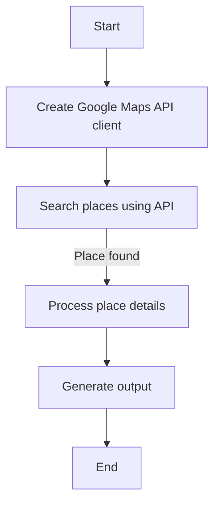
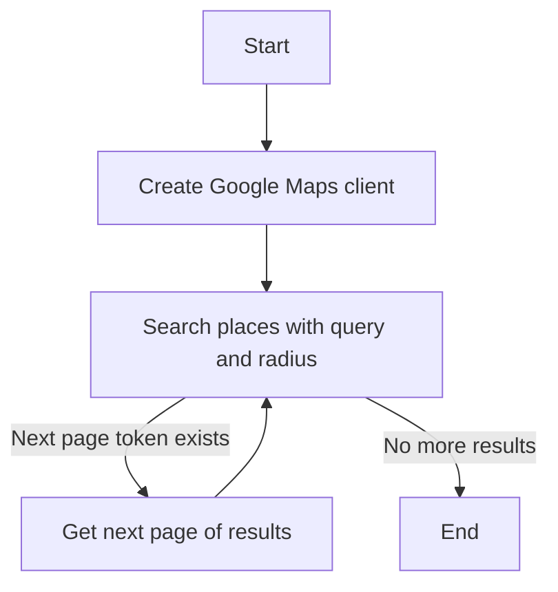
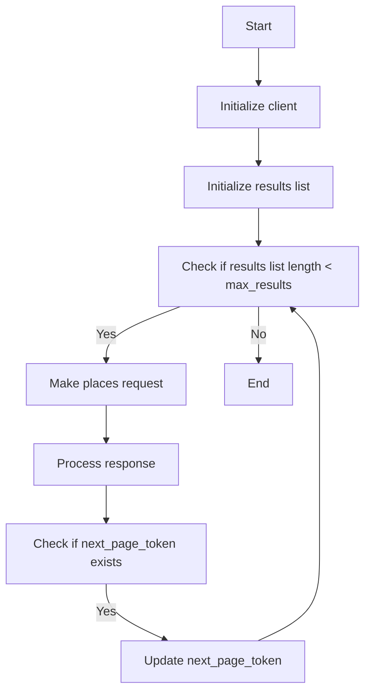
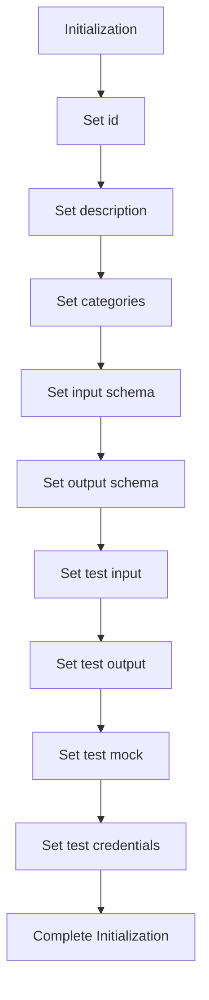
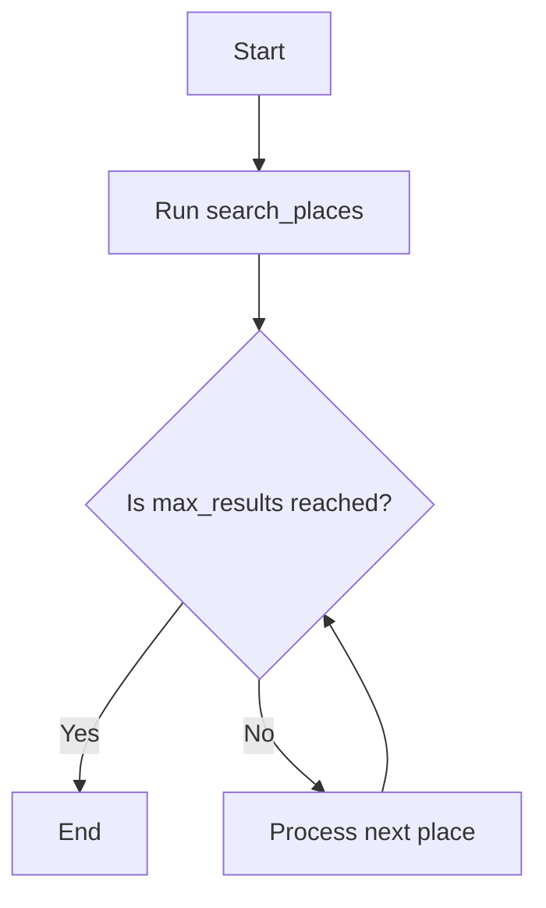
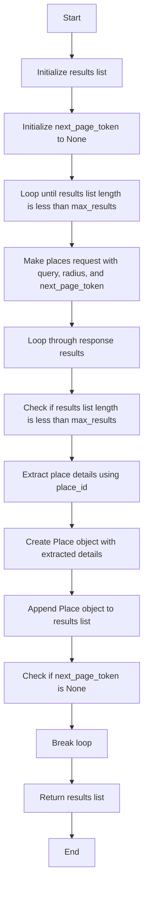

# `.\AutoGPT\autogpt_platform\backend\backend\blocks\google_maps.py` 详细设计文档

The code defines a GoogleMapsSearchBlock class that integrates with the Google Maps API to search for local businesses based on a query, radius, and maximum number of results.

## 整体流程



## 类结构

```
GoogleMapsSearchBlock (Concrete Block)
├── Input (BlockSchemaInput)
│   ├── credentials (CredentialsMetaInput)
│   ├── query (str)
│   ├── radius (int)
│   └── max_results (int)
└── Output (BlockSchemaOutput)
    └── place (Place)
```

## 全局变量及字段


### `TEST_CREDENTIALS`
    
A set of credentials for the Google Maps API.

类型：`APIKeyCredentials`
    


### `TEST_CREDENTIALS_INPUT`
    
A dictionary containing the input data for the test credentials.

类型：`dict`
    


### `Place.name`
    
The name of the place.

类型：`str`
    


### `Place.address`
    
The address of the place.

类型：`str`
    


### `Place.phone`
    
The phone number of the place.

类型：`str`
    


### `Place.rating`
    
The rating of the place.

类型：`float`
    


### `Place.reviews`
    
The number of reviews for the place.

类型：`int`
    


### `Place.website`
    
The website of the place.

类型：`str`
    


### `GoogleMapsSearchBlock.id`
    
The unique identifier for the block.

类型：`str`
    


### `GoogleMapsSearchBlock.description`
    
A description of the block's functionality.

类型：`str`
    


### `GoogleMapsSearchBlock.categories`
    
The categories to which the block belongs.

类型：`set`
    


### `GoogleMapsSearchBlock.input_schema`
    
The input schema for the block.

类型：`BlockSchemaInput`
    


### `GoogleMapsSearchBlock.output_schema`
    
The output schema for the block.

类型：`BlockSchemaOutput`
    


### `GoogleMapsSearchBlock.test_input`
    
The test input data for the block.

类型：`dict`
    


### `GoogleMapsSearchBlock.test_output`
    
The test output data for the block.

类型：`list`
    


### `GoogleMapsSearchBlock.test_mock`
    
The test mock data for the block.

类型：`dict`
    


### `GoogleMapsSearchBlock.test_credentials`
    
The test credentials for the block.

类型：`APIKeyCredentials`
    


### `Place.Place`
    
A Pydantic model representing a place.

类型：`BaseModel`
    


### `GoogleMapsSearchBlock.GoogleMapsSearchBlock`
    
A block that searches for local businesses using the Google Maps API.

类型：`Block`
    
    

## 全局函数及方法


### `GoogleMapsSearchBlock.search_places`

This method searches for local businesses using the Google Maps API based on the provided query, radius, and maximum number of results.

参数：

- `api_key`：`SecretStr`，The Google Maps API key used to authenticate requests.
- `query`：`str`，The search query for local businesses.
- `radius`：`int`，The search radius in meters (max 50000).
- `max_results`：`int`，The maximum number of results to return (max 60).

返回值：`list`，A list of `Place` objects representing the search results.

#### 流程图



#### 带注释源码

```python
def search_places(self, api_key: SecretStr, query, radius, max_results):
    client = googlemaps.Client(key=api_key.get_secret_value())
    return self._search_places(client, query, radius, max_results)

def _search_places(self, client, query, radius, max_results):
    results = []
    next_page_token = None
    while len(results) < max_results:
        response = client.places(
            query=query,
            radius=radius,
            page_token=next_page_token,
        )
        for place in response["results"]:
            if len(results) >= max_results:
                break
            place_details = client.place(place["place_id"])["result"]
            results.append(
                Place(
                    name=place_details.get("name", ""),
                    address=place_details.get("formatted_address", ""),
                    phone=place_details.get("formatted_phone_number", ""),
                    rating=place_details.get("rating", 0),
                    reviews=place_details.get("user_ratings_total", 0),
                    website=place_details.get("website", ""),
                )
            )
        next_page_token = response.get("next_page_token")
        if not next_page_token:
            break
    return results
```


### `_search_places`

This method searches for local businesses using the Google Maps API based on the provided query, radius, and maximum number of results.

参数：

- `client`：`googlemaps.Client`，The Google Maps API client used to make requests.
- `query`：`str`，The search query for local businesses.
- `radius`：`int`，The search radius in meters (max 50000).
- `max_results`：`int`，The maximum number of results to return (max 60).

返回值：`list[Place]`，A list of `Place` objects representing the search results.

#### 流程图



#### 带注释源码

```python
def _search_places(self, client, query, radius, max_results):
    results = []
    next_page_token = None
    while len(results) < max_results:
        response = client.places(
            query=query,
            radius=radius,
            page_token=next_page_token,
        )
        for place in response["results"]:
            if len(results) >= max_results:
                break
            place_details = client.place(place["place_id"])["result"]
            results.append(
                Place(
                    name=place_details.get("name", ""),
                    address=place_details.get("formatted_address", ""),
                    phone=place_details.get("formatted_phone_number", ""),
                    rating=place_details.get("rating", 0),
                    reviews=place_details.get("user_ratings_total", 0),
                    website=place_details.get("website", ""),
                )
            )
        next_page_token = response.get("next_page_token")
        if not next_page_token:
            break
    return results
``` 


### GoogleMapsSearchBlock.__init__

This method initializes the GoogleMapsSearchBlock class, setting up its configuration and schema for the Google Maps API integration.

参数：

- `id`：`str`，Unique identifier for the block.
- `description`：`str`，Description of the block's functionality.
- `categories`：`set`，Set of categories the block belongs to.
- `input_schema`：`Input`，Schema for the block's input.
- `output_schema`：`Output`，Schema for the block's output.
- `test_input`：`dict`，Sample input data for testing.
- `test_output`：`list`，Sample output data for testing.
- `test_mock`：`dict`，Mock data for testing.
- `test_credentials`：`APIKeyCredentials`，Test credentials for the block.

返回值：`None`，No return value, as it's an initializer.

#### 流程图



#### 带注释源码

```python
def __init__(self):
    super().__init__(
        id="f47ac10b-58cc-4372-a567-0e02b2c3d479",
        description="This block searches for local businesses using Google Maps API.",
        categories={BlockCategory.SEARCH},
        input_schema=GoogleMapsSearchBlock.Input,
        output_schema=GoogleMapsSearchBlock.Output,
        test_input={
            "credentials": TEST_CREDENTIALS_INPUT,
            "query": "restaurants in new york",
            "radius": 5000,
            "max_results": 5,
        },
        test_output=[
            (
                "place",
                {
                    "name": "Test Restaurant",
                    "address": "123 Test St, New York, NY 10001",
                    "phone": "+1 (555) 123-4567",
                    "rating": 4.5,
                    "reviews": 100,
                    "website": "https://testrestaurant.com",
                },
            ),
        ],
        test_mock={
            "search_places": lambda *args, **kwargs: [
                {
                    "name": "Test Restaurant",
                    "address": "123 Test St, New York, NY 10001",
                    "phone": "+1 (555) 123-4567",
                    "rating": 4.5,
                    "reviews": 100,
                    "website": "https://testrestaurant.com",
                }
            ]
        },
        test_credentials=TEST_CREDENTIALS,
    )
```


### GoogleMapsSearchBlock.run

This method runs the Google Maps search block, which uses the Google Maps API to search for local businesses based on a query, radius, and maximum number of results.

参数：

- `input_data`：`Input`，The input data for the block, including the query, radius, and maximum number of results.
- `credentials`：`APIKeyCredentials`，The credentials object containing the Google Maps API key.

返回值：`BlockOutput`，The output of the block, which includes the found places.

#### 流程图



#### 带注释源码

```python
async def run(self, input_data: Input, *, credentials: APIKeyCredentials, **kwargs) -> BlockOutput:
    places = self.search_places(
        credentials.api_key,
        input_data.query,
        input_data.radius,
        input_data.max_results,
    )
    for place in places:
        yield "place", place
```


### GoogleMapsSearchBlock.search_places

This method searches for local businesses using the Google Maps API based on a given query, radius, and maximum number of results.

参数：

- `api_key`：`SecretStr`，Google Maps API key
- `query`：`str`，Search query for local businesses
- `radius`：`int`，Search radius in meters (max 50000)
- `max_results`：`int`，Maximum number of results to return (max 60)

返回值：`list`，List of `Place` objects representing the search results

#### 流程图


#### 带注释源码

```python
def _search_places(self, client, query, radius, max_results):
    results = []
    next_page_token = None
    while len(results) < max_results:
        response = client.places(
            query=query,
            radius=radius,
            page_token=next_page_token,
        )
        for place in response["results"]:
            if len(results) >= max_results:
                break
            place_details = client.place(place["place_id"])["result"]
            results.append(
                Place(
                    name=place_details.get("name", ""),
                    address=place_details.get("formatted_address", ""),
                    phone=place_details.get("formatted_phone_number", ""),
                    rating=place_details.get("rating", 0),
                    reviews=place_details.get("user_ratings_total", 0),
                    website=place_details.get("website", ""),
                )
            )
        next_page_token = response.get("next_page_token")
        if not next_page_token:
            break
    return results
```


### `_search_places`

This method searches for places using the Google Maps API based on the provided query, radius, and maximum number of results.

参数：

- `client`：`googlemaps.Client`，The Google Maps API client used to make requests.
- `query`：`str`，The search query for local businesses.
- `radius`：`int`，The search radius in meters (max 50000).
- `max_results`：`int`，The maximum number of results to return (max 60).

返回值：`list`，A list of `Place` objects representing the search results.

#### 流程图



#### 带注释源码

```python
def _search_places(self, client, query, radius, max_results):
    results = []  # Initialize results list
    next_page_token = None  # Initialize next_page_token to None
    while len(results) < max_results:  # Loop until results list length is less than max_results
        response = client.places(query=query, radius=radius, page_token=next_page_token)  # Make places request with query, radius, and next_page_token
        for place in response["results"]:  # Loop through response results
            if len(results) >= max_results:  # Check if results list length is less than max_results
                break  # Break loop
            place_details = client.place(place["place_id"])["result"]  # Extract place details using place_id
            results.append(  # Create Place object with extracted details
                Place(
                    name=place_details.get("name", ""),
                    address=place_details.get("formatted_address", ""),
                    phone=place_details.get("formatted_phone_number", ""),
                    rating=place_details.get("rating", 0),
                    reviews=place_details.get("user_ratings_total", 0),
                    website=place_details.get("website", ""),
                )
            )
        next_page_token = response.get("next_page_token")  # Check if next_page_token is None
        if not next_page_token:  # Break loop
            break  # Break loop
    return results  # Return results list
```


## 关键组件


### 张量索引与惰性加载

张量索引与惰性加载是处理大型数据集时常用的技术，它允许在需要时才加载和处理数据的一部分，从而减少内存消耗和提高效率。

### 反量化支持

反量化支持是指系统对量化操作的反向操作的支持，即能够从量化后的数据中恢复原始数据，这对于某些应用场景中的数据恢复和准确性保证至关重要。

### 量化策略

量化策略是指将浮点数数据转换为低精度表示（如整数）的策略，这可以减少模型的大小和计算资源消耗，但可能影响模型的精度和性能。


## 问题及建议


### 已知问题

-   **API Key 安全性**：代码中硬编码了Google Maps API密钥，这可能导致密钥泄露的风险。建议使用环境变量或配置文件来存储敏感信息。
-   **异常处理**：代码中没有明确的异常处理机制，如果API调用失败或返回错误，可能会导致程序崩溃。建议添加异常处理来捕获和处理潜在的错误。
-   **代码重复**：`_search_places`方法中存在重复的代码，用于检查是否已达到最大结果数。建议提取这部分逻辑到一个单独的函数中，以减少代码重复。
-   **测试覆盖率**：代码中只提供了一个测试用例，建议增加更多的测试用例来覆盖不同的输入和边缘情况，以确保代码的健壮性。

### 优化建议

-   **使用环境变量**：将Google Maps API密钥存储在环境变量中，而不是硬编码在代码中。
-   **添加异常处理**：在API调用和数据处理过程中添加异常处理，确保程序在遇到错误时能够优雅地处理。
-   **提取重复代码**：将检查最大结果数的逻辑提取到一个单独的函数中，以减少代码重复并提高可读性。
-   **增加测试用例**：编写更多的测试用例，包括不同的查询、半径和最大结果数，以确保代码在各种情况下都能正常工作。
-   **使用异步编程**：如果`search_places`方法需要执行长时间运行的API调用，考虑使用异步编程来提高效率。
-   **日志记录**：添加日志记录功能，以便在出现问题时可以追踪和调试。
-   **代码审查**：定期进行代码审查，以确保代码质量并遵循最佳实践。


## 其它


### 设计目标与约束

- 设计目标：
  - 实现一个模块，能够使用Google Maps API搜索本地商业信息。
  - 提供一个异步接口，以便在后台任务中执行搜索操作。
  - 确保搜索结果能够以统一的数据格式返回。

- 约束：
  - 必须使用Google Maps API进行搜索。
  - 搜索结果的最大数量限制为60。
  - 搜索半径的最大值为50000米。
  - API密钥和查询参数必须通过安全的渠道传递。

### 错误处理与异常设计

- 错误处理：
  - 在搜索过程中，如果发生API请求错误，将捕获异常并返回错误信息。
  - 如果搜索结果为空，将返回一个空的结果列表。
  - 如果请求的参数超出范围，将返回一个错误响应。

- 异常设计：
  - 使用try-except块捕获可能的异常，如网络错误、API限制错误等。
  - 定义自定义异常类，以便更清晰地表示特定错误情况。

### 数据流与状态机

- 数据流：
  - 输入数据通过APIKeyCredentials和查询参数传递给search_places方法。
  - search_places方法调用Google Maps API进行搜索，并将结果返回给调用者。

- 状态机：
  - 当前代码中没有显式的状态机，但可以通过引入状态变量来管理搜索过程中的不同阶段，如初始化、搜索、处理结果等。

### 外部依赖与接口契约

- 外部依赖：
  - Google Maps API：用于执行实际的搜索操作。
  - pydantic：用于数据验证和模型定义。
  - googlemaps：用于与Google Maps API进行交互。

- 接口契约：
  - APIKeyCredentials：定义了API密钥的格式和验证。
  - Place：定义了搜索结果的预期格式。
  - GoogleMapsSearchBlock：定义了搜索块的输入和输出格式。
  - Block：定义了块的基本接口和功能。


    