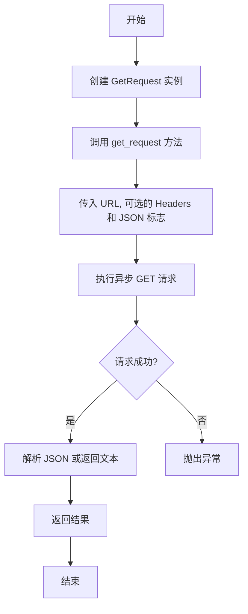

# `.\AutoGPT\autogpt_platform\backend\backend\blocks\helpers\http.py` 详细设计文档

The code defines a class named GetRequest that provides an asynchronous method to make HTTP GET requests to a specified URL and return the response in either JSON or plain text format.

## 整体流程



## 类结构

```
GetRequest (类)
```

## 全局变量及字段


### `GetRequest.url`
    
The URL to send the GET request to.

类型：`str`
    


### `GetRequest.headers`
    
The headers to be sent with the request. Defaults to an empty dictionary if not provided.

类型：`Optional[dict]`
    


### `GetRequest.json`
    
Whether to parse the response as JSON. Defaults to False if not provided.

类型：`bool`
    
    

## 全局函数及方法


### GetRequest.get_request

该函数用于发送HTTP GET请求到指定的URL，并根据参数`json`决定返回JSON解析后的数据还是原始响应文本。

参数：

- `url`：`str`，请求的URL地址。
- `headers`：`Optional[dict]`，可选的HTTP头部信息，默认为空字典。
- `json`：`bool`，是否将响应内容解析为JSON格式，默认为`False`。

返回值：`Any`，返回解析后的JSON数据或原始响应文本。

#### 流程图

```mermaid
graph TD
    A[Start] --> B[Check if headers is None]
    B -- Yes --> C[Set headers to {}]
    B -- No --> D[Send GET request to Requests.get(url, headers)]
    D --> E[Check if json is True]
    E -- Yes --> F[Parse response as JSON]
    E -- No --> G[Return response text]
    F --> H[Return JSON data]
    G --> H
    H --> I[End]
```

#### 带注释源码

```python
from typing import Any, Optional

from backend.util.request import Requests

class GetRequest:
    @classmethod
    async def get_request(
        cls, url: str, headers: Optional[dict] = None, json: bool = False
    ) -> Any:
        # 如果headers为None，则初始化为空字典
        if headers is None:
            headers = {}
        # 发送GET请求
        response = await Requests().get(url, headers=headers)
        # 如果json为True，则解析响应为JSON格式
        if json:
            return response.json()
        # 否则返回原始响应文本
        else:
            return response.text()
``` 


## 关键组件


### 张量索引与惰性加载

支持对张量的索引操作，并在需要时才加载张量数据，以优化内存使用。

### 反量化支持

提供对反量化操作的支持，允许在量化过程中进行逆量化处理。

### 量化策略

实现多种量化策略，以适应不同的量化需求。


## 问题及建议


### 已知问题

-   {问题1}：代码中使用了`Requests`类，但没有提供该类的详细设计和实现，这可能导致代码的可维护性和可测试性降低。
-   {问题2}：`get_request`方法返回的类型是`Any`，这违反了类型安全的原则，应该指定具体的返回类型。
-   {问题3}：`get_request`方法没有处理可能的异常，例如网络请求失败或JSON解析错误，这可能导致调用者无法正确处理这些情况。

### 优化建议

-   {建议1}：提供`Requests`类的详细设计文档，包括其字段和方法，以及异常处理机制。
-   {建议2}：将`get_request`方法的返回类型从`Any`更改为具体的类型，例如`Optional[dict]`或`Optional[str]`，以增强类型安全性。
-   {建议3}：在`get_request`方法中添加异常处理逻辑，例如使用`try-except`块来捕获并处理`requests`库抛出的异常，以及可能的JSON解析错误。
-   {建议4}：考虑使用异步上下文管理器（`async with`）来确保`Requests`实例的正确关闭，避免资源泄漏。
-   {建议5}：如果`get_request`方法被频繁调用，可以考虑缓存结果以减少不必要的网络请求，提高性能。


## 其它


### 设计目标与约束

- 设计目标：实现一个异步的HTTP GET请求功能，支持JSON和文本响应格式。
- 约束条件：使用现有的`Requests`工具类进行HTTP请求，确保代码的简洁性和可维护性。

### 错误处理与异常设计

- 错误处理：在HTTP请求过程中，捕获可能的异常，如网络错误、请求超时等，并抛出相应的异常。
- 异常设计：定义自定义异常类，如`RequestError`，用于封装和处理请求过程中可能出现的错误。

### 数据流与状态机

- 数据流：用户通过调用`get_request`方法发送HTTP GET请求，方法返回响应数据。
- 状态机：该类没有实现状态机，因为HTTP请求是一个简单的请求-响应过程，不需要复杂的状态转换。

### 外部依赖与接口契约

- 外部依赖：依赖于`Requests`工具类进行HTTP请求。
- 接口契约：`get_request`方法定义了接口契约，包括参数类型、返回值类型和异常处理。


    