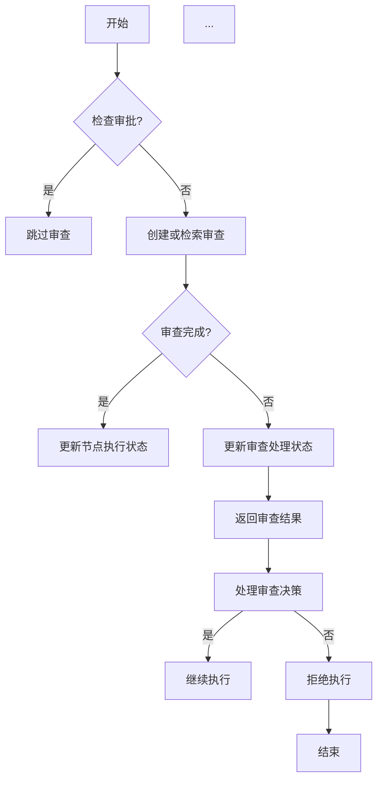
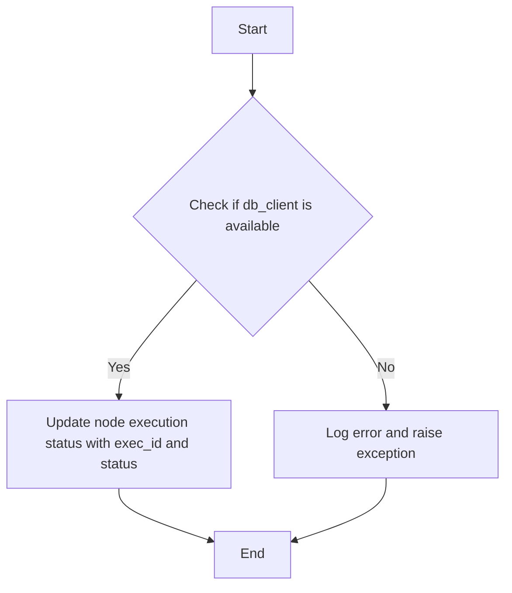
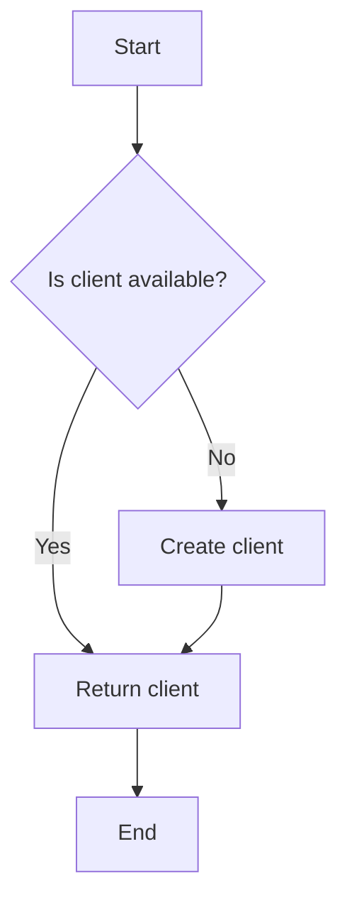
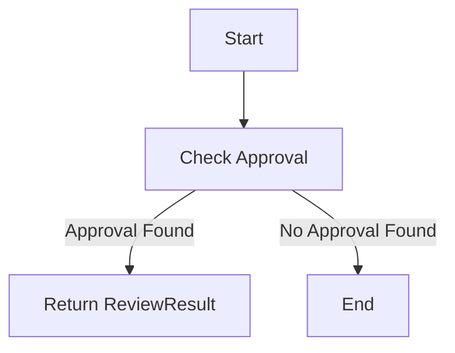
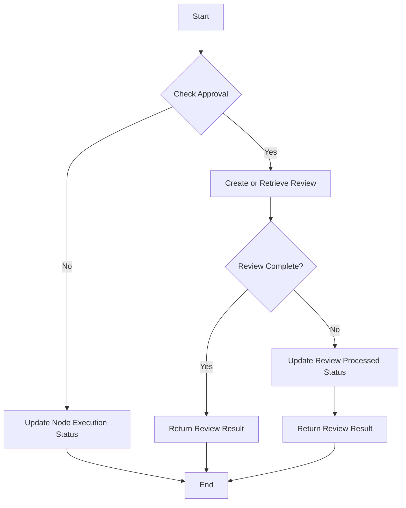
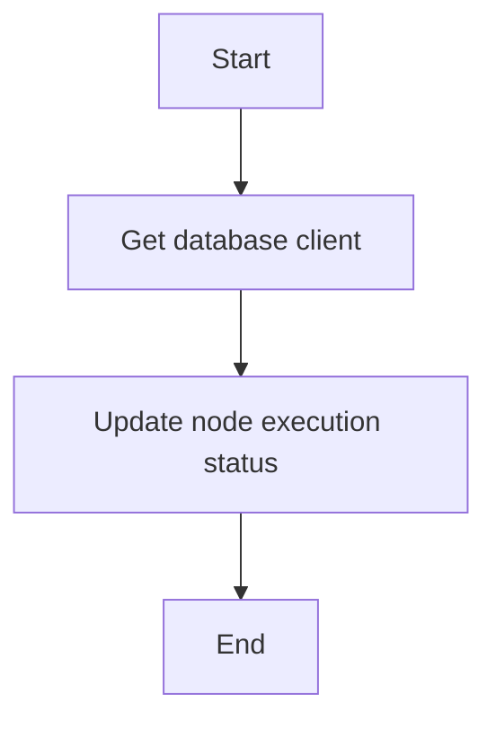
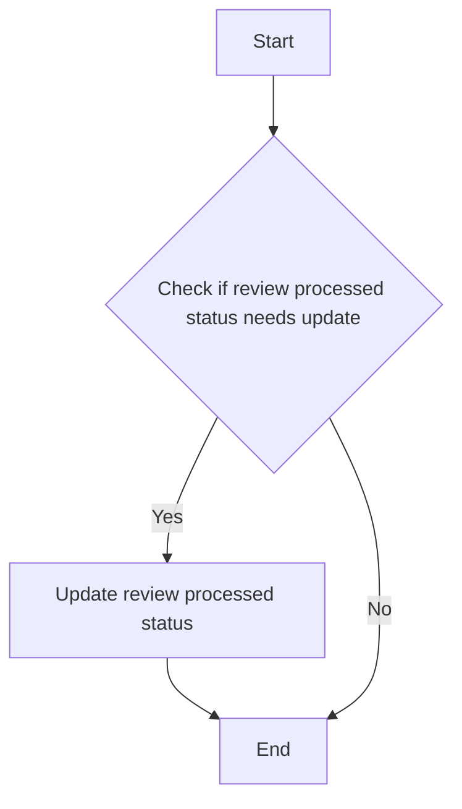
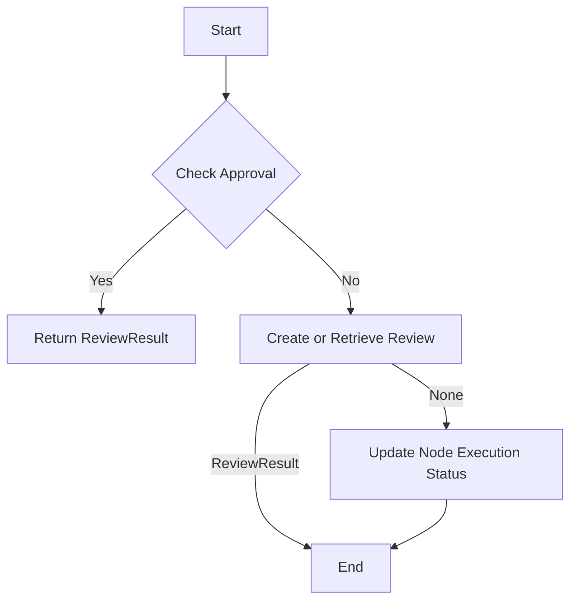
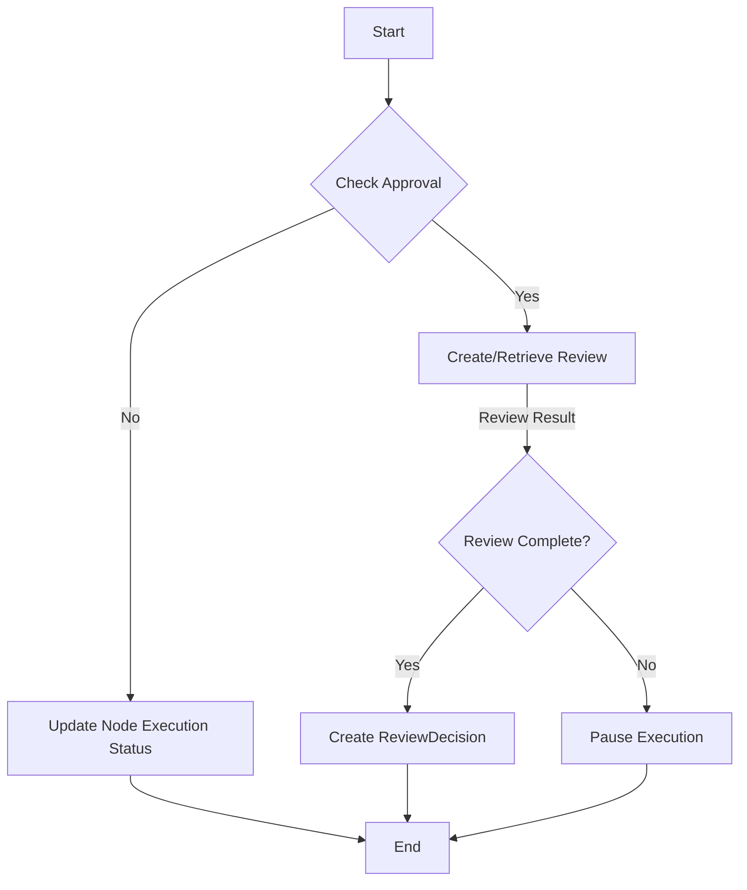

# `.\AutoGPT\autogpt_platform\backend\backend\blocks\helpers\review.py` 详细设计文档

The code provides a set of helper functions for managing Human-In-The-Loop (HITL) review operations in a system that requires human review for certain node executions.

## 整体流程



## 类结构

```
HITLReviewHelper (类)
├── ReviewDecision (类)
└── ... 
```

## 全局变量及字段


### `logger`
    
Logger instance for the module.

类型：`logging.Logger`
    


### `ReviewDecision.should_proceed`
    
Indicates whether the review decision is to proceed with the execution.

类型：`bool`
    


### `ReviewDecision.message`
    
Message associated with the review decision.

类型：`str`
    


### `ReviewDecision.review_result`
    
The result of the review process.

类型：`ReviewResult`
    
    

## 全局函数及方法


### async_update_node_execution_status

Update the execution status of a node.

参数：

- `db_client`：`get_database_manager_async_client()`，Database client used to interact with the database.
- `exec_id`：`str`，ID of the node execution to update.
- `status`：`ExecutionStatus`，The new execution status for the node.

返回值：`None`，No value is returned as the method is asynchronous and updates the status directly in the database.

#### 流程图



#### 带注释源码

```
async def async_update_node_execution_status(db_client, **kwargs):
    """
    Update the execution status of a node.

    Args:
        db_client: Database client used to interact with the database.
        **kwargs: Additional keyword arguments to pass to the database update method.
    """
    # Update the node execution status in the database
    await db_client.update_node_execution_status(**kwargs)
```


### `get_database_manager_async_client()`

获取数据库管理器的异步客户端。

参数：

- 无

返回值：`Any`，返回数据库管理器的异步客户端实例。

#### 流程图



#### 带注释源码

```python
from backend.util.clients import get_database_manager_async_client

def get_database_manager_async_client():
    # This function is a wrapper around the actual client retrieval logic
    # which is not shown here. It is assumed to return an instance of the
    # database manager client that can be used for asynchronous database operations.
    return get_database_manager_async_client()
```


### ReviewDecision.__init__

This method initializes a `ReviewDecision` object, which represents the result of a review decision.

参数：

- `should_proceed`：`bool`，Indicates whether the execution should proceed after the review.
- `message`：`str`，Contains a message associated with the review decision.
- `review_result`：`ReviewResult`，Contains the result of the review process.

返回值：`None`，This method does not return a value; it only initializes the object.

#### 流程图

```mermaid
classDiagram
    ReviewDecision <|-- ReviewResult
    ReviewDecision {
        bool should_proceed
        str message
        ReviewResult review_result
    }
```

#### 带注释源码

```python
class ReviewDecision(BaseModel):
    """Result of a review decision."""

    should_proceed: bool
    message: str
    review_result: ReviewResult
```


### HITLReviewHelper.check_approval

Check if there's an existing approval for this node execution.

参数：

- `node_exec_id`：`str`，Node execution ID to check for existing approval.
- `graph_exec_id`：`str`，Graph execution ID associated with the node execution.
- `node_id`：`str`，ID of the node in the graph definition.
- `user_id`：`str`，ID of the user who requested the review.
- `input_data`：`Any`，Input data associated with the node execution.

返回值：`Optional[ReviewResult]`，ReviewResult if an existing approval is found, None otherwise.

#### 流程图



#### 带注释源码

```python
@staticmethod
async def check_approval(**kwargs) -> Optional[ReviewResult]:
    """Check if there's an existing approval for this node execution."""
    return await get_database_manager_async_client().check_approval(**kwargs)
```


### HITLReviewHelper.get_or_create_human_review

Retrieve or create a human review from the database.

参数：

- `user_id`：`str`，The ID of the user requesting the review.
- `node_exec_id`：`str`，The ID of the node execution.
- `graph_exec_id`：`str`，The ID of the graph execution.
- `graph_id`：`str`，The ID of the graph.
- `graph_version`：`int`，Version of the graph.
- `input_data`：`Any`，The input data to be reviewed.
- `message`：`str`，The message associated with the review.
- `editable`：`bool`，Whether the reviewer can edit the data.

返回值：`Optional[ReviewResult]`，The review result if the review is complete, None if waiting for human input.

#### 流程图



#### 带注释源码

```python
    @staticmethod
    async def get_or_create_human_review(
        user_id: str,
        node_exec_id: str,
        graph_exec_id: str,
        graph_id: str,
        graph_version: int,
        input_data: Any,
        message: str,
        editable: bool = False,
    ) -> Optional[ReviewResult]:
        """
        Create or retrieve a human review from the database.
        """
        result = await HITLReviewHelper.get_or_create_human_review(
            user_id=user_id,
            node_exec_id=node_exec_id,
            graph_exec_id=graph_exec_id,
            graph_id=graph_id,
            graph_version=graph_version,
            input_data=input_data,
            message=message,
            editable=editable,
        )
        if result is None:
            await HITLReviewHelper.update_node_execution_status(
                exec_id=node_exec_id,
                status=ExecutionStatus.REVIEW,
            )
            return None  # Signal that execution should pause
        if not result.processed:
            await HITLReviewHelper.update_review_processed_status(
                node_exec_id=node_exec_id, processed=True
            )
        return result
```


### HITLReviewHelper.update_node_execution_status

Update the execution status of a node.

参数：

- `exec_id`：`str`，The ID of the node execution to update the status for.
- `status`：`ExecutionStatus`，The new status to set for the node execution.

返回值：`None`，This function does not return a value.

#### 流程图



#### 带注释源码

```python
    @staticmethod
    async def update_node_execution_status(**kwargs) -> None:
        """Update the execution status of a node."""
        await async_update_node_execution_status(
            db_client=get_database_manager_async_client(), **kwargs
        )
```


### HITLReviewHelper.update_review_processed_status

Update the processed status of a review.

参数：

- `node_exec_id`：`str`，The ID of the node execution for which the review processed status is to be updated.
- `processed`：`bool`，Indicates whether the review has been processed.

返回值：`None`，Indicates that the update was successful.

#### 流程图



#### 带注释源码

```python
    @staticmethod
    async def update_review_processed_status(
        node_exec_id: str, processed: bool
    ) -> None:
        """Update the processed status of a review."""
        return await get_database_manager_async_client().update_review_processed_status(
            node_exec_id, processed
        )
```


### HITLReviewHelper._handle_review_request

Handle a review request for a block that requires human review.

参数：

- `input_data`：`Any`，The input data to be reviewed
- `user_id`：`str`，ID of the user requesting the review
- `node_id`：`str`，ID of the node in the graph definition
- `node_exec_id`：`str`，ID of the node execution
- `graph_exec_id`：`str`，ID of the graph execution
- `graph_id`：`str`，ID of the graph
- `graph_version`：`int`，Version of the graph
- `block_name`：`str`，Name of the block requesting review (default: "Block")
- `editable`：`bool`，Whether the reviewer can edit the data (default: False)

返回值：`Optional[ReviewResult]`，ReviewResult if review is complete, None if waiting for human input

#### 流程图



#### 带注释源码

```python
@staticmethod
async def _handle_review_request(
    input_data: Any,
    user_id: str,
    node_id: str,
    node_exec_id: str,
    graph_exec_id: str,
    graph_id: str,
    graph_version: int,
    block_name: str = "Block",
    editable: bool = False,
) -> Optional[ReviewResult]:
    """
    Handle a review request for a block that requires human review.
    ...
    """
    # Check if this node has already been approved (normal or auto-approval)
    if approval_result := await HITLReviewHelper.check_approval(
        node_exec_id=node_exec_id,
        graph_exec_id=graph_exec_id,
        node_id=node_id,
        user_id=user_id,
        input_data=input_data,
    ):
        logger.info(
            f"Block {block_name} skipping review for node {node_exec_id} - "
            f"found existing approval"
        )
        # Return a new ReviewResult with the current node_exec_id but approved status
        # ...
        return ReviewResult(
            data=approved_data,
            status=ReviewStatus.APPROVED,
            message=approval_result.message,
            processed=True,
            node_exec_id=node_exec_id,
        )

    result = await HITLReviewHelper.get_or_create_human_review(
        user_id=user_id,
        node_exec_id=node_exec_id,
        graph_exec_id=graph_exec_id,
        graph_id=graph_id,
        graph_version=graph_version,
        input_data=input_data,
        message=block_name,  # Use block_name directly as the message
        editable=editable,
    )

    if result is None:
        logger.info(
            f"Block {block_name} pausing execution for node {node_exec_id} - awaiting human review"
        )
        await HITLReviewHelper.update_node_execution_status(
            exec_id=node_exec_id,
            status=ExecutionStatus.REVIEW,
        )
        return None  # Signal that execution should pause

    # Mark review as processed if not already done
    if not result.processed:
        await HITLReviewHelper.update_review_processed_status(
            node_exec_id=node_exec_id, processed=True
        )

    return result
```


### HITLReviewHelper.handle_review_decision

Handle a review request and return the decision in a single call.

参数：

- `input_data`：`Any`，The input data to be reviewed
- `user_id`：`str`，ID of the user requesting the review
- `node_id`：`str`，ID of the node in the graph definition
- `node_exec_id`：`str`，ID of the node execution
- `graph_exec_id`：`str`，ID of the graph execution
- `graph_id`：`str`，ID of the graph
- `graph_version`：`int`，Version of the graph
- `block_name`：`str`，Name of the block requesting review (default: "Block")
- `editable`：`bool`，Whether the reviewer can edit the data (default: False)

返回值：`Optional[ReviewDecision]`，ReviewDecision if review is complete (approved/rejected), None if execution should pause (awaiting review)

#### 流程图



#### 带注释源码

```python
    @staticmethod
    async def handle_review_decision(
        input_data: Any,
        user_id: str,
        node_id: str,
        node_exec_id: str,
        graph_exec_id: str,
        graph_id: str,
        graph_version: int,
        block_name: str = "Block",
        editable: bool = False,
    ) -> Optional[ReviewDecision]:
        """
        Handle a review request and return the decision in a single call.
        """
        review_result = await HITLReviewHelper._handle_review_request(
            input_data=input_data,
            user_id=user_id,
            node_id=node_id,
            node_exec_id=node_exec_id,
            graph_exec_id=graph_exec_id,
            graph_id=graph_id,
            graph_version=graph_version,
            block_name=block_name,
            editable=editable,
        )

        if review_result is None:
            # Still awaiting review - return None to pause execution
            return None

        # Review is complete, determine outcome
        should_proceed = review_result.status == ReviewStatus.APPROVED
        message = review_result.message or (
            "Execution approved by reviewer"
            if should_proceed
            else "Execution rejected by reviewer"
        )

        return ReviewDecision(
            should_proceed=should_proceed, message=message, review_result=review_result
        )
```


## 关键组件


### 张量索引与惰性加载

用于高效地处理和索引大型数据集，通过延迟加载减少内存消耗。

### 反量化支持

提供对量化策略的反量化支持，以优化模型性能。

### 量化策略

实现量化策略，以减少模型大小和提高推理速度。


## 问题及建议


### 已知问题

-   **全局变量依赖**: 代码中使用了全局变量 `logger`，这可能导致代码的可移植性和可测试性降低。全局变量应该尽量避免使用，除非有充分的理由。
-   **异常处理**: `_handle_review_request` 方法中使用了 `Exception` 来捕获所有异常，这可能导致一些潜在的错误被忽略。建议使用更具体的异常类型来处理不同的错误情况。
-   **代码重复**: `check_approval` 和 `get_or_create_human_review` 方法在 `get_database_manager_async_client()` 上有重复调用，这可能导致不必要的性能开销。可以考虑将这些调用封装在一个单独的方法中。
-   **参数默认值**: `_handle_review_request` 方法中的一些参数（如 `block_name` 和 `editable`）有默认值，这可能导致在使用这些参数时产生意外的行为。建议在文档中明确说明这些参数的默认值和预期行为。

### 优化建议

-   **移除全局变量**: 将 `logger` 移除，并在需要的地方使用类变量或方法参数来传递日志记录器。
-   **改进异常处理**: 使用更具体的异常类型来处理不同的错误情况，并确保所有异常都被适当地记录和处理。
-   **减少代码重复**: 将 `get_database_manager_async_client()` 的调用封装在一个单独的方法中，以减少代码重复并提高代码的可维护性。
-   **文档化参数**: 在文档中明确说明所有参数的默认值和预期行为，以减少使用参数时的意外行为。
-   **代码结构**: 考虑将 `_handle_review_request` 和 `handle_review_decision` 方法中的逻辑分离到不同的方法中，以提高代码的可读性和可维护性。
-   **异步操作**: 确保所有异步操作都正确地处理了异常，并在必要时提供了适当的超时机制。
-   **单元测试**: 为代码编写单元测试，以确保代码在各种情况下都能正常工作，并帮助发现潜在的错误。


## 其它


### 设计目标与约束

- 确保代码能够高效地处理人类在循环（HITL）审查功能。
- 代码应易于维护和扩展，以适应未来可能的需求变化。
- 代码应遵循最佳实践，确保代码质量和可读性。

### 错误处理与异常设计

- 代码应能够捕获和处理可能发生的异常，例如数据库连接失败或数据验证错误。
- 异常应被记录，并返回给调用者，以便进行适当的错误处理。
- 应定义清晰的错误代码和消息，以便于调试和用户理解。

### 数据流与状态机

- 数据流应清晰定义，从输入数据到审查结果的处理流程应易于理解。
- 状态机应描述节点执行状态的变化，包括待审查、已批准、已拒绝等状态。
- 应确保状态转换逻辑正确，避免状态不一致或死锁。

### 外部依赖与接口契约

- 代码应明确列出所有外部依赖，包括数据库、日志记录和异步执行框架。
- 应定义清晰的接口契约，包括类方法和全局函数的参数和返回值。
- 依赖项的版本管理应遵循最佳实践，以避免兼容性问题。


    