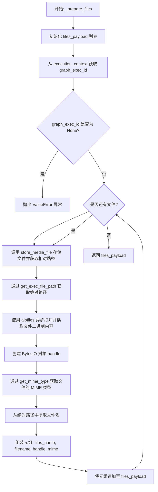
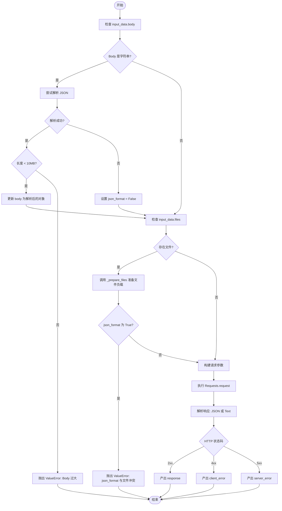
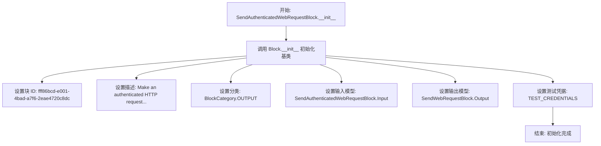

# `AutoGPT\autogpt_platform\backend\backend\blocks\http.py` 详细设计文档

该代码定义了两个核心 Block 类：SendWebRequestBlock 和 SendAuthenticatedWebRequestBlock，用于在自动化工作流中执行 HTTP 请求，支持多种请求方法（GET/POST等）、JSON/表单/Multipart数据格式、文件上传处理，以及基于状态码（2xx/4xx/5xx）的错误路由和凭据管理。

## 整体流程

```mermaid
graph TD
    A[开始: run 方法] --> B[处理 Body (解析/格式化)]
    B --> C{是否存在 Files?}
    C -- 否 --> E[验证 Body 与 JSON 格式]
    C -- 是 --> D[调用 _prepare_files: 存储并读取文件]
    D --> E
    E --> F{是否存在格式冲突?}
    F -- 是 (JSON+Files) --> G[抛出 ValueError]
    F -- 否 --> H[执行 Requests.request]
    H --> I{HTTP 状态码范围}
    I -- 200-299 --> J[解析 JSON 或 文本]
    J --> K[输出 'response']
    I -- 400-499 --> L[输出 'client_error']
    I -- 500-599 --> M[输出 'server_error']
```

## 类结构

```
Block (基类)
├── SendWebRequestBlock
│   ├── Input (Schema)
│   ├── Output (Schema)
│   ├── __init__
│   ├── _prepare_files
│   └── run
└── SendAuthenticatedWebRequestBlock
    ├── Input (Schema)
    ├── __init__
    └── run
Enum
└── HttpMethod
```

## 全局变量及字段


### `logger`
    
Logger instance for this module.

类型：`logging.Logger`
    


### `HttpCredentials`
    
Type alias for HTTP host-scoped credentials.

类型：`CredentialsMetaInput[Literal[ProviderName.HTTP], Literal["host_scoped"]]`
    


### `TEST_CREDENTIALS`
    
Mock HTTP Host-Scoped Credentials for testing.

类型：`HostScopedCredentials`
    


### `TEST_CREDENTIALS_INPUT`
    
Dictionary representation of mock HTTP credentials.

类型：`dict`
    


### `HttpMethod.GET`
    
Represents the HTTP GET method.

类型：`HttpMethod`
    


### `HttpMethod.POST`
    
Represents the HTTP POST method.

类型：`HttpMethod`
    


### `HttpMethod.PUT`
    
Represents the HTTP PUT method.

类型：`HttpMethod`
    


### `HttpMethod.DELETE`
    
Represents the HTTP DELETE method.

类型：`HttpMethod`
    


### `HttpMethod.PATCH`
    
Represents the HTTP PATCH method.

类型：`HttpMethod`
    


### `HttpMethod.OPTIONS`
    
Represents the HTTP OPTIONS method.

类型：`HttpMethod`
    


### `HttpMethod.HEAD`
    
Represents the HTTP HEAD method.

类型：`HttpMethod`
    


### `SendWebRequestBlock.Input.url`
    
The URL to send the request to.

类型：`str`
    


### `SendWebRequestBlock.Input.method`
    
The HTTP method to use for the request.

类型：`HttpMethod`
    


### `SendWebRequestBlock.Input.headers`
    
The headers to include in the request.

类型：`dict[str, str]`
    


### `SendWebRequestBlock.Input.json_format`
    
If true, send the body as JSON (unless files are also present).

类型：`bool`
    


### `SendWebRequestBlock.Input.body`
    
Form/JSON body payload. If files are supplied, this must be a mapping of form‑fields.

类型：`dict | None`
    


### `SendWebRequestBlock.Input.files_name`
    
The name of the file field in the form data.

类型：`str`
    


### `SendWebRequestBlock.Input.files`
    
Mapping of *form field name* → Image url / path / base64 url.

类型：`list[MediaFileType]`
    


### `SendWebRequestBlock.Output.response`
    
The response from the server

类型：`object`
    


### `SendWebRequestBlock.Output.client_error`
    
Errors on 4xx status codes

类型：`object`
    


### `SendWebRequestBlock.Output.server_error`
    
Errors on 5xx status codes

类型：`object`
    


### `SendWebRequestBlock.Output.error`
    
Errors for all other exceptions

类型：`str`
    


### `SendAuthenticatedWebRequestBlock.Input.credentials`
    
HTTP host-scoped credentials for automatic header injection

类型：`HttpCredentials`
    
    

## 全局函数及方法


### `SendWebRequestBlock.__init__`

该方法是 `SendWebRequestBlock` 类的构造函数，用于初始化 Web 请求块实例。它负责设置块的唯一标识符、功能描述、所属类别以及定义输入输出的数据模型结构，通过调用父类 `Block` 的初始化方法完成注册。

参数：

- `self`：`SendWebRequestBlock`，类的实例本身，在 Python 中作为构造函数的第一个隐式参数传递。

返回值：`None`，Python 构造函数不返回任何值。

#### 流程图

```mermaid
flowchart TD
    Start([开始初始化]) --> SuperCall[调用 super().__init__]
    SuperCall --> SetID[设置 Block ID]
    SuperCall --> SetDesc[设置 Description]
    SuperCall --> SetCat[设置 Categories]
    SuperCall --> SetInput[设置 Input Schema]
    SuperCall --> SetOutput[设置 Output Schema]
    SetID --> End([初始化完成])
    SetDesc --> End
    SetCat --> End
    SetInput --> End
    SetOutput --> End
```

#### 带注释源码

```python
def __init__(self):
    super().__init__(
        id="6595ae1f-b924-42cb-9a41-551a0611c4b4",  # 块的唯一标识符
        description="Make an HTTP request (JSON / form / multipart).",  # 块的功能描述
        categories={BlockCategory.OUTPUT},  # 将块归类为输出类型
        input_schema=SendWebRequestBlock.Input,  # 定义输入数据的 Schema，关联内部类 Input
        output_schema=SendWebRequestBlock.Output,  # 定义输出数据的 Schema，关联内部类 Output
    )
```


### `SendWebRequestBlock._prepare_files`

该静态异步方法负责处理HTTP请求中的文件上传准备工作。它接收不同形式的媒体文件输入（如URL、路径或Base64），将其持久化存储到本地临时目录，读取二进制内容，并检测MIME类型，最终将其格式化为符合多部分表单上传要求的特定元组结构列表。

参数：

- `execution_context`：`ExecutionContext`，执行上下文对象，用于获取当前图执行ID以确定文件存储路径。
- `files_name`：`str`，在多部分表单数据中使用的字段名称（例如 "file"）。
- `files`：`list[MediaFileType]`，待处理的文件列表，包含文件的URL、路径或Base64数据等信息。

返回值：`list[tuple[str, tuple[str, BytesIO, str]]]`，用于请求库的文件载荷列表，每个元素是一个元组，包含表单字段名和文件元信息（文件名、二进制流对象、MIME类型）。

#### 流程图



#### 带注释源码

```python
    @staticmethod
    async def _prepare_files(
        execution_context: ExecutionContext,
        files_name: str,
        files: list[MediaFileType],
    ) -> list[tuple[str, tuple[str, BytesIO, str]]]:
        """
        Prepare files for the request by storing them and reading their content.
        Returns a list of tuples in the format:
        (files_name, (filename, BytesIO, mime_type))
        """
        # 初始化用于存储最终文件载荷的列表
        files_payload: list[tuple[str, tuple[str, BytesIO, str]]] = []
        
        # 获取当前图执行ID，用于构建文件存储路径
        graph_exec_id = execution_context.graph_exec_id
        
        # 如果执行ID缺失，无法确定文件存储位置，抛出异常
        if graph_exec_id is None:
            raise ValueError("graph_exec_id is required for file operations")

        # 遍历所有待处理的媒体文件对象
        for media in files:
            # Normalise to a list so we can repeat the same key
            # 将媒体文件存储到本地（支持URL/Path/Base64等格式转换），并返回相对路径
            rel_path = await store_media_file(
                file=media,
                execution_context=execution_context,
                return_format="for_local_processing",
            )
            
            # 根据相对路径和执行ID计算本地绝对路径
            abs_path = get_exec_file_path(graph_exec_id, rel_path)
            
            # 异步读取文件二进制内容
            async with aiofiles.open(abs_path, "rb") as f:
                content = await f.read()
                
                # 将二进制内容封装到内存IO对象中，便于后续上传使用
                handle = BytesIO(content)
                
                # 根据文件扩展名或内容检测MIME类型
                mime = get_mime_type(abs_path)
                
                # 构建符合requests/aiohttp库要求的文件上传元组结构
                # 元组格式: (form_field_name, (filename, file_object, content_type))
                files_payload.append((files_name, (Path(abs_path).name, handle, mime)))

        return files_payload
```


### `SendWebRequestBlock.run`

该方法负责执行HTTP请求，支持JSON、表单数据以及文件上传（multipart/form-data）。它负责预处理请求体、处理文件上传、执行实际的HTTP请求，并根据响应的状态码（2xx, 4xx, 5xx）将结果路由到不同的输出端口。

参数：

-  `input_data`：`SendWebRequestBlock.Input`，包含请求的所有输入参数，如URL、HTTP方法、请求头、请求体（JSON或表单）、文件配置等。
-  `execution_context`：`ExecutionContext`，执行上下文，包含执行元数据（如 graph_exec_id），用于文件存储路径解析。
-  `**kwargs`：`dict`，扩展关键字参数，用于传递额外的上下文信息。

返回值：`BlockOutput`，一个异步生成器，根据HTTP响应的状态码产出键值对。可能的产出键包括 `response` (2xx), `client_error` (4xx), 或 `server_error` (5xx)。

#### 流程图



#### 带注释源码

```python
    async def run(
        self, input_data: Input, *, execution_context: ExecutionContext, **kwargs
    ) -> BlockOutput:
        # ─── 解析/规范化 Body ────────────────────────────────────
        body = input_data.body
        if isinstance(body, str):
            try:
                # 验证 JSON 字符串长度以防止 DoS 攻击 (限制 10MB)
                if len(body) > 10_000_000:  # 10MB limit
                    raise ValueError("JSON body too large")

                parsed_body = json.loads(body)

                # 验证解析后的 JSON 是否为安全类型 (基本对象/数组/原始类型)
                if (
                    isinstance(parsed_body, (dict, list, str, int, float, bool))
                    or parsed_body is None
                ):
                    body = parsed_body
                else:
                    # 意外的类型，将其视为纯文本
                    input_data.json_format = False

            except (json.JSONDecodeError, ValueError):
                # JSON 无效或过大 - 将其视为表单字段值
                input_data.json_format = False

        # ─── 准备文件（如果存在）──────────────────────────────────
        use_files = bool(input_data.files)
        files_payload: list[tuple[str, tuple[str, BytesIO, str]]] = []
        if use_files:
            # 异步准备文件，将其存入临时路径并读取为 BytesIO
            files_payload = await self._prepare_files(
                execution_context, input_data.files_name, input_data.files
            )

        # 强制执行 Body 格式规则
        # 如果包含文件，必须使用 multipart/form-data (json_format 必须为 False)
        if use_files and input_data.json_format:
            raise ValueError(
                "json_format=True cannot be combined with file uploads; set json_format=False and put form fields in `body`."
            )

        # ─── 执行请求 ─────────────────────────────────────────
        # 使用 raise_for_status=False，以便 HTTP 错误 (4xx, 5xx) 作为响应对象返回
        # 而不是抛出异常，从而允许通过 client_error 和 server_error 输出进行处理
        response = await Requests(
            raise_for_status=False,
            retry_max_attempts=1,  # 允许调用者立即处理 HTTP 错误
        ).request(
            input_data.method.value,
            input_data.url,
            headers=input_data.headers,
            files=files_payload if use_files else None,
            # * 如果有文件 -> multipart/form-data -> 通过 data= 传递表单字段
            data=body if not input_data.json_format else None,
            # * 否则，根据标志选择 JSON 或 url-encoded
            json=body if (input_data.json_format and not use_files) else None,
        )

        # 决定如何解析响应
        if response.headers.get("content-type", "").startswith("application/json"):
            # 如果是 204 No Content，返回 None，否则解析 JSON
            result = None if response.status == 204 else response.json()
        else:
            # 非 JSON 响应，获取文本内容
            result = response.text()

        # 根据状态码区间产出结果
        if 200 <= response.status < 300:
            yield "response", result
        elif 400 <= response.status < 500:
            yield "client_error", result
        else:
            yield "server_error", result
```


### `SendAuthenticatedWebRequestBlock.__init__`

该方法用于初始化 `SendAuthenticatedWebRequestBlock` 类实例。它负责定义该功能块的元数据，包括唯一标识符、描述文本、所属分类、输入输出模型定义以及用于测试的凭据对象，将其配置为一个能够处理带认证信息的 HTTP 请求模块。

参数：

- `self`：`SendAuthenticatedWebRequestBlock`，表示类实例本身。

返回值：`None`，初始化方法无返回值。

#### 流程图



#### 带注释源码

```python
def __init__(self):
    Block.__init__(
        self,
        id="fff86bcd-e001-4bad-a7f6-2eae4720c8dc",  # 块的唯一标识符，用于系统内部注册和查找
        description="Make an authenticated HTTP request with host-scoped credentials (JSON / form / multipart).",  # 块的功能描述，解释其用途是发送带认证的HTTP请求
        categories={BlockCategory.OUTPUT},  # 将块归类为 OUTPUT 类型，表示通常用于产生输出结果
        input_schema=SendAuthenticatedWebRequestBlock.Input,  # 定义输入数据的结构，继承自父类 Input 并扩展了 credentials 字段
        output_schema=SendWebRequestBlock.Output,  # 定义输出数据的结构，复用父类 Output 的定义（response, client_error, server_error, error）
        test_credentials=TEST_CREDENTIALS,  # 注入测试用的凭据对象，用于在测试环境中模拟真实的认证信息
    )
```


### `SendAuthenticatedWebRequestBlock.run`

执行通过 host-scoped 凭证进行身份验证的 HTTP 请求。该方法首先从凭证中提取认证相关的头部信息，并将其与用户提供的头部合并，然后委托给父类 `SendWebRequestBlock` 的 `run` 方法处理实际的请求发送和响应处理。

参数：

-   `input_data`：`SendAuthenticatedWebRequestBlock.Input`，包含请求配置的输入数据，如 URL、方法、请求体、文件等。
-   `execution_context`：`ExecutionContext`，执行上下文，用于传递执行过程中的元数据。
-   `credentials`：`HostScopedCredentials`，Host-scoped 凭证对象，包含用于自动注入请求头的认证信息。
-   `**kwargs`：`typing.Any`，其他额外的关键字参数。

返回值：`BlockOutput`，异步生成器，产生包含输出名称（如 "response", "client_error", "server_error"）和对应响应数据的元组。

#### 流程图

```mermaid
flowchart TD
    A[开始: run 方法调用] --> B[构建父类 Input 对象 base_input<br/>排除 credentials 字段]
    B --> C{credentials 是否匹配 input_data.url?}
    C -- 是 --> D[记录 Debug 日志<br/>获取凭证中的 headers]
    D --> E[更新 extra_headers 字典]
    C -- 否 --> F[记录 Warning 日志<br/>凭证不匹配 URL]
    E --> G[合并 headers: base_input.headers]
    F --> G
    G --> H{headers 合并逻辑:<br/>{**extra_headers, **input_data.headers}}
    H --> I[调用 super().run<br/>执行实际网络请求]
    I --> J[迭代并产生父类返回的输出结果]
    J --> K[结束]
```

#### 带注释源码

```python
    async def run(  # type: ignore[override]
        self,
        input_data: Input,
        *,
        execution_context: ExecutionContext,
        credentials: HostScopedCredentials,
        **kwargs,
    ) -> BlockOutput:
        # 从当前输入数据创建父类的 Input 对象
        # 这样做是为了移除当前类特有的 credentials 字段，
        # 适配父类 run 方法的参数要求
        base_input = SendWebRequestBlock.Input(
            url=input_data.url,
            method=input_data.method,
            headers=input_data.headers,
            json_format=input_data.json_format,
            body=input_data.body,
            files_name=input_data.files_name,
            files=input_data.files,
        )

        # 初始化用于存放凭证提供的额外请求头的字典
        extra_headers = {}
        
        # 检查提供的 host-scoped credentials 是否匹配请求的 URL
        if credentials.matches_url(input_data.url):
            logger.debug(
                f"Applying host-scoped credentials {credentials.id} for URL {input_data.url}"
            )
            # 如果匹配，获取凭证中的 headers 并更新到 extra_headers
            extra_headers.update(credentials.get_headers_dict())
        else:
            # 如果不匹配，记录警告日志
            logger.warning(
                f"Host-scoped credentials {credentials.id} do not match URL {input_data.url}"
            )

        # 将凭证提供的 headers 与用户提供的 headers 合并
        # 语法 {**extra_headers, **input_data.headers} 意味着后面的字典会覆盖前面的键值
        # 即用户提供的 headers 优先级高于凭证中的 headers
        base_input.headers = {**extra_headers, **input_data.headers}

        # 调用父类 SendWebRequestBlock 的 run 方法
        # 传入处理好的 base_input 和 execution_context
        # 使用 async for 迭代父方法生成的结果并直接 yield 出去
        async for output_name, output_data in super().run(
            base_input, execution_context=execution_context, **kwargs
        ):
            yield output_name, output_data
```


## 关键组件


### HTTP 请求执行核心

负责构建和执行 HTTP 请求的核心逻辑，支持 GET、POST、PUT 等多种方法，处理 JSON 和表单数据的负载格式化，并包含重试机制和非阻塞状态码处理。

### 异步文件处理管道

专门用于处理文件上传的组件，支持异步存储媒体文件、将文件内容读取到内存缓冲区 以及自动检测 MIME 类型，以便构建多部分 表单数据请求。

### 主机作用域凭证注入

管理认证逻辑的组件，通过验证请求 URL 是否匹配存储凭证的主机，自动将凭证中的认证头部（如 Authorization 令牌）注入到请求头中，同时允许用户自定义头部覆盖。

### 响应解析与路由机制

分析服务器的响应头和状态码，智能决定解析方式（JSON 解析或纯文本提取），并根据 HTTP 状态码范围（2xx, 4xx, 5xx）将结果路由到不同的输出端口（成功、客户端错误、服务器错误）。

### 负载规范化与安全校验

负责输入数据的预处理和安全验证，包括将字符串形式的 JSON 转换为对象、强制执行请求体大小限制（如 10MB）以防止 DoS 攻击，以及确保文件上传与 JSON 格式请求之间的逻辑互斥。


## 问题及建议


### 已知问题

-   **异常处理未覆盖“error”输出**：代码定义了 `error: str` 输出用于捕获所有其他异常，但在 `run` 方法的实现中，并未捕获潜在的运行时异常（如网络连接中断、文件读取 IO 错误等）。一旦发生此类异常，任务会直接崩溃，而不是将错误信息输出到 `error` 端口。
-   **大文件上传导致的内存溢出风险**：`_prepare_files` 方法通过 `aiofiles` 读取文件并将其全部加载到 `BytesIO` 对象中。如果上传大文件，这会消耗大量内存，可能导致 OOM（Out of Memory）错误。
-   **硬编码的配置限制**：JSON body 的大小限制（10MB）和请求重试次数（1次）被硬编码在代码逻辑中，缺乏灵活性，无法根据不同的业务场景或网络环境动态调整。
-   **输入对象的副作用修改**：在 `run` 方法中，当 JSON 解析失败时，直接修改了输入参数对象 `input_data.json_format = False`。这种修改输入对象的副作用行为在函数式编程或不可变数据流设计中是不推荐的，可能导致调试困难。
-   **子类中的冗余字段映射**：`SendAuthenticatedWebRequestBlock` 在调用父类 `run` 方法前，手动将所有字段从 `input_data` 复制到 `base_input`。如果父类 `Input` 模式发生变更（如增删字段），此处必须同步修改，否则会导致数据丢失，违反了 DRY（Don't Repeat Yourself）原则。

### 优化建议

-   **增加全局异常捕获**：在 `run` 方法的主逻辑外层包裹 `try...except` 块，捕获所有非 HTTP 状态码异常，并通过 `yield "error", str(e)` 输出，确保流程的健壮性。
-   **实现文件流式上传**：优化 `_prepare_files` 方法，探索底层 HTTP 库（如 `aiohttp`）是否支持直接传入文件路径或文件对象进行流式传输，避免一次性将大文件读取到内存中。
-   **配置参数化**：将 Body 大小限制、重试次数等魔法数字提取为类的可配置参数或输入字段，提高代码的可配置性。
-   **利用模型复制去除冗余代码**：在 `SendAuthenticatedWebRequestBlock` 中，使用 Pydantic 模型的 `model_copy` 或 `model_dump` 方法排除 `credentials` 字段来生成 `base_input`，避免手动字段映射，提高代码的可维护性。
-   **分离 JSON 解析逻辑**：将复杂的 Body 解析与验证逻辑（判断字符串、长度检查、JSON 解析、类型判断）提取为独立的私有方法 `_parse_body`，以简化 `run` 方法的主流程，提升代码可读性。


## 其它


### 设计目标与约束

本模块旨在提供一个健壮、异步且灵活的 HTTP 请求处理组件，能够集成到基于图的工作流执行引擎中。具体目标与约束如下：

1.  **异步非阻塞 I/O**：所有网络请求和文件读取操作必须使用 `async/await` 语法，确保在高并发场景下不会阻塞事件循环。
2.  **兼容性与灵活性**：支持多种 HTTP 方法（GET, POST, PUT 等）、多种内容类型（JSON, Form-Data, Multipart）以及文件上传，同时具备自动 JSON 解析能力。
3.  **安全性约束**：
    *   严格限制 JSON 请求体的大小（默认限制 10MB），以防止 DoS 攻击。
    *   敏感信息（如 API Key, Authorization Header）必须使用 `pydantic.SecretStr` 处理，防止日志泄露。
4.  **继承与扩展**：`SendAuthenticatedWebRequestBlock` 必须继承自 `SendWebRequestBlock` 并复用其核心逻辑，仅扩展凭证注入能力，遵循 DRY（Don't Repeat Yourself）原则。
5.  **无状态执行**：块的执行不依赖持久化状态，所有上下文信息通过 `ExecutionContext` 和输入参数传递。

### 错误处理与异常设计

本模块采用分层错误处理策略，区分输入验证错误、运行时异常和 HTTP 协议错误：

1.  **输入验证与解析错误**：
    *   在 `run` 方法中，如果 JSON 字符串解析失败或大小超过限制，系统不会抛出异常中断流程，而是将 `json_format` 标志设为 `False`，尝试将数据作为普通文本/表单处理。
    *   如果文件操作缺少必要的 `graph_exec_id`，抛出 `ValueError` 终止执行。
2.  **HTTP 协议错误处理**：
    *   使用 `raise_for_status=False` 调用底层请求库，将 HTTP 错误状态码（4xx, 5xx）视为正常的响应流而非异常。
    *   根据响应的状态码区间（2xx, 4xx, 5xx）将数据路由到不同的输出端口（`response`, `client_error`, `server_error`）。
3.  **运行时异常**：
    *   对于网络超时、连接失败等未捕获的异常，将由上层执行引擎捕获。设计上预留了 `error` 输出端口用于捕获通用异常（尽管当前代码中主要依赖引擎默认处理）。
4.  **逻辑冲突处理**：
    *   当 `json_format=True` 且同时存在文件上传时，抛出 `ValueError`，因为 Multipart 模式下不能使用 JSON 编码。

### 数据流与状态机

数据在 Block 内部的流转过程及状态转换逻辑如下：

1.  **数据流**：
    *   **输入阶段**：接收 URL、Method、Headers、Body、Files 等原始数据。
    *   **预处理阶段**：
        *   Body 数据标准化（字符串转 JSON 对象）。
        *   文件存储与读取：通过 `store_media_file` 将文件持久化，然后通过 `aiofiles` 读取进内存。
        *   凭证注入（仅在认证版块）：解析 URL 并匹配宿主范围的凭证，合并到 Headers 中。
    *   **执行阶段**：构建请求参数，调用 `Requests` 工具类发起异步 HTTP 调用。
    *   **输出阶段**：根据 Content-Type 解析响应体（JSON 或 Text），根据状态码分发到对应的输出端口。

2.  **状态机**：
    *   **Idle (空闲)**：Block 实例化完成，等待调用。
    *   **Validating (验证中)**：检查 Body 格式和大小。若检测到文件，进入文件处理子流程。
    *   **Preparing (准备中)**：文件写入磁盘并读取为 BytesIO；凭证匹配成功。
    *   **Requesting (请求中)**：网络 I/O 操作进行中。
    *   **Completed (完成)**：请求返回，状态被映射为成功（2xx）、客户端错误（4xx）或服务端错误（5xx），流程结束。

### 外部依赖与接口契约

本模块依赖于以下外部组件和接口：

1.  **`backend.data.block.Block`**：
    *   **契约**：所有 Block 必须继承此类，并实现 `run` 方法。注册时需提供 `id`, `description`, `input_schema`, `output_schema`。
2.  **`backend.util.request.Requests`**：
    *   **契约**：封装的 HTTP 客户端。方法签名：`async request(method, url, headers, files, data, json, ...)`。必须支持 `raise_for_status` 参数。
3.  **`backend.util.file` 模块**：
    *   `store_media_file`：异步将媒体文件保存到存储系统，返回相对路径。
    *   `get_exec_file_path`：根据 `graph_exec_id` 构建绝对路径。
    *   `get_mime_type`：根据文件扩展名推断 MIME 类型。
4.  **`pydantic` 库**：
    *   用于定义输入/输出的 Schema (`BaseModel`)。确保数据类型验证和序列化/反序列化。
5.  **`aiofiles` 库**：
    *   提供异步文件 I/O 接口，用于读取上传的文件内容。
6.  **`backend.data.model.CredentialsMetaInput`**：
    *   提供类型安全的凭证元数据结构，支持泛型定义 Provider 和 Scope。

### 安全性考量

1.  **敏感信息保护**：
    *   使用 `SecretStr` 类型包装 Headers 中的敏感字段（如 `Authorization`, `X-API-Key`），防止在日志打印或序列化时明文显示。
    *   凭证对象设计为“宿主范围”，仅当请求的 URL 与凭证中定义的 `host` 匹配时才会注入，避免凭证跨域泄露。
2.  **资源限制**：
    *   在解析 JSON Body 时强制执行 10MB 的大小限制，防止恶意的大数据包导致内存耗尽或解析阻塞。
3.  **文件系统安全**：
    *   文件操作严格限定在 `execution_context.graph_exec_id` 对应的目录沙箱内，防止路径穿越攻击（依赖 `get_exec_file_path` 的实现）。
4.  **注入防护**：
    *   虽然 Headers 和 Body 允许用户自定义，但 `Requests` 库底层应确保参数化传输，避免简单的字符串拼接导致的 CRLF 注入风险（假设底层库处理正确）。

    