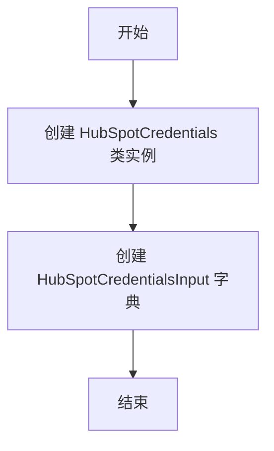
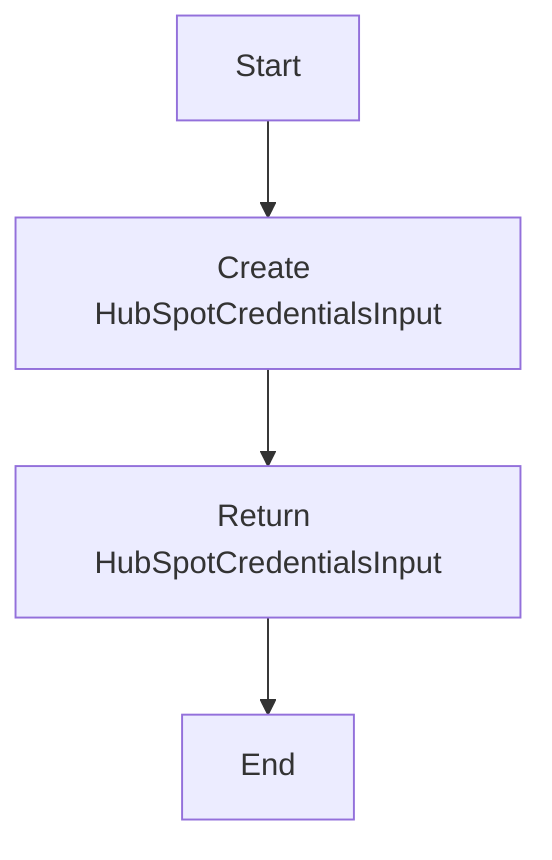
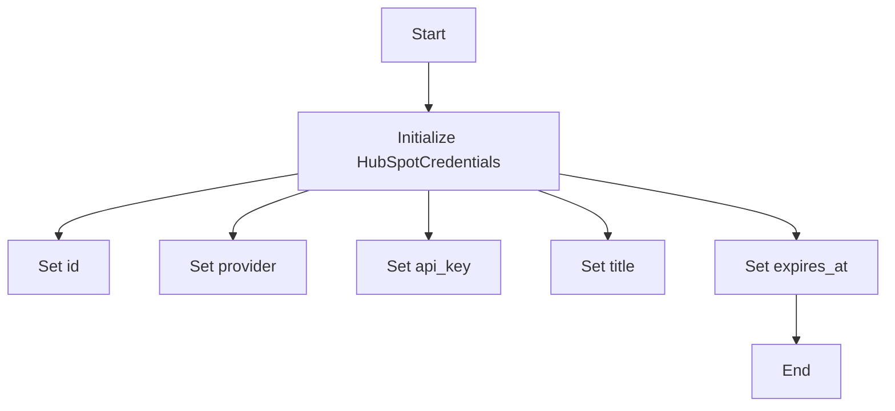
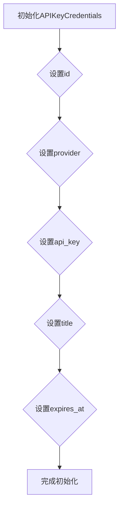

# `.\AutoGPT\autogpt_platform\backend\backend\blocks\hubspot\_auth.py` 详细设计文档

This code defines a set of credentials for the HubSpot integration, including a class for API key credentials and a function to create a credentials input for HubSpot.

## 整体流程



## 类结构

```
HubSpotCredentials (类)
├── APIKeyCredentials (基类)
```

## 全局变量及字段


### `TEST_CREDENTIALS`
    
A test HubSpot credentials object with mock data.

类型：`APIKeyCredentials`
    


### `TEST_CREDENTIALS_INPUT`
    
A dictionary containing the test credentials data for use in tests.

类型：`dict`
    


### `id`
    
The unique identifier for the credentials.

类型：`str`
    


### `provider`
    
The provider name for the credentials.

类型：`str`
    


### `api_key`
    
The secret API key for the credentials.

类型：`SecretStr`
    


### `title`
    
The title of the credentials.

类型：`str`
    


### `expires_at`
    
The expiration date for the credentials, if any.

类型：`Optional[datetime]`
    


### `type`
    
The type of the credentials, derived from the provider.

类型：`str`
    


### `description`
    
The description of the credentials field.

类型：`str`
    


### `CredentialsField`
    
A class representing a credentials field.

类型：`class`
    


### `CredentialsMetaInput`
    
A class representing a credentials metadata input.

类型：`class`
    


### `APIKeyCredentials`
    
A class representing API key credentials.

类型：`class`
    


### `ProviderName`
    
A class representing provider names.

类型：`class`
    


### `Literal`
    
A type representing literal values.

类型：`type`
    


### `SecretStr`
    
A class representing a secret string.

类型：`class`
    


### `Credentials`
    
A class representing credentials.

类型：`class`
    


### `CredentialsField`
    
A class representing a credentials field.

类型：`class`
    


### `CredentialsMetaInput`
    
A class representing a credentials metadata input.

类型：`class`
    


### `APIKeyCredentials.id`
    
The unique identifier for the API key credentials.

类型：`str`
    


### `APIKeyCredentials.provider`
    
The provider name for the API key credentials.

类型：`str`
    


### `APIKeyCredentials.api_key`
    
The secret API key for the API key credentials.

类型：`SecretStr`
    


### `APIKeyCredentials.title`
    
The title of the API key credentials.

类型：`str`
    


### `APIKeyCredentials.expires_at`
    
The expiration date for the API key credentials, if any.

类型：`Optional[datetime]`
    


### `HubSpotCredentials.id`
    
The unique identifier for the HubSpot credentials.

类型：`str`
    


### `HubSpotCredentials.provider`
    
The provider name for the HubSpot credentials.

类型：`str`
    


### `HubSpotCredentials.api_key`
    
The secret API key for the HubSpot credentials.

类型：`SecretStr`
    


### `HubSpotCredentials.title`
    
The title of the HubSpot credentials.

类型：`str`
    


### `HubSpotCredentials.expires_at`
    
The expiration date for the HubSpot credentials, if any.

类型：`Optional[datetime]`
    


### `CredentialsField.description`
    
The description of the credentials field.

类型：`str`
    


### `ProviderName.ProviderName`
    
The literal value representing the HubSpot provider.

类型：`Literal[ProviderName.HUBSPOT]`
    


### `Literal.Literal`
    
The literal type representing the HubSpot provider.

类型：`Literal[ProviderName.HUBSPOT]`
    


### `SecretStr.SecretStr`
    
The secret string type representing the API key.

类型：`str`
    


### `Credentials.Credentials`
    
The credentials class representing API key credentials.

类型：`APIKeyCredentials`
    


### `CredentialsField.CredentialsField`
    
The credentials field class representing a field with a description.

类型：`CredentialsField`
    


### `CredentialsMetaInput.CredentialsMetaInput`
    
The credentials metadata input class representing input for HubSpot API key credentials.

类型：`CredentialsMetaInput[Literal[ProviderName.HUBSPOT], Literal["api_key"]]`
    
    

## 全局函数及方法


### HubSpotCredentialsField()

This function creates a HubSpot credentials input on a block.

参数：

- 无参数

返回值：`HubSpotCredentialsInput`，A HubSpot credentials input object that can be used to configure the HubSpot integration.

#### 流程图



#### 带注释源码

```python
from typing import Literal

from pydantic import SecretStr

from backend.data.model import APIKeyCredentials, CredentialsField, CredentialsMetaInput
from backend.integrations.providers import ProviderName

HubSpotCredentials = APIKeyCredentials
HubSpotCredentialsInput = CredentialsMetaInput[
    Literal[ProviderName.HUBSPOT],
    Literal["api_key"],
]


def HubSpotCredentialsField() -> HubSpotCredentialsInput:
    """Creates a HubSpot credentials input on a block."""
    return CredentialsField(
        description="The HubSpot integration requires an API Key.",
    )
```


### HubSpotCredentials.__init__

This method initializes the HubSpotCredentials class with the necessary credentials for integration.

参数：

- `id`：`str`，The unique identifier for the credentials.
- `provider`：`str`，The provider name for the credentials.
- `api_key`：`SecretStr`，The API key for accessing the HubSpot service.
- `title`：`str`，The title of the credentials.
- `expires_at`：`datetime`，The expiration date for the credentials.

返回值：`None`，This method does not return a value.

#### 流程图



#### 带注释源码

```
from pydantic import SecretStr

class HubSpotCredentials(APIKeyCredentials):
    # Constructor for HubSpotCredentials
    def __init__(self, id: str, provider: str, api_key: SecretStr, title: str, expires_at: datetime = None):
        # Set the id of the credentials
        self.id = id
        # Set the provider of the credentials
        self.provider = provider
        # Set the API key for the credentials
        self.api_key = api_key
        # Set the title of the credentials
        self.title = title
        # Set the expiration date for the credentials, if provided
        self.expires_at = expires_at
```


### APIKeyCredentials.__init__

初始化APIKeyCredentials对象，设置API密钥的详细信息。

参数：

- `id`：`str`，API密钥的唯一标识符。
- `provider`：`str`，提供API密钥的第三方服务名称。
- `api_key`：`SecretStr`，API密钥的值，使用pydantic的SecretStr来保护敏感信息。
- `title`：`str`，API密钥的标题，用于描述该密钥。
- `expires_at`：`datetime`，API密钥的过期时间。

返回值：无

#### 流程图



#### 带注释源码

```python
from pydantic import SecretStr
from datetime import datetime

class APIKeyCredentials:
    def __init__(self, id: str, provider: str, api_key: SecretStr, title: str, expires_at: datetime = None):
        self.id = id
        self.provider = provider
        self.api_key = api_key
        self.title = title
        self.expires_at = expires_at
```


## 关键组件


### 张量索引与惰性加载

张量索引与惰性加载是用于高效处理大型数据集的机制，它允许在需要时才计算数据，从而减少内存消耗和提高性能。

### 反量化支持

反量化支持是针对量化计算的一种优化，它允许在量化过程中保留部分非量化操作，以保持计算精度。

### 量化策略

量化策略是用于将浮点数数据转换为低精度整数表示的方法，以减少模型大小和提高计算效率。


## 问题及建议


### 已知问题

-   **全局变量使用**：`TEST_CREDENTIALS` 和 `TEST_CREDENTIALS_INPUT` 作为全局变量使用，这可能导致代码难以维护和理解，特别是在大型项目中。
-   **硬编码**：`mock-hubspot-api-key` 作为硬编码的字符串，这不利于测试和实际部署，应该使用环境变量或配置文件来管理。
-   **类型注解**：虽然使用了类型注解，但未在代码中实际使用这些注解进行类型检查，这可能导致类型错误在运行时才被发现。

### 优化建议

-   **移除全局变量**：将 `TEST_CREDENTIALS` 和 `TEST_CREDENTIALS_INPUT` 移除，改为在需要的地方创建实例或使用函数返回值。
-   **使用环境变量**：将 `mock-hubspot-api-key` 替换为环境变量，以便在不同的环境中使用不同的密钥。
-   **类型检查**：启用类型检查工具，如 `mypy`，以确保类型注解在代码中正确使用，减少运行时错误。
-   **代码复用**：如果 `HubSpotCredentialsField` 函数在其他地方有相似的需求，考虑将其抽象为一个更通用的函数。
-   **文档注释**：为函数和类添加更详细的文档注释，说明其用途、参数和返回值，提高代码的可读性和可维护性。


## 其它


### 设计目标与约束

- 设计目标：
  - 提供一个用于创建HubSpot凭据输入的接口。
  - 确保API密钥的安全存储和传输。
  - 允许在系统中配置和使用HubSpot凭据。

- 约束：
  - 必须使用Pydantic库来验证输入数据。
  - API密钥必须以加密形式存储。
  - 凭据的创建和验证必须遵循系统安全策略。

### 错误处理与异常设计

- 错误处理：
  - 在创建凭据时，如果输入数据不符合预期，应抛出异常。
  - 如果API密钥验证失败，应返回相应的错误信息。

- 异常设计：
  - 定义自定义异常类，如`InvalidCredentialsException`和`AuthenticationException`。
  - 异常类应包含错误信息和可能的解决方案。

### 数据流与状态机

- 数据流：
  - 用户输入凭据信息。
  - 系统验证输入数据。
  - 系统存储加密的API密钥。
  - 系统提供凭据信息供后续使用。

- 状态机：
  - 凭据状态包括：未验证、验证中、验证成功、验证失败。

### 外部依赖与接口契约

- 外部依赖：
  - Pydantic库用于数据验证。
  - SecretStr用于安全存储API密钥。

- 接口契约：
  - `CredentialsField`接口定义了凭据字段的创建和验证。
  - `APIKeyCredentials`类定义了API密钥凭据的结构。


    