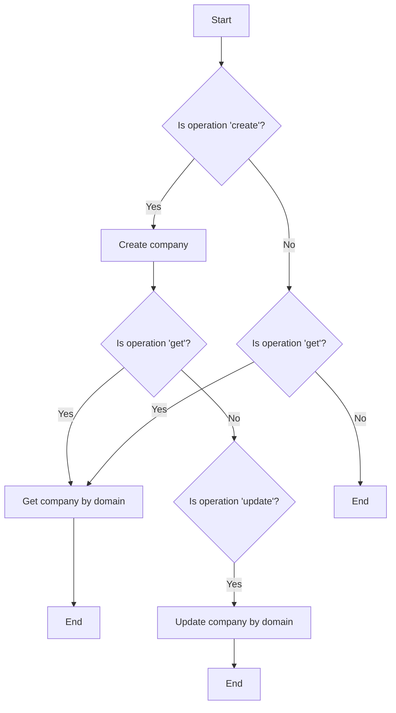
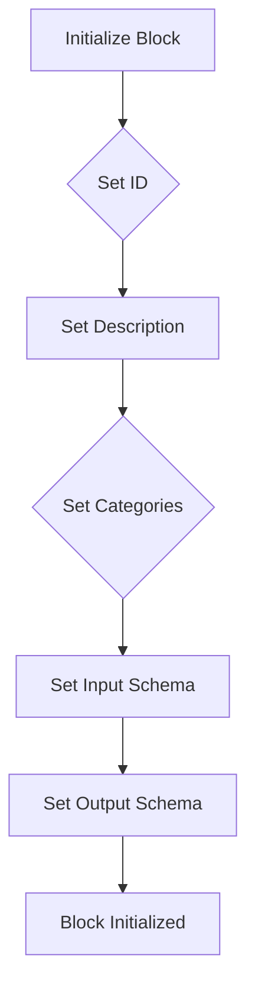
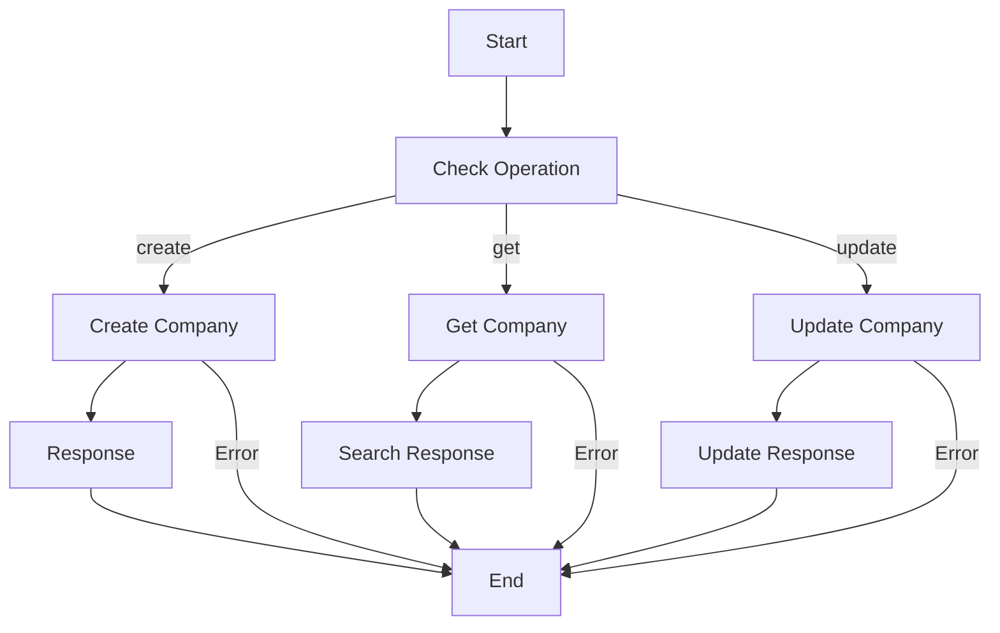

# `.\AutoGPT\autogpt_platform\backend\backend\blocks\hubspot\company.py` 详细设计文档

The code manages HubSpot companies by creating, updating, and retrieving company information through various operations such as create, update, and get.

## 整体流程



## 类结构

```
HubSpotCompanyBlock (Concrete Block)
├── Input (BlockSchemaInput)
│   ├── credentials (HubSpotCredentialsInput)
│   ├── operation (str)
│   ├── company_data (dict)
│   └── domain (str)
└── Output (BlockSchemaOutput)
    ├── company (dict)
    └── status (str)
```

## 全局变量及字段


### `id`
    
Unique identifier for the HubSpotCompanyBlock class

类型：`str`
    


### `description`
    
Description of the HubSpotCompanyBlock class

类型：`str`
    


### `categories`
    
Set of categories to which the HubSpotCompanyBlock belongs

类型：`set`
    


### `input_schema`
    
Input schema for the HubSpotCompanyBlock class

类型：`HubSpotCompanyBlock.Input`
    


### `output_schema`
    
Output schema for the HubSpotCompanyBlock class

类型：`HubSpotCompanyBlock.Output`
    


### `credentials`
    
Credentials object for HubSpot API access

类型：`HubSpotCredentials`
    


### `operation`
    
Operation to perform on the HubSpot company (create, update, get)

类型：`str`
    


### `company_data`
    
Data for creating or updating a HubSpot company

类型：`dict`
    


### `domain`
    
Domain of the HubSpot company for search or update operations

类型：`str`
    


### `company`
    
Information about the HubSpot company

类型：`dict`
    


### `status`
    
Status of the operation performed on the HubSpot company

类型：`str`
    


### `HubSpotCompanyBlock.id`
    
Unique identifier for the HubSpotCompanyBlock class

类型：`str`
    


### `HubSpotCompanyBlock.description`
    
Description of the HubSpotCompanyBlock class

类型：`str`
    


### `HubSpotCompanyBlock.categories`
    
Set of categories to which the HubSpotCompanyBlock belongs

类型：`set`
    


### `HubSpotCompanyBlock.input_schema`
    
Input schema for the HubSpotCompanyBlock class

类型：`HubSpotCompanyBlock.Input`
    


### `HubSpotCompanyBlock.output_schema`
    
Output schema for the HubSpotCompanyBlock class

类型：`HubSpotCompanyBlock.Output`
    


### `Input.credentials`
    
Credentials object for HubSpot API access

类型：`HubSpotCredentialsInput`
    


### `Input.operation`
    
Operation to perform on the HubSpot company (create, update, get)

类型：`str`
    


### `Input.company_data`
    
Data for creating or updating a HubSpot company

类型：`dict`
    


### `Input.domain`
    
Domain of the HubSpot company for search or update operations

类型：`str`
    


### `Output.company`
    
Information about the HubSpot company

类型：`dict`
    


### `Output.status`
    
Status of the operation performed on the HubSpot company

类型：`str`
    
    

## 全局函数及方法


### HubSpotCompanyBlock.__init__

This method initializes the HubSpotCompanyBlock class, setting up its metadata and schema for handling HubSpot company operations.

参数：

- `id`：`str`，The unique identifier for the block.
- `description`：`str`，A description of the block's functionality.
- `categories`：`set`，A set of categories that the block belongs to.
- `input_schema`：`Input`，The input schema for the block.
- `output_schema`：`Output`，The output schema for the block.

返回值：`None`，This method does not return any value.

#### 流程图



#### 带注释源码

```python
def __init__(self):
    super().__init__(
        id="3ae02219-d540-47cd-9c78-3ad6c7d9820a",
        description="Manages HubSpot companies - create, update, and retrieve company information",
        categories={BlockCategory.CRM},
        input_schema=HubSpotCompanyBlock.Input,
        output_schema=HubSpotCompanyBlock.Output,
    )
```


### HubSpotCompanyBlock.run

This method handles the execution of operations on HubSpot companies, such as creating, updating, and retrieving company information.

参数：

- `input_data`：`Input`，The input data for the operation, including credentials, operation type, company data, and domain.
- `credentials`：`HubSpotCredentials`，The HubSpot credentials object containing the API key.
- `**kwargs`：`Any`，Additional keyword arguments that may be used by subclasses.

返回值：`BlockOutput`，The output data containing the company information and operation status.

#### 流程图



#### 带注释源码

```python
async def run(self, input_data: Input, *, credentials: HubSpotCredentials, **kwargs) -> BlockOutput:
    base_url = "https://api.hubapi.com/crm/v3/objects/companies"
    headers = {
        "Authorization": f"Bearer {credentials.api_key.get_secret_value()}",
        "Content-Type": "application/json",
    }

    if input_data.operation == "create":
        response = await Requests().post(
            base_url, headers=headers, json={"properties": input_data.company_data}
        )
        result = response.json()
        yield "company", result
        yield "status", "created"

    elif input_data.operation == "get":
        search_url = f"{base_url}/search"
        search_data = {
            "filterGroups": [
                {
                    "filters": [
                        {
                            "propertyName": "domain",
                            "operator": "EQ",
                            "value": input_data.domain,
                        }
                    ]
                }
            ]
        }
        search_response = await Requests().post(
            search_url, headers=headers, json=search_data
        )
        search_result = search_response.json()
        yield "search_company", search_result.get("results", [{}])[0]
        yield "status", "retrieved"

    elif input_data.operation == "update":
        # First get company ID by domain
        search_response = await Requests().post(
            f"{base_url}/search",
            headers=headers,
            json={
                "filterGroups": [
                    {
                        "filters": [
                            {
                                "propertyName": "domain",
                                "operator": "EQ",
                                "value": input_data.domain,
                            }
                        ]
                    }
                ]
            },
        )
        search_result = search_response.json()
        company_id = search_result.get("results", [{}])[0].get("id")

        if company_id:
            response = await Requests().patch(
                f"{base_url}/{company_id}",
                headers=headers,
                json={"properties": input_data.company_data},
            )
            result = response.json()
            yield "company", result
            yield "status", "updated"
        else:
            yield "company", {}
            yield "status", "company_not_found"
```


## 关键组件


### 张量索引与惰性加载

张量索引与惰性加载是代码中处理数据结构的核心组件，用于高效地访问和操作大型数据集，同时减少内存消耗。

### 反量化支持

反量化支持是代码中用于处理量化数据的核心组件，它允许代码在运行时动态调整量化参数，以适应不同的量化需求。

### 量化策略

量化策略是代码中用于优化数据处理的组件，它通过选择合适的量化方法来减少数据的大小，同时保持数据的精度。

## 问题及建议


### 已知问题

-   **重复搜索**: 在更新操作中，代码首先通过搜索获取公司ID，然后在创建操作中也进行了搜索。这可能导致不必要的网络请求和延迟。
-   **异常处理**: 代码中没有显式处理可能发生的异常，如网络请求失败或HubSpot API响应错误。
-   **代码复用**: `search_url` 和 `search_data` 在创建和更新操作中重复定义，可以考虑将其提取为类方法或全局变量以提高代码复用性。
-   **API密钥安全性**: `credentials.api_key.get_secret_value()` 可能暴露API密钥，应确保密钥的安全性。

### 优化建议

-   **合并搜索逻辑**: 将创建和更新操作中的搜索逻辑合并，避免重复搜索。
-   **添加异常处理**: 在网络请求和API调用中添加异常处理，确保程序的健壮性。
-   **提取重复代码**: 将重复的搜索逻辑提取为类方法或全局变量，减少代码冗余。
-   **使用环境变量**: 将API密钥存储在环境变量中，而不是直接在代码中引用，以提高安全性。
-   **日志记录**: 添加日志记录，以便于调试和监控程序的运行状态。
-   **单元测试**: 编写单元测试以确保代码的正确性和稳定性。


## 其它


### 设计目标与约束

- 设计目标：
  - 实现对HubSpot公司信息的创建、更新和检索功能。
  - 确保与HubSpot API的兼容性和数据安全性。
  - 提供清晰的接口和易于使用的API。
- 约束：
  - 必须使用HubSpot提供的API进行操作。
  - 代码应遵循异步编程模式以提高性能。
  - 代码应具有良好的可读性和可维护性。

### 错误处理与异常设计

- 错误处理：
  - 对于API请求失败，应捕获异常并返回相应的错误信息。
  - 对于无效的输入数据，应返回错误信息并提示用户。
- 异常设计：
  - 使用try-except块捕获可能的异常，如网络错误、API限制等。
  - 定义自定义异常类以提供更具体的错误信息。

### 数据流与状态机

- 数据流：
  - 输入数据通过`run`方法传递给API。
  - 根据操作类型（创建、更新、检索），API请求被发送到相应的URL。
  - 响应数据被解析并返回给调用者。
- 状态机：
  - 状态包括：待处理、正在处理、完成、错误。
  - 状态转换由操作类型和API响应触发。

### 外部依赖与接口契约

- 外部依赖：
  - HubSpot API。
  - `Requests`库用于发送HTTP请求。
- 接口契约：
  - `HubSpotCredentials`类用于存储和获取认证信息。
  - `Block`类定义了数据块的基本结构。
  - `Requests`类定义了发送HTTP请求的方法。

    