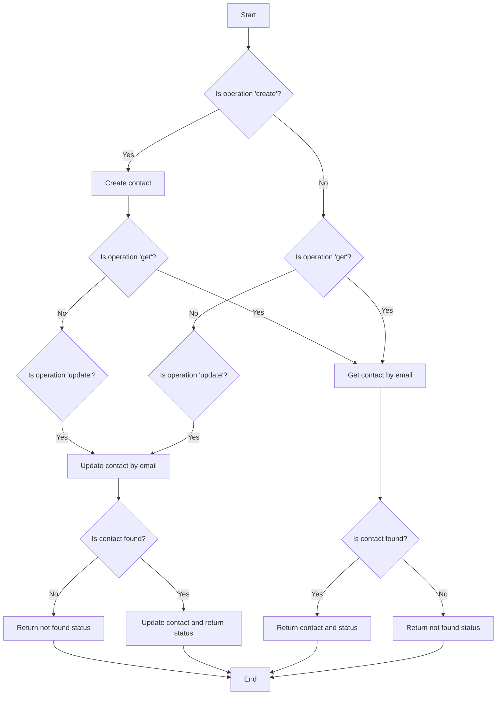
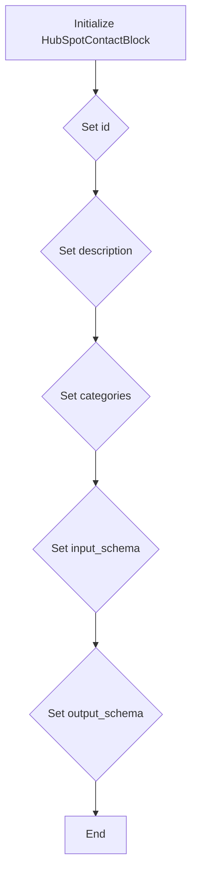
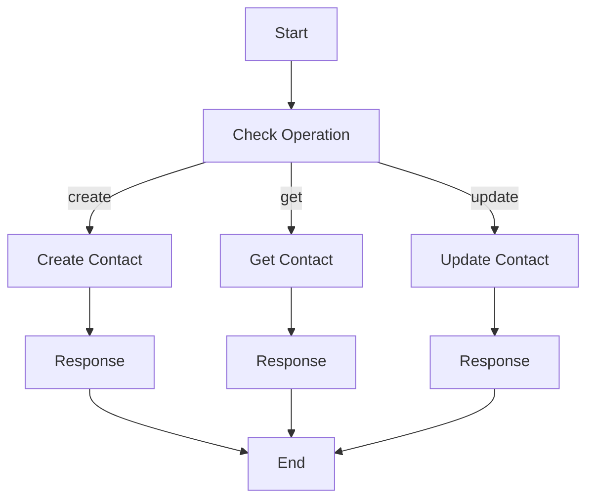

# `.\AutoGPT\autogpt_platform\backend\backend\blocks\hubspot\contact.py` 详细设计文档

The code manages HubSpot contacts by creating, updating, and retrieving contact information through a defined set of operations.

## 整体流程



## 类结构

```
HubSpotContactBlock (Concrete Block)
├── Input (BlockSchemaInput)
│   ├── credentials (HubSpotCredentialsInput)
│   ├── operation (str)
│   ├── contact_data (dict)
│   └── email (str)
└── Output (BlockSchemaOutput)
    ├── contact (dict)
    └── status (str)
```

## 全局变量及字段


### `id`
    
Unique identifier for the HubSpotContactBlock class

类型：`str`
    


### `description`
    
Description of the HubSpotContactBlock class

类型：`str`
    


### `categories`
    
Set of categories to which the HubSpotContactBlock belongs

类型：`set`
    


### `input_schema`
    
Input schema for the HubSpotContactBlock class

类型：`Input`
    


### `output_schema`
    
Output schema for the HubSpotContactBlock class

类型：`Output`
    


### `credentials`
    
Credentials object for HubSpot API access

类型：`HubSpotCredentials`
    


### `operation`
    
Operation to perform on the HubSpot contact (create, update, get)

类型：`str`
    


### `contact_data`
    
Contact data for create/update operations

类型：`dict`
    


### `email`
    
Email address for get/update operations

类型：`str`
    


### `contact`
    
Contact information

类型：`dict`
    


### `status`
    
Operation status

类型：`str`
    


### `HubSpotContactBlock.id`
    
Unique identifier for the HubSpotContactBlock class

类型：`str`
    


### `HubSpotContactBlock.description`
    
Description of the HubSpotContactBlock class

类型：`str`
    


### `HubSpotContactBlock.categories`
    
Set of categories to which the HubSpotContactBlock belongs

类型：`set`
    


### `HubSpotContactBlock.input_schema`
    
Input schema for the HubSpotContactBlock class

类型：`Input`
    


### `HubSpotContactBlock.output_schema`
    
Output schema for the HubSpotContactBlock class

类型：`Output`
    


### `Input.credentials`
    
Credentials object for HubSpot API access

类型：`HubSpotCredentials`
    


### `Input.operation`
    
Operation to perform on the HubSpot contact (create, update, get)

类型：`str`
    


### `Input.contact_data`
    
Contact data for create/update operations

类型：`dict`
    


### `Input.email`
    
Email address for get/update operations

类型：`str`
    


### `Output.contact`
    
Contact information

类型：`dict`
    


### `Output.status`
    
Operation status

类型：`str`
    
    

## 全局函数及方法


### HubSpotContactBlock.__init__

This method initializes the HubSpotContactBlock class, setting up its properties and configurations.

参数：

- `id`：`str`，The unique identifier for the block.
- `description`：`str`，A description of the block's functionality.
- `categories`：`set`，A set of categories that the block belongs to.
- `input_schema`：`Input`，The input schema for the block.
- `output_schema`：`Output`，The output schema for the block.

返回值：`None`，This method does not return any value.

#### 流程图



#### 带注释源码

```python
def __init__(self):
    super().__init__(
        id="5267326e-c4c1-4016-9f54-4e72ad02f813",
        description="Manages HubSpot contacts - create, update, and retrieve contact information",
        categories={BlockCategory.CRM},
        input_schema=HubSpotContactBlock.Input,
        output_schema=HubSpotContactBlock.Output,
    )
```


### HubSpotContactBlock.run

This method handles the execution of operations on HubSpot contacts, such as creating, updating, and retrieving contact information.

参数：

- `input_data`：`Input`，The input data for the operation, including credentials, operation type, contact data, and email.
- `credentials`：`HubSpotCredentials`，The HubSpot credentials object containing the API key.
- `**kwargs`：Any additional keyword arguments.

返回值：`BlockOutput`，The output data containing the contact information and operation status.

#### 流程图



#### 带注释源码

```python
async def run(self, input_data: Input, *, credentials: HubSpotCredentials, **kwargs) -> BlockOutput:
    base_url = "https://api.hubapi.com/crm/v3/objects/contacts"
    headers = {
        "Authorization": f"Bearer {credentials.api_key.get_secret_value()}",
        "Content-Type": "application/json",
    }

    if input_data.operation == "create":
        response = await Requests().post(
            base_url, headers=headers, json={"properties": input_data.contact_data}
        )
        result = response.json()
        yield "contact", result
        yield "status", "created"

    elif input_data.operation == "get":
        search_url = f"{base_url}/search"
        search_data = {
            "filterGroups": [
                {
                    "filters": [
                        {
                            "propertyName": "email",
                            "operator": "EQ",
                            "value": input_data.email,
                        }
                    ]
                }
            ]
        }
        response = await Requests().post(
            search_url, headers=headers, json=search_data
        )
        result = response.json()
        yield "contact", result.get("results", [{}])[0]
        yield "status", "retrieved"

    elif input_data.operation == "update":
        search_response = await Requests().post(
            f"{base_url}/search",
            headers=headers,
            json={
                "filterGroups": [
                    {
                        "filters": [
                            {
                                "propertyName": "email",
                                "operator": "EQ",
                                "value": input_data.email,
                            }
                        ]
                    }
                ]
            },
        )
        search_result = search_response.json()
        contact_id = search_result.get("results", [{}])[0].get("id")

        if contact_id:
            response = await Requests().patch(
                f"{base_url}/{contact_id}",
                headers=headers,
                json={"properties": input_data.contact_data},
            )
            result = response.json()
            yield "contact", result
            yield "status", "updated"
        else:
            yield "contact", {}
            yield "status", "contact_not_found"
```


## 关键组件


### 张量索引与惰性加载

张量索引与惰性加载是代码中处理数据结构的核心组件，用于高效地访问和操作大型数据集，同时延迟计算以优化性能。

### 反量化支持

反量化支持是代码中用于处理量化数据的核心组件，它允许对量化数据进行反量化操作，以便进行进一步的分析和处理。

### 量化策略

量化策略是代码中用于处理量化数据的核心组件，它定义了如何将浮点数数据转换为低精度表示，以减少内存使用和提高计算效率。


## 问题及建议


### 已知问题

-   **重复搜索**: 在更新操作中，代码首先进行一次搜索以获取联系人ID，然后在更新操作中再次进行搜索。这可能导致不必要的网络请求和延迟。
-   **错误处理**: 代码中没有明确的错误处理机制，例如处理HTTP请求错误或HubSpot API错误。
-   **代码复用**: `Requests()` 实例在每次调用 `run` 方法时都被创建，这可能导致不必要的资源消耗。
-   **API密钥安全性**: 代码中直接使用 `credentials.api_key.get_secret_value()` 来获取API密钥，这可能会在日志中暴露敏感信息。

### 优化建议

-   **合并搜索请求**: 在更新操作中，可以将搜索请求与更新请求合并，以减少网络请求次数。
-   **增加错误处理**: 在代码中添加异常处理，以处理可能的HTTP错误或API错误，并返回适当的错误信息。
-   **重用请求实例**: 创建一个全局的 `Requests()` 实例，并在 `run` 方法中重用它，以避免每次调用时都创建新的实例。
-   **安全处理API密钥**: 使用环境变量或密钥管理服务来存储API密钥，而不是在代码中硬编码或直接从密钥库中获取。
-   **日志记录**: 添加日志记录，以便于调试和监控API调用。
-   **单元测试**: 为 `HubSpotContactBlock` 类编写单元测试，以确保代码的正确性和稳定性。
-   **代码风格**: 考虑使用代码格式化工具来统一代码风格，提高代码可读性。


## 其它


### 设计目标与约束

- 设计目标：实现一个通用的HubSpot联系人管理模块，支持创建、更新和检索联系人信息。
- 约束：必须使用HubSpot API进行操作，确保安全性，遵守API速率限制。

### 错误处理与异常设计

- 错误处理：捕获网络请求异常、API限制异常和HubSpot API返回的错误。
- 异常设计：抛出自定义异常，提供清晰的错误信息。

### 数据流与状态机

- 数据流：用户输入 -> 输入验证 -> API请求 -> 结果处理 -> 输出
- 状态机：根据操作类型（创建、更新、获取）处理不同的状态转换。

### 外部依赖与接口契约

- 外部依赖：HubSpot API、Requests库。
- 接口契约：定义了与HubSpot API交互的接口和参数。

### 安全性与认证

- 安全性：使用HTTPS进行通信，存储API密钥时使用加密。
- 认证：使用Bearer Token进行认证。

### 测试与验证

- 测试：编写单元测试和集成测试，确保代码质量和功能正确性。
- 验证：通过模拟API响应进行测试，确保在各种情况下都能正确处理。

### 性能优化

- 性能优化：优化网络请求，减少不必要的API调用。

### 维护与扩展

- 维护：定期更新依赖库，修复已知问题。
- 扩展：为新的操作类型添加支持，如删除联系人。


    