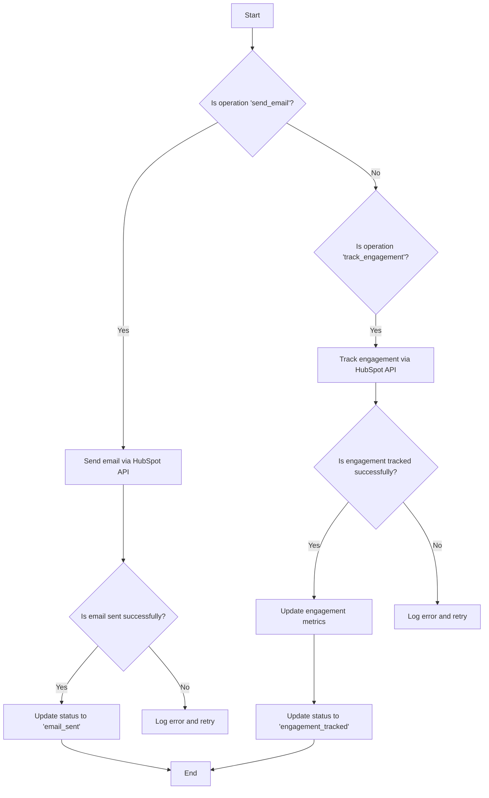
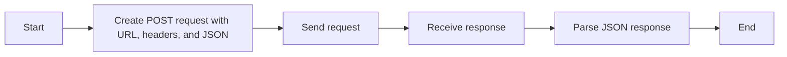
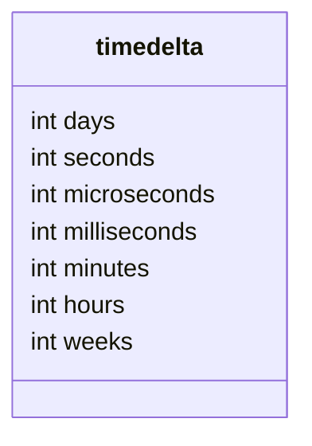
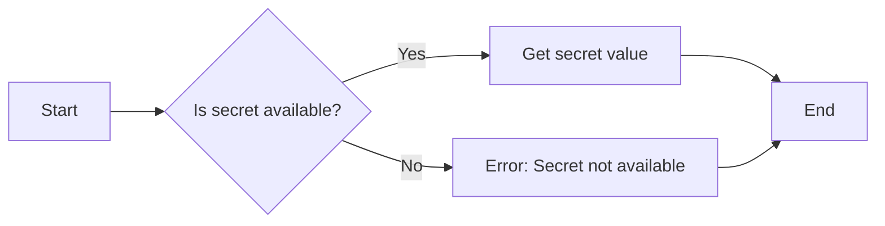
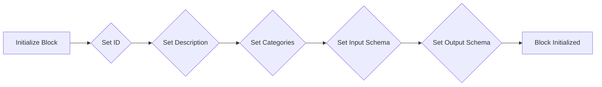
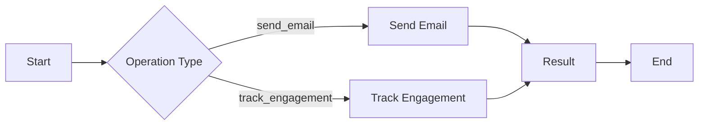

# `.\AutoGPT\autogpt_platform\backend\backend\blocks\hubspot\engagement.py` 详细设计文档

The code manages HubSpot engagements, including sending emails and tracking engagement metrics.

## 整体流程



## 类结构

```
HubSpotEngagementBlock (Concrete Block)
├── Input (BlockSchemaInput)
│   ├── credentials (HubSpotCredentialsInput)
│   ├── operation (str)
│   ├── email_data (dict)
│   ├── contact_id (str)
│   └── timeframe_days (int)
└── Output (BlockSchemaOutput)
    ├── result (dict)
    └── status (str)
```

## 全局变量及字段


### `base_url`
    
Base URL for the HubSpot API.

类型：`str`
    


### `headers`
    
Headers required for API requests to HubSpot.

类型：`dict`
    


### `email_url`
    
URL for the HubSpot email send API.

类型：`str`
    


### `email_data`
    
Data for sending an email through HubSpot.

类型：`dict`
    


### `response`
    
Response from the HubSpot API.

类型：`dict`
    


### `result`
    
Result of the operation performed by the HubSpot API.

类型：`dict`
    


### `status`
    
Status of the operation performed by the HubSpot API.

类型：`str`
    


### `engagement_url`
    
URL for retrieving engagement data from HubSpot for a contact.

类型：`str`
    


### `params`
    
Parameters for filtering engagement data from HubSpot.

类型：`dict`
    


### `engagements`
    
Engagement data retrieved from HubSpot for a contact.

类型：`dict`
    


### `metrics`
    
Metrics calculated from engagement data.

类型：`dict`
    


### `engagement`
    
Single engagement event from the HubSpot API.

类型：`dict`
    


### `eng_type`
    
Type of engagement event (e.g., EMAIL, EMAIL_CLICK).

类型：`str`
    


### `eng_time`
    
Timestamp of the engagement event.

类型：`str`
    


### `id`
    
Unique identifier for the HubSpotEngagementBlock class.

类型：`str`
    


### `description`
    
Description of the HubSpotEngagementBlock class.

类型：`str`
    


### `categories`
    
Categories to which the HubSpotEngagementBlock class belongs.

类型：`set`
    


### `input_schema`
    
Input schema for the HubSpotEngagementBlock class.

类型：`BlockSchemaInput`
    


### `output_schema`
    
Output schema for the HubSpotEngagementBlock class.

类型：`BlockSchemaOutput`
    


### `credentials`
    
Credentials for accessing the HubSpot API.

类型：`HubSpotCredentials`
    


### `input_data`
    
Input data for the HubSpotEngagementBlock class.

类型：`Input`
    


### `kwargs`
    
Additional keyword arguments passed to the run method.

类型：`dict`
    


### `Requests`
    
Requests utility class for making HTTP requests.

类型：`Requests`
    


### `HubSpotEngagementBlock.id`
    
Unique identifier for the HubSpotEngagementBlock class.

类型：`str`
    


### `HubSpotEngagementBlock.description`
    
Description of the HubSpotEngagementBlock class.

类型：`str`
    


### `HubSpotEngagementBlock.categories`
    
Categories to which the HubSpotEngagementBlock class belongs.

类型：`set`
    


### `HubSpotEngagementBlock.input_schema`
    
Input schema for the HubSpotEngagementBlock class.

类型：`BlockSchemaInput`
    


### `HubSpotEngagementBlock.output_schema`
    
Output schema for the HubSpotEngagementBlock class.

类型：`BlockSchemaOutput`
    


### `Input.credentials`
    
Credentials for accessing the HubSpot API.

类型：`HubSpotCredentialsInput`
    


### `Input.operation`
    
Operation to perform (send_email, track_engagement).

类型：`str`
    


### `Input.email_data`
    
Email data including recipient, subject, content.

类型：`dict`
    


### `Input.contact_id`
    
Contact ID for engagement tracking.

类型：`str`
    


### `Input.timeframe_days`
    
Number of days to look back for engagement.

类型：`int`
    


### `Output.result`
    
Operation result.

类型：`dict`
    


### `Output.status`
    
Operation status.

类型：`str`
    
    

## 全局函数及方法


### `Requests().post`

This function sends a POST request to a specified URL with the provided headers and JSON data.

参数：

- `email_url`：`str`，The URL to which the POST request is sent.
- `headers`：`dict`，The headers to be included in the request.
- `json`：`dict`，The JSON data to be sent in the request body.

返回值：`dict`，The JSON response from the server.

#### 流程图



#### 带注释源码

```python
response = await Requests().post(
    email_url, headers=headers, json=email_data
)
```


### `Requests().get`

This function is used to make a GET request to a specified URL using the Requests library. It is part of the `Requests` class and is used within the `HubSpotEngagementBlock` class to fetch engagement data from HubSpot's API.

参数：

- `engagement_url`：`str`，The URL to which the GET request is made. It includes the base URL and the specific endpoint for fetching engagement data.
- `headers`：`dict`，The headers to be included in the GET request. This includes the authorization token and the content type.
- `params`：`dict`，The query parameters to be included in the GET request. This includes the limit of results and the date from which to fetch engagement data.

返回值：`dict`，The JSON response from the GET request, which contains the engagement data for the specified contact.

#### 流程图

```mermaid
graph LR
A[Start] --> B{Is operation "track_engagement"?}
B -- Yes --> C[Fetch engagement data]
C --> D[Process engagement metrics]
D --> E[Calculate engagement score]
E --> F[End]
B -- No --> G[End]
```

#### 带注释源码

```python
# Get engagement events for the contact
from_date = datetime.now() - timedelta(days=input_data.timeframe_days)
engagement_url = (
    f"{base_url}/crm/v3/objects/contacts/{input_data.contact_id}/engagement"
)

params = {"limit": 100, "after": from_date.isoformat()}

response = await Requests().get(
    engagement_url, headers=headers, params=params
)
engagements = response.json()
```


### datetime.now()

获取当前时间的 ISO 8601 格式字符串。

参数：

- 无

返回值：`str`，ISO 8601 格式的当前时间字符串

#### 流程图

```mermaid
graph LR
A[Start] --> B{Is operation "send_email"?}
B -- Yes --> C[Set email_data with current time]
B -- No --> D{Is operation "track_engagement"?}
D -- Yes --> E[Calculate engagement metrics]
D -- No --> F[End]
C --> G[End]
E --> H[End]
```

#### 带注释源码

```python
from datetime import datetime, timedelta

# ... (其他代码)

if input_data.operation == "send_email":
    # Using the email send API
    email_url = f"{base_url}/crm/v3/objects/emails"
    email_data = {
        "properties": {
            "hs_timestamp": datetime.now().isoformat(),  # 获取当前时间的 ISO 8601 格式字符串
            # ... (其他代码)
        }
    }
    # ... (其他代码)

elif input_data.operation == "track_engagement":
    # Get engagement events for the contact
    from_date = datetime.now() - timedelta(days=input_data.timeframe_days)
    engagement_url = (
        f"{base_url}/crm/v3/objects/contacts/{input_data.contact_id}/engagement"
    )
    # ... (其他代码)
```


### `timedelta`

`timedelta` 是一个内置的 Python 类，用于表示两个时间点之间的差异。

参数：

- `days`：`int`，表示天数，用于计算时间差。
- `seconds`：`int`，表示秒数，用于计算时间差。
- `microseconds`：`int`，表示微秒数，用于计算时间差。
- `milliseconds`：`int`，表示毫秒数，用于计算时间差。
- `minutes`：`int`，表示分钟数，用于计算时间差。
- `hours`：`int`，表示小时数，用于计算时间差。
- `weeks`：`int`，表示周数，用于计算时间差。

返回值：`timedelta` 对象，表示两个时间点之间的差异。

#### 流程图



#### 带注释源码

```python
from datetime import timedelta

# 创建一个 timedelta 对象，表示 2 天 3 小时 4 分钟 5 秒
td = timedelta(days=2, hours=3, minutes=4, seconds=5)

# 输出 timedelta 对象的值
print(td)
```


### `datetime.now().isoformat()`

将当前datetime对象转换为ISO 8601格式的字符串。

参数：

- 无

返回值：`str`，ISO 8601格式的日期时间字符串

#### 流程图

```mermaid
graph LR
A[datetime.now()] --> B[isoformat()]
B --> C[str]
```

#### 带注释源码

```python
from datetime import datetime

# 将当前datetime对象转换为ISO 8601格式的字符串
datetime.now().isoformat()
```


### `get_secret_value`

获取HubSpot API密钥的值。

参数：

- `self`：`HubSpotCredentials`，当前实例
- ...

返回值：`str`，HubSpot API密钥的值

#### 流程图



#### 带注释源码

```python
from backend.blocks.hubspot._auth import HubSpotCredentials

class HubSpotCredentials:
    # ... other methods and fields ...

    def get_secret_value(self):
        # Retrieve the secret value from the credentials
        return self.api_key
```


### HubSpotEngagementBlock.__init__

This method initializes the HubSpotEngagementBlock class, setting up its metadata and schema for input and output.

参数：

- `id`：`str`，The unique identifier for the block.
- `description`：`str`，A description of the block's functionality.
- `categories`：`set`，A set of categories that the block belongs to.
- `input_schema`：`Input`，The schema for the input data of the block.
- `output_schema`：`Output`，The schema for the output data of the block.

返回值：`None`，This method does not return any value.

#### 流程图



#### 带注释源码

```python
def __init__(self):
    super().__init__(
        id="c6524385-7d87-49d6-a470-248bd29ca765",
        description="Manages HubSpot engagements - sends emails and tracks engagement metrics",
        categories={BlockCategory.CRM, BlockCategory.COMMUNICATION},
        input_schema=HubSpotEngagementBlock.Input,
        output_schema=HubSpotEngagementBlock.Output,
    )
```


### HubSpotEngagementBlock.run

This method handles the execution of operations on HubSpot engagements, such as sending emails and tracking engagement metrics.

参数：

- `input_data`：`Input`，The input data for the operation, including credentials, operation type, email data, contact ID, and timeframe.
- `credentials`：`HubSpotCredentials`，The HubSpot credentials required for authentication.
- `**kwargs`：Any additional keyword arguments.

返回值：`BlockOutput`，The output of the operation, including the result and status.

#### 流程图



#### 带注释源码

```python
async def run(self, input_data: Input, *, credentials: HubSpotCredentials, **kwargs) -> BlockOutput:
    base_url = "https://api.hubapi.com"
    headers = {
        "Authorization": f"Bearer {credentials.api_key.get_secret_value()}",
        "Content-Type": "application/json",
    }

    if input_data.operation == "send_email":
        # Using the email send API
        email_url = f"{base_url}/crm/v3/objects/emails"
        email_data = {
            "properties": {
                "hs_timestamp": datetime.now().isoformat(),
                "hubspot_owner_id": "1",  # This should be configurable
                "hs_email_direction": "OUTBOUND",
                "hs_email_status": "SEND",
                "hs_email_subject": input_data.email_data.get("subject"),
                "hs_email_text": input_data.email_data.get("content"),
                "hs_email_to_email": input_data.email_data.get("recipient"),
            }
        }

        response = await Requests().post(
            email_url, headers=headers, json=email_data
        )
        result = response.json()
        yield "result", result
        yield "status", "email_sent"

    elif input_data.operation == "track_engagement":
        # Get engagement events for the contact
        from_date = datetime.now() - timedelta(days=input_data.timeframe_days)
        engagement_url = (
            f"{base_url}/crm/v3/objects/contacts/{input_data.contact_id}/engagement"
        )

        params = {"limit": 100, "after": from_date.isoformat()}

        response = await Requests().get(
            engagement_url, headers=headers, params=params
        )
        engagements = response.json()

        # Process engagement metrics
        metrics = {
            "email_opens": 0,
            "email_clicks": 0,
            "email_replies": 0,
            "last_engagement": None,
            "engagement_score": 0,
        }

        for engagement in engagements.get("results", []):
            eng_type = engagement.get("properties", {}).get("hs_engagement_type")
            if eng_type == "EMAIL":
                metrics["email_opens"] += 1
            elif eng_type == "EMAIL_CLICK":
                metrics["email_clicks"] += 1
            elif eng_type == "EMAIL_REPLY":
                metrics["email_replies"] += 1

            # Update last engagement time
            eng_time = engagement.get("properties", {}).get("hs_timestamp")
            if eng_time and (
                not metrics["last_engagement"]
                or eng_time > metrics["last_engagement"]
            ):
                metrics["last_engagement"] = eng_time

        # Calculate simple engagement score
        metrics["engagement_score"] = (
            metrics["email_opens"]
            + metrics["email_clicks"] * 2
            + metrics["email_replies"] * 3
        )

        yield "result", metrics
        yield "status", "engagement_tracked"
``` 


## 关键组件


### 张量索引与惰性加载

用于高效地索引和访问大型数据集，同时延迟加载数据以减少内存消耗。

### 反量化支持

提供对量化策略的支持，允许在模型训练过程中动态调整参数。

### 量化策略

实现量化策略，用于优化模型性能和减少模型大小。


## 问题及建议


### 已知问题

-   **硬编码的HubSpot Owner ID**: 代码中硬编码了`hubspot_owner_id`为"1"，这应该是一个可配置的参数，以便用户可以根据他们的需求设置。
-   **缺乏错误处理**: 代码中没有明确的错误处理机制，例如在API请求失败时如何处理。
-   **缺乏日志记录**: 代码中没有日志记录，这使得调试和监控变得困难。
-   **缺乏单元测试**: 代码中没有提供单元测试，这可能导致在代码更改后引入的潜在错误。
-   **全局变量和函数的使用**: 代码中使用了全局变量和函数，这可能导致代码难以维护和理解。

### 优化建议

-   **配置化HubSpot Owner ID**: 将`hubspot_owner_id`作为一个配置参数，允许用户在初始化块时设置。
-   **实现错误处理**: 在API请求中添加错误处理逻辑，以便在请求失败时提供有用的错误信息。
-   **添加日志记录**: 在关键步骤添加日志记录，以便于监控和调试。
-   **编写单元测试**: 为代码编写单元测试，以确保代码的正确性和稳定性。
-   **减少全局变量和函数的使用**: 尽量减少全局变量和函数的使用，以使代码更加模块化和可维护。
-   **优化数据处理**: 在处理大量数据时，考虑使用更高效的数据处理方法，例如使用生成器或批处理请求。
-   **增加文档注释**: 为代码添加详细的文档注释，以提高代码的可读性和可维护性。


## 其它


### 设计目标与约束

- 设计目标：
  - 实现与HubSpot的集成，支持发送邮件和跟踪用户互动。
  - 提供灵活的配置选项，允许用户自定义邮件内容和跟踪参数。
  - 确保代码的可维护性和可扩展性，以便未来添加更多功能。

- 约束：
  - 必须使用HubSpot提供的API进行操作。
  - 代码应遵循异步编程模式，以提高性能和响应速度。
  - 需要处理可能的API限制和错误。

### 错误处理与异常设计

- 错误处理：
  - 使用try-except块捕获API请求中的异常。
  - 对于API返回的错误，解析错误信息并抛出自定义异常。
  - 在用户界面中提供清晰的错误消息。

- 异常设计：
  - 定义自定义异常类，如`HubSpotAPIError`，用于处理特定的API错误。
  - 异常类应包含错误代码、错误消息和可能的解决方案。

### 数据流与状态机

- 数据流：
  - 用户输入通过输入参数传递给`run`方法。
  - `run`方法处理输入数据，与HubSpot API交互，并生成输出结果。
  - 输出结果通过yield语句返回给调用者。

- 状态机：
  - 该类没有显式的状态机，但根据`operation`参数执行不同的操作。

### 外部依赖与接口契约

- 外部依赖：
  - `datetime`和`timedelta`用于日期和时间处理。
  - `json`用于解析和生成JSON数据。
  - `aiohttp`用于异步HTTP请求。

- 接口契约：
  - `HubSpotCredentials`类提供API密钥和认证信息。
  - `Requests`类提供异步HTTP请求功能。
  - `Block`类定义了数据块的基本接口和生命周期方法。
  - `SchemaField`类用于定义输入和输出数据的结构。

    