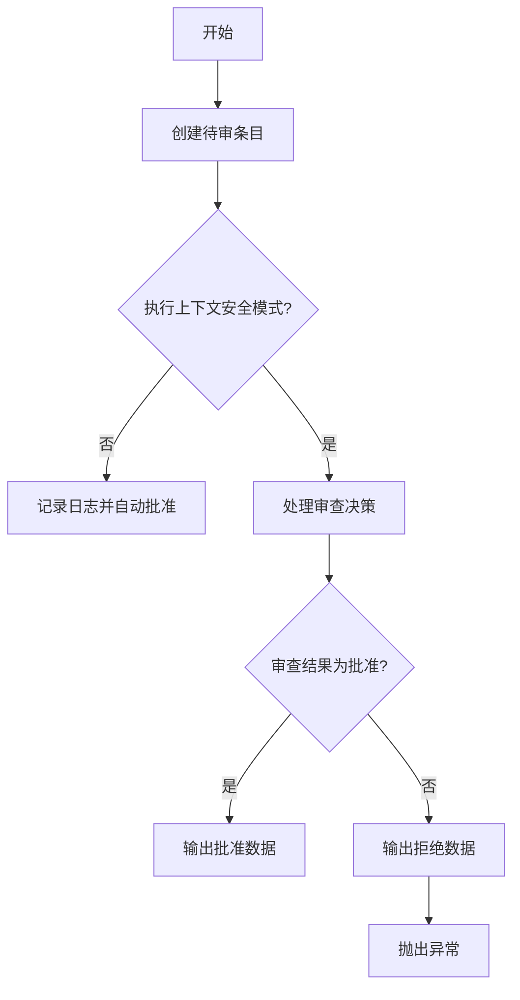
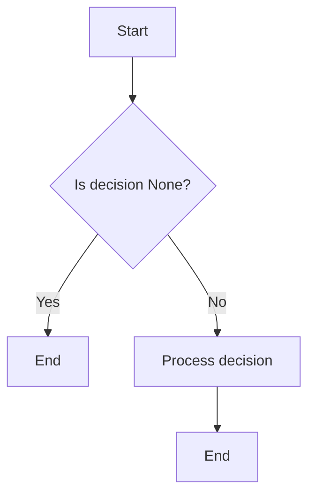
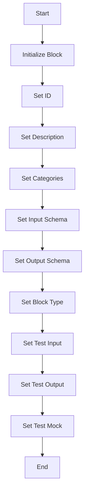
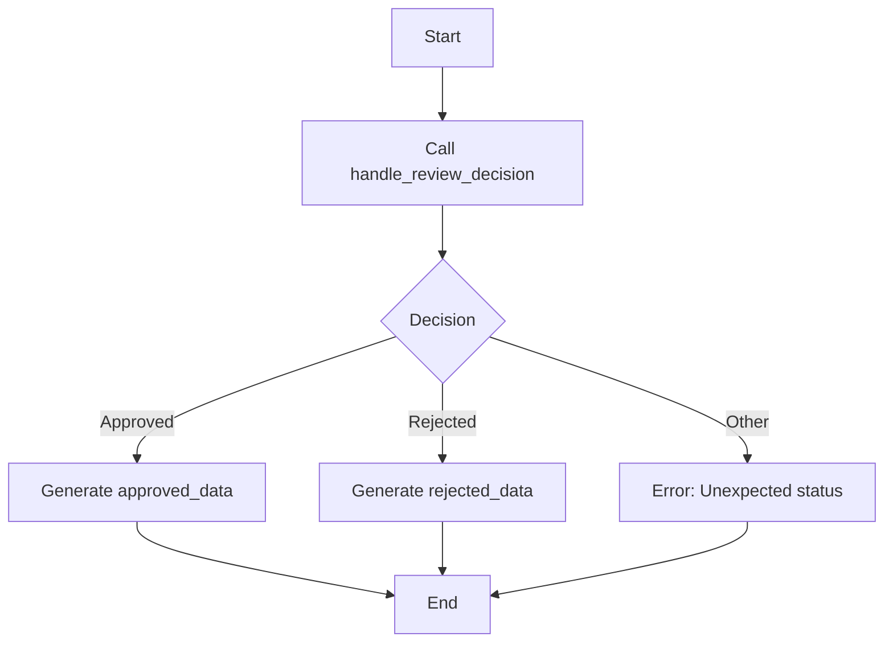
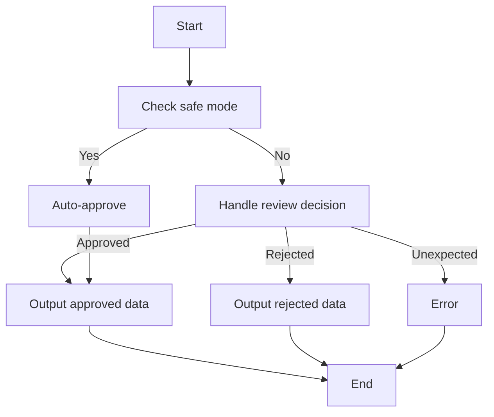

# `.\AutoGPT\autogpt_platform\backend\backend\blocks\human_in_the_loop.py` 详细设计文档

The code defines a HumanInTheLoopBlock class that handles human review and approval of data in a workflow. It creates a pending review entry and waits for human intervention before proceeding.

## 整体流程



## 类结构

```
HumanInTheLoopBlock (具体类)
├── Block (抽象基类)
```

## 全局变量及字段


### `logger`
    
Logger instance for logging messages within the module

类型：`logging.Logger`
    


### `HumanInTheLoopBlock.id`
    
Unique identifier for the block

类型：`str`
    


### `HumanInTheLoopBlock.description`
    
Description of the block's purpose

类型：`str`
    


### `HumanInTheLoopBlock.categories`
    
Categories to which the block belongs

类型：`set[backend.data.block.BlockCategory]`
    


### `HumanInTheLoopBlock.input_schema`
    
Input schema for the block

类型：`backend.data.block.BlockSchemaInput`
    


### `HumanInTheLoopBlock.output_schema`
    
Output schema for the block

类型：`backend.data.block.BlockSchemaOutput`
    


### `HumanInTheLoopBlock.block_type`
    
Type of the block

类型：`backend.data.block.BlockType`
    


### `HumanInTheLoopBlock.test_input`
    
Test input data for the block

类型：`dict[str, Any]`
    


### `HumanInTheLoopBlock.test_output`
    
Test output data for the block

类型：`list[tuple[str, Any]]`
    


### `HumanInTheLoopBlock.test_mock`
    
Test mock data for the block

类型：`dict[str, Any]`
    


### `Block.id`
    
Unique identifier for the block

类型：`str`
    


### `Block.description`
    
Description of the block's purpose

类型：`str`
    


### `Block.categories`
    
Categories to which the block belongs

类型：`set[backend.data.block.BlockCategory]`
    


### `Block.input_schema`
    
Input schema for the block

类型：`backend.data.block.BlockSchemaInput`
    


### `Block.output_schema`
    
Output schema for the block

类型：`backend.data.block.BlockSchemaOutput`
    


### `Block.block_type`
    
Type of the block

类型：`backend.data.block.BlockType`
    


### `Block.test_input`
    
Test input data for the block

类型：`dict[str, Any]`
    


### `Block.test_output`
    
Test output data for the block

类型：`list[tuple[str, Any]]`
    


### `Block.test_mock`
    
Test mock data for the block

类型：`dict[str, Any]`
    
    

## 全局函数及方法


### HITLReviewHelper.handle_review_decision

This function handles the review decision for a human-in-the-loop (HITL) block. It processes the review decision and returns a decision object containing the result and any message.

参数：

- `input_data`：`Any`，The data to be reviewed by a human user
- `user_id`：`str`，The ID of the user making the review decision
- `node_id`：`str`，The ID of the node being reviewed
- `node_exec_id`：`str`，The execution ID of the node being reviewed
- `graph_exec_id`：`str`，The execution ID of the graph containing the node
- `graph_id`：`str`，The ID of the graph containing the node
- `graph_version`：`int`，The version of the graph containing the node
- `block_name`：`str`，The name of the block being reviewed
- `editable`：`bool`，Whether the data is editable by the reviewer

返回值：`ReviewDecision`，A decision object containing the result of the review and any message

#### 流程图



#### 带注释源码

```python
async def handle_review_decision(self, **kwargs):
    # Extract parameters from kwargs
    input_data = kwargs.get('input_data')
    user_id = kwargs.get('user_id')
    node_id = kwargs.get('node_id')
    node_exec_id = kwargs.get('node_exec_id')
    graph_exec_id = kwargs.get('graph_exec_id')
    graph_id = kwargs.get('graph_id')
    graph_version = kwargs.get('graph_version')
    block_name = kwargs.get('block_name')
    editable = kwargs.get('editable')

    # Process the review decision
    decision = await self.process_review_decision(input_data, user_id, node_id, node_exec_id, graph_exec_id, graph_id, graph_version, block_name, editable)

    return decision
```


### HumanInTheLoopBlock.__init__

This method initializes the `HumanInTheLoopBlock` class by setting up its properties and configurations.

参数：

- 无

返回值：无

#### 流程图



#### 带注释源码

```python
def __init__(self):
    super().__init__(
        id="8b2a7b3c-6e9d-4a5f-8c1b-2e3f4a5b6c7d",
        description="Pause execution and wait for human approval or modification of data",
        categories={BlockCategory.BASIC},
        input_schema=HumanInTheLoopBlock.Input,
        output_schema=HumanInTheLoopBlock.Output,
        block_type=BlockType.HUMAN_IN_THE_LOOP,
        test_input={
            "data": {"name": "John Doe", "age": 30},
            "name": "User profile data",
            "editable": True,
        },
        test_output=[
            ("approved_data", {"name": "John Doe", "age": 30}),
        ],
        test_mock={
            "handle_review_decision": lambda **kwargs: type(
                "ReviewDecision",
                (),
                {
                    "should_proceed": True,
                    "message": "Test approval message",
                    "review_result": ReviewResult(
                        data={"name": "John Doe", "age": 30},
                        status=ReviewStatus.APPROVED,
                        message="",
                        processed=False,
                        node_exec_id="test-node-exec-id",
                    ),
                },
            )(),
        },
    )
```


### HumanInTheLoopBlock.handle_review_decision

This method handles the review decision made by a human user for the data being reviewed.

参数：

- `**kwargs`：`Any`，Contains additional keyword arguments that are passed to the HITLReviewHelper.handle_review_decision method.

返回值：`BlockOutput`，A BlockOutput object containing the result of the review decision.

#### 流程图



#### 带注释源码

```python
async def handle_review_decision(self, **kwargs):
    return await HITLReviewHelper.handle_review_decision(**kwargs)
```


### HumanInTheLoopBlock.run

This method runs the HumanInTheLoopBlock, which pauses execution and waits for human approval or modification of the data.

参数：

- `input_data`：`Input`，The data to be reviewed by a human user
- `user_id`：`str`，The ID of the user performing the review
- `node_id`：`str`，The ID of the node where the review is taking place
- `node_exec_id`：`str`，The execution ID of the node
- `graph_exec_id`：`str`，The execution ID of the graph
- `graph_id`：`str`，The ID of the graph
- `graph_version`：`int`，The version of the graph
- `execution_context`：`ExecutionContext`，The execution context of the block

返回值：`BlockOutput`，The output of the block, which includes the approved or rejected data and any review messages

#### 流程图



#### 带注释源码

```python
async def run(
    self,
    input_data: Input,
    *,
    user_id: str,
    node_id: str,
    node_exec_id: str,
    graph_exec_id: str,
    graph_id: str,
    graph_version: int,
    execution_context: ExecutionContext,
    **_kwargs,
) -> BlockOutput:
    if not execution_context.human_in_the_loop_safe_mode:
        logger.info(
            f"HITL block skipping review for node {node_exec_id} - safe mode disabled"
        )
        yield "approved_data", input_data.data
        yield "review_message", "Auto-approved (safe mode disabled)"
        return

    decision = await self.handle_review_decision(
        input_data=input_data.data,
        user_id=user_id,
        node_id=node_id,
        node_exec_id=node_exec_id,
        graph_exec_id=graph_exec_id,
        graph_id=graph_id,
        graph_version=graph_version,
        block_name=input_data.name,  # Use user-provided name instead of block type
        editable=input_data.editable,
    )

    if decision is None:
        return

    status = decision.review_result.status
    if status == ReviewStatus.APPROVED:
        yield "approved_data", decision.review_result.data
    elif status == ReviewStatus.REJECTED:
        yield "rejected_data", decision.review_result.data
    else:
        raise RuntimeError(f"Unexpected review status: {status}")

    if decision.message:
        yield "review_message", decision.message
```


## 关键组件


### 张量索引与惰性加载

用于在数据块中实现张量索引和惰性加载，以提高数据处理效率和内存使用。

### 反量化支持

提供对反量化操作的支持，允许在数据块中对量化数据进行反量化处理。

### 量化策略

定义了量化策略，用于在数据块中实现数据量化，以减少模型大小和提高推理速度。


## 问题及建议


### 已知问题

-   **代码重复性**：`handle_review_decision` 方法在 `HumanInTheLoopBlock` 类中被调用，但该方法的具体实现位于 `HITLReviewHelper` 类中。如果 `HITLReviewHelper` 的实现发生变化，需要确保在两个地方都进行了相应的更新，这可能导致代码维护困难。
-   **异常处理**：代码中使用了 `RuntimeError` 来处理意外的审查状态，但没有提供更详细的异常处理逻辑。如果需要处理更多的异常情况，可能需要扩展异常处理机制。
-   **日志记录**：日志记录主要集中在信息级别，对于调试和错误追踪可能不够详细。可以考虑增加更详细的日志记录，例如在关键步骤记录调试信息或错误信息。
-   **代码注释**：虽然类和方法都有描述，但源代码中缺少对复杂逻辑或关键步骤的详细注释，这可能会影响代码的可读性和可维护性。

### 优化建议

-   **提取公共逻辑**：将 `handle_review_decision` 方法从 `HITLReviewHelper` 移到 `HumanInTheLoopBlock` 类中，并确保在两个地方同步更新，以减少代码重复性。
-   **增强异常处理**：为可能出现的异常情况添加更详细的异常处理逻辑，例如捕获特定类型的异常并提供相应的错误信息。
-   **改进日志记录**：增加更详细的日志记录，特别是在关键步骤和异常处理中，以便于调试和错误追踪。
-   **添加代码注释**：在代码中添加必要的注释，特别是对于复杂的逻辑和关键步骤，以提高代码的可读性和可维护性。
-   **考虑使用状态机**：如果 `HumanInTheLoopBlock` 的状态变化较为复杂，可以考虑使用状态机来管理状态转换，以提高代码的可读性和可维护性。
-   **安全模式检查**：在安全模式下自动批准数据可能存在安全风险，应确保这种模式的使用是经过充分审查和授权的。


## 其它


### 设计目标与约束

- 设计目标：
  - 实现一个能够暂停执行流程并等待人工审核或修改数据的模块。
  - 确保数据在人工审核通过后才能继续执行流程。
  - 提供灵活的配置选项，允许用户自定义数据名称和编辑权限。
- 约束：
  - 必须与现有的数据模型和执行上下文兼容。
  - 必须在安全模式下允许自动通过审核，以避免不必要的等待。

### 错误处理与异常设计

- 错误处理：
  - 当遇到意外的审核状态时，抛出`RuntimeError`异常。
  - 记录错误日志，以便于问题追踪和调试。
- 异常设计：
  - 异常处理应遵循PEP 8指南，确保代码的可读性和一致性。

### 数据流与状态机

- 数据流：
  - 输入数据通过`handle_review_decision`函数进行审核。
  - 根据审核结果，输出数据或抛出异常。
- 状态机：
  - 执行状态包括：待审核（REVIEW）、审核通过（APPROVED）、审核拒绝（REJECTED）。

### 外部依赖与接口契约

- 外部依赖：
  - `HITLReviewHelper`：处理审核决策。
  - `Block`、`BlockCategory`、`BlockOutput`、`BlockSchemaInput`、`BlockSchemaOutput`、`BlockType`：数据模型和执行上下文。
- 接口契约：
  - `handle_review_decision`函数应返回一个包含审核结果的决策对象。
  - `run`方法应处理审核结果并输出相应的数据或消息。


    