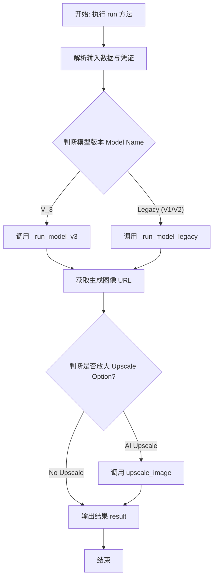
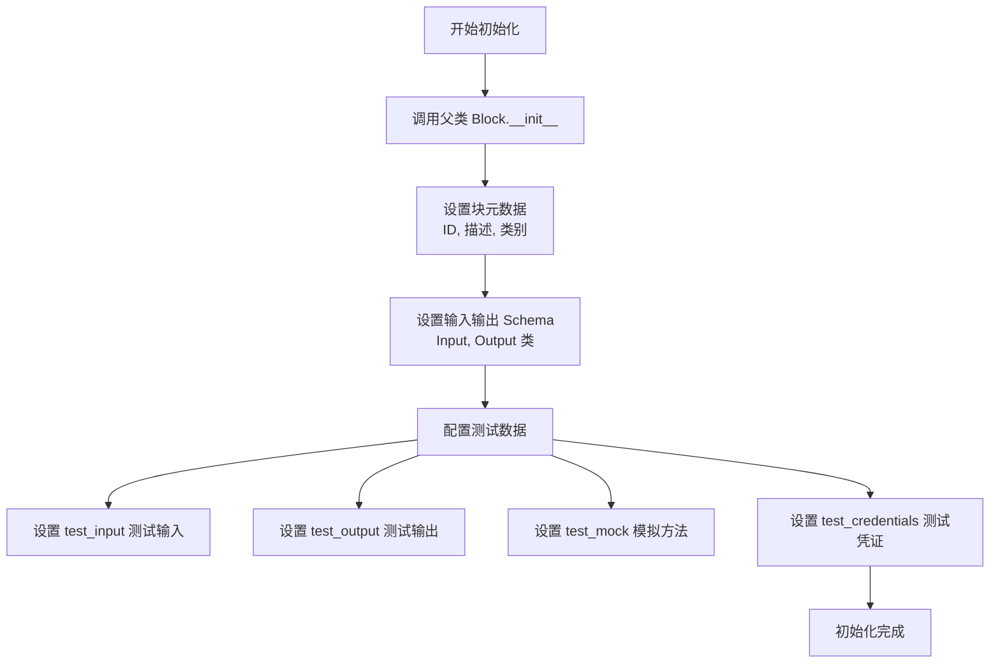
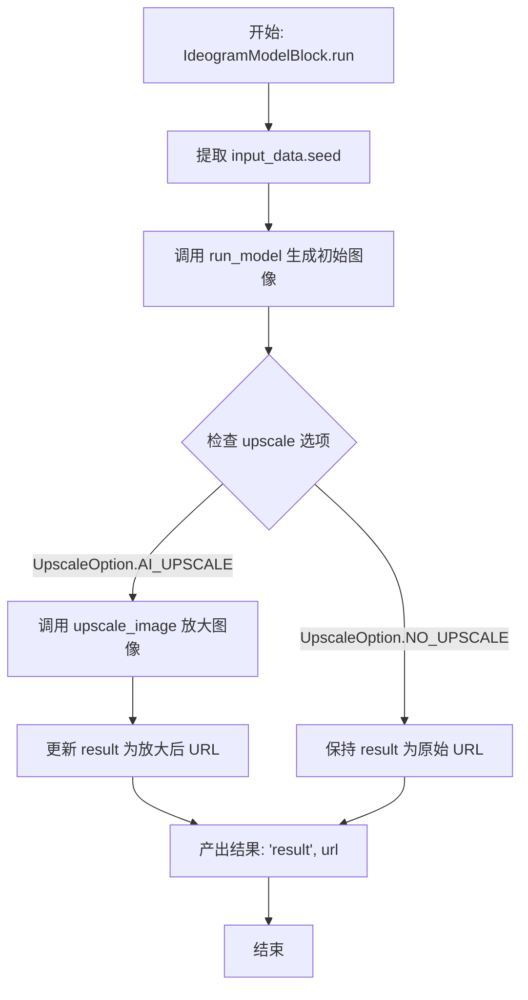
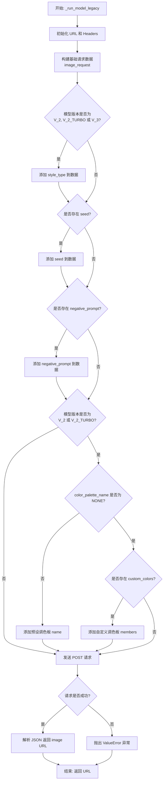

# `AutoGPT\autogpt_platform\backend\backend\blocks\ideogram.py` 详细设计文档

该代码定义了一个用于集成 Ideogram AI 图像生成服务的自定义 Block，支持 V1/V2/V3 等多种模型版本，提供图像生成、放大、风格选择、长宽比调整及自定义配色等丰富功能，并封装了与外部 API 的交互逻辑。

## 整体流程



## 类结构

```
IdeogramModelBlock (继承 Block)
├── Input (继承 BlockSchemaInput)
└── Output (继承 BlockSchemaOutput)

Global Enums (枚举类):
├── IdeogramModelName
├── MagicPromptOption
├── StyleType
├── ColorPalettePreset
├── AspectRatio
└── UpscaleOption
```

## 全局变量及字段


### `TEST_CREDENTIALS`
    
Mock credentials object containing a fake API key for testing the Ideogram integration.

类型：`APIKeyCredentials`
    


### `TEST_CREDENTIALS_INPUT`
    
Dictionary representation of the mock credentials used as input for test scenarios.

类型：`dict`
    


### `IdeogramModelBlock.Input.credentials`
    
The Ideogram integration can be used with any API key with sufficient permissions for the blocks it is used on.

类型：`CredentialsMetaInput[Literal[ProviderName.IDEOGRAM], Literal["api_key"]]`
    


### `IdeogramModelBlock.Input.prompt`
    
Text prompt for image generation.

类型：`str`
    


### `IdeogramModelBlock.Input.ideogram_model_name`
    
The name of the Image Generation Model, e.g., V_3.

类型：`IdeogramModelName`
    


### `IdeogramModelBlock.Input.aspect_ratio`
    
Aspect ratio for the generated image.

类型：`AspectRatio`
    


### `IdeogramModelBlock.Input.upscale`
    
Upscale the generated image.

类型：`UpscaleOption`
    


### `IdeogramModelBlock.Input.magic_prompt_option`
    
Whether to use MagicPrompt for enhancing the request.

类型：`MagicPromptOption`
    


### `IdeogramModelBlock.Input.seed`
    
Random seed. Set for reproducible generation.

类型：`Optional[int]`
    


### `IdeogramModelBlock.Input.style_type`
    
Style type to apply, applicable for V_2 and above.

类型：`StyleType`
    


### `IdeogramModelBlock.Input.negative_prompt`
    
Description of what to exclude from the image.

类型：`Optional[str]`
    


### `IdeogramModelBlock.Input.color_palette_name`
    
Color palette preset name, choose 'None' to skip.

类型：`ColorPalettePreset`
    


### `IdeogramModelBlock.Input.custom_color_palette`
    
Only available for model version V_2 or V_2_TURBO. Provide one or more color hex codes to define a custom color palette.

类型：`Optional[list[str]]`
    


### `IdeogramModelBlock.Output.result`
    
Generated image URL.

类型：`str`
    


### `IdeogramModelName.V3`
    
Ideogram model version V_3.

类型：`IdeogramModelName`
    


### `IdeogramModelName.V2`
    
Ideogram model version V_2.

类型：`IdeogramModelName`
    


### `IdeogramModelName.V1`
    
Ideogram model version V_1.

类型：`IdeogramModelName`
    


### `IdeogramModelName.V1_TURBO`
    
Ideogram model version V_1_TURBO.

类型：`IdeogramModelName`
    


### `IdeogramModelName.V2_TURBO`
    
Ideogram model version V_2_TURBO.

类型：`IdeogramModelName`
    


### `MagicPromptOption.AUTO`
    
Automatically determine whether to use Magic Prompt.

类型：`MagicPromptOption`
    


### `MagicPromptOption.ON`
    
Enable Magic Prompt.

类型：`MagicPromptOption`
    


### `MagicPromptOption.OFF`
    
Disable Magic Prompt.

类型：`MagicPromptOption`
    


### `StyleType.AUTO`
    
Automatically select the style type.

类型：`StyleType`
    


### `StyleType.GENERAL`
    
General style type.

类型：`StyleType`
    


### `StyleType.REALISTIC`
    
Realistic style type.

类型：`StyleType`
    


### `StyleType.DESIGN`
    
Design style type.

类型：`StyleType`
    


### `StyleType.RENDER_3D`
    
3D Render style type.

类型：`StyleType`
    


### `StyleType.ANIME`
    
Anime style type.

类型：`StyleType`
    


### `ColorPalettePreset.NONE`
    
No color palette preset selected.

类型：`ColorPalettePreset`
    


### `ColorPalettePreset.EMBER`
    
Ember color palette preset.

类型：`ColorPalettePreset`
    


### `ColorPalettePreset.FRESH`
    
Fresh color palette preset.

类型：`ColorPalettePreset`
    


### `ColorPalettePreset.JUNGLE`
    
Jungle color palette preset.

类型：`ColorPalettePreset`
    


### `ColorPalettePreset.MAGIC`
    
Magic color palette preset.

类型：`ColorPalettePreset`
    


### `ColorPalettePreset.MELON`
    
Melon color palette preset.

类型：`ColorPalettePreset`
    


### `ColorPalettePreset.MOSAIC`
    
Mosaic color palette preset.

类型：`ColorPalettePreset`
    


### `ColorPalettePreset.PASTEL`
    
Pastel color palette preset.

类型：`ColorPalettePreset`
    


### `ColorPalettePreset.ULTRAMARINE`
    
Ultramarine color palette preset.

类型：`ColorPalettePreset`
    


### `AspectRatio.ASPECT_10_16`
    
Aspect ratio 10:16.

类型：`AspectRatio`
    


### `AspectRatio.ASPECT_16_10`
    
Aspect ratio 16:10.

类型：`AspectRatio`
    


### `AspectRatio.ASPECT_9_16`
    
Aspect ratio 9:16.

类型：`AspectRatio`
    


### `AspectRatio.ASPECT_16_9`
    
Aspect ratio 16:9.

类型：`AspectRatio`
    


### `AspectRatio.ASPECT_3_2`
    
Aspect ratio 3:2.

类型：`AspectRatio`
    


### `AspectRatio.ASPECT_2_3`
    
Aspect ratio 2:3.

类型：`AspectRatio`
    


### `AspectRatio.ASPECT_4_3`
    
Aspect ratio 4:3.

类型：`AspectRatio`
    


### `AspectRatio.ASPECT_3_4`
    
Aspect ratio 3:4.

类型：`AspectRatio`
    


### `AspectRatio.ASPECT_1_1`
    
Aspect ratio 1:1.

类型：`AspectRatio`
    


### `AspectRatio.ASPECT_1_3`
    
Aspect ratio 1:3.

类型：`AspectRatio`
    


### `AspectRatio.ASPECT_3_1`
    
Aspect ratio 3:1.

类型：`AspectRatio`
    


### `UpscaleOption.AI_UPSCALE`
    
Use AI to upscale the generated image.

类型：`UpscaleOption`
    


### `UpscaleOption.NO_UPSCALE`
    
Do not upscale the generated image.

类型：`UpscaleOption`
    
    

## 全局函数及方法


### `IdeogramModelBlock.__init__`

初始化 `IdeogramModelBlock` 实例，配置块的唯一标识符、描述、分类、输入输出 Schema 以及用于测试环境的模拟数据、输入输出样本和凭证。

参数：

-  `self`：`IdeogramModelBlock`，类实例本身。

返回值：`None`，无返回值。

#### 流程图



#### 带注释源码

```python
def __init__(self):
    # 调用父类 Block 的初始化方法，传入定义块行为和结构的静态配置
    super().__init__(
        # 块的唯一标识符 (UUID)
        id="6ab085e2-20b3-4055-bc3e-08036e01eca6",
        # 块的功能描述，用于 UI 展示
        description="This block runs Ideogram models with both simple and advanced settings.",
        # 块所属的分类，标记为 AI 和多媒体
        categories={BlockCategory.AI, BlockCategory.MULTIMEDIA},
        # 定义输入数据的 Schema，关联内部类 Input
        input_schema=IdeogramModelBlock.Input,
        # 定义输出数据的 Schema，关联内部类 Output
        output_schema=IdeogramModelBlock.Output,
        # 定义用于测试的输入数据样例
        test_input={
            "ideogram_model_name": IdeogramModelName.V2,
            "prompt": "A futuristic cityscape at sunset",
            "aspect_ratio": AspectRatio.ASPECT_1_1,
            "upscale": UpscaleOption.NO_UPSCALE,
            "magic_prompt_option": MagicPromptOption.AUTO,
            "seed": None,
            "style_type": StyleType.AUTO,
            "negative_prompt": None,
            "color_palette_name": ColorPalettePreset.NONE,
            "custom_color_palette": [
                "#000030",
                "#1C0C47",
                "#9900FF",
                "#4285F4",
                "#FFFFFF",
            ],
            "credentials": TEST_CREDENTIALS_INPUT,
        },
        # 定义预期的测试输出结果
        test_output=[
            (
                "result",
                "https://ideogram.ai/api/images/test-generated-image-url.png",
            ),
        ],
        # 定义测试时的 Mock 行为，模拟 run_model 和 upscale_image 方法以避免真实 API 调用
        test_mock={
            "run_model": lambda api_key, model_name, prompt, seed, aspect_ratio, magic_prompt_option, style_type, negative_prompt, color_palette_name, custom_colors: "https://ideogram.ai/api/images/test-generated-image-url.png",
            "upscale_image": lambda api_key, image_url: "https://ideogram.ai/api/images/test-upscaled-image-url.png",
        },
        # 传递测试用的凭证对象
        test_credentials=TEST_CREDENTIALS,
    )
```


### `IdeogramModelBlock.run`

该方法是 `IdeogramModelBlock` 类的核心执行入口，负责协调 Ideogram AI 图像生成的完整流程。它根据输入的配置参数（如提示词、模型版本、宽高比等）调用 API 生成图像，并根据配置决定是否对生成的图像进行 AI 放大处理，最终返回图像的 URL。

参数：

-   `input_data`：`IdeogramModelBlock.Input`，包含模型生成的所有配置信息，如提示词、模型名称、宽高比、风格类型、提示词增强选项等。
-   `credentials`：`APIKeyCredentials`，用于身份验证的 API 凭证对象，包含访问 Ideogram API 所需的密钥。
-   `**kwargs`：`Any`，扩展用的额外关键字参数。

返回值：`BlockOutput`，一个异步生成器，产出包含生成结果键值对的数据（键名为 "result"，值为图像 URL）。

#### 流程图



#### 带注释源码

```python
    async def run(
        self, input_data: Input, *, credentials: APIKeyCredentials, **kwargs
    ) -> BlockOutput:
        # 获取随机种子，用于控制生成的随机性（如果提供）
        seed = input_data.seed

        # 步骤 1: 调用底层模型接口生成图像
        # 将输入的各种参数（模型、提示词、宽高比等）传递给 run_model 方法
        result = await self.run_model(
            api_key=credentials.api_key,
            model_name=input_data.ideogram_model_name.value,
            prompt=input_data.prompt,
            seed=seed,
            aspect_ratio=input_data.aspect_ratio.value,
            magic_prompt_option=input_data.magic_prompt_option.value,
            style_type=input_data.style_type.value,
            negative_prompt=input_data.negative_prompt,
            color_palette_name=input_data.color_palette_name.value,
            custom_colors=input_data.custom_color_palette,
        )

        # 步骤 2: 检查是否需要启用 AI 放大功能
        # 如果配置参数指定了 AI_UPSCALE，则调用 upscale_image 方法处理图像
        if input_data.upscale == UpscaleOption.AI_UPSCALE:
            result = await self.upscale_image(
                api_key=credentials.api_key,
                image_url=result,
            )

        # 产出最终结果，键名为 "result"，值为生成的（或放大后的）图像 URL
        yield "result", result
```


### `IdeogramModelBlock.run_model`

根据指定的模型名称（如 V3 或更早版本），路由调用不同的内部实现方法（`_run_model_v3` 或 `_run_model_legacy`）来生成图像，并返回生成图像的 URL。

参数：

- `api_key`：`SecretStr`，用于认证 Ideogram API 访问权限的密钥。
- `model_name`：`str`，目标图像生成模型的名称（例如 "V_3", "V_2"）。
- `prompt`：`str`，用于描述待生成图像内容的文本提示词。
- `seed`：`Optional[int]`，可选的随机种子，用于确保生成结果的可复现性。
- `aspect_ratio`：`str`，生成图像的宽高比（例如 "ASPECT_1_1"）。
- `magic_prompt_option`：`str`，是否使用 Magic Prompt 功能来增强提示词的选项（例如 "AUTO"）。
- `style_type`：`str`，应用于图像的艺术风格类型（例如 "REALISTIC"）。
- `negative_prompt`：`Optional[str]`，描述需要从图像中排除的内容的文本。
- `color_palette_name`：`str`，预设颜色调色板的名称，若为 "NONE" 则表示不使用预设。
- `custom_colors`：`Optional[list[str]]`，自定义颜色的十六进制代码列表，用于定义自定义调色板。

返回值：`str`，生成的图像 URL。

#### 流程图

```mermaid
graph TD
    A[开始: run_model] --> B{model_name == "V_3"?}
    B -- 是 --> C[调用 _run_model_v3<br>使用 V3 API 端点]
    B -- 否 --> D[调用 _run_model_legacy<br>使用旧版 API 端点]
    C --> E[返回生成结果 image_url]
    D --> E
    E --> F[结束]
```

#### 带注释源码

```python
    async def run_model(
        self,
        api_key: SecretStr,
        model_name: str,
        prompt: str,
        seed: Optional[int],
        aspect_ratio: str,
        magic_prompt_option: str,
        style_type: str,
        negative_prompt: Optional[str],
        color_palette_name: str,
        custom_colors: Optional[list[str]],
    ):
        # 根据模型名称决定调用哪个内部方法
        # V3 模型使用特定的 V3 端点，其他模型（V1, V2等）使用旧版端点
        # Use V3 endpoint for V3 model, legacy endpoint for others
        if model_name == "V_3":
            return await self._run_model_v3(
                api_key,
                prompt,
                seed,
                aspect_ratio,
                magic_prompt_option,
                style_type,
                negative_prompt,
                color_palette_name,
                custom_colors,
            )
        else:
            return await self._run_model_legacy(
                api_key,
                model_name,
                prompt,
                seed,
                aspect_ratio,
                magic_prompt_option,
                style_type,
                negative_prompt,
                color_palette_name,
                custom_colors,
            )
```


### `IdeogramModelBlock._run_model_v3`

该方法是 `IdeogramModelBlock` 类的内部异步方法，专门用于调用 Ideogram V3 版本的图像生成接口。它负责将输入的图像生成参数（如提示词、长宽比、种子等）转换为 V3 API 所需的格式，发送 HTTP POST 请求，并解析返回结果以获取生成的图像 URL。

参数：

- `api_key`: `SecretStr`，用于认证 Ideogram API 请求的密钥。
- `prompt`: `str`，用于生成图像的文本提示词。
- `seed`: `Optional[int]`，可选的随机种子，用于确保生成结果的可复现性。
- `aspect_ratio`: `str`，内部定义的长宽比枚举值（如 "ASPECT_1_1"），需映射为 API 格式。
- `magic_prompt_option`: `str`，Magic Prompt 选项（如 "AUTO"），用于优化提示词。
- `style_type`: `str`，图像风格类型（如 "REALISTIC"）。
- `negative_prompt`: `Optional[str]`，可选的负面提示词，描述图像中不应出现的内容。
- `color_palette_name`: `str`，颜色预设名称（V3 中当前暂未使用）。
- `custom_colors`: `Optional[list[str]]`，自定义颜色十六进制代码列表（V3 中当前暂未使用）。

返回值：`str`，生成的图像 URL 地址。

#### 流程图

```mermaid
flowchart TD
    A[开始: _run_model_v3] --> B[设置 API URL 和请求头 Headers]
    B --> C[定义长宽比映射表 aspect_ratio_map]
    C --> D[映射 aspect_ratio 到 V3 格式<br/>获取 v3_aspect_ratio]
    D --> E[初始化请求数据字典 data<br/>包含 prompt, aspect_ratio, magic_prompt, style_type]
    E --> F{seed 是否为 None?}
    F -- 否 --> G[将 seed 添加到 data]
    F -- 是 --> H{negative_prompt 是否存在?}
    G --> H
    H -- 是 --> I[将 negative_prompt 添加到 data]
    H -- 否 --> J[发起异步 POST 请求<br/>Requests.post]
    I --> J
    J --> K{请求是否成功?}
    K -- 否 --> L[抛出 ValueError 异常]
    K -- 是 --> M[解析 JSON 响应<br/>提取 data[0].url]
    M --> N[返回图像 URL]
```

#### 带注释源码

```python
async def _run_model_v3(
    self,
    api_key: SecretStr,
    prompt: str,
    seed: Optional[int],
    aspect_ratio: str,
    magic_prompt_option: str,
    style_type: str,
    negative_prompt: Optional[str],
    color_palette_name: str,
    custom_colors: Optional[list[str]],
):
    # 定义 Ideogram V3 API 的端点 URL
    url = "https://api.ideogram.ai/v1/ideogram-v3/generate"
    
    # 设置请求头，包含 API 密钥和内容类型
    headers = {
        "Api-Key": api_key.get_secret_value(),  # 获取 SecretStr 中的实际密钥值
        "Content-Type": "application/json",
    }

    # 建立内部枚举值到 V3 API 所需格式的映射表
    aspect_ratio_map = {
        "ASPECT_10_16": "10x16",
        "ASPECT_16_10": "16x10",
        "ASPECT_9_16": "9x16",
        "ASPECT_16_9": "16x9",
        "ASPECT_3_2": "3x2",
        "ASPECT_2_3": "2x3",
        "ASPECT_4_3": "4x3",
        "ASPECT_3_4": "3x4",
        "ASPECT_1_1": "1x1",
        "ASPECT_1_3": "1x3",
        "ASPECT_3_1": "3x1",
        # V3 支持的额外比例
        "ASPECT_1_2": "1x2",
        "ASPECT_2_1": "2x1",
        "ASPECT_4_5": "4x5",
        "ASPECT_5_4": "5x4",
    }

    # 将输入的长宽比转换为 V3 格式，如果找不到则默认为 "1x1"
    v3_aspect_ratio = aspect_ratio_map.get(
        aspect_ratio, "1x1"
    )  # Default to 1x1 if not found

    # 构建 JSON 请求体数据
    data: Dict[str, Any] = {
        "prompt": prompt,
        "aspect_ratio": v3_aspect_ratio,
        "magic_prompt": magic_prompt_option,
        "style_type": style_type,
    }

    # 如果提供了随机种子，则添加到请求参数中
    if seed is not None:
        data["seed"] = seed

    # 如果提供了负面提示词，则添加到请求参数中
    if negative_prompt:
        data["negative_prompt"] = negative_prompt

    # 注意：V3 端点对调色板的支持可能不同，为避免错误，此处暂时忽略调色板参数

    try:
        # 使用异步请求工具发送 POST 请求
        response = await Requests().post(url, headers=headers, json=data)
        # 解析响应 JSON 并返回第一张图片的 URL
        return response.json()["data"][0]["url"]
    except Exception as e:
        # 捕获异常并抛出带有详细信息的 ValueError
        raise ValueError(f"Failed to fetch image with V3 endpoint: {e}") from e
```


### `IdeogramModelBlock._run_model_legacy`

该函数用于通过 Ideogram 的传统 API 端点生成图像，专为 V1、V2 及其 Turbo 版本模型设计。它根据模型版本动态构建请求载荷，处理不同的可选参数（如种子、负面提示词、风格类型及调色板），并通过 HTTP POST 请求获取生成的图像 URL。

参数：

-  `api_key`：`SecretStr`，用于认证的 Ideogram API 密钥
-  `model_name`：`str`，指定的图像生成模型名称（如 V_1, V_2）
-  `prompt`：`str`，用于生成图像的文本提示词
-  `seed`：`Optional[int]`，随机数种子，用于复现生成结果
-  `aspect_ratio`：`str`，生成图像的宽高比
-  `magic_prompt_option`：`str`，是否启用 Magic Prompt 提示词增强功能
-  `style_type`：`str`，应用于图像的艺术风格类型
-  `negative_prompt`：`Optional[str]`，描述图像中不希望出现的元素
-  `color_palette_name`：`str`，预设的颜色调色板名称
-  `custom_colors`：`Optional[list[str]]`，自定义颜色调色板的十六进制颜色代码列表

返回值：`str`，生成的图像 URL

#### 流程图



#### 带注释源码

```python
    async def _run_model_legacy(
        self,
        api_key: SecretStr,
        model_name: str,
        prompt: str,
        seed: Optional[int],
        aspect_ratio: str,
        magic_prompt_option: str,
        style_type: str,
        negative_prompt: Optional[str],
        color_palette_name: str,
        custom_colors: Optional[list[str]],
    ):
        # 定义传统 API 端点
        url = "https://api.ideogram.ai/generate"
        headers = {
            "Api-Key": api_key.get_secret_value(),
            "Content-Type": "application/json",
        }

        # 初始化请求数据结构，基础字段包含在 image_request 对象下
        data: Dict[str, Any] = {
            "image_request": {
                "prompt": prompt,
                "model": model_name,
                "aspect_ratio": aspect_ratio,
                "magic_prompt_option": magic_prompt_option,
            }
        }

        # 仅 V2, V2_TURBO, 和 V3 模型支持 style_type 参数
        if model_name in ["V_2", "V_2_TURBO", "V_3"]:
            data["image_request"]["style_type"] = style_type

        # 如果提供了随机种子，添加到请求中
        if seed is not None:
            data["image_request"]["seed"] = seed

        # 如果提供了负面提示词，添加到请求中
        if negative_prompt:
            data["image_request"]["negative_prompt"] = negative_prompt

        # 仅 V2 和 V2_TURBO 模型支持颜色调色板
        if model_name in ["V_2", "V_2_TURBO"]:
            if color_palette_name != "NONE":
                # 使用预设调色板
                data["color_palette"] = {"name": color_palette_name}
            elif custom_colors:
                # 使用自定义颜色列表
                data["color_palette"] = {
                    "members": [{"color_hex": color} for color in custom_colors]
                }

        try:
            # 发送 POST 请求到 Ideogram API
            response = await Requests().post(url, headers=headers, json=data)
            # 解析响应并返回图片 URL
            return response.json()["data"][0]["url"]
        except Exception as e:
            # 捕获异常并抛出带有描述性信息的 ValueError
            raise ValueError(f"Failed to fetch image with legacy endpoint: {e}") from e
```


### `IdeogramModelBlock.upscale_image`

该方法负责通过 Ideogram API 对指定 URL 的图片进行放大处理。它首先下载原始图片内容，然后将图片作为文件上传至 Ideogram 的放大接口，最终返回放大后的图片 URL。

参数：

-  `api_key`：`SecretStr`，用于鉴权的 Ideogram API 密钥。
-  `image_url`：`str`，需要进行放大处理的原始图片 URL。

返回值：`str`，经过 Ideogram API 放大处理后的图片 URL。

#### 流程图

```mermaid
flowchart TD
    Start([开始]) --> InitHeaders[初始化请求头: Api-Key]
    InitHeaders --> DownloadImage[发送 GET 请求下载 image_url 图片]
    DownloadImage --> ExtractContent[获取图片二进制内容 image_content]
    ExtractContent --> PrepareFormData[构建 multipart/form-data: image_file 与 image_request]
    PrepareFormData --> PostUpscale[发送 POST 请求到 api.ideogram.ai/upscale]
    PostUpscale --> CheckError{请求成功?}
    CheckError -- 否 --> RaiseException[抛出 ValueError: Failed to upscale image]
    CheckError -- 是 --> ParseResponse[解析 JSON 响应]
    ParseResponse --> ExtractUrl[提取 data[0]['url']]
    ExtractUrl --> End([返回放大后图片 URL])

    style Start fill:#e1f5fe,stroke:#01579b
    style End fill:#e1f5fe,stroke:#01579b
    style RaiseException fill:#ffebee,stroke:#b71c1c
```

#### 带注释源码

```python
    async def upscale_image(self, api_key: SecretStr, image_url: str):
        # 定义 Ideogram 放大接口的 URL
        url = "https://api.ideogram.ai/upscale"
        # 设置请求头，包含 API 密钥用于鉴权
        headers = {
            "Api-Key": api_key.get_secret_value(),
        }

        try:
            # 步骤 1: 根据传入的 image_url 下载原始图片
            response = await Requests().get(image_url)
            # 获取图片的二进制内容
            image_content = response.content

            # 步骤 2: 将下载的图片发送到放大 API
            # 构造上传文件的数据结构
            files = {
                "image_file": ("image.png", image_content, "image/png"),
            }

            # 发起 POST 请求
            # headers 包含鉴权信息
            # data 包含 API 要求的 image_request 字段（此处设为空 JSON 字符串）
            # files 包含要处理的图片文件
            response = await Requests().post(
                url,
                headers=headers,
                data={"image_request": "{}"},
                files=files,
            )

            # 步骤 3: 解析响应并返回图片 URL
            # 响应结构通常为 { "data": [ { "url": "..." } ] }
            return (response.json())["data"][0]["url"]

        except Exception as e:
            # 捕获过程中发生的任何异常，并包装为 ValueError 抛出
            raise ValueError(f"Failed to upscale image: {e}") from e
```


## 关键组件


### IdeogramModelBlock

封装了 Ideogram 图像生成与放大功能的主业务块，继承自 Block，负责定义输入输出数据契约、处理 API 凭证验证，并协调整体异步工作流。

### Configuration Enums

定义了模型支持的参数域的配置层，包含 `IdeogramModelName`、`StyleType`、`AspectRatio` 等枚举，用于约束输入参数（如模型版本、风格类型、色彩预设）并提供类型安全的选项。

### API Versioning Strategy

实现了多版本 API 兼容的适配层，包含 `run_model` 路由方法及 `run_model_v3`、`run_model_legacy` 具体实现，负责根据模型版本选择对应的端点、处理请求体结构差异（扁平 JSON vs 嵌套 JSON）及参数兼容性。

### Image Upscaling Pipeline

独立的图像后处理流程，封装在 `upscale_image` 方法中，负责从生成的 URL 下载原始图像的二进制数据，并通过 multipart/form-data 格式将其上传至专用的放大端点以获取高分辨率图像链接。


## 问题及建议


### 已知问题

-   **V3模型功能缺失**：代码中明确注释了 `# Note: V3 endpoint may have different color palette support. For now, we'll omit color palettes for V3 to avoid errors`，导致在V3模型上调色板功能完全不可用，尽管输入参数允许传入。
-   **异常捕获过于宽泛**：在 `_run_model_v3`、`_run_model_legacy` 和 `upscale_image` 方法中，均使用了 `except Exception as e`。这种做法会掩盖具体的网络错误、API返回的错误状态码或JSON解析错误，不利于问题排查和定位。
-   **API响应解析缺乏健壮性检查**：代码直接通过 `response.json()["data"][0]["url"]` 访问数据，未检查 `data` 数组是否为空或 `url` 键是否存在。如果API返回结构变化或生成失败，将导致未处理的 `KeyError` 或 `IndexError`。
-   **Lambda函数可能导致序列化问题**：在 `__init__` 方法中使用了 `lambda` 函数作为 `test_mock` 的值。如果该 `Block` 对象需要被序列化（例如被传递到其他进程或用于持久化），lambda 函数通常无法被 pickle 序列化，从而导致运行时错误。

### 优化建议

-   **细化异常处理逻辑**：建议捕获具体的异常类型，例如网络请求异常、JSON解码异常和键值异常。针对API返回的错误信息（如HTTP 4xx/5xx），应将其转化为具体的业务错误信息返回给用户，而不是直接抛出通用的 `ValueError`。
-   **模型版本特性检查逻辑去重**：目前 `_run_model_legacy` 中通过硬编码列表（如 `if model_name in ["V_2", "V_2_TURBO"]`）来判断特性支持。建议将模型版本与其支持的特性（如 `style_type`, `color_palette`）映射为字典或配置对象，以提高代码的可维护性和扩展性。
-   **增强输入参数验证**：对于 `custom_color_palette` 参数，目前仅通过类型注解为 `Optional[list[str]]`，建议增加正则校验，确保传入的字符串符合十六进制颜色代码格式（如 `^#[0-9A-Fa-f]{6}$`），提前拦截无效请求。
-   **优化大图处理的内存占用**：在 `upscale_image` 方法中，通过 `response.content` 将整个图像文件加载到内存中再上传。对于大尺寸图像或高并发场景，这可能导致内存峰值过高。建议评估API是否支持直接传入URL进行放大，或者使用流式上传处理图像数据。
-   **提取硬编码配置**：将 API URL（如 `https://api.ideogram.ai/...`）和 Aspect Ratio 的映射字典提取为类常量或配置文件，便于统一管理和未来的端点变更。


## 其它


### 设计目标与约束

**设计目标：**
1.  **功能封装**：将 Ideogram AI 的图像生成功能封装为统一的 `Block` 组件，使其能够在自动化工作流中被复用。
2.  **多版本兼容**：同时支持 Ideogram 的最新 V3 模型版本和旧版模型，通过内部路由机制自动适配不同的 API 端点和请求格式。
3.  **配置灵活性**：提供丰富的参数配置（如提示词、风格、尺寸、种子、负向提示词、调色板等），支持从简单到复杂的图像生成需求。
4.  **后处理集成**：集成图像放大功能，允许用户在生成后直接对图像进行 AI 增强处理。

**约束：**
1.  **异步执行**：所有网络请求必须使用 `async/await` 模式，以避免阻塞主线程，符合底层架构的异步 I/O 要求。
2.  **输入验证**：必须严格遵循 `BlockSchemaInput` 定义的类型和格式，利用 Pydantic 进行数据校验。
3.  **凭据安全**：API Key 必须通过 `SecretStr` 类型处理，防止在日志或内存转储中泄露敏感信息。
4.  **API 差异处理**：必须处理不同模型版本之间参数支持的差异（如 V1 不支持 style_type，V3 暂不支持调色板），代码需包含相应的逻辑判断。

### 错误处理与异常设计

**错误处理策略：**
1.  **网络异常捕获**：在与外部 Ideogram API 交互（`_run_model_v3`、`_run_model_legacy`、`upscale_image`）时，捕获通用的 `Exception`。
2.  **异常转换与包装**：将底层的网络错误或 API 错误转换为 `ValueError`，并附加描述性上下文信息（如 "Failed to fetch image with V3 endpoint"），以便上层调用者能快速定位问题来源。
3.  **失败快速机制**：一旦发生错误，立即抛出异常并中断当前 Block 的执行，不进行重试（重试逻辑通常由上层调度器或工作流引擎处理）。

**关键异常点：**
*   **图像生成阶段**：若 V3 或 Legacy 端点返回非 200 状态码或响应 JSON 解析失败，抛出 `ValueError`。
*   **图像放大阶段**：若下载原始图像失败或上传至放大接口失败，抛出 `ValueError`。

### 数据流与状态机

**整体数据流向：**
1.  **输入阶段**：工作流引擎传入包含 `credentials` 和生成参数的 `input_data`。
2.  **路由阶段**：`run` 方法调用 `run_model`，根据 `ideogram_model_name` 判断分发至 `_run_model_v3` 或 `_run_model_legacy`。
3.  **请求构建阶段**：
    *   **V3 路径**：映射宽高比格式，构建扁平化 JSON 请求体。
    *   **Legacy 路径**：构建嵌套的 `image_request` JSON 结构，根据模型版本动态添加 `style_type` 和 `color_palette`。
4.  **生成阶段**：发送 HTTP POST 请求到 Ideogram API，解析返回的 JSON 提取 `url`。
5.  **后处理阶段（条件分支）**：如果 `upscale` 选项为 `AI_UPSCALE`，则进入 `upscale_image` 流程：先下载图片二进制流，再通过 multipart/form-data 上传至放大接口。
6.  **输出阶段**：通过 `yield` 生成最终的图像 URL。

**状态机特性：**
该组件是无状态的，每次执行 `run` 方法都是独立的，不依赖于前一次执行的结果（除了传入的参数）。内部逻辑主要是决策树结构（选择 V3/Legacy，是否放大）。

### 外部依赖与接口契约

**外部库依赖：**
*   `pydantic`: 用于数据模型验证（`SecretStr`, `BaseModel` 等）。
*   `backend.util.request.Requests`: 封装了异步 HTTP 客户端，用于执行 `get` 和 `post` 请求。
*   `backend.data.block`: 提供基础 Block 类定义。

**外部接口契约：**

1.  **Ideogram V3 生成接口**
    *   **Endpoint**: `POST https://api.ideogram.ai/v1/ideogram-v3/generate`
    *   **Headers**: `Api-Key` (string), `Content-Type: application/json`
    *   **Body (JSON)**:
        *   `prompt` (string): 必填。
        *   `aspect_ratio` (string): 格式如 "10x16"。
        *   `magic_prompt` (string): "AUTO"/"ON"/"OFF"。
        *   `style_type` (string): 风格类型。
        *   `seed` (int, optional): 随机种子。
        *   `negative_prompt` (string, optional): 负向提示词。
    *   **Response**: JSON 包含 `data` 数组，首元素包含 `url` 字段。

2.  **Ideogram Legacy 生成接口**
    *   **Endpoint**: `POST https://api.ideogram.ai/generate`
    *   **Headers**: `Api-Key` (string), `Content-Type: application/json`
    *   **Body (JSON)**:
        *   `image_request` (object): 包含 `prompt`, `model`, `aspect_ratio`, `magic_prompt_option`。
        *   `image_request.style_type` (string, optional): 仅限 V2/V2_TURBO。
        *   `color_palette` (object, optional): 包含 `name` 或 `members` 列表，仅限 V2/V2_TURBO。
    *   **Response**: JSON 包含 `data` 数组，首元素包含 `url` 字段。

3.  **Ideogram 放大接口**
    *   **Endpoint**: `POST https://api.ideogram.ai/upscale`
    *   **Headers**: `Api-Key` (string)
    *   **Body (Multipart/Form-Data)**:
        *   `image_request` (string): "{}" (空 JSON 字符串)。
        *   `image_file` (file): 二进制图像数据。
    *   **Response**: JSON 包含 `data` 数组，首元素包含放大后的 `url` 字段。

### 安全性与合规设计

1.  **敏感信息保护**：
    *   API Key 在传入时被封装为 `SecretStr` 对象。
    *   在发送请求前，通过 `api_key.get_secret_value()` 提取明文，仅在内存和网络传输中短暂存在，避免被意外打印到日志中。
2.  **输入验证**：
    *   利用 Pydantic 模型自动验证输入数据的类型和格式，防止注入非法参数导致 API 异常或系统崩溃。
    *   枚举类型（如 `IdeogramModelName`, `AspectRatio`）限制了用户输入的边界，防止调用不支持的 API 参数。
3.  **依赖安全性**：
    *   依赖内部的 `Requests` 工具类，该类通常封装了连接池管理和超时设置，防止因外部服务响应慢而导致资源耗尽。

    