# `AutoGPT\autogpt_platform\backend\backend\blocks\io.py` 详细设计文档

该代码定义了一系列用于工作流系统的输入和输出模块（Blocks），涵盖了通用输入输出、特定数据类型输入（文本、数字、日期等）以及针对文件、表格和Google Drive的高级输入处理。

## 整体流程

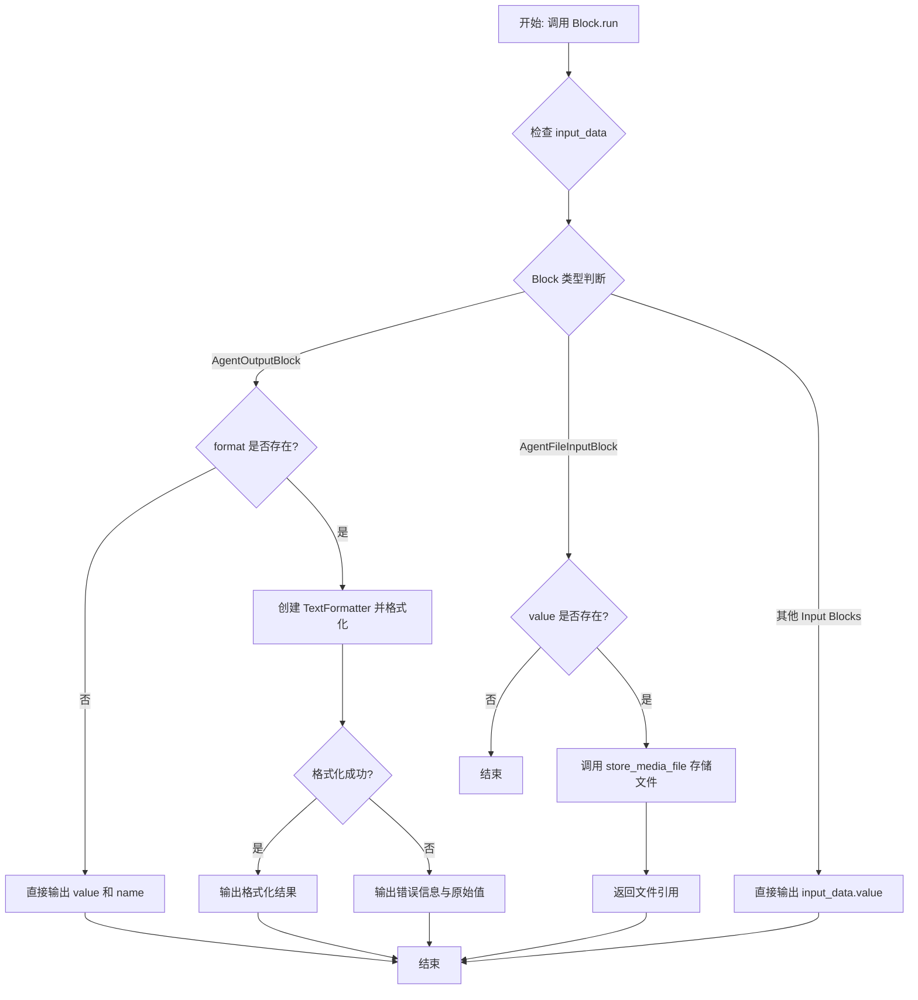

## 类结构

```
AgentInputBlock (输入基类)
├── AgentShortTextInputBlock (短文本输入)
├── AgentLongTextInputBlock (长文本输入)
├── AgentNumberInputBlock (数字输入)
├── AgentDateInputBlock (日期输入)
├── AgentTimeInputBlock (时间输入)
├── AgentFileInputBlock (文件输入)
├── AgentDropdownInputBlock (下拉选择输入)
├── AgentToggleInputBlock (布尔切换输入)
├── AgentTableInputBlock (表格数据输入)
└── AgentGoogleDriveFileInputBlock (Google Drive 文件选择)
AgentOutputBlock (输出基类)
```

## 全局变量及字段


### `config`
    
Global configuration object instance loaded from settings.

类型：`Config`
    


### `IO_BLOCK_IDs`
    
List containing the string IDs of all defined Agent Input and Output blocks.

类型：`list[str]`
    


### `AgentInputBlock.Input`
    
Input schema defining fields for generic agent input (name, value, description, etc.).

类型：`BlockSchemaInput`
    


### `AgentInputBlock.Output`
    
Output schema defining the result field for the generic agent input block.

类型：`BlockSchema`
    


### `AgentOutputBlock.Input`
    
Input schema defining fields for agent output recording (value, format, name, etc.).

类型：`BlockSchemaInput`
    


### `AgentOutputBlock.Output`
    
Output schema defining the formatted output and name fields.

类型：`BlockSchema`
    


### `AgentShortTextInputBlock.Input`
    
Input schema specialized for short text input, restricting the value type to ShortTextType.

类型：`BlockSchemaInput`
    


### `AgentShortTextInputBlock.Output`
    
Output schema defining the short text string result.

类型：`BlockSchema`
    


### `AgentLongTextInputBlock.Input`
    
Input schema specialized for long text input, restricting the value type to LongTextType.

类型：`BlockSchemaInput`
    


### `AgentLongTextInputBlock.Output`
    
Output schema defining the long text string result.

类型：`BlockSchema`
    


### `AgentNumberInputBlock.Input`
    
Input schema specialized for number input, restricting the value type to int.

类型：`BlockSchemaInput`
    


### `AgentNumberInputBlock.Output`
    
Output schema defining the integer number result.

类型：`BlockSchema`
    


### `AgentDateInputBlock.Input`
    
Input schema specialized for date input, restricting the value type to date.

类型：`BlockSchemaInput`
    


### `AgentDateInputBlock.Output`
    
Output schema defining the date object result.

类型：`BlockSchema`
    


### `AgentTimeInputBlock.Input`
    
Input schema specialized for time input, restricting the value type to time.

类型：`BlockSchemaInput`
    


### `AgentTimeInputBlock.Output`
    
Output schema defining the time object result.

类型：`BlockSchema`
    


### `AgentFileInputBlock.Input`
    
Input schema for file upload, including media file value and base64 encoding options.

类型：`BlockSchemaInput`
    


### `AgentFileInputBlock.Output`
    
Output schema defining the file reference/path string result.

类型：`BlockSchema`
    


### `AgentDropdownInputBlock.Input`
    
Input schema for dropdown selection, utilizing placeholder values as options.

类型：`BlockSchemaInput`
    


### `AgentDropdownInputBlock.Output`
    
Output schema defining the selected dropdown string value.

类型：`BlockSchema`
    


### `AgentToggleInputBlock.Input`
    
Input schema specialized for boolean toggle input.

类型：`BlockSchemaInput`
    


### `AgentToggleInputBlock.Output`
    
Output schema defining the boolean toggle result.

类型：`BlockSchema`
    


### `AgentTableInputBlock.Input`
    
Input schema for table data input, including column headers configuration and list of row data.

类型：`BlockSchemaInput`
    


### `AgentTableInputBlock.Output`
    
Output schema defining the table data as a list of dictionaries.

类型：`BlockSchema`
    


### `AgentGoogleDriveFileInputBlock.Input`
    
Input schema for Google Drive file selection, including picker view configurations and OAuth scopes.

类型：`BlockSchemaInput`
    


### `AgentGoogleDriveFileInputBlock.Output`
    
Output schema defining the selected Google Drive file metadata object.

类型：`BlockSchema`
    
    

## 全局函数及方法


### `AgentInputBlock.__init__`

该方法用于初始化 `AgentInputBlock` 类的实例，通过定义的配置字典设置块的 ID、描述、输入/输出模式、测试用例以及分类等元数据，并允许通过关键字参数覆盖或扩展父类的配置。

参数：

-  `self`：`AgentInputBlock`，类的实例本身。
-  `kwargs`：`dict`，传递给父类 `Block` 构造函数的额外关键字参数，用于覆盖或扩展配置。

返回值：`None`，Python 构造函数默认无返回值。

#### 流程图

```mermaid
graph TD
    A[开始 __init__] --> B[定义基础配置字典 id, description, schemas, test cases 等]
    B --> C[将 kwargs 合并到配置字典中]
    C --> D[调用 super().__init__ 传入合并后的配置]
    D --> E[结束]
```

#### 带注释源码

```python
def __init__(self, **kwargs):
    # 调用父类 Block 的初始化方法
    super().__init__(
        **{
            # 块的唯一标识符
            "id": "c0a8e994-ebf1-4a9c-a4d8-89d09c86741b",
            # 块的功能描述
            "description": "A block that accepts and processes user input values within a workflow, supporting various input types and validation.",
            # 指定输入数据的 Schema 类
            "input_schema": AgentInputBlock.Input,
            # 指定输出数据的 Schema 类
            "output_schema": AgentInputBlock.Output,
            # 定义测试输入数据集
            "test_input": [
                {
                    "value": "Hello, World!",
                    "name": "input_1",
                    "description": "Example test input.",
                    "placeholder_values": [],
                },
                {
                    "value": "Hello, World!",
                    "name": "input_2",
                    "description": "Example test input with placeholders.",
                    "placeholder_values": ["Hello, World!"],
                },
            ],
            # 定义预期的测试输出数据集
            "test_output": [
                ("result", "Hello, World!"),
                ("result", "Hello, World!"),
            ],
            # 定义块的所属分类 (输入类 和 基础类)
            "categories": {BlockCategory.INPUT, BlockCategory.BASIC},
            # 定义块的类型 (输入块)
            "block_type": BlockType.INPUT,
            # 指示输出是否静态 (不依赖动态执行逻辑)
            "static_output": True,
            # 解包传入的额外关键字参数，允许覆盖上述默认配置
            **kwargs,
        }
    )
```


### `AgentInputBlock.run`

该方法是 `AgentInputBlock` 的核心执行逻辑，负责接收输入数据，并在输入值不为空时将其作为结果输出。

参数：

-   `input_data`：`AgentInputBlock.Input`，包含输入值、名称、描述等元数据的输入对象。
-   `args`：`tuple`，额外的位置参数（通常由框架传递）。
-   `kwargs`：`dict`，额外的关键字参数（通常由框架传递）。

返回值：`BlockOutput`，一个异步生成器，产生包含键名 "result" 和对应输入值的元组。

#### 流程图

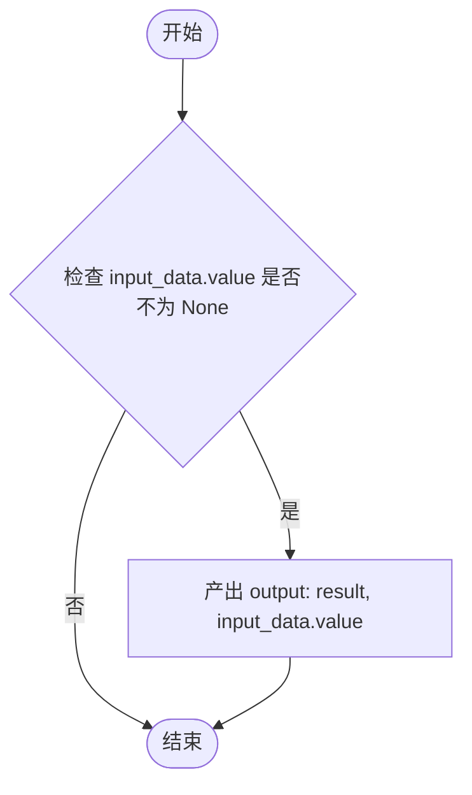

#### 带注释源码

```python
    async def run(self, input_data: Input, *args, **kwargs) -> BlockOutput:
        # 检查 input_data 中的 value 字段是否已赋值（不为 None）
        if input_data.value is not None:
            # 如果有效，产出键为 "result" 和对应的值
            yield "result", input_data.value
```


### `AgentOutputBlock.__init__`

初始化 `AgentOutputBlock` 实例，配置其用于记录和格式化工作流输出的元数据，包括唯一标识符、描述、输入输出 Schema、测试用例、分类及块类型。

参数：

-  `self`：`AgentOutputBlock`，类的实例本身

返回值：`None`，构造函数不返回任何值

#### 流程图

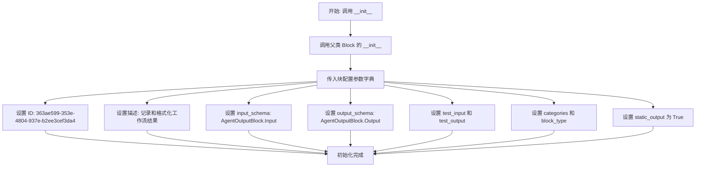

#### 带注释源码

```python
    def __init__(self):
        # 调用父类 Block 的初始化方法，传入定义好的配置字典
        super().__init__(
            # 块的唯一标识符
            id="363ae599-353e-4804-937e-b2ee3cef3da4",
            # 块的功能描述，用于向用户展示
            description="A block that records and formats workflow results for display to users, with optional Jinja2 template formatting support.",
            # 指定输入数据的 Schema 类，定义了输入字段结构
            input_schema=AgentOutputBlock.Input,
            # 指定输出数据的 Schema 类，定义了输出字段结构
            output_schema=AgentOutputBlock.Output,
            # 定义测试输入用例，用于验证或演示块的运行逻辑
            test_input=[
                {
                    "value": "Hello, World!",
                    "name": "output_1",
                    "description": "This is a test output.",
                    "format": "{{ output_1 }}!!",
                },
                {
                    "value": "42",
                    "name": "output_2",
                    "description": "This is another test output.",
                    "format": "{{ output_2 }}",
                },
                {
                    "value": MockObject(value="!!", key="key"),
                    "name": "output_3",
                    "description": "This is a test output with a mock object.",
                    "format": "{{ output_3 }}",
                },
            ],
            # 定义期望的测试输出结果，与 test_input 一一对应
            test_output=[
                ("output", "Hello, World!!!"),
                ("output", "42"),
                ("output", MockObject(value="!!", key="key")),
            ],
            # 设置块所属的分类，这里属于 OUTPUT 和 BASIC
            categories={BlockCategory.OUTPUT, BlockCategory.BASIC},
            # 定义块的类型为 OUTPUT
            block_type=BlockType.OUTPUT,
            # 标记为静态输出，意味着输出结构是固定的
            static_output=True,
        )
```


### `AgentOutputBlock.run`

该方法负责执行 Agent 输出块的核心逻辑。它会检查是否提供了格式化字符串（Jinja2 语法）。如果提供，则尝试使用 `TextFormatter` 对输入值进行格式化处理（支持 HTML 转义）；如果未提供或格式化失败，则直接输出原始值和输出名称。

参数：

-   `input_data`：`AgentOutputBlock.Input`，包含待输出的值、名称、格式化字符串以及是否转义 HTML 等配置信息的数据对象。
-   `*args`：`Any`，额外的位置参数（未在方法体中使用）。
-   `**kwargs`：`Any`，额外的关键字参数（未在方法体中使用）。

返回值：`BlockOutput`，一个生成器，用于产生包含输出键值对的元组，通常包含格式化后的或原始的值。

#### 流程图

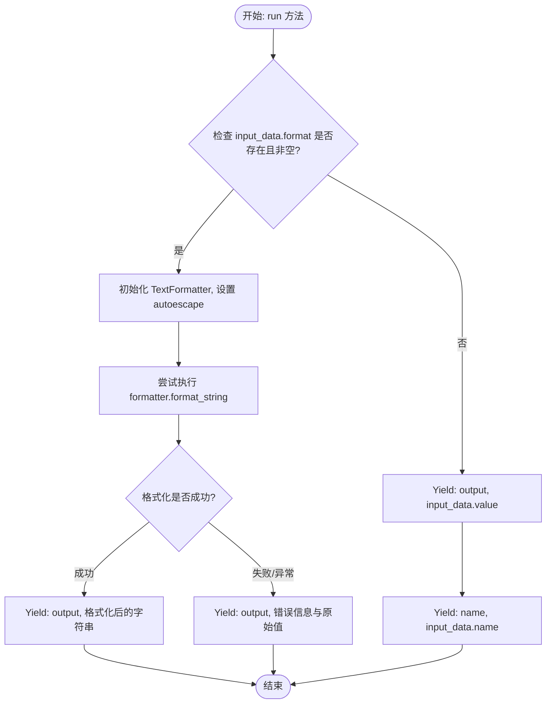

#### 带注释源码

```python
    async def run(self, input_data: Input, *args, **kwargs) -> BlockOutput:
        """
        Attempts to format the recorded_value using the fmt_string if provided.
        If formatting fails or no fmt_string is given, returns the original recorded_value.
        """
        # 检查是否提供了格式化字符串
        if input_data.format:
            try:
                # 创建文本格式化器，并根据输入配置决定是否自动转义 HTML 特殊字符
                formatter = TextFormatter(autoescape=input_data.escape_html)
                # 使用 Jinja2 语法格式化字符串，将 input_data.name 映射到 input_data.value
                yield "output", formatter.format_string(
                    input_data.format, {input_data.name: input_data.value}
                )
            except Exception as e:
                # 如果格式化过程中出现任何异常，捕获并输出包含错误信息的字符串
                yield "output", f"Error: {e}, {input_data.value}"
        else:
            # 如果没有提供格式化字符串，直接输出原始值
            yield "output", input_data.value
            # 同时输出该值的名称
            yield "name", input_data.name
```


### `AgentShortTextInputBlock.__init__`

初始化短文本输入块，配置特定的块ID、描述、输入输出Schema以及测试数据，并根据配置决定是否启用该块。

参数：

-   无

返回值：`None`，初始化过程不返回任何值。

#### 流程图

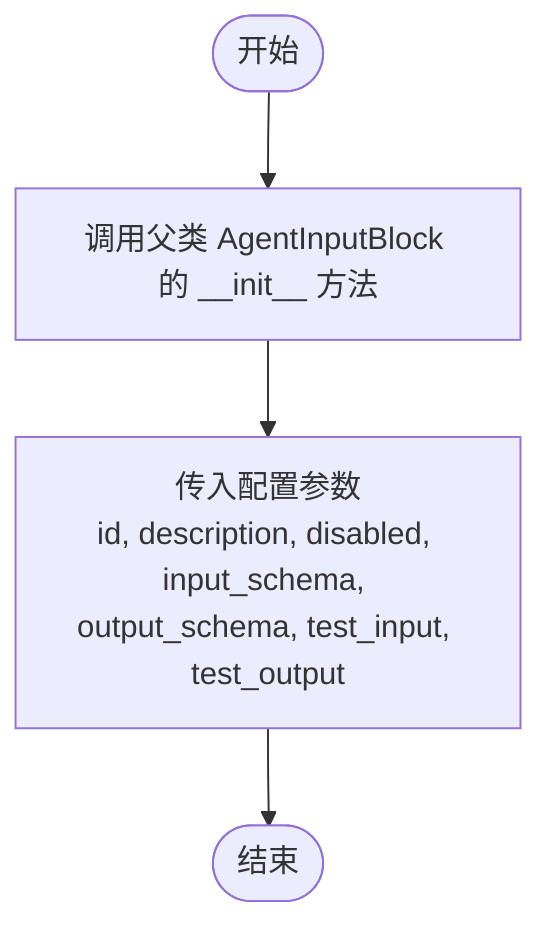

#### 带注释源码

```python
def __init__(self):
    # 调用父类 AgentInputBlock 的初始化方法
    super().__init__(
        # 设置该块的唯一标识符
        id="7fcd3bcb-8e1b-4e69-903d-32d3d4a92158",
        # 设置块的描述，说明这是用于单行短文本输入的块
        description="Block for short text input (single-line).",
        # 根据全局配置决定是否禁用该代理输入子类型块
        disabled=not config.enable_agent_input_subtype_blocks,
        # 指定输入数据模型为 AgentShortTextInputBlock 内部定义的 Input 类
        input_schema=AgentShortTextInputBlock.Input,
        # 指定输出数据模型为 AgentShortTextInputBlock 内部定义的 Output 类
        output_schema=AgentShortTextInputBlock.Output,
        # 定义用于测试的输入数据列表
        test_input=[
            {
                "value": "Hello",
                "name": "short_text_1",
                "description": "Short text example 1",
                "placeholder_values": [],
            },
            {
                "value": "Quick test",
                "name": "short_text_2",
                "description": "Short text example 2",
                "placeholder_values": ["Quick test", "Another option"],
            },
        ],
        # 定义期望的测试输出结果列表
        test_output=[
            ("result", "Hello"),
            ("result", "Quick test"),
        ],
    )
```


### `AgentLongTextInputBlock.__init__`

该方法是 `AgentLongTextInputBlock` 类的构造函数，负责初始化长文本输入块实例。它通过调用父类 `AgentInputBlock` 的构造函数，并传入特定的配置参数（如块ID、描述、输入输出模式、测试用例等），来定义该块的行为和元数据。

参数：

-   `self`：`AgentLongTextInputBlock`，表示类实例自身。

返回值：`None`，构造函数不返回任何值。

#### 流程图

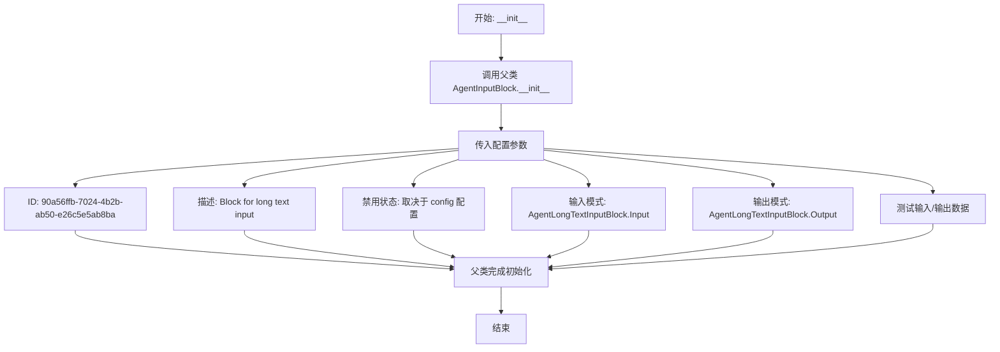

#### 带注释源码

```python
def __init__(self):
    # 调用父类 AgentInputBlock 的构造函数，传入具体的块配置
    super().__init__(
        **{
            # 块的唯一标识符
            "id": "90a56ffb-7024-4b2b-ab50-e26c5e5ab8ba",
            # 块的描述，说明该块用于多行文本输入
            "description": "Block for long text input (multi-line).",
            # 根据配置决定是否禁用该块（enable_agent_input_subtype_blocks）
            "disabled": not config.enable_agent_input_subtype_blocks,
            # 指定输入数据的 Schema 定义类
            "input_schema": AgentLongTextInputBlock.Input,
            # 指定输出数据的 Schema 定义类
            "output_schema": AgentLongTextInputBlock.Output,
            # 定义用于测试的输入数据列表
            "test_input": [
                {
                    "value": "Lorem ipsum dolor sit amet...",
                    "name": "long_text_1",
                    "description": "Long text example 1",
                    "placeholder_values": [],
                },
                {
                    "value": "Another multiline text input.",
                    "name": "long_text_2",
                    "description": "Long text example 2",
                    "placeholder_values": ["Another multiline text input."],
                },
            ],
            # 定义期望的测试输出结果列表
            "test_output": [
                ("result", "Lorem ipsum dolor sit amet..."),
                ("result", "Another multiline text input."),
            ],
        }
    )
```


### `AgentNumberInputBlock.__init__`

该方法是 `AgentNumberInputBlock` 类的构造函数，负责初始化数字输入块的元数据，包括唯一标识符、描述、输入输出 Schema 定义、测试用例以及根据配置决定是否禁用该块。

参数：

- `self`：`AgentNumberInputBlock`，类的实例本身。

返回值：`None`，构造函数不返回任何值。

#### 流程图

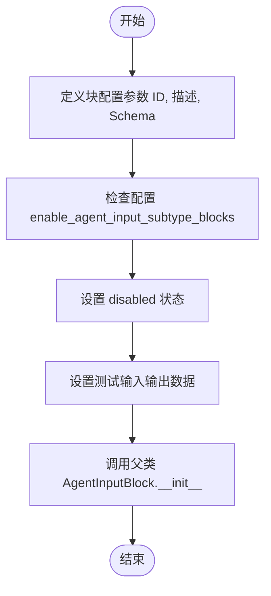

#### 带注释源码

```python
def __init__(self):
    super().__init__(
        # 块的唯一标识符
        id="96dae2bb-97a2-41c2-bd2f-13a3b5a8ea98",
        # 块的描述文本，说明该块用于数字输入
        description="Block for number input.",
        # 根据全局配置决定是否禁用此特定类型的输入块
        disabled=not config.enable_agent_input_subtype_blocks,
        # 指定该块的输入数据结构定义类
        input_schema=AgentNumberInputBlock.Input,
        # 指定该块的输出数据结构定义类
        output_schema=AgentNumberInputBlock.Output,
        # 定义用于测试的输入样例数据
        test_input=[
            {
                "value": 42,
                "name": "number_input_1",
                "description": "Number example 1",
                "placeholder_values": [],
            },
            {
                "value": 314,
                "name": "number_input_2",
                "description": "Number example 2",
                "placeholder_values": [314, 2718],
            },
        ],
        # 定义预期的测试输出结果，用于验证块逻辑
        test_output=[
            ("result", 42),
            ("result", 314),
        ],
    )
```


### `AgentDateInputBlock.__init__`

初始化日期输入块，设置其元数据、输入输出Schema、测试用例，并根据全局配置决定是否禁用该块。该方法通过调用父类 `AgentInputBlock` 的初始化方法来完成块的注册和配置。

参数：

-   `self`：`AgentDateInputBlock`，类的实例本身。

返回值：`None`，无返回值，仅完成对象实例化。

#### 流程图

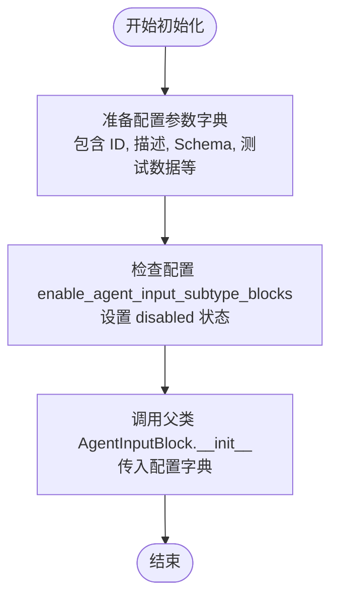

#### 带注释源码

```python
def __init__(self):
    # 调用父类 AgentInputBlock 的初始化方法，传入配置字典
    super().__init__(
        # 块的唯一标识符
        id="7e198b09-4994-47db-8b4d-952d98241817",
        # 块的功能描述
        description="Block for date input.",
        # 根据全局配置决定是否禁用该块（如果配置未启用子类型块，则禁用）
        disabled=not config.enable_agent_input_subtype_blocks,
        # 指定输入数据的 Schema 为内部类 Input
        input_schema=AgentDateInputBlock.Input,
        # 指定输出数据的 Schema 为内部类 Output
        output_schema=AgentDateInputBlock.Output,
        # 定义测试输入案例列表
        test_input=[
            {
                # 将 date 对象转换为字符串作为输入值
                "value": str(date(2025, 3, 19)),
                "name": "date_input_1",
                "description": "Example date input 1",
            },
            {
                "value": str(date(2023, 12, 31)),
                "name": "date_input_2",
                "description": "Example date input 2",
            },
        ],
        # 定义预期的测试输出结果列表
        test_output=[
            ("result", date(2025, 3, 19)),
            ("result", date(2023, 12, 31)),
        ],
    )
```


### `AgentTimeInputBlock.__init__`

该方法用于初始化时间输入块，通过调用父类构造函数配置块的元数据，包括唯一标识、描述、输入输出Schema、测试用例以及根据系统配置设置禁用状态。

参数：

无 (仅 self)

返回值：`None`，构造函数无返回值。

#### 流程图

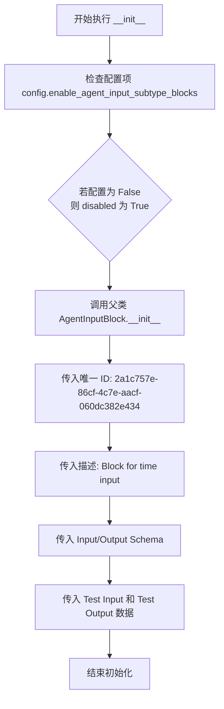

#### 带注释源码

```python
def __init__(self):
    # 调用父类 AgentInputBlock 的初始化方法，配置该块的各项属性
    super().__init__(
        # 定义块的唯一标识符
        id="2a1c757e-86cf-4c7e-aacf-060dc382e434",
        # 描述块的功能：用于时间输入
        description="Block for time input.",
        # 根据全局配置决定是否禁用该特定类型的输入块
        disabled=not config.enable_agent_input_subtype_blocks,
        # 绑定该块专用的输入数据结构 Schema
        input_schema=AgentTimeInputBlock.Input,
        # 绑定该块专用的输出数据结构 Schema
        output_schema=AgentTimeInputBlock.Output,
        # 定义测试输入数据集，包含两个不同时间点的示例
        test_input=[
            {
                # 测试值：上午 9:30:00 的字符串表示
                "value": str(time(9, 30, 0)),
                "name": "time_input_1",
                "description": "Time example 1",
            },
            {
                # 测试值：晚上 23:59:59 的字符串表示
                "value": str(time(23, 59, 59)),
                "name": "time_input_2",
                "description": "Time example 2",
            },
        ],
        # 定义预期的测试输出数据集，验证转换后的 time 对象
        test_output=[
            ("result", time(9, 30, 0)),
            ("result", time(23, 59, 59)),
        ],
    )
```


### `AgentFileInputBlock.__init__`

该方法负责初始化 `AgentFileInputBlock` 实例。它通过调用父类 `AgentInputBlock` 的初始化方法，设置文件输入块的唯一标识符、描述、输入输出模式、测试数据以及是否根据配置禁用该块等元数据。

参数：

- `self`：`AgentFileInputBlock`，表示类的实例本身。

返回值：`None`，初始化方法不返回任何值。

#### 流程图

```mermaid
flowchart TD
    A[开始初始化 AgentFileInputBlock] --> B{检查配置项};
    B -- config.enable_agent_input_subtype_blocks --> C[disabled 设置为 False];
    B -- 否 --> D[disabled 设置为 True];
    C --> E[调用父类 super().__init__ 传入配置参数];
    D --> E;
    E --> F[设置 ID, 描述, 输入/输出 Schema, 测试数据等];
    F --> G[初始化完成];
```

#### 带注释源码

```python
def __init__(self):
    # 调用父类 AgentInputBlock 的初始化方法
    super().__init__(
        # 设置该块的唯一标识符
        id="95ead23f-8283-4654-aef3-10c053b74a31",
        # 设置块的描述信息，说明这是用于文件上传输入的块
        description="Block for file upload input (string path for example).",
        # 根据配置决定是否禁用该块。如果配置未启用 agent input subtype blocks，则该块不可用
        disabled=not config.enable_agent_input_subtype_blocks,
        # 定义输入数据的 Schema，继承自 AgentFileInputBlock.Input 内部类
        input_schema=AgentFileInputBlock.Input,
        # 定义输出数据的 Schema，继承自 AgentFileInputBlock.Output 内部类
        output_schema=AgentFileInputBlock.Output,
        # 定义测试输入用例，包含一个模拟的 base64 图片数据
        test_input=[
            {
                "value": "data:image/png;base64,MQ==",
                "name": "file_upload_1",
                "description": "Example file upload 1",
            },
        ],
        # 定义预期的测试输出，结果应为字符串类型
        test_output=[
            ("result", str),
        ],
    )
```


### `AgentFileInputBlock.run`

该方法负责处理文件输入块的核心逻辑，验证输入文件的存在性，根据配置决定输出格式（如 Base64 或内部引用），并调用存储服务处理文件后返回结果。

参数：

-  `input_data`：`AgentFileInputBlock.Input`，包含输入的文件数据及相关配置信息（如是否转为 Base64）。
-  `execution_context`：`ExecutionContext`，执行上下文对象，用于追踪执行状态或访问持久化存储。
-  `**kwargs`：`dict`，扩展关键字参数。

返回值：`BlockOutput`，一个异步生成器，产出包含键 `"result"` 和处理后的文件路径或数据的元组。

#### 流程图

```mermaid
flowchart TD
    Start([开始]) --> CheckValue{input_data.value 是否存在?}
    CheckValue -- 否 --> End([结束])
    CheckValue -- 是 --> DecideFormat{input_data.base_64 是否为 True?}
    DecideFormat -- 是 --> SetFormat[return_format = \"for_external_api\"]
    DecideFormat -- 否 --> SetFormat2[return_format = \"for_block_output\"]
    SetFormat --> StoreFile[调用 store_media_file]
    SetFormat2 --> StoreFile
    StoreFile --> YieldResult[生成 \"result\" 及文件处理结果]
    YieldResult --> End([结束])
```

#### 带注释源码

```python
async def run(
    self,
    input_data: Input,
    *,
    execution_context: ExecutionContext,
    **kwargs,
) -> BlockOutput:
    # 检查输入值是否存在，如果不存在则直接结束执行
    if not input_data.value:
        return

    # 根据用户配置决定返回格式
    # for_external_api: 总是返回 data URI (base64) - 对应 "Produce Base64 Output" 选项
    # for_block_output: 智能格式 - CoPilot 中为 workspace://，图表中为 data URI
    return_format = "for_external_api" if input_data.base_64 else "for_block_output"

    # 调用 store_media_file 处理文件存储/转换逻辑
    # 并通过 yield 产出 "result" 键和处理后的文件数据
    yield "result", await store_media_file(
        file=input_data.value,
        execution_context=execution_context,
        return_format=return_format,
    )
```


### `AgentDropdownInputBlock.__init__`

初始化下拉选择输入块，配置其唯一标识符、描述、输入输出架构、测试数据以及根据配置启用或禁用该块。

参数：

- `self`：`AgentDropdownInputBlock`，类的实例本身。

返回值：`None`，构造函数不返回任何值。

#### 流程图

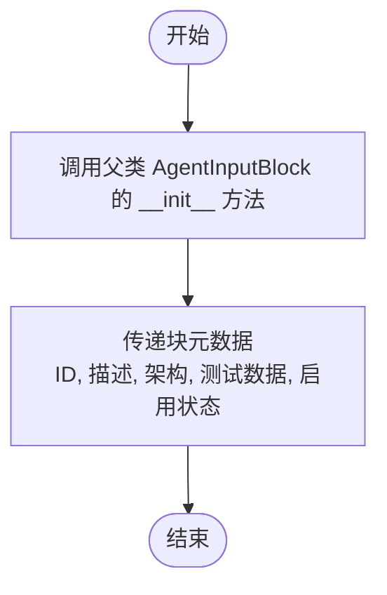

#### 带注释源码

```python
def __init__(self):
    super().__init__(
        # 块的唯一标识符
        id="655d6fdf-a334-421c-b733-520549c07cd1",
        # 块的功能描述
        description="Block for dropdown text selection.",
        # 根据配置文件中的设置决定是否禁用该块
        disabled=not config.enable_agent_input_subtype_blocks,
        # 定义输入数据的结构模式
        input_schema=AgentDropdownInputBlock.Input,
        # 定义输出数据的结构模式
        output_schema=AgentDropdownInputBlock.Output,
        # 用于测试的输入数据示例
        test_input=[
            {
                "value": "Option A",
                "name": "dropdown_1",
                "placeholder_values": ["Option A", "Option B", "Option C"],
                "description": "Dropdown example 1",
            },
            {
                "value": "Option C",
                "name": "dropdown_2",
                "placeholder_values": ["Option A", "Option B", "Option C"],
                "description": "Dropdown example 2",
            },
        ],
        # 与测试输入对应的期望输出数据
        test_output=[
            ("result", "Option A"),
            ("result", "Option C"),
        ],
    )
```


### `AgentToggleInputBlock.__init__`

初始化布尔切换输入块，配置其唯一标识符、描述、输入输出模式以及测试用例，并调用父类构造函数注册该块。

参数：

-   `无`

返回值：`None`，构造函数无返回值。

#### 流程图

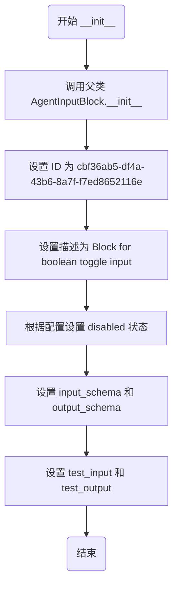

#### 带注释源码

```python
def __init__(self):
    # 调用父类 AgentInputBlock 的构造函数，传入配置字典
    super().__init__(
        # 块的唯一标识符
        id="cbf36ab5-df4a-43b6-8a7f-f7ed8652116e",
        # 块的功能描述，用于UI展示
        description="Block for boolean toggle input.",
        # 根据配置项决定是否禁用此块
        disabled=not config.enable_agent_input_subtype_blocks,
        # 指定输入数据的 Schema 类，继承自 AgentInputBlock.Input 并扩展了 value 为 bool 类型
        input_schema=AgentToggleInputBlock.Input,
        # 指定输出数据的 Schema 类
        output_schema=AgentToggleInputBlock.Output,
        # 定义测试输入用例，包含 True 和 False 两种情况
        test_input=[
            {
                "value": True,
                "name": "toggle_1",
                "description": "Toggle example 1",
            },
            {
                "value": False,
                "name": "toggle_2",
                "description": "Toggle example 2",
            },
        ],
        # 定义预期的测试输出结果
        test_output=[
            ("result", True),
            ("result", False),
        ],
    )
```


### `AgentTableInputBlock.__init__`

该构造函数用于初始化 `AgentTableInputBlock` 类的实例。它通过调用父类 `AgentInputBlock` 的构造函数，配置了该块的唯一标识符、功能描述、启用状态（基于配置）、输入/输出数据模式以及用于测试验证的样例输入和输出数据。

参数：

-  `self`：`AgentTableInputBlock`，类的实例引用。

返回值：`None`，构造函数不返回任何值。

#### 流程图

```mermaid
flowchart TD
    Start([开始]) --> InitCall[调用 super().__init__]
    InitCall --> DefineConfig[定义块配置参数]
    DefineConfig --> ID[设置 ID 为 5603b273-f41e-4020-af7d-fbc9c6a8d928]
    DefineConfig --> Desc[设置描述为 Block for table data input...]
    DefineConfig --> Disabled[根据 config.enable_agent_input_subtype_blocks 设置 disabled 状态]
    DefineConfig --> Schemas[设置 input_schema 和 output_schema]
    DefineConfig --> TestData[设置 test_input 和 test_output]
    ID --> ParentInit[执行父类初始化]
    Desc --> ParentInit
    Disabled --> ParentInit
    Schemas --> ParentInit
    TestData --> ParentInit
    ParentInit --> End([结束])
```

#### 带注释源码

```python
def __init__(self):
    # 调用父类 AgentInputBlock 的构造函数进行初始化
    super().__init__(
        # 块的唯一标识符
        id="5603b273-f41e-4020-af7d-fbc9c6a8d928",
        # 块的功能描述，说明这是一个支持自定义表头的表格数据输入块
        description="Block for table data input with customizable headers.",
        # 根据配置文件中的设置决定是否禁用该块。
        # 如果配置未启用 agent input subtype blocks，则该块将被禁用。
        disabled=not config.enable_agent_input_subtype_blocks,
        # 指定输入数据的 Schema 类，用于验证和定义输入结构
        input_schema=AgentTableInputBlock.Input,
        # 指定输出数据的 Schema 类，用于验证和定义输出结构
        output_schema=AgentTableInputBlock.Output,
        # 定义用于测试的输入数据样例，包含表头和表格内容
        test_input=[
            {
                "name": "test_table",
                "column_headers": ["Name", "Age", "City"],
                "value": [
                    {"Name": "John", "Age": "30", "City": "New York"},
                    {"Name": "Jane", "Age": "25", "City": "London"},
                ],
                "description": "Example table input",
            }
        ],
        # 定义预期的测试输出数据样例
        test_output=[
            (
                "result",
                [
                    {"Name": "John", "Age": "30", "City": "New York"},
                    {"Name": "Jane", "Age": "25", "City": "London"},
                ],
            )
        ],
    )
```


### `AgentTableInputBlock.run`

该方法用于处理表格输入数据，确保数据以列表形式输出。它检查传入的 `value` 是否为空，如果为空则返回一个空列表，否则直接透传输入的表格数据。

参数：

-  `input_data`：`AgentTableInputBlock.Input`，包含表格数据（`value`）和列头（`column_headers`）的输入对象。
-  `*args`：`Any`，额外的位置参数。
-  `**kwargs`：`Any`，额外的关键字参数。

返回值：`BlockOutput`，异步生成器，产生一个包含键值对 `("result", list[dict[str, Any]])` 的元组。

#### 流程图

```mermaid
flowchart TD
    Start([开始]) --> Check{input_data.value<br/>is None?}
    Check -- Yes --> SetEmpty[output_value = []]
    Check -- No --> SetValue[output_value = input_data.value]
    SetEmpty --> Yield[Yield "result", output_value]
    SetValue --> Yield
    Yield --> End([结束])
```

#### 带注释源码

```python
    async def run(self, input_data: Input, *args, **kwargs) -> BlockOutput:
        """
        Yields the table data as a list of dictionaries.
        """
        # 检查 input_data.value 是否不为 None
        # 如果不为 None，则使用 input_data.value
        # 否则使用空列表 [] 作为默认值
        # 最终输出键为 "result"，值为表格数据列表
        yield "result", input_data.value if input_data.value is not None else []
```


### `AgentGoogleDriveFileInputBlock.__init__`

该方法用于初始化 `AgentGoogleDriveFileInputBlock` 类。它定义了块的唯一标识符、描述、输入/输出架构以及测试配置。该方法还会创建一个模拟的 Google Drive 文件对象用于测试，并调用父类构造函数将块注册到系统中。

参数：

- `self`：`AgentGoogleDriveFileInputBlock`，表示类的实例。

返回值：`None`，表示初始化完成。

#### 流程图

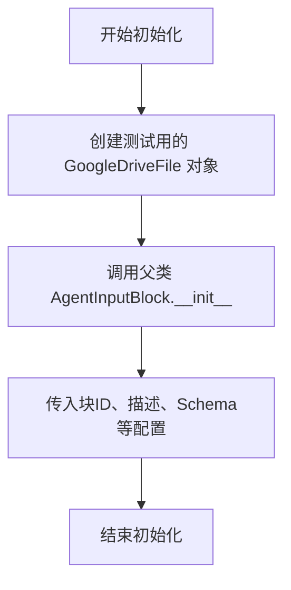

#### 带注释源码

```python
def __init__(self):
    # 创建一个用于测试的 GoogleDriveFile 对象模拟数据
    test_file = GoogleDriveFile.model_validate(
        {
            "id": "test-file-id",
            "name": "Test Spreadsheet",
            "mimeType": "application/vnd.google-apps.spreadsheet",
            "url": "https://docs.google.com/spreadsheets/d/test-file-id",
        }
    )
    # 调用父类 __init__ 方法，配置块的基本属性和行为
    super().__init__(
        # 块的唯一标识符
        id="d3b32f15-6fd7-40e3-be52-e083f51b19a2",
        # 块的功能描述
        description="Block for selecting a file from Google Drive.",
        # 根据配置决定是否禁用该块
        disabled=not config.enable_agent_input_subtype_blocks,
        # 定义输入数据的 Schema
        input_schema=AgentGoogleDriveFileInputBlock.Input,
        # 定义输出数据的 Schema
        output_schema=AgentGoogleDriveFileInputBlock.Output,
        # 定义测试输入用例
        test_input=[
            {
                "name": "spreadsheet_input",
                "description": "Select a spreadsheet from Google Drive",
                "allowed_views": ["SPREADSHEETS"],
                "value": {
                    "id": "test-file-id",
                    "name": "Test Spreadsheet",
                    "mimeType": "application/vnd.google-apps.spreadsheet",
                    "url": "https://docs.google.com/spreadsheets/d/test-file-id",
                },
            }
        ],
        # 定义与测试输入对应的期望输出
        test_output=[("result", test_file)],
    )
```


### `AgentGoogleDriveFileInputBlock.run`

该方法负责处理用户通过 Google Drive 选择器输入的数据，并将其作为结果产出。它本质上是一个透传方法，验证输入值存在后直接输出选定的 Google Drive 文件对象。

参数：

- `input_data`：`AgentGoogleDriveFileInputBlock.Input`，包含用户通过 Google Drive 选择器选中的文件信息，以及其他配置项（如允许的视图等）。
- `args`：`tuple`，额外的位置参数。
- `kwargs`：`dict`，额外的关键字参数。

返回值：`BlockOutput`，一个异步生成器，产出包含键 "result" 和对应的 Google Drive 文件对象（`GoogleDriveFile`）的元组。

#### 流程图

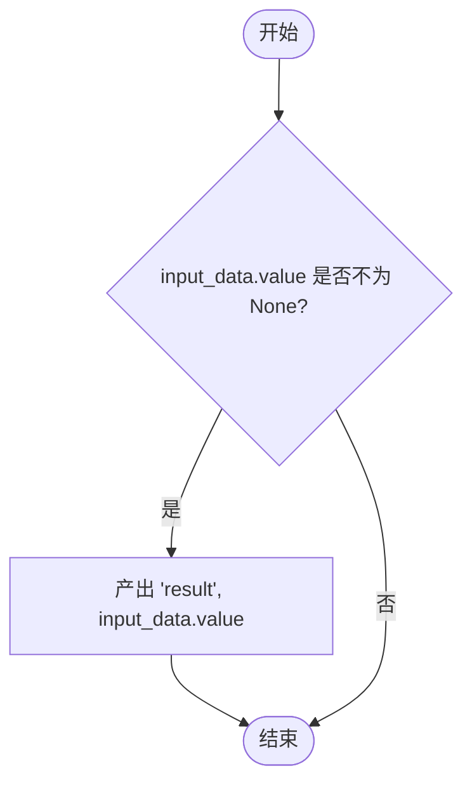

#### 带注释源码

```python
async def run(self, input_data: Input, *args, **kwargs) -> BlockOutput:
    """
    Yields the selected Google Drive file.
    """
    # 检查输入数据中的 value 字段（即选定的 Google Drive 文件对象）是否存在
    if input_data.value is not None:
        # 如果存在，产出 "result" 键和对应的文件对象
        yield "result", input_data.value
```


## 关键组件


### AgentInputBlock
工作流输入的基类，处理通用的输入数据接收、元数据描述（如标题、描述）以及基于枚举值的动态 Schema 生成。

### AgentOutputBlock
用于记录和展示工作流结果的组件，支持使用 Jinja2 模板语法对输出值进行格式化，并包含 HTML 转义选项。

### AgentFileInputBlock
处理文件上传输入的组件，支持媒体文件的存储，并提供 Base64 编码输出或直接文件路径引用的选项。

### AgentGoogleDriveFileInputBlock
集成 Google Drive 的组件，通过 OAuth2 认证和自定义 Picker UI 配置，允许用户从 Google Drive 选择文件或文件夹。

### AgentTableInputBlock
支持结构化数据输入的组件，允许用户定义列标题，并以字典列表的形式输入和管理表格数据。

### TextFormatter
在 `AgentOutputBlock` 中使用的文本处理组件，负责解析 Jinja2 模板字符串并根据配置自动转义 HTML 特殊字符。

### SchemaField
用于定义块输入和输出字段的元数据组件，提供字段描述、默认值、高级选项及隐藏属性的配置。


## 问题及建议


### 已知问题

-   **异常处理过于宽泛**：在 `AgentOutputBlock.run` 方法中，使用了 `try...except Exception` 捕获所有异常并返回 "Error: ..." 字符串。这种做法掩盖了具体的错误堆栈和异常类型，使得在格式化失败时难以进行调试和根因分析。
-   **代码重复度高**：`AgentInputBlock` 的各个子类（如 `AgentShortTextInputBlock`, `AgentNumberInputBlock` 等）在 `__init__` 方法中存在大量重复的结构和逻辑（ID、描述、输入输出模式定义），违反了 DRY（Don't Repeat Yourself）原则，增加了维护难度。
-   **类型处理不一致**：在 `AgentDateInputBlock` 和 `AgentTimeInputBlock` 中，`test_input` 使用了字符串形式的日期/时间，而 `test_output` 期望的是 `date`/`time` 对象。这种测试数据与实际对象类型的不一致可能导致对序列化/反序列化逻辑的误解。
-   **实例化开销**：文件底部的 `IO_BLOCK_IDs` 列表通过实例化每个 Block 类（例如 `AgentInputBlock().id`）来获取 ID。虽然当前开销不大，但随着 Block 构造函数逻辑的复杂化，这种仅为了获取 ID 而进行的实例化将成为不必要的性能负担。

### 优化建议

-   **引入工厂模式或配置驱动**：建议采用工厂模式或基于配置的注册机制来生成具体的输入 Block。通过定义一个包含类型、描述和验证规则的配置字典来动态生成类，从而消除大量子类和重复的 `__init__` 代码。
-   **细化错误处理与日志**：在 `AgentOutputBlock` 中捕获具体的异常类型（如 `TemplateError` 或 `ValueError`），并记录完整的错误堆栈到日志系统中。同时，考虑设计一个专门的错误输出端口，而不是将错误信息作为普通数据输出，以便下游流程能正确识别和处理失败状态。
-   **使用类常量管理 ID**：将 Block 的 ID 定义为类级别的常量（例如 `class AgentInputBlock: ID = "c0a8e994..."`），这样 `IO_BLOCK_IDs` 可以直接通过类名引用 ID，无需实例化对象，既减少了开销也提高了代码的可读性。
-   **统一特性开关管理**：`enable_agent_input_subtype_blocks` 配置项在多个子类中重复出现。建议将此逻辑提升到模块加载级别或 Block 注册中心，在注册阶段统一决定是否启用这些 Block，从而保持类定义的整洁。


## 其它


### 设计目标与约束

**设计目标：**
1.  **模块化输入输出处理**：通过定义 `AgentInputBlock` 和 `AgentOutputBlock` 及其子类，为工作流提供标准化的用户交互接口，支持文本、数字、日期、文件等多种数据类型。
2.  **灵活的数据格式化**：输出块支持 Jinja2 模板语法，允许用户自定义输出格式，并提供 HTML 转义选项以增强安全性。
3.  **扩展性**：通过继承基类 `AgentInputBlock`，可以轻松添加新的输入类型（如 Google Drive 选择器），复用通用的输入验证和模式生成逻辑。
4.  **配置驱动的行为**：利用配置开关（如 `config.enable_agent_input_subtype_blocks`）控制特定类型块的启用状态，便于功能灰度发布或环境差异化配置。

**设计约束：**
1.  **异步执行环境**：所有块的 `run` 方法均为异步（`async def`），要求运行在支持 asyncio 的执行上下文中。
2.  **Schema 依赖**：输入和输出定义依赖于 `SchemaField` 和 `BlockSchema` 的元数据模型，必须遵循后端定义的数据结构规范。
3.  **资源存储限制**：文件输入块依赖 `store_media_file` 工具函数，受限于后端配置的存储服务（如本地文件系统或对象存储）。
4.  **外部服务依赖**：Google Drive 文件选择块依赖 Google API 的 OAuth2 认证和作用域配置，且前端需配合实现特定的 Picker UI。

### 错误处理与异常设计

1.  **输出格式化异常捕获**：
    *   在 `AgentOutputBlock.run` 方法中，对 `TextFormatter.format_string` 的调用进行了显式的 `try-except` 捕获。
    *   **处理策略**：如果格式化过程抛出任何异常，系统不会中断流程，而是将错误信息拼接到原始值前（格式：`"Error: {e}, {input_data.value}"`）并作为 `output` 产出，确保下游流程能继续执行或至少获得原始数据。

2.  **空值处理**：
    *   `AgentInputBlock` 和 `AgentFileInputBlock` 等在 `run` 方法开始时会检查 `input_data.value` 是否为 `None` 或空。如果为空，通常直接返回或不产出任何数据（Yield），避免处理无效数据。

3.  **隐式异常传播**：
    *   除了 `AgentOutputBlock` 的显式捕获外，其他块（如 `AgentFileInputBlock` 调用 `store_media_file`）的异常通常直接向上传播至执行引擎，由全局的执行错误处理机制接管。

### 数据流与状态机

1.  **数据流**：
    *   **输入阶段**：数据通过 `Input` Schema 进入块。对于特殊类型（如 File 或 Google Drive），数据可能包含元数据（如文件路径、Base64 编码、File ID）。
    *   **处理阶段**：
        *   **透传**：大多数输入块直接透传 `value`。
        *   **转换**：`AgentFileInputBlock` 根据 `base_64` 参数调用 `store_media_file` 将文件内容转换为存储路径或 Data URI。
        *   **格式化**：`AgentOutputBlock` 使用 Jinja2 模板将原始值渲染为字符串。
    *   **输出阶段**：处理后的数据通过 `BlockOutput`（生成器）以 `(key, value)` 对的形式流出，供下一个节点使用。

2.  **状态机**：
    *   本模块中的 Block 均为无状态组件。
    *   **生命周期**：实例化 -> 执行 (`run`) -> 销毁。状态不保存在 Block 实例内部，而是依赖 `ExecutionContext`（如文件上传中的上下文）或输入数据本身。对于 Google Drive Picker，前端 UI 组件可能维护选择状态，但后端 Block 仅处理最终提交的数据。

### 外部依赖与接口契约

1.  **核心框架依赖**：
    *   `backend.data.block.Block`: 所有块的基类，定义了 `id`, `input_schema`, `output_schema`, `run` 等核心契约。
    *   `backend.data.execution.ExecutionContext`: 提供执行时的上下文信息，用于文件存储等操作（如 `AgentFileInputBlock` 依赖）。

2.  **工具库依赖**：
    *   `backend.util.file.store_media_file`: 契约为接收文件数据、执行上下文和返回格式，返回存储后的文件引用。
    *   `backend.util.text.TextFormatter`: 契约为提供 `format_string(template, context)` 方法，支持 `autoescape` 参数。

3.  **模型与类型依赖**：
    *   `backend.data.model.SchemaField`: 用于定义输入输出的元数据（描述、默认值、是否高级参数等）。
    *   `backend.util.type`: 定义了如 `ShortTextType`, `LongTextType`, `MediaFileType` 等自定义类型，用于运行时数据验证。
    *   `backend.blocks.google._drive.GoogleDriveFile`: 专门的数据结构，用于承载 Google Drive 文件的元数据。

4.  **配置依赖**：
    *   `backend.util.settings.Config`: 读取 `enable_agent_input_subtype_blocks` 配置项，决定子类型输入块是否可用。

### 安全性与机密性设计

1.  **机密字段标记**：
    *   输入和输出块均包含 `secret: bool` 字段。当设置为 `True` 时，指示前端或日志系统应对该值进行脱敏处理（如显示为 `******`），防止敏感信息泄露。

2.  **HTML 转义（XSS 防护）**：
    *   `AgentOutputBlock` 提供 `escape_html` 参数。通过 `TextFormatter` 的 `autoescape` 选项，确保在输出到 Web 界面时，特殊字符（如 `<`, `>`, `&`）被正确转义，防止跨站脚本攻击。

3.  **文件处理安全**：
    *   `AgentFileInputBlock` 的 `base_64` 选项默认为 `False`，鼓励使用内部文件路径引用而非直接传输大量 Base64 数据，同时也减少了内存占用和注入风险。

4.  **外部认证集成**：
    *   `AgentGoogleDriveFileInputBlock` 在 Schema 中定义了 `scopes`（如 `https://www.googleapis.com/auth/drive.file`），严格限制第三方应用对 Google Drive 的访问权限，遵循最小权限原则。

    