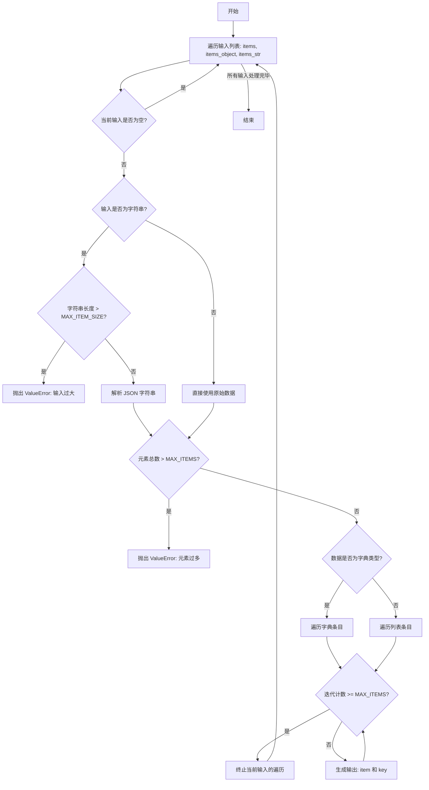
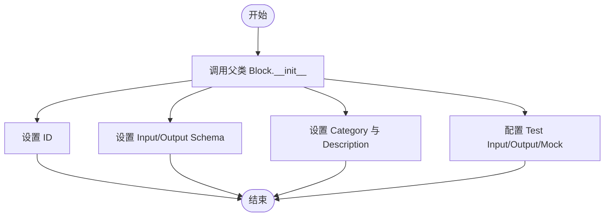
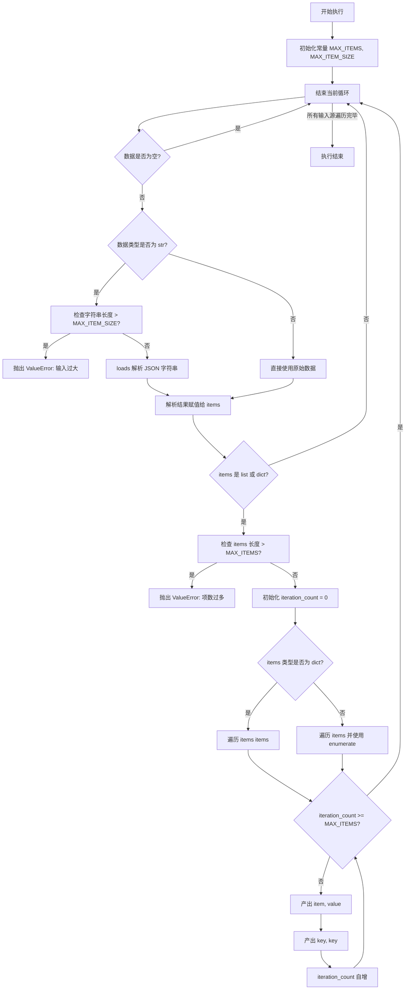

# `AutoGPT\autogpt_platform\backend\backend\blocks\iteration.py` 详细设计文档

该代码定义了一个名为 `StepThroughItemsBlock` 的逻辑处理块，继承自 `Block` 基类。其核心功能是异步遍历列表或字典数据，支持通过列表对象、字典对象或 JSON 字符串作为输入，并通过生成器逐个输出元素及其对应的键或索引。此外，代码实现了安全限制机制，包括最大迭代次数（MAX_ITEMS）和单条输入最大长度（MAX_ITEM_SIZE），以防止处理过大数据导致的拒绝服务攻击。

## 整体流程



## 类结构

```
Block (外部依赖)
└── StepThroughItemsBlock
    ├── Input (内部类)
    │   ├── items
    │   ├── items_object
    │   └── items_str
    ├── Output (内部类)
    │   ├── item
    │   └── key
    ├── __init__
    └── run
```

## 全局变量及字段


### `StepThroughItemsBlock.Input`
    
Defines the input schema for the block, specifying fields for list, object, and string representations of items.

类型：`Class`
    


### `StepThroughItemsBlock.Output`
    
Defines the output schema for the block, specifying fields for the current item and its key.

类型：`Class`
    


### `Input.items`
    
The list or dictionary of items to iterate over

类型：`list`
    


### `Input.items_object`
    
The list or dictionary of items to iterate over

类型：`dict`
    


### `Input.items_str`
    
The list or dictionary of items to iterate over

类型：`str`
    


### `Output.item`
    
The current item in the iteration

类型：`Any`
    


### `Output.key`
    
The key or index of the current item in the iteration

类型：`Any`
    
    

## 全局函数及方法


### `StepThroughItemsBlock.__init__`

该方法是 `StepThroughItemsBlock` 类的构造函数，负责初始化块的基本属性，包括唯一标识符、输入输出模式、分类、描述以及测试用例配置。

参数：

- `self`：`StepThroughItemsBlock`，表示类实例本身。

返回值：`None`，构造函数不返回任何值。

#### 流程图



#### 带注释源码

```python
def __init__(self):
    # 调用父类 Block 的初始化方法，配置块的基本元数据
    super().__init__(
        id="f66a3543-28d3-4ab5-8945-9b336371e2ce",  # 块的唯一标识符
        input_schema=StepThroughItemsBlock.Input,  # 定义的输入 Schema 类
        output_schema=StepThroughItemsBlock.Output, # 定义的输出 Schema 类
        categories={BlockCategory.LOGIC},         # 块所属的逻辑分类
        description="Iterates over a list or dictionary and outputs each item.", # 块的功能描述
        # 用于测试的示例输入数据
        test_input={"items": [1, 2, 3, {"key1": "value1", "key2": "value2"}]},
        # 用于测试的预期输出数据序列
        test_output=[
            ("item", 1),
            ("key", 0),
            ("item", 2),
            ("key", 1),
            ("item", 3),
            ("key", 2),
            ("item", {"key1": "value1", "key2": "value2"}),
            ("key", 3),
        ],
        test_mock={},  # 测试时的模拟对象配置
    )
```


### `StepThroughItemsBlock.run`

该方法是 `StepThroughItemsBlock` 的核心执行逻辑，用于异步遍历输入的列表或字典数据。它按顺序处理三种可能的输入来源（`items`、`items_object`、`items_str`），对字符串类型的输入进行 JSON 解析，并包含安全机制以限制处理的数据总量和单项大小，最终逐个产出每一项及其对应的键或索引。

参数：

- `self`: `StepThroughItemsBlock`，类的实例本身。
- `input_data`: `StepThroughItemsBlock.Input`，包含待迭代数据的输入对象，支持列表、字典或 JSON 字符串形式。
- `**kwargs`: `Any`，额外的关键字参数，通常由执行框架传递。

返回值：`BlockOutput`，一个异步生成器，产生包含输出名称和值的元组，格式为 `("item", value)` 或 `("key", key_or_index)`。

#### 流程图



#### 带注释源码

```python
    async def run(self, input_data: Input, **kwargs) -> BlockOutput:
        # Security fix: Add limits to prevent DoS from large iterations
        # 定义安全限制常量
        MAX_ITEMS = 10000  # Maximum items to iterate (最大迭代项数)
        MAX_ITEM_SIZE = 1024 * 1024  # 1MB per item (每项最大字节数)

        # 遍历三个可能的输入字段，优先使用第一个非空的数据源
        for data in [input_data.items, input_data.items_object, input_data.items_str]:
            # 如果当前数据源为空，跳过并检查下一个
            if not data:
                continue

            # 处理字符串类型输入
            # Limit string size before parsing
            if isinstance(data, str):
                # 安全检查：防止解析过大的字符串导致内存耗尽
                if len(data) > MAX_ITEM_SIZE:
                    raise ValueError(
                        f"Input too large: {len(data)} bytes > {MAX_ITEM_SIZE} bytes"
                    )
                # 将 JSON 字符串解析为 Python 对象 (list 或 dict)
                items = loads(data)
            else:
                # 非字符串直接使用
                items = data

            # 检查解析/加载后的对象类型和长度
            # Check total item count
            if isinstance(items, (list, dict)):
                # 安全检查：防止迭代过大的列表或字典
                if len(items) > MAX_ITEMS:
                    raise ValueError(f"Too many items: {len(items)} > {MAX_ITEMS}")

            # 开始迭代逻辑
            iteration_count = 0
            if isinstance(items, dict):
                # If items is a dictionary, iterate over its values
                for key, value in items.items():
                    # 即使长度检查通过了，循环中也进行计数器检查作为双重保障
                    if iteration_count >= MAX_ITEMS:
                        break
                    # 产出当前项的值
                    yield "item", value
                    # 产出当前项的键 (注意：此处修复了原逻辑中可能产出 item 的问题)
                    yield "key", key  # Fixed: should yield key, not item
                    iteration_count += 1
            else:
                # If items is a list, iterate over the list
                for index, item in enumerate(items):
                    if iteration_count >= MAX_ITEMS:
                        break
                    # 产出列表元素
                    yield "item", item
                    # 产出列表索引
                    yield "key", index
                    iteration_count += 1
```


## 关键组件


### 多源输入聚合器

支持从列表、字典或 JSON 字符串获取输入，并将它们解析为统一的可迭代格式以供处理。

### 安全约束验证器

通过限制迭代的最大项目数和输入字符串的最大大小，对处理的数据大小实施边界检查，以防止资源耗尽攻击。

### 生成式迭代引擎

核心处理单元，在列表和字典之间进行区分，以产生适当的项目和键（索引）对，同时遵守迭代计数限制。


## 问题及建议


### 已知问题

-   **输入字段冗余与歧义**：`items`、`items_object` 和 `items_str` 三个输入字段的功能高度重叠（都用于表示待迭代的数据），导致接口设计混乱，增加了用户的配置负担，且运行时逻辑（按顺序尝试非空字段）缺乏明确的数据优先级定义。
-   **数据输出缺乏原子性**：通过两次独立的 `yield` 分别输出 `item` 和 `key`，破坏了逻辑上的原子性。下游节点如果需要同时使用键和值，必须维护额外的状态来配对这两个异步到达的数据，增加了系统复杂度。
-   **安全约束硬编码**：`MAX_ITEMS`（10000）和 `MAX_ITEM_SIZE`（1MB）作为安全限制被硬编码在 `run` 方法内部，导致无法根据不同的运行环境或租户需求动态调整这些阈值。
-   **类型处理逻辑不统一**：代码主要针对 `list` 和 `dict` 进行了长度预检查，但 `else` 分支处理其他可迭代对象（如 `tuple`, `set`）时跳过了长度检查。虽然循环内部有计数器保护，但这种双重标准容易引发潜在的性能问题或逻辑漏洞。

### 优化建议

-   **统一输入接口设计**：将 `items`、`items_object` 和 `items_str` 合并为单一的 `data` 输入字段，类型定义为 `Any` 或 `Union[str, list, dict]`。在方法内部统一处理字符串解析（JSON）和对象遍历逻辑，简化 Schema 定义并提升用户体验。
-   **调整输出结构以保证原子性**：修改输出 Schema，将 `item` 和 `key` 封装到一个复合对象中（例如字典 `{"key": ..., "value": ...}`）或定义一个新的数据结构对象，通过一次 `yield` 输出，确保数据的完整性，简化下游消费逻辑。
-   **参数化安全限制**：将 `MAX_ITEMS` 和 `MAX_ITEM_SIZE` 提取为类的常量，或者通过 `Block` 的配置机制（如初始化参数或环境变量）进行注入，提高代码的可配置性和灵活性。
-   **增强异常处理与类型兼容性**：显式捕获 `loads(data)` 可能抛出的 JSON 解析异常，并给出明确的错误提示；同时，在长度预检查阶段增加对 `tuple` 和 `set` 等常见序列类型的支持，统一执行 `MAX_ITEMS` 检查。


## 其它


### 设计目标与约束

该模块旨在提供一个安全、灵活的列表/字典遍历功能，支持原生对象及JSON字符串输入。
1.  **安全性约束**：为防止拒绝服务攻击（DoS），设定了严格的资源限制。单次迭代最大项目数限制为 10,000 (`MAX_ITEMS`)，单个字符串输入最大长度限制为 1MB (`MAX_ITEM_SIZE`)。
2.  **输入兼容性**：设计支持三种输入字段 (`items`, `items_object`, `items_str`) 的互斥或优先级处理，以适应不同的上游数据格式（原生列表、原生字典、JSON字符串）。
3.  **非破坏性遍历**：仅读取数据流进行输出，不修改原始输入数据。
4.  **流式输出**：通过异步生成器 (`BlockOutput`) 逐条产出数据，减少内存占用，支持处理大数据集（在限制范围内）。

### 错误处理与异常设计

代码主要通过显式检查和异常抛出机制来处理边界条件和无效输入：
1.  **体积过大错误**：当输入的字符串长度超过 `MAX_ITEM_SIZE` (1MB) 时，显式抛出 `ValueError`，并在消息中明确指出当前字节数与限制字节数。
2.  **数量超限错误**：当解析后的列表或字典长度超过 `MAX_ITEMS` (10,000) 时，显式抛出 `ValueError`，防止过长的迭代导致系统阻塞或超时。
3.  **数据解析异常**：对于 `items_str` 字段，依赖 `backend.util.json.loads` 进行解析。如果输入字符串不是合法的 JSON 格式，底层解析库会抛出异常，并终止当前块的执行。
4.  **空值处理**：采用“静默跳过”策略，若某个输入字段为空或未提供，代码不会报错，而是通过 `continue` 语句检查下一个候选输入字段。

### 外部依赖与接口契约

本模块依赖于特定的框架基类和工具库，遵循以下接口契约：
1.  **基类 `Block`**：来自 `backend.data.block`。子类必须实现 `run` 方法，并注册 `input_schema` 和 `output_schema`。`run` 方法需接受符合 `Input` 结构的数据，并返回一个异步生成器 `BlockOutput`。
2.  **模型定义 `SchemaField`**：来自 `backend.data.model`。用于定义输入输出的元数据，如描述 (`description`)、是否高级 (`advanced`)、默认值工厂 (`default_factory`) 和占位符 (`placeholder`)。
3.  **JSON 工具 `loads`**：来自 `backend.util.json`。其接口契约是将符合 JSON 标准的字符串反序列化为 Python 原生对象（字典或列表）。
4.  **类型提示**：使用 `typing.Any` 和特定的 Schema 类 (`BlockSchemaInput`, `BlockSchemaOutput`) 确保类型安全和 IDE 支持。

### 数据流与状态机

模块内部主要处理数据的转换与流式传输，虽然是无状态的，但执行流程明确：
1.  **数据流**：
    *   **输入**：外部框架传入 `Input` 对象。
    *   **优先级判断**：按顺序检查 `items` -> `items_object` -> `items_str`，一旦发现非空数据即开始处理。
    *   **标准化**：若选中 `items_str`，先进行长度校验，再调用 `loads` 转换为原生对象。
    *   **流式生成**：遍历原生对象，每迭代一次，通过 `yield` 依次输出两个键值对：`("item", value)` 和 `("key", key_or_index)`。
2.  **执行状态**：
    *   **Ready**：`run` 方法被调用，初始化常量。
    *   **Processing**：处于 `for` 循环中，持续生成输出。如果达到 `MAX_ITEMS`，循环主动中断。
    *   **Completed**：迭代结束，生成器耗尽，函数执行完毕。

    