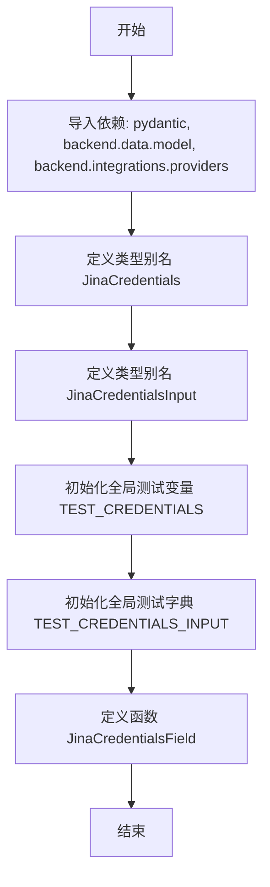
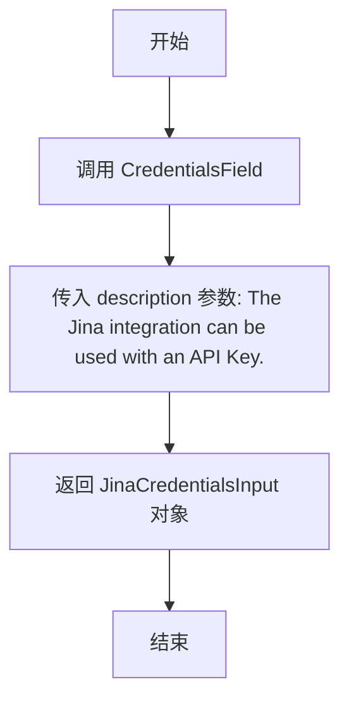

# `AutoGPT\autogpt_platform\backend\backend\blocks\jina\_auth.py` 详细设计文档

该文件定义了 Jina AI 提供商集成的凭证类型别名、创建凭证输入字段的辅助函数，以及用于单元测试的模拟凭证数据。

## 整体流程



## 类结构

```
APIKeyCredentials (外部引用)
└── JinaCredentials (别名)
CredentialsMetaInput (外部引用)
└── JinaCredentialsInput (别名)
```

## 全局变量及字段


### `JinaCredentials`
    
Type alias representing the credentials structure for the Jina provider, which is based on APIKeyCredentials.

类型：`APIKeyCredentials`
    


### `JinaCredentialsInput`
    
Type alias defining the input schema for Jina credentials, specifying the provider name and the required 'api_key' authentication field.

类型：`CredentialsMetaInput[Literal["jina"], Literal["api_key"]]`
    


### `TEST_CREDENTIALS`
    
A mock APIKeyCredentials instance used for testing purposes, containing a predefined ID and a mocked API key.

类型：`APIKeyCredentials`
    


### `TEST_CREDENTIALS_INPUT`
    
A dictionary representation of the mock credentials input data, used for simulating form inputs or serialization during tests.

类型：`dict[str, Any]`
    


### `APIKeyCredentials.id`
    
The unique identifier for the credential instance.

类型：`str`
    


### `APIKeyCredentials.provider`
    
The name of the integration provider associated with these credentials (e.g., 'jina').

类型：`str`
    


### `APIKeyCredentials.api_key`
    
The secret API key string, securely wrapped using Pydantic's SecretStr to prevent accidental logging.

类型：`SecretStr`
    


### `APIKeyCredentials.title`
    
A user-friendly display title for the credential.

类型：`str`
    


### `APIKeyCredentials.expires_at`
    
The expiration timestamp of the credential, or None if the credential does not expire.

类型：`Optional[datetime]`
    
    

## 全局函数及方法


### `JinaCredentialsField`

在块上创建一个 Jina 凭证输入字段。

参数：

-   无

返回值：`JinaCredentialsInput`，返回一个包含 Jina 提供商凭证配置的字段对象，该对象描述了如何输入和验证 Jina 的 API Key。

#### 流程图



#### 带注释源码

```python
def JinaCredentialsField() -> JinaCredentialsInput:
    """
    Creates a Jina credentials input on a block.

    """
    # 调用 CredentialsField 工厂函数，
    # 传入特定的描述信息以生成适用于 Jina 集成的凭证输入配置
    return CredentialsField(
        description="The Jina integration can be used with an API Key.",
    )
```


## 关键组件


### JinaCredentials

定义了用于存储 Jina 集成 API 密钥的数据结构，它是 APIKeyCredentials 的类型别名。

### JinaCredentialsInput

定义了 Jina 提供商在 UI 或 API 接口中接收凭证时的数据模型，通过 Literal 类型限定了提供商名称为 JINA 且凭证类型为 api_key。

### JinaCredentialsField

一个工厂函数，用于创建包含描述信息的凭证输入字段配置，用于在系统中动态注册 Jina 的 API Key 输入需求。

### TEST_CREDENTIALS

预置的测试凭证对象，包含模拟的 API 密钥和元数据，用于单元测试或开发环境验证，避免使用真实的敏感信息。


## 问题及建议


### 已知问题

-   在 `TEST_CREDENTIALS_INPUT` 字典的构造中存在逻辑错误，`title` 字段被错误地赋值为 `TEST_CREDENTIALS.type`，根据 `TEST_CREDENTIALS` 的定义，此处应该赋值为 `TEST_CREDENTIALS.title`。
-   业务逻辑代码中混入了测试相关的全局变量（如 `TEST_CREDENTIALS` 和 `TEST_CREDENTIALS_INPUT`），这种将 Mock 数据硬编码在源文件的做法不仅污染了命名空间，也不利于生产环境的代码维护和整洁。

### 优化建议

-   建议利用 Pydantic 模型自带的序列化方法（例如 `model_dump()` 或 `dict()`）来生成 `TEST_CREDENTIALS_INPUT`，以替代手动构造字典，这样可以自动映射字段，避免人为疏忽导致的字段赋值错误。
-   将测试常量和 Mock 数据移动到专门的测试目录（如 `tests/`）下的 `fixtures.py` 或 `conftest.py` 文件中，实现业务逻辑与测试数据的彻底分离，提升项目的模块化程度。
-   增强 `JinaCredentialsField` 函数的文档字符串，明确指出该凭证字段在 UI 或配置中的具体展示行为及必需性，提升代码的可读性和开发体验。


## 其它


### 设计目标与约束

**设计目标：**
1.  **标准化接口**：为 Jina AI 服务集成定义统一、规范的凭据管理接口，确保与系统内其他第三方集成（如 OpenAI、Anthropic）在交互体验上保持一致。
2.  **类型安全与验证**：利用 Python 类型注解和 Pydantic 库，在数据模型层强制执行严格的类型检查，防止因配置错误导致的运行时故障。
3.  **安全性保障**：确保 API Key 等敏感信息在内存和日志传输过程中得到有效掩码处理，防止凭据泄露。

**约束条件：**
1.  **架构依赖**：必须继承或组合现有的 `APIKeyCredentials` 和 `CredentialsField` 基类，不能独立于后端的凭据管理系统之外。
2.  **Pydantic 版本**：代码依赖于 Pydantic 的 `SecretStr` 功能，要求运行环境安装兼容版本的 Pydantic 库（通常为 v2.x）。
3.  **Literal 限制**：`JinaCredentialsInput` 强制限制了 provider 字段必须为 `ProviderName.JINA`，不可动态修改为其他提供商。

### 错误处理与异常设计

1.  **验证异常 (`ValidationError`)**：
    *   **触发条件**：当用户输入的数据不符合 `JinaCredentialsInput` 的模型定义时（例如，`provider` 字段不为 `jina`，或者缺少必需的 `api_key`）。
    *   **处理机制**：Pydantic 会在实例化时自动抛出 `pydantic.ValidationError`，上层调用者需捕获此异常并向用户反馈具体的字段校验失败信息。
2.  **敏感信息暴露防护**：
    *   **机制**：通过 `SecretStr` 类型包装 `api_key`，即使代码尝试直接打印对象或将其转换为字典，密钥值也会被替换为 `**********`，从而避免日志泄露。
3.  **过期处理逻辑**：
    *   **设计**：虽然测试数据中 `expires_at` 为 `None`，但模型支持过期时间字段。实际运行时，系统应在逻辑层检查 `expires_at`，若当前时间超过该时间戳，应拒绝使用该凭据并抛出 `CredentialsExpiredError`（需在逻辑层实现）。

### 外部依赖与接口契约

**外部依赖：**
1.  **Pydantic**：提供数据模型基类、验证逻辑及 `SecretStr` 类型，是本模块数据校验的核心依赖。
2.  **Backend Internal Modules**：
    *   `backend.data.model`：提供基础的 `APIKeyCredentials` 类和 `CredentialsField` 工厂函数。
    *   `backend.integrations.providers`：提供 `ProviderName` 枚举，用于确保提供商名称的唯一性和标准化。

**接口契约：**
1.  **数据输入契约**：`JinaCredentialsField` 返回的配置对象必须包含 `provider`（固定为 "jina"）、`title`、`type` 及 `api_key` 字段。前端或调用方需按照此结构提交 JSON 数据。
2.  **服务集成契约**：本模块定义的 `api_key` 是调用 Jina AI API 的唯一凭证。Jina API 通常要求在 HTTP 请求头中添加 `Authorization: Bearer <api_key>`，本模块负责提供解密后的令牌值，但不负责直接发起 HTTP 请求。

### 数据流与状态机

**数据流：**
1.  **配置生成**：系统加载 Block 定义，调用 `JinaCredentialsField()` 生成输入 schema。
2.  **用户输入**：用户在 UI 界面输入 Jina API Key。
3.  **序列化与校验**：数据通过 `JinaCredentialsInput` 进行 Pydantic 模型校验，若通过则实例化为 `JinaCredentials` 对象。
4.  **存储与加载**：凭证被持久化存储（通常加密），使用时从数据库读取并反序列化为内存对象。
5.  **调用执行**：执行节点时，系统从对象中提取 `api_key` 的明文值，注入到 Jina 服务的客户端请求中。

**状态机 (凭证生命周期)：**
*   **Draft (草稿)**：用户正在输入配置，尚未保存。
*   **Valid (有效)**：凭证格式校验通过，且 `expires_at` 为空或未过期。处于此状态方可发起 API 请求。
*   **Invalid (无效)**：格式校验失败或 API Key 不正确。
*   **Expired (已过期)**：`expires_at` 时间已过，凭证不可用，需用户重新授权或更新。

### 安全设计

1.  **内存加密**：使用 `pydantic.SecretStr` 存储 API Key。该类型在对象实例中不以明文形式存在，仅在显式调用 `get_secret_value()` 时方可获取明文，极大降低了内存dump或日志打印导致的泄露风险。
2.  **Mock 数据隔离**：`TEST_CREDENTIALS` 明确标记为 "Mock" 且使用虚拟 ID。代码中应包含逻辑确保 `TEST_CREDENTIALS` 仅在单元测试或特定开发环境下加载，严禁在生产环境中启用或回退使用 Mock Key。
3.  **最小权限原则**：设计建议使用这些凭据的应用应仅申请必要的 API 权限，尽管本模块不直接控制权限，但凭证定义应支持针对不同用途（如仅读取 vs 读写）的区分（当前为通用 Key）。

    