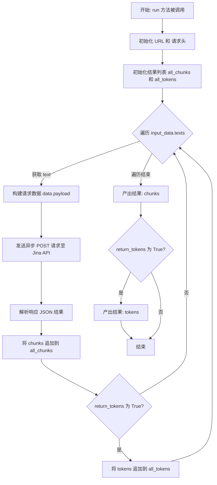
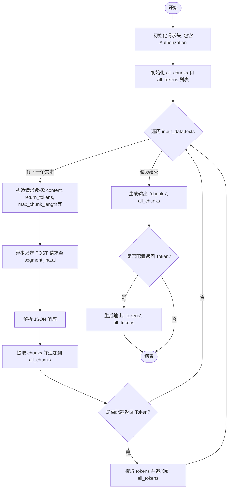

# `AutoGPT\autogpt_platform\backend\backend\blocks\jina\chunking.py` 详细设计文档

该代码定义了一个名为 JinaChunkingBlock 的数据处理组件，用于通过调用 Jina AI 的分割服务 API，将输入的文本列表按指定长度进行智能分块，并支持返回可选的 Token 信息。

## 整体流程



## 类结构

```
Block (外部依赖基类)
└── JinaChunkingBlock
    ├── Input (BlockSchemaInput)
    │   ├── texts
    │   ├── credentials
    │   ├── max_chunk_length
    │   └── return_tokens
    └── Output (BlockSchemaOutput)
        ├── chunks
        └── tokens
```

## 全局变量及字段


### `JinaChunkingBlock.Input.texts`
    
List of texts to chunk

类型：`list`
    


### `JinaChunkingBlock.Input.credentials`
    
Jina credentials for API authentication

类型：`JinaCredentialsInput`
    


### `JinaChunkingBlock.Input.max_chunk_length`
    
Maximum length of each chunk

类型：`int`
    


### `JinaChunkingBlock.Input.return_tokens`
    
Whether to return token information

类型：`bool`
    


### `JinaChunkingBlock.Output.chunks`
    
List of chunked texts

类型：`list`
    


### `JinaChunkingBlock.Output.tokens`
    
List of token information for each chunk

类型：`list`
    
    

## 全局函数及方法


### `JinaChunkingBlock.__init__`

该方法是 `JinaChunkingBlock` 类的构造函数，负责初始化块的元数据配置，包括其唯一标识符、功能描述、所属类别以及输入输出的数据结构定义。

参数：

- `self`: `JinaChunkingBlock`，类的实例引用，指代当前正在初始化的对象。

返回值：`None`，无返回值，主要用于完成对象的初始化设置。

#### 流程图

```mermaid
graph TD
    A[Start __init__] --> B[Call super().__init__]
    B --> C[Set ID: 806fb15e-830f-4796-8692-557d300ff43c]
    B --> D[Set Description: Chunks texts using Jina AI...]
    B --> E[Set Categories: AI, TEXT]
    B --> F[Set Input Schema: JinaChunkingBlock.Input]
    B --> G[Set Output Schema: JinaChunkingBlock.Output]
    C & D & E & F & G --> H[Parent Block Initialized]
    H --> I[End]
```

#### 带注释源码

```python
def __init__(self):
    # 调用父类 Block 的初始化方法，配置块的基本元数据
    super().__init__(
        # 定义该块的唯一标识符
        id="806fb15e-830f-4796-8692-557d300ff43c",
        # 定义该块的描述信息，说明其核心功能
        description="Chunks texts using Jina AI's segmentation service",
        # 定义该块所属的分类，此处包含 AI 和 TEXT 两个类别
        categories={BlockCategory.AI, BlockCategory.TEXT},
        # 定义该块的输入数据模式，映射到内部类 Input
        input_schema=JinaChunkingBlock.Input,
        # 定义该块的输出数据模式，映射到内部类 Output
        output_schema=JinaChunkingBlock.Output,
    )
```


### `JinaChunkingBlock.run`

该方法利用 Jina AI 的分割服务，异步处理输入的文本列表，根据配置将文本分割为指定长度的块，并可选择性地返回每个块的 Token 信息。

参数：

- `input_data`：`JinaChunkingBlock.Input`，包含待分割的文本列表（`texts`）、最大块长度（`max_chunk_length`）以及是否返回 Token 信息（`return_tokens`）等配置数据的输入对象。
- `credentials`：`JinaCredentials`，用于 Jina API 鉴权的凭据对象，包含 API 密钥。
- `**kwargs`：`dict`，其他额外的关键字参数（通常由框架传递的上下文信息）。

返回值：`BlockOutput`，一个异步生成器，产生包含分割后的文本块列表（键为 "chunks"）和可选的 Token 信息列表（键为 "tokens"）。

#### 流程图



#### 带注释源码

```python
async def run(
    self, input_data: Input, *, credentials: JinaCredentials, **kwargs
) -> BlockOutput:
    # 定义 Jina Segment API 的端点
    url = "https://segment.jina.ai/"
    
    # 构造请求头，包含 Content-Type 和 Bearer Token 认证信息
    headers = {
        "Content-Type": "application/json",
        "Authorization": f"Bearer {credentials.api_key.get_secret_value()}",
    }

    # 初始化列表，用于收集所有文本处理后的结果
    all_chunks = []
    all_tokens = []

    # 遍历输入的文本列表，逐个发送请求进行处理
    for text in input_data.texts:
        # 构造请求体数据
        # 将布尔值转换为字符串以符合 API 要求，设置 return_chunks 为 true
        data = {
            "content": text,
            "return_tokens": str(input_data.return_tokens).lower(),
            "return_chunks": "true",
            "max_chunk_length": str(input_data.max_chunk_length),
        }

        # 使用异步请求方法发送 POST 请求
        response = await Requests().post(url, headers=headers, json=data)
        # 解析响应的 JSON 数据
        result = response.json()

        # 将当前文本分割后的块追加到总列表中
        all_chunks.extend(result.get("chunks", []))
        
        # 如果配置要求返回 Token 信息，则同样进行追加
        if input_data.return_tokens:
            all_tokens.extend(result.get("tokens", []))

    # 输出最终的文本块列表
    yield "chunks", all_chunks
    
    # 如果配置要求，输出最终的 Token 信息列表
    if input_data.return_tokens:
        yield "tokens", all_tokens
```


## 关键组件


### Input Schema Component

定义块的输入契约，包含待处理的文本列表、Jina API 凭证、最大分块长度控制参数及是否返回 Token 的开关。

### Output Schema Component

定义块的输出契约，规范了分块后的文本列表及可选的 Token 信息列表的返回格式。

### Authentication Mechanism

处理 Jina AI 服务的身份验证，从凭证中提取 API Key 并将其封装为 Bearer Token 填入 HTTP 请求头，保障服务调用的安全性。

### Async HTTP Request Handler

负责与外部服务 Jina AI 进行异步网络交互，构造 JSON 请求体并发送 POST 请求，同时解析返回的 JSON 格式响应数据。

### Data Aggregation Logic

负责遍历输入文本列表，逐次调用分段服务并将分散的响应结果（分块数据和 Token 数据）聚合到最终的列表中。


## 问题及建议


### 已知问题

-   **低效的请求处理（N+1问题）**：当前代码在 `run` 方法中对 `input_data.texts` 列表进行循环，并为每一个文本单独发起一次 HTTP 请求。这种串行的请求方式会导致处理大量文本时延迟累积，效率低下。
-   **缺少错误处理与异常捕获**：代码未对 HTTP 响应的状态码进行检查（如 4xx 或 5xx 错误），也未对 `response.json()` 可能抛出的 JSON 解析异常进行捕获。如果 API 返回错误或非 JSON 格式数据，程序将直接崩溃。
-   **硬编码的服务端点**：API URL (`https://segment.jina.ai/`) 直接硬编码在 `run` 方法中，缺乏灵活性，难以在不同环境（如开发、测试、生产环境）之间进行切换或配置。

### 优化建议

-   **实现请求批处理或并发执行**：
    -   **批处理**：优先查询 Jina API 文档，确认是否支持一次请求处理多个文本。如果支持，应将所有文本合并为一个请求体发送，大幅减少网络开销。
    -   **并发**：如果 API 不支持批处理，应利用 `asyncio.gather` 将串行的 `await Requests().post(...)` 改为并发执行，以缩短总处理时间。
-   **增加健壮的错误处理逻辑**：添加对 HTTP 响应状态码的判断，若状态码非 200，应抛出明确的业务异常或返回错误信息。同时，使用 `try-except` 包裹 JSON 解析逻辑，确保数据格式错误时能够优雅降级。
-   **配置外部化**：将 API 的 URL、默认超时时间等配置参数提取为类常量或通过配置文件注入，提高代码的可维护性和灵活性。
-   **资源复用优化**：检查 `Requests` 类的实现，如果它内部维护了连接池或会话状态，应将其作为实例变量在 `__init__` 中初始化，而不是在每次 `run` 调用时都创建新实例。


## 其它


### 设计目标与约束

本部分旨在明确 `JinaChunkingBlock` 的设计初衷及其在系统运行中必须遵守的限制条件。

1.  **设计目标**：
    *   **高精度分块**：利用 Jina AI 的深度学习模型，对输入的长文本进行语义层面的切分，确保分块结果保持语义的连贯性和完整性，优于传统的基于字数或句号的简单切分。
    *   **异步非阻塞**：通过 `async def` 定义的执行方法，确保在进行网络请求时不会阻塞主线程或事件循环，提高系统的并发处理能力。
    *   **可配置性**：允许用户动态调整分块的最大长度 (`max_chunk_length`) 以及是否返回 Token 信息 (`return_tokens`)，以适应不同的下游任务需求。

2.  **约束条件**：
    *   **外部依赖强耦合**：该 Block 强依赖于 Jina AI 的 `https://segment.jina.ai/` 服务的可用性。如果外部服务宕机或响应超时，Block 的执行将失败。
    *   **网络环境要求**：运行环境必须能够访问公网，且与 Jina API 的延迟需控制在可接受范围内。
    *   **认证限制**：必须提供有效的 `JinaCredentials`（即有效的 API Key）。API Key 需要具备调用 Segment API 的权限，且需注意配额限制。
    *   **数据一致性**：当前实现中，若输入列表包含多个文本，处理过程是串行的（`for` 循环）。如果中间某一个文本请求失败，可能导致整个任务中断，已累积的上下文可能丢失（取决于上层调用者的异常处理机制）。
    *   **输入参数范围**：`max_chunk_length` 应为正整数，虽然代码通过 HTTP 传递字符串，但过小的值可能导致分块结果异常，过大的值可能导致性能下降或超出 API 限制。

### 错误处理与异常设计

本部分描述代码在遇到预期外情况时的行为逻辑及异常处理策略。

1.  **网络请求异常**：
    *   **超时与连接错误**：`Requests().post(url, ...)` 在调用过程中可能会抛出连接超时或网络不可达等异常。当前代码未显式捕获这些异常，异常将向上层传播，通常由框架的执行引擎捕获并记录为 Block 运行失败。
    *   **HTTP 状态码处理**：Jina API 可能返回非 200 状态码（如 401 Unauthorized, 429 Rate Limit, 500 Internal Server Error）。当前代码未检查 `response.status_code`，直接调用 `response.json()`。如果返回 4xx 或 5xx 且 Body 不是标准 JSON，将导致 JSON 解析错误。

2.  **数据解析异常**：
    *   **JSON 格式错误**：如果 Jina API 返回的响应体不是合法的 JSON 格式，`response.json()` 将抛出 `json.JSONDecodeError`。
    *   **字段缺失处理**：代码使用 `result.get("chunks", [])` 和 `result.get("tokens", [])`。这种防御性编程确保了如果 API 响应中缺少 `chunks` 或 `tokens` 字段，代码不会抛出 `KeyError`，而是返回空列表。这被设计为一种“优雅降级”，但这可能掩盖 API 接口变更导致的问题。

3.  **认证异常**：
    *   如果 API Key 无效或过期，API 通常返回 401。当前代码会将错误响应体尝试解析为 JSON，可能导致逻辑流程进入异常分支或解析错误。建议增强对认证失败的特殊处理。

4.  **改进建议**：
    *   引入 `try-except` 块包裹网络请求和 JSON 解析逻辑，针对特定的 HTTP 状态码（如 401, 429）抛出明确的业务异常，以便上层重试或终止。
    *   添加对 API 响应结构的严格校验。

### 数据流与状态机

本部分阐述数据在 Block 内部的流转路径以及执行过程中的状态变化。

1.  **数据流**：
    *   **输入阶段**：外部调用者传入 `Input` 对象，包含待分块的文本列表 (`texts`) 和配置参数。凭证 (`credentials`) 单独传入。
    *   **预处理阶段**：构建 HTTP 请求头，包含 `Authorization` Bearer Token。根据输入参数 (`max_chunk_length`, `return_tokens`) 准备 JSON 数据包。
    *   **交互阶段**：遍历输入列表中的每个文本，发起异步 POST 请求到 Jina API。
    *   **处理阶段**：接收 API 响应，解析 JSON。提取 `chunks` 并追加到 `all_chunks` 列表。若 `return_tokens` 为真，提取 `tokens` 追加到 `all_tokens` 列表。
    *   **输出阶段**：通过 Python 生成器 (`yield`) 依次产出 `chunks` 和 (可选的) `tokens`。

2.  **状态机**：
    *   由于 `JinaChunkingBlock` 是无状态的纯函数式 Block，其内部状态机较为简单，主要存在于单次 `run` 调用周期内：
    *   **Idle (空闲)**：Block 实例化完成，等待被调度。
    *   **Processing (处理中)**：`run` 方法被调用，进入 `for` 循环处理文本列表。此时可能处于 Waiting (等待网络响应) 子状态。
    *   **Yielding (产出中)**：所有文本处理完毕，开始 `yield` 数据。
    *   **Completed (完成)**：生成器结束，函数返回。

### 外部依赖与接口契约

本部分列出代码运行所依赖的外部组件及其接口规范。

1.  **外部依赖**：
    *   **Jina AI Segment API**
        *   **端点**：`https://segment.jina.ai/`
        *   **描述**：提供基于 AI 的文本分割服务的第三方 HTTP 接口。
    *   **`backend.util.request.Requests`**
        *   **描述**：项目内部封装的异步 HTTP 请求工具类，用于发送请求和处理响应。

2.  **接口契约**：
    *   **请求契约 (Outbound)**：
        *   **Method**：`POST`
        *   **Headers**：
            *   `Content-Type`: `application/json`
            *   `Authorization`: `Bearer <API_KEY>`
        *   **Body (JSON)**：
            *   `content` (string): 待分割的原始文本。
            *   `return_tokens` (string): "true" 或 "false"。
            *   `return_chunks` (string): 固定为 "true"。
            *   `max_chunk_length` (string): 块的最大长度字符串表示。
    *   **响应契约 (Inbound)**：
        *   Jina API 返回的 JSON 对象，预期包含以下字段：
            *   `chunks` (list[string]): 分割后的文本块列表。
            *   `tokens` (list[list[int]]): 可选，每个分块对应的 Token ID 列表。
        *   *注：代码假设这些字段存在于 JSON 根级别。*

3.  **内部接口契约**：
    *   **实现接口**：`Block` (继承自 `backend.data.block.Block`)
    *   **必须实现的方法**：`run(self, input_data: Input, *, credentials: JinaCredentials, **kwargs) -> BlockOutput`
    *   **输入模式**：`JinaChunkingBlock.Input`
    *   **输出模式**：`JinaChunkingBlock.Output`

### 安全性设计

1.  **敏感信息处理**：
    *   **API Key 保护**：代码使用 `credentials.api_key.get_secret_value()` 获取密钥。这表明底层 `JinaCredentials` 类可能使用了 `pydantic.SecretStr` 或类似机制来防止密钥在日志打印或调试输出中明文泄露。
    *   **传输安全**：所有外部请求均通过 `https://` 发送，确保传输过程中的数据加密。

2.  **注入风险**：
    *   请求参数直接来源于用户输入 (`input_data.texts`, `input_data.max_chunk_length`)。虽然 HTTP Body 使用 JSON 格式，降低了传统的 SQL 注入风险，但未经验证的超长字符串可能被发送至 Jina API，可能导致 DoS 攻击（针对第三方服务）或增加成本。建议在 `run` 方法开始处增加对输入文本长度的基本校验。

    