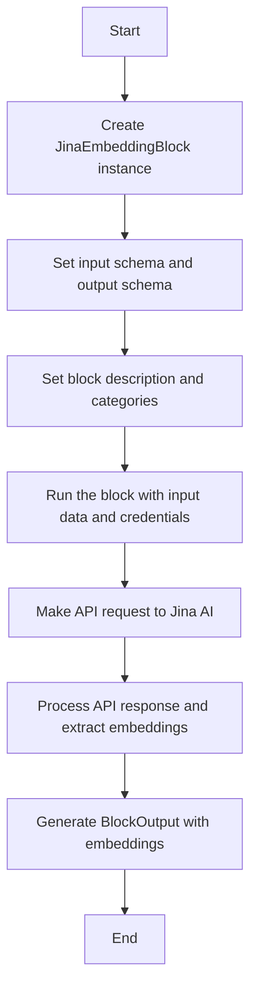
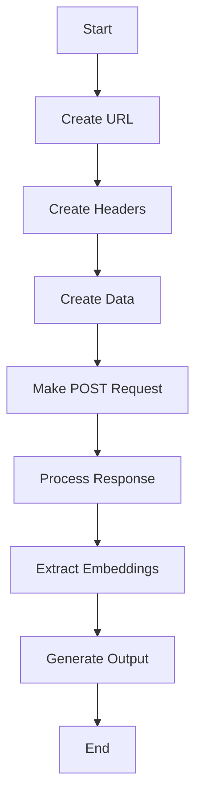
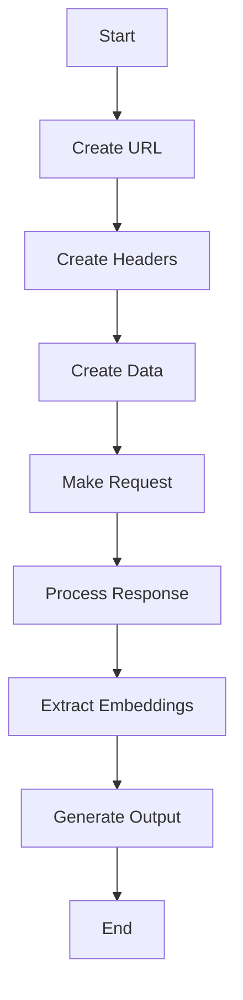
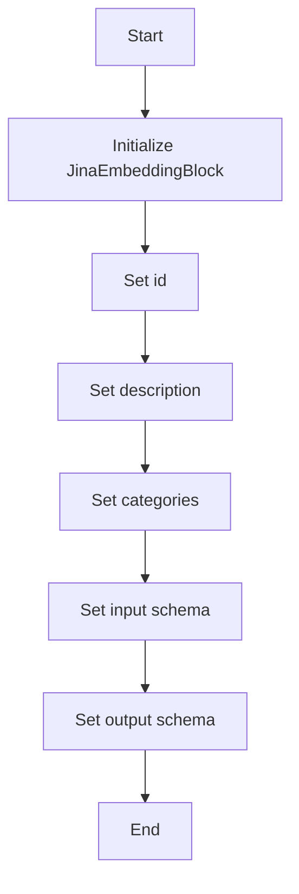

# `.\AutoGPT\autogpt_platform\backend\backend\blocks\jina\embeddings.py` 详细设计文档

The code defines a JinaEmbeddingBlock class that generates embeddings for a list of texts using the Jina AI platform.

## 整体流程



## 类结构

```
JinaEmbeddingBlock (Concrete Block)
```

## 全局变量及字段


### `Block`
    
Base class for all blocks in the system.

类型：`class`
    


### `BlockCategory`
    
Enum for categorizing blocks.

类型：`class`
    


### `BlockOutput`
    
Base class for all block outputs.

类型：`class`
    


### `BlockSchemaInput`
    
Base class for all block input schemas.

类型：`class`
    


### `BlockSchemaOutput`
    
Base class for all block output schemas.

类型：`class`
    


### `JinaCredentials`
    
Class for handling Jina credentials.

类型：`class`
    


### `JinaCredentialsField`
    
Field class for Jina credentials.

类型：`class`
    


### `JinaCredentialsInput`
    
Input class for Jina credentials.

类型：`class`
    


### `Requests`
    
Class for handling HTTP requests.

类型：`class`
    


### `JinaEmbeddingBlock.id`
    
Unique identifier for the JinaEmbeddingBlock.

类型：`str`
    


### `JinaEmbeddingBlock.description`
    
Description of the JinaEmbeddingBlock.

类型：`str`
    


### `JinaEmbeddingBlock.categories`
    
Categories to which the JinaEmbeddingBlock belongs.

类型：`set`
    


### `JinaEmbeddingBlock.input_schema`
    
Input schema for the JinaEmbeddingBlock.

类型：`JinaEmbeddingBlock.Input`
    


### `JinaEmbeddingBlock.output_schema`
    
Output schema for the JinaEmbeddingBlock.

类型：`JinaEmbeddingBlock.Output`
    


### `JinaEmbeddingBlock.id`
    
Unique identifier for the JinaEmbeddingBlock.

类型：`str`
    


### `JinaEmbeddingBlock.description`
    
Description of the JinaEmbeddingBlock.

类型：`str`
    


### `JinaEmbeddingBlock.categories`
    
Categories to which the JinaEmbeddingBlock belongs.

类型：`set`
    


### `JinaEmbeddingBlock.input_schema`
    
Input schema for the JinaEmbeddingBlock.

类型：`JinaEmbeddingBlock.Input`
    


### `JinaEmbeddingBlock.output_schema`
    
Output schema for the JinaEmbeddingBlock.

类型：`JinaEmbeddingBlock.Output`
    
    

## 全局函数及方法


### JinaEmbeddingBlock.__init__

This method initializes the `JinaEmbeddingBlock` class by calling the superclass `Block`'s `__init__` method with specific parameters.

参数：

- `id`：`str`，The unique identifier for the block.
- `description`：`str`，A brief description of the block's functionality.
- `categories`：`set`，A set of categories that the block belongs to.
- `input_schema`：`Input`，The input schema for the block.
- `output_schema`：`Output`，The output schema for the block.

返回值：`None`，This method does not return any value as it is an initializer.

#### 流程图

```mermaid
graph TD
    A[Start] --> B[Call super().__init__]
    B --> C[End]
```

#### 带注释源码

```
def __init__(self):
    # Initialize the superclass Block with the provided parameters
    super().__init__(
        id="7c56b3ab-62e7-43a2-a2dc-4ec4245660b6",
        description="Generates embeddings using Jina AI",
        categories={BlockCategory.AI},
        input_schema=JinaEmbeddingBlock.Input,
        output_schema=JinaEmbeddingBlock.Output,
    )
```


### `JinaEmbeddingBlock.run`

This method generates embeddings using the Jina AI service.

参数：

- `input_data`：`Input`，The input data containing texts to embed, credentials, and model information.
- `credentials`：`JinaCredentials`，The credentials object containing the API key for authentication.

返回值：`BlockOutput`，The output containing the embeddings generated by the Jina AI service.

#### 流程图



#### 带注释源码

```python
async def run(
    self, input_data: Input, *, credentials: JinaCredentials, **kwargs
) -> BlockOutput:
    # Define the URL for the Jina AI embeddings API
    url = "https://api.jina.ai/v1/embeddings"
    
    # Create headers with the necessary authorization token
    headers = {
        "Content-Type": "application/json",
        "Authorization": f"Bearer {credentials.api_key.get_secret_value()}"
    }
    
    # Prepare the data payload with the texts and model information
    data = {"input": input_data.texts, "model": input_data.model}
    
    # Make a POST request to the Jina AI API
    response = await Requests().post(url, headers=headers, json=data)
    
    # Process the response to extract the embeddings
    embeddings = [e["embedding"] for e in response.json()["data"]]
    
    # Generate the output with the embeddings
    yield "embeddings", embeddings
```


### `JinaEmbeddingBlock.run`

This method generates embeddings using the Jina AI service.

参数：

- `input_data`：`Input`，The input data containing texts to embed, credentials, and model information.
- `credentials`：`JinaCredentials`，The credentials object containing the API key for the Jina service.
- `**kwargs`：Any additional keyword arguments.

返回值：`BlockOutput`，The output containing the embeddings.

#### 流程图



#### 带注释源码

```python
async def run(
    self, input_data: Input, *, credentials: JinaCredentials, **kwargs
) -> BlockOutput:
    url = "https://api.jina.ai/v1/embeddings"  # Create URL
    headers = {  # Create Headers
        "Content-Type": "application/json",
        "Authorization": f"Bearer {credentials.api_key.get_secret_value()}"
    }
    data = {"input": input_data.texts, "model": input_data.model}  # Create Data
    response = await Requests().post(url, headers=headers, json=data)  # Make Request
    embeddings = [e["embedding"] for e in response.json()["data"]]  # Process Response
    yield "embeddings", embeddings  # Extract Embeddings
```


### JinaEmbeddingBlock.__init__

This method initializes the JinaEmbeddingBlock class, setting up its properties and configurations.

参数：

- `self`：`JinaEmbeddingBlock`，The instance of the JinaEmbeddingBlock class being initialized.
- `id`：`str`，The unique identifier for the block.
- `description`：`str`，A description of the block's functionality.
- `categories`：`set`，A set of categories that the block belongs to.
- `input_schema`：`JinaEmbeddingBlock.Input`，The input schema for the block.
- `output_schema`：`JinaEmbeddingBlock.Output`，The output schema for the block.

返回值：`None`，This method does not return a value.

#### 流程图



#### 带注释源码

```
def __init__(self):
    super().__init__(
        id="7c56b3ab-62e7-43a2-a2dc-4ec4245660b6",
        description="Generates embeddings using Jina AI",
        categories={BlockCategory.AI},
        input_schema=JinaEmbeddingBlock.Input,
        output_schema=JinaEmbeddingBlock.Output,
    )
```


### JinaEmbeddingBlock.run

This method generates embeddings for a list of texts using the specified Jina AI model and credentials.

参数：

- `input_data`：`Input`，The input data containing the texts to embed, the credentials, and the model to use.
- `credentials`：`JinaCredentials`，The credentials required to authenticate with the Jina API.

返回值：`BlockOutput`，The output containing the embeddings.

#### 流程图


#### 带注释源码

```
async def run(
    self, input_data: Input, *, credentials: JinaCredentials, **kwargs
) -> BlockOutput:
    url = "https://api.jina.ai/v1/embeddings"
    headers = {
        "Content-Type": "application/json",
        "Authorization": f"Bearer {credentials.api_key.get_secret_value()}",
    }
    data = {"input": input_data.texts, "model": input_data.model}
    response = await Requests().post(url, headers=headers, json=data)
    embeddings = [e["embedding"] for e in response.json()["data"]]
    yield "embeddings", embeddings
```


## 关键组件


### 张量索引与惰性加载

张量索引与惰性加载是用于高效处理大规模数据集的技术，它允许在需要时才加载数据，从而减少内存消耗和提高性能。

### 反量化支持

反量化支持是指系统对量化操作的反向操作，即从量化后的数据中恢复原始数据，这对于确保模型精度至关重要。

### 量化策略

量化策略是用于将浮点数模型转换为低精度表示的方法，以减少模型大小和提高推理速度。


## 问题及建议


### 已知问题

-   {问题1}：代码中使用了异步函数`run`，但没有明确说明该函数是否支持并发执行。如果多个实例同时调用`run`函数，可能会因为共享资源（如`credentials`）而导致竞态条件。
-   {问题2}：`JinaCredentials`和`JinaCredentialsField`的使用可能存在安全问题，因为`api_key`的值可能会被暴露。应该考虑使用环境变量或配置文件来存储敏感信息。
-   {问题3}：代码中没有错误处理机制，如果API请求失败或返回错误，程序可能会崩溃。应该添加异常处理来确保程序的健壮性。
-   {问题4}：`Requests`类没有在代码中定义，这可能导致代码无法正常运行。需要确保`Requests`类已经正确实现。

### 优化建议

-   {建议1}：实现并发控制机制，确保`run`函数在并发执行时不会相互干扰。
-   {建议2}：使用环境变量或配置文件来存储敏感信息，如API密钥，以增强安全性。
-   {建议3}：添加异常处理逻辑，以处理API请求失败或返回错误的情况，并确保程序能够优雅地处理这些情况。
-   {建议4}：确保`Requests`类已经实现，并在代码中正确引用。
-   {建议5}：考虑使用更高级的异步HTTP客户端，如`aiohttp`，以提高性能和可靠性。
-   {建议6}：在代码中添加日志记录，以便于调试和监控。
-   {建议7}：对输入数据进行验证，确保它们符合预期的格式和类型。


## 其它


### 设计目标与约束

- 设计目标：
  - 实现一个高效且可扩展的Jina AI嵌入块，用于生成文本的嵌入表示。
  - 确保嵌入块能够处理大量文本数据，并保持响应时间在可接受范围内。
  - 提供灵活的配置选项，允许用户选择不同的嵌入模型和API密钥。
- 约束：
  - 必须使用Jina AI提供的API进行嵌入生成。
  - 输入数据格式必须符合Jina AI API的要求。
  - 需要处理API密钥的安全存储和访问。

### 错误处理与异常设计

- 错误处理：
  - 在API请求失败时，捕获异常并返回错误信息。
  - 对于不合法的输入数据，抛出异常并返回错误信息。
  - 对于网络错误，重试请求并记录错误。
- 异常设计：
  - 定义自定义异常类，如`EmbeddingError`，用于处理嵌入生成过程中可能出现的错误。

### 数据流与状态机

- 数据流：
  - 输入数据通过`run`方法传递给API。
  - API返回嵌入数据，通过`yield`语句返回给调用者。
- 状态机：
  - 无状态机，因为该块仅处理单个请求并返回结果。

### 外部依赖与接口契约

- 外部依赖：
  - Jina AI API
  - `requests`库用于HTTP请求
- 接口契约：
  - `JinaCredentials`类用于管理API密钥
  - `Requests`类用于发送HTTP请求
  - `Block`类和其相关类用于定义数据块和输入输出模式

    