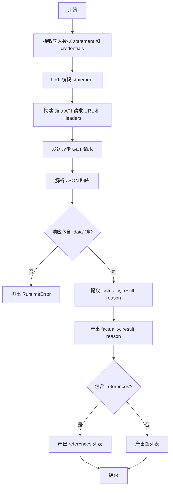
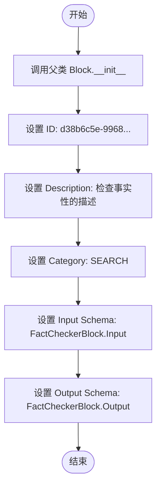
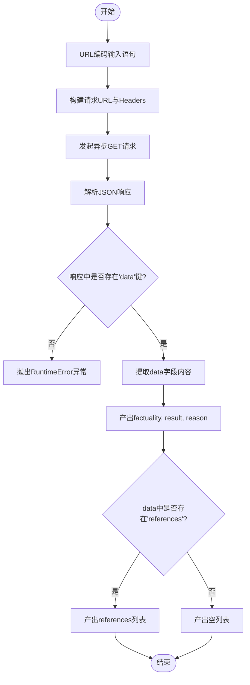

# `AutoGPT\autogpt_platform\backend\backend\blocks\jina\fact_checker.py` 详细设计文档

该代码定义了一个 FactCheckerBlock 类，用于通过 Jina AI 的 Grounding API 验证输入陈述的事实性，并返回事实性得分、布尔结果、推理依据及相关引用列表。

## 整体流程



## 类结构

```
Reference (TypedDict)
├── url: str
├── keyQuote: str
└── isSupportive: bool

Block (外部基类)
└── FactCheckerBlock
    ├── Input (BlockSchemaInput)
    │   ├── statement: str
    │   └── credentials: JinaCredentialsInput
    └── Output (BlockSchemaOutput)
        ├── factuality: float
        ├── result: bool
        ├── reason: str
        └── references: List[Reference]
```

## 全局变量及字段


### `Reference.url`
    
The URL link pointing to the reference source.

类型：`str`
    


### `Reference.keyQuote`
    
A specific quote or snippet extracted from the reference content.

类型：`str`
    


### `Reference.isSupportive`
    
A boolean flag indicating whether the reference supports the statement.

类型：`bool`
    


### `FactCheckerBlock.Input`
    
Nested class defining the input schema, which includes the statement to be checked and the necessary Jina credentials.

类型：`BlockSchemaInput`
    


### `FactCheckerBlock.Output`
    
Nested class defining the output schema, containing the factuality score, result, reason, and a list of references.

类型：`BlockSchemaOutput`
    
    

## 全局函数及方法


### `FactCheckerBlock.__init__`

该方法用于初始化 `FactCheckerBlock` 类的实例。它主要负责设置块的元数据，包括唯一标识符、功能描述、所属分类，并定义该块的输入和输出数据结构模式，通过调用父类的初始化方法完成注册。

参数：

-  `self`：`FactCheckerBlock`，类的实例本身，代表当前正在初始化的块对象。

返回值：`None`，初始化方法不返回任何值。

#### 流程图



#### 带注释源码

```python
def __init__(self):
    # 调用父类 Block 的初始化方法，注册块的元数据和结构定义
    super().__init__(
        # 定义该块的唯一标识符 (UUID)
        id="d38b6c5e-9968-4271-8423-6cfe60d6e7e6",
        # 提供该块的功能描述，说明其使用 Jina AI 的 Grounding API 检查陈述的事实性
        description="This block checks the factuality of a given statement using Jina AI's Grounding API.",
        # 定义该块所属的分类，此处归类为搜索类 (SEARCH)
        categories={BlockCategory.SEARCH},
        # 指定输入数据的结构模式，使用内部类 Input 定义
        input_schema=FactCheckerBlock.Input,
        # 指定输出数据的结构模式，使用内部类 Output 定义
        output_schema=FactCheckerBlock.Output,
    )
```


### `FactCheckerBlock.run`

该方法负责执行事实检查的核心逻辑。它接收用户输入的陈述和 Jina AI 的认证凭据，通过构造 HTTP 请求调用 Jina AI 的 Grounding API，解析返回的 JSON 数据，并验证响应的有效性，最终产出事实性评分、布尔结果、原因说明以及相关的引用列表。

参数：

- `input_data`: `FactCheckerBlock.Input`，包含待检查的事实陈述语句。
- `credentials`: `JinaCredentials`，Jina AI 的 API 认证凭据，用于接口鉴权。
- `**kwargs`: `Any`，其他可选的关键字参数（本方法中未直接使用）。

返回值：`BlockOutput`，一个异步生成器，按顺序产出包含 `factuality`（分数）、`result`（结果）、`reason`（原因）和 `references`（引用）的元组。

#### 流程图



#### 带注释源码

```python
async def run(
    self, input_data: Input, *, credentials: JinaCredentials, **kwargs
) -> BlockOutput:
    # 对输入的陈述语句进行 URL 编码，以确保其作为 URL 路径参数时的安全性
    encoded_statement = quote(input_data.statement)
    # 构建 Jina AI Grounding API 的完整请求 URL
    url = f"https://g.jina.ai/{encoded_statement}"

    # 构造请求头，指定接受 JSON 格式响应，并添加 Bearer Token 进行认证
    headers = {
        "Accept": "application/json",
        "Authorization": f"Bearer {credentials.api_key.get_secret_value()}",
    }

    # 使用封装的 Requests 工具发起异步 GET 请求
    response = await Requests().get(url, headers=headers)
    # 将响应体解析为 JSON 格式字典
    data = response.json()

    # 验证响应数据结构是否包含预期的 'data' 键
    if "data" in data:
        # 获取实际的数据内容
        data = data["data"]
        # 产出事实性评分
        yield "factuality", data["factuality"]
        # 产出事实性检查的布尔结果
        yield "result", data["result"]
        # 产出检查结果的文本原因
        yield "reason", data["reason"]

        # 检查并产出参考引用列表
        if "references" in data:
            yield "references", data["references"]
        else:
            # 如果响应中没有引用，则产出空列表
            yield "references", []
    else:
        # 如果响应格式不符合预期（缺少 'data' 键），抛出运行时错误
        raise RuntimeError(f"Expected 'data' key not found in response: {data}")
```


## 关键组件


### FactCheckerBlock
核心处理类，继承自 Block，负责定义输入输出的数据模式，并封装调用 Jina AI API 进行事实核查的异步执行逻辑。
### Jina AI Grounding API
外部依赖服务，通过 RESTful 接口接收待核查的陈述，返回包含真实性评分、布尔结果、原因描述及参考引用列表的 JSON 数据。
### Requests Utility
底层网络通信组件，用于封装 HTTP GET 请求，处理 URL 编码和鉴权头，实现与外部 API 的异步数据交互。
### Schema Definitions
数据契约定义组件，包含 Input 和 Output 类以及 Reference TypedDict，严格定义了输入参数、凭据及输出结果的结构与类型。


## 问题及建议


### 已知问题

-   缺乏对响应数据子字段的防御性检查：代码仅检查了根节点 `data` 是否存在，便直接访问 `data["factuality"]`、`data["result"]` 等字段。如果 API 返回的 `data` 结构不完整（例如缺少某个字段），程序将直接抛出 `KeyError` 中断执行。
-   未使用的参数：`run` 方法签名中包含了 `**kwargs`，但在方法体内部并未使用。这虽然不会导致错误，但会降低代码的清晰度，可能掩盖参数传递错误。
-   硬编码配置：API 端点 URL (`https://g.jina.ai/`) 直接以字符串字面量形式写在代码逻辑中，不利于后续的维护、版本切换或环境配置管理。

### 优化建议

-   增强数据提取的健壮性：在访问 `data` 内部字段前，使用字典的 `.get()` 方法或显式存在性检查，并为缺失的关键字段提供默认值或抛出包含具体字段名的业务异常，以防止因 API 变更导致的运行时崩溃。
-   常量化外部配置：将 API 基础 URL 提取为类级别的常量（如 `API_BASE_URL`）或通过配置注入，从而提高代码的可读性和可维护性。
-   增加输入前置校验：在构建请求前检查 `input_data.statement` 是否为空或仅包含空白字符，避免对无效内容发起不必要的网络请求。
-   细化异常处理与日志：区分网络请求失败、JSON 解析错误、业务逻辑错误等不同场景，抛出具体的异常类型；同时添加请求日志（如 URL、响应状态），以便于在生产环境中排查问题。


## 其它


### 设计目标与约束

- **设计目标**：
  - 提供一个基于 Jina AI Grounding API 的异步事实核查功能，能够对给定的陈述进行自动化验证并返回结构化的核查结果（包括分值、结论、原因及参考来源）。
  - 封装外部 API 调用的复杂性，通过统一的 Block 接口集成到工作流中，支持流式输出处理结果。
- **约束条件**：
  - **网络依赖**：该模块高度依赖 Jina AI 服务的网络可用性和响应速度，必须能够处理网络延迟或中断。
  - **认证要求**：调用外部 API 必须持有有效的 `JinaCredentials` (API Key)，否则无法获取数据。
  - **数据格式**：依赖于 Jina API 返回的 JSON 结构中必须包含 `data` 字段，且该字段下必须包含 `factuality`, `result`, `reason` 等特定键名。

### 错误处理与异常设计

- **异常处理策略**：
  - **结构验证**：代码在获取响应后首先检查 JSON 数据中是否存在 `data` 键。如果缺失，表明 API 返回了意外的数据结构或错误信息，程序将抛出 `RuntimeError` 并附带原始响应内容，以便上层调用者进行排查。
  - **网络层异常**：底层的网络请求（如 DNS 解析失败、连接超时等）由 `backend.util.request.Requests` 类处理，当前 Block 假设网络层异常会被该类抛出或处理，未在当前代码块中显式捕获 HTTP 状态码（如 401, 500）。
  - **数据流异常**：如果 API 返回的 JSON 无法解析（`response.json()` 失败），将抛出 JSON 解析异常。
- **错误传播**：所有未捕获的异常将直接向上传播至工作流引擎，中断当前 Block 的执行。

### 数据流与状态机

- **数据流**：
  1. **输入阶段**：接收用户输入的 `statement` (待核查陈述) 和 `credentials` (API 凭证)。
  2. **预处理阶段**：使用 `urllib.parse.quote` 对陈述进行 URL 编码，确保传输安全。
  3. **交互阶段**：构造 HTTP GET 请求发送至 Jina API，携带 Authorization Header。
  4. **处理阶段**：接收 HTTP 响应，解析 JSON 体，提取核心数据字段。
  5. **输出阶段**：通过 Python 异步生成器 (`yield`) 依次产出 `factuality`, `result`, `reason` 和 `references`。
- **状态机**：
  - `Idle`：Block 初始化完成，等待执行。
  - `Processing`：执行 `run` 方法，正在进行网络请求和数据解析。
  - `Yielding`：成功解析数据，正在逐个产出结果字段。
  - `Failed`：在处理过程中检测到数据结构错误或发生异常，终止执行并报错。
  - `Completed`：所有结果字段产出完毕，任务结束。

### 外部依赖与接口契约

- **外部依赖**：
  - **Jina AI Grounding API**：
    - **端点**：`https://g.jina.ai/{encoded_statement}`
    - **协议**：HTTP/HTTPS (GET)
    - **认证方式**：Bearer Token (位于 Header `Authorization`)
    - **预期响应格式**：JSON 对象，必须包含顶层 `data` 字段，内部包含 `factuality` (float), `result` (bool), `reason` (str), 以及可选的 `references` (list)。
- **内部依赖**：
  - `backend.util.request.Requests`：用于执行异步 HTTP 请求。
  - `backend.data.block.Block`：基类，定义了执行规范和输入输出模式。
  - `backend.blocks.jina._auth`：提供凭证定义和验证逻辑。

### 安全性设计

- **敏感信息保护**：
  - 使用 `JinaCredentials` 封装 API Key，在构造请求头时通过 `credentials.api_key.get_secret_value()` 获取密钥值，避免了日志打印或调试时意外泄露明文密钥。
- **输入净化**：
  - 对用户输入的 `statement` 强制进行 URL 编码 (`quote`)，防止注入攻击或因特殊字符导致 URL 格式错误，确保请求符合 HTTP 标准格式。
- **数据传输安全**：
  - 默认使用 HTTPS 协议与外部 API 通信，确保传输过程中的数据加密。

    