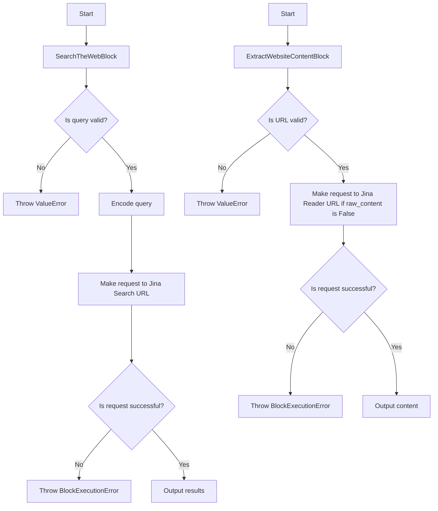
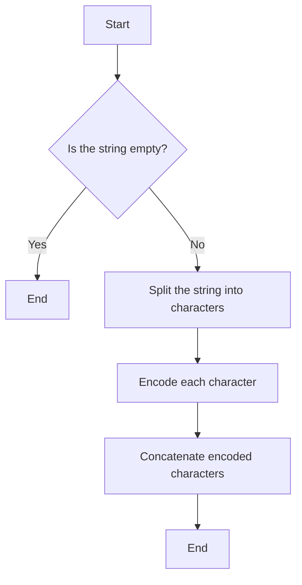
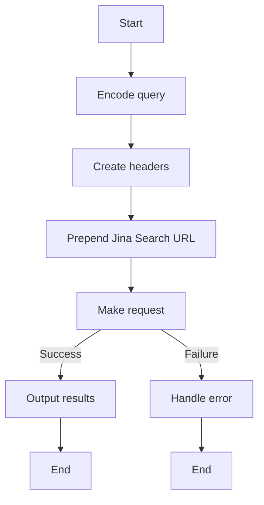
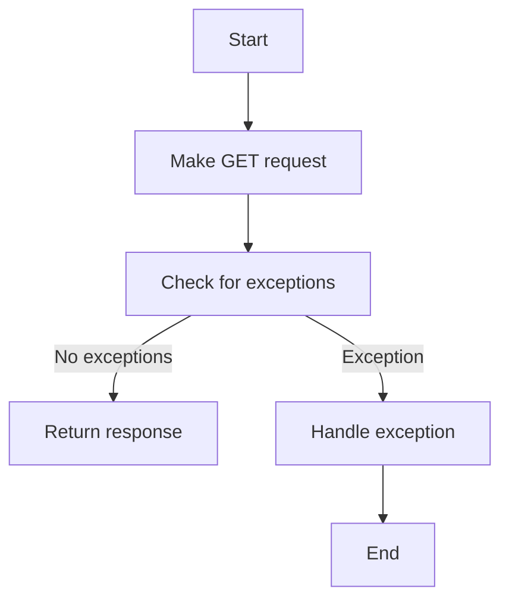
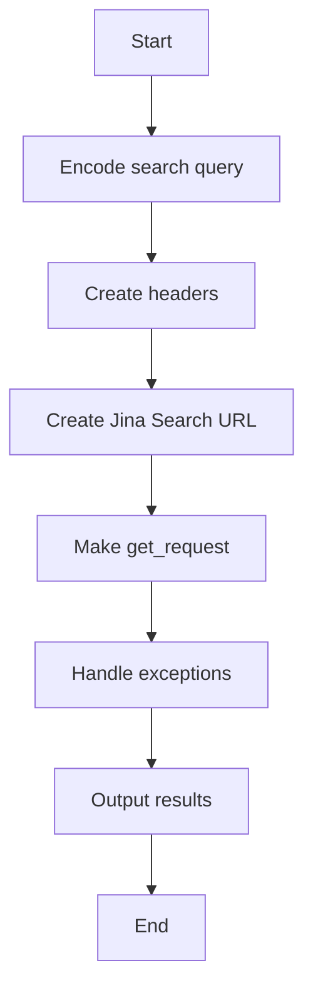

# `.\AutoGPT\autogpt_platform\backend\backend\blocks\jina\search.py` 详细设计文档

The file implements two blocks for searching the web and extracting content from a given URL using Jina's API.

## 整体流程



## 类结构

```
SearchTheWebBlock (Block, GetRequest)
├── Input (BlockSchemaInput)
│   ├── credentials (JinaCredentialsInput)
│   └── query (str)
└── Output (BlockSchemaOutput)
    └── results (str)
```

## 全局变量及字段


### `TEST_CREDENTIALS`
    
Test credentials for the Jina API.

类型：`JinaCredentials`
    


### `TEST_CREDENTIALS_INPUT`
    
Test input for JinaCredentials.

类型：`JinaCredentialsInput`
    


### `JinaCredentials`
    
Class representing Jina credentials.

类型：`class`
    


### `JinaCredentialsField`
    
Class representing a field in JinaCredentials.

类型：`class`
    


### `JinaCredentialsInput`
    
Class representing input for JinaCredentials.

类型：`class`
    


### `GetRequest`
    
Class representing a get request.

类型：`class`
    


### `Block`
    
Base class for blocks.

类型：`class`
    


### `BlockCategory`
    
Class representing block categories.

类型：`class`
    


### `BlockOutput`
    
Class representing block output.

类型：`class`
    


### `BlockSchemaInput`
    
Class representing block schema input.

类型：`class`
    


### `BlockSchemaOutput`
    
Class representing block schema output.

类型：`class`
    


### `SchemaField`
    
Class representing schema fields.

类型：`class`
    


### `BlockExecutionError`
    
Class representing block execution errors.

类型：`class`
    


### `SearchTheWebBlock.id`
    
Unique identifier for the block.

类型：`str`
    


### `SearchTheWebBlock.description`
    
Description of the block.

类型：`str`
    


### `SearchTheWebBlock.categories`
    
Categories to which the block belongs.

类型：`set`
    


### `SearchTheWebBlock.input_schema`
    
Input schema for the block.

类型：`BlockSchemaInput`
    


### `SearchTheWebBlock.output_schema`
    
Output schema for the block.

类型：`BlockSchemaOutput`
    


### `SearchTheWebBlock.test_input`
    
Test input data for the block.

类型：`dict`
    


### `SearchTheWebBlock.test_credentials`
    
Test credentials for the block.

类型：`JinaCredentials`
    


### `SearchTheWebBlock.test_output`
    
Test output data for the block.

类型：`tuple`
    


### `SearchTheWebBlock.test_mock`
    
Mock data for testing the block.

类型：`dict`
    


### `Input.credentials`
    
Credentials for the input.

类型：`JinaCredentialsInput`
    


### `Input.query`
    
Search query for the input.

类型：`str`
    


### `Output.results`
    
Search results from the input.

类型：`str`
    


### `Input.url`
    
URL to scrape content from.

类型：`str`
    


### `Input.raw_content`
    
Whether to scrape raw content or use Jina-ai Reader.

类型：`bool`
    


### `Output.content`
    
Scraped content from the URL.

类型：`str`
    


### `Output.error`
    
Error message if content cannot be retrieved.

类型：`str`
    
    

## 全局函数及方法


### `quote`

`quote` 函数用于对字符串进行URL编码。

参数：

- `str`：要编码的字符串，{参数描述}

返回值：`str`，编码后的字符串，{返回值描述}

#### 流程图



#### 带注释源码

```python
from urllib.parse import quote

def quote(str):
    # Encode the string for use in a URL
    encoded_str = quote(str)
    return encoded_str
```


### SearchTheWebBlock.run

This method runs the SearchTheWebBlock, which searches the internet for the given search query and returns the search results.

参数：

- `input_data`：`Input`，The input data for the block, which includes the search query and credentials.
- `credentials`：`JinaCredentials`，The credentials required for the search, including the API key.
- `**kwargs`：Any additional keyword arguments that may be needed for the block.

返回值：`BlockOutput`，The output of the block, which includes the search results.

#### 流程图



#### 带注释源码

```python
async def run(self, input_data: Input, *, credentials: JinaCredentials, **kwargs) -> BlockOutput:
    # Encode the search query
    encoded_query = quote(input_data.query)
    headers = {
        "Content-Type": "application/json",
        "Authorization": f"Bearer {credentials.api_key.get_secret_value()}",
    }

    # Prepend the Jina Search URL to the encoded query
    jina_search_url = f"https://s.jina.ai/{encoded_query}"

    try:
        results = await self.get_request(
            jina_search_url, headers=headers, json=False
        )
    except Exception as e:
        raise BlockExecutionError(
            message=f"Search failed: {e}",
            block_name=self.name,
            block_id=self.id,
        ) from e

    # Output the search results
    yield "results", results
```


### `SearchTheWebBlock.get_request`

This method is used to make a GET request to the specified URL with the provided headers and JSON payload.

参数：

- `url`：`str`，The URL to which the GET request is made.
- `headers`：`dict`，Optional. The headers to be sent with the request.
- `json`：`bool`，Optional. If set to True, the request will be made with a JSON payload.

返回值：`str`，The response from the GET request.

#### 流程图



#### 带注释源码

```python
async def get_request(self, url, headers=None, json=None):
    # Encode the search query
    encoded_query = quote(input_data.query)
    headers = {
        "Content-Type": "application/json",
        "Authorization": f"Bearer {credentials.api_key.get_secret_value()}",
    }

    # Prepend the Jina Search URL to the encoded query
    jina_search_url = f"https://s.jina.ai/{encoded_query}"

    try:
        results = await self.get_request(
            jina_search_url, headers=headers, json=False
        )
    except Exception as e:
        raise BlockExecutionError(
            message=f"Search failed: {e}",
            block_name=self.name,
            block_id=self.id,
        ) from e

    # Output the search results
    yield "results", results
```

Note: The provided source code snippet is not the actual implementation of `get_request` but rather a part of the `run` method in `SearchTheWebBlock`. The actual `get_request` method is not shown in the provided code. The above description and source code are based on the context provided in the task.


### `SearchTheWebBlock.__init__`

This method initializes the `SearchTheWebBlock` class by setting up its properties and configurations.

参数：

- `id`：`str`，The unique identifier for the block.
- `description`：`str`，A brief description of the block's functionality.
- `categories`：`set`，A set of categories that the block belongs to.
- `input_schema`：`Input`，The input schema for the block.
- `output_schema`：`Output`，The output schema for the block.
- `test_input`：`dict`，The test input data for the block.
- `test_credentials`：`dict`，The test credentials for the block.
- `test_output`：`tuple`，The expected test output for the block.
- `test_mock`：`dict`，Mock data for testing the block.

返回值：无

#### 流程图

```mermaid
classDiagram
    class SearchTheWebBlock {
        id : str
        description : str
        categories : set
        input_schema : Input
        output_schema : Output
        test_input : dict
        test_credentials : dict
        test_output : tuple
        test_mock : dict
    }
    SearchTheWebBlock :>> Block
    SearchTheWebBlock :>> GetRequest
    Block {
        id : str
        description : str
        categories : set
        input_schema : Input
        output_schema : Output
        test_input : dict
        test_credentials : dict
        test_output : tuple
        test_mock : dict
    }
    GetRequest {
        get_request : async def(url: str, headers: dict, json: bool) -> str
    }
    SearchTheWebBlock <..> GetRequest
}
```

#### 带注释源码

```python
def __init__(self):
    super().__init__(
        id="87840993-2053-44b7-8da4-187ad4ee518c",
        description="This block searches the internet for the given search query.",
        categories={BlockCategory.SEARCH},
        input_schema=SearchTheWebBlock.Input,
        output_schema=SearchTheWebBlock.Output,
        test_input={
            "credentials": TEST_CREDENTIALS_INPUT,
            "query": "Artificial Intelligence",
        },
        test_credentials=TEST_CREDENTIALS,
        test_output=("results", "search content"),
        test_mock={"get_request": lambda *args, **kwargs: "search content"},
    )
```


### SearchTheWebBlock.run

This method searches the internet for the given search query and returns the search results.

参数：

- `input_data`：`Input`，The input data containing the search query and credentials.
- `credentials`：`JinaCredentials`，The credentials for the Jina API.

返回值：`BlockOutput`，The search results including content from top 5 URLs.

#### 流程图



#### 带注释源码

```python
async def run(self, input_data: Input, *, credentials: JinaCredentials, **kwargs) -> BlockOutput:
    # Encode the search query
    encoded_query = quote(input_data.query)
    headers = {
        "Content-Type": "application/json",
        "Authorization": f"Bearer {credentials.api_key.get_secret_value()}",
    }

    # Prepend the Jina Search URL to the encoded query
    jina_search_url = f"https://s.jina.ai/{encoded_query}"

    try:
        results = await self.get_request(
            jina_search_url, headers=headers, json=False
        )
    except Exception as e:
        raise BlockExecutionError(
            message=f"Search failed: {e}",
            block_name=self.name,
            block_id=self.id,
        ) from e

    # Output the search results
    yield "results", results
```


## 关键组件


### 张量索引与惰性加载

用于高效地索引和检索数据，同时延迟加载数据以优化性能。

### 反量化支持

提供对反量化操作的支持，以适应不同的量化需求。

### 量化策略

实现量化策略，以优化模型的精度和性能。


## 问题及建议


### 已知问题

-   **全局变量和函数依赖性**：代码中使用了全局变量和函数，如`TEST_CREDENTIALS`, `TEST_CREDENTIALS_INPUT`, `JinaCredentials`, `JinaCredentialsField`, `JinaCredentialsInput`, `Block`, `BlockCategory`, `BlockOutput`, `BlockSchemaInput`, `BlockSchemaOutput`, `SchemaField`, 和 `BlockExecutionError`。这些全局变量和函数的来源和定义不在代码片段中，这可能导致维护困难，特别是在大型项目中。
-   **异常处理**：`run`方法中使用了`try-except`块来捕获异常，但没有指定具体的异常类型。这可能导致捕获了不必要的异常，或者遗漏了某些关键异常。
-   **代码重复**：`SearchTheWebBlock`和`ExtractWebsiteContentBlock`类都使用了`GetRequest`基类，并且都调用了`get_request`方法。这可能导致代码重复，如果`GetRequest`基类发生变化，需要修改两个类。
-   **测试数据**：测试数据硬编码在代码中，这不利于代码的复用和测试。

### 优化建议

-   **减少全局变量和函数依赖性**：将全局变量和函数的定义移入代码片段中，或者通过适当的模块导入来管理它们。
-   **改进异常处理**：明确指定`try-except`块中捕获的异常类型，以便更好地控制异常处理。
-   **减少代码重复**：考虑将共通逻辑提取到一个单独的类或函数中，以减少代码重复。
-   **使用测试框架**：使用测试框架来管理测试数据，而不是硬编码在代码中。
-   **代码审查**：进行代码审查，以确保代码质量和一致性。
-   **文档化**：为代码添加适当的文档注释，以提高代码的可读性和可维护性。


## 其它


### 设计目标与约束

- 设计目标：
  - 实现一个模块化的搜索引擎，能够从互联网上检索信息。
  - 提供一个可扩展的框架，允许添加新的搜索和内容提取功能。
  - 确保代码的可维护性和可读性。
- 约束：
  - 必须使用Jina框架进行请求处理。
  - 必须处理可能的网络错误和异常情况。
  - 必须遵守API的使用条款和限制。

### 错误处理与异常设计

- 错误处理：
  - 使用自定义异常`BlockExecutionError`来处理搜索和内容提取过程中的错误。
  - 异常信息应包含错误描述、块名称和块ID。
- 异常设计：
  - 异常应提供足够的信息，以便调用者能够了解错误的原因和上下文。

### 数据流与状态机

- 数据流：
  - 输入数据通过`Input`类传递给`run`方法。
  - 输出数据通过`yield`语句返回。
- 状态机：
  - 每个块的状态由其输入和输出数据以及执行过程中的中间状态定义。

### 外部依赖与接口契约

- 外部依赖：
  - `urllib.parse.quote`用于对搜索查询进行编码。
  - `JinaCredentials`和`JinaCredentialsField`用于处理认证信息。
  - `GetRequest`用于发送HTTP请求。
- 接口契约：
  - `Block`类定义了块的基本接口。
  - `GetRequest`类定义了发送HTTP请求的接口。
  - `SchemaField`用于定义输入和输出数据的结构。


    