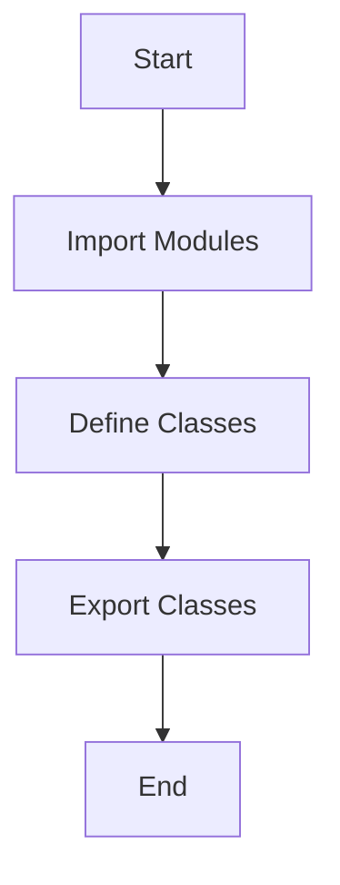
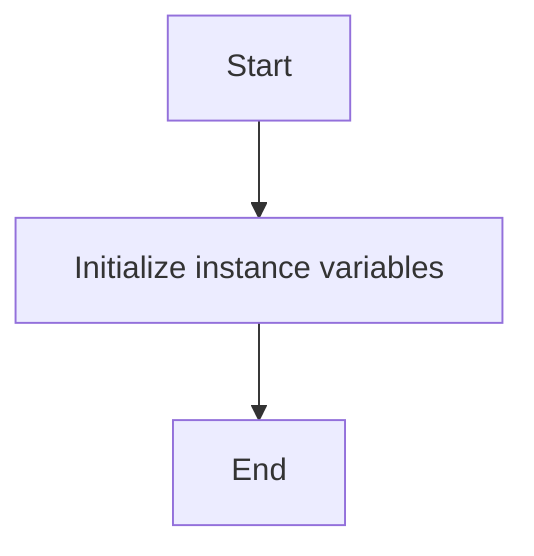
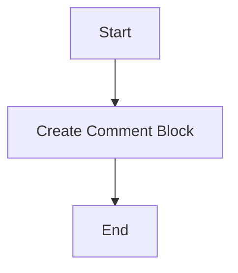
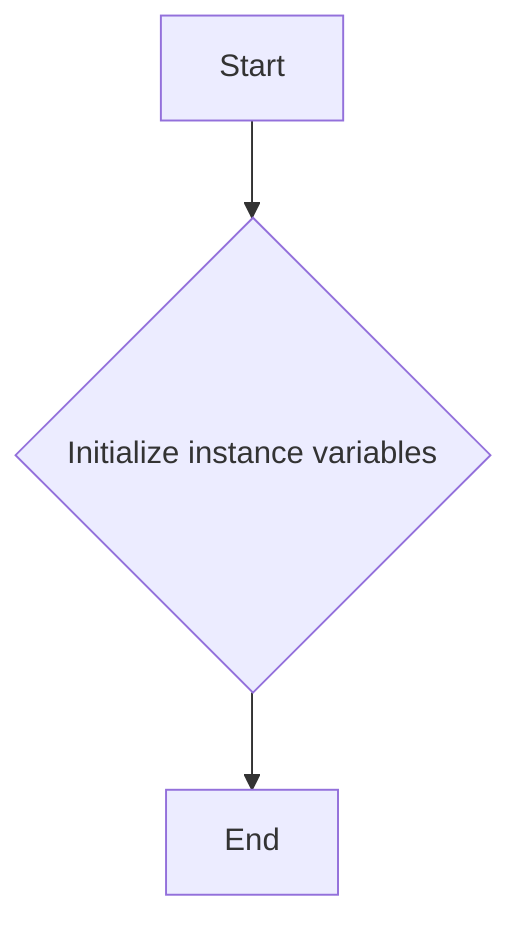
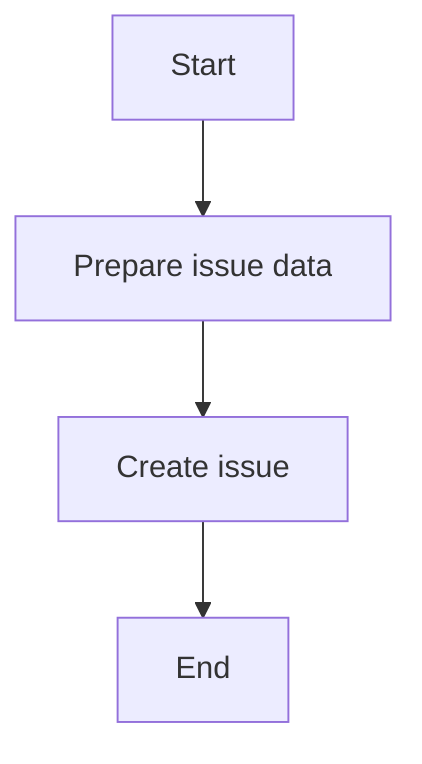
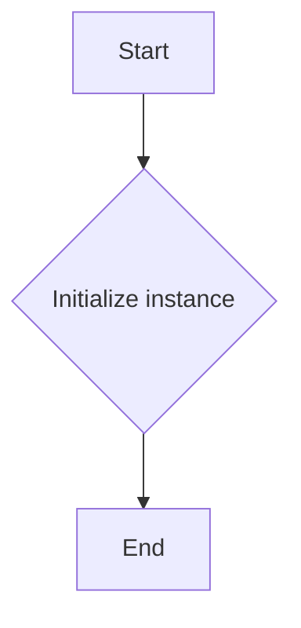
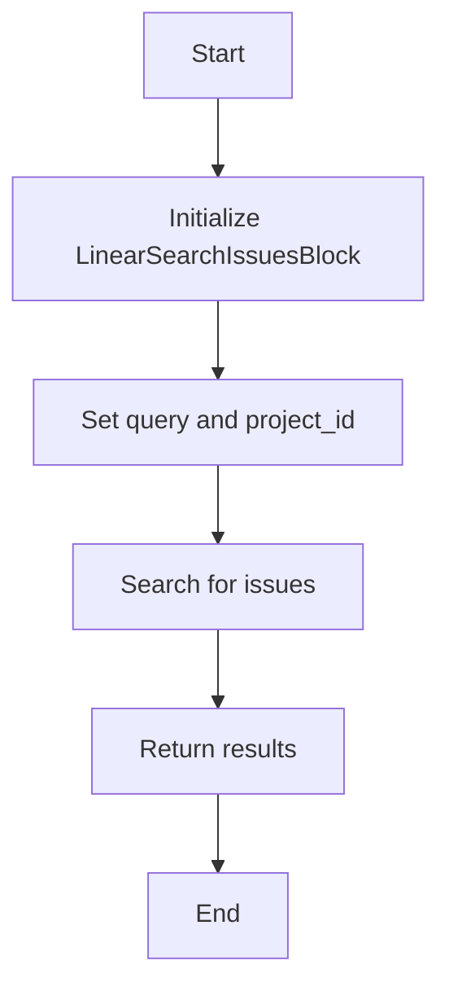
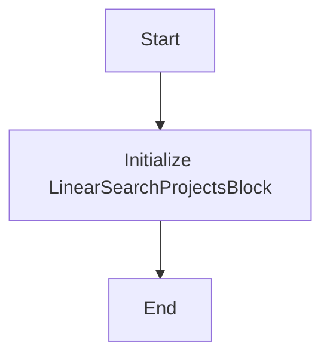
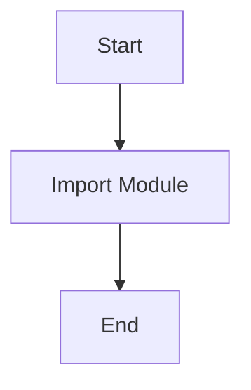

# `.\AutoGPT\autogpt_platform\backend\backend\blocks\linear\__init__.py` 详细设计文档

This code provides linear integration blocks for the AutoGPT platform, enabling the creation of comments, issues, and searching for projects within the platform.

## 整体流程



## 类结构

```
AutoGPT_Platform_integration_blocks (Module)
├── LinearCreateCommentBlock (Class)
│   ├── __init__(self, ...)
│   └── ...
├── LinearCreateIssueBlock (Class)
│   ├── __init__(self, ...)
│   └── ...
├── LinearSearchIssuesBlock (Class)
│   ├── __init__(self, ...)
│   └── ...
└── LinearSearchProjectsBlock (Class)
    ├── __init__(self, ...)
    └── ...
```

## 全局变量及字段


### `__all__`
    
A list of all exported classes and functions from the module.

类型：`list`
    


### `LinearCreateCommentBlock.LinearCreateCommentBlock`
    
A class representing a linear integration block for creating comments in the AutoGPT Platform.

类型：`LinearCreateCommentBlock`
    


### `LinearCreateIssueBlock.LinearCreateIssueBlock`
    
A class representing a linear integration block for creating issues in the AutoGPT Platform.

类型：`LinearCreateIssueBlock`
    


### `LinearSearchIssuesBlock.LinearSearchIssuesBlock`
    
A class representing a linear integration block for searching issues in the AutoGPT Platform.

类型：`LinearSearchIssuesBlock`
    


### `LinearSearchProjectsBlock.LinearSearchProjectsBlock`
    
A class representing a linear integration block for searching projects in the AutoGPT Platform.

类型：`LinearSearchProjectsBlock`
    
    

## 全局函数及方法


### LinearCreateCommentBlock.__init__

该函数是`LinearCreateCommentBlock`类的构造函数，用于初始化一个线性创建评论的块。

参数：

- `self`：`None`，表示构造函数的实例本身，用于访问实例属性和方法。

返回值：`None`，构造函数不返回任何值。

#### 流程图



#### 带注释源码

```
class LinearCreateCommentBlock:
    """
    Class for creating a linear comment block in the AutoGPT Platform.
    """

    def __init__(self):
        # Initialize instance variables
        # No specific instance variables are defined in the provided code snippet
        pass
```


### LinearCreateCommentBlock

LinearCreateCommentBlock 是一个用于创建线性评论块的类，它封装了与 AutoGPT 平台交互的逻辑。

参数：

- 无

返回值：`None`，无返回值，但会创建评论块

#### 流程图



#### 带注释源码

```
# from .comment import LinearCreateCommentBlock
# from .issues import LinearCreateIssueBlock, LinearSearchIssuesBlock
# from .projects import LinearSearchProjectsBlock

class LinearCreateCommentBlock:
    """
    Class to create a linear comment block for the AutoGPT Platform.
    """
    def __init__(self):
        # Initialization logic if any
        pass

    def create_comment_block(self):
        """
        Method to create a comment block.
        
        Returns:
            None
        """
        # Logic to create a comment block
        pass
```

由于提供的代码片段中并未包含具体的实现细节，以上内容是基于类名和描述的假设性描述。实际的实现可能包含更多的字段和方法，以及具体的业务逻辑。


### LinearCreateIssueBlock.__init__

该函数是`LinearCreateIssueBlock`类的构造函数，用于初始化一个线性创建问题的块。

参数：

- `self`：`None`，表示类的实例本身，用于访问实例属性和方法。

返回值：`None`，构造函数不返回任何值。

#### 流程图



#### 带注释源码

```
# from .issues import LinearCreateIssueBlock  # This line is not part of the provided code snippet

class LinearCreateIssueBlock:
    def __init__(self):
        # Initialize instance variables
        pass
```


### LinearCreateIssueBlock

LinearCreateIssueBlock 是一个用于创建问题的线性集成块。

参数：

-  `issue_data`：`dict`，包含创建问题所需的数据，如问题描述、优先级等。

返回值：`None`，表示成功创建问题。

#### 流程图



#### 带注释源码

```
# from .issues import LinearCreateIssueBlock

class LinearCreateIssueBlock:
    def __init__(self, issue_data):
        # 初始化问题数据
        self.issue_data = issue_data

    def create_issue(self):
        # 创建问题的逻辑
        # 这里假设有一个函数 create_issue_in_system 来实现具体的问题创建
        create_issue_in_system(self.issue_data)
        return None
```


### LinearSearchIssuesBlock.__init__

该函数是`LinearSearchIssuesBlock`类的构造函数，用于初始化一个用于搜索问题的线性集成块实例。

参数：

- `self`：`None`，表示构造函数的实例本身，用于访问实例属性和方法。

返回值：`None`，构造函数不返回任何值。

#### 流程图



#### 带注释源码

```
# from .issues import LinearSearchIssuesBlock

class LinearSearchIssuesBlock:
    def __init__(self):
        # 初始化实例时，可能包含以下操作：
        # - 设置默认搜索参数
        # - 初始化搜索结果容器
        # - 连接到数据源或API
        pass
```


### LinearSearchIssuesBlock

LinearSearchIssuesBlock is a class that provides functionality to search for issues within the AutoGPT Platform.

参数：

-  `self`：`None`，The instance of the class itself, used to access class methods and properties.
-  `query`：`str`，The search query string to be used for finding issues.
-  `project_id`：`str`，The ID of the project within which to search for issues.

返回值：`list`，A list of issue objects that match the search criteria.

#### 流程图



#### 带注释源码

```
# from .issues import LinearSearchIssuesBlock

class LinearSearchIssuesBlock:
    def __init__(self, query: str, project_id: str):
        # Initialize the search block with the query and project ID
        self.query = query
        self.project_id = project_id

    def search(self):
        # Search for issues based on the query and project ID
        # This is a placeholder for the actual search logic
        # For the purpose of this example, we'll return an empty list
        return []

# Example usage:
# search_block = LinearSearchIssuesBlock("bug", "12345")
# results = search_block.search()
# print(results)
```


### LinearSearchProjectsBlock.__init__

该函数是`LinearSearchProjectsBlock`类的构造函数，用于初始化`LinearSearchProjectsBlock`对象。

参数：

- 无参数

返回值：无返回值

#### 流程图



#### 带注释源码

```
# from .projects import LinearSearchProjectsBlock

class LinearSearchProjectsBlock:
    def __init__(self):
        # 初始化LinearSearchProjectsBlock对象
        pass
```


### LinearSearchProjectsBlock

LinearSearchProjectsBlock 是一个用于搜索项目的线性集成块。

参数：

- 无参数

返回值：`None`，无返回值，该模块仅用于导入其他模块。

#### 流程图



#### 带注释源码

```
# from .projects import LinearSearchProjectsBlock
# __all__ = [
#     "LinearSearchProjectsBlock",
# ]
```

由于源码中并未提供具体的实现细节，因此流程图和源码仅展示了模块的导入和导出操作。


## 关键组件


### 张量索引与惰性加载

支持对张量的索引操作，并采用惰性加载机制以优化内存使用。

### 反量化支持

提供反量化功能，允许在量化过程中进行反向量化操作。

### 量化策略

实现多种量化策略，以适应不同的量化需求。


## 问题及建议


### 已知问题

-   **模块依赖性**：代码中使用了多个模块（comment, issues, projects），但没有提供这些模块的详细设计文档，这可能导致理解和使用这些模块时存在困难。
-   **代码复用性**：代码中定义了多个类，但没有明显的复用机制，这可能导致代码重复和维护成本增加。
-   **文档缺失**：代码块中包含描述性注释，但没有详细的API文档，这不利于其他开发者理解和使用这些模块。

### 优化建议

-   **模块文档化**：为每个模块编写详细的文档，包括模块的功能、接口、使用方法和示例。
-   **代码复用**：考虑使用设计模式（如工厂模式、策略模式等）来提高代码的复用性，减少重复代码。
-   **API文档**：为每个类和方法编写清晰的API文档，包括参数、返回值和异常情况。
-   **单元测试**：为每个模块编写单元测试，确保代码质量和稳定性。
-   **代码审查**：实施代码审查流程，确保代码质量符合团队标准。
-   **版本控制**：使用版本控制系统（如Git）来管理代码变更，方便追踪和回滚。
-   **依赖管理**：使用依赖管理工具（如pip）来管理外部依赖，确保依赖的一致性和可移植性。


## 其它


### 设计目标与约束

- 设计目标：为AutoGPT平台提供线性集成块，实现评论、问题搜索和项目搜索的功能。
- 约束条件：集成块需与AutoGPT平台兼容，遵循平台的设计规范和接口契约。

### 错误处理与异常设计

- 错误处理：集成块应能够捕获和处理可能出现的异常，如网络请求失败、数据解析错误等。
- 异常设计：定义自定义异常类，以便于在代码中明确区分和处理不同类型的错误。

### 数据流与状态机

- 数据流：集成块的数据流应清晰，从外部接口接收请求，处理数据，并返回结果。
- 状态机：集成块的状态转换应明确，如从搜索状态到结果展示状态的转换。

### 外部依赖与接口契约

- 外部依赖：集成块可能依赖于AutoGPT平台的其他模块或外部服务。
- 接口契约：集成块应遵循AutoGPT平台的接口规范，确保与其他模块的兼容性。


    