# `.\AutoGPT\autogpt_platform\backend\backend\blocks\linear\_api.py` 详细设计文档

The LinearClient module provides an interface to interact with the Linear API, allowing users to execute GraphQL queries and mutations to create, retrieve, and manage issues, comments, and projects.

## 整体流程

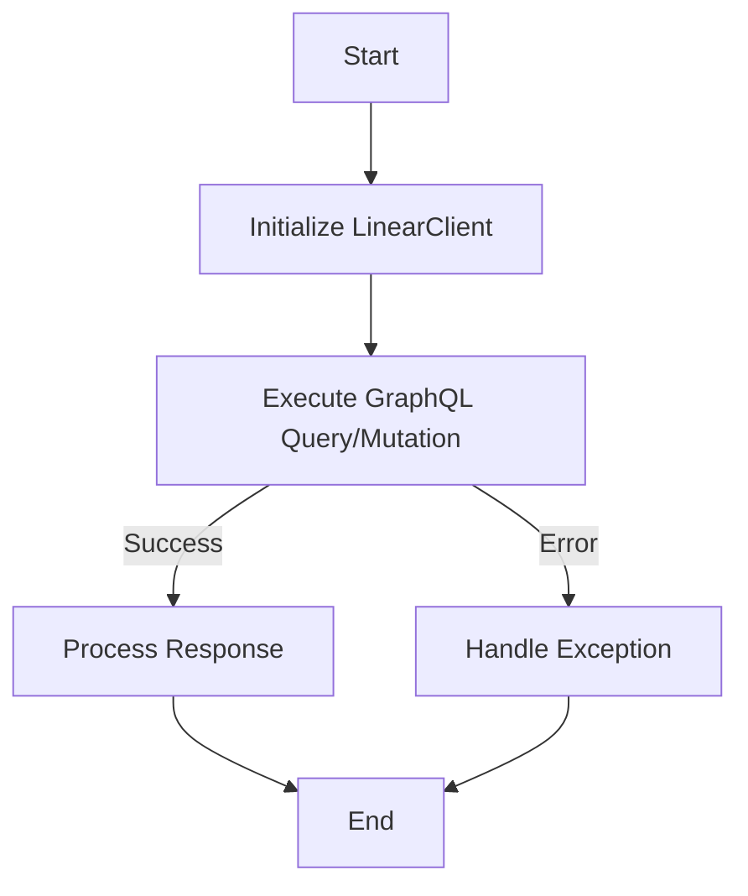
```mermaid
graph TD
    A[Start] --> B[Initialize LinearClient]
    B --> C[Execute GraphQL Query/Mutation]
    C -->|Success| D[Process Response]
    C -->|Error| E[Handle Exception]
    D --> F[End]
    E --> F[End]
```

## 类结构

```
LinearClient (主类)
├── LinearAPIException (异常类)
└── ... 
```

## 全局变量及字段


### `API_URL`
    
The base URL for the Linear API.

类型：`str`
    


### `_requests`
    
The Requests object used to make HTTP requests to the Linear API.

类型：`Requests`
    


### `LinearAPIException.message`
    
The error message associated with the exception.

类型：`str`
    


### `LinearAPIException.status_code`
    
The HTTP status code associated with the exception.

类型：`int`
    


### `LinearClient.API_URL`
    
The base URL for the Linear API.

类型：`str`
    


### `LinearClient._requests`
    
The Requests object used to make HTTP requests to the Linear API.

类型：`Requests`
    
    

## 全局函数及方法


### `_execute_graphql_request`

Executes a GraphQL request against the Linear API and returns the response data.

参数：

- `query`：`str`，The GraphQL query string.
- `variables`（可选）：`dict | None`，Any GraphQL query variables

返回值：`Any`，The parsed JSON response data, or raises a LinearAPIException on error.

#### 流程图

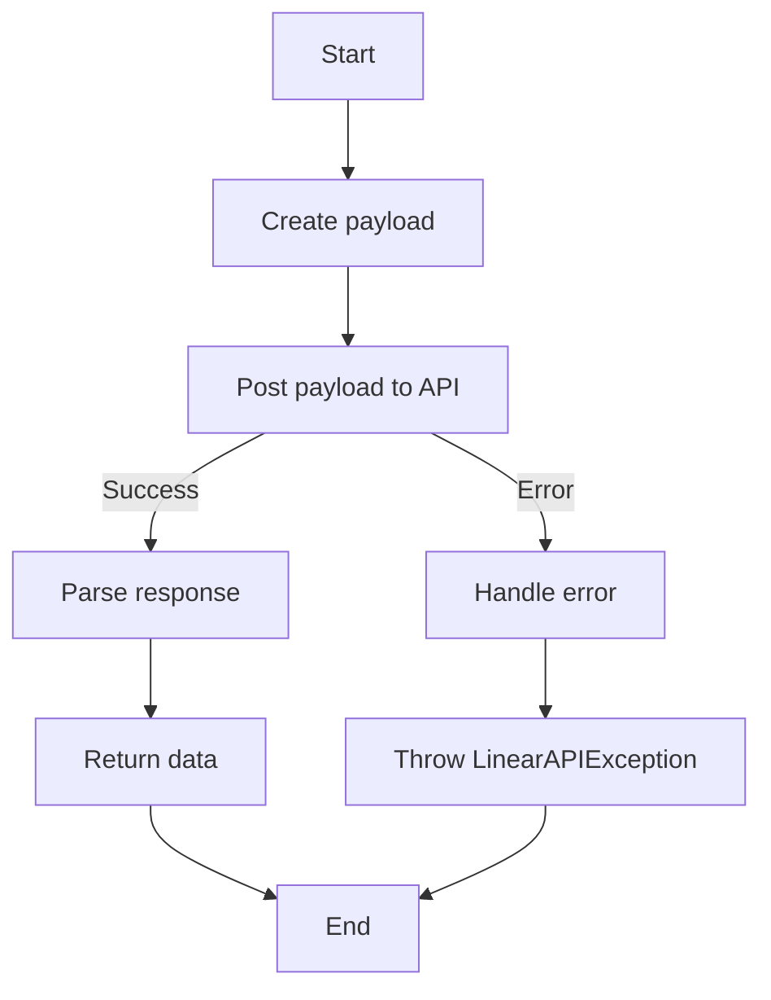
```mermaid
graph TD
    A[Start] --> B[Create payload]
    B --> C[Post payload to API]
    C -->|Success| D[Parse response]
    C -->|Error| E[Handle error]
    D --> F[Return data]
    E --> G[Throw LinearAPIException]
    F --> H[End]
    G --> H
```

#### 带注释源码

```python
async def _execute_graphql_request(
    self, query: str, variables: dict | None = None
) -> Any:
    """
    Executes a GraphQL request against the Linear API and returns the response data.

    Args:
        query: The GraphQL query string.
        variables (optional): Any GraphQL query variables

    Returns:
        The parsed JSON response data, or raises a LinearAPIException on error.
    """
    payload: Dict[str, Any] = {"query": query}
    if variables:
        payload["variables"] = variables

    response = await self._requests.post(self.API_URL, json=payload)

    if not response.ok:
        try:
            error_data = response.json()
            error_message = error_data.get("errors", [{}])[0].get("message", "")
        except json.JSONDecodeError:
            error_message = response.text()

        raise LinearAPIException(
            f"Linear API request failed ({response.status}): {error_message}",
            response.status,
        )

    response_data = response.json()
    if "errors" in response_data:

        error_messages = [
            error.get("message", "") for error in response_data["errors"]
        ]
        raise LinearAPIException(
            f"Linear API returned errors: {', '.join(error_messages)}",
            response.status,
        )

    return response_data["data"]
```


### `LinearClient.query`

Executes a GraphQL query.

参数：

- `query`：`str`，The GraphQL query string.
- `variables`：`Optional[dict]`，Query variables, if any.

返回值：`dict`，The response data.

#### 流程图

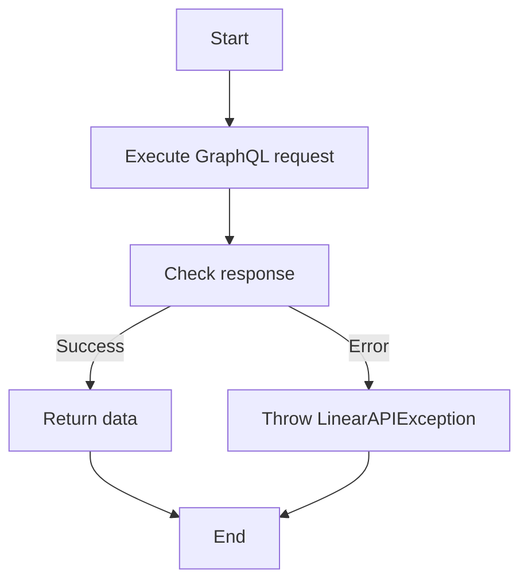
```mermaid
graph TD
    A[Start] --> B[Execute GraphQL request]
    B --> C[Check response]
    C -->|Success| D[Return data]
    C -->|Error| E[Throw LinearAPIException]
    D --> F[End]
    E --> F
```

#### 带注释源码

```python
async def query(self, query: str, variables: Optional[dict] = None) -> dict:
    """Executes a GraphQL query.

    Args:
        query: The GraphQL query string.
        variables: Query variables, if any.

    Returns:
         The response data.
    """
    return await self._execute_graphql_request(query, variables)
```


### `LinearClient.mutate`

Executes a GraphQL mutation.

参数：

- `mutation`：`str`，The GraphQL mutation string.
- `variables`：`Optional[dict]`，Query variables, if any.

返回值：`dict`，The response data.

#### 流程图

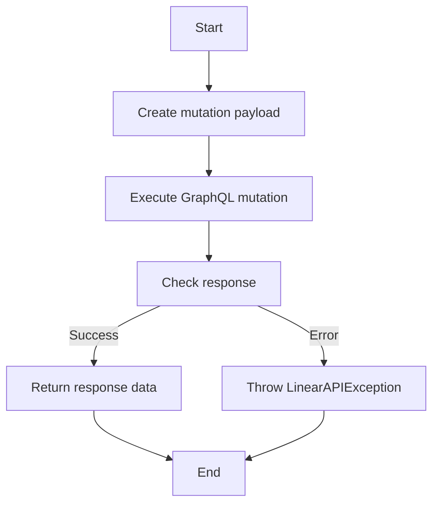
```mermaid
graph TD
    A[Start] --> B[Create mutation payload]
    B --> C[Execute GraphQL mutation]
    C --> D[Check response]
    D -->|Success| E[Return response data]
    D -->|Error| F[Throw LinearAPIException]
    E --> G[End]
    F --> G
```

#### 带注释源码

```python
async def mutate(self, mutation: str, variables: Optional[dict] = None) -> dict:
    """Executes a GraphQL mutation.

    Args:
        mutation: The GraphQL mutation string.
        variables: Query variables, if any.

    Returns:
        The response data.
    """
    return await self._execute_graphql_request(mutation, variables)
```


### try_create_comment

This method attempts to create a comment on a specific issue in the Linear API.

参数：

- `issue_id`：`str`，The ID of the issue to which the comment is to be added.
- `comment`：`str`，The text content of the comment to be added.

返回值：`CreateCommentResponse`，A response object containing the details of the created comment.

#### 流程图

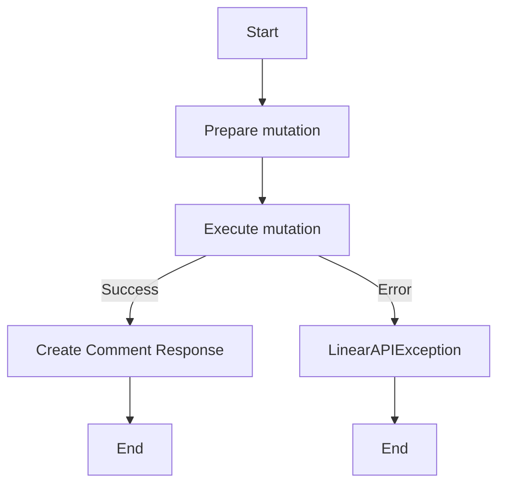
```mermaid
graph TD
    A[Start] --> B[Prepare mutation]
    B --> C[Execute mutation]
    C -->|Success| D[Create Comment Response]
    C -->|Error| E[LinearAPIException]
    E --> F[End]
    D --> G[End]
```

#### 带注释源码

```python
async def try_create_comment(
    self, issue_id: str, comment: str
) -> CreateCommentResponse:
    try:
        mutation = """
            mutation CommentCreate($input: CommentCreateInput!) {
              commentCreate(input: $input) {
                success
                comment {
                  id
                  body
                }
            }
        """

        variables = {
            "input": {
                "body": comment,
                "issueId": issue_id,
            }
        }

        added_comment = await self.mutate(mutation, variables)
        # Select the commentCreate field from the mutation response
        return CreateCommentResponse(**added_comment["commentCreate"])
    except LinearAPIException as e:
        raise e
```


### try_get_team_by_name

Retrieves the ID of a team based on its name or key from the Linear API.

参数：

- `team_name`：`str`，The name or key of the team to search for.

返回值：`str`，The ID of the team that matches the search term.

#### 流程图

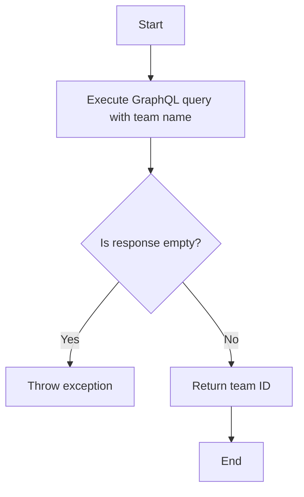
```mermaid
graph TD
    A[Start] --> B[Execute GraphQL query with team name]
    B --> C{Is response empty?}
    C -- Yes --> D[Throw exception]
    C -- No --> E[Return team ID]
    E --> F[End]
```

#### 带注释源码

```python
async def try_get_team_by_name(self, team_name: str) -> str:
    try:
        query = """
        query GetTeamId($searchTerm: String!) {
          teams(filter: { 
            or: [
              { name: { eqIgnoreCase: $searchTerm } },
              { key: { eqIgnoreCase: $searchTerm } }
            ]
          }) {
            nodes {
              id
              name
              key
            }
          }
        }
        """

        variables: dict[str, Any] = {
            "searchTerm": team_name,
        }

        result = await self.query(query, variables)
        nodes = result["teams"]["nodes"]

        if not nodes:
            raise LinearAPIException(
                f"Team '{team_name}' not found. Check the team name or key and try again.",
                status_code=404,
            )

        return nodes[0]["id"]
    except LinearAPIException as e:
        raise e
```


### `try_create_issue`

Create an issue in the Linear API.

参数：

- `team_id`：`str`，The ID of the team to create the issue in.
- `title`：`str`，The title of the issue.
- `description`：`str | None`，The description of the issue. Optional.
- `priority`：`int | None`，The priority of the issue. Optional.
- `project_id`：`str | None`，The ID of the project to create the issue in. Optional.

返回值：`CreateIssueResponse`，The response containing the details of the created issue.

#### 流程图

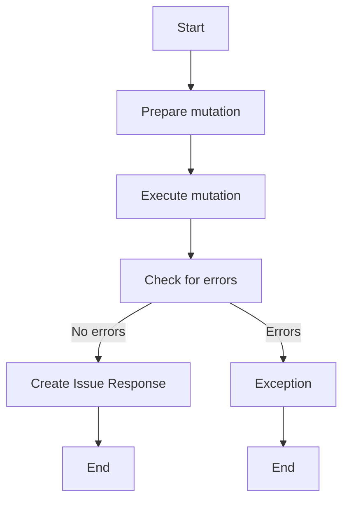
```mermaid
graph TD
    A[Start] --> B[Prepare mutation]
    B --> C[Execute mutation]
    C --> D[Check for errors]
    D -->|No errors| E[Create Issue Response]
    D -->|Errors| F[Exception]
    E --> G[End]
    F --> H[End]
```

#### 带注释源码

```python
async def try_create_issue(
    self,
    team_id: str,
    title: str,
    description: str | None = None,
    priority: int | None = None,
    project_id: str | None = None,
) -> CreateIssueResponse:
    try:
        mutation = """
           mutation IssueCreate($input: IssueCreateInput!) {
            issueCreate(input: $input) {
              issue {
                title
                description
                id
                identifier
                priority
              }
            }
        }
        """

        variables: dict[str, Any] = {
            "input": {
                "teamId": team_id,
                "title": title,
            }
        }

        if project_id:
            variables["input"]["projectId"] = project_id

        if description:
            variables["input"]["description"] = description

        if priority:
            variables["input"]["priority"] = priority

        added_issue = await self.mutate(mutation, variables)
        return CreateIssueResponse(**added_issue["issueCreate"])
    except LinearAPIException as e:
        raise e
```


### `try_search_projects`

Searches for projects based on a given term and includes comments if specified.

参数：

- `term`：`str`，The search term to use for searching projects.
- `includeComments`：`bool`，Optional. If set to True, includes comments in the search results.

返回值：`list[Project]`，A list of `Project` objects that match the search term.

#### 流程图

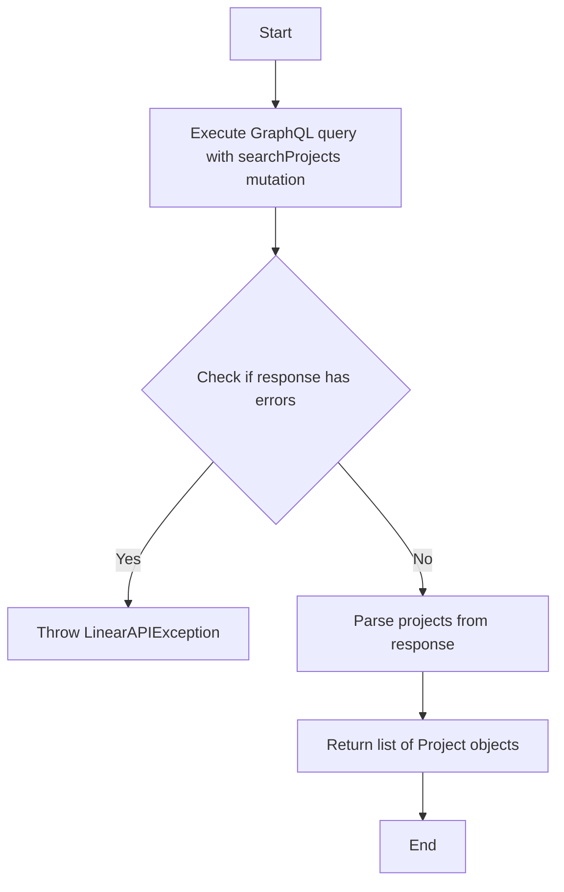
```mermaid
graph TD
    A[Start] --> B[Execute GraphQL query with searchProjects mutation]
    B --> C{Check if response has errors}
    C -- Yes --> D[Throw LinearAPIException]
    C -- No --> E[Parse projects from response]
    E --> F[Return list of Project objects]
    F --> G[End]
```

#### 带注释源码

```python
async def try_search_projects(self, term: str) -> list[Project]:
    try:
        query = """
            query SearchProjects($term: String!, $includeComments: Boolean!) {
                searchProjects(term: $term, includeComments: $includeComments) {
                    nodes {
                        id
                        name
                        description
                        priority
                        progress
                        content
                    }
                }
            }
        """

        variables: dict[str, Any] = {
            "term": term,
            "includeComments": True,
        }

        projects = await self.query(query, variables)
        return [
            Project(**project) for project in projects["searchProjects"]["nodes"]
        ]
    except LinearAPIException as e:
        raise e
```


### `try_search_issues`

Searches for issues in the Linear API based on a search term, with optional filtering by team ID and maximum number of results.

参数：

- `term`：`str`，The search term to use for searching issues.
- `max_results`：`int`，The maximum number of issues to return. Default is 10.
- `team_id`：`str`，The ID of the team to filter issues by. If not provided, issues from all teams are returned.

返回值：`list[Issue]`，A list of `Issue` objects that match the search criteria.

#### 流程图

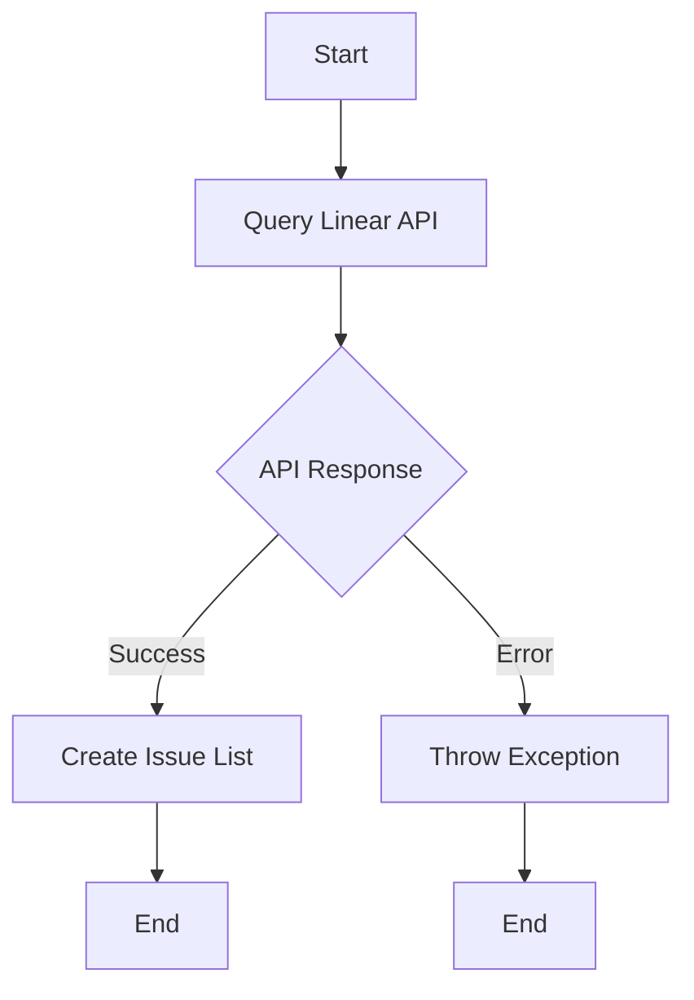
```mermaid
graph TD
    A[Start] --> B[Query Linear API]
    B --> C{API Response}
    C -->|Success| D[Create Issue List]
    C -->|Error| E[Throw Exception]
    D --> F[End]
    E --> G[End]
```

#### 带注释源码

```python
async def try_search_issues(
    self,
    term: str,
    max_results: int = 10,
    team_id: str | None = None,
) -> list[Issue]:
    try:
        query = """
            query SearchIssues(
                $term: String!,
                $first: Int,
                $teamId: String
            ) {
                searchIssues(
                    term: $term,
                    first: $first,
                    teamId: $teamId
                ) {
                    nodes {
                        id
                        identifier
                        title
                        description
                        priority
                        createdAt
                        state {
                            id
                            name
                            type
                        }
                        project {
                            id
                            name
                        }
                        assignee {
                            id
                            name
                        }
                    }
                }
            }
        """

        variables: dict[str, Any] = {
            "term": term,
            "first": max_results,
            "teamId": team_id,
        }

        issues = await self.query(query, variables)
        return [Issue(**issue) for issue in issues["searchIssues"]["nodes"]]
    except LinearAPIException as e:
        raise e
```


### `try_get_issues`

Retrieves a list of issues based on the project name, status, whether the issue is assigned to a user, and whether to include comments.

参数：

- `project`：`str`，The name of the project to search for issues.
- `status`：`str`，The status of the issues to retrieve.
- `is_assigned`：`bool`，Indicates whether the issues should be filtered by whether they are assigned to a user.
- `include_comments`：`bool`，Indicates whether to include comments in the issue details.

返回值：`list[Issue]`，A list of `Issue` objects that match the search criteria.

#### 流程图

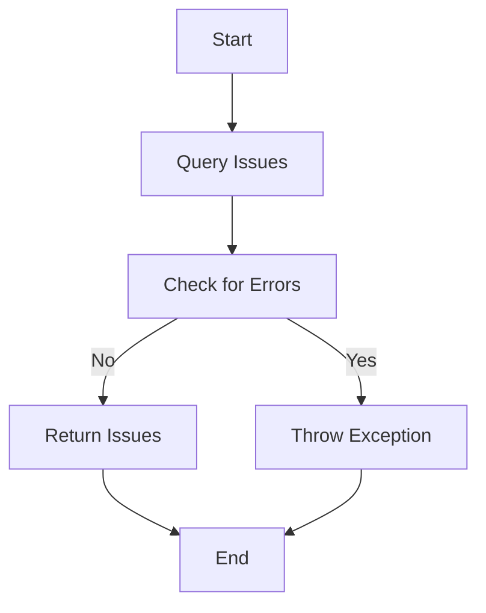
```mermaid
graph TD
    A[Start] --> B[Query Issues]
    B --> C[Check for Errors]
    C -->|No| D[Return Issues]
    C -->|Yes| E[Throw Exception]
    D --> F[End]
    E --> F
```

#### 带注释源码

```python
async def try_get_issues(
    self, project: str, status: str, is_assigned: bool, include_comments: bool
) -> list[Issue]:
    try:
        query = """    
                query IssuesByProjectStatusAndAssignee(
                  $projectName: String!
                  $statusName: String!
                  $isAssigned: Boolean!
                  $includeComments: Boolean! = false
                ) {
                  issues(
                    filter: {
                      project: { name: { eq: $projectName } }
                      state: { name: { eq: $statusName } }
                      assignee: { null: $isAssigned }
                    }
                  ) {
                    nodes {
                      id
                      title
                      identifier
                      description
                      createdAt
                      priority
                      assignee {
                        id
                        name
                      }
                      project {
                        id
                        name
                      }
                      state {
                        id
                        name
                      }
                      comments @include(if: $includeComments) {
                        nodes {
                          id
                          body
                          createdAt
                          user {
                            id
                            name
                          }
                        }
                      }
                    }
                  }
                }
        """

        variables: dict[str, Any] = {
            "projectName": project,
            "statusName": status,
            "isAssigned": not is_assigned,
            "includeComments": include_comments,
        }

        issues = await self.query(query, variables)
        return [Issue(**issue) for issue in issues["issues"]["nodes"]]
    except LinearAPIException as e:
        raise e
```


### `LinearClient.__init__`

Initializes a new instance of the `LinearClient` class.

参数：

- `credentials`：`Union[OAuth2Credentials, APIKeyCredentials, None]`，The credentials to use for authentication. If `None`, the default API key credentials are used.
- `custom_requests`：`Optional[Requests]`，An optional custom requests object to use for making HTTP requests. If provided, it overrides the default requests object.

返回值：无

#### 流程图

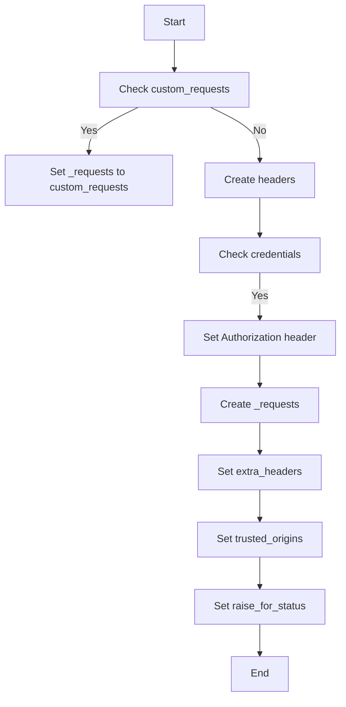
```mermaid
graph TD
    A[Start] --> B[Check custom_requests]
    B -- Yes --> C[Set _requests to custom_requests]
    B -- No --> D[Create headers]
    D --> E[Check credentials]
    E -- Yes --> F[Set Authorization header]
    F --> G[Create _requests]
    G --> H[Set extra_headers]
    H --> I[Set trusted_origins]
    I --> J[Set raise_for_status]
    J --> K[End]
```

#### 带注释源码

```python
def __init__(
    self,
    credentials: Union[OAuth2Credentials, APIKeyCredentials, None] = None,
    custom_requests: Optional[Requests] = None,
):
    if custom_requests:
        self._requests = custom_requests
    else:
        headers: Dict[str, str] = {
            "Content-Type": "application/json",
        }
        if credentials:
            headers["Authorization"] = credentials.auth_header()

        self._requests = Requests(
            extra_headers=headers,
            trusted_origins=["https://api.linear.app"],
            raise_for_status=False,
        )
```


### `_execute_graphql_request`

Executes a GraphQL request against the Linear API and returns the response data.

参数：

- `query`：`str`，The GraphQL query string.
- `variables`（可选）：`dict | None`，Any GraphQL query variables

返回值：`Any`，The parsed JSON response data, or raises a LinearAPIException on error.

#### 流程图

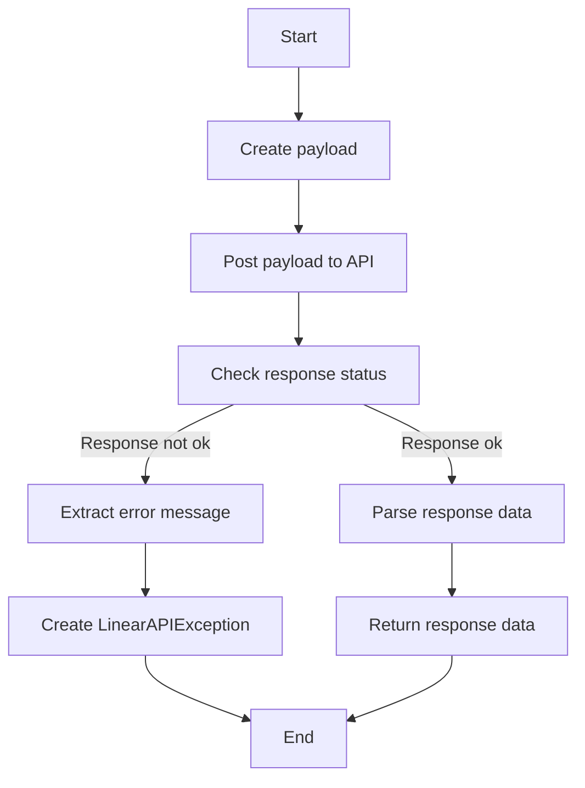
```mermaid
graph TD
    A[Start] --> B[Create payload]
    B --> C[Post payload to API]
    C --> D[Check response status]
    D -->|Response ok| E[Parse response data]
    D -->|Response not ok| F[Extract error message]
    E --> G[Return response data]
    F --> H[Create LinearAPIException]
    H --> I[End]
    G --> I
```

#### 带注释源码

```python
async def _execute_graphql_request(
    self, query: str, variables: dict | None = None
) -> Any:
    """
    Executes a GraphQL request against the Linear API and returns the response data.

    Args:
        query: The GraphQL query string.
        variables (optional): Any GraphQL query variables

    Returns:
        The parsed JSON response data, or raises a LinearAPIException on error.
    """
    payload: Dict[str, Any] = {"query": query}
    if variables:
        payload["variables"] = variables

    response = await self._requests.post(self.API_URL, json=payload)

    if not response.ok:
        try:
            error_data = response.json()
            error_message = error_data.get("errors", [{}])[0].get("message", "")
        except json.JSONDecodeError:
            error_message = response.text()

        raise LinearAPIException(
            f"Linear API request failed ({response.status}): {error_message}",
            response.status,
        )

    response_data = response.json()
    if "errors" in response_data:

        error_messages = [
            error.get("message", "") for error in response_data["errors"]
        ]
        raise LinearAPIException(
            f"Linear API returned errors: {', '.join(error_messages)}",
            response.status,
        )

    return response_data["data"]
```


### `LinearClient.query`

Executes a GraphQL query.

参数：

- `query`：`str`，The GraphQL query string.
- `variables`：`Optional[dict]`，Query variables, if any.

返回值：`dict`，The response data.

#### 流程图


```mermaid
graph TD
    A[Start] --> B[Execute GraphQL request]
    B --> C[Check response]
    C -->|Success| D[Return data]
    C -->|Error| E[Throw LinearAPIException]
    D --> F[End]
    E --> F
```

#### 带注释源码

```python
async def query(self, query: str, variables: Optional[dict] = None) -> dict:
    """Executes a GraphQL query.

    Args:
        query: The GraphQL query string.
        variables: Query variables, if any.

    Returns:
         The response data.
    """
    return await self._execute_graphql_request(query, variables)
```


### `LinearClient.mutate`

Executes a GraphQL mutation.

参数：

- `mutation`：`str`，The GraphQL mutation string.
- `variables`：`Optional[dict]`，Query variables, if any.

返回值：`dict`，The response data.

#### 流程图

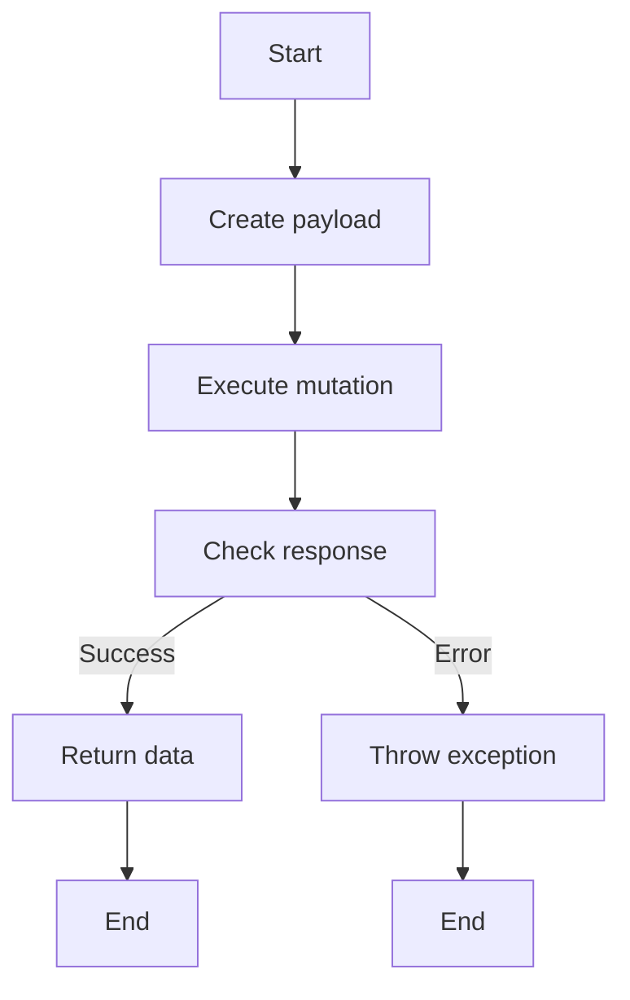
```mermaid
graph TD
    A[Start] --> B[Create payload]
    B --> C[Execute mutation]
    C --> D[Check response]
    D -->|Success| E[Return data]
    D -->|Error| F[Throw exception]
    E --> G[End]
    F --> H[End]
```

#### 带注释源码

```python
async def mutate(self, mutation: str, variables: Optional[dict] = None) -> dict:
    """
    Executes a GraphQL mutation.

    Args:
        mutation: The GraphQL mutation string.
        variables: Query variables, if any.

    Returns:
        The response data.
    """
    return await self._execute_graphql_request(mutation, variables)
```


### `LinearClient.try_create_comment`

This method attempts to create a comment on a specific issue within the Linear API.

参数：

- `issue_id`：`str`，The ID of the issue to which the comment is to be added.
- `comment`：`str`，The text content of the comment to be added.

返回值：`CreateCommentResponse`，A response object containing the details of the created comment.

#### 流程图

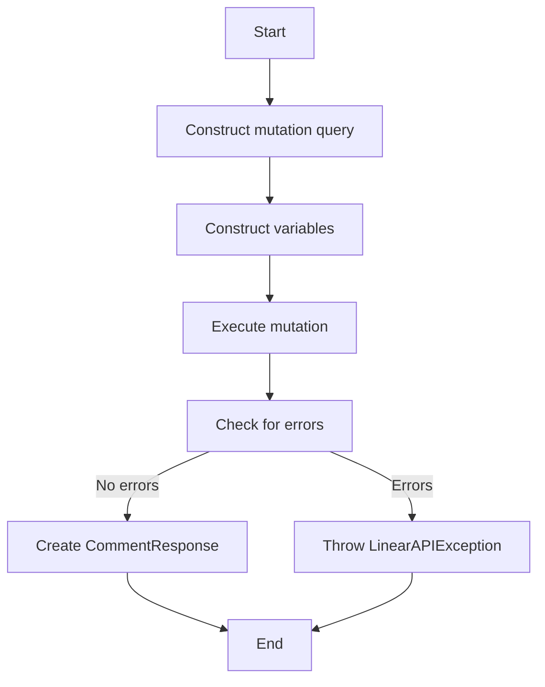
```mermaid
graph TD
    A[Start] --> B[Construct mutation query]
    B --> C[Construct variables]
    C --> D[Execute mutation]
    D --> E[Check for errors]
    E -->|No errors| F[Create CommentResponse]
    E -->|Errors| G[Throw LinearAPIException]
    F --> H[End]
    G --> H
```

#### 带注释源码

```python
async def try_create_comment(
    self, issue_id: str, comment: str
) -> CreateCommentResponse:
    try:
        mutation = """
            mutation CommentCreate($input: CommentCreateInput!) {
              commentCreate(input: $input) {
                success
                comment {
                  id
                  body
                }
            }
        """

        variables = {
            "input": {
                "body": comment,
                "issueId": issue_id,
            }
        }

        added_comment = await self.mutate(mutation, variables)
        # Select the commentCreate field from the mutation response
        return CreateCommentResponse(**added_comment["commentCreate"])
    except LinearAPIException as e:
        raise e
```


### `LinearClient.try_get_team_by_name`

查找具有指定名称的团队并返回其ID。

参数：

- `team_name`：`str`，团队名称

返回值：`str`，团队ID

#### 流程图

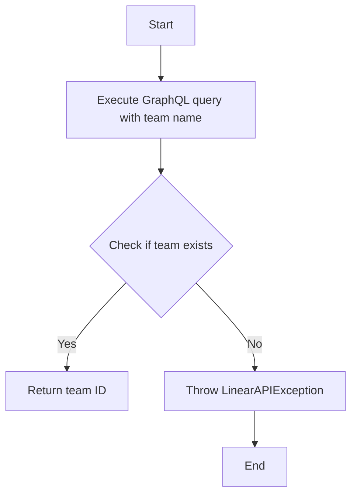
```mermaid
graph TD
    A[Start] --> B[Execute GraphQL query with team name]
    B --> C{Check if team exists}
    C -- Yes --> D[Return team ID]
    C -- No --> E[Throw LinearAPIException]
    E --> F[End]
```

#### 带注释源码

```python
async def try_get_team_by_name(self, team_name: str) -> str:
    try:
        query = """
        query GetTeamId($searchTerm: String!) {
          teams(filter: { 
            or: [
              { name: { eqIgnoreCase: $searchTerm } },
              { key: { eqIgnoreCase: $searchTerm } }
            ]
          }) {
            nodes {
              id
              name
              key
            }
          }
        }
        """

        variables: dict[str, Any] = {
            "searchTerm": team_name,
        }

        result = await self.query(query, variables)
        nodes = result["teams"]["nodes"]

        if not nodes:
            raise LinearAPIException(
                f"Team '{team_name}' not found. Check the team name or key and try again.",
                status_code=404,
            )

        return nodes[0]["id"]
    except LinearAPIException as e:
        raise e
```


### `LinearClient.try_create_issue`

This method attempts to create an issue in the Linear API.

参数：

- `team_id`：`str`，The ID of the team to create the issue in.
- `title`：`str`，The title of the issue to be created.
- `description`：`str | None`，The description of the issue to be created. Optional.
- `priority`：`int | None`，The priority of the issue to be created. Optional.
- `project_id`：`str | None`，The ID of the project to create the issue in. Optional.

返回值：`CreateIssueResponse`，The response containing the details of the created issue.

#### 流程图

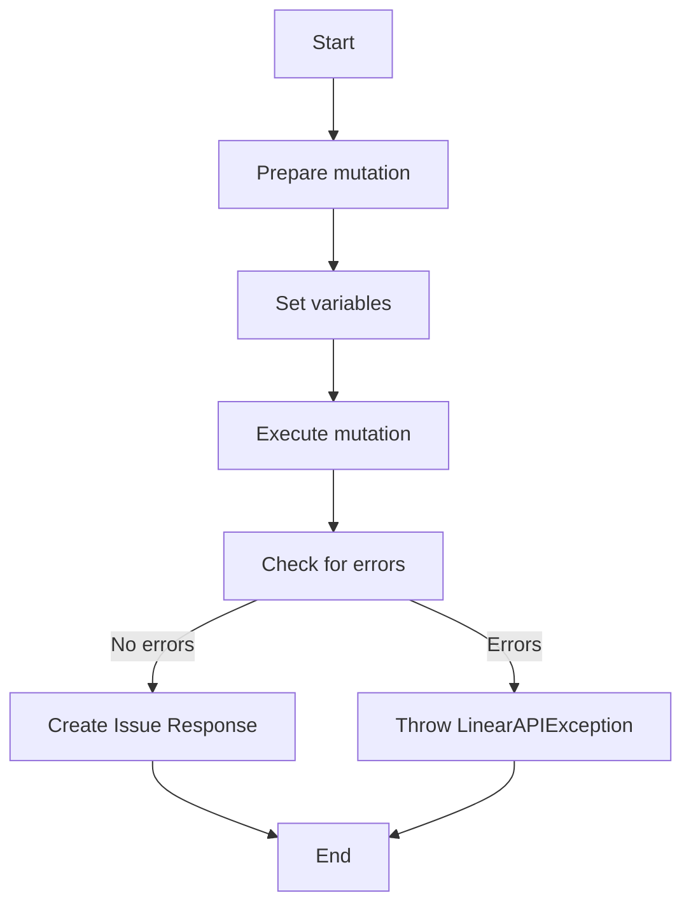
```mermaid
graph TD
    A[Start] --> B[Prepare mutation]
    B --> C[Set variables]
    C --> D[Execute mutation]
    D --> E[Check for errors]
    E -->|No errors| F[Create Issue Response]
    E -->|Errors| G[Throw LinearAPIException]
    F --> H[End]
    G --> H
```

#### 带注释源码

```python
async def try_create_issue(
    self,
    team_id: str,
    title: str,
    description: str | None = None,
    priority: int | None = None,
    project_id: str | None = None,
) -> CreateIssueResponse:
    try:
        mutation = """
           mutation IssueCreate($input: IssueCreateInput!) {
            issueCreate(input: $input) {
              issue {
                title
                description
                id
                identifier
                priority
              }
            }
        }
        """

        variables: dict[str, Any] = {
            "input": {
                "teamId": team_id,
                "title": title,
            }
        }

        if project_id:
            variables["input"]["projectId"] = project_id

        if description:
            variables["input"]["description"] = description

        if priority:
            variables["input"]["priority"] = priority

        added_issue = await self.mutate(mutation, variables)
        return CreateIssueResponse(**added_issue["issueCreate"])
    except LinearAPIException as e:
        raise e
```


### `LinearClient.try_search_projects`

This method searches for projects in the Linear API based on a given search term.

参数：

- `term`：`str`，The search term to use for searching projects.
- `includeComments`：`bool`，Optional. Whether to include comments in the search results.

返回值：`list[Project]`，A list of `Project` objects that match the search term.

#### 流程图

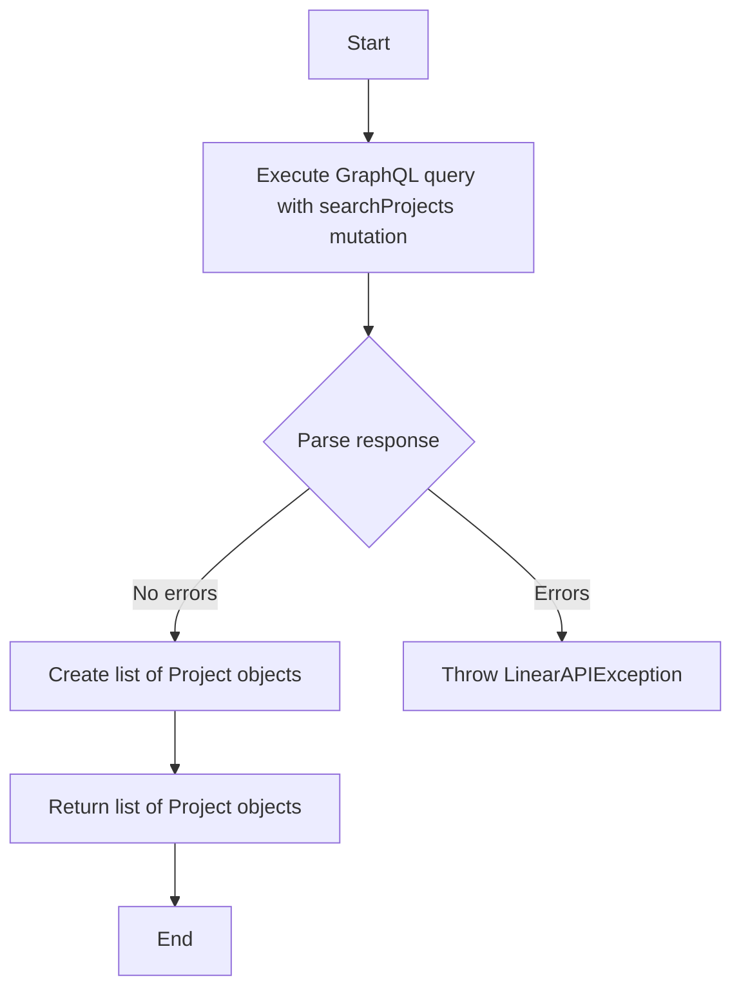
```mermaid
graph TD
    A[Start] --> B[Execute GraphQL query with searchProjects mutation]
    B --> C{Parse response}
    C -->|No errors| D[Create list of Project objects]
    C -->|Errors| E[Throw LinearAPIException]
    D --> F[Return list of Project objects]
    F --> G[End]
```

#### 带注释源码

```python
async def try_search_projects(self, term: str) -> list[Project]:
    try:
        query = """
            query SearchProjects($term: String!, $includeComments: Boolean!) {
                searchProjects(term: $term, includeComments: $includeComments) {
                    nodes {
                        id
                        name
                        description
                        priority
                        progress
                        content
                    }
                }
            }
        """

        variables: dict[str, Any] = {
            "term": term,
            "includeComments": True,
        }

        projects = await self.query(query, variables)
        return [
            Project(**project) for project in projects["searchProjects"]["nodes"]
        ]
    except LinearAPIException as e:
        raise e
```


### `LinearClient.try_search_issues`

This method searches for issues in the Linear API based on a given search term, with optional filtering by team ID and a maximum number of results.

参数：

- `term`：`str`，The search term to use for searching issues.
- `max_results`：`int`，The maximum number of issues to return. Defaults to 10.
- `team_id`：`str`，The ID of the team to filter issues by. If not provided, issues from all teams are returned.

返回值：`list[Issue]`，A list of `Issue` objects that match the search criteria.

#### 流程图

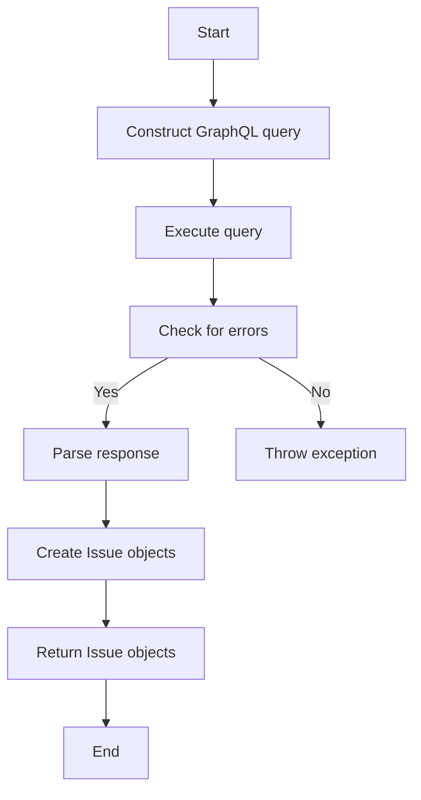
```mermaid
graph TD
    A[Start] --> B[Construct GraphQL query]
    B --> C[Execute query]
    C --> D[Check for errors]
    D -->|Yes| E[Parse response]
    D -->|No| F[Throw exception]
    E --> G[Create Issue objects]
    G --> H[Return Issue objects]
    H --> I[End]
```

#### 带注释源码

```python
async def try_search_issues(
    self,
    term: str,
    max_results: int = 10,
    team_id: str | None = None,
) -> list[Issue]:
    try:
        query = """
            query SearchIssues(
                $term: String!,
                $first: Int,
                $teamId: String
            ) {
                searchIssues(
                    term: $term,
                    first: $first,
                    teamId: $teamId
                ) {
                    nodes {
                        id
                        identifier
                        title
                        description
                        priority
                        createdAt
                        state {
                            id
                            name
                            type
                        }
                        project {
                            id
                            name
                        }
                        assignee {
                            id
                            name
                        }
                    }
                }
            }
        """

        variables: dict[str, Any] = {
            "term": term,
            "first": max_results,
            "teamId": team_id,
        }

        issues = await self.query(query, variables)
        return [Issue(**issue) for issue in issues["searchIssues"]["nodes"]]
    except LinearAPIException as e:
        raise e
```


### `LinearClient.try_get_issues`

This method retrieves issues from the Linear API based on the project name, status, whether the issue is assigned to a user, and whether to include comments.

参数：

- `project`：`str`，The name of the project to search for issues.
- `status`：`str`，The status of the issues to retrieve.
- `is_assigned`：`bool`，Whether the issues should be filtered by whether they are assigned to a user.
- `include_comments`：`bool`，Whether to include comments in the issue details.

返回值：`list[Issue]`，A list of `Issue` objects representing the issues retrieved from the Linear API.

#### 流程图


```mermaid
graph TD
    A[Start] --> B[Query Issues]
    B --> C[Check for Errors]
    C -->|No| D[Return Issues]
    C -->|Yes| E[Throw Exception]
    D --> F[End]
    E --> F
```

#### 带注释源码

```python
async def try_get_issues(
    self, project: str, status: str, is_assigned: bool, include_comments: bool
) -> list[Issue]:
    try:
        query = """    
                query IssuesByProjectStatusAndAssignee(
                  $projectName: String!
                  $statusName: String!
                  $isAssigned: Boolean!
                  $includeComments: Boolean! = false
                ) {
                  issues(
                    filter: {
                      project: { name: { eq: $projectName } }
                      state: { name: { eq: $statusName } }
                      assignee: { null: $isAssigned }
                    }
                  ) {
                    nodes {
                      id
                      title
                      identifier
                      description
                      createdAt
                      priority
                      assignee {
                        id
                        name
                      }
                      project {
                        id
                        name
                      }
                      state {
                        id
                        name
                      }
                      comments @include(if: $includeComments) {
                        nodes {
                          id
                          body
                          createdAt
                          user {
                            id
                            name
                          }
                        }
                      }
                    }
                  }
                }
        """

        variables: dict[str, Any] = {
            "projectName": project,
            "statusName": status,
            "isAssigned": not is_assigned,
            "includeComments": include_comments,
        }

        issues = await self.query(query, variables)
        return [Issue(**issue) for issue in issues["issues"]["nodes"]]
    except LinearAPIException as e:
        raise e
```


## 关键组件


### 张量索引与惰性加载

张量索引与惰性加载是代码中处理数据结构的核心组件，它允许在查询数据时只加载所需的部分，从而提高性能和效率。

### 反量化支持

反量化支持是代码中用于处理数学运算和表达式的组件，它允许在代码中动态地调整量化参数，以适应不同的计算需求。

### 量化策略

量化策略是代码中用于优化计算过程的组件，它通过调整计算过程中的参数和步骤，以减少计算时间和资源消耗。


## 问题及建议


### 已知问题

-   **异步请求处理**: 代码中使用了异步请求，但没有明确说明如何处理异步操作，例如如何等待所有异步操作完成或如何处理并发请求。
-   **错误处理**: 虽然代码中使用了`LinearAPIException`来处理API错误，但没有提供详细的错误日志记录或错误恢复机制。
-   **代码复用**: 代码中存在一些重复的查询和突变字符串，可以考虑使用模板或函数来减少重复代码。
-   **类型注解**: 代码中使用了类型注解，但有些地方类型注解不够详细，例如`Any`类型的使用。

### 优化建议

-   **异步请求管理**: 实现一个异步请求管理器，用于处理并发请求和等待所有异步操作完成。
-   **错误日志记录**: 在`LinearAPIException`中添加错误日志记录，以便于问题追踪和调试。
-   **代码重构**: 重构代码，使用模板或函数来减少重复的查询和突变字符串。
-   **类型注解完善**: 完善类型注解，确保代码的可读性和可维护性。
-   **单元测试**: 添加单元测试来确保代码的正确性和稳定性。
-   **文档**: 为代码添加详细的文档注释，包括类、方法和全局变量的用途和参数说明。


## 其它


### 设计目标与约束

- 设计目标：
  - 提供一个易于使用的接口来与Linear API交互。
  - 确保所有API请求都是异步执行的，以提高性能。
  - 提供错误处理机制，以便在API请求失败时提供有用的反馈。

- 约束：
  - 必须使用OAuth2Credentials或APIKeyCredentials进行身份验证。
  - 所有API请求必须使用GraphQL查询或突变。
  - 必须处理所有可能的API错误，并抛出LinearAPIException。

### 错误处理与异常设计

- 错误处理：
  - 使用LinearAPIException来封装API请求中可能发生的错误。
  - 在所有API请求方法中，检查响应状态码和错误信息，并在必要时抛出异常。

### 数据流与状态机

- 数据流：
  - 用户通过客户端实例发送查询或突变请求。
  - 客户端实例执行GraphQL请求，并将响应返回给用户。

- 状态机：
  - 无状态设计，客户端实例不维护任何状态。

### 外部依赖与接口契约

- 外部依赖：
  - `requests`库用于发送HTTP请求。
  - `json`库用于解析和生成JSON数据。

- 接口契约：
  - 所有API请求都遵循GraphQL规范。
  - 所有响应都遵循GraphQL规范，并包含错误信息（如果有的话）。

    