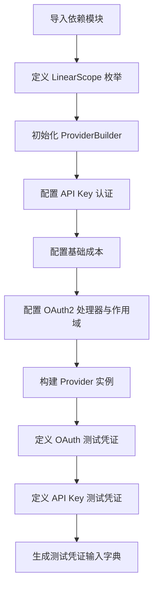

# `AutoGPT\autogpt_platform\backend\backend\blocks\linear\_config.py` 详细设计文档

该代码文件负责配置 Linear 提供者的共享设置，定义了 OAuth2 权限范围的枚举类，构建了包含 API 密钥和 OAuth2 认证方式的提供者实例，并预设了用于测试的模拟凭证数据。

## 整体流程



## 类结构

```
LinearScope (str, Enum)
├── READ
├── WRITE
├── ISSUES_CREATE
├── COMMENTS_CREATE
├── TIME_SCHEDULE_WRITE
└── ADMIN
```

## 全局变量及字段


### `linear`
    
The configured Linear provider instance with support for API Key and OAuth2 authentication.

类型：`Provider`
    


### `TEST_CREDENTIALS_OAUTH`
    
Mock OAuth2 credentials object used for testing the Linear integration.

类型：`OAuth2Credentials`
    


### `TEST_CREDENTIALS_API_KEY`
    
Mock API Key credentials object used for testing the Linear integration.

类型：`APIKeyCredentials`
    


### `TEST_CREDENTIALS_INPUT_OAUTH`
    
Dictionary representation of input data for mock OAuth2 credentials.

类型：`dict`
    


### `TEST_CREDENTIALS_INPUT_API_KEY`
    
Dictionary representation of input data for mock API Key credentials.

类型：`dict`
    


### `LinearScope.READ`
    
Read access for the user's account.

类型：`LinearScope`
    


### `LinearScope.WRITE`
    
Write access for the user's account.

类型：`LinearScope`
    


### `LinearScope.ISSUES_CREATE`
    
Allows creating new issues and their attachments.

类型：`LinearScope`
    


### `LinearScope.COMMENTS_CREATE`
    
Allows creating new issue comments.

类型：`LinearScope`
    


### `LinearScope.TIME_SCHEDULE_WRITE`
    
Allows creating and modifying time schedules.

类型：`LinearScope`
    


### `LinearScope.ADMIN`
    
Full access to admin level endpoints.

类型：`LinearScope`
    
    

## 全局函数及方法


## 关键组件


### LinearScope 枚举

定义 Linear API 访问权限的枚举类型，封装了如只读、读写、问题创建、评论创建等不同级别的操作权限。

### linear 提供商实例

利用构建者模式创建的 Linear 服务提供商对象，集成了 API Key 与 OAuth2 双重认证策略，并配置了运行成本及权限范围。

### 测试凭证数据

用于测试环境的全局凭证常量，包含模拟的 OAuth2 和 API Key 认证数据及其对应的字典输入格式，用于验证认证逻辑。


## 问题及建议


### 已知问题

-   在 `TEST_CREDENTIALS_INPUT_OAUTH` 和 `TEST_CREDENTIALS_INPUT_API_KEY` 字典定义中，`title` 字段被错误地赋值为 `type` 属性的值（例如 "oauth2" 或 "api_key"），而不是 `title` 属性的值（例如 "Mock Linear API key"），这会导致数据不一致。
-   硬编码的测试凭证（`TEST_CREDENTIALS_*`）直接定义在共享配置文件中，这会污染生产环境的命名空间，并可能导致测试数据被错误地用于生产逻辑。

### 优化建议

-   将 `TEST_CREDENTIALS_*` 相关的测试数据迁移到专门的测试模块（如 `tests/conftest.py` 或 `fixtures.py`）中，以分离配置逻辑与测试辅助代码，保持代码库的整洁。
-   修正 `TEST_CREDENTIALS_INPUT_OAUTH` 和 `TEST_CREDENTIALS_INPUT_API_KEY` 中 `title` 的赋值逻辑，将其指向正确的属性 `TEST_CREDENTIALS_*.title`。
-   对于测试凭证中的过期时间戳 `access_token_expires_at`，建议使用基于当前时间的动态计算（例如 `datetime.now() + timedelta(days=1)`）来替代硬编码的时间戳（1672531200），以防止因时间推移导致的时间相关测试逻辑失效。


## 其它


### 设计目标与约束

**设计目标：**
1.  **配置集中化**：为所有基于 Linear SDK 的块提供统一、共享的配置入口点，确保系统与 Linear 交互的一致性。
2.  **多认证支持**：同时支持 API Key 和 OAuth2 两种认证方式，以适应不同安全级别和场景的需求。
3.  **成本控制透明化**：通过 `BlockCostType` 定义基础运行成本，便于上层系统对资源消耗进行计量和计费。
4.  **测试友好性**：提供预定义的测试凭据和测试输入数据，支持单元测试和集成测试环境的快速搭建。

**约束：**
1.  **SDK 模式限制**：必须遵循 `backend.sdk` 定义的 `ProviderBuilder` 构建模式，不可随意更改构建链的调用顺序或参数类型。
2.  **环境依赖**：生产环境下的运行强依赖于环境变量的正确配置（如 `LINEAR_API_KEY`, `LINEAR_CLIENT_ID` 等），缺失这些变量将导致构建失败或运行时错误。
3.  **权限范围**：定义的 `LinearScope` 枚举值必须严格对齐 Linear 官方 API 的权限定义，不可随意扩展或修改字符串值。
4.  **不可变性**：构建后的 `linear` 提供者实例和测试凭据常量在设计上应被视为不可变对象，防止运行时意外修改导致的全局状态污染。

### 错误处理与异常设计

**设计原则：**
该配置文件本身属于声明式代码，不包含复杂的业务逻辑处理，因此错误处理主要集中在**配置加载阶段**和**依赖注入阶段**。

**异常场景与处理：**
1.  **环境变量缺失**：
    *   **场景**：在初始化 `ProviderBuilder` 或配置 OAuth 时，指定的环境变量（如 `LINEAR_CLIENT_ID`）未在系统环境中设置。
    *   **处理**：依赖 `ProviderBuilder` 内部机制抛出异常（通常是 `ValueError` 或 `ConfigurationError`），阻止应用启动或模块加载，强制要求环境配置完整。
2.  **依赖导入失败**：
    *   **场景**：`backend.sdk` 或 `._oauth` 模块无法正确导入或加载。
    *   **处理**：抛出 `ImportError` 或 `ModuleNotFoundError`，暴露底层依赖缺失问题。
3.  **凭据格式错误**：
    *   **场景**：虽然本文件中的测试凭据是硬编码的正确格式，但在实际运行时，若 SDK 从环境变量读取的凭据格式不符合 `APIKeyCredentials` 或 `OAuth2Credentials` 的要求。
    *   **处理**：由 SDK 内部在解析时抛出 `ValidationError`。

**设计策略：**
*   **快速失败**：配置加载应遵循快速失败原则，任何配置项不合法应立即中断，避免将错误带入运行时。
*   **类型安全**：通过 `Enum` 和强类型对象（如 `SecretStr`）在编译期或加载期减少类型错误。

### 数据流与状态机

**数据流：**
1.  **初始化阶段**：
    *   Python 解释器执行模块导入。
    *   `LinearScope` 枚举类被定义并加载到内存。
    *   依赖模块 (`backend.sdk`, `._oauth`) 被加载。
    *   `ProviderBuilder` 实例化，接收配置参数（API Key 配置、Base Cost、OAuth 配置）。
    *   调用 `.build()` 方法生成最终的 `linear` 提供者实例。
    *   测试常量（`TEST_CREDENTIALS_*`）被实例化并存储在全局命名空间中。
2.  **运行阶段**：
    *   外部模块引用本文件生成的 `linear` 实例。
    *   `linear` 实例根据配置的认证方式（API Key 或 OAuth2）与 Linear API 进行交互。
    *   若涉及 OAuth2，`LinearOAuthHandler` 利用配置的 `scopes` 和密钥进行令牌交换和请求签名。

**状态机（针对配置构建过程）：**
虽然本文件主要是静态配置，但 `ProviderBuilder` 的构建过程体现了线性的状态流转：
*   **State 1: Idle** - `ProviderBuilder("linear")` 被实例化。
*   **State 2: API Key Configured** - 调用 `.with_api_key(...)`。
*   **State 3: Cost Configured** - 调用 `.with_base_cost(...)`。
*   **State 4: OAuth Configured** - 调用 `.with_oauth(...)`，此时作用域和处理器已绑定。
*   **State 5: Built (Final)** - 调用 `.build()`，生成不可用的提供者实例 `linear`。

### 外部依赖与接口契约

**外部依赖：**
1.  **内部 SDK (`backend.sdk`)**：
    *   `APIKeyCredentials`: 定义 API Key 认证凭据的数据结构。
    *   `OAuth2Credentials`: 定义 OAuth2 认证凭据的数据结构。
    *   `BlockCostType`: 定义块运行的计费类型枚举。
    *   `ProviderBuilder`: 核心构建器，用于组装提供者配置。
    *   `SecretStr`: 敏感字符串包装类型，防止日志泄露。
2.  **本地模块 (`._oauth.LinearOAuthHandler`)**：
    *   实现 Linear 特定的 OAuth2 认证流程逻辑（如令牌刷新、授权码处理）。
3.  **Linear API**：
    *   远程服务接口，需要符合 Linear API v1 规范（隐式依赖）。

**接口契约：**
1.  **环境变量契约**：
    *   系统必须提供 `LINEAR_API_KEY`（用于 API Key 认证）。
    *   系统必须提供 `LINEAR_CLIENT_ID` 和 `LINEAR_CLIENT_SECRET`（用于 OAuth2 认证）。
2.  **构建器接口契约**：
    *   `ProviderBuilder` 的链式方法接受特定的参数类型和名称，返回 `self` 以支持链式调用。
    *   `.build()` 方法返回一个符合 `Provider` 协议的对象。
3.  **Handler 接口契约**：
    *   `LinearOAuthHandler` 必须实现 SDK 要求的认证处理器接口，能够处理传入的 scopes 并执行认证逻辑。
4.  **测试数据契约**：
    *   `TEST_CREDENTIALS_INPUT_OAUTH` 和 `TEST_CREDENTIALS_INPUT_API_KEY` 提供的字典结构必须符合前端或 API 层接收凭据输入时的格式预期（包含 `provider`, `id`, `type`, `title` 等字段）。

    