# `AutoGPT\autogpt_platform\backend\backend\blocks\linear\_oauth.py` 详细设计文档

该代码实现了针对 Linear 应用的 OAuth2 处理程序（LinearOAuthHandler），负责处理包括生成登录授权 URL、交换授权码获取访问令牌、刷新令牌、撤销令牌以及将旧版长期令牌迁移至新版短期令牌系统在内的完整认证流程。

## 整体流程

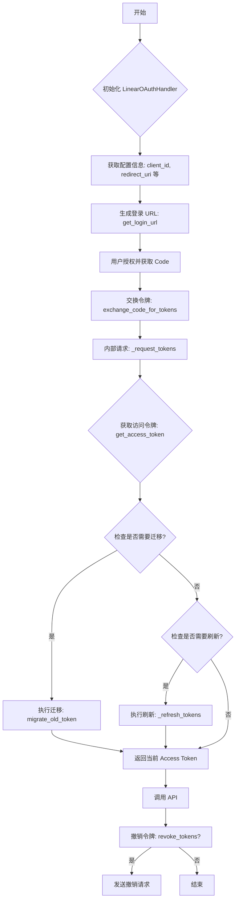

## 类结构

```
Exception (基类)
├── LinearAPIException (Linear API 错误异常)

BaseOAuthHandler (抽象基类)
└── LinearOAuthHandler (Linear OAuth2 处理器)
```

## 全局变量及字段


### `LinearAPIException.status_code`
    
The HTTP status code associated with the Linear API error.

类型：`int`
    


### `LinearOAuthHandler.PROVIDER_NAME`
    
The constant identifier for the Linear OAuth provider registered in the SDK.

类型：`ProviderName`
    


### `LinearOAuthHandler.client_id`
    
The client ID for identifying the application with the Linear OAuth provider.

类型：`str`
    


### `LinearOAuthHandler.client_secret`
    
The client secret used for authenticating the application with the Linear OAuth provider.

类型：`str`
    


### `LinearOAuthHandler.redirect_uri`
    
The URI to which the user is redirected after the authorization process.

类型：`str`
    


### `LinearOAuthHandler.auth_base_url`
    
The base URL for the Linear OAuth authorization endpoint.

类型：`str`
    


### `LinearOAuthHandler.token_url`
    
The URL endpoint for exchanging authorization codes or refresh tokens for access tokens.

类型：`str`
    


### `LinearOAuthHandler.revoke_url`
    
The URL endpoint for revoking an active access token.

类型：`str`
    


### `LinearOAuthHandler.migrate_url`
    
The URL endpoint for migrating old long-lived tokens to the new short-lived token format.

类型：`str`
    
    

## 全局函数及方法


### `LinearAPIException.__init__`

Linear API 异常类的初始化方法，用于接收错误消息并设置特定的 HTTP 状态码属性，以便在发生 API 错误时提供详细的上下文信息。

参数：

- `message`：`str`，描述 API 错误的具体消息内容。
- `status_code`：`int`，API 请求返回的 HTTP 状态码，用于标识错误的类型（如 401, 404, 500 等）。

返回值：`None`，构造函数不返回任何值。

#### 流程图

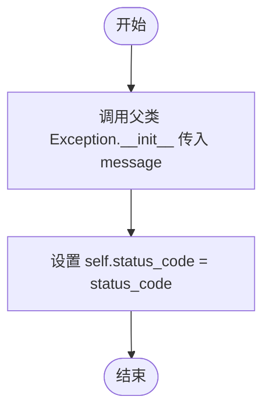

#### 带注释源码

```python
def __init__(self, message: str, status_code: int):
    # 调用父类 Exception 的初始化方法，设置标准的异常消息
    super().__init__(message)
    # 将传入的 HTTP 状态码保存为实例属性，供调用者捕获异常后使用
    self.status_code = status_code
```


### `LinearOAuthHandler.__init__`

初始化 LinearOAuthHandler 实例，配置必要的 OAuth2 客户端凭证及 Linear API 相关的端点 URL。

参数：

- `client_id`：`str`，Linear OAuth 应用的客户端标识符。
- `client_secret`：`str`，Linear OAuth 应用的客户端密钥。
- `redirect_uri`：`str`，OAuth2 授权完成后的回调地址。

返回值：`None`，无返回值。

#### 流程图

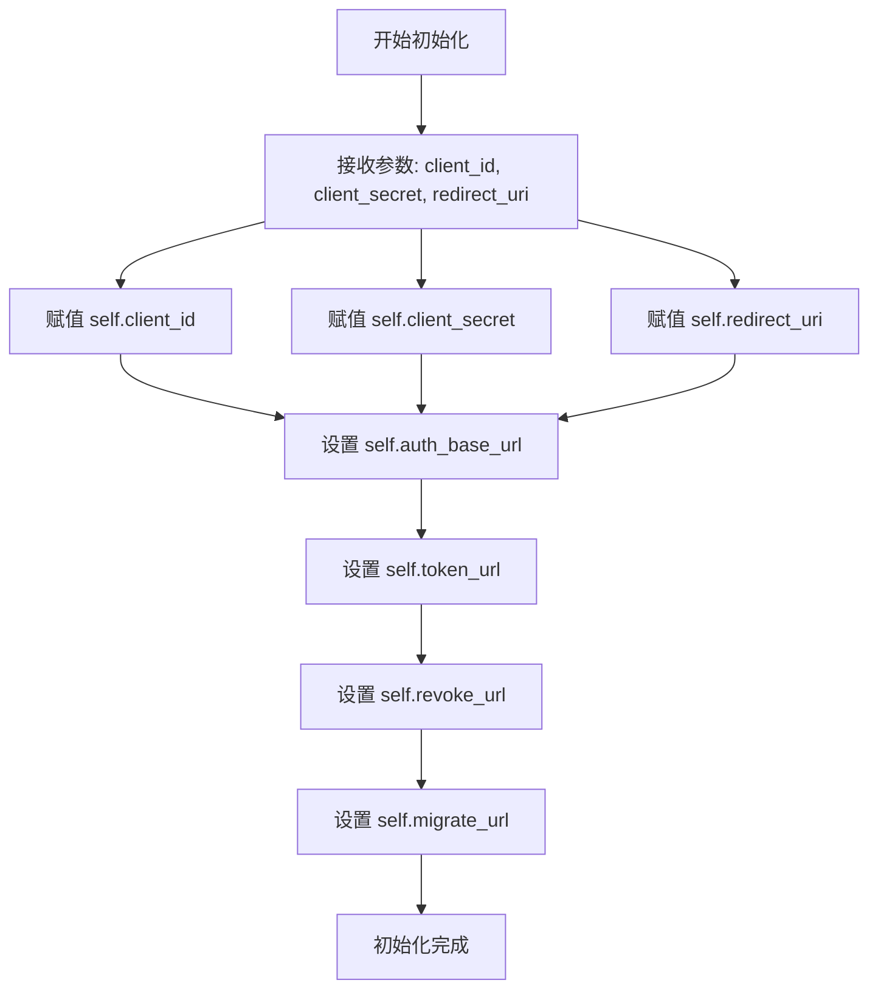

#### 带注释源码

```python
def __init__(self, client_id: str, client_secret: str, redirect_uri: str):
    # 保存传入的客户端 ID，用于标识应用
    self.client_id = client_id
    # 保存传入的客户端密钥，用于后续的身份验证
    self.client_secret = client_secret
    # 保存传入的重定向 URI，用于接收授权码
    self.redirect_uri = redirect_uri
    # 定义 Linear OAuth 授权页面的基础 URL
    self.auth_base_url = "https://linear.app/oauth/authorize"
    # 定义获取访问令牌的 API 端点 URL
    self.token_url = "https://api.linear.app/oauth/token"
    # 定义撤销访问令牌的 API 端点 URL
    self.revoke_url = "https://api.linear.app/oauth/revoke"
    # 定义迁移旧令牌（将长期令牌转换为带刷新令牌的短期令牌）的 API 端点 URL
    self.migrate_url = "https://api.linear.app/oauth/migrate_old_token"
```


### `LinearOAuthHandler.get_login_url`

该方法用于构建 Linear OAuth2 授权流程的登录 URL。它将必要的授权参数（如客户端 ID、重定向 URI、权限范围和状态值）组合并编码为一个完整的 URL 字符串。

参数：

- `scopes`：`list[str]`，请求的权限范围列表，例如 ['read', 'write']。
- `state`：`str`，用于防止 CSRF 攻击并维护请求状态的不透明字符串。
- `code_challenge`：`Optional[str]`，PKCE (Proof Key for Code Exchange) 的代码挑战值（注：当前实现中接收该参数，但并未将其加入生成的 URL 参数中）。

返回值：`str`，构造好的 Linear 授权页面完整 URL。

#### 流程图

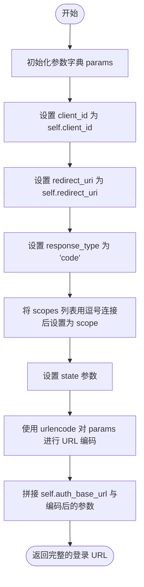

#### 带注释源码

```python
def get_login_url(
    self, scopes: list[str], state: str, code_challenge: Optional[str]
) -> str:
    # 准备构建 URL 所需的查询参数
    params = {
        "client_id": self.client_id,              # OAuth2 客户端标识
        "redirect_uri": self.redirect_uri,        # 授权完成后的回调地址
        "response_type": "code",                  # 固定为 code，表示使用授权码模式
        "scope": ",".join(scopes),                # 将权限列表转换为逗号分隔的字符串
        "state": state,                           # 用于安全校验的状态参数
    }
    # 拼接基础授权地址和 URL 编码后的参数，生成最终登录链接
    return f"{self.auth_base_url}?{urlencode(params)}"
```


### `LinearOAuthHandler.exchange_code_for_tokens`

该方法用于通过 OAuth2 授权码交换访问令牌。它接收授权码、请求范围和代码验证器作为输入，构建请求参数并调用内部方法 `_request_tokens` 与 Linear API 进行交互，最终返回包含令牌信息的凭证对象。

参数：

-   `code`：`str`，从 Linear OAuth 授权回调中获取的授权码。
-   `scopes`：`list[str]`，请求的权限范围列表（当前实现中未直接使用，保留为接口参数）。
-   `code_verifier`：`Optional[str]`，PKCE 流程使用的代码验证器（当前实现中未直接使用，保留为接口参数）。

返回值：`OAuth2Credentials`，包含访问令牌、刷新令牌及其过期时间等信息的凭证对象。

#### 流程图

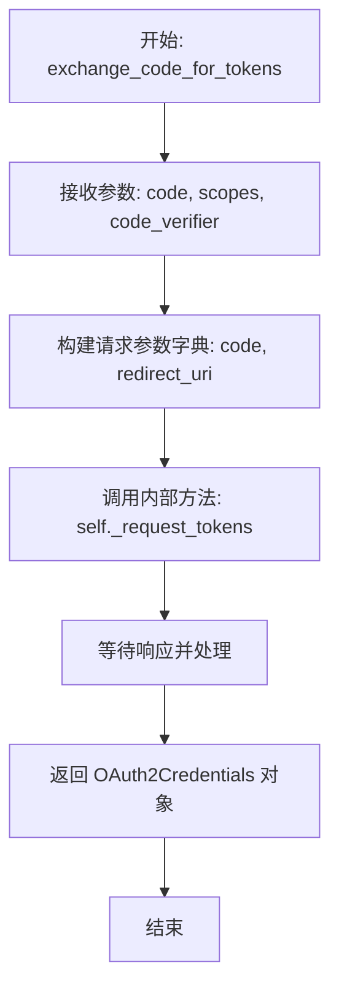

#### 带注释源码

```python
    async def exchange_code_for_tokens(
        self, code: str, scopes: list[str], code_verifier: Optional[str]
    ) -> OAuth2Credentials:
        # 调用内部 _request_tokens 方法，传入授权码和回调地址
        # 内部方法将处理 grant_type 设置、HTTP 请求发送及凭证解析
        return await self._request_tokens(
            {"code": code, "redirect_uri": self.redirect_uri}
        )
```


### `LinearOAuthHandler.revoke_tokens`

该方法用于撤销给定的 OAuth2 凭据。它通过向 Linear API 的撤销端点发送 POST 请求来使访问令牌失效，并处理可能出现的 API 错误情况。

参数：

- `credentials`: `OAuth2Credentials`，包含需要撤销的访问令牌的 OAuth2 凭据对象。

返回值：`bool`，如果令牌撤销成功则返回 `True`。注意 Linear API 在成功撤销时不返回 JSON 数据体。

#### 流程图

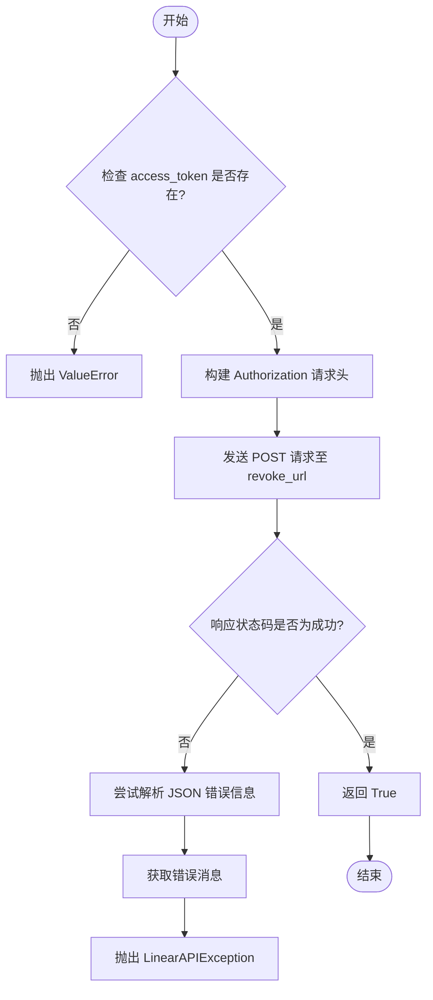

#### 带注释源码

```python
async def revoke_tokens(self, credentials: OAuth2Credentials) -> bool:
    # 校验凭据中是否存在 access_token，如果没有则抛出异常
    if not credentials.access_token:
        raise ValueError("No access token to revoke")

    # 构建请求头，使用 Bearer 类型的 Authorization 认证
    # 注意：这里使用了 get_secret_value() 来获取敏感信息的实际字符串值
    headers = {
        "Authorization": f"Bearer {credentials.access_token.get_secret_value()}"
    }

    # 异步发送 POST 请求到 Linear 的撤销令牌端点
    response = await Requests().post(self.revoke_url, headers=headers)

    # 检查 HTTP 响应状态码，如果不成功（非 2xx），则进入错误处理逻辑
    if not response.ok:
        try:
            # 尝试将响应体解析为 JSON 格式以获取详细错误信息
            error_data = response.json()
            error_message = error_data.get("error", "Unknown error")
        except json.JSONDecodeError:
            # 如果解析 JSON 失败，则直接使用响应的文本内容作为错误信息
            error_message = response.text
        # 抛出 Linear API 专用异常，包含状态码和错误详情
        raise LinearAPIException(
            f"Failed to revoke Linear tokens ({response.status}): {error_message}",
            response.status,
        )

    # Linear API 在成功撤销时通常返回空响应，因此直接返回 True 表示成功
    return True  # Linear doesn't return JSON on successful revoke
```


### `LinearOAuthHandler.migrate_old_token`

该方法用于将旧的长生命周期令牌迁移到新的短期令牌，并附带刷新令牌。它通过调用 Linear 的 `/oauth/migrate_old_token` 端点，在不要求用户重新授权的情况下，交换当前的长令牌以获取包含刷新令牌的新凭证。

参数：

- `credentials`：`OAuth2Credentials`，包含待迁移旧令牌的凭证对象。

返回值：`OAuth2Credentials`，包含新访问令牌、刷新令牌及过期时间的更新后凭证对象。

#### 流程图

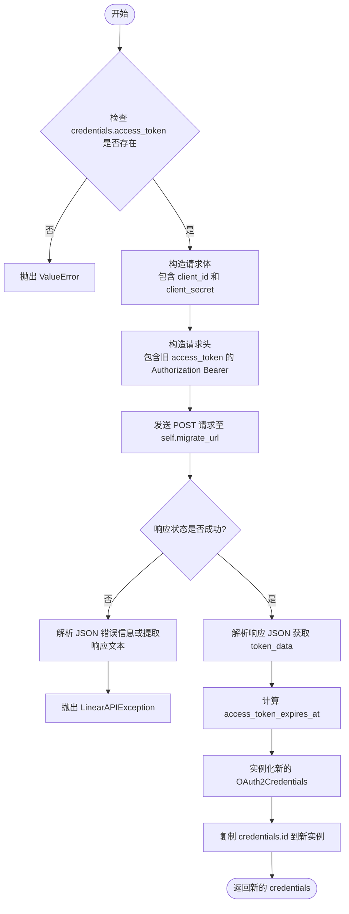

#### 带注释源码

```python
async def migrate_old_token(
    self, credentials: OAuth2Credentials
) -> OAuth2Credentials:
    """
    Migrate an old long-lived token to a new short-lived token with refresh token.

    This uses Linear's /oauth/migrate_old_token endpoint to exchange current
    long-lived tokens for short-lived tokens with refresh tokens without
    requiring users to re-authorize.
    """
    # 检查传入的凭证中是否包含访问令牌，如果没有则抛出异常
    if not credentials.access_token:
        raise ValueError("No access token to migrate")

    # 准备请求体，包含客户端ID和密钥
    request_body = {
        "client_id": self.client_id,
        "client_secret": self.client_secret,
    }

    # 准备请求头，使用旧令牌进行 Bearer 认证，并指定内容类型
    headers = {
        "Authorization": f"Bearer {credentials.access_token.get_secret_value()}",
        "Content-Type": "application/x-www-form-urlencoded",
    }

    # 发送 POST 请求到迁移端点
    response = await Requests().post(
        self.migrate_url, data=request_body, headers=headers
    )

    # 检查响应状态码，如果不成功则处理错误
    if not response.ok:
        try:
            error_data = response.json()
            error_message = error_data.get("error", "Unknown error")
            error_description = error_data.get("error_description", "")
            # 如果有详细错误描述，将其附加到错误信息中
            if error_description:
                error_message = f"{error_message}: {error_description}"
        except json.JSONDecodeError:
            # 如果无法解析 JSON，使用原始文本作为错误信息
            error_message = response.text
        # 抛出特定的 API 异常，包含状态码和错误信息
        raise LinearAPIException(
            f"Failed to migrate Linear token ({response.status}): {error_message}",
            response.status,
        )

    # 解析成功的响应 JSON 数据
    token_data = response.json()

    # 提取并计算令牌过期时间
    now = int(time.time())
    expires_in = token_data.get("expires_in")
    access_token_expires_at = None
    if expires_in:
        access_token_expires_at = now + expires_in

    # 创建新的凭证对象，填充新的令牌数据和保留的旧信息（如 scopes）
    new_credentials = OAuth2Credentials(
        provider=self.PROVIDER_NAME,
        title=credentials.title,
        username=credentials.username,
        access_token=token_data["access_token"],
        scopes=credentials.scopes,  # Preserve original scopes
        refresh_token=token_data.get("refresh_token"),
        access_token_expires_at=access_token_expires_at,
        refresh_token_expires_at=None,
    )

    # 将旧凭证的 ID 复制到新凭证，以保持数据库记录的连续性
    new_credentials.id = credentials.id
    return new_credentials
```


### `LinearOAuthHandler._refresh_tokens`

该方法负责使用刷新令牌来获取新的访问令牌。它首先验证凭据对象中是否存在有效的刷新令牌，如果存在，则构建必要的请求参数并调用内部方法 `_request_tokens` 执行实际的令牌刷新流程。

参数：

-  `credentials`：`OAuth2Credentials`，包含当前身份验证信息的凭据对象，必须包含有效的 refresh_token。

返回值：`OAuth2Credentials`，包含新访问令牌及可能的新刷新令牌的更新后凭据对象。

#### 流程图

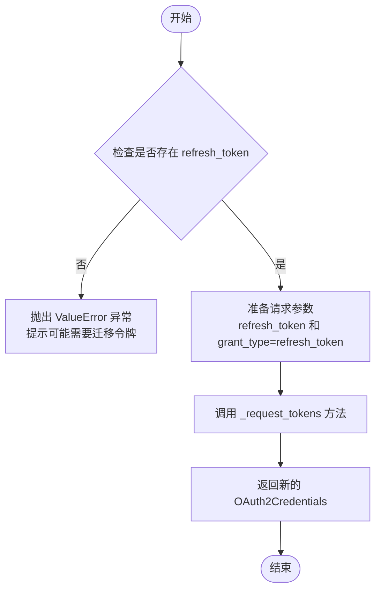

#### 带注释源码

```python
    async def _refresh_tokens(
        self, credentials: OAuth2Credentials
    ) -> OAuth2Credentials:
        # 检查凭据中是否存在 refresh_token
        if not credentials.refresh_token:
            # 如果不存在，抛出 ValueError，提示没有可用的刷新令牌，可能需要执行令牌迁移
            raise ValueError(
                "No refresh token available. Token may need to be migrated to the new refresh token system."
            )

        # 调用内部 _request_tokens 方法发起刷新令牌请求
        # 传入参数包含 refresh_token 的值和指定的 grant_type
        # 同时传入 current_credentials 以便在后续处理中保留用户信息或 ID
        return await self._request_tokens(
            {
                "refresh_token": credentials.refresh_token.get_secret_value(),
                "grant_type": "refresh_token",
            },
            current_credentials=credentials,
        )
```


### `LinearOAuthHandler._request_tokens`

向 Linear 的令牌端点发送请求以获取或刷新 OAuth 令牌。该方法根据传入的参数判断是进行授权码交换还是刷新令牌，处理不同的认证方式（特别是刷新令牌时推荐的 HTTP Basic Auth），解析响应并构建新的 OAuth2Credentials 对象。

参数：

- `params`：`dict[str, str]`，包含请求参数的字典，如 `code`、`redirect_uri` 或 `refresh_token`。
- `current_credentials`：`Optional[OAuth2Credentials]`，可选参数，当前的凭据对象。用于在刷新令牌时保留上下文信息（如 ID、标题、用户名）。

返回值：`OAuth2Credentials`，包含新获取的访问令牌、刷新令牌、过期时间及作用域等信息的凭据对象。

#### 流程图

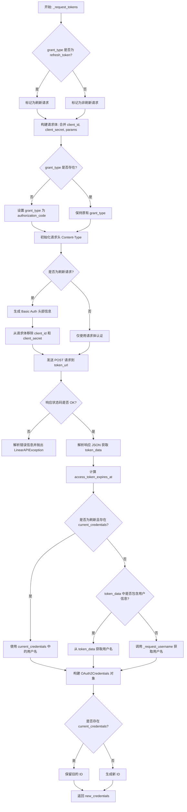

#### 带注释源码

```python
async def _request_tokens(
    self,
    params: dict[str, str],
    current_credentials: Optional[OAuth2Credentials] = None,
) -> OAuth2Credentials:
    # 判断是否为刷新令牌的操作
    is_refresh = params.get("grant_type") == "refresh_token"

    # 构建初始请求体，包含客户端凭证和传入的参数
    request_body = {
        "client_id": self.client_id,
        "client_secret": self.client_secret,
        **params,
    }

    # 如果未指定 grant_type，默认使用 authorization_code（授权码模式）
    if "grant_type" not in request_body:
        request_body["grant_type"] = "authorization_code"

    headers = {"Content-Type": "application/x-www-form-urlencoded"}

    # 对于刷新令牌请求，Linear 推荐使用 HTTP Basic Authentication
    if is_refresh:
        # Option 1: 使用 HTTP Basic Auth (Linear 推荐方式)
        client_credentials = f"{self.client_id}:{self.client_secret}"
        # 对 client_id:client_secret 进行 Base64 编码
        encoded_credentials = base64.b64encode(client_credentials.encode()).decode()
        headers["Authorization"] = f"Basic {encoded_credentials}"

        # 使用 Basic Auth 时，需要从请求体中移除 client_id 和 client_secret
        request_body.pop("client_id", None)
        request_body.pop("client_secret", None)

    # 发送 POST 请求获取令牌
    response = await Requests().post(
        self.token_url, data=request_body, headers=headers
    )

    # 处理错误响应
    if not response.ok:
        try:
            error_data = response.json()
            error_message = error_data.get("error", "Unknown error")
            error_description = error_data.get("error_description", "")
            if error_description:
                error_message = f"{error_message}: {error_description}"
        except json.JSONDecodeError:
            error_message = response.text
        raise LinearAPIException(
            f"Failed to fetch Linear tokens ({response.status}): {error_message}",
            response.status,
        )

    # 解析成功的响应数据
    token_data = response.json()

    # 提取并计算令牌过期时间
    now = int(time.time())
    expires_in = token_data.get("expires_in")
    access_token_expires_at = None
    if expires_in:
        access_token_expires_at = now + expires_in

    # 获取用户名逻辑：优先保留刷新时的旧用户名，其次从响应获取，最后通过 API 查询
    username = None
    if current_credentials and is_refresh:
        username = current_credentials.username
    elif "user" in token_data:
        username = token_data["user"].get("name", "Unknown User")
    else:
        # 如果响应中没有用户信息，使用 access_token 请求用户信息
        username = await self._request_username(token_data["access_token"])

    # 构建新的 OAuth2Credentials 对象
    new_credentials = OAuth2Credentials(
        provider=self.PROVIDER_NAME,
        title=current_credentials.title if current_credentials else None,
        username=username or "Unknown User",
        access_token=token_data["access_token"],
        scopes=(
            token_data["scope"].split(",")
            if "scope" in token_data
            else (current_credentials.scopes if current_credentials else [])
        ),
        refresh_token=token_data.get("refresh_token"),
        access_token_expires_at=access_token_expires_at,
        refresh_token_expires_at=None,  # Linear 不提供刷新令牌的过期时间
    )

    # 如果是刷新操作，保留原凭据的 ID
    if current_credentials:
        new_credentials.id = current_credentials.id

    return new_credentials
```


### `LinearOAuthHandler.get_access_token`

返回一个有效的访问令牌，必要时处理从旧的长效令牌到新的带刷新令牌的短效令牌的迁移以及标准的刷新逻辑。

参数：

- `credentials`：`OAuth2Credentials`，包含当前访问令牌、刷新令牌（如有）及过期时间信息的凭证对象。

返回值：`str`，有效的访问令牌字符串。

#### 流程图

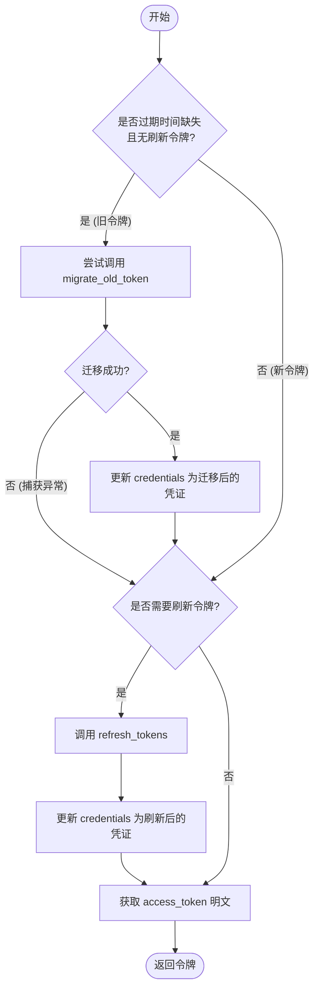

#### 带注释源码

```python
    async def get_access_token(self, credentials: OAuth2Credentials) -> str:
        """
        Returns a valid access token, handling migration and refresh as needed.

        This overrides the base implementation to handle Linear's token migration
        from old long-lived tokens to new short-lived tokens with refresh tokens.
        """
        # 检查是否为旧版令牌：既没有过期时间也没有刷新令牌
        if (
            credentials.access_token_expires_at is None
            and credentials.refresh_token is None
        ):
            try:
                # 尝试将旧令牌迁移为新令牌
                migrated_credentials = await self.migrate_old_token(credentials)
                # 注意：更新持久化的凭证存储需要由调用者处理
                # 此处仅针对本次请求使用迁移后的凭证
                credentials = migrated_credentials
            except LinearAPIException:
                # 迁移失败，降级使用旧令牌，保持向后兼容性
                pass

        # 使用基类的标准刷新逻辑检查是否需要刷新令牌
        if self.needs_refresh(credentials):
            credentials = await self.refresh_tokens(credentials)

        # 返回访问令牌的明文字符串
        return credentials.access_token.get_secret_value()
```


### `LinearOAuthHandler.needs_migration`

检查给定的凭据是否代表旧的长期令牌，该令牌需要迁移到新的带刷新令牌的短期令牌系统。旧的令牌没有过期时间，也没有刷新令牌。

参数：

- `credentials`：`OAuth2Credentials`，需要检查是否需要进行迁移的 OAuth 凭据对象。

返回值：`bool`，如果凭据需要迁移（即旧的长期令牌）返回 `True`，否则返回 `False`。

#### 流程图

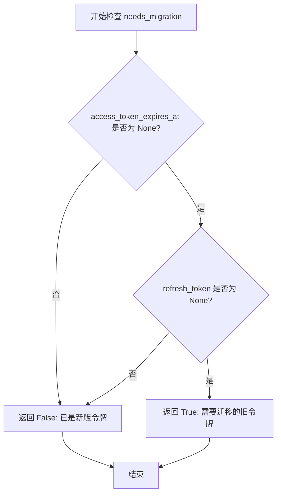

#### 带注释源码

```python
def needs_migration(self, credentials: OAuth2Credentials) -> bool:
    """
    Check if credentials represent an old long-lived token that needs migration.

    Old tokens have no expiration time and no refresh token.
    """
    # 逻辑判断：如果凭据既没有过期时间（access_token_expires_at 为 None）
    # 也没有刷新令牌（refresh_token 为 None），
    # 则判定这是旧的长期令牌，需要迁移。
    return (
        credentials.access_token_expires_at is None
        and credentials.refresh_token is None
    )
```


### `LinearOAuthHandler._request_username`

该方法通过向 Linear API 发送 GraphQL 请求，使用提供的访问令牌获取当前用户的用户名（viewer name）。

参数：

-   `access_token`：`str`，用于验证 Linear API 请求的访问令牌。

返回值：`Optional[str]`，成功时返回从 Linear 获取的用户名；请求失败或发生异常时返回 None。

#### 流程图

```mermaid
flowchart TD
    A[开始: _request_username] --> B[从 ._api 导入 LinearClient]
    B --> C[创建 APIKeyCredentials 包装 access_token]
    C --> D[定义 GraphQL 查询语句 query Viewer]
    D --> E[调用 linear_client.query 执行查询]
    E --> F{请求是否成功?}
    F -- 是 --> G[提取 response['viewer']['name']]
    G --> H[返回用户名]
    F -- 否/抛出异常 --> I[捕获 Exception]
    I --> J[打印错误信息]
    J --> K[返回 None]
    K --> L[结束]
    H --> L
```

#### 带注释源码

```python
    async def _request_username(self, access_token: str) -> Optional[str]:
        # 导入 LinearClient 用于执行 GraphQL 查询
        from ._api import LinearClient

        try:
            # 创建临时的 APIKeyCredentials 对象
            # LinearClient 需要凭证对象，这里将 OAuth access_token 包装进去
            linear_client = LinearClient(
                APIKeyCredentials(
                    api_key=SecretStr(access_token),
                    title="temp",
                    provider=self.PROVIDER_NAME,
                    expires_at=None,
                )
            )  # 仅用于本次请求的临时凭证

            # 定义 GraphQL 查询，请求 viewer 的 name 字段
            query = """
                query Viewer {
                    viewer {
                        name
                    }
                }
            """

            # 执行查询并获取响应
            response = await linear_client.query(query)
            
            # 从响应中解析并返回用户名
            return response["viewer"]["name"]

        except Exception as e:  # 捕获所有可能的错误（如网络错误、解析错误、API 错误）
            print(f"Error fetching username: {e}")
            return None
```


## 关键组件


### LinearAPIException
用于封装 Linear API 错误信息的自定义异常类，包含错误消息和 HTTP 状态码。

### LinearOAuthHandler
核心 OAuth 处理类，继承自 BaseOAuthHandler，负责处理 Linear 应用的 OAuth2 认证流程、令牌管理和迁移逻辑。

### Token Migration Logic (migrate_old_token)
令牌迁移逻辑，用于将旧的长生命周期令牌转换为新的短生命周期令牌及刷新令牌，无需用户重新授权。

### Token Exchange Logic (exchange_code_for_tokens, _request_tokens)
令牌交换逻辑，负责处理授权码换取访问令牌，以及使用刷新令牌获取新的访问令牌的底层请求构建与发送。

### Token Revocation Logic (revoke_tokens)
令牌撤销逻辑，通过调用 Linear API 的撤销端点来使当前有效的访问令牌失效。

### Automatic Token Lifecycle Management (get_access_token)
自动令牌生命周期管理，智能获取有效访问令牌，自动检测并执行旧令牌迁移或过期令牌刷新。

### User Context Resolution (_request_username)
用户上下文解析逻辑，通过 GraphQL 请求 Linear API 获取并设置凭证对象中的用户名信息。


## 问题及建议


### 已知问题

-   **迁移后的凭据状态丢失**：在 `get_access_token` 方法中，当检测到旧令牌需要迁移时，虽然在本地变量 `credentials` 中调用了 `migrate_old_token` 并获得了包含 `refresh_token` 的新凭据，但该方法最终仅返回 access token 字符串 (`str`)。调用方无法感知到凭据已更新，也无法持久化新的 `refresh_token`。这将导致系统在下次需要刷新 token 时因缺少 refresh token 而失败。
-   **重复的错误处理逻辑**：`revoke_tokens`、`migrate_old_token` 和 `_request_tokens` 方法中包含了完全相同的错误解析和 `LinearAPIException` 抛出逻辑，这违反了 DRY（Don't Repeat Yourself）原则，增加了维护成本。
-   **不规范的日志输出**：`_request_username` 方法中使用了 `print` 函数来输出错误信息，在生产环境中这不利于日志的收集、监控和追踪，应使用标准的 `logging` 模块。
-   **潜在的 HTTP 响应属性错误**：代码中访问了 `response.status`，而主流 Python HTTP 库（如 `requests`）通常使用 `status_code` 属性。虽然 `backend.sdk` 可能封装了这一属性，但存在潜在的不一致性风险。
-   **硬编码的配置信息**：OAuth 的各种 URL (`auth_base_url`, `token_url` 等) 硬编码在 `__init__` 方法中，缺乏灵活性，使得针对不同环境（如 staging, prod）进行配置切换变得困难。

### 优化建议

-   **重构凭据获取与更新机制**：建议修改 `get_access_token` 方法，使其在执行迁移操作后能够返回更新后的 `OAuth2Credentials` 对象，或者通过回调函数让调用者更新凭据存储。同时，考虑将返回值类型改为元组或包含元数据的对象，以确保 `refresh_token` 不会丢失。
-   **引入依赖注入**：将 HTTP 客户端（`Requests`）作为构造函数参数传入，而不是在方法内部直接实例化 `Requests()`。这样可以极大地提高代码的可测试性，方便在单元测试中注入 Mock 对象。
-   **提取公共错误处理函数**：创建一个私有方法（如 `_handle_linear_response_error`）来统一处理 API 响应的状态码检查、JSON 解析和异常抛出，消除重复代码，保持代码整洁。
-   **标准化日志记录**：将代码中的 `print` 语句替换为 `logger.error` 或 `logger.warning`，并确保模块正确初始化了 logger 对象。
-   **配置外部化**：将 API 端点 URL、Scopes 分隔符等常量提取为类属性或配置参数，支持通过环境变量或配置文件传入，以提高部署的灵活性。


## 其它


### 设计目标与约束

**设计目标**：
1.  **无缝迁移**：支持从旧的长期访问令牌无缝迁移到新的带刷新令牌的短期令牌机制，确保现有用户体验不中断，无需重新授权。
2.  **透明式自动续期**：通过 `get_access_token` 方法封装令牌有效性检查、迁移和刷新逻辑，为上层业务提供始终有效的访问令牌，屏蔽 OAuth2 细节。
3.  **标准与定制兼容**：在遵循 OAuth 2.0 标准流程的同时，适配 Linear API 的特定规范（如 Scope 使用逗号分隔、刷新令牌推荐使用 Basic Auth）。

**约束**：
1.  **异步 I/O 环境**：所有网络交互方法均设计为 `async` 异步函数，必须运行在支持 `await` 的异步事件循环中。
2.  **API 兼容性**：必须严格遵循 Linear API 的端点规范，特别是 `scope` 参数必须使用逗号（`,`）连接，而非标准的空格连接。
3.  **认证策略**：在进行刷新令牌请求时，为了安全性，Linear 要求或强烈建议使用 HTTP Basic Authentication（在 Header 中传递 Client ID/Secret），而不是放在请求体中。

### 错误处理与异常设计

1.  **自定义异常**：
    *   定义了 `LinearAPIException`，用于封装所有与 Linear API 交互失败的情况。
    *   该异常包含 `message`（错误描述）和 `status_code`（HTTP 状态码），便于调用方进行细粒度的错误处理（如区分权限不足、网络错误等）。

2.  **参数校验**：
    *   在 `revoke_tokens` 和 `_refresh_tokens` 等方法中，若缺少必要的 `access_token` 或 `refresh_token`，会抛出内置的 `ValueError`，阻止无效的网络请求。

3.  **容错与降级**：
    *   **迁移回退机制**：在 `get_access_token` 方法中，如果检测到令牌需要迁移但调用 `migrate_old_token` 失败（抛出 `LinearAPIException`），代码会捕获该异常并尝试继续使用旧令牌。这确保了在迁移接口不可用时，老用户仍能正常访问（直到令牌真正过期）。
    *   **非关键失败静默**：在 `_request_username` 中，如果获取用户名失败，仅打印错误日志并返回 `None`，不会中断认证流程。

### 数据流与状态机

**凭证状态机**：
1.  **未授权**：初始状态。
2.  **已授权（旧模式）**：持有长期有效的 Access Token，无 Refresh Token，无过期时间。
3.  **已授权（新模式）**：持有短期 Access Token（有过期时间）和 Refresh Token。
4.  **已撤销**：令牌已被主动吊销，无法使用。

**核心数据流**：
1.  **授权码流程**：
    *   用户访问 `get_login_url` -> 重定向至 Linear。
    *   回调获取 `code` -> 调用 `exchange_code_for_tokens`。
    *   `_request_tokens` 请求 Token 端点 -> 返回 `OAuth2Credentials`（新模式）。

2.  **令牌使用与维护流程**：
    *   业务调用 `get_access_token(credentials)`。
    *   **检查**：如果是旧模式（无过期、无刷新令牌） -> 尝试 `migrate_old_token` -> 转换为新模式。
    *   **刷新**：如果新模式令牌即将过期（`needs_refresh`） -> 调用 `_refresh_tokens` -> 更新 Access Token。
    *   返回有效的 Access Token 字符串。

3.  **销毁流程**：
    *   调用 `revoke_tokens` -> 通知 Linear API 吊销令牌 -> 本地应清除凭证。

### 外部依赖与接口契约

1.  **SDK 基础组件**：
    *   `BaseOAuthHandler`：基类，定义了 OAuth 处理器的标准接口。
    *   `OAuth2Credentials`：数据模型，用于存储令牌、过期时间、用户信息等。
    *   `Requests`：HTTP 客户端封装，用于发送异步 POST/GET 请求。

2.  **Linear OAuth 2.0 API 契约**：
    *   **Authorize Endpoint**: `https://linear.app/oauth/authorize` (GET)
        *   参数：`client_id`, `redirect_uri`, `response_type=code`, `scope` (逗号分隔), `state`。
    *   **Token Endpoint**: `https://api.linear.app/oauth/token` (POST)
        *   Content-Type: `application/x-www-form-urlencoded`。
        *   刷新令牌时，Header 需包含 `Authorization: Basic <base64(client_id:client_secret)>`。
    *   **Revoke Endpoint**: `https://api.linear.app/oauth/revoke` (POST)
        *   Header 需包含 `Authorization: Bearer <access_token>`。
    *   **Migration Endpoint**: `https://api.linear.app/oauth/migrate_old_token` (POST)
        *   Header 需包含 `Authorization: Bearer <old_access_token>`。
        *   Body 包含 `client_id` 和 `client_secret`。

3.  **Linear GraphQL API 契约**：
    *   **Endpoint**: 由内部 `LinearClient` 管理（通常为 `https://api.linear.app/graphql`）。
    *   **Query**: `query Viewer { viewer { name } }`，用于通过 Access Token 获取当前用户的显示名称。

### 安全性考虑

1.  **敏感信息保护**：使用 `SecretStr` 类型存储 `access_token`、`refresh_token` 和 `client_secret`，防止在日志打印或调试时意外泄露明文。
2.  **认证传输**：在刷新令牌时，优先使用 HTTP Basic Authentication 在 Header 中传输凭证，而非放在 URL 参数或 Body 中，降低泄露风险。
3.  **State 参数**：`get_login_url` 强制要求传入 `state` 参数，用于防止 CSRF 跨站请求伪造攻击。
4.  **令牌生命周期管理**：自动检测并处理令牌过期，避免使用无效令牌；支持主动撤销，提供注销能力。

### 扩展性设计

1.  **动态 Provider 注册**：`PROVIDER_NAME` 虽然有默认值，但设计上支持通过 `AutoRegistry.register_provider()` 动态替换，便于多租户或测试环境模拟。
2.  **Username 获取解耦**：用户名的获取逻辑封装在 `_request_username` 中，且独立于 Token 交换流程。如果未来 Linear 用户信息结构变化或需要更多字段，只需修改该内部方法，不影响核心认证流程。

    