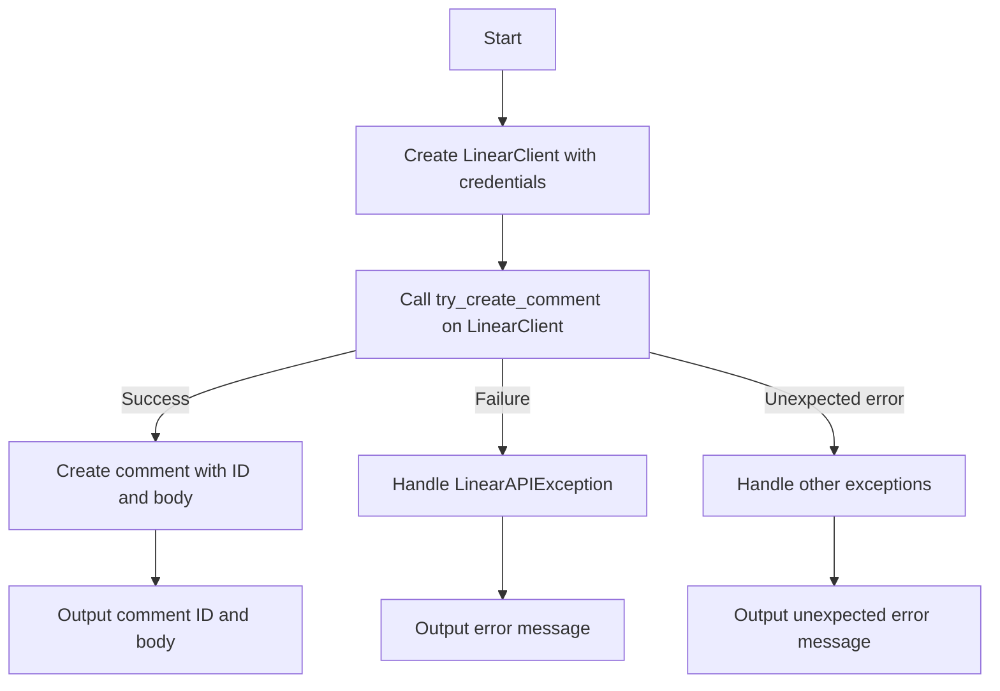
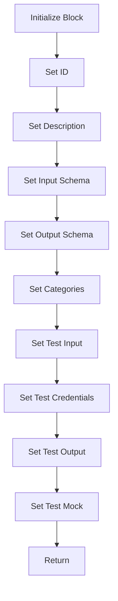
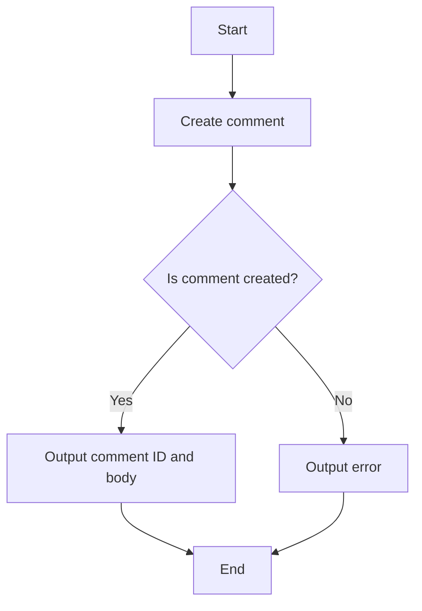

# `.\AutoGPT\autogpt_platform\backend\backend\blocks\linear\comment.py` 详细设计文档

The code defines a LinearCreateCommentBlock class that creates comments on Linear issues using OAuth2 or API key credentials.

## 整体流程



## 类结构

```
LinearCreateCommentBlock
├── Input
│   ├── credentials
│   ├── issue_id
│   └── comment
├── Output
│   ├── comment_id
│   └── comment_body
└── LinearCreateCommentBlock
```

## 全局变量及字段


### `TEST_CREDENTIALS_INPUT_OAUTH`
    
Test credentials input for OAuth2

类型：`CredentialsMetaInput`
    


### `TEST_CREDENTIALS_OAUTH`
    
OAuth2 credentials for testing

类型：`OAuth2Credentials`
    


### `LinearScope`
    
Enum representing different OAuth2 scopes

类型：`LinearScope`
    


### `linear`
    
LinearClient instance for API operations

类型：`LinearClient`
    


### `LinearCreateCommentBlock.id`
    
Unique identifier for the block

类型：`str`
    


### `LinearCreateCommentBlock.description`
    
Description of the block's functionality

类型：`str`
    


### `LinearCreateCommentBlock.input_schema`
    
Schema for the block's input data

类型：`Input`
    


### `LinearCreateCommentBlock.output_schema`
    
Schema for the block's output data

类型：`Output`
    


### `LinearCreateCommentBlock.categories`
    
Categories to which the block belongs

类型：`set`
    


### `LinearCreateCommentBlock.test_input`
    
Test input data for the block

类型：`dict`
    


### `LinearCreateCommentBlock.test_credentials`
    
Test credentials for the block

类型：`OAuth2Credentials`
    


### `LinearCreateCommentBlock.test_output`
    
Test output data for the block

类型：`list`
    


### `LinearCreateCommentBlock.test_mock`
    
Mock data for testing the block

类型：`dict`
    


### `Input.credentials`
    
Linear credentials with comment creation permissions

类型：`CredentialsMetaInput`
    


### `Input.issue_id`
    
ID of the issue to comment on

类型：`str`
    


### `Input.comment`
    
Comment text to add to the issue

类型：`str`
    


### `Output.comment_id`
    
ID of the created comment

类型：`str`
    


### `Output.comment_body`
    
Text content of the created comment

类型：`str`
    
    

## 全局函数及方法


### LinearClient.create_comment

This method is used to create a comment on a Linear issue using the provided credentials.

参数：

- `credentials`：`OAuth2Credentials | APIKeyCredentials`，The credentials used to authenticate with the Linear API.
- `issue_id`：`str`，The ID of the issue to comment on.
- `comment`：`str`，The comment text to add to the issue.

返回值：`tuple[str, str]`，A tuple containing the ID of the created comment and the text content of the comment.

#### 流程图

```mermaid
graph TD
    A[Start] --> B[Create LinearClient with credentials]
    B --> C[Call try_create_comment with issue_id and comment]
    C --> D[Get response]
    D --> E[Extract comment_id and comment_body]
    E --> F[Return (comment_id, comment_body)]
    F --> G[End]
```

#### 带注释源码

```python
@staticmethod
async def create_comment(
    credentials: OAuth2Credentials | APIKeyCredentials, issue_id: str, comment: str
) -> tuple[str, str]:
    client = LinearClient(credentials=credentials)
    response: CreateCommentResponse = await client.try_create_comment(
        issue_id=issue_id, comment=comment
    )
    return response.comment.id, response.comment.body
```


### `LinearCreateCommentBlock.create_comment`

This method creates a new comment on a Linear issue using the provided credentials.

参数：

- `credentials`：`OAuth2Credentials | APIKeyCredentials`，Linear credentials with comment creation permissions
- `issue_id`：`str`，ID of the issue to comment on
- `comment`：`str`，Comment text to add to the issue

返回值：`tuple[str, str]`，A tuple containing the ID of the created comment and the text content of the created comment

#### 流程图

```mermaid
graph TD
    A[Start] --> B[Create LinearClient with credentials]
    B --> C[Call client.try_create_comment with issue_id and comment]
    C -->|Success| D[Return (comment_id, comment_body)]
    C -->|Failure| E[Handle exception]
    E --> F[Return error message]
    D --> G[End]
    F --> G
```

#### 带注释源码

```python
    @staticmethod
    async def create_comment(
        credentials: OAuth2Credentials | APIKeyCredentials, issue_id: str, comment: str
    ) -> tuple[str, str]:
        client = LinearClient(credentials=credentials)
        response: CreateCommentResponse = await client.try_create_comment(
            issue_id=issue_id, comment=comment
        )
        return response.comment.id, response.comment.body
```


### `LinearCreateCommentBlock.create_comment`

This method creates a new comment on a Linear issue using the provided credentials.

参数：

- `credentials`：`OAuth2Credentials | APIKeyCredentials`，The credentials used to authenticate with the Linear API.
- `issue_id`：`str`，The ID of the issue to comment on.
- `comment`：`str`，The comment text to add to the issue.

返回值：`tuple[str, str]`，A tuple containing the ID of the created comment and the text content of the comment.

#### 流程图

```mermaid
graph TD
    A[Start] --> B[Create LinearClient with credentials]
    B --> C[Call try_create_comment with issue_id and comment]
    C -->|Success| D[Return (comment_id, comment_body)]
    C -->|Failure| E[Handle LinearAPIException]
    E --> F[Return error message]
    D --> G[End]
    E --> G
```

#### 带注释源码

```python
    @staticmethod
    async def create_comment(
        credentials: OAuth2Credentials | APIKeyCredentials, issue_id: str, comment: str
    ) -> tuple[str, str]:
        client = LinearClient(credentials=credentials)
        response: CreateCommentResponse = await client.try_create_comment(
            issue_id=issue_id, comment=comment
        )
        return response.comment.id, response.comment.body
```


### LinearCreateCommentBlock.__init__

This method initializes the LinearCreateCommentBlock class, setting up its configuration and schema for creating comments on Linear issues.

参数：

- `id`: `str`，The unique identifier for the block.
- `description`: `str`，A description of the block's functionality.
- `input_schema`: `BlockSchemaInput`，The schema for the input data.
- `output_schema`: `BlockSchemaOutput`，The schema for the output data.
- `categories`: `set`，A set of categories that the block belongs to.
- `test_input`: `dict`，The test input data for the block.
- `test_credentials`: `dict`，The test credentials for the block.
- `test_output`: `list`，The expected test output data.
- `test_mock`: `dict`，Mock data for testing the block.

返回值：`None`，This method does not return a value.

#### 流程图



#### 带注释源码

```
def __init__(self):
    super().__init__(
        id="8f7d3a2e-9b5c-4c6a-8f1d-7c8b3e4a5d6c",
        description="Creates a new comment on a Linear issue",
        input_schema=self.Input,
        output_schema=self.Output,
        categories={BlockCategory.PRODUCTIVITY, BlockCategory.ISSUE_TRACKING},
        test_input={
            "issue_id": "TEST-123",
            "comment": "Test comment",
            "credentials": TEST_CREDENTIALS_INPUT_OAUTH,
        },
        test_credentials=TEST_CREDENTIALS_OAUTH,
        test_output=[("comment_id", "abc123"), ("comment_body", "Test comment")],
        test_mock={
            "create_comment": lambda *args, **kwargs: (
                "abc123",
                "Test comment",
            )
        },
    )
```


### LinearCreateCommentBlock.create_comment

This method creates a new comment on a Linear issue using the provided credentials.

参数：

- `credentials`：`OAuth2Credentials | APIKeyCredentials`，Linear credentials with comment creation permissions
- `issue_id`：`str`，ID of the issue to comment on
- `comment`：`str`，Comment text to add to the issue

返回值：`tuple[str, str]`，A tuple containing the ID of the created comment and the text content of the created comment

#### 流程图

```mermaid
graph TD
    A[Start] --> B[Create LinearClient with credentials]
    B --> C[Call client.try_create_comment with issue_id and comment]
    C -->|Success| D[Return (comment_id, comment_body)]
    C -->|Failure| E[Handle LinearAPIException]
    E --> F[Return error message]
    D --> G[End]
    E --> G
```

#### 带注释源码

```python
@staticmethod
async def create_comment(
    credentials: OAuth2Credentials | APIKeyCredentials, issue_id: str, comment: str
) -> tuple[str, str]:
    client = LinearClient(credentials=credentials)
    response: CreateCommentResponse = await client.try_create_comment(
        issue_id=issue_id, comment=comment
    )
    return response.comment.id, response.comment.body
```


### LinearCreateCommentBlock.run

Execute the comment creation

参数：

- `input_data`：`Input`，The input data for the block, containing the issue ID and comment text.
- `credentials`：`OAuth2Credentials | APIKeyCredentials`，The credentials used to authenticate with the Linear API.

返回值：`BlockOutput`，The output of the block, containing the comment ID and comment body or an error message.

#### 流程图



#### 带注释源码

```python
async def run(
    self,
    input_data: Input,
    *,
    credentials: OAuth2Credentials | APIKeyCredentials,
    **kwargs,
) -> BlockOutput:
    """Execute the comment creation"""
    try:
        comment_id, comment_body = await self.create_comment(
            credentials=credentials,
            issue_id=input_data.issue_id,
            comment=input_data.comment,
        )

        yield "comment_id", comment_id
        yield "comment_body", comment_body

    except LinearAPIException as e:
        yield "error", str(e)
    except Exception as e:
        yield "error", f"Unexpected error: {str(e)}"
```


## 关键组件


### 张量索引与惰性加载

用于高效地处理大型数据集，通过延迟加载和索引优化数据访问。

### 反量化支持

提供对反量化操作的支持，以适应不同的量化需求。

### 量化策略

实现量化策略，用于优化模型性能和资源使用。


## 问题及建议


### 已知问题

-   **全局变量使用**：代码中使用了全局变量 `TEST_CREDENTIALS_INPUT_OAUTH` 和 `TEST_CREDENTIALS_OAUTH`，这些变量在类外部定义，但在 `LinearCreateCommentBlock` 类中使用。这种做法可能导致代码的可维护性和可测试性降低，因为全局变量的状态可能会在类外部被意外修改。
-   **异常处理**：代码中捕获了 `LinearAPIException` 和一个通用的 `Exception`。虽然这可以处理大部分异常情况，但没有对异常进行分类处理，可能导致某些特定类型的异常没有被正确处理。
-   **代码复用**：`create_comment` 方法在类内部被重复使用，可以考虑将其提取为一个独立的函数或类，以提高代码的复用性。

### 优化建议

-   **移除全局变量**：将全局变量移至类内部，或者使用依赖注入的方式传入，以提高代码的模块化和可测试性。
-   **细化异常处理**：根据异常的类型进行不同的处理，例如，对于 `LinearAPIException` 可以记录错误信息并返回给用户，而对于其他类型的异常，可以记录日志并返回一个通用的错误信息。
-   **提取代码复用**：将 `create_comment` 方法提取为一个独立的函数或类，以便在其他地方复用，并提高代码的清晰度。
-   **使用更具体的异常类型**：如果可能，使用更具体的异常类型来代替通用的 `Exception`，这样可以提供更详细的错误信息，并允许更精确的错误处理。
-   **单元测试**：为 `create_comment` 方法编写单元测试，以确保其在不同情况下都能正常工作，并防止未来的更改破坏其功能。


## 其它


### 设计目标与约束

- 设计目标：
  - 实现一个能够创建Linear问题评论的Block。
  - 确保Block能够处理OAuth2Credentials和APIKeyCredentials。
  - 提供清晰的错误处理机制。
  - 确保代码的可维护性和可扩展性。

- 约束：
  - 必须使用Linear SDK进行API调用。
  - 输入参数必须符合Linear SDK的要求。
  - 输出格式必须符合Block输出规范。

### 错误处理与异常设计

- 错误处理：
  - 使用try-except块捕获可能发生的异常。
  - 对于Linear API抛出的异常，捕获并返回错误信息。
  - 对于其他未预期的异常，捕获并返回通用错误信息。

### 数据流与状态机

- 数据流：
  - 输入数据通过Block的输入Schema进行验证和解析。
  - 输入数据用于创建评论。
  - 创建评论的结果通过Block的输出Schema返回。

- 状态机：
  - 无状态机，因为Block执行单一任务。

### 外部依赖与接口契约

- 外部依赖：
  - Linear SDK：用于与Linear API交互。
  - OAuth2Credentials和APIKeyCredentials：用于身份验证。

- 接口契约：
  - Block的输入和输出Schema定义了与外部系统交互的契约。
  - Linear API的接口定义了与Linear服务交互的契约。


    