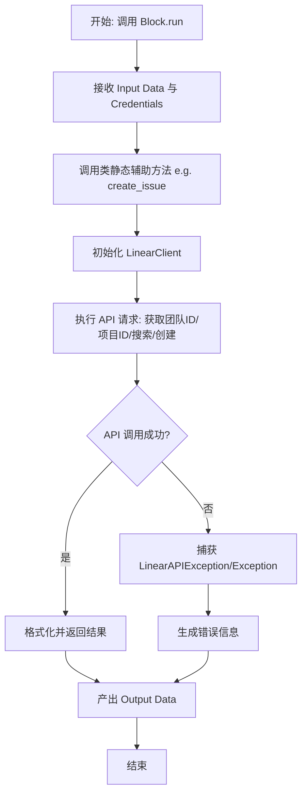
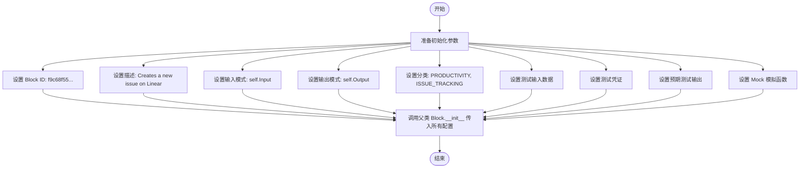
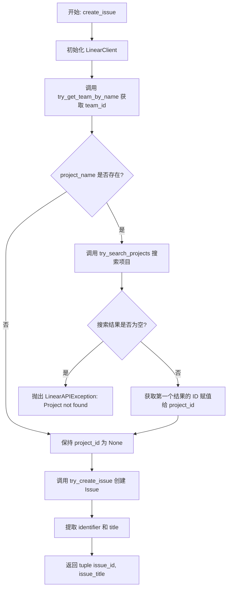
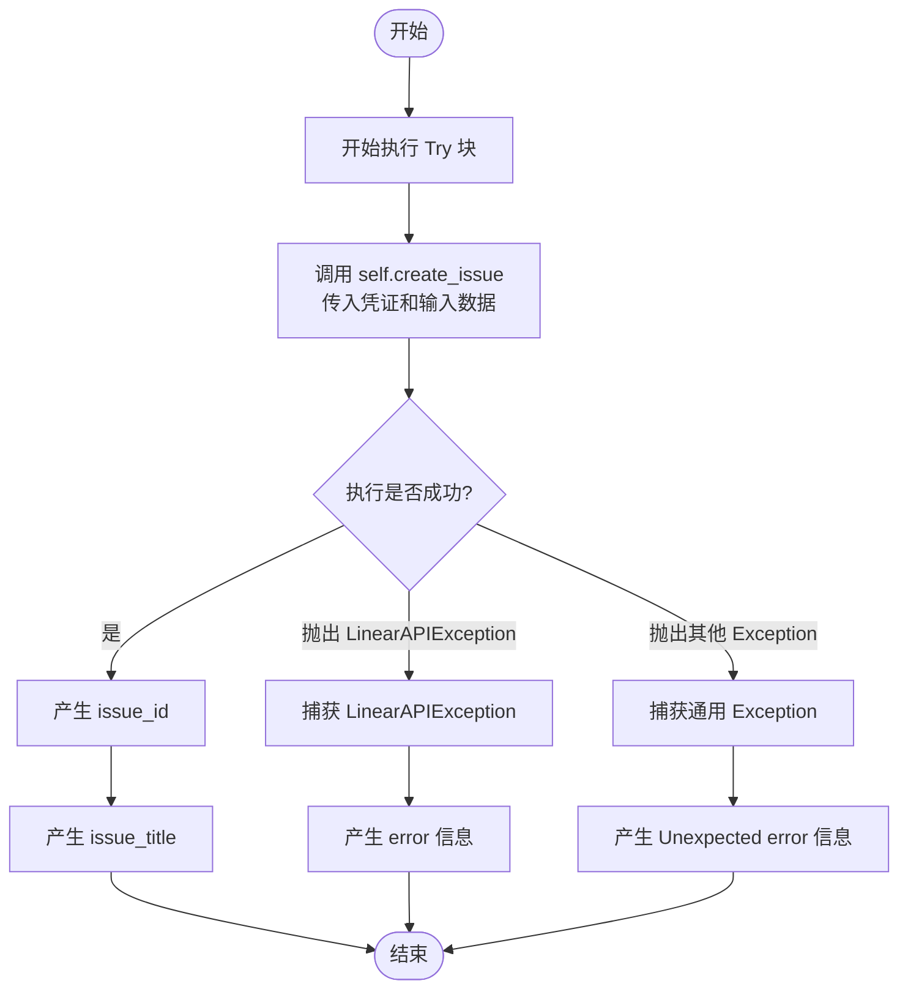
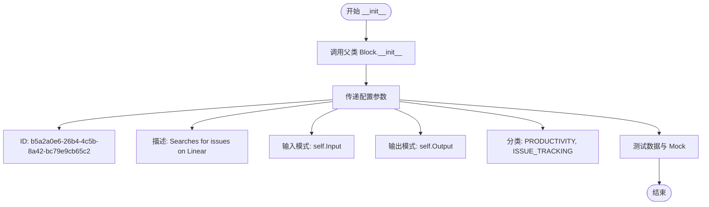
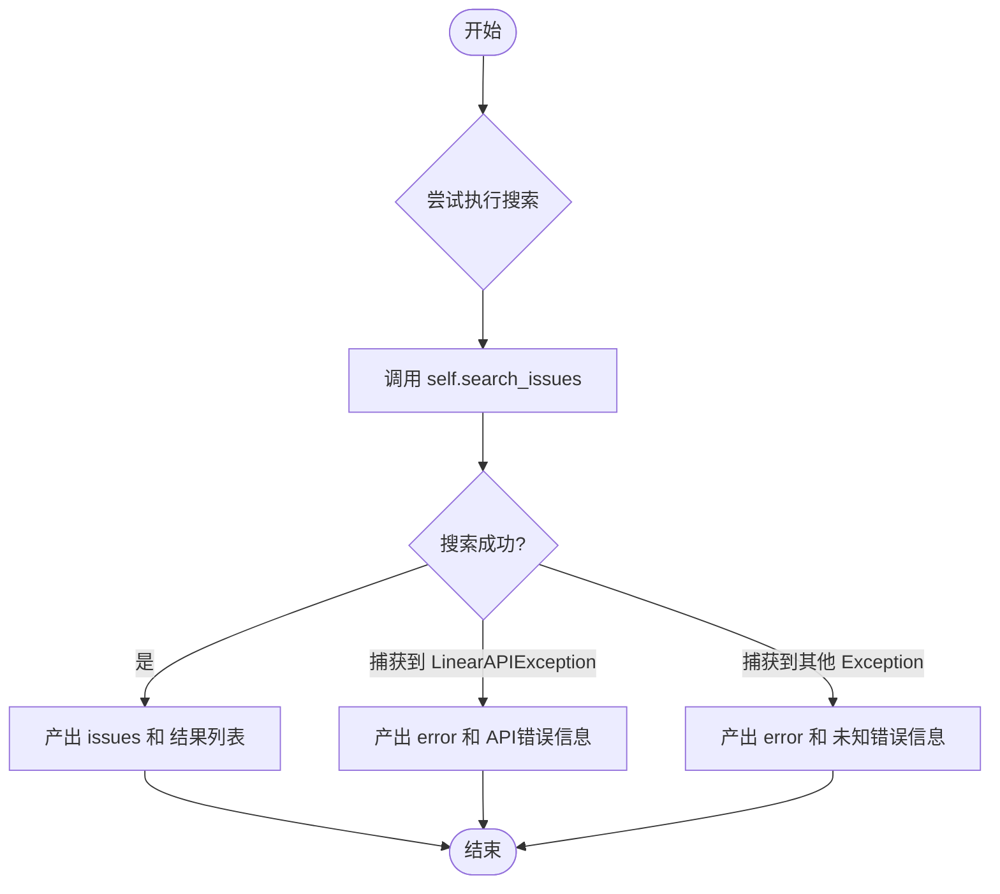
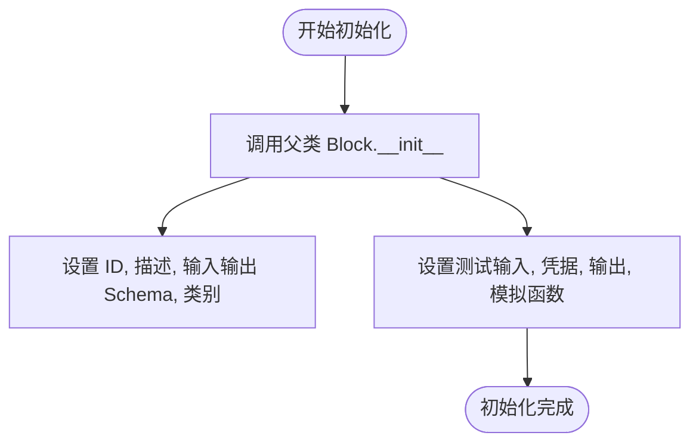
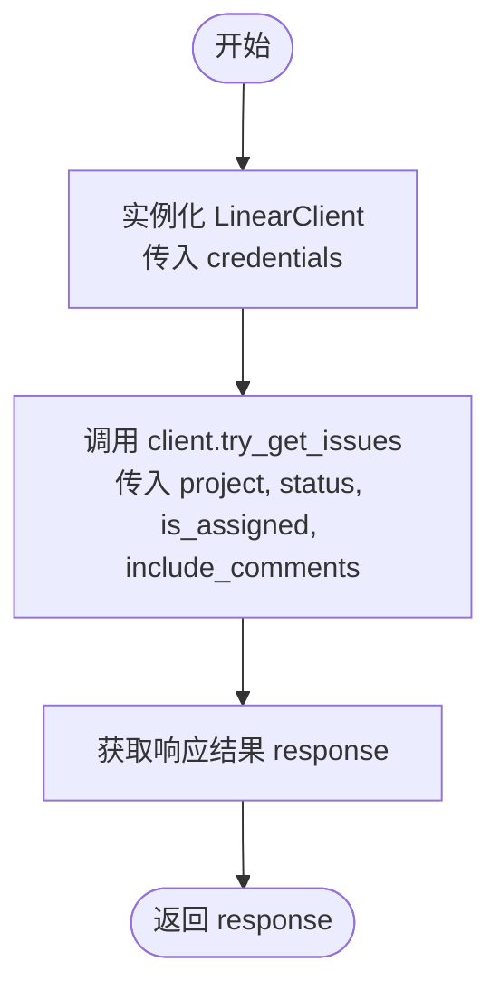
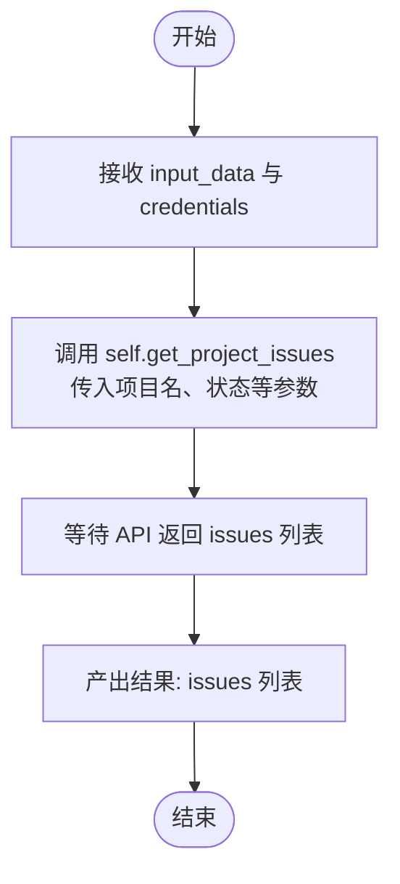

# `AutoGPT\autogpt_platform\backend\backend\blocks\linear\issues.py` 详细设计文档

该代码定义了三个用于集成 Linear 项目管理系统的功能块，分别实现了创建 Issue、搜索 Issue 以及按条件获取项目 Issue 的功能，这些类继承自 Block 基类并封装了与 Linear API 的交互逻辑。

## 整体流程



## 类结构

```
Block (SDK 基类)
├── LinearCreateIssueBlock
├── LinearSearchIssuesBlock
└── LinearGetProjectIssuesBlock
```

## 全局变量及字段


### `LinearCreateIssueBlock.Input`
    
Defines the input schema for creating a Linear issue, including credentials, title, description, team, priority, and project name.

类型：`BlockSchemaInput`
    


### `LinearCreateIssueBlock.Output`
    
Defines the output schema for creating a Linear issue, returning the created issue ID and title.

类型：`BlockSchemaOutput`
    


### `LinearSearchIssuesBlock.Input`
    
Defines the input schema for searching Linear issues, including the search term, credentials, maximum results, and optional team filter.

类型：`BlockSchemaInput`
    


### `LinearSearchIssuesBlock.Output`
    
Defines the output schema for searching Linear issues, returning a list of found issues or an error message.

类型：`BlockSchemaOutput`
    


### `LinearGetProjectIssuesBlock.Input`
    
Defines the input schema for retrieving project issues, including project name, status filter, assignee status, and comment inclusion flag.

类型：`BlockSchemaInput`
    


### `LinearGetProjectIssuesBlock.Output`
    
Defines the output schema for retrieving project issues, returning a list of issues matching the specified filters.

类型：`BlockSchemaOutput`
    
    

## 全局函数及方法


### `LinearCreateIssueBlock.__init__`

该方法用于初始化 `LinearCreateIssueBlock` 类实例，配置其在工作流中的唯一标识、描述、输入输出模式、分类以及用于测试的模拟数据和预期输出。

参数：

- `self`：`LinearCreateIssueBlock`，类实例本身

返回值：`None`，无返回值（初始化实例）

#### 流程图



#### 带注释源码

```python
def __init__(self):
    # 调用父类 Block 的初始化方法，配置该 Block 的元数据和运行时行为
    super().__init__(
        # 定义该 Block 的唯一标识符
        id="f9c68f55-dcca-40a8-8771-abf9601680aa",
        # 提供该 Block 的功能描述
        description="Creates a new issue on Linear",
        # 定义输入数据的模式（Schema），即验证和处理输入数据的结构
        input_schema=self.Input,
        # 定义输出数据的模式（Schema），即定义返回给下游的数据结构
        output_schema=self.Output,
        # 定义该 Block 所属的业务分类
        categories={BlockCategory.PRODUCTIVITY, BlockCategory.ISSUE_TRACKING},
        # 定义用于测试的输入数据样本，包含标题、描述、团队名、项目名和凭证
        test_input={
            "title": "Test issue",
            "description": "Test description",
            "team_name": "Test team",
            "project_name": "Test project",
            "credentials": TEST_CREDENTIALS_INPUT_OAUTH,
        },
        # 定义用于测试环境的认证凭证
        test_credentials=TEST_CREDENTIALS_OAUTH,
        # 定义预期的测试输出结果，验证 Block 逻辑正确性
        test_output=[("issue_id", "abc123"), ("issue_title", "Test issue")],
        # 定义测试时的模拟行为（Mock），用于在测试环境下模拟 create_issue 方法的返回，避免真实 API 调用
        test_mock={
            "create_issue": lambda *args, **kwargs: (
                "abc123",
                "Test issue",
            )
        },
    )
```


### `LinearCreateIssueBlock.create_issue`

这是一个用于在 Linear 平台上创建新 Issue 的静态方法。它通过提供的凭证初始化客户端，将团队名称和可选的项目名称解析为对应的 ID，并调用 Linear API 创建 Issue，最终返回创建结果的标识符和标题。

参数：

-  `credentials`：`OAuth2Credentials | APIKeyCredentials`，用于认证 Linear API 访问权限的凭证对象。
-  `team_name`：`str`，要在其下创建 Issue 的团队名称。
-  `title`：`str`，Issue 的标题。
-  `description`：`str | None`，Issue 的详细描述内容。
-  `priority`：`int | None`，Issue 的优先级级别。
-  `project_name`：`str | None`，关联的项目名称（可选）。

返回值：`tuple[str, str]`，包含创建成功的 Issue ID（identifier）和 Issue 标题的元组。

#### 流程图



#### 带注释源码

```python
    @staticmethod
    async def create_issue(
        credentials: OAuth2Credentials | APIKeyCredentials,
        team_name: str,
        title: str,
        description: str | None = None,
        priority: int | None = None,
        project_name: str | None = None,
    ) -> tuple[str, str]:
        # 使用提供的凭证初始化 Linear 客户端
        client = LinearClient(credentials=credentials)
        
        # 根据团队名称获取对应的团队 ID
        team_id = await client.try_get_team_by_name(team_name=team_name)
        
        # 初始化项目 ID 为 None
        project_id: str | None = None
        
        # 如果指定了项目名称，则进行项目查找
        if project_name:
            projects = await client.try_search_projects(term=project_name)
            # 如果搜索到了项目，取第一个项目的 ID
            if projects:
                project_id = projects[0].id
            else:
                # 如果未找到项目，抛出异常
                raise LinearAPIException("Project not found", status_code=404)
        
        # 调用客户端方法创建 Issue，传入团队 ID、项目 ID 及其他相关信息
        response: CreateIssueResponse = await client.try_create_issue(
            team_id=team_id,
            title=title,
            description=description,
            priority=priority,
            project_id=project_id,
        )
        
        # 返回创建成功的 Issue 标识符和标题
        return response.issue.identifier, response.issue.title
```


### `LinearCreateIssueBlock.run`

该方法用于执行在 Linear 上创建 issue 的核心逻辑。它接收输入数据和认证凭证，调用静态方法创建 issue，并以生成器的方式输出创建成功的 issue ID 和标题，或在发生异常时输出错误信息。

参数：

- `input_data`：`LinearCreateIssueBlock.Input`，包含创建 issue 所需的输入数据，如标题、描述、团队名称、优先级和项目名称等。
- `credentials`：`OAuth2Credentials`，用于访问 Linear API 的 OAuth2 认证凭证。
- `**kwargs`：`Any`，其他扩展的关键字参数。

返回值：`BlockOutput`，一个异步生成器，产生包含创建结果（issue_id, issue_title）或错误信息（error）的键值对。

#### 流程图



#### 带注释源码

```python
async def run(
    self,
    input_data: Input,
    *,
    credentials: OAuth2Credentials,
    **kwargs,
) -> BlockOutput:
    """Execute the issue creation"""
    try:
        # 调用静态方法 create_issue 执行实际的创建操作
        # 传入凭证以及从 input_data 中提取的具体参数
        issue_id, issue_title = await self.create_issue(
            credentials=credentials,
            team_name=input_data.team_name,
            title=input_data.title,
            description=input_data.description,
            priority=input_data.priority,
            project_name=input_data.project_name,
        )

        # 成功创建后，依次产生 issue_id 和 issue_title
        yield "issue_id", issue_id
        yield "issue_title", issue_title

    # 捕获 Linear API 特有的异常，并产生错误信息
    except LinearAPIException as e:
        yield "error", str(e)
    # 捕获其他未预料到的异常，并产生带有 "Unexpected error" 前缀的错误信息
    except Exception as e:
        yield "error", f"Unexpected error: {str(e)}"
```


### `LinearSearchIssuesBlock.__init__`

该方法用于初始化 `LinearSearchIssuesBlock` 实例，配置块的唯一标识符、描述、输入输出结构模式、所属分类以及用于测试的模拟数据、输入样例和预期输出。

参数：

-   `无`：该方法在定义中没有显式参数。

返回值：`None`，该方法为构造函数，无返回值。

#### 流程图



#### 带注释源码

```python
def __init__(self):
    # 调用父类 Block 的初始化方法，配置块的基本属性和测试环境
    super().__init__(
        # 设置块的唯一标识符 (UUID)
        id="b5a2a0e6-26b4-4c5b-8a42-bc79e9cb65c2",
        # 设置块的描述文本，说明其功能
        description="Searches for issues on Linear",
        # 设置输入数据的结构模式，引用类中定义的 Input 内部类
        input_schema=self.Input,
        # 设置输出数据的结构模式，引用类中定义的 Output 内部类
        output_schema=self.Output,
        # 设置块的分类标签，用于界面分组或筛选（此处为生产力和问题追踪）
        categories={BlockCategory.PRODUCTIVITY, BlockCategory.ISSUE_TRACKING},
        # 设置测试输入数据，用于自动化测试或沙箱环境模拟
        test_input={
            "term": "Test issue",
            "max_results": 10,
            "team_name": None,
            "credentials": TEST_CREDENTIALS_INPUT_OAUTH,
        },
        # 设置测试凭证，用于在测试过程中模拟用户鉴权
        test_credentials=TEST_CREDENTIALS_OAUTH,
        # 设置预期的测试输出结果，用于断言验证
        test_output=[
            (
                "issues",
                [
                    Issue(
                        id="abc123",
                        identifier="TST-123",
                        title="Test issue",
                        description="Test description",
                        priority=1,
                        state=State(
                            id="state1", name="In Progress", type="started"
                        ),
                        createdAt="2026-01-15T10:00:00.000Z",
                    )
                ],
            )
        ],
        # 设置模拟函数，用于在测试中替代实际的 API 调用逻辑，避免网络请求
        test_mock={
            "search_issues": lambda *args, **kwargs: [
                Issue(
                    id="abc123",
                    identifier="TST-123",
                    title="Test issue",
                    description="Test description",
                    priority=1,
                    state=State(id="state1", name="In Progress", type="started"),
                    createdAt="2026-01-15T10:00:00.000Z",
                )
            ]
        },
    )
```


### `LinearSearchIssuesBlock.search_issues`

根据搜索关键词和可选的团队名称，在 Linear 上检索 issue 列表，并限制返回结果的数量。

参数：

-   `credentials`：`OAuth2Credentials | APIKeyCredentials`，Linear 的身份验证凭证，用于访问 API。
-   `term`：`str`，用于搜索 issue 的关键词（通常匹配标题或描述）。
-   `max_results`：`int`，返回结果的最大数量限制，默认为 10。
-   `team_name`：`str | None`，可选参数，用于限定搜索范围的团队名称，默认为 None。

返回值：`list[Issue]`，包含符合搜索条件的 Issue 对象列表。

#### 流程图

```mermaid
flowchart TD
    A[开始] --> B[初始化 LinearClient]
    B --> C{是否提供了 team_name?}
    C -- 是 --> D[调用 client.try_get_team_by_name 获取 team_id]
    D --> E[调用 client.try_search_issues]
    C -- 否 --> E
    E -- 传入 term, max_results, team_id --> F[返回搜索结果 list[Issue]]
    F --> G[结束]
```

#### 带注释源码

```python
    @staticmethod
    async def search_issues(
        credentials: OAuth2Credentials | APIKeyCredentials,
        term: str,
        max_results: int = 10,
        team_name: str | None = None,
    ) -> list[Issue]:
        # 使用传入的凭证初始化 Linear 客户端
        client = LinearClient(credentials=credentials)

        # 解析团队名称为 ID (如果提供)
        # Raises LinearAPIException with descriptive message if team not found
        team_id: str | None = None
        if team_name:
            # 如果指定了团队名称，调用客户端方法获取对应的团队 ID
            # 如果团队不存在，此处可能会抛出 LinearAPIException
            team_id = await client.try_get_team_by_name(team_name=team_name)

        # 调用客户端方法执行搜索，传入关键词、最大结果数和团队 ID（如果有）
        return await client.try_search_issues(
            term=term,
            max_results=max_results,
            team_id=team_id,
        )
```


### `LinearSearchIssuesBlock.run`

执行 Linear Issue 搜索的核心逻辑，接收输入数据和凭证，调用静态方法完成搜索，并处理成功结果及各类异常情况。

参数：

- `input_data`：`Input`，包含搜索词、最大结果数和可选团队名称的输入数据对象。
- `credentials`：`OAuth2Credentials | APIKeyCredentials`，用于身份验证的 Linear 凭证对象。
- `**kwargs`：`Any`，框架传递的额外关键字参数。

返回值：`BlockOutput`，一个异步生成器，产生包含输出字段名（如 "issues" 或 "error"）和对应值的元组。

#### 流程图



#### 带注释源码

```python
    async def run(
        self,
        input_data: Input,
        *,
        credentials: OAuth2Credentials | APIKeyCredentials,
        **kwargs,
    ) -> BlockOutput:
        """Execute the issue search"""
        try:
            # 调用静态方法 search_issues 发起搜索请求
            # 传入凭证、搜索词、最大结果数以及可选的团队名称
            issues = await self.search_issues(
                credentials=credentials,
                term=input_data.term,
                max_results=input_data.max_results,
                team_name=input_data.team_name,
            )
            # 如果成功，产出 "issues" 键和对应的结果列表
            yield "issues", issues

        except LinearAPIException as e:
            # 捕获 Linear API 特定的业务异常，产出 "error" 键和错误详情
            yield "error", str(e)
        except Exception as e:
            # 捕获其他未预期的通用异常，产出 "error" 键和带有 "Unexpected error" 前缀的信息
            yield "error", f"Unexpected error: {str(e)}"
```


### `LinearGetProjectIssuesBlock.__init__`

初始化 `LinearGetProjectIssuesBlock` 实例，配置块的基本元数据（如ID、描述、分类）、输入输出架构、以及用于测试的输入输出数据和模拟行为。

参数：

- `self`：`LinearGetProjectIssuesBlock`，当前类的实例引用。

返回值：`None`，初始化完成不返回任何值。

#### 流程图



#### 带注释源码

```python
def __init__(self):
    # 调用父类 Block 的构造函数，配置块的元数据和行为
    super().__init__(
        # 块的唯一标识符
        id="c7d3f1e8-45a9-4b2c-9f81-3e6a8d7c5b1a",
        # 块的功能描述
        description="Gets issues from a Linear project filtered by status and assignee",
        # 定义输入数据的 Schema，引用内部类 Input
        input_schema=self.Input,
        # 定义输出数据的 Schema，引用内部类 Output
        output_schema=self.Output,
        # 块所属的分类，这里为生产力工具和问题跟踪
        categories={BlockCategory.PRODUCTIVITY, BlockCategory.ISSUE_TRACKING},
        # 定义测试用的输入数据
        test_input={
            "project": "Test Project",
            "status": "In Progress",
            "is_assigned": False,
            "include_comments": False,
            "credentials": TEST_CREDENTIALS_INPUT_OAUTH,
        },
        # 定义测试用的凭据
        test_credentials=TEST_CREDENTIALS_OAUTH,
        # 定义预期的测试输出结果
        test_output=[
            (
                "issues",
                [
                    Issue(
                        id="abc123",
                        identifier="TST-123",
                        title="Test issue",
                        description="Test description",
                        priority=1,
                    )
                ],
            ),
        ],
        # 定义模拟函数，用于在测试环境中替代真实的 API 调用
        test_mock={
            "get_project_issues": lambda *args, **kwargs: [
                Issue(
                    id="abc123",
                    identifier="TST-123",
                    title="Test issue",
                    description="Test description",
                    priority=1,
                )
            ]
        },
    )
```


### `LinearGetProjectIssuesBlock.get_project_issues`

该方法负责根据指定的项目名称、状态、受理人分配情况以及是否包含评论等条件，从 Linear 平台异步获取符合条件的议题列表。

参数：

- `credentials`：`OAuth2Credentials | APIKeyCredentials`，用于认证 Linear API 的凭据对象，支持 OAuth2 或 API Key。
- `project`：`str`，目标项目的名称，用于指定获取哪个项目下的议题。
- `status`：`str`，议题的状态名称（如 "In Progress"），用于筛选特定状态的议题。
- `is_assigned`：`bool`，受理人筛选标志，True 表示获取已分配的议题，False 表示获取未分配的议题。
- `include_comments`：`bool`，是否在返回的议题数据中包含评论内容。

返回值：`list[Issue]`，符合筛选条件的议题对象列表。

#### 流程图



#### 带注释源码

```python
    @staticmethod
    async def get_project_issues(
        credentials: OAuth2Credentials | APIKeyCredentials,
        project: str,
        status: str,
        is_assigned: bool,
        include_comments: bool,
    ) -> list[Issue]:
        # 使用传入的凭证初始化 Linear 客户端实例
        client = LinearClient(credentials=credentials)
        
        # 调用客户端的 try_get_issues 方法，根据项目、状态、分配情况和是否包含评论获取议题
        response: list[Issue] = await client.try_get_issues(
            project=project,
            status=status,
            is_assigned=is_assigned,
            include_comments=include_comments,
        )
        
        # 返回获取到的议题列表
        return response
```


### `LinearGetProjectIssuesBlock.run`

该方法负责执行从 Linear 项目获取任务的核心逻辑，根据输入的项目名称、状态、受理人状态及是否包含评论等条件检索任务列表，并将结果输出。

参数：

-  `input_data`：`Input`，包含项目名称、状态过滤条件、受理人状态以及是否包含评论等配置信息的输入数据对象。
-  `credentials`：`OAuth2Credentials | APIKeyCredentials`，用于认证和授权访问 Linear API 的凭证对象。
-  `**kwargs`：`dict`，其他扩展关键字参数，通常由框架层传递。

返回值：`BlockOutput`，一个异步生成器，产出包含键值对（"issues", 任务列表）的结果。

#### 流程图



#### 带注释源码

```python
    async def run(
        self,
        input_data: Input,
        *,
        credentials: OAuth2Credentials | APIKeyCredentials,
        **kwargs,
    ) -> BlockOutput:
        """Execute getting project issues""" # 执行获取项目任务的主逻辑
        # 调用静态方法 get_project_issues 发起异步请求
        # 将输入数据中的具体字段传递给方法，包括项目名、状态、是否已分配及是否包含评论
        issues = await self.get_project_issues(
            credentials=credentials,
            project=input_data.project,
            status=input_data.status,
            is_assigned=input_data.is_assigned,
            include_comments=input_data.include_comments,
        )
        # 将获取到的 issues 列表通过生成器产出
        yield "issues", issues
```


## 关键组件


### LinearCreateIssueBlock

A component designed to facilitate the creation of new issues within the Linear platform, handling credential validation, team resolution, and optional project association.

### LinearSearchIssuesBlock

A component responsible for searching existing Linear issues based on a specific term, with optional filtering by team name and result limiting capabilities.

### LinearGetProjectIssuesBlock

A component that retrieves a list of issues associated with a specific project, allowing for further filtering based on issue status and assignee status.


## 问题及建议


### 已知问题

-   **`LinearGetProjectIssuesBlock` 缺少异常处理机制**：该类的 `run` 方法未像其他 Block 一样包含 `try-except` 块来捕获 `LinearAPIException` 或其他异常。如果 API 调用失败（如项目未找到），该 Block 会直接抛出异常导致流程中断，而不是通过输出流返回 `error` 字段，这与其他 Block 的行为不一致。
-   **`LinearCreateIssueBlock` 输出 Schema 定义不完整**：在 `run` 方法的异常处理中，代码会 yield 一个名为 `"error"` 的键值对，但在 `Output` 类中并未定义 `error` 字段。这会导致实际运行时的输出结构与预先定义的 Schema 不符，可能导致下游处理数据时出现键缺失错误或类型不匹配。
-   **项目名称解析存在精度风险**：在 `LinearCreateIssueBlock.create_issue` 方法中，通过 `try_search_projects` 搜索项目时，如果搜索结果包含多个匹配项，代码直接取列表第一个元素 (`projects[0].id`)。当存在同名项目时，这可能会导致 Issue 被错误地关联到非预期的项目中。

### 优化建议

-   **增强输入字段校验**：`LinearCreateIssueBlock` 的 `title` 和 `description` 字段目前仅定义了类型，未设置长度限制。Linear API 通常对字段长度有约束（例如标题限制），建议在 Schema 中添加 `max_length` 等约束以便在调用 API 前拦截无效输入。
-   **抽取公共错误处理逻辑**：三个 Block 的 `run` 方法中包含大量重复的 `try-except` 结构和错误信息格式化代码（如 `yield "error", str(e)`）。建议通过装饰器或基类辅助方法封装这一逻辑，减少代码重复并确保错误处理行为的一致性。
-   **错误信息常量化**：代码中硬编码了错误提示信息（如 "Unexpected error: "）。建议将这些信息提取到常量或配置文件中，便于统一维护和国际化处理。
-   **改进项目匹配逻辑**：对于 `LinearCreateIssueBlock` 中的项目名称搜索，建议在搜索结果多于一个时抛出明确异常（例如 "Multiple projects found with name 'xxx'"），或者在无法确定唯一匹配时要求用户提供 Project ID 而非 Name，以提高数据准确性。


## 其它


### 设计目标与约束

1.  **模块化集成**：旨在将 Linear 的问题跟踪功能（创建、搜索、查询）封装为独立的、可复用的 Block 组件，以便在更大的工作流中被调用。
2.  **异步执行**：所有与外部 Linear API 的交互必须通过异步方法（`async`）进行，以保证在高并发或 I/O 密集型场景下的性能。
3.  **权限控制**：通过 OAuth2 或 API Key 进行认证，严格遵循最小权限原则。例如，创建 Issue 需要 `LinearScope.ISSUES_CREATE` 权限，而搜索只需要 `LinearScope.READ` 权限。
4.  **输入验证约束**：通过 Schema 定义对输入参数进行严格约束，例如优先级必须在 0-4 之间，搜索结果数量限制在 1-100 之间。
5.  **无状态设计**：Block 本身不维护内部状态，每次执行都是独立的，依赖于传入的输入数据和凭证。

### 错误处理与异常设计

1.  **异常捕获策略**：
    *   在 `LinearCreateIssueBlock` 和 `LinearSearchIssuesBlock` 的 `run` 方法中，采用了显式的 `try-except` 块。
    *   专门捕获 `LinearAPIException` 以处理来自 Linear API 的业务逻辑错误（如资源未找到、权限不足）。
    *   捕获通用的 `Exception` 以处理未预期的运行时错误（如网络超时、代码逻辑错误）。
2.  **错误输出契约**：
    *   当异常发生时，系统不会抛出异常中断工作流，而是通过 `yield` 输出一个名为 `error` 的键值对，其值为错误信息的字符串表示。这允许下游 Block 根据错误信息执行分支逻辑或回滚操作。
3.  **缺陷说明**：
    *   `LinearGetProjectIssuesBlock` 的 `run` 方法中缺少 `try-except` 块。这意味着如果在获取项目问题过程中发生异常，该 Block 将直接崩溃并可能导致整个工作流中断，而不是输出错误信息。这与其他两个 Block 的设计不一致，属于潜在的健壮性问题。

### 数据流与状态机

1.  **数据流向**：
    *   **输入**：外部调用者通过 `Input` Schema 传入配置参数（如标题、团队名）和元数据凭证。
    *   **处理**：
        1.  `run` 方法接收输入数据。
        2.  调用静态辅助方法（如 `create_issue`, `search_issues`）。
        3.  在辅助方法内部实例化 `LinearClient`。
        4.  执行一系列 API 调用（如解析团队名 -> 获取 Team ID -> 创建 Issue）。
    *   **输出**：处理结果通过 `BlockOutput`（生成器）逐步产出。
2.  **状态管理**：
    *   本组件采用**无状态（Stateless）**设计。类中不保存跨请求的实例变量。所有的上下文信息均通过函数参数传递。
    *   不存在复杂的内部状态机，业务流程是线性的：验证 -> 调用 -> 返回。

### 外部依赖与接口契约

1.  **外部依赖库**：
    *   `backend.sdk`：提供基础框架支持，包括 `Block` 基类、凭证类型（`OAuth2Credentials`, `APIKeyCredentials`）、Schema 定义类（`SchemaField`）以及异常处理机制。
    *   `._api.LinearClient`：核心依赖，负责与 Linear 的官方后端 API 进行 HTTP 通信。
    *   `._config.linear`：提供配置管理，包括凭证字段生成器 `credentials_field` 和测试常量。
    *   `.models`：提供数据传输对象（DTO），如 `Issue`, `State`, `CreateIssueResponse`，用于类型检查和数据封装。
2.  **接口契约**：
    *   **LinearClient 契约**：`LinearClient` 必须实现以下异步方法，否则 Block 将无法运行：
        *   `try_get_team_by_name(team_name: str) -> str`
        *   `try_search_projects(term: str) -> list[Project]`
        *   `try_create_issue(...) -> CreateIssueResponse`
        *   `try_search_issues(...) -> list[Issue]`
        *   `try_get_issues(...) -> list[Issue]`
    *   **凭证契约**：调用方必须提供有效的 `OAuth2Credentials` 或 `APIKeyCredentials`，且凭证必须包含 Block 定义中 `required_scopes` 指定的所有权限。

    