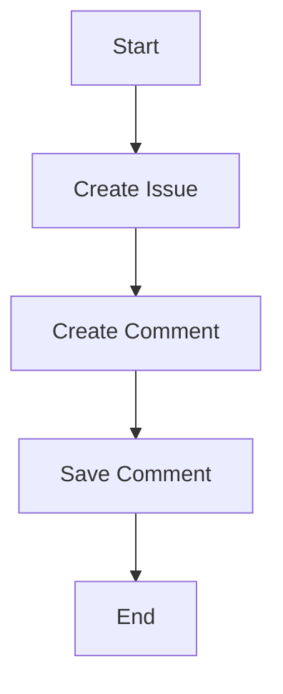

# `.\AutoGPT\autogpt_platform\backend\backend\blocks\linear\models.py` 详细设计文档

The code defines a set of classes to manage user comments on issues within a project management system. It includes models for users, comments, issues, and project management entities.

## 整体流程



## 类结构

```
BaseModel (抽象基类)
├── User
│   ├── Comment
│   ├── CreateCommentInput
│   ├── CreateCommentResponse
│   ├── CreateCommentResponseWrapper
│   ├── Project
│   ├── State
│   └── Issue
│       └── CreateIssueResponse
```

## 全局变量及字段


### `User.id`
    
Unique identifier for the user.

类型：`str`
    


### `User.name`
    
Name of the user.

类型：`str`
    


### `Comment.id`
    
Unique identifier for the comment.

类型：`str`
    


### `Comment.body`
    
Content of the comment.

类型：`str`
    


### `Comment.createdAt`
    
Creation date and time of the comment, can be None.

类型：`str | None`
    


### `Comment.user`
    
Reference to the user who made the comment, can be None.

类型：`User | None`
    


### `CreateCommentInput.body`
    
Content of the comment to be created.

类型：`str`
    


### `CreateCommentInput.issueId`
    
Identifier of the issue to which the comment is to be added.

类型：`str`
    


### `CreateCommentResponse.success`
    
Indicates whether the comment creation was successful.

类型：`bool`
    


### `CreateCommentResponse.comment`
    
The created comment object.

类型：`Comment`
    


### `CreateCommentResponseWrapper.commentCreate`
    
The wrapped create comment response.

类型：`CreateCommentResponse`
    


### `Project.id`
    
Unique identifier for the project.

类型：`str`
    


### `Project.name`
    
Name of the project.

类型：`str`
    


### `Project.description`
    
Description of the project, can be None.

类型：`str | None`
    


### `Project.priority`
    
Priority of the project, can be None.

类型：`int | None`
    


### `Project.progress`
    
Progress of the project, can be None.

类型：`float | None`
    


### `Project.content`
    
Content of the project, can be None.

类型：`str | None`
    


### `State.id`
    
Unique identifier for the state.

类型：`str`
    


### `State.name`
    
Name of the state.

类型：`str`
    


### `State.type`
    
Type of the state, can be None.

类型：`str | None`
    


### `Issue.id`
    
Unique identifier for the issue.

类型：`str`
    


### `Issue.identifier`
    
Identifier of the issue.

类型：`str`
    


### `Issue.title`
    
Title of the issue.

类型：`str`
    


### `Issue.description`
    
Description of the issue, can be None.

类型：`str | None`
    


### `Issue.priority`
    
Priority of the issue.

类型：`int`
    


### `Issue.state`
    
Current state of the issue, can be None.

类型：`State | None`
    


### `Issue.project`
    
Project to which the issue belongs, can be None.

类型：`Project | None`
    


### `Issue.createdAt`
    
Creation date and time of the issue, can be None.

类型：`str | None`
    


### `Issue.comments`
    
List of comments related to the issue, can be None.

类型：`list[Comment] | None`
    


### `Issue.assignee`
    
User assigned to the issue, can be None.

类型：`User | None`
    


### `CreateIssueResponse.issue`
    
The created issue object.

类型：`Issue`
    
    

## 全局函数及方法


## 关键组件


### 张量索引与惰性加载

支持对张量进行索引操作，并采用惰性加载机制以优化内存使用。

### 反量化支持

提供反量化功能，允许在量化过程中对模型进行反量化处理。

### 量化策略

实现多种量化策略，以适应不同的量化需求。


## 问题及建议


### 已知问题

-   **全局变量缺失**：代码中没有使用全局变量，但考虑到可能存在全局配置或状态管理需求，建议考虑引入全局变量。
-   **错误处理未明确**：代码中没有显示错误处理机制，建议在类方法和全局函数中添加异常处理逻辑。
-   **数据流不明确**：虽然类之间存在关联，但数据流的具体实现细节未在代码中体现，建议通过文档或注释明确数据流路径。
-   **状态机未实现**：`State` 类和 `Issue` 类中包含状态信息，但没有实现状态转换逻辑，建议添加状态机相关代码。

### 优化建议

-   **引入全局变量**：根据实际需求，引入全局变量用于配置管理、状态管理等。
-   **添加错误处理**：在类方法和全局函数中添加异常处理逻辑，确保系统稳定性和用户体验。
-   **明确数据流**：通过文档或注释明确数据流路径，确保代码的可读性和可维护性。
-   **实现状态机**：根据业务需求，实现状态机逻辑，确保状态转换的正确性和一致性。
-   **代码复用**：考虑将重复的代码片段提取为函数或类，提高代码复用性和可维护性。
-   **单元测试**：编写单元测试，确保代码质量和功能正确性。
-   **性能优化**：根据实际运行情况，对代码进行性能优化，提高系统响应速度和资源利用率。


## 其它


### 设计目标与约束

- 设计目标：
  - 提供一个模块化的代码结构，便于维护和扩展。
  - 确保数据的一致性和完整性。
  - 提供清晰的接口契约，方便与其他系统交互。
- 约束条件：
  - 使用BaseModel确保数据模型的一致性。
  - 遵循RESTful API设计原则。

### 错误处理与异常设计

- 错误处理：
  - 定义自定义异常类，以处理特定错误情况。
  - 使用try-except块捕获和处理异常。
- 异常设计：
  - 异常应提供足够的信息，以便开发者能够快速定位问题。
  - 异常应遵循统一的命名规范。

### 数据流与状态机

- 数据流：
  - 用户创建评论时，数据流从客户端到服务器，经过验证和处理，最终存储在数据库中。
- 状态机：
  - Issue对象的状态可能包括：创建、待处理、进行中、完成、取消等。

### 外部依赖与接口契约

- 外部依赖：
  - 依赖BaseModel类，该类可能依赖于其他库或框架。
- 接口契约：
  - 使用BaseModel确保数据模型的一致性，并定义了统一的接口契约。
  - 提供RESTful API接口，遵循HTTP状态码规范。

### 安全性与认证

- 安全性：
  - 确保敏感数据（如用户信息）在传输和存储过程中得到加密。
  - 实施访问控制，确保只有授权用户才能访问敏感数据。
- 认证：
  - 使用OAuth或JWT等认证机制，确保用户身份验证。

### 性能优化

- 性能优化：
  - 使用缓存机制，减少数据库访问次数。
  - 对查询进行优化，提高查询效率。

### 测试与部署

- 测试：
  - 编写单元测试和集成测试，确保代码质量。
- 部署：
  - 提供自动化部署脚本，简化部署过程。
  - 监控系统性能，及时发现并解决问题。

### 文档与维护

- 文档：
  - 提供详细的API文档和代码注释，方便开发者理解和使用。
- 维护：
  - 定期更新代码，修复已知问题，并添加新功能。
  - 保持代码的可读性和可维护性。


    