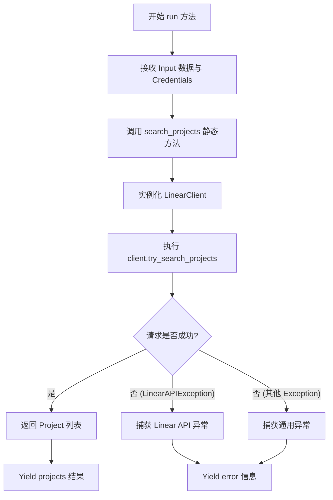
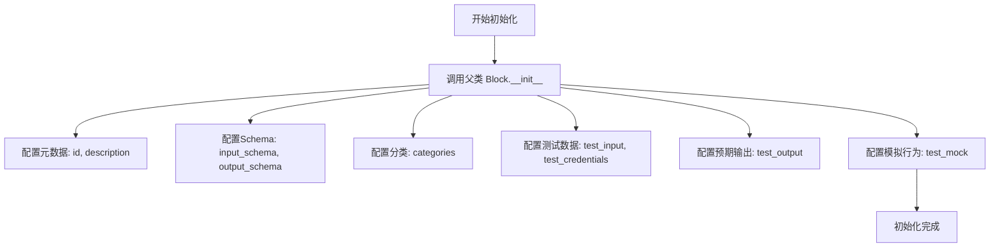
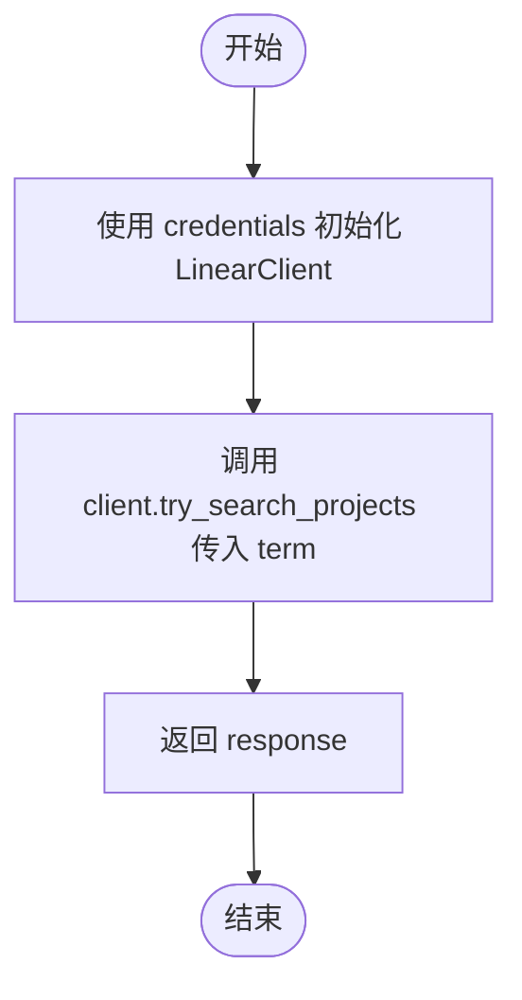
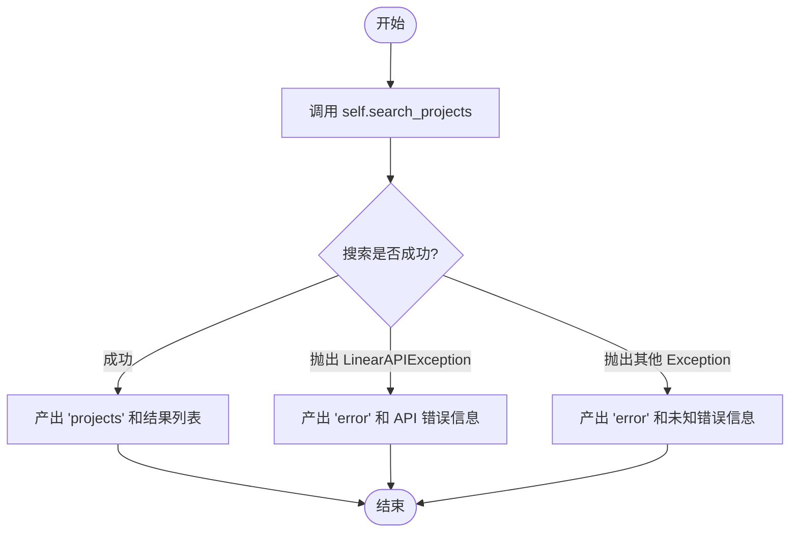

# `AutoGPT\autogpt_platform\backend\backend\blocks\linear\projects.py` 详细设计文档

该代码定义了一个名为 `LinearSearchProjectsBlock` 的集成块，用于通过 OAuth2 或 API Key 凭证连接 Linear API，根据搜索词检索项目列表，并包含完整的输入输出定义、测试配置及异步执行逻辑。

## 整体流程



## 类结构

```
Block (外部基类)
└── LinearSearchProjectsBlock
    ├── Input (BlockSchemaInput)
    └── Output (BlockSchemaOutput)
```

## 全局变量及字段


### `LinearSearchProjectsBlock.Input.credentials`
    
具有读取权限的 Linear 凭证

类型：`CredentialsMetaInput`
    


### `LinearSearchProjectsBlock.Input.term`
    
用于搜索项目的词

类型：`str`
    


### `LinearSearchProjectsBlock.Output.projects`
    
项目列表

类型：`list[Project]`
    
    

## 全局函数及方法


### `LinearSearchProjectsBlock.__init__`

初始化 `LinearSearchProjectsBlock` 实例，配置该块的元数据、输入输出Schema、分类类别以及用于测试目的的各种配置数据（包括测试输入、凭证、预期输出和模拟行为）。

参数：

- `self`：`LinearSearchProjectsBlock`，指向类实例本身的引用。

返回值：`None`，该方法用于初始化对象，无返回值。

#### 流程图



#### 带注释源码

```python
def __init__(self):
    # 调用父类 Block 的初始化方法，传入必要的配置参数
    super().__init__(
        # 块的唯一标识符
        id="446a1d35-9d8f-4ac5-83ea-7684ec50e6af",
        # 块的功能描述
        description="Searches for projects on Linear",
        # 定义的输入 Schema 类
        input_schema=self.Input,
        # 定义的输出 Schema 类
        output_schema=self.Output,
        # 块所属的业务分类
        categories={BlockCategory.PRODUCTIVITY, BlockCategory.ISSUE_TRACKING},
        # 用于测试的输入数据
        test_input={
            "term": "Test project",
            "credentials": TEST_CREDENTIALS_INPUT_OAUTH,
        },
        # 用于测试的凭证
        test_credentials=TEST_CREDENTIALS_OAUTH,
        # 预期的测试输出结果
        test_output=[
            (
                "projects",
                [
                    Project(
                        id="abc123",
                        name="Test project",
                        description="Test description",
                        priority=1,
                        progress=1,
                        content="Test content",
                    )
                ],
            )
        ],
        # 测试时的模拟行为配置，这里模拟 search_projects 方法直接返回预设数据
        test_mock={
            "search_projects": lambda *args, **kwargs: [
                Project(
                    id="abc123",
                    name="Test project",
                    description="Test description",
                    priority=1,
                    progress=1,
                    content="Test content",
                )
            ]
        },
    )
```


### `LinearSearchProjectsBlock.search_projects`

该方法是一个静态异步方法，用于通过 Linear API 客户端根据给定的凭据和搜索词异步查询项目列表。

参数：

-   `credentials`：`OAuth2Credentials | APIKeyCredentials`，用于身份验证的凭据对象，支持 OAuth2 或 API Key 两种方式。
-   `term`：`str`，用于搜索项目的关键词或字符串。

返回值：`list[Project]`，包含搜索结果的项目对象列表。

#### 流程图



#### 带注释源码

```python
@staticmethod
async def search_projects(
    credentials: OAuth2Credentials | APIKeyCredentials,
    term: str,
) -> list[Project]:
    # 使用传入的凭据实例化 Linear API 客户端
    client = LinearClient(credentials=credentials)
    # 异步调用客户端的搜索方法，并传入搜索词，获取项目列表
    response: list[Project] = await client.try_search_projects(term=term)
    # 返回查询到的项目列表
    return response
```


### `LinearSearchProjectsBlock.run`

执行 Linear 项目的搜索操作。该方法负责处理输入数据，调用 API 搜索项目，并根据执行结果返回项目列表或错误信息。

参数：

-  `input_data`：`Input`，包含搜索词（term）的输入数据对象，类型为内部类 `Input`。
-  `credentials`：`OAuth2Credentials | APIKeyCredentials`，用于身份验证的凭证对象，支持 OAuth2 或 API Key。
-  `**kwargs`：`dict`，接收额外的关键字参数（通常由框架传递，本方法体中未直接使用）。

返回值：`BlockOutput`，一个异步生成器，产生包含输出键值对的元组（如 `("projects", list[Project])` 或 `("error", str)`）。

#### 流程图



#### 带注释源码

```python
async def run(
    self,
    input_data: Input,
    *,
    credentials: OAuth2Credentials | APIKeyCredentials,
    **kwargs,
) -> BlockOutput:
    """Execute the project search"""
    try:
        # 调用静态辅助方法 search_projects，传入凭证和搜索词
        # 该方法内部初始化 LinearClient 并执行异步查询
        projects = await self.search_projects(
            credentials=credentials,
            term=input_data.term,
        )

        # 成功获取结果后，产出 "projects" 键和对应的项目列表
        yield "projects", projects

    except LinearAPIException as e:
        # 捕获 Linear API 返回的特定错误，产出 "error" 键和错误信息
        yield "error", str(e)
    except Exception as e:
        # 捕获其他未预期的异常，产出 "error" 键和带有 "Unexpected error" 前缀的信息
        yield "error", f"Unexpected error: {str(e)}"
```


## 关键组件


### LinearSearchProjectsBlock
主组件类，继承自 Block，封装了 Linear 项目搜索功能的元数据、输入/输出模式定义及核心执行逻辑。

### Schema Definitions
数据契约组件，通过 Input 和 Output 内部类严格定义了搜索请求所需的凭证与搜索词，以及响应返回的项目列表结构。

### Authentication Strategy
认证策略组件，集成了 OAuth2 和 API Key 两种凭证处理机制，并利用 LinearScope 确保读权限的校验。

### Service Layer (search_projects)
业务逻辑层组件，作为静态方法负责初始化 LinearClient 客户端，并执行异步的项目搜索请求。

### Execution Flow (run)
执行流程组件，协调整个 Block 的生命周期，包括解析输入数据、调用业务逻辑、处理 API 异常及通用异常，并生成最终的输出或错误信息。

### External Client Dependency
外部依赖组件，指代 LinearClient，用于封装与 Linear API 的底层通信细节。

### Error Handling Mechanism
异常处理组件，在 run 方法中通过 try-except 块捕获 LinearAPIException 和通用 Exception，确保错误能被标准化输出。


## 问题及建议


### 已知问题

-   **Schema 定义与实际输出不一致**：`Output` 类仅定义了 `projects` 字段，但在 `run` 方法的异常处理中 yield 了 `error` 键。这会导致输出结构不符合定义的 Schema，可能在运行时引发错误或导致下游无法正确解析错误信息。
-   **异常捕获过于宽泛**：使用了 `except Exception as e` 捕获所有异常，这会掩盖代码层面的逻辑错误（如 `AttributeError` 或 `TypeError`），不仅增加了调试难度，还可能意外捕获系统级异常。
-   **缺少基本的输入校验**：代码未对输入参数 `term` 进行非空、去空格或长度校验，直接传递给 API 可能导致无效请求或资源浪费。
-   **硬编码的测试数据耦合**：`__init__` 方法中包含了大量的测试输入、凭证和模拟数据，这使得业务类与测试数据强耦合，导致代码臃肿且难以维护。

### 优化建议

-   **完善错误处理机制**：建议在 `Output` Schema 中显式添加 `error: str` 字段，或者在捕获异常后使用日志记录并重新抛出特定异常，交由框架全局处理，避免 yield 未定义的字段。
-   **增强参数控制能力**：建议在 `Input` 类中增加 `limit` 或 `first` 等分页控制参数，允许调用者限制返回结果的数量，以避免在大数据量场景下的性能问题。
-   **引入日志记录**：在关键流程（如 API 调用开始、返回结果、捕获异常）处添加日志记录，提升系统的可观测性和线上问题的排查效率。
-   **依赖解耦以提高可测试性**：将 `LinearClient` 的实例化逻辑从 `search_projects` 静态方法中剥离，改为通过参数传入或使用依赖注入模式。这样可以在单元测试中更容易地注入 Mock 对象，而不依赖 SDK 的特定 Mock 机制。
-   **代码组织优化**：将 `__init__` 中的测试配置（`test_input`, `test_mock` 等）提取到类的常量或独立的配置文件/测试基类中，保持核心业务逻辑的代码整洁。


## 其它


### 设计目标与约束

1.  **异步执行**：代码设计基于异步 I/O 模型，所有网络请求（通过 `LinearClient`）和主执行方法（`run`）均使用 `async/await` 语法，以避免阻塞主线程，提高高并发场景下的吞吐量。
2.  **权限控制**：严格依赖 Linear 的权限系统。通过 `required_scopes={LinearScope.READ}` 约束，确保执行该块的凭证必须包含读权限，否则在凭证校验阶段应被拦截。
3.  **多认证方式支持**：设计上需兼容 `OAuth2Credentials` 和 `APIKeyCredentials` 两种认证方式，增加集成的灵活性。
4.  **Schema 严格性**：输入输出必须严格遵循预定义的 `BlockSchemaInput` 和 `BlockSchemaOutput`，确保数据结构在进入和离开 Block 时的类型安全。

### 错误处理与异常设计

1.  **捕获与转换策略**：采用“捕获-转换-产出”的策略，不直接向上抛出异常，而是将异常信息转换为标准化的输出流。
2.  **分类处理**：
    *   **LinearAPIException**：针对 Linear API 返回的业务逻辑错误或 HTTP 错误进行捕获，这通常意味着请求到达了服务端但处理失败（如无权限、资源不存在）。
    *   **Exception**：捕获所有其他未预期的异常（如网络断连、代码逻辑错误），防止系统崩溃。
3.  **错误标准化输出**：无论发生何种异常，均通过 `yield "error", <message>` 的形式将错误信息作为输出流的一部分产出。这要求下游处理逻辑必须检查输出键名是 "projects" 还是 "error" 来判断执行结果。

### 数据流与状态机

1.  **数据流向**：
    *   **输入阶段**：外部系统传入包含 `credentials` 和 `term` 的 `input_data`。
    *   **凭证注入**：框架自动解析并注入具体的凭证对象（`OAuth2Credentials` 或 `APIKeyCredentials`）。
    *   **处理阶段**：`LinearClient` 利用凭证初始化会话，发送包含搜索词的请求到 Linear API。
    *   **转换阶段**：API 返回的原始数据被反序列化为 `Project` 模型列表。
    *   **输出阶段**：通过 Python Generator (`yield`) 将数据逐条或批量吐出给调用方。
2.  **状态机**：
    *   本 Block 是无状态的原子操作。
    *   状态流转简单直接：**Idle (空闲)** -> **Running (执行中/等待IO)** -> **Completed (成功产出 projects)** 或 **Failed (成功产出 error)**。

### 外部依赖与接口契约

1.  **LinearClient (`._api.LinearClient`)**：
    *   **契约**：必须支持异步初始化和 `try_search_projects(term: str)` 方法。
    *   **职责**：负责处理底层的 HTTP 请求构建、认证头添加、响应解析和 HTTP 层面的错误抛出（抛出 `LinearAPIException`）。
2.  **Project Model (`.models.Project`)**：
    *   **契约**：作为数据传输对象（DTO），必须包含 `id`, `name`, `description`, `priority`, `progress`, `content` 等字段，确保与 Linear API 的返回结构兼容。
3.  **Backend SDK (`backend.sdk`)**：
    *   **Block 基类**：强制实现 `run` 方法，并要求 `__init__` 中定义 `id`, `input_schema`, `output_schema` 等元数据。
    *   **SchemaField**：用于定义输入输出的元数据验证规则和描述信息。

    