# `AutoGPT\autogpt_platform\backend\backend\blocks\llm.py` 详细设计文档

该代码定义了一套用于与大语言模型（LLM）交互的模块化构建块（Block），支持多种提供商（如OpenAI, Anthropic, Groq等），实现了包括文本生成、结构化数据提取、对话管理、长文本摘要和列表生成等功能，并包含统一的模型元数据管理、API凭证处理、提示词压缩及重试机制等核心工具。

## 整体流程

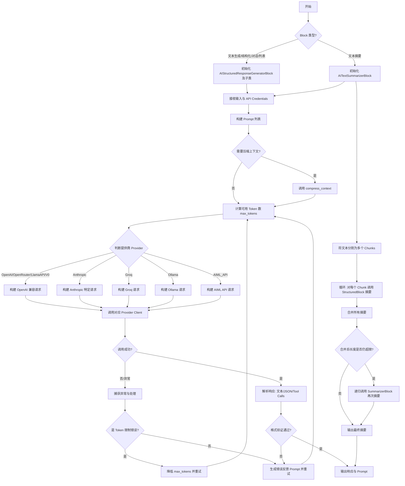

## 类结构

```
AIBlockBase (抽象基类)
├── AIStructuredResponseGeneratorBlock (核心结构化生成块)
│   ├── AITextGeneratorBlock (复用 Structured 生成纯文本)
│   ├── AIConversationBlock (复用 Structured 处理多轮对话)
│   └── AIListGeneratorBlock (复用 Structured 生成列表)
└── AITextSummarizerBlock (长文本摘要块)

数据模型 (Data Models)
├── LlmModel (Enum: 模型枚举与元数据)
├── ModelMetadata (NamedTuple: 模型元数据定义)
├── ToolCall (BaseModel: 工具调用参数)
├── ToolContentBlock (BaseModel: 工具调用内容块)
└── LLMResponse (BaseModel: 统一的 LLM 响应格式)

辅助枚举 (Enums)
└── SummaryStyle (摘要风格)
```

## 全局变量及字段


### `LLMProviderName`
    
A literal type defining the supported LLM provider names.

类型：`Literal[ProviderName.AIML_API, ...]`
    


### `AICredentials`
    
Pydantic model for AI model provider API key credentials.

类型：`CredentialsMetaInput`
    


### `TEST_CREDENTIALS`
    
Mock API credentials object used for unit testing.

类型：`APIKeyCredentials`
    


### `TEST_CREDENTIALS_INPUT`
    
Dictionary representation of the mock credentials object.

类型：`dict`
    


### `DEFAULT_LLM_MODEL`
    
The default LLM model used by blocks if not specified.

类型：`LlmModel`
    


### `MODEL_METADATA`
    
Dictionary mapping LLM model enums to their metadata.

类型：`dict[LlmModel, ModelMetadata]`
    


### `logger`
    
Logger instance configured for this module with truncation.

类型：`TruncatedLogger`
    


### `fmt`
    
Utility instance for formatting text strings.

类型：`TextFormatter`
    


### `ModelMetadata.provider`
    
The identifier for the underlying API provider (e.g., 'openai').

类型：`str`
    


### `ModelMetadata.context_window`
    
The maximum context window size in tokens for the model.

类型：`int`
    


### `ModelMetadata.max_output_tokens`
    
The maximum output token count allowed for the model response.

类型：`int | None`
    


### `ModelMetadata.display_name`
    
The human-readable name of the model for UI display.

类型：`str`
    


### `ModelMetadata.provider_name`
    
The full name of the provider service (e.g., 'OpenAI').

类型：`str`
    


### `ModelMetadata.creator_name`
    
The name of the entity or organization that created the model.

类型：`str`
    


### `ModelMetadata.price_tier`
    
The pricing tier classification associated with the model usage.

类型：`Literal[1, 2, 3]`
    


### `ToolCall.name`
    
The name of the specific function to be called.

类型：`str`
    


### `ToolCall.arguments`
    
The arguments passed to the function, typically a JSON string.

类型：`str`
    


### `ToolContentBlock.id`
    
The unique identifier associated with the tool call.

类型：`str`
    


### `ToolContentBlock.type`
    
The type of the content block (e.g., 'function').

类型：`str`
    


### `ToolContentBlock.function`
    
The object containing the details of the tool call.

类型：`ToolCall`
    


### `LLMResponse.raw_response`
    
The unmodified raw response object returned from the LLM provider.

类型：`Any`
    


### `LLMResponse.prompt`
    
The list of prompt messages sent to the LLM.

类型：`List[Any]`
    


### `LLMResponse.response`
    
The text content extracted from the model's response.

类型：`str`
    


### `LLMResponse.tool_calls`
    
A list of tool calls generated by the model, if any.

类型：`Optional[List[ToolContentBlock]]`
    


### `LLMResponse.prompt_tokens`
    
The number of tokens used in the input prompt.

类型：`int`
    


### `LLMResponse.completion_tokens`
    
The number of tokens used in the model's output generation.

类型：`int`
    


### `LLMResponse.reasoning`
    
The reasoning content of the model, if available.

类型：`Optional[str]`
    


### `AIBlockBase.prompt`
    
Instance variable storing the list of prompts sent to the LLM.

类型：`list`
    


### `AIStructuredResponseGeneratorBlock.Input`
    
Pydantic model defining the input schema for the block.

类型：`BlockSchemaInput`
    


### `AIStructuredResponseGeneratorBlock.Output`
    
Pydantic model defining the output schema for the block.

类型：`BlockSchemaOutput`
    


### `AITextGeneratorBlock.Input`
    
Pydantic model defining the input schema for the block.

类型：`BlockSchemaInput`
    


### `AITextGeneratorBlock.Output`
    
Pydantic model defining the output schema for the block.

类型：`BlockSchemaOutput`
    


### `AITextSummarizerBlock.Input`
    
Pydantic model defining the input schema for the block.

类型：`BlockSchemaInput`
    


### `AITextSummarizerBlock.Output`
    
Pydantic model defining the output schema for the block.

类型：`BlockSchemaOutput`
    


### `AIConversationBlock.Input`
    
Pydantic model defining the input schema for the block.

类型：`BlockSchemaInput`
    


### `AIConversationBlock.Output`
    
Pydantic model defining the output schema for the block.

类型：`BlockSchemaOutput`
    


### `AIListGeneratorBlock.Input`
    
Pydantic model defining the input schema for the block.

类型：`BlockSchemaInput`
    


### `AIListGeneratorBlock.Output`
    
Pydantic model defining the output schema for the block.

类型：`BlockSchemaOutput`
    
    

## 全局函数及方法


### `AICredentialsField`

该函数是一个工厂函数，用于构建一个用于 AI 模型凭证的输入字段定义。它通过映射不同的 LLM 模型到对应的提供商（Provider），实现了基于模型名称动态选择 API 密钥的配置机制。

参数：

无

返回值：`AICredentials`，返回一个凭证字段配置对象（通常为 Pydantic 模型字段或类似结构），该对象包含描述、鉴别器以及模型值到提供商的映射关系。

#### 流程图

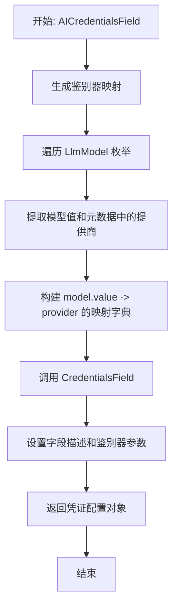

#### 带注释源码

```python
def AICredentialsField() -> AICredentials:
    # 调用通用的 CredentialsField 工厂函数来创建一个专门化的凭证字段
    return CredentialsField(
        # 字段的用户可见描述，用于说明该字段的作用
        description="API key for the LLM provider.",
        # 指定鉴别器字段为 "model"，系统将根据输入的 "model" 值来决定使用哪种凭证
        discriminator="model",
        # 动态构建鉴别器映射：遍历 LlmModel 枚举中的所有模型
        # 将每个模型的字符串值映射到其元数据中定义的提供商名称
        discriminator_mapping={
            model.value: model.metadata.provider for model in LlmModel
        },
    )
```


### `convert_openai_tool_fmt_to_anthropic`

将 OpenAI 格式的工具定义转换为 Anthropic API 兼容的工具定义格式。该函数处理工具列表的结构差异，将 OpenAI 的 `parameters` 字段映射为 Anthropic 的 `input_schema`，并处理可能的空输入情况。

参数：

- `openai_tools`：`list[dict] | None`，OpenAI 格式的工具定义列表，包含函数名称、描述及参数。如果为 None 或空列表，则表示没有工具。

返回值：`Iterable[ToolParam] | anthropic.Omit`，返回 Anthropic 格式的工具参数列表，如果输入为空则返回 `anthropic.omit` 以指示省略该参数。

#### 流程图

```mermaid
flowchart TD
    A[开始: convert_openai_tool_fmt_to_anthropic] --> B{检查 openai_tools 是否为空或 None?}
    B -- 是 --> C[返回 anthropic.omit]
    B -- 否 --> D[初始化 anthropic_tools 列表]
    D --> E[遍历 openai_tools 列表]
    E --> F{tool 字典中是否存在 'function' 键?}
    F -- 是 --> G[提取 tool['function'] 作为 function_data]
    F -- 否 --> H[直接使用 tool 作为 function_data]
    G --> I[构建 Anthropic 格式工具字典]
    H --> I
    I --> J[映射 name, description]
    I --> K[构建 input_schema: type=object, properties, required]
    K --> L[将构建的工具添加到 anthropic_tools]
    L --> E
    E -- 遍历结束 --> M[返回 anthropic_tools]
```

#### 带注释源码

```python
def convert_openai_tool_fmt_to_anthropic(
    openai_tools: list[dict] | None = None,
) -> Iterable[ToolParam] | anthropic.Omit:
    """
    Convert OpenAI tool format to Anthropic tool format.
    """
    # 如果没有提供工具，或者工具列表为空，返回 anthropic.omit
    # 这是一个特殊的值，告诉 Anthropic SDK 在请求中省略此参数
    if not openai_tools or len(openai_tools) == 0:
        return anthropic.omit

    anthropic_tools = []
    for tool in openai_tools:
        # OpenAI 的工具格式通常包含一个顶层 "type": "function" 和一个 "function" 键
        # 有时候也可能直接传入 function 定义字典
        if "function" in tool:
            # Handle case where tool is already in OpenAI format with "type" and "function"
            function_data = tool["function"]
        else:
            # Handle case where tool is just the function definition
            function_data = tool

        # 构建 Anthropic 风格的工具定义
        # Anthropic 使用 "input_schema" 直接包裹参数定义，而 OpenAI 使用 "parameters"
        anthropic_tool: anthropic.types.ToolParam = {
            "name": function_data["name"],
            "description": function_data.get("description", ""),
            "input_schema": {
                "type": "object",
                "properties": function_data.get("parameters", {}).get("properties", {}),
                "required": function_data.get("parameters", {}).get("required", []),
            },
        }
        anthropic_tools.append(anthropic_tool)

    return anthropic_tools
```


### `extract_openai_reasoning`

Extracts the reasoning content (often associated with "Chain of Thought" or internal logic) from an OpenAI-compatible API response object. It attempts to locate this content in multiple potential fields within the response structure.

参数：

-  `response`：`Any`，The raw response object returned by an OpenAI-compatible API chat completion call.

返回值：`str | None`，The extracted reasoning string if found; otherwise, `None`.

#### 流程图

```mermaid
flowchart TD
    A[开始: extract_openai_reasoning] --> B[获取 choice: response.choices[0]]
    B --> C{choice 是否存在属性 reasoning 且非空?}
    C -- 是 --> D[提取 reasoning = str]
    C -- 否 --> E{response 是否存在属性 reasoning 且非空?}
    E -- 是 --> F[提取 reasoning = str]
    E -- 否 --> G{choice.message 是否存在属性 reasoning 且非空?}
    G -- 是 --> H[提取 reasoning = str]
    G -- 否 --> I[保持 reasoning 为 None]
    D --> J[返回 reasoning]
    F --> J
    H --> J
    I --> J
```

#### 带注释源码

```python
def extract_openai_reasoning(response) -> str | None:
    """Extract reasoning from OpenAI-compatible response if available."""
    """Note: This will likely not working since the reasoning is not present in another Response API"""
    reasoning = None
    
    # 获取响应中的第一个选项
    choice = response.choices[0]
    
    # 尝试从 choice 对象本身获取 reasoning (例如 O1 系列模型可能的结构)
    if hasattr(choice, "reasoning") and getattr(choice, "reasoning", None):
        reasoning = str(getattr(choice, "reasoning"))
    # 尝试从顶层 response 对象获取 reasoning
    elif hasattr(response, "reasoning") and getattr(response, "reasoning", None):
        reasoning = str(getattr(response, "reasoning"))
    # 尝试从 choice.message 对象获取 reasoning (标准 OpenAI 消息结构)
    elif hasattr(choice.message, "reasoning") and getattr(
        choice.message, "reasoning", None
    ):
        reasoning = str(getattr(choice.message, "reasoning"))
        
    return reasoning
```


### `extract_openai_tool_calls`

从 OpenAI 兼容的响应对象中提取工具调用信息，并将其转换为标准化的 `ToolContentBlock` 对象列表。

参数：

-   `response`：`Any`，来自大语言模型（LLM）的响应对象，通常遵循 OpenAI 的 API 响应结构，包含 `choices` 字段。

返回值：`list[ToolContentBlock] | None`，包含提取出的工具调用信息的 `ToolContentBlock` 对象列表；如果响应中不包含工具调用，则返回 `None`。

#### 流程图

```mermaid
graph TD
    A[开始: 接收 LLM 响应对象] --> B{检查 response.choices[0].message.tool_calls 是否存在?}
    B -- 是 (存在工具调用) --> C[遍历 tool_calls 列表中的每一个 tool]
    C --> D[构建 ToolCall 对象<br>提取 name 和 arguments]
    D --> E[构建 ToolContentBlock 对象<br>包含 id, type 和 function]
    E --> C
    C --> F[返回构建好的 ToolContentBlock 列表]
    B -- 否 (无工具调用) --> G[返回 None]
```

#### 带注释源码

```python
def extract_openai_tool_calls(response) -> list[ToolContentBlock] | None:
    """
    Extract tool calls from OpenAI-compatible response.
    从 OpenAI 兼容的响应对象中提取工具调用。
    """
    # 检查响应的第一个选项的消息中是否存在 tool_calls 字段且不为空
    if response.choices[0].message.tool_calls:
        # 使用列表推导式遍历所有的工具调用
        return [
            ToolContentBlock(
                id=tool.id,                  # 工具调用的唯一标识符
                type=tool.type,              # 工具调用的类型 (通常为 "function")
                function=ToolCall(           # 创建 ToolCall 对象存储具体函数信息
                    name=tool.function.name,             # 要调用的函数名称
                    arguments=tool.function.arguments,   # 传递给函数的 JSON 字符串参数
                ),
            )
            for tool in response.choices[0].message.tool_calls
        ]
    # 如果没有检测到工具调用，返回 None
    return None
```


### `get_parallel_tool_calls_param`

该函数用于确定是否应在OpenAI兼容的API请求中包含`parallel_tool_calls`参数。它根据特定的模型类型（以"o"开头的OpenAI推理模型）以及用户是否显式配置了该参数，来决定返回具体的布尔值还是用于省略该参数的特殊标记。

参数：

-   `llm_model`：`LlmModel`，要使用的语言模型枚举实例。
-   `parallel_tool_calls`：`bool | None`，用户定义的并行工具调用配置选项。

返回值：`bool | openai.Omit`，如果需要包含该参数则返回布尔值（True/False），否则返回`openai.omit`以在请求中省略此字段。

#### 流程图

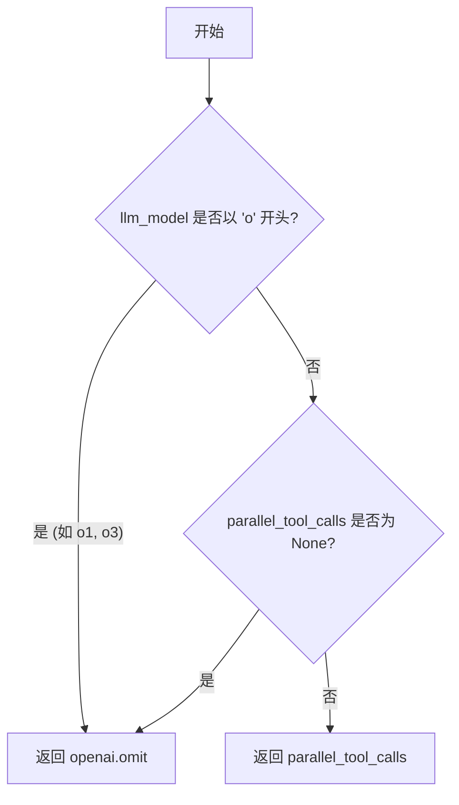

#### 带注释源码

```python
def get_parallel_tool_calls_param(
    llm_model: LlmModel, parallel_tool_calls: bool | None
) -> bool | openai.Omit:
    """Get the appropriate parallel_tool_calls parameter for OpenAI-compatible APIs."""
    # 检查模型是否为 OpenAI 的推理模型（如 o1, o3 系列）
    # 这些模型可能不支持或需要特殊的并行工具调用处理
    if llm_model.startswith("o") or parallel_tool_calls is None:
        # 如果是特定模型或未明确指定参数，则返回 omit，表示在API请求中省略此字段
        return openai.omit
    # 否则，返回用户指定的布尔值
    return parallel_tool_calls
```


### `llm_call`

该函数是一个异步的核心工具方法，用于调用各种大型语言模型（LLM）提供商（如 OpenAI、Anthropic、Groq 等）。它处理提供商特定的 API 逻辑、提示压缩、Token 计算、工具调用转换以及响应解析，最终返回标准化的 `LLMResponse` 对象。

参数：

- `credentials`：`APIKeyCredentials`，用于访问 LLM 提供商的 API 密钥凭证。
- `llm_model`：`LlmModel`，指定要使用的 LLM 模型枚举值。
- `prompt`：`list[dict]`，发送给 LLM 的消息列表，通常包含角色和内容。
- `max_tokens`：`int | None`，生成的聊天完成中允许的最大 Token 数。如果为 None，则使用模型默认值。
- `force_json_output`：`bool`，默认为 `False`。是否强制 LLM 输出 JSON 格式的响应。
- `tools`：`list[dict] | None`，默认为 `None`。在聊天完成中可用的工具定义列表。
- `ollama_host`：`str`，默认为 `"localhost:11434"`。连接 Ollama 实例的主机地址。
- `parallel_tool_calls`：`None`，用于控制 OpenAI 并行工具调用的参数。
- `compress_prompt_to_fit`：`bool`，默认为 `True`。是否压缩提示以适应模型的上下文窗口。

返回值：`LLMResponse`，包含原始响应、提示内容、响应文本、工具调用、提示 Token 数、完成 Token 数以及推理过程（如果存在）的标准响应对象。

#### 流程图

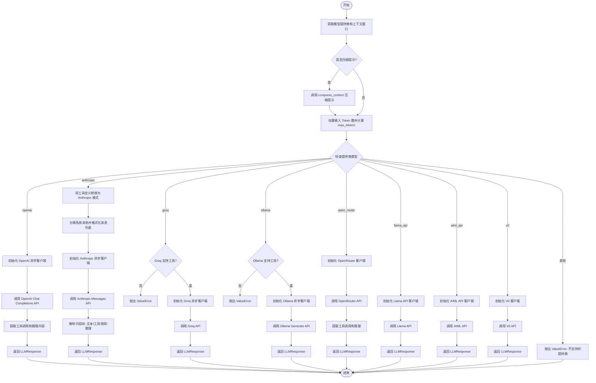

#### 带注释源码

```python
async def llm_call(
    credentials: APIKeyCredentials,
    llm_model: LlmModel,
    prompt: list[dict],
    max_tokens: int | None,
    force_json_output: bool = False,
    tools: list[dict] | None = None,
    ollama_host: str = "localhost:11434",
    parallel_tool_calls=None,
    compress_prompt_to_fit: bool = True,
) -> LLMResponse:
    """
    Make a call to a language model.

    Args:
        credentials: The API key credentials to use.
        llm_model: The LLM model to use.
        prompt: The prompt to send to the LLM.
        force_json_output: Whether the response should be in JSON format.
        max_tokens: The maximum number of tokens to generate in the chat completion.
        tools: The tools to use in the chat completion.
        ollama_host: The host for ollama to use.

    Returns:
        LLMResponse object containing:
            - prompt: The prompt sent to the LLM.
            - response: The text response from the LLM.
            - tool_calls: Any tool calls the model made, if applicable.
            - prompt_tokens: The number of tokens used in the prompt.
            - completion_tokens: The number of tokens used in the completion.
    """
    # 获取模型元数据：提供商和上下文窗口大小
    provider = llm_model.metadata.provider
    context_window = llm_model.context_window

    # 如果启用提示压缩，则尝试压缩消息以适应上下文窗口的一半
    if compress_prompt_to_fit:
        result = await compress_context(
            messages=prompt,
            target_tokens=llm_model.context_window // 2,
            client=None,  # 仅截断，不使用 LLM 进行摘要
            reserve=0,  # 调用者单独处理响应 Token 预算
        )
        if result.error:
            logger.warning(
                f"Prompt compression did not meet target: {result.error}. "
                f"Proceeding with {result.token_count} tokens."
            )
        prompt = result.messages

    # 计算可用 Token 数：基于上下文窗口、估算的输入长度和模型最大输出限制
    estimated_input_tokens = estimate_token_count(prompt)
    model_max_output = llm_model.max_output_tokens or int(2**15)
    user_max = max_tokens or model_max_output
    available_tokens = max(context_window - estimated_input_tokens, 0)
    # 确定最终的 max_tokens，取最小值且至少为 1
    max_tokens = max(min(available_tokens, model_max_output, user_max), 1)

    # 根据提供商分发处理逻辑
    if provider == "openai":
        # 准备参数：工具和响应格式
        tools_param = tools if tools else openai.NOT_GIVEN
        oai_client = openai.AsyncOpenAI(api_key=credentials.api_key.get_secret_value())
        response_format = None

        # 获取并行工具调用参数（某些 o 系列模型不支持）
        parallel_tool_calls = get_parallel_tool_calls_param(
            llm_model, parallel_tool_calls
        )

        if force_json_output:
            response_format = {"type": "json_object"}

        # 调用 OpenAI API
        response = await oai_client.chat.completions.create(
            model=llm_model.value,
            messages=prompt,  # type: ignore
            response_format=response_format,  # type: ignore
            max_completion_tokens=max_tokens,
            tools=tools_param,  # type: ignore
            parallel_tool_calls=parallel_tool_calls,
        )

        # 提取结构化数据：工具调用和推理内容
        tool_calls = extract_openai_tool_calls(response)
        reasoning = extract_openai_reasoning(response)

        return LLMResponse(
            raw_response=response.choices[0].message,
            prompt=prompt,
            response=response.choices[0].message.content or "",
            tool_calls=tool_calls,
            prompt_tokens=response.usage.prompt_tokens if response.usage else 0,
            completion_tokens=response.usage.completion_tokens if response.usage else 0,
            reasoning=reasoning,
        )
    elif provider == "anthropic":
        # 将 OpenAI 格式的工具转换为 Anthropic 格式
        an_tools = convert_openai_tool_fmt_to_anthropic(tools)

        # Anthropic 需要单独处理系统提示
        system_messages = [p["content"] for p in prompt if p["role"] == "system"]
        sysprompt = " ".join(system_messages)

        # 构建消息列表，合并连续的同角色消息以符合 Anthropic 要求
        messages = []
        last_role = None
        for p in prompt:
            if p["role"] in ["user", "assistant"]:
                if (
                    p["role"] == last_role
                    and isinstance(messages[-1]["content"], str)
                    and isinstance(p["content"], str)
                ):
                    messages[-1]["content"] += p["content"]
                else:
                    messages.append({"role": p["role"], "content": p["content"]})
                    last_role = p["role"]

        client = anthropic.AsyncAnthropic(
            api_key=credentials.api_key.get_secret_value()
        )
        try:
            resp = await client.messages.create(
                model=llm_model.value,
                system=sysprompt,
                messages=messages,
                max_tokens=max_tokens,
                tools=an_tools,
                timeout=600,
            )

            if not resp.content:
                raise ValueError("No content returned from Anthropic.")

            # 解析响应内容块，查找工具调用
            tool_calls = None
            for content_block in resp.content:
                if content_block.type == "tool_use":
                    if tool_calls is None:
                        tool_calls = []
                    tool_calls.append(
                        ToolContentBlock(
                            id=content_block.id,
                            type=content_block.type,
                            function=ToolCall(
                                name=content_block.name,
                                arguments=json.dumps(content_block.input),
                            ),
                        )
                    )

            if not tool_calls and resp.stop_reason == "tool_use":
                logger.warning(
                    f"Tool use stop reason but no tool calls found in content. {resp}"
                )

            # 提取推理内容
            reasoning = None
            for content_block in resp.content:
                if hasattr(content_block, "type") and content_block.type == "thinking":
                    reasoning = content_block.thinking
                    break

            return LLMResponse(
                raw_response=resp,
                prompt=prompt,
                response=(
                    resp.content[0].name
                    if isinstance(resp.content[0], anthropic.types.ToolUseBlock)
                    else getattr(resp.content[0], "text", "")
                ),
                tool_calls=tool_calls,
                prompt_tokens=resp.usage.input_tokens,
                completion_tokens=resp.usage.output_tokens,
                reasoning=reasoning,
            )
        except anthropic.APIError as e:
            error_message = f"Anthropic API error: {str(e)}"
            logger.error(error_message)
            raise ValueError(error_message)
    elif provider == "groq":
        if tools:
            raise ValueError("Groq does not support tools.")

        client = AsyncGroq(api_key=credentials.api_key.get_secret_value())
        response_format = {"type": "json_object"} if force_json_output else None
        response = await client.chat.completions.create(
            model=llm_model.value,
            messages=prompt,  # type: ignore
            response_format=response_format,  # type: ignore
            max_tokens=max_tokens,
        )
        return LLMResponse(
            raw_response=response.choices[0].message,
            prompt=prompt,
            response=response.choices[0].message.content or "",
            tool_calls=None,
            prompt_tokens=response.usage.prompt_tokens if response.usage else 0,
            completion_tokens=response.usage.completion_tokens if response.usage else 0,
            reasoning=None,
        )
    elif provider == "ollama":
        if tools:
            raise ValueError("Ollama does not support tools.")

        client = ollama.AsyncClient(host=ollama_host)
        sys_messages = [p["content"] for p in prompt if p["role"] == "system"]
        usr_messages = [p["content"] for p in prompt if p["role"] != "system"]
        # Ollama 需要将系统提示和用户提示拼接成一个字符串
        response = await client.generate(
            model=llm_model.value,
            prompt=f"{sys_messages}\n\n{usr_messages}",
            stream=False,
            options={"num_ctx": max_tokens},
        )
        return LLMResponse(
            raw_response=response.get("response") or "",
            prompt=prompt,
            response=response.get("response") or "",
            tool_calls=None,
            prompt_tokens=response.get("prompt_eval_count") or 0,
            completion_tokens=response.get("eval_count") or 0,
            reasoning=None,
        )
    elif provider == "open_router":
        tools_param = tools if tools else openai.NOT_GIVEN
        client = openai.AsyncOpenAI(
            base_url="https://openrouter.ai/api/v1",
            api_key=credentials.api_key.get_secret_value(),
        )

        parallel_tool_calls_param = get_parallel_tool_calls_param(
            llm_model, parallel_tool_calls
        )

        response = await client.chat.completions.create(
            extra_headers={
                "HTTP-Referer": "https://agpt.co",
                "X-Title": "AutoGPT",
            },
            model=llm_model.value,
            messages=prompt,  # type: ignore
            max_tokens=max_tokens,
            tools=tools_param,  # type: ignore
            parallel_tool_calls=parallel_tool_calls_param,
        )

        if not response.choices:
            if response:
                raise ValueError(f"OpenRouter error: {response}")
            else:
                raise ValueError("No response from OpenRouter.")

        tool_calls = extract_openai_tool_calls(response)
        reasoning = extract_openai_reasoning(response)

        return LLMResponse(
            raw_response=response.choices[0].message,
            prompt=prompt,
            response=response.choices[0].message.content or "",
            tool_calls=tool_calls,
            prompt_tokens=response.usage.prompt_tokens if response.usage else 0,
            completion_tokens=response.usage.completion_tokens if response.usage else 0,
            reasoning=reasoning,
        )
    elif provider == "llama_api":
        tools_param = tools if tools else openai.NOT_GIVEN
        client = openai.AsyncOpenAI(
            base_url="https://api.llama.com/compat/v1/",
            api_key=credentials.api_key.get_secret_value(),
        )

        parallel_tool_calls_param = get_parallel_tool_calls_param(
            llm_model, parallel_tool_calls
        )

        response = await client.chat.completions.create(
            extra_headers={
                "HTTP-Referer": "https://agpt.co",
                "X-Title": "AutoGPT",
            },
            model=llm_model.value,
            messages=prompt,  # type: ignore
            max_tokens=max_tokens,
            tools=tools_param,  # type: ignore
            parallel_tool_calls=parallel_tool_calls_param,
        )

        if not response.choices:
            if response:
                raise ValueError(f"Llama API error: {response}")
            else:
                raise ValueError("No response from Llama API.")

        tool_calls = extract_openai_tool_calls(response)
        reasoning = extract_openai_reasoning(response)

        return LLMResponse(
            raw_response=response.choices[0].message,
            prompt=prompt,
            response=response.choices[0].message.content or "",
            tool_calls=tool_calls,
            prompt_tokens=response.usage.prompt_tokens if response.usage else 0,
            completion_tokens=response.usage.completion_tokens if response.usage else 0,
            reasoning=reasoning,
        )
    elif provider == "aiml_api":
        client = openai.OpenAI(
            base_url="https://api.aimlapi.com/v2",
            api_key=credentials.api_key.get_secret_value(),
            default_headers={
                "X-Project": "AutoGPT",
                "X-Title": "AutoGPT",
                "HTTP-Referer": "https://github.com/Significant-Gravitas/AutoGPT",
            },
        )

        completion = client.chat.completions.create(
            model=llm_model.value,
            messages=prompt,  # type: ignore
            max_tokens=max_tokens,
        )

        return LLMResponse(
            raw_response=completion.choices[0].message,
            prompt=prompt,
            response=completion.choices[0].message.content or "",
            tool_calls=None,
            prompt_tokens=completion.usage.prompt_tokens if completion.usage else 0,
            completion_tokens=(
                completion.usage.completion_tokens if completion.usage else 0
            ),
            reasoning=None,
        )
    elif provider == "v0":
        tools_param = tools if tools else openai.NOT_GIVEN
        client = openai.AsyncOpenAI(
            base_url="https://api.v0.dev/v1",
            api_key=credentials.api_key.get_secret_value(),
        )

        response_format = None
        if force_json_output:
            response_format = {"type": "json_object"}

        parallel_tool_calls_param = get_parallel_tool_calls_param(
            llm_model, parallel_tool_calls
        )

        response = await client.chat.completions.create(
            model=llm_model.value,
            messages=prompt,  # type: ignore
            response_format=response_format,  # type: ignore
            max_tokens=max_tokens,
            tools=tools_param,  # type: ignore
            parallel_tool_calls=parallel_tool_calls_param,
        )

        tool_calls = extract_openai_tool_calls(response)
        reasoning = extract_openai_reasoning(response)

        return LLMResponse(
            raw_response=response.choices[0].message,
            prompt=prompt,
            response=response.choices[0].message.content or "",
            tool_calls=tool_calls,
            prompt_tokens=response.usage.prompt_tokens if response.usage else 0,
            completion_tokens=response.usage.completion_tokens if response.usage else 0,
            reasoning=reasoning,
        )
    else:
        raise ValueError(f"Unsupported LLM provider: {provider}")
```


### `trim_prompt`

从多行提示中移除缩进直到并包含 `|` 的字符，用于格式化提示词文本。

参数：

-  `s`：`str`，需要处理的多行提示字符串。

返回值：`str`，处理后的字符串，已去除整体两端空白以及每一行开头的空白和管道符 `|`。

#### 流程图

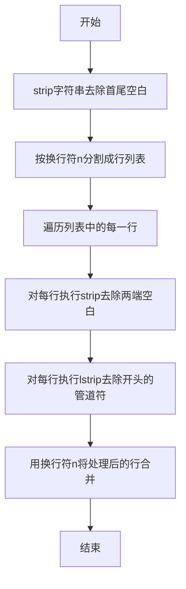

#### 带注释源码

```python
def trim_prompt(s: str) -> str:
    """Removes indentation up to and including `|` from a multi-line prompt."""
    # 去除输入字符串首尾的空白，并按换行符分割成行列表
    lines = s.strip().split("\n")
    # 遍历每一行，去除首尾空白后，再移除开头的管道符 '|'，最后用换行符重新连接
    return "\n".join([line.strip().lstrip("|") for line in lines])
```


### `LlmModel.__get_pydantic_json_schema__`

该方法是一个 Pydantic 钩子函数，用于自定义 `LlmModel` 枚举类的 JSON Schema 生成过程。它不仅生成标准的枚举 Schema，还将所有可用 LLM 模型的元数据（如提供商、上下文窗口、价格等级等）注入到 Schema 中，以便前端或 API 调用者能获取完整的模型配置信息。

参数：

-   `schema`：`Any`，由 Pydantic 传入的核心模式定义或源模式对象。
-   `handler`：`Any`，Pydantic 的 Schema 处理器，用于调用默认的 JSON Schema 生成逻辑。

返回值：`dict`，经过增强的 JSON Schema 字典，包含标准的枚举定义以及额外的 `llm_model` 标记和 `llm_model_metadata` 详细信息。

#### 流程图

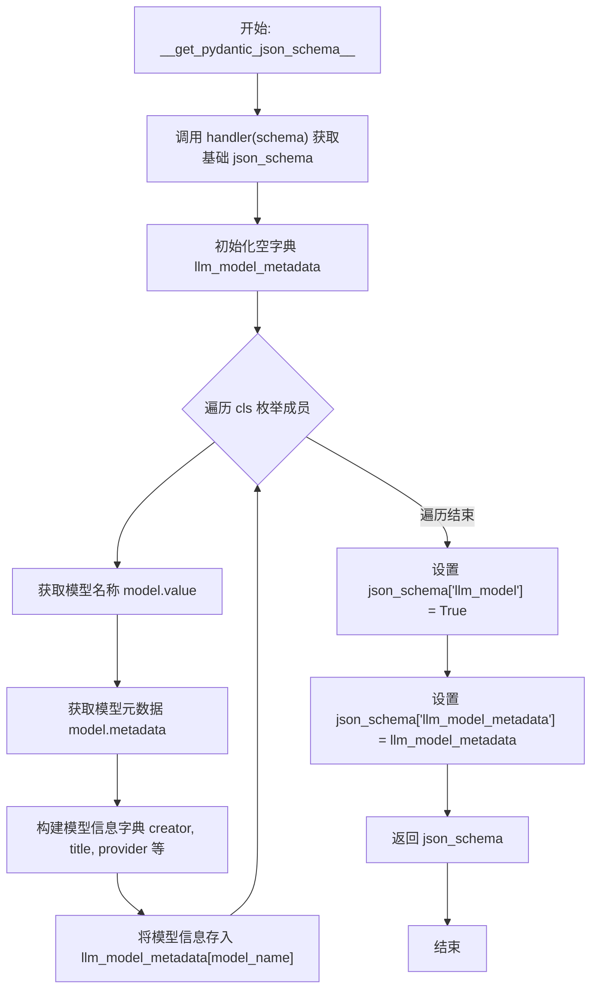

#### 带注释源码

```python
    @classmethod
    def __get_pydantic_json_schema__(cls, schema, handler):
        # 1. 调用 Pydantic 的默认处理器生成基础的 JSON Schema
        json_schema = handler(schema)
        
        # 2. 初始化一个字典用于存储所有 LLM 模型的元数据
        llm_model_metadata = {}
        
        # 3. 遍历枚举类中的每一个模型成员
        for model in cls:
            model_name = model.value
            
            # 4. 访问该模型的元数据属性（通过 ModelMetadata NamedTuple）
            metadata = model.metadata
            
            # 5. 提取并格式化模型的关键信息
            llm_model_metadata[model_name] = {
                "creator": metadata.creator_name,
                "creator_name": metadata.creator_name,
                "title": metadata.display_name,
                "provider": metadata.provider,
                "provider_name": metadata.provider_name,
                "name": model_name,
                "price_tier": metadata.price_tier,
            }
        
        # 6. 在基础 Schema 中添加自定义标记，表明这是一个 LLM 模型枚举
        json_schema["llm_model"] = True
        
        # 7. 将收集到的所有模型元数据挂载到 Schema 中
        json_schema["llm_model_metadata"] = llm_model_metadata
        
        # 8. 返回增强后的 JSON Schema
        return json_schema
```


### `LlmModel.metadata`

这是一个属性方法，用于从全局配置字典中检索并返回当前 `LlmModel` 枚举成员所对应的模型元数据。

参数：

- `self`：`LlmModel`，表示 `LlmModel` 枚举的实例（即特定的模型常量，如 `GPT5_2`）。

返回值：`ModelMetadata`，返回一个包含模型详细信息的命名元组，包括提供商、上下文窗口大小、最大输出 token 数、显示名称、提供商名称、创建者名称和价格等级。

#### 流程图

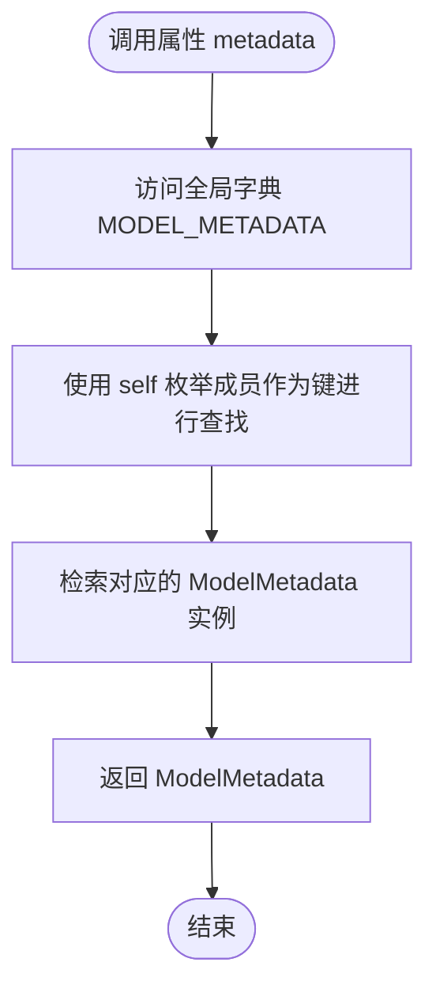

#### 带注释源码

```python
    @property
    def metadata(self) -> ModelMetadata:
        # 从全局 MODEL_METADATA 字典中获取当前枚举成员对应的元数据
        # self 是 LlmModel 的一个实例（例如 LlmModel.GPT5_2）
        # 返回的是一个 ModelMetadata 类型的命名元组
        return MODEL_METADATA[self]
```


### `LlmModel.provider`

该属性用于获取当前 LLM 模型枚举值所对应的服务提供商名称。

参数：

*   无

返回值：`str`，表示模型提供商的字符串（如 "openai", "anthropic" 等）。

#### 流程图

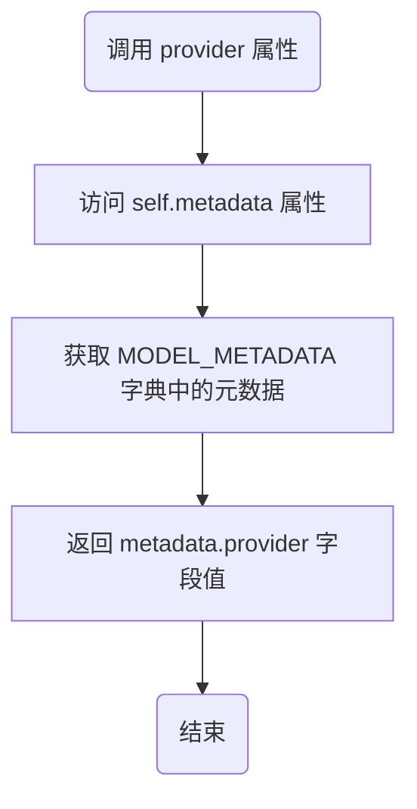

#### 带注释源码

```python
    @property
    def provider(self) -> str:
        # 通过 self.metadata 获取 ModelMetadata 对象，
        # 并返回其 provider 字段，该字段存储了模型提供商的名称。
        return self.metadata.provider
```


### `LlmModel.context_window`

获取当前 LLM 模型实例所支持的最大上下文窗口大小（即 Token 容量）。该属性通过访问模型的元数据（`ModelMetadata`）来获取预定义的整数值。

参数：

-  无

返回值：`int`，该模型支持的最大输入上下文 Token 数。

#### 流程图

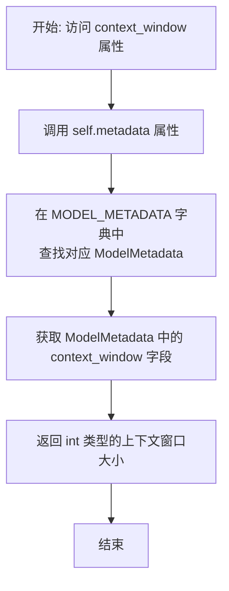

#### 带注释源码

```python
    @property
    def context_window(self) -> int:
        # self.metadata 属性会从全局字典 MODEL_METADATA 中
        # 获取当前枚举成员对应的 ModelMetadata 对象
        # 这里返回该元组对象中的 context_window 字段（int 类型）
        return self.metadata.context_window
```


### `LlmModel.max_output_tokens`

该属性用于获取当前LLM模型实例在元数据中定义的最大输出Token数。它通过访问模型的元数据（`ModelMetadata`）来返回具体的配置值，如果未定义则返回None。

参数：

- `self`：`LlmModel`，表示当前LLM模型的枚举实例。

返回值：`int | None`，返回模型支持的最大输出Token数量，如果未在元数据中定义，则返回 `None`。

#### 流程图

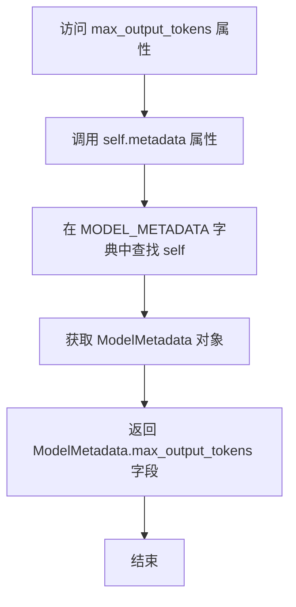

#### 带注释源码

```python
    @property
    def max_output_tokens(self) -> int | None:
        # 返回该模型元数据中定义的最大输出Token数
        return self.metadata.max_output_tokens
```


### `AIBlockBase.merge_llm_stats`

该方法用于将另一个 `AIBlockBase` 实例的执行统计数据（execution_stats）和提示词历史（prompt）合并到当前实例中。这通常用于聚合来自不同阶段、重试尝试或子块的指标和上下文信息。

参数：

- `block`：`AIBlockBase`，源块实例，包含需要合并到当前实例的执行统计信息和提示词历史。

返回值：`None`，该方法不返回任何值，直接修改当前实例的内部状态。

#### 流程图

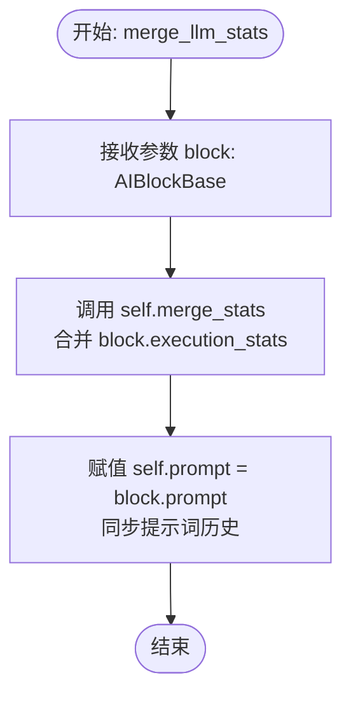

#### 带注释源码

```python
    def merge_llm_stats(self, block: "AIBlockBase"):
        # 调用父类或当前类的 merge_stats 方法，将传入 block 的执行统计数据（如 token 使用量、耗时等）合并到当前实例
        self.merge_stats(block.execution_stats)
        # 将传入 block 的 prompt（提示词列表）直接赋值给当前实例，保留最后一次执行的上下文
        self.prompt = block.prompt
```


### `AIStructuredResponseGeneratorBlock.__init__`

初始化 `AIStructuredResponseGeneratorBlock` 类的实例，配置该块的唯一标识符、描述、所属分类、输入输出架构以及用于测试目的的模拟数据和输入输出。

参数：

- `self`：`AIStructuredResponseGeneratorBlock`，类的实例本身。

返回值：`None`，初始化方法不返回任何值。

#### 流程图

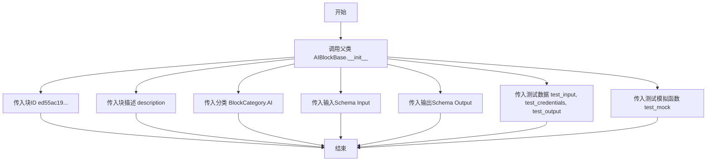

#### 带注释源码

```python
def __init__(self):
    # 调用父类 AIBlockBase 的初始化方法，设置块的基本属性和测试配置
    super().__init__(
        # 设置块的唯一标识符
        id="ed55ac19-356e-4243-a6cb-bc599e9b716f",
        # 设置块的描述文本，说明其功能是生成结构化JSON响应
        description="A block that generates structured JSON responses using a Large Language Model (LLM), with schema validation and format enforcement.",
        # 设置块所属的分类为 AI 类
        categories={BlockCategory.AI},
        # 设置块的输入数据模型（Schema）
        input_schema=AIStructuredResponseGeneratorBlock.Input,
        # 设置块的输出数据模型（Schema）
        output_schema=AIStructuredResponseGeneratorBlock.Output,
        # 定义用于单元测试的输入数据样例
        test_input={
            "model": DEFAULT_LLM_MODEL,
            "credentials": TEST_CREDENTIALS_INPUT,
            "expected_format": {
                "key1": "value1",
                "key2": "value2",
            },
            "prompt": "User prompt",
        },
        # 定义用于单元测试的模拟凭证
        test_credentials=TEST_CREDENTIALS,
        # 定义预期的单元测试输出结果
        test_output=[
            ("response", {"key1": "key1Value", "key2": "key2Value"}),
            ("prompt", list),
        ],
        # 定义测试时的模拟行为，这里模拟了 llm_call 和 get_collision_proof_output_tag_id 方法
        test_mock={
            "llm_call": lambda *args, **kwargs: LLMResponse(
                raw_response="",
                prompt=[""],
                response=(
                    '<json_output id="test123456">{\n'
                    '  "key1": "key1Value",\n'
                    '  "key2": "key2Value"\n'
                    "}</json_output>"
                ),
                tool_calls=None,
                prompt_tokens=0,
                completion_tokens=0,
                reasoning=None,
            ),
            "get_collision_proof_output_tag_id": lambda *args: "test123456",
        },
    )
```


### `AIStructuredResponseGeneratorBlock.llm_call`

这是一个用于调用全局 `llm_call` 函数的异步包装方法。其主要目的是为了让 `llm_call` 能够在 Block 测试框架中被 Mock（模拟），同时在此过程中更新实例的 `self.prompt` 状态以记录发送给 LLM 的提示词。

参数：

- `credentials`：`APIKeyCredentials`，用于访问 LLM 提供商的 API 密钥凭证。
- `llm_model`：`LlmModel`，指定使用的语言模型枚举值。
- `prompt`：`list[dict]`，发送给语言模型的提示词或对话历史列表。
- `max_tokens`：`int | None`，生成的回复中允许的最大令牌数。
- `force_json_output`：`bool`，是否强制 LLM 仅输出 JSON 格式的响应。
- `compress_prompt_to_fit`：`bool`，是否压缩提示词以适应模型的上下文窗口。
- `tools`：`list[dict] | None`，用于函数调用的工具定义列表。
- `ollama_host`：`str`，Ollama 服务的宿主地址。

返回值：`LLMResponse`，包含原始响应对象、文本内容、工具调用信息以及令牌使用统计数据的响应对象。

#### 流程图

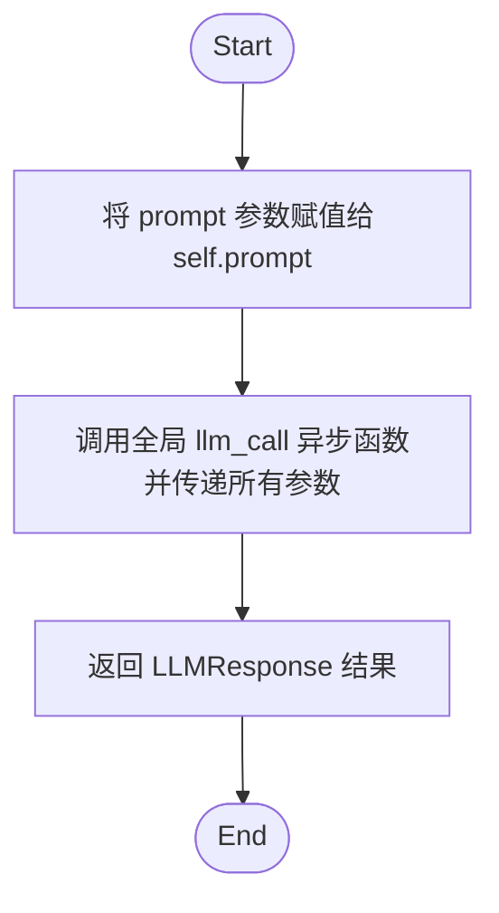

#### 带注释源码

```python
    async def llm_call(
        self,
        credentials: APIKeyCredentials,
        llm_model: LlmModel,
        prompt: list[dict],
        max_tokens: int | None,
        force_json_output: bool = False,
        compress_prompt_to_fit: bool = True,
        tools: list[dict] | None = None,
        ollama_host: str = "localhost:11434",
    ) -> LLMResponse:
        """
        Test mocks work only on class functions, this wraps the llm_call function
        so that it can be mocked withing the block testing framework.
        """
        # 将传入的 prompt 保存到实例变量中，以便后续使用或调试记录
        self.prompt = prompt
        
        # 异步调用全局定义的 llm_call 函数，将所有接收到的参数传递进去
        # 这样做是为了解耦具体的 LLM 调用逻辑与 Block 类的逻辑，便于测试时 mock 这个类方法
        return await llm_call(
            credentials=credentials,
            llm_model=llm_model,
            prompt=prompt,
            max_tokens=max_tokens,
            force_json_output=force_json_output,
            tools=tools,
            ollama_host=ollama_host,
            compress_prompt_to_fit=compress_prompt_to_fit,
        )
```


### `AIStructuredResponseGeneratorBlock.run`

该方法是 `AIStructuredResponseGeneratorBlock` 的核心执行逻辑，负责协调与大语言模型（LLM）的交互以生成结构化的 JSON 响应。它通过构建包含系统指令和格式约束的 Prompt，调用 LLM API，并对返回结果进行解析和验证。如果结果不符合预期的 JSON 格式，它会利用重试机制生成错误反馈并重新请求，直到成功或达到最大重试次数。此外，它还处理了 Token 限制异常，通过动态调整最大 Token 数来尝试恢复。

参数：

- `input_data`: `AIStructuredResponseGeneratorBlock.Input`，包含执行所需的所有输入数据，如用户提示词（`prompt`）、期望的 JSON 格式（`expected_format`）、模型配置（`model`）、凭证、系统提示词（`sys_prompt`）以及用于填充 Prompt 的变量值（`prompt_values`）等。
- `credentials`: `APIKeyCredentials`，用于访问指定 LLM 提供商的 API 密钥凭证。
- `**kwargs`: `Any`，用于接收执行上下文传递的额外关键字参数。

返回值：`BlockOutput`，一个异步生成器，产生元组。成功时产生 `("response", dict|list)`（解析后的 JSON 对象或列表）和 `("prompt", list)`（发送给 LLM 的最终 Prompt 列表）。

#### 流程图

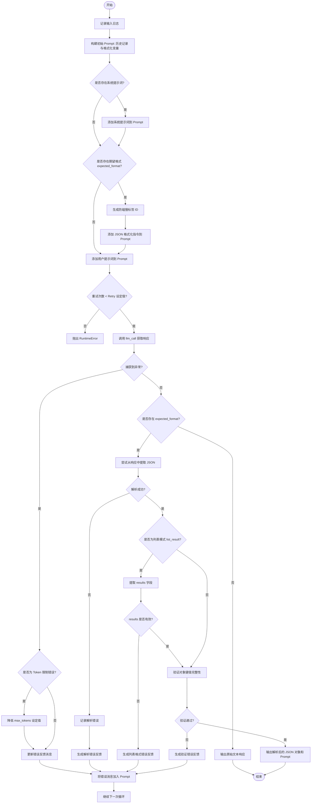

#### 带注释源码

```python
    async def run(
        self, input_data: Input, *, credentials: APIKeyCredentials, **kwargs
    ) -> BlockOutput:
        # 记录调试信息，追踪输入数据
        logger.debug(f"Calling LLM with input data: {input_data}")
        
        # 初始化 Prompt 列表，加载对话历史（如果存在）
        prompt = [json.to_dict(p) for p in input_data.conversation_history or [] if p]

        values = input_data.prompt_values
        # 如果提供了 prompt_values，使用 TextFormatter 对用户提示词和系统提示词进行变量替换
        if values:
            input_data.prompt = fmt.format_string(input_data.prompt, values)
            input_data.sys_prompt = fmt.format_string(input_data.sys_prompt, values)

        # 如果有系统提示词，将其作为 role="system" 添加到 Prompt 列表
        if input_data.sys_prompt:
            prompt.append({"role": "system", "content": input_data.sys_prompt})

        # 如果定义了期望的响应格式，则需要构造特殊的 Prompt 指令来约束 LLM 输出 JSON
        if input_data.expected_format:
            # 生成一个唯一的 ID，用于在 LLM 响应中标记 JSON 块，防止与正文混淆
            output_tag_id = self.get_collision_proof_output_tag_id()
            output_tag_start = f'<json_output id="{output_tag_id}">'
            
            # 获取包含格式说明的系统提示词（如 JSON Schema 示例、标签要求等）
            sys_prompt = self.response_format_instructions(
                input_data.expected_format,
                list_mode=input_data.list_result,
                pure_json_mode=input_data.force_json_output,
                output_tag_start=output_tag_start,
            )
            # 将格式指令添加到 Prompt
            prompt.append({"role": "system", "content": sys_prompt})

        # 添加用户的主要提示词
        if input_data.prompt:
            prompt.append({"role": "user", "content": input_data.prompt})

        # 定义内部验证函数：检查解析后的 JSON 是否包含所有预期的键
        def validate_response(parsed: object) -> str | None:
            try:
                if not isinstance(parsed, dict):
                    return f"Expected a dictionary, but got {type(parsed)}"
                miss_keys = set(input_data.expected_format.keys()) - set(parsed.keys())
                if miss_keys:
                    return f"Missing keys: {miss_keys}"
                return None
            except JSONDecodeError as e:
                return f"JSON decode error: {e}"

        error_feedback_message = ""
        llm_model = input_data.model

        # 进入重试循环，处理 LLM 输出不稳定或格式错误的情况
        for retry_count in range(input_data.retry):
            logger.debug(f"LLM request: {prompt}")
            try:
                # 调用 LLM 接口获取响应
                llm_response = await self.llm_call(
                    credentials=credentials,
                    llm_model=llm_model,
                    prompt=prompt,
                    compress_prompt_to_fit=input_data.compress_prompt_to_fit,
                    force_json_output=(
                        input_data.force_json_output
                        and bool(input_data.expected_format)
                    ),
                    ollama_host=input_data.ollama_host,
                    max_tokens=input_data.max_tokens,
                )
                response_text = llm_response.response
                
                # 合并 Token 使用统计信息
                self.merge_stats(
                    NodeExecutionStats(
                        input_token_count=llm_response.prompt_tokens,
                        output_token_count=llm_response.completion_tokens,
                    )
                )
                logger.debug(f"LLM attempt-{retry_count} response: {response_text}")

                # 如果定义了期望格式，则需要解析和验证 JSON
                if input_data.expected_format:
                    try:
                        # 尝试从文本中提取 JSON（支持纯 JSON 模式或标签包裹模式）
                        response_obj = self.get_json_from_response(
                            response_text,
                            pure_json_mode=input_data.force_json_output,
                            output_tag_start=output_tag_start,
                        )
                    except (ValueError, JSONDecodeError) as parse_error:
                        # 解析失败处理：记录日志，生成错误反馈，并加入 Prompt 以便下次重试
                        censored_response = re.sub(r"[A-Za-z0-9]", "*", response_text)
                        response_snippet = (
                            f"{censored_response[:50]}...{censored_response[-30:]}"
                        )
                        logger.warning(
                            f"Error getting JSON from LLM response: {parse_error}\n\n"
                            f"Response start+end: `{response_snippet}`"
                        )
                        # 将 LLM 的错误响应作为历史上下文加入
                        prompt.append({"role": "assistant", "content": response_text})

                        error_feedback_message = self.invalid_response_feedback(
                            parse_error,
                            was_parseable=False,
                            list_mode=input_data.list_result,
                            pure_json_mode=input_data.force_json_output,
                            output_tag_start=output_tag_start,
                        )
                        prompt.append(
                            {"role": "user", "content": error_feedback_message}
                        )
                        continue

                    # 处理列表结果模式：如果要求返回列表，检查是否包含 "results" 键
                    if input_data.list_result and isinstance(response_obj, dict):
                        if "results" in response_obj and isinstance(
                            response_obj["results"], list
                        ):
                            response_obj = response_obj["results"]
                        else:
                            error_feedback_message = (
                                "Expected an array of objects in the 'results' key, "
                                f"but got: {response_obj}"
                            )
                            prompt.append(
                                {"role": "assistant", "content": response_text}
                            )
                            prompt.append(
                                {"role": "user", "content": error_feedback_message}
                            )
                            continue

                    # 验证 JSON 对象的字段完整性
                    validation_errors = "\n".join(
                        [
                            validation_error
                            for response_item in (
                                response_obj
                                if isinstance(response_obj, list)
                                else [response_obj]
                            )
                            if (validation_error := validate_response(response_item))
                        ]
                    )

                    # 如果验证通过，输出结果并结束
                    if not validation_errors:
                        self.merge_stats(
                            NodeExecutionStats(
                                llm_call_count=retry_count + 1,
                                llm_retry_count=retry_count,
                            )
                        )
                        yield "response", response_obj
                        yield "prompt", self.prompt
                        return

                    # 验证失败：生成反馈并重试
                    prompt.append({"role": "assistant", "content": response_text})
                    error_feedback_message = self.invalid_response_feedback(
                        validation_errors,
                        was_parseable=True,
                        list_mode=input_data.list_result,
                        pure_json_mode=input_data.force_json_output,
                        output_tag_start=output_tag_start,
                    )
                    prompt.append({"role": "user", "content": error_feedback_message})
                else:
                    # 如果没有定义期望格式，直接返回原始文本响应
                    self.merge_stats(
                        NodeExecutionStats(
                            llm_call_count=retry_count + 1,
                            llm_retry_count=retry_count,
                        )
                    )
                    yield "response", {"response": response_text}
                    yield "prompt", self.prompt
                    return
            except Exception as e:
                # 捕获通用异常（如 API 错误、上下文长度超限等）
                logger.exception(f"Error calling LLM: {e}")
                
                # 特殊处理：如果是 Token 限制错误，尝试减少 max_tokens
                if (
                    "maximum context length" in str(e).lower()
                    or "token limit" in str(e).lower()
                ):
                    if input_data.max_tokens is None:
                        input_data.max_tokens = llm_model.max_output_tokens or 4096
                    # 将 max_tokens 减少 15% 以尝试适应上下文窗口
                    input_data.max_tokens = int(input_data.max_tokens * 0.85)
                    logger.debug(
                        f"Reducing max_tokens to {input_data.max_tokens} for next attempt"
                    )
                    # Token 限制错误通常不需要向 LLM 反馈错误文本，直接重试即可
                    continue

                # 其他类型的错误，生成错误反馈消息以便在下次尝试时告知 LLM
                error_feedback_message = f"Error calling LLM: {e}"

        # 如果循环结束仍未成功，抛出运行时错误
        raise RuntimeError(error_feedback_message)
```


### `AIStructuredResponseGeneratorBlock.response_format_instructions`

生成用于指导大语言模型（LLM）输出特定格式 JSON 的提示词指令字符串。该方法根据预期的对象格式、是否需要列表结果、是否为纯 JSON 模式以及特定的输出标签，构建包含格式要求和示例的系统提示词。

参数：

-  `expected_object_format`：`dict[str, str]`，预期的 JSON 对象格式，键为字段名，值为字段描述。
-  `list_mode`：`bool`，指示响应是否应为对象列表。
-  `pure_json_mode`：`bool`，指示响应是否应仅为 JSON 数据（不包含 XML 标签或额外文本）。
-  `output_tag_start`：`str`，用于标记 JSON 输出开始的唯一 XML 标签。

返回值：`str`，包含格式化指令、JSON 示例结构及标签使用说明的提示词字符串。

#### 流程图

```mermaid
graph TD
    A[开始: response_format_instructions] --> B[将 expected_object_format 转换为 JSON 字符串]
    B --> C{判断 list_mode}
    C -- True --> D[设置输出类型为数组 array]
    C -- False --> E[设置输出类型为对象 object]
    D --> F{判断 pure_json_mode 和 list_mode}
    E --> F
    F -- True 且 list_mode 为 True --> G[构建包含 results 键的外层对象结构]
    F -- 否 --> H[使用标准输出结构]
    G --> I[处理换行符为 | 以保留缩进]
    H --> I
    I --> J{判断 pure_json_mode}
    J -- False --> K[使用 output_tag_start 和 json_output 标签包裹格式]
    J -- True --> L[保持纯 JSON 格式]
    K --> M[生成基础指令字符串]
    L --> M
    M --> N{判断 pure_json_mode}
    N -- False --> O[追加标签使用强制指令]
    N -- True --> P[跳过标签指令]
    O --> Q[调用 trim_prompt 清理格式]
    P --> Q
    Q --> R[返回: 最终提示词指令字符串]
```

#### 带注释源码

```python
    def response_format_instructions(
        self,
        expected_object_format: dict[str, str],
        *,
        list_mode: bool,
        pure_json_mode: bool,
        output_tag_start: str,
    ) -> str:
        # 将期望的格式字典转换为带缩进的 JSON 字符串
        expected_output_format = json.dumps(expected_object_format, indent=2)
        # 确定基础输出类型：如果是列表模式则为 array，否则为 object
        output_type = "object" if not list_mode else "array"
        # 确定外层输出类型：纯 JSON 模式下强制为 object，否则跟随 output_type
        outer_output_type = "object" if pure_json_mode else output_type

        # 如果是列表模式，构建 JSON 数组的示例格式
        if output_type == "array":
            # 为数组内部元素增加缩进
            indented_obj_format = expected_output_format.replace("\n", "\n  ")
            expected_output_format = f"[\n  {indented_obj_format},\n  ...\n]"
            # 如果是纯 JSON 模式且是列表，将数组包裹在包含 "results" 键的对象中（并可选包含 reasoning）
            if pure_json_mode:
                indented_list_format = expected_output_format.replace("\n", "\n  ")
                expected_output_format = (
                    "{\n"
                    '  "reasoning": "... (optional)",\n'  # 用于提升性能
                    f'  "results": {indented_list_format}\n'
                    "}"
                )

        # 在提示词中处理缩进，将换行符替换为 " |" 以便后续清理
        expected_output_format = expected_output_format.replace("\n", "\n|")

        # 准备最终的格式字符串
        if not pure_json_mode:
            # 如果不是纯 JSON 模式，用特定的标签包裹 JSON 示例
            expected_output_format = (
                f"{output_tag_start}\n{expected_output_format}\n</json_output>"
            )

        # 构建基础指令文本，要求 LLM 遵循指定的 JSON 格式
        instructions = f"""
        |In your response you MUST include a valid JSON {outer_output_type} strictly following this format:
        |{expected_output_format}
        |
        |If you cannot provide all the keys, you MUST provide an empty string for the values you cannot answer.
        """.strip()

        # 如果不是纯 JSON 模式，追加关于使用特定标签包裹 JSON 的强制指令
        if not pure_json_mode:
            instructions += f"""
            |
            |You MUST enclose your final JSON answer in {output_tag_start}...</json_output> tags, even if the user specifies a different tag.
            |There MUST be exactly ONE {output_tag_start}...</json_output> block in your response, which MUST ONLY contain the JSON {outer_output_type} and nothing else. Other text outside this block is allowed.
            """.strip()

        # 移除多余的缩进标记符并返回
        return trim_prompt(instructions)
```


### `AIStructuredResponseGeneratorBlock.invalid_response_feedback`

该方法用于在LLM返回的响应不符合预期格式或解析失败时，生成一段反馈提示。该反馈包含了具体的错误信息以及对期望格式的重申，旨在引导LLM在下一次尝试中生成正确的结构化响应。

参数：

-  `error`：`Any`，LLM上一次响应产生的错误对象或错误信息，用于反馈具体的错误原因。
-  `was_parseable`：`bool`，指示上一次的响应是否可以被解析（即使格式不完全正确）。如果为False，说明连基本的解析都失败了。
-  `list_mode`：`bool`，指示期望的响应格式是否为一个对象列表。
-  `pure_json_mode`：`bool`，指示是否强制要求纯JSON输出（不带XML标签包裹）。
-  `output_tag_start`：`str`，当非纯JSON模式时，用于包裹JSON输出的XML起始标签。

返回值：`str`，生成的包含错误反馈和修正指令的提示字符串。

#### 流程图

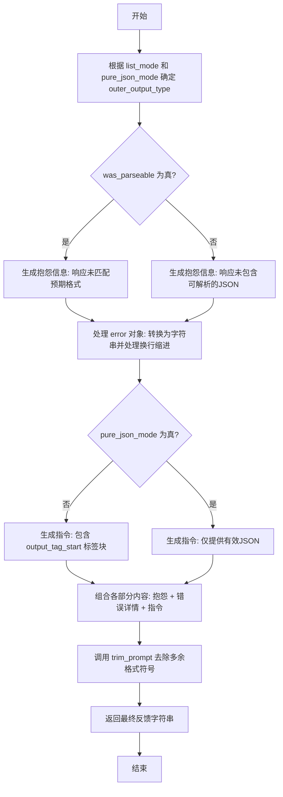

#### 带注释源码

```python
    def invalid_response_feedback(
        self,
        error,
        *,
        was_parseable: bool,
        list_mode: bool,
        pure_json_mode: bool,
        output_tag_start: str,
    ) -> str:
        # 根据配置确定期望的输出类型是对象还是数组
        # 如果不是列表模式或者是纯JSON模式，则期望的是对象，否则是数组
        outer_output_type = "object" if not list_mode or pure_json_mode else "array"

        # 根据是否可解析生成不同的错误抱怨信息
        if was_parseable:
            complaint = f"Your previous response did not match the expected {outer_output_type} format."
        else:
            complaint = f"Your previous response did not contain a parseable JSON {outer_output_type}."

        # 将错误信息转换为字符串，并处理换行符以便在提示词中正确缩进显示
        indented_parse_error = str(error).replace("\n", "\n|")

        # 根据是否为纯JSON模式构建修正指令
        instruction = (
            f"Please provide a {output_tag_start}...</json_output> block containing a"
            if not pure_json_mode
            else "Please provide a"
        ) + f" valid JSON {outer_output_type} that matches the expected format."

        # 组合抱怨、错误详情和指令，并调用 trim_prompt 清理格式后返回
        return trim_prompt(
            f"""
            |{complaint}
            |
            |{indented_parse_error}
            |
            |{instruction}
        """
        )
```


### `AIStructuredResponseGeneratorBlock.get_json_from_response`

该方法负责从大语言模型（LLM）返回的文本中提取并解析 JSON 数据。它支持两种模式：纯 JSON 模式（直接解析 JSON 字符串，容错处理 Markdown 代码块）和标签模式（从特定的 XML 风格标签中提取内容）。

参数：

-  `response_text`：`str`，待解析的原始 LLM 响应文本。
-  `pure_json_mode`：`bool`，标志位，为 True 时表示响应应为纯 JSON 格式（不包含包裹标签）。
-  `output_tag_start`：`str`，在非纯 JSON 模式下，用于标识 JSON 内容开始的自定义标签（例如 `<json_output id="...">`）。

返回值：`dict[str, Any] | list[dict[str, Any]]`，解析后的 JSON 对象或对象列表。

#### 流程图

```mermaid
flowchart TD
    A([开始]) --> B{pure_json_mode 为真?}
    B -- 是 --> C[尝试直接解析 response_text]
    C -- 成功 --> D([返回解析结果])
    C -- 失败 JSONDecodeError --> E[查找第一个 '{' 和最后一个 '}']
    E --> F[截取中间子字符串并尝试解析]
    F -- 成功 --> D
    F -- 失败 --> G[抛出原始 JSONDecodeError]

    B -- 否 --> H{response_text 包含 output_tag_start?}
    H -- 否 --> I[抛出 ValueError: 缺少预期标签]
    H -- 是 --> J[分割字符串提取 output_tag_start 后的内容]
    J --> K[去除尾部的 </json_output> 标签]
    K --> L[去除首尾空白字符]
    L --> M[解析提取出的文本为 JSON]
    M --> N([返回解析结果])
```

#### 带注释源码

```python
def get_json_from_response(
    self, response_text: str, *, pure_json_mode: bool, output_tag_start: str
) -> dict[str, Any] | list[dict[str, Any]]:
    # 处理纯 JSON 模式（没有包裹标签）
    if pure_json_mode:
        # 尝试直接解析整个文本
        try:
            return json.loads(response_text)
        except JSONDecodeError as first_parse_error:
            # 如果直接解析失败（例如包含 Markdown 代码块符号），尝试查找第一个 { 和最后一个 }
            # 以提取最可能的 JSON 字符串部分
            json_start = response_text.find("{")
            json_end = response_text.rfind("}")
            try:
                return json.loads(response_text[json_start : json_end + 1])
            except JSONDecodeError:
                # 如果提取子串后依然解析失败，抛出最初的错误信息，因为其更具参考性
                raise first_parse_error from None

    # 处理非纯 JSON 模式（需要在特定标签内查找）
    # 检查响应中是否包含预期的开始标签
    if output_tag_start not in response_text:
        raise ValueError(
            "Response does not contain the expected "
            f"{output_tag_start}...</json_output> block."
        )
    
    # 提取标签之间的内容：
    # 1. 按 start tag 分割取后半部分
    # 2. 按 end tag </json_output> 从右边分割取前半部分
    # 3. 去除首尾空白
    json_output = (
        response_text.split(output_tag_start, 1)[1]
        .rsplit("</json_output>", 1)[0]
        .strip()
    )
    
    # 解析提取出的 JSON 字符串
    return json.loads(json_output)
```


### `AIStructuredResponseGeneratorBlock.get_collision_proof_output_tag_id`

生成一个唯一的、加密安全的随机字符串作为输出标签的ID，用于在解析LLM响应时确保标签的唯一性，防止与用户输入或LLM生成的文本内容发生冲突。

参数：

-   无参数

返回值：`str`，返回一个由16个十六进制字符组成的唯一字符串，用于构建碰撞证明的JSON输出标签。

#### 流程图

```mermaid
flowchart TD
    Start([开始]) --> CallFunc[调用 secrets.token_hex 函数]
    CallFunc --> GenerateToken[生成8字节随机数的十六进制表示]
    GenerateToken --> ReturnValue[返回生成的标签ID字符串]
    ReturnValue --> End([结束])
```

#### 带注释源码

```python
def get_collision_proof_output_tag_id(self) -> str:
    # 使用 secrets.token_hex(8) 生成一个长度为8字节的随机字符串
    # 该字符串转换为16个十六进制字符
    # 作为唯一的输出标签ID，防止解析JSON时与用户内容冲突
    return secrets.token_hex(8)
```


### `AITextGeneratorBlock.__init__`

初始化AI文本生成器块，通过父类构造函数配置其唯一标识符、描述、输入/输出模式以及测试参数。

参数：

-  `self`：`AITextGeneratorBlock`，当前类的实例。

返回值：`None`，无返回值。

#### 流程图

```mermaid
flowchart TD
    Start([开始]) --> Init[调用父类 AIBlockBase.__init__]
    Init --> SetID[设置块 ID 为 1f292d4a-41a4-4977-9684-7c8d560b9f91]
    Init --> SetDesc[设置块描述与分类]
    Init --> SetSchema[设置输入模式 Input 与输出模式 Output]
    Init --> SetTest[配置测试输入、凭据、输出及模拟函数]
    SetID --> End([结束])
    SetDesc --> End
    SetSchema --> End
    SetTest --> End
```

#### 带注释源码

```python
def __init__(self):
    # 调用父类 AIBlockBase (间接继承自 Block) 的初始化方法
    # 传递该块的元数据和配置信息
    super().__init__(
        # 块的唯一标识符
        id="1f292d4a-41a4-4977-9684-7c8d560b9f91",
        # 块的功能描述，用于UI展示或文档说明
        description="A block that produces text responses using a Large Language Model (LLM) based on customizable prompts and system instructions.",
        # 块所属的分类，此处归为AI类
        categories={BlockCategory.AI},
        # 定义输入数据的Pydantic模型结构
        input_schema=AITextGeneratorBlock.Input,
        # 定义输出数据的Pydantic模型结构
        output_schema=AITextGeneratorBlock.Output,
        # 定义用于单元测试的样本输入数据
        test_input={
            "prompt": "User prompt",
            "credentials": TEST_CREDENTIALS_INPUT,
        },
        # 定义用于单元测试的模拟凭据
        test_credentials=TEST_CREDENTIALS,
        # 定义预期的测试输出数据，用于验证执行结果
        test_output=[
            ("response", "Response text"),
            ("prompt", list),
        ],
        # 定义测试用的模拟函数，用于在测试环境中替换实际的LLM调用
        test_mock={"llm_call": lambda *args, **kwargs: "Response text"},
    )
```


### `AITextGeneratorBlock.llm_call`

该方法作为文本生成块与结构化响应生成块之间的适配器。它实例化一个 `AIStructuredResponseGeneratorBlock`，并使用提供的输入数据和凭证来执行 LLM 调用。此方法负责将执行统计信息（如 Token 计数）合并回当前上下文，并从结构化块的输出字典中提取原始文本响应。

参数：

-   `input_data`：`AIStructuredResponseGeneratorBlock.Input`，包含发送给 LLM 的提示、模型配置及凭证等参数的输入数据对象。
-   `credentials`：`APIKeyCredentials`，用于授权 LLM 提供商请求的 API 密钥凭证。

返回值：`dict`，代码标注类型为字典，实际返回的是从结构化块输出中提取的 `response` 字段内容（通常为字符串，即生成的文本）。

#### 流程图

```mermaid
flowchart TD
    Start([开始]) --> InstantiateBlock[实例化 AIStructuredResponseGeneratorBlock]
    InstantiateBlock --> RunOnce[调用 block.run_once 执行 LLM 请求<br/>参数: input_data, 'response', credentials]
    RunOnce --> MergeStats[合并执行统计信息<br/>self.merge_llm_stats]
    MergeStats --> ExtractResponse[提取响应内容<br/>response['response']]
    ExtractResponse --> End([返回响应内容])
```

#### 带注释源码

```python
    async def llm_call(
        self,
        input_data: AIStructuredResponseGeneratorBlock.Input,
        credentials: APIKeyCredentials,
    ) -> dict:
        # 实例化结构化响应生成块，复用其核心 LLM 调用逻辑
        block = AIStructuredResponseGeneratorBlock()
        
        # 执行该块的单次运行，传入输入数据和凭证，并指定获取名为 "response" 的输出
        response = await block.run_once(input_data, "response", credentials=credentials)
        
        # 将执行统计信息（如 Token 使用量、重试次数）合并到当前块中
        self.merge_llm_stats(block)
        
        # 返回结果字典中 "response" 键对应的实际文本内容
        return response["response"]
```


### `AITextGeneratorBlock.run`

该方法负责执行文本生成块的核心逻辑。它接收用户输入、模型配置和凭据，通过委托给内部的结构化响应生成块（`AIStructuredResponseGeneratorBlock`）来调用 LLM，并生成非结构化的文本响应。它将输入数据转换为适配的结构化格式，禁用特定的 JSON 格式验证，然后产生生成的文本和最终使用的提示词。

参数：

- `input_data`：`AITextGeneratorBlock.Input`，包含运行该块所需的所有输入数据，如用户提示词（`prompt`）、系统提示词（`sys_prompt`）、模型选择（`model`）、重试次数（`retry`）、提示词变量（`prompt_values`）等。
- `credentials`：`APIKeyCredentials`，用于验证和访问 LLM 提供商服务的 API 凭证。
- `**kwargs`：`Any`，接收额外的关键字参数，当前未直接使用。

返回值：`BlockOutput`，一个异步生成器，产生包含结果名称和数据的元组。具体产生 `("response", str)` 表示生成的文本内容，以及 `("prompt", list)` 表示发送给模型的最终消息列表。

#### 流程图

```mermaid
graph TD
    A[Start run] --> B[Create AIStructuredResponseGeneratorBlock Input]
    B --> C[Map input_data attributes to new input]
    C --> D[Set expected_format to empty dict]
    D --> E[Call self.llm_call with object_input_data]
    E --> F[llm_call instantiates AIStructuredResponseGeneratorBlock]
    F --> G[Execute block.run_once to get LLM response]
    G --> H[Merge execution stats into self]
    H --> I[Return text response string]
    I --> J[Yield 'response' key with text]
    J --> K[Yield 'prompt' key with self.prompt list]
    K --> L[End]
```

#### 带注释源码

```python
async def run(
    self, input_data: Input, *, credentials: APIKeyCredentials, **kwargs
) -> BlockOutput:
    # 创建 AIStructuredResponseGeneratorBlock 的输入对象
    # 通过字典推导式将当前块输入的所有字段复制过去
    object_input_data = AIStructuredResponseGeneratorBlock.Input(
        **{
            attr: getattr(input_data, attr)
            for attr in AITextGeneratorBlock.Input.model_fields
        },
        # 显式将 expected_format 设置为空字典
        # 这表示我们期望纯文本输出，而不是特定的 JSON 结构
        expected_format={},
    )
    
    # 调用内部封装的 llm_call 方法
    # 该方法会实例化结构化块并执行，处理与 LLM 的实际交互和重试逻辑
    response = await self.llm_call(object_input_data, credentials)
    
    # 产生 "response" 输出，包含生成的文本内容
    yield "response", response
    
    # 产生 "prompt" 输出，包含实际发送给 LLM 的消息历史列表
    yield "prompt", self.prompt
```


### `AITextSummarizerBlock.__init__`

初始化AI文本摘要块，配置其唯一标识符、描述、所属分类、输入输出模式定义以及用于测试的模拟数据和模拟行为。

参数：

-  `self`：`AITextSummarizerBlock`，当前正在初始化的类实例。

返回值：`None`，无返回值。

#### 流程图

```mermaid
flowchart TD
    Start([开始初始化]) --> DefineParams[定义块元数据<br/>ID, 描述, 分类]
    DefineParams --> DefineSchemas[设置输入输出模式<br/>Input Schema, Output Schema]
    DefineSchemas --> SetupTests[配置测试数据<br/>test_input, test_credentials, test_output, test_mock]
    SetupTests --> CallSuper[调用父类 Block.__init__<br/>注册块信息]
    CallSuper --> End([初始化完成])
```

#### 带注释源码

```python
def __init__(self):
    # 调用父类 Block 的初始化方法，注册块的基本信息和配置
    super().__init__(
        # 块的唯一标识符 (UUID)
        id="a0a69be1-4528-491c-a85a-a4ab6873e3f0",
        # 块的功能描述，说明其利用LLM进行长文本摘要并支持配置焦点和风格
        description="A block that summarizes long texts using a Large Language Model (LLM), with configurable focus topics and summary styles.",
        # 块所属的分类，标记为 AI 和 TEXT 类别
        categories={BlockCategory.AI, BlockCategory.TEXT},
        # 定义块的输入数据结构模式，关联内部定义的 Input 类
        input_schema=AITextSummarizerBlock.Input,
        # 定义块的输出数据结构模式，关联内部定义的 Output 类
        output_schema=AITextSummarizerBlock.Output,
        # 定义测试用的输入数据，包含一段重复的Lorem ipsum文本和测试凭证
        test_input={
            "text": "Lorem ipsum..." * 100,
            "credentials": TEST_CREDENTIALS_INPUT,
        },
        # 指定测试使用的凭证对象
        test_credentials=TEST_CREDENTIALS,
        # 定义期望的测试输出结构，验证最终摘要和提示词列表
        test_output=[
            ("summary", "Final summary of a long text"),
            ("prompt", list),
        ],
        # 定义测试期间的模拟行为，特别是 llm_call 方法的模拟逻辑
        # 根据 expected_format 是否包含 "final_summary" 返回不同的模拟字典
        test_mock={
            "llm_call": lambda input_data, credentials: (
                {"final_summary": "Final summary of a long text"}
                if "final_summary" in input_data.expected_format
                else {"summary": "Summary of a chunk of text"}
            )
        },
    )
```


### `AITextSummarizerBlock.run`

该方法是 `AITextSummarizerBlock` 的主执行入口，负责协调整个文本摘要生成流程。它接收输入数据和凭证，通过调用内部的 `_run` 方法来处理文本的切分、各分块的摘要生成以及最终的摘要合并，并将结果以异步生成器的形式逐步输出，确保在长文本处理时的流式响应能力。

参数：

- `input_data`：`AITextSummarizerBlock.Input`，包含需要摘要的文本内容、指定的LLM模型、摘要风格（如简洁、详细）、关注点话题、最大令牌数、分块重叠大小以及Ollama主机地址等配置信息。
- `credentials`：`APIKeyCredentials`，用于验证并访问大语言模型提供商API的凭证对象。
- `**kwargs`：`Any`，由执行框架传递的额外关键字参数。

返回值：`BlockOutput`，一个异步生成器，产生 `(output_name, output_data)` 元组。主要输出包含 "summary"（最终生成的摘要文本）和 "prompt"（发送给LLM的完整提示词）。

#### 流程图

```mermaid
flowchart TD
    Start([开始执行]) --> ReceiveInput[接收 input_data 与 credentials]
    ReceiveInput --> CallInternal[调用内部方法 _run]
    CallInternal --> Iterate{遍历 _run 返回的输出流}
    
    Iterate -- Yes --> YieldOutput[生成 output_name 与 output_data]
    YieldOutput --> Iterate
    
    Iterate -- No --> End([结束])
```

#### 带注释源码

```python
    async def run(
        self, input_data: Input, *, credentials: APIKeyCredentials, **kwargs
    ) -> BlockOutput:
        # 通过异步 for 循环调用内部逻辑方法 _run
        # _run 方法处理具体的文本切分、调用 LLM 生成摘要以及合并摘要的逻辑
        async for output_name, output_data in self._run(input_data, credentials):
            # 将处理结果按顺序 yield 出去，通常是先摘要内容，后提示词记录
            yield output_name, output_data
```


### `AITextSummarizerBlock._run`

该方法是 `AITextSummarizerBlock` 类的核心执行逻辑，负责将长文本分割成多个块，逐块生成摘要，最后将所有块的摘要合并成一个最终的全面摘要。

参数：

-  `input_data`：`AITextSummarizerBlock.Input`，包含待摘要的文本、模型选择、摘要风格、焦点主题、最大 Token 数、块重叠数以及 Ollama 主机地址等配置信息。
-  `credentials`：`APIKeyCredentials`，用于访问 LLM 提供商的 API 凭证。

返回值：`BlockOutput`，一个异步生成器，依次生成最终的摘要字符串和发送给语言模型的完整 Prompt 列表。

#### 流程图

```mermaid
flowchart TD
    A([Start]) --> B[Split input text into chunks]
    B --> C[Initialize summaries list]
    C --> D{Iterate through chunks}
    D --> E[Summarize current chunk]
    E --> F[Append chunk summary to list]
    F --> D
    D -- All chunks processed --> G[Combine all chunk summaries]
    G --> H[Yield final summary]
    H --> I[Yield prompt history]
    I --> J([End])
```

#### 带注释源码

```python
async def _run(
    self, input_data: Input, credentials: APIKeyCredentials
) -> BlockOutput:
    # 1. 将输入的长文本按照指定的最大 Token 数和重叠数分割成多个块
    chunks = self._split_text(
        input_data.text, input_data.max_tokens, input_data.chunk_overlap
    )
    summaries = []

    # 2. 遍历每个文本块，分别调用 LLM 进行摘要
    for chunk in chunks:
        # 异步调用 _summarize_chunk 方法生成当前块的摘要
        chunk_summary = await self._summarize_chunk(chunk, input_data, credentials)
        summaries.append(chunk_summary)

    # 3. 将所有块的摘要合并，生成最终的总体摘要
    # 如果合并后的文本仍然很长，可能会触发递归摘要逻辑（在 _combine_summaries 内部）
    final_summary = await self._combine_summaries(
        summaries, input_data, credentials
    )
    
    # 4. 生成输出：先是最终的摘要内容
    yield "summary", final_summary
    
    # 5. 生成输出：然后是发送给 LLM 的完整 Prompt 历史
    yield "prompt", self.prompt
```


### `AITextSummarizerBlock._split_text`

该静态方法负责将长文本分割成适合 LLM 处理的较小文本块。它实现了固定窗口大小的分割策略，支持块之间的重叠以保持上下文连续性，并包含了输入文本长度和输出块数量的安全限制，以防止资源耗尽。

参数：

-  `text`：`str`，需要被分割的原始长文本。
-  `max_tokens`：`int`，每个文本块的目标最大长度（近似值）。
-  `overlap`：`int`，相邻文本块之间重叠的字符/词数量，用于保持上下文连贯性。

返回值：`list[str]`，包含分割后的文本片段的列表。

#### 流程图

```mermaid
flowchart TD
    A[开始: _split_text] --> B{文本长度 > 1,000,000?}
    B -- 是 --> C[截断文本至 1,000,000 字符]
    B -- 否 --> D[计算 chunk_size = max(1, max_tokens - overlap)]
    C --> D
    D --> E{overlap >= max_tokens?}
    E -- 是 --> F[调整 overlap = max(0, max_tokens - 1)]
    E -- 否 --> G[按空格分割文本为单词列表 words]
    F --> G
    G --> H[初始化 chunks 列表]
    H --> I[遍历 words, 步长为 chunk_size]
    I --> J{chunks 数量 >= 100?}
    J -- 是 --> K[中断循环]
    J -- 否 --> L[切片 words[i : i + max_tokens]]
    L --> M[用空格连接切片单词形成 chunk]
    M --> N[添加 chunk 到 chunks 列表]
    N --> I
    K --> O[返回 chunks 列表]
    O --> P[结束]
```

#### 带注释源码

```python
    @staticmethod
    def _split_text(text: str, max_tokens: int, overlap: int) -> list[str]:
        # 安全限制：定义最大文本长度，防止 DoS 攻击导致的内存耗尽
        MAX_TEXT_LENGTH = 1_000_000  # 1MB 字符限制
        # 安全限制：定义最大块数，防止生成过多的处理任务
        MAX_CHUNKS = 100

        # 如果输入文本超过最大长度，进行截断
        if len(text) > MAX_TEXT_LENGTH:
            text = text[:MAX_TEXT_LENGTH]

        # 计算每个块的步长，确保至少为 1 以防止无限循环
        # 逻辑是：窗口大小为 max_tokens，重叠部分为 overlap，所以每次移动的步长为 max_tokens - overlap
        chunk_size = max(1, max_tokens - overlap)

        # 确保 overlap 小于 max_tokens，防止无效配置（例如窗口完全被重叠覆盖）
        if overlap >= max_tokens:
            overlap = max(0, max_tokens - 1)

        # 将文本按空格分割成单词列表
        words = text.split()
        chunks = []

        # 遍历单词列表，使用计算出的 chunk_size 作为步长
        for i in range(0, len(words), chunk_size):
            # 如果生成的块数量已达到上限，停止分割
            if len(chunks) >= MAX_CHUNKS:
                break  # 限制块数量以防止内存耗尽
            
            # 获取当前窗口的单词切片，窗口大小由 max_tokens 决定
            chunk = " ".join(words[i : i + max_tokens])
            chunks.append(chunk)

        return chunks
```


### `AITextSummarizerBlock.llm_call`

该方法通过实例化并调用 `AIStructuredResponseGeneratorBlock` 来执行具体的 LLM 请求，将输入数据和凭据传递给该块以生成文本摘要，并将生成的执行统计信息合并到当前块实例中。

参数：

-  `input_data`：`AIStructuredResponseGeneratorBlock.Input`，传递给底层 LLM 块的输入数据对象，包含提示词、模型配置、预期格式等信息。
-  `credentials`：`APIKeyCredentials`，用于身份验证的 API 密钥凭据对象。

返回值：`dict`，包含从 LLM 返回的响应数据的字典，通常在 'response' 键中包含生成的文本。

#### 流程图

```mermaid
flowchart TD
    A[开始: llm_call] --> B[实例化 AIStructuredResponseGeneratorBlock]
    B --> C[调用 block.run_once<br/>参数: input_data, output_name='response', credentials]
    C --> D[合并执行统计信息<br/>self.merge_llm_stats]
    D --> E[返回 response 字典]
    E --> F[结束]
```

#### 带注释源码

```python
    async def llm_call(
        self,
        input_data: AIStructuredResponseGeneratorBlock.Input,
        credentials: APIKeyCredentials,
    ) -> dict:
        # 实例化结构化响应生成器块，利用其封装好的 LLM 调用逻辑
        block = AIStructuredResponseGeneratorBlock()
        
        # 调用该块的 run_once 方法，执行一次生成任务
        # 传入 input_data 包含提示词和模型参数
        # "response" 指定我们期望从输出中获取的键名
        # credentials 用于 API 认证
        response = await block.run_once(input_data, "response", credentials=credentials)
        
        # 将子块（block）执行过程中的统计信息（如 token 使用量）
        # 合并到当前块（self）的统计信息中，以便监控和计费
        self.merge_llm_stats(block)
        
        # 返回生成的响应字典
        return response
```


### `AITextSummarizerBlock._summarize_chunk`

该方法负责使用大语言模型（LLM）对单个文本块进行摘要处理。它会根据用户指定的摘要风格（如简洁、详细）和关注焦点构建提示词，调用 LLM 生成结构化响应，并提取和验证摘要内容。

参数：

- `chunk`：`str`，需要被摘要的特定文本片段。
- `input_data`：`AITextSummarizerBlock.Input`，包含模型配置、期望的摘要风格（`style`）和关注点（`focus`）等输入数据。
- `credentials`：`APIKeyCredentials`，用于访问 LLM 提供商的 API 凭证。

返回值：`str`，LLM 生成的文本摘要字符串。

#### 流程图

```mermaid
flowchart TD
    A[开始: _summarize_chunk] --> B[构建 Prompt]
    B --> C[调用 self.llm_call]
    C --> D{调用成功?}
    D -- 否 --> E[抛出异常]
    D -- 是 --> F[提取 summary 字段]
    F --> G{类型检查: summary is str?}
    G -- 否 --> H[截断并记录日志] --> I[抛出 ValueError]
    G -- 是 --> J[返回 summary 字符串]
    J --> K[结束]
```

#### 带注释源码

```python
    async def _summarize_chunk(
        self, chunk: str, input_data: Input, credentials: APIKeyCredentials
    ) -> str:
        # 构建提示词，要求模型以指定风格（input_data.style）和关注点（input_data.focus）总结文本块
        prompt = f"Summarize the following text in a {input_data.style} form. Focus your summary on the topic of `{input_data.focus}` if present, otherwise just provide a general summary:\n\n```{chunk}```"

        # 调用 LLM，利用结构化响应生成块来确保返回符合 JSON 格式
        llm_response = await self.llm_call(
            AIStructuredResponseGeneratorBlock.Input(
                prompt=prompt,
                credentials=input_data.credentials,
                model=input_data.model,
                expected_format={"summary": "The summary of the given text."},
            ),
            credentials=credentials,
        )

        # 从 LLM 的响应字典中提取 "summary" 字段的内容
        summary = llm_response["summary"]

        # 验证 LLM 返回的是字符串而不是列表或其他类型
        if not isinstance(summary, str):
            from backend.util.truncate import truncate

            # 如果类型错误，截断内容以便记录日志，避免日志过长
            truncated_summary = truncate(summary, 500)
            # 抛出具体的错误信息，说明 LLM 未能正确格式化响应
            raise ValueError(
                f"LLM generation failed: Expected a string summary, but received {type(summary).__name__}. "
                f"The language model incorrectly formatted its response. "
                f"Received value: {json.dumps(truncated_summary)}"
            )

        return summary
```


### `AITextSummarizerBlock._combine_summaries`

该方法负责将文本块生成的多个摘要合并为一个最终的摘要。如果合并后的文本长度超过了最大令牌限制，则递归调用自身所在的逻辑块进行再次汇总，以确保结果符合长度约束。

参数：

-   `summaries`：`list[str]`，由 `_summarize_chunk` 生成的文本块摘要列表。
-   `input_data`：`AITextSummarizerBlock.Input`，包含模型配置、摘要风格、关注点以及最大令牌数等输入数据。
-   `credentials`：`APIKeyCredentials`，用于调用大语言模型 API 的认证凭据。

返回值：`str`，经过合并和汇总后的最终摘要字符串。

#### 流程图

```mermaid
graph TD
    A[开始: 接收摘要列表] --> B[合并摘要: combined_text]
    B --> C{合并后的词数 <= max_tokens?}
    C -- 是 --> D[构建提示词: 请求基于摘要生成最终摘要]
    D --> E[调用 LLM: llm_call]
    E --> F[提取响应中的 final_summary]
    F --> G{类型检查: final_summary 是否为字符串?}
    G -- 否 --> H[记录错误并抛出 ValueError]
    G -- 是 --> I[返回 final_summary]
    C -- 否 --> J[递归处理: 创建新的 AITextSummarizerBlock 实例]
    J --> K[调用 run_once: 以 combined_text 作为输入进行递归汇总]
    K --> L[返回递归结果]
```

#### 带注释源码

```python
async def _combine_summaries(
    self, summaries: list[str], input_data: Input, credentials: APIKeyCredentials
) -> str:
    # 将各个部分的摘要用双换行符连接成一个长字符串
    combined_text = "\n\n".join(summaries)

    # 检查合并后的文本长度（按单词数分割计算）是否在 max_tokens 限制内
    if len(combined_text.split()) <= input_data.max_tokens:
        # 如果在限制内，构建提示词，要求 LLM 基于这些摘要生成一个最终摘要
        prompt = f"Provide a final summary of the following section summaries in a {input_data.style} form, focus your summary on the topic of `{input_data.focus}` if present:\n\n ```{combined_text}```\n\n Just respond with the final_summary in the format specified."

        # 调用 LLM 生成最终摘要
        llm_response = await self.llm_call(
            AIStructuredResponseGeneratorBlock.Input(
                prompt=prompt,
                credentials=input_data.credentials,
                model=input_data.model,
                expected_format={
                    "final_summary": "The final summary of all provided summaries."
                },
            ),
            credentials=credentials,
        )

        # 从 LLM 响应中提取 final_summary 字段
        final_summary = llm_response["final_summary"]

        # 安全验证：确保 LLM 返回的是字符串类型，防止格式错误
        if not isinstance(final_summary, str):
            from backend.util.truncate import truncate

            truncated_final_summary = truncate(final_summary, 500)
            raise ValueError(
                f"LLM generation failed: Expected a string final summary, but received {type(final_summary).__name__}. "
                f"The language model incorrectly formatted its response. "
                f"Received value: {json.dumps(truncated_final_summary)}"
            )

        return final_summary
    else:
        # 如果合并后的文本仍然太长，无法一次性处理，则进行递归调用
        # 创建一个新的块实例，将合并后的文本作为新的输入再次进行分块和汇总
        block = AITextSummarizerBlock()
        return await block.run_once(
            AITextSummarizerBlock.Input(
                text=combined_text,
                credentials=input_data.credentials,
                model=input_data.model,
                max_tokens=input_data.max_tokens,
                chunk_overlap=input_data.chunk_overlap,
            ),
            "summary",
            credentials=credentials,
        )
```


### `AIConversationBlock.__init__`

该方法用于初始化 `AIConversationBlock` 类实例，配置该块的元数据（如唯一标识符、描述、所属分类）、输入输出模式定义以及用于测试的模拟数据和预期结果。

参数：

-  `self`：`AIConversationBlock`，类实例本身。

返回值：`None`，初始化方法不返回任何值。

#### 流程图

```mermaid
graph TD
    Start[开始: __init__] --> SuperCall[调用 super().__init__]
    SuperCall --> ConfigID[配置 ID: 32a87eab...]
    SuperCall --> ConfigDesc[配置描述: 多轮对话LLM块]
    SuperCall --> ConfigCat[配置分类: AI]
    SuperCall --> ConfigSchemas[配置输入/输出 Schema]
    SuperCall --> ConfigTest[配置测试数据 Input/Output/Mock]
    ConfigID & ConfigDesc & ConfigCat & ConfigSchemas & ConfigTest --> End[结束: 初始化完成]
```

#### 带注释源码

```python
def __init__(self):
    # 调用父类的初始化方法，传入块的基本配置参数
    super().__init__(
        # 块的唯一标识符
        id="32a87eab-381e-4dd4-bdb8-4c47151be35a",
        # 块的功能描述：支持与LLM进行多轮对话并保持上下文
        description="A block that facilitates multi-turn conversations with a Large Language Model (LLM), maintaining context across message exchanges.",
        # 块所属的分类：AI
        categories={BlockCategory.AI},
        # 定义输入数据的Schema，结构见内部类 Input
        input_schema=AIConversationBlock.Input,
        # 定义输出数据的Schema，结构见内部类 Output
        output_schema=AIConversationBlock.Output,
        # 定义测试输入数据，包含对话历史、模型和凭证
        test_input={
            "messages": [
                {"role": "system", "content": "You are a helpful assistant."},
                {"role": "user", "content": "Who won the world series in 2020?"},
                {
                    "role": "assistant",
                    "content": "The Los Angeles Dodgers won the World Series in 2020.",
                },
                {"role": "user", "content": "Where was it played?"},
            ],
            "model": DEFAULT_LLM_MODEL,
            "credentials": TEST_CREDENTIALS_INPUT,
        },
        # 定义测试用的凭证对象
        test_credentials=TEST_CREDENTIALS,
        # 定义预期的测试输出结果
        test_output=[
            (
                "response",
                "The 2020 World Series was played at Globe Life Field in Arlington, Texas.",
            ),
            ("prompt", list),
        ],
        # 定义测试时的模拟函数，用于替代实际的 llm_call
        test_mock={
            "llm_call": lambda *args, **kwargs: dict(
                response="The 2020 World Series was played at Globe Life Field in Arlington, Texas."
            )
        },
    )
```


### `AIConversationBlock.llm_call`

该方法封装了AI对话块的核心调用逻辑。它通过实例化并运行一个结构化响应生成器块（`AIStructuredResponseGeneratorBlock`）来实际执行大语言模型（LLM）的请求，然后将执行过程中的统计数据（如Token使用情况）合并回当前的对话块实例中，最后返回模型生成的响应字典。

参数：

-  `input_data`：`AIStructuredResponseGeneratorBlock.Input`，包含用户提示、模型配置、对话历史等输入数据的对象，这些数据将用于驱动底层的LLM调用。
-  `credentials`：`APIKeyCredentials`，用于访问指定LLM提供商API的认证凭证对象。

返回值：`dict`，包含LLM响应内容的字典，通常包括生成的文本回复等信息。

#### 流程图

```mermaid
flowchart TD
    Start([开始]) --> InitBlock[实例化 AIStructuredResponseGeneratorBlock]
    InitBlock --> RunOnce[调用 block.run_once 执行请求]
    RunOnce --> MergeStats[调用 self.merge_llm_stats 合并统计信息]
    MergeStats --> Return([返回响应字典])
```

#### 带注释源码

```python
    async def llm_call(
        self,
        input_data: AIStructuredResponseGeneratorBlock.Input,
        credentials: APIKeyCredentials,
    ) -> dict:
        # 创建一个结构化响应生成器块的实例
        # 这复用了该块中现有的LLM交互逻辑（包括重试、格式化等）
        block = AIStructuredResponseGeneratorBlock()
        
        # 调用内部块的 run_once 方法来执行实际的LLM请求
        # 传入输入数据、指定输出键为 "response" 以及认证凭证
        response = await block.run_once(input_data, "response", credentials=credentials)
        
        # 将内部块执行期间产生的统计信息（如输入/输出Token数）
        # 合并到当前 AIConversationBlock 实例的统计信息中
        self.merge_llm_stats(block)
        
        # 返回包含LLM响应内容的字典
        return response
```


### `AIConversationBlock.run`

该方法是 `AIConversationBlock` 类的核心执行入口，负责处理多轮对话的输入数据。它将接收到的用户提示和对话历史封装为结构化响应生成器的输入格式，通过调用底层 LLM 服务生成回复，并最终以生成器形式产出模型的回复内容以及发送给模型的完整提示词上下文。

参数：

-  `self`：`AIConversationBlock`，类的实例对象。
-  `input_data`：`AIConversationBlock.Input`，包含运行该 Block 所需的输入数据，具体包括用户提示词 (`prompt`)、对话消息历史 (`messages`)、所选模型 (`model`)、最大生成 Token 数 (`max_tokens`) 以及 Ollama 主机地址 (`ollama_host`)。
-  `credentials`：`APIKeyCredentials`，用于认证和访问 LLM 提供商服务的 API 凭证。
-  `**kwargs`：`dict`，额外的关键字参数，用于传递未显式定义的可选配置。

返回值：`BlockOutput`，一个异步生成器，按顺序产生包含输出名称和对应数据的元组。首先产生模型的文本回复 (`response`)，随后产生发送给模型的完整提示列表 (`prompt`)。

#### 流程图

```mermaid
flowchart TD
    Start([开始执行]) --> InputMap[映射 input_data 到 AIStructuredResponseGeneratorBlock.Input]
    InputMap --> SetFormat[设置 expected_format 为空字典以获取纯文本]
    SetFormat --> CallLlm[调用 self.llm_call 进行异步 LLM 请求]
    CallLlm --> ReceiveResponse[接收 LLM 响应字典]
    ReceiveResponse --> YieldResponse[输出 response 字段内容]
    YieldResponse --> YieldPrompt[输出 prompt 字段内容]
    YieldPrompt --> End([结束执行])
```

#### 带注释源码

```python
    async def run(
        self, input_data: Input, *, credentials: APIKeyCredentials, **kwargs
    ) -> BlockOutput:
        # 调用内部的 llm_call 方法，该方法封装了对 AIStructuredResponseGeneratorBlock 的调用
        response = await self.llm_call(
            # 构建 AIStructuredResponseGeneratorBlock 所需的输入对象
            AIStructuredResponseGeneratorBlock.Input(
                # 传入用户提示
                prompt=input_data.prompt,
                # 传入凭证信息
                credentials=input_data.credentials,
                # 传入指定的 LLM 模型
                model=input_data.model,
                # 将对话历史映射为 conversation_history
                conversation_history=input_data.messages,
                # 传入最大 Token 数限制
                max_tokens=input_data.max_tokens,
                # 设置 expected_format 为空字典，表示不需要强制返回 JSON 结构，而是普通文本
                expected_format={},
                # 传入 Ollama 主机地址
                ollama_host=input_data.ollama_host,
            ),
            # 传入显式的 credentials 参数
            credentials=credentials,
        )
        # 生成并产出 LLM 的回复内容，键名为 "response"
        yield "response", response["response"]
        # 生成并产出实际发送给 LLM 的完整提示列表，键名为 "prompt"
        yield "prompt", self.prompt
```


### `AIListGeneratorBlock.__init__`

初始化 `AIListGeneratorBlock` 类的实例，设置块的元数据、输入输出模式以及用于测试的模拟数据。

参数：

无（除 `self` 外）。

返回值：`None`，该方法为构造函数，用于初始化对象实例，不返回任何值。

#### 流程图

```mermaid
graph TD
    A[Start: Initialize AIListGeneratorBlock] --> B[Call parent class __init__ super]
    B --> C[Set Block Metadata]
    C --> C1[ID]
    C --> C2[Description]
    C --> C3[Categories]
    B --> D[Set Schemas]
    D --> D1[Input Schema]
    D --> D2[Output Schema]
    B --> E[Set Test Configuration]
    E --> E1[Test Input Data]
    E --> E2[Test Credentials]
    E --> E3[Test Expected Output]
    E --> E4[Test Mock Functions]
    E --> F[End: Initialization Complete]
```

#### 带注释源码

```python
    def __init__(self):
        # 调用父类 AIBlockBase 的 __init__ 方法，传入块的配置参数
        super().__init__(
            # 定义块的唯一标识符
            id="9c0b0450-d199-458b-a731-072189dd6593",
            # 定义块的描述文本，说明其功能是基于提示和可选源数据生成列表
            description="A block that creates lists of items based on prompts using a Large Language Model (LLM), with optional source data for context.",
            # 定义块所属的分类，这里包括 AI 和 TEXT
            categories={BlockCategory.AI, BlockCategory.TEXT},
            # 指定输入的数据模式结构，使用内部类 Input 定义
            input_schema=AIListGeneratorBlock.Input,
            # 指定输出的数据模式结构，使用内部类 Output 定义
            output_schema=AIListGeneratorBlock.Output,
            # 定义用于测试的输入数据样例
            test_input={
                "focus": "planets",
                "source_data": (
                    "Zylora Prime is a glowing jungle world with bioluminescent plants, "
                    "while Kharon-9 is a harsh desert planet with underground cities. "
                    "Vortexia's constant storms power floating cities, and Oceara is a water-covered world home to "
                    "intelligent marine life. On icy Draknos, ancient ruins lie buried beneath its frozen landscape, "
                    "drawing explorers to uncover its mysteries. Each planet showcases the limitless possibilities of "
                    "fictional worlds."
                ),
                "model": DEFAULT_LLM_MODEL,
                "credentials": TEST_CREDENTIALS_INPUT,
                "max_retries": 3,
                "force_json_output": False,
            },
            # 定义测试使用的凭证对象
            test_credentials=TEST_CREDENTIALS,
            # 定义预期的测试输出结果，包含生成的列表和迭代输出的列表项
            test_output=[
                (
                    "generated_list",
                    ["Zylora Prime", "Kharon-9", "Vortexia", "Oceara", "Draknos"],
                ),
                ("prompt", list),
                ("list_item", "Zylora Prime"),
                ("list_item", "Kharon-9"),
                ("list_item", "Vortexia"),
                ("list_item", "Oceara"),
                ("list_item", "Draknos"),
            ],
            # 定义测试时的模拟函数，用于替代真实的 LLM 调用，返回预设的列表数据
            test_mock={
                "llm_call": lambda input_data, credentials: {
                    "list": [
                        "Zylora Prime",
                        "Kharon-9",
                        "Vortexia",
                        "Oceara",
                        "Draknos",
                    ]
                },
            },
        )
```


### `AIListGeneratorBlock.llm_call`

该方法是 `AIListGeneratorBlock` 类中用于执行大语言模型（LLM）调用的内部辅助方法。它通过实例化并运行 `AIStructuredResponseGeneratorBlock` 来处理具体的请求生成逻辑，随后合并执行统计信息，并返回生成的响应字典。这种设计模式允许代码复用 `AIStructuredResponseGeneratorBlock` 的复杂逻辑，同时保持 `AIListGeneratorBlock` 的特定行为（如列表生成）。

参数：

-  `input_data`：`AIStructuredResponseGeneratorBlock.Input`，传递给结构化响应生成器的输入数据，包含提示词、模型配置、凭证、预期格式等信息。
-  `credentials`：`APIKeyCredentials`，用于访问 LLM 提供商的 API 凭证。

返回值：`dict[str, Any]`，包含 LLM 生成内容的响应字典，通常包含生成的列表数据。

#### 流程图

```mermaid
flowchart TD
    A[Start: llm_call] --> B[Instantiate AIStructuredResponseGeneratorBlock]
    B --> C[Call run_once: input_data, output_name, credentials]
    C --> D[Await Response]
    D --> E[Merge execution stats from llm_block to self]
    E --> F[Return response dict]
    F --> G[End]
```

#### 带注释源码

```python
    async def llm_call(
        self,
        input_data: AIStructuredResponseGeneratorBlock.Input,
        credentials: APIKeyCredentials,
    ) -> dict[str, Any]:
        # 实例化一个结构化响应生成器块，利用其成熟的逻辑来处理LLM交互
        llm_block = AIStructuredResponseGeneratorBlock()

        # 调用该块的单次运行方法，传入输入数据、期望的输出键名和凭证
        # 这将触发实际的LLM请求、重试逻辑和响应解析
        response = await llm_block.run_once(
            input_data, "response", credentials=credentials
        )

        # 将子块的执行统计信息（如Token使用量、重试次数等）合并到当前块中
        self.merge_llm_stats(llm_block)

        # 返回解析后的响应数据（通常是包含生成列表的字典）
        return response
```


### `AIListGeneratorBlock.run`

该方法是 `AIListGeneratorBlock` 类的核心执行入口，负责根据输入的焦点和源数据，通过大语言模型（LLM）生成一个结构化的列表。它构建提示词，调用底层的结构化响应生成器，解析返回的 JSON 数据，并逐项产出列表内容。

参数：

-  `input_data`：`Input`，包含生成列表所需的输入信息，如焦点、源数据、模型选择、凭据、重试次数、是否强制 JSON 输出、最大 token 数等。
-  `credentials`：`APIKeyCredentials`，用于访问 LLM 服务的 API 密钥凭据。
-  `**kwargs`：`Any`，额外的关键字参数。

返回值：`BlockOutput`，一个异步生成器，依次产出 "generated_list"（完整列表）、"prompt"（发送给 LLM 的提示词）以及多个 "list_item"（列表中的单个条目）。

#### 流程图

```mermaid
graph TD
    Start([开始]) --> LogStart[记录开始日志]
    LogStart --> DefineFormat[定义 expected_format 字典]
    DefineFormat --> CheckForceJson{是否强制 JSON 输出?}
    CheckForceJson -- 是 --> AddReasoning[添加 reasoning 字段到 expected_format]
    CheckForceJson -- 否 --> CheckFocus{input_data.focus 是否存在?}
    AddReasoning --> CheckFocus
    CheckFocus -- 是 --> BuildFocusPrompt[构建包含 focus 的提示词]
    CheckFocus -- 否 --> CheckSourceForFocus{input_data.source_data 是否存在?}
    CheckSourceForFocus -- 是 --> BuildExtractPrompt[构建提取源数据焦点的提示词]
    CheckSourceForFocus -- 否 --> BuildRandomPrompt[构建生成随机列表的提示词]
    
    BuildFocusPrompt --> AppendSource{input_data.source_data 是否存在?}
    BuildExtractPrompt --> AppendSource
    BuildRandomPrompt --> AppendSource

    AppendSource -- 是 --> AppendSourceData[附加 source_data 并指示不虚构数据]
    AppendSource -- 否 --> AppendInstruct[附加指令指示虚构数据]

    AppendSourceData --> CallLLM[调用 self.llm_call 执行]
    AppendInstruct --> CallLLM
    
    CallLLM --> LogResponse[记录响应对象]
    LogResponse --> CheckRespType{响应是否为字典且包含 'list'?}
    CheckRespType -- 是 --> ExtractList[提取 response_obj['list']]
    CheckRespType -- 否 --> UseWhole[使用整个响应对象作为列表]
    
    ExtractList --> ValidateList
    UseWhole --> ValidateList{解析结果是否为 list 类型?}
    
    ValidateList -- 否 --> RaiseError[抛出 ValueError 异常]
    ValidateList -- 是 --> YieldFullList[产出 'generated_list']
    
    YieldFullList --> YieldPrompt[产出 'prompt']
    YieldPrompt --> LoopItems[遍历列表中的每一项]
    LoopItems --> YieldItem[产出 'list_item']
    YieldItem --> CheckNext{还有下一项?}
    CheckNext -- 是 --> LoopItems
    CheckNext -- 否 --> End([结束])
```

#### 带注释源码

```python
    async def run(
        self, input_data: Input, *, credentials: APIKeyCredentials, **kwargs
    ) -> BlockOutput:
        # 记录调试日志，显示输入数据
        logger.debug(f"Starting AIListGeneratorBlock.run with input data: {input_data}")

        # 定义期望的 JSON 响应格式，要求包含一个名为 "list" 的字段，该字段是一个字符串数组
        expected_format = {
            "list": "A JSON array containing the generated string values"
        }
        
        # 如果配置了强制 JSON 输出，则在期望格式中添加 "reasoning" 字段以提升推理性能
        if input_data.force_json_output:
            expected_format = {
                "reasoning": "... (optional)",
                **expected_format,
            }

        # 构建发送给 LLM 的提示词
        if input_data.focus:
            # 如果用户提供了焦点，则生成基于该焦点的列表
            prompt = f"Generate a list with the following focus:\n<focus>\n\n{input_data.focus}</focus>"
        else:
            # 如果没有提供焦点
            if input_data.source_data:
                # 如果有源数据，则提示 LLM 提取源数据中的主要内容作为列表
                prompt = "Extract the main focus of the source data to a list.\ni.e if the source data is a news website, the focus would be the news stories rather than the social links in the footer."
            else:
                # 既无焦点也无源数据，则提示 LLM 生成一个随机列表
                prompt = "Generate a random list."

        # 根据是否有源数据，进一步补充提示词
        if input_data.source_data:
            # 存在源数据：将其附加到提示词中，并明确指示不要虚构源数据之外的信息
            prompt += f"\n\nUse the following source data to generate the list from:\n\n<source_data>\n\n{input_data.source_data}</source_data>\n\nDo not invent fictional data that is not present in the source data."
        else:
            # 不存在源数据：指示 LLM 可以虚构数据
            prompt += "\n\nInvent the data to generate the list from."

        # 使用结构化响应生成器（内部包装了 LLM 调用）来执行实际的生成任务
        response_obj = await self.llm_call(
            AIStructuredResponseGeneratorBlock.Input(
                sys_prompt=self.SYSTEM_PROMPT, # 使用预设的系统提示词
                prompt=prompt,
                credentials=input_data.credentials,
                model=input_data.model,
                expected_format=expected_format,
                force_json_output=input_data.force_json_output,
                retry=input_data.max_retries,
                max_tokens=input_data.max_tokens,
                ollama_host=input_data.ollama_host,
            ),
            credentials=credentials,
        )
        logger.debug(f"Response object: {response_obj}")

        # 从响应对象中提取列表
        if isinstance(response_obj, dict) and "list" in response_obj:
            parsed_list = response_obj["list"]
        else:
            # 如果响应不是预期的字典格式或没有 "list" 键，则将整个响应视为列表
            parsed_list = response_obj

        # 验证提取的数据是否为列表类型
        if not isinstance(parsed_list, list):
            raise ValueError(
                f"Expected a list, but got {type(parsed_list).__name__}: {parsed_list}"
            )

        logger.debug(f"Parsed list: {parsed_list}")

        # 产出完整的生成列表
        yield "generated_list", parsed_list
        # 产出发送给 LLM 的提示词（通过 self.prompt 获取）
        yield "prompt", self.prompt

        # 遍历列表，逐个产出列表项
        for item in parsed_list:
            yield "list_item", item
```


## 关键组件


### LLM Model Registry

集中管理支持的 LLM 模型及其元数据的组件。通过 `LlmModel` 枚举和 `MODEL_METADATA` 字典，定义了每个模型的提供商、上下文窗口大小、最大输出 Token、显示名称及价格层级，为模型选择和参数配置提供单一数据源。

### Unified LLM Router

核心的异步调用入口点 `llm_call` 函数。作为请求分发器，它根据模型元数据将调用路由到相应的提供商（如 OpenAI, Anthropic, Groq），处理身份验证，统一参数（如 `max_tokens`），并管理不同客户端的实例化与通信，屏蔽了底层 API 的差异。

### Structured Response Generator

专门用于生成和验证结构化 JSON 数据的处理块 (`AIStructuredResponseGeneratorBlock`)。它实现了复杂的提示工程（包含格式指令）、基于标签的响应提取、模式验证以及带错误反馈的重试机制，确保 LLM 输出符合预期的 JSON 结构。

### Long-Context Summarizer

处理长文本摘要的特殊组件 (`AITextSummarizerBlock`)。采用分而治之的策略，将长文本分割为适合模型上下文窗口的块，对每个块进行独立摘要，然后递归地将摘要合并为最终结果，从而突破单次请求的上下文限制。

### Tool Interoperability Adapter

负责不同提供商之间工具调用格式转换的逻辑层。包含 `convert_openai_tool_fmt_to_anthropic` 等函数，用于将标准的 OpenAI 工具定义转换为 Anthropic 兼容的格式，并统一提取响应中的 `tool_calls`，实现了跨提供商的工具调用能力。

### Context Optimization Utilities

包含令牌估算和上下文压缩的工具集。通过 `estimate_token_count` 估算输入长度，并利用 `compress_context` 在 Token 超限时自动压缩对话历史，确保请求始终适配模型的上下文窗口，防止 API 调用失败。


## 问题及建议


### 已知问题

-   **异步函数中的阻塞调用**：在 `llm_call` 函数中，针对 `aiml_api` 提供商使用了同步的 `openai.OpenAI` 客户端并直接调用 `client.chat.completions.create`，这在异步事件循环中会造成阻塞，影响整体并发性能。
-   **硬编码的模型元数据**：`MODEL_METADATA` 字典直接硬编码在源码中，包含了大量的模型配置（如上下文窗口、价格层级）。添加或更新模型需要修改代码并重新部署，维护成本高且缺乏灵活性。
-   **推测性的模型名称与日期**：代码中包含一些未来日期或虚构的模型字符串（如 `gpt-5.2-2025-12-11`, `claude-opus-4-1-20250805`）。如果这些模型 ID 实际上未发布或 API 接口不匹配，会导致运行时错误。
-   **代码重复严重**：针对 OpenAI、OpenRouter、Llama API 和 V0 的处理逻辑高度相似（都基于 OpenAI 兼容接口），但代码中存在大量重复的客户端初始化、参数转换和响应处理逻辑。
-   **粗放的错误处理**：目前的错误处理主要通过 `try-except` 捕获异常并抛出通用的 `ValueError`，缺乏针对特定提供者（如 429 Rate Limit、401 Unauthorized）的精细化重试或降级策略。

### 优化建议

-   **引入策略模式或适配器模式**：为每个 LLM Provider（OpenAI, Anthropic, Groq 等）创建独立的类或策略对象，封装各自的初始化逻辑、请求构建和响应解析过程，消除 `llm_call` 函数中庞大的 `if-elif` 分支结构。
-   **配置外部化**：将 `MODEL_METADATA` 移至 JSON/YAML 配置文件或数据库中，实现模型元数据的动态加载和热更新，无需重启服务即可支持新模型或调整参数。
-   **实现流式传输支持**：目前大部分 Provider 仅获取完整响应。建议在 `llm_call` 中增加对流式输出的支持，以便在生成长文本时能够实时获取 Token，降低用户感知延迟。
-   **统一响应验证**：在 `AIStructuredResponseGeneratorBlock` 等类中，利用 Pydantic 的 `parse_raw` 或 `parse_obj` 方法直接对 LLM 返回的 JSON 进行模型验证，替代手动的字典键检查和 `isinstance` 判断，提高代码健壮性。
-   **完善重试与回退机制**：引入更智能的重试策略（如指数退避 Exponential Backoff），并根据异常类型（如网络错误 vs 格式错误）决定是否重试，避免无效重试消耗 Token 配额。


## 其它


### 设计目标与约束

**设计目标：**
1.  **提供商无关性**：构建一个统一的接口层，允许开发者通过相同的配置结构调用不同的大语言模型提供商（如 OpenAI, Anthropic, Groq, Ollama 等），屏蔽底层 API 的差异。
2.  **结构化输出保障**：通过定义严格的 JSON Schema 和多轮重试机制，强制 LLM 输出符合预期格式的结构化数据，解决 LLM 输出格式不稳定的问题。
3.  **鲁棒性与自适应**：实现自动的上下文压缩、Token 计数估算以及上下文窗口溢出处理（自动减少 `max_tokens`），确保在长文本场景下的稳定性。
4.  **模块化与可扩展性**：将不同的 AI 功能（文本生成、摘要、对话、列表生成）封装为独立的 Block，便于复用和组合。

**约束条件：**
1.  **模型限制**：不同模型的上下文窗口大小和最大输出 Token 数严格受限于 `MODEL_METADATA` 中定义的硬编码值。
2.  **提供商特性差异**：并非所有提供商都支持所有功能。例如，当前实现中 Groq 和 Ollama 不支持工具调用，代码会对此进行显式检查并抛出异常。
3.  **异步依赖**：所有 LLM 调用均基于异步 I/O，要求运行环境必须支持 `asyncio`。
4.  **Token 计算误差**：Token 估算使用粗略算法或基于模型元数据，实际计费可能与预估存在偏差，特别是对于非 OpenAI 的模型。

### 错误处理与异常设计

**错误处理策略：**
1.  **重试机制**：
    *   在 `AIStructuredResponseGeneratorBlock` 中实现了基于 `retry` 计数的重试逻辑。
    *   当 JSON 解析失败或 Schema 验证失败时，系统不会立即报错，而是将 LLM 的错误响应和具体的错误反馈消息追加到 Prompt 消息列表中，请求 LLM 重新生成。
    *   对于“超出上下文长度”的错误，自动将 `max_tokens` 乘以 0.85 进行缩减，并重试请求。

2.  **异常捕获与转换**：
    *   `anthropic.APIError`：捕获并记录日志后，转换为 `ValueError` 抛出，统一异常类型。
    *   `JSONDecodeError`：在解析 LLM 返回的 JSON 时捕获，用于触发重试流程。
    *   `ValueError`：用于表示不支持的提供商、不支持的功能（如给不支持工具的模型传入了工具）或 API 返回了空响应。

3.  **数据验证**：
    *   使用 Pydantic 模型（`BaseModel`）对输入进行严格的类型和格式验证。
    *   在 `_split_text` 方法中加入安全限制，防止因输入文本过长导致的内存耗尽。

### 数据流与状态机

**数据流：**
1.  **输入预处理**：接收用户输入 -> 替换 Prompt 模板变量 (`prompt_values`) -> 拼接系统提示词 (`sys_prompt`) 和历史记录 (`conversation_history`)。
2.  **上下文优化**：如果启用 `compress_prompt_to_fit`，调用 `compress_context` 对消息列表进行压缩，确保输入 Token 数在模型上下文窗口限制内。
3.  **模型调用**：分发请求至具体的 Provider Client (OpenAI/Anthropic 等) -> 接收原始响应。
4.  **响应标准化**：提取文本内容、Tool Calls、Reasoning 内容和 Token 使用情况，封装为统一的 `LLMResponse` 对象。
5.  **后处理与验证**：
    *   如果指定了 `expected_format`，尝试从文本中提取 JSON。
    *   验证 JSON 结构是否符合预期。
    *   如果失败，回到步骤 2（将错误信息注入 Prompt 并重试）。
6.  **输出**：生成器 (`yield`) 输出最终的 `response` 或 `summary` 以及实际发送的 `prompt`。

**状态机（针对重试逻辑）：**
*   **Init**：初始状态，准备第一次调用。
*   **Calling**：执行异步 API 请求。
*   **Success**：响应格式正确，解析成功 -> **End**。
*   **Token_Limit_Error**：捕获到上下文超限错误 -> 更新 `max_tokens` 参数 -> **Calling** (不增加 Prompt 长度)。
*   **Validation_Error**：JSON 格式错误或字段缺失 -> 生成 Feedback 追加至 Prompt -> **Calling**。
*   **Max_Retries_Exceeded**：达到最大重试次数 -> **Fail** (抛出 RuntimeError)。

### 外部依赖与接口契约

**外部依赖库：**
1.  **LLM SDKs**：
    *   `openai`：用于 OpenAI, OpenRouter, Llama API, V0, AIML_API 的接口调用。
    *   `anthropic`：用于 Anthropic Claude 系列模型的接口调用。
    *   `groq`：用于 Groq 接口调用。
    *   `ollama`：用于本地 Ollama 实例调用。
2.  **工具库**：
    *   `pydantic`：用于数据模型验证和设置管理。
    *   `backend.util`：依赖内部工具 `json`, `prompt` (压缩/计数), `text` (格式化)。

**接口契约：**
1.  **LLM Provider 契约**：
    *   **OpenAI 兼容接口**：必须遵循 `Chat Completions API` 规范。输入需包含 `messages` 列表，输出包含 `choices[0].message`。
    *   **Anthropic 接口**：需支持 `Messages API`。系统提示词需作为独立参数 `system` 传递，而非放在 `messages` 数组中。Tool 输出在 `content` 数组中作为 `tool_use` 类型的块存在。
2.  **Credentials 契约**：
    *   所有调用必须提供 `APIKeyCredentials` 对象，包含 `provider` 标识和加密的 `api_key`。
3.  **Tool 契约**：
    *   内部使用 OpenAI 风格的 Tool 定义（`type: "function"`, `function: {name, parameters}`）。在调用 Anthropic 时，系统会自动将其转换为 Anthropic 风格的 `input_schema` 格式。

### 并发与异步设计

1.  **全异步 I/O**：
    *   代码中的 `llm_call` 函数以及所有 Block 的 `run` 方法均被定义为 `async def`，并使用 `await` 调用底层 SDK 的异步方法（如 `openai.AsyncOpenAI`）。
    *   这种设计避免了在网络请求等待期间阻塞主线程，显著提高了在高并发场景下的吞吐量。

2.  **异步生成器**：
    *   Block 的 `run` 方法是异步生成器 (`AsyncGenerator`)，使用 `yield` 输出结果。这允许调用方在结果生成时立即进行处理（流式处理），而不必等待整个计算过程结束。

3.  **并发控制**：
    *   虽然内部支持异步，但在 `AIStructuredResponseGeneratorBlock` 的重试循环中，调用是串行的（前一次失败后才进行下一次重试），这是为了保证状态一致性（修正 Prompt 后再次尝试）。
    *   `AITextSummarizerBlock` 处理文本块时，虽然是顺序调用 `_summarize_chunk`，但整体架构允许未来扩展为并发处理不同的文本块（当前代码未实现并行处理块）。

### 安全性考量

1.  **敏感信息保护**：
    *   使用 `pydantic.SecretStr` 类型存储 API Key。当日志记录或序列化发生时，该字段会被自动脱敏，防止密钥泄露。

2.  **拒绝服务防御**：
    *   在 `AITextSummarizerBlock._split_text` 中，引入了 `MAX_TEXT_LENGTH` (1,000,000 字符) 和 `MAX_CHUNKS` (100) 的硬限制。这防止了恶意用户传入超长文本导致内存溢出或产生过多 API 调用费用。

3.  **输入验证**：
    *   所有的输入类 (`Input`) 继承自 `BlockSchemaInput`，利用 Pydantic 进行类型检查和长度约束（如 `ge=1` 约束 retry 次数至少为 1）。

4.  **Prompt 注入防护**：
    *   使用 `TextFormatter` 处理字符串模板，虽然主要功能是变量替换，但结合 Pydantic 的类型限制，减少了基本的注入风险。不过，对于直接由用户提供的 `prompt` 内容，仍依赖 LLM 提供商自身的安全过滤机制。

    