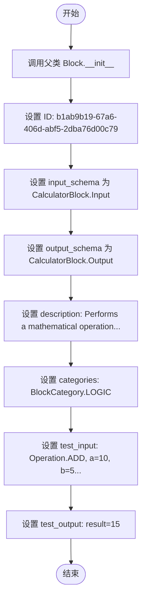
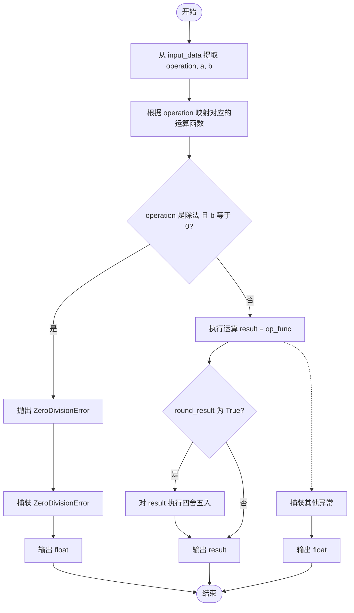
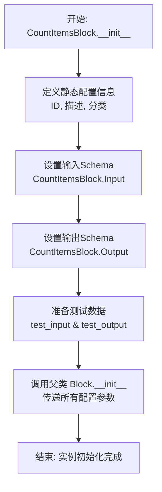
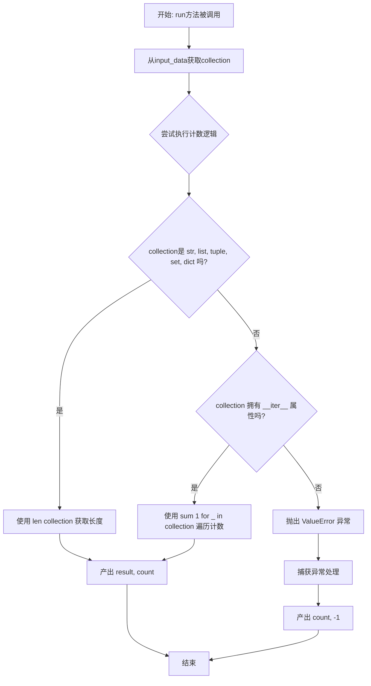

# `AutoGPT\autogpt_platform\backend\backend\blocks\maths.py` 详细设计文档

该代码定义了两个用于工作流引擎的逻辑处理块（Block）：CalculatorBlock 用于执行加减乘除等基本数学运算并处理除零异常及四舍五入逻辑；CountItemsBlock 用于统计列表、字典、字符串或任意迭代器中的元素数量。两者均继承自 Block 基类，并包含输入输出模式定义及异步执行方法。

## 整体流程

```mermaid
graph TD
    Start[Block 执行入口] --> Type{Block 类型判断}
    Type -- CalculatorBlock --> CalcInput[读取 Input: operation, a, b, round_result]
    CalcInput --> ZeroCheck{操作是除法且 b=0?}
    ZeroCheck -- 是 --> ReturnInf[返回 float('inf')]
    ZeroCheck -- 否 --> ExecOp[执行 operator 运算]
    ExecOp --> RoundCheck{round_result 为 True?}
    RoundCheck -- 是 --> DoRound[四舍五入结果]
    RoundCheck -- 否 --> YieldResult[输出 result]
    DoRound --> YieldResult
    ReturnInf --> YieldResult
    Type -- CountItemsBlock --> CountInput[读取 Input: collection]
    CountInput --> CollType{集合类型判断}
    CollType -- 内置容器 --> GetLen[使用 len 计算]
    CollType -- 迭代器 --> GetSum[使用 sum 计算迭代次数]
    CollType -- 其他/异常 --> ReturnNeg1[返回 -1]
    GetLen --> YieldCount[输出 count]
    GetSum --> YieldCount
    ReturnNeg1 --> YieldCount
```

## 类结构

```
Operation (Enum)
  ├── ADD
  ├── SUBTRACT
  ├── MULTIPLY
  ├── DIVIDE
  └── POWER
CalculatorBlock (Block)
  ├── Input (BlockSchemaInput)
  │   ├── operation: Operation
  │   ├── a: float
  │   ├── b: float
  │   └── round_result: bool
  ├── Output (BlockSchemaOutput)
  │   └── result: float
  ├── __init__
  └── run
CountItemsBlock (Block)
  ├── Input (BlockSchemaInput)
  │   └── collection: Any
  ├── Output (BlockSchemaOutput)
  │   └── count: int
  ├── __init__
  └── run
```

## 全局变量及字段


### `CalculatorBlock.Input`
    
Defines the input schema structure for the CalculatorBlock, specifying the operands and the operation type.

类型：`BlockSchemaInput`
    


### `CalculatorBlock.Output`
    
Defines the output schema structure for the CalculatorBlock, specifying the calculation result.

类型：`BlockSchemaOutput`
    


### `CalculatorBlock.Input.operation`
    
Choose the math operation you want to perform

类型：`Operation`
    


### `CalculatorBlock.Input.a`
    
Enter the first number (A)

类型：`float`
    


### `CalculatorBlock.Input.b`
    
Enter the second number (B)

类型：`float`
    


### `CalculatorBlock.Input.round_result`
    
Do you want to round the result to a whole number?

类型：`bool`
    


### `CalculatorBlock.Output.result`
    
The result of your calculation

类型：`float`
    


### `CountItemsBlock.Input`
    
Defines the input schema structure for the CountItemsBlock, specifying the collection to be counted.

类型：`BlockSchemaInput`
    


### `CountItemsBlock.Output`
    
Defines the output schema structure for the CountItemsBlock, specifying the total count of items.

类型：`BlockSchemaOutput`
    


### `CountItemsBlock.Input.collection`
    
Enter the collection you want to count. This can be a list, dictionary, string, or any other iterable.

类型：`Any`
    


### `CountItemsBlock.Output.count`
    
The number of items in the collection

类型：`int`
    
    

## 全局函数及方法


### `CalculatorBlock.__init__`

该方法是 `CalculatorBlock` 类的构造函数，负责初始化计算器块实例，配置其元数据，包括唯一标识符、输入输出模式、描述信息、所属分类以及用于测试的样例输入和预期输出。

参数：

-  `self`：`CalculatorBlock`，表示类的实例本身。

返回值：`None`，无返回值。

#### 流程图



#### 带注释源码

```python
def __init__(self):
    super().__init__(
        # 定义该块的唯一标识符 (UUID)
        id="b1ab9b19-67a6-406d-abf5-2dba76d00c79",
        # 指定输入数据的 Schema 结构，使用内部定义的 Input 类
        input_schema=CalculatorBlock.Input,
        # 指定输出数据的 Schema 结构，使用内部定义的 Output 类
        output_schema=CalculatorBlock.Output,
        # 提供该块的功能描述文本
        description="Performs a mathematical operation on two numbers.",
        # 将该块归类为 LOGIC (逻辑) 类别
        categories={BlockCategory.LOGIC},
        # 定义用于测试的输入数据样例
        test_input={
            "operation": Operation.ADD.value,  # 操作：加法
            "a": 10.0,                         # 第一个数
            "b": 5.0,                          # 第二个数
            "round_result": False,             # 不四舍五入
        },
        # 定义对应的预期测试输出结果
        test_output=[
            ("result", 15.0),                  # 预期结果为 15.0
        ],
    )
```


### `CalculatorBlock.run`

根据输入的数据执行两个数字之间的数学运算（加、减、乘、除、幂），处理除零错误，并可选择对结果进行四舍五入。

参数：

-  `input_data`：`CalculatorBlock.Input`，包含运算类型枚举、两个浮点操作数以及布尔型舍入标志的输入数据对象。
-  `**kwargs`：`Any`，扩展用的关键字参数，当前未使用。

返回值：`BlockOutput`，异步生成器，生成包含输出键名"result"和计算结果（浮点数、无穷大或NaN）的元组。

#### 流程图



#### 带注释源码

```python
    async def run(self, input_data: Input, **kwargs) -> BlockOutput:
        # 1. 从输入数据中提取操作类型和操作数
        operation = input_data.operation
        a = input_data.a
        b = input_data.b

        # 2. 定义操作类型枚举到具体运算函数的映射表
        operations = {
            Operation.ADD: operator.add,
            Operation.SUBTRACT: operator.sub,
            Operation.MULTIPLY: operator.mul,
            Operation.DIVIDE: operator.truediv,
            Operation.POWER: operator.pow,
        }

        # 3. 根据输入的 operation 获取对应的运算函数
        op_func = operations[operation]

        try:
            # 4. 安全检查：如果是除法操作且除数为0，手动抛出除零异常
            if operation == Operation.DIVIDE and b == 0:
                raise ZeroDivisionError("Cannot divide by zero")

            # 5. 执行数学运算
            result = op_func(a, b)

            # 6. 如果用户要求，对结果进行四舍五入
            if input_data.round_result:
                result = round(result)

            # 7. 输出最终计算结果
            yield "result", result

        except ZeroDivisionError:
            # 8. 异常处理：捕获除零错误，返回无穷大
            yield "result", float("inf")
        except Exception:
            # 9. 异常处理：捕获其他所有未知错误，返回 NaN (Not a Number)
            yield "result", float("nan")
```


### `CountItemsBlock.__init__`

该方法用于初始化 `CountItemsBlock` 类的实例，配置其元数据、输入输出模式、测试用例以及所属分类，并通过调用父类 `Block` 的初始化方法完成构建。

参数：

- `self`：`CountItemsBlock`，表示类实例本身，在 Python 构造函数中作为第一个参数隐式传递。

返回值：`None`，构造函数通常不返回任何值，其主要作用是初始化对象状态。

#### 流程图



#### 带注释源码

```python
    def __init__(self):
        # 调用父类 Block 的初始化方法，注册块的配置信息
        super().__init__(
            # 定义该块的全局唯一标识符 (UUID)
            id="3c9c2f42-b0c3-435f-ba35-05f7a25c772a",
            # 绑定输入数据结构定义，指定如何处理输入参数
            input_schema=CountItemsBlock.Input,
            # 绑定输出数据结构定义，指定如何格式化输出结果
            output_schema=CountItemsBlock.Output,
            # 描述该块的核心功能
            description="Counts the number of items in a collection.",
            # 将该块归类到逻辑分类下，便于在UI中查找
            categories={BlockCategory.LOGIC},
            # 提供标准的测试输入数据，用于验证功能
            test_input={"collection": [1, 2, 3, 4, 5]},
            # 提供预期的测试输出数据，对应上述输入
            test_output=[
                ("count", 5),
            ],
        )
```


### `CountItemsBlock.run`

该方法用于计算输入集合中的项目数量。它支持内置的序列类型（如列表、字符串、字典等）以及实现了迭代器协议的通用对象，并将结果作为输出产出。如果输入不可计数或发生其他错误，则返回 -1。

参数：

- `self`：`CountItemsBlock`，类的实例本身。
- `input_data`：`CountItemsBlock.Input`，包含输入数据的对象，其中包含待计数的 `collection` 字段。
- `**kwargs`：`Any`，额外的关键字参数，用于扩展或传递上下文信息。

返回值：`BlockOutput`，一个异步生成器，产出包含计数结果的元组，格式为 `("count", count)` 或错误时的 `("count", -1)`。

#### 流程图



#### 带注释源码

```python
    async def run(self, input_data: Input, **kwargs) -> BlockOutput:
        # 从输入数据中提取待计数的集合对象
        collection = input_data.collection

        try:
            # 检查集合是否为常见的数据结构（字符串、列表、元组、集合、字典）
            if isinstance(collection, (str, list, tuple, set, dict)):
                # 如果是，直接使用内置的 len() 函数获取长度
                count = len(collection)
            # 检查集合是否实现了迭代器协议（即是否可迭代）
            elif hasattr(collection, "__iter__"):
                # 如果是可迭代对象但不是上述特定类型（例如生成器），
                # 通过遍历并累加 1 的方式计算元素个数
                count = sum(1 for _ in collection)
            else:
                # 如果既不是已知类型也不是可迭代对象，抛出 ValueError
                raise ValueError("Input is not a countable collection")

            # 成功计算后，产出键值对 ("count", 计算结果)
            yield "count", count

        except Exception:
            # 捕获任何在计数过程中发生的异常（包括类型转换错误、遍历错误等）
            # 产出 -1 表示计数失败或发生错误
            yield "count", -1
```


## 关键组件


### CalculatorBlock

执行两个数字之间的基本算术运算（加、减、乘、除、幂），并支持结果舍入和除零错误处理。

### CountItemsBlock

用于计算列表、字典或字符串等集合中元素数量的逻辑块，包含对不可迭代对象的异常处理。

### Operation 枚举

定义计算器块支持的五种基本数学操作类型（加、减、乘、除、幂）。

### Block Schema (Input/Output)

利用 `SchemaField` 为计算和计数功能定义输入参数和输出结果的数据结构与验证规则。


## 问题及建议


### 已知问题

-   **异常捕获过于宽泛（Anti-Pattern）**: 两个 Block 均使用了 `except Exception` 捕获所有异常并返回特定值（如 `nan` 或 `-1`）。这会掩盖真实的错误信息（如类型错误、属性错误），使得系统调试极其困难，且将错误数据传递给下游可能导致逻辑混乱。
-   **除零逻辑冗余**: 在 `CalculatorBlock` 中，显式检查了除零并抛出异常，随后又被 `try-except` 捕获。由于输入 `a` 和 `b` 定义为 `float`，Python 的浮点除法 (`1.0/0.0`) 本身就会返回 `inf` 而不抛出异常，当前的检查逻辑是多余的。
-   **硬编码的类型检查**: `CountItemsBlock` 中针对 `str`, `list`, `tuple`, `set`, `dict` 分别进行了类型判断。这种方法缺乏扩展性，无法处理如 `bytearray`, `array`, `collections.deque` 等其他内置序列类型，不符合 Python 鸭子类型（Duck Typing）的最佳实践。
-   **错误状态返回值设计不合理**: 使用 `nan`, `inf`, `-1` 等魔术值作为错误标志，容易与合法的业务数据混淆。如果下游逻辑不专门处理这些值，会导致计算结果不可预测。

### 优化建议

-   **细化异常处理与日志记录**: 移除宽泛的 `except Exception`，或者至少在捕获异常时记录详细的堆栈信息。建议将具体的异常抛出给上层框架处理，或者在返回错误状态的同时输出错误日志。
-   **移除冗余的除零判断**: 简化 `CalculatorBlock` 的逻辑，直接依赖 Python 原生的浮点运算行为或仅在必要时捕获 `ZeroDivisionError`（针对整数除法场景），移除显式的 `if` 判断。
-   **利用鸭子类型优化计数逻辑**: 在 `CountItemsBlock` 中，优先检查对象是否具有 `__len__` 方法（`hasattr(collection, "__len__")`），若有则直接调用；否则再回退到迭代器计数。这样可以支持所有标准序列容器，代码更简洁且通用。
-   **引入输入校验与类型转换**: 在 `run` 方法开始时增加对输入数据的校验。例如，确保 Calculator 的输入确实是可转换为 float 的数值，避免因非数值输入导致的隐式错误。
-   **统一返回值类型**: 针对 `CalculatorBlock` 的 `round_result` 逻辑，如果四舍五入后返回的是 `int`，建议显式转换为 `float` 以严格匹配 `Output` 的 Schema 定义，避免类型系统的潜在不一致。


## 其它


### 设计目标与约束

本模块旨在为工作流引擎提供原子化的逻辑计算和集合操作能力。设计目标包括组件的高复用性、清晰的输入输出定义以及异步执行支持。约束条件包括必须继承自 `Block` 基类，严格遵循框架定义的输入输出 Schema 规范，并且组件设计为无状态，以确保在不同执行环境下的隔离性和线程安全性。

### 错误处理与异常设计

采用“容错”策略，避免因异常导致工作流中断。
1.  **CalculatorBlock**：显式捕获 `ZeroDivisionError`，当除数为零时返回 `float("inf")`（无穷大）；捕获其他通用异常（如类型错误）并返回 `float("nan")`（非数字），以此作为错误信号传递给下游。
2.  **CountItemsBlock**：捕获所有通用异常（如输入对象不可迭代），当计数失败时返回 `-1` 作为错误标识，而非抛出异常堆栈。

### 数据流与状态机

数据流向为单向流转：`Input Schema` -> `业务逻辑处理` -> `BlockOutput (Yield)`。
系统内部无状态机设计，各组件表现为无状态的纯函数转换器。每次 `run` 方法的调用都是独立的，不依赖于前次调用的上下文，也不维护内部持久化变量。

### 外部依赖与接口契约

**外部依赖**：
- 内部框架依赖：`backend.data.block`（提供 `Block`, `BlockOutput`, `BlockSchemaInput` 等基类和类型）。
- Python 标准库：`operator`（用于数学运算）, `enum`（用于枚举定义）, `typing`（用于类型提示）。

**接口契约**：
- 所有 Block 必须实现 `__init__` 方法以配置元数据（ID, Schema, 描述等）。
- 必须实现异步方法 `run(self, input_data: Input, **kwargs) -> BlockOutput`。
- `run` 方法必须通过 `yield` 生成符合 `Output` Schema 定义的键值对元组。

### 扩展性设计

1.  **运算扩展**：在 `CalculatorBlock` 中添加新运算（如取模）非常简便，只需在 `Operation` 枚举中增加成员，并在 `run` 方法的 `operations` 字典中添加对应的映射函数即可。
2.  **类型兼容**：`CountItemsBlock` 利用 Python 的鸭子类型，通过检查 `__iter__` 属性自动兼容各种自定义可迭代对象，无需修改代码即可支持新的集合类型。

### 并发与性能考量

由于 `run` 方法被定义为 `async`，组件支持异步非阻塞执行，适合高并发的 IO 密集型或 CPU 密集型工作流环境。在 `CountItemsBlock` 处理大型生成器时，使用 `sum(1 for _ in collection)` 会消耗迭代器，但具有内存效率（不需要将所有数据加载到内存中）。

    