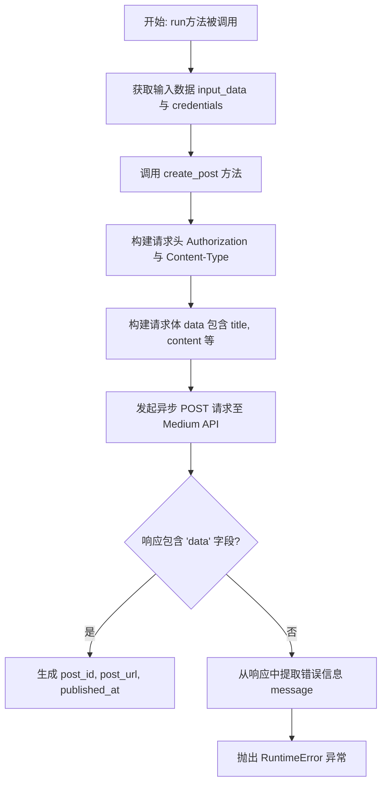
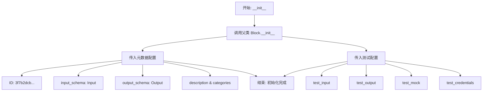
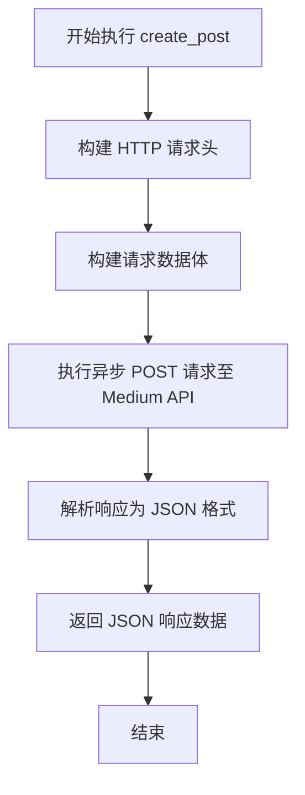

# `AutoGPT\autogpt_platform\backend\backend\blocks\medium.py` 详细设计文档

该代码实现了一个用于将文章发布到 Medium 平台的集成块，通过封装 Medium API 的认证和请求逻辑，接收用户输入的内容、标题及配置信息，异步创建博客文章并返回发布结果或错误信息。

## 整体流程



## 类结构

```
PublishToMediumStatus (Enum)
PublishToMediumBlock (Block)
├── Input (BlockSchemaInput)
└── Output (BlockSchemaOutput)
```

## 全局变量及字段


### `TEST_CREDENTIALS`
    
用于测试的模拟 Medium API 凭证对象

类型：`APIKeyCredentials`
    


### `TEST_CREDENTIALS_INPUT`
    
用于测试输入的模拟 Medium API 凭证字典

类型：`dict`
    


### `PublishToMediumStatus.PUBLIC`
    
表示文章为公开状态的枚举值

类型：`str`
    


### `PublishToMediumStatus.DRAFT`
    
表示文章为草稿状态的枚举值

类型：`str`
    


### `PublishToMediumStatus.UNLISTED`
    
表示文章为不公开列出状态的枚举值

类型：`str`
    


### `PublishToMediumBlock.Input.author_id`
    
用户的 Medium AuthorID

类型：`BlockSecret`
    


### `PublishToMediumBlock.Input.title`
    
Medium 文章的标题

类型：`str`
    


### `PublishToMediumBlock.Input.content`
    
Medium 文章的主要内容

类型：`str`
    


### `PublishToMediumBlock.Input.content_format`
    
内容的格式，支持 'html' 或 'markdown'

类型：`str`
    


### `PublishToMediumBlock.Input.tags`
    
Medium 文章的标签列表，最多5个

类型：`List[str]`
    


### `PublishToMediumBlock.Input.canonical_url`
    
如果内容最初在其他地方发布，则为原始地址

类型：`str | None`
    


### `PublishToMediumBlock.Input.publish_status`
    
文章的发布状态

类型：`PublishToMediumStatus`
    


### `PublishToMediumBlock.Input.license`
    
文章的许可证类型

类型：`str`
    


### `PublishToMediumBlock.Input.notify_followers`
    
是否通知关注者用户已发布

类型：`bool`
    


### `PublishToMediumBlock.Input.credentials`
    
Medium 集成所需的 API 密钥凭证

类型：`CredentialsMetaInput`
    


### `PublishToMediumBlock.Output.post_id`
    
创建的 Medium 文章的 ID

类型：`str`
    


### `PublishToMediumBlock.Output.post_url`
    
创建的 Medium 文章的 URL

类型：`str`
    


### `PublishToMediumBlock.Output.published_at`
    
文章发布时的时间戳

类型：`int`
    


### `PublishToMediumBlock.Output.error`
    
文章创建失败时的错误信息

类型：`str`
    
    

## 全局函数及方法


### `PublishToMediumBlock.__init__`

初始化 `PublishToMediumBlock` 实例，配置该块的唯一标识符、输入/输出数据模式、描述信息、分类以及用于测试的模拟输入、输出和凭据。

参数：

- `self`：`PublishToMediumBlock`，当前类的实例，用于初始化对象状态。

返回值：`None`，无返回值，该方法通过调用父类构造函数完成对象初始化。

#### 流程图



#### 带注释源码

```python
def __init__(self):
    # 调用父类 Block 的构造函数以初始化块的基本属性
    super().__init__(
        id="3f7b2dcb-4a78-4e3f-b0f1-88132e1b89df",  # 块的唯一标识符
        input_schema=PublishToMediumBlock.Input,  # 定义输入参数的 Schema
        output_schema=PublishToMediumBlock.Output, # 定义输出参数的 Schema
        description="Publishes a post to Medium.",  # 块的功能描述
        categories={BlockCategory.SOCIAL},          # 块所属的分类（社交媒体）
        test_input={                                # 定义用于测试的输入数据
            "author_id": "1234567890abcdef",
            "title": "Test Post",
            "content": "<h1>Test Content</h1><p>This is a test post.</p>",
            "content_format": "html",
            "tags": ["test", "automation"],
            "license": "all-rights-reserved",
            "notify_followers": False,
            "publish_status": PublishToMediumStatus.DRAFT.value,
            "credentials": TEST_CREDENTIALS_INPUT,
        },
        test_output=[                               # 定义期望的测试输出数据
            ("post_id", "e6f36a"),
            ("post_url", "https://medium.com/@username/test-post-e6f36a"),
            ("published_at", 1626282600),
        ],
        test_mock={                                 # 定义测试时模拟的 API 响应行为
            "create_post": lambda *args, **kwargs: {
                "data": {
                    "id": "e6f36a",
                    "url": "https://medium.com/@username/test-post-e6f36a",
                    "authorId": "1234567890abcdef",
                    "publishedAt": 1626282600,
                }
            }
        },
        test_credentials=TEST_CREDENTIALS,          # 定义测试使用的模拟凭据
    )
```


### `PublishToMediumBlock.create_post`

该方法负责构建向 Medium API 发送发布文章所需的 HTTP 请求头和请求体，并执行异步 POST 请求，将文章内容发布到指定作者的 Medium 账户下。

参数：

-   `api_key`：`SecretStr`，Medium API 的访问令牌，用于身份验证。
-   `author_id`：`str`，Medium 用户的作者 ID，用于指定发布的用户端点。
-   `title`：`str`，Medium 文章的标题。
-   `content`：`str`，文章的主要内容文本。
-   `content_format`：`str`，内容格式的类型，例如 'html' 或 'markdown'。
-   `tags`：`List[str]`，与文章关联的标签列表。
-   `canonical_url`：`str | None`，如果文章最初发布在其他地方，这是原始来源的 URL。
-   `publish_status`：`str`，文章的发布状态（如 'public', 'draft', 'unlisted'）。
-   `license`：`str`，文章的版权许可类型。
-   `notify_followers`：`bool`，是否在发布时通知关注者。

返回值：`dict`，Medium API 返回的 JSON 响应数据，通常包含新创建文章的 ID、URL 和发布时间等信息，或者包含错误详情。

#### 流程图



#### 带注释源码

```python
    async def create_post(
        self,
        api_key: SecretStr,
        author_id,
        title,
        content,
        content_format,
        tags,
        canonical_url,
        publish_status,
        license,
        notify_followers,
    ):
        # 构建包含授权信息和内容类型的请求头
        headers = {
            "Authorization": f"Bearer {api_key.get_secret_value()}",
            "Content-Type": "application/json",
            "Accept": "application/json",
        }

        # 构建包含文章详细信息的请求体数据
        data = {
            "title": title,
            "content": content,
            "contentFormat": content_format,
            "tags": tags,
            "canonicalUrl": canonical_url,
            "publishStatus": publish_status,
            "license": license,
            "notifyFollowers": notify_followers,
        }

        # 向 Medium API 的用户端点发送异步 POST 请求
        response = await Requests().post(
            f"https://api.medium.com/v1/users/{author_id}/posts",
            headers=headers,
            json=data,
        )
        
        # 返回解析后的 JSON 响应数据
        return response.json()
```


### `PublishToMediumBlock.run`

该方法是发布内容到Medium平台的核心执行逻辑，负责接收输入数据和凭证，调用Medium API创建文章，并根据API响应结果返回文章的ID、URL和发布时间戳，或在失败时抛出运行时异常。

参数：

-  `self`：`PublishToMediumBlock`，类的实例引用。
-  `input_data`：`Input`，包含文章标题、内容、标签、发布状态等配置信息的输入数据模型。
-  `credentials`：`APIKeyCredentials`，用于身份验证的Medium API密钥凭证对象。
-  `**kwargs`：`Any`，扩展用的额外关键字参数。

返回值：`BlockOutput`，一个异步生成器，按顺序生成包含文章ID (`post_id`)、文章链接 (`post_url`) 和发布时间戳 (`published_at`) 的元组。

#### 流程图

```mermaid
flowchart TD
    A[开始: run方法调用] --> B[调用 create_post 方法发送API请求]
    B --> C[获取API响应 response]
    C --> D{响应中是否存在 'data' 字段?}
    D -- 是 --> E[生成 post_id: response['data']['id']]
    E --> F[生成 post_url: response['data']['url']]
    F --> G[生成 published_at: response['data']['publishedAt']]
    G --> H[正常结束]
    D -- 否 --> I[提取错误信息: response['errors'][0]['message']]
    I --> J[抛出 RuntimeError 异常]
    J --> K[异常结束]
```

#### 带注释源码

```python
    async def run(
        self, input_data: Input, *, credentials: APIKeyCredentials, **kwargs
    ) -> BlockOutput:
        # 调用内部辅助方法 create_post，将凭证和用户输入的数据发送到 Medium API
        response = await self.create_post(
            credentials.api_key,  # API 密钥
            input_data.author_id.get_secret_value(),  # 作者 ID
            input_data.title,  # 文章标题
            input_data.content,  # 文章内容
            input_data.content_format,  # 内容格式 (html 或 markdown)
            input_data.tags,  # 标签列表
            input_data.canonical_url,  # 原始链接
            input_data.publish_status,  # 发布状态 (public, draft 等)
            input_data.license,  # 许可证类型
            input_data.notify_followers,  # 是否通知关注者
        )

        # 检查响应中是否包含 'data' 字段，以此判断请求是否成功
        if "data" in response:
            # 成功：提取并输出文章 ID
            yield "post_id", response["data"]["id"]
            # 提取并输出文章 URL
            yield "post_url", response["data"]["url"]
            # 提取并输出发布时间戳
            yield "published_at", response["data"]["publishedAt"]
        else:
            # 失败：尝试从响应的错误列表中获取错误消息
            error_message = response.get("errors", [{}])[0].get(
                "message", "Unknown error occurred"
            )
            # 抛出运行时错误，包含具体的错误信息
            raise RuntimeError(f"Failed to create Medium post: {error_message}")
```


## 关键组件


### 数据模型与Schema定义

定义了块执行的输入参数（如标题、内容、作者ID、发布状态等）和输出结果（如文章ID、URL、发布时间）的结构契约，利用Pydantic模型和自定义字段进行数据验证和描述。

### 凭证管理

负责处理敏感认证信息，包括从`CredentialsMetaInput`中提取`APIKeyCredentials`，以及在API调用时安全地获取和使用API密钥构建Bearer Token授权头。

### API交互封装

封装了与Medium API的具体通信逻辑，构建符合Medium API规范的HTTP POST请求（包含Headers和JSON payload），并处理异步网络请求的发送与响应解析。

### 业务执行流

作为块的主入口，协调输入数据的读取、凭证的传递、API交互层的调用，根据API返回的JSON数据决定是产出成功结果还是抛出运行时异常。


## 问题及建议


### 已知问题

-   **测试配置属性错误**：在 `TEST_CREDENTIALS_INPUT` 定义中，引用了 `TEST_CREDENTIALS.type`，但根据代码初始化，`TEST_CREDENTIALS` 对象并没有 `type` 属性，这会导致 `AttributeError`。
-   **JSON 解析缺乏异常捕获**：在 `create_post` 方法中，直接调用 `response.json()` 而未包裹在 `try-except` 块中。如果 Medium API 返回非 JSON 格式的错误响应（例如 500 错误返回 HTML），程序将抛出未处理的 `JSONDecodeError`。
-   **输入验证与文档不符**：文档说明 `tags` 最多支持 5 个，且 `license` 和 `content_format` 有特定的枚举值，但在 `Input` 类的定义中未使用 Pydantic 的约束（如 `conlist` 或 `Literal`）进行强制限制，可能导致无效数据发送到 API 端。

### 优化建议

-   **配置常量化**：将 API 端点 URL (`https://api.medium.com/v1/...`) 和固定的 Headers 内容提取为类级别的常量或配置文件，以消除魔法字符串，便于未来维护和修改。
-   **增加请求超时机制**：在 `Requests().post` 调用中显式添加 `timeout` 参数，防止因 Medium API 响应缓慢或网络故障导致线程长时间阻塞。
-   **优化 HTTP 客户端管理**：避免在每次调用 `create_post` 时都实例化一个新的 `Requests()` 对象。建议通过依赖注入或在 `__init__` 中初始化 HTTP 客户端，以复用连接池，提高网络请求效率。
-   **增强输入约束验证**：利用 Pydantic 的 `Field` 参数（如 `max_length`）或 `Literal` 类型，对 `tags` 的数量、`license` 的可选值以及 `content_format` 的格式进行严格的模型校验，尽早拦截非法输入。
-   **补充日志记录**：在关键步骤（如发起请求前、收到响应后、捕获异常时）添加结构化日志，以便在生产环境中追踪请求链路和排查故障。
-   **规范化错误处理**：将 API 错误响应的解析逻辑（如提取 `errors` 列表中的消息）封装为独立的私有方法，统一处理 API 返回的各种错误形态，提高代码的可读性和健壮性。


## 其它


### 设计目标与约束

**设计目标：**
提供一种标准化的、可复用的自动化组件（Block），用于将结构化内容（标题、正文、标签等）异步发布到 Medium 平台。该组件旨在集成到更大的工作流中，允许用户通过 API Key 认证自动创建草稿或公开文章。

**约束：**
1.  **异步执行**：必须使用 `async/await` 语法以支持非阻塞 I/O 操作，适应高并发工作流环境。
2.  **API 规范遵循**：必须严格遵守 Medium API v1 的接口契约，包括请求头格式、Content-Type 要求以及特定的端点路径 (`/users/{author_id}/posts`)。
3.  **数据格式限制**：内容格式必须为 `html` 或 `markdown`，标签数量限制为 5 个（由 Medium API 定义，代码中未显式校验但在 Schema 描述中提及）。
4.  **认证要求**：执行操作必须持有有效的 Medium API Key (`Bearer` Token) 和用户 Author ID。

### 错误处理与异常设计

**设计策略：**
组件采用集中式错误处理机制，在执行 HTTP 请求后，优先检查业务逻辑层面的成功标志，而非仅依赖 HTTP 状态码（虽然 `Requests` 库可能处理底层网络错误）。

**具体实现：**
1.  **响应结构校验**：在 `run` 方法中，检查返回的 JSON 响应对象是否包含 `"data"` 字段。
2.  **异常抛出**：如果响应中不包含 `"data"`，则判定为业务失败。代码会尝试从响应的 `errors` 列表中提取第一条错误的 `message`。
3.  **异常类型**：一旦检测到错误，抛出 `RuntimeError`，并附带详细的错误信息（如 "Failed to create Medium post: ..."），以便上层工作流引擎捕获并处理。
4.  **兜底处理**：如果无法从 `errors` 中获取具体消息，则使用默认字符串 "Unknown error occurred"。

### 数据流与状态机

**数据流：**
1.  **输入阶段**：外部系统传入 `Input` 数据模型（包含标题、内容等）和 `credentials`（API Key）。
2.  **预处理阶段**：从 `BlockSecret` 对象中提取敏感信息（Author ID），从 `CredentialsMetaInput` 中提取 API Key。
3.  **请求构建阶段**：将输入字段映射到符合 Medium API 要求的 JSON Payload，并构建包含 Authorization Bearer Token 的 HTTP Headers。
4.  **交互阶段**：通过 `Requests.post` 发送异步 POST 请求至 Medium API。
5.  **后处理阶段**：解析返回的 JSON。
    *   *成功路径*：提取 `id`, `url`, `publishedAt` 并通过 `yield` 生成输出。
    *   *失败路径*：提取错误信息并触发异常流程。

**状态机：**
该组件属于无状态服务组件，其生命周期仅限于单次 `run` 调用：
*   **Idle**：Block 实例化完成，等待执行。
*   **Running**：`run` 方法被调用，正在执行 HTTP 请求。
*   **Completed**：成功获取数据并产出结果。
*   **Failed**：发生网络错误或 API 返回业务错误，抛出异常。

### 外部依赖与接口契约

**外部依赖：**
1.  **Medium API (v1)**：
    *   **端点**：`https://api.medium.com/v1/users/{author_id}/posts`
    *   **方法**：`POST`
    *   **认证方式**：Bearer Token (Authorization Header)
2.  **内部组件**：
    *   `backend.util.request.Requests`：用于底层的异步 HTTP 通信。
    *   `pydantic`：用于输入数据的校验和序列化。

**接口契约：**
*   **输入契约**：
    *   必须提供 `author_id` (Secret), `title`, `content`, `content_format`, `tags`, `publish_status`, `license`, `notify_followers`。
    *   必须提供有效的 Medium API Key 凭证。
*   **输出契约**：
    *   **成功**：返回包含 `post_id` (str), `post_url` (str), `published_at` (int) 的字典结构。
    *   **失败**：抛出包含错误描述的 `RuntimeError`。
*   **API 响应契约**：期望 Medium API 返回的 JSON 包含顶层 `data` 字段，其中包含文章属性；或在失败时包含顶层 `errors` 数组。

### 安全性设计

**敏感信息保护：**
1.  **SecretStr 封装**：使用 Pydantic 的 `SecretStr` 类型存储 `api_key` 和 `author_id`。这意味着在日志打印、序列化或调试输出时，这些字段会被自动脱敏（显示为 `**********`），防止密钥泄露。
2.  **凭证隔离**：通过 `CredentialsMetaInput` 和 `BlockSecret` 专门管理认证信息，与普通业务数据（如标题、内容）分离，降低误操作导致泄露的风险。
3.  **传输加密**：强制使用 HTTPS 协议 (`https://api.medium.com`) 进行通信，确保数据在传输过程中的机密性。

    