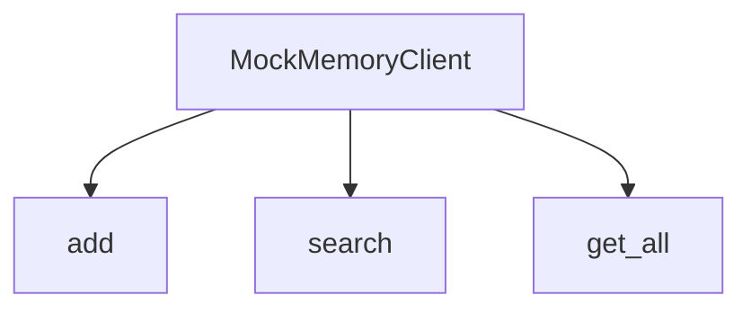
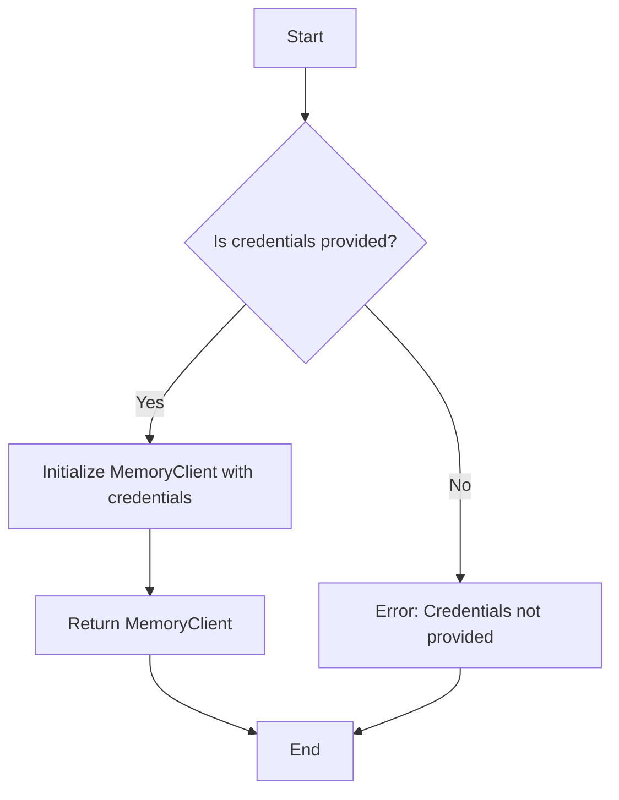
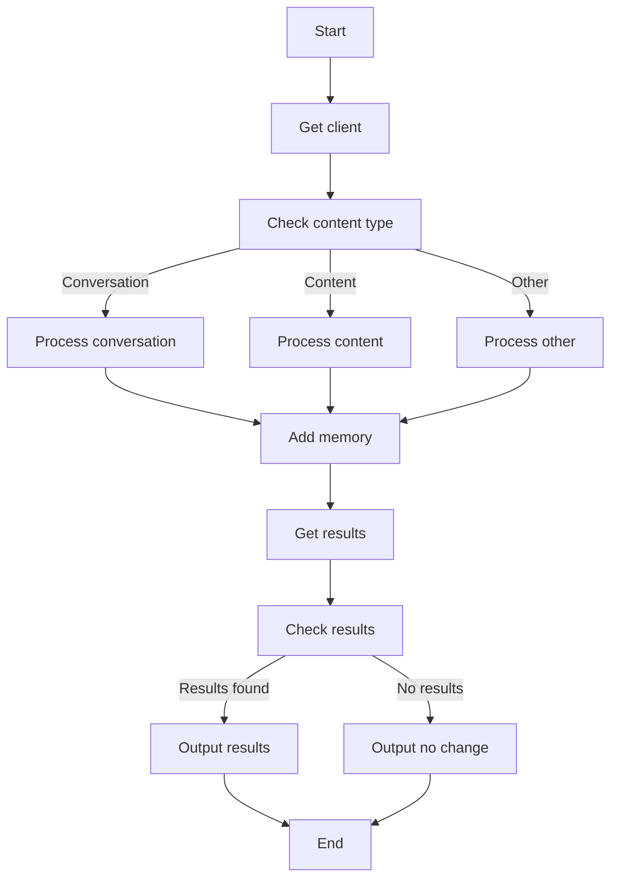
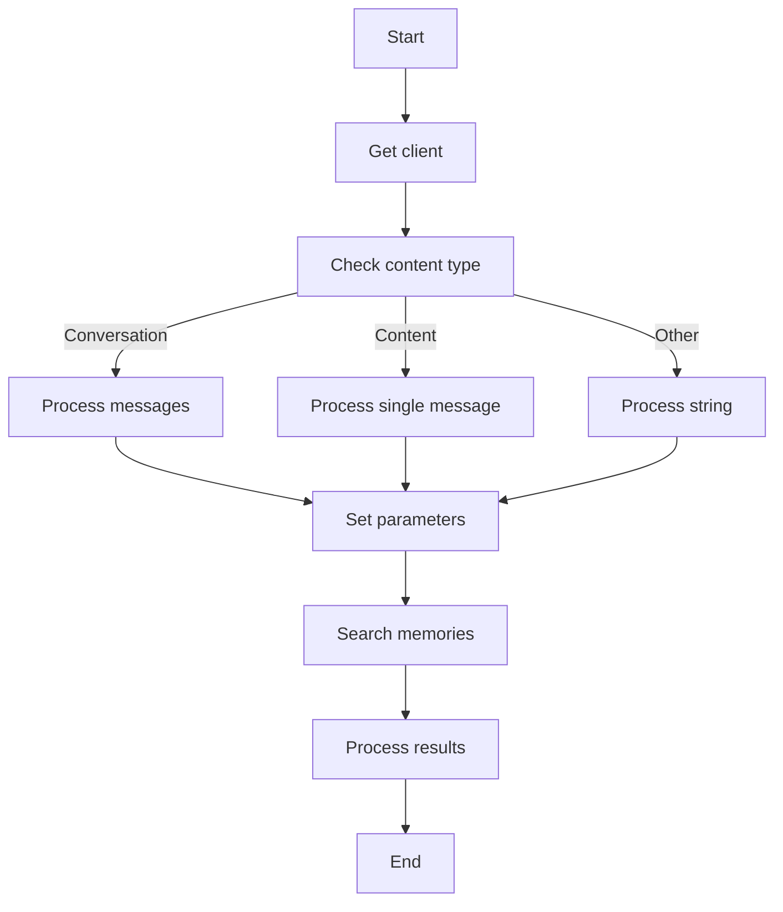
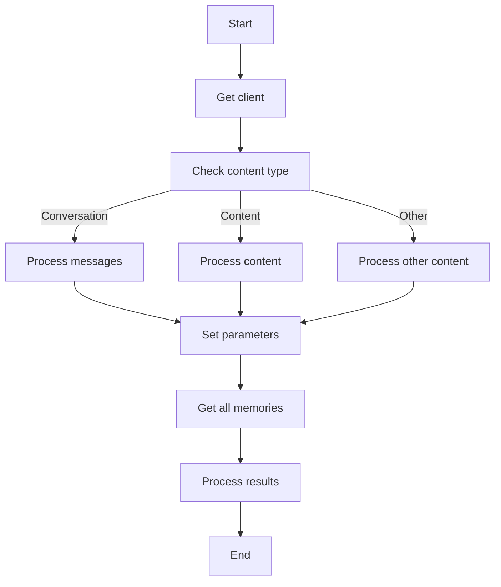
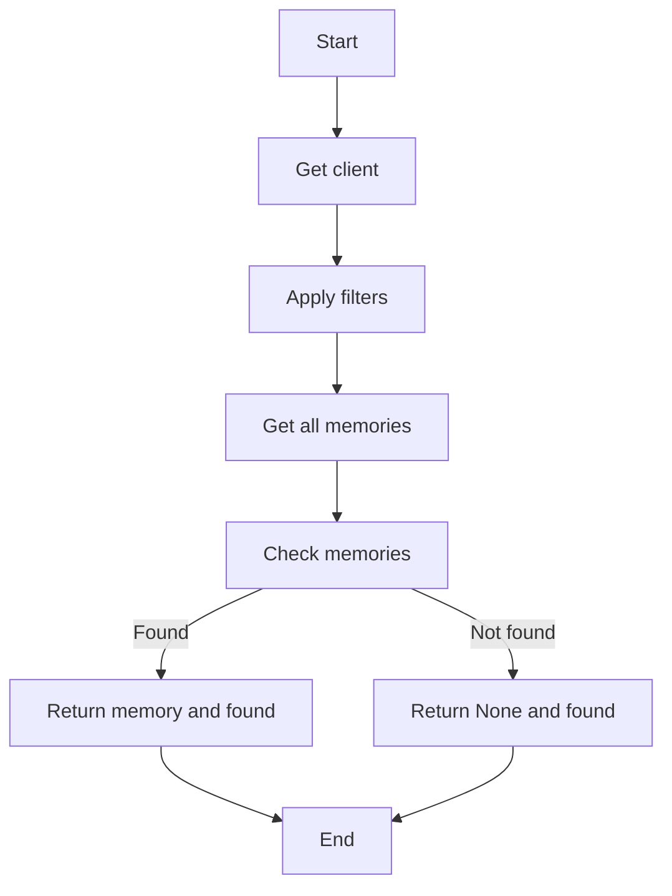

# `.\AutoGPT\autogpt_platform\backend\backend\blocks\mem0.py` 详细设计文档

This code defines a set of classes for interacting with a Mem0 API, including adding, searching, and retrieving memories. It uses Pydantic for data validation and async functions for asynchronous operations.

## 整体流程

```mermaid
graph TD
    A[开始] --> B[初始化Mem0客户端]
    B --> C{内容类型？}
    C -- 对话 --> D[解析对话内容]
    C -- 内容 --> E[解析内容内容]
    D, E --> F[添加到Mem0]
    F --> G{操作成功？}
    G -- 是 --> H[返回结果]
    G -- 否 --> I[记录错误]
    H --> J[结束]
    I --> J[结束]
```

## 类结构

```
Mem0Base (抽象基类)
├── AddMemoryBlock (添加记忆块)
│   ├── Input (输入模式)
│   └── Output (输出模式)
├── SearchMemoryBlock (搜索记忆块)
│   ├── Input (输入模式)
│   └── Output (输出模式)
├── GetAllMemoriesBlock (获取所有记忆块)
│   ├── Input (输入模式)
│   └── Output (输出模式)
└── GetLatestMemoryBlock (获取最新记忆块)
    ├── Input (输入模式)
    └── Output (输出模式)
```

## 全局变量及字段


### `TEST_CREDENTIALS`
    
API key credentials for the Mem0 provider

类型：`APIKeyCredentials`
    


### `TEST_CREDENTIALS_INPUT`
    
Input dictionary containing credentials information for testing

类型：`dict`
    


### `APIKeyCredentials.id`
    
Unique identifier for the API key

类型：`str`
    


### `APIKeyCredentials.provider`
    
Provider name for the API key

类型：`str`
    


### `APIKeyCredentials.api_key`
    
API key used for authentication

类型：`SecretStr`
    


### `APIKeyCredentials.title`
    
Title for the API key

类型：`str`
    


### `APIKeyCredentials.expires_at`
    
Expiration date for the API key

类型：`Optional[datetime]`
    


### `CredentialsMetaInput.provider`
    
Provider name for the credentials

类型：`Literal[ProviderName.MEM0]`
    


### `CredentialsMetaInput.type`
    
Type of credentials

类型：`Literal["api_key"]`
    


### `BaseModel.discriminator`
    
Discriminator for conversation type

类型：`Literal["conversation"]`
    


### `Conversation.messages`
    
List of messages in the conversation

类型：`list[dict[str, str]]`
    


### `BaseModel.discriminator`
    
Discriminator for content type

类型：`Literal["content"]`
    


### `Content.content`
    
Content to be added

类型：`str`
    


### `AddMemoryBlock.metadata`
    
Optional metadata for the memory

类型：`dict[str, Any]`
    


### `AddMemoryBlock.limit_memory_to_run`
    
Limit the memory to the run

类型：`bool`
    


### `AddMemoryBlock.limit_memory_to_agent`
    
Limit the memory to the agent

类型：`bool`
    


### `AddMemoryBlock.action`
    
Action of the operation

类型：`str`
    


### `AddMemoryBlock.memory`
    
Memory created

类型：`str`
    


### `AddMemoryBlock.results`
    
List of all results from the operation

类型：`list[dict[str, str]]`
    


### `SearchMemoryBlock.query`
    
Search query

类型：`str`
    


### `SearchMemoryBlock.trigger`
    
Unused field to trigger the block

类型：`bool`
    


### `SearchMemoryBlock.categories_filter`
    
Categories to filter by

类型：`list[str]`
    


### `SearchMemoryBlock.metadata_filter`
    
Optional metadata filters to apply

类型：`Optional[dict[str, Any]]`
    


### `SearchMemoryBlock.limit_memory_to_run`
    
Limit the memory to the run

类型：`bool`
    


### `SearchMemoryBlock.limit_memory_to_agent`
    
Limit the memory to the agent

类型：`bool`
    


### `SearchMemoryBlock.memories`
    
List of matching memories

类型：`Any`
    


### `GetAllMemoriesBlock.categories`
    
Filter by categories

类型：`Optional[list[str]]`
    


### `GetAllMemoriesBlock.metadata_filter`
    
Optional metadata filters to apply

类型：`Optional[dict[str, Any]]`
    


### `GetAllMemoriesBlock.limit_memory_to_run`
    
Limit the memory to the run

类型：`bool`
    


### `GetAllMemoriesBlock.limit_memory_to_agent`
    
Limit the memory to the agent

类型：`bool`
    


### `GetAllMemoriesBlock.memories`
    
List of memories

类型：`Any`
    


### `GetLatestMemoryBlock.conversation_id`
    
Optional conversation ID to retrieve the latest memory from

类型：`Optional[str]`
    


### `GetLatestMemoryBlock.metadata_filter`
    
Optional metadata filters to apply

类型：`Optional[dict[str, Any]]`
    


### `GetLatestMemoryBlock.limit_memory_to_run`
    
Limit the memory to the run

类型：`bool`
    


### `GetLatestMemoryBlock.limit_memory_to_agent`
    
Limit the memory to the agent

类型：`bool`
    


### `GetLatestMemoryBlock.memory`
    
Latest memory if found

类型：`Optional[dict[str, Any]]`
    


### `GetLatestMemoryBlock.found`
    
Whether a memory was found

类型：`bool`
    
    

## 全局函数及方法

### MockMemoryClient

MockMem0 client for testing

参数：

- `*args`：任意数量的位置参数，用于模拟调用时的参数
- `**kwargs`：任意数量的关键字参数，用于模拟调用时的参数

返回值：`list[dict[str, Any]]`，模拟返回的内存数据列表

#### 流程图



#### 带注释源码

```python
class MockMemoryClient:
    """Mock Mem0 client for testing"""

    def add(self, *args, **kwargs):
        # 模拟添加内存的调用
        return {"results": [{"event": "CREATED", "memory": "test memory"}]}

    def search(self, *args, **kwargs) -> list[dict[str, Any]]:
        # 模拟搜索内存的调用
        return [{"id": "test-memory", "content": "test content"}]

    def get_all(self, *args, **kwargs) -> list[dict[str, str]]:
        # 模拟获取所有内存的调用
        return [{"id": "test-memory", "content": "test content"}]
```

### `_get_client`

#### 描述

The `_get_client` method is a static method within the `Mem0Base` class that initializes and returns a `MemoryClient` object using the provided `APIKeyCredentials`.

#### 参数

- `credentials`：`APIKeyCredentials`，The credentials object containing the API key for the Mem0 service.

#### 返回值

- `MemoryClient`：The initialized `MemoryClient` object.

#### 流程图



#### 带注释源码

```python
from typing import Any, Literal, Optional, Union

from mem0 import MemoryClient
from pydantic import BaseModel, SecretStr

# ... (other imports and global variables)

class Mem0Base:
    # ... (other class members)

    @staticmethod
    def _get_client(credentials: APIKeyCredentials) -> MemoryClient:
        """Get initialized Mem0 client"""
        return MemoryClient(api_key=credentials.api_key.get_secret_value())
```

### AddMemoryBlock.run

#### 描述

The `AddMemoryBlock.run` method is responsible for adding memories to the Mem0 platform. It takes in input data, including content and metadata, and credentials to authenticate with the Mem0 API. It then adds the memory to the Mem0 platform and yields the results of the operation.

#### 参数

- `input_data`: `Input`，The input data for the block, including content, metadata, and credentials.
- `credentials`: `APIKeyCredentials`，The credentials used to authenticate with the Mem0 API.
- `user_id`: `str`，The user ID associated with the memory.
- `graph_id`: `str`，The graph ID associated with the memory.
- `graph_exec_id`: `str`，The graph execution ID associated with the memory.
- `**kwargs`: `Any`，Additional keyword arguments.

#### 返回值

- `BlockOutput`，The output of the block, including the action performed, the memory created, and any results from the operation.

#### 流程图



#### 带注释源码

```python
async def run(
    self,
    input_data: Input,
    *,
    credentials: APIKeyCredentials,
    user_id: str,
    graph_id: str,
    graph_exec_id: str,
    **kwargs,
) -> BlockOutput:
    try:
        client = self._get_client(credentials)

        if isinstance(input_data.content, Conversation):
            messages = input_data.content.messages
        elif isinstance(input_data.content, Content):
            messages = [{"role": "user", "content": input_data.content.content}]
        else:
            messages = [{"role": "user", "content": str(input_data.content)}]

        params = {
            "user_id": user_id,
            "output_format": "v1.1",
            "metadata": input_data.metadata,
        }

        if input_data.limit_memory_to_run:
            params["run_id"] = graph_exec_id
        if input_data.limit_memory_to_agent:
            params["agent_id"] = graph_id

        # Use the client to add memory
        result = client.add(
            messages,
            **params,
        )

        results = result.get("results", [])
        yield "results", results

        if len(results) > 0:
            for result in results:
                yield "action", result["event"]
                yield "memory", result["memory"]
        else:
            yield "action", "NO_CHANGE"

    except Exception as e:
        yield "error", str(e)
```

### SearchMemoryBlock.run

#### 描述

The `SearchMemoryBlock.run` method is an asynchronous function that searches for memories in the Mem0 system based on a given query and optional filters. It returns a list of matching memories.

#### 参数

- `input_data`: `Input`，The input data for the block, which includes the search query and optional filters.
- `credentials`: `APIKeyCredentials`，The API key credentials for the Mem0 service.
- `user_id`: `str`，The user ID to search within.
- `graph_id`: `str`，The graph ID to limit the search to.
- `graph_exec_id`: `str`，The graph execution ID to limit the search to.

#### 返回值

- `BlockOutput`，The output of the block, which includes the list of matching memories.

#### 流程图



#### 带注释源码

```python
async def run(
    self,
    input_data: Input,
    *,
    credentials: APIKeyCredentials,
    user_id: str,
    graph_id: str,
    graph_exec_id: str,
    **kwargs,
) -> BlockOutput:
    try:
        client = self._get_client(credentials)

        filters: Filter = {
            "AND": [
                {"user_id": user_id},
            ]
        }
        if input_data.categories_filter:
            filters["AND"].append(
                {"categories": {"contains": input_data.categories_filter}}
            )
        if input_data.limit_memory_to_run:
            filters["AND"].append({"run_id": graph_exec_id})
        if input_data.limit_memory_to_agent:
            filters["AND"].append({"agent_id": graph_id})
        if input_data.metadata_filter:
            filters["AND"].append({"metadata": input_data.metadata_filter})

        result: list[dict[str, Any]] = client.search(
            input_data.query, version="v2", filters=filters
        )
        yield "memories", result

    except Exception as e:
        yield "error", str(e)
```

### `GetAllMemoriesBlock.run`

#### 描述

The `GetAllMemoriesBlock.run` method retrieves all memories from the Mem0 service based on specified filters, such as user ID, categories, and metadata.

#### 参数

- `input_data`: `Input`，The input data for the block, which includes credentials, filters, and other parameters.
- `credentials`: `APIKeyCredentials`，The API key credentials for the Mem0 service.
- `user_id`: `str`，The user ID to filter memories by.
- `graph_id`: `str`，The graph ID to limit the memories to.
- `graph_exec_id`: `str`，The graph execution ID to limit the memories to.

#### 返回值

- `BlockOutput`，The output of the block, which includes the list of retrieved memories.

#### 流程图



#### 带注释源码

```python
async def run(
    self,
    input_data: Input,
    *,
    credentials: APIKeyCredentials,
    user_id: str,
    graph_id: str,
    graph_exec_id: str,
    **kwargs,
) -> BlockOutput:
    try:
        client = self._get_client(credentials)

        filters: Filter = {
            "AND": [
                {"user_id": user_id},
            ]
        }
        if input_data.limit_memory_to_run:
            filters["AND"].append({"run_id": graph_exec_id})
        if input_data.limit_memory_to_agent:
            filters["AND"].append({"agent_id": graph_id})
        if input_data.categories:
            filters["AND"].append(
                {"categories": {"contains": input_data.categories}}
            )
        if input_data.metadata_filter:
            filters["AND"].append({"metadata": input_data.metadata_filter})

        memories: list[dict[str, Any]] = client.get_all(
            filters=filters,
            version="v2",
        )

        yield "memories", memories

    except Exception as e:
        yield "error", str(e)
```

### GetLatestMemoryBlock.run

#### 描述

The `GetLatestMemoryBlock.run` method retrieves the latest memory from the Mem0 service. It applies optional filters based on categories and metadata, and returns the latest memory if found.

#### 参数

- `input_data`: `Input`，The input data for the block, which includes credentials, optional filters, and other parameters.
- `credentials`: `APIKeyCredentials`，The API key credentials for the Mem0 service.
- `user_id`: `str`，The user ID to filter memories by.
- `graph_id`: `str`，The graph ID to limit the memory to.
- `graph_exec_id`: `str`，The graph execution ID to limit the memory to.

#### 返回值

- `BlockOutput`，The output of the block, which includes the latest memory and a boolean indicating whether a memory was found.

#### 流程图



#### 带注释源码

```python
async def run(
    self,
    input_data: Input,
    *,
    credentials: APIKeyCredentials,
    user_id: str,
    graph_id: str,
    graph_exec_id: str,
    **kwargs,
) -> BlockOutput:
    try:
        client = self._get_client(credentials)

        filters: Filter = {
            "AND": [
                {"user_id": user_id},
            ]
        }
        if input_data.limit_memory_to_run:
            filters["AND"].append({"run_id": graph_exec_id})
        if input_data.limit_memory_to_agent:
            filters["AND"].append({"agent_id": graph_id})
        if input_data.categories:
            filters["AND"].append(
                {"categories": {"contains": input_data.categories}}
            )
        if input_data.metadata_filter:
            filters["AND"].append({"metadata": input_data.metadata_filter})

        memories: list[dict[str, Any]] = client.get_all(
            filters=filters,
            version="v2",
        )

        if memories:
            # Return the latest memory (first in the list as they're sorted by recency)
            latest_memory = memories[0]
            yield "memory", latest_memory
            yield "found", True
        else:
            yield "memory", None
            yield "found", False

    except Exception as e:
        yield "error", str(e)
```

## 关键组件


### 张量索引与惰性加载

张量索引与惰性加载是代码中用于高效处理和存储大量数据的机制。

### 反量化支持

反量化支持是代码中实现的一种功能，允许对量化过程进行逆操作，以便在需要时恢复原始数据。

### 量化策略

量化策略是代码中用于优化模型性能和减少内存消耗的方法，通过减少模型中使用的数值精度来实现。


## 问题及建议


### 已知问题

-   **全局变量** `TEST_CREDENTIALS` 和 `TEST_CREDENTIALS_INPUT` 是硬编码的，这可能导致在真实环境中使用时出现问题。
-   **类方法** `run` 在 `AddMemoryBlock`、`SearchMemoryBlock`、`GetAllMemoriesBlock` 和 `GetLatestMemoryBlock` 中都使用了相同的异常处理结构，但可能需要根据每个方法的具体需求进行调整。
-   **MockMemoryClient** 类仅用于测试，但在实际部署时需要替换为真实的 `MemoryClient`。
-   **代码复用** 可以通过创建一个通用的 `BaseBlock` 类来减少代码重复，该类可以包含所有块共有的属性和方法。

### 优化建议

-   **全局变量** 应该使用环境变量或配置文件来动态加载，以便在不同的环境中使用不同的凭据。
-   **异常处理** 应该根据每个方法可能遇到的特定异常进行定制，并考虑使用更具体的异常类型。
-   **MockMemoryClient** 应该在测试环境中使用，并在生产环境中替换为真实的 `MemoryClient`。
-   **代码复用** 通过创建一个 `BaseBlock` 类，可以减少代码重复，并使代码更加模块化和易于维护。
-   **日志记录** 应该添加日志记录，以便在出现问题时可以更容易地调试和跟踪。
-   **单元测试** 应该为每个类和方法编写单元测试，以确保代码的正确性和稳定性。
-   **文档** 应该为每个类和方法编写详细的文档，包括参数、返回值和异常处理。


## 其它


### 设计目标与约束

- 设计目标：
  - 提供一个模块化的方式来添加、搜索、获取和检索Mem0中的记忆块。
  - 确保所有操作都通过API密钥进行身份验证。
  - 支持用户和运行时级别的记忆限制。
  - 提供错误处理和异常设计，确保系统的健壮性。

- 约束：
  - 必须使用Mem0 API进行所有操作。
  - 输入数据必须符合预定义的schema。
  - 必须处理所有可能的异常情况，并返回适当的错误信息。

### 错误处理与异常设计

- 错误处理：
  - 所有API调用都应捕获异常，并返回错误信息。
  - 自定义异常类可以用于处理特定类型的错误。

- 异常设计：
  - 使用try-except块来捕获和处理异常。
  - 定义自定义异常类，以便于错误跟踪和调试。

### 数据流与状态机

- 数据流：
  - 输入数据通过API密钥、查询参数和过滤器传递给Mem0 API。
  - API返回结果通过输出schema返回给调用者。

- 状态机：
  - 每个块都有自己的状态机，用于处理输入、执行操作和返回结果。

### 外部依赖与接口契约

- 外部依赖：
  - Mem0 API。
  - Pydantic用于数据验证。
  - Asyncio用于异步操作。

- 接口契约：
  - 所有API调用都遵循RESTful API规范。
  - 输入和输出数据都遵循预定义的schema。
  - 异步操作使用async/await语法。


    