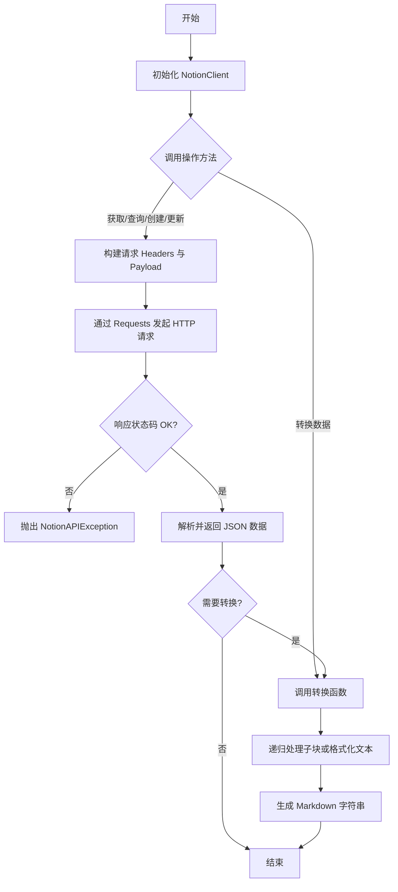
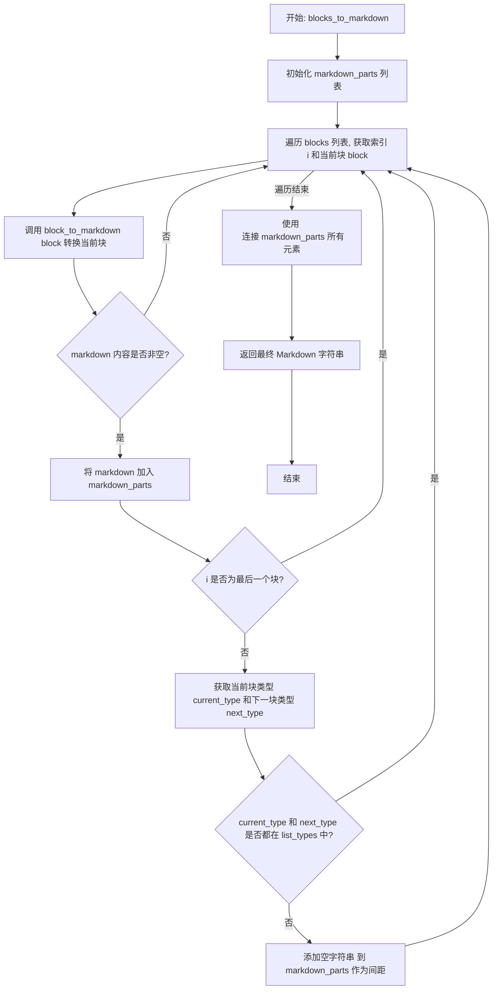
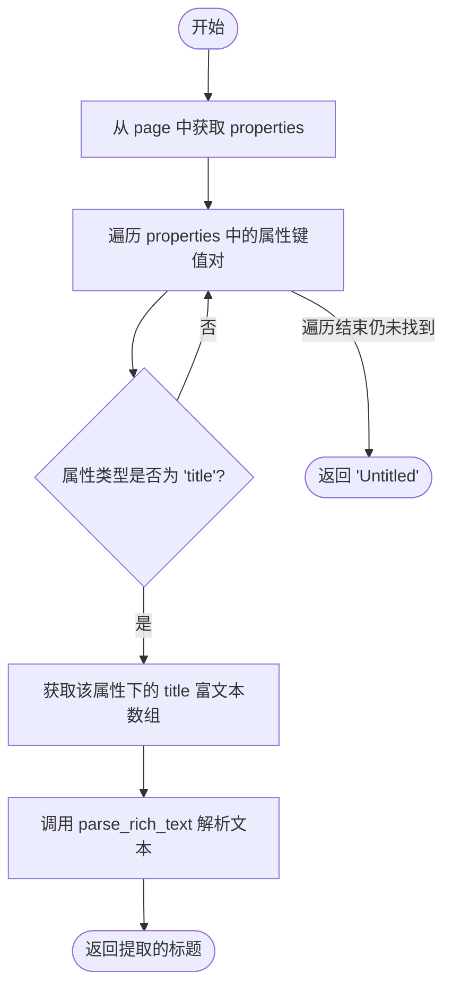
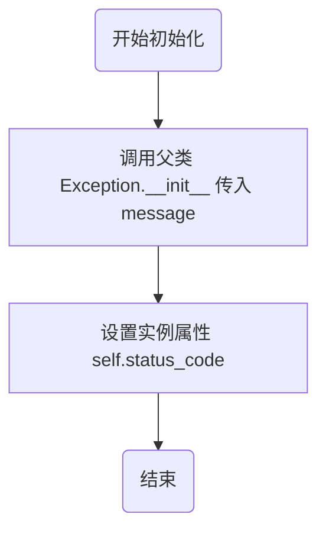
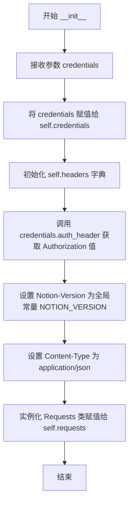
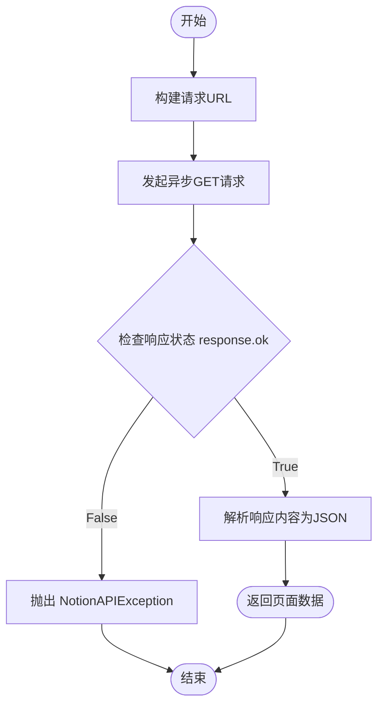
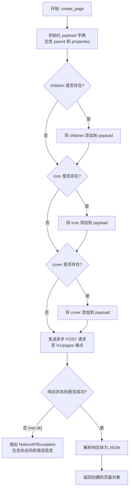

# `AutoGPT\autogpt_platform\backend\backend\blocks\notion\_api.py` 详细设计文档

该文件提供了一个用于与 Notion API 交互的 Python 客户端类，支持认证、页面/块/数据库的异步获取、创建和更新，以及一系列将 Notion 数据结构（富文本、块）转换为 Markdown 格式的工具函数。

## 整体流程



## 类结构

```
NotionAPIException (Exception)
NotionClient
```

## 全局变量及字段


### `NOTION_VERSION`
    
指定用于 Notion API 请求的版本字符串。

类型：`str`
    


### `NotionAPIException.status_code`
    
Notion API 返回的 HTTP 状态码。

类型：`int`
    


### `NotionClient.credentials`
    
用于进行 API 身份验证的 OAuth2 凭证对象。

类型：`OAuth2Credentials`
    


### `NotionClient.headers`
    
包含授权、版本和内容类型等信息的 HTTP 请求头字典。

类型：`Dict[str, str]`
    


### `NotionClient.requests`
    
用于执行异步 HTTP 请求的请求客户端实例。

类型：`Requests`
    
    

## 全局函数及方法


### `parse_rich_text`

Extract plain text from a Notion rich text array.

参数：

-   `rich_text_array`：`List[dict]`，Array of rich text objects from Notion.

返回值：`str`，Plain text string.

#### 流程图

```mermaid
flowchart TD
    A([开始]) --> B{rich_text_array 是否为空?}
    B -- 是 --> C([返回空字符串 ""])
    B -- 否 --> D[初始化 text_parts 列表]
    D --> E[遍历 rich_text_array 中的 text_obj]
    E --> F{text_obj 是否包含 'plain_text' 键?}
    F -- 是 --> G[将 text_obj['plain_text'] 追加到 text_parts]
    F -- 否 --> H[继续下一次循环]
    G --> H
    H --> I{遍历是否结束?}
    I -- 否 --> E
    I -- 是 --> J[使用空字符串连接 text_parts]
    J --> K([返回连接后的字符串])
```

#### 带注释源码

```python
def parse_rich_text(rich_text_array: List[dict]) -> str:
    """
    Extract plain text from a Notion rich text array.

    Args:
        rich_text_array: Array of rich text objects from Notion.

    Returns:
        Plain text string.
    """
    # 检查输入数组是否为空，如果为空则直接返回空字符串
    if not rich_text_array:
        return ""

    # 初始化列表用于存储分割的文本片段
    text_parts = []
    
    # 遍历富文本数组中的每一个对象
    for text_obj in rich_text_array:
        # 检查对象中是否存在 'plain_text' 字段
        if "plain_text" in text_obj:
            # 将提取到的纯文本片段添加到列表中
            text_parts.append(text_obj["plain_text"])

    # 将所有文本片段合并为一个字符串并返回
    return "".join(text_parts)
```


### `rich_text_to_markdown`

将 Notion API 返回的富文本对象数组转换为包含格式化信息（如加粗、斜体、代码、链接等）的 Markdown 字符串。

参数：

-   `rich_text_array`：`List[dict]`，来自 Notion 的富文本对象数组，每个对象包含文本内容、注解和可能的链接信息。

返回值：`str`，转换后的 Markdown 格式字符串。

#### 流程图

```mermaid
graph TD
    Start([开始]) --> CheckInput{rich_text_array 是否为空?}
    CheckInput -- 是 --> ReturnEmpty([返回空字符串])
    CheckInput -- 否 --> InitParts[初始化 markdown_parts 列表]
    
    InitParts --> LoopStart[遍历 rich_text_array 中的 text_obj]
    LoopStart --> ExtractData[获取 plain_text 和 annotations]
    
    ExtractData --> CheckCode{annotations.code 是否为真?}
    CheckCode -- 是 --> FormatCode[将文本格式化为 `text`]
    CheckCode -- 否 --> CheckBold{annotations.bold 是否为真?}
    
    CheckBold -- 是 --> FormatBold[将文本格式化为 **text**]
    CheckBold -- 否 --> CheckItalic{annotations.italic 是否为真?}
    
    CheckItalic -- 是 --> FormatItalic[将文本格式化为 *text*]
    CheckItalic -- 否 --> CheckStrike{annotations.strikethrough 是否为真?}
    
    CheckStrike -- 是 --> FormatStrike[将文本格式化为 ~~text~~]
    CheckStrike -- 否 --> CheckUnderline{annotations.underline 是否为真?}
    
    CheckUnderline -- 是 --> FormatUnderline[将文本格式化为 <u>text</u>]
    CheckUnderline -- 否 --> CheckLink{text_obj.href 是否存在?}
    
    FormatCode --> CheckLink
    FormatBold --> CheckLink
    FormatItalic --> CheckLink
    FormatStrike --> CheckLink
    FormatUnderline --> CheckLink
    
    CheckLink -- 是 --> FormatLink[将文本格式化为 [text]url]
    CheckLink -- 否 --> AppendPart[将处理后的文本追加到 markdown_parts]
    FormatLink --> AppendPart
    
    AppendPart --> NextItem[数组下一项]
    NextItem --> LoopStart
    
    LoopStart -- 遍历结束 --> JoinResult[合并 markdown_parts 为字符串]
    JoinResult --> End([返回 Markdown 字符串])
```

#### 带注释源码

```python
def rich_text_to_markdown(rich_text_array: List[dict]) -> str:
    """
    Convert Notion rich text array to markdown with formatting.

    Args:
        rich_text_array: Array of rich text objects from Notion.

    Returns:
        Markdown formatted string.
    """
    # 如果输入数组为空，直接返回空字符串
    if not rich_text_array:
        return ""

    markdown_parts = []

    # 遍历富文本数组中的每一个文本对象
    for text_obj in rich_text_array:
        # 获取纯文本内容
        text = text_obj.get("plain_text", "")
        # 获取注解信息，包含 bold, italic, strikethrough, underline, code 等
        annotations = text_obj.get("annotations", {})

        # 根据注解应用 Markdown 格式
        
        # 优先检查代码格式，如果是代码，包裹在反引号中，并跳过其他文本格式
        if annotations.get("code"):
            text = f"`{text}`"
        else:
            # 应用加粗
            if annotations.get("bold"):
                text = f"**{text}**"
            # 应用斜体
            if annotations.get("italic"):
                text = f"*{text}*"
            # 应用删除线
            if annotations.get("strikethrough"):
                text = f"~~{text}~~"
            # 应用下划线 (Markdown 原生不支持下划线，使用 HTML 标签)
            if annotations.get("underline"):
                text = f"<u>{text}</u>"

        # 处理超链接：如果对象包含 href，将文本转换为 Markdown 链接格式
        if text_obj.get("href"):
            text = f"[{text}]({text_obj['href']})"

        # 将处理好的文本片段加入列表
        markdown_parts.append(text)

    # 将所有片段合并成一个字符串并返回
    return "".join(markdown_parts)
```


### `block_to_markdown`

将单个 Notion API 块对象转换为其对应的 Markdown 字符串表示形式，处理各种块类型（如段落、标题、列表、代码等）和嵌套缩进逻辑。

参数：

- `block`：`dict`，来自 Notion API 的块对象，包含 `type` 和对应类型的数据。
- `indent_level`：`int`，当前嵌套块的缩进级别，用于在 Markdown 中生成缩进，默认为 0。

返回值：`str`，转换后的 Markdown 字符串表示。

#### 流程图

```mermaid
flowchart TD
    Start([开始]) --> Init[获取 block_type 与 indent 初始化]
    Init --> CheckType{判断 block_type}

    CheckType -->|paragraph| Para[处理段落: rich_text_to_markdown]
    CheckType -->|heading_1/2/3| Heading[处理标题: # ## ###]
    CheckType -->|bulleted_list_item| Bullet[处理无序列表: - ]
    CheckType -->|numbered_list_item| Number[处理有序列表: 1. ]
    CheckType -->|to_do| Todo[处理待办: - [x] ]
    CheckType -->|toggle| Toggle[处理折叠块: <details> + 递归子块]
    CheckType -->|code| Code[处理代码块: ```language]
    CheckType -->|quote| Quote[处理引用: > ]
    CheckType -->|divider| Divider[处理分割线: ---]
    CheckType -->|image| Image[处理图片:
]
    CheckType -->|video| Video[处理视频: [Video](url)]
    CheckType -->|file| File[处理文件: [name](url)]
    CheckType -->|bookmark| Bookmark[处理书签: [caption](url)]
    CheckType -->|equation| Equation[处理公式: $$exp$$]
    CheckType -->|callout| Callout[处理标注: > icon text]
    CheckType -->|child_page| ChildPage[处理子页面链接]
    CheckType -->|child_database| ChildDB[处理子数据库链接]
    CheckType -->|table| Table[标记表格结构]
    CheckType -->|column_list| Column[处理列布局: <div> flex]

    Para --> Collect[添加结果至 markdown_lines]
    Heading --> Collect
    Bullet --> Collect
    Number --> Collect
    Todo --> Collect
    Toggle --> Collect
    Code --> Collect
    Quote --> Collect
    Divider --> Collect
    Image --> Collect
    Video --> Collect
    File --> Collect
    Bookmark --> Collect
    Equation --> Collect
    Callout --> Collect
    ChildPage --> Collect
    ChildDB --> Collect
    Table --> Collect
    Column --> Collect

    Collect --> CheckChildren{是否存在未处理的子块?}
    CheckChildren -->|是| ProcessChildren[递归调用 block_to_markdown]
    ProcessChildren --> Join[换行连接所有行]
    CheckChildren -->|否| Join
    Join --> End([返回 Markdown 字符串])
```

#### 带注释源码

```python
def block_to_markdown(block: dict, indent_level: int = 0) -> str:
    """
    Convert a single Notion block to markdown.

    Args:
        block: Block object from Notion API.
        indent_level: Current indentation level for nested blocks.

    Returns:
        Markdown string representation of the block.
    """
    # 获取块类型并计算当前的缩进字符串（每级两个空格）
    block_type = block.get("type")
    indent = "  " * indent_level
    markdown_lines = []

    # Handle different block types
    # 处理段落：获取富文本并转换为 Markdown
    if block_type == "paragraph":
        text = rich_text_to_markdown(block["paragraph"].get("rich_text", []))
        if text:
            markdown_lines.append(f"{indent}{text}")

    # 处理一级标题
    elif block_type == "heading_1":
        text = parse_rich_text(block["heading_1"].get("rich_text", []))
        markdown_lines.append(f"{indent}# {text}")

    # 处理二级标题
    elif block_type == "heading_2":
        text = parse_rich_text(block["heading_2"].get("rich_text", []))
        markdown_lines.append(f"{indent}## {text}")

    # 处理三级标题
    elif block_type == "heading_3":
        text = parse_rich_text(block["heading_3"].get("rich_text", []))
        markdown_lines.append(f"{indent}### {text}")

    # 处理无序列表项
    elif block_type == "bulleted_list_item":
        text = rich_text_to_markdown(block["bulleted_list_item"].get("rich_text", []))
        markdown_lines.append(f"{indent}- {text}")

    # 处理有序列表项（简化为固定 1.，实际计数需要上下文）
    elif block_type == "numbered_list_item":
        text = rich_text_to_markdown(block["numbered_list_item"].get("rich_text", []))
        # Note: This is simplified - proper numbering would need context
        markdown_lines.append(f"{indent}1. {text}")

    # 处理待办事项
    elif block_type == "to_do":
        text = rich_text_to_markdown(block["to_do"].get("rich_text", []))
        checked = "x" if block["to_do"].get("checked") else " "
        markdown_lines.append(f"{indent}- [{checked}] {text}")

    # 处理折叠块：使用 HTML <details> 标签，并递归处理子块
    elif block_type == "toggle":
        text = rich_text_to_markdown(block["toggle"].get("rich_text", []))
        markdown_lines.append(f"{indent}<details>")
        markdown_lines.append(f"{indent}<summary>{text}</summary>")
        markdown_lines.append(f"{indent}")
        # Process children if they exist
        if block.get("children"):
            for child in block["children"]:
                # 递归调用，缩进级别 +1
                child_markdown = block_to_markdown(child, indent_level + 1)
                if child_markdown:
                    markdown_lines.append(child_markdown)
        markdown_lines.append(f"{indent}</details>")

    # 处理代码块
    elif block_type == "code":
        code = parse_rich_text(block["code"].get("rich_text", []))
        language = block["code"].get("language", "")
        markdown_lines.append(f"{indent}```{language}")
        markdown_lines.append(f"{indent}{code}")
        markdown_lines.append(f"{indent}```")

    # 处理引用
    elif block_type == "quote":
        text = rich_text_to_markdown(block["quote"].get("rich_text", []))
        markdown_lines.append(f"{indent}> {text}")

    # 处理分割线
    elif block_type == "divider":
        markdown_lines.append(f"{indent}---")

    # 处理图片
    elif block_type == "image":
        image = block["image"]
        # 优先获取 external url，其次获取 file url
        url = image.get("external", {}).get("url") or image.get("file", {}).get(
            "url", ""
        )
        caption = parse_rich_text(image.get("caption", []))
        alt_text = caption if caption else "Image"
        markdown_lines.append(f"{indent}")
        if caption:
            markdown_lines.append(f"{indent}*{caption}*")

    # 处理视频
    elif block_type == "video":
        video = block["video"]
        url = video.get("external", {}).get("url") or video.get("file", {}).get(
            "url", ""
        )
        caption = parse_rich_text(video.get("caption", []))
        markdown_lines.append(f"{indent}[Video]({url})")
        if caption:
            markdown_lines.append(f"{indent}*{caption}*")

    # 处理文件
    elif block_type == "file":
        file = block["file"]
        url = file.get("external", {}).get("url") or file.get("file", {}).get("url", "")
        caption = parse_rich_text(file.get("caption", []))
        name = caption if caption else "File"
        markdown_lines.append(f"{indent}[{name}]({url})")

    # 处理书签
    elif block_type == "bookmark":
        url = block["bookmark"].get("url", "")
        caption = parse_rich_text(block["bookmark"].get("caption", []))
        markdown_lines.append(f"{indent}[{caption if caption else url}]({url})")

    # 处理公式
    elif block_type == "equation":
        expression = block["equation"].get("expression", "")
        markdown_lines.append(f"{indent}$${expression}$$")

    # 处理标注
    elif block_type == "callout":
        text = rich_text_to_markdown(block["callout"].get("rich_text", []))
        icon = block["callout"].get("icon", {})
        if icon.get("emoji"):
            markdown_lines.append(f"{indent}> {icon['emoji']} {text}")
        else:
            markdown_lines.append(f"{indent}> ℹ️ {text}")

    # 处理子页面链接
    elif block_type == "child_page":
        title = block["child_page"].get("title", "Untitled")
        markdown_lines.append(f"{indent}📄 [{title}](notion://page/{block['id']})")

    # 处理子数据库链接
    elif block_type == "child_database":
        title = block["child_database"].get("title", "Untitled Database")
        markdown_lines.append(f"{indent}🗂️ [{title}](notion://database/{block['id']})")

    # 处理表格（仅做简单标记）
    elif block_type == "table":
        # Tables are complex - for now just indicate there's a table
        markdown_lines.append(
            f"{indent}[Table with {block['table'].get('table_width', 0)} columns]"
        )

    # 处理分栏布局
    elif block_type == "column_list":
        # Process columns
        if block.get("children"):
            # 使用 HTML div 和 flex 布局模拟分栏
            markdown_lines.append(f"{indent}<div style='display: flex'>")
            for column in block["children"]:
                markdown_lines.append(f"{indent}<div style='flex: 1'>")
                if column.get("children"):
                    for child in column["children"]:
                        # 递归处理列内的子块
                        child_markdown = block_to_markdown(child, indent_level + 1)
                        if child_markdown:
                            markdown_lines.append(child_markdown)
                markdown_lines.append(f"{indent}</div>")
            markdown_lines.append(f"{indent}</div>")

    # Handle children for blocks that haven't been processed yet
    # 处理其他含有子块但未在上述特定逻辑中处理子块的类型（如段落内的子块等）
    elif block.get("children") and block_type not in ["toggle", "column_list"]:
        for child in block["children"]:
            # 递归处理子块，保持当前缩进级别
            child_markdown = block_to_markdown(child, indent_level)
            if child_markdown:
                markdown_lines.append(child_markdown)

    # 将所有行用换行符连接并返回
    return "\n".join(markdown_lines) if markdown_lines else ""
```


### `blocks_to_markdown`

该函数用于将 Notion API 返回的块对象列表转换为完整的 Markdown 格式文档字符串。它负责遍历块列表，调用单个块的转换逻辑，并根据块类型智能处理顶层块之间的间距（例如避免在连续的列表项之间添加额外的空行）。

参数：

-  `blocks`：`List[dict]`，Notion API 返回的块对象列表。

返回值：`str`，转换后的完整 Markdown 文档字符串。

#### 流程图



#### 带注释源码

```python
def blocks_to_markdown(blocks: List[dict]) -> str:
    """
    Convert a list of Notion blocks to a markdown document.

    Args:
        blocks: List of block objects from Notion API.

    Returns:
        Complete markdown document as a string.
    """
    # 初始化列表，用于存储每个块转换后的 Markdown 片段
    markdown_parts = []

    # 遍历所有块
    for i, block in enumerate(blocks):
        # 调用辅助函数将单个块转换为 Markdown
        markdown = block_to_markdown(block)
        
        # 如果转换结果不为空，则添加到列表中
        if markdown:
            markdown_parts.append(markdown)
            
            # 检查是否需要添加间距
            # 规则：如果不是最后一个块
            if i < len(blocks) - 1:
                # 获取当前块和下一个块的类型
                next_type = blocks[i + 1].get("type", "")
                current_type = block.get("type", "")
                
                # 定义列表类型的集合
                list_types = {"bulleted_list_item", "numbered_list_item", "to_do"}
                
                # 如果当前块和下一个块不全是列表项，则添加空字符串（相当于添加一个空行）
                # 这样可以保持列表紧凑，但在段落或其他类型之间留出空隙
                if not (current_type in list_types and next_type in list_types):
                    markdown_parts.append("")

    # 将所有片段用换行符连接，形成最终的 Markdown 文档
    return "\n".join(markdown_parts)
```


### `extract_page_title`

该函数用于从 Notion API 返回的页面对象中提取标题。

参数：
- `page`：`dict`，来自 Notion API 的页面对象。

返回值：`str`，提取出的页面标题字符串，如果未找到标题属性则返回默认字符串 "Untitled"。

#### 流程图



#### 带注释源码

```python
def extract_page_title(page: dict) -> str:
    """
    Extract the title from a Notion page object.

    Args:
        page: Page object from Notion API.

    Returns:
        Page title as a string.
    """
    # 获取页面属性字典，如果没有则默认为空字典
    properties = page.get("properties", {})

    # Find the title property (it has type "title")
    # 遍历所有属性，查找类型为 "title" 的属性
    for prop_name, prop_value in properties.items():
        if prop_value.get("type") == "title":
            # 如果找到了 title 类型属性，提取其富文本内容并转换为纯文本返回
            return parse_rich_text(prop_value.get("title", []))

    # 如果遍历完所有属性都没找到标题，返回默认值 "Untitled"
    return "Untitled"
```


### `NotionAPIException.__init__`

NotionAPIException 类的构造函数，用于初始化异常实例，设置错误消息并存储相关的 HTTP 状态码，以便在发生 Notion API 错误时提供详细的上下文信息。

参数：

-  `message`：`str`，描述 Notion API 错误的详细信息或原因。
-  `status_code`：`int`，Notion API 返回的 HTTP 状态码。

返回值：`None`，该方法为构造函数，无返回值。

#### 流程图



#### 带注释源码

```python
def __init__(self, message: str, status_code: int):
    # 调用父类 Exception 的初始化方法，设置标准的错误消息
    super().__init__(message)
    # 将 HTTP 状态码存储在实例变量中，以便异常处理逻辑可以根据状态码进行区分处理
    self.status_code = status_code
```


### `NotionClient.__init__`

使用提供的 OAuth2 凭据初始化 NotionClient 实例，配置请求所需的 HTTP 请求头和基础请求客户端。

参数：

- `credentials`：`OAuth2Credentials`，包含访问令牌等认证信息的对象，用于生成授权头。

返回值：`None`，无返回值。

#### 流程图



#### 带注释源码

```python
def __init__(self, credentials: OAuth2Credentials):
    # 保存传入的 OAuth2 凭据对象，用于后续 API 调用的身份验证
    self.credentials = credentials
    
    # 初始化请求头字典，包含 Notion API 认证和版本控制所需的固定字段
    self.headers = {
        # 使用凭据对象生成授权头（通常是 Bearer Token）
        "Authorization": credentials.auth_header(),
        # 指定 Notion API 的版本号
        "Notion-Version": NOTION_VERSION,
        # 指定请求体的内容类型为 JSON
        "Content-Type": "application/json",
    }
    
    # 初始化自定义的 Requests 客户端实例，用于发送异步 HTTP 请求
    self.requests = Requests()
```


### `NotionClient.get_page`

Fetch a page by ID.

参数：

-  `page_id`：`str`，The ID of the page to fetch.

返回值：`dict`，The page object from Notion API.

#### 流程图



#### 带注释源码

```python
    async def get_page(self, page_id: str) -> dict:
        """
        Fetch a page by ID.

        Args:
            page_id: The ID of the page to fetch.

        Returns:
            The page object from Notion API.
        """
        # 构建 Notion API 获取特定页面的 URL
        url = f"https://api.notion.com/v1/pages/{page_id}"
        
        # 使用 self.requests 工具发起异步 GET 请求，并携带预设的认证头信息
        response = await self.requests.get(url, headers=self.headers)

        # 检查响应状态码是否表示成功 (2xx)
        if not response.ok:
            # 如果请求失败，抛出 NotionAPIException 异常，包含状态码和错误信息
            raise NotionAPIException(
                f"Failed to fetch page: {response.status} - {response.text()}",
                response.status,
            )

        # 请求成功，返回解析后的 JSON 数据（即页面对象）
        return response.json()
```


### `NotionClient.get_blocks`

该函数用于从 Notion API 获取指定页面或块的子块列表，支持自动分页处理以及递归获取嵌套的子块内容。

参数：

- `block_id`：`str`，要获取子块的父页面或父块的 ID。
- `recursive`：`bool`，是否递归地获取所有嵌套层级的子块，默认为 True。

返回值：`List[dict]`，包含所有获取到的块对象的列表。如果开启了递归，子块的 `children` 字段将包含其嵌套的子块列表。

#### 流程图

```mermaid
flowchart TD
    A([开始]) --> B[初始化 blocks 列表与 cursor]
    B --> C{进入分页循环}
    C --> D[构建 API URL 与请求参数]
    D --> E[发送 GET 请求]
    E --> F{请求是否成功?}
    F -- 否 --> G[抛出 NotionAPIException]
    F -- 是 --> H[解析 JSON 获取 results]
    H --> I{recursive 为 True?}
    I -- 否 --> J[将当前批次块加入 blocks]
    I -- 是 --> K[遍历当前块列表]
    K --> L{块含有 has_children?}
    L -- 是 --> M[递归调用 get_blocks 获取子块]
    M --> N[将子块赋值给 block['children']]
    L -- 否 --> O[继续下一个块]
    N --> O
    O --> P{是否还有更多块?}
    P -- 是 --> K
    P -- 否 --> J
    J --> Q{API 返回 has_more?}
    Q -- 否 --> R([跳出循环])
    Q -- 是 --> S[更新 cursor 为 next_cursor]
    S --> C
    R --> T([返回 blocks 列表])
```

#### 带注释源码

```python
    async def get_blocks(self, block_id: str, recursive: bool = True) -> List[dict]:
        """
        Fetch all blocks from a page or block.

        Args:
            block_id: The ID of the page or block to fetch children from.
            recursive: Whether to fetch nested blocks recursively.

        Returns:
            List of block objects.
        """
        # 初始化结果列表
        blocks = []
        # 初始化分页游标
        cursor = None

        # 循环处理分页逻辑，直到获取所有数据
        while True:
            # 构建请求 URL，指向 Notion 的 blocks children 端点
            url = f"https://api.notion.com/v1/blocks/{block_id}/children"
            # 设置基础查询参数，每页大小为 100
            params = {"page_size": 100}
            
            # 如果存在游标，将其添加到参数中以获取下一页
            if cursor:
                params["start_cursor"] = cursor

            # 发起异步 GET 请求
            response = await self.requests.get(url, headers=self.headers, params=params)

            # 检查响应状态码，如果不成功则抛出异常
            if not response.ok:
                raise NotionAPIException(
                    f"Failed to fetch blocks: {response.status} - {response.text()}",
                    response.status,
                )

            # 解析响应体 JSON
            data = response.json()
            # 获取当前页的块列表
            current_blocks = data.get("results", [])

            # 如果开启了递归模式，遍历当前块以处理嵌套内容
            if recursive:
                for block in current_blocks:
                    # 检查该块是否标记为拥有子块
                    if block.get("has_children"):
                        # 递归调用自身获取子块，并直接挂载到当前 block 对象的 "children" 字段中
                        block["children"] = await self.get_blocks(
                            block["id"], recursive=True
                        )

            # 将处理后的当前块列表合并到总结果中
            blocks.extend(current_blocks)

            # 检查 API 返回的数据指示是否还有更多页
            if not data.get("has_more"):
                # 如果没有更多数据，退出循环
                break
            # 获取下一页的游标标记
            cursor = data.get("next_cursor")

        # 返回包含所有层级的完整块列表
        return blocks
```


### `NotionClient.query_database`

该方法用于通过 Notion API 查询指定的数据库，支持通过过滤器和排序对象自定义查询条件，并能控制分页大小。

参数：

-  `database_id`：`str`，要查询的数据库的 ID。
-  `filter_obj`：`Optional[dict]`，用于筛选查询结果的可选过滤器对象。
-  `sorts`：`Optional[List[dict]]`，用于对查询结果进行排序的可选排序对象列表。
-  `page_size`：`int`，每页返回的结果数量，默认为 100。

返回值：`dict`，包含查询到的页面对象列表以及分页信息的字典。

#### 流程图

```mermaid
flowchart TD
    A[开始: query_database] --> B[构建 API URL<br/>/v1/databases/{database_id}/query]
    B --> C[初始化 payload 字典<br/>设置 page_size]
    C --> D{filter_obj 是否存在?}
    D -- 是 --> E[将 filter 添加到 payload]
    D -- 否 --> F{sorts 是否存在?}
    E --> F
    F -- 是 --> G[将 sorts 添加到 payload]
    F -- 否 --> H[发送异步 POST 请求]
    G --> H
    H --> I{请求是否成功?}
    I -- 否 --> J[抛出 NotionAPIException<br/>包含状态码和错误信息]
    I -- 是 --> K[解析响应体为 JSON]
    K --> L[返回查询结果字典]
    J --> M[结束]
    L --> M
```

#### 带注释源码

```python
    async def query_database(
        self,
        database_id: str,
        filter_obj: Optional[dict] = None,
        sorts: Optional[List[dict]] = None,
        page_size: int = 100,
    ) -> dict:
        """
        Query a database with optional filters and sorts.

        Args:
            database_id: The ID of the database to query.
            filter_obj: Optional filter object for the query.
            sorts: Optional list of sort objects.
            page_size: Number of results per page.

        Returns:
            Query results including pages and pagination info.
        """
        # 构建 Notion API 查询数据库的端点 URL
        url = f"https://api.notion.com/v1/databases/{database_id}/query"

        # 初始化请求载荷，默认包含分页大小
        payload: Dict[str, Any] = {"page_size": page_size}
        
        # 如果提供了过滤器对象，将其添加到载荷中
        if filter_obj:
            payload["filter"] = filter_obj
            
        # 如果提供了排序对象列表，将其添加到载荷中
        if sorts:
            payload["sorts"] = sorts

        # 发送异步 POST 请求到 Notion API，携带认证头和 JSON 载荷
        response = await self.requests.post(url, headers=self.headers, json=payload)

        # 检查响应状态码，如果请求失败则抛出异常
        if not response.ok:
            raise NotionAPIException(
                f"Failed to query database: {response.status} - {response.text()}",
                response.status,
            )

        # 请求成功，返回解析后的 JSON 数据
        return response.json()
```


### `NotionClient.create_page`

该方法是 `NotionClient` 类的核心成员函数之一，用于异步在 Notion 中创建一个新页面。它通过构建包含父对象、属性以及可选子块、图标和封面的请求负载，向 Notion API 发送 POST 请求，并处理响应或潜在的 API 错误。

参数：

- `parent`：`dict`，指定新页面的父级对象，通常包含 `database_id` 或 `page_id`。
- `properties`：`dict`，定义页面的属性内容，遵循 Notion 的属性结构（如标题、日期等）。
- `children`：`Optional[List[dict]]`，可选参数，表示要在页面中创建的子内容块列表。
- `icon`：`Optional[dict]`，可选参数，指定页面的图标对象（如 emoji 或外部图片链接）。
- `cover`：`Optional[dict]`，可选参数，指定页面的封面图对象。

返回值：`dict`，返回由 Notion API 创建的页面对象的 JSON 数据，包含页面 ID、属性等元信息。

#### 流程图



#### 带注释源码

```python
    async def create_page(
        self,
        parent: dict,
        properties: dict,
        children: Optional[List[dict]] = None,
        icon: Optional[dict] = None,
        cover: Optional[dict] = None,
    ) -> dict:
        """
        Create a new page.

        Args:
            parent: Parent object (page_id or database_id).
            properties: Page properties.
            children: Optional list of block children.
            icon: Optional icon object.
            cover: Optional cover object.

        Returns:
            The created page object.
        """
        # 定义 Notion API 创建页面的端点 URL
        url = "https://api.notion.com/v1/pages"

        # 初始化请求负载，必须包含 parent 和 properties
        payload: Dict[str, Any] = {"parent": parent, "properties": properties}

        # 如果提供了子块内容，将其添加到负载中
        if children:
            payload["children"] = children
        
        # 如果提供了图标，将其添加到负载中
        if icon:
            payload["icon"] = icon
        
        # 如果提供了封面图，将其添加到负载中
        if cover:
            payload["cover"] = cover

        # 使用配置好的 headers 发送异步 POST 请求，并携带 JSON 负载
        response = await self.requests.post(url, headers=self.headers, json=payload)

        # 检查响应状态，如果请求失败则抛出自定义异常
        if not response.ok:
            raise NotionAPIException(
                f"Failed to create page: {response.status} - {response.text()}",
                response.status,
            )

        # 请求成功，返回解析后的 JSON 数据（即创建的页面对象）
        return response.json()
```


### `NotionClient.update_page`

更新 Notion 中特定页面的属性，通过向 Notion API 发送异步 PATCH 请求来修改页面数据，并处理可能的错误响应。

参数：

- `page_id`：`str`，需要更新的页面的唯一标识符。
- `properties`：`dict`，包含需要更新的页面属性及其新值的字典。

返回值：`dict`，包含更新后页面数据的字典对象。

#### 流程图

```mermaid
flowchart TD
    A[开始: update_page] --> B[构建 API URL<br>https://api.notion.com/v1/pages/{page_id}]
    B --> C[执行异步 PATCH 请求<br>携带 headers 和 properties]
    C --> D{HTTP 响应状态是否成功?}
    D -- 是 (OK) --> E[解析并返回 JSON 数据]
    D -- 否 (Error) --> F[抛出 NotionAPIException<br>包含错误信息与状态码]
```

#### 带注释源码

```python
    async def update_page(self, page_id: str, properties: dict) -> dict:
        """
        Update a page's properties.

        Args:
            page_id: The ID of the page to update.
            properties: Properties to update.

        Returns:
            The updated page object.
        """
        # 构造请求的目标 URL，指向 Notion API 的特定页面端点
        url = f"https://api.notion.com/v1/pages/{page_id}"

        # 发送异步 PATCH 请求，包含认证头部和属性载荷
        response = await self.requests.patch(
            url, headers=self.headers, json={"properties": properties}
        )

        # 检查响应状态码，如果不成功则抛出异常
        if not response.ok:
            raise NotionAPIException(
                f"Failed to update page: {response.status} - {response.text()}",
                response.status,
            )

        # 请求成功，返回解析后的 JSON 数据
        return response.json()
```


### `NotionClient.append_blocks`

该方法用于向指定的 Notion 页面或现有块追加新的子块内容。它通过构造目标 API 端点，发送包含块数据的异步 HTTP PATCH 请求，并根据响应状态处理结果或抛出异常。

参数：

-  `block_id`：`str`，目标页面或块的 ID，用于指定追加内容的位置。
-  `children`：`List[dict]`，待追加的块对象列表，需符合 Notion API 的块结构规范。

返回值：`dict`，Notion API 返回的 JSON 响应对象，包含已创建的块及其相关信息。

#### 流程图

```mermaid
flowchart TD
    Start([开始]) --> BuildURL[构建 API URL<br/>https://api.notion.com/v1/blocks/{block_id}/children]
    BuildURL --> SendRequest[发送异步 PATCH 请求<br/>携带 Headers 和 Children 数据]
    SendRequest --> CheckStatus{HTTP 响应状态 OK?}
    
    CheckStatus -- 否 --> RaiseError[抛出 NotionAPIException<br/>附带状态码和错误信息]
    CheckStatus -- 是 --> ParseJSON[解析响应体为 JSON]
    
    ParseJSON --> ReturnResult([返回 Dict 结果])
    RaiseError --> End([结束])
    ReturnResult --> End
```

#### 带注释源码

```python
    async def append_blocks(self, block_id: str, children: List[dict]) -> dict:
        """
        Append blocks to a page or block.

        Args:
            block_id: The ID of the page or block to append to.
            children: List of block objects to append.

        Returns:
            Response with the created blocks.
        """
        # 构造追加子块的 Notion API 端点 URL
        url = f"https://api.notion.com/v1/blocks/{block_id}/children"

        # 发起异步 PATCH 请求
        # 使用预设的 headers (包含认证信息)
        # 将 children 列表作为 JSON 请求体发送
        response = await self.requests.patch(
            url, headers=self.headers, json={"children": children}
        )

        # 检查 HTTP 响应状态码，如果请求失败则抛出自定义异常
        if not response.ok:
            raise NotionAPIException(
                f"Failed to append blocks: {response.status} - {response.text()}",
                response.status,
            )

        # 请求成功，返回解析后的 JSON 数据
        return response.json()
```


### `NotionClient.search`

该方法用于在 Notion 工作区中搜索页面和数据库。它通过构建包含查询文本、过滤器、排序对象和分页大小的请求体，向 Notion API 的搜索端点发起异步 POST 请求，并返回解析后的搜索结果。

参数：

- `query`：`str`，搜索查询的文本内容，默认为空字符串。
- `filter_obj`：`Optional[dict]`，用于筛选搜索结果的可选过滤条件对象。
- `sort`：`Optional[dict]`，用于对搜索结果进行排序的可选排序对象。
- `page_size`：`int`，每页返回的结果数量，默认为 100。

返回值：`dict`，包含搜索结果（如匹配的页面或数据库列表）以及相关元数据的字典对象。

#### 流程图

```mermaid
flowchart TD
    A[开始] --> B[初始化 payload 包含 page_size]
    B --> C{query 是否非空?}
    C -- 是 --> D[将 query 加入 payload]
    C -- 否 --> E{filter_obj 是否存在?}
    D --> E
    E -- 是 --> F[将 filter_obj 加入 payload]
    E -- 否 --> G{sort 是否存在?}
    F --> G
    G -- 是 --> H[将 sort 加入 payload]
    G -- 否 --> I[发送异步 POST 请求至 Notion API]
    H --> I
    I --> J{响应状态码是否为 2xx?}
    J -- 否 --> K[抛出 NotionAPIException]
    J -- 是 --> L[返回 response.json()]
    K --> M[结束]
    L --> M
```

#### 带注释源码

```python
    async def search(
        self,
        query: str = "",
        filter_obj: Optional[dict] = None,
        sort: Optional[dict] = None,
        page_size: int = 100,
    ) -> dict:
        """
        Search for pages and databases.

        Args:
            query: Search query text.
            filter_obj: Optional filter object.
            sort: Optional sort object.
            page_size: Number of results per page.

        Returns:
            Search results.
        """
        # 定义 Notion API 搜索端点 URL
        url = "https://api.notion.com/v1/search"

        # 初始化请求体 payload，默认包含分页大小
        payload: Dict[str, Any] = {"page_size": page_size}
        
        # 如果提供了查询字符串，则添加到 payload 中
        if query:
            payload["query"] = query
            
        # 如果提供了过滤对象，则添加到 payload 中
        if filter_obj:
            payload["filter"] = filter_obj
            
        # 如果提供了排序对象，则添加到 payload 中
        if sort:
            payload["sort"] = sort

        # 使用配置好的 headers 发送异步 POST 请求
        response = await self.requests.post(url, headers=self.headers, json=payload)

        # 检查响应是否成功，如果不成功则抛出异常
        if not response.ok:
            raise NotionAPIException(
                f"Search failed: {response.status} - {response.text()}", response.status
            )

        # 返回解析后的 JSON 响应数据
        return response.json()
```


## 关键组件


### NotionClient

用于与 Notion API 交互的核心客户端类，负责管理认证凭据和请求头信息，并执行获取页面、查询数据库、创建内容等异步 HTTP 请求。

### NotionAPIException

专用于处理 Notion API 错误的自定义异常类，用于在 API 请求失败时抛出包含错误消息和 HTTP 状态码的异常信息。

### Markdown Conversion System (Markdown 转换系统)

由一系列辅助函数组成的转换模块，负责将 Notion 特有的富文本数组和块结构 JSON 数据解析并转换为标准的 Markdown 格式字符串，支持多种块类型（如标题、列表、代码块）、文本注解及递归嵌套结构的处理。


## 问题及建议


### 已知问题

-   `block_to_markdown` 中对于 `numbered_list_item` 的处理过于简化，所有列表项均显示为 "1."，丢失了序号递增逻辑。
-   `block_to_markdown` 对于表格类型 (`table`) 仅输出占位符字符串，未实现实际的 Markdown 表格渲染功能。
-   代码中 API 请求 URL（如 `https://api.notion.com/v1/`）被硬编码在各个方法中，不便于统一管理配置或在单元测试中进行 Mock。
-   缺乏针对 Notion API 限流的处理机制。当遇到 HTTP 429 (Too Many Requests) 状态码时，代码直接抛出异常，未实现指数退避等自动重试策略。
-   `NotionAPIException` 未捕获并解析 API 响应体中的具体错误结构（如 Notion 返回的 `code` 字段），仅包含状态码和原始文本，不利于定位具体的业务错误原因。
-   缺少 OAuth2 凭证过期的自动刷新逻辑，如果传入的 Token 过期，客户端将无法自行恢复，需要外部重新初始化。
-   `rich_text_to_markdown` 函数在处理文本格式（如加粗和斜体同时存在）时逻辑较为简单，可能无法完全还原复杂的嵌套样式。

### 优化建议

-   在 `get_blocks` 方法的递归调用中引入 `asyncio.gather`，将串行的子块获取改为并发获取，以显著提升深层嵌套页面的数据抓取速度。
-   引入重试机制（如使用 `tenacity` 库），对网络超时、连接错误及 HTTP 429 错误进行自动重试，增强系统的鲁棒性。
-   将 Markdown 转换相关的逻辑（`block_to_markdown`、`rich_text_to_markdown` 等）抽取为独立的渲染类或模块，遵循单一职责原则，降低 `NotionClient` 类的复杂度并提高代码可维护性。
-   在 `__init__` 中定义统一的 API Base URL 常量，并在各请求方法中引用，避免重复字符串，便于环境切换和测试。
-   增强错误处理逻辑，捕获底层的网络请求异常并统一转换为 `NotionAPIException`，同时尝试解析 API 返回的 JSON 错误详情以丰富异常上下文。
-   实现有序列表的序号追踪逻辑，通过参数传递或状态维护，确保 Markdown 输出中有序列表的编号连续且正确。
-   增加凭证有效性检查或自动刷新接口支持，确保在 Token 即将过期或已过期时能够自动续期。


## 其它


### 设计目标与约束

1.  **异步非阻塞**：所有 I/O 操作均设计为异步 (`async/await`)，以适应高并发或事件驱动的运行环境（如 FastAPI 或 asyncio），避免阻塞主线程。
2.  **API 版本固定**：客户端硬编码了 Notion API 版本 (`2022-06-28`)，这意味着代码依赖于该特定版本的 API 契约，未来 API 变更可能需要修改此常量。
3.  **自动化认证处理**：通过依赖注入 `OAuth2Credentials` 对象，自动构建请求所需的 Authorization Header，简化了调用者的认证逻辑。
4.  **递归与分页透明化**：在设计获取子块的逻辑时，实现了自动分页处理和可选的递归获取子块功能，向调用者屏蔽了 Notion API 的分页和树状结构复杂性。
5.  **数据格式转换**：提供将 Notion 特有的 Rich Text 和 Block 结构转换为通用 Markdown 格式的逻辑，以便于数据的二次展示或存储。

### 错误处理与异常设计

1.  **统一异常类**：定义了 `NotionAPIException` 作为所有 API 错误的统一抛出类型，包含错误消息 (`message`) 和 HTTP 状态码 (`status_code`)，便于上层应用进行针对性的错误处理（如重试或日志记录）。
2.  **HTTP 状态检查**：在每个 API 请求方法（如 `get_page`, `query_database` 等）中，均显式检查响应对象的 `ok` 状态。若状态为非成功，立即解析响应文本并抛出异常，确保错误能被快速感知而不会返回错误的数据。
3.  **防御性编程**：在数据转换函数（如 `parse_rich_text`, `block_to_markdown`）中，大量使用了 `.get()` 方法访问字典键，并提供默认值，防止因 API 返回的数据结构缺失或变更导致的 `KeyError` 崩溃。

### 数据流与状态机

1.  **请求数据流**：
    *   **输入**：调用者传入 ID、参数及凭证对象。
    *   **处理**：构建标准 Headers (Authorization, Notion-Version) -> 根据方法类型选择 HTTP 动词 -> 序列化 Payload -> 发起异步请求。
    *   **输出**：接收 HTTP 响应 -> 检查状态码 -> 反序列化 JSON -> 返回字典对象或抛出异常。
2.  **转换数据流**：
    *   Notion API JSON 数据 -> 解析 Block 类型 -> 提取 Rich Text 和 Annotations -> 应用 Markdown 语法规则（加粗、斜体、链接等） -> 拼接字符串。
3.  **分页状态管理**：
    *   在 `get_blocks` 方法中，使用 `while True` 循环维护状态。通过检查响应中的 `has_more` 字段决定是否继续，利用 `next_cursor` 作为状态标记来获取下一页数据，直到 `has_more` 为 `False` 退出循环。

### 外部依赖与接口契约

1.  **`backend.data.model.OAuth2Credentials`**：
    *   **契约**：必须实现 `auth_header()` 方法，返回符合 HTTP Authentication 规范的字符串（通常格式为 `Bearer <token>`）。
2.  **`backend.util.request.Requests`**：
    *   **契约**：必须实现异步请求方法 `get(url, headers, params)`、`post(url, headers, json)` 和 `patch(url, headers, json)`。
    *   **返回对象**：返回的对象需具备 `ok` (布尔值)、`status` (整型)、`text()` (返回字符串)、`json()` (返回字典) 属性或方法。
3.  **Notion Public API (v1)**：
    *   **契约**：遵循 RESTful 架构。端点包括 `/v1/pages`, `/v1/blocks`, `/v1/databases`, `/v1/search` 等。
    *   **要求**：所有请求必须包含 `Authorization` 和 `Notion-Version` 头，请求体和响应体均为 JSON 格式。

### 并发与线程模型

*   **异步 I/O 模型**：该模块完全基于 Python 的 `asyncio` 协程构建。`NotionClient` 的所有方法均为协程函数 (`async def`)。
*   **并发控制**：模块本身不实现连接池或并发限流（由 `backend.util.request.Requests` 依赖处理），但设计上允许在 `asyncio` 事件循环中并发调用多个客户端方法（例如同时获取多个页面），以提高吞吐量。
*   **无状态共享**：`NotionClient` 实例在被创建后持有 `headers` 和 `credentials`，这些在并发操作中通常是只读的，因此在单个客户端实例并发调用其方法时是线程安全（协程安全）的。

### 数据转换与映射策略

1.  **Rich Text 映射**：
    *   将 Notion 的 `rich_text` 数组映射为纯文本或 Markdown。
    *   注解映射：`bold` -> `**text**`，`italic` -> `*text*`，`strikethrough` -> `~~text~~`，`underline` -> `<u>text</u>`，`code` -> `` `text` ``。
    *   链接映射：将 `href` 属性转换为 Markdown 链接语法 `[text](url)`。
2.  **Block 类型映射**：
    *   结构映射：`paragraph` -> 文本，`heading_1/2/3` -> `#`/`##`/`###`，`bulleted_list_item` -> `-`，`to_do` -> `- [ ]`。
    *   嵌套处理：对于支持子内容的 Block（如 `toggle`, `column_list`），采用递归调用 `block_to_markdown` 并增加缩进层级 (`indent_level`) 的策略，保持 Markdown 的层级结构。
    *   特殊处理：`table` 仅做简单标记，未实现完整的 Markdown 表格转换；`code` 块支持语言标记。

    