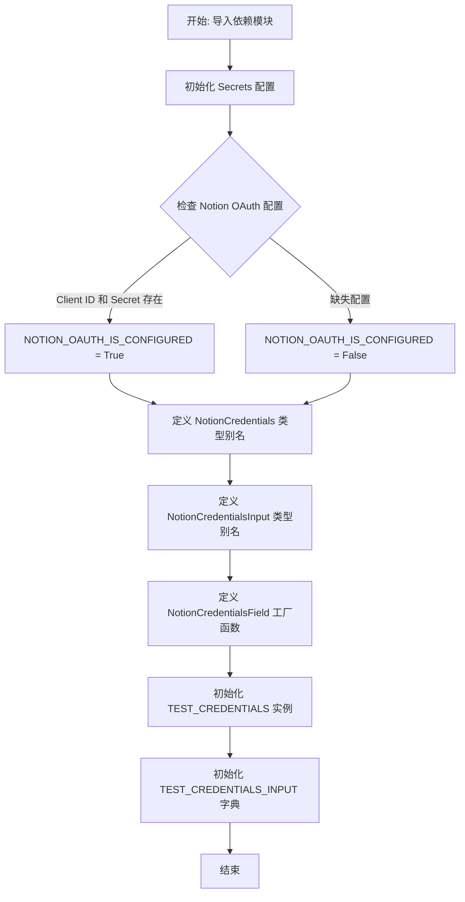
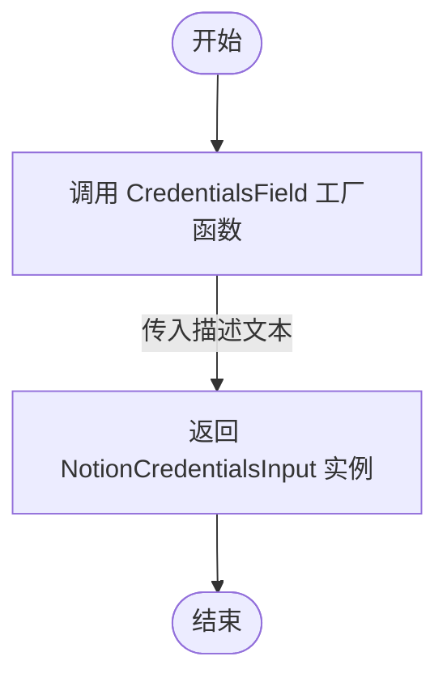

# `AutoGPT\autogpt_platform\backend\backend\blocks\notion\_auth.py` 详细设计文档

该代码主要负责配置和定义 Notion 集成所需的 OAuth2 凭证类型、辅助函数及测试数据。它检查环境配置，定义了凭证类型的别名，提供了用于生成凭证输入字段的工厂函数，并设置了用于测试的模拟凭证数据。

## 整体流程



## 类结构

```
Module: Notion Credentials Configuration
├── Type Aliases (类型别名)
│   ├── NotionCredentials
│   └── NotionCredentialsInput
├── Functions (函数)
│   └── NotionCredentialsField
└── Global Variables (全局变量)
    ├── secrets
    ├── NOTION_OAUTH_IS_CONFIGURED
    ├── TEST_CREDENTIALS
    └── TEST_CREDENTIALS_INPUT
```

## 全局变量及字段


### `secrets`
    
应用程序配置实例，用于加载和管理系统级敏感信息及设置。

类型：`Secrets`
    


### `NOTION_OAUTH_IS_CONFIGURED`
    
布尔标志，指示 Notion OAuth2 客户端 ID 和客户端密钥是否均已正确配置。

类型：`bool`
    


### `NotionCredentials`
    
Notion OAuth2 凭证的类型别名，直接映射至通用的 OAuth2Credentials 类。

类型：`OAuth2Credentials`
    


### `NotionCredentialsInput`
    
Notion 凭证输入的类型别名，特化为 Notion 提供商的 OAuth2 认证元数据输入结构。

类型：`CredentialsMetaInput`
    


### `TEST_CREDENTIALS`
    
用于测试的模拟 OAuth2 凭证实例，包含预设的访问令牌、作用域和用户信息。

类型：`OAuth2Credentials`
    


### `TEST_CREDENTIALS_INPUT`
    
对应测试凭证的输入字典，包含 provider、id、type 和 title 字段，用于模拟输入数据。

类型：`dict`
    


    

## 全局函数及方法


### `NotionCredentialsField`

该函数是一个工厂函数，用于创建并返回一个 Notion OAuth2 认证凭证的输入字段定义，其中包含了连接 Notion 账户所需的描述信息。

参数：

- （无参数）

返回值：`NotionCredentialsInput`，一个 Pydantic 模型实例，专门用于定义 Notion OAuth2 凭证的输入字段结构。

#### 流程图



#### 带注释源码

```python
def NotionCredentialsField() -> NotionCredentialsInput:
    """Creates a Notion OAuth2 credentials field."""
    # 调用 CredentialsField 创建一个凭证字段配置
    # description 参数提供了用户界面中显示的提示信息，指导用户如何正确配置 Notion 集成权限
    return CredentialsField(
        description="Connect your Notion account. Ensure the pages/databases are shared with the integration."
    )
```


## 关键组件


### Notion OAuth2 配置检查

检查 Notion 集成所需的环境变量（客户端 ID 和密钥）是否存在，以确定 OAuth2 认证功能是否已启用。

### Notion 凭证类型定义

定义类型别名 `NotionCredentials` 和 `NotionCredentialsInput`，将通用的 OAuth2 凭证结构具体化到 Notion 提供商，确保类型安全和接口一致性。

### 凭证字段工厂

提供 `NotionCredentialsField` 函数，用于生成包含用户说明的标准化凭证输入字段配置，简化了 UI 表单或配置模式的创建。

### 测试凭证模拟

定义 `TEST_CREDENTIALS` 和 `TEST_CREDENTIALS_INPUT`，为单元测试或开发提供模拟数据，模拟真实的 Notion OAuth2 凭证对象和输入负载。


## 问题及建议


### 已知问题

-   生产/集成模块中包含测试数据：`TEST_CREDENTIALS` 和 `TEST_CREDENTIALS_INPUT` 直接定义在源代码模块中，这会污染模块命名空间，增加不必要的内存占用，并存在在生产环境中误引用测试凭证的风险。
-   静态配置检查：`NOTION_OAUTH_IS_CONFIGURED` 变量在模块加载时计算一次。如果在运行时环境变量发生变化（例如在测试用例中动态修改设置），该变量不会自动更新，导致配置状态滞后。
-   硬编码的 Provider 名称：在 `TEST_CREDENTIALS` 中使用了字符串字面量 `"notion"`，而文件顶部已经显式导入了 `ProviderName.NOTION` 枚举类型，这种不一致降低了代码的健壮性，不利于类型检查和未来重构。

### 优化建议

-   迁移测试数据：将 `TEST_CREDENTIALS` 和 `TEST_CREDENTIALS_INPUT` 移动到专门的测试目录或 `conftest.py` 文件中，利用 Pytest Fixtures 进行管理，保持生产代码的纯净。
-   实现动态配置检查：将 `NOTION_OAUTH_IS_CONFIGURED` 改为一个函数或缓存属性（例如 `def is_notion_oauth_configured() -> bool`），以确保每次调用都能获取最新的配置状态，提高对动态环境的适应性。
-   统一常量引用与去魔法值：在 `TEST_CREDENTIALS` 中使用 `ProviderName.NOTION` 替代字符串；同时，建议将 OAuth scopes 列表（如 `"read_content"` 等）定义为模块级常量（例如 `NOTION_OAUTH_SCOPES`），以便在创建凭证和测试数据时复用，消除魔术字符串。


## 其它


### 设计目标与约束

**设计目标：**
该模块旨在为 Notion 集成提供标准化的 OAuth2 凭证定义和管理。通过封装 Pydantic 模型和工厂函数，确保系统中 Notion 凭证的数据结构一致性、类型安全性和可复用性，同时支持开发环境下的模拟凭证测试。

**约束：**
1. **类型一致性**：所有凭证定义必须继承或符合 `backend.data.model` 中定义的基类（如 `OAuth2Credentials`）。
2. **环境依赖**：实际运行时依赖环境变量 `NOTION_CLIENT_ID` 和 `NOTION_CLIENT_SECRET` 的正确配置，否则集成功能将被禁用。
3. **安全性**：敏感信息（如 `access_token`）必须使用 `pydantic.SecretStr` 进行封装，防止日志泄露。

### 外部依赖与接口契约

**外部依赖：**
1. **Pydantic**: 用于数据验证、序列化和敏感信息处理 (`SecretStr`)。
2. **Backend Internal Modules**:
   - `backend.data.model`: 提供基础凭证模型 `CredentialsField` 和 `OAuth2Credentials`。
   - `backend.integrations.providers`: 提供提供者名称枚举 `ProviderName`。
   - `backend.util.settings`: 提供环境配置管理类 `Secrets`。

**接口契约：**
1. **NotionCredentialsField 函数**:
   - 输入: 无参数。
   - 输出: 必须返回一个 `NotionCredentialsInput` 类型的实例，该实例实际上是一个配置了特定 Notion 描述的 `CredentialsField` 对象。
2. **OAuth2Credentials 结构契约**:
   - 必须包含字段: `id` (UUID), `provider` (str), `access_token` (SecretStr), `title` (str), `scopes` (list), `username` (str)。

### 错误处理与异常设计

1. **配置缺失处理**:
   - 代码初始化时计算 `NOTION_OAUTH_IS_CONFIGURED`。如果 `secrets.notion_client_id` 或 `secrets.notion_client_secret` 为空，该变量为 `False`。系统应根据此标志跳过 Notion 相关功能的初始化，而不是抛出异常，以此实现软降级。
2. **数据验证异常**:
   - 虽然本模块未显式捕获异常，但依赖的 Pydantic 模型（`OAuth2Credentials`）在实例化时会自动执行验证。如果传入的数据类型错误或缺失必填字段，Pydantic 将抛出 `ValidationError`，调用方需处理此类异常。

### 配置管理与初始化

1. **初始化流程**:
   - 模块加载时立即实例化 `Secrets()` 对象。
   - 根据 `Secrets` 中的属性立即计算 `NOTION_OAUTH_IS_CONFIGURED` 布尔值，该值在整个模块生命周期内作为全局状态存在。
2. **测试数据配置**:
   - 提供了硬编码的 `TEST_CREDENTIALS` 和 `TEST_CREDENTIALS_INPUT`，用于单元测试或开发环境模拟，避免在测试阶段连接真实的 Notion OAuth2 服务。

    