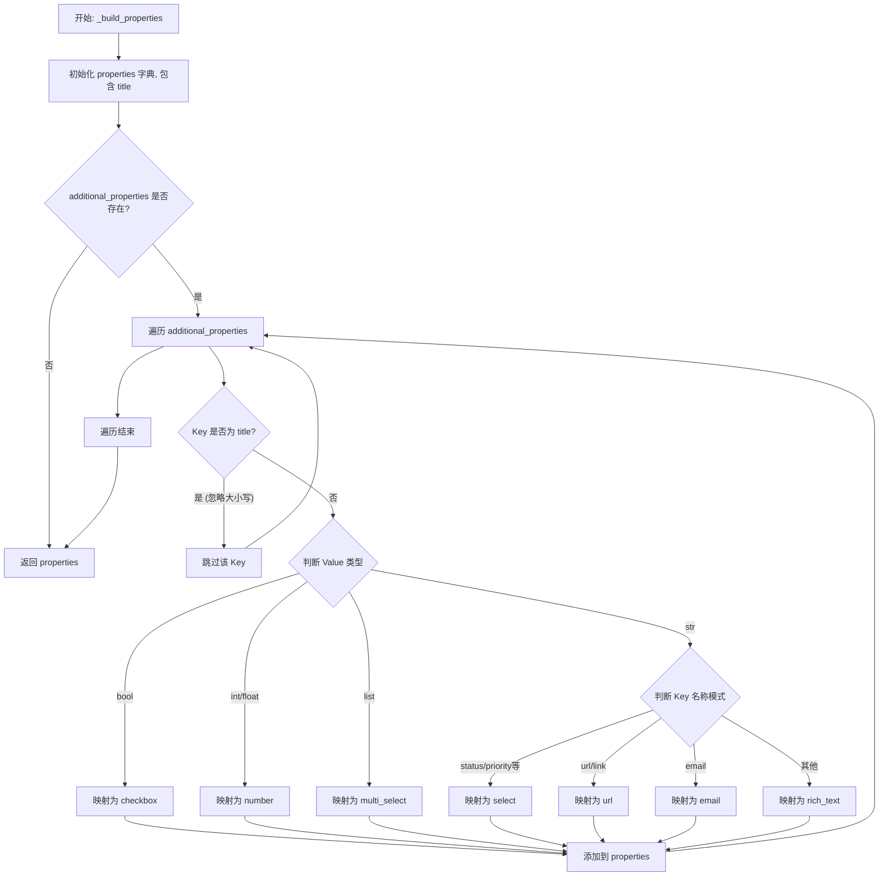
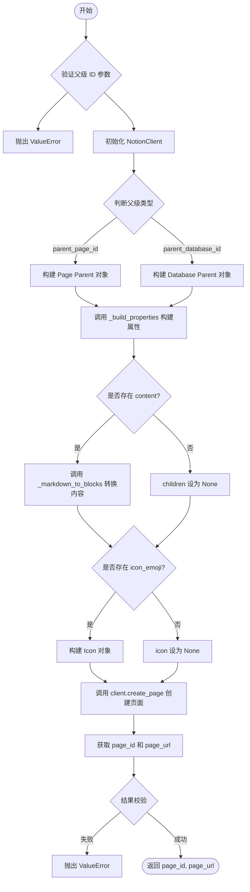
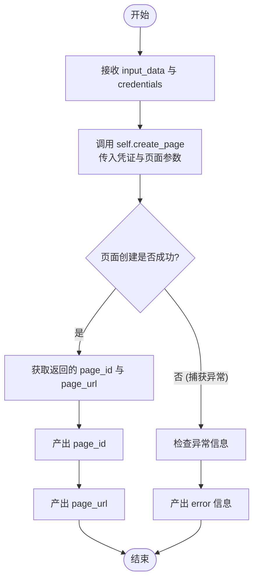
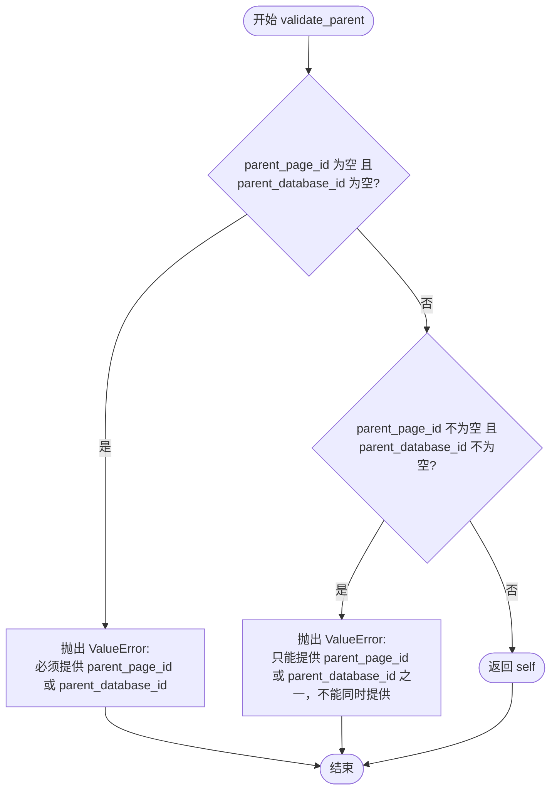

# `AutoGPT\autogpt_platform\backend\backend\blocks\notion\create_page.py` 详细设计文档

该代码定义了一个 NotionCreatePageBlock 类，用于集成 Notion API 创建新页面，支持 OAuth2 认证、Markdown 转 Notion 块、自定义属性映射以及灵活的父级（页面或数据库）关联。

## 整体流程

```mermaid
graph TD
    A[开始: run 方法接收输入] --> B[验证 Input 数据]
    B -->|验证失败| C[返回错误信息]
    B -->|验证成功| D[调用 create_page 静态方法]
    D --> E{输入包含 content?}
    E -->|是| F[调用 _markdown_to_blocks 转换内容]
    E -->|否| G[children 设为 None]
    F --> H[调用 _build_properties 构建属性]
    G --> H
    H --> I[构建 Icon 对象 (可选)]
    I --> J[初始化 NotionClient]
    J --> K[调用 client.create_page API]
    K --> L{API 调用成功?}
    L -->|否| M[抛出 ValueError 异常]
    M --> N[捕获异常并返回错误]
    L -->|是| O[获取 page_id 和 page_url]
    O --> P[生成输出: page_id, page_url]
```

## 类结构

```
NotionCreatePageBlock (继承自 Block)
├── Input (内部类, 继承自 BlockSchemaInput)
│   ├── credentials
│   ├── parent_page_id
│   ├── parent_database_id
│   ├── title
│   ├── content
│   ├── properties
│   ├── icon_emoji
│   └── validate_parent (方法)
└── Output (内部类, 继承自 BlockSchemaOutput)
    ├── page_id
    └── page_url
```

## 全局变量及字段


### `NOTION_OAUTH_IS_CONFIGURED`
    
Flag indicating whether the Notion OAuth2 integration is properly configured and enabled.

类型：`bool`
    


### `TEST_CREDENTIALS`
    
Valid OAuth2 credentials object used for testing the block's functionality.

类型：`OAuth2Credentials`
    


### `TEST_CREDENTIALS_INPUT`
    
Dictionary representing the input credentials structure used for test cases.

类型：`Dict[str, Any]`
    


### `NotionCredentialsField`
    
Factory function or class used to generate the schema field for Notion credentials.

类型：`Callable`
    


### `NotionCredentialsInput`
    
Class type defining the input schema structure for Notion credentials.

类型：`Type`
    


### `NotionCreatePageBlock.Input.credentials`
    
Authentication credentials required to access the Notion API.

类型：`NotionCredentialsInput`
    


### `NotionCreatePageBlock.Input.parent_page_id`
    
The ID of the parent page under which the new page will be created.

类型：`Optional[str]`
    


### `NotionCreatePageBlock.Input.parent_database_id`
    
The ID of the parent database in which the new page will be created.

类型：`Optional[str]`
    


### `NotionCreatePageBlock.Input.title`
    
The title text for the new Notion page.

类型：`str`
    


### `NotionCreatePageBlock.Input.content`
    
The body content for the page, supporting plain text or Markdown format.

类型：`Optional[str]`
    


### `NotionCreatePageBlock.Input.properties`
    
Additional metadata properties for the page, typically used when adding to a database.

类型：`Optional[Dict[str, Any]]`
    


### `NotionCreatePageBlock.Input.icon_emoji`
    
An emoji string to set as the icon for the new page.

类型：`Optional[str]`
    


### `NotionCreatePageBlock.Output.page_id`
    
The unique identifier of the newly created Notion page.

类型：`str`
    


### `NotionCreatePageBlock.Output.page_url`
    
The full URL pointing to the newly created Notion page.

类型：`str`
    
    

## 全局函数及方法


### `NotionCreatePageBlock.__init__`

初始化 NotionCreatePageBlock 实例，配置块的元数据、输入输出模式、分类、测试数据以及模拟行为。

参数：

-  `self`：`NotionCreatePageBlock`，类的实例本身。

返回值：`None`，无返回值。

#### 流程图

```mermaid
flowchart TD
    A[开始: __init__] --> B[调用父类 Block 的 __init__ 方法]
    B --> C[传递块配置参数]
    C --> C1[id: c15febe0-66ce-4c6f-aebd-5ab351653804]
    C --> C2[description: Create a new page in Notion...]
    C --> C3[categories: {BlockCategory.PRODUCTIVITY}]
    C --> C4[input_schema: NotionCreatePageBlock.Input]
    C --> C5[output_schema: NotionCreatePageBlock.Output]
    C --> C6[disabled: not NOTION_OAUTH_IS_CONFIGURED]
    C --> C7[test_input: 测试输入字典]
    C --> C8[test_output: 预期输出列表]
    C --> C9[test_credentials: 测试凭证]
    C --> C10[test_mock: 模拟函数字典]
    C --> D[结束: 初始化完成]
```

#### 带注释源码

```python
def __init__(self):
    super().__init__(
        # 定义块的唯一标识符
        id="c15febe0-66ce-4c6f-aebd-5ab351653804",
        # 描述块的功能，说明需要父页面ID或数据库ID，并支持Markdown
        description="Create a new page in Notion. Requires EITHER a parent_page_id OR parent_database_id. Supports markdown content.",
        # 将块归类为生产力工具类别
        categories={BlockCategory.PRODUCTIVITY},
        # 指定输入数据的Schema结构，使用内部定义的Input类
        input_schema=NotionCreatePageBlock.Input,
        # 指定输出数据的Schema结构，使用内部定义的Output类
        output_schema=NotionCreatePageBlock.Output,
        # 根据Notion OAuth是否配置来决定是否禁用该块
        disabled=not NOTION_OAUTH_IS_CONFIGURED,
        # 定义用于测试的输入数据
        test_input={
            "parent_page_id": "00000000-0000-0000-0000-000000000000",
            "title": "Test Page",
            "content": "This is test content.",
            "credentials": TEST_CREDENTIALS_INPUT,
        },
        # 定义预期的测试输出结果
        test_output=[
            ("page_id", "12345678-1234-1234-1234-123456789012"),
            (
                "page_url",
                "https://notion.so/Test-Page-12345678123412341234123456789012",
            ),
        ],
        # 传入测试凭证
        test_credentials=TEST_CREDENTIALS,
        # 定义模拟行为，当运行测试时使用lambda函数模拟create_page的返回
        test_mock={
            "create_page": lambda *args, **kwargs: (
                "12345678-1234-1234-1234-123456789012",
                "https://notion.so/Test-Page-12345678123412341234123456789012",
            )
        },
    )
```


### `NotionCreatePageBlock._markdown_to_blocks`

将 Markdown 格式的字符串内容转换为 Notion API 兼容的块对象列表。该方法解析常见的 Markdown 语法（如标题、列表、代码块、引用等），并将其映射为相应的 Notion Block 结构。

参数：

-   `content`：`str`，包含 Markdown 格式文本的字符串，用于转换成 Notion 页面内容。

返回值：`List[dict]`，表示 Notion 块结构的字典列表，每个字典对应一个 Notion 块类型（如 heading_1, paragraph 等）。

#### 流程图

```mermaid
graph TD
    A[开始] --> B{content 是否为空?}
    B -- 是 --> C[返回空列表 []]
    B -- 否 --> D[将 content 按换行符分割为 lines]
    D --> E[初始化 blocks 列表, 索引 i=0]
    E --> F{i < len(lines)?}
    F -- 否 --> L[返回 blocks]
    F -- 是 --> G[获取当前行 line]
    G --> H{line 是否为空行?}
    H -- 是 --> I[i += 1, 继续下一轮循环]
    H -- 否 --> J{匹配 Markdown 语法类型}
    
    J -- '### ' --> K1[生成 heading_3 块]
    J -- '## ' --> K2[生成 heading_2 块]
    J -- '# ' --> K3[生成 heading_1 块]
    J -- '- ' (strip) --> K4[生成 bulleted_list_item 块]
    J -- 数字+ '. ' --> K5[生成 numbered_list_item 块]
    J -- '```' --> K6[解析多行代码块并生成 code 块]
    J -- '> ' (strip) --> K7[生成 quote 块]
    J -- '---'/'***'/'___' --> K8[生成 divider 块]
    J -- 其它 --> K9[生成 paragraph 块]

    K1 & K2 & K3 & K4 & K5 & K7 & K8 & K9 --> M[i += 1]
    K6 --> N[i += 1 (代码块逻辑内部已处理索引)]
    M & N --> F
```

#### 带注释源码

```python
    @staticmethod
    def _markdown_to_blocks(content: str) -> List[dict]:
        """Convert markdown content to Notion block objects."""
        # 如果输入内容为空，直接返回空列表
        if not content:
            return []

        blocks = []
        lines = content.split("\n")
        i = 0

        # 遍历每一行进行处理
        while i < len(lines):
            line = lines[i]

            # 跳过空行
            if not line.strip():
                i += 1
                continue

            # 处理三级标题 (###)
            if line.startswith("### "):
                blocks.append(
                    {
                        "type": "heading_3",
                        "heading_3": {
                            "rich_text": [
                                {"type": "text", "text": {"content": line[4:].strip()}}
                            ]
                        },
                    }
                )
            # 处理二级标题 (##)
            elif line.startswith("## "):
                blocks.append(
                    {
                        "type": "heading_2",
                        "heading_2": {
                            "rich_text": [
                                {"type": "text", "text": {"content": line[3:].strip()}}
                            ]
                        },
                    }
                )
            # 处理一级标题 (#)
            elif line.startswith("# "):
                blocks.append(
                    {
                        "type": "heading_1",
                        "heading_1": {
                            "rich_text": [
                                {"type": "text", "text": {"content": line[2:].strip()}}
                            ]
                        },
                    }
                )
            # 处理无序列表 (-)
            elif line.strip().startswith("- "):
                blocks.append(
                    {
                        "type": "bulleted_list_item",
                        "bulleted_list_item": {
                            "rich_text": [
                                {
                                    "type": "text",
                                    "text": {"content": line.strip()[2:].strip()},
                                }
                            ]
                        },
                    }
                )
            # 处理有序列表 (1. )
            elif line.strip() and line.strip()[0].isdigit() and ". " in line:
                content_start = line.find(". ") + 2
                blocks.append(
                    {
                        "type": "numbered_list_item",
                        "numbered_list_item": {
                            "rich_text": [
                                {
                                    "type": "text",
                                    "text": {"content": line[content_start:].strip()},
                                }
                            ]
                        },
                    }
                )
            # 处理代码块 (```)
            elif line.strip().startswith("```"):
                code_lines = []
                # 提取语言类型，默认为 plain text
                language = line[3:].strip() or "plain text"
                i += 1
                # 循环读取直到遇到结束的 ```
                while i < len(lines) and not lines[i].strip().startswith("```"):
                    code_lines.append(lines[i])
                    i += 1
                blocks.append(
                    {
                        "type": "code",
                        "code": {
                            "rich_text": [
                                {
                                    "type": "text",
                                    "text": {"content": "\n".join(code_lines)},
                                }
                            ],
                            "language": language,
                        },
                    }
                )
            # 处理引用 (>)
            elif line.strip().startswith("> "):
                blocks.append(
                    {
                        "type": "quote",
                        "quote": {
                            "rich_text": [
                                {
                                    "type": "text",
                                    "text": {"content": line.strip()[2:].strip()},
                                }
                            ]
                        },
                    }
                )
            # 处理分割线 (---, ***, ___)
            elif line.strip() in ["---", "***", "___"]:
                blocks.append({"type": "divider", "divider": {}})
            # 处理普通段落
            else:
                text_content = line.strip()
                rich_text = []

                # 简单的 Markdown 格式解析（目前仅作为占位，未完全实现加粗/斜体）
                if "**" in text_content or "*" in text_content:
                    # 这里目前仅作为纯文本处理，完整实现需要解析注解
                    rich_text = [{"type": "text", "text": {"content": text_content}}]
                else:
                    rich_text = [{"type": "text", "text": {"content": text_content}}]

                blocks.append(
                    {"type": "paragraph", "paragraph": {"rich_text": rich_text}}
                )

            i += 1

        return blocks
```


### `NotionCreatePageBlock._build_properties`

构建用于 Notion 页面创建的属性对象。该方法将核心标题和附加属性的字典转换为 Notion API 所需的格式，并根据值的类型和键名自动推断并映射到对应的 Notion 属性类型（如 checkbox, number, select, rich_text 等）。

参数：

-  `title`：`str`，新 Notion 页面的标题。
-  `additional_properties`：`Optional[Dict[str, Any]]`，可选的额外属性字典（例如数据库列），将被映射到特定的 Notion 属性类型。默认为 `None`。

返回值：`Dict[str, Any]`，符合 Notion API 规范的页面属性字典。

#### 流程图



#### 带注释源码

```python
    @staticmethod
    def _build_properties(
        title: str, additional_properties: Optional[Dict[str, Any]] = None
    ) -> Dict[str, Any]:
        """Build properties object for page creation."""
        # 初始化基础属性字典，包含 Notion 标准的 title 字段结构
        properties: Dict[str, Any] = {
            "title": {"title": [{"type": "text", "text": {"content": title}}]}
        }

        # 如果提供了额外属性，则进行遍历处理
        if additional_properties:
            for key, value in additional_properties.items():
                # 如果键名为 title（忽略大小写），则跳过，因为标题已经处理过了
                if key.lower() == "title":
                    continue  # Skip title as we already have it

                # 根据值的类型智能映射到 Notion 属性类型
                if isinstance(value, bool):
                    # 布尔值映射为 checkbox
                    properties[key] = {"checkbox": value}
                elif isinstance(value, (int, float)):
                    # 数字映射为 number
                    properties[key] = {"number": value}
                elif isinstance(value, list):
                    # 列表映射为 multi_select（多选）
                    properties[key] = {
                        "multi_select": [{"name": str(item)} for item in value]
                    }
                elif isinstance(value, str):
                    # 字符串类型根据键名或内容进行启发式映射
                    # Could be select, rich_text, or other types
                    # For simplicity, try common patterns
                    if key.lower() in ["status", "priority", "type", "category"]:
                        # 常见的枚举状态字段映射为 select
                        properties[key] = {"select": {"name": value}}
                    elif key.lower() in ["url", "link"]:
                        # 链接字段映射为 url
                        properties[key] = {"url": value}
                    elif key.lower() in ["email"]:
                        # 邮箱字段映射为 email
                        properties[key] = {"email": value}
                    else:
                        # 默认文本映射为 rich_text
                        properties[key] = {
                            "rich_text": [{"type": "text", "text": {"content": value}}]
                        }

        return properties
```


### `NotionCreatePageBlock.create_page`

异步静态方法，用于在 Notion 中创建一个新页面。该方法处理父级位置的验证（页面或数据库）、属性的构建、Markdown 内容到 Notion 块的转换，以及页面图标（emoji）的设置，最终通过 API 客户端完成创建并返回页面的 ID 和 URL。

参数：

- `credentials`：`OAuth2Credentials`，用于认证和授权 Notion API 访问的凭证对象。
- `title`：`str`，新创建页面的标题内容。
- `parent_page_id`：`Optional[str]`，父页面的 ID。如果提供，新页面将创建在此页面下。与 `parent_database_id` 互斥。
- `parent_database_id`：`Optional[str]`，父数据库的 ID。如果提供，新页面将创建在此数据库中。与 `parent_page_id` 互斥。
- `content`：`Optional[str]`，页面的正文内容，支持 Markdown 格式，将被转换为 Notion 的 block 结构。
- `properties`：`Optional[Dict[str, Any]]`，附加的页面属性，通常用于数据库页面（如状态、优先级等字段）。
- `icon_emoji`：`Optional[str]`，用于设置页面图标的 Emoji 字符串。

返回值：`tuple[str, str]`，包含两个元素的元组，第一个元素是创建的页面 ID，第二个元素是页面的访问 URL。

#### 流程图



#### 带注释源码

```python
    @staticmethod
    async def create_page(
        credentials: OAuth2Credentials,
        title: str,
        parent_page_id: Optional[str] = None,
        parent_database_id: Optional[str] = None,
        content: Optional[str] = None,
        properties: Optional[Dict[str, Any]] = None,
        icon_emoji: Optional[str] = None,
    ) -> tuple[str, str]:
        """
        Create a new Notion page.

        Returns:
            Tuple of (page_id, page_url)
        """
        # 校验：必须提供且仅能提供一种父级 ID
        if not parent_page_id and not parent_database_id:
            raise ValueError(
                "Either parent_page_id or parent_database_id must be provided"
            )
        if parent_page_id and parent_database_id:
            raise ValueError(
                "Only one of parent_page_id or parent_database_id should be provided, not both"
            )

        # 初始化 Notion 客户端
        client = NotionClient(credentials)

        # 构建父级对象，确定页面创建的位置
        if parent_page_id:
            parent = {"type": "page_id", "page_id": parent_page_id}
        else:
            parent = {"type": "database_id", "database_id": parent_database_id}

        # 构建页面属性对象（包含标题和其他元数据）
        page_properties = NotionCreatePageBlock._build_properties(title, properties)

        # 如果提供了内容，将 Markdown 文本转换为 Notion 的 Block 结构
        children = None
        if content:
            children = NotionCreatePageBlock._markdown_to_blocks(content)

        # 如果提供了 Emoji，构建图标对象
        icon = None
        if icon_emoji:
            icon = {"type": "emoji", "emoji": icon_emoji}

        # 调用客户端接口执行创建操作
        result = await client.create_page(
            parent=parent, properties=page_properties, children=children, icon=icon
        )

        # 从响应结果中提取 ID 和 URL
        page_id = result.get("id", "")
        page_url = result.get("url", "")

        # 确保必要字段已返回，否则抛出异常
        if not page_id or not page_url:
            raise ValueError("Failed to get page ID or URL from Notion response")

        return page_id, page_url
```


### `NotionCreatePageBlock.run`

执行 Notion 页面创建的核心逻辑。该方法接收包含页面配置的输入数据和 OAuth2 凭证，通过调用 `create_page` 方法与 Notion API 进行交互，以生成新页面的 ID 和 URL。方法内部包含异常捕获机制，确保在操作失败时能够返回错误信息。

参数：

-  `input_data`：`Input`，包含新页面配置的输入数据对象，涵盖标题、父节点ID、内容、属性和图标表情等。
-  `credentials`：`OAuth2Credentials`，用于 Notion API 身份验证的 OAuth2 凭证对象。
-  `**kwargs`：`Any`，额外的关键字参数（通常由框架传递，用于上下文或扩展）。

返回值：`BlockOutput`，一个异步生成器。成功时产出 ("page_id", str) 和 ("page_url", str) 元组；失败时产出 ("error", str) 元组。

#### 流程图



#### 带注释源码

```python
    async def run(
        self,
        input_data: Input,
        *,
        credentials: OAuth2Credentials,
        **kwargs,
    ) -> BlockOutput:
        try:
            # 调用静态方法 create_page 执行实际的 API 请求
            # 传入 credentials 和从 input_data 中提取的具体参数
            page_id, page_url = await self.create_page(
                credentials,
                input_data.title,
                input_data.parent_page_id,
                input_data.parent_database_id,
                input_data.content,
                input_data.properties,
                input_data.icon_emoji,
            )
            # 成功创建页面后，产出 page_id
            yield "page_id", page_id
            # 产出 page_url
            yield "page_url", page_url
        except Exception as e:
            # 捕获过程中的任何异常
            # 产出错误信息，如果异常信息为空则使用 "Unknown error"
            yield "error", str(e) if str(e) else "Unknown error"
```


### `NotionCreatePageBlock.Input.validate_parent`

确保父页面ID（`parent_page_id`）或父数据库ID（`parent_database_id`）有且仅有一个被提供，以保证新建页面时有唯一的父级位置。

参数：

- `self`: `NotionCreatePageBlock.Input`，Pydantic 模型实例，包含当前输入字段的值。

返回值：`NotionCreatePageBlock.Input`，验证通过的模型实例。

#### 流程图



#### 带注释源码

```python
@model_validator(mode="after")
def validate_parent(self):
    """Ensure either parent_page_id or parent_database_id is provided."""
    # 检查是否两个父ID都未提供，如果是则报错
    if not self.parent_page_id and not self.parent_database_id:
        raise ValueError(
            "Either parent_page_id or parent_database_id must be provided"
        )
    # 检查是否两个父ID都同时提供了，如果是则报错（因为只能有一个父级）
    if self.parent_page_id and self.parent_database_id:
        raise ValueError(
            "Only one of parent_page_id or parent_database_id should be provided, not both"
        )
    # 验证通过，返回当前实例
    return self
```


## 关键组件


### Markdown 转换逻辑

负责将输入的 Markdown 格式文本解析并转换为 Notion API 所需的块结构列表，支持标题、列表、代码块、引用、分割线及段落等多种语法元素的转换。

### 属性构建逻辑

负责将用户提供的标题及附加属性字典智能映射为 Notion 页面属性对象，能够根据值的类型（布尔、数字、列表、字符串等）自动推断并设置对应的 Notion 属性类型。

### 输入校验逻辑

基于 Pydantic 模型的验证组件，通过 `model_validator` 确保输入参数的合法性，特别是强制执行父页面 ID 和父数据库 ID 的互斥与必填校验规则。

### 页面创建流程

核心业务编排组件，负责协调整个页面的创建过程，包括组装父对象引用、调用属性构建器、转换内容块、设置图标，并通过 NotionClient 异步执行实际的 API 请求。


## 问题及建议


### 已知问题

-   **Markdown 解析逻辑过于简陋**：`_markdown_to_blocks` 方法采用简单的正则匹配和行遍历，无法处理嵌套列表、复杂的内联格式（如加粗、斜体混合）或多行代码块中的特殊字符，容易导致转换后的 Notion 内容格式错误或丢失。
-   **属性类型推断存在风险**：`_build_properties` 方法基于字段名称（如 "status", "url"）猜测 Notion 属性类型。如果用户的数据库中同名字段的实际类型与推断不符（例如名为 "status" 的字段实际上是 "rich_text"），会导致 API 调用失败。
-   **辅助函数复用性差**：Markdown 转块和属性构建逻辑作为静态方法耦合在 Block 类中，无法被其他可能涉及 Notion 交互的 Block（如更新页面）复用。
-   **异常捕获粒度粗糙**：`run` 方法中的 `try...except` 捕获了所有异常并仅返回字符串信息，这使得调用方难以区分是认证错误、网络错误还是参数校验错误，不利于错误重试或监控。
-   **代码块解析逻辑存在隐患**：虽然目前代码能处理缺失结束标记的情况（直到文件末尾），但逻辑较为原始，对于代码块内部包含 ``` 标记的情况无法正确处理。

### 优化建议

-   **引入成熟的 Markdown 解析库**：建议使用 `markdown-it-py` 或专用的 `markdown-to-notion` 库替代自定义解析逻辑，以支持完整的 Markdown 语法标准和嵌套结构。
-   **提取转换逻辑至独立工具类或 Client**：将 `_markdown_to_blocks` 和 `_build_properties` 方法迁移到 `NotionClient` 或新建的 `NotionUtils` 模块中，提高代码的模块化程度和复用率。
-   **优化属性定义的数据结构**：建议修改 `Input` 中的 `properties` 定义，支持显式指定类型，例如接受 `{"Name": {"type": "text", "content": "..."}}` 的格式，或提供更严格的 Schema 校验，避免基于名称的猜测。
-   **细化错误处理机制**：在 `run` 方法中区分捕获特定异常（如 `ValueError`, `ConnectionError`, Notion API 异常），并输出标准化的错误码或更详细的上下文信息，便于后续的日志分析和故障排查。
-   **增加单元测试覆盖**：由于 `_markdown_to_blocks` 包含复杂的分支逻辑，建议针对各种 Markdown 边界情况（空行、嵌套列表、特殊符号）补充单元测试，确保解析器的健壮性。


## 其它


### 设计目标与约束

**设计目标：**
1. **功能封装**：提供一个标准化的 Block 接口，将 Notion API 的页面创建功能封装为系统内可复用的组件。
2. **数据转换**：将通用的 Markdown 文本自动转换为 Notion 特有的 Block 结构，降低用户构建复杂页面结构的门槛。
3. **属性映射**：通过启发式算法自动推断属性类型，简化数据库页面属性的定义过程。

**约束条件：**
1. **Markdown 支持限制**：Markdown 解析器基于简单的字符串行处理，仅支持基础的标题、列表、代码块、引用和分割线。不支持复杂的嵌套列表、行内格式（如加粗、斜体、链接）解析，此类内容将被作为纯文本处理。
2. **属性映射的不确定性**：属性类型的映射依赖于键名（如 "status" 映射为 Select）和值的 Python 类型。如果 Notion 数据库定义的属性类型与推断不符，或存在未覆盖的自定义类型，页面创建可能会失败。
3. **互斥父级限制**：必须且只能提供 `parent_page_id` 或 `parent_database_id` 其中之一，不允许同时提供或同时缺失。
4. **认证依赖**：Block 的启用状态依赖于 `NOTION_OAUTH_IS_CONFIGURED` 标志，且运行时必须提供有效的 `OAuth2Credentials`。

### 错误处理与异常设计

1. **输入验证（Schema 层面）：**
   - 利用 Pydantic 的 `model_validator` 在数据进入业务逻辑前进行校验。
   - **互斥性校验**：如果同时提供 `parent_page_id` 和 `parent_database_id`，或两者皆未提供，抛出 `ValueError`。

2. **逻辑校验（业务层面）：**
   - 在 `create_page` 静态方法中，对父级参数进行二次确认，确保逻辑健壮性。
   - **API 响应校验**：调用 Notion API 后，检查返回结果中的 `id` 和 `url` 字段。如果缺失，抛出 `ValueError`，防止返回无效数据。

3. **运行时异常捕获（Block 层面）：**
   - 在 `run` 方法中使用 `try-except` 块包裹核心逻辑。
   - **异常传播**：捕获所有异常（包括网络错误、验证错误、API 错误），将其转换为字符串形式，通过 `yield "error", str(e)` 输出。这种设计确保了 Block 执行失败不会导致整个工作流崩溃，而是将错误信息作为数据流的一部分传递给下游处理。

### 数据流与状态机

1. **数据流向：**
   - **输入阶段**：接收包含凭证、父级 ID、标题、内容、属性等的 `Input` 对象。
   - **验证阶段**：通过 Pydantic Schema 验证输入数据的完整性和合法性。
   - **转换阶段**：
     - 内容流：`content` (Markdown) -> `_markdown_to_blocks` -> `children` (Notion Block List)。
     - 属性流：`properties` (Dict) -> `_build_properties` -> `page_properties` (Notion API Schema)。
   - **执行阶段**：构建 `parent`、`icon` 对象，调用 `NotionClient.create_page` 发起 HTTP 请求。
   - **输出阶段**：解析 API 响应，提取 `page_id` 和 `page_url`，通过生成器产出结果。

2. **状态机：**
   - **Idle (初始状态)**：Block 实例化完成，等待输入。
   - **Validating (验证中)**：检查输入参数是否符合模型定义。
   - **Processing (处理中)**：执行 Markdown 解析和属性构建逻辑。
   - **Calling (API 请求中)**：等待 Notion API 响应。
   - **Success (成功)**：产出 `page_id` 和 `page_url`。
   - **Error (错误)**：产出 `error` 信息。

### 外部依赖与接口契约

1. **外部库依赖：**
   - `pydantic`：用于数据模型定义、验证和序列化（特别是 `model_validator` 和 `BaseModel`）。
   - `typing`：用于类型注解，增强代码可读性和静态检查能力。

2. **内部模块依赖：**
   - `backend.data.block`：依赖 `Block` 基类、`BlockOutput` 类型以及相关的 Schema 类。
   - `backend.data.model`：依赖 `OAuth2Credentials` 进行身份认证，依赖 `SchemaField` 定义元数据。
   - `._api`：依赖 `NotionClient` 类作为与 Notion 服务交互的实际客户端。
   - `._auth`：依赖 OAuth 配置检查 (`NOTION_OAUTH_IS_CONFIGURED`) 和凭证字段定义。

3. **接口契约：**
   - **NotionClient 契约**：
     - `create_page(parent, properties, children, icon)` 方法必须被实现。
     - 必须返回一个字典，其中包含键 `"id"` (字符串 UUID) 和 `"url"` (字符串 URL)。
   - **Block 接口契约**：
     - 必须实现 `run(self, input_data: Input, *, credentials: OAuth2Credentials, **kwargs) -> BlockOutput` 方法。
     - `run` 方法必须是一个异步生成器，用于产出 `(key, value)` 对。
   - **输入契约**：
     - `credentials` 必须是有效的 Notion OAuth2 令牌。
     - `parent_page_id` 或 `parent_database_id` 必须指向实际存在的 Notion 资源。

    