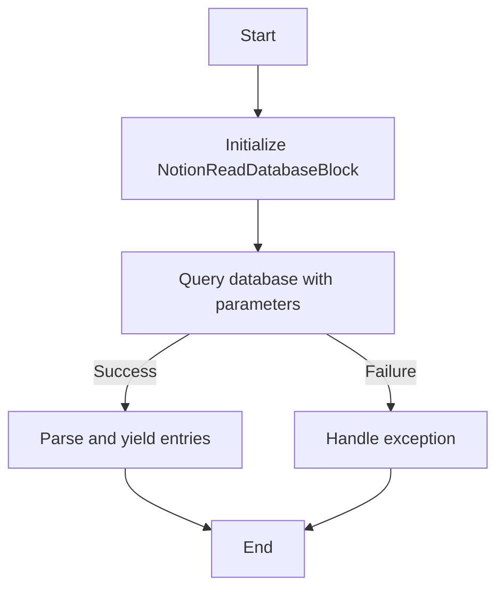
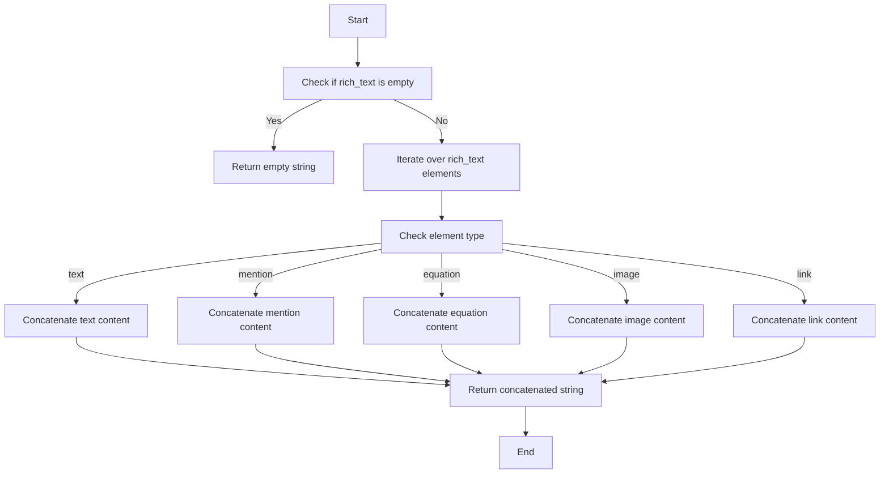
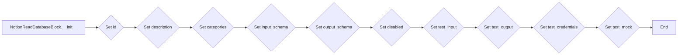
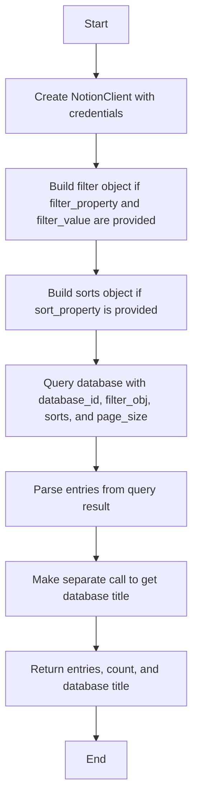
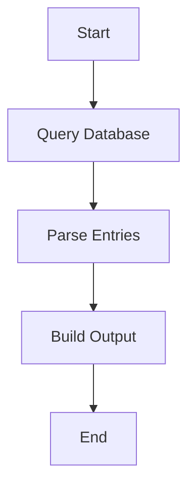

```mermaid
graph TD
    A[Start] --> B[Check prop_type]
    B -->|title| C[Parse as rich_text]
    B -->|rich_text| C
    B -->|number| D[Return number]
    B -->|select| E[Return select.name]
    B -->|multi_select| F[Return list of item.name]
    B -->|date| G[Return date.start]
    B -->|checkbox| H[Return checkbox.value]
    B -->|url| I[Return url]
    B -->|email| J[Return email]
    B -->|phone_number| K[Return phone_number]
    B -->|people| L[Return list of person.name or id]
    B -->|files| M[Return list of file.name or url]
    B -->|relation| N[Return list of rel.id]
    B -->|formula| O[Return formula.value]
    B -->|rollup| P[Return rollup.value]
    B -->|created_time| Q[Return created_time]
    B -->|created_by| R[Return created_by.name or id]
    B -->|last_edited_time| S[Return last_edited_time]
    B -->|last_edited_by| T[Return last_edited_by.name or id]
    B -->|unknown| U[Return raw prop value]
    U --> B1[End]
    C --> B1
    D --> B1
    E --> B1
    F --> B1
    G --> B1
    H --> B1
    I --> B1
    J --> B1
    K --> B1
    L --> B1
    M --> B1
    N --> B1
    O --> B1
    P --> B1
    Q --> B1
    R --> B1
    S --> B1
    T --> B1
```

# `.\AutoGPT\autogpt_platform\backend\backend\blocks\notion\read_database.py` 详细设计文档

The NotionReadDatabaseBlock class queries a Notion database, retrieves entries with their properties, and provides filtering, sorting, and pagination capabilities.

## 整体流程



## 类结构

```
NotionReadDatabaseBlock (Concrete Class)
├── Input (Nested Class)
│   ├── credentials (NotionCredentialsInput)
│   ├── database_id (str)
│   ├── filter_property (Optional[str])
│   ├── filter_value (Optional[str])
│   ├── sort_property (Optional[str])
│   ├── sort_direction (Optional[str])
│   └── limit (int)
├── Output (Nested Class)
│   ├── entries (List[Dict[str, Any]])
│   ├── entry (Dict[str, Any])
│   ├── entry_ids (List[str])
│   ├── entry_id (str)
│   ├── count (int)
│   └── database_title (str)
└── _parse_property_value (staticmethod)
    ├── prop (dict)
    └── prop_type (str)
└── _build_filter (staticmethod)
    ├── property_name (str)
    └── value (str)
└── query_database (staticmethod)
    ├── credentials (OAuth2Credentials)
    ├── database_id (str)
    ├── filter_property (Optional[str])
    ├── filter_value (Optional[str])
    ├── sort_property (Optional[str])
    ├── sort_direction (str)
    └── limit (int)
└── run (async method)
    ├── input_data (Input)
    ├── credentials (OAuth2Credentials)
    └── kwargs (Dict[str, Any])
```

## 全局变量及字段


### `NOTION_OAUTH_IS_CONFIGURED`
    
Flag indicating if OAuth2 credentials are configured for Notion integration.

类型：`bool`
    


### `TEST_CREDENTIALS`
    
Test OAuth2 credentials for Notion integration.

类型：`OAuth2Credentials`
    


### `TEST_CREDENTIALS_INPUT`
    
Test input for Notion credentials.

类型：`NotionCredentialsInput`
    


### `NotionCredentialsField`
    
Field type for Notion credentials in schema.

类型：`SchemaField`
    


### `NotionCredentialsInput`
    
Input type for Notion credentials.

类型：`NotionCredentialsInput`
    


### `Input`
    
Input schema for NotionReadDatabaseBlock.

类型：`BlockSchemaInput`
    


### `Output`
    
Output schema for NotionReadDatabaseBlock.

类型：`BlockSchemaOutput`
    


### `Block`
    
Base class for NotionReadDatabaseBlock.

类型：`Block`
    


### `BlockCategory`
    
Enum for block categories.

类型：`BlockCategory`
    


### `BlockOutput`
    
Base class for block outputs.

类型：`BlockOutput`
    


### `BlockSchemaInput`
    
Base class for block input schemas.

类型：`BlockSchemaInput`
    


### `BlockSchemaOutput`
    
Base class for block output schemas.

类型：`BlockSchemaOutput`
    


### `OAuth2Credentials`
    
OAuth2 credentials class.

类型：`OAuth2Credentials`
    


### `SchemaField`
    
Schema field class.

类型：`SchemaField`
    


### `NotionClient`
    
Client for interacting with Notion API.

类型：`NotionClient`
    


### `parse_rich_text`
    
Function to parse rich text from Notion.

类型：`function`
    


### `NotionCredentialsField`
    
Field type for Notion credentials in schema.

类型：`SchemaField`
    


### `NotionCredentialsInput`
    
Input type for Notion credentials.

类型：`NotionCredentialsInput`
    


### `query_database`
    
Function to query Notion database.

类型：`function`
    


### `run`
    
Async function to run NotionReadDatabaseBlock.

类型：`async function`
    


### `NotionReadDatabaseBlock`
    
Class to read Notion database entries.

类型：`NotionReadDatabaseBlock`
    


### `_parse_property_value`
    
Static method to parse Notion property values.

类型：`staticmethod`
    


### `_build_filter`
    
Static method to build a filter for Notion database query.

类型：`staticmethod`
    


### `query_database`
    
Static method to query Notion database.

类型：`staticmethod`
    


### `run`
    
Async method to run NotionReadDatabaseBlock.

类型：`async method`
    


### `NotionReadDatabaseBlock.id`
    
Unique identifier for the block.

类型：`str`
    


### `NotionReadDatabaseBlock.description`
    
Description of the block.

类型：`str`
    


### `NotionReadDatabaseBlock.categories`
    
Categories to which the block belongs.

类型：`set`
    


### `NotionReadDatabaseBlock.input_schema`
    
Input schema for the block.

类型：`BlockSchemaInput`
    


### `NotionReadDatabaseBlock.output_schema`
    
Output schema for the block.

类型：`BlockSchemaOutput`
    


### `NotionReadDatabaseBlock.disabled`
    
Flag indicating if the block is disabled.

类型：`bool`
    


### `NotionReadDatabaseBlock.test_input`
    
Test input data for the block.

类型：`dict`
    


### `NotionReadDatabaseBlock.test_output`
    
Test output data for the block.

类型：`list`
    


### `NotionReadDatabaseBlock.test_credentials`
    
Test credentials for the block.

类型：`OAuth2Credentials`
    


### `NotionReadDatabaseBlock.test_mock`
    
Test mock data for the block.

类型：`dict`
    


### `Input.credentials`
    
Credentials for accessing Notion database.

类型：`NotionCredentialsInput`
    


### `Input.database_id`
    
ID of the Notion database to query.

类型：`str`
    


### `Input.filter_property`
    
Property name to filter by in the Notion database.

类型：`Optional[str]`
    


### `Input.filter_value`
    
Value to filter for in the specified property.

类型：`Optional[str]`
    


### `Input.sort_property`
    
Property name to sort by in the Notion database.

类型：`Optional[str]`
    


### `Input.sort_direction`
    
Sort direction for the Notion database query.

类型：`Optional[str]`
    


### `Input.limit`
    
Maximum number of entries to retrieve from the Notion database.

类型：`int`
    


### `Output.entries`
    
List of database entries with their properties.

类型：`List[Dict[str, Any]]`
    


### `Output.entry`
    
Individual database entry.

类型：`Dict[str, Any]`
    


### `Output.entry_ids`
    
List of entry IDs for batch operations.

类型：`List[str]`
    


### `Output.entry_id`
    
Individual entry ID.

类型：`str`
    


### `Output.count`
    
Number of entries retrieved from the Notion database.

类型：`int`
    


### `Output.database_title`
    
Title of the Notion database.

类型：`str`
    
    

## 全局函数及方法


### parse_rich_text

Converts rich text from Notion into a simple Python string.

参数：

- `rich_text`: `List[Dict[str, Any]]`，A list of rich text elements from Notion.

返回值：`str`，A plain text representation of the rich text.

#### 流程图



#### 带注释源码

```python
def parse_rich_text(rich_text: List[Dict[str, Any]]) -> str:
    """Converts rich text from Notion into a simple Python string."""
    if not rich_text:
        return ""

    text = ""
    for element in rich_text:
        element_type = element.get("type")
        if element_type == "text":
            text += element.get("text", {}).get("content", "")
        elif element_type == "mention":
            text += element.get("mention", {}).get("rich_text", [{}])[0].get("text", "")
        elif element_type == "equation":
            text += element.get("equation", {}).get("expression", "")
        elif element_type == "image":
            text += element.get("image", {}).get("caption", {}).get("plain_text", "")
        elif element_type == "link":
            text += element.get("link", {}).get("url", "")
    return text
```


### `_parse_property_value`

Parse a Notion property value into a simple Python type.

参数：

- `prop`：`dict`，Notion property value

返回值：`Any`，Parsed Python type

#### 流程图



#### 带注释源码

```python
@staticmethod
    def _parse_property_value(prop: dict) -> Any:
        """Parse a Notion property value into a simple Python type."""
        prop_type = prop.get("type")

        if prop_type == "title":
            return parse_rich_text(prop.get("title", []))
        elif prop_type == "rich_text":
            return parse_rich_text(prop.get("rich_text", []))
        elif prop_type == "number":
            return prop.get("number")
        elif prop_type == "select":
            select = prop.get("select")
            return select.get("name") if select else None
        elif prop_type == "multi_select":
            return [item.get("name") for item in prop.get("multi_select", [])]
        elif prop_type == "date":
            date = prop.get("date")
            if date:
                return date.get("start")
            return None
        elif prop_type == "checkbox":
            return prop.get("checkbox", False)
        elif prop_type == "url":
            return prop.get("url")
        elif prop_type == "email":
            return prop.get("email")
        elif prop_type == "phone_number":
            return prop.get("phone_number")
        elif prop_type == "people":
            return [
                person.get("name", person.get("id"))
                for person in prop.get("people", [])
            ]
        elif prop_type == "files":
            files = prop.get("files", [])
            return [
                f.get(
                    "name",
                    f.get("external", {}).get("url", f.get("file", {}).get("url")),
                )
                for f in files
            ]
        elif prop_type == "relation":
            return [rel.get("id") for rel in prop.get("relation", [])]
        elif prop_type == "formula":
            formula = prop.get("formula", {})
            return formula.get(formula.get("type"))
        elif prop_type == "rollup":
            rollup = prop.get("rollup", {})
            return rollup.get(rollup.get("type"))
        elif prop_type == "created_time":
            return prop.get("created_time")
        elif prop_type == "created_by":
            return prop.get("created_by", {}).get(
                "name", prop.get("created_by", {}).get("id")
            )
        elif prop_type == "last_edited_time":
            return prop.get("last_edited_time")
        elif prop_type == "last_edited_by":
            return prop.get("last_edited_by", {}).get(
                "name", prop.get("last_edited_by", {}).get("id")
            )
        else:
            # Return the raw value for unknown types
            return prop
``` 


### `_build_filter`

Build a simple filter object for a property.

参数：

- `property_name`：`str`，The name of the property to filter by.
- `value`：`str`，The value to filter for in the specified property.

返回值：`dict`，A simple filter object for the property.

#### 流程图

```mermaid
graph TD
    A[Start] --> B[Check if property_name and value are provided]
    B -->|Yes| C[Create filter object]
    B -->|No| D[Return None]
    C --> E[Create "or" array]
    E --> F[Add "rich_text" filter]
    E --> G[Add "title" filter]
    E --> H[Add "select" filter]
    E --> I[Add "multi_select" filter]
    F --> J[End]
    G --> J
    H --> J
    I --> J
    D --> J
```

#### 带注释源码

```python
@staticmethod
def _build_filter(property_name: str, value: str) -> dict:
    """Build a simple filter object for a property."""
    # This is a simplified filter - in reality, you'd need to know the property type
    # For now, we'll try common filter types
    return {
        "or": [
            {"property": property_name, "rich_text": {"contains": value}},
            {"property": property_name, "title": {"contains": value}},
            {"property": property_name, "select": {"equals": value}},
            {"property": property_name, "multi_select": {"contains": value}},
        ]
    }
```


### `query_database`

Query a Notion database and parse the results.

参数：

- `credentials`：`OAuth2Credentials`，Notion OAuth credentials used to authenticate the request.
- `database_id`：`str`，Notion database ID to query.
- `filter_property`：`Optional[str]`，Property name to filter by (e.g., 'Status', 'Priority').
- `filter_value`：`Optional[str]`，Value to filter for in the specified property.
- `sort_property`：`Optional[str]`，Property name to sort by.
- `sort_direction`：`str`，Sort direction: 'ascending' or 'descending'.
- `limit`：`int`，Maximum number of entries to retrieve.

返回值：`tuple[List[Dict[str, Any]], int, str]`，A tuple containing the list of entries, the count of entries, and the title of the database.

#### 流程图


#### 带注释源码

```python
@staticmethod
async def query_database(
    credentials: OAuth2Credentials,
    database_id: str,
    filter_property: Optional[str] = None,
    filter_value: Optional[str] = None,
    sort_property: Optional[str] = None,
    sort_direction: str = "ascending",
    limit: int = 100,
) -> tuple[List[Dict[str, Any]], int, str]:
    """
    Query a Notion database and parse the results.

    Returns:
        Tuple of (entries_list, count, database_title)
    """
    client = NotionClient(credentials)

    # Build filter if specified
    filter_obj = None
    if filter_property and filter_value:
        filter_obj = NotionReadDatabaseBlock._build_filter(
            filter_property, filter_value
        )

    # Build sorts if specified
    sorts = None
    if sort_property:
        sorts = [{"property": sort_property, "direction": sort_direction}]

    # Query the database
    result = await client.query_database(
        database_id, filter_obj=filter_obj, sorts=sorts, page_size=limit
    )

    # Parse the entries
    entries = []
    for page in result.get("results", []):
        entry = {}
        properties = page.get("properties", {})

        for prop_name, prop_value in properties.items():
            entry[prop_name] = NotionReadDatabaseBlock._parse_property_value(
                prop_value
            )

        # Add metadata
        entry["_id"] = page.get("id")
        entry["_url"] = page.get("url")
        entry["_created_time"] = page.get("created_time")
        entry["_last_edited_time"] = page.get("last_edited_time")

        entries.append(entry)

    # Get database title (we need to make a separate call for this)
    try:
        database_url = f"https://api.notion.com/v1/databases/{database_id}"
        db_response = await client.requests.get(
            database_url, headers=client.headers
        )
        if db_response.ok:
            db_data = db_response.json()
            db_title = parse_rich_text(db_data.get("title", []))
        else:
            db_title = "Unknown Database"
    except Exception:
        db_title = "Unknown Database"

    return entries, len(entries), db_title
```


### `NotionReadDatabaseBlock.__init__`

This method initializes the `NotionReadDatabaseBlock` class, setting up its properties and configurations.

参数：

- `id`: `str`，The unique identifier for the block.
- `description`: `str`，A description of the block's functionality.
- `categories`: `set`，A set of categories that the block belongs to.
- `input_schema`: `NotionReadDatabaseBlock.Input`，The input schema for the block.
- `output_schema`: `NotionReadDatabaseBlock.Output`，The output schema for the block.
- `disabled`: `bool`，Whether the block is disabled or not.
- `test_input`: `dict`，The test input data for the block.
- `test_output`: `list`，The test output data for the block.
- `test_credentials`: `OAuth2Credentials`，The test credentials for the block.
- `test_mock`: `dict`，Mock data for testing the block.

返回值：无

#### 流程图



#### 带注释源码

```python
def __init__(self):
    super().__init__(
        id="fcd53135-88c9-4ba3-be50-cc6936286e6c",
        description="Query a Notion database with optional filtering and sorting, returning structured entries.",
        categories={BlockCategory.PRODUCTIVITY},
        input_schema=NotionReadDatabaseBlock.Input,
        output_schema=NotionReadDatabaseBlock.Output,
        disabled=not NOTION_OAUTH_IS_CONFIGURED,
        test_input={
            "database_id": "00000000-0000-0000-0000-000000000000",
            "limit": 10,
            "credentials": TEST_CREDENTIALS_INPUT,
        },
        test_output=[
            (
                "entries",
                [{"Name": "Test Entry", "Status": "Active", "_id": "test-123"}],
            ),
            ("entry_ids", ["test-123"]),
            (
                "entry",
                {"Name": "Test Entry", "Status": "Active", "_id": "test-123"},
            ),
            ("entry_id", "test-123"),
            ("count", 1),
            ("database_title", "Test Database"),
        ],
        test_credentials=TEST_CREDENTIALS,
        test_mock={
            "query_database": lambda *args, **kwargs: (
                [{"Name": "Test Entry", "Status": "Active", "_id": "test-123"}],
                1,
                "Test Database",
            )
        },
    )
```


### NotionReadDatabaseBlock._parse_property_value

Parse a Notion property value into a simple Python type.

参数：

- `prop`：`dict`，Notion property value from the database entry.

返回值：`Any`，Parsed Python type of the Notion property value.

#### 流程图

```mermaid
graph TD
    A[Start] --> B[Check prop_type]
    B -->|title| C[Parse as rich_text]
    B -->|rich_text| C
    B -->|number| D[Return prop.get("number")]
    B -->|select| E[Return select.get("name")]
    B -->|multi_select| F[Return [item.get("name") for item in prop.get("multi_select", [])]]
    B -->|date| G[Return date.get("start")]
    B -->|checkbox| H[Return prop.get("checkbox", False)]
    B -->|url| I[Return prop.get("url")]
    B -->|email| J[Return prop.get("email")]
    B -->|phone_number| K[Return prop.get("phone_number")]
    B -->|people| L[Return [person.get("name", person.get("id")) for person in prop.get("people", [])]]
    B -->|files| M[Return [f.get("name", f.get("external", {}).get("url", f.get("file", {}).get("url")) for f in prop.get("files", [])]]
    B -->|relation| N[Return [rel.get("id") for rel in prop.get("relation", [])]]
    B -->|formula| O[Return formula.get(formula.get("type"))]
    B -->|rollup| P[Return rollup.get(rollup.get("type"))]
    B -->|created_time| Q[Return prop.get("created_time")]
    B -->|created_by| R[Return prop.get("created_by", {}).get("name", prop.get("created_by", {}).get("id"))]
    B -->|last_edited_time| S[Return prop.get("last_edited_time")]
    B -->|last_edited_by| T[Return prop.get("last_edited_by", {}).get("name", prop.get("last_edited_by", {}).get("id"))]
    B -->|else| U[Return prop]
    U --> B1[End]
```

#### 带注释源码

```python
@staticmethod
def _parse_property_value(prop: dict) -> Any:
    """Parse a Notion property value into a simple Python type."""
    prop_type = prop.get("type")

    if prop_type == "title":
        return parse_rich_text(prop.get("title", []))
    elif prop_type == "rich_text":
        return parse_rich_text(prop.get("rich_text", []))
    elif prop_type == "number":
        return prop.get("number")
    elif prop_type == "select":
        select = prop.get("select")
        return select.get("name") if select else None
    elif prop_type == "multi_select":
        return [item.get("name") for item in prop.get("multi_select", [])]
    elif prop_type == "date":
        date = prop.get("date")
        if date:
            return date.get("start")
        return None
    elif prop_type == "checkbox":
        return prop.get("checkbox", False)
    elif prop_type == "url":
        return prop.get("url")
    elif prop_type == "email":
        return prop.get("email")
    elif prop_type == "phone_number":
        return prop.get("phone_number")
    elif prop_type == "people":
        return [
            person.get("name", person.get("id"))
            for person in prop.get("people", [])
        ]
    elif prop_type == "files":
        files = prop.get("files", [])
        return [
            f.get(
                "name",
                f.get("external", {}).get("url", f.get("file", {}).get("url")),
            )
            for f in files
        ]
    elif prop_type == "relation":
        return [rel.get("id") for rel in prop.get("relation", [])]
    elif prop_type == "formula":
        formula = prop.get("formula", {})
        return formula.get(formula.get("type"))
    elif prop_type == "rollup":
        rollup = prop.get("rollup", {})
        return rollup.get(rollup.get("type"))
    elif prop_type == "created_time":
        return prop.get("created_time")
    elif prop_type == "created_by":
        return prop.get("created_by", {}).get(
            "name", prop.get("created_by", {}).get("id")
        )
    elif prop_type == "last_edited_time":
        return prop.get("last_edited_time")
    elif prop_type == "last_edited_by":
        return prop.get("last_edited_by", {}).get(
            "name", prop.get("last_edited_by", {}).get("id")
        )
    else:
        # Return the raw value for unknown types
        return prop
``` 


### `_build_filter`

Build a simple filter object for a property.

参数：

- `property_name`：`str`，The name of the property to filter by.
- `value`：`str`，The value to filter for in the specified property.

返回值：`dict`，A simple filter object for the property.

#### 流程图

```mermaid
graph TD
    A[Start] --> B[Check if property_name and value are provided]
    B -->|Yes| C[Create filter object]
    B -->|No| D[Return None]
    C --> E[Create "or" array]
    E --> F[Add "rich_text" filter]
    E --> G[Add "title" filter]
    E --> H[Add "select" filter]
    E --> I[Add "multi_select" filter]
    C --> J[Return filter object]
    D --> K[End]
```

#### 带注释源码

```python
@staticmethod
def _build_filter(property_name: str, value: str) -> dict:
    """Build a simple filter object for a property."""
    # This is a simplified filter - in reality, you'd need to know the property type
    # For now, we'll try common filter types
    return {
        "or": [
            {"property": property_name, "rich_text": {"contains": value}},
            {"property": property_name, "title": {"contains": value}},
            {"property": property_name, "select": {"equals": value}},
            {"property": property_name, "multi_select": {"contains": value}},
        ]
    }
```


### NotionReadDatabaseBlock.query_database

Query a Notion database and parse the results.

参数：

- `credentials`：`OAuth2Credentials`，Notion OAuth2 credentials used to authenticate the request.
- `database_id`：`str`，Notion database ID. Must be accessible by the connected integration.
- `filter_property`：`Optional[str]`，Property name to filter by (e.g., 'Status', 'Priority'). Defaults to None.
- `filter_value`：`Optional[str]`，Value to filter for in the specified property. Defaults to None.
- `sort_property`：`Optional[str]`，Property name to sort by. Defaults to None.
- `sort_direction`：`str`，Sort direction: 'ascending' or 'descending'. Defaults to 'ascending'.
- `limit`：`int`，Maximum number of entries to retrieve. Defaults to 100.

返回值：`tuple[List[Dict[str, Any]], int, str]`，A tuple containing the list of entries, the count of entries, and the title of the database.

#### 流程图



#### 带注释源码

```python
@staticmethod
async def query_database(
    credentials: OAuth2Credentials,
    database_id: str,
    filter_property: Optional[str] = None,
    filter_value: Optional[str] = None,
    sort_property: Optional[str] = None,
    sort_direction: str = "ascending",
    limit: int = 100,
) -> tuple[List[Dict[str, Any]], int, str]:
    """
    Query a Notion database and parse the results.

    Returns:
        Tuple of (entries_list, count, database_title)
    """
    client = NotionClient(credentials)

    # Build filter if specified
    filter_obj = None
    if filter_property and filter_value:
        filter_obj = NotionReadDatabaseBlock._build_filter(
            filter_property, filter_value
        )

    # Build sorts if specified
    sorts = None
    if sort_property:
        sorts = [{"property": sort_property, "direction": sort_direction}]

    # Query the database
    result = await client.query_database(
        database_id, filter_obj=filter_obj, sorts=sorts, page_size=limit
    )

    # Parse the entries
    entries = []
    for page in result.get("results", []):
        entry = {}
        properties = page.get("properties", {})

        for prop_name, prop_value in properties.items():
            entry[prop_name] = NotionReadDatabaseBlock._parse_property_value(
                prop_value
            )

        # Add metadata
        entry["_id"] = page.get("id")
        entry["_url"] = page.get("url")
        entry["_created_time"] = page.get("created_time")
        entry["_last_edited_time"] = page.get("last_edited_time")

        entries.append(entry)

    # Get database title (we need to make a separate call for this)
    try:
        database_url = f"https://api.notion.com/v1/databases/{database_id}"
        db_response = await client.requests.get(
            database_url, headers=client.headers
        )
        if db_response.ok:
            db_data = db_response.json()
            db_title = parse_rich_text(db_data.get("title", []))
        else:
            db_title = "Unknown Database"
    except Exception:
        db_title = "Unknown Database"

    return entries, len(entries), db_title
```


### NotionReadDatabaseBlock.run

Query a Notion database and retrieve entries with their properties.

参数：

- `input_data`：`Input`，The input data for the block, containing the database ID, filter criteria, and sorting options.
- `credentials`：`OAuth2Credentials`，The OAuth2 credentials used to authenticate with the Notion API.
- `**kwargs`：`Any`，Additional keyword arguments that may be passed to the method.

返回值：`BlockOutput`，The output data for the block, containing the retrieved entries, entry IDs, count, and database title.

#### 流程图



#### 带注释源码

```python
async def run(
    self,
    input_data: Input,
    *,
    credentials: OAuth2Credentials,
    **kwargs,
) -> BlockOutput:
    try:
        entries, count, db_title = await self.query_database(
            credentials,
            input_data.database_id,
            input_data.filter_property,
            input_data.filter_value,
            input_data.sort_property,
            input_data.sort_direction or "ascending",
            input_data.limit,
        )
        # Yield the complete list for batch operations
        yield "entries", entries

        # Extract and yield IDs as a list for batch operations
        entry_ids = [entry["_id"] for entry in entries if "_id" in entry]
        yield "entry_ids", entry_ids

        # Yield each individual entry and its ID for single connections
        for entry in entries:
            yield "entry", entry
            if "_id" in entry:
                yield "entry_id", entry["_id"]

        yield "count", count
        yield "database_title", db_title
    except Exception as e:
        yield "error", str(e) if str(e) else "Unknown error"
```


## 关键组件


### 张量索引与惰性加载

张量索引与惰性加载是代码中用于高效处理和访问大型数据集的关键组件。它允许在需要时才加载数据，从而减少内存消耗并提高性能。

### 反量化支持

反量化支持是代码中用于处理和转换量化数据的关键组件。它允许在量化与未量化数据之间进行转换，以适应不同的计算需求。

### 量化策略

量化策略是代码中用于优化模型性能的关键组件。它通过减少模型中使用的精度来减少模型大小和计算需求，从而提高效率。


## 问题及建议


### 已知问题

-   **全局变量和函数的配置**：代码中存在多个全局变量和函数，如`NOTION_OAUTH_IS_CONFIGURED`、`TEST_CREDENTIALS`、`TEST_CREDENTIALS_INPUT`等，这些配置分散在代码中，可能导致维护困难。建议将这些配置集中在一个配置文件中，便于管理和更新。
-   **异常处理**：代码中在`run`方法中使用了`try-except`来捕获异常，但没有对不同的异常类型进行区分处理。建议根据异常类型进行不同的处理，以提高代码的健壮性。
-   **代码重复**：在`_parse_property_value`方法中，对于不同类型的属性值，存在大量的条件判断和返回操作。这部分代码可以进一步抽象和优化，减少重复。
-   **依赖注入**：代码中直接使用了`NotionClient`实例，而没有采用依赖注入的方式。建议使用依赖注入来管理`NotionClient`实例，提高代码的可测试性和可维护性。

### 优化建议

-   **配置管理**：将全局变量和函数的配置集中在一个配置文件中，使用配置管理工具进行管理。
-   **异常处理**：根据异常类型进行不同的处理，例如，对于网络异常可以重试请求，对于数据格式错误可以返回错误信息。
-   **代码优化**：对`_parse_property_value`方法进行重构，使用策略模式或工厂模式来处理不同类型的属性值。
-   **依赖注入**：使用依赖注入框架或手动实现依赖注入，将`NotionClient`实例注入到类中，提高代码的可测试性和可维护性。
-   **单元测试**：为代码编写单元测试，确保代码的正确性和稳定性。
-   **代码风格**：统一代码风格，提高代码的可读性和可维护性。


## 其它


### 设计目标与约束

- 设计目标：
  - 提供一个模块化的方式来查询Notion数据库。
  - 支持过滤和排序功能，以便用户可以自定义查询结果。
  - 返回结构化的数据，便于进一步处理和分析。
  - 确保代码的可维护性和可扩展性。

- 约束：
  - 必须使用OAuth2认证来访问Notion API。
  - 代码应遵循Python 3.8+的语法和标准库。
  - 代码应避免使用外部依赖，除非必要。

### 错误处理与异常设计

- 错误处理：
  - 使用try-except块来捕获和处理可能发生的异常。
  - 对于Notion API调用失败，捕获`requests.exceptions.RequestException`。
  - 对于解析错误，捕获`ValueError`或自定义异常。

- 异常设计：
  - 定义自定义异常类，如`NotionAPIError`，以提供更具体的错误信息。
  - 在`run`方法中，将异常转换为字符串并输出。

### 数据流与状态机

- 数据流：
  - 用户输入通过`run`方法传递给`query_database`方法。
  - `query_database`方法调用Notion API并返回结果。
  - 结果通过`yield`语句返回给用户。

- 状态机：
  - 该类没有显式的状态机，但`query_database`方法中的逻辑可以被视为一个状态转换过程。

### 外部依赖与接口契约

- 外部依赖：
  - `requests`库用于HTTP请求。
  - `typing`库用于类型注解。

- 接口契约：
  - `NotionClient`类应提供`query_database`方法，该方法接受数据库ID、过滤器、排序和限制参数，并返回查询结果。
  - `NotionReadDatabaseBlock`类应提供`run`方法，该方法接受输入数据、凭据和其他参数，并返回查询结果。

    