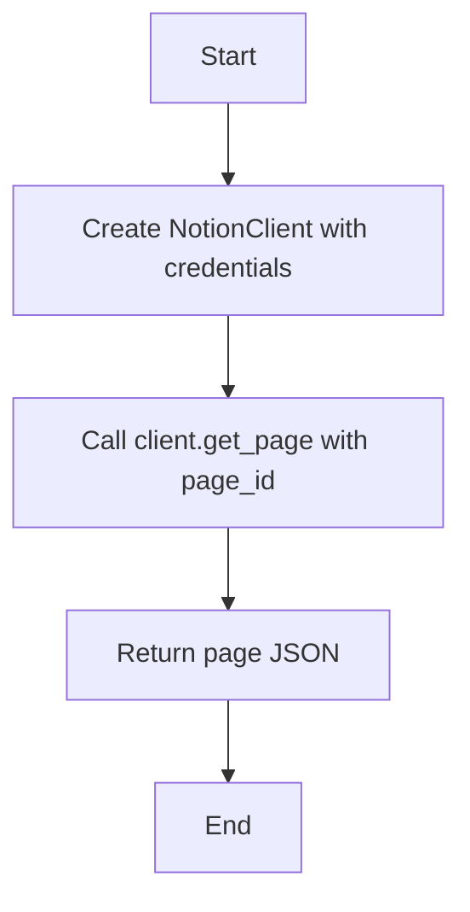
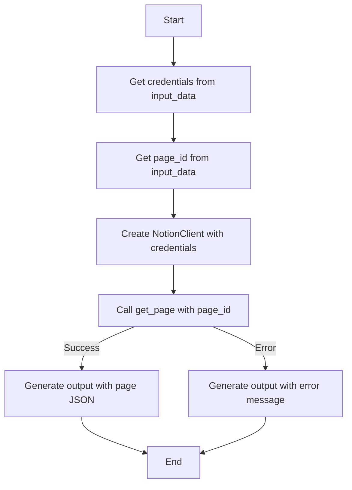
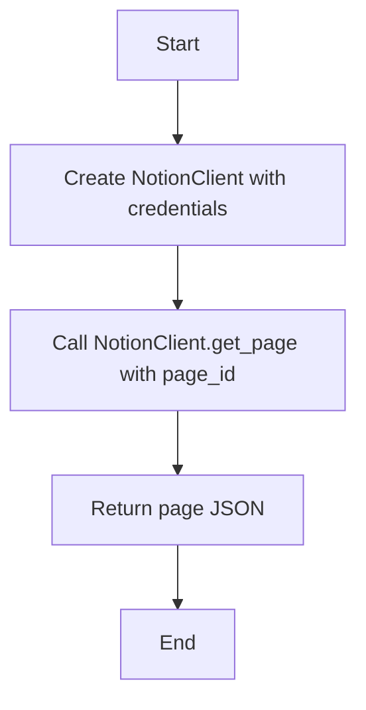
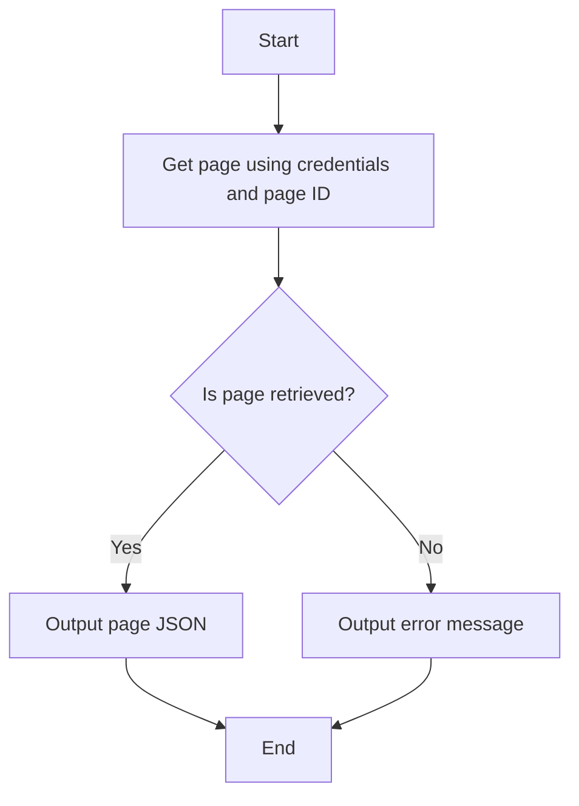

# `.\AutoGPT\autogpt_platform\backend\backend\blocks\notion\read_page.py` 详细设计文档

The code defines a NotionReadPageBlock class that reads a Notion page by its ID and returns its raw JSON. It uses OAuth2 credentials for authentication and interacts with a NotionClient to fetch the page data.

## 整体流程

```mermaid
graph TD
    A[Start] --> B[Create NotionReadPageBlock instance]
    B --> C[Check if NOTION_OAUTH_IS_CONFIGURED is True]
    C -- Yes --> D[Run NotionReadPageBlock.run() method]
    D --> E[Get page using NotionClient.get_page() method]
    E --> F{Is page data fetched successfully?}
    F -- Yes --> G[Return page data as output]
    F -- No --> H[Handle exception and return error message]
    H --> I[End]
    C -- No --> I[End]
```

## 类结构

```
NotionReadPageBlock (Concrete Block class)
├── Input (Inner class)
│   ├── page_id (str)
│   └── credentials (NotionCredentialsInput)
├── Output (Inner class)
│   └── page (dict)
└── __init__ (Constructor)
```

## 全局变量及字段


### `NOTION_OAUTH_IS_CONFIGURED`
    
Flag indicating if OAuth2 is configured for Notion integration.

类型：`bool`
    


### `TEST_CREDENTIALS`
    
Test OAuth2 credentials for Notion integration.

类型：`OAuth2Credentials`
    


### `TEST_CREDENTIALS_INPUT`
    
Test input for Notion credentials.

类型：`NotionCredentialsInput`
    


### `NotionCredentialsField`
    
Schema field for Notion credentials.

类型：`SchemaField`
    


### `NotionCredentialsInput`
    
Input class for Notion credentials.

类型：`NotionCredentialsInput`
    


### `id`
    
Unique identifier for the NotionReadPageBlock.

类型：`str`
    


### `description`
    
Description of the NotionReadPageBlock.

类型：`str`
    


### `categories`
    
Categories to which the NotionReadPageBlock belongs.

类型：`set`
    


### `input_schema`
    
Input schema for the NotionReadPageBlock.

类型：`Input`
    


### `output_schema`
    
Output schema for the NotionReadPageBlock.

类型：`Output`
    


### `disabled`
    
Flag indicating if the NotionReadPageBlock is disabled.

类型：`bool`
    


### `test_input`
    
Test input data for the NotionReadPageBlock.

类型：`dict`
    


### `test_output`
    
Test output data for the NotionReadPageBlock.

类型：`list`
    


### `test_credentials`
    
Test credentials for the NotionReadPageBlock.

类型：`OAuth2Credentials`
    


### `test_mock`
    
Mock data for testing the NotionReadPageBlock.

类型：`dict`
    


### `credentials`
    
OAuth2 credentials for the NotionReadPageBlock.

类型：`OAuth2Credentials`
    


### `page_id`
    
Notion page ID to be read.

类型：`str`
    


### `page`
    
Raw Notion page JSON.

类型：`dict`
    


### `error`
    
Error message if an exception occurs during the execution of the NotionReadPageBlock.

类型：`str`
    


### `NotionReadPageBlock.credentials`
    
OAuth2 credentials used to authenticate with Notion.

类型：`OAuth2Credentials`
    


### `NotionReadPageBlock.page_id`
    
ID of the Notion page to be read.

类型：`str`
    


### `Output.page`
    
Raw JSON representation of the Notion page.

类型：`dict`
    


### `Output.error`
    
Error message if an exception occurs during the execution of the NotionReadPageBlock.

类型：`str`
    
    

## 全局函数及方法


### `NotionReadPageBlock.get_page`

Reads a Notion page by its ID using the provided credentials and returns its raw JSON.

参数：

- `credentials`：`OAuth2Credentials`，OAuth2 credentials used to authenticate with Notion.
- `page_id`：`str`，The ID of the Notion page to be read.

返回值：`dict`，The raw JSON representation of the Notion page.

#### 流程图



#### 带注释源码

```python
@staticmethod
async def get_page(credentials: OAuth2Credentials, page_id: str) -> dict:
    client = NotionClient(credentials)  # Create NotionClient with credentials
    return await client.get_page(page_id)  # Call client.get_page with page_id
```


### `NotionReadPageBlock.run`

Reads a Notion page by its ID using provided credentials and returns its raw JSON.

参数：

- `input_data`：`Input`，The input data for the block, which includes the page ID and credentials.
- `credentials`：`OAuth2Credentials`，The OAuth2 credentials used to authenticate with Notion.

返回值：`BlockOutput`，The output of the block, which includes the raw Notion page JSON or an error message.

#### 流程图



#### 带注释源码

```python
async def run(
    self,
    input_data: Input,
    *,
    credentials: OAuth2Credentials,
    **kwargs,
) -> BlockOutput:
    try:
        page = await self.get_page(credentials, input_data.page_id)
        yield "page", page
    except Exception as e:
        yield "error", str(e) if str(e) else "Unknown error"
```


### `NotionReadPageBlock.__init__`

初始化 `NotionReadPageBlock` 类，设置其属性和配置。

参数：

- `id`：`str`，类的唯一标识符。
- `description`：`str`，类的描述信息。
- `categories`：`set`，类的分类。
- `input_schema`：`NotionReadPageBlock.Input`，输入数据模式。
- `output_schema`：`NotionReadPageBlock.Output`，输出数据模式。
- `disabled`：`bool`，是否禁用该类。
- `test_input`：`dict`，测试输入数据。
- `test_output`：`list`，测试输出数据。
- `test_credentials`：`OAuth2Credentials`，测试认证信息。
- `test_mock`：`dict`，测试模拟函数。

返回值：无

#### 流程图

```mermaid
classDiagram
    NotionReadPageBlock <|-- Block
    NotionReadPageBlock {
        +id: str
        +description: str
        +categories: set
        +input_schema: NotionReadPageBlock.Input
        +output_schema: NotionReadPageBlock.Output
        +disabled: bool
        +test_input: dict
        +test_output: list
        +test_credentials: OAuth2Credentials
        +test_mock: dict
    }
    Block {
        +id: str
        +description: str
        +categories: set
        +input_schema: BlockSchemaInput
        +output_schema: BlockSchemaOutput
        +disabled: bool
        +test_input: dict
        +test_output: list
        +test_credentials: OAuth2Credentials
        +test_mock: dict
    }
```

#### 带注释源码

```python
def __init__(self):
    super().__init__(
        id="5246cc1d-34b7-452b-8fc5-3fb25fd8f542",
        description="Read a Notion page by its ID and return its raw JSON.",
        categories={BlockCategory.PRODUCTIVITY},
        input_schema=NotionReadPageBlock.Input,
        output_schema=NotionReadPageBlock.Output,
        disabled=not NOTION_OAUTH_IS_CONFIGURED,
        test_input={
            "page_id": "00000000-0000-0000-0000-000000000000",
            "credentials": TEST_CREDENTIALS_INPUT,
        },
        test_output=[("page", dict)],
        test_credentials=TEST_CREDENTIALS,
        test_mock={
            "get_page": lambda *args, **kwargs: {"object": "page", "id": "mocked"}
        },
    )
```


### NotionReadPageBlock.get_page

Reads a Notion page by its ID using the provided credentials and returns its raw JSON.

参数：

- `credentials`：`OAuth2Credentials`，OAuth2 credentials used to authenticate with Notion.
- `page_id`：`str`，The ID of the Notion page to be read.

返回值：`dict`，The raw JSON representation of the Notion page.

#### 流程图



#### 带注释源码

```python
@staticmethod
async def get_page(credentials: OAuth2Credentials, page_id: str) -> dict:
    client = NotionClient(credentials)  # Create NotionClient with credentials
    return await client.get_page(page_id)  # Call NotionClient.get_page with page_id
```


### NotionReadPageBlock.run

Reads a Notion page by its ID using provided credentials and yields the raw JSON of the page or an error message.

参数：

- `input_data`：`Input`，The input data for the block, which includes the page ID and credentials.
- `credentials`：`OAuth2Credentials`，The OAuth2 credentials used to authenticate with Notion.

返回值：`BlockOutput`，The output of the block, which includes the raw Notion page JSON or an error message.

#### 流程图



#### 带注释源码

```python
async def run(
    self,
    input_data: Input,
    *,
    credentials: OAuth2Credentials,
    **kwargs,
) -> BlockOutput:
    try:
        page = await self.get_page(credentials, input_data.page_id)
        yield "page", page
    except Exception as e:
        yield "error", str(e) if str(e) else "Unknown error"
```


## 关键组件


### 张量索引与惰性加载

张量索引与惰性加载是用于高效处理大型数据集的技术，它允许在需要时才加载数据的一部分，从而减少内存消耗和提高性能。

### 反量化支持

反量化支持是指系统对量化操作的反向操作的支持，允许在量化后的模型上进行反向传播，以优化模型参数。

### 量化策略

量化策略是用于将浮点数模型转换为低精度整数模型的方法，以减少模型大小和提高推理速度。


## 问题及建议


### 已知问题

-   **全局变量配置**：`NOTION_OAUTH_IS_CONFIGURED`、`TEST_CREDENTIALS`、`TEST_CREDENTIALS_INPUT` 和 `NotionCredentialsField` 等全局变量在代码中直接使用，但没有提供详细的配置说明或文档，这可能导致配置管理上的困难。
-   **异常处理**：`run` 方法中的异常处理较为简单，仅捕获所有异常并返回错误信息。没有对不同类型的异常进行区分处理，这可能导致调试困难。
-   **代码复用**：`get_page` 方法在 `NotionReadPageBlock` 类中重复定义，如果其他类也需要访问 Notion API，则需要复制该方法，这违反了代码复用的原则。

### 优化建议

-   **全局变量配置**：提供详细的配置文档，说明如何配置全局变量，并考虑使用配置文件或环境变量来管理这些配置，以提高灵活性和可维护性。
-   **异常处理**：对可能出现的异常进行分类处理，例如区分网络异常、认证异常等，并针对不同类型的异常提供不同的错误信息或恢复策略。
-   **代码复用**：将 `get_page` 方法提取到一个单独的类或模块中，以便在需要访问 Notion API 的其他类中复用该方法。
-   **单元测试**：为 `get_page` 方法编写单元测试，确保其正确性和稳定性。
-   **文档**：为类和方法提供详细的文档注释，包括参数描述、返回值描述和异常情况说明，以提高代码的可读性和可维护性。


## 其它


### 设计目标与约束

- 设计目标：
  - 实现一个能够读取Notion页面并返回其原始JSON数据的块。
  - 确保块在OAuth2认证配置后可用。
  - 提供测试输入和输出，以便于开发和测试。
- 约束：
  - 必须使用Notion提供的API进行页面读取。
  - 输入数据必须包含页面ID和认证凭据。
  - 输出数据必须是页面ID对应的JSON。

### 错误处理与异常设计

- 错误处理：
  - 在`run`方法中，使用try-except块捕获异常。
  - 如果发生异常，将异常信息作为错误输出。
- 异常设计：
  - 定义了通用的异常处理机制，以便于处理Notion API调用中可能出现的错误。

### 数据流与状态机

- 数据流：
  - 输入数据通过`run`方法传递给`get_page`方法。
  - `get_page`方法从Notion API获取页面数据。
  - 获取到的页面数据通过`yield`语句返回给调用者。
- 状态机：
  - 该块没有实现复杂的状态机，因为其功能相对简单。

### 外部依赖与接口契约

- 外部依赖：
  - `backend.data.block`模块中的`Block`、`BlockCategory`、`BlockOutput`、`BlockSchemaInput`、`BlockSchemaOutput`。
  - `backend.data.model`模块中的`OAuth2Credentials`、`SchemaField`。
  - `_api`模块中的`NotionClient`。
  - `_auth`模块中的`NOTION_OAUTH_IS_CONFIGURED`、`TEST_CREDENTIALS`、`TEST_CREDENTIALS_INPUT`、`NotionCredentialsField`、`NotionCredentialsInput`。
- 接口契约：
  - `NotionReadPageBlock`类遵循`Block`接口，实现了`run`方法。
  - `get_page`方法遵循Notion API的接口契约。


    