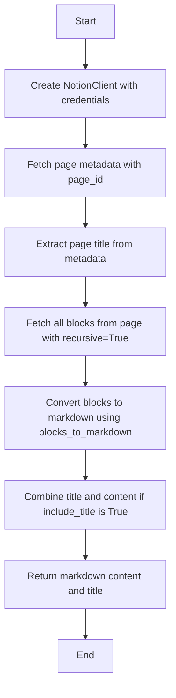
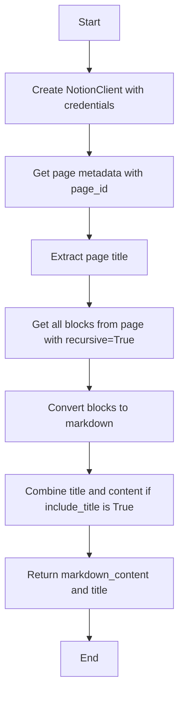
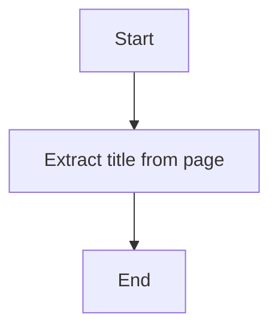
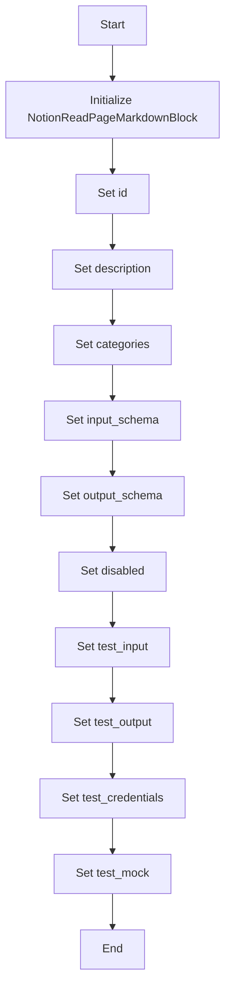
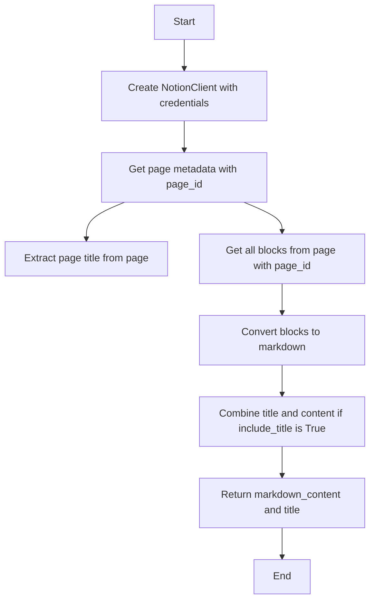
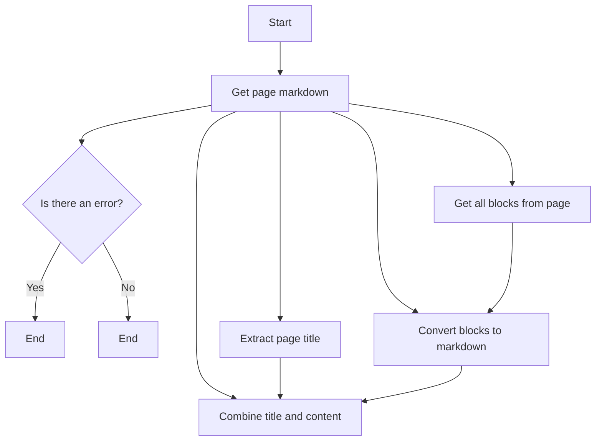

# `.\AutoGPT\autogpt_platform\backend\backend\blocks\notion\read_page_markdown.py` 详细设计文档

The code provides a functionality to read a Notion page and convert it to clean Markdown format, including the page title if specified.

## 整体流程



## 类结构

```
NotionReadPageMarkdownBlock (Concrete Block)
├── Input (BlockSchemaInput)
│   ├── credentials (NotionCredentialsInput)
│   ├── page_id (str)
│   └── include_title (bool)
└── Output (BlockSchemaOutput)
    ├── markdown (str)
    └── title (str)
```

## 全局变量及字段


### `NOTION_OAUTH_IS_CONFIGURED`
    
Flag indicating if OAuth2 is configured for Notion integration.

类型：`bool`
    


### `TEST_CREDENTIALS`
    
Test OAuth2 credentials for Notion integration.

类型：`OAuth2Credentials`
    


### `TEST_CREDENTIALS_INPUT`
    
Test input for Notion credentials.

类型：`NotionCredentialsInput`
    


### `NotionCredentialsField`
    
Field for Notion credentials in schema.

类型：`SchemaField`
    


### `NotionCredentialsInput`
    
Input class for Notion credentials.

类型：`NotionCredentialsInput`
    


### `Input`
    
Input schema for NotionReadPageMarkdownBlock.

类型：`BlockSchemaInput`
    


### `Output`
    
Output schema for NotionReadPageMarkdownBlock.

类型：`BlockSchemaOutput`
    


### `id`
    
Unique identifier for the block.

类型：`str`
    


### `description`
    
Description of the block.

类型：`str`
    


### `categories`
    
Categories to which the block belongs.

类型：`set`
    


### `input_schema`
    
Input schema for the block.

类型：`BlockSchemaInput`
    


### `output_schema`
    
Output schema for the block.

类型：`BlockSchemaOutput`
    


### `disabled`
    
Flag indicating if the block is disabled.

类型：`bool`
    


### `test_input`
    
Test input data for the block.

类型：`dict`
    


### `test_output`
    
Test output data for the block.

类型：`list`
    


### `test_credentials`
    
Test credentials for the block.

类型：`OAuth2Credentials`
    


### `test_mock`
    
Test mock data for the block.

类型：`dict`
    


### `credentials`
    
OAuth2 credentials for Notion integration.

类型：`OAuth2Credentials`
    


### `page_id`
    
ID of the Notion page to read.

类型：`str`
    


### `include_title`
    
Flag indicating if the page title should be included in the markdown output.

类型：`bool`
    


### `markdown`
    
Markdown content of the Notion page.

类型：`str`
    


### `title`
    
Title of the Notion page.

类型：`str`
    


### `error`
    
Error message if an exception occurs during block execution.

类型：`str`
    


### `NotionReadPageMarkdownBlock.id`
    
Unique identifier for the block.

类型：`str`
    


### `NotionReadPageMarkdownBlock.description`
    
Description of the block.

类型：`str`
    


### `NotionReadPageMarkdownBlock.categories`
    
Categories to which the block belongs.

类型：`set`
    


### `NotionReadPageMarkdownBlock.input_schema`
    
Input schema for the block.

类型：`BlockSchemaInput`
    


### `NotionReadPageMarkdownBlock.output_schema`
    
Output schema for the block.

类型：`BlockSchemaOutput`
    


### `NotionReadPageMarkdownBlock.disabled`
    
Flag indicating if the block is disabled.

类型：`bool`
    


### `NotionReadPageMarkdownBlock.test_input`
    
Test input data for the block.

类型：`dict`
    


### `NotionReadPageMarkdownBlock.test_output`
    
Test output data for the block.

类型：`list`
    


### `NotionReadPageMarkdownBlock.test_credentials`
    
Test credentials for the block.

类型：`OAuth2Credentials`
    


### `NotionReadPageMarkdownBlock.test_mock`
    
Test mock data for the block.

类型：`dict`
    


### `Input.credentials`
    
Notion credentials input.

类型：`NotionCredentialsInput`
    


### `Input.page_id`
    
Notion page ID to read.

类型：`str`
    


### `Input.include_title`
    
Flag indicating if the page title should be included in the markdown output.

类型：`bool`
    


### `Output.markdown`
    
Markdown content of the Notion page.

类型：`str`
    


### `Output.title`
    
Title of the Notion page.

类型：`str`
    


### `Output.error`
    
Error message if an exception occurs during block execution.

类型：`str`
    
    

## 全局函数及方法


### `NotionReadPageMarkdownBlock.get_page_markdown`

Get a Notion page and convert it to markdown.

参数：

- `credentials`：`OAuth2Credentials`，OAuth2 credentials for Notion.
- `page_id`：`str`，The ID of the page to fetch.
- `include_title`：`bool`，Whether to include the page title in the markdown.

返回值：`tuple[str, str]`，Tuple of (markdown_content, title)

#### 流程图



#### 带注释源码

```python
@staticmethod
async def get_page_markdown(
    credentials: OAuth2Credentials, page_id: str, include_title: bool = True
) -> tuple[str, str]:
    """
    Get a Notion page and convert it to markdown.

    Args:
        credentials: OAuth2 credentials for Notion.
        page_id: The ID of the page to fetch.
        include_title: Whether to include the page title in the markdown.

    Returns:
        Tuple of (markdown_content, title)
    """
    client = NotionClient(credentials)
    page = await client.get_page(page_id)
    title = extract_page_title(page)
    blocks = await client.get_blocks(page_id, recursive=True)
    content_markdown = blocks_to_markdown(blocks)
    if include_title and title:
        full_markdown = f"# {title}\n\n{content_markdown}"
    else:
        full_markdown = content_markdown
    return full_markdown, title
```


### extract_page_title

Extracts the title from a Notion page.

参数：

-  `page`: `Block`，The Notion page object from which to extract the title.

返回值：`str`，The extracted title from the Notion page.

#### 流程图



#### 带注释源码

```python
def extract_page_title(page: Block) -> str:
    """
    Extracts the title from a Notion page.

    Args:
        page: The Notion page object from which to extract the title.

    Returns:
        The extracted title from the Notion page.
    """
    # Assuming the page object has a 'title' property that is a string
    return page.title
```


### `NotionReadPageMarkdownBlock.__init__`

This method initializes the `NotionReadPageMarkdownBlock` class, setting up its properties and configurations.

参数：

- `id`: `str`，The unique identifier for the block.
- `description`: `str`，A description of the block's functionality.
- `categories`: `set`，A set of categories that the block belongs to.
- `input_schema`: `Input`，The input schema for the block.
- `output_schema`: `Output`，The output schema for the block.
- `disabled`: `bool`，Whether the block is disabled.
- `test_input`: `dict`，The test input data for the block.
- `test_output`: `list`，The expected test output data for the block.
- `test_credentials`: `OAuth2Credentials`，The test credentials for the block.
- `test_mock`: `dict`，Mock data for testing the block.

返回值：`None`，This method does not return any value.

#### 流程图



#### 带注释源码

```python
def __init__(self):
    super().__init__(
        id="d1312c4d-fae2-4e70-893d-f4d07cce1d4e",
        description="Read a Notion page and convert it to Markdown format with proper formatting for headings, lists, links, and rich text.",
        categories={BlockCategory.PRODUCTIVITY},
        input_schema=NotionReadPageMarkdownBlock.Input,
        output_schema=NotionReadPageMarkdownBlock.Output,
        disabled=not NOTION_OAUTH_IS_CONFIGURED,
        test_input={
            "page_id": "00000000-0000-0000-0000-000000000000",
            "include_title": True,
            "credentials": TEST_CREDENTIALS_INPUT,
        },
        test_output=[
            ("markdown", "# Test Page\n\nThis is test content."),
            ("title", "Test Page"),
        ],
        test_credentials=TEST_CREDENTIALS,
        test_mock={
            "get_page_markdown": lambda *args, **kwargs: (
                "# Test Page\n\nThis is test content.",
                "Test Page",
            )
        },
    )
```


### NotionReadPageMarkdownBlock.get_page_markdown

Get a Notion page and convert it to markdown.

参数：

- `credentials`：`OAuth2Credentials`，OAuth2 credentials for Notion.
- `page_id`：`str`，The ID of the page to fetch.
- `include_title`：`bool`，Whether to include the page title in the markdown.

返回值：`tuple[str, str]`，Tuple of (markdown_content, title)

#### 流程图



#### 带注释源码

```python
@staticmethod
async def get_page_markdown(
    credentials: OAuth2Credentials, page_id: str, include_title: bool = True
) -> tuple[str, str]:
    """
    Get a Notion page and convert it to markdown.

    Args:
        credentials: OAuth2 credentials for Notion.
        page_id: The ID of the page to fetch.
        include_title: Whether to include the page title in the markdown.

    Returns:
        Tuple of (markdown_content, title)
    """
    client = NotionClient(credentials)

    # Get page metadata
    page = await client.get_page(page_id)
    title = extract_page_title(page)

    # Get all blocks from the page
    blocks = await client.get_blocks(page_id, recursive=True)

    # Convert blocks to markdown
    content_markdown = blocks_to_markdown(blocks)

    # Combine title and content if requested
    if include_title and title:
        full_markdown = f"# {title}\n\n{content_markdown}"
    else:
        full_markdown = content_markdown

    return full_markdown, title
```


### NotionReadPageMarkdownBlock.run

Read a Notion page and convert it to Markdown format, yielding the content and title.

参数：

- `input_data`：`Input`，The input data for the block, containing the page ID and whether to include the title.
- `credentials`：`OAuth2Credentials`，OAuth2 credentials for Notion.

返回值：`BlockOutput`，The output of the block, containing the Markdown content and title or an error message.

#### 流程图



#### 带注释源码

```python
async def run(
    self,
    input_data: Input,
    *,
    credentials: OAuth2Credentials,
    **kwargs,
) -> BlockOutput:
    try:
        markdown, title = await self.get_page_markdown(
            credentials, input_data.page_id, input_data.include_title
        )
        yield "markdown", markdown
        yield "title", title
    except Exception as e:
        yield "error", str(e) if str(e) else "Unknown error"
```


## 关键组件


### 张量索引与惰性加载

用于高效地处理和索引大型数据集，延迟加载数据以减少内存消耗。

### 反量化支持

提供对量化策略的反量化支持，以优化模型性能。

### 量化策略

实现量化策略，将浮点数权重转换为低精度整数，以减少模型大小和加速推理。


## 问题及建议


### 已知问题

-   **全局变量依赖**: `NOTION_OAUTH_IS_CONFIGURED` 是一个全局变量，它控制着 `NotionReadPageMarkdownBlock` 类的启用状态。这种全局状态可能会使得代码难以维护和测试，因为它依赖于外部配置。
-   **异常处理**: `run` 方法中的异常处理较为简单，仅捕获了所有异常并返回错误信息。这可能隐藏了潜在的错误，使得调试变得困难。
-   **代码复用**: `get_page_markdown` 方法中，`blocks_to_markdown` 和 `extract_page_title` 函数被重复调用。可以考虑将这些函数提升到类级别或模块级别，以提高代码复用性。

### 优化建议

-   **移除全局变量**: 尝试将 `NOTION_OAUTH_IS_CONFIGURED` 的逻辑移入类内部，通过构造函数或初始化方法来处理，从而避免全局变量的使用。
-   **增强异常处理**: 在 `run` 方法中，可以针对不同类型的异常进行更详细的处理，例如区分网络错误、认证错误等，并给出相应的错误信息。
-   **提升代码复用性**: 将 `blocks_to_markdown` 和 `extract_page_title` 函数提升到类级别或模块级别，以便在需要时重复使用。
-   **异步操作管理**: 考虑使用异步上下文管理器来管理异步操作，这样可以更优雅地处理异步资源，如数据库连接等。
-   **单元测试**: 为 `get_page_markdown` 和 `run` 方法编写单元测试，以确保代码的正确性和稳定性。


## 其它


### 设计目标与约束

- 确保代码能够安全地访问和转换Notion页面内容。
- 代码应易于集成到现有的工作流程中。
- 代码应遵循异步编程模式以提高性能。
- 代码应提供清晰的错误消息，以便于问题诊断。

### 错误处理与异常设计

- 使用try-except块来捕获和处理可能发生的异常。
- 异常应提供足够的信息以便于调试。
- 错误输出应包括错误消息和错误代码。

### 数据流与状态机

- 数据流从用户输入开始，通过API调用，最终生成Markdown输出。
- 状态机描述了从初始化到执行再到完成的过程。

### 外部依赖与接口契约

- 依赖于Notion API和OAuth2认证机制。
- 与NotionClient类交互，该类负责与Notion API通信。
- 与blocks_to_markdown和extract_page_title函数交互，用于转换页面内容和提取标题。

### 安全性与认证

- 使用OAuth2认证机制来保护对Notion页面的访问。
- 确保所有敏感信息（如OAuth令牌）都得到妥善处理。

### 性能考量

- 异步编程模式用于提高代码的响应性和性能。
- 优化数据传输和转换过程，减少不必要的网络请求。

### 可维护性与可扩展性

- 代码结构清晰，易于理解和维护。
- 提供了测试输入和输出，便于单元测试和集成测试。
- 设计允许轻松添加新的功能或支持新的Notion页面特性。

### 文档与注释

- 提供详细的文档和注释，以便于其他开发者理解和使用代码。
- 文档应包括如何安装、配置和使用该模块的说明。

### 版本控制与部署

- 使用版本控制系统（如Git）来管理代码变更。
- 提供部署指南，包括环境配置和依赖安装。


    