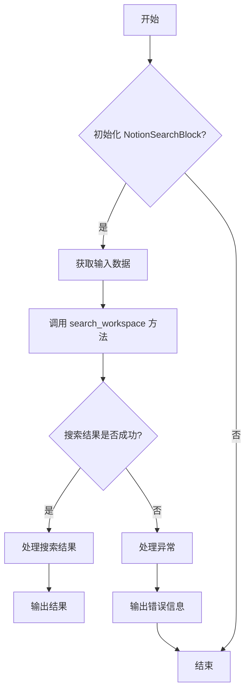
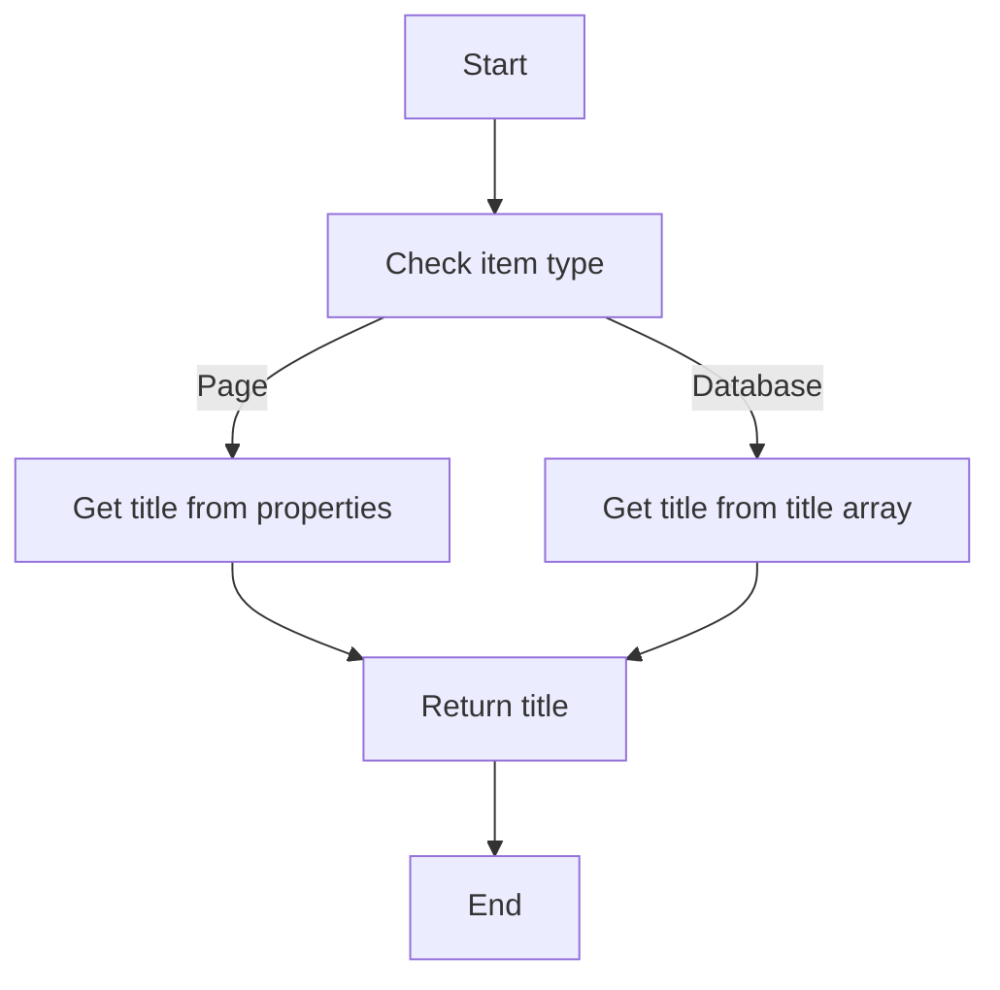
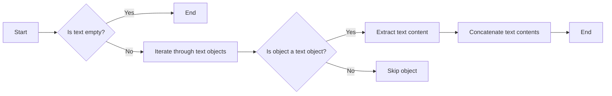
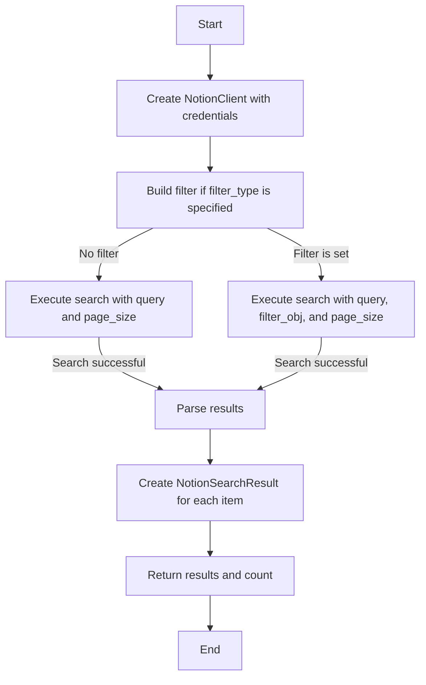
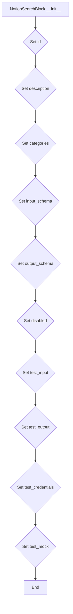
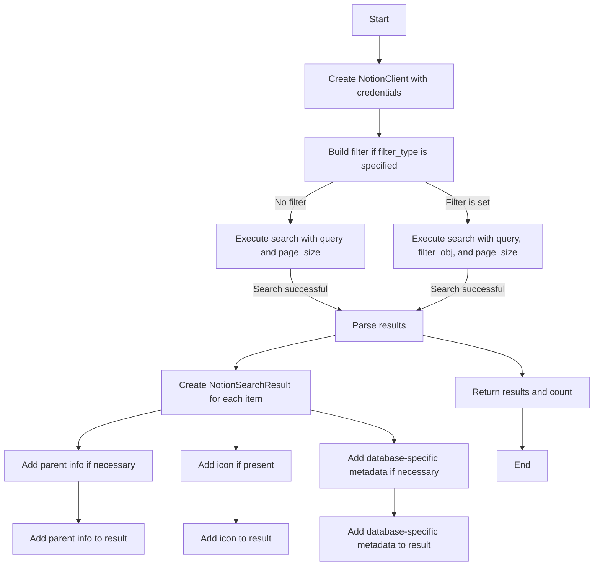
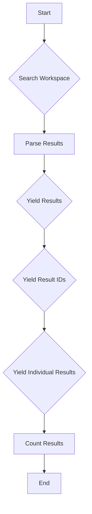

# `.\AutoGPT\autogpt_platform\backend\backend\blocks\notion\search.py` 详细设计文档

The code defines a class NotionSearchBlock that allows searching for pages and databases in a Notion workspace using a text query.

## 整体流程



## 类结构

```
NotionSearchBlock (具体类)
├── Input (类属性)
│   ├── credentials (NotionCredentialsInput)
│   ├── query (str)
│   ├── filter_type (Optional[str])
│   └── limit (int)
├── Output (类属性)
│   ├── results (List[NotionSearchResult])
│   ├── result (NotionSearchResult)
│   ├── result_ids (List[str])
│   └── count (int)
└── NotionSearchResult (类属性)
    ├── id (str)
    ├── type (str)
    ├── title (str)
    ├── url (str)
    ├── created_time (Optional[str])
    ├── last_edited_time (Optional[str])
    ├── parent_type (Optional[str])
    ├── parent_id (Optional[str])
    └── icon (Optional[str])
```

## 全局变量及字段


### `NOTION_OAUTH_IS_CONFIGURED`
    
Flag indicating if OAuth2 credentials are configured for Notion access.

类型：`bool`
    


### `TEST_CREDENTIALS`
    
Test OAuth2 credentials for Notion access.

类型：`OAuth2Credentials`
    


### `TEST_CREDENTIALS_INPUT`
    
Test input for Notion credentials.

类型：`NotionCredentialsInput`
    


### `NotionCredentialsField`
    
Field for Notion credentials in schema.

类型：`SchemaField`
    


### `NotionCredentialsInput`
    
Input model for Notion credentials.

类型：`NotionCredentialsInput`
    


### `id`
    
Unique identifier for NotionSearchResult.

类型：`str`
    


### `type`
    
Type of the NotionSearchResult, e.g., 'page' or 'database'.

类型：`str`
    


### `title`
    
Title of the NotionSearchResult.

类型：`str`
    


### `url`
    
URL of the NotionSearchResult.

类型：`str`
    


### `created_time`
    
Creation time of the NotionSearchResult.

类型：`Optional[str]`
    


### `last_edited_time`
    
Last edited time of the NotionSearchResult.

类型：`Optional[str]`
    


### `parent_type`
    
Parent type of the NotionSearchResult, e.g., 'page', 'database', or 'workspace'.

类型：`Optional[str]`
    


### `parent_id`
    
Parent ID of the NotionSearchResult.

类型：`Optional[str]`
    


### `icon`
    
Icon of the NotionSearchResult if present.

类型：`Optional[str]`
    


### `is_inline`
    
Indicates if the NotionSearchResult is inline for databases.

类型：`Optional[bool]`
    


### `id`
    
Unique identifier for NotionSearchBlock.

类型：`str`
    


### `description`
    
Description of NotionSearchBlock.

类型：`str`
    


### `categories`
    
Categories to which NotionSearchBlock belongs.

类型：`set[BlockCategory]`
    


### `input_schema`
    
Input schema for NotionSearchBlock.

类型：`Input`
    


### `output_schema`
    
Output schema for NotionSearchBlock.

类型：`Output`
    


### `disabled`
    
Flag indicating if NotionSearchBlock is disabled.

类型：`bool`
    


### `test_input`
    
Test input data for NotionSearchBlock.

类型：`dict`
    


### `test_output`
    
Test output data for NotionSearchBlock.

类型：`list`
    


### `test_credentials`
    
Test credentials for NotionSearchBlock.

类型：`OAuth2Credentials`
    


### `test_mock`
    
Test mock data for NotionSearchBlock.

类型：`dict`
    


### `NotionSearchResult.id`
    
Unique identifier for NotionSearchResult.

类型：`str`
    


### `NotionSearchResult.type`
    
Type of the NotionSearchResult, e.g., 'page' or 'database'.

类型：`str`
    


### `NotionSearchResult.title`
    
Title of the NotionSearchResult.

类型：`str`
    


### `NotionSearchResult.url`
    
URL of the NotionSearchResult.

类型：`str`
    


### `NotionSearchResult.created_time`
    
Creation time of the NotionSearchResult.

类型：`Optional[str]`
    


### `NotionSearchResult.last_edited_time`
    
Last edited time of the NotionSearchResult.

类型：`Optional[str]`
    


### `NotionSearchResult.parent_type`
    
Parent type of the NotionSearchResult, e.g., 'page', 'database', or 'workspace'.

类型：`Optional[str]`
    


### `NotionSearchResult.parent_id`
    
Parent ID of the NotionSearchResult.

类型：`Optional[str]`
    


### `NotionSearchResult.icon`
    
Icon of the NotionSearchResult if present.

类型：`Optional[str]`
    


### `NotionSearchResult.is_inline`
    
Indicates if the NotionSearchResult is inline for databases.

类型：`Optional[bool]`
    


### `NotionSearchBlock.id`
    
Unique identifier for NotionSearchBlock.

类型：`str`
    


### `NotionSearchBlock.description`
    
Description of NotionSearchBlock.

类型：`str`
    


### `NotionSearchBlock.categories`
    
Categories to which NotionSearchBlock belongs.

类型：`set[BlockCategory]`
    


### `NotionSearchBlock.input_schema`
    
Input schema for NotionSearchBlock.

类型：`Input`
    


### `NotionSearchBlock.output_schema`
    
Output schema for NotionSearchBlock.

类型：`Output`
    


### `NotionSearchBlock.disabled`
    
Flag indicating if NotionSearchBlock is disabled.

类型：`bool`
    


### `NotionSearchBlock.test_input`
    
Test input data for NotionSearchBlock.

类型：`dict`
    


### `NotionSearchBlock.test_output`
    
Test output data for NotionSearchBlock.

类型：`list`
    


### `NotionSearchBlock.test_credentials`
    
Test credentials for NotionSearchBlock.

类型：`OAuth2Credentials`
    


### `NotionSearchBlock.test_mock`
    
Test mock data for NotionSearchBlock.

类型：`dict`
    
    

## 全局函数及方法


### extract_page_title

Extracts the title from a Notion item based on its type.

参数：

- `item`：`dict`，The Notion item from which to extract the title.

返回值：`str`，The extracted title from the Notion item.

#### 流程图



#### 带注释源码

```python
def extract_page_title(item: dict) -> str:
    """
    Extracts the title from a Notion item based on its type.

    Args:
        item (dict): The Notion item from which to extract the title.

    Returns:
        str: The extracted title from the Notion item.
    """
    # Extract title based on type
    if item.get("object") == "page":
        # For pages, get the title from properties
        return item.get("properties", {}).get("title", {}).get("title", "")
    elif item.get("object") == "database":
        # For databases, get title from the title array
        return parse_rich_text(item.get("title", []))
```


### parse_rich_text

Extracts and returns the rich text content from a given Notion item.

参数：

- `text`: `List[dict]`，The list of text objects from a Notion item.

返回值：`str`，The extracted rich text content.

#### 流程图



#### 带注释源码

```python
def parse_rich_text(text: List[dict]) -> str:
    """
    Extracts and returns the rich text content from a given Notion item.

    Args:
        text (List[dict]): The list of text objects from a Notion item.

    Returns:
        str: The extracted rich text content.
    """
    rich_text = ""
    for obj in text:
        if obj.get("type") == "text":
            rich_text += obj.get("text", "")
    return rich_text
```


### `NotionSearchBlock.search_workspace`

Search the Notion workspace.

参数：

- `credentials`：`OAuth2Credentials`，Notion OAuth credentials used to authenticate the request.
- `query`：`str`，Search query text. Leave empty to get all accessible pages/databases.
- `filter_type`：`Optional[str]`，Filter results by type: 'page' or 'database'. Leave empty for both.
- `limit`：`int`，Maximum number of results to return.

返回值：`tuple[List[NotionSearchResult], int]`，Tuple of (results_list, count)

#### 流程图



#### 带注释源码

```python
@staticmethod
async def search_workspace(
    credentials: OAuth2Credentials,
    query: str = "",
    filter_type: Optional[str] = None,
    limit: int = 20,
) -> tuple[List[NotionSearchResult], int]:
    """
    Search the Notion workspace.

    Returns:
        Tuple of (results_list, count)
    """
    client = NotionClient(credentials)

    # Build filter if type is specified
    filter_obj = None
    if filter_type:
        filter_obj = {"property": "object", "value": filter_type}

    # Execute search
    response = await client.search(
        query=query, filter_obj=filter_obj, page_size=limit
    )

    # Parse results
    results = []
    for item in response.get("results", []):
        # ... (rest of the method implementation)
```


### NotionSearchBlock.__init__

This method initializes a NotionSearchBlock instance, setting up its properties and configurations.

参数：

- `id`: `str`，The unique identifier for the block.
- `description`: `str`，A description of the block's functionality.
- `categories`: `set`，A set of categories that the block belongs to.
- `input_schema`: `NotionSearchBlock.Input`，The input schema for the block.
- `output_schema`: `NotionSearchBlock.Output`，The output schema for the block.
- `disabled`: `bool`，A flag indicating whether the block is disabled.
- `test_input`: `dict`，The test input data for the block.
- `test_output`: `list`，The test output data for the block.
- `test_credentials`: `OAuth2Credentials`，The test credentials for the block.
- `test_mock`: `dict`，The test mock data for the block's search_workspace method.

返回值：`None`，This method does not return a value.

#### 流程图



#### 带注释源码

```python
def __init__(self):
    super().__init__(
        id="313515dd-9848-46ea-9cd6-3c627c892c56",
        description="Search your Notion workspace for pages and databases by text query.",
        categories={BlockCategory.PRODUCTIVITY, BlockCategory.SEARCH},
        input_schema=NotionSearchBlock.Input,
        output_schema=NotionSearchBlock.Output,
        disabled=not NOTION_OAUTH_IS_CONFIGURED,
        test_input={
            "query": "project",
            "limit": 5,
            "credentials": TEST_CREDENTIALS_INPUT,
        },
        test_output=[
            (
                "results",
                [
                    NotionSearchResult(
                        id="123",
                        type="page",
                        title="Project Plan",
                        url="https://notion.so/Project-Plan-123",
                    )
                ],
            ),
            ("result_ids", ["123"]),
            (
                "result",
                NotionSearchResult(
                    id="123",
                    type="page",
                    title="Project Plan",
                    url="https://notion.so/Project-Plan-123",
                ),
            ),
            ("count", 1),
        ],
        test_credentials=TEST_CREDENTIALS,
        test_mock={
            "search_workspace": lambda *args, **kwargs: (
                [
                    NotionSearchResult(
                        id="123",
                        type="page",
                        title="Project Plan",
                        url="https://notion.so/Project-Plan-123",
                    )
                ],
                1,
            )
        },
    )
```


### NotionSearchBlock.search_workspace

Search the Notion workspace.

参数：

- `credentials`：`OAuth2Credentials`，Notion OAuth2 credentials used to authenticate the request.
- `query`：`str`，Search query text. Leave empty to get all accessible pages/databases.
- `filter_type`：`Optional[str]`，Filter results by type: 'page' or 'database'. Leave empty for both.
- `limit`：`int`，Maximum number of results to return.

返回值：`tuple[List[NotionSearchResult], int]`，Tuple of (results_list, count)

#### 流程图



#### 带注释源码

```python
@staticmethod
async def search_workspace(
    credentials: OAuth2Credentials,
    query: str = "",
    filter_type: Optional[str] = None,
    limit: int = 20,
) -> tuple[List[NotionSearchResult], int]:
    """
    Search the Notion workspace.

    Returns:
        Tuple of (results_list, count)
    """
    client = NotionClient(credentials)

    # Build filter if type is specified
    filter_obj = None
    if filter_type:
        filter_obj = {"property": "object", "value": filter_type}

    # Execute search
    response = await client.search(
        query=query, filter_obj=filter_obj, page_size=limit
    )

    # Parse results
    results = []
    for item in response.get("results", []):
        result_data = {
            "id": item.get("id", ""),
            "type": item.get("object", ""),
            "url": item.get("url", ""),
            "created_time": item.get("created_time"),
            "last_edited_time": item.get("last_edited_time"),
            "title": "",  # Will be set below
        }

        # Extract title based on type
        if item.get("object") == "page":
            # For pages, get the title from properties
            result_data["title"] = extract_page_title(item)

            # Add parent info
            parent = item.get("parent", {})
            if parent.get("type") == "page_id":
                result_data["parent_type"] = "page"
                result_data["parent_id"] = parent.get("page_id")
            elif parent.get("type") == "database_id":
                result_data["parent_type"] = "database"
                result_data["parent_id"] = parent.get("database_id")
            elif parent.get("type") == "workspace":
                result_data["parent_type"] = "workspace"

            # Add icon if present
            icon = item.get("icon")
            if icon and icon.get("type") == "emoji":
                result_data["icon"] = icon.get("emoji")

        elif item.get("object") == "database":
            # For databases, get title from the title array
            result_data["title"] = parse_rich_text(item.get("title", []))

            # Add database-specific metadata
            result_data["is_inline"] = item.get("is_inline", False)

            # Add parent info
            parent = item.get("parent", {})
            if parent.get("type") == "page_id":
                result_data["parent_type"] = "page"
                result_data["parent_id"] = parent.get("page_id")
            elif parent.get("type") == "workspace":
                result_data["parent_type"] = "workspace"

            # Add icon if present
            icon = item.get("icon")
            if icon and icon.get("type") == "emoji":
                result_data["icon"] = icon.get("emoji")

        results.append(NotionSearchResult(**result_data))

    return results, len(results)
```


### NotionSearchBlock.run

Searches the Notion workspace for pages and databases based on a query and returns the results.

参数：

- `input_data`：`Input`，The input data for the block, containing the search query, filter type, and limit.
- `credentials`：`OAuth2Credentials`，The OAuth2 credentials to authenticate the request to Notion.

返回值：`BlockOutput`，The output of the block, containing the search results, individual results, result IDs, and count.

#### 流程图



#### 带注释源码

```python
async def run(
    self,
    input_data: Input,
    *,
    credentials: OAuth2Credentials,
    **kwargs,
) -> BlockOutput:
    try:
        results, count = await self.search_workspace(
            credentials, input_data.query, input_data.filter_type, input_data.limit
        )

        # Yield the complete list for batch operations
        yield "results", results

        # Extract and yield IDs as a list for batch operations
        result_ids = [r.id for r in results]
        yield "result_ids", result_ids

        # Yield each individual result for single connections
        for result in results:
            yield "result", result

        yield "count", count
    except Exception as e:
        yield "error", str(e) if str(e) else "Unknown error"
```


## 关键组件


### 张量索引与惰性加载

张量索引与惰性加载是代码中用于高效处理大量数据的关键组件，它允许在需要时才加载数据，从而减少内存消耗和提高性能。

### 反量化支持

反量化支持是代码中用于处理量化数据的关键组件，它能够将量化数据转换回原始数据，以便进行进一步的处理和分析。

### 量化策略

量化策略是代码中用于优化数据存储和计算效率的关键组件，它通过减少数据精度来降低内存和计算需求。


## 问题及建议


### 已知问题

-   **全局变量和函数依赖性**：全局变量 `NOTION_OAUTH_IS_CONFIGURED` 和 `TEST_CREDENTIALS` 在类 `NotionSearchBlock` 的初始化中直接使用，这可能导致代码难以维护和测试。
-   **异常处理**：`run` 方法中的异常处理捕获了所有异常，但没有提供具体的错误信息，这可能导致调试困难。
-   **代码重复**：`search_workspace` 方法中对于不同类型（页面或数据库）的处理逻辑有重复代码，可以考虑使用策略模式或模板方法模式来减少重复。
-   **数据流不清晰**：`search_workspace` 方法中的数据流处理不够清晰，特别是在处理结果和错误信息时。

### 优化建议

-   **全局变量和函数**：将全局变量和函数移至类内部，通过构造函数或类方法进行初始化，以提高代码的可测试性和可维护性。
-   **异常处理**：在 `run` 方法中，针对不同类型的异常提供更具体的错误信息，并考虑使用日志记录错误。
-   **代码重复**：重构 `search_workspace` 方法，使用策略模式或模板方法模式来处理不同类型的搜索结果，减少代码重复。
-   **数据流**：在处理数据流时，确保每个步骤都有清晰的逻辑，并在必要时使用日志记录关键步骤的状态。
-   **类型注解**：确保所有函数和方法的参数和返回值都有明确的类型注解，以提高代码的可读性和可维护性。
-   **单元测试**：编写单元测试来覆盖关键功能，确保代码的稳定性和可靠性。
-   **文档**：为代码添加详细的文档注释，包括函数和类的用途、参数和返回值说明等。


## 其它


### 设计目标与约束

- 设计目标：
  - 提供一个模块化的、可扩展的搜索功能，允许用户在Notion工作空间中搜索页面和数据库。
  - 确保搜索结果准确、高效，并能够处理大量数据。
  - 提供一个易于使用的API接口，方便其他模块或服务调用。
- 约束：
  - 必须使用OAuth2进行身份验证。
  - 限制搜索结果数量，以避免过载Notion API。
  - 确保代码的可维护性和可扩展性。

### 错误处理与异常设计

- 错误处理：
  - 使用try-except块捕获可能发生的异常。
  - 对于Notion API调用失败，返回具体的错误信息。
  - 对于其他类型的异常，返回通用的错误信息。
- 异常设计：
  - 定义自定义异常类，以便于处理特定类型的错误。
  - 异常类应包含错误代码、错误信息和可能的解决方案。

### 数据流与状态机

- 数据流：
  - 用户输入搜索查询和过滤条件。
  - 模块调用Notion API进行搜索。
  - API返回搜索结果。
  - 模块处理搜索结果并返回给用户。
- 状态机：
  - 搜索模块的状态包括：空闲、搜索中、搜索完成、错误。

### 外部依赖与接口契约

- 外部依赖：
  - Notion API。
  - Pydantic库用于数据验证。
  - Asyncio库用于异步操作。
- 接口契约：
  - Notion API接口规范。
  - OAuth2身份验证流程。
  - 数据模型和验证规则。


    