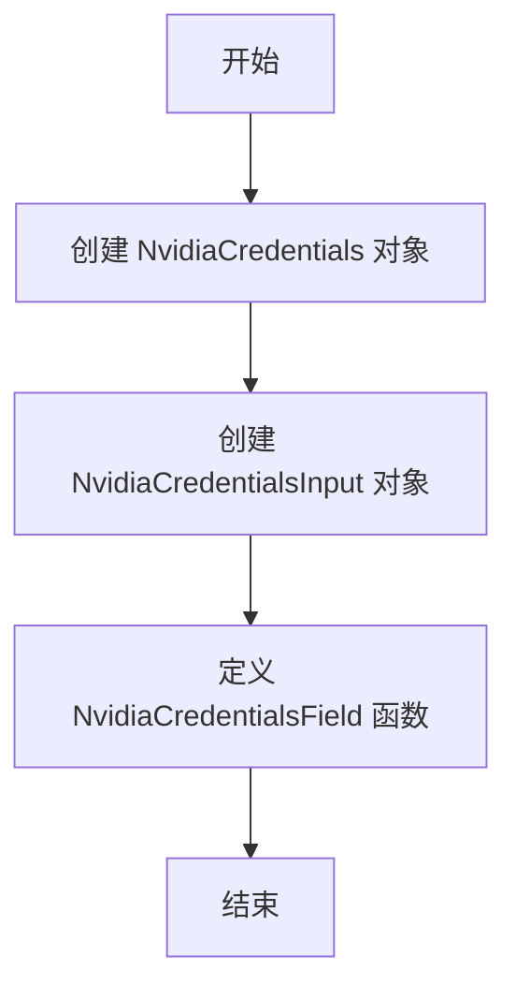
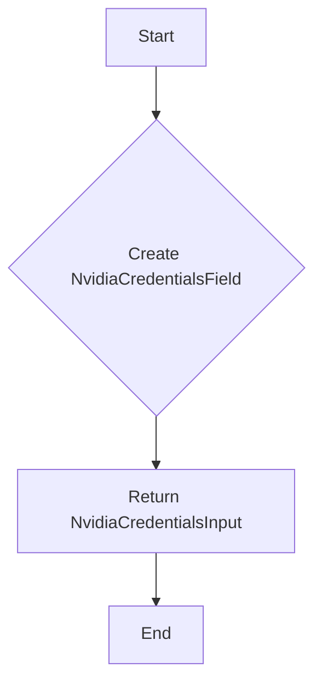

# `.\AutoGPT\autogpt_platform\backend\backend\blocks\nvidia\_auth.py` 详细设计文档

The code provides a basic structure for managing credentials for the NVIDIA provider, including an API key and its input schema.

## 整体流程



## 类结构

```
NvidiaCredentials (类)
├── TEST_CREDENTIALS (全局变量)
└── NvidiaCredentialsField (全局函数)
```

## 全局变量及字段


### `TEST_CREDENTIALS`
    
A mock Nvidia API credentials object with predefined values.

类型：`APIKeyCredentials`
    


### `TEST_CREDENTIALS_INPUT`
    
A dictionary containing the input data for Nvidia credentials.

类型：`dict`
    


### `NvidiaCredentials.id`
    
The unique identifier for the credentials.

类型：`str`
    


### `NvidiaCredentials.provider`
    
The provider of the credentials, which is 'nvidia' in this case.

类型：`str`
    


### `NvidiaCredentials.api_key`
    
The secret API key for the Nvidia provider.

类型：`SecretStr`
    


### `NvidiaCredentials.title`
    
The title of the credentials, describing what they represent.

类型：`str`
    


### `NvidiaCredentials.expires_at`
    
The expiration date of the credentials, which is None in this case.

类型：`Optional[datetime]`
    
    

## 全局函数及方法


### NvidiaCredentialsField()

This function creates an Nvidia credentials input on a block, which is used for the Nvidia integration requiring an API Key.

参数：

- 无参数

返回值：`NvidiaCredentialsInput`，A dictionary representing the Nvidia credentials input for the integration.

#### 流程图



#### 带注释源码

```
def NvidiaCredentialsField() -> NvidiaCredentialsInput:
    # The function returns an NvidiaCredentialsInput which is a dictionary
    # representing the Nvidia credentials input for the integration.
    return CredentialsField(description="The Nvidia integration requires an API Key.")
```


## 关键组件


### 张量索引与惰性加载

张量索引与惰性加载机制允许在处理大规模数据时，只对需要的数据进行计算，从而提高效率。

### 反量化支持

反量化支持使得代码能够处理未完全确定的量化参数，提供灵活的配置选项。

### 量化策略

量化策略定义了如何将浮点数参数转换为固定点数表示，以优化性能和资源使用。


## 问题及建议


### 已知问题

-   **全局变量使用**：`TEST_CREDENTIALS` 和 `TEST_CREDENTIALS_INPUT` 作为全局变量使用，这可能导致代码难以维护和测试，尤其是在大型项目中。
-   **类型注解的重复**：`NvidiaCredentialsInput` 的类型注解中 `Literal` 被重复使用，这可能是代码中的冗余。
-   **函数的单一职责**：`NvidiaCredentialsField` 函数似乎承担了创建输入字段和描述的双重职责，这违反了单一职责原则。

### 优化建议

-   **移除全局变量**：考虑将 `TEST_CREDENTIALS` 和 `TEST_CREDENTIALS_INPUT` 作为函数参数或局部变量传递，以减少全局变量的使用。
-   **简化类型注解**：移除重复的 `Literal` 使用，确保类型注解简洁且无冗余。
-   **改进函数设计**：将 `NvidiaCredentialsField` 函数拆分为两个函数，一个用于创建输入字段，另一个用于提供描述，以遵循单一职责原则。
-   **增加错误处理**：在函数中增加错误处理逻辑，以确保在输入数据不正确时能够优雅地处理异常。
-   **代码测试**：为代码编写单元测试，以确保代码的稳定性和可维护性。
-   **文档化**：为代码添加必要的文档注释，以提高代码的可读性和可维护性。


## 其它


### 设计目标与约束

- 设计目标：
  - 提供一个用于管理NVIDIA API密钥的接口。
  - 确保API密钥的安全存储和传输。
  - 允许用户创建和管理NVIDIA API密钥的元数据。

- 约束：
  - 必须使用Pydantic库来验证输入数据。
  - API密钥必须以加密形式存储。
  - 必须遵循NVIDIA的API密钥使用规范。

### 错误处理与异常设计

- 错误处理：
  - 当输入数据不符合预期时，应抛出Pydantic验证错误。
  - 当API密钥验证失败时，应抛出相应的异常。

- 异常设计：
  - 定义自定义异常类，如`InvalidCredentialsException`和`APIKeyNotFoundException`。

### 数据流与状态机

- 数据流：
  - 用户输入API密钥信息。
  - 系统验证输入数据。
  - 系统存储加密的API密钥。
  - 系统提供API密钥的元数据。

- 状态机：
  - API密钥状态：未验证、验证中、验证失败、验证成功。

### 外部依赖与接口契约

- 外部依赖：
  - Pydantic库用于数据验证。
  - SecretStr用于加密API密钥。

- 接口契约：
  - `APIKeyCredentials`接口定义了API密钥的属性。
  - `CredentialsField`接口定义了创建API密钥输入字段的逻辑。

    