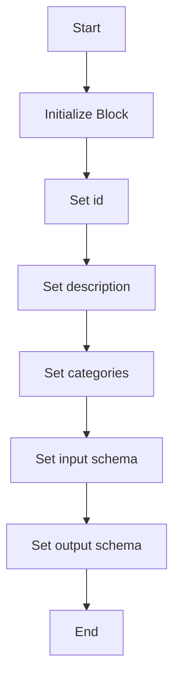
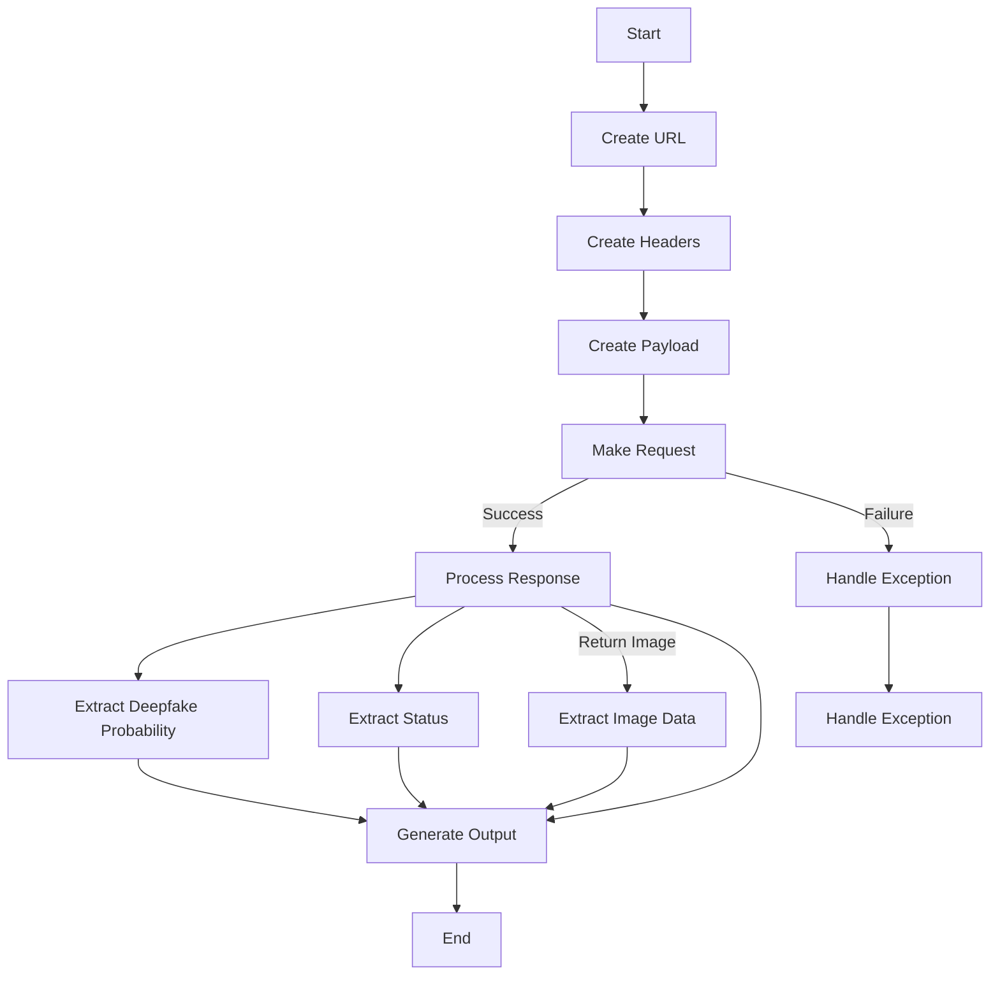

# `.\AutoGPT\autogpt_platform\backend\backend\blocks\nvidia\deepfake.py` 详细设计文档

The code provides a block for detecting deepfakes in images using Nvidia's AI API, handling input, processing, and output of detection results.

## 整体流程

```mermaid
graph TD
    A[Start] --> B[Create NvidiaDeepfakeDetectBlock instance]
    B --> C[Initialize with super().__init__]
    C --> D[Run the block with input_data and credentials]
    D --> E[Set up API request with headers and payload]
    E --> F[Send POST request to Nvidia's API]
    F -->|Success| G[Process API response]
    F -->|Failure| H[Handle exception and set error status]
    G --> I[Extract deepfake probability and status]
    I -->|Return image| J[Set processed image in output]
    I -->|No image| K[Set empty image in output]
    J --> L[Return output with status, is_deepfake, and image]
    K --> L[Return output with status, is_deepfake, and empty image]
    L --> M[End]
```

## 类结构

```
NvidiaDeepfakeDetectBlock (Concrete Block)
├── Input (BlockSchemaInput)
│   ├── credentials (NvidiaCredentialsInput)
│   ├── image_base64 (MediaFileType)
│   └── return_image (bool)
└── Output (BlockSchemaOutput)
    ├── status (str)
    ├── image (MediaFileType)
    └── is_deepfake (float)
```

## 全局变量及字段


### `id`
    
Unique identifier for the block

类型：`str`
    


### `description`
    
Description of the block's functionality

类型：`str`
    


### `categories`
    
Set of categories the block belongs to

类型：`set`
    


### `input_schema`
    
Schema for the input data of the block

类型：`NvidiaDeepfakeDetectBlock.Input`
    


### `output_schema`
    
Schema for the output data of the block

类型：`NvidiaDeepfakeDetectBlock.Output`
    


### `credentials`
    
Credentials for accessing Nvidia's AI API

类型：`NvidiaCredentials`
    


### `image_base64`
    
Base64 encoded image to analyze for deepfakes

类型：`MediaFileType`
    


### `return_image`
    
Flag indicating whether to return the processed image with markings

类型：`bool`
    


### `status`
    
Detection status (SUCCESS, ERROR, CONTENT_FILTERED)

类型：`str`
    


### `image`
    
Processed image with detection markings (if return_image=True)

类型：`MediaFileType`
    


### `is_deepfake`
    
Probability that the image is a deepfake (0-1)

类型：`float`
    


### `error`
    
Error message if an exception occurs

类型：`str`
    


### `NvidiaDeepfakeDetectBlock.id`
    
Unique identifier for the block

类型：`str`
    


### `NvidiaDeepfakeDetectBlock.description`
    
Description of the block's functionality

类型：`str`
    


### `NvidiaDeepfakeDetectBlock.categories`
    
Set of categories the block belongs to

类型：`set`
    


### `NvidiaDeepfakeDetectBlock.input_schema`
    
Schema for the input data of the block

类型：`NvidiaDeepfakeDetectBlock.Input`
    


### `NvidiaDeepfakeDetectBlock.output_schema`
    
Schema for the output data of the block

类型：`NvidiaDeepfakeDetectBlock.Output`
    


### `Input.credentials`
    
Credentials for accessing Nvidia's AI API

类型：`NvidiaCredentials`
    


### `Input.image_base64`
    
Base64 encoded image to analyze for deepfakes

类型：`MediaFileType`
    


### `Input.return_image`
    
Flag indicating whether to return the processed image with markings

类型：`bool`
    


### `Output.status`
    
Detection status (SUCCESS, ERROR, CONTENT_FILTERED)

类型：`str`
    


### `Output.image`
    
Processed image with detection markings (if return_image=True)

类型：`MediaFileType`
    


### `Output.is_deepfake`
    
Probability that the image is a deepfake (0-1)

类型：`float`
    


### `NvidiaDeepfakeDetectBlock.error`
    
Error message if an exception occurs

类型：`str`
    
    

## 全局函数及方法


### NvidiaDeepfakeDetectBlock.__init__

This method initializes the NvidiaDeepfakeDetectBlock class, setting up its properties and configurations.

参数：

- `id`：`str`，The unique identifier for the block.
- `description`：`str`，A description of the block's functionality.
- `categories`：`set`，A set of categories that the block belongs to.
- `input_schema`：`Input`，The input schema for the block.
- `output_schema`：`Output`，The output schema for the block.

返回值：`None`，This method does not return any value.

#### 流程图



#### 带注释源码

```python
def __init__(self):
    super().__init__(
        id="8c7d0d67-e79c-44f6-92a1-c2600c8aac7f",
        description="Detects potential deepfakes in images using Nvidia's AI API",
        categories={BlockCategory.SAFETY},
        input_schema=NvidiaDeepfakeDetectBlock.Input,
        output_schema=NvidiaDeepfakeDetectBlock.Output,
    )
```


### NvidiaDeepfakeDetectBlock.run

This method runs the deepfake detection process using Nvidia's AI API.

参数：

- `input_data`：`Input`，The input data for the block, including credentials, image data, and return image preference.
- `credentials`：`NvidiaCredentials`，The credentials object containing the API key for Nvidia's AI API.

返回值：`BlockOutput`，The output of the block, including the detection status, image with markings (if requested), and probability of the image being a deepfake.

#### 流程图



#### 带注释源码

```python
async def run(self, input_data: Input, *, credentials: NvidiaCredentials, **kwargs) -> BlockOutput:
    url = "https://ai.api.nvidia.com/v1/cv/hive/deepfake-image-detection"

    headers = {
        "accept": "application/json",
        "content-type": "application/json",
        "Authorization": f"Bearer {credentials.api_key.get_secret_value()}",
    }

    image_data = f"data:image/jpeg;base64,{input_data.image_base64}"

    payload = {
        "input": [image_data],
        "return_image": input_data.return_image,
    }

    try:
        response = await Requests().post(url, headers=headers, json=payload)
        data = response.json()

        result = data.get("data", [{}])[0]

        # Get deepfake probability from first bounding box if any
        deepfake_prob = 0.0
        if result.get("bounding_boxes"):
            deepfake_prob = result["bounding_boxes"][0].get("is_deepfake", 0.0)

        yield "status", result.get("status", "ERROR")
        yield "is_deepfake", deepfake_prob

        if input_data.return_image:
            image_data = result.get("image", "")
            output_data = f"data:image/jpeg;base64,{image_data}"
            yield "image", output_data
        else:
            yield "image", ""

    except Exception as e:
        yield "error", str(e)
        yield "status", "ERROR"
        yield "is_deepfake", 0.0
        yield "image", ""
```


## 关键组件


### 张量索引与惰性加载

用于高效地处理和索引大型张量数据，支持按需加载，减少内存消耗。

### 反量化支持

提供对量化技术的支持，以优化模型性能和资源使用。

### 量化策略

定义了量化过程中的具体策略，如量化精度、量化范围等，以适应不同的应用场景。


## 问题及建议


### 已知问题

-   **异常处理**: 代码中的异常处理较为简单，仅捕获了所有异常并返回错误状态。建议对不同的异常类型进行更细致的处理，以便更好地诊断问题。
-   **API 依赖**: 代码依赖于外部 API（Nvidia's AI API），如果 API 不可用或返回格式发生变化，代码可能会出现错误。建议实现更健壮的 API 依赖管理。
-   **输入验证**: 代码没有对输入数据进行验证，例如 `image_base64` 是否为有效的 Base64 编码。建议在运行前对输入数据进行验证。
-   **性能**: 如果处理大量图像，代码的性能可能会受到影响。建议考虑使用异步编程来提高性能。

### 优化建议

-   **异常处理**: 实现更详细的异常处理逻辑，针对不同的异常类型提供不同的错误信息或恢复策略。
-   **API 依赖**: 实现一个 API 依赖管理器，用于处理 API 的可用性和错误响应。
-   **输入验证**: 在运行前对输入数据进行验证，确保它们符合预期格式。
-   **性能**: 考虑使用异步编程来处理图像处理和 API 调用，以提高代码的响应速度和吞吐量。
-   **日志记录**: 实现日志记录功能，以便跟踪代码的执行情况和潜在问题。
-   **单元测试**: 编写单元测试以确保代码的稳定性和可靠性。
-   **代码复用**: 考虑将重复的代码（如异常处理和日志记录）提取到单独的函数或类中，以提高代码的可维护性。


## 其它


### 设计目标与约束

- 设计目标：
  - 实现一个能够检测图像中是否存在深度伪造的模块。
  - 使用Nvidia的AI API进行深度伪造检测。
  - 提供一个清晰的接口，方便其他模块调用。
- 约束：
  - 必须使用Nvidia提供的API进行检测。
  - 输入图像必须以Base64编码的形式提供。
  - 输出结果应包括检测状态、深度伪造概率和可选的标记图像。

### 错误处理与异常设计

- 错误处理：
  - 在API调用过程中，如果发生异常，将捕获异常并返回错误信息。
  - 如果API返回错误，将返回相应的错误状态和消息。
- 异常设计：
  - 使用try-except块来捕获和处理可能发生的异常。
  - 定义一个统一的错误输出格式，包括错误消息和状态。

### 数据流与状态机

- 数据流：
  - 输入数据包括Base64编码的图像、API凭证和是否返回标记图像的标志。
  - 输出数据包括检测状态、深度伪造概率和可选的标记图像。
- 状态机：
  - 状态包括成功、错误和内容过滤。
  - 状态转换基于API的响应和异常处理。

### 外部依赖与接口契约

- 外部依赖：
  - Nvidia的AI API。
  - Requests库用于发送HTTP请求。
- 接口契约：
  - 输入接口契约定义了输入数据的格式和类型。
  - 输出接口契约定义了输出数据的格式和类型。
  - API接口契约定义了与Nvidia API交互的规范。


    