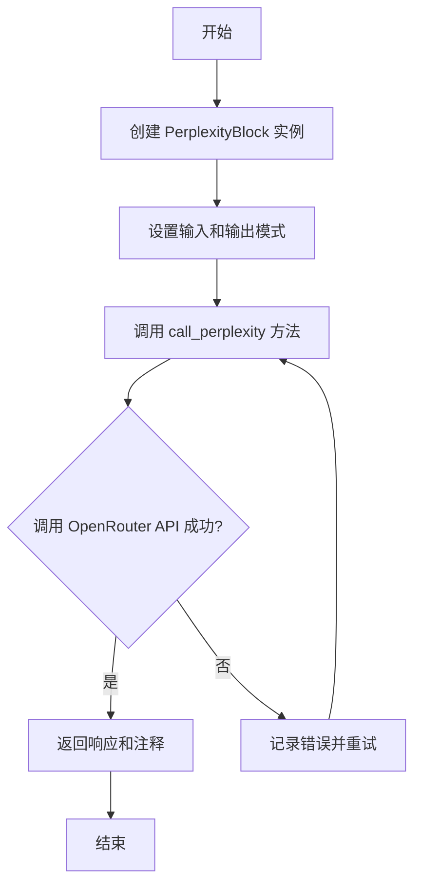
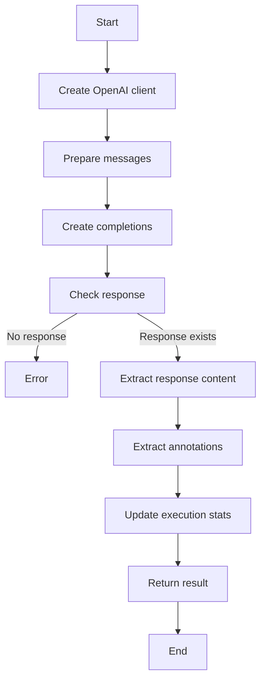
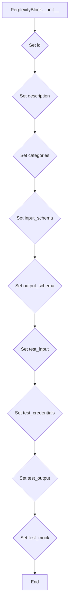
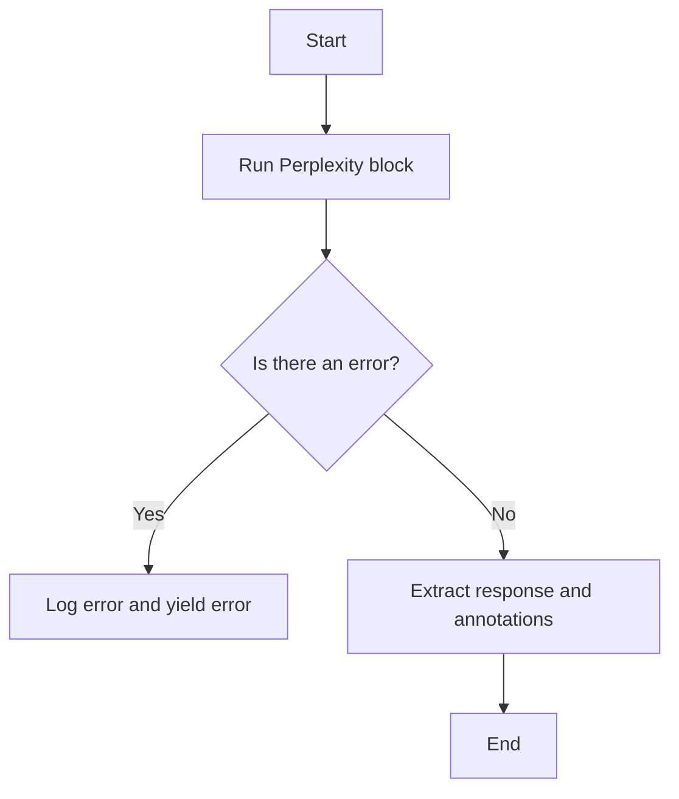

# `.\AutoGPT\autogpt_platform\backend\backend\blocks\perplexity.py` 详细设计文档

The code defines a PerplexityBlock class that queries Perplexity's sonar models via OpenRouter and returns annotated responses with source citations.

## 整体流程



## 类结构

```
PerplexityBlock (类)
├── Input (类)
│   ├── prompt (str)
│   ├── model (PerplexityModel)
│   ├── credentials (PerplexityCredentials)
│   └── system_prompt (str)
│       └── max_tokens (int | None)
└── Output (类)
└── response (str)
    └── annotations (list[dict[str, Any]])
```

## 全局变量及字段


### `logger`
    
Logger instance for the PerplexityBlock class.

类型：`TruncatedLogger`
    


### `PerplexityModel`
    
Enum representing available Perplexity sonar models.

类型：`Enum`
    


### `PerplexityCredentials`
    
Type for Perplexity credentials.

类型：`CredentialsMetaInput`
    


### `TEST_CREDENTIALS`
    
Test credentials for Perplexity API.

类型：`APIKeyCredentials`
    


### `TEST_CREDENTIALS_INPUT`
    
Input data for test credentials.

类型：`dict`
    


### `ProviderName`
    
Enum representing provider names.

类型：`Literal`
    


### `Block`
    
Base class for blocks.

类型：`Block`
    


### `BlockCategory`
    
Enum representing block categories.

类型：`Literal`
    


### `BlockOutput`
    
Type for block output schema.

类型：`BlockSchemaOutput`
    


### `BlockSchemaInput`
    
Type for block input schema.

类型：`BlockSchemaInput`
    


### `BlockSchemaOutput`
    
Type for block output schema.

类型：`BlockSchemaOutput`
    


### `APIKeyCredentials`
    
Type for API key credentials.

类型：`APIKeyCredentials`
    


### `CredentialsField`
    
Type for credentials field.

类型：`CredentialsField`
    


### `CredentialsMetaInput`
    
Type for credentials meta input.

类型：`CredentialsMetaInput`
    


### `NodeExecutionStats`
    
Type for node execution stats.

类型：`NodeExecutionStats`
    


### `SchemaField`
    
Type for schema field.

类型：`SchemaField`
    


### `SecretStr`
    
Type for secret string.

类型：`SecretStr`
    


### `openai`
    
Module for OpenAI API integration.

类型：`module`
    


### `TruncatedLogger`
    
Logger class for truncating log messages.

类型：`TruncatedLogger`
    


### `PerplexityModel.SONAR`
    
Perplexity model option for sonar.

类型：`str`
    


### `PerplexityModel.SONAR_PRO`
    
Perplexity model option for sonar pro.

类型：`str`
    


### `PerplexityModel.SONAR_DEEP_RESEARCH`
    
Perplexity model option for deep research sonar.

类型：`str`
    


### `PerplexityBlock.id`
    
Unique identifier for the PerplexityBlock.

类型：`str`
    


### `PerplexityBlock.description`
    
Description of the PerplexityBlock.

类型：`str`
    


### `PerplexityBlock.categories`
    
Categories to which the PerplexityBlock belongs.

类型：`set`
    


### `PerplexityBlock.input_schema`
    
Input schema for the PerplexityBlock.

类型：`BlockSchemaInput`
    


### `PerplexityBlock.output_schema`
    
Output schema for the PerplexityBlock.

类型：`BlockSchemaOutput`
    


### `PerplexityBlock.test_input`
    
Test input data for the PerplexityBlock.

类型：`dict`
    


### `PerplexityBlock.test_credentials`
    
Test credentials for the PerplexityBlock.

类型：`APIKeyCredentials`
    


### `PerplexityBlock.test_output`
    
Test output data for the PerplexityBlock.

类型：`list`
    


### `PerplexityBlock.test_mock`
    
Mock data for testing the PerplexityBlock.

类型：`dict`
    


### `PerplexityBlock.execution_stats`
    
Execution stats for the PerplexityBlock.

类型：`NodeExecutionStats`
    


### `PerplexityBlock.Input.prompt`
    
Prompt for the PerplexityBlock input.

类型：`str`
    


### `PerplexityBlock.Input.model`
    
Model to use for the PerplexityBlock input.

类型：`PerplexityModel`
    


### `PerplexityBlock.Input.credentials`
    
Credentials for the PerplexityBlock input.

类型：`PerplexityCredentials`
    


### `PerplexityBlock.Input.system_prompt`
    
System prompt for the PerplexityBlock input.

类型：`str`
    


### `PerplexityBlock.Input.max_tokens`
    
Maximum number of tokens for the PerplexityBlock input.

类型：`int`
    


### `PerplexityBlock.Output.response`
    
Response from the PerplexityBlock output.

类型：`str`
    


### `PerplexityBlock.Output.annotations`
    
Annotations from the PerplexityBlock output.

类型：`list`
    


### `PerplexityBlock.id`
    
Unique identifier for the PerplexityBlock.

类型：`str`
    


### `PerplexityBlock.description`
    
Description of the PerplexityBlock.

类型：`str`
    


### `PerplexityBlock.categories`
    
Categories to which the PerplexityBlock belongs.

类型：`set`
    


### `PerplexityBlock.input_schema`
    
Input schema for the PerplexityBlock.

类型：`BlockSchemaInput`
    


### `PerplexityBlock.output_schema`
    
Output schema for the PerplexityBlock.

类型：`BlockSchemaOutput`
    


### `PerplexityBlock.test_input`
    
Test input data for the PerplexityBlock.

类型：`dict`
    


### `PerplexityBlock.test_credentials`
    
Test credentials for the PerplexityBlock.

类型：`APIKeyCredentials`
    


### `PerplexityBlock.test_output`
    
Test output data for the PerplexityBlock.

类型：`list`
    


### `PerplexityBlock.test_mock`
    
Mock data for testing the PerplexityBlock.

类型：`dict`
    


### `PerplexityBlock.execution_stats`
    
Execution stats for the PerplexityBlock.

类型：`NodeExecutionStats`
    


### `PerplexityBlock.Input.prompt`
    
Prompt for the PerplexityBlock input.

类型：`str`
    


### `PerplexityBlock.Input.model`
    
Model to use for the PerplexityBlock input.

类型：`PerplexityModel`
    


### `PerplexityBlock.Input.credentials`
    
Credentials for the PerplexityBlock input.

类型：`PerplexityCredentials`
    


### `PerplexityBlock.Input.system_prompt`
    
System prompt for the PerplexityBlock input.

类型：`str`
    


### `PerplexityBlock.Input.max_tokens`
    
Maximum number of tokens for the PerplexityBlock input.

类型：`int`
    


### `PerplexityBlock.Output.response`
    
Response from the PerplexityBlock output.

类型：`str`
    


### `PerplexityBlock.Output.annotations`
    
Annotations from the PerplexityBlock output.

类型：`list`
    
    

## 全局函数及方法


### PerplexityBlock.call_perplexity

Call Perplexity via OpenRouter and extract annotations.

参数：

- `credentials`：`APIKeyCredentials`，API credentials for accessing Perplexity.
- `model`：`PerplexityModel`，The Perplexity sonar model to use.
- `prompt`：`str`，The query to send to the Perplexity model.
- `system_prompt`：`str`，Optional system prompt to provide context to the model.
- `max_tokens`：`int | None`，The maximum number of tokens to generate.

返回值：`dict[str, Any]`，A dictionary containing the response and annotations from the Perplexity model.

#### 流程图



#### 带注释源码

```python
async def call_perplexity(
    self,
    credentials: APIKeyCredentials,
    model: PerplexityModel,
    prompt: str,
    system_prompt: str = "",
    max_tokens: int | None = None,
) -> dict[str, Any]:
    """Call Perplexity via OpenRouter and extract annotations."""
    client = openai.AsyncOpenAI(
        base_url="https://openrouter.ai/api/v1",
        api_key=credentials.api_key.get_secret_value(),
    )

    messages = []
    if system_prompt:
        messages.append({"role": "system", "content": system_prompt})
    messages.append({"role": "user", "content": prompt})

    try:
        response = await client.chat.completions.create(
            extra_headers={
                "HTTP-Referer": "https://agpt.co",
                "X-Title": "AutoGPT",
            },
            model=model.value,
            messages=messages,
            max_tokens=max_tokens,
        )

        if not response.choices:
            raise ValueError("No response from Perplexity via OpenRouter.")

        # Extract the response content
        response_content = response.choices[0].message.content or ""

        # Extract annotations if present in the message
        annotations = []
        if hasattr(response.choices[0].message, "annotations"):
            # If annotations are directly available
            annotations = response.choices[0].message.annotations
        else:
            # Check if there's a raw response with annotations
            raw = getattr(response.choices[0].message, "_raw_response", None)
            if isinstance(raw, dict) and "annotations" in raw:
                annotations = raw["annotations"]

        if not annotations and hasattr(response, "model_extra"):
            # Check model_extra for annotations
            model_extra = response.model_extra
            if isinstance(model_extra, dict):
                # Check in choices
                if "choices" in model_extra and len(model_extra["choices"]) > 0:
                    choice = model_extra["choices"][0]
                    if "message" in choice and "annotations" in choice["message"]:
                        annotations = choice["message"]["annotations"]

        # Also check the raw response object for annotations
        if not annotations:
            raw = getattr(response, "_raw_response", None)
            if isinstance(raw, dict):
                # Check various possible locations for annotations
                if "annotations" in raw:
                    annotations = raw["annotations"]
                elif "choices" in raw and len(raw["choices"]) > 0:
                    choice = raw["choices"][0]
                    if "message" in choice and "annotations" in choice["message"]:
                        annotations = choice["message"]["annotations"]

        # Update execution stats
        if response.usage:
            self.execution_stats.input_token_count = response.usage.prompt_tokens
            self.execution_stats.output_token_count = (
                response.usage.completion_tokens
            )

        return {"response": response_content, "annotations": annotations or []}

    except Exception as e:
        logger.error(f"Error calling Perplexity: {e}")
        raise
``` 


### call_perplexity

Call Perplexity via OpenRouter and extract annotations.

参数：

- `credentials`：`APIKeyCredentials`，OpenRouter API credentials for accessing Perplexity models.
- `model`：`PerplexityModel`，The Perplexity sonar model to use.
- `prompt`：`str`，The query to send to the Perplexity model.
- `system_prompt`：`str`，Optional system prompt to provide context to the model. Defaults to an empty string.
- `max_tokens`：`int | None`，The maximum number of tokens to generate. Defaults to `None`.

返回值：`dict[str, Any]`，A dictionary containing the response from the Perplexity model and any annotations.

#### 流程图


#### 带注释源码

```python
async def call_perplexity(
    self,
    credentials: APIKeyCredentials,
    model: PerplexityModel,
    prompt: str,
    system_prompt: str = "",
    max_tokens: int | None = None,
) -> dict[str, Any]:
    """Call Perplexity via OpenRouter and extract annotations."""
    client = openai.AsyncOpenAI(
        base_url="https://openrouter.ai/api/v1",
        api_key=credentials.api_key.get_secret_value(),
    )

    messages = []
    if system_prompt:
        messages.append({"role": "system", "content": system_prompt})
    messages.append({"role": "user", "content": prompt})

    try:
        response = await client.chat.completions.create(
            extra_headers={
                "HTTP-Referer": "https://agpt.co",
                "X-Title": "AutoGPT",
            },
            model=model.value,
            messages=messages,
            max_tokens=max_tokens,
        )

        if not response.choices:
            raise ValueError("No response from Perplexity via OpenRouter.")

        # Extract the response content
        response_content = response.choices[0].message.content or ""

        # Extract annotations if present in the message
        annotations = []
        if hasattr(response.choices[0].message, "annotations"):
            # If annotations are directly available
            annotations = response.choices[0].message.annotations
        else:
            # Check if there's a raw response with annotations
            raw = getattr(response.choices[0].message, "_raw_response", None)
            if isinstance(raw, dict) and "annotations" in raw:
                annotations = raw["annotations"]

        if not annotations and hasattr(response, "model_extra"):
            # Check model_extra for annotations
            model_extra = response.model_extra
            if isinstance(model_extra, dict):
                # Check in choices
                if "choices" in model_extra and len(model_extra["choices"]) > 0:
                    choice = model_extra["choices"][0]
                    if "message" in choice and "annotations" in choice["message"]:
                        annotations = choice["message"]["annotations"]

        # Also check the raw response object for annotations
        if not annotations:
            raw = getattr(response, "_raw_response", None)
            if isinstance(raw, dict):
                # Check various possible locations for annotations
                if "annotations" in raw:
                    annotations = raw["annotations"]
                elif "choices" in raw and len(raw["choices"]) > 0:
                    choice = raw["choices"][0]
                    if "message" in choice and "annotations" in choice["message"]:
                        annotations = choice["message"]["annotations"]

        # Update execution stats
        if response.usage:
            self.execution_stats.input_token_count = response.usage.prompt_tokens
            self.execution_stats.output_token_count = (
                response.usage.completion_tokens
            )

        return {"response": response_content, "annotations": annotations or []}

    except Exception as e:
        logger.error(f"Error calling Perplexity: {e}")
        raise
``` 


### PerplexityBlock.__init__

This method initializes a PerplexityBlock instance, setting up its properties and configurations.

参数：

- `id`: `str`，The unique identifier for the PerplexityBlock.
- `description`: `str`，A description of the PerplexityBlock.
- `categories`: `set`，A set of categories that the PerplexityBlock belongs to.
- `input_schema`: `Input`，The input schema for the PerplexityBlock.
- `output_schema`: `Output`，The output schema for the PerplexityBlock.
- `test_input`: `dict`，The test input data for the PerplexityBlock.
- `test_credentials`: `APIKeyCredentials`，The test credentials for the PerplexityBlock.
- `test_output`: `list`，The test output data for the PerplexityBlock.
- `test_mock`: `dict`，The test mock data for the PerplexityBlock.

返回值：`None`，This method does not return any value.

#### 流程图



#### 带注释源码

```python
def __init__(self):
    super().__init__(
        id="c8a5f2e9-8b3d-4a7e-9f6c-1d5e3c9b7a4f",
        description="Query Perplexity's sonar models with real-time web search capabilities and receive annotated responses with source citations.",
        categories={BlockCategory.AI, BlockCategory.SEARCH},
        input_schema=PerplexityBlock.Input,
        output_schema=PerplexityBlock.Output,
        test_input={
            "prompt": "What is the weather today?",
            "model": PerplexityModel.SONAR,
            "credentials": TEST_CREDENTIALS_INPUT,
        },
        test_credentials=TEST_CREDENTIALS,
        test_output=[
            ("response", "The weather varies by location..."),
            ("annotations", list),
        ],
        test_mock={
            "call_perplexity": lambda *args, **kwargs: {
                "response": "The weather varies by location...",
                "annotations": [
                    {
                        "type": "url_citation",
                        "url_citation": {
                            "title": "weather.com",
                            "url": "https://weather.com",
                        },
                    }
                ],
            }
        },
    )
    self.execution_stats = NodeExecutionStats()
```


### PerplexityBlock.call_perplexity

Call Perplexity via OpenRouter and extract annotations.

参数：

- `credentials`：`APIKeyCredentials`，OpenRouter API credentials for accessing Perplexity models.
- `model`：`PerplexityModel`，The Perplexity sonar model to use.
- `prompt`：`str`，The query to send to the Perplexity model.
- `system_prompt`：`str`，Optional system prompt to provide context to the model. Defaults to an empty string.
- `max_tokens`：`int | None`，The maximum number of tokens to generate. Defaults to `None`.

返回值：`dict[str, Any]`，A dictionary containing the response from the Perplexity model and any annotations.

#### 流程图


#### 带注释源码

```python
async def call_perplexity(
    self,
    credentials: APIKeyCredentials,
    model: PerplexityModel,
    prompt: str,
    system_prompt: str = "",
    max_tokens: int | None = None,
) -> dict[str, Any]:
    """Call Perplexity via OpenRouter and extract annotations."""
    client = openai.AsyncOpenAI(
        base_url="https://openrouter.ai/api/v1",
        api_key=credentials.api_key.get_secret_value(),
    )

    messages = []
    if system_prompt:
        messages.append({"role": "system", "content": system_prompt})
    messages.append({"role": "user", "content": prompt})

    try:
        response = await client.chat.completions.create(
            extra_headers={
                "HTTP-Referer": "https://agpt.co",
                "X-Title": "AutoGPT",
            },
            model=model.value,
            messages=messages,
            max_tokens=max_tokens,
        )

        if not response.choices:
            raise ValueError("No response from Perplexity via OpenRouter.")

        # Extract the response content
        response_content = response.choices[0].message.content or ""

        # Extract annotations if present in the message
        annotations = []
        if hasattr(response.choices[0].message, "annotations"):
            # If annotations are directly available
            annotations = response.choices[0].message.annotations
        else:
            # Check if there's a raw response with annotations
            raw = getattr(response.choices[0].message, "_raw_response", None)
            if isinstance(raw, dict) and "annotations" in raw:
                annotations = raw["annotations"]

        if not annotations and hasattr(response, "model_extra"):
            # Check model_extra for annotations
            model_extra = response.model_extra
            if isinstance(model_extra, dict):
                # Check in choices
                if "choices" in model_extra and len(model_extra["choices"]) > 0:
                    choice = model_extra["choices"][0]
                    if "message" in choice and "annotations" in choice["message"]:
                        annotations = choice["message"]["annotations"]

        # Also check the raw response object for annotations
        if not annotations:
            raw = getattr(response, "_raw_response", None)
            if isinstance(raw, dict):
                # Check various possible locations for annotations
                if "annotations" in raw:
                    annotations = raw["annotations"]
                elif "choices" in raw and len(raw["choices"]) > 0:
                    choice = raw["choices"][0]
                    if "message" in choice and "annotations" in choice["message"]:
                        annotations = choice["message"]["annotations"]

        # Update execution stats
        if response.usage:
            self.execution_stats.input_token_count = response.usage.prompt_tokens
            self.execution_stats.output_token_count = (
                response.usage.completion_tokens
            )

        return {"response": response_content, "annotations": annotations or []}

    except Exception as e:
        logger.error(f"Error calling Perplexity: {e}")
        raise
``` 


### PerplexityBlock.run

This method runs the Perplexity block, which queries Perplexity's sonar models with real-time web search capabilities and returns annotated responses with source citations.

参数：

- `input_data`：`Input`，The input data for the Perplexity block.
- `credentials`：`APIKeyCredentials`，The credentials used to access the Perplexity API.
- `**kwargs`：Additional keyword arguments that may be passed to the method.

返回值：`BlockOutput`，The output of the Perplexity block, which includes the response and annotations.

#### 流程图



#### 带注释源码

```python
async def run(self, input_data: Input, *, credentials: APIKeyCredentials, **kwargs) -> BlockOutput:
    logger.debug(f"Running Perplexity block with model: {input_data.model}")

    try:
        result = await self.call_perplexity(
            credentials=credentials,
            model=input_data.model,
            prompt=input_data.prompt,
            system_prompt=input_data.system_prompt,
            max_tokens=input_data.max_tokens,
        )

        yield "response", result["response"]
        yield "annotations", result["annotations"]

    except Exception as e:
        error_msg = f"Error calling Perplexity: {str(e)}"
        logger.error(error_msg)
        yield "error", error_msg
```


## 关键组件


### 张量索引与惰性加载

张量索引与惰性加载是代码中用于高效处理和访问大型数据集的关键组件。它们允许在需要时才加载数据，从而减少内存消耗并提高性能。

### 反量化支持

反量化支持是代码中用于处理和转换量化数据的关键组件。它确保量化数据在处理过程中保持准确性和一致性。

### 量化策略

量化策略是代码中用于优化模型性能和资源使用的关键组件。它通过减少模型参数的精度来降低计算复杂度和内存占用。


## 问题及建议


### 已知问题

-   **依赖性**: 代码依赖于外部API（OpenRouter和OpenAI），如果这些服务不可用或出现故障，代码将无法正常运行。
-   **异常处理**: 异常处理主要集中在捕获异常并记录错误，但没有提供详细的错误恢复或用户通知机制。
-   **代码复用**: `call_perplexity` 函数中存在大量重复代码，用于检查和提取注释，可以考虑将其封装为单独的函数以提高代码复用性。
-   **日志记录**: 日志记录主要集中在错误信息，可能需要更详细的日志记录来帮助调试和监控。
-   **输入验证**: 代码中没有对输入数据进行验证，这可能导致运行时错误。

### 优化建议

-   **增加输入验证**: 在调用 `call_perplexity` 之前，对输入数据进行验证，确保它们符合预期的格式和类型。
-   **封装重复代码**: 将注释提取逻辑封装为单独的函数，减少重复代码并提高可维护性。
-   **改进异常处理**: 除了记录错误外，还应考虑如何通知用户错误信息，并尝试恢复或重试操作。
-   **日志记录**: 增加详细的日志记录，包括请求和响应信息，以便于调试和监控。
-   **错误恢复**: 实现错误恢复机制，例如在API调用失败时重试或使用备用服务。
-   **代码测试**: 编写单元测试来确保代码的正确性和稳定性。
-   **性能优化**: 分析代码性能，特别是 `call_perplexity` 函数，寻找可能的性能瓶颈并进行优化。


## 其它


### 设计目标与约束

- 设计目标：
  - 实现一个能够查询Perplexity的sonar模型并返回带注释响应的块。
  - 提供一个用户友好的界面，允许用户选择模型、输入查询和系统提示。
  - 确保响应的准确性和可靠性。
- 约束：
  - 必须使用OpenRouter API进行通信。
  - 必须处理可能的异常和错误，确保系统的健壮性。
  - 必须遵守API的使用限制和速率限制。

### 错误处理与异常设计

- 错误处理：
  - 在调用Perplexity API时，捕获并记录所有异常。
  - 如果发生异常，记录错误信息并返回给用户。
- 异常设计：
  - 定义自定义异常类，以处理特定于Perplexity块的错误情况。
  - 使用try-except块来捕获和处理异常。

### 数据流与状态机

- 数据流：
  - 用户输入查询和模型选择。
  - 块处理输入，调用Perplexity API。
  - API返回响应和注释。
  - 块将响应和注释返回给用户。
- 状态机：
  - 块的状态包括：空闲、运行中、完成、错误。
  - 状态转换由用户输入和API响应触发。

### 外部依赖与接口契约

- 外部依赖：
  - OpenRouter API。
  - OpenAI API。
- 接口契约：
  - OpenRouter API的调用规范。
  - OpenAI API的调用规范。
  - APIKeyCredentials和CredentialsMetaInput类的定义。


    