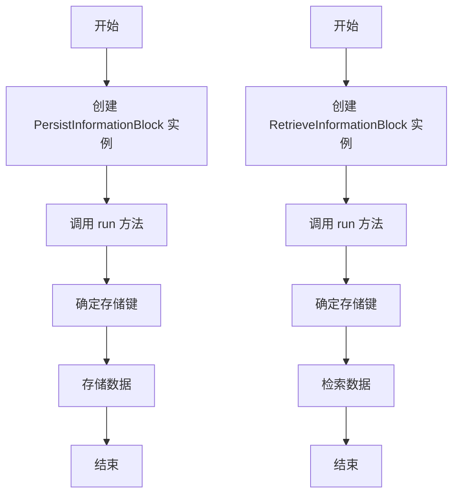
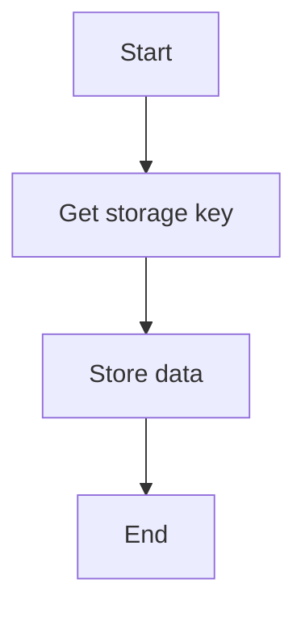
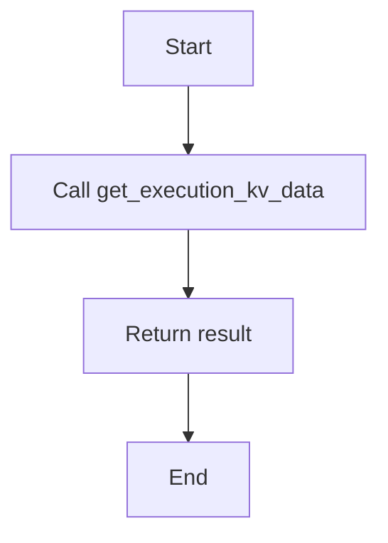
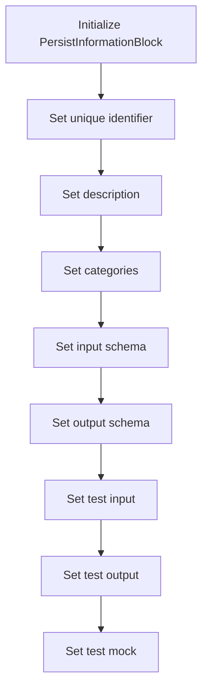
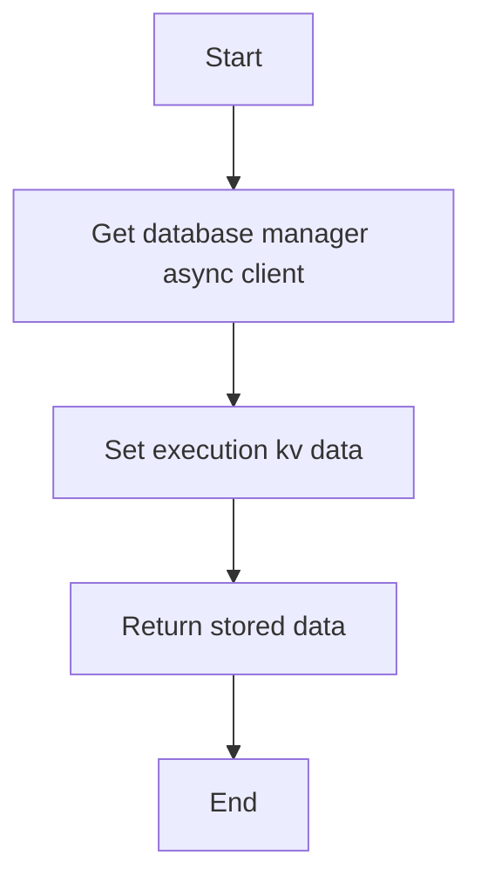
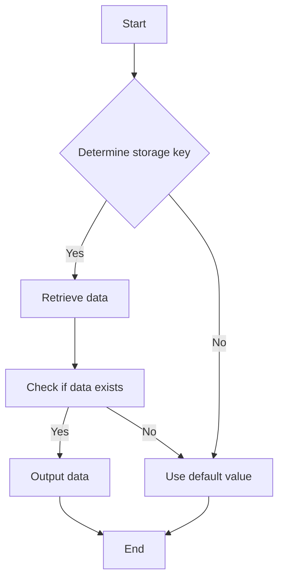

# `.\AutoGPT\autogpt_platform\backend\backend\blocks\persistence.py` 详细设计文档

This code defines two classes, PersistInformationBlock and RetrieveInformationBlock, which are used to store and retrieve key-value data for a user with configurable scope. The data is stored and retrieved from a database using asynchronous calls.

## 整体流程



## 类结构

```
PersistInformationBlock (持久化信息块)
├── Input (输入)
│   ├── key (str): 存储信息的键
│   ├── value (Any): 要存储的值
│   └── scope (StorageScope): 持久化范围
└── Output (输出)
    └── value (Any): 存储的值
RetrieveInformationBlock (检索信息块)
├── Input (输入)
│   ├── key (str): 检索信息的键
│   ├── scope (StorageScope): 持久化范围
│   └── default_value (Any): 如果键不存在则返回的默认值
└── Output (输出)
    └── value (Any): 检索到的值或默认值
```

## 全局变量及字段


### `logger`
    
Logger instance for logging messages

类型：`logging.Logger`
    


### `StorageScope`
    
Literal type for storage scope options

类型：`Literal['within_agent', 'across_agents']`
    


### `PersistInformationBlock.id`
    
Unique identifier for the block

类型：`str`
    


### `PersistInformationBlock.description`
    
Description of the block's purpose

类型：`str`
    


### `PersistInformationBlock.categories`
    
Categories to which the block belongs

类型：`set[backend.data.block.BlockCategory]`
    


### `PersistInformationBlock.input_schema`
    
Input schema for the block

类型：`backend.data.block.BlockSchemaInput`
    


### `PersistInformationBlock.output_schema`
    
Output schema for the block

类型：`backend.data.block.BlockSchemaOutput`
    


### `PersistInformationBlock.test_input`
    
Test input data for the block

类型：`dict`
    


### `PersistInformationBlock.test_output`
    
Test output data for the block

类型：`list`
    


### `PersistInformationBlock.test_mock`
    
Mock data for testing the block

类型：`dict`
    


### `RetrieveInformationBlock.id`
    
Unique identifier for the block

类型：`str`
    


### `RetrieveInformationBlock.description`
    
Description of the block's purpose

类型：`str`
    


### `RetrieveInformationBlock.categories`
    
Categories to which the block belongs

类型：`set[backend.data.block.BlockCategory]`
    


### `RetrieveInformationBlock.input_schema`
    
Input schema for the block

类型：`backend.data.block.BlockSchemaInput`
    


### `RetrieveInformationBlock.output_schema`
    
Output schema for the block

类型：`backend.data.block.BlockSchemaOutput`
    


### `RetrieveInformationBlock.test_input`
    
Test input data for the block

类型：`dict`
    


### `RetrieveInformationBlock.test_output`
    
Test output data for the block

类型：`list`
    


### `RetrieveInformationBlock.test_mock`
    
Mock data for testing the block

类型：`dict`
    


### `RetrieveInformationBlock.static_output`
    
Indicates if the block has a static output

类型：`bool`
    
    

## 全局函数及方法


### `get_storage_key`

Generate the storage key based on the scope.

参数：

- `key`：`str`，The key to generate the storage key for.
- `scope`：`StorageScope`，The scope of the storage key.
- `graph_id`：`str`，The graph ID for the storage key.

返回值：`str`，The generated storage key.

#### 流程图

```mermaid
graph TD
    A[Start] --> B{Check scope}
    B -->|scope == "across_agents"?| C[Return "global#{key}"]
    B -->|scope != "across_agents"?| D[Return "agent#{graph_id}#{key}"]
    D --> E[End]
```

#### 带注释源码

```python
def get_storage_key(key: str, scope: StorageScope, graph_id: str) -> str:
    """Generate the storage key based on scope"""
    if scope == "across_agents":
        return f"global#{key}"
    else:
        return f"agent#{graph_id}#{key}"
```


### `_store_data`

Store key-value data for the current user.

参数：

- `user_id`：`str`，The unique identifier for the user.
- `node_exec_id`：`str`，The unique identifier for the node execution.
- `key`：`str`，The key under which the data should be stored.
- `data`：`Any`，The data to be stored.

返回值：`Any | None`，The stored data or `None` if the data could not be stored.

#### 流程图



#### 带注释源码

```python
async def _store_data(
    self, user_id: str, node_exec_id: str, key: str, data: Any
) -> Any | None:
    # Determine the storage key based on scope
    storage_key = get_storage_key(input_data.key, input_data.scope, graph_id)

    # Store the data
    return await get_database_manager_async_client().set_execution_kv_data(
        user_id=user_id,
        node_exec_id=node_exec_id,
        key=key,
        data=data,
    )
```


### `_retrieve_data`

Retrieve the key-value data from the database for the specified user and key.

参数：

- `user_id`：`str`，The unique identifier for the user.
- `key`：`str`，The unique identifier for the key-value data to retrieve.

返回值：`Any | None`，The retrieved value or `None` if the key is not found.

#### 流程图



#### 带注释源码

```python
async def _retrieve_data(self, user_id: str, key: str) -> Any | None:
    return await get_database_manager_async_client().get_execution_kv_data(
        user_id=user_id,
        key=key,
    )
```


### PersistInformationBlock.__init__

This method initializes the PersistInformationBlock class, setting up its properties and configurations.

参数：

- `id`: `str`，The unique identifier for the block.
- `description`: `str`，A description of the block's purpose.
- `categories`: `set` of `BlockCategory`，The categories to which the block belongs.
- `input_schema`: `PersistInformationBlock.Input`，The schema for the input data.
- `output_schema`: `PersistInformationBlock.Output`，The schema for the output data.
- `test_input`: `dict`，Sample input data for testing.
- `test_output`: `list` of tuples，Sample output data for testing.
- `test_mock`: `dict`，Mock functions for testing.

返回值：无，This method does not return any value.

#### 流程图



#### 带注释源码

```python
def __init__(self):
    super().__init__(
        id="1d055e55-a2b9-4547-8311-907d05b0304d",
        description="Persist key-value information for the current user",
        categories={BlockCategory.DATA},
        input_schema=PersistInformationBlock.Input,
        output_schema=PersistInformationBlock.Output,
        test_input={
            "key": "user_preference",
            "value": {"theme": "dark", "language": "en"},
            "scope": "within_agent",
        },
        test_output=[
            ("value", {"theme": "dark", "language": "en"}),
        ],
        test_mock={
            "_store_data": lambda *args, **kwargs: {
                "theme": "dark",
                "language": "en",
            }
        },
    )
```


### PersistInformationBlock.run

This method persists key-value data for the current user with configurable scope.

参数：

- `input_data`：`Input`，The input data containing the key, value, and scope for persistence.
- `user_id`：`str`，The user ID for which the data is being persisted.
- `graph_id`：`str`，The graph ID associated with the execution.
- `node_exec_id`：`str`，The node execution ID associated with the execution.
- `**kwargs`：`Any`，Additional keyword arguments that may be passed to the method.

返回值：`BlockOutput`，The output data containing the stored value.

#### 流程图

```mermaid
graph TD
    A[Start] --> B{Determine storage key}
    B -->|Scope: within_agent| C[Generate key: agent#{graph_id}#{key}]
    B -->|Scope: across_agents| D[Generate key: global#{key}]
    C --> E[Store data]
    D --> E
    E --> F[End]
```

#### 带注释源码

```python
async def run(
    self,
    input_data: Input,
    *,
    user_id: str,
    graph_id: str,
    node_exec_id: str,
    **kwargs,
) -> BlockOutput:
    # Determine the storage key based on scope
    storage_key = get_storage_key(input_data.key, input_data.scope, graph_id)

    # Store the data
    yield "value", await self._store_data(
        user_id=user_id,
        node_exec_id=node_exec_id,
        key=storage_key,
        data=input_data.value,
    )
```


### `_store_data`

Store key-value data in the database for a specific user and execution.

参数：

- `user_id`：`str`，The unique identifier for the user.
- `node_exec_id`：`str`，The unique identifier for the execution node.
- `key`：`str`，The key under which the data should be stored.
- `data`：`Any`，The data to be stored.

返回值：`Any | None`，The stored data or `None` if the data could not be stored.

#### 流程图



#### 带注释源码

```python
async def _store_data(
    self, user_id: str, node_exec_id: str, key: str, data: Any
) -> Any | None:
    # Get the database manager async client
    db_client = await get_database_manager_async_client()
    
    # Set the execution key-value data
    return await db_client.set_execution_kv_data(
        user_id=user_id,
        node_exec_id=node_exec_id,
        key=key,
        data=data,
    )
```


### RetrieveInformationBlock.__init__

This method initializes the `RetrieveInformationBlock` class, setting up its schema, test data, and mock functions.

参数：

- `self`：`RetrieveInformationBlock` 类的实例，用于访问类的属性和方法。

返回值：无

#### 流程图

```mermaid
classDiagram
    class RetrieveInformationBlock {
        +id: str
        +description: str
        +categories: set<BlockCategory>
        +input_schema: Input
        +output_schema: Output
        +test_input: dict
        +test_output: list
        +test_mock: dict
        +static_output: bool
    }
    class Input {
        +key: str
        +scope: StorageScope
        +default_value: Any
    }
    class Output {
        +value: Any
    }
    class BlockCategory {
        +name: str
    }
    RetrieveInformationBlock <|-- Input
    RetrieveInformationBlock <|-- Output
    RetrieveInformationBlock <|-- BlockCategory
    RetrieveInformationBlock <..> super Block
    RetrieveInformationBlock : +init(id: str, description: str, categories: set<BlockCategory>, input_schema: Input, output_schema: Output, test_input: dict, test_output: list, test_mock: dict, static_output: bool)
```

#### 带注释源码

```python
def __init__(self):
    super().__init__(
        id="d8710fc9-6e29-481e-a7d5-165eb16f8471",
        description="Retrieve key-value information for the current user",
        categories={BlockCategory.DATA},
        input_schema=RetrieveInformationBlock.Input,
        output_schema=RetrieveInformationBlock.Output,
        test_input={
            "key": "user_preference",
            "scope": "within_agent",
            "default_value": {"theme": "light", "language": "en"},
        },
        test_output=[
            ("value", {"theme": "light", "language": "en"}),
        ],
        test_mock={"_retrieve_data": lambda *args, **kwargs: None},
        static_output=True,
    )
```


### RetrieveInformationBlock.run

RetrieveInformationBlock.run is a method used to retrieve key-value data for the current user with configurable scope.

参数：

- `input_data`：`Input`，The input data for the block, which includes the key to retrieve the information for, the scope of persistence, and the default value to return if the key is not found.
- `user_id`：`str`，The user ID for which the information is being retrieved.
- `graph_id`：`str`，The graph ID for which the information is being retrieved.
- `**kwargs`：`Any`，Additional keyword arguments that may be passed to the method.

返回值：`BlockOutput`，The output of the block, which includes the retrieved value or the default value if the key is not found.

#### 流程图



#### 带注释源码

```python
async def run(self, input_data: Input, *, user_id: str, graph_id: str, **kwargs) -> BlockOutput:
    # Determine the storage key based on scope
    storage_key = get_storage_key(input_data.key, input_data.scope, graph_id)

    # Retrieve the data
    stored_value = await self._retrieve_data(user_id=user_id, key=storage_key)

    if stored_value is not None:
        yield "value", stored_value
    else:
        yield "value", input_data.default_value
```


### `_retrieve_data`

Retrieve the key-value data from the database for the specified user and key.

参数：

- `user_id`：`str`，The unique identifier for the user.
- `key`：`str`，The unique identifier for the data key to retrieve.

返回值：`Any | None`，The retrieved data or `None` if the key is not found.

#### 流程图


#### 带注释源码

```python
async def _retrieve_data(self, user_id: str, key: str) -> Any | None:
    return await get_database_manager_async_client().get_execution_kv_data(
        user_id=user_id,
        key=key,
    )
```


## 关键组件


### 张量索引与惰性加载

张量索引与惰性加载是用于高效处理大型数据集的关键组件，它允许在需要时才加载数据，从而减少内存消耗和提高性能。

### 反量化支持

反量化支持是用于处理量化数据的关键组件，它能够将量化后的数据转换回原始数据，以便进行进一步的处理和分析。

### 量化策略

量化策略是用于优化模型性能的关键组件，它通过减少模型中使用的数值精度来减少模型大小和计算需求，从而提高模型的效率和部署速度。


## 问题及建议


### 已知问题

-   **全局变量和函数依赖性**：`get_database_manager_async_client()` 函数的调用没有明确的文档说明，这可能导致代码的可维护性和可测试性降低。建议提供该函数的详细文档或将其封装在一个类中，以便更好地管理依赖。
-   **异常处理**：代码中没有显示异常处理逻辑，如果数据库操作失败或发生其他错误，可能会导致程序崩溃。建议添加异常处理来捕获和处理可能发生的错误。
-   **代码重复**：`PersistInformationBlock` 和 `RetrieveInformationBlock` 类中都有 `_store_data` 和 `_retrieve_data` 方法，这些方法具有相似的功能。建议提取这些方法到一个单独的类或模块中，以减少代码重复并提高可维护性。

### 优化建议

-   **封装依赖**：将 `get_database_manager_async_client()` 封装在一个类中，并提供详细的文档说明其功能和用法。
-   **添加异常处理**：在数据库操作中添加异常处理逻辑，例如使用 `try-except` 块来捕获 `asyncio` 异常，并记录错误信息。
-   **提取重复代码**：创建一个单独的类或模块来处理存储和检索数据，这样可以在 `PersistInformationBlock` 和 `RetrieveInformationBlock` 类中复用这些方法。
-   **单元测试**：为 `PersistInformationBlock` 和 `RetrieveInformationBlock` 类编写单元测试，以确保它们按预期工作，并验证异常处理逻辑。
-   **代码风格**：检查代码风格一致性，例如使用 PEP 8 标准来格式化代码，以提高代码的可读性和可维护性。


## 其它


### 设计目标与约束

- 设计目标：
  - 提供一个模块化的数据持久化解决方案，允许用户在特定范围内存储和检索键值对数据。
  - 确保数据存储和检索的灵活性和可配置性。
  - 保证数据存储的安全性，防止未授权访问。
- 约束：
  - 数据存储和检索必须在异步环境中进行，以支持高并发处理。
  - 必须遵守数据存储的命名约定和访问权限规则。

### 错误处理与异常设计

- 错误处理：
  - 在数据存储和检索过程中，捕获并处理可能发生的异常，如数据库连接失败、数据格式错误等。
  - 使用日志记录异常信息，以便于问题追踪和调试。
- 异常设计：
  - 定义自定义异常类，以区分不同类型的错误情况。
  - 异常类应提供清晰的错误描述和错误代码。

### 数据流与状态机

- 数据流：
  - 数据流从用户输入开始，经过数据验证、存储和检索，最终返回给用户。
  - 数据流包括以下步骤：获取输入数据、生成存储键、存储数据、检索数据、返回结果。
- 状态机：
  - 每个数据块（PersistInformationBlock 和 RetrieveInformationBlock）可以视为一个状态机，具有以下状态：空闲、运行中、完成、错误。

### 外部依赖与接口契约

- 外部依赖：
  - 数据库管理器客户端（get_database_manager_async_client）。
  - 日志记录器（logging）。
- 接口契约：
  - 数据库管理器客户端应提供异步接口，用于设置和获取键值对数据。
  - 日志记录器应提供标准日志记录功能。


    