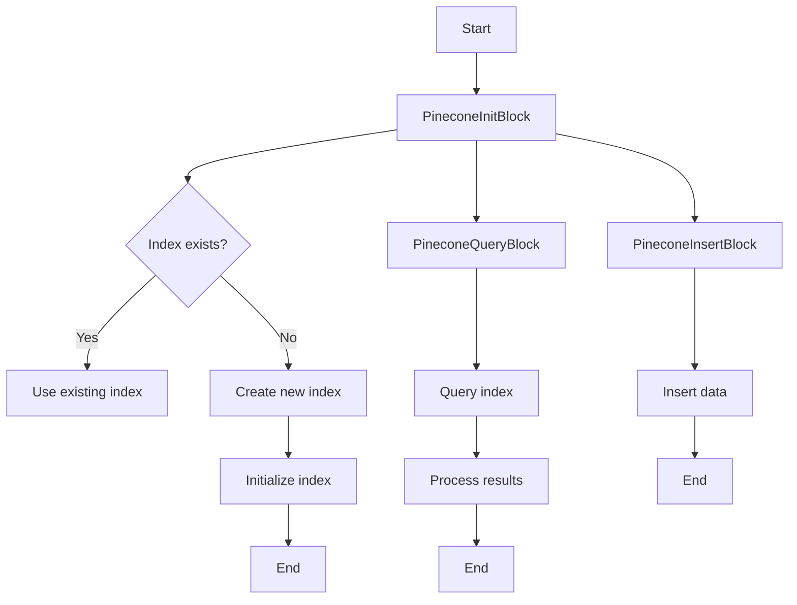
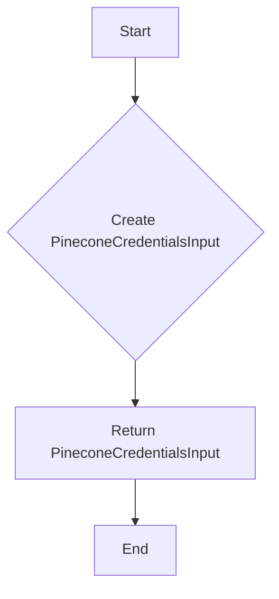
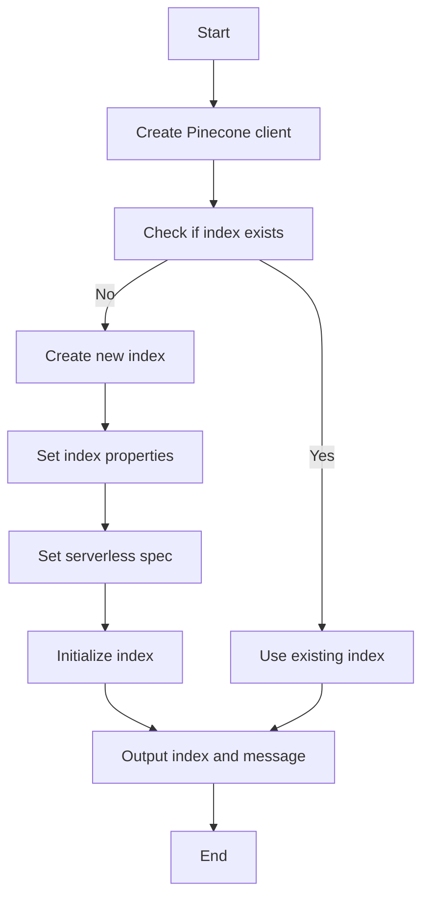
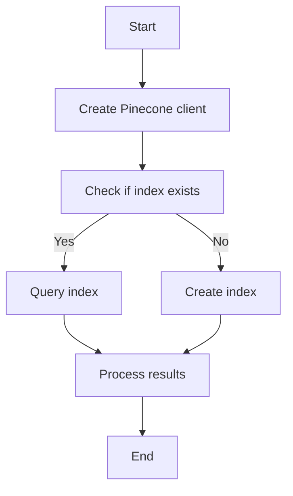
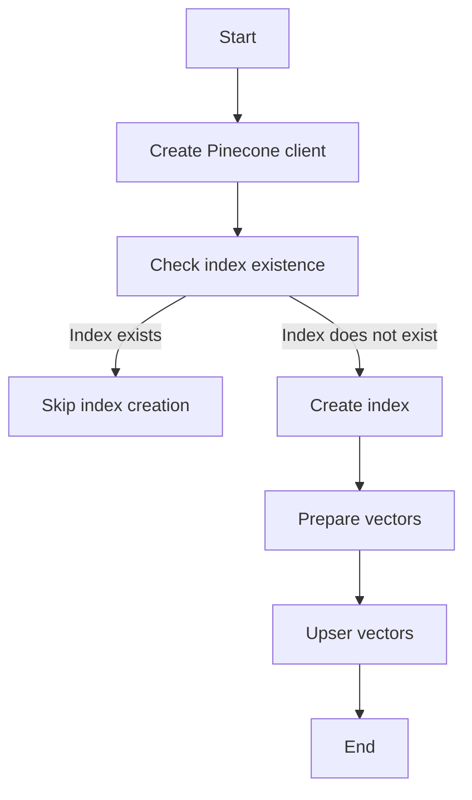
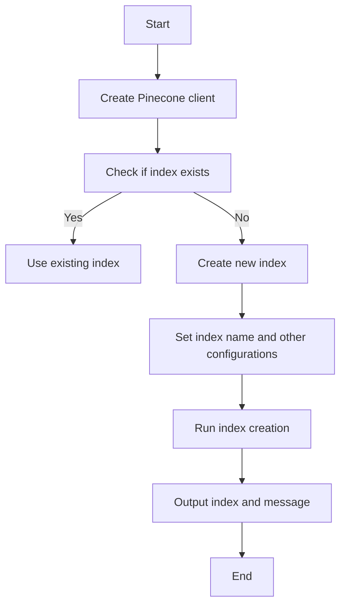
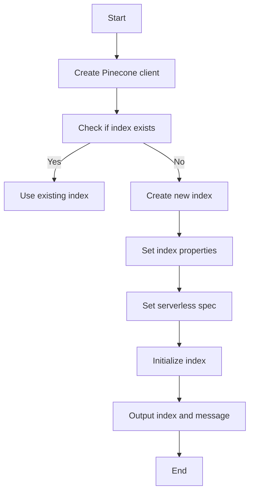
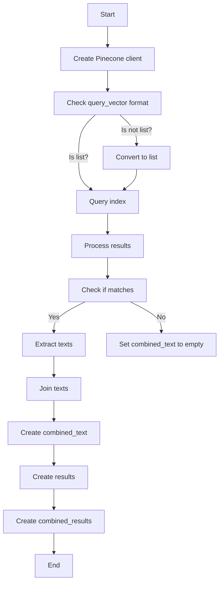
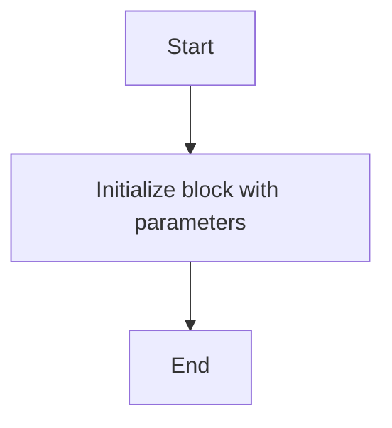
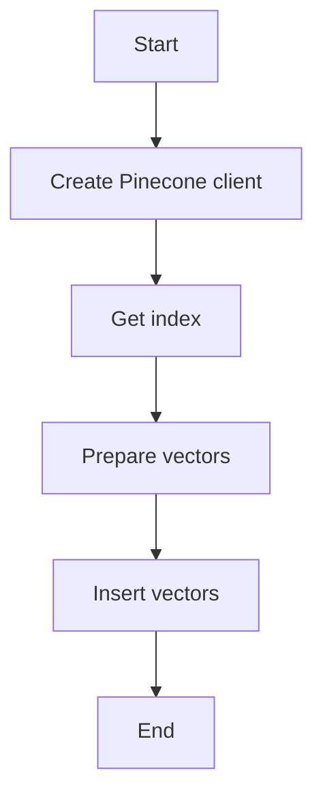

# `.\AutoGPT\autogpt_platform\backend\backend\blocks\pinecone.py` 详细设计文档

This code defines a set of classes and functions to interact with the Pinecone vector database, including initializing an index, querying the index, and inserting data into the index.

## 整体流程



## 类结构

```
PineconeInitBlock (Block)
├── Input
│   ├── credentials (PineconeCredentialsInput)
│   ├── index_name (str)
│   ├── dimension (int)
│   ├── metric (str)
│   ├── cloud (str)
│   └── region (str)
└── Output
    ├── index (str)
    └── message (str)
PineconeQueryBlock (Block)
├── Input
│   ├── credentials (PineconeCredentialsInput)
│   ├── query_vector (list)
│   ├── namespace (str)
│   ├── top_k (int)
│   ├── include_values (bool)
│   ├── include_metadata (bool)
│   └── host (str)
│   └── idx_name (str)
└── Output
    ├── results (Any)
    └── combined_results (Any)
PineconeInsertBlock (Block)
├── Input
│   ├── credentials (PineconeCredentialsInput)
│   ├── index (str)
│   ├── chunks (list)
│   ├── embeddings (list)
│   ├── namespace (str)
│   └── metadata (dict)
└── Output
    ├── upsert_response (str)
```

## 全局变量及字段


### `PineconeCredentials`
    
Credentials for accessing the Pinecone service.

类型：`APIKeyCredentials`
    


### `PineconeCredentialsInput`
    
Input type for Pinecone credentials.

类型：`CredentialsMetaInput[Literal[ProviderName.PINECONE], Literal["api_key"]]`
    


### `ProviderName`
    
Enum representing different providers.

类型：`Literal[Pinecone, OpenAI, ...]`
    


### `PineconeInitBlock.id`
    
Unique identifier for the PineconeInitBlock class.

类型：`str`
    


### `PineconeInitBlock.description`
    
Description of the PineconeInitBlock class.

类型：`str`
    


### `PineconeInitBlock.categories`
    
Categories to which the PineconeInitBlock class belongs.

类型：`set[BlockCategory]`
    


### `PineconeInitBlock.input_schema`
    
Input schema for the PineconeInitBlock class.

类型：`Input`
    


### `PineconeInitBlock.output_schema`
    
Output schema for the PineconeInitBlock class.

类型：`Output`
    


### `PineconeQueryBlock.id`
    
Unique identifier for the PineconeQueryBlock class.

类型：`str`
    


### `PineconeQueryBlock.description`
    
Description of the PineconeQueryBlock class.

类型：`str`
    


### `PineconeQueryBlock.categories`
    
Categories to which the PineconeQueryBlock class belongs.

类型：`set[BlockCategory]`
    


### `PineconeQueryBlock.input_schema`
    
Input schema for the PineconeQueryBlock class.

类型：`Input`
    


### `PineconeQueryBlock.output_schema`
    
Output schema for the PineconeQueryBlock class.

类型：`Output`
    


### `PineconeInsertBlock.id`
    
Unique identifier for the PineconeInsertBlock class.

类型：`str`
    


### `PineconeInsertBlock.description`
    
Description of the PineconeInsertBlock class.

类型：`str`
    


### `PineconeInsertBlock.categories`
    
Categories to which the PineconeInsertBlock class belongs.

类型：`set[BlockCategory]`
    


### `PineconeInsertBlock.input_schema`
    
Input schema for the PineconeInsertBlock class.

类型：`Input`
    


### `PineconeInsertBlock.output_schema`
    
Output schema for the PineconeInsertBlock class.

类型：`Output`
    


### `PineconeInitBlock.id`
    
Unique identifier for the PineconeInitBlock instance.

类型：`str`
    


### `PineconeInitBlock.description`
    
Description of the PineconeInitBlock instance.

类型：`str`
    


### `PineconeInitBlock.categories`
    
Categories to which the PineconeInitBlock instance belongs.

类型：`set[BlockCategory]`
    


### `PineconeInitBlock.input_schema`
    
Input schema for the PineconeInitBlock instance.

类型：`Input`
    


### `PineconeInitBlock.output_schema`
    
Output schema for the PineconeInitBlock instance.

类型：`Output`
    


### `PineconeQueryBlock.id`
    
Unique identifier for the PineconeQueryBlock instance.

类型：`str`
    


### `PineconeQueryBlock.description`
    
Description of the PineconeQueryBlock instance.

类型：`str`
    


### `PineconeQueryBlock.categories`
    
Categories to which the PineconeQueryBlock instance belongs.

类型：`set[BlockCategory]`
    


### `PineconeQueryBlock.input_schema`
    
Input schema for the PineconeQueryBlock instance.

类型：`Input`
    


### `PineconeQueryBlock.output_schema`
    
Output schema for the PineconeQueryBlock instance.

类型：`Output`
    


### `PineconeInsertBlock.id`
    
Unique identifier for the PineconeInsertBlock instance.

类型：`str`
    


### `PineconeInsertBlock.description`
    
Description of the PineconeInsertBlock instance.

类型：`str`
    


### `PineconeInsertBlock.categories`
    
Categories to which the PineconeInsertBlock instance belongs.

类型：`set[BlockCategory]`
    


### `PineconeInsertBlock.input_schema`
    
Input schema for the PineconeInsertBlock instance.

类型：`Input`
    


### `PineconeInsertBlock.output_schema`
    
Output schema for the PineconeInsertBlock instance.

类型：`Output`
    
    

## 全局函数及方法


### PineconeCredentialsField()

This function creates a Pinecone credentials input on a block.

参数：

- 无

返回值：`PineconeCredentialsInput`，A credentials input for Pinecone integration

#### 流程图



#### 带注释源码

```python
def PineconeCredentialsField() -> PineconeCredentialsInput:
    """Creates a Pinecone credentials input on a block."""
    return CredentialsField(
        description="The Pinecone integration can be used with an API Key.",
    )
```


### PineconeInitBlock.run

Initializes a Pinecone index by creating a new index or using an existing one.

参数：

- `input_data`：`Input`，The input data for the block, containing the index name, dimension, metric, cloud, and region.
- `credentials`：`APIKeyCredentials`，The credentials for accessing the Pinecone API.
- `**kwargs`：`Any`，Additional keyword arguments.

返回值：`BlockOutput`，The output of the block, containing the index name and a status message.

#### 流程图



#### 带注释源码

```python
async def run(self, input_data: Input, *, credentials: APIKeyCredentials, **kwargs) -> BlockOutput:
    pc = Pinecone(api_key=credentials.api_key.get_secret_value())

    try:
        existing_indexes = pc.list_indexes()
        if input_data.index_name not in [index.name for index in existing_indexes]:
            pc.create_index(
                name=input_data.index_name,
                dimension=input_data.dimension,
                metric=input_data.metric,
                spec=ServerlessSpec(
                    cloud=input_data.cloud, region=input_data.region
                ),
            )
            message = f"Created new index: {input_data.index_name}"
        else:
            message = f"Using existing index: {input_data.index_name}"

        yield "index", input_data.index_name
        yield "message", message
    except Exception as e:
        yield "message", f"Error initializing Pinecone index: {str(e)}"
``` 


### PineconeQueryBlock.run

Queries a Pinecone index and returns the results.

参数：

- `input_data`：`Input`，The input data for the block.
- `credentials`：`APIKeyCredentials`，The credentials for accessing the Pinecone service.

返回值：`BlockOutput`，The output of the block containing the query results.

#### 流程图



#### 带注释源码

```python
async def run(
    self,
    input_data: Input,
    *,
    credentials: APIKeyCredentials,
    **kwargs,
) -> BlockOutput:
    try:
        # Create a new client instance
        pc = Pinecone(api_key=credentials.api_key.get_secret_value())

        # Get the index
        idx = pc.Index(input_data.idx_name)

        # Ensure query_vector is in correct format
        query_vector = input_data.query_vector
        if isinstance(query_vector, list) and len(query_vector) > 0:
            if isinstance(query_vector[0], list):
                query_vector = query_vector[0]

        results = idx.query(
            namespace=input_data.namespace,
            vector=query_vector,
            top_k=input_data.top_k,
            include_values=input_data.include_values,
            include_metadata=input_data.include_metadata,
        ).to_dict()  # type: ignore
        combined_text = ""
        if results["matches"]:
            texts = [
                match["metadata"]["text"]
                for match in results["matches"]
                if match.get("metadata", {}).get("text")
            ]
            combined_text = "\n\n".join(texts)

        # Return both the raw matches and combined text
        yield "results", {
            "matches": results["matches"],
            "combined_text": combined_text,
        }
        yield "combined_results", combined_text

    except Exception as e:
        error_msg = f"Error querying Pinecone: {str(e)}"
        raise RuntimeError(error_msg) from e
```


### PineconeInsertBlock.run

Uploads data to a Pinecone index.

参数：

- `input_data`：`Input`，The input data for the PineconeInsertBlock.
- `credentials`：`APIKeyCredentials`，The credentials for accessing the Pinecone service.
- `kwargs`：`Any`，Additional keyword arguments.

返回值：`BlockOutput`，The output of the PineconeInsertBlock operation.

#### 流程图



#### 带注释源码

```python
async def run(self, input_data: Input, *, credentials: APIKeyCredentials, **kwargs) -> BlockOutput:
    try:
        # Create a new client instance
        pc = Pinecone(api_key=credentials.api_key.get_secret_value())

        # Get the index
        idx = pc.Index(input_data.index)

        vectors = []
        for chunk, embedding in zip(input_data.chunks, input_data.embeddings):
            vector_metadata = input_data.metadata.copy()
            vector_metadata["text"] = chunk
            vectors.append(
                {
                    "id": str(uuid.uuid4()),
                    "values": embedding,
                    "metadata": vector_metadata,
                }
            )
        idx.upsert(vectors=vectors, namespace=input_data.namespace)

        yield "upsert_response", "successfully upserted"

    except Exception as e:
        error_msg = f"Error uploading to Pinecone: {str(e)}"
        raise RuntimeError(error_msg) from e
```


### PineconeInitBlock.__init__

Initializes a Pinecone index with the provided credentials and configuration.

参数：

- `self`：`PineconeInitBlock`，The instance of the PineconeInitBlock class.

返回值：无

#### 流程图



#### 带注释源码

```python
def __init__(self):
    super().__init__(
        id="48d8fdab-8f03-41f3-8407-8107ba11ec9b",
        description="Initializes a Pinecone index",
        categories={BlockCategory.LOGIC},
        input_schema=PineconeInitBlock.Input,
        output_schema=PineconeInitBlock.Output,
    )
```


### PineconeInitBlock.run

Initializes a Pinecone index by creating a new one if it doesn't exist or using an existing one.

参数：

- `input_data`：`Input`，The input data for the block, containing the index name, dimension, metric, cloud, and region.
- `credentials`：`APIKeyCredentials`，The credentials for accessing the Pinecone API.
- `**kwargs`：`Any`，Additional keyword arguments.

返回值：`BlockOutput`，The output of the block, containing the index name and a status message.

#### 流程图



#### 带注释源码

```python
async def run(self, input_data: Input, *, credentials: APIKeyCredentials, **kwargs) -> BlockOutput:
    pc = Pinecone(api_key=credentials.api_key.get_secret_value())

    try:
        existing_indexes = pc.list_indexes()
        if input_data.index_name not in [index.name for index in existing_indexes]:
            pc.create_index(
                name=input_data.index_name,
                dimension=input_data.dimension,
                metric=input_data.metric,
                spec=ServerlessSpec(
                    cloud=input_data.cloud, region=input_data.region
                ),
            )
            message = f"Created new index: {input_data.index_name}"
        else:
            message = f"Using existing index: {input_data.index_name}"

        yield "index", input_data.index_name
        yield "message", message
    except Exception as e:
        yield "message", f"Error initializing Pinecone index: {str(e)}"
``` 


### PineconeQueryBlock.__init__

This method initializes the PineconeQueryBlock class, setting up the necessary schema for input and output, and defining the block's properties.

参数：

- `self`：`PineconeQueryBlock`，The instance of the class being initialized.

返回值：无

#### 流程图

```mermaid
classDiagram
    PineconeQueryBlock <|-- Block
    PineconeQueryBlock {
        Input
        Output
        run
    }
    Block {
        id
        description
        categories
        input_schema
        output_schema
    }
    Input {
        credentials
        query_vector
        namespace
        top_k
        include_values
        include_metadata
        host
        idx_name
    }
    Output {
        results
        combined_results
    }
```

#### 带注释源码

```python
class PineconeQueryBlock(Block):
    # ... (other class details)

    def __init__(self):
        # Initialize the parent class with the block's properties
        super().__init__(
            id="9ad93d0f-91b4-4c9c-8eb1-82e26b4a01c5",
            description="Queries a Pinecone index",
            categories={BlockCategory.LOGIC},
            input_schema=PineconeQueryBlock.Input,
            output_schema=PineconeQueryBlock.Output,
        )
```


### PineconeQueryBlock.run

This method queries a Pinecone index using a provided query vector and returns the top results along with combined text if requested.

参数：

- `input_data`：`Input`，The input data for the query, including the query vector, namespace, top_k, include_values, include_metadata, and host.
- `credentials`：`APIKeyCredentials`，The credentials for accessing the Pinecone service.

返回值：`BlockOutput`，The output data containing the query results and combined text.

#### 流程图



#### 带注释源码

```python
async def run(self, input_data: Input, *, credentials: APIKeyCredentials, **kwargs) -> BlockOutput:
    try:
        # Create a new client instance
        pc = Pinecone(api_key=credentials.api_key.get_secret_value())

        # Get the index
        idx = pc.Index(input_data.idx_name)

        # Ensure query_vector is in correct format
        query_vector = input_data.query_vector
        if isinstance(query_vector, list) and len(query_vector) > 0:
            if isinstance(query_vector[0], list):
                query_vector = query_vector[0]

        results = idx.query(
            namespace=input_data.namespace,
            vector=query_vector,
            top_k=input_data.top_k,
            include_values=input_data.include_values,
            include_metadata=input_data.include_metadata,
        ).to_dict()  # type: ignore

        combined_text = ""
        if results["matches"]:
            texts = [
                match["metadata"]["text"]
                for match in results["matches"]
                if match.get("metadata", {}).get("text")
            ]
            combined_text = "\n\n".join(texts)

        # Return both the raw matches and combined text
        yield "results", {
            "matches": results["matches"],
            "combined_text": combined_text,
        }
        yield "combined_results", combined_text

    except Exception as e:
        error_msg = f"Error querying Pinecone: {str(e)}"
        raise RuntimeError(error_msg) from e
```


### PineconeInsertBlock.__init__

Initializes a Pinecone index block.

参数：

- `self`：`None`，The instance of the class being initialized.
- `id`：`str`，Unique identifier for the block.
- `description`：`str`，Description of the block's functionality.
- `categories`：`set`，Categories to which the block belongs.
- `input_schema`：`Input`，Schema for the input data of the block.
- `output_schema`：`Output`，Schema for the output data of the block.

返回值：`None`，No return value.

#### 流程图



#### 带注释源码

```python
def __init__(self):
    super().__init__(
        id="477f2168-cd91-475a-8146-9499a5982434",
        description="Upload data to a Pinecone index",
        categories={BlockCategory.LOGIC},
        input_schema=PineconeInsertBlock.Input,
        output_schema=PineconeInsertBlock.Output,
    )
```


### PineconeInsertBlock.run

This function uploads data to a Pinecone index by inserting vectors into the specified index.

参数：

- `input_data`：`Input`，The input data for the PineconeInsertBlock.
- `credentials`：`APIKeyCredentials`，The credentials for accessing the Pinecone service.
- `kwargs`：`Any`，Additional keyword arguments.

返回值：`BlockOutput`，The output of the PineconeInsertBlock.

#### 流程图



#### 带注释源码

```python
async def run(self, input_data: Input, *, credentials: APIKeyCredentials, **kwargs) -> BlockOutput:
    try:
        # Create a new client instance
        pc = Pinecone(api_key=credentials.api_key.get_secret_value())

        # Get the index
        idx = pc.Index(input_data.index)

        vectors = []
        for chunk, embedding in zip(input_data.chunks, input_data.embeddings):
            vector_metadata = input_data.metadata.copy()
            vector_metadata["text"] = chunk
            vectors.append(
                {
                    "id": str(uuid.uuid4()),
                    "values": embedding,
                    "metadata": vector_metadata,
                }
            )
        idx.upsert(vectors=vectors, namespace=input_data.namespace)

        yield "upsert_response", "successfully upserted"

    except Exception as e:
        error_msg = f"Error uploading to Pinecone: {str(e)}"
        raise RuntimeError(error_msg) from e
```


## 关键组件


### 张量索引与惰性加载

张量索引与惰性加载是代码中用于高效存储和检索大规模数据集的关键组件。它们允许在需要时才加载数据，从而减少内存消耗并提高性能。

### 反量化支持

反量化支持是代码中用于处理和转换数据的关键组件。它允许将量化数据转换回原始精度，以便进行进一步处理或分析。

### 量化策略

量化策略是代码中用于优化数据存储和计算效率的关键组件。它通过减少数据精度来减少内存和计算资源的使用，同时保持可接受的精度损失。


## 问题及建议


### 已知问题

-   **异常处理**: 代码中的异常处理较为简单，仅捕获了所有异常并返回错误信息。建议根据不同的异常类型进行更细致的异常处理，以便更好地诊断问题。
-   **代码复用**: `PineconeCredentialsField` 函数在多个地方被调用，可以考虑将其改为类方法或静态方法以提高代码复用性。
-   **类型注解**: 代码中存在一些类型注解不明确的情况，例如 `Any` 类型注解。建议使用更具体的类型注解来提高代码的可读性和可维护性。
-   **全局变量**: 代码中使用了全局变量 `Pinecone`，这可能导致代码难以测试和调试。建议将 `Pinecone` 实例化到类中，以避免全局变量的使用。

### 优化建议

-   **异常处理**: 建议根据不同的异常类型进行更细致的异常处理，例如区分网络异常、认证异常等，并给出相应的错误信息。
-   **代码复用**: 将 `PineconeCredentialsField` 函数改为类方法或静态方法，以减少代码重复。
-   **类型注解**: 使用更具体的类型注解，例如使用 `List` 类型注解代替 `Any` 类型注解。
-   **全局变量**: 将 `Pinecone` 实例化到类中，以避免全局变量的使用，提高代码的可测试性和可维护性。
-   **日志记录**: 建议添加日志记录功能，以便在开发和维护过程中跟踪代码的执行情况。
-   **单元测试**: 建议编写单元测试，以确保代码的正确性和稳定性。
-   **代码风格**: 建议遵循统一的代码风格规范，以提高代码的可读性和可维护性。


## 其它


### 设计目标与约束

- 设计目标：
  - 提供一个模块化的方式来初始化、查询和插入数据到Pinecone索引。
  - 确保代码的可扩展性和易于维护。
  - 提供清晰的API接口，方便用户使用。
- 约束：
  - 必须使用Pinecone API进行操作。
  - 代码应遵循异步编程模式。
  - 代码应处理异常情况，确保系统的稳定性。

### 错误处理与异常设计

- 错误处理：
  - 使用try-except块捕获可能发生的异常。
  - 对于Pinecone API调用，捕获并处理特定异常。
  - 对于非预期的异常，记录错误信息并抛出运行时错误。
- 异常设计：
  - 定义自定义异常类，以便于错误追踪和调试。
  - 异常信息应包含足够的信息，以便用户了解错误原因。

### 数据流与状态机

- 数据流：
  - 输入数据通过API接口传递到相应的块。
  - 每个块处理输入数据，并生成输出数据。
  - 输出数据通过API接口返回给用户。
- 状态机：
  - 每个块在执行过程中可能处于不同的状态，如初始化、查询、插入等。
  - 状态机用于跟踪每个块的当前状态，并执行相应的操作。

### 外部依赖与接口契约

- 外部依赖：
  - Pinecone API。
  - UUID库用于生成唯一标识符。
  - 类型注解库用于类型检查。
- 接口契约：
  - API接口应遵循RESTful设计原则。
  - 输入和输出数据应遵循JSON格式。
  - 接口文档应详细描述每个API的参数和返回值。


    