# `AutoGPT\autogpt_platform\backend\backend\blocks\reddit.py` 详细设计文档

该代码定义了一系列集成 Reddit API 的功能块（Blocks），用于在自动化工作流中执行获取帖子、发布评论、发送私信、搜索内容、管理用户资料等操作。这些 Blocks 封装了 `praw` 库的调用逻辑，使用 OAuth2 进行身份验证，并提供标准化的输入输出接口。

## 整体流程

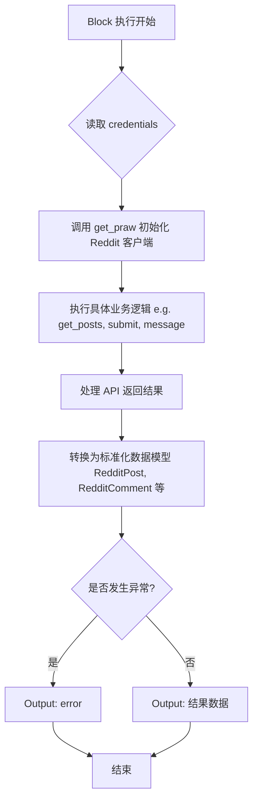

## 类结构

```
BaseModel (pydantic)
├── RedditPost
├── RedditPostDetails
├── RedditComment
├── RedditSearchResult
├── SubredditInfo
├── SubredditFlair
├── SubredditRule
├── RedditUserInfo
├── RedditUserProfileSubreddit
└── RedditInboxItem

Block (backend.data.block)
├── GetRedditPostsBlock
├── PostRedditCommentBlock
├── CreateRedditPostBlock
├── GetRedditPostBlock
├── GetUserPostsBlock
├── RedditGetMyPostsBlock
├── SearchRedditBlock
├── EditRedditPostBlock
├── GetSubredditInfoBlock
├── GetRedditPostCommentsBlock
├── GetRedditCommentRepliesBlock
├── GetRedditCommentBlock
├── ReplyToRedditCommentBlock
├── GetRedditUserInfoBlock
├── SendRedditMessageBlock
├── GetRedditInboxBlock
├── DeleteRedditPostBlock
├── DeleteRedditCommentBlock
├── GetSubredditFlairsBlock
└── GetSubredditRulesBlock
```

## 全局变量及字段


### `settings`
    
全局应用设置实例，包含从环境变量加载的配置和密钥。

类型：`Settings`
    


### `logger`
    
用于记录日志信息的模块级别记录器。

类型：`logging.Logger`
    


### `TEST_CREDENTIALS`
    
用于单元测试的模拟 Reddit OAuth2 凭证对象。

类型：`OAuth2Credentials`
    


### `TEST_CREDENTIALS_INPUT`
    
用于测试块输入的模拟凭证字典表示形式。

类型：`dict`
    


### `RedditPost.post_id`
    
Reddit 帖子的唯一标识符。

类型：`str`
    


### `RedditPost.subreddit`
    
帖子所属的 Subreddit 名称。

类型：`str`
    


### `RedditPost.title`
    
Reddit 帖子的标题。

类型：`str`
    


### `RedditPost.body`
    
Reddit 帖子的正文内容。

类型：`str`
    


### `RedditPostDetails.id`
    
帖子的唯一 ID。

类型：`str`
    


### `RedditPostDetails.subreddit`
    
帖子所在的 Subreddit 名称。

类型：`str`
    


### `RedditPostDetails.title`
    
帖子的标题。

类型：`str`
    


### `RedditPostDetails.body`
    
帖子的正文文本。

类型：`str`
    


### `RedditPostDetails.author`
    
帖子作者的用户名。

类型：`str`
    


### `RedditPostDetails.score`
    
帖子的净得分（点赞数减去点踩数）。

类型：`int`
    


### `RedditPostDetails.upvote_ratio`
    
帖子的点赞比例（0 到 1 之间）。

类型：`float`
    


### `RedditPostDetails.num_comments`
    
帖子下的评论数量。

类型：`int`
    


### `RedditPostDetails.created_utc`
    
帖子创建时的 UTC 时间戳。

类型：`float`
    


### `RedditPostDetails.url`
    
指向帖子的链接。

类型：`str`
    


### `RedditPostDetails.permalink`
    
帖子的相对永久链接。

类型：`str`
    


### `RedditPostDetails.is_self`
    
指示帖子是否为自贴（文本帖）。

类型：`bool`
    


### `RedditPostDetails.over_18`
    
指示帖子是否标记为 NSFW（不适合工作场所）。

类型：`bool`
    


### `RedditComment.comment_id`
    
评论的唯一 ID。

类型：`str`
    


### `RedditComment.post_id`
    
评论所属帖子的 ID。

类型：`str`
    


### `RedditComment.parent_comment_id`
    
父评论的 ID，如果是顶级评论则为 null。

类型：`str | None`
    


### `RedditComment.author`
    
评论者的用户名。

类型：`str`
    


### `RedditComment.body`
    
评论的文本内容。

类型：`str`
    


### `RedditComment.score`
    
评论的净得分。

类型：`int`
    


### `RedditComment.created_utc`
    
评论创建时的 UTC 时间戳。

类型：`float`
    


### `RedditComment.edited`
    
评论是否已被编辑。

类型：`bool`
    


### `RedditComment.is_submitter`
    
作者是否也是帖子的提交者。

类型：`bool`
    


### `RedditComment.permalink`
    
评论的永久链接。

类型：`str`
    


### `RedditComment.depth`
    
评论在回复树中的深度。

类型：`int`
    


### `RedditSearchResult.id`
    
搜索结果帖子的唯一 ID。

类型：`str`
    


### `RedditSearchResult.subreddit`
    
帖子所在的 Subreddit 名称。

类型：`str`
    


### `RedditSearchResult.title`
    
帖子的标题。

类型：`str`
    


### `RedditSearchResult.body`
    
帖子的正文文本。

类型：`str`
    


### `RedditSearchResult.author`
    
帖子作者的用户名。

类型：`str`
    


### `RedditSearchResult.score`
    
帖子的得分。

类型：`int`
    


### `RedditSearchResult.num_comments`
    
帖子上的评论数量。

类型：`int`
    


### `RedditSearchResult.created_utc`
    
帖子创建的 UTC 时间戳。

类型：`float`
    


### `RedditSearchResult.permalink`
    
帖子的永久链接。

类型：`str`
    


### `SubredditInfo.name`
    
Subreddit 的基础名称（如 't5_2qh0y'）。

类型：`str`
    


### `SubredditInfo.display_name`
    
Subreddit 的显示名称（如 'python'）。

类型：`str`
    


### `SubredditInfo.title`
    
Subreddit 的标题。

类型：`str`
    


### `SubredditInfo.description`
    
Subreddit 的侧边栏描述。

类型：`str`
    


### `SubredditInfo.public_description`
    
Subreddit 的公开描述文本。

类型：`str`
    


### `SubredditInfo.subscribers`
    
Subreddit 的订阅者数量。

类型：`int`
    


### `SubredditInfo.created_utc`
    
Subreddit 创建的 UTC 时间戳。

类型：`float`
    


### `SubredditInfo.over_18`
    
Subreddit 是否为 NSFW。

类型：`bool`
    


### `SubredditInfo.url`
    
Subreddit 的 URL。

类型：`str`
    


### `SubredditFlair.flair_id`
    
样式模板的唯一 ID。

类型：`str`
    


### `SubredditFlair.text`
    
样式显示的文本。

类型：`str`
    


### `SubredditFlair.text_editable`
    
用户是否可以编辑样式文本。

类型：`bool`
    


### `SubredditFlair.css_class`
    
与样式关联的 CSS 类。

类型：`str`
    


### `SubredditRule.short_name`
    
规则的简短名称。

类型：`str`
    


### `SubredditRule.description`
    
规则的完整描述。

类型：`str`
    


### `SubredditRule.kind`
    
规则适用的内容类型。

类型：`str`
    


### `SubredditRule.violation_reason`
    
违反规则时显示的理由。

类型：`str`
    


### `SubredditRule.priority`
    
规则的优先级索引。

类型：`int`
    


### `RedditUserProfileSubreddit.name`
    
用户个人资料 Subreddit 的名称。

类型：`str`
    


### `RedditUserProfileSubreddit.title`
    
用户个人资料的标题。

类型：`str`
    


### `RedditUserProfileSubreddit.public_description`
    
用户个人资料的公开描述。

类型：`str`
    


### `RedditUserProfileSubreddit.subscribers`
    
用户个人资料的订阅者数量。

类型：`int`
    


### `RedditUserProfileSubreddit.over_18`
    
用户个人资料是否为 NSFW。

类型：`bool`
    


### `RedditUserInfo.username`
    
Reddit 用户名。

类型：`str`
    


### `RedditUserInfo.user_id`
    
用户的唯一 ID。

类型：`str`
    


### `RedditUserInfo.comment_karma`
    
用户的评论 Karma 分数。

类型：`int`
    


### `RedditUserInfo.link_karma`
    
用户的链接 Karma 分数。

类型：`int`
    


### `RedditUserInfo.total_karma`
    
用户的总 Karma 分数。

类型：`int`
    


### `RedditUserInfo.created_utc`
    
账户创建的 UTC 时间戳。

类型：`float`
    


### `RedditUserInfo.is_gold`
    
用户是否拥有 Reddit Gold。

类型：`bool`
    


### `RedditUserInfo.is_mod`
    
用户是否是版主。

类型：`bool`
    


### `RedditUserInfo.has_verified_email`
    
用户的电子邮件是否已验证。

类型：`bool`
    


### `RedditUserInfo.moderated_subreddits`
    
用户担任版主的 Subreddit 名称列表。

类型：`list[str]`
    


### `RedditUserInfo.profile_subreddit`
    
关于用户个人资料 Subreddit 的信息。

类型：`RedditUserProfileSubreddit | None`
    


### `RedditInboxItem.item_id`
    
收件箱项目的唯一 ID。

类型：`str`
    


### `RedditInboxItem.item_type`
    
项目的类型（如 'message', 'comment_reply'）。

类型：`str`
    


### `RedditInboxItem.subject`
    
消息或通知的主题行。

类型：`str`
    


### `RedditInboxItem.body`
    
消息或通知的内容正文。

类型：`str`
    


### `RedditInboxItem.author`
    
发送者或评论者的用户名。

类型：`str`
    


### `RedditInboxItem.created_utc`
    
项目创建的 UTC 时间戳。

类型：`float`
    


### `RedditInboxItem.is_read`
    
项目是否已标记为已读。

类型：`bool`
    


### `RedditInboxItem.context`
    
评论回复的上下文 URL。

类型：`str | None`
    
    

## 全局函数及方法


### `RedditCredentialsField`

这是一个用于创建标准化 Reddit 凭据输入字段的工厂函数。它封装了底层的 `CredentialsField` 调用，并预设了针对 Reddit OAuth2 认证所需的特定描述和类型约束，供各个 Block 类在定义输入模式时复用。

参数：

*   无参数

返回值：`RedditCredentialsInput`（即 `CredentialsMetaInput[Literal[ProviderName.REDDIT], Literal["oauth2"]]`），返回一个配置对象，该对象定义了 Reddit 凭据输入的元数据结构，包含连接 Reddit 账户的描述信息及 OAuth2 类型的限定。

#### 流程图

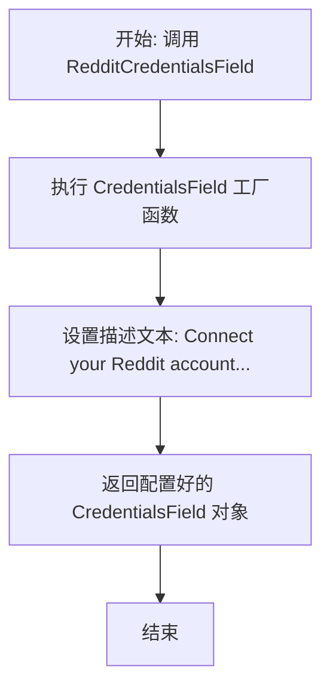

#### 带注释源码

```python
def RedditCredentialsField() -> RedditCredentialsInput:
    """
    在 Block 上创建一个 Reddit 凭据输入字段。
    
    该函数作为一个辅助方法，用于统一生成 Reddit 集成所需的认证字段配置。
    它返回的类型注解 `RedditCredentialsInput` 隐含了 Provider 为 Reddit
    且认证类型为 oauth2 的约束。
    """
    # 调用通用凭据字段构造器，并传入针对 Reddit 特定的用户提示描述。
    # 返回的对象将被用于 Block 的 Input Schema 定义中。
    return CredentialsField(
        description="Connect your Reddit account to access Reddit features.",
    )
```


### `get_praw`

创建并验证一个 PRAW (Python Reddit API Wrapper) Reddit 客户端实例，使用提供的 OAuth2 凭证进行身份验证。

参数：

-  `creds`：`RedditCredentials`，用于身份验证的 Reddit OAuth2 凭证对象，包含 access_token 和 refresh_token 等信息。

返回值：`praw.Reddit`，已初始化并经过身份验证的 Reddit API 客户端实例。

#### 流程图

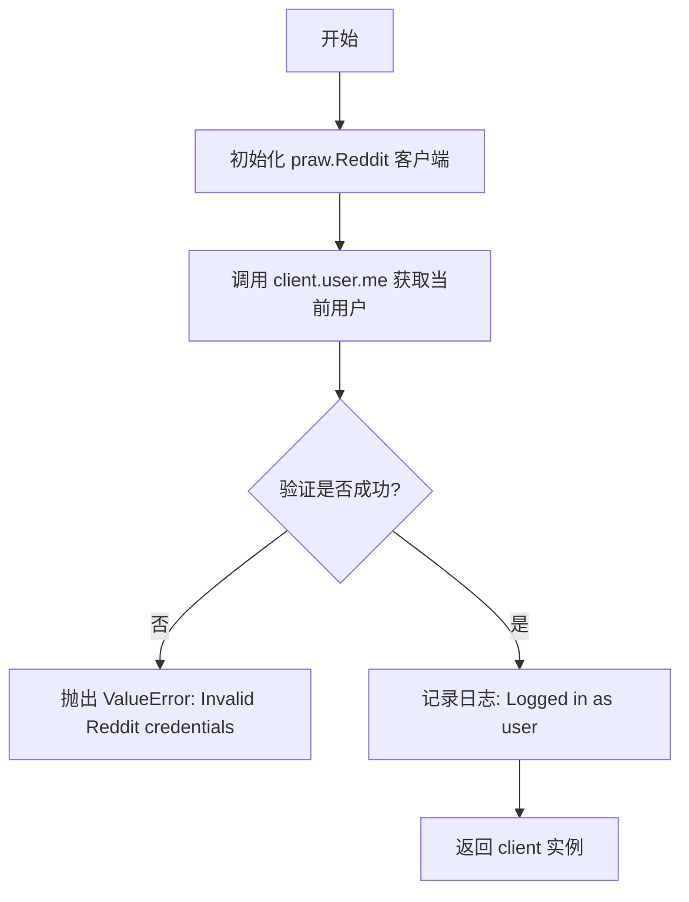

#### 带注释源码

```python
def get_praw(creds: RedditCredentials) -> praw.Reddit:
    """
    Create a PRAW Reddit client using OAuth2 credentials.

    Uses the refresh_token for authentication, which allows the client
    to automatically refresh the access token when needed.
    """
    # 实例化 PRAW Reddit 客户端
    # 使用全局 settings 配置中的 client_id, client_secret 和 user_agent
    # 使用传入凭证中的 refresh_token 进行授权，以支持自动刷新 Token
    client = praw.Reddit(
        client_id=settings.secrets.reddit_client_id,
        client_secret=settings.secrets.reddit_client_secret,
        refresh_token=(
            creds.refresh_token.get_secret_value() if creds.refresh_token else None
        ),
        user_agent=settings.config.reddit_user_agent,
    )
    
    # 尝试获取当前认证用户以验证凭证有效性
    me = client.user.me()
    
    # 如果无法获取用户信息，则认为凭证无效
    if not me:
        raise ValueError("Invalid Reddit credentials.")
    
    # 记录成功登录的用户名
    logger.info(f"Logged in as Reddit user: {me.name}")
    
    # 返回已认证的客户端实例
    return client
```


### `strip_reddit_prefix`

从给定的 Reddit ID 字符串中移除类型前缀（如 `t1_`, `t3_` 等），如果存在的话。此函数用于规范化 ID 格式，使其兼容带前缀和不带前缀的输入。

参数：

- `id_str`：`str`，可能包含 Reddit 类型前缀（例如 `t3_`, `t1_`）的 ID 字符串。

返回值：`str`，移除了类型前缀后的原始 ID 字符串。

#### 流程图

```mermaid
flowchart TD
    Start([开始]) --> CheckLen{id_str 长度 > 3?}
    CheckLen -->|否| ReturnOriginal[返回 id_str]
    CheckLen -->|是| CheckChar0{id_str[0] == 't'?}
    CheckChar0 -->|否| ReturnOriginal
    CheckChar0 -->|是| CheckChar1{id_str[1] 是数字?}
    CheckChar1 -->|否| ReturnOriginal
    CheckChar1 -->|是| CheckChar2{id_str[2] == '_'?}
    CheckChar2 -->|否| ReturnOriginal
    CheckChar2 -->|是| ReturnSliced[返回 id_str[3:]]
    ReturnOriginal --> End([结束])
    ReturnSliced --> End
```

#### 带注释源码

```python
def strip_reddit_prefix(id_str: str) -> str:
    """
    Strip Reddit type prefix (t1_, t3_, etc.) from an ID if present.

    Reddit uses type prefixes like t1_ for comments, t3_ for posts, etc.
    This helper normalizes IDs by removing these prefixes when present,
    allowing blocks to accept both 'abc123' and 't3_abc123' formats.

    Args:
        id_str: The ID string that may have a Reddit type prefix.

    Returns:
        The ID without the type prefix.
    """
    # 检查字符串长度是否足够包含前缀，且前缀是否符合 "t" + "数字" + "_" 的格式
    if (
        len(id_str) > 3
        and id_str[0] == "t"
        and id_str[1].isdigit()
        and id_str[2] == "_"
    ):
        # 如果符合格式，返回从第 4 个字符开始的部分（即去除前 3 个字符）
        return id_str[3:]
    # 如果不符合格式，直接返回原字符串
    return id_str
```


### `GetRedditPostsBlock.__init__`

该初始化方法负责配置 `GetRedditPostsBlock` 实例，通过调用父类构造函数并传入块元数据、输入输出模式、测试凭证及模拟数据来定义其行为和状态。同时，它会检查环境配置以决定是否在缺少必要凭证时禁用该块。

参数：

-   无

返回值：`None`，无返回值（构造函数）。

#### 流程图

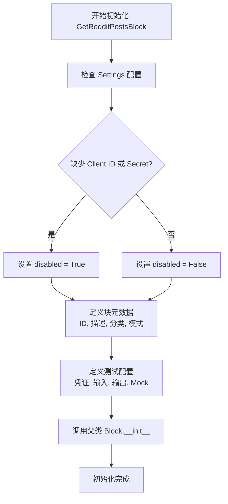

#### 带注释源码

```python
    def __init__(self):
        # 调用父类 Block 的构造函数，传入配置参数
        super().__init__(
            # 块的唯一标识符
            id="c6731acb-4285-4ee1-bc9b-03d0766c370f",
            # 块的功能描述
            description="This block fetches Reddit posts from a defined subreddit name.",
            # 块所属的分类，此处为社交类
            categories={BlockCategory.SOCIAL},
            # 根据环境变量判断是否禁用该块，如果缺少 Reddit API 密钥则禁用
            disabled=(
                not settings.secrets.reddit_client_id
                or not settings.secrets.reddit_client_secret
            ),
            # 定义输入数据的结构 Schema
            input_schema=GetRedditPostsBlock.Input,
            # 定义输出数据的结构 Schema
            output_schema=GetRedditPostsBlock.Output,
            # 用于单元测试的模拟凭证
            test_credentials=TEST_CREDENTIALS,
            # 用于单元测试的模拟输入数据
            test_input={
                "credentials": TEST_CREDENTIALS_INPUT,
                "subreddit": "subreddit",
                "last_post": "id3",
                "post_limit": 2,
            },
            # 用于单元测试的预期输出数据
            test_output=[
                (
                    "post",
                    RedditPost(
                        post_id="id1",
                        subreddit="subreddit",
                        title="title1",
                        body="body1",
                    ),
                ),
                (
                    "post",
                    RedditPost(
                        post_id="id2",
                        subreddit="subreddit",
                        title="title2",
                        body="body2",
                    ),
                ),
                (
                    "posts",
                    [
                        RedditPost(
                            post_id="id1",
                            subreddit="subreddit",
                            title="title1",
                            body="body1",
                        ),
                        RedditPost(
                            post_id="id2",
                            subreddit="subreddit",
                            title="title2",
                            body="body2",
                        ),
                    ],
                ),
            ],
            # 定义用于测试的模拟函数，避免在测试时调用真实 API
            test_mock={
                "get_posts": lambda input_data, credentials: [
                    MockObject(id="id1", title="title1", selftext="body1"),
                    MockObject(id="id2", title="title2", selftext="body2"),
                    MockObject(id="id3", title="title2", selftext="body2"),
                ]
            },
        )
```


### `GetRedditPostsBlock.get_posts`

该方法是一个静态方法，用于根据提供的输入数据（如 Subreddit 名称和限制数量）获取 Reddit 上指定版块的新帖子列表。

参数：

-   `input_data`：`Input`，包含 Subreddit 名称、帖子获取限制（post_limit）等配置信息的输入数据对象。
-   `credentials`：`RedditCredentials`，用于身份验证的 Reddit OAuth2 凭证对象。

返回值：`Iterator[praw.reddit.Submission]`，一个迭代器对象，用于遍历从指定 Subreddit 获取到的最新 Reddit 帖子（Submission 对象）。

#### 流程图

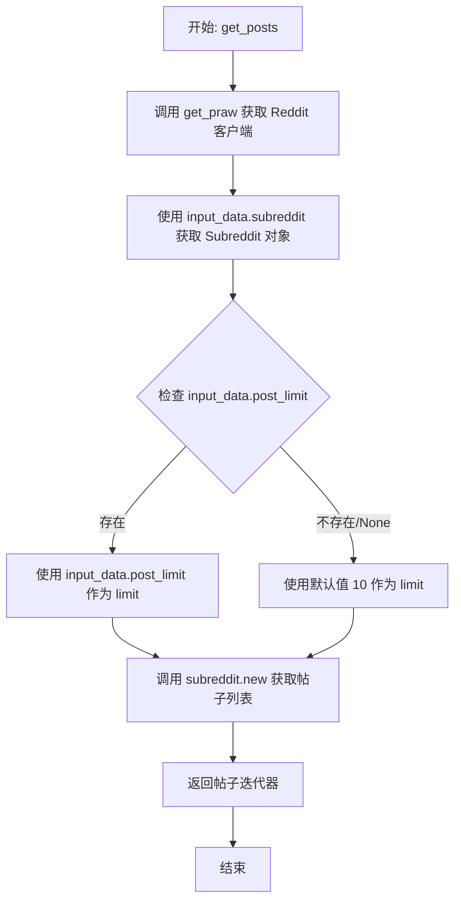

#### 带注释源码

```python
    @staticmethod
    def get_posts(
        input_data: Input, *, credentials: RedditCredentials
    ) -> Iterator[praw.reddit.Submission]:
        # 使用提供的凭证初始化并返回一个 PRAW Reddit 客户端实例
        client = get_praw(credentials)
        
        # 根据输入数据中的 subreddit 名称获取对应的 Subreddit 对象
        subreddit = client.subreddit(input_data.subreddit)
        
        # 获取该 Subreddit 下的最新帖子
        # limit 参数取自 input_data.post_limit，如果为 None 则默认设置为 10
        return subreddit.new(limit=input_data.post_limit or 10)
```


### `GetRedditPostsBlock.run`

该方法是 `GetRedditPostsBlock` 的核心执行逻辑，负责根据输入参数从指定的 Subreddit 获取 Reddit 帖子。它会遍历获取到的帖子列表，根据配置的时间范围（`last_minutes`）或特定帖子 ID（`last_post`）进行过滤，并通过生成器逐个产出符合条件的帖子对象，最后产出所有符合条件的帖子列表。

参数：

- `input_data`：`GetRedditPostsBlock.Input`，包含子版块名称、凭证、时间限制、停止获取的帖子ID以及获取数量限制等输入信息。
- `credentials`：`RedditCredentials`，用于身份验证的 Reddit OAuth2 凭证对象。
- `**kwargs`：`dict`，其他额外的关键字参数。

返回值：`BlockOutput`，一个异步生成器，产出包含键值对的元组，键为 "post"（单个帖子对象）或 "posts"（所有帖子对象的列表）。

#### 流程图

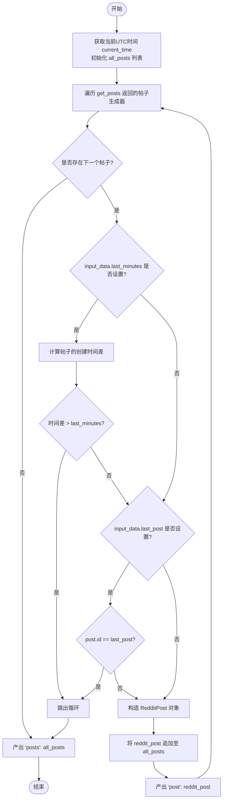

#### 带注释源码

```python
async def run(
    self, input_data: Input, *, credentials: RedditCredentials, **kwargs
) -> BlockOutput:
    # 获取当前的 UTC 时间，用于后续比较帖子发布时间
    current_time = datetime.now(tz=timezone.utc)
    
    # 初始化列表，用于存储所有获取到的帖子
    all_posts = []
    
    # 遍历获取到的帖子（通过静态方法 get_posts 获取生成器）
    for post in self.get_posts(input_data=input_data, credentials=credentials):
        # 检查是否设置了时间过滤参数 last_minutes
        if input_data.last_minutes:
            # 将帖子创建时间戳转换为 datetime 对象
            post_datetime = datetime.fromtimestamp(
                post.created_utc, tz=timezone.utc
            )
            # 计算当前时间与帖子发布时间的差值
            time_difference = current_time - post_datetime
            # 如果帖子发布时间早于指定的分钟数，则停止获取
            # 注意：Reddit 的 new 列表通常是从新到旧排序，所以一旦遇到旧帖子即可停止
            if time_difference.total_seconds() / 60 > input_data.last_minutes:
                break

        # 检查是否设置了停止获取的特定帖子 ID
        if input_data.last_post and post.id == input_data.last_post:
            # 如果当前帖子 ID 匹配指定 ID，则停止获取
            break

        # 构造标准化的 RedditPost 数据模型
        reddit_post = RedditPost(
            post_id=post.id,
            subreddit=input_data.subreddit,
            title=post.title,
            body=post.selftext,
        )
        # 将当前帖子加入总列表
        all_posts.append(reddit_post)
        
        # 实时产出单个帖子数据，允许下游组件即时处理
        yield "post", reddit_post

    # 循环结束后，产出所有帖子的列表
    yield "posts", all_posts
```


### `PostRedditCommentBlock.__init__`

初始化 `PostRedditCommentBlock` 实例，配置其元数据、输入输出模式、测试数据以及根据环境设置决定是否禁用该块。

参数：无

返回值：`None`，构造函数无返回值。

#### 流程图

```mermaid
graph TD
    A[Start __init__] --> B[Evaluate Settings for Reddit Credentials]
    B --> C[Determine disabled State<br/>(True if keys missing)]
    C --> D[Call super().__init__]
    D --> E[Pass ID, Description, Categories]
    E --> F[Pass Input/Output Schemas]
    F --> G[Pass Test Configs & Mocks]
    G --> H[End Initialization]
```

#### 带注释源码

```python
def __init__(self):
    # 调用父类 Block 的初始化方法
    super().__init__(
        # 块的唯一标识符
        id="4a92261b-701e-4ffb-8970-675fd28e261f",
        # 块的功能描述
        description="This block posts a Reddit comment on a specified Reddit post.",
        # 块所属的分类（社交类）
        categories={BlockCategory.SOCIAL},
        # 定义输入数据的 Schema（包含 credentials, post_id, comment）
        input_schema=PostRedditCommentBlock.Input,
        # 定义输出数据的 Schema（包含 comment_id, post_id）
        output_schema=PostRedditCommentBlock.Output,
        # 检查设置中的 Reddit 客户端密钥是否存在，若不存在则禁用该块
        disabled=(
            not settings.secrets.reddit_client_id
            or not settings.secrets.reddit_client_secret
        ),
        # 定义测试用的模拟凭据
        test_credentials=TEST_CREDENTIALS,
        # 定义测试输入数据
        test_input={
            "credentials": TEST_CREDENTIALS_INPUT,
            "post_id": "test_post_id",
            "comment": "comment",
        },
        # 定义测试期望输出数据
        test_output=[
            ("comment_id", "dummy_comment_id"),
            ("post_id", "test_post_id"),
        ],
        # 定义测试时的模拟函数，避免实际调用 Reddit API
        test_mock={
            "reply_post": lambda creds, post_id, comment: "dummy_comment_id"
        },
    )
```


### `PostRedditCommentBlock.reply_post`

该功能通过初始化的 PRAW 客户端获取指定 ID 的 Reddit 帖子，并使用提供的凭证向其发布一条评论，最终返回新创建评论的 ID。

参数：

- `creds`：`RedditCredentials`，用于身份验证的 Reddit OAuth2 凭证。
- `post_id`：`str`，要评论的 Reddit 帖子 ID。
- `comment`：`str`，要发布的评论内容文本。

返回值：`str`，新发布的评论的 ID。

#### 流程图

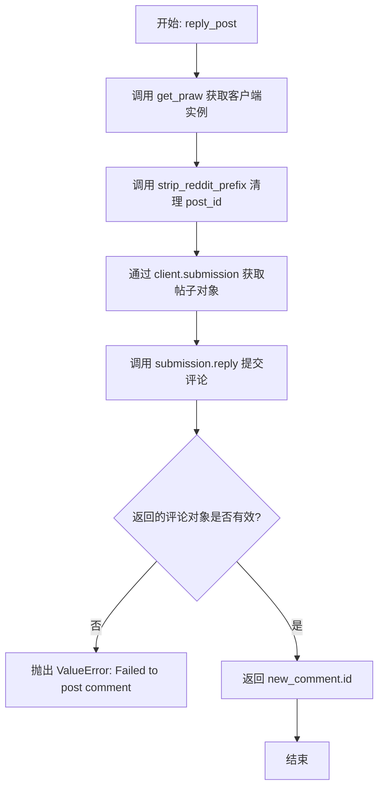

#### 带注释源码

```python
    @staticmethod
    def reply_post(creds: RedditCredentials, post_id: str, comment: str) -> str:
        # 使用提供的 OAuth2 凭证初始化 PRAW Reddit 客户端
        client = get_praw(creds)

        # 移除 Reddit ID 前缀（例如 't3_'），确保 ID 格式兼容
        post_id = strip_reddit_prefix(post_id)

        # 根据 post_id 获取对应的 Submission（帖子）对象
        submission = client.submission(id=post_id)

        # 在该帖子对象上调用 reply 方法发送评论内容
        new_comment = submission.reply(comment)

        # 检查 API 返回的结果，如果评论对象为空则抛出异常
        if not new_comment:
            raise ValueError("Failed to post comment.")

        # 返回新创建评论的 ID
        return new_comment.id
```


### `PostRedditCommentBlock.run`

该方法负责在指定的 Reddit 帖子上发布评论。它接收包含目标帖子 ID 和评论内容的输入数据，利用提供的 OAuth2 凭证初始化 Reddit 客户端，调用 API 发送评论，并最终输出新生成的评论 ID 以及原始帖子 ID 以便后续流程链式调用。

参数：

- `input_data`：`Input`，包含操作所需的数据，具体包括 `post_id`（目标帖子 ID）和 `comment`（评论内容文本）。
- `credentials`：`RedditCredentials`，用于身份验证的 Reddit OAuth2 凭证对象。
- `**kwargs`：`Any`，传递给块执行器的其他关键字参数（通常由框架隐式传递）。

返回值：`BlockOutput`，一个异步生成器，按顺序产生输出数据。首先产出 `comment_id`（新创建的评论 ID），随后产出 `post_id`（原始帖子 ID）。

#### 流程图

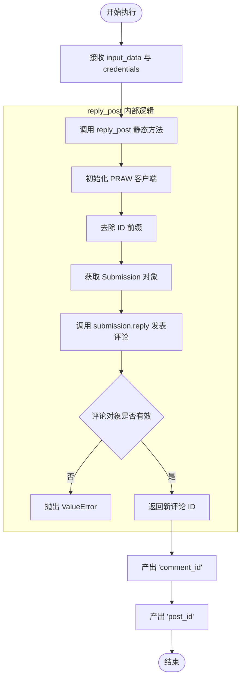

#### 带注释源码

```python
    async def run(
        self, input_data: Input, *, credentials: RedditCredentials, **kwargs
    ) -> BlockOutput:
        """
        执行发布评论的操作流程。
        
        1. 调用 reply_post 静态方法处理实际的 API 交互（认证、获取帖子、回复）。
        2. 将返回的新评论 ID 输出，以便下游使用。
        3. 将输入的帖子 ID 原样输出，用于数据流的上下文保持或链式操作。
        """
        # 调用辅助方法发布评论，并获取新评论的 ID
        yield "comment_id", self.reply_post(
            credentials,              # 传入认证凭证
            post_id=input_data.post_id,  # 传入目标帖子 ID
            comment=input_data.comment,  # 传入评论内容
        )
        
        # 将原始帖子 ID 透传输出，方便后续节点知晓当前操作的上下文
        yield "post_id", input_data.post_id
```


### `CreateRedditPostBlock.__init__`

初始化 `CreateRedditPostBlock` 类实例，配置块的元数据、输入输出模式、测试数据以及依赖检查。该块用于在指定的 Subreddit 上创建新的帖子（文本或链接）。

参数：

-  `self`：`CreateRedditPostBlock`，类的实例对象。

返回值：`None`，无返回值。

#### 流程图

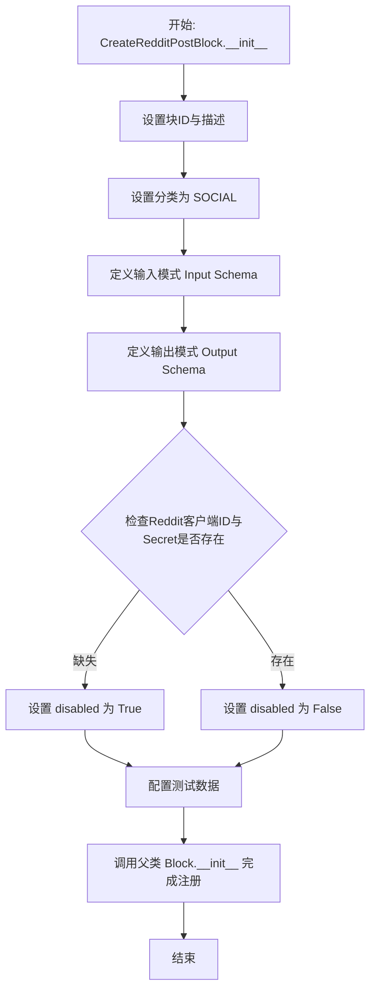

#### 带注释源码

```python
def __init__(self):
    # 调用父类 Block 的初始化方法，注册块的元数据和配置
    super().__init__(
        # 定义该块的唯一标识符
        id="f3a2b1c0-8d7e-4f6a-9b5c-1234567890ab",
        # 描述块的功能：在 subreddit 上创建新帖子，支持文本或链接
        description="Create a new post on a subreddit. Can create text posts or link posts.",
        # 指定块的分类为社交类
        categories={BlockCategory.SOCIAL},
        # 指定输入数据的 Schema 定义（嵌套类 Input）
        input_schema=CreateRedditPostBlock.Input,
        # 指定输出数据的 Schema 定义（嵌套类 Output）
        output_schema=CreateRedditPostBlock.Output,
        # 检查环境配置中的 Reddit 凭证密钥是否存在，若不存在则禁用该块
        disabled=(
            not settings.secrets.reddit_client_id
            or not settings.secrets.reddit_client_secret
        ),
        # 提供用于测试的模拟凭证
        test_credentials=TEST_CREDENTIALS,
        # 提供用于测试的输入数据样例
        test_input={
            "credentials": TEST_CREDENTIALS_INPUT,
            "subreddit": "test",
            "title": "Test Post",
            "content": "This is a test post body.",
        },
        # 提供用于测试的预期输出数据样例
        test_output=[
            ("post_id", "abc123"),
            ("post_url", "https://reddit.com/r/test/comments/abc123/test_post/"),
            ("subreddit", "test"),
        ],
        # 定义测试时用于模拟 create_post 静态方法的 lambda 函数
        test_mock={
            "create_post": lambda creds, subreddit, title, content, url, flair_id, flair_text: (
                "abc123",
                "https://reddit.com/r/test/comments/abc123/test_post/",
            )
        },
    )
```


### `CreateRedditPostBlock.create_post`

在指定的子版块上创建一个新帖子。该函数支持创建文本帖子或链接帖子，并允许应用可选的样式。

参数：

- `creds`：`RedditCredentials`，用于身份验证的 Reddit OAuth2 凭证
- `subreddit`：`str`，目标子版块的名称（不含 /r/ 前缀）
- `title`：`str`，帖子的标题
- `content`：`str`，帖子的正文内容（用于文本帖子）
- `url`：`str | None`，提交的 URL（用于链接帖子；如果提供，将忽略 content 参数）
- `flair_id`：`str | None`，可选的样式模板 ID，用于应用到帖子上
- `flair_text`：`str | None`，可选的自定义样式文本（仅当样式模板允许编辑时使用）

返回值：`tuple[str, str]`，包含新创建帖子的 ID (post_id) 和其完整 URL (post_url) 的元组。

#### 流程图

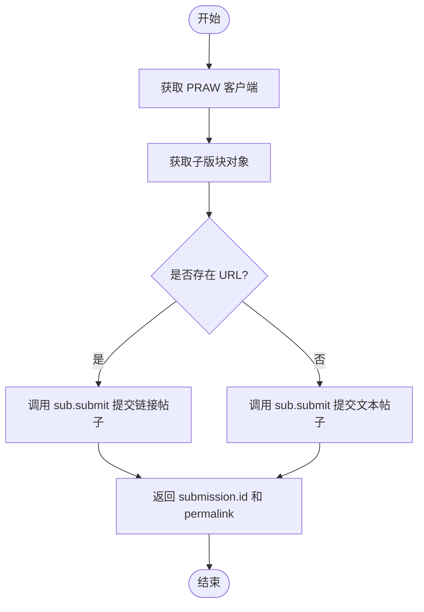

#### 带注释源码

```python
    @staticmethod
    def create_post(
        creds: RedditCredentials,
        subreddit: str,
        title: str,
        content: str = "",
        url: str | None = None,
        flair_id: str | None = None,
        flair_text: str | None = None,
    ) -> tuple[str, str]:
        """
        Create a new post on a subreddit.

        Args:
            creds: Reddit OAuth2 credentials
            subreddit: Subreddit name (without /r/ prefix)
            title: Post title
            content: Post body text (for text posts)
            url: URL to submit (for link posts, overrides content)
            flair_id: Optional flair template ID to apply
            flair_text: Optional custom flair text (for editable flairs)

        Returns:
            Tuple of (post_id, post_url)
        """
        # 使用提供的凭证初始化 PRAW Reddit 客户端
        client = get_praw(creds)
        # 获取目标子版块的对象实例
        sub = client.subreddit(subreddit)

        # 检查是否提供了 URL，以决定提交链接帖子还是文本帖子
        if url:
            # 如果提供了 URL，则提交链接帖子
            submission = sub.submit(
                title=title, url=url, flair_id=flair_id, flair_text=flair_text
            )
        else:
            # 否则，提交自文本（Self/Text）帖子
            submission = sub.submit(
                title=title, selftext=content, flair_id=flair_id, flair_text=flair_text
            )

        # 返回新帖子的 ID 和构建的完整 Reddit URL
        return submission.id, f"https://reddit.com{submission.permalink}"
```


### `CreateRedditPostBlock.run`

执行创建新的Reddit帖子的逻辑，支持文本或链接提交，应用可选的标签，并生成创建的帖子ID、URL和子版块名称。

参数：

-  `self`：`CreateRedditPostBlock`，类的实例。
-  `input_data`：`CreateRedditPostBlock.Input`，包含创建帖子所需的数据，如子版块名称、标题、内容、URL及标签信息。
-  `credentials`：`RedditCredentials`，用于身份验证的Reddit OAuth2凭证。
-  `**kwargs`：`dict`，额外的关键字参数。

返回值：`BlockOutput`，一个生成器，产出包含新创建的帖子ID、帖子URL和子版块名称的元组。

#### 流程图

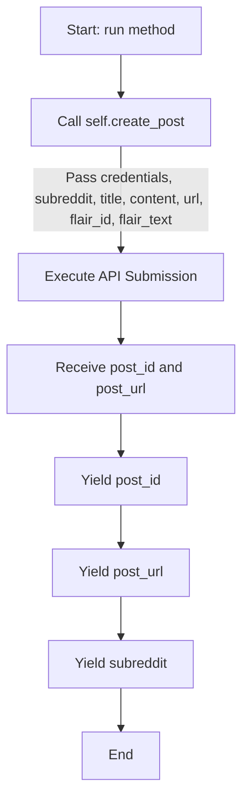

#### 带注释源码

```python
    async def run(
        self, input_data: Input, *, credentials: RedditCredentials, **kwargs
    ) -> BlockOutput:
        # 调用静态方法 create_post 实际执行 Reddit API 的提交操作。
        # 传入凭证、子版块、标题、内容、URL 以及可选的标签 ID 和文本。
        # 该方法区分是提交链接还是文本，并处理 flair。
        post_id, post_url = self.create_post(
            credentials,
            input_data.subreddit,
            input_data.title,
            input_data.content,
            input_data.url,
            input_data.flair_id,
            input_data.flair_text,
        )
        # 产出 (yield) 新创建帖子的 ID，供下游块使用。
        yield "post_id", post_id
        # 产出 (yield) 新创建帖子的完整 URL，供下游块使用。
        yield "post_url", post_url
        # 产出 (yield) 子版块名称，用于块之间的链式传递。
        yield "subreddit", input_data.subreddit
```


### `GetRedditPostBlock.__init__`

初始化 `GetRedditPostBlock` 实例，配置块的基本元数据、输入输出 Schema、测试数据以及基于环境设置的启用状态。该方法主要负责调用父类 `Block` 的构造函数，并传入定义好的静态配置。

参数：

-  `self`：`GetRedditPostBlock`，类的实例本身。

返回值：`None`，初始化方法无返回值。

#### 流程图

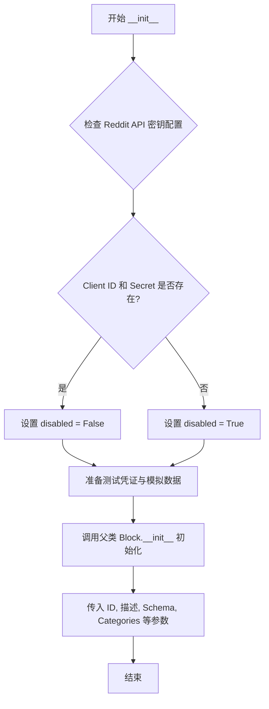

#### 带注释源码

```python
def __init__(self):
    super().__init__(
        # 块的唯一标识符 (UUID)
        id="36e6a259-168c-4032-83ec-b2935d0e4584",
        
        # 块的功能描述
        description="Get detailed information about a specific Reddit post by its ID.",
        
        # 块所属的分类 (此处为社交类)
        categories={BlockCategory.SOCIAL},
        
        # 定义输入数据的 Schema 结构 (嵌套类 Input)
        input_schema=GetRedditPostBlock.Input,
        
        # 定义输出数据的 Schema 结构 (嵌套类 Output)
        output_schema=GetRedditPostBlock.Output,
        
        # 根据全局设置判断是否禁用该块
        # 如果缺少 Reddit Client ID 或 Secret，则禁用该块
        disabled=(
            not settings.secrets.reddit_client_id
            or not settings.secrets.reddit_client_secret
        ),
        
        # 用于测试的模拟凭证
        test_credentials=TEST_CREDENTIALS,
        
        # 用于测试的输入数据样本
        test_input={
            "credentials": TEST_CREDENTIALS_INPUT,
            "post_id": "abc123",
        },
        
        # 用于测试的预期输出数据样本
        test_output=[
            (
                "post",
                RedditPostDetails(
                    id="abc123",
                    subreddit="test",
                    title="Test Post",
                    body="Test body",
                    author="testuser",
                    score=100,
                    upvote_ratio=0.95,
                    num_comments=10,
                    created_utc=1234567890.0,
                    url="https://reddit.com/r/test/comments/abc123/test_post/",
                    permalink="/r/test/comments/abc123/test_post/",
                    is_self=True,
                    over_18=False,
                ),
            ),
        ],
        
        # 定义测试时的 Mock 函数，模拟 get_post 方法的行为
        test_mock={
            "get_post": lambda creds, post_id: RedditPostDetails(
                id="abc123",
                subreddit="test",
                title="Test Post",
                body="Test body",
                author="testuser",
                score=100,
                upvote_ratio=0.95,
                num_comments=10,
                created_utc=1234567890.0,
                url="https://reddit.com/r/test/comments/abc123/test_post/",
                permalink="/r/test/comments/abc123/test_post/",
                is_self=True,
                over_18=False,
            )
        },
    )
```


### `GetRedditPostBlock.get_post`

获取特定 Reddit 帖子的详细信息。该方法使用提供的 OAuth2 凭证通过 PRAW 库连接到 Reddit，标准化帖子 ID（去除前缀），获取提交对象，并将其属性映射到 `RedditPostDetails` 数据模型中返回。

参数：

-   `creds`：`RedditCredentials`，用于连接 Reddit 的 OAuth2 凭证。
-   `post_id`：`str`，要获取的 Reddit 帖子 ID（例如 'abc123' 或带有 't3_' 前缀的完整 ID）。

返回值：`RedditPostDetails`，包含帖子详细信息的 Pydantic 模型对象，涵盖 ID、子版块、标题、正文、作者、分数、点赞率、评论数等元数据。

#### 流程图

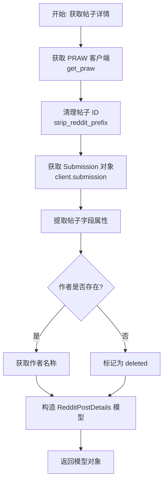

#### 带注释源码

```python
    @staticmethod
    def get_post(creds: RedditCredentials, post_id: str) -> RedditPostDetails:
        # 使用提供的凭证初始化 PRAW Reddit 客户端
        client = get_praw(creds)
        
        # 如果 ID 包含 't3_' 前缀，将其移除以标准化格式
        post_id = strip_reddit_prefix(post_id)
        
        # 通过 Reddit 客户端获取指定的帖子对象
        submission = client.submission(id=post_id)

        # 将 PRAW Submission 对象的属性映射到 RedditPostDetails Pydantic 模型
        return RedditPostDetails(
            id=submission.id,
            subreddit=submission.subreddit.display_name,
            title=submission.title,
            body=submission.selftext,
            # 处理作者字段，如果帖子作者已删除，则返回 "[deleted]"
            author=str(submission.author) if submission.author else "[deleted]",
            score=submission.score,
            upvote_ratio=submission.upvote_ratio,
            num_comments=submission.num_comments,
            created_utc=submission.created_utc,
            url=submission.url,
            permalink=submission.permalink,
            is_self=submission.is_self,
            over_18=submission.over_18,
        )
```


### `GetRedditPostBlock.run`

该方法是 `GetRedditPostBlock` 类的核心执行逻辑，用于异步获取指定 Reddit 帖子的详细信息。它通过提供的凭证初始化 Reddit 客户端，处理帖子 ID 格式，提取帖子数据并将其封装为结构化模型进行输出，同时具备完善的异常处理机制以返回错误信息。

参数：

-  `input_data`：`GetRedditPostBlock.Input`，包含执行该操作所需的输入数据，具体包含 `credentials`（认证信息）和 `post_id`（要获取的帖子ID）。
-  `credentials`：`RedditCredentials`，用于访问 Reddit API 的 OAuth2 认证凭据。
-  `**kwargs`：`dict`，额外的关键字参数，通常用于框架传递上下文信息。

返回值：`BlockOutput`，一个异步生成器，产生包含帖子详细信息（`RedditPostDetails`）或错误消息（`str`）的元组。

#### 流程图

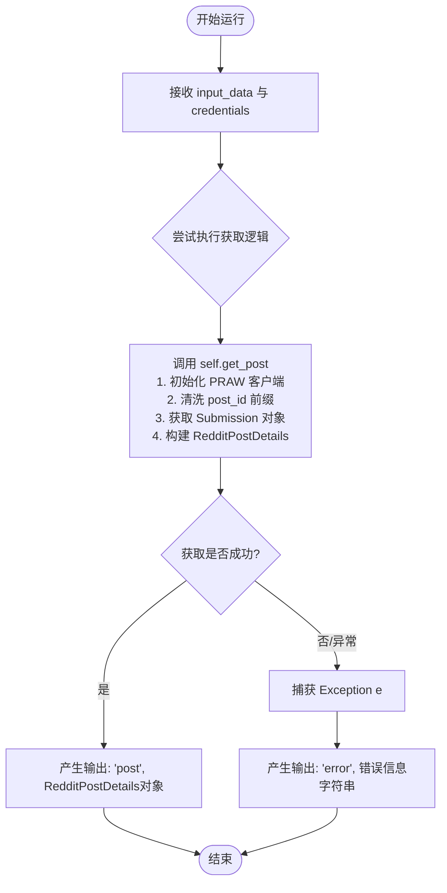

#### 带注释源码

```python
    async def run(
        self, input_data: Input, *, credentials: RedditCredentials, **kwargs
    ) -> BlockOutput:
        try:
            # 调用静态辅助方法 get_post 获取帖子数据
            # 内部逻辑包括：
            # 1. 通过 get_praw 初始化 Reddit 实例
            # 2. 使用 strip_reddit_prefix 清除 post_id 中的 't3_' 前缀
            # 3. 获取 submission 对象并映射到 RedditPostDetails Pydantic 模型
            post = self.get_post(credentials, input_data.post_id)
            
            # 成功获取后，产生 "post" 键和对应的帖子详情对象
            yield "post", post
        except Exception as e:
            # 捕获任何可能发生的异常（如网络错误、无效的 ID、认证失败等）
            # 并产生 "error" 键以及错误信息的字符串描述
            yield "error", str(e)
```


### `GetUserPostsBlock.__init__`

该方法是 `GetUserPostsBlock` 类的构造函数，负责初始化用于获取特定 Reddit 用户帖子的块配置。它定义了块的唯一标识、描述、输入输出模式、测试数据（包括模拟凭据、输入、输出和模拟函数），并根据环境设置决定是否禁用该块。

参数：

-   `self`：`GetUserPostsBlock`，类的实例本身。

返回值：`None`，构造函数不返回任何值。

#### 流程图

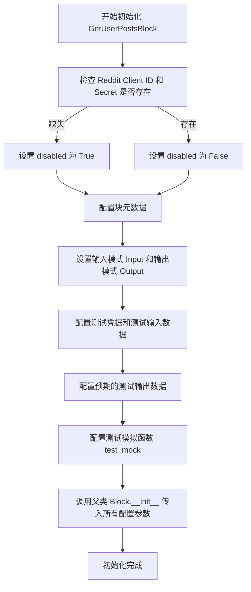

#### 带注释源码

```python
def __init__(self):
    # 调用父类 Block 的初始化函数，配置块的各种属性
    super().__init__(
        # 块的唯一标识符 (UUID)
        id="6fbe6329-d13e-4d2e-bd4d-b4d921b56161",
        # 块的功能描述文本
        description="Fetch posts by a specific Reddit user.",
        # 将块归类为社交类别
        categories={BlockCategory.SOCIAL},
        # 根据设置中的 Reddit 密钥是否存在，决定是否禁用该块
        disabled=(
            not settings.secrets.reddit_client_id
            or not settings.secrets.reddit_client_secret
        ),
        # 定义输入数据的结构
        input_schema=GetUserPostsBlock.Input,
        # 定义输出数据的结构
        output_schema=GetUserPostsBlock.Output,
        # 设置用于单元测试的模拟凭据
        test_credentials=TEST_CREDENTIALS,
        # 设置用于单元测试的模拟输入数据
        test_input={
            "credentials": TEST_CREDENTIALS_INPUT,
            "username": "testuser",
            "post_limit": 2,
        },
        # 设置用于单元测试的预期输出数据 (模拟迭代器产生的数据)
        test_output=[
            (
                "post",
                RedditPost(
                    post_id="id1", subreddit="sub1", title="title1", body="body1"
                ),
            ),
            (
                "post",
                RedditPost(
                    post_id="id2", subreddit="sub2", title="title2", body="body2"
                ),
            ),
            (
                "posts",
                [
                    RedditPost(
                        post_id="id1",
                        subreddit="sub1",
                        title="title1",
                        body="body1",
                    ),
                    RedditPost(
                        post_id="id2",
                        subreddit="sub2",
                        title="title2",
                        body="body2",
                    ),
                ],
            ),
        ],
        # 配置测试模拟对象，用于在测试环境中替换真实的 API 调用
        test_mock={
            "get_user_posts": lambda creds, username, limit, sort: [
                MockObject(
                    id="id1",
                    subreddit=MockObject(display_name="sub1"),
                    title="title1",
                    selftext="body1",
                ),
                MockObject(
                    id="id2",
                    subreddit=MockObject(display_name="sub2"),
                    title="title2",
                    selftext="body2",
                ),
            ]
        },
    )
```


### `GetUserPostsBlock.get_user_posts`

该方法用于根据指定的用户名、限制数量和排序方式，获取特定Reddit用户的提交内容（帖子）。它通过PRAW库与Reddit API交互，返回一个包含帖子对象的列表。

参数：

-   `creds`：`RedditCredentials`，Reddit OAuth2 凭证，用于身份验证和访问Reddit API。
-   `username`：`str`，要获取帖子的Reddit用户名（不包含 /u/ 前缀）。
-   `limit`：`int`，要获取的帖子的最大数量。
-   `sort`：`UserPostSort`，用户帖子的排序方式，可选值为 "new", "hot", "top", "controversial"。

返回值：`list[Submission]`，包含指定用户提交帖子的Reddit Submission对象列表。

#### 流程图

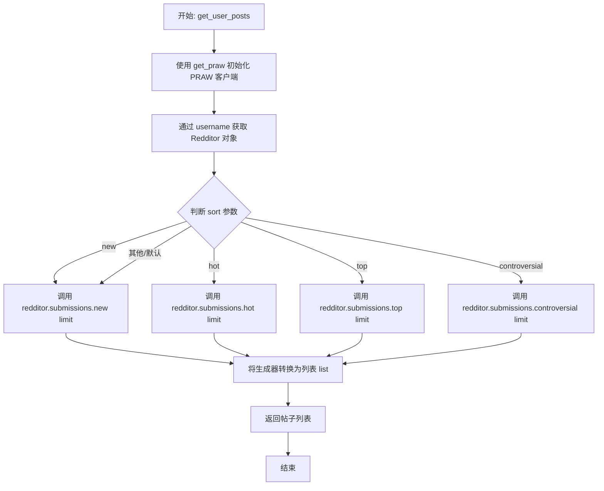

#### 带注释源码

```python
    @staticmethod
    def get_user_posts(
        creds: RedditCredentials, username: str, limit: int, sort: UserPostSort
    ) -> list[Submission]:
        # 使用提供的凭证初始化 PRAW (Python Reddit API Wrapper) 客户端
        client = get_praw(creds)
        # 获取指定用户名的 Redditor 对象
        redditor = client.redditor(username)

        # 根据传入的排序参数选择不同的获取方式
        if sort == "new":
            submissions = redditor.submissions.new(limit=limit)
        elif sort == "hot":
            submissions = redditor.submissions.hot(limit=limit)
        elif sort == "top":
            submissions = redditor.submissions.top(limit=limit)
        elif sort == "controversial":
            submissions = redditor.submissions.controversial(limit=limit)
        else:
            # 默认按最新排序
            submissions = redditor.submissions.new(limit=limit)

        # 将生成器对象转换为列表并返回
        return list(submissions)
```


### `GetUserPostsBlock.run`

获取指定 Reddit 用户的帖子列表，并将其逐条输出以及整体汇总输出。

参数：

- `input_data`：`GetUserPostsBlock.Input`，包含用户名、帖子数量限制和排序方式的输入数据对象。
- `credentials`：`RedditCredentials`，Reddit OAuth2 认证凭证，用于访问 API。
- `**kwargs`：`dict`，扩展关键字参数。

返回值：`BlockOutput`，异步生成器，用于产出单个帖子对象、所有帖子的列表或错误信息。

#### 流程图

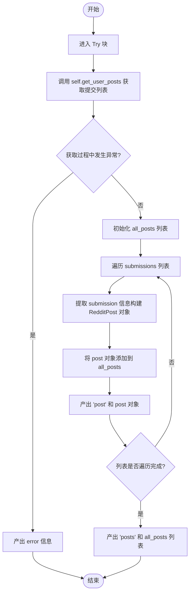

#### 带注释源码

```python
async def run(
    self, input_data: Input, *, credentials: RedditCredentials, **kwargs
) -> BlockOutput:
    try:
        # 调用静态方法获取指定用户的提交列表（Submission对象列表）
        submissions = self.get_user_posts(
            credentials,
            input_data.username,
            input_data.post_limit,
            input_data.sort,
        )
        all_posts = []
        # 遍历获取到的每一个提交
        for submission in submissions:
            # 将 Reddit 的 Submission 对象映射为项目内部的 RedditPost 模型
            post = RedditPost(
                post_id=submission.id,
                subreddit=submission.subreddit.display_name,
                title=submission.title,
                body=submission.selftext,
            )
            # 收集帖子到总列表
            all_posts.append(post)
            # 实时产出单个帖子数据
            yield "post", post
        
        # 遍历结束后，产出所有帖子的列表
        yield "posts", all_posts
    except Exception as e:
        # 捕获异常并产出错误信息
        yield "error", str(e)
```


### `RedditGetMyPostsBlock.__init__`

该方法用于初始化 `RedditGetMyPostsBlock` 实例，设置其唯一标识、描述、分类、输入输出模式、测试凭据、测试输入输出数据以及模拟执行逻辑。同时，它会检查 Reddit API 的密钥配置，如果缺少必要密钥则将块标记为禁用。

参数：

-   `self`：`RedditGetMyPostsBlock`，表示类的实例本身。

返回值：`None`，该方法是构造函数，不返回任何值，仅初始化对象状态。

#### 流程图

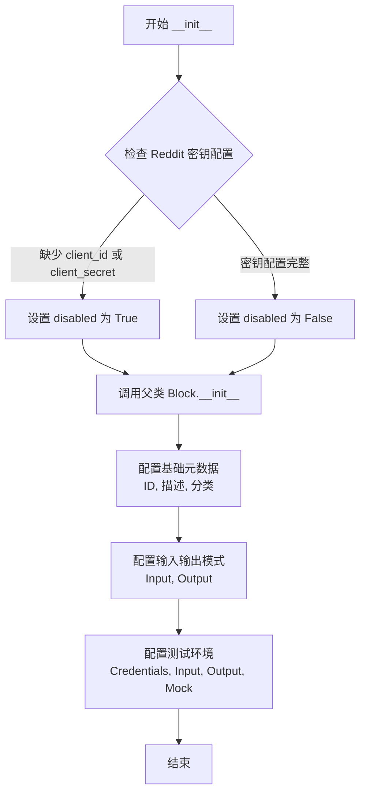

#### 带注释源码

```python
def __init__(self):
    super().__init__(
        # 块的唯一标识符
        id="4ab3381b-0c07-4201-89b3-fa2ec264f154",
        # 块的功能描述：获取经过身份验证的 Reddit 用户（即你自己）创建的帖子
        description="Fetch posts created by the authenticated Reddit user (you).",
        # 将块归类为社交媒体类别
        categories={BlockCategory.SOCIAL},
        # 检查配置中是否存在 Reddit 客户端 ID 和密钥，如果没有则禁用该块
        disabled=(
            not settings.secrets.reddit_client_id
            or not settings.secrets.reddit_client_secret
        ),
        # 定义输入模式结构，包含凭据、获取限制和排序方式
        input_schema=RedditGetMyPostsBlock.Input,
        # 定义输出模式结构，包含单个帖子、所有帖子列表和可能的错误信息
        output_schema=RedditGetMyPostsBlock.Output,
        # 设置测试用的模拟凭据
        test_credentials=TEST_CREDENTIALS,
        # 定义测试输入数据：凭据和帖子数量限制
        test_input={
            "credentials": TEST_CREDENTIALS_INPUT,
            "post_limit": 2,
        },
        # 定义预期的测试输出数据，包括生成的帖子和帖子列表
        test_output=[
            (
                "post",
                RedditPost(
                    post_id="id1", subreddit="sub1", title="title1", body="body1"
                ),
            ),
            (
                "post",
                RedditPost(
                    post_id="id2", subreddit="sub2", title="title2", body="body2"
                ),
            ),
            (
                "posts",
                [
                    RedditPost(
                        post_id="id1",
                        subreddit="sub1",
                        title="title1",
                        body="body1",
                    ),
                    RedditPost(
                        post_id="id2",
                        subreddit="sub2",
                        title="title2",
                        body="body2",
                    ),
                ],
            ),
        ],
        # 配置模拟函数，用于在测试环境中替代真实的 get_my_posts 方法
        test_mock={
            "get_my_posts": lambda creds, limit, sort: [
                MockObject(
                    id="id1",
                    subreddit=MockObject(display_name="sub1"),
                    title="title1",
                    selftext="body1",
                ),
                MockObject(
                    id="id2",
                    subreddit=MockObject(display_name="sub2"),
                    title="title2",
                    selftext="body2",
                ),
            ]
        },
    )
```


### `RedditGetMyPostsBlock.get_my_posts`

获取已认证的 Reddit 用户（即当前用户）所提交的帖子列表，支持按指定的排序方式（如最新、热门、最佳或争议）和数量限制进行获取。

参数：

-  `creds`：`RedditCredentials`，用于认证的 Reddit OAuth2 凭证对象，用于初始化 API 客户端。
-  `limit`：`int`，要获取的帖子的最大数量限制。
-  `sort`：`UserPostSort`，帖子的排序方式，可选值为 "new", "hot", "top", "controversial"。

返回值：`list[Submission]`，包含认证用户提交的 Reddit 帖子对象（PRAW Submission 模型）的列表。

#### 流程图

```mermaid
graph TD
    A[开始] --> B[使用 creds 初始化 PRAW 客户端]
    B --> C[获取当前认证用户]
    C --> D{用户对象是否有效?}
    D -- 否 --> E[抛出 ValueError: Could not get authenticated user]
    D -- 是 --> F{检查 sort 参数值}
    F -- "new" --> G[调用 me.submissions.new]
    F -- "hot" --> H[调用 me.submissions.hot]
    F -- "top" --> I[调用 me.submissions.top]
    F -- "controversial" --> J[调用 me.submissions.controversial]
    F -- 其他/默认 --> G[默认调用 me.submissions.new]
    G --> K[将生成器结果转换为列表]
    H --> K
    I --> K
    J --> K
    K --> L[返回帖子列表]
    L --> M[结束]
```

#### 带注释源码

```python
    @staticmethod
    def get_my_posts(
        creds: RedditCredentials, limit: int, sort: UserPostSort
    ) -> list[Submission]:
        # 使用提供的凭证初始化并返回一个 PRAW Reddit 客户端实例
        client = get_praw(creds)
        
        # 获取当前已认证的用户对象
        me = client.user.me()
        
        # 检查用户对象是否存在，若不存在则说明凭证无效或认证失败
        if not me:
            raise ValueError("Could not get authenticated user.")

        # 根据 sort 参数的值，调用 PRAW 对应的排序方法获取用户提交的帖子
        # limit 参数控制返回的数量
        if sort == "new":
            submissions = me.submissions.new(limit=limit)
        elif sort == "hot":
            submissions = me.submissions.hot(limit=limit)
        elif sort == "top":
            submissions = me.submissions.top(limit=limit)
        elif sort == "controversial":
            submissions = me.submissions.controversial(limit=limit)
        else:
            # 如果传入未识别的排序类型，默认使用 "new"
            submissions = me.submissions.new(limit=limit)

        # PRAW 返回的是生成器，将其转换为列表后返回
        return list(submissions)
```


### `RedditGetMyPostsBlock.run`

该方法负责获取通过身份验证的 Reddit 用户（即当前授权用户）所发布的帖子。它接受包含排序方式和数量限制的输入数据，利用 PRAW 客户端检索用户的提交历史，并将帖子逐个流式输出，最后输出所有帖子的列表。

参数：

-  `input_data`：`RedditGetMyPostsBlock.Input`，包含执行所需参数的输入数据模型，具体包括 `post_limit`（最大获取数量）和 `sort`（排序方式）。
-  `credentials`：`RedditCredentials`，Reddit OAuth2 凭证对象，用于 API 身份验证和授权。
-  `**kwargs`：`dict`，额外的关键字参数，用于扩展。

返回值：`BlockOutput`（`AsyncIterator[Tuple[str, Any]]`），异步生成器，逐步产出处理结果。产出的元组键为 "post"（单个帖子对象）、"posts"（所有帖子列表）或 "error"（错误信息）。

#### 流程图

```mermaid
graph TD
    A[开始: run 方法] --> B{尝试获取帖子}
    B --> C[调用 self.get_my_posts<br>获取提交列表]
    C --> D[初始化 all_posts 列表]
    D --> E{遍历 submissions 列表}
    E -- 有下一个 submission --> F[提取 ID, 子版块, 标题, 正文]
    F --> G[构造 RedditPost 对象]
    G --> H[添加至 all_posts 列表]
    H --> I[产出 'post', 单个帖子对象]
    I --> E
    E -- 遍历结束 --> J[产出 'posts', 所有帖子列表]
    J --> K[结束]
    C -- 发生异常 --> L[捕获 Exception]
    L --> M[产出 'error', 异常信息]
    M --> K
```

#### 带注释源码

```python
    async def run(
        self, input_data: Input, *, credentials: RedditCredentials, **kwargs
    ) -> BlockOutput:
        try:
            # 调用静态方法获取当前认证用户的提交列表
            # 传入凭证、数量限制和排序方式
            submissions = self.get_my_posts(
                credentials,
                input_data.post_limit,
                input_data.sort,
            )
            all_posts = []  # 初始化用于存储所有帖子的列表
            for submission in submissions:
                # 将 PRAW 的 Submission 对象转换为项目定义的 RedditPost 模型
                post = RedditPost(
                    post_id=submission.id,
                    subreddit=submission.subreddit.display_name,
                    title=submission.title,
                    body=submission.selftext,
                )
                all_posts.append(post)  # 累加到总列表中
                # 实时产出单个帖子，实现流式输出
                yield "post", post
            
            # 遍历结束后，产出包含所有帖子的列表
            yield "posts", all_posts
        except Exception as e:
            # 捕获任何异常并产出错误信息，确保流程不中断
            yield "error", str(e)
```


### `SearchRedditBlock.__init__`

该方法是 `SearchRedditBlock` 类的构造函数，负责初始化用于在 Reddit 上搜索内容的块。它通过调用父类 `Block` 的构造函数并传入一系列配置参数，定义了该块的唯一标识符、功能描述、所属分类、输入输出 Schema、测试凭证以及用于模拟运行的测试数据和 Mock 函数。此外，它还根据系统设置中的 Reddit API 客户端凭据是否存在，动态设置该块是否被禁用。

参数：

-   `self`：`SearchRedditBlock`，类的实例本身，表示当前正在初始化的对象。

返回值：`None`，Python 构造函数不返回任何值。

#### 流程图

```mermaid
flowchart TD
    A([开始初始化]) --> B{检查 Reddit API<br>配置是否存在}
    B -->|Client ID 或 Secret 缺失| C[设置 disabled 为 True]
    B -->|配置齐全| D[设置 disabled 为 False]
    C --> E[调用父类 Block.__init__]
    D --> E
    E --> F[传入 ID, 描述, 分类<br>输入/输出 Schema]
    F --> G[传入测试凭证<br>和测试数据]
    G --> H[传入 Mock 函数<br>search_reddit]
    H --> I([初始化完成])
```

#### 带注释源码

```python
    def __init__(self):
        # 调用父类 Block 的构造函数以注册块的元数据和配置
        super().__init__(
            # 块的唯一标识符
            id="4a0c975e-807b-4d5e-83c9-1619864a4b1a",
            # 块的功能描述，支持全 Reddit 或特定子版块搜索
            description="Search Reddit for posts matching a query. Can search all of Reddit or a specific subreddit.",
            # 块所属的分类，此处为社交类别
            categories={BlockCategory.SOCIAL},
            # 根据配置文件中的 Reddit 密钥是否存在来决定是否禁用该块
            disabled=(
                not settings.secrets.reddit_client_id
                or not settings.secrets.reddit_client_secret
            ),
            # 定义输入数据的 Schema，包含凭证、查询词、子版块、排序方式等
            input_schema=SearchRedditBlock.Input,
            # 定义输出数据的 Schema，包含单个搜索结果、结果列表和错误信息
            output_schema=SearchRedditBlock.Output,
            # 测试用的凭证对象
            test_credentials=TEST_CREDENTIALS,
            # 测试输入数据
            test_input={
                "credentials": TEST_CREDENTIALS_INPUT,
                "query": "test query",
                "limit": 2,
            },
            # 测试输出数据，模拟返回两个搜索结果
            test_output=[
                (
                    "result",
                    RedditSearchResult(
                        id="id1",
                        subreddit="sub1",
                        title="title1",
                        body="body1",
                        author="author1",
                        score=100,
                        num_comments=10,
                        created_utc=1234567890.0,
                        permalink="/r/sub1/comments/id1/title1/",
                    ),
                ),
                (
                    "result",
                    RedditSearchResult(
                        id="id2",
                        subreddit="sub2",
                        title="title2",
                        body="body2",
                        author="author2",
                        score=50,
                        num_comments=5,
                        created_utc=1234567891.0,
                        permalink="/r/sub2/comments/id2/title2/",
                    ),
                ),
                (
                    "results",
                    [
                        RedditSearchResult(
                            id="id1",
                            subreddit="sub1",
                            title="title1",
                            body="body1",
                            author="author1",
                            score=100,
                            num_comments=10,
                            created_utc=1234567890.0,
                            permalink="/r/sub1/comments/id1/title1/",
                        ),
                        RedditSearchResult(
                            id="id2",
                            subreddit="sub2",
                            title="title2",
                            body="body2",
                            author="author2",
                            score=50,
                            num_comments=5,
                            created_utc=1234567891.0,
                            permalink="/r/sub2/comments/id2/title2/",
                        ),
                    ],
                ),
            ],
            # 定义 Mock 函数，用于在测试环境中模拟 search_reddit 方法的调用
            test_mock={
                "search_reddit": lambda creds, query, subreddit, sort, time_filter, limit: [
                    MockObject(
                        id="id1",
                        subreddit=MockObject(display_name="sub1"),
                        title="title1",
                        selftext="body1",
                        author="author1",
                        score=100,
                        num_comments=10,
                        created_utc=1234567890.0,
                        permalink="/r/sub1/comments/id1/title1/",
                    ),
                    MockObject(
                        id="id2",
                        subreddit=MockObject(display_name="sub2"),
                        title="title2",
                        selftext="body2",
                        author="author2",
                        score=50,
                        num_comments=5,
                        created_utc=1234567891.0,
                        permalink="/r/sub2/comments/id2/title2/",
                    ),
                ]
            },
        )
```


### `SearchRedditBlock.search_reddit`

该方法负责使用 Reddit API 根据查询字符串、排序方式和时间过滤器搜索帖子。它可以选择在特定的子版块（Subreddit）内搜索，也可以在整个 Reddit 上搜索。

参数：

- `creds`: `RedditCredentials`, Reddit OAuth2 认证凭据，用于 API 访问。
- `query`: `str`, 搜索查询字符串。
- `subreddit`: `str | None`, 可选，限制搜索的特定 Subreddit 名称（不包含 /r/ 前缀），如果为 None 则搜索所有 Reddit。
- `sort`: `SearchSort`, 搜索结果的排序方式（例如 "relevance", "hot", "top" 等）。
- `time_filter`: `TimeFilter`, 搜索结果的时间过滤器（例如 "all", "day", "week" 等）。
- `limit`: `int`, 返回的最大结果数量。

返回值：`list[Submission]`, 包含搜索到的 Reddit 帖子（Submission 对象）的列表。

#### 流程图

```mermaid
flowchart TD
    A[开始执行 search_reddit] --> B[调用 get_praw 获取 PRAW 客户端实例]
    B --> C{subreddit 参数是否为空?}
    C -- 否 (指定了子版块) --> D[获取指定 subreddit 的客户端实例]
    D --> E[在指定 subreddit 中调用 search 方法]
    C -- 是 (全局搜索) --> F[获取 'all' (全部) 的客户端实例]
    F --> G[在 'all' 中调用 search 方法]
    E --> H[传入 query, sort, time_filter, limit 参数]
    G --> H
    H --> I[将搜索生成器结果转换为列表 list]
    I --> J[返回结果列表]
    J --> K[结束]
```

#### 带注释源码

```python
    @staticmethod
    def search_reddit(
        creds: RedditCredentials,
        query: str,
        subreddit: str | None,
        sort: SearchSort,
        time_filter: TimeFilter,
        limit: int,
    ) -> list[Submission]:
        # 1. 使用提供的凭据初始化 PRAW Reddit 客户端
        client = get_praw(creds)

        # 2. 根据是否指定 subreddit 决定搜索范围
        if subreddit:
            # 如果指定了 subreddit，则在该特定子版块内搜索
            sub = client.subreddit(subreddit)
            results = sub.search(query, sort=sort, time_filter=time_filter, limit=limit)
        else:
            # 如果未指定，则在整个 Reddit (all) 中搜索
            results = client.subreddit("all").search(
                query, sort=sort, time_filter=time_filter, limit=limit
            )

        # 3. 将生成器返回的结果转换为列表并返回
        return list(results)
```


### `SearchRedditBlock.run`

该方法是 `SearchRedditBlock` 类的核心执行逻辑，用于根据输入的查询条件（如关键词、子版块、排序方式等）在 Reddit 上搜索帖子，并将搜索结果转换为标准化的数据模型输出。

参数：

- `input_data`: `SearchRedditBlock.Input`, 包含搜索查询字符串、目标子版块、排序方式、时间过滤器和结果数量限制的输入数据对象。
- `credentials`: `RedditCredentials`, Reddit 的 OAuth2 认证凭据，用于授权访问 Reddit API。
- `**kwargs`: `dict`, 其他扩展的关键字参数。

返回值：`BlockOutput`, 一个异步生成器，逐个产生搜索结果（`RedditSearchResult`），最后产生包含所有结果的列表。如果搜索过程中发生错误，则产生错误信息。

#### 流程图

```mermaid
graph TD
    A[开始执行 run 方法] --> B[尝试执行搜索逻辑]
    B --> C[调用 search_reddit 静态方法获取提交列表]
    C --> D[初始化结果列表 all_results]
    D --> E{遍历 submissions 列表}
    E -->|存在下一个 submission| F[构造 RedditSearchResult 对象]
    F --> G[将 result 追加至 all_results]
    G --> H[产出单个结果 ('result', result)]
    H --> E
    E -->|遍历结束| I[产出完整结果列表 ('results', all_results)]
    I --> J[正常结束]
    B -->|发生异常| K[产出错误信息 ('error', str)]
    K --> J
```

#### 带注释源码

```python
async def run(
    self, input_data: Input, *, credentials: RedditCredentials, **kwargs
) -> BlockOutput:
    try:
        # 调用静态方法 search_reddit 执行实际的搜索操作
        # 传入凭据、查询词、子版块（可选）、排序、时间过滤器和限制数量
        submissions = self.search_reddit(
            credentials,
            input_data.query,
            input_data.subreddit,
            input_data.sort,
            input_data.time_filter,
            input_data.limit,
        )
        
        # 初始化一个列表用于存储所有的搜索结果
        all_results = []
        
        # 遍历搜索返回的每一个 Submission 对象
        for submission in submissions:
            # 将 PRAW 的 Submission 对象转换为项目定义的 Pydantic 模型 RedditSearchResult
            result = RedditSearchResult(
                id=submission.id,
                subreddit=submission.subreddit.display_name,
                title=submission.title,
                body=submission.selftext,
                author=str(submission.author) if submission.author else "[deleted]", # 处理可能已被删除的作者
                score=submission.score,
                num_comments=submission.num_comments,
                created_utc=submission.created_utc,
                permalink=submission.permalink,
            )
            
            # 将转换后的结果对象添加到总列表中
            all_results.append(result)
            
            # 实时产出单个结果，允许下游逐步处理
            yield "result", result
        
        # 遍历完成后，产出包含所有结果的完整列表
        yield "results", all_results
        
    except Exception as e:
        # 捕获任何发生的异常，并产出错误信息
        yield "error", str(e)
```


### `EditRedditPostBlock.__init__`

初始化 `EditRedditPostBlock` 类实例，配置其元数据、输入输出模式以及测试数据，用于编辑现有的 Reddit 帖子。

参数：

-  `self`：`EditRedditPostBlock`，类实例本身，引用当前正在被初始化的对象。

返回值：`None`，无返回值。

#### 流程图

```mermaid
flowchart TD
    Start([开始]) --> DefineConfig[定义块配置 ID]
    DefineConfig --> SetDescMeta[设置描述、分类与禁用状态]
    SetDescMeta --> SetSchemas[设置输入输出 Schema]
    SetSchemas --> SetTestData[配置测试凭据、输入、输出与 Mock 函数]
    SetTestData --> CallSuper[调用父类 Block.__init__ 完成初始化]
    CallSuper --> End([结束])
```

#### 带注释源码

```python
    def __init__(self):
        # 调用父类 Block 的初始化方法，传入该 Block 的具体配置参数
        super().__init__(
            # 定义该 Block 的唯一标识符
            id="cdb9df0f-8b1d-433e-873a-ededc1b6479d",
            # 描述该 Block 的功能：编辑属于你自己的现有 Reddit 帖子的正文
            description="Edit the body text of an existing Reddit post that you own. Only works for self/text posts.",
            # 设置 Block 所属的分类为 SOCIAL（社交）
            categories={BlockCategory.SOCIAL},
            # 指定输入数据的 Schema 结构，引用内部类 Input
            input_schema=EditRedditPostBlock.Input,
            # 指定输出数据的 Schema 结构，引用内部类 Output
            output_schema=EditRedditPostBlock.Output,
            # 如果缺少 Reddit 客户端 ID 或密钥，则禁用该 Block
            disabled=(
                not settings.secrets.reddit_client_id
                or not settings.secrets.reddit_client_secret
            ),
            # 用于单元测试的模拟凭据
            test_credentials=TEST_CREDENTIALS,
            # 用于单元测试的模拟输入数据
            test_input={
                "credentials": TEST_CREDENTIALS_INPUT,
                "post_id": "abc123",
                "new_content": "Updated post content",
            },
            # 用于单元测试的预期输出数据
            test_output=[
                ("success", True),
                ("post_id", "abc123"),
                ("post_url", "https://reddit.com/r/test/comments/abc123/test_post/"),
            ],
            # 用于单元测试的 Mock 函数，模拟 edit_post 的行为，避免真实 API 调用
            test_mock={
                "edit_post": lambda creds, post_id, new_content: (
                    True,
                    "https://reddit.com/r/test/comments/abc123/test_post/",
                )
            },
        )
```


### `EditRedditPostBlock.edit_post`

使用 PRAW 客户端检索特定的 Reddit 帖子，并使用新内容更新其正文文本。

参数：

- `creds`：`RedditCredentials`，用于身份验证的 Reddit OAuth2 凭证。
- `post_id`：`str`，要编辑的帖子的 ID（可以包含 't3_' 等前缀）。
- `new_content`：`str`，用于替换现有帖子内容的新正文文本。

返回值：`tuple[bool, str]`，返回一个元组，其中第一个元素是表示成功的 `True`，第二个元素是编辑后帖子的永久链接 URL。

#### 流程图

```mermaid
graph TD
    A[Start] --> B[Initialize PRAW Client]
    B --> C[Clean Post ID using strip_reddit_prefix]
    C --> D[Fetch Submission via client.submission]
    D --> E[Call submission.edit with new_content]
    E --> F[Return Tuple: True, Post Permalink]
    F --> G[End]
```

#### 带注释源码

```python
@staticmethod
def edit_post(
    creds: RedditCredentials, post_id: str, new_content: str
) -> tuple[bool, str]:
    # Initialize the Reddit client using provided credentials
    client = get_praw(creds)
    # Remove any Reddit type prefix (e.g., 't3_') from the post ID
    post_id = strip_reddit_prefix(post_id)
    # Retrieve the Submission object for the specific post ID
    submission = client.submission(id=post_id)
    # Perform the edit operation on the post's body
    submission.edit(new_content)
    # Return success status and the URL of the edited post
    return True, f"https://reddit.com{submission.permalink}"
```


### `EditRedditPostBlock.run`

该方法负责执行编辑现有 Reddit 帖子的逻辑。它通过调用静态方法 `edit_post` 尝试更新帖子的正文内容，并处理可能发生的异常，特别是针对权限不足（403错误）的情况提供了友好的错误提示。

参数：

-   `input_data`：`EditRedditPostBlock.Input`，包含要编辑的帖子 ID 和新的正文内容。
-   `credentials`：`RedditCredentials`，用于身份验证的 Reddit OAuth2 凭证。
-   `**kwargs`：`dict`，额外的关键字参数。

返回值：`BlockOutput`，一个异步生成器，依次产出编辑成功的状态、帖子 ID、帖子 URL 或错误信息。

#### 流程图

```mermaid
flowchart TD
    A([开始]) --> B{进入 Try 块}
    B --> C[调用 self.edit_post]
    C --> D{发生异常?}
    
    D -- 否 --> E[输出 success: True]
    E --> F[输出 post_id]
    F --> G[输出 post_url]
    G --> H([结束])
    
    D -- 是 --> I{错误信息包含 403?}
    
    I -- 是 --> J[设置错误信息为: 权限被拒绝，只能编辑自己的帖子]
    I -- 否 --> K[使用原始异常信息作为错误信息]
    
    J --> L[输出 error]
    K --> L
    L --> H
```

#### 带注释源码

```python
    async def run(
        self, input_data: Input, *, credentials: RedditCredentials, **kwargs
    ) -> BlockOutput:
        try:
            # 调用静态方法 edit_post 执行实际的编辑操作
            # 传入凭证、帖子ID和新的内容
            success, post_url = self.edit_post(
                credentials, input_data.post_id, input_data.new_content
            )
            # 产出编辑成功的状态标志
            yield "success", success
            # 产出帖子 ID，便于后续流程链式调用
            yield "post_id", input_data.post_id
            # 产出编辑后的帖子 URL
            yield "post_url", post_url
        except Exception as e:
            # 捕获异常并获取错误消息字符串
            error_msg = str(e)
            # 特殊处理 HTTP 403 错误（禁止访问），这通常意味着用户尝试编辑不属于自己的帖子
            if "403" in error_msg:
                error_msg = (
                    "Permission denied (403): You can only edit your own posts. "
                    "Make sure the post belongs to the authenticated Reddit account."
                )
            # 产出错误信息
            yield "error", error_msg
```


### `GetSubredditInfoBlock.__init__`

该方法是 `GetSubredditInfoBlock` 类的构造函数，负责初始化用于获取 Reddit 子版块（Subreddit）信息的 Block。它配置了 Block 的唯一标识、描述、输入输出 Schema、启用状态（基于环境变量）、以及用于测试的凭据、输入、输出和模拟数据。

参数：

-  `self`：`GetSubredditInfoBlock`，表示类实例本身。

返回值：`None`，构造函数不返回任何值。

#### 流程图

```mermaid
flowchart TD
    Start([开始 __init__]) --> DefineMetadata[定义 Block 元数据<br>ID, 描述, 分类]
    DefineMetadata --> DefineSchemas[定义输入输出 Schema<br>Input, Output]
    DefineSchemas --> CheckDisabled[检查依赖配置<br>Reddit Client ID/Secret]
    CheckDisabled --> DefineTests[定义测试配置<br>凭据, 输入, 输出, Mock]
    DefineTests --> CallSuper[调用 super().__init__<br>传入所有配置参数]
    CallSuper --> End([结束])
```

#### 带注释源码

```python
def __init__(self):
    # 调用父类 Block 的 __init__ 方法，传入基础配置
    super().__init__(
        # 定义 Block 的唯一标识符
        id="5a2d1f0c-01fb-43ea-bad7-2260d269c930",
        # Block 的功能描述
        description="Get information about a subreddit including subscriber count, description, and rules.",
        # Block 所属的分类，这里为社交类
        categories={BlockCategory.SOCIAL},
        # 指定输入数据的 Schema，包含 credentials 和 subreddit 字段
        input_schema=GetSubredditInfoBlock.Input,
        # 指定输出数据的 Schema，包含 info 和 subreddit 字段
        output_schema=GetSubredditInfoBlock.Output,
        # 根据 Reddit 客户端密钥是否存在来决定是否禁用该 Block
        disabled=(
            not settings.secrets.reddit_client_id
            or not settings.secrets.reddit_client_secret
        ),
        # 用于测试的模拟凭据对象
        test_credentials=TEST_CREDENTIALS,
        # 用于测试的模拟输入数据
        test_input={
            "credentials": TEST_CREDENTIALS_INPUT,
            "subreddit": "python",
        },
        # 用于测试的期望输出数据列表
        test_output=[
            (
                "info",
                SubredditInfo(
                    name="t5_2qh0y",
                    display_name="python",
                    title="Python",
                    description="News about the Python programming language",
                    public_description="News about Python",
                    subscribers=1000000,
                    created_utc=1234567890.0,
                    over_18=False,
                    url="/r/python/",
                ),
            ),
            ("subreddit", "python"),
        ],
        # 定义模拟函数，用于在测试环境中替换真实的 API 调用
        test_mock={
            "get_subreddit_info": lambda creds, subreddit: SubredditInfo(
                name="t5_2qh0y",
                display_name="python",
                title="Python",
                description="News about the Python programming language",
                public_description="News about Python",
                subscribers=1000000,
                created_utc=1234567890.0,
                over_18=False,
                url="/r/python/",
            )
        },
    )
```


### `GetSubredditInfoBlock.get_subreddit_info`

该方法通过认证凭据获取指定 Subreddit（子版块）的详细信息，包括名称、标题、描述、订阅者数量、创建时间及是否为成人内容等元数据。

参数：

- `creds`：`RedditCredentials`，用于访问 Reddit API 的 OAuth2 认证凭据。
- `subreddit`：`str`，要查询的 Subreddit 名称（不含 /r/ 前缀）。

返回值：`SubredditInfo`，包含 Subreddit 详细信息的 Pydantic 模型对象，涵盖展示名称、标题、描述、订阅数等字段。

#### 流程图

```mermaid
graph TD
    A[开始] --> B[调用 get_praw 获取 Reddit 客户端]
    B --> C[使用 subreddit 参数获取版块对象]
    C --> D[提取版块属性信息<br/>name, title, description, subscribers 等]
    D --> E[实例化 SubredditInfo 模型]
    E --> F[返回 SubredditInfo 对象]
    F --> G[结束]
```

#### 带注释源码

```python
    @staticmethod
    def get_subreddit_info(creds: RedditCredentials, subreddit: str) -> SubredditInfo:
        # 使用提供的凭据初始化 PRAW Reddit 客户端
        client = get_praw(creds)
        
        # 根据名称获取特定的 Subreddit 对象
        sub = client.subreddit(subreddit)

        # 将 Subreddit 对象的属性映射到 SubredditInfo Pydantic 模型并返回
        return SubredditInfo(
            name=sub.name,                      # Subreddit 的内部 ID (如 t5_2qh0y)
            display_name=sub.display_name,       # 显示名称 (如 'python')
            title=sub.title,                    # 版块标题
            description=sub.description,        # 完整描述/侧边栏文本
            public_description=sub.public_description, # 公开简短描述
            subscribers=sub.subscribers,         # 订阅者数量
            created_utc=sub.created_utc,        # 创建时间 (UTC 时间戳)
            over_18=sub.over18,                 # 是否为 NSFW (成人内容)
            url=sub.url,                        # Subreddit 的 URL 路径
        )
```


### `GetSubredditInfoBlock.run`

执行获取指定 Subreddit 信息的逻辑。该方法通过提供的凭证初始化 Reddit API 客户端，请求并解析指定 Subreddit 的元数据（如标题、描述、订阅者数量等），处理成功或异常情况并输出相应的数据。

参数：

-  `input_data`：`GetSubredditInfoBlock.Input`，包含输入数据的对象，具体包含目标 `subreddit` 的名称（不含 `/r/` 前缀）。
-  `credentials`：`RedditCredentials`，Reddit 的 OAuth2 认证凭证，用于授权 API 访问。
-  `**kwargs`：`dict`，其他扩展关键字参数。

返回值：`BlockOutput`，一个异步生成器，产生包含操作结果的元组（键值对），如 `("info", SubredditInfo)` 或 `("error", str)`。

#### 流程图

```mermaid
graph TD
    Start(开始) --> TryBlock[进入 Try 块]
    TryBlock --> CallMethod[调用 get_subreddit_info]
    CallMethod --> CheckSuccess{获取成功?}
    
    CheckSuccess -- 是 --> YieldInfo[输出 info 和 SubredditInfo 对象]
    YieldInfo --> YieldSub[输出 subreddit 和名称]
    YieldSub --> End(结束)
    
    CheckSuccess -- 否 (捕获异常) --> CatchError[进入 Except 块]
    CatchError --> YieldError[输出 error 和异常信息]
    YieldError --> End
```

#### 带注释源码

```python
    async def run(
        self, input_data: Input, *, credentials: RedditCredentials, **kwargs
    ) -> BlockOutput:
        try:
            # 调用静态方法获取 subreddit 的详细信息
            info = self.get_subreddit_info(credentials, input_data.subreddit)
            # 输出获取到的信息对象
            yield "info", info
            # 输出 subreddit 名称以便后续流程使用
            yield "subreddit", input_data.subreddit
        except Exception as e:
            # 捕获处理过程中可能出现的异常，并输出错误信息
            yield "error", str(e)
```


### `GetRedditPostCommentsBlock.__init__`

初始化 Reddit 帖子评论获取块，配置其元数据、输入输出 Schema 以及测试相关的 Mock 数据。

参数：

-   `self`：`GetRedditPostCommentsBlock`，类的实例本身。

返回值：`None`，初始化方法无返回值。

#### 流程图

```mermaid
graph TD
    A[开始初始化] --> B[设置Block唯一ID与描述]
    B --> C[配置分类为SOCIAL]
    C --> D{检查Reddit凭据配置}
    D -- 缺少凭据 --> E[设置disabled为True]
    D -- 凭据存在 --> F[设置disabled为False]
    E --> G[配置Input与Output Schema]
    F --> G
    G --> H[配置测试凭据、测试输入输出及Mock数据]
    H --> I[调用父类Block的初始化方法]
    I --> J[结束]
```

#### 带注释源码

```python
def __init__(self):
    super().__init__(
        id="98422b2c-c3b0-4d70-871f-56bd966f46da",  # 块的唯一标识符
        description="Get top-level comments on a Reddit post.",  # 块的功能描述
        categories={BlockCategory.SOCIAL},  # 块所属的分类类别
        disabled=(  # 根据配置决定是否禁用该块（未配置密钥时禁用）
            not settings.secrets.reddit_client_id
            or not settings.secrets.reddit_client_secret
        ),
        input_schema=GetRedditPostCommentsBlock.Input,  # 定义的输入Schema类
        output_schema=GetRedditPostCommentsBlock.Output,  # 定义的输出Schema类
        test_credentials=TEST_CREDENTIALS,  # 用于测试的模拟Reddit凭据
        test_input={  # 用于测试的输入数据样例
            "credentials": TEST_CREDENTIALS_INPUT,
            "post_id": "abc123",
            "limit": 2,
        },
        test_output=[  # 用于测试的预期输出数据
            (
                "comment",
                RedditComment(
                    comment_id="comment1",
                    post_id="abc123",
                    parent_comment_id=None,
                    author="user1",
                    body="Comment body 1",
                    score=10,
                    created_utc=1234567890.0,
                    edited=False,
                    is_submitter=False,
                    permalink="/r/test/comments/abc123/test/comment1/",
                    depth=0,
                ),
            ),
            (
                "comment",
                RedditComment(
                    comment_id="comment2",
                    post_id="abc123",
                    parent_comment_id=None,
                    author="user2",
                    body="Comment body 2",
                    score=5,
                    created_utc=1234567891.0,
                    edited=False,
                    is_submitter=True,
                    permalink="/r/test/comments/abc123/test/comment2/",
                    depth=0,
                ),
            ),
            (
                "comments",
                [
                    RedditComment(
                        comment_id="comment1",
                        post_id="abc123",
                        parent_comment_id=None,
                        author="user1",
                        body="Comment body 1",
                        score=10,
                        created_utc=1234567890.0,
                        edited=False,
                        is_submitter=False,
                        permalink="/r/test/comments/abc123/test/comment1/",
                        depth=0,
                    ),
                    RedditComment(
                        comment_id="comment2",
                        post_id="abc123",
                        parent_comment_id=None,
                        author="user2",
                        body="Comment body 2",
                        score=5,
                        created_utc=1234567891.0,
                        edited=False,
                        is_submitter=True,
                        permalink="/r/test/comments/abc123/test/comment2/",
                        depth=0,
                    ),
                ],
            ),
            ("post_id", "abc123"),
        ],
        test_mock={  # 用于测试的Mock函数配置
            "get_comments": lambda creds, post_id, limit, sort: [
                MockObject(
                    id="comment1",
                    link_id="t3_abc123",
                    parent_id="t3_abc123",
                    author="user1",
                    body="Comment body 1",
                    score=10,
                    created_utc=1234567890.0,
                    edited=False,
                    is_submitter=False,
                    permalink="/r/test/comments/abc123/test/comment1/",
                    depth=0,
                ),
                MockObject(
                    id="comment2",
                    link_id="t3_abc123",
                    parent_id="t3_abc123",
                    author="user2",
                    body="Comment body 2",
                    score=5,
                    created_utc=1234567891.0,
                    edited=False,
                    is_submitter=True,
                    permalink="/r/test/comments/abc123/test/comment2/",
                    depth=0,
                ),
            ]
        },
    )
```


### `GetRedditPostCommentsBlock.get_comments`

获取指定 Reddit 帖子的顶级评论列表，该方法通过 PRAW 客户端与 Reddit API 交互，支持评论排序、数量限制以及对“更多评论”占位符的处理。

参数：

-   `creds`：`RedditCredentials`，用于身份验证的 Reddit OAuth2 凭据。
-   `post_id`：`str`，目标帖子的 ID，可包含或不包含 't3_' 前缀。
-   `limit`：`int`，希望获取的顶级评论的最大数量。
-   `sort`：`CommentSort`，评论的排序方式（例如 "best", "new", "top" 等）。

返回值：`list[Comment]`，包含 PRAW `Comment` 对象的列表，仅包含符合数量限制的顶级评论。

#### 流程图

```mermaid
flowchart TD
    A[开始] --> B[获取 PRAW 客户端]
    B --> C[清理 post_id 前缀]
    C --> D[获取 Submission 对象]
    D --> E[设置评论排序方式 comment_sort]
    E --> F[处理 MoreComments 对象<br>replace_more limit=0]
    F --> G[计算实际最大数量 max_comments<br>min limit, 100]
    G --> H[初始化循环索引 i = 0]
    H --> I{i < len comments 且 i < max_comments?}
    I -- 是 --> J[获取 submission.comments i]
    J --> K[添加到结果列表]
    K --> L[索引 i = i + 1]
    L --> I
    I -- 否 --> M[返回评论列表]
    M --> N[结束]
```

#### 带注释源码

```python
    @staticmethod
    def get_comments(
        creds: RedditCredentials, post_id: str, limit: int, sort: CommentSort
    ) -> list[Comment]:
        # 1. 初始化 PRAW 客户端，用于与 Reddit API 进行通信
        client = get_praw(creds)
        
        # 2. 清理 post_id，移除可能存在的 Reddit 类型前缀（如 't3_'）
        #    以确保无论输入格式如何都能正确获取帖子
        post_id = strip_reddit_prefix(post_id)
        
        # 3. 获取指定 ID 的帖子对象
        submission = client.submission(id=post_id)
        
        # 4. 设置评论的排序方式（例如：best, top, new, controversial 等）
        submission.comment_sort = sort
        
        # 5. 替换评论树中的 MoreComments 对象
        #    limit=0 表示不移除 MoreComments 对象时不获取其子项（即忽略“加载更多评论”的占位符）
        #    这样可以将评论森林视为一个平坦的列表，便于后续的索引和切片操作
        submission.comments.replace_more(limit=0)
        
        # 6. 计算实际要返回的评论数量上限
        #    取用户请求的限制值和 API/逻辑允许的最大值（100）中的较小值
        max_comments = min(limit, 100)
        
        # 7. 遍历评论列表，提取指定数量的顶级评论
        #    CommentForest 支持索引操作，直接通过列表推导式提取前 N 条评论
        return [
            submission.comments[i]
            for i in range(min(len(submission.comments), max_comments))
        ]
```


### `GetRedditPostCommentsBlock.run`

该方法是 `GetRedditPostCommentsBlock` 的核心执行逻辑，用于异步获取指定 Reddit 帖子的评论。它首先调用 PRAW 客户端获取原始评论数据，然后将其处理为标准化的 `RedditComment` 模型，并以生成器的形式逐个及批量输出评论信息，同时包含错误处理机制。

参数：

- `input_data`: `GetRedditPostCommentsBlock.Input`，包含操作所需的输入数据，具体字段包括帖子 ID (`post_id`)、获取数量限制 (`limit`) 和排序方式 (`sort`)。
- `credentials`: `RedditCredentials`，Reddit 的 OAuth2 认证凭证，用于 API 访问授权。
- `**kwargs`: `Any`，扩展用的额外关键字参数。

返回值：`BlockOutput`，一个异步生成器，逐个产生数据元组。输出的键包括 `comment` (单个评论对象), `comments` (所有评论列表), `post_id` (输入的帖子 ID, 用于链式调用), 或 `error` (错误信息)。

#### 流程图

```mermaid
flowchart TD
    A[开始执行 run 方法] --> B[进入 Try 异常捕获块]
    B --> C[调用 self.get_comments 获取原始评论列表]
    C --> D[初始化 all_comments 空列表]
    D --> E[遍历原始评论列表 comments]
    
    E --> F[处理 post_id: 从 link_id 提取并去除前缀]
    F --> G[处理 parent_comment_id: 判断父类型并提取 ID]
    G --> H[构建 RedditComment 数据模型]
    H --> I[Yield 生成 'comment', 单个评论数据]
    I --> J[将评论追加到 all_comments]
    J --> E{是否还有评论?}
    
    E -- 是 --> F
    E -- 否 --> K[Yield 生成 'comments', 所有评论列表]
    K --> L[Yield 生成 'post_id', 原始帖子 ID]
    L --> M[结束 Try 块]
    
    B -- 捕获到异常 Exception --> N[Yield 生成 'error', 异常信息字符串]
    N --> O[结束]
```

#### 带注释源码

```python
    async def run(
        self, input_data: Input, *, credentials: RedditCredentials, **kwargs
    ) -> BlockOutput:
        try:
            # 调用静态方法 get_comments 获取 PRAW 的原始 Comment 对象列表
            # 这里处理了 API 连接、ID 清洗、排序和分页逻辑
            comments = self.get_comments(
                credentials,
                input_data.post_id,
                input_data.limit,
                input_data.sort,
            )
            all_comments = []
            for comment in comments:
                # 从 comment.link_id (格式如 t3_xxxxx) 中提取纯 ID
                comment_post_id = strip_reddit_prefix(comment.link_id)

                # 初始化父评论 ID 为 None
                # 如果父级是帖子 (t3_)，则为顶层评论，parent_comment_id 为 None
                # 如果父级是评论 (t1_)，则提取 ID
                parent_comment_id = None
                if comment.parent_id.startswith("t1_"):
                    parent_comment_id = strip_reddit_prefix(comment.parent_id)

                # 将 PRAW Comment 对象映射为 Pydantic 模型 RedditComment
                comment_data = RedditComment(
                    comment_id=comment.id,
                    post_id=comment_post_id,
                    parent_comment_id=parent_comment_id,
                    # 处理作者可能为 None 的情况
                    author=str(comment.author) if comment.author else "[deleted]",
                    body=comment.body,
                    score=comment.score,
                    created_utc=comment.created_utc,
                    # edited 字段可能为 False 或时间戳，转为布尔值
                    edited=bool(comment.edited),
                    is_submitter=comment.is_submitter,
                    permalink=comment.permalink,
                    depth=comment.depth,
                )
                all_comments.append(comment_data)
                # 实时产出单个评论，供下游流式处理
                yield "comment", comment_data
            
            # 产出所有评论的聚合列表
            yield "comments", all_comments
            # 产出原始帖子 ID，方便后续 Block 进行链式调用
            yield "post_id", input_data.post_id
        except Exception as e:
            # 捕获并产出任何发生的异常信息
            yield "error", str(e)
```


### `GetRedditCommentRepliesBlock.__init__`

初始化 `GetRedditCommentRepliesBlock`，配置其元数据，包括唯一标识符、功能性描述、输入/输出模式、基于环境设置的禁用逻辑以及用于单元测试目的的模拟数据。

参数：

-   `self`：`GetRedditCommentRepliesBlock`，类的实例本身

返回值：`None`，初始化过程中不返回任何值

#### 流程图

```mermaid
graph TD
    A[开始 __init__] --> B{检查 Reddit API 密钥配置}
    B -- 缺少 client_id 或 client_secret --> C[设置 disabled 为 True]
    B -- 密钥配置完整 --> D[设置 disabled 为 False]
    C --> E[调用父类 Block.__init__]
    D --> E
    E --> F[设置 ID, 描述, 类别]
    F --> G[设置输入和输出模式]
    G --> H[配置测试凭据, 输入, 输出和模拟函数]
    H --> I[结束初始化]
```

#### 带注释源码

```python
def __init__(self):
    # 调用父类 Block 的初始化方法，传入配置参数
    super().__init__(
        # 定义该块的唯一标识符
        id="7fa83965-7289-432f-98a9-1575f5bcc8f1",
        # 定义该块的描述文本，说明其主要功能
        description="Get replies to a specific Reddit comment.",
        # 定义该块的所属类别，此处为社交类
        categories={BlockCategory.SOCIAL},
        # 指定输入数据的模式结构，包含 credentials, comment_id, post_id, limit
        input_schema=GetRedditCommentRepliesBlock.Input,
        # 指定输出数据的模式结构，包含 reply, replies, comment_id, post_id, error
        output_schema=GetRedditCommentRepliesBlock.Output,
        # 根据系统设置检查 Reddit API 密钥是否存在，
        # 若不存在则禁用该块，防止运行时错误
        disabled=(
            not settings.secrets.reddit_client_id
            or not settings.secrets.reddit_client_secret
        ),
        # 设置用于测试的模拟凭据
        test_credentials=TEST_CREDENTIALS,
        # 设置用于测试的输入数据样例
        test_input={
            "credentials": TEST_CREDENTIALS_INPUT,
            "comment_id": "comment1",
            "post_id": "abc123",
            "limit": 2,
        },
        # 设置期望的测试输出数据样例
        test_output=[
            (
                "reply",
                RedditComment(
                    comment_id="reply1",
                    post_id="abc123",
                    parent_comment_id="comment1",
                    author="replier1",
                    body="Reply body 1",
                    score=3,
                    created_utc=1234567892.0,
                    edited=False,
                    is_submitter=False,
                    permalink="/r/test/comments/abc123/test/reply1/",
                    depth=1,
                ),
            ),
            (
                "replies",
                [
                    RedditComment(
                        comment_id="reply1",
                        post_id="abc123",
                        parent_comment_id="comment1",
                        author="replier1",
                        body="Reply body 1",
                        score=3,
                        created_utc=1234567892.0,
                        edited=False,
                        is_submitter=False,
                        permalink="/r/test/comments/abc123/test/reply1/",
                        depth=1,
                    ),
                ],
            ),
            ("comment_id", "comment1"),
            ("post_id", "abc123"),
        ],
        # 设置测试模拟函数，用于在测试环境中替代实际的 API 调用逻辑
        test_mock={
            "get_replies": lambda creds, comment_id, post_id, limit: [
                MockObject(
                    id="reply1",
                    link_id="t3_abc123",
                    parent_id="t1_comment1",
                    author="replier1",
                    body="Reply body 1",
                    score=3,
                    created_utc=1234567892.0,
                    edited=False,
                    is_submitter=False,
                    permalink="/r/test/comments/abc123/test/reply1/",
                    depth=1,
                ),
            ]
        },
    )
```


### `GetRedditCommentRepliesBlock.get_replies`

该方法是一个静态方法，用于获取指定 Reddit 评论下的直接回复。它通过 OAuth2 凭证连接 Reddit API，定位到特定的帖子及该帖子下的目标评论，并提取其子回复列表，同时过滤掉“加载更多”类型的占位符对象。

参数：

-  `creds`：`RedditCredentials`，用于认证的 Reddit OAuth2 凭证。
-  `comment_id`：`str`，需要获取回复的目标评论 ID。
-  `post_id`：`str`，包含该评论的帖子 ID。
-  `limit`：`int`，需要获取的最大回复数量。

返回值：`list[Comment]`，包含 `praw.models.Comment` 对象的列表，代表目标评论的直接回复。

#### 流程图

```mermaid
graph TD
    A[开始: get_replies] --> B[使用 creds 初始化 PRAW 客户端]
    B --> C[清理 post_id 和 comment_id 前缀]
    C --> D[通过 PRAW 获取 Submission 对象]
    D --> E[执行 submission.comments.replace_more limit=0]
    E --> F[遍历 submission.comments.list 查找目标评论]
    F --> G{找到目标评论?}
    G -- 否 --> H[返回空列表]
    G -- 是 --> I[初始化 replies 列表]
    I --> J[遍历 comment.replies]
    J --> K{当前对象是 MoreComments?}
    K -- 是 --> L[跳过该对象]
    K -- 否 --> M[将回复加入 replies 列表]
    L --> N{replies 数量 >= limit?}
    M --> N
    N -- 是 --> O[跳出循环]
    N -- 否 --> J
    O --> P[返回 replies 列表]
```

#### 带注释源码

```python
    @staticmethod
    def get_replies(
        creds: RedditCredentials, comment_id: str, post_id: str, limit: int
    ) -> list[Comment]:
        # 1. 使用提供的凭证获取已认证的 PRAW Reddit 客户端实例
        client = get_praw(creds)
        
        # 2. 清理输入 ID，去除 "t1_" 或 "t3_" 等 Reddit 类型前缀，仅保留纯 ID
        post_id = strip_reddit_prefix(post_id)
        comment_id = strip_reddit_prefix(comment_id)

        # 3. 获取帖子对象
        submission = client.submission(id=post_id)
        
        # 4. 替换评论树中的 MoreComments 对象，limit=0 表示不加载任何“加载更多”的评论
        # 这有助于简化评论树结构，便于直接遍历
        submission.comments.replace_more(limit=0)

        # 5. 在帖子的评论列表中查找目标评论
        comment = None
        for c in submission.comments.list():
            # 跳过 MoreComments 对象（尽管上面 replace_more(0) 已处理，这里作为防御性编程）
            if isinstance(c, MoreComments):
                continue
            # 匹配评论 ID
            if c.id == comment_id:
                comment = c
                break

        # 6. 如果未找到目标评论，返回空列表
        if not comment:
            return []

        # 7. 提取目标评论的直接回复
        replies = []
        # 遍历评论的回复列表
        for i in range(len(comment.replies)):
            reply = comment.replies[i]
            
            # 过滤掉 MoreComments 对象
            if isinstance(reply, MoreComments):
                continue
                
            # 将有效的评论对象加入列表
            replies.append(reply)
            
            # 检查是否达到请求的数量限制，并且最大不超过 50
            if len(replies) >= min(limit, 50):
                break

        return replies
```


### `GetRedditCommentRepliesBlock.run`

该方法是 `GetRedditCommentRepliesBlock` 的核心执行逻辑，负责异步获取指定 Reddit 评论的回复。它通过调用辅助方法从 Reddit API 获取原始数据，将其转换为标准化的 `RedditComment` 模型，并逐条产出回复列表及相关的元数据，同时具备异常捕获与错误处理能力。

参数：

- `input_data`：`Input`，包含目标评论ID (`comment_id`)、所属帖子ID (`post_id`) 以及获取数量限制 (`limit`) 的输入数据对象。
- `credentials`：`RedditCredentials`，用于通过 OAuth2 访问 Reddit API 的凭据对象。
- `**kwargs`：`dict`，额外的关键字参数（通常用于传递上下文信息）。

返回值：`BlockOutput`，一个异步生成器，产出包含回复数据、回复列表、评论ID、帖子ID或错误信息的键值对元组。

#### 流程图

```mermaid
graph TD
    A[Start] --> B[Try Block Start]
    B --> C[Call get_replies: Fetch raw replies]
    C --> D[Initialize all_replies list]
    D --> E{Iterate through raw replies}
    E -->|Next reply available| F[Extract reply_post_id using strip_reddit_prefix]
    F --> G[Check parent_id prefix]
    G -->|Starts with t1_| H[Set parent_comment_id]
    G -->|Does not start with t1_| I[Set parent_comment_id to None]
    H --> J[Construct RedditComment object]
    I --> J
    J --> K[Append comment to all_replies]
    K --> L[Yield 'reply', reply_data]
    L --> E
    E -->|No more replies| M[Yield 'replies', all_replies]
    M --> N[Yield 'comment_id', input_data.comment_id]
    N --> O[Yield 'post_id', input_data.post_id]
    O --> P[End]
    B -->|Exception occurs| Q[Capture exception e]
    Q --> R[Yield 'error', str(e)]
    R --> P
```

#### 带注释源码

```python
    async def run(
        self, input_data: Input, *, credentials: RedditCredentials, **kwargs
    ) -> BlockOutput:
        try:
            # 调用辅助方法获取原始的 Comment 对象列表
            replies = self.get_replies(
                credentials,
                input_data.comment_id,
                input_data.post_id,
                input_data.limit,
            )
            all_replies = []
            
            # 遍历获取到的每一条回复
            for reply in replies:
                # 从 link_id 中提取 post_id (移除 t3_ 前缀)
                reply_post_id = strip_reddit_prefix(reply.link_id)

                # 确定父评论 ID
                # 如果 parent_id 以 t1_ 开头，说明是评论回复，提取 ID；否则为 None
                parent_comment_id = None
                if reply.parent_id.startswith("t1_"):
                    parent_comment_id = strip_reddit_prefix(reply.parent_id)

                # 构建标准化的 RedditComment 数据模型
                reply_data = RedditComment(
                    comment_id=reply.id,
                    post_id=reply_post_id,
                    parent_comment_id=parent_comment_id,
                    author=str(reply.author) if reply.author else "[deleted]", # 处理用户已删除的情况
                    body=reply.body,
                    score=reply.score,
                    created_utc=reply.created_utc,
                    edited=bool(reply.edited),
                    is_submitter=reply.is_submitter,
                    permalink=reply.permalink,
                    depth=reply.depth,
                )
                
                # 将当前回复添加到总列表
                all_replies.append(reply_data)
                # 产出单个回复流
                yield "reply", reply_data
            
            # 产出所有回复的列表流
            yield "replies", all_replies
            # 产出原始评论 ID 流（用于链式调用）
            yield "comment_id", input_data.comment_id
            # 产出帖子 ID 流（用于链式调用）
            yield "post_id", input_data.post_id
            
        except Exception as e:
            # 捕获异常并产出错误信息流
            yield "error", str(e)
```


### `GetRedditCommentBlock.__init__`

初始化 `GetRedditCommentBlock`，设置用于通过 ID 获取特定 Reddit 评论详情的配置参数，包括输入/输出架构、测试数据和分类。

参数：

-  `self`：`GetRedditCommentBlock`，类的实例自身

返回值：`None`，不返回任何值

#### 流程图

```mermaid
graph TD
    Start([开始]) --> CheckConfig[检查 Reddit 凭证配置是否完整]
    CheckConfig -->|凭证缺失| DisableBlock[设置禁用状态 disabled 为 True]
    CheckConfig -->|凭证存在| EnableBlock[设置禁用状态 disabled 为 False]
    DisableBlock --> InitParent[调用父类 Block.__init__]
    EnableBlock --> InitParent[调用父类 Block.__init__]
    InitParent --> SetId[设置 ID 为 72cb311a-5998-4e0a-9bc4-f1b67a97284e]
    SetParent --> SetDesc[设置描述为获取特定评论详情]
    SetDesc --> SetCategory[设置分类为 SOCIAL]
    SetCategory --> SetSchema[设置输入输出 Schema]
    SetSchema --> SetTestData[设置测试凭据、输入、输出及 Mock]
    SetTestData --> End([结束])
```

#### 带注释源码

```python
def __init__(self):
    # 调用父类 Block 的初始化方法，配置块的基本属性
    super().__init__(
        # 块的唯一标识符
        id="72cb311a-5998-4e0a-9bc4-f1b67a97284e",
        # 块的功能描述
        description="Get details about a specific Reddit comment by its ID.",
        # 块所属的分类，这里归为社交媒体类
        categories={BlockCategory.SOCIAL},
        # 定义块的输入数据结构 Schema
        input_schema=GetRedditCommentBlock.Input,
        # 定义块的输出数据结构 Schema
        output_schema=GetRedditCommentBlock.Output,
        # 根据环境变量中的 Reddit Client ID 和 Secret 判断是否禁用该块
        # 如果未配置必要的 API 密钥，则禁用
        disabled=(
            not settings.secrets.reddit_client_id
            or not settings.secrets.reddit_client_secret
        ),
        # 用于单元测试的模拟凭证
        test_credentials=TEST_CREDENTIALS,
        # 用于单元测试的模拟输入数据
        test_input={
            "credentials": TEST_CREDENTIALS_INPUT,
            "comment_id": "comment1",
        },
        # 用于单元测试的预期输出数据
        test_output=[
            (
                "comment",
                RedditComment(
                    comment_id="comment1",
                    post_id="abc123",
                    parent_comment_id=None,
                    author="user1",
                    body="Comment body",
                    score=10,
                    created_utc=1234567890.0,
                    edited=False,
                    is_submitter=False,
                    permalink="/r/test/comments/abc123/test/comment1/",
                    depth=0,
                ),
            ),
        ],
        # 配置模拟对象，用于在测试时替代实际的 API 调用
        # 这里模拟了 get_comment 方法的返回值
        test_mock={
            "get_comment": lambda creds, comment_id: MockObject(
                id="comment1",
                link_id="t3_abc123",
                parent_id="t3_abc123",
                author="user1",
                body="Comment body",
                score=10,
                created_utc=1234567890.0,
                edited=False,
                is_submitter=False,
                permalink="/r/test/comments/abc123/test/comment1/",
                depth=0,
            )
        },
    )
```


### `GetRedditCommentBlock.get_comment`

通过提供的 Reddit 凭据和评论 ID，获取特定的 Reddit 评论详情（PRAW 原始对象）。

参数：

- `creds`：`RedditCredentials`，用于认证的 Reddit OAuth2 凭据对象。
- `comment_id`：`str`，要获取的评论 ID（格式可以是 'abc123' 或带前缀的 't1_abc123'）。

返回值：`praw.models.Comment`，从 Reddit API 获取的评论对象。

#### 流程图

```mermaid
graph TD
    A[开始] --> B[输入参数: creds, comment_id]
    B --> C[调用 strip_reddit_prefix 移除 ID 前缀]
    C --> D[调用 get_praw 初始化 Reddit 客户端]
    D --> E[调用 client.comment 获取评论对象]
    E --> F[返回 PRAW Comment 对象]
    F --> G[结束]
```

#### 带注释源码

```python
@staticmethod
def get_comment(creds: RedditCredentials, comment_id: str):
    # 使用提供的 OAuth2 凭据初始化并返回一个已认证的 PRAW Reddit 客户端实例
    client = get_praw(creds)
    
    # 清理评论 ID，移除 Reddit 特有的类型前缀（如 t1_），确保 ID 格式兼容
    comment_id = strip_reddit_prefix(comment_id)
    
    # 通过客户端获取指定 ID 的评论对象并返回
    return client.comment(id=comment_id)
```


### `GetRedditCommentBlock.run`

根据提供的评论ID获取特定Reddit评论的详细信息，处理数据提取并格式化输出为标准的`RedditComment`对象，同时处理可能出现的异常。

参数：

-  `input_data`：`GetRedditCommentBlock.Input`，输入数据模型，包含目标评论的ID等信息。
-  `credentials`：`RedditCredentials`，Reddit OAuth2认证凭据，用于访问Reddit API。
-  `**kwargs`：`dict`，额外的关键字参数。

返回值：`BlockOutput`，异步生成器，生成包含评论详情（键为"comment"）或错误信息（键为"error"）的元组。

#### 流程图

```mermaid
flowchart TD
    A([开始]) --> B{Try 执行主要逻辑}
    B --> C[调用 get_comment 获取评论对象]
    C --> D[提取 post_id: 处理 link_id]
    D --> E{检查 parent_id 前缀}
    E -- 以 't1_' 开头 --> F[提取 parent_comment_id]
    E -- 其他 --> G[parent_comment_id 设为 None]
    F --> H[构建 RedditComment 数据模型]
    G --> H
    H --> I[Yield 输出: comment, comment_data]
    I --> J([结束])
    B -- 捕获到异常 --> K[Yield 输出: error, str e]
    K --> J
```

#### 带注释源码

```python
    async def run(
        self, input_data: Input, *, credentials: RedditCredentials, **kwargs
    ) -> BlockOutput:
        try:
            # 使用提供的凭据和评论ID调用静态方法获取原始评论对象
            comment = self.get_comment(credentials, input_data.comment_id)

            # 从 link_id 中提取所属文章的 post_id (去除 't3_' 前缀)
            post_id = strip_reddit_prefix(comment.link_id)

            # 初始化父评论ID
            parent_comment_id = None
            # 如果 parent_id 以 't1_' 开头，说明父级是一个评论，提取其ID
            if comment.parent_id.startswith("t1_"):
                parent_comment_id = strip_reddit_prefix(comment.parent_id)

            # 构造标准化的 RedditComment 数据模型
            comment_data = RedditComment(
                comment_id=comment.id,
                post_id=post_id,
                parent_comment_id=parent_comment_id,
                author=str(comment.author) if comment.author else "[deleted]",
                body=comment.body,
                score=comment.score,
                created_utc=comment.created_utc,
                edited=bool(comment.edited),
                is_submitter=comment.is_submitter,
                permalink=comment.permalink,
                # 当直接通过ID获取评论时，depth可能不可用，默认为0
                depth=getattr(comment, "depth", 0),
            )
            # 产出评论数据
            yield "comment", comment_data
        except Exception as e:
            # 如果获取过程中发生任何错误，产出错误信息
            yield "error", str(e)
```


### `ReplyToRedditCommentBlock.__init__`

初始化 `ReplyToRedditCommentBlock` 实例，通过调用父类 `Block` 的构造函数配置该块的元数据、输入输出模式、测试参数以及基于环境设置的启用状态。

参数：

- `self`：`ReplyToRedditCommentBlock`，表示类实例本身。

返回值：`None`，无返回值，该方法用于初始化对象。

#### 流程图

```mermaid
graph TD
    A[开始 __init__] --> B[准备 super().__init__ 参数]
    B --> C{检查 Reddit 凭证配置}
    C -- Client ID 或 Secret 缺失 --> D[设置 disabled 为 True]
    C -- 配置存在 --> E[设置 disabled 为 False]
    D --> F[定义 ID, 描述, 分类]
    E --> F
    F --> G[设置 input_schema 和 output_schema]
    G --> H[配置测试凭证 test_credentials]
    H --> I[配置测试输入 test_input]
    I --> J[配置测试输出 test_output]
    J --> K[配置测试模拟 test_mock]
    K --> L[调用 super().__init__ 传入所有参数]
    L --> M[结束]
```

#### 带注释源码

```python
def __init__(self):
    # 调用父类 Block 的初始化方法，注册块的基本信息和配置
    super().__init__(
        # 块的唯一标识符
        id="7635b059-3a9f-4f7d-b499-1b56c4f76f4f",
        # 块的功能描述
        description="Reply to a specific Reddit comment. Useful for threaded conversations.",
        # 块所属的分类（社交媒体）
        categories={BlockCategory.SOCIAL},
        # 定义输入数据的 Schema，引用内部类 Input
        input_schema=ReplyToRedditCommentBlock.Input,
        # 定义输出数据的 Schema，引用内部类 Output
        output_schema=ReplyToRedditCommentBlock.Output,
        # 检查 Settings 中是否配置了 Reddit 的 Client ID 和 Secret
        # 如果未配置，则禁用该块
        disabled=(
            not settings.secrets.reddit_client_id
            or not settings.secrets.reddit_client_secret
        ),
        # 用于测试的模拟凭证
        test_credentials=TEST_CREDENTIALS,
        # 用于测试的输入数据样例
        test_input={
            "credentials": TEST_CREDENTIALS_INPUT,
            "comment_id": "parent_comment",
            "reply_text": "This is a reply",
        },
        # 用于测试的预期输出样例
        test_output=[
            ("comment_id", "new_reply_id"),
            ("parent_comment_id", "parent_comment"),
        ],
        # 用于测试的模拟函数配置，避免在测试时真实调用 API
        test_mock={
            "reply_to_comment": lambda creds, comment_id, reply_text: "new_reply_id"
        },
    )
```


### `ReplyToRedditCommentBlock.reply_to_comment`

该静态方法主要用于通过提供的 Reddit OAuth2 凭证初始化 PRAW 客户端，处理目标评论 ID 的格式（去除 Reddit 类型前缀），获取指定的评论对象，并使用该对象发布一条文本回复，最后返回新回复的 ID。

参数：

- `creds`：`RedditCredentials`，用于访问 Reddit API 的 OAuth2 凭证对象。
- `comment_id`：`str`，需要回复的目标评论 ID，可能包含前缀（如 't1_'）。
- `reply_text`：`str`，要发布的回复内容文本。

返回值：`str`，成功发布后新回复评论的 ID 字符串。

#### 流程图

```mermaid
graph TD
    A[开始] --> B[使用 get_praw 获取 PRAW 客户端实例]
    B --> C[调用 strip_reddit_prefix 清理 comment_id]
    C --> D[通过 client.comment 获取目标评论对象]
    D --> E[调用 comment.reply 发送回复内容]
    E --> F{回复对象是否为 None?}
    F -- 是 --> G[抛出 ValueError: 发布回复失败]
    F -- 否 --> H[返回回复对象的 ID]
    H --> I[结束]
```

#### 带注释源码

```python
@staticmethod
def reply_to_comment(
    creds: RedditCredentials, comment_id: str, reply_text: str
) -> str:
    # 使用提供的凭证获取已认证的 PRAW (Python Reddit API Wrapper) 客户端实例
    client = get_praw(creds)
    
    # 如果 comment_id 包含 Reddit 类型前缀（如 t1_），则去除前缀以标准化 ID 格式
    comment_id = strip_reddit_prefix(comment_id)
    
    # 通过客户端获取指定 ID 的评论对象
    comment = client.comment(id=comment_id)
    
    # 在该评论下发布回复，并将返回的新评论对象赋值给 reply
    reply = comment.reply(reply_text)
    
    # 检查返回的回复对象是否有效，如果为 None 表示发布失败
    if not reply:
        raise ValueError("Failed to post reply.")
        
    # 返回新创建的回复评论的 ID
    return reply.id
```


### `ReplyToRedditCommentBlock.run`

执行回复特定 Reddit 评论的主要逻辑，调用 API 发送回复并返回结果。

参数：

- `input_data`：`Input`，包含要回复的评论 ID 和回复文本内容的输入数据。
- `credentials`：`RedditCredentials`，用于身份验证的 Reddit OAuth2 凭证。
- `**kwargs`：`typing.Any`，传递给块执行的额外上下文参数。

返回值：`BlockOutput`，一个异步生成器，产生包含新评论 ID、父评论 ID 的元组，或在失败时产生错误信息。

#### 流程图

```mermaid
graph TD
    A[开始: run 方法调用] --> B{Try 异常处理}
    B --> C[调用静态方法 reply_to_comment]
    C --> D[获取 PRAW 客户端并提交回复]
    D --> E[获取新评论 ID]
    E --> F[产出: comment_id, 新评论ID]
    F --> G[产出: parent_comment_id, 父评论ID]
    G --> H[结束]
    
    B -- 捕获异常 --> I[产出: error, 异常信息]
    I --> H
```

#### 带注释源码

```python
async def run(
    self, input_data: Input, *, credentials: RedditCredentials, **kwargs
) -> BlockOutput:
    try:
        # 调用静态方法执行实际的回复操作
        # 传入凭证、目标评论ID和回复内容
        new_comment_id = self.reply_to_comment(
            credentials, input_data.comment_id, input_data.reply_text
        )
        # 产出新创建的回复评论 ID，用于后续流程
        yield "comment_id", new_comment_id
        # 产出父评论 ID，便于数据链式传递
        yield "parent_comment_id", input_data.comment_id
    except Exception as e:
        # 捕获执行过程中的任何异常
        # 产出错误信息，供流程错误处理使用
        yield "error", str(e)
```


### `GetRedditUserInfoBlock.__init__`

该方法用于初始化 `GetRedditUserInfoBlock` 类，配置块的基本元数据、输入输出Schema、测试凭据以及模拟数据。

参数：

-  `self`：`GetRedditUserInfoBlock`，类的实例本身。

返回值：`None`，此方法不返回任何值。

#### 流程图

```mermaid
graph TD
    A[开始 __init__] --> B{检查 Reddit API 密钥是否配置}
    B -- 缺少 client_id 或 client_secret --> C[disabled 设为 True]
    B -- 已配置 --> D[disabled 设为 False]
    C --> E[调用父类 Block.__init__]
    D --> E
    E --> F[设置 ID, 描述, 分类]
    F --> G[设置输入输出 Schema]
    G --> H[设置测试输入、输出及模拟函数]
    H --> I[结束]
```

#### 带注释源码

```python
def __init__(self):
    super().__init__(
        # 定义块的唯一标识符
        id="1b4c6bd1-4f28-4bad-9ae9-e7034a0f61ff",
        # 定义块的描述文本
        description="Get information about a Reddit user including karma, account age, and verification status.",
        # 定义块所属的分类，这里为社交类别
        categories={BlockCategory.SOCIAL},
        # 定义输入数据的 Schema
        input_schema=GetRedditUserInfoBlock.Input,
        # 定义输出数据的 Schema
        output_schema=GetRedditUserInfoBlock.Output,
        # 根据配置文件中的 Reddit 密钥设置块是否禁用
        disabled=(
            not settings.secrets.reddit_client_id
            or not settings.secrets.reddit_client_secret
        ),
        # 设置测试用的凭据对象
        test_credentials=TEST_CREDENTIALS,
        # 设置测试用的输入数据
        test_input={
            "credentials": TEST_CREDENTIALS_INPUT,
            "username": "testuser",
        },
        # 设置预期的测试输出数据
        test_output=[
            (
                "user",
                RedditUserInfo(
                    username="testuser",
                    user_id="abc123",
                    comment_karma=1000,
                    link_karma=500,
                    total_karma=1500,
                    created_utc=1234567890.0,
                    is_gold=False,
                    is_mod=True,
                    has_verified_email=True,
                    moderated_subreddits=["python", "learnpython"],
                    profile_subreddit=RedditUserProfileSubreddit(
                        name="u_testuser",
                        title="testuser's profile",
                        public_description="A test user",
                        subscribers=100,
                        over_18=False,
                    ),
                ),
            ),
            ("username", "testuser"),
        ],
        # 设置模拟函数，用于在测试环境中替代真实的 API 调用
        test_mock={
            "get_user_info": lambda creds, username: MockObject(
                name="testuser",
                id="abc123",
                comment_karma=1000,
                link_karma=500,
                total_karma=1500,
                created_utc=1234567890.0,
                is_gold=False,
                is_mod=True,
                has_verified_email=True,
                subreddit=MockObject(
                    display_name="u_testuser",
                    title="testuser's profile",
                    public_description="A test user",
                    subscribers=100,
                    over18=False,
                ),
            ),
            "get_moderated_subreddits": lambda creds, username: [
                MockObject(display_name="python"),
                MockObject(display_name="learnpython"),
            ],
        },
    )
```


### `GetRedditUserInfoBlock.get_user_info`

该方法通过提供的 OAuth2 凭据初始化 Reddit 客户端，规范化用户名（去除 "u/" 前缀），并获取对应的 Redditor 对象，以便后续提取用户的详细信息。

参数：

- `creds`：`RedditCredentials`，用于认证的 Reddit OAuth2 凭据对象。
- `username`：`str`，要查询的 Reddit 用户名（可以包含或不包含 "u/" 前缀）。

返回值：`praw.models.Redditor`，代表指定用户的 PRAW Redditor 对象，可用于访问用户的属性（如 karma, id 等）。

#### 流程图

```mermaid
graph TD
    A[开始] --> B[调用 get_praw 初始化 Reddit 客户端]
    B --> C{username 是否以 u/ 开头?}
    C -- 是 --> D[移除 u/ 前缀]
    C -- 否 --> E[保持 username 不变]
    D --> F[调用 client.redditor 获取用户对象]
    E --> F
    F --> G[返回 Redditor 对象]
    G --> H[结束]
```

#### 带注释源码

```python
    @staticmethod
    def get_user_info(creds: RedditCredentials, username: str):
        # 1. 使用提供的凭据获取已认证的 PRAW Reddit 客户端实例
        client = get_praw(creds)

        # 2. 清理用户名格式：如果包含 'u/' 前缀，则将其移除
        if username.startswith("u/"):
            username = username[2:]

        # 3. 通过客户端获取并返回 Redditor 对象（惰性加载，访问属性时才会发起请求）
        return client.redditor(username)
```


### `GetRedditUserInfoBlock.get_moderated_subreddits`

获取指定用户名作为版主管理的 Subreddit 列表。

参数：

-  `creds`：`RedditCredentials`，Reddit OAuth2 凭证，用于初始化 PRAW 客户端进行身份验证。
-  `username`：`str`，要查询的 Reddit 用户名（如果不包含 /u/ 前缀，代码也会自动处理包含前缀的情况）。

返回值：`list`，包含该用户拥有版主权限的 Subreddit 对象的列表。

#### 流程图

```mermaid
flowchart TD
    A[开始] --> B[调用 get_praw 初始化 Reddit 客户端]
    B --> C{username 是否以 'u/' 开头?}
    C -- 是 --> D[移除前两个字符 'u/']
    C -- 否 --> E[保持 username 不变]
    D --> F[通过 client.redditor 获取 Redditor 对象]
    E --> F
    F --> G[调用 redditor.moderated 获取版主列表生成器]
    G --> H[将生成器转换为列表]
    H --> I[返回 Subreddit 对象列表]
    I --> J[结束]
```

#### 带注释源码

```python
    @staticmethod
    def get_moderated_subreddits(creds: RedditCredentials, username: str) -> list:
        # 1. 使用提供的凭证获取已认证的 PRAW Reddit 客户端实例
        client = get_praw(creds)
        
        # 2. 清理用户名格式，如果用户名包含 'u/' 前缀则将其移除
        if username.startswith("u/"):
            username = username[2:]
        
        # 3. 通过客户端获取对应的 Redditor 对象
        redditor = client.redditor(username)
        
        # 4. 调用 moderated() 方法获取该用户版主的 Subreddit 列表生成器，并将其转换为列表返回
        return list(redditor.moderated())
```


### `GetRedditUserInfoBlock.run`

该方法是 `GetRedditUserInfoBlock` 的核心执行逻辑，用于通过 Reddit 用户名获取详细的用户信息，包括 Karma 值、创建时间、版主状态、管理的版块列表以及个人主页版块信息，并处理可能出现的错误。

参数：

- `input_data`：`GetRedditUserInfoBlock.Input`，包含输入数据，主要是目标 Reddit 用户名。
- `credentials`：`RedditCredentials`，用于身份验证的 OAuth2 凭证。
- `**kwargs`：`dict`，其他可选的关键字参数。

返回值：`BlockOutput`，一个异步生成器，逐个产出包含用户信息、用户名或错误信息的元组。

#### 流程图

```mermaid
flowchart TD
    A([开始]) --> B[调用 get_user_info 获取用户对象]
    B --> C[调用 get_moderated_subreddits 获取版主版块]
    C --> D[提取版主版块名称列表]
    D --> E{用户对象是否有属性 subreddit?}
    E -- 是 --> F[尝试构建 RedditUserProfileSubreddit 对象]
    E -- 否 --> G[设置 profile_subreddit 为 None]
    F -- 失败/异常 --> G
    F -- 成功 --> H[设置 profile_subreddit 对象]
    H --> I[构建 RedditUserInfo 对象]
    G --> I
    I --> J[Yield user 和 user_info]
    J --> K[Yield username 和 input_data.username]
    K --> L([结束])
    
    subgraph 异常处理
    B -- 异常 --> M[Yield error 和 异常信息]
    C -- 异常 --> M
    I -- 异常 --> M
    M --> L
    end
```

#### 带注释源码

```python
    async def run(
        self, input_data: Input, *, credentials: RedditCredentials, **kwargs
    ) -> BlockOutput:
        try:
            # 使用凭证和用户名获取 PRAW Redditor 对象
            redditor = self.get_user_info(credentials, input_data.username)
            
            # 获取该用户版主的 Subreddit 列表
            moderated = self.get_moderated_subreddits(credentials, input_data.username)

            # 提取版主 Subreddit 的显示名称列表
            moderated_subreddits = [sub.display_name for sub in moderated]

            # 初始化个人主页 Subreddit 信息变量
            profile_subreddit = None
            
            # 检查 Redditor 对象是否包含个人主页 Subreddit 属性
            if hasattr(redditor, "subreddit") and redditor.subreddit:
                try:
                    # 尝试构建个人主页 Subreddit 的详细信息对象
                    profile_subreddit = RedditUserProfileSubreddit(
                        name=redditor.subreddit.display_name,
                        title=redditor.subreddit.title or "",
                        public_description=redditor.subreddit.public_description or "",
                        subscribers=redditor.subreddit.subscribers or 0,
                        over_18=(
                            redditor.subreddit.over18
                            if hasattr(redditor.subreddit, "over18")
                            else False
                        ),
                    )
                except Exception:
                    # 如果个人主页 Subreddit 不可访问或获取失败，忽略异常并保持为 None
                    pass

            # 汇聚所有收集到的数据，构建最终的 RedditUserInfo 数据模型
            user_info = RedditUserInfo(
                username=redditor.name,
                user_id=redditor.id,
                comment_karma=redditor.comment_karma,
                link_karma=redditor.link_karma,
                total_karma=redditor.total_karma,
                created_utc=redditor.created_utc,
                is_gold=redditor.is_gold,
                is_mod=redditor.is_mod,
                has_verified_email=redditor.has_verified_email,
                moderated_subreddits=moderated_subreddits,
                profile_subreddit=profile_subreddit,
            )
            # 输出获取到的用户信息
            yield "user", user_info
            # 输出用户名用于后续链接
            yield "username", input_data.username
        except Exception as e:
            # 捕获并输出运行过程中的任何错误
            yield "error", str(e)
```


### `SendRedditMessageBlock.__init__`

初始化 SendRedditMessageBlock 实例，配置块的元数据（如ID、描述）、输入输出Schema、测试数据以及根据系统设置决定块是否可用。

参数：

-   `self`：`SendRedditMessageBlock`，当前类实例的引用。

返回值：`None`，无返回值。

#### 流程图

```mermaid
flowchart TD
    Start([Start]) --> CheckSecrets[检查 settings 中的 Reddit 密钥]
    CheckSecrets --> SetDisabled{密钥是否存在?}
    SetDisabled -- 否 --> Disable[设置 disabled 为 True]
    SetDisabled -- 是 --> Enable[设置 disabled 为 False]
    Disable --> SuperInit[调用 super().__init__ 传入元数据]
    Enable --> SuperInit
    SuperInit --> End([End])
```

#### 带注释源码

```python
def __init__(self):
    # 调用父类 Block 的初始化方法，配置块的各种属性和测试数据
    super().__init__(
        id="7921101a-0537-4259-82ea-bc186ca6b1b6",
        description="Send a private message (DM) to a Reddit user.",
        categories={BlockCategory.SOCIAL},
        input_schema=SendRedditMessageBlock.Input,
        output_schema=SendRedditMessageBlock.Output,
        # 如果 Reddit 客户端 ID 或 Secret 未配置，则禁用该块
        disabled=(
            not settings.secrets.reddit_client_id
            or not settings.secrets.reddit_client_secret
        ),
        test_credentials=TEST_CREDENTIALS,
        # 定义测试用例的输入参数
        test_input={
            "credentials": TEST_CREDENTIALS_INPUT,
            "username": "testuser",
            "subject": "Hello",
            "message": "This is a test message",
        },
        # 定义测试用例的期望输出
        test_output=[
            ("success", True),
            ("username", "testuser"),
        ],
        # 定义测试时的模拟方法，避免实际调用 Reddit API
        test_mock={"send_message": lambda creds, username, subject, message: True},
    )
```


### `SendRedditMessageBlock.send_message`

该方法是一个静态方法，用于通过提供的 OAuth2 凭证向指定的 Reddit 用户发送私人消息。它会处理用户名的格式（去除 'u/' 前缀），初始化 Reddit 客户端，并调用 PRAW 库的 API 接口完成消息发送。

参数：

-   `creds`：`RedditCredentials`，用于认证 Reddit API 的 OAuth2 凭证。
-   `username`：`str`，接收消息的 Reddit 用户名。如果包含 "/u/" 前缀，该方法会自动去除。
-   `subject`：`str`，私人消息的主题行（标题）。
-   `message`：`str`，私人消息的正文内容。

返回值：`bool`，如果消息发送成功则返回 `True`。

#### 流程图

```mermaid
flowchart TD
    A([开始]) --> B[调用 get_praw 初始化 Reddit 客户端]
    B --> C{username 是否以 'u/' 开头?}
    C -- 是 --> D[去除 'u/' 前缀]
    C -- 否 --> E[保持 username 不变]
    D --> F[通过 client.redditor 获取目标用户对象]
    E --> F
    F --> G[调用 redditor.message 发送消息]
    G --> H([返回 True])
```

#### 带注释源码

```python
    @staticmethod
    def send_message(
        creds: RedditCredentials, username: str, subject: str, message: str
    ) -> bool:
        # 使用提供的 OAuth2 凭证获取已认证的 PRAW Reddit 客户端实例
        client = get_praw(creds)

        # 检查用户名是否包含 'u/' 前缀，如果包含则去除，以规范化用户名格式
        if username.startswith("u/"):
            username = username[2:]

        # 通过客户端获取目标 Redditor 对象
        redditor = client.redditor(username)

        # 调用 message 方法向目标用户发送私信，包含主题和正文
        redditor.message(subject=subject, message=message)

        # 返回 True 表示消息发送流程已执行完成
        return True
```


### `SendRedditMessageBlock.run`

向指定的 Reddit 用户发送私信（DM）。

参数：

-   `input_data`：`SendRedditMessageBlock.Input`，包含接收消息的用户名、消息主题、消息正文以及认证凭据的输入数据对象。
-   `credentials`：`RedditCredentials`，Reddit OAuth2 认证凭据，用于授权客户端发送消息。
-   `**kwargs`：`Any`，额外的上下文或配置参数。

返回值：`BlockOutput`，生成器，产出操作状态（`success`）、接收者用户名（`username`）或错误信息（`error`）。

#### 流程图

```mermaid
flowchart TD
    Start([开始]) --> TryBlock{尝试发送私信}
    TryBlock --> CallHelper[调用 send_message 静态方法]
    CallHelper --> GetClient[通过 get_praw 获取 Reddit 客户端]
    GetClient --> NormalizeUser[检查并去除用户名中的 u/ 前缀]
    NormalizeUser --> GetRedditor[获取 Redditor 对象]
    GetRedditor --> SendApi[调用 redditor.message API 发送消息]
    SendApi --> YieldSuccess[产出 success: True]
    YieldSuccess --> YieldUser[产出 username: 用户名]
    YieldUser --> End([结束])

    SendApi -.->|发生异常| CatchError[捕获 Exception 异常]
    TryBlock -.->|发生异常| CatchError
    CatchError --> YieldError[产出 error: 异常信息]
    YieldError --> End
```

#### 带注释源码

```python
    async def run(
        self, input_data: Input, *, credentials: RedditCredentials, **kwargs
    ) -> BlockOutput:
        try:
            # 调用静态方法 send_message 执行实际的消息发送逻辑
            # 传入凭据、目标用户名、主题和消息正文
            success = self.send_message(
                credentials,
                input_data.username,
                input_data.subject,
                input_data.message,
            )
            # 产出成功状态
            yield "success", success
            # 产出接收消息的用户名，便于后续流程链使用
            yield "username", input_data.username
        except Exception as e:
            # 捕获发送过程中的任何异常，并产出错误信息
            yield "error", str(e)
```


### `GetRedditInboxBlock.__init__`

初始化 `GetRedditInboxBlock` 实例，设置该块的基本元数据，包括唯一 ID、描述、分类、输入输出模式、测试凭证以及用于模拟的测试数据。该块主要用于从 Reddit 收件箱获取消息、提及和评论回复。

参数：

-  `self`：`GetRedditInboxBlock`，类实例本身。

返回值：`None`，构造函数无返回值。

#### 流程图

```mermaid
graph TD
    Start([开始]) --> InitParent[调用父类 Block.__init__]
    InitParent --> SetMeta[设置 ID, 描述, 分类为 SOCIAL]
    SetMeta --> CheckSettings{检查 Reddit 密钥是否存在}
    CheckSettings -- 缺失 --> DisableBlock[设置 disabled 为 True]
    CheckSettings -- 存在 --> SetSchemas
    DisableBlock --> SetSchemas[设置 input_schema 和 output_schema]
    SetSchemas --> SetTestCredentials[设置 test_credentials]
    SetTestCredentials --> SetTestData[设置 test_input 和 test_output]
    SetTestData --> SetMock[设置 test_mock]
    SetMock --> End([结束])
```

#### 带注释源码

```python
def __init__(self):
    super().__init__(
        # 块的唯一标识符
        id="5a91bb34-7ffe-4b9e-957b-9d4f8fe8dbc9",
        # 块的功能描述
        description="Get messages, mentions, and comment replies from your Reddit inbox.",
        # 块所属的分类
        categories={BlockCategory.SOCIAL},
        # 根据环境变量中的 Reddit 密钥是否存在来决定是否禁用该块
        disabled=(
            not settings.secrets.reddit_client_id
            or not settings.secrets.reddit_client_secret
        ),
        # 定义输入数据的 Schema
        input_schema=GetRedditInboxBlock.Input,
        # 定义输出数据的 Schema
        output_schema=GetRedditInboxBlock.Output,
        # 用于测试的模拟凭证
        test_credentials=TEST_CREDENTIALS,
        # 用于测试的输入参数
        test_input={
            "credentials": TEST_CREDENTIALS_INPUT,
            "inbox_type": "unread",
            "limit": 10,
        },
        # 预期的测试输出结果
        test_output=[
            (
                "item",
                RedditInboxItem(
                    item_id="msg123",
                    item_type="message",
                    subject="Hello",
                    body="Test message body",
                    author="sender_user",
                    created_utc=1234567890.0,
                    is_read=False,
                    context=None,
                ),
            ),
            (
                "items",
                [
                    RedditInboxItem(
                        item_id="msg123",
                        item_type="message",
                        subject="Hello",
                        body="Test message body",
                        author="sender_user",
                        created_utc=1234567890.0,
                        is_read=False,
                        context=None,
                    ),
                ],
            ),
        ],
        # 模拟 get_inbox 方法的返回值，避免在单元测试中调用真实 API
        test_mock={
            "get_inbox": lambda creds, inbox_type, limit: [
                MockObject(
                    id="msg123",
                    subject="Hello",
                    body="Test message body",
                    author="sender_user",
                    created_utc=1234567890.0,
                    new=True,
                    context=None,
                    was_comment=False,
                ),
            ]
        },
    )
```


### `GetRedditInboxBlock.get_inbox`

该方法通过 PRAW 库根据指定的类型和限制数量从 Reddit 收件箱获取消息、提及或评论回复。

参数：

-   `creds`：`RedditCredentials`，用于身份验证的 Reddit OAuth2 凭证。
-   `inbox_type`：`InboxType`，要获取的收件箱类型（例如 'unread', 'all', 'messages', 'mentions', 'comment_replies'）。
-   `limit`：`int`，要获取的最大项目数量。

返回值：`list`，包含 Reddit 收件箱项目的列表。

#### 流程图

```mermaid
graph TD
    A[开始: get_inbox] --> B[获取 PRAW 客户端: get_praw creds]
    B --> C[获取收件箱对象: client.inbox]
    C --> D{检查 inbox_type}
    D -- "all" --> E[items = inbox.all limit]
    D -- "unread" --> F[items = inbox.unread limit]
    D -- "messages" --> G[items = inbox.messages limit]
    D -- "mentions" --> H[items = inbox.mentions limit]
    D -- "comment_replies" --> I[items = inbox.comment_replies limit]
    D -- else (默认) --> J[items = inbox.unread limit]
    E --> K[返回 list items]
    F --> K
    G --> K
    H --> K
    I --> K
    J --> K
```

#### 带注释源码

```python
    @staticmethod
    def get_inbox(creds: RedditCredentials, inbox_type: InboxType, limit: int) -> list:
        # 使用提供的凭证初始化 PRAW Reddit 客户端
        client = get_praw(creds)
        # 访问收件箱模块
        inbox = client.inbox

        # 根据 inbox_type 参数决定获取哪种类型的收件箱内容
        if inbox_type == "all":
            items = inbox.all(limit=limit)
        elif inbox_type == "unread":
            items = inbox.unread(limit=limit)
        elif inbox_type == "messages":
            items = inbox.messages(limit=limit)
        elif inbox_type == "mentions":
            items = inbox.mentions(limit=limit)
        elif inbox_type == "comment_replies":
            items = inbox.comment_replies(limit=limit)
        else:
            # 默认情况下返回未读项目
            items = inbox.unread(limit=limit)

        # 将生成器或列表转换为列表并返回
        return list(items)
```


### `GetRedditInboxBlock.run`

该方法是 `GetRedditInboxBlock` 的核心执行逻辑，用于从 Reddit 收件箱异步获取消息和通知。它会根据输入参数筛选收件箱类型，遍历获取到的原始项目，判断其类型（私信、评论回复或提及），将其标准化为 `RedditInboxItem` 模型并逐个流式输出。此外，如果配置允许，它会在获取结束后将这些项目标记为已读，并最终输出所有项目的列表。如果在过程中发生任何错误，将捕获异常并输出错误信息。

参数：

-   `self`：`GetRedditInboxBlock`，类实例本身。
-   `input_data`：`GetRedditInboxBlock.Input`，包含运行时配置的输入数据模型，定义了收件箱类型、获取数量限制以及是否标记已读等选项。
-   `credentials`：`RedditCredentials`，Reddit 的 OAuth2 认证凭证，用于授权访问用户数据。
-   `**kwargs`：`dict`，扩展的关键字参数，通常用于传递额外的上下文信息（本方法中未直接使用）。

返回值：`BlockOutput`，一个异步生成器，逐步生成输出元组。元组包含输出名称（如 "item", "items", "error"）和对应的值。

#### 流程图

```mermaid
flowchart TD
    Start([开始执行]) --> TryBlock[进入 Try 异常处理块]
    TryBlock --> FetchInbox[调用 get_inbox 获取原始收件箱项目列表]
    FetchInbox --> InitList[初始化 all_items 列表]
    InitList --> LoopCondition{遍历 raw_items 中的每一个 item}
    
    LoopCondition -->|存在下一个 item| DetermineType[判断 item 类型<br>检查 was_comment 属性和 subject 内容]
    DetermineType --> CreateModel[构建 RedditInboxItem 数据模型]
    CreateModel --> AppendList[将 model 添加到 all_items 列表]
    AppendList --> YieldSingle[生成单个 item 输出]
    YieldSingle --> LoopCondition
    
    LoopCondition -->|遍历结束| CheckMarkRead{检查 input_data.mark_read 且 raw_items 不为空}
    CheckMarkRead -->|是| MarkAsRead[重新获取客户端并调用 mark_read]
    CheckMarkRead -->|否| YieldList[生成 items 列表输出]
    MarkAsRead --> YieldList
    
    YieldList --> TryEnd[结束 Try 块]
    TryEnd --> End([结束])
    
    TryBlock -.->|捕获异常 Exception| CatchBlock[进入 Except 块]
    CatchBlock --> YieldError[生成 error 输出]
    YieldError --> End
```

#### 带注释源码

```python
    async def run(
        self, input_data: Input, *, credentials: RedditCredentials, **kwargs
    ) -> BlockOutput:
        try:
            # 步骤 1: 调用静态方法获取原始的 Reddit 收件箱项目
            raw_items = self.get_inbox(
                credentials, input_data.inbox_type, input_data.limit
            )
            all_items = []

            # 步骤 2: 遍历原始项目，进行类型识别和数据标准化
            for item in raw_items:
                # 判断项目类型：如果是评论(was_comment)，再检查是否为提及
                if hasattr(item, "was_comment") and item.was_comment:
                    if hasattr(item, "subject") and "mention" in item.subject.lower():
                        item_type = "mention"
                    else:
                        item_type = "comment_reply"
                else:
                    item_type = "message"

                # 构造标准化的输出模型
                inbox_item = RedditInboxItem(
                    item_id=item.id,
                    item_type=item_type,
                    subject=item.subject if hasattr(item, "subject") else "",
                    body=item.body,
                    author=str(item.author) if item.author else "[deleted]",
                    created_utc=item.created_utc,
                    is_read=not item.new,
                    context=item.context if hasattr(item, "context") else None,
                )
                all_items.append(inbox_item)
                # 步骤 3: 实时流式输出单个项目
                yield "item", inbox_item

            # 步骤 4: 如果用户配置了 mark_read 且存在项目，则批量标记为已读
            if input_data.mark_read and raw_items:
                client = get_praw(credentials)
                client.inbox.mark_read(raw_items)

            # 步骤 5: 输出所有项目的汇总列表
            yield "items", all_items
        except Exception as e:
            # 错误处理：捕获任何异常并输出错误信息
            yield "error", str(e)
```


### `DeleteRedditPostBlock.__init__`

该方法是 `DeleteRedditPostBlock` 类的构造函数，负责初始化删除 Reddit 帖子的功能块。它设置了块的唯一标识符、描述、分类、输入输出模式，并根据配置检查决定是否禁用该块，同时配置了用于测试的模拟数据和凭证。

参数：

- `id`：`str`，块的唯一标识符，用于在系统中注册该块。
- `description`：`str`，块的文本描述，概述其功能为“删除你拥有的 Reddit 帖子”。
- `categories`：`set`，块所属的分类集合，此处为 `{BlockCategory.SOCIAL}` 表示社交媒体类。
- `input_schema`：`DeleteRedditPostBlock.Input`，定义块输入数据的 Pydantic 模型，包含凭证和帖子 ID。
- `output_schema`：`DeleteRedditPostBlock.Output`，定义块输出数据的 Pydantic 模型，包含成功状态、帖子 ID 或错误信息。
- `disabled`：`bool`，指示块是否被禁用，如果缺少 Reddit 客户端 ID 或密钥则为 True。
- `test_credentials`：`OAuth2Credentials`，用于单元测试的模拟凭证对象。
- `test_input`：`dict`，测试用例中使用的模拟输入数据。
- `test_output`：`list[tuple]`，测试用例中预期的模拟输出数据。
- `test_mock`：`dict`，测试期间用于替换实际 API 调用的模拟函数映射。

返回值：`None`，构造函数不返回任何值。

#### 流程图

```mermaid
flowchart TD
    Start([开始 __init__]) --> CheckKeys{检查Reddit API 密钥<br>是否配置}
    CheckKeys -->|Client ID 或 Secret 缺失| SetDisabled[设置 disabled 为 True]
    CheckKeys -->|密钥存在| SetEnabled[设置 disabled 为 False]
    SetDisabled --> CallSuper[调用父类 Block.__init__]
    SetEnabled --> CallSuper[调用父类 Block.__init__]
    
    subgraph CallSuper [初始化父类参数]
        direction TB
        SetID[设置 ID]
        SetDesc[设置描述]
        SetSchema[设置输入/输出模式]
        SetTest[设置测试数据与 Mock]
    end

    CallSuper --> End([结束])
```

#### 带注释源码

```python
    def __init__(self):
        super().__init__(
            # 定义该功能块在系统中的唯一 UUID
            id="72e4730a-d66d-4785-8e54-5ab3af450c81",
            # 描述该块的主要功能：删除用户拥有的 Reddit 帖子
            description="Delete a Reddit post that you own.",
            # 将该块归类为“社交媒体”类别，便于在 UI 中分组和查找
            categories={BlockCategory.SOCIAL},
            # 指定输入数据的结构验证模式，包含 credentials 和 post_id 字段
            input_schema=DeleteRedditPostBlock.Input,
            # 指定输出数据的结构验证模式，包含 success, post_id 和 error 字段
            output_schema=DeleteRedditPostBlock.Output,
            # 检查全局设置中的 Reddit 密钥是否存在，若不存在则禁用该块
            disabled=(
                not settings.secrets.reddit_client_id
                or not settings.secrets.reddit_client_secret
            ),
            # 提供预定义的测试凭证对象，用于单元测试或沙箱环境
            test_credentials=TEST_CREDENTIALS,
            # 定义测试运行时的输入数据样本
            test_input={
                "credentials": TEST_CREDENTIALS_INPUT,
                "post_id": "abc123",
            },
            # 定义测试运行时期望的输出结果样本
            test_output=[
                ("success", True),
                ("post_id", "abc123"),
            ],
            # 定义 Mock 函数，在测试模式下替代真实的 delete_post 方法调用
            test_mock={"delete_post": lambda creds, post_id: True},
        )
```


### `DeleteRedditPostBlock.delete_post`

该方法负责删除认证用户拥有的指定 Reddit 帖子。它通过 OAuth2 凭证初始化 Reddit 客户端，标准化帖子 ID 格式，获取对应的提交对象，并执行删除操作。

参数：

- `creds`：`RedditCredentials`，Reddit OAuth2 凭证对象，用于初始化 PRAW 客户端并验证用户身份。
- `post_id`：`str`，要删除的 Reddit 帖子 ID（支持带前缀如 't3_abc123' 或不带前缀 'abc123'）。

返回值：`bool`，如果帖子删除成功则返回 `True`。

#### 流程图

```mermaid
flowchart TD
    A[开始] --> B[使用凭证获取 PRAW 客户端]
    B --> C[标准化帖子ID<br/>调用 strip_reddit_prefix]
    C --> D[通过 client.submission 获取帖子对象]
    D --> E[调用 submission.delete 删除帖子]
    E --> F[返回 True]
    F --> G[结束]
```

#### 带注释源码

```python
@staticmethod
def delete_post(creds: RedditCredentials, post_id: str) -> bool:
    # 使用提供的凭证获取 PRAW (Python Reddit API Wrapper) 客户端实例
    client = get_praw(creds)
    
    # 去除帖子 ID 中的 Reddit 类型前缀（例如 't3_'），以确保 ID 格式正确
    post_id = strip_reddit_prefix(post_id)
    
    # 根据 ID 获取 Reddit 的 Submission（帖子）对象
    submission = client.submission(id=post_id)
    
    # 调用 API 的 delete 方法删除该帖子
    submission.delete()
    
    # 返回 True 表示删除操作已执行
    return True
```


### `DeleteRedditPostBlock.run`

该方法是删除 Reddit 帖子块的执行入口，负责调用 API 删除指定的帖子，并处理成功或异常的输出逻辑。

参数：

-  `input_data`：`DeleteRedditPostBlock.Input`，包含需要删除的帖子 ID（`post_id`）。
-  `credentials`：`RedditCredentials`，用于认证的 Reddit OAuth2 凭证。
-  `**kwargs`：`typing.Any`，传递给块的其他额外关键字参数。

返回值：`BlockOutput`（异步生成器），产生包含输出键和值的元组（如成功状态、帖子 ID 或错误信息）。

#### 流程图

```mermaid
graph TD
    Start((开始)) --> TryBlock{尝试执行}
    TryBlock --> CallDelete[调用 delete_post 方法]
    CallDelete --> YieldSuccess[输出 success: True]
    YieldSuccess --> YieldPostID[输出 post_id]
    YieldPostID --> End((结束))
    
    CallDelete -- 发生异常 --> CatchError[捕获异常 e]
    CatchError --> YieldError[输出 error: str]
    YieldError --> End((结束))
```

#### 带注释源码

```python
async def run(
    self, input_data: Input, *, credentials: RedditCredentials, **kwargs
) -> BlockOutput:
    try:
        # 调用静态方法执行实际的删除操作，传入凭证和帖子ID
        success = self.delete_post(credentials, input_data.post_id)
        
        # 如果删除成功，输出 success 标记
        yield "success", success
        
        # 输出原帖 ID 以便在后续流程中传递使用
        yield "post_id", input_data.post_id
    except Exception as e:
        # 如果删除过程中发生任何异常（如权限不足、帖子不存在等），捕获并输出错误信息
        yield "error", str(e)
```


### `DeleteRedditCommentBlock.__init__`

初始化 `DeleteRedditCommentBlock` 实例，配置该块的元数据、输入输出模式、测试凭证及模拟逻辑，并根据 Reddit API 密钥的配置情况决定是否启用该块。

参数：

- `self`：`DeleteRedditCommentBlock`，当前类的实例

返回值：`None`，该方法无返回值

#### 流程图

```mermaid
graph TD
    A[Start: DeleteRedditCommentBlock.__init__] --> B[Define Block Config]
    B --> C{Check Secrets}
    C -- Missing ID or Secret --> D[Set disabled = True]
    C -- Secrets Present --> E[Set disabled = False]
    D --> F[Set Input/Output Schemas]
    E --> F[Set Input/Output Schemas]
    F --> G[Set Test Credentials, Input, Output, Mock]
    G --> H[Call super().__init__ with Config]
    H --> I[End]
```

#### 带注释源码

```python
def __init__(self):
    # 调用父类 Block 的初始化方法，传入定义的配置参数
    super().__init__(
        # 块的唯一标识符
        id="2650584d-434f-46db-81ef-26c8d8d41f81",
        # 块的功能描述
        description="Delete a Reddit comment that you own.",
        # 块所属的分类
        categories={BlockCategory.SOCIAL},
        # 输入数据的模式定义（使用内部类 Input）
        input_schema=DeleteRedditCommentBlock.Input,
        # 输出数据的模式定义（使用内部类 Output）
        output_schema=DeleteRedditCommentBlock.Output,
        # 检查设置中是否存在 Reddit 客户端 ID 和密钥，以此决定是否禁用该块
        disabled=(
            not settings.secrets.reddit_client_id
            or not settings.secrets.reddit_client_secret
        ),
        # 用于测试的模拟凭证
        test_credentials=TEST_CREDENTIALS,
        # 用于测试的输入样例
        test_input={
            "credentials": TEST_CREDENTIALS_INPUT,
            "comment_id": "xyz789",
        },
        # 用于验证的期望输出样例
        test_output=[
            ("success", True),
            ("comment_id", "xyz789"),
        ],
        # 测试时模拟 delete_comment 方法的逻辑，直接返回 True
        test_mock={"delete_comment": lambda creds, comment_id: True},
    )
```


### `DeleteRedditCommentBlock.delete_comment`

删除属于已验证用户的指定 Reddit 评论。

参数：

- `creds`：`RedditCredentials`，用于身份验证的 Reddit OAuth2 凭证。
- `comment_id`：`str`，要删除的评论的 ID（例如 'abc123' 或 't1_abc123'）。

返回值：`bool`，删除成功返回 True。

#### 流程图

```mermaid
graph TD
    Start((开始)) --> InitClient[获取 PRAW 客户端 get_praw]
    InitClient --> StripPrefix[去除评论 ID 前缀 strip_reddit_prefix]
    StripPrefix --> FetchComment[获取评论对象 client.comment]
    FetchComment --> Delete[调用 delete 方法删除评论]
    Delete --> ReturnSuccess[返回 True]
    ReturnSuccess --> End((结束))
```

#### 带注释源码

```python
    @staticmethod
    def delete_comment(creds: RedditCredentials, comment_id: str) -> bool:
        # 使用 OAuth2 凭证初始化 PRAW Reddit 客户端
        client = get_praw(creds)
        
        # 清理评论 ID，移除可能存在的 Reddit 类型前缀（如 't1_'）
        comment_id = strip_reddit_prefix(comment_id)
        
        # 根据 ID 获取评论对象
        comment = client.comment(id=comment_id)
        
        # 执行删除操作
        comment.delete()
        
        # 返回 True 表示删除操作已执行
        return True
```


### `DeleteRedditCommentBlock.run`

该方法是 `DeleteRedditCommentBlock` 的核心执行逻辑，负责根据提供的输入数据和凭据，尝试删除指定的 Reddit 评论，并根据操作结果（成功或失败）生成相应的输出流。

参数：

- `input_data`：`DeleteRedditCommentBlock.Input`，包含 `credentials`（凭据）和 `comment_id`（要删除的评论 ID）等输入信息的对象。
- `credentials`：`RedditCredentials`，Reddit 的 OAuth2 认证凭据，用于授权执行删除操作。
- `**kwargs`：`Any`，额外的关键字参数，通常由执行上下文传递。

返回值：`BlockOutput`，一个异步生成器，按顺序产生包含 `success`（布尔值）、`comment_id`（字符串）或 `error`（错误信息字符串）的元组。

#### 流程图

```mermaid
flowchart TD
    Start([开始执行]) --> TryBlock[尝试执行删除操作]
    TryBlock --> CallMethod[调用 self.delete_comment]
    CallMethod --> CheckResult{操作是否抛出异常?}
    
    CheckResult -- 否 (成功) --> YieldSuccess[输出 success: True]
    YieldSuccess --> YieldID[输出 comment_id: input_data.comment_id]
    YieldID --> End([结束执行])
    
    CheckResult -- 是 (失败) --> CatchEx[捕获异常 Exception as e]
    CatchEx --> YieldError[输出 error: str(e)]
    YieldError --> End
```

#### 带注释源码

```python
    async def run(
        self, input_data: Input, *, credentials: RedditCredentials, **kwargs
    ) -> BlockOutput:
        try:
            # 调用静态方法 delete_comment 执行实际的删除逻辑
            # 传入凭证和从 input_data 中获取的评论 ID
            success = self.delete_comment(credentials, input_data.comment_id)
            
            # 如果成功，输出 success 状态为 True
            yield "success", success
            
            # 输出原始评论 ID，用于后续流程的链接
            yield "comment_id", input_data.comment_id
        except Exception as e:
            # 如果删除过程中发生任何异常（如权限不足、ID不存在等）
            # 捕获异常并输出错误信息字符串
            yield "error", str(e)
```


### `GetSubredditFlairsBlock.__init__`

初始化 `GetSubredditFlairsBlock`，定义其唯一标识符、描述、输入/输出架构、测试用例以及基于配置的禁用状态。此方法设置块的功能，以从 Subreddit 获取可用的链接表情。

参数：

-   （无显式参数，除了 `self`）

返回值：`None`，初始化块对象。

#### 流程图

```mermaid
flowchart TD
    Start([开始: 初始化]) --> CallSuper[调用父类 Block.__init__]
    CallSuper --> SetMeta[设置基础元数据: ID, 描述, 类别]
    SetMeta --> SetSchema[设置输入输出 Schema]
    SetSchema --> SetTestData[配置测试数据: Credentials, Input, Output]
    SetTestData --> CheckSettings[检查环境配置: reddit_client_id 与 client_secret]
    CheckSettings -- 缺失 --> SetDisabled[disabled = True]
    CheckSettings -- 存在 --> SetEnabled[disabled = False]
    SetDisabled --> End([结束])
    SetEnabled --> End
```

#### 带注释源码

```python
def __init__(self):
    # 调用父类 Block 的初始化方法，传递配置参数
    super().__init__(
        # 块的唯一标识符 (UUID)
        id="ada08f34-a7a9-44aa-869f-0638fa4e0a84",
        # 块的功能描述，用于UI显示
        description="Get available link flair options for a subreddit.",
        # 块所属的分类，此处为社交类
        categories={BlockCategory.SOCIAL},
        # 定义输入数据的 Schema (验证和结构)
        input_schema=GetSubredditFlairsBlock.Input,
        # 定义输出数据的 Schema (验证和结构)
        output_schema=GetSubredditFlairsBlock.Output,
        # 检查 Settings 中是否存在 Reddit API 密钥，若不存在则禁用该块
        disabled=(
            not settings.secrets.reddit_client_id
            or not settings.secrets.reddit_client_secret
        ),
        # 用于单元测试的模拟凭据对象
        test_credentials=TEST_CREDENTIALS,
        # 用于单元测试的输入参数模拟
        test_input={
            "credentials": TEST_CREDENTIALS_INPUT,
            "subreddit": "test",
        },
        # 用于单元测试的预期输出模拟
        test_output=[
            (
                "flair",
                SubredditFlair(
                    flair_id="abc123",
                    text="Discussion",
                    text_editable=False,
                    css_class="discussion",
                ),
            ),
            (
                "flairs",
                [
                    SubredditFlair(
                        flair_id="abc123",
                        text="Discussion",
                        text_editable=False,
                        css_class="discussion",
                    ),
                ],
            ),
            ("subreddit", "test"),
        ],
        # 定义 Mock 函数，用于在测试环境下模拟 get_flairs 方法的返回值
        test_mock={
            "get_flairs": lambda creds, subreddit: [
                {
                    "flair_template_id": "abc123",
                    "flair_text": "Discussion",
                    "flair_text_editable": False,
                    "flair_css_class": "discussion",
                },
            ]
        },
    )
```


### `GetSubredditFlairsBlock.get_flairs`

通过调用 Reddit API 的 `/api/flairselector` 端点获取指定子版块可用的链接徽章列表，此方法使用特定参数以获取新链接提交时可用的徽章选项，无需管理员权限。

参数：

-  `creds`：`RedditCredentials`，用于认证和初始化 PRAW Reddit 客户端的 OAuth2 凭证。
-  `subreddit`：`str`，目标子版块的名称（不包含 `/r/` 前缀）。

返回值：`list`，包含可用徽章选项的字典列表。

#### 流程图

```mermaid
graph TD
    A["开始: get_flairs(creds, subreddit)"] --> B["使用凭证初始化 PRAW 客户端: get_praw(creds)"]
    B --> C["发送 POST 请求至 r/subreddit/api/flairselector"]
    C --> D["请求参数设置: is_newlink='true'"]
    D --> E["解析响应并提取 'choices' 列表"]
    E --> F["返回 choices 列表"]
```

#### 带注释源码

```python
    @staticmethod
    def get_flairs(creds: RedditCredentials, subreddit: str) -> list:
        # 1. 使用提供的凭证初始化 PRAW (Python Reddit API Wrapper) 客户端
        client = get_praw(creds)
        # 2. 直接调用 Reddit 的 /api/flairselector 端点
        # 使用 is_newlink=True 参数表示我们要获取的是新链接提交时可用的徽章（Post Flair）。
        # 此方法不需要版主权限，而 link_templates API 则需要。
        # 路径必须按照 Reddit API 文档包含子版块前缀 'r/{subreddit}/...'
        response = client.post(
            f"r/{subreddit}/api/flairselector",
            data={"is_newlink": "true"},
        )
        # 3. 从 API 响应中提取 'choices' 字段，该字段包含了可用的徽章列表
        choices = response.get("choices", [])
        # 4. 返回提取到的列表
        return choices
```


### `GetSubredditFlairsBlock.run`

该方法负责获取指定子版块可用的链接样式选项。它首先通过调用静态方法 `get_flairs` 从 Reddit API 获取原始的样式数据，然后将这些原始数据转换为标准的 `SubredditFlair` 模型，最后逐个产出样式对象、所有样式的列表以及子版块名称。

参数：

- `input_data`：`GetSubredditFlairsBlock.Input`，包含执行操作所需的输入数据，例如子版块名称。
- `credentials`：`RedditCredentials`，用于访问 Reddit API 的 OAuth2 凭证。
- `**kwargs`：`dict`，扩展的关键字参数，用于传递额外的上下文信息。

返回值：`BlockOutput`，一个异步生成器，产出包含单个样式对象、样式对象列表、子版块名称或错误信息的元组。

#### 流程图

```mermaid
flowchart TD
    A([开始]) --> B[调用 get_flairs 获取原始样式数据]
    B --> C{获取是否成功?}
    C -- 否 --> D[产出 error 信息]
    D --> E([结束])
    C -- 是 --> F[初始化 all_flairs 列表]
    F --> G[遍历 raw_flairs 列表]
    G --> H[提取 flair_id, text 等字段]
    H --> I[创建 SubredditFlair 模型对象]
    I --> J[添加到 all_flairs]
    J --> K[产出单个 flair 对象]
    K --> G
    G -- 遍历结束 --> L[产出 flairs 列表]
    L --> M[产出 subreddit 名称]
    M --> E
```

#### 带注释源码

```python
async def run(
    self, input_data: Input, *, credentials: RedditCredentials, **kwargs
) -> BlockOutput:
    try:
        # 调用静态方法获取原始的 flair 数据列表
        # 这里会直接调用 Reddit API 的 /r/{subreddit}/api/flairselector 接口
        raw_flairs = self.get_flairs(credentials, input_data.subreddit)
        all_flairs = []

        for flair in raw_flairs:
            # /api/flairselector 返回的是包含 flair_template_id, flair_text 等键的字典
            # 将原始字典映射并转换为标准的 Pydantic 模型 SubredditFlair
            flair_data = SubredditFlair(
                flair_id=flair.get("flair_template_id", ""),
                text=flair.get("flair_text", ""),
                text_editable=flair.get("flair_text_editable", False),
                css_class=flair.get("flair_css_class", ""),
            )
            all_flairs.append(flair_data)
            
            # 逐个产出单个 flair 数据，方便流式处理
            yield "flair", flair_data

        # 产出所有 flairs 的聚合列表
        yield "flairs", all_flairs
        
        # 产出子版块名称，用于后续连接
        yield "subreddit", input_data.subreddit
    except Exception as e:
        # 捕获异常并产出错误信息
        yield "error", str(e)
```


### `GetSubredditRulesBlock.__init__`

初始化 `GetSubredditRulesBlock` 类的实例，配置该块的唯一标识符、描述、分类、输入输出架构以及测试相关的数据（如测试凭据、输入输出样例和模拟函数）。同时根据配置中是否存在 Reddit API 凭据来决定是否禁用该块。

参数：

-  无

返回值：`None`，该构造函数无返回值，用于初始化对象。

#### 流程图

```mermaid
flowchart TD
    A[开始: GetSubredditRulesBlock.__init__] --> B[检查配置中的 Reddit 凭据 Client ID 和 Secret]
    B --> C{凭据是否存在?}
    C -- 否 --> D[设置 disabled 为 True]
    C -- 是 --> E[设置 disabled 为 False]
    D --> F[调用父类 Block.__init__]
    E --> F
    F --> G[传入元数据: ID, 描述, 分类 SOCIAL]
    F --> H[传入 Schema: Input, Output]
    F --> I[传入测试数据: credentials, input, output, mock]
    G & H & I --> J[结束: 实例初始化完成]
```

#### 带注释源码

```python
def __init__(self):
    # 调用父类 Block 的构造函数，初始化块的基本配置
    super().__init__(
        # 块的唯一标识符 UUID
        id="222aa36c-fa70-4879-8e8a-37d100175f5c",
        # 块的功能描述
        description="Get the rules for a subreddit to ensure compliance before posting.",
        # 块所属的分类，这里标记为 SOCIAL（社交类）
        categories={BlockCategory.SOCIAL},
        # 根据环境变量中的 Reddit 客户端 ID 和 Secret 是否存在来决定是否禁用该块
        disabled=(
            not settings.secrets.reddit_client_id
            or not settings.secrets.reddit_client_secret
        ),
        # 定义块的输入 Schema，引用内部类 Input
        input_schema=GetSubredditRulesBlock.Input,
        # 定义块的输出 Schema，引用内部类 Output
        output_schema=GetSubredditRulesBlock.Output,
        # 用于测试的模拟凭据对象
        test_credentials=TEST_CREDENTIALS,
        # 定义测试输入数据
        test_input={
            "credentials": TEST_CREDENTIALS_INPUT,
            "subreddit": "test",
        },
        # 定义测试输出数据
        test_output=[
            (
                "rule",
                SubredditRule(
                    short_name="No spam",
                    description="Do not post spam or self-promotional content.",
                    kind="all",
                    violation_reason="Spam",
                    priority=0,
                ),
            ),
            (
                "rules",
                [
                    SubredditRule(
                        short_name="No spam",
                        description="Do not post spam or self-promotional content.",
                        kind="all",
                        violation_reason="Spam",
                        priority=0,
                    ),
                ],
            ),
            ("subreddit", "test"),
        ],
        # 定义测试时的模拟行为，将 'get_rules' 方法映射到一个返回模拟数据的 lambda 函数
        test_mock={
            "get_rules": lambda creds, subreddit: [
                MockObject(
                    short_name="No spam",
                    description="Do not post spam or self-promotional content.",
                    kind="all",
                    violation_reason="Spam",
                    priority=0,
                ),
            ]
        },
    )
```


### `GetSubredditRulesBlock.get_rules`

获取指定Subreddit的规则列表，通过认证的PRAW客户端访问Reddit API并返回规则对象。

参数：

-  `creds`：`RedditCredentials`，用于Reddit API认证的OAuth2凭据对象。
-  `subreddit`：`str`，目标子版块的名称（不包含/r/前缀）。

返回值：`list`，包含该子版块规则信息的PRAW规则对象列表。

#### 流程图

```mermaid
graph TD
    A[开始] --> B[使用 get_praw 创建认证客户端]
    B --> C[通过 client.subreddit 获取 Subreddit 对象]
    C --> D[访问 sub.rules 属性并转换为 List]
    D --> E[返回规则列表]
    E --> F[结束]
```

#### 带注释源码

```python
    @staticmethod
    def get_rules(creds: RedditCredentials, subreddit: str) -> list:
        # 使用提供的凭据初始化 PRAW Reddit 客户端实例
        client = get_praw(creds)
        # 获取指定名称的 Subreddit 模型对象
        sub = client.subreddit(subreddit)
        # 访问 Subreddit 的 rules 属性并将其转换为列表返回
        # sub.rules 返回的是praw.models.reddit.rules.Rule的生成器或列表
        return list(sub.rules)
```


### `GetSubredditRulesBlock.run`

该方法是 `GetSubredditRulesBlock` 的核心执行入口，负责异步获取指定 Subreddit 的版块规则。它使用提供的 OAuth2 凭证通过 PRAW 客户端获取原始规则数据，将其转换为结构化的 `SubredditRule` 对象，并通过生成器逐个输出单条规则，最后输出规则列表和子版块名称。该方法包含异常处理机制，确保在请求失败时输出错误信息。

参数：

- `input_data`: `Input`, 包含目标子版块名称（`subreddit`）以及凭证信息的输入数据对象。
- `credentials`: `RedditCredentials`, 用于认证和访问 Reddit API 的 OAuth2 凭证对象。
- `**kwargs`: `dict`, 额外的关键字参数，用于框架扩展或传递上下文信息。

返回值：`BlockOutput`, 一个异步生成器，产生包含输出名称（如 "rule", "rules", "subreddit", "error"）和对应值的元组。

#### 流程图

```mermaid
graph TD
    A[开始: run 方法] --> B[进入 try 异常处理块]
    B --> C[调用 get_rules 获取原始规则列表]
    C --> D[初始化 all_rules 列表]
    D --> E[遍历 raw_rules 列表]
    E --> F[实例化 SubredditRule 模型]
    F --> G[产出 'rule', rule_data]
    G --> H[将 rule_data 添加至 all_rules]
    H --> I{是否还有规则?}
    I -- 是 --> E
    I -- 否 --> J[产出 'rules', all_rules]
    J --> K[产出 'subreddit', input_data.subreddit]
    K --> L[结束 try 块]
    
    L --> M{捕获到异常?}
    M -- 是 --> N[产出 'error', 异常信息字符串]
    M -- 否 --> O[结束]
    N --> O
```

#### 带注释源码

```python
    async def run(
        self, input_data: Input, *, credentials: RedditCredentials, **kwargs
    ) -> BlockOutput:
        try:
            # 调用静态方法 get_rules，使用凭证和子版块名称获取原始规则数据
            raw_rules = self.get_rules(credentials, input_data.subreddit)
            
            # 初始化一个列表用于存储处理后的规则对象
            all_rules = []

            # 遍历获取到的每一条原始规则
            for idx, rule in enumerate(raw_rules):
                # 将原始 PRAW 规则对象转换为 Pydantic 模型 SubredditRule
                # 使用 enumerate 的索引作为 priority
                rule_data = SubredditRule(
                    short_name=rule.short_name,
                    description=rule.description or "",  # 处理可能的 None 值
                    kind=rule.kind,
                    violation_reason=rule.violation_reason or rule.short_name,
                    priority=idx,
                )
                
                # 将处理后的规则添加到列表中
                all_rules.append(rule_data)
                
                # 实时产出单条规则，允许下游组件立即处理
                yield "rule", rule_data

            # 产出所有规则的聚合列表
            yield "rules", all_rules
            
            # 产出子版块名称，用于数据流传递或调试
            yield "subreddit", input_data.subreddit
            
        except Exception as e:
            # 如果在获取或处理规则过程中发生任何异常，捕获并产出错误信息
            # 这确保了块在遇到 API 错误或数据问题时能够优雅地失败并传递错误
            yield "error", str(e)
```


## 关键组件


### Reddit 客户端管理
负责使用 OAuth2 凭证初始化和认证 PRAW 实例，并处理客户端配置以安全访问 Reddit API。

### 帖子管理
提供从指定子版块获取帖子列表、创建新帖子（支持文本和链接）、编辑现有帖子内容以及删除帖子的功能。

### 评论系统
实现对帖子评论的获取（包括顶级评论和回复）、向帖子或评论发布回复、查询特定评论详情以及删除评论的交互逻辑。

### 搜索与发现
支持根据关键词在全局或特定子版块搜索内容、检索特定用户的发布历史、以及获取子版块的详细信息和规则。

### 消息传递
管理私信功能，包括向其他 Reddit 用户发送私人消息以及从收件箱中获取未读消息、提及和评论回复。

### 数据模型层
定义了一系列基于 Pydantic 的数据模型（如 `RedditPost`, `RedditComment`），用于将 Reddit API 的原始响应转换为标准化的、类型安全的结构化数据。


## 问题及建议


### 已知问题

-   **`GetRedditCommentRepliesBlock` 的性能瓶颈**：该方法在获取特定评论的回复时，使用了 `submission.comments.list()`，这会将帖子下的所有评论及其子回复加载到内存中并进行线性搜索。对于热门帖子（包含数千条评论），这将导致严重的内存消耗和极长的响应时间。
-   **`EditRedditPostBlock` 中脆弱的错误处理**：在 `run` 方法中，通过检查异常消息字符串中是否包含 `"403"` 来判断权限问题 (`if "403" in error_msg`)。这种做法依赖于外部 API (Reddit) 的具体错误文本，如果 Reddit 更改错误响应格式，该逻辑将失效。
-   **重复的 PRAW 客户端实例化**：`get_praw` 函数在每次被调用时都会创建一个新的 `praw.Reddit` 实例。频繁创建和销毁客户端实例会导致不必要的开销（如重复的连接握手和认证验证），降低了执行效率。
-   **数据模型处理不一致**：在 `GetRedditPostBlock` 中，当作者为 `None` 时，使用 `str(submission.author)` 会返回字符串 `"None"`；而在其他地方（如 `GetRedditPostCommentsBlock`）则显式检查并返回 `"[deleted]"`。这导致数据输出格式不统一。
-   **直接调用原始 API 的脆弱性**：`GetSubredditFlairsBlock` 没有使用 PRAW 封装的高级方法，而是直接通过 `client.post` 调用 Reddit 的 `/api/flairselector` 接口。这绕过了库的抽象层，如果 Reddit 修改该内部接口的 JSON 结构，代码将直接崩溃。

### 优化建议

-   **优化评论回复获取逻辑**：重构 `GetRedditCommentRepliesBlock`。避免加载整个评论树，尝试直接通过 `client.comment(id=comment_id)` 获取父评论对象，然后访问其 `replies` 属性（尽管这可能仍需刷新），或者明确记录该操作的性能成本并在文档中警告用户。
-   **实现客户端单例或复用机制**：如果架构允许，实现 `praw.Reddit` 实例的单例模式或上下文管理器，确保在多个 Block 顺序执行或并发执行时复用同一个客户端连接，减少认证和连接建立的开销。
-   **统一输入前缀处理**：目前代码中存在多处手动去除 ID 前缀（如 `u/`, `t3_`）的逻辑，建议统一使用 `strip_reddit_prefix` 辅助函数，或创建一个通用的输入预处理管道，确保输入数据的一致性。
-   **引入自定义异常类**：定义特定于 Reddit 操作的异常（如 `RedditAuthError`, `RedditNotFoundError`），并在 `get_praw` 或 API 调用处抛出，从而替代基于字符串的错误匹配，提高代码的健壮性和可维护性。
-   **集中处理缺失字段逻辑**：在 `RedditComment` 和 `RedditPostDetails` 等 Pydantic 模型中使用 `validator` 或默认属性，统一处理作者为空、编辑时间缺失等情况的默认值（如统一返回 `"[deleted]"` 或 `None`），避免在每个 Block 中重复编写 `if-else` 逻辑。
-   **配置项外置**：将代码中的硬编码数值（如 `GetRedditPostCommentsBlock` 中的 `max_comments = 100` 或 `GetRedditCommentRepliesBlock` 中的 `min(limit, 50)`）移动到配置文件或 Settings 类中，以便灵活调整 API 限制阈值。


## 其它


### 设计目标与约束

**设计目标**
1.  **模块化集成**：将 Reddit API 的各种操作（如获取帖子、发布评论、用户信息检索等）封装为独立的、可复用的 Block 组件，以便在自动化工作流或 Agent 系统中灵活组合。
2.  **数据标准化**：使用 Pydantic 模型（如 `RedditPost`, `RedditComment`）统一对外输出数据结构，确保类型安全和数据一致性，隐藏底层 PRAW 库的实现细节。
3.  **流式与批量输出**：支持流式输出单个项目（如每次 yield 一个 `post`），并在最后输出聚合列表（如 yield `posts` 列表），以满足下游处理的不同需求（实时处理 vs 批量处理）。

**设计约束**
1.  **认证依赖**：所有 Block 的执行均依赖于有效的 OAuth2 凭据（`RedditCredentials`），且必须在环境变量中配置 `reddit_client_id`、`reddit_client_secret` 和 `reddit_user_agent`，否则 Block 将被禁用。
2.  **API 速率限制**：受限于 Reddit API 的速率限制策略，系统依赖 PRAW 库自动处理重试和限流，但高频并发请求仍可能受到限制。
3.  **同步阻塞**：尽管 `Block.run` 方法被定义为 `async`，但由于 `praw` 库是同步的，网络请求会阻塞事件循环。这要求执行环境能够容忍这种阻塞或进行线程池调度（代码中未显式使用线程池，直接在异步函数中调用同步 PRAW）。
4.  **无状态设计**：Block 实例本身不维护调用之间的状态。分页或增量获取需要调用者显式传递参数（如 `last_post`, `last_minutes`）。

### 错误处理与异常设计

**异常捕获策略**
1.  **全局捕获与输出转换**：在大多数 Block 的 `run` 方法中，核心逻辑被包裹在 `try...except Exception as e` 块中。捕获到的异常不会向上抛出以中断工作流，而是被转换为字符串，通过名为 `error` 的输出字段 yield 出去。
2.  **认证验证**：在 `get_praw` 辅助函数中，如果 `client.user.me()` 返回 `None`，会直接抛出 `ValueError("Invalid Reddit credentials.")`，该异常会被 Block 的 `run` 方法捕获并作为 `error` 输出。

**特定错误处理**
1.  **权限错误细化**：在 `EditRedditPostBlock` 中，针对 HTTP 403 错误进行了特殊处理。如果错误信息包含 "403"，会将其转换为更友好的提示：“Permission denied (403): You can only edit your own posts...”。
2.  **空值处理**：在 `GetRedditPostBlock` 等处理用户属性的代码中，使用 `str(submission.author) if submission.author else "[deleted]"` 来防止已删除用户导致的属性访问错误。
3.  **MoreComments 处理**：在 `GetRedditPostCommentsBlock` 中，使用 `submission.comments.replace_more(limit=0)` 来移除加载更多评论的占位符，避免迭代时出现未完全加载的对象。

### 数据流与状态机

**数据流**
1.  **输入阶段**：数据通过继承自 `BlockSchemaInput` 的内部类（如 `GetRedditPostsBlock.Input`）进入，包含凭证（`credentials`）和业务参数（如 `subreddit`, `limit`）。
2.  **认证阶段**：调用 `get_praw(creds)` 函数，利用 `Settings` 中的密钥和输入的 `refresh_token` 初始化 `praw.Reddit` 客户端实例。
3.  **交互阶段**：使用 PRAW 客户端与 Reddit API 进行交互（如 `subreddit.new()`, `submission.reply()`），获取原始的 PRAW 对象（如 `Submission`, `Comment`）。
4.  **转换阶段**：将原始 PRAW 对象映射为代码中定义的 Pydantic 数据模型（如 `RedditPost`, `RedditPostDetails`），提取并清洗所需字段。
5.  **输出阶段**：
    *   **流式输出**：遍历结果集，逐个 yield 单个对象（例如 `yield "post", reddit_post`）。
    *   **聚合输出**：将所有对象收集到列表中，在遍历结束后 yield 完整列表（例如 `yield "posts", all_posts`）。
    *   **错误输出**：发生异常时 yield `error` 信息。

**状态机**
*   本模块中的 Block 均为无状态组件。不存在跨请求的持久化状态机。
*   对于“增量获取”类操作（如 `GetRedditPostsBlock`），状态的维护（例如上次获取到的 Post ID）是外部的，通过输入参数（`last_post`）传入，Block 仅根据参数决定何时 `break` 循环，自身不记录历史状态。

### 外部依赖与接口契约

**外部依赖库**
1.  **praw**：Python Reddit API Wrapper，用于处理所有与 Reddit 服务器的 HTTP 通信、OAuth 认证流程和速率限制管理。
2.  **pydantic**：用于定义数据模型（BaseModel），验证输入输出数据的结构完整性，并提供 JSON 序列化能力。
3.  **logging / datetime**：Python 标准库，用于日志记录和时间戳处理。

**接口契约**
1.  **Reddit API 契约**：
    *   **认证方式**：OAuth2 (Script/App type)，依赖 `client_id`, `client_secret` 和 `refresh_token`。
    *   **数据格式**：遵循 Reddit JSON API 规范，通过 PRAW 进行对象映射。
2.  **内部 Block 框架契约**：
    *   所有 Block 必须继承 `backend.data.block.Block`。
    *   必须实现 `Input` (继承 `BlockSchemaInput`) 和 `Output` (继承 `BlockSchemaOutput`) 内部类。
    *   必须实现 `async def run(self, input_data, *, credentials, **kwargs) -> BlockOutput` 方法，该方法是一个生成器。
3.  **配置契约**：
    *   依赖 `backend.util.settings.Settings` 提供以下配置项：`secrets.reddit_client_id`, `secrets.reddit_client_secret`, `config.reddit_user_agent`。如果这些配置缺失，Block 会在初始化时设置 `disabled=True`。


    