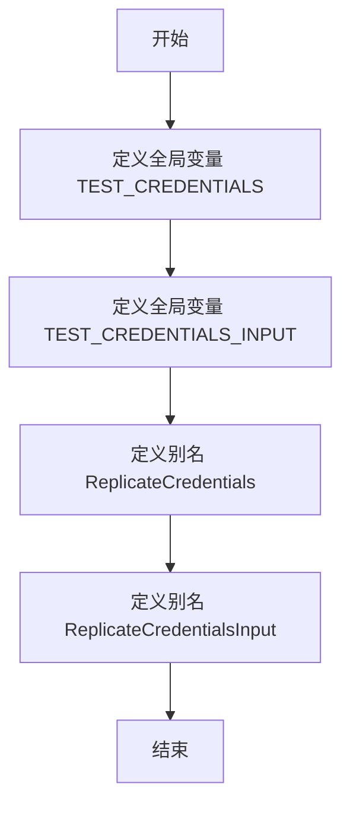

# `.\AutoGPT\autogpt_platform\backend\backend\blocks\replicate\_auth.py` 详细设计文档

This code defines a set of credentials for a third-party service provider, Replicate, using the pydantic library for data validation and type safety.

## 整体流程



## 类结构

```
APIKeyCredentials (类)
├── CredentialsMetaInput (类)
│   └── Literal (类型)
```

## 全局变量及字段


### `TEST_CREDENTIALS`
    
A test API key credentials object for the Replicate provider.

类型：`APIKeyCredentials`
    


### `TEST_CREDENTIALS_INPUT`
    
A dictionary containing the input data for the test API key credentials.

类型：`dict`
    


### `ReplicateCredentials`
    
A class representing API key credentials for the Replicate provider.

类型：`APIKeyCredentials`
    


### `ReplicateCredentialsInput`
    
A type alias for the input data structure for Replicate API key credentials.

类型：`CredentialsMetaInput[Literal[ProviderName.REPLICATE], Literal["api_key"]]`
    


### `APIKeyCredentials.id`
    
The unique identifier for the API key credentials.

类型：`str`
    


### `APIKeyCredentials.provider`
    
The provider of the API key credentials.

类型：`str`
    


### `APIKeyCredentials.api_key`
    
The secret API key for the credentials.

类型：`SecretStr`
    


### `APIKeyCredentials.title`
    
The title or description of the API key credentials.

类型：`str`
    


### `APIKeyCredentials.expires_at`
    
The expiration date for the API key credentials, if any.

类型：`Optional[datetime]`
    
    

## 全局函数及方法


## 关键组件


### 张量索引与惰性加载

张量索引与惰性加载是用于高效处理大型数据集的机制，它允许在需要时才加载数据，从而减少内存消耗和提高性能。

### 反量化支持

反量化支持是针对量化计算的一种优化，它允许在量化过程中保留部分非量化数据，以保持计算精度。

### 量化策略

量化策略是用于将浮点数数据转换为低精度表示的方法，以减少模型大小和提高计算效率。


## 问题及建议


### 已知问题

-   **全局变量使用**：全局变量 `TEST_CREDENTIALS` 和 `TEST_CREDENTIALS_INPUT` 在代码中被定义，但它们的作用域可能过于广泛，这可能导致潜在的命名冲突或难以追踪。
-   **类型重复**：`TEST_CREDENTIALS.type` 和 `TEST_CREDENTIALS_INPUT["type"]` 的值相同，但类型声明不一致，这可能导致混淆。
-   **代码重复**：`ReplicateCredentials` 和 `ReplicateCredentialsInput` 的定义重复了 `APIKeyCredentials` 和 `CredentialsMetaInput` 的引用，这可能导致维护困难。

### 优化建议

-   **限制全局变量作用域**：将全局变量 `TEST_CREDENTIALS` 和 `TEST_CREDENTIALS_INPUT` 的定义限制在它们使用的函数或模块中，以减少命名冲突的风险。
-   **统一类型声明**：确保 `TEST_CREDENTIALS.type` 和 `TEST_CREDENTIALS_INPUT["type"]` 的类型声明一致，以避免混淆。
-   **减少代码重复**：将 `APIKeyCredentials` 和 `CredentialsMetaInput` 的引用提取到单独的变量中，以减少代码重复并提高可维护性。
-   **使用类型注解**：确保所有类型注解都是一致的，并且与实际的类型匹配，这有助于静态类型检查工具发现潜在的错误。
-   **文档化**：为代码添加适当的文档注释，解释全局变量和类的用途，以便其他开发者更容易理解代码的目的和功能。


## 其它


### 设计目标与约束

- 设计目标：确保API密钥的安全存储和有效使用，同时提供清晰的接口供其他模块调用。
- 约束：使用Pydantic库进行数据验证，确保输入数据的正确性和安全性。

### 错误处理与异常设计

- 异常处理：在数据验证和API调用过程中，捕获并处理可能的异常，如数据格式错误、API调用失败等。
- 错误返回：对于异常情况，返回清晰的错误信息，便于调用者定位问题。

### 数据流与状态机

- 数据流：从外部输入到内部处理，再到外部输出的数据流。
- 状态机：无状态设计，所有操作均为即时处理，无状态转换。

### 外部依赖与接口契约

- 外部依赖：Pydantic库用于数据验证。
- 接口契约：通过APIKeyCredentials和CredentialsMetaInput定义接口契约，确保数据的一致性和安全性。

### 安全性与隐私

- 安全性：使用SecretStr存储API密钥，确保密钥的安全性。
- 隐私：不存储或泄露敏感信息。

### 测试与验证

- 测试：编写单元测试，确保代码的正确性和稳定性。
- 验证：通过代码审查和自动化测试验证代码质量。

### 维护与扩展性

- 维护：定期更新依赖库，修复已知问题。
- 扩展性：设计模块化代码，便于后续功能扩展。


    